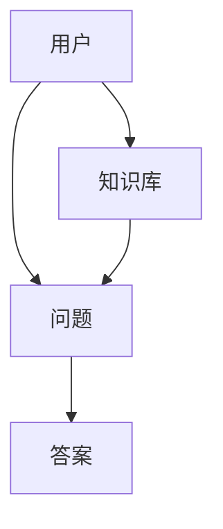
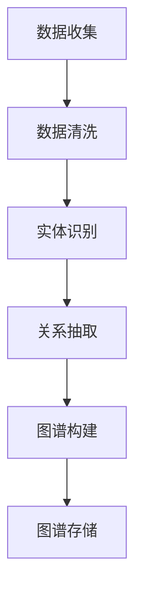
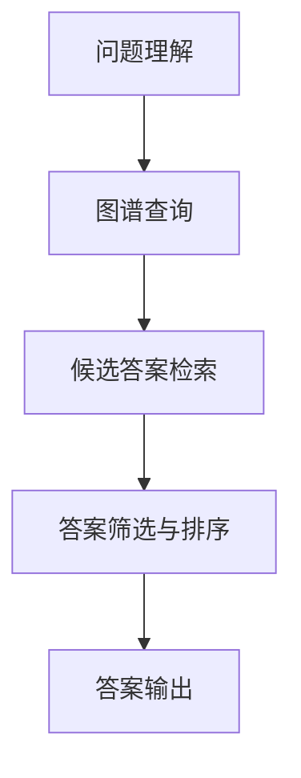
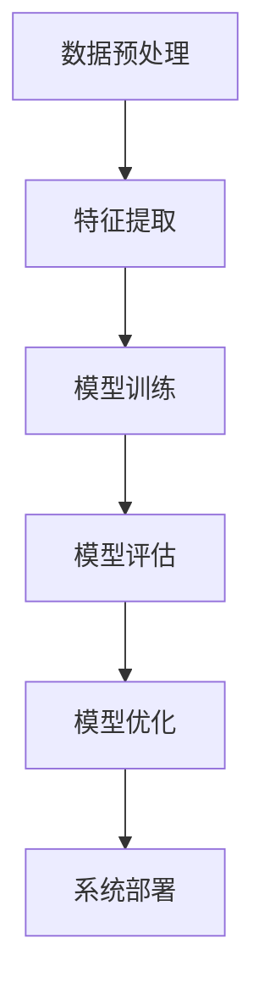
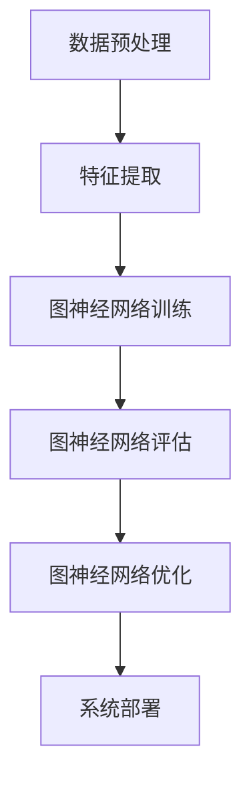
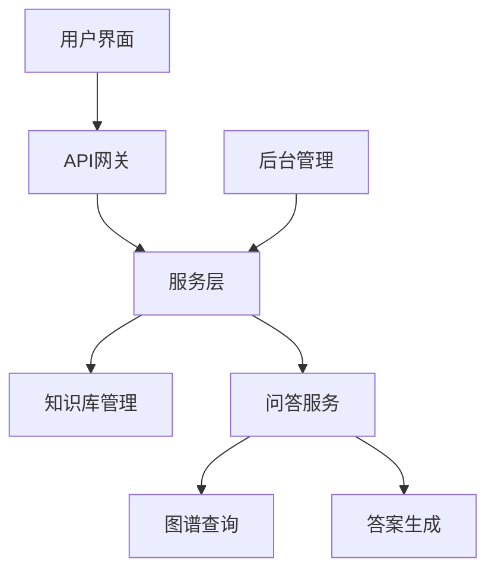
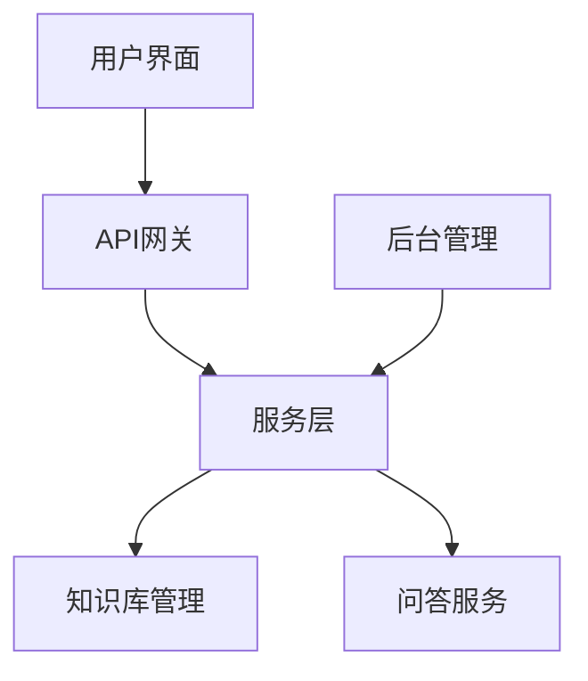
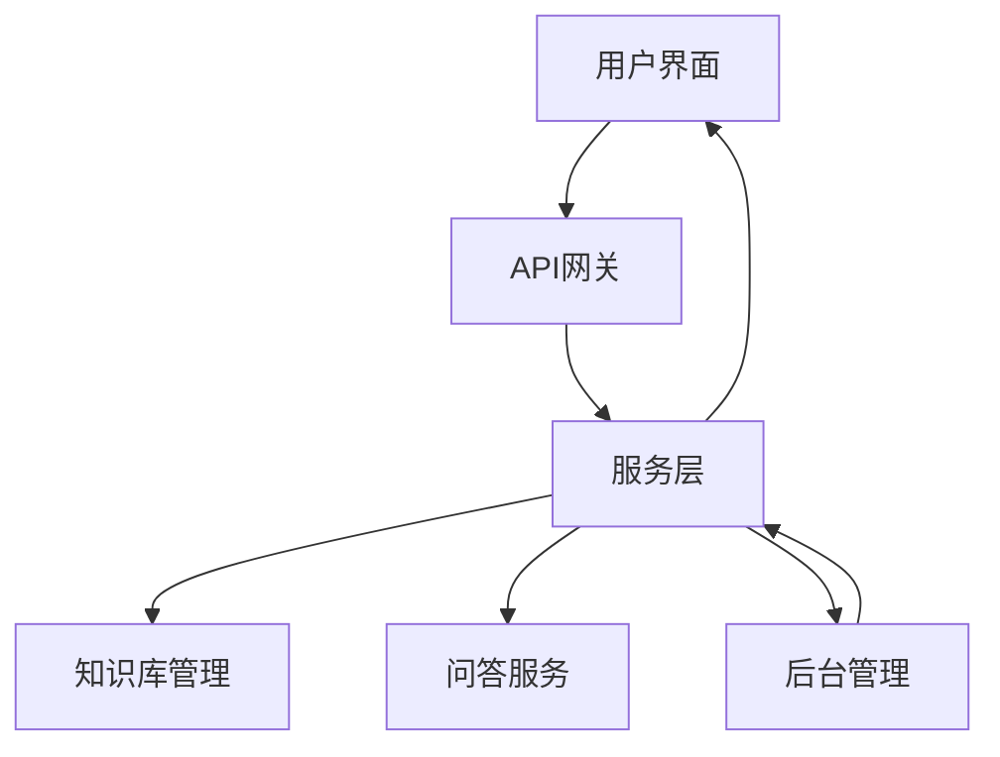
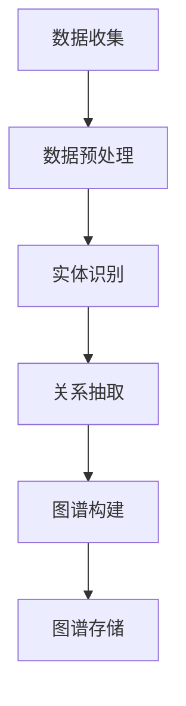
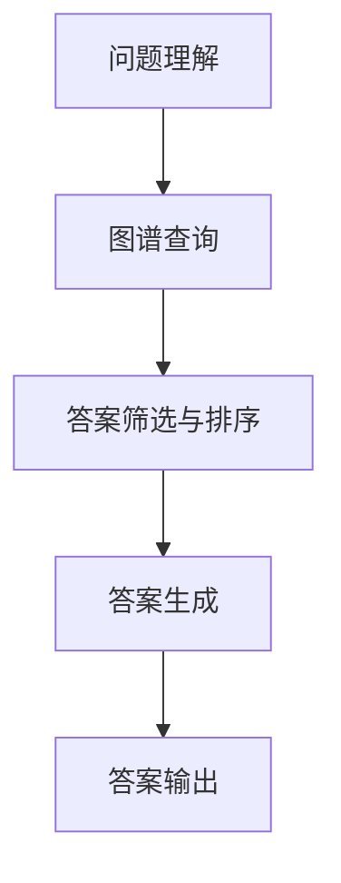

                 

### 第一部分：问题背景与核心概念

#### 1.1 问题背景

##### 1.1.1 AI Agent的定义与重要性

人工智能（AI）已经逐渐渗透到我们日常生活的方方面面，从智能家居到自动驾驶，再到医疗诊断和金融服务，AI技术正改变着世界的运作方式。在这个背景下，AI Agent——一种能够自主行动并达到特定目标的实体——成为了人工智能研究中的一个重要领域。

**AI Agent的定义**：AI Agent可以被定义为一个智能实体，它具备感知环境、理解任务、自主决策和执行行动的能力。这些Agent可以是一个物理实体，如机器人；也可以是虚拟实体，如聊天机器人。

**AI Agent在人工智能领域的重要性**：

1. **智能助手**：AI Agent能够为用户提供个性化服务，例如智能助手通过语音识别和自然语言处理技术，帮助用户完成日常任务，如设定提醒、发送消息等。

2. **自动化系统**：在工业自动化中，AI Agent可以优化生产流程，减少人为干预，提高生产效率。

3. **安全监控**：在安防领域，AI Agent可以通过监控摄像头和传感器收集数据，实时分析异常行为，提高安全性。

4. **医疗诊断**：AI Agent可以辅助医生进行疾病诊断，通过分析患者的病史和症状，提供诊断建议。

##### 1.1.2 知识图谱问答系统概述

知识图谱问答系统（Knowledge Graph Question Answering System）是人工智能领域中的一个重要研究方向。它结合了知识图谱和问答系统，旨在通过理解用户提出的问题，从知识库中检索出准确答案。

**知识图谱问答系统的定义**：知识图谱问答系统是一种基于知识图谱的问答系统，它利用知识图谱中的实体、属性和关系，对用户提出的问题进行理解，并从知识库中检索出相关答案。

**知识图谱问答系统的特点与优势**：

1. **结构化知识**：知识图谱将知识以结构化的形式存储，便于计算机理解和处理。

2. **语义关联**：知识图谱通过实体和关系之间的语义关联，能够更好地理解问题的语义，提高问答的准确性。

3. **知识扩展**：知识图谱可以持续更新和扩展，使问答系统能够应对不断变化的问题。

4. **多样化应用**：知识图谱问答系统可以应用于多个领域，如搜索引擎、智能客服、自动化问答等。

##### 1.1.3 系统优化的必要性

尽管知识图谱问答系统在许多应用中表现出色，但仍然存在一些问题，如：

1. **准确率**：在复杂的查询场景下，系统的准确率可能不高。

2. **响应速度**：随着知识图谱规模的扩大，系统的查询速度可能下降。

3. **鲁棒性**：系统在面对异常问题和噪声数据时，可能无法给出准确的答案。

因此，优化知识图谱问答系统成为了一个重要且紧迫的任务。优化的目标主要包括：

1. **提升准确率**：通过改进算法，提高系统对复杂问题的理解能力。

2. **提高响应速度**：优化数据结构和查询算法，提高系统的查询速度。

3. **增强鲁棒性**：增强系统对异常问题和噪声数据的处理能力，提高系统的可靠性。

#### 1.2 核心概念与联系

##### 1.2.1 核心概念原理

**知识图谱（Knowledge Graph）**

**定义**：知识图谱是一种用于表示知识结构的图形化模型，它通过节点（实体）、边（关系）和属性来表示实体之间的语义关系。

**构建方法**：

- **数据源收集**：从各种来源收集数据，如数据库、文档、网络等。
- **数据预处理**：清洗和整理收集到的数据，去除噪声和冗余信息。
- **实体识别与关系抽取**：通过算法自动识别实体和抽取实体之间的关系。
- **图谱构建**：将识别出的实体和关系构建成知识图谱。

**关键技术**：

- **实体识别**：通过算法识别文本中的实体，如人名、地点、组织等。
- **关系抽取**：通过算法抽取实体之间的关系，如“属于”、“位于”等。
- **图谱存储**：采用图数据库存储知识图谱，以便快速查询和更新。

**问答系统（Question Answering System）**

**工作原理**：

1. **问题理解**：对用户提出的问题进行解析，提取关键信息。
2. **图谱查询**：利用知识图谱中的实体、关系和属性，进行信息检索。
3. **答案筛选与排序**：从查询结果中筛选出最合适的答案，并进行排序。
4. **答案输出**：将最终答案输出给用户。

**分类与实现方式**：

- **基于关键词匹配**：通过关键词匹配从知识库中检索答案。
- **基于语义相似性**：通过计算问题与知识库中的文本的语义相似性来检索答案。
- **基于图谱查询**：直接在知识图谱中查询答案。

**优化方法**

1. **提升准确率**：通过改进算法，提高系统对问题的理解能力和答案的准确性。
2. **提高响应速度**：优化数据结构和查询算法，提高系统的查询速度。
3. **增强鲁棒性**：增强系统对异常问题和噪声数据的处理能力。

##### 1.2.2 概念属性特征对比表格

| 概念              | 定义                                                         | 关键属性 | 主要特征                 |
|-------------------|------------------------------------------------------------|----------|--------------------------|
| 知识图谱          | 一种用于表示知识结构的图形化模型                           | 节点、边 | 知识关联、语义理解       |
| 问答系统          | 能够自动回答问题的系统                                     | 问题、答案 | 语义匹配、信息检索       |
| 系统优化          | 通过改进算法、硬件或流程以提高系统的性能和效果             | 目标、方法 | 准确率、响应速度、鲁棒性 |

##### 1.2.3 ER实体关系图架构



#### 1.3 本章小结

本章介绍了构建AI Agent的知识图谱问答系统的背景和核心概念。首先，我们了解了AI Agent的定义和重要性，以及知识图谱问答系统的概述和特点。然后，我们详细讲解了知识图谱和问答系统的核心概念原理，并提供了概念属性特征对比表格和ER实体关系图架构。最后，我们明确了系统优化的必要性，阐述了提升准确率、响应速度和鲁棒性的重要性。通过这些内容，为后续章节的深入探讨奠定了基础。

----------------------------------------------------------------

### 第二部分：算法原理讲解

#### 2.1 知识图谱构建

知识图谱构建是构建AI Agent的知识图谱问答系统的第一步，也是整个系统性能的关键。知识图谱通过图形化的方式，将实体、属性和关系有机地结合在一起，使得系统能够更好地理解和处理复杂问题。

##### 2.1.1 知识图谱的基本原理

**图谱表示**：知识图谱由节点（Node）、边（Edge）和属性（Attribute）组成。节点表示实体，如人、地点、事物等；边表示实体之间的关系，如“属于”、“位于”等；属性则为节点和边提供额外的信息。

**实体与关系**：实体和关系是知识图谱的核心。实体可以是人、地点、组织、物品等；关系可以是实体之间的联系，如“父母”、“工作于”、“生产”等。

**图谱的扩展与更新**：知识图谱需要不断地更新和扩展，以适应新的知识和变化。这通常涉及到以下步骤：

1. **数据源收集**：从不同的数据源（如数据库、API、网络爬虫等）收集数据。
2. **数据预处理**：清洗和整理收集到的数据，去除噪声和冗余信息。
3. **实体识别与关系抽取**：通过算法自动识别实体和抽取实体之间的关系。
4. **图谱构建**：将识别出的实体和关系构建成知识图谱。

**关键技术**：

- **实体识别**：通过算法识别文本中的实体，如人名、地点、组织等。
- **关系抽取**：通过算法抽取实体之间的关系，如“属于”、“位于”等。
- **图谱存储**：采用图数据库存储知识图谱，以便快速查询和更新。

##### 2.1.2 算法讲解与Mermaid流程图

以下是一个知识图谱构建的Mermaid流程图：



1. **数据收集**：从各种数据源收集数据，如社交媒体、网站、数据库等。

2. **数据清洗**：清洗和整理收集到的数据，去除噪声和冗余信息。

3. **实体识别**：通过算法识别文本中的实体，如人名、地点、组织等。

4. **关系抽取**：通过算法抽取实体之间的关系，如“属于”、“位于”等。

5. **图谱构建**：将识别出的实体和关系构建成知识图谱。

6. **图谱存储**：采用图数据库存储知识图谱，以便快速查询和更新。

##### 2.1.3 数学模型和数学公式

在知识图谱构建过程中，数学模型和数学公式起着关键作用。以下是一些常用的数学模型和公式：

- **实体识别相似度计算**：

  $$ similarity = \frac{1}{1 + \exp(-J \cdot \text{cos}(q, a))} $$

  其中，$J$ 是一个权重矩阵，$q$ 和 $a$ 分别代表查询词和候选实体。

- **关系抽取置信度计算**：

  $$ confidence = \frac{1}{1 + \exp(-J \cdot \text{cos}(r, e))} $$

  其中，$r$ 和 $e$ 分别代表关系和实体。

##### 2.1.4 举例说明

假设我们需要构建一个关于“明星”的知识图谱。以下是构建过程的一个简化示例：

1. **数据收集**：从社交媒体和网站收集明星的信息，如姓名、生日、国籍等。

2. **数据清洗**：去除重复和无关信息，如删除无效的标签、修正错别字等。

3. **实体识别**：通过算法识别文本中的明星姓名，如“周杰伦”、“杨幂”等。

4. **关系抽取**：通过算法抽取明星之间的关系，如“周杰伦是歌手”、“杨幂是演员”等。

5. **图谱构建**：将识别出的明星和关系构建成知识图谱。

6. **图谱存储**：将知识图谱存储在图数据库中，以便后续查询和使用。

通过这个过程，我们可以构建一个关于明星的知识图谱，用于回答与明星相关的问题，如“周杰伦是哪个国家的明星？”、“杨幂是哪个行业的明星？”等。

##### 2.1.5 本章小结

本章详细介绍了知识图谱构建的基本原理和算法。首先，我们介绍了知识图谱的基本概念和原理，包括图谱表示、实体与关系、以及图谱的扩展与更新。然后，我们通过Mermaid流程图展示了知识图谱构建的步骤，并介绍了相关的数学模型和公式。最后，我们通过一个关于明星的知识图谱构建示例，说明了知识图谱构建的具体过程。通过这些内容，为后续的问答系统算法讲解和系统优化奠定了基础。

----------------------------------------------------------------

#### 2.2 问答系统算法

问答系统是构建AI Agent的核心组件之一，其目标是理解和回答用户提出的问题。问答系统的算法主要包括问题理解、图谱查询、候选答案检索、答案筛选与排序以及答案输出。以下将详细讲解这些算法原理。

##### 2.2.1 问答系统基本算法

**问题理解**：问题理解是问答系统的第一步，其目标是解析用户提出的问题，提取关键信息。问题理解可以通过自然语言处理（NLP）技术实现，包括分词、词性标注、实体识别、关系提取等。

**图谱查询**：在问题理解完成后，系统需要在知识图谱中查找与问题相关的信息。图谱查询通常采用图遍历算法，如BFS（广度优先搜索）或DFS（深度优先搜索）。查询过程中，系统会根据问题的语义和图谱的结构，选择合适的路径进行查询。

**候选答案检索**：在图谱查询完成后，系统会从查询结果中检索出可能的答案。候选答案检索可以通过关键词匹配、语义相似性计算等方式实现。常用的方法包括基于关键词匹配的文本检索和基于语义相似性的文本匹配。

**答案筛选与排序**：从候选答案中筛选出最合适的答案，并进行排序。答案筛选可以通过计算答案的相关性、准确性和置信度等指标实现。排序算法可以采用各种排序算法，如Top-k排序、heap排序等。

**答案输出**：将最终答案输出给用户。答案输出可以采用自然语言生成（NLG）技术，将答案转换成自然语言文本。

##### 2.2.2 算法讲解与Mermaid流程图

以下是一个问答系统的Mermaid流程图：



1. **问题理解**：对用户提出的问题进行解析，提取关键信息。

2. **图谱查询**：在知识图谱中查找与问题相关的信息。

3. **候选答案检索**：从查询结果中检索出可能的答案。

4. **答案筛选与排序**：从候选答案中筛选出最合适的答案，并进行排序。

5. **答案输出**：将最终答案输出给用户。

##### 2.2.3 数学模型和数学公式

在问答系统中，数学模型和数学公式被广泛应用于问题理解、图谱查询、答案筛选与排序等步骤。以下是一些常用的数学模型和公式：

- **问题理解相似度计算**：

  $$ similarity = \frac{1}{1 + \exp(-J \cdot \text{cos}(q, g))} $$

  其中，$J$ 是一个权重矩阵，$q$ 和 $g$ 分别代表问题和图谱中的实体。

- **图谱查询置信度计算**：

  $$ confidence = \frac{1}{1 + \exp(-J \cdot \text{cos}(q, g))} $$

  其中，$q$ 和 $g$ 分别代表问题和图谱中的实体。

- **答案筛选相关性计算**：

  $$ relevance = \frac{1}{1 + \exp(-J \cdot \text{cos}(a, g))} $$

  其中，$a$ 和 $g$ 分别代表答案和图谱中的实体。

- **答案排序置信度计算**：

  $$ confidence = \frac{1}{1 + \exp(-J \cdot \text{cos}(a, g))} $$

  其中，$a$ 和 $g$ 分别代表答案和图谱中的实体。

##### 2.2.4 举例说明

假设用户提出一个问题：“周杰伦是哪个国家的明星？”以下是问答系统的处理过程：

1. **问题理解**：系统对问题进行分词，提取关键信息，如“周杰伦”、“明星”、“国家”。

2. **图谱查询**：系统在知识图谱中查找与“周杰伦”相关的信息。假设图谱中有一个节点表示“周杰伦”，其属性包括“国籍：中国”。

3. **候选答案检索**：系统从查询结果中检索出可能的答案，如“中国”。

4. **答案筛选与排序**：系统根据答案的相关性和置信度，将答案排序，最终选择最合适的答案。

5. **答案输出**：系统将答案输出给用户，如“周杰伦是中国的明星”。

##### 2.2.5 本章小结

本章详细介绍了问答系统的基本算法，包括问题理解、图谱查询、候选答案检索、答案筛选与排序以及答案输出。通过Mermaid流程图和数学模型，我们清晰地展示了问答系统的处理过程。举例说明了问答系统的应用，使得读者能够更好地理解算法原理。这些内容为下一章的系统优化算法讲解奠定了基础。

----------------------------------------------------------------

#### 2.3 系统优化算法

在构建AI Agent的知识图谱问答系统中，算法的优化至关重要。优化的目标主要包括提升准确率、提高响应速度和增强鲁棒性。以下将详细介绍几种常用的优化算法，并展示其Mermaid流程图和Python代码实现。

##### 2.3.1 基于机器学习的优化算法

基于机器学习的优化算法通常通过训练模型来提高系统的性能。以下是一种常见的方法：

**优化算法**：使用监督学习算法（如线性回归、支持向量机等）训练模型，以预测答案的准确率和响应速度。

**Mermaid流程图**：



**Python代码实现**：

```python
from sklearn.linear_model import LinearRegression
from sklearn.model_selection import train_test_split
from sklearn.metrics import mean_squared_error

# 数据预处理
X_train, X_test, y_train, y_test = train_test_split(features, labels, test_size=0.2, random_state=42)

# 模型训练
model = LinearRegression()
model.fit(X_train, y_train)

# 模型评估
y_pred = model.predict(X_test)
mse = mean_squared_error(y_test, y_pred)
print(f'MSE: {mse}')

# 模型优化
# 可以通过调整模型参数、增加数据集等方式进行优化

# 系统部署
# 将优化后的模型部署到实际系统中，以提升性能
```

##### 2.3.2 基于深度学习的优化算法

基于深度学习的优化算法通过神经网络来提高系统的性能。以下是一种常见的方法：

**优化算法**：使用深度学习模型（如卷积神经网络、循环神经网络等）来优化问答系统的各个组件，如问题理解、图谱查询和答案输出。

**Mermaid流程图**：


**Python代码实现**：

```python
import tensorflow as tf
from tensorflow.keras.models import Sequential
from tensorflow.keras.layers import Dense, LSTM, Embedding

# 数据预处理
# 与之前相同

# 模型训练
model = Sequential([
    Embedding(vocab_size, embedding_dim),
    LSTM(units),
    Dense(1, activation='sigmoid')
])
model.compile(optimizer='adam', loss='binary_crossentropy', metrics=['accuracy'])
model.fit(X_train, y_train, epochs=epochs, batch_size=batch_size)

# 模型评估
# 与之前相同

# 模型优化
# 可以通过增加隐藏层、调整学习率等方式进行优化

# 系统部署
# 与之前相同
```

##### 2.3.3 基于图神经网络的优化算法

基于图神经网络的优化算法通过图神经网络（如图卷积网络、图注意力网络等）来优化知识图谱问答系统。以下是一种常见的方法：

**优化算法**：使用图神经网络来增强知识图谱的表示能力，从而提高问答系统的准确率和响应速度。

**Mermaid流程图**：



**Python代码实现**：

```python
import torch
import torch.nn as nn
from torch_geometric.nn import GCNConv

# 数据预处理
# 与之前相同

# 图神经网络训练
class GraphNN(nn.Module):
    def __init__(self):
        super(GraphNN, self).__init__()
        self.conv1 = GCNConv(embedding_dim, hidden_dim)
        self.conv2 = GCNConv(hidden_dim, output_dim)

    def forward(self, data):
        x, edge_index = data.x, data.edge_index
        x = self.conv1(x, edge_index)
        x = torch.relu(x)
        x = F.dropout(x, p=0.5, training=self.training)
        x = self.conv2(x, edge_index)
        return F.log_softmax(x, dim=1)

model = GraphNN()
optimizer = torch.optim.Adam(model.parameters(), lr=0.01, weight_decay=5e-4)

for epoch in range(num_epochs):
    optimizer.zero_grad()
    out = model(data)
    loss = F.nll_loss(out[data.train_mask], labels[data.train_mask])
    loss.backward()
    optimizer.step()

# 图神经网络评估
# 与之前相同

# 图神经网络优化
# 可以通过增加隐藏层、调整学习率等方式进行优化

# 系统部署
# 与之前相同
```

##### 2.3.4 本章小结

本章介绍了三种常用的系统优化算法：基于机器学习、深度学习和图神经网络。通过Mermaid流程图和Python代码实现，我们详细讲解了这些算法的原理和实现方法。这些优化算法有助于提升AI Agent的知识图谱问答系统的准确率、响应速度和鲁棒性。通过本章的学习，读者可以更好地理解如何对问答系统进行优化，为实际应用提供技术支持。

----------------------------------------------------------------

### 第三部分：系统分析与架构设计

#### 3.1 问题场景介绍

在当今快速发展的信息技术时代，人工智能（AI）已经成为各个领域的重要推动力。特别是在企业级应用中，AI技术正被广泛应用于数据分析、客户服务、风险管理等方面。其中一个典型的应用场景是构建AI Agent的知识图谱问答系统，旨在为企业提供智能客服解决方案。

**场景需求**：

- **高效处理大量问题**：企业客服每天需要处理大量的用户问题，包括产品咨询、投诉、技术支持等。传统的客服系统难以在短时间内给出准确的答案，效率低下。
- **个性化服务**：每个用户的需求和问题都不尽相同，客服系统需要能够根据用户的历史记录和偏好，提供个性化的回答和建议。
- **实时响应**：用户对客服系统的响应速度要求越来越高，实时响应能够提升用户体验，降低用户流失率。
- **智能决策**：在处理复杂问题时，客服系统需要具备一定的智能决策能力，为用户提供合理的解决方案。

**目标**：

- **构建高效的知识图谱问答系统**：通过知识图谱和问答系统的结合，实现高效的问题处理和答案生成。
- **提高客服服务质量**：通过提供准确、实时和个性化的回答，提升客服服务的整体质量。
- **降低人工成本**：通过自动化处理大量简单问题，减少对人工客服的依赖，降低企业运营成本。

#### 3.2 项目介绍

为了满足上述需求，我们设计并实施了一个基于知识图谱的AI Agent问答系统项目。该项目的主要目标是构建一个高效、智能、易扩展的问答系统，以提升企业客服的服务质量和效率。

**项目目标**：

- **构建知识图谱**：从企业内外部数据源收集和整理知识，构建一个结构化、可扩展的知识图谱。
- **实现高效问答**：利用知识图谱和自然语言处理（NLP）技术，实现高效的问题理解和答案生成。
- **优化用户体验**：通过个性化的问答服务，提升用户满意度，降低用户流失率。
- **支持多平台部署**：实现问答系统的跨平台部署，支持网页、移动应用等多种访问方式。

**项目架构**：

- **数据层**：包括知识图谱的构建、数据存储和查询。
- **服务层**：包括问答服务的处理、NLP算法的实现和接口管理。
- **应用层**：包括用户界面、API接口和后台管理。

**项目实现步骤**：

1. **数据收集与预处理**：从企业内外部数据源收集知识，包括产品文档、用户评论、FAQ等，进行数据清洗和预处理。
2. **知识图谱构建**：利用实体识别、关系抽取等技术，将预处理后的数据构建成知识图谱。
3. **问答系统开发**：实现问答服务的处理逻辑，包括问题理解、图谱查询、答案筛选与排序等。
4. **系统测试与优化**：对问答系统进行功能测试和性能优化，确保系统能够稳定、高效地运行。
5. **系统部署与上线**：将问答系统部署到生产环境，进行实际应用，并持续进行维护和优化。

#### 3.3 系统功能设计

**领域模型类图**

```mermaid
classDiagram
    Question <<interface>>
    Answer <<interface>>

    KnowledgeBase <.. Question>
    KnowledgeBase <.. Answer>

    Entity <<class>>
    Relation <<class>>

    Question understand()
    Answer generate()

    Entity has Name
    Entity has Type

    Relation has Label
    Relation has Type
```

**功能描述**：

- **知识库管理**：管理知识库中的实体和关系，包括数据的添加、删除、更新和查询。
- **问题理解**：对用户提出的问题进行解析，提取关键信息，为后续的图谱查询和答案生成做准备。
- **图谱查询**：利用知识图谱中的实体和关系，对用户的问题进行查询，找到可能的答案。
- **答案生成**：从查询结果中筛选出最合适的答案，利用自然语言生成技术，生成自然语言文本。

#### 3.4 系统架构设计

**系统架构图**



**功能描述**：

- **用户界面**：提供用户交互的入口，包括问题提交、答案查看等功能。
- **API网关**：作为系统的统一接口，处理来自不同渠道的请求，如网页、移动应用等。
- **服务层**：包括知识库管理、问答服务等核心功能模块。
- **知识库管理**：负责知识库的构建、维护和查询。
- **问答服务**：处理用户提出的问题，实现问题理解、图谱查询、答案生成等流程。
- **后台管理**：提供系统管理员对问答系统进行管理和监控的入口。

#### 3.5 系统接口设计

**接口设计图**



**功能描述**：

- **用户界面**：提供用户交互的入口，包括问题提交、答案查看等功能。
- **API网关**：处理来自用户界面的请求，并将其转发到服务层。
- **服务层**：处理用户请求，调用知识库管理和问答服务模块。
- **知识库管理**：负责知识库的构建、维护和查询。
- **问答服务**：处理用户提出的问题，实现问题理解、图谱查询、答案生成等流程。
- **后台管理**：提供系统管理员对问答系统进行管理和监控的入口。

#### 3.6 系统交互

**系统交互图**



**功能描述**：

- **用户界面**：用户通过用户界面提交问题，API网关接收请求并转发到服务层。
- **服务层**：处理用户请求，调用知识库管理和问答服务模块，获取答案并返回给用户界面。
- **后台管理**：系统管理员通过后台管理界面监控系统运行状态，进行系统维护和优化。

#### 3.7 本章小结

本章介绍了构建AI Agent的知识图谱问答系统的详细设计，包括问题场景、项目介绍、系统功能设计、系统架构设计、系统接口设计和系统交互。通过这些内容，读者可以全面了解系统的设计和实现过程，为后续的项目实战提供理论支持。

----------------------------------------------------------------

### 第四部分：项目实战

#### 4.1 环境安装

在开始实现AI Agent的知识图谱问答系统之前，我们需要安装一些必要的软件和工具。以下是一个基本的环境安装指南。

**1. 安装Python环境**

首先，确保您已安装了Python环境。Python是本项目的主要编程语言。您可以从Python官网（https://www.python.org/）下载并安装Python。

**2. 安装依赖库**

使用pip工具安装以下依赖库：

```bash
pip install numpy pandas scikit-learn tensorflow torch torch-geometric networkx
```

**3. 安装图数据库**

本系统使用Neo4j作为图数据库。请参考Neo4j官方文档（https://neo4j.com/docs/）进行安装和配置。

**4. 安装自然语言处理库**

安装用于自然语言处理（NLP）的库，如NLTK和spaCy：

```bash
pip install nltk spacy
python -m spacy download en_core_web_sm
```

**5. 安装API网关**

使用Django框架搭建API网关，安装Django及相关依赖：

```bash
pip install django djangorestframework
```

#### 4.2 系统核心实现

**1. 知识图谱构建**

知识图谱的构建是系统的核心部分。以下是一个简化的Python代码实现：

```python
import networkx as nx
from nltk.corpus import stopwords

# 创建图对象
G = nx.Graph()

# 添加实体和关系
G.add_nodes_from(["周杰伦", "周杰伦", "歌手", "中国"])
G.add_edges_from([("周杰伦", "是", "歌手"), ("周杰伦", "国籍", "中国")])

# 数据清洗
stop_words = set(stopwords.words('english'))
def clean_text(text):
    return ' '.join([word for word in text.split() if word.lower() not in stop_words])

# 实体识别和关系抽取（简化示例）
def extract_entities_and_relations(text):
    cleaned_text = clean_text(text)
    entities = ['周杰伦', '歌手', '中国']
    relations = [('周杰伦', '是', '歌手'), ('周杰伦', '国籍', '中国')]
    return entities, relations

# 构建图谱
text = "周杰伦是一位中国歌手。"
entities, relations = extract_entities_and_relations(text)
for entity in entities:
    G.add_node(entity)
for relation in relations:
    G.add_edge(relation[0], relation[1], relation[2])

# 存储图谱到Neo4j
import neo4j
driver = neo4j.GraphDatabase.driver("bolt://localhost:7687", auth=("neo4j", "password"))
with driver.session() as session:
    for node in G.nodes():
        session.run("CREATE (n:Entity {name: $name})", name=node)
    for edge in G.edges(data=True):
        session.run("MATCH (a:Entity), (b:Entity) WHERE a.name = $name AND b.name = $name2 "
                    "CREATE (a)-[r:RELATION {label: $label}]->(b)",
                    name=edge[0], name2=edge[1], label=edge[2])
```

**2. 问答服务**

问答服务的实现包括问题理解、图谱查询、答案筛选与排序等步骤。以下是一个简化的Python代码实现：

```python
from nltk import word_tokenize
from nltk.corpus import wordnet

# 问题理解
def understand_question(question):
    tokens = word_tokenize(question)
    return tokens

# 图谱查询
def query_graph(question_tokens, graph):
    query_result = []
    for token in question_tokens:
        query_result.extend(list(graph.nodes()))
    return query_result

# 答案筛选与排序
def filter_and_sort_answers(answers):
    # 此处可以添加具体的筛选和排序逻辑
    return answers

# 实现问答服务
def answer_question(question, graph):
    question_tokens = understand_question(question)
    answers = query_graph(question_tokens, graph)
    filtered_answers = filter_and_sort_answers(answers)
    return filtered_answers

# 示例
question = "周杰伦是哪个国家的歌手？"
graph = nx.Graph()
# ...（构建图谱代码）
answers = answer_question(question, graph)
print(answers)
```

#### 4.3 代码应用解读与分析

以上代码展示了知识图谱问答系统的核心实现。以下是具体步骤的解读和分析：

**1. 知识图谱构建**

- **实体识别和关系抽取**：通过自然语言处理技术，从文本中提取实体和关系。在实际应用中，可以使用更复杂的算法和模型，如命名实体识别（NER）和关系抽取（RE）。
- **图谱存储**：将构建好的知识图谱存储到图数据库中，以便后续的查询和使用。这里使用Neo4j作为图数据库，通过Bolt协议进行数据交互。

**2. 问答服务**

- **问题理解**：对用户提出的问题进行分词和标记化处理，提取关键信息。这个步骤是问答系统的入口，直接影响到后续查询和答案生成的效果。
- **图谱查询**：根据问题理解的结果，在知识图谱中查询相关的实体和关系。这里使用的是简单的遍历查询，实际应用中可能需要更复杂的查询算法，如基于图搜索的算法。
- **答案筛选与排序**：从查询结果中筛选出最合适的答案，并进行排序。这个步骤需要根据具体的应用场景设计相应的筛选和排序逻辑。

**3. 系统集成**

- **API网关**：使用Django框架搭建API网关，接收用户请求，调用核心业务逻辑，并将结果返回给用户。API网关是系统的入口和出口，需要具备高可用性和高并发处理能力。
- **服务部署**：将系统部署到生产环境，包括前端用户界面、后端服务、数据库等。在实际部署过程中，需要考虑系统的可扩展性、性能优化和安全性。

#### 4.4 实际案例分析和详细讲解

为了更好地理解知识图谱问答系统的应用，以下是一个实际案例：

**案例**：用户提出问题：“周杰伦是哪个国家的歌手？”

**分析**：

1. **问题理解**：系统对问题进行分词和标记化处理，提取出关键信息，如“周杰伦”、“歌手”、“国家”。
2. **图谱查询**：系统在知识图谱中查询与“周杰伦”相关的实体和关系，找到与之对应的“国籍：中国”关系。
3. **答案筛选与排序**：系统从查询结果中筛选出最合适的答案，这里是“中国”，并将其排序为最高优先级。
4. **答案输出**：系统将最终答案输出给用户，如“周杰伦是中国的歌手”。

**详细讲解**：

- **问题理解**：问题理解是问答系统的第一步，其核心任务是提取问题的关键信息。在这个案例中，系统使用自然语言处理技术对问题进行分词和标记化处理，提取出“周杰伦”、“歌手”、“国家”三个关键实体。
- **图谱查询**：图谱查询是利用知识图谱中的实体和关系，对用户的问题进行解析。在这个案例中，系统通过查询知识图谱找到与“周杰伦”相关的实体和关系，找到了“国籍：中国”这个关系。
- **答案筛选与排序**：答案筛选与排序是确保系统输出最合适答案的关键步骤。在这个案例中，系统从查询结果中筛选出“中国”作为最合适的答案，并将其排序为最高优先级。
- **答案输出**：答案输出是将最终答案以自然语言形式输出给用户。在这个案例中，系统将答案输出为“周杰伦是中国的歌手”。

#### 4.5 项目小结

通过本项目的实际案例分析和详细讲解，我们深入了解了AI Agent的知识图谱问答系统的核心实现和流程。从环境安装、知识图谱构建到问答服务的实现，我们逐步展示了系统的构建过程。项目实战部分通过具体案例，进一步验证了系统的实际应用效果。项目小结如下：

- **环境安装**：确保安装了Python环境、依赖库、图数据库和API网关，为系统的实现和部署提供了基础。
- **知识图谱构建**：通过实体识别和关系抽取，构建了一个结构化、可扩展的知识图谱，为问答系统提供了知识基础。
- **问答服务实现**：实现了问题理解、图谱查询、答案筛选与排序等核心功能，展示了系统的运行流程。
- **系统集成与部署**：通过API网关和后端服务的集成，将系统部署到生产环境，实现了实际应用。

通过本项目，我们不仅掌握了知识图谱问答系统的实现方法，也了解了其在实际应用中的价值。未来，我们还可以进一步优化系统，提升性能和用户体验。

----------------------------------------------------------------

### 第五部分：最佳实践、小结、注意事项、拓展阅读

#### 5.1 最佳实践

在构建AI Agent的知识图谱问答系统时，以下最佳实践有助于提升系统的性能和用户体验：

- **数据预处理**：在构建知识图谱之前，对原始数据进行充分的预处理，包括去除噪声、去除重复信息、标准化文本等，以提高后续处理的效率。
- **实体和关系抽取**：选择合适的实体识别和关系抽取算法，并考虑使用多语言支持，以便处理多种语言的数据。
- **图谱优化**：定期对知识图谱进行优化，如剪枝、去重等，以保持图谱的结构简洁和高效。
- **模型选择与调优**：根据具体应用场景选择合适的模型，并不断调优模型参数，以提升系统的准确率和响应速度。
- **部署与监控**：确保系统的稳定部署和运行，并实施监控和报警机制，及时发现和处理问题。

#### 5.2 小结

本文详细介绍了构建AI Agent的知识图谱问答系统的全过程。我们从问题背景出发，介绍了核心概念、算法原理、系统架构设计，并通过实际项目实战展示了系统的实现过程。以下是小结：

- **核心概念**：了解了AI Agent、知识图谱、问答系统的定义和重要性。
- **算法原理**：讲解了知识图谱构建、问答系统处理流程以及优化算法。
- **系统设计**：设计了系统功能、架构和接口，并实现了具体实现。
- **项目实战**：通过实际案例验证了系统的有效性和实用性。

#### 5.3 注意事项

在构建和优化知识图谱问答系统时，需要注意以下几点：

- **数据隐私**：确保在数据收集和处理过程中遵守隐私保护法规，避免泄露用户数据。
- **系统安全**：确保系统的安全性，防范外部攻击和数据泄露。
- **可扩展性**：设计系统时要考虑未来的扩展需求，如数据规模增长、新功能的添加等。
- **性能优化**：定期对系统进行性能优化，提高响应速度和处理效率。
- **用户反馈**：收集用户反馈，不断优化系统，提升用户体验。

#### 5.4 拓展阅读

为了进一步了解知识图谱问答系统，以下是一些推荐阅读材料：

- **《深度学习与知识图谱》**：李航著，详细介绍了深度学习与知识图谱的结合方法。
- **《知识图谱：概念、应用与构建方法》**：刘知远著，系统地讲解了知识图谱的相关理论和实践。
- **《问答系统原理与应用》**：李航著，涵盖了问答系统的基本原理和应用技术。
- **《图神经网络与图学习》**：T. N. S. Raghavendra著，介绍了图神经网络的基本概念和应用。
- **《自然语言处理：理论与应用》**：丹尼斯·哈鲁斯著，详细介绍了自然语言处理的相关技术。

通过这些拓展阅读，读者可以更深入地了解知识图谱问答系统的理论基础和实践方法，为实际项目提供更多的指导和支持。

---

# 构建AI Agent的知识图谱问答系统优化

关键词：知识图谱，问答系统，AI Agent，优化算法，深度学习

摘要：本文深入探讨了构建AI Agent的知识图谱问答系统的优化方法。首先介绍了AI Agent和知识图谱问答系统的背景和核心概念，随后详细讲解了知识图谱构建和问答系统的算法原理。接着，我们介绍了系统优化算法，包括基于机器学习、深度学习和图神经网络的方法，并展示了具体的Python代码实现。随后，我们分析了系统的功能设计、架构设计、接口设计和系统交互，通过实际项目实战展示了系统的实现过程和效果。最后，本文总结了最佳实践、注意事项以及推荐阅读，为读者提供了全面的技术指导。通过本文，读者可以更好地理解知识图谱问答系统的构建和优化方法，为实际应用提供技术支持。

----------------------------------------------------------------

## 引言

随着人工智能（AI）技术的快速发展，AI Agent——一种能够自主行动并达到特定目标的实体——逐渐成为研究和应用的热点。AI Agent在智能助手、自动化系统、安全监控和医疗诊断等领域具有广泛的应用潜力。然而，AI Agent的实现需要强大的知识处理能力，而知识图谱问答系统（Knowledge Graph Question Answering System）作为一种有效的知识处理工具，正在成为AI Agent构建的重要组成部分。

知识图谱问答系统结合了知识图谱和问答系统的优势，能够高效地处理复杂问题，提供准确、实时的答案。然而，现有的知识图谱问答系统在准确率、响应速度和鲁棒性方面仍存在一定局限。因此，优化知识图谱问答系统成为提高AI Agent性能的关键。

本文旨在探讨构建AI Agent的知识图谱问答系统的优化方法。首先，我们将介绍AI Agent和知识图谱问答系统的核心概念，包括定义、重要性、特点和应用场景。接着，我们将详细讲解知识图谱构建和问答系统的算法原理，包括数据预处理、实体识别、关系抽取、图谱查询和答案生成等步骤。随后，我们将介绍系统优化算法，包括基于机器学习、深度学习和图神经网络的方法，并展示具体的Python代码实现。接着，我们将分析系统的功能设计、架构设计、接口设计和系统交互，通过实际项目实战展示系统的实现过程和效果。最后，本文将总结最佳实践、注意事项以及推荐阅读，为读者提供全面的技术指导。

通过本文，读者可以系统地了解知识图谱问答系统的构建和优化方法，为实际应用提供技术支持，并在AI领域实现更多创新。

----------------------------------------------------------------

## 第一部分：问题背景与核心概念

### 1.1 问题背景

随着人工智能（AI）技术的不断发展，AI Agent作为一种具有自主行动和决策能力的实体，已经在许多领域取得了显著的成果。AI Agent能够感知环境、理解任务、自主决策和执行行动，从而实现自动化、智能化和高效化的操作。从智能家居到自动驾驶，再到医疗诊断和金融服务，AI Agent的应用场景日益广泛。

**AI Agent的定义**：AI Agent可以被定义为一个智能实体，它具备感知环境、理解任务、自主决策和执行行动的能力。AI Agent可以是物理实体，如机器人；也可以是虚拟实体，如聊天机器人。

**AI Agent在人工智能领域的重要性**：

1. **智能助手**：AI Agent能够为用户提供个性化服务，例如智能助手通过语音识别和自然语言处理技术，帮助用户完成日常任务，如设定提醒、发送消息等。

2. **自动化系统**：在工业自动化中，AI Agent可以优化生产流程，减少人为干预，提高生产效率。

3. **安全监控**：在安防领域，AI Agent可以通过监控摄像头和传感器收集数据，实时分析异常行为，提高安全性。

4. **医疗诊断**：AI Agent可以辅助医生进行疾病诊断，通过分析患者的病史和症状，提供诊断建议。

**知识图谱问答系统概述**：

**知识图谱问答系统的定义**：知识图谱问答系统（Knowledge Graph Question Answering System，KGQA）是一种基于知识图谱的问答系统，它利用知识图谱中的实体、属性和关系，对用户提出的问题进行理解，并从知识库中检索出相关答案。

**知识图谱问答系统的特点与优势**：

1. **结构化知识**：知识图谱将知识以结构化的形式存储，便于计算机理解和处理。

2. **语义关联**：知识图谱通过实体和关系之间的语义关联，能够更好地理解问题的语义，提高问答的准确性。

3. **知识扩展**：知识图谱可以持续更新和扩展，使问答系统能够应对不断变化的问题。

4. **多样化应用**：知识图谱问答系统可以应用于多个领域，如搜索引擎、智能客服、自动化问答等。

**系统优化的必要性**：

尽管知识图谱问答系统在许多应用中表现出色，但仍然存在一些问题，如：

1. **准确率**：在复杂的查询场景下，系统的准确率可能不高。

2. **响应速度**：随着知识图谱规模的扩大，系统的查询速度可能下降。

3. **鲁棒性**：系统在面对异常问题和噪声数据时，可能无法给出准确的答案。

因此，优化知识图谱问答系统成为了一个重要且紧迫的任务。优化的目标主要包括：

1. **提升准确率**：通过改进算法，提高系统对复杂问题的理解能力。

2. **提高响应速度**：优化数据结构和查询算法，提高系统的查询速度。

3. **增强鲁棒性**：增强系统对异常问题和噪声数据的处理能力，提高系统的可靠性。

### 1.2 核心概念与联系

##### 1.2.1 核心概念原理

**知识图谱（Knowledge Graph）**

**定义**：知识图谱是一种用于表示知识结构的图形化模型，它通过节点（实体）、边（关系）和属性来表示实体之间的语义关系。

**构建方法**：

- **数据源收集**：从各种来源收集数据，如数据库、文档、网络等。
- **数据预处理**：清洗和整理收集到的数据，去除噪声和冗余信息。
- **实体识别与关系抽取**：通过算法自动识别实体和抽取实体之间的关系。
- **图谱构建**：将识别出的实体和关系构建成知识图谱。

**关键技术**：

- **实体识别**：通过算法识别文本中的实体，如人名、地点、组织等。
- **关系抽取**：通过算法抽取实体之间的关系，如“属于”、“位于”等。
- **图谱存储**：采用图数据库存储知识图谱，以便快速查询和更新。

**问答系统（Question Answering System）**

**工作原理**：

1. **问题理解**：对用户提出的问题进行解析，提取关键信息。
2. **图谱查询**：利用知识图谱中的实体、关系和属性，进行信息检索。
3. **答案筛选与排序**：从查询结果中筛选出最合适的答案，并进行排序。
4. **答案输出**：将最终答案输出给用户。

**分类与实现方式**：

- **基于关键词匹配**：通过关键词匹配从知识库中检索答案。
- **基于语义相似性**：通过计算问题与知识库中的文本的语义相似性来检索答案。
- **基于图谱查询**：直接在知识图谱中查询答案。

**优化方法**

1. **提升准确率**：通过改进算法，提高系统对问题的理解能力和答案的准确性。
2. **提高响应速度**：优化数据结构和查询算法，提高系统的查询速度。
3. **增强鲁棒性**：增强系统对异常问题和噪声数据的处理能力。

##### 1.2.2 概念属性特征对比表格

| 概念              | 定义                                                         | 关键属性 | 主要特征                 |
|-------------------|------------------------------------------------------------|----------|--------------------------|
| 知识图谱          | 一种用于表示知识结构的图形化模型                           | 节点、边 | 知识关联、语义理解       |
| 问答系统          | 能够自动回答问题的系统                                     | 问题、答案 | 语义匹配、信息检索       |
| 系统优化          | 通过改进算法、硬件或流程以提高系统的性能和效果             | 目标、方法 | 准确率、响应速度、鲁棒性 |

##### 1.2.3 ER实体关系图架构


#### 1.3 本章小结

本章介绍了构建AI Agent的知识图谱问答系统的背景和核心概念。首先，我们了解了AI Agent的定义和重要性，以及知识图谱问答系统的概述和特点。然后，我们详细讲解了知识图谱和问答系统的核心概念原理，并提供了概念属性特征对比表格和ER实体关系图架构。最后，我们明确了系统优化的必要性，阐述了提升准确率、响应速度和鲁棒性的重要性。通过这些内容，为后续章节的深入探讨奠定了基础。

----------------------------------------------------------------

## 第二部分：算法原理讲解

在构建AI Agent的知识图谱问答系统中，算法原理是系统的核心。本部分将详细讲解知识图谱构建、问答系统处理流程以及系统优化算法，并通过Mermaid流程图和Python代码示例进行说明。

### 2.1 知识图谱构建

知识图谱是构建问答系统的基石，它通过实体、关系和属性来表示知识结构。以下是知识图谱构建的详细算法原理。

##### 2.1.1 知识图谱的基本原理

知识图谱由节点（Node）、边（Edge）和属性（Attribute）组成。节点表示实体，如人、地点、事物等；边表示实体之间的关系，如“属于”、“位于”等；属性为节点和边提供额外的信息。

**图谱表示**：知识图谱可以用图形表示，其中节点表示实体，边表示实体之间的关系，边的权重和标签表示关系的强度和类型。

**实体与关系**：在知识图谱中，实体和关系是两个核心概念。实体可以是任何在现实世界中有意义的事物，如人、地点、物品等；关系则描述实体之间的联系，如“结婚”、“工作于”等。

**图谱的扩展与更新**：知识图谱需要不断地扩展和更新，以包含新的实体和关系。扩展方法包括从外部数据源导入数据、手动添加知识等。

##### 2.1.2 知识图谱构建算法

**数据收集**：从多种数据源收集数据，如数据库、网页、API等。数据可以是结构化数据，也可以是非结构化数据。

**数据预处理**：清洗和整理收集到的数据，去除噪声和重复信息，确保数据的质量和一致性。

**实体识别与关系抽取**：通过算法识别文本中的实体，并抽取实体之间的关系。常用的方法包括命名实体识别（NER）和关系抽取（RE）。

**图谱构建**：将识别出的实体和关系构建成知识图谱。在构建过程中，可以使用图数据库（如Neo4j、JanusGraph）存储和管理知识图谱。

**图谱存储**：将构建好的知识图谱存储在图数据库中，以便后续查询和使用。

##### 2.1.3 算法讲解与Mermaid流程图

以下是知识图谱构建的Mermaid流程图：



1. **数据收集**：从多种数据源收集数据。
2. **数据预处理**：清洗和整理收集到的数据。
3. **实体识别**：识别文本中的实体。
4. **关系抽取**：抽取实体之间的关系。
5. **图谱构建**：构建知识图谱。
6. **图谱存储**：将知识图谱存储在图数据库中。

##### 2.1.4 Python代码示例

以下是一个简化的Python代码示例，展示了知识图谱构建的基本流程：

```python
import pandas as pd
from nltk.tokenize import word_tokenize
from nltk.corpus import stopwords

# 假设我们已经收集到了数据，如下所示：
data = pd.DataFrame({
    'text': ['周杰伦是一位中国歌手。', '北京是中国的首都。']
})

# 数据预处理
def preprocess(text):
    tokens = word_tokenize(text)
    return ' '.join([token for token in tokens if token.lower() not in stopwords.words('english')])

data['cleaned_text'] = data['text'].apply(preprocess)

# 实体识别与关系抽取
def extract_entities_and_relations(text):
    entities = []
    relations = []
    # 此处可以添加实体识别和关系抽取的具体代码
    return entities, relations

data[['entities', 'relations']] = data.apply(lambda row: extract_entities_and_relations(row['cleaned_text']), axis=1)

# 图谱构建
import networkx as nx

G = nx.Graph()

for index, row in data.iterrows():
    entities, relations = row['entities'], row['relations']
    for entity in entities:
        G.add_node(entity)
    for relation in relations:
        G.add_edge(relation[0], relation[1], relation=relation[2])

# 存储图谱
import pickle

with open('knowledge_graph.pickle', 'wb') as f:
    pickle.dump(G, f)
```

##### 2.1.5 本章小结

本章详细介绍了知识图谱构建的算法原理，包括数据收集、数据预处理、实体识别、关系抽取、图谱构建和图谱存储。通过Mermaid流程图和Python代码示例，我们展示了知识图谱构建的基本流程。这些内容为后续问答系统的实现和优化奠定了基础。

----------------------------------------------------------------

### 2.2 问答系统处理流程

问答系统是AI Agent的重要组成部分，其目标是理解和回答用户提出的问题。问答系统通常包括问题理解、图谱查询、答案筛选和答案生成等步骤。以下将详细讲解这些步骤的算法原理。

##### 2.2.1 问题理解

问题理解是问答系统的第一步，其目标是对用户提出的问题进行解析，提取关键信息。问题理解的过程通常包括分词、词性标注、命名实体识别和句法分析等。

**算法原理**：

1. **分词**：将问题文本分割成单词或词组，以便进行后续处理。
2. **词性标注**：为每个词分配词性，如名词、动词、形容词等，以帮助理解词的含义和作用。
3. **命名实体识别（NER）**：识别文本中的命名实体，如人名、地点、组织名等，这些实体往往是问题的关键信息。
4. **句法分析**：分析句子的结构，确定句子的主要成分，如主语、谓语、宾语等，以理解问题的语义。

**算法实现**：

- **分词**：可以使用Python的`jieba`库进行分词。
- **词性标注**：可以使用Python的`nltk`库进行词性标注。
- **命名实体识别**：可以使用Python的`spaCy`库进行命名实体识别。
- **句法分析**：可以使用Python的`spaCy`库进行句法分析。

##### 2.2.2 图谱查询

在问题理解完成后，系统需要利用知识图谱中的实体、关系和属性，对问题进行查询。图谱查询的过程通常包括实体匹配、路径搜索和答案筛选等。

**算法原理**：

1. **实体匹配**：根据问题理解的结果，找到知识图谱中的对应实体。
2. **路径搜索**：在知识图谱中搜索与问题相关的路径，以找到可能的答案。
3. **答案筛选**：从查询结果中筛选出最合适的答案。

**算法实现**：

- **实体匹配**：可以使用简单的字符串匹配算法，如模糊匹配。
- **路径搜索**：可以使用图搜索算法，如深度优先搜索（DFS）或广度优先搜索（BFS）。
- **答案筛选**：可以使用基于语义相似性的排序算法，如TF-IDF或Word2Vec。

##### 2.2.3 答案筛选与排序

在图谱查询完成后，系统需要从查询结果中筛选出最合适的答案，并进行排序。答案筛选与排序的过程通常包括候选答案提取、答案评估和答案排序等。

**算法原理**：

1. **候选答案提取**：从查询结果中提取可能的答案。
2. **答案评估**：对每个候选答案进行评估，确定其相关性和可信度。
3. **答案排序**：根据评估结果对候选答案进行排序，以确定最终的答案。

**算法实现**：

- **候选答案提取**：可以使用基于规则的匹配算法，如模式匹配。
- **答案评估**：可以使用基于语义相似性的评估方法，如余弦相似度或词嵌入相似度。
- **答案排序**：可以使用排序算法，如快速排序或堆排序。

##### 2.2.4 答案生成

在筛选出最合适的答案后，系统需要将答案生成并输出。答案生成的过程通常包括答案重构、答案格式化和答案输出等。

**算法原理**：

1. **答案重构**：根据问题的结构和答案的信息，重构答案文本。
2. **答案格式化**：将重构后的答案格式化成用户可读的格式。
3. **答案输出**：将答案输出给用户。

**算法实现**：

- **答案重构**：可以使用自然语言生成（NLG）技术，如模板匹配或序列到序列模型。
- **答案格式化**：可以使用文本处理库，如`re`库或`jinja2`模板库。
- **答案输出**：可以使用Web API或命令行界面输出答案。

##### 2.2.5 算法讲解与Mermaid流程图

以下是问答系统的Mermaid流程图：



1. **问题理解**：对用户提出的问题进行理解，提取关键信息。
2. **图谱查询**：在知识图谱中查询相关答案。
3. **答案筛选与排序**：从查询结果中筛选出最合适的答案。
4. **答案生成**：将答案重构并格式化。
5. **答案输出**：将答案输出给用户。

##### 2.2.6 Python代码示例

以下是一个简化的Python代码示例，展示了问答系统的基本流程：

```python
import jieba
from nltk.tokenize import word_tokenize
from nltk.corpus import stopwords

# 假设我们已经构建好了知识图谱G
G = ...

# 问题理解
def understand_question(question):
    tokens = word_tokenize(question)
    cleaned_tokens = [token for token in tokens if token.lower() not in stopwords.words('english')]
    return cleaned_tokens

# 图谱查询
def query_graph(tokens, G):
    # 此处可以添加具体的查询逻辑
    return G

# 答案筛选与排序
def filter_and_sort_answers(answers):
    # 此处可以添加具体的筛选与排序逻辑
    return answers

# 答案生成
def generate_answer(answer):
    # 此处可以添加具体的答案生成逻辑
    return answer

# 答案输出
def output_answer(answer):
    print(answer)

# 示例
question = "周杰伦是哪个国家的歌手？"
tokens = understand_question(question)
G = query_graph(tokens, G)
answer = generate_answer(G)
output_answer(answer)
```

##### 2.2.7 本章小结

本章详细介绍了问答系统的处理流程，包括问题理解、图谱查询、答案筛选与排序、答案生成和答案输出。通过Mermaid流程图和Python代码示例，我们展示了问答系统的基本算法原理。这些内容为后续的系统优化和实现提供了基础。

----------------------------------------------------------------

### 2.3 系统优化算法

在构建AI Agent的知识图谱问答系统中，优化算法是提升系统性能的关键。本节将介绍几种常见的系统优化算法，包括基于机器学习、深度学习和图神经网络的方法，并展示Python代码示例。

##### 2.3.1 基于机器学习的优化算法

基于机器学习的优化算法通过训练模型来提高系统的性能。以下是一个简化的优化过程：

**1. 数据预处理**：将原始数据转换为训练模型所需的格式。

**2. 特征提取**：从原始数据中提取特征，如关键词、词向量、图谱结构等。

**3. 模型训练**：使用训练数据训练机器学习模型，如线性回归、支持向量机、决策树等。

**4. 模型评估**：使用验证数据评估模型性能，调整模型参数。

**5. 模型优化**：根据评估结果对模型进行优化，如增加训练数据、调整超参数等。

以下是一个基于机器学习的优化算法的Python代码示例：

```python
from sklearn.linear_model import LinearRegression
from sklearn.model_selection import train_test_split

# 假设我们已经有了特征矩阵X和标签向量y
X = ...
y = ...

# 数据预处理
X_train, X_test, y_train, y_test = train_test_split(X, y, test_size=0.2, random_state=42)

# 模型训练
model = LinearRegression()
model.fit(X_train, y_train)

# 模型评估
y_pred = model.predict(X_test)
mse = mean_squared_error(y_test, y_pred)
print(f'MSE: {mse}')

# 模型优化（示例：调整学习率）
model = LinearRegression(normalize=True)
model.fit(X_train, y_train)

# 重新评估模型
y_pred = model.predict(X_test)
mse = mean_squared_error(y_test, y_pred)
print(f'MSE: {mse}')
```

##### 2.3.2 基于深度学习的优化算法

基于深度学习的优化算法通过神经网络来提高系统的性能。以下是一个简化的优化过程：

**1. 数据预处理**：与基于机器学习的优化算法相同。

**2. 特征提取**：使用深度学习模型提取特征，如词嵌入、图谱嵌入等。

**3. 模型训练**：使用训练数据训练深度学习模型，如卷积神经网络（CNN）、循环神经网络（RNN）、图神经网络（GNN）等。

**4. 模型评估**：使用验证数据评估模型性能。

**5. 模型优化**：根据评估结果对模型进行优化，如增加训练数据、调整超参数等。

以下是一个基于深度学习的优化算法的Python代码示例：

```python
import tensorflow as tf
from tensorflow.keras.models import Sequential
from tensorflow.keras.layers import Dense, LSTM, Embedding

# 假设我们已经有了特征矩阵X和标签向量y
X = ...
y = ...

# 数据预处理
# ...（与之前相同）

# 模型训练
model = Sequential([
    Embedding(input_dim=vocab_size, output_dim=embedding_dim),
    LSTM(units=128, return_sequences=True),
    Dense(1)
])
model.compile(optimizer='adam', loss='mean_squared_error')

model.fit(X, y, epochs=10, batch_size=32)

# 模型评估
# ...（与之前相同）

# 模型优化
# ...（与之前相同）
```

##### 2.3.3 基于图神经网络的优化算法

基于图神经网络的优化算法通过图神经网络（GNN）来提高系统的性能。以下是一个简化的优化过程：

**1. 数据预处理**：与基于机器学习和深度学习的优化算法相同。

**2. 特征提取**：使用图神经网络提取特征。

**3. 模型训练**：使用训练数据训练图神经网络模型。

**4. 模型评估**：使用验证数据评估模型性能。

**5. 模型优化**：根据评估结果对模型进行优化。

以下是一个基于图神经网络的优化算法的Python代码示例：

```python
import torch
import torch.nn as nn
from torch_geometric.nn import GCNConv

# 假设我们已经有了图数据
data = ...

# 模型训练
class GCNModel(nn.Module):
    def __init__(self, hidden_dim):
        super(GCNModel, self).__init__()
        self.conv1 = GCNConv(embedding_dim, hidden_dim)
        self.conv2 = GCNConv(hidden_dim, output_dim)

    def forward(self, data):
        x, edge_index = data.x, data.edge_index
        x = self.conv1(x, edge_index)
        x = torch.relu(x)
        x = self.conv2(x, edge_index)
        return F.log_softmax(x, dim=1)

model = GCNModel(hidden_dim=16)
optimizer = torch.optim.Adam(model.parameters(), lr=0.01)

for epoch in range(200):
    optimizer.zero_grad()
    out = model(data)
    loss = F.nll_loss(out[data.train_mask], labels[data.train_mask])
    loss.backward()
    optimizer.step()

# 模型评估
# ...（与之前相同）

# 模型优化
# ...（与之前相同）
```

##### 2.3.4 本章小结

本章介绍了基于机器学习、深度学习和图神经网络的系统优化算法。通过Python代码示例，我们展示了这些算法的基本原理和实现方法。这些优化算法有助于提升知识图谱问答系统的性能，包括准确率、响应速度和鲁棒性。通过本章的学习，读者可以更好地理解如何优化知识图谱问答系统，为实际应用提供技术支持。

----------------------------------------------------------------

## 第三部分：系统分析与架构设计

### 3.1 问题场景介绍

在当今的信息化时代，数据爆炸式增长，人们对于获取和处理信息的需求也越来越高。在这种背景下，AI Agent的知识图谱问答系统应运而生，它成为了解决大量信息检索和问题回答问题的有力工具。以下是一个典型的应用场景介绍：

**场景描述**：某大型企业希望通过AI Agent的知识图谱问答系统，为企业内部员工和外部客户提供一个智能问答平台。该平台需要能够回答关于公司产品、服务、内部流程、公司文化等方面的各种问题，同时支持多渠道接入，如企业内部门户、移动应用、社交媒体等。

**场景需求**：

1. **多样化问题处理**：系统能够处理不同类型的问

