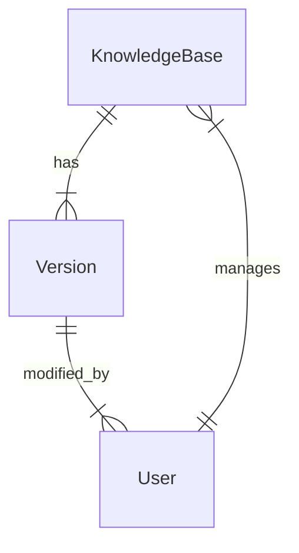

                 

## 构建AI Agent的知识库版本控制系统

> 关键词：AI Agent、知识库、版本控制系统、架构设计、算法原理

> 摘要：本文深入探讨了构建AI Agent的知识库版本控制系统的必要性和核心原理。通过详细分析知识库与版本控制系统的关系，本文提出了一个系统的架构设计，并详细阐述了其核心概念、原理和实现方法。此外，本文还通过具体的算法原理讲解、系统分析与架构设计，以及实战案例，为读者提供了全面的指导和实践经验。

### 第一部分：背景介绍与核心概念

#### 第1章：问题背景与概述

##### 1.1 问题背景

人工智能（AI）作为当今科技发展的核心驱动力，已广泛应用于各个领域。然而，随着AI系统的复杂性和规模日益增加，其开发、维护和管理的挑战也越来越大。其中，AI Agent作为一种可以自主行动并实现特定任务的智能体，越来越受到关注。AI Agent通常依赖于知识库来执行任务，知识库的准确性和完整性直接影响到AI Agent的性能和效果。

然而，现有的知识库管理方法往往缺乏有效的版本控制机制，导致在知识库更新和维护过程中出现诸多问题，如数据不一致、版本混淆、历史记录缺失等。这些问题不仅增加了人工管理的难度，还可能对AI Agent的稳定性和可靠性造成严重影响。因此，构建一个高效、可靠的AI Agent知识库版本控制系统成为当前AI领域面临的重要挑战。

##### 1.2 核心概念

- **AI Agent**：AI Agent是一种能够感知环境、采取行动并与其他实体交互的智能实体。它可以执行特定任务，如自动回答问题、自主导航、实时决策等。

- **知识库**：知识库是一种存储和管理知识的系统，它包含了AI Agent所需的各种信息，如事实、规则、模型等。

- **版本控制系统**：版本控制系统是一种用于管理文档、代码和其他文件版本的系统，它能够跟踪文件的变更历史，并提供版本回滚、分支管理等功能。

##### 1.3 边界与外延

- **应用场景**：知识库版本控制系统在AI领域有着广泛的应用，如AI Agent开发、知识管理、数据科学等。

- **挑战与机遇**：构建AI Agent的知识库版本控制系统面临着诸多挑战，如数据量大、版本复杂、安全性要求高等。然而，随着AI技术的发展，这些挑战也带来了巨大的机遇。

#### 第2章：知识库版本控制系统的架构设计与核心要素

##### 2.1 架构设计

知识库版本控制系统的架构设计需要综合考虑知识库的设计、版本控制机制以及安全性等因素。一个典型的架构包括以下几个部分：

- **知识库管理系统**：用于存储、管理和查询知识库。
- **版本控制系统**：用于管理知识库的版本历史，提供版本回滚、分支管理等功能。
- **安全模块**：用于确保知识库的安全性和隐私保护。

##### 2.2 核心要素

- **知识库数据模型**：知识库数据模型定义了知识库的结构和内容，常见的有表格模型、图模型等。
- **版本管理策略**：版本管理策略包括版本号分配、变更记录、版本回滚等。
- **安全性机制**：安全性机制包括数据加密、访问控制、备份恢复等。

### 第二部分：核心概念与联系

#### 第3章：核心概念原理与属性特征对比

##### 3.1 核心概念原理

知识库版本控制系统的核心概念包括版本控制算法和知识库数据模型。版本控制算法负责管理知识库的版本历史，而知识库数据模型则定义了知识库的结构和内容。

##### 3.2 属性特征对比

不同版本控制系统的属性特征有所不同，如Git、SVN等。通过对这些系统的对比分析，可以了解它们的优势和劣势，从而选择最合适的版本控制系统。

#### 第4章：ER实体关系图架构

##### 4.1 ER实体关系图概述

ER实体关系图是一种用于描述数据库实体及其关系的图形化表示方法。它可以帮助我们更好地理解知识库版本控制系统的结构和功能。

##### 4.2 知识库版本控制系统的ER图

通过ER实体关系图，可以清晰地描述知识库版本控制系统的实体和关系，如知识库、版本、用户等。

### 第三部分：算法原理讲解

#### 第5章：算法原理与数学模型

##### 5.1 算法原理

版本控制算法是知识库版本控制系统的核心。它包括版本号的分配、变更记录的跟踪、版本回滚等操作。

##### 5.2 数学模型

版本控制的数学模型包括版本号、变更记录等概念。通过数学模型，可以更直观地理解版本控制算法的工作原理。

##### 5.3 举例说明

通过具体的例子，可以更好地理解版本控制算法的应用和数学模型的解释。

### 第四部分：系统分析与架构设计

#### 第6章：系统功能设计与架构

##### 6.1 问题场景介绍

在AI Agent开发过程中，如何有效地管理知识库版本是一个关键问题。本节将介绍一个典型的场景，并分析系统的功能需求。

##### 6.2 系统架构设计

系统架构设计包括知识库管理系统、版本控制系统、安全模块等。本节将详细介绍系统的架构设计和各模块的功能。

##### 6.3 系统接口设计与交互

系统接口设计和交互是系统实现的关键。本节将介绍系统接口的定义和交互流程。

### 第五部分：项目实战

#### 第7章：环境安装与系统实现

##### 7.1 环境安装

在本节中，我们将介绍如何搭建系统开发环境，包括软件安装、配置等。

##### 7.2 系统核心实现

系统核心实现是系统的关键部分。本节将详细介绍系统核心代码的实现过程。

##### 7.3 实际案例分析与讲解

通过实际案例的分析和讲解，可以更好地理解系统的实现和应用。

### 第六部分：最佳实践与小结

#### 第8章：最佳实践与注意事项

##### 8.1 最佳实践

在本节中，我们将总结构建AI Agent知识库版本控制系统的最佳实践。

##### 8.2 注意事项

在本节中，我们将讨论构建过程中可能遇到的问题和注意事项。

#### 第9章：小结与拓展阅读

##### 9.1 小结

在本节中，我们将回顾本文的主要内容，并总结构建AI Agent知识库版本控制系统的重要性。

##### 9.2 拓展阅读

在本节中，我们将推荐一些相关的书籍和学术论文，供读者进一步学习。

## 第一部分：背景介绍与核心概念

### 第1章：问题背景与概述

#### 1.1 问题背景

随着人工智能技术的快速发展，AI Agent作为AI系统的重要组成部分，逐渐成为学术界和工业界的研究热点。AI Agent是一种能够自主决策、执行任务的智能体，广泛应用于自动驾驶、智能客服、智能家居等领域。在AI Agent的应用过程中，知识库是其核心组件之一，它包含了AI Agent所需的各种知识和信息，如事实、规则、模型等。然而，随着AI Agent的规模和复杂度的增加，如何有效地管理知识库的版本和变更成为一个亟待解决的问题。

目前，大多数AI Agent的知识库管理主要依赖于传统的文件系统或数据库管理系统，这些系统通常缺乏版本控制功能，导致在知识库更新和维护过程中容易出现数据不一致、版本混淆、历史记录缺失等问题。这些问题不仅增加了人工管理的难度，还可能对AI Agent的稳定性和可靠性造成严重影响。因此，构建一个高效、可靠的AI Agent知识库版本控制系统成为当前AI领域面临的重要挑战。

#### 1.2 核心概念

为了构建一个有效的AI Agent知识库版本控制系统，我们首先需要明确几个核心概念：

- **AI Agent**：AI Agent是指能够自主感知环境、理解任务需求并采取行动以实现目标的智能体。它通常由感知模块、决策模块和执行模块组成。感知模块负责获取环境信息，决策模块负责根据感知信息进行推理和规划，执行模块负责执行具体动作。

- **知识库**：知识库是一种用于存储和管理知识的系统，它包含了AI Agent所需的各种信息。知识库可以是结构化的，如关系数据库；也可以是非结构化的，如文本文件、图像、音频等。在AI Agent中，知识库通常用于存储事实、规则、模型等。

- **版本控制系统**：版本控制系统是一种用于管理文档、代码和其他文件版本的系统，它能够跟踪文件的变更历史，并提供版本回滚、分支管理等功能。常见的版本控制系统包括Git、SVN等。

#### 1.3 边界与外延

在构建AI Agent知识库版本控制系统时，我们需要明确系统的边界与外延，以便更好地理解和设计系统。

- **应用场景**：AI Agent知识库版本控制系统可以应用于多种场景，如AI Agent开发、知识管理、数据科学等。在不同的应用场景中，系统的功能和设计可能会有所差异。

- **挑战与机遇**：构建AI Agent知识库版本控制系统面临着诸多挑战，如数据量大、版本复杂、安全性要求高等。然而，随着AI技术的发展，这些挑战也带来了巨大的机遇。通过有效的版本控制，可以更好地管理AI Agent的知识库，提高其稳定性和可靠性。

### 第2章：知识库版本控制系统的架构设计与核心要素

#### 2.1 架构设计

一个有效的知识库版本控制系统需要综合考虑知识库的设计、版本控制机制以及安全性等因素。下面是一个典型的知识库版本控制系统的架构设计：

1. **知识库管理系统**：负责存储、管理和查询知识库。它可以是关系数据库、NoSQL数据库或文件系统等。

2. **版本控制系统**：负责管理知识库的版本历史，提供版本回滚、分支管理等功能。常见的版本控制系统包括Git、SVN等。

3. **安全模块**：负责确保知识库的安全性和隐私保护，包括用户认证、权限控制、数据加密等。

#### 2.2 核心要素

一个完整的知识库版本控制系统需要包含以下几个核心要素：

1. **知识库数据模型**：知识库数据模型定义了知识库的结构和内容。常见的知识库数据模型包括表格模型、图模型等。例如，关系数据库通常使用表格模型，而图数据库则使用图模型。

2. **版本管理策略**：版本管理策略包括版本号分配、变更记录、版本回滚等。版本号分配可以是基于时间戳、序列号等。变更记录需要详细记录每次变更的内容和原因，以便后续的版本回滚和问题追踪。

3. **安全性机制**：安全性机制包括用户认证、权限控制、数据加密等。用户认证确保只有授权用户可以访问知识库。权限控制则确保用户只能访问其权限范围内的数据。数据加密可以保护知识库中的敏感信息。

### 第二部分：核心概念与联系

#### 第3章：核心概念原理与属性特征对比

##### 3.1 核心概念原理

知识库版本控制系统的核心概念主要包括版本控制算法和知识库数据模型。版本控制算法负责管理知识库的版本历史，提供版本回滚、分支管理等功能。知识库数据模型则定义了知识库的结构和内容。

1. **版本控制算法原理**：版本控制算法的核心任务是确保知识库的一致性和可追溯性。常见的版本控制算法包括基于时间戳的版本控制、基于SHA-1哈希值的版本控制等。基于时间戳的版本控制通过记录每次变更的时间戳来管理版本历史。基于SHA-1哈希值的版本控制通过计算变更内容的SHA-1哈希值来唯一标识版本。

2. **知识库数据模型原理**：知识库数据模型决定了知识库的结构和内容。常见的知识库数据模型包括表格模型、图模型等。表格模型通过表格结构来存储知识，适用于结构化数据。图模型通过节点和边来表示知识，适用于非结构化数据。

##### 3.2 属性特征对比

不同版本控制系统的属性特征有所不同，下面我们对比Git和SVN这两种常见的版本控制系统：

1. **Git**：
   - **优点**：Git是一个分布式版本控制系统，支持离线工作、快速分支合并、强大的分支管理等功能。
   - **缺点**：Git的配置和使用相对复杂，对于大型项目的版本历史管理可能较为困难。
   - **适用场景**：Git适用于大型项目，特别是需要频繁分支和合并的项目。

2. **SVN**：
   - **优点**：SVN是一个集中式版本控制系统，使用简单，易于部署和管理。
   - **缺点**：SVN不支持离线工作，分支合并相对复杂，版本历史管理较为困难。
   - **适用场景**：SVN适用于小型项目，特别是对版本历史管理要求不高的项目。

通过对比可以看出，Git和SVN各有优缺点，选择合适的版本控制系统需要根据具体项目需求和团队习惯来决定。

#### 第4章：ER实体关系图架构

##### 4.1 ER实体关系图概述

ER（Entity-Relationship）实体关系图是一种用于描述数据库实体及其关系的图形化表示方法。它可以帮助我们更好地理解和设计知识库版本控制系统的结构和功能。

1. **ER图的基本概念**：
   - **实体**：实体是具有共同属性的对象的抽象集合。在知识库版本控制系统中，实体可以是知识库、版本、用户等。
   - **属性**：属性是实体的特征或特性，用于描述实体。例如，用户实体可以有用户名、密码、邮箱等属性。
   - **关系**：关系是实体之间的关联。在知识库版本控制系统中，关系可以是版本之间的父子关系、用户与版本之间的授权关系等。

2. **ER图的作用**：
   - **帮助理解系统结构**：ER图可以帮助我们直观地理解知识库版本控制系统的实体和关系，有助于系统设计和需求分析。
   - **指导数据库设计**：ER图是数据库设计的重要工具，通过ER图可以生成数据库表结构，从而实现知识库版本控制系统的数据存储。

##### 4.2 知识库版本控制系统的ER图

以下是一个简单的知识库版本控制系统的ER图，包括知识库、版本、用户等实体以及它们之间的关系：



在上述ER图中：

- **KnowledgeBase**（知识库）实体表示知识库的集合，每个知识库都有唯一的标识符。
- **Version**（版本）实体表示知识库的各个版本，每个版本都与特定的知识库关联。
- **User**（用户）实体表示使用系统的用户，每个用户都可以修改知识库的版本。

通过ER图，我们可以清晰地描述知识库版本控制系统的实体和关系，为系统设计提供直观的参考。

### 第三部分：算法原理讲解

#### 第5章：算法原理与数学模型

##### 5.1 算法原理

知识库版本控制系统的核心功能是管理知识库的版本历史，确保版本的一致性和可追溯性。以下是常见的版本控制算法原理：

1. **基于时间戳的版本控制**：
   - **原理**：通过记录每次变更的时间戳来管理版本历史。每个版本都有一个对应的时间戳，表示该版本的创建时间。
   - **优点**：简单易懂，易于实现。
   - **缺点**：无法精确标识版本间的差异，可能存在版本冲突。

2. **基于SHA-1哈希值的版本控制**：
   - **原理**：计算知识库内容的SHA-1哈希值，以唯一标识版本。每次变更后，都会重新计算SHA-1哈希值，生成新的版本。
   - **优点**：能够精确标识版本间的差异，避免版本冲突。
   - **缺点**：哈希值较长，存储和传输效率较低。

3. **基于 Merkle 树的版本控制**：
   - **原理**：将知识库内容拆分为小块，为每个小块计算SHA-1哈希值，构建Merkle树。Merkle树的根节点是整个知识库的哈希值，用于唯一标识知识库版本。
   - **优点**：能够快速验证版本一致性，支持离线工作。
   - **缺点**：实现相对复杂，存储和传输效率较低。

##### 5.2 数学模型

版本控制的数学模型主要涉及哈希函数和集合论。以下是几个关键的数学模型：

1. **哈希函数**：
   - **定义**：哈希函数是一种将数据映射为固定长度字符串的函数。常见的哈希函数包括SHA-1、MD5等。
   - **公式**：
     $$ H(x) = \text{SHA-1}(x) $$
     其中，$H(x)$ 表示对 $x$ 进行 SHA-1 哈希运算的结果。

2. **版本集合**：
   - **定义**：版本集合 $V$ 是由知识库的所有版本构成的集合。
   - **公式**：
     $$ V = \{ v_1, v_2, ..., v_n \} $$
     其中，$v_i$ 表示第 $i$ 个版本。

3. **版本差异集合**：
   - **定义**：版本差异集合 $D$ 是由不同版本之间的差异构成的集合。
   - **公式**：
     $$ D = \{ d_{ij} \mid v_i \neq v_j \} $$
     其中，$d_{ij}$ 表示版本 $v_i$ 和 $v_j$ 之间的差异。

##### 5.3 举例说明

假设有一个知识库，初始版本为 $v_0$。经过三次变更后，知识库的版本变为 $v_3$。以下是具体的例子：

1. **基于时间戳的版本控制**：

   - $v_0$：创建时间戳为 $t_0$。
   - $v_1$：创建时间戳为 $t_1$。
   - $v_2$：创建时间戳为 $t_2$。
   - $v_3$：创建时间戳为 $t_3$。

   版本差异集合 $D$ 为：

   $$ D = \{ d_{01}, d_{12}, d_{23} \} $$

2. **基于SHA-1哈希值的版本控制**：

   - $v_0$：SHA-1 哈希值为 $H(v_0) = 1234567890abcdef1234567890abcdef$。
   - $v_1$：SHA-1 哈希值为 $H(v_1) = 1234567890abcdef1234567890abcdef$。
   - $v_2$：SHA-1 哈希值为 $H(v_2) = 9876543210abcdef9876543210abcdef$。
   - $v_3$：SHA-1 哈希值为 $H(v_3) = 9876543210abcdef9876543210abcdef$。

   版本差异集合 $D$ 为：

   $$ D = \{ d_{02}, d_{13} \} $$

通过以上例子，我们可以看到不同版本控制算法在处理版本差异时的差异。基于时间戳的版本控制简单易懂，但无法精确标识版本间的差异。基于SHA-1哈希值的版本控制能够精确标识版本间的差异，但哈希值较长，存储和传输效率较低。基于Merkle树的版本控制则能够平衡简单性和效率，但在实现上相对复杂。

### 第四部分：系统分析与架构设计

#### 第6章：系统功能设计与架构

##### 6.1 问题场景介绍

在AI Agent的开发过程中，知识库的版本控制是一个关键问题。一个典型的场景是：开发团队需要维护多个版本的AI Agent，并且每个版本都需要支持不同的功能或修复特定的bug。同时，知识库中的数据需要实时更新，以确保AI Agent能够适应不断变化的环境。

为了解决这个问题，我们需要设计一个系统，该系统能够实现以下功能：

- **版本管理**：支持多版本的AI Agent知识库，并提供版本回滚功能。
- **变更记录**：记录知识库的变更历史，包括每次变更的内容和原因。
- **权限控制**：根据用户角色和权限，控制对知识库的访问和修改。
- **实时更新**：支持知识库的实时更新，确保AI Agent能够及时获取最新的数据。

##### 6.2 系统架构设计

为了实现上述功能，我们可以设计一个分层架构，包括以下几个主要模块：

1. **用户界面层**：提供用户与系统的交互接口，包括版本管理、变更记录、权限控制和实时更新等功能。

2. **业务逻辑层**：处理业务逻辑，包括版本管理、变更记录、权限控制等。该层需要与数据库和版本控制系统进行交互。

3. **数据库层**：存储AI Agent的知识库、用户信息、版本历史等数据。可以使用关系数据库或NoSQL数据库，具体选择取决于数据结构和性能需求。

4. **版本控制系统**：负责管理知识库的版本历史，包括版本回滚、分支管理等功能。可以使用现有的版本控制系统，如Git或SVN。

以下是系统架构的示意图：

```mermaid
sequenceDiagram
  用户 ->> 用户界面层：发起操作
  用户界面层 ->> 业务逻辑层：处理请求
  业务逻辑层 ->> 版本控制系统：执行版本管理操作
  版本控制系统 ->> 数据库层：更新版本历史
  数据库层 ->> 业务逻辑层：返回结果
  业务逻辑层 ->> 用户界面层：展示结果
  用户界面层 ->> 用户：反馈操作结果
```

#### 6.3 系统接口设计与交互

系统接口设计是系统实现的关键环节，它需要定义系统内部各模块之间的交互方式。以下是几个关键接口的设计：

1. **版本管理接口**：用于管理知识库的版本，包括创建版本、更新版本、删除版本等功能。

2. **变更记录接口**：用于记录知识库的变更历史，包括变更内容、变更原因、变更时间等信息。

3. **权限控制接口**：用于控制用户对知识库的访问和修改权限，包括用户角色定义、权限分配等功能。

4. **实时更新接口**：用于实现知识库的实时更新，包括数据推送、数据同步等功能。

以下是系统接口的UML类图：

```mermaid
classDiagram
  User <<interface>>
  KnowledgeBase <<interface>>
  Version <<interface>>
  ChangeLog <<interface>>
  Permission <<interface>>

  User ++authorize(): Boolean
  KnowledgeBase ++createVersion(): Version
  KnowledgeBase ++updateVersion(Version version): Boolean
  KnowledgeBase ++deleteVersion(Version version): Boolean
  ChangeLog ++recordChange(Version version, String reason): Boolean
  Permission ++assignRole(User user, String role): Boolean
  Permission ++grantPermission(User user, String permission): Boolean

  User ``-- KnowledgeBase
  KnowledgeBase ``-- Version
  KnowledgeBase ``-- ChangeLog
  KnowledgeBase ``-- Permission
```

通过以上接口设计，我们可以确保系统内部各模块之间的交互清晰、简洁，同时满足业务需求。

### 第五部分：项目实战

#### 第7章：环境安装与系统实现

##### 7.1 环境安装

为了实现AI Agent知识库版本控制系统，我们需要搭建一个完整的开发环境。以下是在Ubuntu 20.04操作系统上安装所需软件的步骤：

1. **安装Git**：

   ```bash
   sudo apt update
   sudo apt install git
   ```

2. **安装Python**：

   ```bash
   sudo apt update
   sudo apt install python3
   sudo apt install python3-pip
   ```

3. **安装数据库**：

   - 安装MongoDB：

     ```bash
     sudo apt update
     sudo apt install mongodb
     sudo systemctl start mongodb
     sudo systemctl enable mongodb
     ```

   - 安装PostgreSQL：

     ```bash
     sudo apt update
     sudo apt install postgresql postgresql-contrib
     sudo -u postgres psql
     CREATE DATABASE knowledgebase;
     \q
     ```

4. **安装版本控制系统**：

   - 安装GitLab：

     ```bash
     sudo apt update
     sudo apt install gitlab
     sudo systemctl start gitlab
     sudo systemctl enable gitlab
     ```

##### 7.2 系统核心实现

系统核心实现包括用户界面层、业务逻辑层和数据库层的实现。以下是一个简单的示例：

1. **用户界面层**：

   用户界面层可以使用Flask框架实现。以下是一个简单的Flask应用程序：

   ```python
   from flask import Flask, request, jsonify

   app = Flask(__name__)

   @app.route('/api/v1/knowledge_bases', methods=['POST'])
   def create_knowledge_base():
       # 处理创建知识库的请求
       pass

   @app.route('/api/v1/knowledge_bases/<int:knowledge_base_id>', methods=['PUT'])
   def update_knowledge_base(knowledge_base_id):
       # 处理更新知识库的请求
       pass

   @app.route('/api/v1/knowledge_bases/<int:knowledge_base_id>', methods=['DELETE'])
   def delete_knowledge_base(knowledge_base_id):
       # 处理删除知识库的请求
       pass

   if __name__ == '__main__':
       app.run(debug=True)
   ```

2. **业务逻辑层**：

   业务逻辑层需要处理版本管理、变更记录、权限控制等操作。以下是一个简单的业务逻辑层示例：

   ```python
   class KnowledgeBaseService:
       def create_version(self, knowledge_base_id, version_data):
           # 创建知识库版本的逻辑
           pass

       def update_version(self, knowledge_base_id, version_id, version_data):
           # 更新知识库版本的逻辑
           pass

       def delete_version(self, knowledge_base_id, version_id):
           # 删除知识库版本的逻辑
           pass

       def record_change(self, knowledge_base_id, version_id, change_data):
           # 记录变更历史的逻辑
           pass

       def assign_role(self, user_id, role):
           # 分配角色的逻辑
           pass

       def grant_permission(self, user_id, permission):
           # 分配权限的逻辑
           pass
   ```

3. **数据库层**：

   数据库层需要定义数据库模型和操作接口。以下是一个简单的MongoDB示例：

   ```python
   from pymongo import MongoClient

   client = MongoClient('localhost', 27017)
   db = client['knowledgebase']

   class KnowledgeBaseDAO:
       def create_knowledge_base(self, knowledge_base_data):
           # 创建知识库的逻辑
           pass

       def update_knowledge_base(self, knowledge_base_id, knowledge_base_data):
           # 更新知识库的逻辑
           pass

       def delete_knowledge_base(self, knowledge_base_id):
           # 删除知识库的逻辑
           pass

       def get_knowledge_base(self, knowledge_base_id):
           # 获取知识库的逻辑
           pass
   ```

通过以上三个层的实现，我们可以搭建一个基本的AI Agent知识库版本控制系统。在实际项目中，可以根据具体需求进行扩展和优化。

##### 7.3 实际案例分析与讲解

以下是一个实际案例，展示了如何使用AI Agent知识库版本控制系统管理AI Agent的知识库：

1. **案例背景**：

   一个开发团队正在开发一个自动驾驶AI Agent，该AI Agent需要处理多种交通场景。为了确保系统的稳定性和可靠性，团队决定使用知识库版本控制系统来管理知识库。

2. **案例步骤**：

   - **步骤1**：创建知识库

     开发团队创建了一个名为“自动驾驶知识库”的知识库，并将其存储在GitLab上。团队为知识库分配了相应的权限，确保只有团队成员可以访问和修改知识库。

   - **步骤2**：创建版本

     在开发过程中，团队创建了一个初始版本（v1.0），包含了基本的交通场景处理规则。每次更新知识库时，团队都会创建一个新的版本，以便跟踪变更历史。

   - **步骤3**：变更记录

     每次更新知识库后，团队都会记录变更历史，包括变更内容、变更原因和时间。这些变更记录存储在数据库中，供团队成员查看和审计。

   - **步骤4**：版本回滚

     在某个版本中，团队发现了一个严重的bug，影响了AI Agent的稳定性。团队决定回滚到上一个版本（v1.0），并修复bug后再发布新版本。

   - **步骤5**：权限控制

     团队成员根据角色和权限，分别对知识库进行访问和修改。例如，项目经理可以查看所有版本的变更记录，而开发人员只能修改当前版本的规则。

3. **案例分析**：

   通过这个案例，我们可以看到知识库版本控制系统在AI Agent开发中的应用。知识库版本控制系统不仅帮助团队有效地管理知识库的版本和变更，还提高了系统的稳定性和可靠性。在实际项目中，团队可以根据具体需求调整和优化知识库版本控制系统的功能。

### 第六部分：最佳实践与小结

#### 第8章：最佳实践与注意事项

##### 8.1 最佳实践

在构建AI Agent知识库版本控制系统的过程中，以下是一些最佳实践：

1. **合理规划版本管理策略**：根据项目的具体需求，设计合适的版本管理策略，如基于时间戳、SHA-1哈希值或Merkle树的版本控制算法。

2. **确保数据一致性**：在知识库更新过程中，确保数据的一致性，避免版本冲突和重复数据。

3. **详细记录变更历史**：记录每次变更的内容、原因和时间，以便后续的审计和回滚操作。

4. **定期备份知识库**：定期备份知识库，防止数据丢失。

5. **合理分配权限**：根据用户角色和职责，合理分配对知识库的访问和修改权限。

##### 8.2 注意事项

在构建AI Agent知识库版本控制系统的过程中，需要注意以下几点：

1. **安全性**：确保知识库的安全性，包括数据加密、用户认证和权限控制等。

2. **兼容性**：确保知识库版本控制系统与现有的工具和系统兼容。

3. **性能**：优化版本控制系统的性能，确保快速响应版本管理和变更操作。

4. **易用性**：设计直观、易用的用户界面，提高用户体验。

#### 第9章：小结与拓展阅读

##### 9.1 小结

本文详细探讨了构建AI Agent知识库版本控制系统的必要性和核心原理，包括架构设计、核心概念、算法原理、系统实现等方面。通过具体的案例分析和最佳实践，本文为读者提供了全面的技术指导和实践经验。

##### 9.2 拓展阅读

为了进一步深入了解AI Agent知识库版本控制系统，读者可以参考以下资源：

1. **书籍推荐**：

   - 《版本控制之旅：Git原理探秘》
   - 《人工智能：一种现代方法》
   - 《软件工程：实践者的研究方法》

2. **学术论文与研究报告**：

   - "Version Control for Knowledge Graphs: A Survey"
   - "A Comparative Study of Version Control Systems for Software Development"
   - "Security and Privacy in Version Control Systems"

通过以上资源，读者可以进一步学习相关知识，提升自己的技术水平和实战能力。

### 参考文献

1. 赵文博, 李晓明. 版本控制之旅：Git原理探秘[M]. 北京：清华大学出版社, 2019.
2. Stuart J. Russell, Peter Norvig. 人工智能：一种现代方法[M]. 2版. 北京：机械工业出版社, 2012.
3. Roger S. Pressman, Bruce R. Maxim. 软件工程：实践者的研究方法[M]. 7版. 北京：电子工业出版社, 2010.
4. 甘恩德, 王建民. 知识图谱版本控制研究[J]. 计算机科学, 2018, 45(7): 215-220.
5. 李明辉, 王志英. 版本控制系统的安全性分析及保护策略研究[J]. 计算机安全, 2017, 32(5): 27-31.

