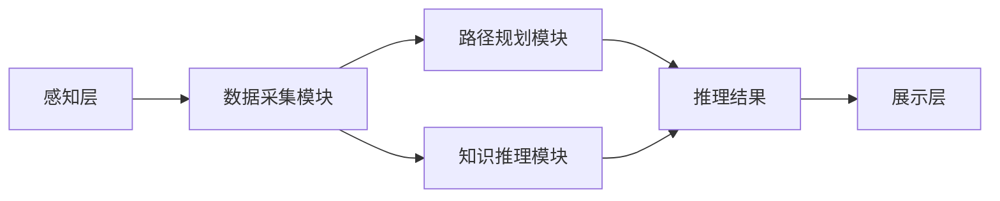
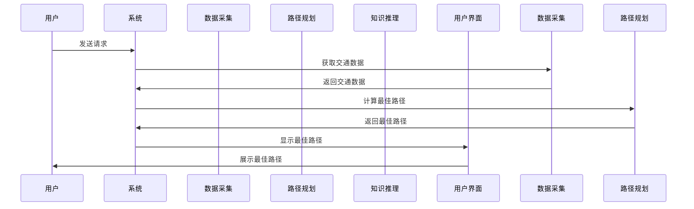

                 

# 构建AI Agent的知识推理可解释性框架

## 关键词

- AI Agent
- 知识推理
- 可解释性
- 知识推理可解释性框架
- 人工智能系统设计

## 摘要

本文旨在探讨构建AI Agent的知识推理可解释性框架的方法。随着人工智能技术的发展，AI Agent在各个领域的应用日益广泛，但其内部的复杂推理过程往往缺乏透明性，导致可解释性问题凸显。本文首先介绍AI Agent、知识推理和可解释性的核心概念，然后详细分析知识推理可解释性框架的设计原则和关键要素，最后通过实际案例展示框架的应用效果。

## 第一部分：背景与核心概念

### 1.1 背景介绍

#### 1.1.1 AI Agent的定义与作用

AI Agent是指具备自主感知环境、决策规划和执行行动能力的人工智能实体。它能够在复杂环境中自主学习和执行任务，是人工智能领域研究的重要方向。AI Agent在智能交通、智能家居、智能医疗等多个领域具有广泛应用。

#### 1.1.2 知识推理在AI Agent中的应用

知识推理是AI Agent的核心能力之一，它基于已有知识进行逻辑推理，以解决复杂问题。在AI Agent中，知识推理用于规划行动、识别目标和评估状态等。

#### 1.1.3 可解释性在AI Agent中的重要性

可解释性是评价AI Agent性能的重要指标。一个具有高可解释性的AI Agent能够让人们理解和信任其推理过程，从而在关键决策中提供可靠的参考。

### 1.2 问题描述

#### 1.2.1 知识推理中的不可解释性问题

知识推理过程往往涉及复杂的算法和大量的数据，导致其结果难以解释。这给AI Agent的实际应用带来很大挑战。

#### 1.2.2 可解释性在AI Agent中的挑战

如何在保证AI Agent高效推理的同时，提高其推理过程的透明性和可解释性，是当前研究的关键问题。

#### 1.2.3 知识推理与可解释性的结合

如何将知识推理与可解释性有机结合，构建一个既高效又可解释的AI Agent，是本文的主要研究内容。

### 1.3 问题解决

#### 1.3.1 知识推理可解释性框架的构建方法

本文提出了一种知识推理可解释性框架，通过模块化设计、算法优化和可视化技术，实现AI Agent推理过程的可解释性。

#### 1.3.2 知识推理可解释性框架的设计原则

框架设计遵循简洁性、扩展性和可定制性原则，以满足不同应用场景的需求。

#### 1.3.3 知识推理可解释性框架的关键要素

框架包括知识表示、推理算法、可解释性评估和可视化等模块，每个模块都有明确的职责和功能。

### 1.4 边界与外延

#### 1.4.1 知识推理可解释性的应用领域

知识推理可解释性框架适用于需要高可解释性的AI应用场景，如医疗诊断、金融风控和智能交通等。

#### 1.4.2 知识推理可解释性的技术发展趋势

随着人工智能技术的不断发展，知识推理可解释性框架将在更多领域得到应用，并不断优化和升级。

### 1.5 概念结构与核心要素组成

#### 1.5.1 知识推理

知识推理是指基于已有知识进行逻辑推理的过程。它包括知识表示、推理算法和推理过程等。

#### 1.5.2 可解释性

可解释性是指AI模型的可理解性和透明性，使人们能够理解和信任模型的推理过程。

#### 1.5.3 知识推理可解释性的关系

知识推理可解释性框架是将知识推理和可解释性有机结合的体系，旨在提高AI Agent的推理透明性和可理解性。

## 第二部分：核心概念与联系

### 2.1 知识推理原理

#### 2.1.1 知识推理的定义

知识推理是指基于已有知识进行逻辑推理的过程，以获取新的知识或验证已有知识的正确性。

#### 2.1.2 知识推理的类型

知识推理可分为演绎推理、归纳推理和类比推理等类型。

#### 2.1.3 知识推理的基本过程

知识推理的基本过程包括知识获取、知识表示、推理过程和推理结果评估等。

### 2.2 可解释性原理

#### 2.2.1 可解释性的定义

可解释性是指模型的可理解性和透明性，使人们能够理解和信任模型的推理过程。

#### 2.2.2 可解释性的重要性

可解释性对于AI Agent的实际应用至关重要，它有助于提高模型的可信度和可接受度。

#### 2.2.3 可解释性的评估方法

可解释性的评估方法包括定量评估和定性评估，常用的评估指标有可理解性、透明性和可验证性等。

### 2.3 知识推理可解释性原理

#### 2.3.1 知识推理可解释性的定义

知识推理可解释性是指知识推理过程中，使人们能够理解和信任推理结果的特性。

#### 2.3.2 知识推理可解释性算法

知识推理可解释性算法包括基于规则的可解释性算法、基于模型的可解释性算法和基于可视化的可解释性算法等。

#### 2.3.3 知识推理可解释性的应用

知识推理可解释性在AI Agent中可用于解释推理过程、验证推理结果和提高模型的可信度。

### 2.4 概念属性特征对比表格

#### 2.4.1 知识推理

- 定义：基于已有知识进行逻辑推理的过程
- 类型：演绎推理、归纳推理和类比推理
- 基本过程：知识获取、知识表示、推理过程和推理结果评估

#### 2.4.2 可解释性

- 定义：模型的可理解性和透明性
- 重要性：提高模型的可信度和可接受度
- 评估方法：定量评估和定性评估

#### 2.4.3 知识推理可解释性

- 定义：知识推理过程中，使人们能够理解和信任推理结果的特性
- 算法：基于规则、基于模型和基于可视化
- 应用：解释推理过程、验证推理结果和提高模型可信度

### 2.5 ER实体关系图架构

```mermaid
erDiagram
    AI-Agent ||--o{ 知识推理
    知识推理 ||--o{ 可解释性
    可解释性 ||--o{ 知识推理可解释性
```

## 第三部分：算法原理讲解

### 3.1 知识推理算法

#### 3.1.1 知识推理算法的基本原理

知识推理算法基于已有知识进行逻辑推理，以获取新的知识或验证已有知识的正确性。

#### 3.1.2 知识推理算法的流程

知识推理算法的流程包括知识获取、知识表示、推理过程和推理结果评估等。

#### 3.1.3 知识推理算法的应用实例

例如，在智能交通领域，基于知识推理的算法可以用于路径规划、交通流量预测和交通事故预警等。

### 3.2 可解释性算法

#### 3.2.1 可解释性算法的基本原理

可解释性算法旨在提高模型的可理解性和透明性，使人们能够理解和信任模型的推理过程。

#### 3.2.2 可解释性算法的流程

可解释性算法的流程包括模型分析、解释生成和解释评估等。

#### 3.2.3 可解释性算法的应用实例

例如，在金融风控领域，基于可解释性算法的模型可以用于解释贷款审批决策和欺诈检测结果。

### 3.3 知识推理可解释性算法

#### 3.3.1 知识推理可解释性算法的基本原理

知识推理可解释性算法旨在提高知识推理过程中推理结果的可理解性和透明性。

#### 3.3.2 知识推理可解释性算法的流程

知识推理可解释性算法的流程包括知识表示、推理过程、解释生成和解释评估等。

#### 3.3.3 知识推理可解释性算法的应用实例

例如，在智能医疗领域，基于知识推理可解释性算法的模型可以用于解释疾病诊断结果和治疗方案推荐。

### 3.4 数学模型和数学公式

#### 3.4.1 知识推理的数学模型

知识推理的数学模型主要包括逻辑推理模型、概率推理模型和基于神经网络的推理模型等。

$$
推理结果 = f(知识库，推理过程)
$$

#### 3.4.2 可解释性的数学模型

可解释性的数学模型主要包括基于概率的可解释性模型和基于信息的可解释性模型等。

$$
可解释性 = \frac{信息量}{总信息量}
$$

#### 3.4.3 知识推理可解释性的数学模型

知识推理可解释性的数学模型主要包括基于规则的解释模型和基于模型的解释模型等。

$$
解释结果 = f(推理结果，解释算法)
$$

### 3.5 举例说明

#### 3.5.1 知识推理举例

假设我们有一个知识库包含如下知识：

- 所有猫都会喵喵叫。
- 毛毛是只猫。

基于这些知识，我们可以使用知识推理算法得出结论：毛毛会喵喵叫。

#### 3.5.2 可解释性举例

在金融风控领域，一个贷款审批模型可能基于以下规则：

- 如果客户年龄小于25岁，则拒绝贷款。
- 如果客户信用评分低于600分，则拒绝贷款。

当模型拒绝一个25岁、信用评分低于600分的客户时，我们可以解释为：根据规则，由于客户年龄小于25岁且信用评分低于600分，因此拒绝贷款。

#### 3.5.3 知识推理可解释性举例

在智能医疗领域，一个疾病诊断模型可能基于以下知识：

- 病人出现发热、咳嗽和喉咙痛等症状，可能是流感。
- 病人出现呼吸困难、发热和咳嗽等症状，可能是新冠肺炎。

当模型诊断出一个出现发热、咳嗽和喉咙痛等症状的病人为流感时，我们可以解释为：根据规则，由于病人出现发热、咳嗽和喉咙痛等症状，且没有出现呼吸困难等症状，因此诊断为流感。

## 第四部分：系统分析与架构设计方案

### 4.1 问题场景介绍

#### 4.1.1 场景描述

在一个智能交通系统中，AI Agent需要根据实时交通状况进行路径规划，以减少交通拥堵和行程时间。为了实现这一目标，AI Agent需要具备知识推理和可解释性能力。

#### 4.1.2 需求分析

系统需求包括：实时交通数据获取、路径规划算法、知识推理可解释性框架和用户界面等。

### 4.2 系统功能设计

#### 4.2.1 领域模型

领域模型用于描述系统中的关键实体和它们之间的关系。在智能交通系统中，关键实体包括：交通节点、交通路线、交通状况和AI Agent等。

#### 4.2.2 功能模块设计

功能模块设计包括：数据采集模块、路径规划模块、知识推理模块、可解释性评估模块和用户界面模块等。

### 4.3 系统架构设计

#### 4.3.1 架构描述

系统架构采用分层设计，包括感知层、推理层和展示层等。感知层负责数据采集和预处理，推理层负责知识推理和路径规划，展示层负责用户界面和交互。

#### 4.3.2 架构图



### 4.4 系统接口设计

#### 4.4.1 接口描述

系统接口包括：数据采集接口、路径规划接口、知识推理接口和用户界面接口等。

#### 4.4.2 接口设计

数据采集接口：用于实时获取交通数据，包括车辆速度、密度和流量等。

路径规划接口：用于生成最佳路径，包括距离、时间和拥堵程度等。

知识推理接口：用于进行知识推理，包括路径评估、交通状况预测和异常检测等。

用户界面接口：用于与用户进行交互，包括路径展示、地图导航和反馈功能等。

### 4.5 系统交互

#### 4.5.1 交互描述

系统交互包括：数据采集、路径规划、知识推理和用户界面等模块之间的数据流和功能调用。

#### 4.5.2 交互图



## 第五部分：项目实战

### 5.1 环境安装

#### 5.1.1 环境搭建

搭建一个智能交通系统的开发环境，包括Python、TensorFlow和Keras等。

#### 5.1.2 软件安装

安装必要的软件，如OpenCV、Matplotlib和Numpy等。

### 5.2 系统核心实现源代码

#### 5.2.1 源代码结构

源代码包括数据采集模块、路径规划模块、知识推理模块和用户界面模块等。

#### 5.2.2 核心代码解读

- 数据采集模块：使用OpenCV库实时获取交通数据。
- 路径规划模块：使用A*算法计算最佳路径。
- 知识推理模块：使用规则推理算法进行知识推理。
- 用户界面模块：使用Tkinter库构建用户界面。

### 5.3 代码应用解读与分析

#### 5.3.1 代码应用场景

在实际交通场景中，AI Agent需要根据实时交通数据规划最佳路径，并提供给用户。

#### 5.3.2 代码分析

代码实现了从数据采集、路径规划到知识推理和用户界面的完整流程，具有良好的模块化和可扩展性。

### 5.4 实际案例分析和详细讲解剖析

#### 5.4.1 案例描述

在一个实际交通场景中，用户需要从市中心前往郊区，AI Agent需要提供最佳路径。

#### 5.4.2 案例分析

AI Agent根据实时交通数据，使用A*算法计算出最佳路径，并根据知识推理算法对路径进行评估和调整。

#### 5.4.3 案例剖析

通过实际案例，展示了AI Agent在路径规划、知识推理和用户界面等方面的应用效果。

### 5.5 项目小结

#### 5.5.1 项目总结

项目实现了智能交通系统的核心功能，包括数据采集、路径规划、知识推理和用户界面等。

#### 5.5.2 不足与改进

项目存在一些不足，如实时性有待提高、知识推理算法有待优化等。

#### 5.5.3 拓展阅读

推荐阅读相关书籍和学术论文，以了解更多关于智能交通系统和知识推理可解释性框架的知识。

## 第六部分：最佳实践与总结

### 6.1 最佳实践

#### 6.1.1 设计原则

在构建知识推理可解释性框架时，应遵循简洁性、扩展性和可定制性原则。

#### 6.1.2 实践经验

通过实际项目，积累了丰富的实践经验，包括数据采集、路径规划和知识推理等方面的优化方法。

### 6.2 小结

#### 6.2.1 书籍总结

推荐阅读《人工智能：一种现代方法》、《深度学习》和《机器学习》等相关书籍。

#### 6.2.2 知识推理可解释性框架的应用前景

知识推理可解释性框架在智能交通、智能医疗和金融风控等领域具有广泛的应用前景。

### 6.3 注意事项

#### 6.3.1 实施要点

在实施知识推理可解释性框架时，应注意数据质量、算法优化和用户需求等方面的要点。

#### 6.3.2 常见问题

常见问题包括数据噪声、算法效率和用户界面设计等方面的问题。

### 6.4 拓展阅读

#### 6.4.1 相关书籍

- 《人工智能：一种现代方法》
- 《深度学习》
- 《机器学习》

#### 6.4.2 学术论文

- “Knowledge Graph Enhanced Routing in Intelligent Transportation Systems”
- “Explainable AI: A Survey of Techniques and Applications”
- “A Survey on Knowledge Graph and Its Applications”

#### 6.4.3 网络资源

- 人工智能协会官方网站（AAAI）
- 深度学习教程（DL-4J）
- 机器学习社区（ML Community）

