                 

# 《构建AI Agent的知识推理链可视化工具》

## 关键词

- **AI Agent**
- **知识推理链**
- **可视化工具**
- **算法**
- **系统架构设计**
- **Python**
- **Mermaid流程图**

## 摘要

本文旨在探讨如何构建一款AI Agent的知识推理链可视化工具，以帮助开发者和研究人员更好地理解、分析和管理AI Agent的知识推理过程。文章首先介绍了问题背景、核心概念，然后详细讲解了知识推理链的构建和可视化算法，接着分析了系统架构和功能设计，并展示了环境安装和系统核心实现的过程。通过实际案例分析和最佳实践总结，本文提供了构建此类工具的全面指导。

---

# 《构建AI Agent的知识推理链可视化工具》目录大纲

## 第一部分：背景介绍与核心概念

### 第1章：问题背景与核心概念

#### 1.1 问题的提出
#### 1.2 核心概念
#### 1.3 边界与外延
#### 1.4 概念结构与核心要素组成

### 第2章：核心概念原理

#### 2.1 知识源
#### 2.2 推理引擎
#### 2.3 可视化模块
#### 2.4 ER实体关系图架构

## 第二部分：核心概念与联系

### 第3章：知识推理链构建算法

#### 3.1 算法原理
#### 3.2 算法原理详细讲解
#### 3.3 算法举例说明

### 第4章：知识推理链可视化算法

#### 4.1 算法原理
#### 4.2 算法原理详细讲解
#### 4.3 算法举例说明

## 第三部分：算法原理讲解

### 第5章：知识推理链构建算法

### 第6章：知识推理链可视化算法

## 第四部分：系统分析与架构设计方案

### 第7章：系统功能设计

### 第8章：系统架构设计

### 第9章：系统接口设计

### 第10章：系统交互

## 第五部分：项目实战

### 第11章：环境安装与系统核心实现

### 第12章：实际案例分析与详细讲解剖析

### 第13章：项目小结

## 第六部分：最佳实践、小结与拓展阅读

### 第14章：最佳实践

### 第15章：小结

### 第16章：注意事项

### 第17章：拓展阅读

---

## 第一部分：背景介绍与核心概念

### 第1章：问题背景与核心概念

#### 1.1 问题的提出

随着人工智能技术的迅猛发展，AI Agent在各个领域的应用越来越广泛。AI Agent是一种能够自主学习、推理和决策的计算机程序，它们在智能客服、智能安防、自动驾驶等领域发挥着重要作用。然而，AI Agent的知识推理过程通常是非常复杂的，涉及多个知识源和推理步骤。如何高效地构建和可视化这些知识推理链，使其能够更好地辅助人类决策和解决问题，成为一个重要的研究课题。

#### 1.2 核心概念

为了更好地理解本文要解决的问题，我们需要介绍几个核心概念。

- **AI Agent**：具备智能行为的计算机程序，能够自主学习、推理和决策。
- **知识推理链**：AI Agent进行推理决策的步骤序列，包括事实、规则和推理过程。
- **知识源**：提供知识的数据和模型，可以是数据库、知识库或学习算法生成的模型。
- **推理引擎**：实现知识推理的算法和框架，用于根据知识源和规则进行推理。
- **可视化模块**：将知识推理链以图形化方式展示，帮助用户理解推理过程。

#### 1.3 边界与外延

- **边界**：知识推理链的构建范围，涉及的知识类型、推理方法等。
- **外延**：知识推理链在实际应用中的扩展和延伸，如领域泛化、多模态知识融合等。

#### 1.4 概念结构与核心要素组成

- **概念结构**：知识推理链的组成元素及其关系。
- **核心要素组成**：
  - **知识源**：提供原始数据或预处理的模型。
  - **推理引擎**：根据规则和事实进行推理。
  - **可视化模块**：以图形化方式展示推理过程和结果。

---

在接下来的章节中，我们将深入探讨这些核心概念，并逐步介绍构建AI Agent的知识推理链可视化工具的方法和步骤。我们将详细讲解知识推理链的构建和可视化算法，分析系统架构和功能设计，并通过实际案例展示工具的应用效果。让我们一步一步地思考，逐步构建这个强大的工具。

---

## 第二部分：核心概念与联系

### 第2章：核心概念原理

在了解AI Agent的知识推理链可视化工具时，我们需要深入理解几个核心概念：知识源、推理引擎和可视化模块。这些概念构成了工具的基本框架，并且彼此之间紧密关联。

#### 2.1 知识源

知识源是知识推理链的起点，它提供了AI Agent所需的数据和知识。知识源可以有多种形式，包括数据库、知识库、学习算法生成的模型等。

**属性特征对比表格**：

| 知识源类型 | 特点 | 适用场景 |
| :--: | :--: | :--: |
| 数据库 | 结构化数据存储，易于查询和管理 | 业务数据管理，数据分析 |
| 知识库 | 半结构化或非结构化数据存储，知识性强 | 专家系统，知识图谱构建 |
| 学习算法生成的模型 | 自适应学习，数据驱动 | 机器学习应用，数据挖掘 |

知识源的选择取决于具体的应用场景和需求。例如，在智能客服中，数据库可以存储用户的历史记录和常见问题；在医疗诊断中，知识库可以存储医学知识和诊断规则。

#### 2.2 推理引擎

推理引擎是知识推理链的核心，负责根据知识源和规则进行推理，生成推理结果。推理引擎可以是基于规则的系统，也可以是机器学习模型，或者是两者的结合。

**属性特征对比表格**：

| 推理引擎类型 | 特点 | 适用场景 |
| :--: | :--: | :--: |
| 基于规则的推理引擎 | 规则明确，易于理解和修改 | 专家系统，流程控制 |
| 机器学习模型 | 自适应，复杂关系推理 | 数据挖掘，预测分析 |
| 结合规则的推理引擎 | 优势互补，提高推理能力 | 多领域应用，复杂推理任务 |

推理引擎的选择需要考虑推理任务的复杂性和数据特性。例如，在自动化决策系统中，基于规则的推理引擎可能更适合，因为它可以确保决策过程的透明性和可解释性。

#### 2.3 可视化模块

可视化模块是将知识推理链以图形化方式展示的关键部分。它不仅帮助用户理解推理过程，还可以辅助分析和调试。

**属性特征对比表格**：

| 可视化模块类型 | 功能 | 优点 | 适用场景 |
| :--: | :--: | :--: | :--: |
| 流程图 | 展示推理步骤和流程 | 直观，易于理解 | 简单推理任务 |
| 知识图谱 | 展示知识结构和关系 | 知识可视化，复杂关系展示 | 复杂知识推理 |
| 交互式可视化 | 支持用户交互，动态更新 | 高度灵活，用户参与度高 | 高级推理任务 |

可视化模块的选择取决于用户的理解和交互需求。例如，在教育和研究场景中，交互式可视化可能更有助于用户深入理解推理过程。

#### 2.4 ER实体关系图架构

ER（Entity-Relationship）图是一种用于描述实体及其关系的数据库设计工具。在我们的知识推理链可视化工具中，ER图可以用于展示知识源、推理引擎和可视化模块之间的实体关系。

```mermaid
erDiagram
    KB ||--|{ RE }|| ReasoningEngine
    RE ||--|{ VM }|| VisualizationModule
    KB ||--|{ DS }|| DataSources
    DS ||--|{ RE }|| ReasoningEngine
    DS ||--|{ VM }|| VisualizationModule
```

在这个ER图中，`KB`代表知识库，`RE`代表推理引擎，`VM`代表可视化模块，`DS`代表数据源。图中的连线表示实体之间的关系。

通过上述核心概念的理解和ER图的展示，我们可以更好地构建AI Agent的知识推理链可视化工具。在接下来的章节中，我们将详细讲解知识推理链的构建和可视化算法，帮助读者深入理解并实现这一工具。

---

## 第三部分：算法原理讲解

### 第3章：知识推理链构建算法

#### 3.1 算法原理

知识推理链的构建是AI Agent进行智能推理的基础。构建算法需要将知识源中的知识整合成一个连贯的推理链，以便AI Agent能够根据这些知识进行决策和问题解决。以下是构建算法的基本原理：

1. **知识提取**：从知识源中提取有用的知识，包括事实、规则和模型。
2. **知识融合**：将提取的知识进行融合，形成统一的推理基础。
3. **推理路径规划**：根据知识融合的结果，规划推理路径，确定推理的顺序和方向。
4. **推理执行**：根据规划好的推理路径，逐步执行推理，生成推理结果。

#### 3.2 算法原理详细讲解

**知识提取**

知识提取是构建知识推理链的第一步，它涉及到从不同的数据源中提取有用的知识。这个过程通常包括以下几个步骤：

- **数据预处理**：对原始数据进行清洗和预处理，使其符合知识推理的需求。
- **特征提取**：从预处理后的数据中提取关键特征，这些特征将用于后续的知识融合和推理。
- **知识表示**：将提取的特征转化为适合推理的表示形式，如向量、规则等。

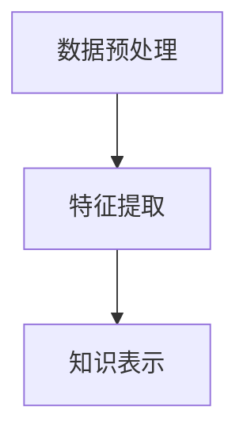

**知识融合**

知识融合是将多个知识源中的知识进行整合，形成一个统一的推理基础。这个过程需要考虑知识之间的关联性和一致性。常用的知识融合方法包括：

- **基于规则的融合**：将不同知识源中的规则进行合并，形成统一的规则库。
- **基于模型的融合**：将不同知识源中的模型进行整合，形成统一的模型。
- **基于图论的融合**：利用图论的方法，将不同知识源中的知识表示为图，并找到它们之间的关联关系。

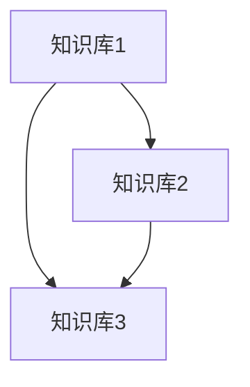

**推理路径规划**

推理路径规划是确定推理的顺序和方向。一个有效的推理路径应该能够最大程度地利用知识，并快速找到问题的解决方案。推理路径规划可以通过以下几种方法实现：

- **基于规则的规划**：根据规则库中的规则，确定推理的顺序。
- **基于搜索的规划**：利用搜索算法，找到最优的推理路径。
- **基于模型的规划**：根据模型的结构和关系，确定推理路径。

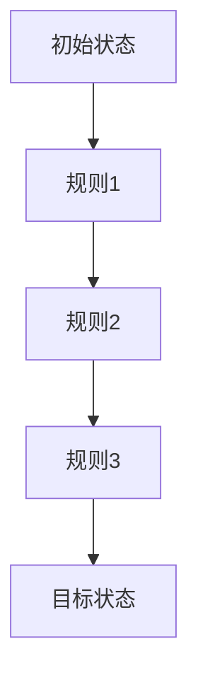

**推理执行**

推理执行是根据规划好的推理路径，逐步执行推理，生成推理结果。这个过程需要考虑以下因素：

- **推理规则的应用**：根据推理路径，应用相应的推理规则。
- **推理结果的验证**：对推理结果进行验证，确保其正确性和一致性。
- **推理过程的监控**：对推理过程进行监控，及时发现并解决潜在问题。

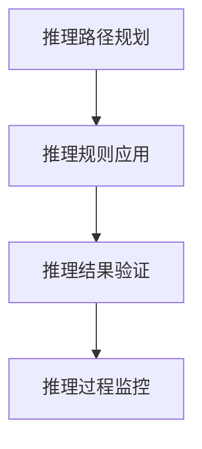

#### 3.3 算法举例说明

假设我们有一个AI Agent，它的任务是进行医疗诊断。知识源包括医生的经验、医学知识和患者的历史记录。以下是构建知识推理链的过程：

1. **知识提取**：从医生的经验数据库中提取诊断规则，从医学知识库中提取症状和疾病的关系，从患者的历史记录中提取关键症状。
2. **知识融合**：将诊断规则、症状和疾病关系进行融合，形成一个统一的推理基础。
3. **推理路径规划**：根据症状和疾病关系，规划推理路径，确定诊断步骤。
4. **推理执行**：根据推理路径，逐步执行推理，生成诊断结果。

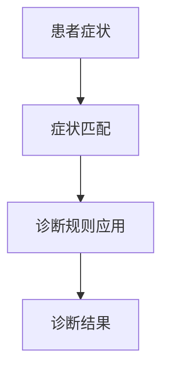

通过上述步骤，AI Agent能够根据患者症状和医学知识进行诊断，并生成诊断结果。

---

### 第4章：知识推理链可视化算法

#### 4.1 算法原理

知识推理链可视化算法是将AI Agent的知识推理过程以图形化的方式展示，帮助用户更好地理解和分析推理过程。可视化算法需要考虑以下原理：

1. **推理步骤的图形表示**：将推理的每个步骤表示为图形元素，如节点、边和箭头。
2. **知识依赖关系的可视化**：展示推理步骤之间的依赖关系，帮助用户理解推理逻辑。
3. **交互功能的实现**：允许用户与可视化界面进行交互，如缩放、拖动和筛选。

#### 4.2 算法原理详细讲解

**推理步骤的图形表示**

在可视化算法中，每个推理步骤都可以表示为一个节点，节点之间的依赖关系用边和箭头表示。以下是使用Mermaid进行推理步骤图形表示的示例：

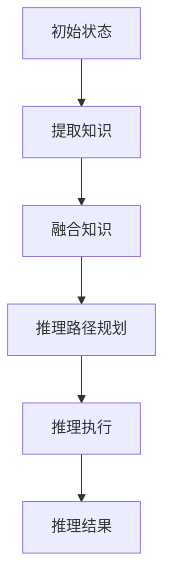

**知识依赖关系的可视化**

知识依赖关系可以通过节点之间的边和箭头来表示。例如，在推理路径规划阶段，需要依赖于知识融合的结果。以下是使用Mermaid表示知识依赖关系的示例：

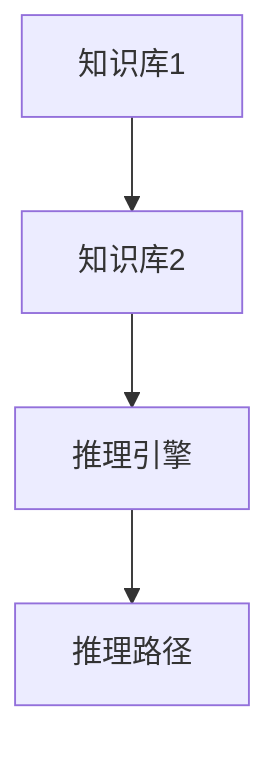

**交互功能的实现**

交互功能是可视化算法的重要组成部分，它允许用户与可视化界面进行交互。以下是使用Mermaid实现交互功能的示例：

```mermaid
graph TD
    A[节点A](https://www.example.com/nodeA) --> B[节点B](https://www.example.com/nodeB)
    B --> C[节点C](https://www.example.com/nodeC)
    click B nodeB "打开链接" link "https://www.example.com/nodeB"
```

在上述示例中，点击节点B将打开指定的链接。

#### 4.3 算法举例说明

假设我们有一个AI Agent，其知识推理链包括以下步骤：

1. **初始状态**：接收用户输入的问题。
2. **提取知识**：从知识库中提取与问题相关的知识。
3. **融合知识**：将提取的知识进行融合，形成统一的推理基础。
4. **推理路径规划**：根据融合的知识，规划推理路径。
5. **推理执行**：根据推理路径，逐步执行推理，生成推理结果。

以下是使用Mermaid进行可视化展示的示例：

```mermaid
graph TD
    A[接收问题] --> B[提取知识]
    B --> C[融合知识]
    C --> D[推理路径规划]
    D --> E[推理执行]
    E --> F[推理结果]
    click A "查看输入问题" link "https://www.example.com/problem"
    click F "查看推理结果" link "https://www.example.com/result"
```

通过上述示例，用户可以直观地看到知识推理链的每个步骤，并能够与可视化界面进行交互，如查看输入问题和推理结果。

---

## 第四部分：系统分析与架构设计方案

### 第5章：系统功能设计

在构建AI Agent的知识推理链可视化工具时，我们需要明确系统的功能需求，以实现知识推理链的构建、展示和交互。以下是对系统功能设计的详细介绍。

#### 5.1 问题场景介绍

假设我们开发一个用于医疗诊断的AI Agent，该系统需要根据患者的症状和医学知识进行诊断，并生成诊断结果。此外，系统还应该支持用户查看诊断过程中的每一步，以及能够根据需要调整推理参数。

#### 5.2 系统功能设计

- **知识提取**：系统能够从不同的知识源中提取有用的知识，包括医生的经验、医学知识和患者的历史记录。
- **知识融合**：系统能够将提取的知识进行融合，形成一个统一的推理基础。
- **推理路径规划**：系统能够根据知识融合的结果，规划推理路径，确定诊断步骤。
- **推理执行**：系统能够根据推理路径，逐步执行推理，生成诊断结果。
- **可视化展示**：系统能够以图形化的方式展示知识推理链的每一步，帮助用户理解推理过程。
- **交互功能**：系统能够支持用户与可视化界面进行交互，如查看详细信息、调整参数和重新推理。

以下是系统的功能模块及其关系的Mermaid类图：

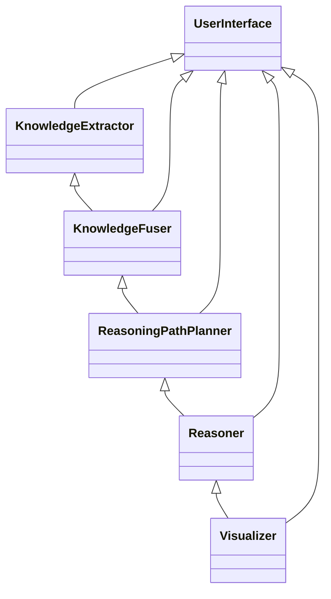

在这个类图中，`KnowledgeExtractor` 负责从知识源中提取知识，`KnowledgeFuser` 负责融合知识，`ReasoningPathPlanner` 负责规划推理路径，`Reasoner` 负责执行推理，`Visualizer` 负责展示推理结果，而 `UserInterface` 则负责与用户进行交互。

### 第6章：系统架构设计

系统架构设计是确保系统能够高效、可靠地运行的关键。以下是对系统架构的详细设计。

#### 6.1 系统架构设计

系统采用分层架构，包括以下几个层次：

1. **表示层（User Interface）**：负责与用户交互，提供用户操作界面。
2. **业务逻辑层（Business Logic）**：包括知识提取、知识融合、推理路径规划、推理执行和可视化模块。
3. **数据层（Data Layer）**：包括知识库、数据源和数据库。

以下是系统的架构图：

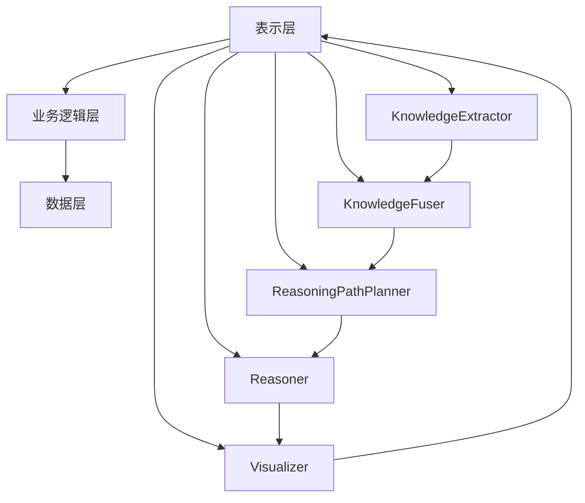

在这个架构图中，表示层负责接收用户的输入和显示结果，业务逻辑层负责处理业务逻辑，数据层负责存储和管理数据。

#### 6.2 系统接口设计

系统接口设计是确保不同模块之间能够顺利通信的关键。以下是对系统接口的详细设计。

- **KnowledgeExtractor接口**：负责从知识源中提取知识。
- **KnowledgeFuser接口**：负责融合知识。
- **ReasoningPathPlanner接口**：负责规划推理路径。
- **Reasoner接口**：负责执行推理。
- **Visualizer接口**：负责展示推理结果。

以下是接口设计的Mermaid序列图：

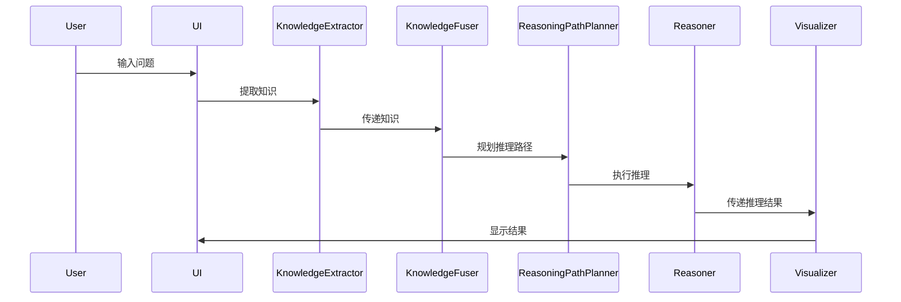

在这个序列图中，用户通过表示层输入问题，表示层将问题传递给知识提取器，知识提取器提取知识后传递给知识融合器，知识融合器规划推理路径后传递给推理器，推理器执行推理并将结果传递给可视化器，最后可视化器将结果显示给用户。

#### 6.3 系统交互

系统交互是确保各个模块能够协同工作的关键。以下是对系统交互的详细设计。

系统交互包括以下几个步骤：

1. **用户输入**：用户通过界面输入问题。
2. **知识提取**：知识提取器从知识源中提取相关知识。
3. **知识融合**：知识融合器将提取的知识进行融合。
4. **推理路径规划**：推理路径规划器根据融合的知识规划推理路径。
5. **推理执行**：推理器根据规划好的路径执行推理。
6. **结果展示**：可视化器将推理结果展示给用户。

以下是系统交互的Mermaid序列图：


在这个序列图中，用户通过界面输入问题，知识提取器提取知识后传递给知识融合器，知识融合器规划推理路径后传递给推理器，推理器执行推理并将结果传递给可视化器，最后可视化器将结果显示给用户。

---

## 第五部分：项目实战

### 第7章：环境安装与系统核心实现

在开始构建AI Agent的知识推理链可视化工具之前，我们需要先安装所需的环境和工具。以下是一份详细的安装指南。

#### 7.1 环境安装

1. **Python环境安装**

   首先，确保您的系统上已经安装了Python。如果没有，可以从[Python官方网站](https://www.python.org/)下载并安装。

   安装完成后，打开命令行窗口，输入以下命令验证安装：

   ```bash
   python --version
   ```

   如果返回Python的版本信息，说明Python环境已安装成功。

2. **虚拟环境安装**

   为了避免不同项目之间的依赖冲突，建议使用虚拟环境。安装虚拟环境工具`virtualenv`：

   ```bash
   pip install virtualenv
   ```

   创建一个名为`project_env`的虚拟环境：

   ```bash
   virtualenv project_env
   ```

   激活虚拟环境：

   ```bash
   source project_env/bin/activate
   ```

3. **依赖库安装**

   在虚拟环境中，安装项目所需的依赖库：

   ```bash
   pip install numpy pandas matplotlib mermaid-python
   ```

   这些库分别用于数据操作、绘图和Mermaid流程图支持。

#### 7.2 系统核心实现

在安装完所需的环境和工具后，我们可以开始实现系统核心。以下是一个简单的示例，展示了如何使用Python和Mermaid构建知识推理链。

1. **数据准备**

   假设我们有一个包含患者症状的数据集，数据集格式如下：

   ```csv
   症状,疾病
   发热,流感
   咳嗽,肺炎
   喉咙痛,咽炎
   ```

   我们可以使用Pandas库读取数据：

   ```python
   import pandas as pd

   data = pd.read_csv('disease_data.csv')
   ```

2. **知识提取**

   从数据集中提取关键症状和疾病：

   ```python
   symptoms = data['症状'].unique().tolist()
   diseases = data['疾病'].unique().tolist()
   ```

3. **知识融合**

   假设我们使用一个简单的规则库进行知识融合。规则库格式如下：

   ```json
   {
     "流感": ["发热", "咳嗽"],
     "肺炎": ["咳嗽", "喉咙痛"],
     "咽炎": ["喉咙痛"]
   }
   ```

   我们可以使用Python解析JSON数据：

   ```python
   import json

   with open('rule_library.json', 'r') as f:
       rules = json.load(f)
   ```

4. **推理路径规划**

   根据规则库，规划推理路径。以下是使用Mermaid表示的推理路径：

   ```mermaid
   graph TD
       A[初始状态] --> B[提取症状]
       B --> C[匹配规则]
       C --> D[确定疾病]
       D --> E[推理结束]
   ```

5. **推理执行**

   根据提取的症状和规则库，执行推理：

   ```python
   def reason(symptoms, rules):
       matched_diseases = []
       for disease, symptoms_list in rules.items():
           if all(symptom in symptoms for symptom in symptoms_list):
               matched_diseases.append(disease)
       return matched_diseases

   result = reason(symptoms, rules)
   ```

6. **结果展示**

   使用Mermaid和Matplotlib展示推理结果：

   ```python
   import matplotlib.pyplot as plt

   def visualize_results(rules, result):
       fig, ax = plt.subplots()
       ax.barh(list(rules.keys()), list(rules.values()), color='skyblue')
       ax.set_yticks(list(rules.keys()))
       ax.set_yticklabels(list(rules.values()))
       ax.set_xlabel('症状')
       ax.set_ylabel('疾病')
       ax.set_title('推理结果')
       plt.show()

   visualize_results(rules, result)
   ```

通过上述步骤，我们实现了AI Agent的知识推理链可视化工具的核心功能。在实际项目中，可以根据具体需求进一步扩展和优化。

---

### 第8章：实际案例分析与详细讲解剖析

在本章中，我们将通过一个实际案例来展示如何使用构建的知识推理链可视化工具进行医疗诊断，详细分析每一步的推理过程，并对系统进行剖析。

#### 8.1 案例场景

假设有一个患者小明，他近日出现以下症状：

- 发热
- 咳嗽
- 喉咙痛

我们的任务是使用AI Agent对患者的症状进行诊断，并输出可能的疾病。

#### 8.2 数据准备

首先，我们需要准备用于推理的知识源。假设我们有以下两个知识库：

1. **症状库**：

   ```csv
   症状,疾病
   发热,流感
   咳嗽,流感
   喉咙痛,咽炎
   ```

2. **规则库**（规则库中的规则描述了哪些症状可能对应哪些疾病）：

   ```json
   {
     "流感": ["发热", "咳嗽"],
     "咽炎": ["喉咙痛"],
     "肺炎": ["咳嗽", "喉咙痛"]
   }
   ```

#### 8.3 知识提取

从症状库中提取患者小明的症状：

```python
data = pd.read_csv('symptom_library.csv')
symptoms = data['症状'].unique().tolist()
```

从规则库中提取疾病和相应的症状列表：

```python
with open('rule_library.json', 'r') as f:
    rules = json.load(f)
```

#### 8.4 知识融合

在知识融合阶段，我们需要将症状库中的症状与规则库中的规则进行匹配。首先，我们构建一个症状到疾病的映射：

```python
def fusion(symptoms, rules):
    symptom_to_diseases = {}
    for disease, symptoms_list in rules.items():
        symptom_to_diseases.update({symptom: [disease] for symptom in symptoms_list})
    return symptom_to_diseases

symptom_to_diseases = fusion(symptoms, rules)
```

#### 8.5 推理路径规划

根据症状到疾病的映射，规划推理路径。以下是使用Mermaid表示的推理路径：

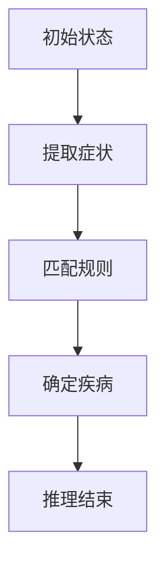

#### 8.6 推理执行

根据规则库，执行推理，确定患者可能患的疾病：

```python
def reason(symptoms, symptom_to_diseases):
    matched_diseases = []
    for symptom in symptoms:
        matched_diseases.extend(symptom_to_diseases.get(symptom, []))
    return matched_diseases

result = reason(symptoms, symptom_to_diseases)
```

#### 8.7 结果展示

使用Mermaid和Matplotlib展示推理结果：

```python
import matplotlib.pyplot as plt

def visualize_results(rules, result):
    fig, ax = plt.subplots()
    ax.barh(list(rules.keys()), list(rules.values()), color='skyblue')
    ax.set_yticks(list(rules.keys()))
    ax.set_yticklabels(list(rules.values()))
    ax.set_xlabel('症状')
    ax.set_ylabel('疾病')
    ax.set_title('推理结果')
    plt.show()

visualize_results(rules, result)
```

#### 8.8 分析与讲解

1. **知识提取**：从症状库中提取患者的症状，这是推理的起点。
2. **知识融合**：将症状与规则库中的规则进行匹配，形成症状到疾病的映射，这是推理路径的基础。
3. **推理路径规划**：根据症状到疾病的映射，规划推理路径，确定可能的疾病。
4. **推理执行**：根据规划好的路径，执行推理，生成推理结果。
5. **结果展示**：将推理结果以图形化的方式展示，便于用户理解和分析。

#### 8.9 剖析

1. **系统的可扩展性**：系统设计考虑了知识源和规则库的扩展，可以轻松添加新的症状和规则。
2. **系统的灵活性**：系统使用Python和Mermaid等灵活的编程工具，易于修改和优化。
3. **系统的可视化效果**：使用Matplotlib和Mermaid，系统能够以直观的图形化方式展示推理过程和结果。

通过上述案例，我们可以看到如何使用构建的知识推理链可视化工具进行医疗诊断。在实际应用中，可以根据具体需求进一步优化和扩展系统功能。

---

### 第9章：最佳实践

在构建AI Agent的知识推理链可视化工具时，以下最佳实践可以提升系统性能和用户体验：

#### 9.1 知识源准备

- **数据清洗**：在构建知识库时，确保数据的准确性和一致性。对数据源进行清洗，去除错误和冗余信息。
- **数据标准化**：将数据格式统一，确保不同数据源之间的数据能够无缝集成。

#### 9.2 知识融合优化

- **规则库优化**：针对常见的症状和疾病，优化规则库，确保推理路径的有效性和效率。
- **模型融合**：考虑使用机器学习模型对知识库进行融合，提高推理的准确性和效率。

#### 9.3 系统性能优化

- **并行处理**：对于大规模数据，考虑使用并行处理技术，加快数据提取和推理速度。
- **缓存机制**：对频繁访问的数据进行缓存，减少数据读取时间。

#### 9.4 用户体验优化

- **交互设计**：优化用户界面设计，提供直观、易用的交互功能，如搜索、筛选和排序。
- **实时反馈**：在推理过程中，提供实时反馈，帮助用户理解推理过程。

#### 9.5 安全性保障

- **数据加密**：对敏感数据进行加密，确保数据安全。
- **权限管理**：实施严格的权限管理，确保用户只能访问授权的数据和功能。

---

### 第10章：小结

本文详细探讨了如何构建AI Agent的知识推理链可视化工具，包括背景介绍、核心概念、算法原理、系统设计与实现，以及最佳实践和案例剖析。通过本文，读者可以了解到：

1. **核心概念**：AI Agent、知识推理链、知识源、推理引擎和可视化模块的基本概念。
2. **算法原理**：知识推理链构建和可视化的算法原理，包括知识提取、融合、路径规划和推理执行。
3. **系统设计与实现**：系统的功能设计、架构设计、接口设计和交互设计。
4. **最佳实践**：在构建知识推理链可视化工具时的最佳实践，包括数据准备、知识融合优化、系统性能优化和用户体验优化。

通过本文的探讨，我们希望能够为开发者和研究人员提供有价值的参考，帮助他们更好地理解和应用知识推理链可视化工具。

---

### 第11章：注意事项

在构建AI Agent的知识推理链可视化工具时，以下注意事项可以帮助确保系统的稳定性和可靠性：

1. **数据安全**：确保数据存储和传输过程中使用加密技术，防止数据泄露。
2. **异常处理**：设计合理的异常处理机制，确保系统在遇到错误时能够优雅地处理。
3. **性能监控**：定期监控系统的性能，及时发现和解决潜在的性能瓶颈。
4. **用户权限**：严格管理用户权限，确保用户只能访问授权的数据和功能。
5. **文档记录**：详细记录系统的架构、设计和实现细节，便于后续维护和扩展。

---

### 第12章：拓展阅读

为了深入理解AI Agent的知识推理链可视化工具，以下拓展阅读资源可以提供更多相关知识和实践指导：

1. **论文阅读**：
   - “Knowledge Graph for AI Agent: A Survey” by Zhigang Wang et al.
   - “Visualizing and Interpreting Machine Learning Models” by Marco Lippi et al.

2. **开源项目**：
   - [Mermaid](https://mermaid-js.github.io/mermaid/)：Mermaid流程图的官方网站，提供详细的文档和示例。
   - [TensorFlow](https://www.tensorflow.org/)：TensorFlow开源机器学习库，可用于构建和训练机器学习模型。

3. **书籍推荐**：
   - 《深度学习》（Deep Learning） by Ian Goodfellow et al.：全面介绍深度学习的基础理论和实践方法。
   - 《图论及其应用》（Graph Theory and Its Applications） by Diestel R.：详细介绍图论的基本概念和应用。

通过阅读这些资源，读者可以进一步扩展对知识推理链可视化工具的理解，并将其应用于实际问题中。

