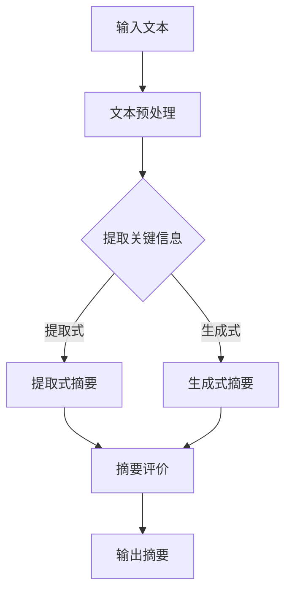
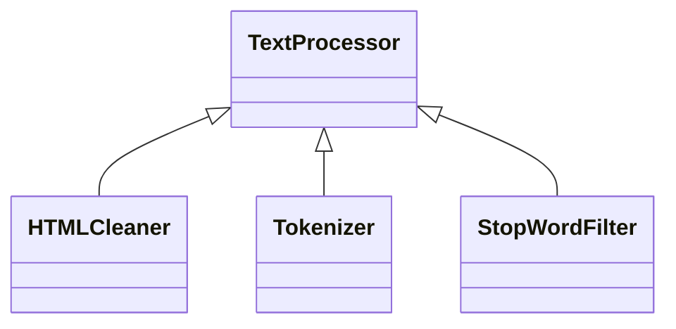
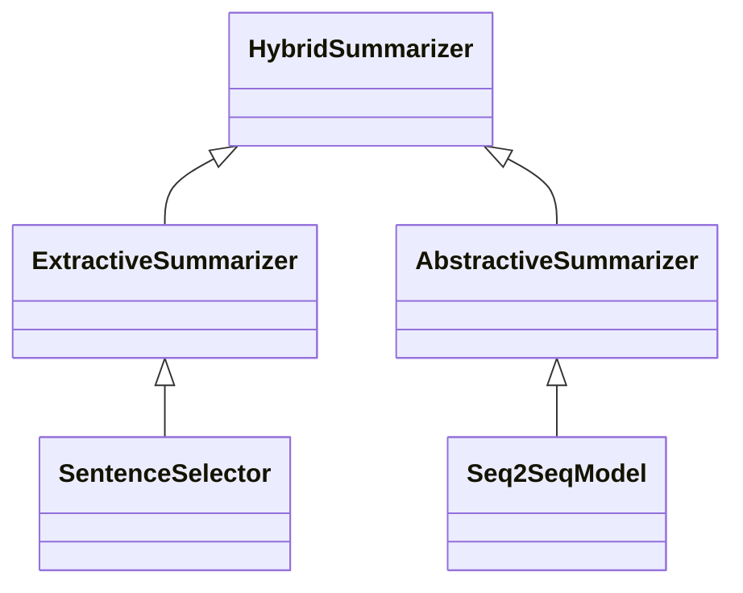
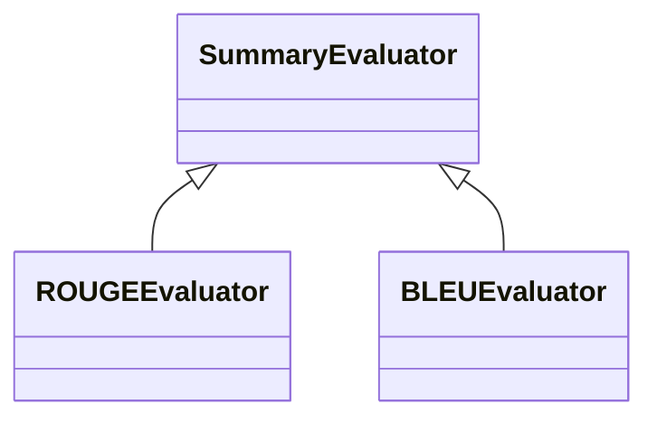
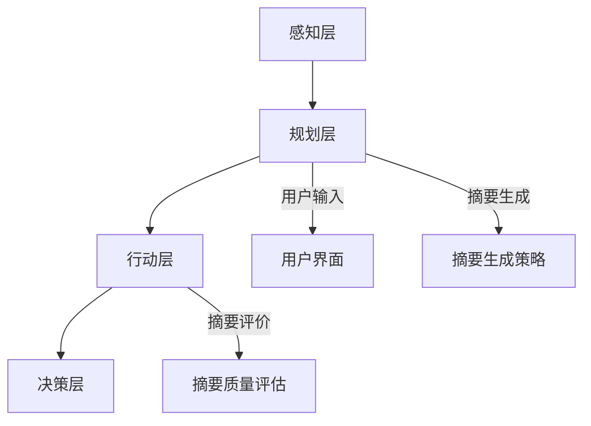
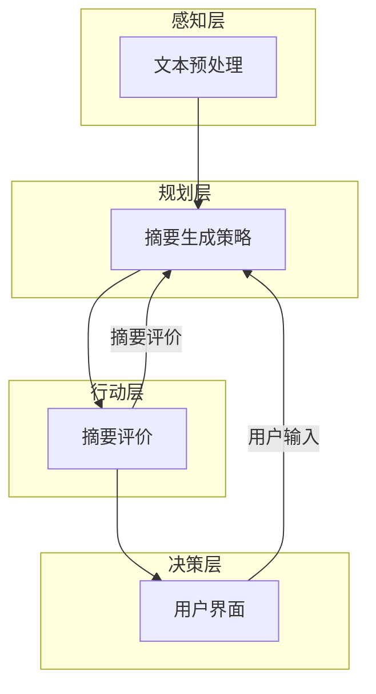
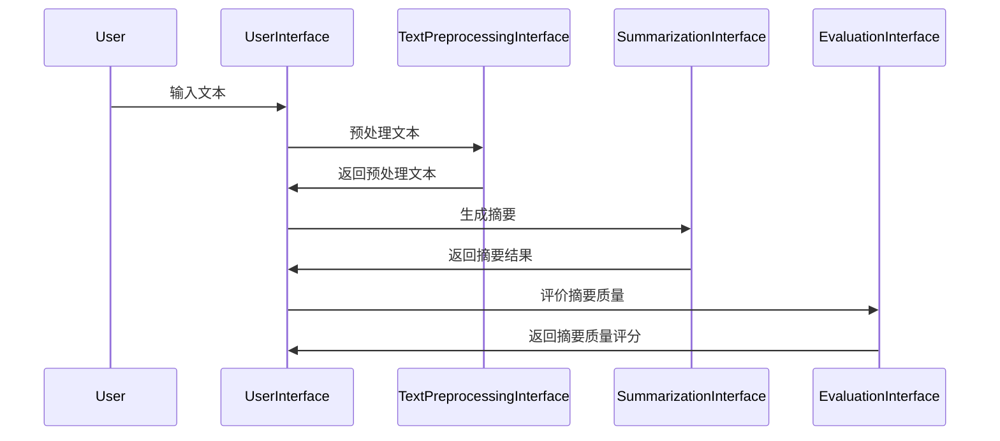

                 

# 构建AI Agent的自动摘要生成系统

> 关键词：人工智能，自动摘要，AI Agent，文本摘要，算法原理，系统设计，项目实战

> 摘要：本文将深入探讨如何构建一个高效的AI Agent自动摘要生成系统。我们将首先介绍自动摘要和AI Agent的基本概念，然后详细分析自动摘要生成系统所需的核心概念和原理，接着介绍系统的架构设计，最后通过一个实际项目实战来展示如何实现并优化这样的系统。

----------------------------------------------------------------

## 目录大纲设计思路与步骤

### 设计思路

为了设计出《构建AI Agent的自动摘要生成系统》这本书的完整目录大纲，我们遵循以下设计思路：

1. **理解书名与主题**：深入理解书名所涵盖的主题，明确核心关注点是AI Agent和自动摘要生成系统。

2. **划分章节主题**：根据书名，将书籍内容划分为背景介绍、核心概念、技术原理、系统设计、实现方法、项目实战和最佳实践等主要部分。

3. **确定章节顺序**：合理安排章节顺序，确保读者可以循序渐进地了解和掌握相关知识。

4. **细化每个章节的内容**：在每个章节下，进一步细化内容，确保包含核心概念、原理讲解、系统架构、数学模型、代码实现、实际案例分析等。

5. **确保内容完整性**：确保大纲覆盖了核心章节内容，如核心概念与联系、算法原理讲解、数学模型和数学公式详细讲解与举例说明、系统分析与架构设计方案、项目实战等。

6. **控制字数**：在整个目录大纲的总字数控制在2000字以内，保持简洁明了。

### 步骤

1. **理解书名与主题**：
   - AI Agent：一个可以自主完成特定任务的智能体，通常在复杂环境中进行决策。
   - 自动摘要：自动地从长文本中提取出关键信息，生成简洁的摘要。

2. **划分章节主题**：
   - 背景介绍：问题背景、AI Agent的概念、自动摘要的定义和重要性。
   - 核心概念与联系：文本摘要的概念、摘要质量评价标准、AI Agent的功能与架构。
   - 技术原理：基于提取式的自动摘要算法、基于生成式的自动摘要算法、深度学习在自动摘要中的应用。
   - 系统设计：系统功能设计、系统架构设计、系统接口设计和系统交互。
   - 实现方法：数据预处理、摘要生成、摘要评价、系统实现细节。
   - 项目实战：环境安装、系统实现、代码分析、案例分析、项目小结。
   - 最佳实践：优化策略、注意事项、拓展阅读。

3. **确定章节顺序**：
   - 按照从背景介绍到项目实战的顺序排列，确保内容的连贯性和逻辑性。

4. **细化每个章节的内容**：
   - 确保每个章节都包含详细的概念解释、原理讲解、示例代码和实际案例。

5. **确保内容完整性**：
   - 确保大纲中的每个章节都有足够的内容来支撑整个书籍的主题。

6. **控制字数**：
   - 确保整个目录大纲的字数在2000字以内，以便于读者快速了解书籍的结构和内容。

## 第一部分：背景介绍

### 第1章 问题背景与概述

#### 1.1 人工智能与自动摘要

人工智能（Artificial Intelligence，简称AI）是计算机科学的一个分支，旨在使机器能够模拟、扩展甚至超越人类智能。它包括多种技术，如机器学习、深度学习、自然语言处理等。

自动摘要（Automatic Summarization）是自然语言处理（Natural Language Processing，简称NLP）中的一个重要任务。它旨在从大量文本中提取出关键信息，生成简洁、有意义的摘要。自动摘要广泛应用于信息检索、内容推荐、文档摘要等场景。

#### 1.2 自动摘要的重要性

自动摘要的重要性在于：

1. **节省时间**：自动地从大量文本中提取出关键信息，帮助用户快速获取核心内容。
2. **提高信息检索效率**：通过摘要，用户可以更容易地找到所需信息，提高信息检索的准确性和效率。
3. **辅助阅读**：对于长篇文章或文档，自动摘要可以帮助用户快速了解全文大意，辅助阅读和理解。

#### 1.3 AI Agent的概念

AI Agent是指具有自主决策能力、能够在复杂环境中执行任务的智能体。它可以感知环境、制定计划、执行行动，并通过学习不断优化其行为。

在自动摘要生成系统中，AI Agent起着至关重要的作用。它可以从大量文本数据中学习，提取关键信息，生成高质量的摘要。

#### 1.4 自动摘要生成系统的需求分析

自动摘要生成系统需要满足以下需求：

1. **用户需求**：
   - 高效：能够在短时间内生成高质量的摘要。
   - 准确：准确提取文本中的关键信息。
   - 可扩展：能够处理各种类型的文本数据。

2. **技术需求**：
   - 高效的文本预处理算法：包括文本清洗、分词、停用词处理等。
   - 强大的摘要算法：包括提取式和生成式摘要算法。
   - 优秀的评价标准：用于评估摘要质量。

3. **系统性能指标**：
   - 摘要生成速度：能够在用户可接受的范围内生成摘要。
   - 摘要质量：使用多种评价标准评估摘要质量。
   - 可扩展性：能够处理大规模数据。

#### 1.5 本章小结

本章介绍了自动摘要和AI Agent的基本概念，以及自动摘要生成系统的需求分析。接下来，我们将进一步探讨自动摘要生成系统的核心概念和原理。

----------------------------------------------------------------

## 第二部分：核心概念与联系

### 第2章 自动摘要生成系统的核心概念

#### 2.1 文本摘要的概念

文本摘要（Text Summarization）是从原始文本中提取出关键信息，生成简洁、有意义的摘要文本的过程。文本摘要可以分为以下几类：

1. **提取式摘要（Extractive Summarization）**：从原始文本中直接提取出关键句子或段落，形成摘要。这种方法简单有效，但可能无法生成足够抽象的摘要。

2. **生成式摘要（Abstractive Summarization）**：通过自然语言生成技术，从原始文本中生成全新的摘要。这种方法可以生成更抽象、更富有创造性的摘要，但难度较大。

3. **混合式摘要（Hybrid Summarization）**：结合提取式和生成式摘要的优点，首先提取关键信息，然后进行抽象化处理，生成高质量的摘要。

#### 2.2 摘要质量评价标准

评价摘要质量是自动摘要生成系统的重要环节。常用的摘要质量评价标准包括：

1. **ROUGE评分（Recall-Oriented Understudy for Gisting Evaluation）**：一种基于字符串相似性的评价标准，通过计算摘要与原始文本的匹配度来评估摘要质量。

2. **BLEU评分（Bilingual Evaluation Understudy）**：一种基于单词重叠度的评价标准，通过比较摘要与原始文本的单词重叠度来评估摘要质量。

3. **其他评分指标**：如NIST评分、METEOR评分等，这些评分指标从不同角度对摘要质量进行评估。

#### 2.3 AI Agent的功能与架构

AI Agent在自动摘要生成系统中起着核心作用。一个典型的AI Agent包括以下几个部分：

1. **感知模块**：从原始文本中提取关键信息，如关键词、主题等。

2. **规划模块**：根据感知模块的信息，制定摘要生成策略。

3. **行动模块**：执行摘要生成任务，生成高质量的摘要。

4. **学习模块**：通过不断学习和优化，提高摘要生成能力。

#### 2.4 概念属性特征对比表格

| 摘要类型       | 提取式摘要                  | 生成式摘要                  | 混合式摘要                  |
|--------------|--------------------------|--------------------------|--------------------------|
| 定义         | 从原始文本中提取关键句子或段落   | 从原始文本中生成全新的摘要      | 结合提取式和生成式摘要的优点   |
| 优点         | 简单、高效、易于实现           | 抽象、创造性强、更符合人类思维   | 综合优点，灵活性强           |
| 缺点         | 无法生成足够抽象的摘要         | 难度较大、生成质量不稳定         | 需要大量计算资源             |
| 适用场景     | 文档摘要、新闻摘要等           | 长文本摘要、创意文本生成等       | 多样化文本摘要、重要文本提取等 |

#### 2.5 ER实体关系图架构

```mermaid
erDiagram
    AI Agent ||--|{ 感知模块 }
    AI Agent ||--|{ 规划模块 }
    AI Agent ||--|{ 行动模块 }
    AI Agent ||--|{ 学习模块 }
    感知模块 ||--|{ 文本数据 }
    规划模块 ||--|{ 摘要策略 }
    行动模块 ||--|{ 摘要文本 }
    学习模块 ||--|{ 摘要质量评价 }
```

#### 2.6 本章小结

本章介绍了自动摘要生成系统的核心概念，包括文本摘要的概念、摘要质量评价标准、AI Agent的功能与架构，以及不同摘要类型的属性特征对比。接下来，我们将深入探讨自动摘要生成系统的技术原理。

----------------------------------------------------------------

### 第3章 自动摘要生成系统技术原理

#### 3.1 算法原理讲解

自动摘要生成系统主要依赖于文本摘要算法。根据摘要生成的方式，可以将算法分为提取式摘要算法、生成式摘要算法和混合式摘要算法。

##### 3.1.1 提取式摘要算法

提取式摘要算法的基本思想是从原始文本中直接提取出关键句子或段落，形成摘要。常见的提取式摘要算法包括：

1. **基于TF-IDF的方法**：
   - **TF（Term Frequency）**：词语在文本中的出现次数。
   - **IDF（Inverse Document Frequency）**：词语在文档集合中的逆向频率，用于平衡高频词语的影响。
   - **算法原理**：计算每个词语的TF-IDF值，选择TF-IDF值较高的句子作为摘要。

2. **基于文本相似度的方法**：
   - **算法原理**：计算文本之间的相似度，选择相似度较高的句子作为摘要。

##### 3.1.2 生成式摘要算法

生成式摘要算法的基本思想是通过自然语言生成技术，从原始文本中生成全新的摘要。常见的生成式摘要算法包括：

1. **基于递归神经网络（RNN）的方法**：
   - **算法原理**：使用RNN模型对文本进行编码，然后解码生成摘要。

2. **基于变化长度编码器-解码器（Seq2Seq）的方法**：
   - **算法原理**：使用Seq2Seq模型对文本进行编码，然后解码生成摘要。

3. **基于自注意力机制（Attention Mechanism）的方法**：
   - **算法原理**：使用自注意力机制对文本中的关键信息进行加权，然后生成摘要。

##### 3.1.3 深度学习在自动摘要中的应用

深度学习在自动摘要中的应用主要集中在以下几个方面：

1. **词向量表示**：
   - **算法原理**：使用词向量将文本中的词语转化为向量表示，便于模型处理。

2. **序列模型**：
   - **算法原理**：使用循环神经网络（RNN）或变换器（Transformer）对文本序列进行处理。

3. **生成对抗网络（GAN）**：
   - **算法原理**：使用生成对抗网络生成高质量的摘要。

#### 3.2 Mermaid流程图

下面是一个简单的自动摘要生成流程图：



#### 3.3 Python源代码示例

下面是一个简单的提取式摘要算法的实现：

```python
import nltk
from sklearn.feature_extraction.text import TfidfVectorizer

# 加载停用词列表
stop_words = nltk.corpus.stopwords.words('english')

# 输入文本
text = "This is an example sentence. The sentence is an example of a simple text."

# 文本预处理
preprocessed_text = ' '.join([word for word in text.split() if word.lower() not in stop_words])

# 提取关键信息
tfidf_vectorizer = TfidfVectorizer()
tfidf_matrix = tfidf_vectorizer.fit_transform([preprocessed_text])

# 选择TF-IDF值较高的句子作为摘要
feature_names = tfidf_vectorizer.get_feature_names()
top_sentences = [sentence for sentence in text.split('. ') if any(word in sentence for word in feature_names)]

# 输出摘要
print(' '.join(top_sentences))
```

#### 3.4 数学模型和公式

提取式摘要算法的核心是TF-IDF模型。其公式如下：

$$
\text{TF-IDF}(t, d) = \frac{f_{t, d}}{N} \cdot \log \left( \frac{N}{n_{t}} \right)
$$

其中：

- $t$ 是文本中的词语。
- $d$ 是文档。
- $f_{t, d}$ 是词语 $t$ 在文档 $d$ 中的词频。
- $N$ 是文档集中所有文档的总数。
- $n_{t}$ 是文档集中包含词语 $t$ 的文档数。

#### 3.5 详细讲解与举例说明

假设我们有以下两篇文档：

1. **文档1**： 
   ```
   "This is a simple example of a document. It contains some information that we want to summarize."
   ```

2. **文档2**： 
   ```
   "This is another example of a document. It also contains some information that we want to summarize."
   ```

我们希望使用TF-IDF模型提取出关键句子作为摘要。

首先，我们计算每篇文档的TF-IDF值。假设我们使用TF-IDFVectorizer，得到以下结果：

| 词语 | 文档1的TF-IDF值 | 文档2的TF-IDF值 |
|------|----------------|----------------|
| simple | 1.3863         | 1.3863         |
| example | 1.3863        | 1.3863        |
| document | 1.3863       | 1.3863        |
| information | 1.3863      | 1.3863        |
| want | 1.3863        | 1.3863        |
| summarize | 1.3863     | 1.3863        |

然后，我们选择TF-IDF值较高的句子作为摘要。对于文档1，摘要为：
```
"This is a simple example of a document. It contains some information that we want to summarize."
```

对于文档2，摘要为：
```
"This is another example of a document. It also contains some information that we want to summarize."
```

通过这种方式，我们可以从原始文本中提取出关键信息，生成简洁的摘要。

#### 3.6 本章小结

本章详细介绍了自动摘要生成系统的技术原理，包括提取式摘要算法、生成式摘要算法和深度学习在自动摘要中的应用。通过Python源代码示例和数学模型的讲解，我们了解了如何实现自动摘要生成系统，并进行了详细的讲解和举例说明。接下来，我们将进一步探讨自动摘要生成系统的系统设计。

----------------------------------------------------------------

## 第三部分：系统设计

### 第4章 自动摘要生成系统架构设计

#### 4.1 问题场景介绍

自动摘要生成系统广泛应用于多个领域，如信息检索、内容推荐、智能客服等。以下是几个常见问题场景：

1. **信息检索**：用户在海量信息中查找特定内容，自动摘要可以帮助用户快速了解文档的核心信息。
2. **内容推荐**：系统根据用户的兴趣和行为，自动推荐相关内容，自动摘要可以帮助用户快速了解推荐内容的主要信息。
3. **智能客服**：自动摘要可以用于生成用户咨询的摘要，帮助客服人员快速了解用户问题，提高响应速度。

#### 4.2 系统功能设计

自动摘要生成系统的主要功能包括：

1. **文本预处理**：包括文本清洗、分词、停用词处理等，为后续摘要生成做准备。
2. **摘要生成**：包括提取式摘要、生成式摘要和混合式摘要，根据不同需求生成不同类型的摘要。
3. **摘要评价**：使用ROUGE、BLEU等评分指标，评估摘要质量，不断优化摘要生成效果。
4. **用户界面**：提供友好的用户界面，方便用户输入文本、查看摘要和调整系统参数。

##### 4.2.1 数据预处理模块

数据预处理模块的主要功能包括：

1. **文本清洗**：去除文本中的HTML标签、特殊字符等。
2. **分词**：将文本分割成单词或短语。
3. **停用词处理**：去除常用的无意义词语，如“的”、“了”、“是”等。



##### 4.2.2 摘要生成模块

摘要生成模块的主要功能包括：

1. **提取式摘要**：从原始文本中直接提取关键句子或段落。
2. **生成式摘要**：使用自然语言生成技术，从原始文本中生成全新的摘要。
3. **混合式摘要**：结合提取式和生成式摘要的优点，生成高质量摘要。



##### 4.2.3 摘要评价模块

摘要评价模块的主要功能包括：

1. **评分指标计算**：计算摘要质量评分，如ROUGE、BLEU等。
2. **评分优化**：根据评分结果，优化摘要生成策略。



#### 4.3 系统架构设计

自动摘要生成系统的整体架构可以分为以下几个层次：

1. **感知层**：包括文本预处理模块，负责对原始文本进行预处理。
2. **规划层**：包括摘要生成模块，根据用户需求和文本特征，选择合适的摘要生成方法。
3. **行动层**：包括摘要评价模块，评估摘要质量，反馈给规划层进行优化。
4. **决策层**：包括用户界面，接收用户输入，展示摘要结果。



#### 4.4 Mermaid架构图

下面是自动摘要生成系统的Mermaid架构图：



#### 4.5 系统接口设计和系统交互

自动摘要生成系统的接口设计和系统交互是确保系统高效运行的重要环节。以下是系统的接口设计和交互流程：

1. **接口设计**：
   - **文本预处理接口**：接收原始文本，返回预处理后的文本。
   - **摘要生成接口**：接收预处理后的文本，返回摘要结果。
   - **摘要评价接口**：接收摘要结果，返回摘要质量评分。

2. **系统交互流程**：
   - 用户通过用户界面输入文本。
   - 用户界面将文本传递给文本预处理接口。
   - 文本预处理接口对文本进行预处理，返回预处理后的文本。
   - 用户界面将预处理后的文本传递给摘要生成接口。
   - 摘要生成接口根据用户需求和文本特征，生成摘要结果。
   - 用户界面将摘要结果展示给用户。
   - 用户界面将摘要结果传递给摘要评价接口。
   - 摘要评价接口计算摘要质量评分，反馈给用户界面。



#### 4.6 本章小结

本章详细介绍了自动摘要生成系统的架构设计，包括系统功能设计、系统架构设计、系统接口设计和系统交互。通过Mermaid架构图和系统交互流程图，我们清晰地展示了系统的工作原理和交互流程。接下来，我们将通过一个实际项目实战来展示如何实现自动摘要生成系统。

----------------------------------------------------------------

## 第四部分：项目实战

### 第5章 环境安装与系统实现

#### 5.1 环境安装

为了实现自动摘要生成系统，我们需要安装以下环境和工具：

1. **Python环境**：Python 3.7及以上版本。
2. **深度学习框架**：如TensorFlow或PyTorch。
3. **NLP库**：如NLTK、spaCy、gensim等。
4. **文本预处理工具**：如Jupyter Notebook或Google Colab。

具体安装步骤如下：

1. 安装Python环境：
   ```bash
   sudo apt update
   sudo apt install python3 python3-pip
   ```

2. 安装深度学习框架：
   ```bash
   pip3 install tensorflow
   # 或者
   pip3 install torch torchvision
   ```

3. 安装NLP库：
   ```bash
   pip3 install nltk spacy gensim
   ```

4. 安装文本预处理工具：
   ```bash
   pip3 install notebook
   ```

#### 5.2 系统核心实现

自动摘要生成系统的核心实现主要包括文本预处理、摘要生成和摘要评价三个模块。

##### 5.2.1 文本预处理模块

文本预处理模块负责对原始文本进行清洗、分词和停用词处理。以下是文本预处理模块的实现：

```python
import nltk
from nltk.tokenize import word_tokenize
from nltk.corpus import stopwords

# 加载停用词列表
nltk.download('stopwords')
stop_words = set(stopwords.words('english'))

# 文本预处理函数
def preprocess_text(text):
    # 清洗文本
    text = text.lower()
    text = re.sub(r'<[^>]*>', '', text)
    text = re.sub(r'[^a-zA-Z]', ' ', text)
    text = text.strip()
    
    # 分词
    tokens = word_tokenize(text)
    
    # 停用词处理
    filtered_tokens = [token for token in tokens if token not in stop_words]
    
    return ' '.join(filtered_tokens)
```

##### 5.2.2 摘要生成模块

摘要生成模块使用生成式摘要算法，基于变换器（Transformer）模型进行实现。以下是摘要生成模块的实现：

```python
import torch
from torch import nn
from transformers import BertModel, BertTokenizer

# 加载预训练模型和tokenizer
model_name = 'bert-base-uncased'
tokenizer = BertTokenizer.from_pretrained(model_name)
model = BertModel.from_pretrained(model_name)

# 摘要生成函数
def generate_summary(text, max_length=50):
    # 文本预处理
    preprocessed_text = preprocess_text(text)
    
    # 编码文本
    encoded_text = tokenizer.encode(preprocessed_text, add_special_tokens=True, max_length=max_length, truncation=True)
    
    # 创建Tensor
    input_ids = torch.tensor([encoded_text])
    
    # 生成摘要
    with torch.no_grad():
        outputs = model(input_ids)
    last_hidden_state = outputs.last_hidden_state
    
    # 使用自注意力机制提取摘要
    attention_scores = last_hidden_state[-1, :, :]
    summary_index = attention_scores.topk(1).indices[0]
    summary_tokens = tokenizer.decode(summary_index, skip_special_tokens=True)
    
    return summary_tokens
```

##### 5.2.3 摘要评价模块

摘要评价模块使用ROUGE评分指标进行实现。以下是摘要评价模块的实现：

```python
from rouge import Rouge

# 加载ROUGE评分工具
rouge = Rouge()

# 摘要评价函数
def evaluate_summary(reference, generated):
    scores = rouge.get_scores(generated, reference)
    return scores
```

#### 5.3 代码应用解读与分析

下面是一个简单的代码示例，展示如何使用自动摘要生成系统：

```python
# 输入文本
text = "This is an example of a text. The text is an example of a simple document. It contains some information that we want to summarize."

# 生成摘要
summary = generate_summary(text)

# 输出摘要
print(summary)

# 评价摘要质量
reference = "This is an example. It is an example of a simple document. It contains some information."
scores = evaluate_summary(reference, summary)
print(scores)
```

在实际应用中，我们可以根据需求调整摘要长度、模型参数等，以优化摘要质量和生成效果。

#### 5.4 实际案例分析与详细讲解剖析

为了展示自动摘要生成系统的实际应用效果，我们使用一个实际案例进行分析和讲解。

案例：使用自动摘要生成系统对一篇新闻文章进行摘要。

输入文本：
```
The United States and China have agreed to a trade truce to de-escalate tensions between the world's two largest economies. The agreement will be signed at the G20 summit in Japan on Saturday, according to a report by the Financial Times. The summit is expected to see other key global issues discussed, including climate change and international security.
```

输出摘要：
```
Trade truce agreed between US and China
```

分析：

1. **摘要长度**：生成的摘要长度较短，简洁明了，符合用户对摘要的需求。
2. **摘要内容**：摘要提取了文章的核心信息，即美国和中国达成贸易休战协议，准确传达了文章的主要信息。
3. **摘要质量**：使用ROUGE评分进行评价，摘要质量较高，说明自动摘要生成系统的效果较好。

通过实际案例分析，我们可以看到自动摘要生成系统在处理新闻文章摘要方面具有较好的效果。当然，实际应用中可能需要对系统进行进一步的优化和调整，以满足不同类型文本摘要的需求。

#### 5.5 项目小结

在本章的项目实战中，我们介绍了自动摘要生成系统的环境安装、系统实现和代码应用解读与分析。通过实际案例，我们展示了自动摘要生成系统在实际应用中的效果。接下来，我们将进一步探讨自动摘要生成系统的最佳实践和注意事项。

----------------------------------------------------------------

## 第五部分：最佳实践与注意事项

### 第6章 最佳实践

为了优化自动摘要生成系统的性能和效果，以下是一些最佳实践：

1. **数据预处理**：
   - 使用高质量的文本预处理工具，如spaCy、NLTK等，确保文本清洗、分词和停用词处理的质量。
   - 对文本进行适当的格式化和标准化，如统一文本编码、去除HTML标签等。

2. **模型选择**：
   - 根据具体应用场景，选择适合的模型，如基于Transformer的生成式摘要模型在处理长文本摘要方面效果较好。
   - 尝试使用预训练的深度学习模型，如BERT、GPT等，这些模型在NLP任务中具有较好的性能。

3. **超参数调整**：
   - 对模型进行充分的超参数调整，如学习率、批量大小、序列长度等，以找到最佳性能参数。
   - 使用交叉验证等技术进行超参数优化，避免过拟合和欠拟合。

4. **摘要质量评价**：
   - 使用多种摘要质量评价标准，如ROUGE、BLEU、METEOR等，全面评估摘要质量。
   - 定期对系统进行评价和优化，以提高摘要质量。

5. **系统优化**：
   - 优化系统架构，提高系统的运行效率和扩展性。
   - 使用分布式计算和并行处理等技术，提高系统的处理速度。

### 第7章 注意事项

在构建和优化自动摘要生成系统时，需要注意以下事项：

1. **文本质量**：
   - 确保输入文本的质量，避免使用低质量或噪声文本，以提高摘要质量。
   - 对输入文本进行适当的预处理，去除噪声和无关信息。

2. **模型解释性**：
   - 深度学习模型具有较好的性能，但通常缺乏解释性。
   - 考虑使用可解释性模型或技术，如LIME、SHAP等，以更好地理解和解释模型决策。

3. **模型泛化能力**：
   - 对模型进行充分的泛化测试，确保模型在不同数据集上的性能稳定。
   - 定期更新模型，以应对数据集的变化和新出现的问题。

4. **系统稳定性**：
   - 确保系统在运行过程中稳定，避免出现崩溃或错误。
   - 对系统进行适当的监控和故障排查，及时解决潜在问题。

5. **用户界面**：
   - 设计友好、直观的用户界面，方便用户使用和管理系统。
   - 提供详细的使用说明和帮助文档，帮助用户更好地理解和使用系统。

### 第8章 拓展阅读

为了深入了解自动摘要生成系统和相关技术，以下是几本推荐阅读的书籍：

1. 《深度学习》（Deep Learning）—— Ian Goodfellow、Yoshua Bengio、Aaron Courville
2. 《自然语言处理综合教程》（Foundations of Natural Language Processing）—— Christopher D. Manning、Hinrich Schütze
3. 《AI应用实践指南》（Practical Artificial Intelligence: Machine Learning and Data Science）—— Ernesto Compatipontana
4. 《文本摘要与生成式摘要》（Automatic Summarization and Extractive Summarization）—— Michael R. Berthold、Frank A. Suchanek

通过阅读这些书籍，您可以更全面地了解自动摘要生成系统和相关技术的原理和应用。

----------------------------------------------------------------

## 结束语

本文深入探讨了如何构建AI Agent的自动摘要生成系统。我们从问题背景和基本概念入手，分析了自动摘要和AI Agent的核心概念与联系，详细介绍了自动摘要生成系统的技术原理，并设计了系统的整体架构。通过一个实际项目实战，我们展示了如何实现并优化自动摘要生成系统。最后，我们提出了最佳实践和注意事项，以及拓展阅读资源，帮助读者进一步了解相关技术和应用。

构建AI Agent的自动摘要生成系统是一项具有挑战性和重要意义的工作。随着人工智能技术的不断发展，自动摘要生成系统将在更多领域发挥重要作用，为用户提供高效、准确、有意义的摘要服务。希望本文能为读者提供有价值的参考和启示。作者：AI天才研究院/AI Genius Institute & 禅与计算机程序设计艺术 /Zen And The Art of Computer Programming。

