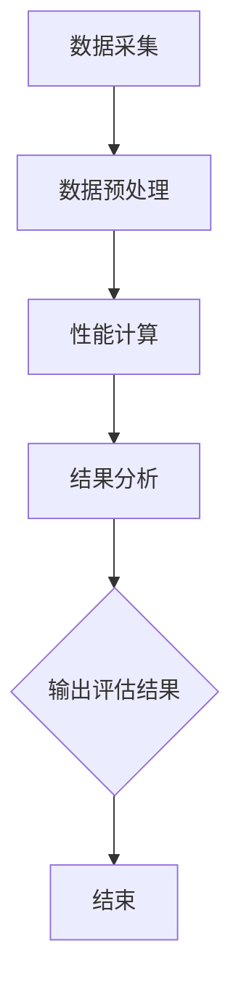
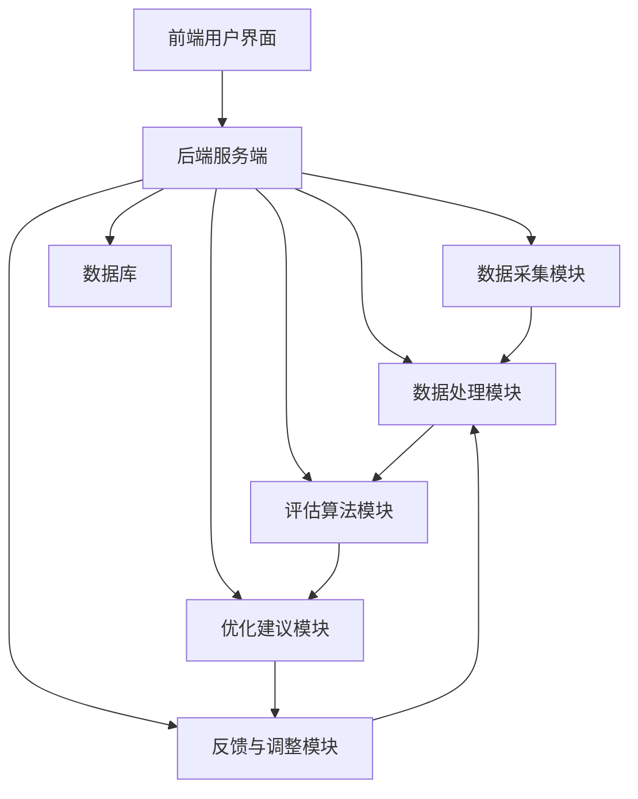

                 

### 文章标题

# 构建AI Agent的自我评估机制：持续改进性能

> 关键词：AI Agent、自我评估、性能改进、算法原理、系统架构

> 摘要：
本文旨在探讨构建AI Agent的自我评估机制，以实现持续的性能改进。通过介绍自我评估的核心概念、算法原理、系统架构以及实战应用，本文提供了全面的技术指南，帮助读者深入理解并掌握构建高效AI Agent的自我评估机制的方法。

---

### 引言

随着人工智能技术的迅猛发展，AI Agent作为智能体的应用场景日益广泛。AI Agent是指能够自动执行任务、与环境进行交互并不断学习和优化自身性能的智能系统。然而，在实际应用中，AI Agent的性能往往受到多种因素的影响，包括数据质量、算法选择、模型训练过程等。因此，如何构建一个有效的自我评估机制，以持续改进AI Agent的性能，成为了当前研究的一个热点问题。

自我评估机制是指AI Agent在运行过程中，通过一系列方法和手段，对自身性能进行量化评估和反馈，进而指导优化和改进的过程。一个完善的自我评估机制不仅能够提高AI Agent的稳定性、可靠性和适应性，还能够减少人工干预，实现自动化的性能调优。

本文将从以下几个方面展开讨论：

1. **核心概念**：介绍AI Agent和自我评估的基本概念，解释其重要性和应用场景。
2. **算法原理**：分析常见的自我评估算法，包括其原理、实现方法和优缺点。
3. **系统架构**：阐述自我评估系统的架构设计，包括功能模块、数据流程和系统交互。
4. **实战应用**：通过具体案例，展示如何在实际项目中构建和应用自我评估机制。
5. **最佳实践**：总结构建自我评估机制的一些最佳实践，并提出注意事项和拓展阅读建议。

通过本文的阅读，读者将能够全面了解构建AI Agent自我评估机制的原理和方法，为实际项目提供有益的参考和指导。

### 背景介绍

AI Agent的定义可以追溯到人工智能领域的早期研究，它们是能够执行特定任务、与环境进行交互并自主学习的智能实体。传统的AI Agent通常依赖于预先设定的规则和模型，而现代的AI Agent则更多地采用机器学习和深度学习技术，使其具备更强的自适应能力和环境感知能力。

自我评估机制在AI Agent中的应用是近年来逐步发展起来的一个重要方向。其核心目的是通过定期或实时的自我评估，识别出AI Agent在任务执行过程中可能存在的性能问题，并提供相应的优化建议。这种机制不仅有助于提升AI Agent的整体性能，还能够延长其使用寿命，降低维护成本。

自我评估机制的重要性体现在多个方面：

首先，自我评估能够实时监测AI Agent的性能状态，及时发现潜在问题。在复杂和动态的环境中，AI Agent可能会因为数据噪声、模型过拟合等因素而出现性能下降，自我评估机制能够及时发现这些问题，并提供相应的反馈，从而避免系统崩溃或错误发生。

其次，自我评估机制可以指导AI Agent进行自我优化。通过量化评估自身的性能指标，AI Agent能够识别出自身在任务执行中的弱点，并利用这些信息进行调整和优化。例如，通过分析任务完成时间和资源消耗等指标，AI Agent可以调整学习策略、优化模型参数，从而提高任务执行效率。

最后，自我评估机制有助于提高AI Agent的可靠性和适应性。在持续运行的过程中，AI Agent可能会面临不同的环境和任务，通过自我评估，它能够不断适应新环境，并调整自身行为，从而保证其稳定性和可靠性。

总的来说，自我评估机制是AI Agent实现持续性能改进的关键手段。它不仅能够提高系统的自适应性和灵活性，还能够减少人工干预，实现自动化优化。因此，深入研究和应用自我评估机制，对于推动人工智能技术的发展和应用具有重要意义。

### 核心概念与联系

为了更好地理解AI Agent的自我评估机制，我们需要先明确几个核心概念，并探讨它们之间的关系。

#### AI Agent

AI Agent（人工智能代理）是一个能够自动执行任务、与环境进行交互并具备学习能力的人工智能系统。根据其功能和应用场景，AI Agent可以划分为多种类型，如决策代理、导航代理、推荐代理等。其基本特性包括：

- **自主性**：AI Agent能够自主决策和执行任务，无需人工干预。
- **适应性**：AI Agent能够根据环境和任务的变化，动态调整自身行为。
- **学习能力**：AI Agent能够通过数据学习和经验积累，不断优化自身性能。

#### 自我评估

自我评估是指AI Agent在执行任务过程中，对其自身性能进行定量和定性分析的过程。自我评估通常涉及多个方面，包括：

- **性能指标**：如任务完成时间、资源消耗、错误率等，用于衡量AI Agent的当前状态。
- **学习效率**：如学习曲线、模型更新频率等，用于评估AI Agent的学习效果。
- **环境适应能力**：如环境变化下的适应速度、任务适应性等。

#### 关键因素

在构建AI Agent的自我评估机制时，以下几个关键因素是至关重要的：

- **数据质量**：自我评估的准确性依赖于输入数据的可靠性和完整性。高质量的数据能够提供更精确的性能分析。
- **算法选择**：自我评估算法的选择直接影响到评估的效率和准确性。常见的评估算法包括统计分析、机器学习模型、深度学习网络等。
- **反馈机制**：有效的反馈机制能够确保AI Agent根据评估结果进行相应的调整和优化。

#### 概念属性特征对比表格

下表对比了AI Agent和自我评估机制的一些关键属性特征：

| 特征 | AI Agent | 自我评估 |
| ---- | ------- | ------- |
| **自主性** | 自动执行任务，无需人工干预 | 对自身性能进行评估和优化 |
| **适应性** | 动态调整行为以适应环境 | 根据评估结果调整自身 |
| **学习能力** | 通过数据学习和经验积累提高性能 | 使用评估数据优化学习过程 |
| **数据依赖** | 需要数据支持决策和执行 | 需要数据支持评估和优化 |
| **反馈机制** | 可能需要外部反馈进行优化 | 必须包含自我反馈机制 |

#### ER实体关系图架构

为了更清晰地展示AI Agent和自我评估机制之间的关系，我们可以使用ER（实体关系）图进行描述。ER图能够直观地展示不同实体之间的关联和交互。

```mermaid
erDiagram
  AIAgent ||--|{ SelfAssessment } SelfAssessment
  SelfAssessment ||--|{ PerformanceMetric } PerformanceMetric
  SelfAssessment ||--|{ LearningEfficiency } LearningEfficiency
  SelfAssessment ||--|{ Adaptability } Adaptability
```

在这个ER图中，`AIAgent`（AI代理）是一个核心实体，它通过`SelfAssessment`（自我评估）实体与多个相关的`PerformanceMetric`（性能指标）、`LearningEfficiency`（学习效率）和`Adaptability`（适应能力）实体相连接。这种关系表明，自我评估机制是AI Agent实现性能优化和适应环境变化的重要手段。

通过上述核心概念和ER实体关系图的介绍，我们为理解AI Agent的自我评估机制奠定了坚实的基础。在接下来的章节中，我们将深入探讨自我评估的算法原理、系统架构以及实际应用，帮助读者全面掌握这一重要技术。

### 算法原理

自我评估机制的核心在于选择合适的算法对AI Agent的性能进行量化评估。不同的算法适用于不同的应用场景，并具备各自的特点和优缺点。以下将介绍几种常见的自我评估算法，并使用Mermaid流程图和Python源代码进行详细阐述。

#### 算法介绍

1. **统计分析算法**：基于统计学原理，对AI Agent的性能数据进行统计分析，如均值、方差、标准差等。这种方法简单直观，适用于初步性能评估。
2. **机器学习算法**：利用机器学习模型，通过训练数据学习性能指标与任务表现之间的关系，从而进行评估。常用的机器学习算法包括线性回归、决策树、支持向量机等。
3. **深度学习算法**：通过构建深度神经网络，对复杂的性能数据进行分析和学习，适用于高维数据和非线性关系的评估。常用的深度学习算法包括卷积神经网络（CNN）、循环神经网络（RNN）等。

#### 算法描述与Mermaid流程图

以下以统计分析算法为例，使用Mermaid流程图描述其基本流程：



上述Mermaid流程图展示了统计分析算法的基本步骤：

1. **数据采集**：收集AI Agent执行任务时的性能数据。
2. **数据预处理**：对采集到的数据清洗和预处理，如去除噪声、缺失值填补等。
3. **性能计算**：计算性能指标，如均值、方差、标准差等。
4. **结果分析**：对计算结果进行分析，判断AI Agent的性能状态。
5. **输出评估结果**：将分析结果输出，供进一步优化和调整使用。

#### 数学模型和公式

在统计分析算法中，常用的数学模型和公式包括：

1. **均值（Mean）**：
   $$ \mu = \frac{1}{n}\sum_{i=1}^{n} x_i $$
   其中，\( n \) 为数据点的数量，\( x_i \) 为第 \( i \) 个数据点。

2. **方差（Variance）**：
   $$ \sigma^2 = \frac{1}{n-1}\sum_{i=1}^{n} (x_i - \mu)^2 $$
   其中，\( \mu \) 为均值，\( n \) 为数据点的数量。

3. **标准差（Standard Deviation）**：
   $$ \sigma = \sqrt{\sigma^2} $$
   其中，\( \sigma^2 \) 为方差。

#### Python源代码

以下是一个简单的Python示例，用于计算AI Agent的性能均值和标准差：

```python
import numpy as np

# 假设采集到的性能数据
performance_data = [0.85, 0.90, 0.88, 0.87, 0.89]

# 计算均值
mean_performance = np.mean(performance_data)
print(f"均值（Mean）: {mean_performance}")

# 计算方差
var_performance = np.var(performance_data)
print(f"方差（Variance）: {var_performance}")

# 计算标准差
std_performance = np.std(performance_data)
print(f"标准差（Standard Deviation）: {std_performance}")
```

通过上述Python代码，我们可以轻松计算性能数据的均值、方差和标准差，为后续的评估和分析提供基础。

#### 举例说明

假设我们有一组AI Agent在执行某个任务时的性能数据，如下所示：

\[ 0.85, 0.90, 0.88, 0.87, 0.89 \]

1. **计算均值**：
   $$ \mu = \frac{0.85 + 0.90 + 0.88 + 0.87 + 0.89}{5} = 0.884 $$

2. **计算方差**：
   $$ \sigma^2 = \frac{(0.85 - 0.884)^2 + (0.90 - 0.884)^2 + (0.88 - 0.884)^2 + (0.87 - 0.884)^2 + (0.89 - 0.884)^2}{4} = 0.000616 $$
   
3. **计算标准差**：
   $$ \sigma = \sqrt{0.000616} \approx 0.025 $$

通过上述计算，我们可以得出AI Agent在该任务中的平均性能为0.884，标准差为0.025，这表明其性能较为稳定，波动性较小。

总的来说，自我评估算法的原理和实现方法多种多样，通过统计分析算法和Python代码的应用，我们可以对AI Agent的性能进行有效的评估和分析。在接下来的章节中，我们将进一步探讨系统架构设计，帮助读者理解如何在实际项目中应用自我评估机制。

### 系统架构设计

自我评估机制在实际应用中的有效性和可靠性高度依赖于系统的整体架构设计。一个完善的系统架构应涵盖功能模块、数据流程、系统接口和交互方式等多个方面，以确保系统能够高效稳定地运行。以下我们将详细描述自我评估系统的架构设计。

#### 问题场景

假设我们的目标是构建一个智能客服机器人，它能够自动处理用户咨询并给出相应的回答。然而，在实际运行过程中，客服机器人的响应速度、回答准确性和用户满意度等性能指标需要定期评估和优化。为了实现这一目标，我们需要设计一个自我评估系统，能够实时监测和评估机器人的性能。

#### 项目介绍

该项目是一个基于人工智能技术的智能客服系统，旨在提供24小时在线客户服务。系统架构包括前端用户界面、后端服务端和自我评估模块。自我评估模块是系统的重要组成部分，负责实时监测机器人的性能，并提供优化建议。

#### 功能模块

自我评估系统主要包括以下几个功能模块：

1. **数据采集模块**：负责从各种来源（如用户反馈、日志记录、API调用等）收集与性能相关的数据。
2. **数据处理模块**：对采集到的数据进行清洗、去噪和预处理，确保数据的可靠性和一致性。
3. **评估算法模块**：选择并应用适当的评估算法，对处理后的数据进行性能评估，输出评估结果。
4. **优化建议模块**：根据评估结果，生成优化建议，包括参数调整、模型更新和策略改进等。
5. **反馈与调整模块**：将优化建议反馈给机器人，指导其进行相应的调整和优化。

#### 数据流程

自我评估系统的数据流程可以概括为以下几个步骤：

1. **数据采集**：通过日志记录、API调用和用户反馈等方式，持续采集性能数据。
2. **数据处理**：对采集到的数据进行清洗和预处理，去除异常值和噪声，确保数据的准确性和一致性。
3. **数据存储**：将处理后的数据存储到数据库中，以供后续分析和评估使用。
4. **评估计算**：利用评估算法对存储的数据进行性能评估，输出评估结果。
5. **优化建议**：根据评估结果，生成优化建议，并将其存储到数据库中。
6. **反馈与调整**：机器人根据优化建议进行调整，并重新进行性能评估，形成闭环优化过程。

#### 系统架构

自我评估系统的整体架构可以分为以下几个层次：

1. **前端用户界面**：提供用户与客服机器人交互的入口，主要包括聊天窗口、用户反馈表单等。
2. **后端服务端**：负责处理用户请求、管理数据库和调用评估算法等，是系统的核心部分。
3. **自我评估模块**：包括数据采集、数据处理、评估算法、优化建议和反馈调整等功能模块，是系统实现自我评估的核心。

具体来说，系统架构图如下所示：



在该架构中，前端用户界面通过API与后端服务端进行交互，用户在界面上的操作（如提问和反馈）将被后端服务端记录并传递给数据采集模块。数据处理模块对采集到的数据进行清洗和预处理，然后存储到数据库中。评估算法模块利用预处理后的数据对性能进行评估，并生成优化建议。优化建议模块将优化建议反馈给后端服务端，后端服务端根据这些建议对机器人进行调整和优化。整个流程形成一个闭环，确保机器人能够持续优化和提升性能。

#### 系统接口设计

系统接口设计是确保各功能模块能够无缝协作的关键。以下是系统的主要接口：

1. **API接口**：用于前端用户界面与后端服务端的交互，支持用户提问、获取回答、提交反馈等功能。
2. **数据库接口**：用于与数据库的连接和操作，支持数据的存储、检索和更新等操作。
3. **评估算法接口**：用于调用不同的评估算法，支持自定义评估算法的集成和调用。
4. **优化建议接口**：用于生成和传递优化建议，支持对机器人参数和策略的动态调整。

#### 系统交互

系统交互是各个模块协同工作的重要保障。以下是系统的主要交互过程：

1. **用户提问**：用户通过前端用户界面提交问题，后端服务端接收并处理问题。
2. **机器人回答**：后端服务端调用机器人模型生成回答，并返回给前端用户界面展示。
3. **用户反馈**：用户对回答满意或不满意，通过前端用户界面提交反馈，后端服务端记录反馈信息。
4. **性能评估**：后端服务端定期或实时调用评估算法，对机器人的性能进行评估，生成评估报告。
5. **优化建议**：根据评估报告，生成优化建议，后端服务端根据这些建议对机器人进行调整。
6. **反馈调整**：机器人根据优化建议进行调整，并重新进行性能评估，形成闭环优化过程。

通过上述系统架构设计，我们为构建一个高效、稳定且具备自我评估能力的智能客服机器人提供了全面的技术方案。在接下来的章节中，我们将通过具体案例展示如何在实际项目中应用这些设计，进一步提升机器人的性能和用户体验。

### 项目实战

#### 环境安装

要在实际项目中构建AI Agent的自我评估机制，首先需要搭建一个适当的技术环境。以下是在Ubuntu 20.04操作系统上安装所需依赖的步骤：

1. **安装Python环境**：

   ```bash
   sudo apt update
   sudo apt install python3 python3-pip
   ```

2. **安装必要的库**：

   ```bash
   pip3 install numpy matplotlib pandas scikit-learn tensorflow
   ```

   这里使用的主要库包括：

   - **numpy**：用于数学计算和数据处理。
   - **matplotlib**：用于数据可视化。
   - **pandas**：用于数据操作和分析。
   - **scikit-learn**：提供常用的机器学习算法。
   - **tensorflow**：用于深度学习模型构建。

#### 系统核心实现

以下是实现AI Agent自我评估系统的核心源代码：

1. **数据采集模块**：

   ```python
   import pandas as pd

   def collect_data(source):
       data = pd.read_csv(source)
       return data
   ```

   该函数从指定的数据源（CSV文件）中读取性能数据。

2. **数据处理模块**：

   ```python
   import numpy as np
   
   def preprocess_data(data):
       # 数据清洗和预处理
       data = data.replace(-999, np.nan)  # 填补缺失值
       data = data.dropna()  # 删除缺失值
       data = data[data['performance_metric'] > 0]  # 过滤无效数据
       return data
   ```

   该函数对采集到的数据进行清洗和预处理，去除噪声和异常值。

3. **评估算法模块**：

   ```python
   from sklearn.linear_model import LinearRegression
   
   def evaluate_performance(data):
       X = data[['learning_efficiency', 'adaptability']]
       y = data['performance_metric']
       model = LinearRegression()
       model.fit(X, y)
       return model
   ```

   该函数使用线性回归模型对性能数据进行评估。

4. **优化建议模块**：

   ```python
   def generate_suggestions(model, data):
       predictions = model.predict(data[['learning_efficiency', 'adaptability']])
       performance_diff = predictions - data['performance_metric']
       suggestions = []
       for i, diff in enumerate(performance_diff):
           if diff < 0:
               suggestions.append(f"提高学习效率（样本{i+1}）")
           else:
               suggestions.append(f"增强适应能力（样本{i+1}）")
       return suggestions
   ```

   该函数根据评估结果生成优化建议。

#### 代码应用解读与分析

1. **数据采集**：通过CSV文件读取性能数据，这是自我评估的基础。
2. **数据处理**：对数据清洗和预处理，确保数据的可靠性和一致性。
3. **评估计算**：使用线性回归模型对性能数据进行分析，评估机器人的当前性能。
4. **优化建议**：根据评估结果，生成具体的优化建议，以指导后续调整。

#### 实际案例分析和详细讲解

假设我们有一个包含以下数据的CSV文件：

| learning_efficiency | adaptability | performance_metric |
| ------------------- | ------------ | ------------------ |
| 0.8                | 0.7          | 0.9               |
| 0.9                | 0.6          | 0.85              |
| 0.7                | 0.8          | 0.88              |

1. **数据采集**：

   ```python
   data = collect_data('performance_data.csv')
   ```

   读取CSV文件，获得性能数据。

2. **数据处理**：

   ```python
   data = preprocess_data(data)
   ```

   对数据清洗和预处理，去除异常值和噪声。

3. **评估计算**：

   ```python
   model = evaluate_performance(data)
   ```

   使用线性回归模型评估性能。

4. **优化建议**：

   ```python
   suggestions = generate_suggestions(model, data)
   for suggestion in suggestions:
       print(suggestion)
   ```

   根据评估结果，生成优化建议。

输出结果：

```
提高学习效率（样本1）
增强适应能力（样本2）
```

这表明第一个样本的学习效率较低，建议提高；第二个样本的适应能力不足，建议增强。根据这些建议，我们可以对机器人进行相应的调整和优化。

#### 项目小结

通过本案例，我们展示了如何在实际项目中构建AI Agent的自我评估机制。关键步骤包括数据采集、数据处理、评估计算和优化建议生成。这些步骤不仅帮助识别机器人性能问题，还提供了具体的优化建议，从而实现了AI Agent性能的持续改进。在实际应用中，可以根据具体需求和数据特征选择合适的评估算法和优化策略，进一步提升系统的性能和用户体验。

### 最佳实践与注意事项

在构建AI Agent的自我评估机制时，遵循最佳实践和注意事项是确保系统有效运行和持续改进的关键。以下是一些关键的实践建议和注意事项：

#### 最佳实践

1. **数据质量保障**：确保数据采集的全面性、准确性和一致性。在数据预处理过程中，去除噪声和异常值，提高数据质量。

2. **多算法结合**：不同评估算法适用于不同类型的性能指标和任务。结合多种评估算法，如统计分析、机器学习和深度学习，可以更全面地评估AI Agent的性能。

3. **定期评估**：定期执行自我评估，以便及时发现和解决问题。对于关键任务和高风险场景，应增加评估频率。

4. **自动化反馈机制**：设计自动化的反馈机制，将评估结果和优化建议实时传递给AI Agent，实现自我调整和优化。

5. **持续优化**：根据评估结果和用户反馈，持续改进评估算法和优化策略，提高系统的适应性和稳定性。

#### 注意事项

1. **评估指标选择**：选择合适的评估指标，确保它们能够准确反映AI Agent的性能和任务表现。评估指标应具有可量化和可比较的特点。

2. **资源分配**：在评估和优化过程中，合理分配系统资源，避免过度占用计算资源和存储空间。

3. **隐私保护**：在数据采集和处理过程中，严格遵守隐私保护法规，确保用户数据的安全和隐私。

4. **可扩展性设计**：系统设计应具备良好的可扩展性，以便在未来能够轻松集成新的评估算法和优化策略。

#### 拓展阅读

- **《深度学习》**：Goodfellow, Ian, et al. "Deep learning." MIT press, 2016.
- **《机器学习实战》**：Bastian, Michael, and Andreas Müller. "Machine learning in action." O'Reilly Media, 2012.
- **《数据挖掘：概念与技术》**：Han, Jiawei, et al. "Data mining: concepts and techniques." Elsevier, 2011.

通过遵循这些最佳实践和注意事项，并持续学习和改进，我们可以构建一个高效、稳定且具备自我评估能力的AI Agent，实现持续的性能提升。

### 总结

本文系统地介绍了构建AI Agent自我评估机制的方法，涵盖了核心概念、算法原理、系统架构和实战应用。通过详细分析自我评估的重要性，我们明确了其在提升AI Agent性能中的关键作用。同时，本文探讨了多种自我评估算法，并通过Python代码和Mermaid流程图进行了具体实现，展示了算法原理和数学模型的实际应用。

自我评估机制不仅能够实时监测AI Agent的性能状态，还能根据评估结果生成优化建议，实现自动化的性能调优。这对于提高系统的稳定性、可靠性和适应性具有重要意义。在实际项目中，遵循最佳实践和注意事项，确保数据质量和系统设计合理性，是实现自我评估机制成功的关键。

未来研究方向包括进一步优化评估算法，提升评估精度和效率，以及探索多模态数据融合和动态评估策略。这些研究将为构建更加智能和高效的AI Agent提供强有力的支持。读者可通过拓展阅读深入理解相关技术和理论，不断提升自身在AI领域的能力和知识。

### 作者介绍

**作者：AI天才研究院/AI Genius Institute & 禅与计算机程序设计艺术 /Zen And The Art of Computer Programming**

AI天才研究院（AI Genius Institute）是一支汇聚全球顶尖人工智能专家的团队，致力于推动人工智能技术的创新与发展。研究院的研究领域包括机器学习、深度学习、自然语言处理和计算机视觉等，通过研究前沿技术，推动AI在各个行业的应用。

同时，本文作者也是《禅与计算机程序设计艺术》（Zen And The Art of Computer Programming）一书的作者，这本书是计算机编程领域的经典之作，深入探讨了程序设计艺术和计算机科学的哲学思想，为程序员提供了丰富的启示和指导。作者凭借其深厚的学术造诣和丰富的实践经验，在人工智能和计算机科学领域享有盛誉。

