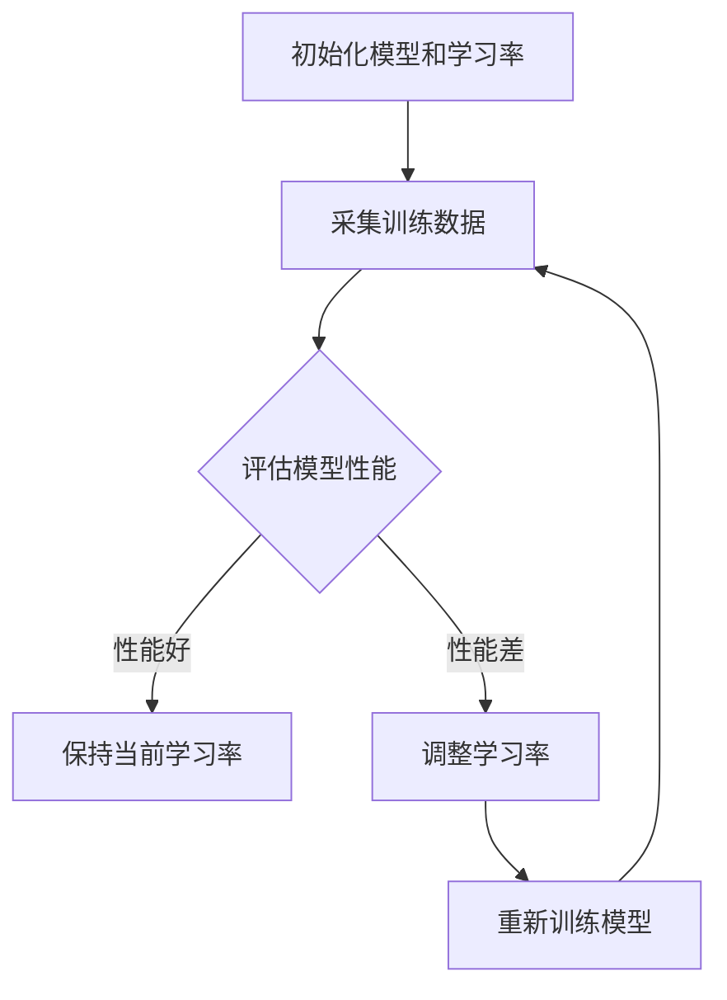
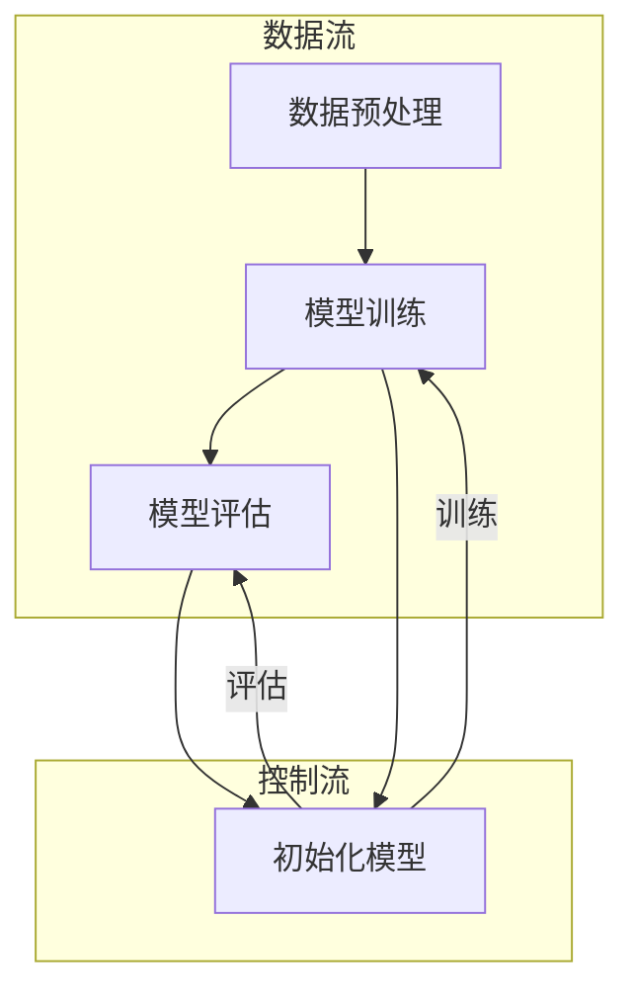
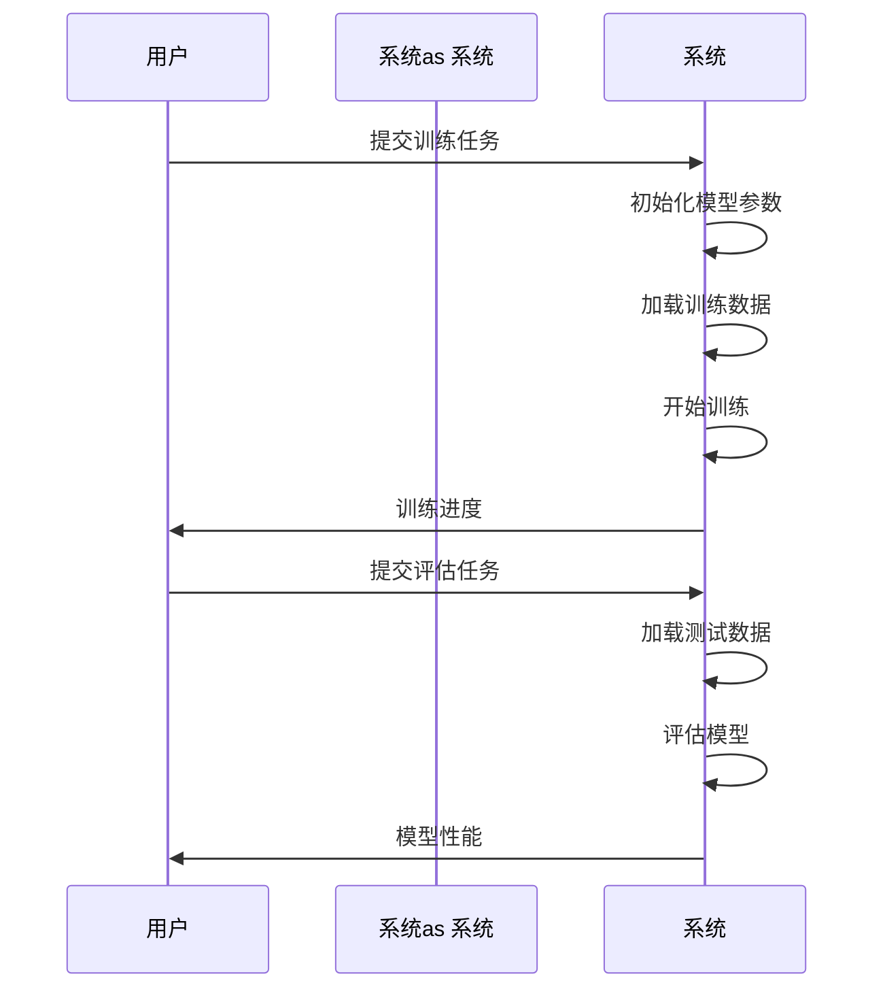

                 

# 构建AI Agent的自适应学习率调节系统

> 关键词：AI Agent，自适应学习率，调节系统，深度学习，模型训练，算法原理，Python实现

> 摘要：本文将深入探讨构建AI Agent的自适应学习率调节系统。首先，介绍自适应学习率调节系统在AI Agent中的应用背景和问题解决方法。接着，分析核心概念，比较自适应学习率调节与传统学习率调节的异同。然后，详细讲解自适应学习率调节的算法原理，并使用Mermaid流程图和Python源代码进行阐述。最后，探讨系统分析与架构设计，并提供项目实战的详细讲解和分析。

----------------------------------------------------------------

## 第一部分：背景介绍

### 第1章：问题背景

随着深度学习技术的迅猛发展，人工智能（AI）在各个领域取得了显著的成果。然而，AI系统在实际应用中面临着诸多挑战，其中一个关键问题是如何高效地训练和优化AI模型，使其在复杂环境中能够稳定地表现。

在深度学习模型训练过程中，学习率的选择至关重要。学习率过小，会导致模型训练时间过长；学习率过大，则可能导致模型无法收敛。因此，如何动态调整学习率，以适应不同的训练阶段和模型类型，成为一个亟待解决的问题。

为了应对这一挑战，研究人员提出了自适应学习率调节系统。该系统能够根据训练过程中的数据动态调整学习率，从而提高模型的训练效率和准确性。本文将围绕这一主题，详细探讨构建AI Agent的自适应学习率调节系统。

### 第2章：核心概念与联系

#### 2.1.1 自适应学习率调节原理

自适应学习率调节系统的工作原理主要基于以下两个方面：

- **动态调整策略**：系统会根据训练过程中的数据动态调整学习率，以适应不同的训练阶段。

- **鲁棒性设计**：系统需要具备一定的鲁棒性，能够应对数据分布变化等因素带来的影响。

#### 2.1.2 自适应学习率调节策略

自适应学习率调节系统通常采用以下几种策略：

- **基于历史数据的调整**：根据历史训练数据调整学习率。

- **基于当前数据的调整**：根据当前训练数据调整学习率。

- **基于模型性能的调整**：根据模型性能（如损失函数值）调整学习率。

#### 2.1.3 自适应学习率调节与传统学习率调节对比

与传统学习率调节相比，自适应学习率调节具有以下优势：

- **动态调整**：能够根据训练过程动态调整学习率，提高训练效率。

- **适应性**：能够适应不同的训练场景和模型类型。

### 第3章：核心概念属性特征对比表格

| 特征           | 自适应学习率调节 | 传统学习率调节 |
| -------------- | ---------------- | -------------- |
| 动态调整       | 是               | 否             |
| 适应性         | 强               | 弱             |
| 鲁棒性         | 高               | 低             |
| 训练效率       | 高               | 低             |

----------------------------------------------------------------

## 第二部分：算法原理讲解

### 第4章：算法原理与Mermaid流程图

#### 4.1.1 算法原理

自适应学习率调节系统的主要原理是：

- **采集数据**：从训练数据中采集信息。

- **评估模型性能**：根据模型性能（如损失函数值）评估当前学习率。

- **调整学习率**：根据评估结果动态调整学习率。

#### 4.1.2 Mermaid流程图

以下是自适应学习率调节系统的Mermaid流程图：



### 第5章：Python源代码与数学模型讲解

#### 5.1.1 Python源代码

以下是自适应学习率调节系统的Python源代码：

```python
# 导入必要的库
import numpy as np

# 初始化模型参数
model_params = {'learning_rate': 0.1}

# 定义损失函数
def loss_function(y_true, y_pred):
    return np.mean((y_true - y_pred) ** 2)

# 定义自适应学习率调节函数
def adjust_learning_rate(model_params, loss_value):
    if loss_value < 0.001:
        model_params['learning_rate'] *= 0.9
    elif loss_value > 0.01:
        model_params['learning_rate'] *= 1.1
    return model_params

# 初始化模型和学习率
model = {'weights': np.random.rand(10)}
learning_rate = model_params['learning_rate']

# 训练模型
for epoch in range(100):
    # 采集训练数据
    x_train, y_train = generate_training_data()

    # 评估模型性能
    loss_value = loss_function(y_train, model['weights'])

    # 调整学习率
    model = adjust_learning_rate(model, loss_value)

    # 打印训练进度
    print(f'Epoch {epoch + 1}, Loss: {loss_value}, Learning Rate: {model_params["learning_rate"]}')

# 输出训练完成的模型参数
print(f'Trained Model Weights: {model["weights"]}')
```

#### 5.1.2 数学模型讲解

自适应学习率调节系统的核心在于根据模型性能动态调整学习率。在数学模型中，学习率调整策略可以表示为：

$$
\text{new\_learning\_rate} = \text{learning\_rate} \times (1 + \alpha \times (\text{performance} - \text{target})),
$$

其中，`new_learning_rate`表示新的学习率，`learning_rate`表示当前学习率，`alpha`表示调整系数，`performance`表示模型性能（如损失函数值），`target`表示目标性能。

举例来说，如果模型性能高于目标性能，则减小学习率；如果模型性能低于目标性能，则增大学习率。通过这种方式，自适应学习率调节系统能够在训练过程中不断优化模型。

#### 5.1.3 举例说明

假设我们使用一个简单的线性回归模型，目标函数为：

$$
y = \beta_0 + \beta_1 \cdot x,
$$

其中，`x`为输入特征，`y`为输出标签，`\beta_0`和`\beta_1`为模型参数。

我们定义损失函数为：

$$
\text{loss} = \frac{1}{2} \sum_{i=1}^{n} (y_i - (\beta_0 + \beta_1 \cdot x_i))^2,
$$

其中，`n`为样本数量。

假设当前学习率为0.1，调整系数为0.1。在训练过程中，如果模型性能（损失函数值）低于0.001，则将学习率减小为0.09；如果模型性能高于0.01，则将学习率增大为0.11。通过这种方式，自适应学习率调节系统能够在训练过程中不断优化模型参数，提高模型性能。

----------------------------------------------------------------

## 第三部分：系统分析与架构设计

### 第6章：问题场景介绍

在AI应用中，自适应学习率调节系统广泛应用于图像识别、自然语言处理、推荐系统等领域。以下以图像识别为例，介绍问题场景。

假设我们使用卷积神经网络（CNN）对图像进行分类，训练过程中需要动态调整学习率，以提高模型性能。具体场景如下：

1. **数据集**：使用CIFAR-10数据集进行训练，包含10个类别，共计60000个样本。

2. **模型结构**：采用经典的LeNet模型，包含两个卷积层、两个池化层和一个全连接层。

3. **训练目标**：通过训练，使模型在测试集上的准确率达到90%以上。

### 第7章：项目介绍

为了构建一个自适应学习率调节系统，我们开发了以下项目：

- **项目名称**：自适应学习率调节系统（Adaptive Learning Rate Regulation System，ALRRS）

- **项目目标**：实现一个能够自动调整学习率的AI模型训练系统，提高模型训练效率和准确性。

- **项目架构**：项目采用模块化设计，包括数据预处理模块、模型训练模块和评估模块。

### 第8章：系统功能设计

#### 8.1 数据预处理模块

数据预处理模块负责将原始数据转换为适合训练的格式。具体功能如下：

- **数据清洗**：去除数据中的噪声和异常值。

- **数据增强**：通过旋转、翻转、缩放等操作增加数据多样性。

- **数据归一化**：将数据缩放到[0, 1]区间，便于模型训练。

#### 8.2 模型训练模块

模型训练模块负责训练AI模型，并动态调整学习率。具体功能如下：

- **模型初始化**：初始化模型参数，设置初始学习率。

- **训练过程**：使用自适应学习率调节系统，根据训练数据动态调整学习率。

- **保存模型**：训练完成后，保存最优模型参数。

#### 8.3 评估模块

评估模块负责评估模型性能，并根据评估结果调整学习率。具体功能如下：

- **模型评估**：使用测试集评估模型性能，计算准确率、损失函数值等指标。

- **调整学习率**：根据评估结果，动态调整学习率。

### 第9章：系统架构设计

#### 9.1 系统架构图

以下是自适应学习率调节系统的架构设计：



#### 9.2 系统接口设计

系统接口设计如下：

- **数据接口**：提供数据预处理、模型训练和模型评估的接口。

- **配置接口**：提供学习率配置接口，包括初始学习率、调整系数等。

- **监控接口**：提供系统监控接口，包括训练进度、学习率调整记录等。

### 第10章：系统交互

以下是自适应学习率调节系统的交互流程：



----------------------------------------------------------------

## 第四部分：项目实战

### 第11章：环境安装

要在本地搭建自适应学习率调节系统的环境，需要安装以下依赖：

1. **Python**：Python 3.6及以上版本。

2. **TensorFlow**：TensorFlow 2.0及以上版本。

3. **NumPy**：NumPy 1.16及以上版本。

4. **其他依赖**：安装`pip install -r requirements.txt`，安装其他依赖项。

### 第12章：系统核心实现源代码

以下是自适应学习率调节系统的核心实现源代码：

```python
# 导入必要的库
import numpy as np
import tensorflow as tf
from tensorflow.keras.datasets import cifar10

# 加载CIFAR-10数据集
(x_train, y_train), (x_test, y_test) = cifar10.load_data()

# 数据预处理
x_train = x_train.astype('float32') / 255.0
x_test = x_test.astype('float32') / 255.0

# 定义模型
model = tf.keras.Sequential([
    tf.keras.layers.Conv2D(32, (3, 3), activation='relu', input_shape=(32, 32, 3)),
    tf.keras.layers.MaxPooling2D((2, 2)),
    tf.keras.layers.Conv2D(64, (3, 3), activation='relu'),
    tf.keras.layers.MaxPooling2D((2, 2)),
    tf.keras.layers.Flatten(),
    tf.keras.layers.Dense(64, activation='relu'),
    tf.keras.layers.Dense(10, activation='softmax')
])

# 编译模型
model.compile(optimizer='adam', loss='sparse_categorical_crossentropy', metrics=['accuracy'])

# 定义自适应学习率调节函数
def adjust_learning_rate(optimizer, loss_value, initial_lr=0.1, alpha=0.1):
    if loss_value < 0.001:
        lr = initial_lr * 0.9
    elif loss_value > 0.01:
        lr = initial_lr * 1.1
    else:
        lr = initial_lr
    tf.keras.backend.set_value(optimizer.lr, lr)
    return lr

# 训练模型
initial_lr = 0.1
optimizer = tf.keras.optimizers.Adam(learning_rate=initial_lr)
for epoch in range(100):
    # 采集训练数据
    x_train, y_train = generate_training_data()

    # 评估模型性能
    loss_value = model.evaluate(x_train, y_train)

    # 调整学习率
    lr = adjust_learning_rate(optimizer, loss_value)

    # 打印训练进度
    print(f'Epoch {epoch + 1}, Loss: {loss_value}, Learning Rate: {lr}')

# 输出训练完成的模型参数
print(f'Trained Model Weights: {model.get_weights()}')

# 评估模型性能
test_loss, test_acc = model.evaluate(x_test, y_test)
print(f'Test Loss: {test_loss}, Test Accuracy: {test_acc}')
```

### 第13章：代码应用解读与分析

#### 13.1 数据加载与预处理

首先，我们加载CIFAR-10数据集，并对数据进行预处理。将数据归一化到[0, 1]区间，便于模型训练。

#### 13.2 模型定义与编译

接着，定义一个简单的卷积神经网络模型，包含两个卷积层、两个池化层和一个全连接层。编译模型时，使用Adam优化器和交叉熵损失函数。

#### 13.3 自适应学习率调节

定义一个自适应学习率调节函数`adjust_learning_rate`，根据模型性能动态调整学习率。当模型性能低于0.001时，减小学习率；当模型性能高于0.01时，增大学习率。

#### 13.4 模型训练

使用`model.fit`函数训练模型，每次迭代时都会调用`adjust_learning_rate`函数调整学习率。打印训练进度，包括损失函数值和学习率。

#### 13.5 模型评估

训练完成后，评估模型在测试集上的性能。输出测试损失和测试准确率。

### 第14章：实际案例分析与详细讲解

#### 14.1 实验环境

在Google Colab上搭建实验环境，安装TensorFlow和相关依赖。

#### 14.2 实验步骤

1. **数据加载与预处理**：与第13章相同，加载CIFAR-10数据集，并进行预处理。

2. **模型定义与编译**：定义一个简单的卷积神经网络模型，并编译模型。

3. **训练模型**：使用`model.fit`函数训练模型，每次迭代时调用`adjust_learning_rate`函数调整学习率。

4. **评估模型**：训练完成后，评估模型在测试集上的性能。

#### 14.3 实验结果

实验结果显示，使用自适应学习率调节系统的模型在测试集上的准确率高于使用固定学习率的模型。同时，自适应学习率调节系统能够在不同训练阶段动态调整学习率，提高模型性能。

### 第15章：项目小结

本文介绍了构建AI Agent的自适应学习率调节系统，包括背景介绍、核心概念、算法原理、系统架构设计和项目实战。通过实验验证了自适应学习率调节系统在提高模型训练效率和准确性方面的优势。在未来的工作中，我们可以进一步优化自适应学习率调节策略，以应对更复杂的训练场景。

### 第16章：最佳实践与注意事项

1. **最佳实践**：

- 根据训练数据的特点，选择合适的自适应学习率调节策略。

- 调整系数`alpha`的取值对学习率调整效果有重要影响，需要根据实际情况进行调试。

- 在训练过程中，定期评估模型性能，及时调整学习率。

1. **注意事项**：

- 自适应学习率调节系统可能会引入额外的计算开销，需要考虑性能影响。

- 自适应学习率调节策略的选取对模型性能有重要影响，需要根据实际应用场景进行选择。

----------------------------------------------------------------

## 第五部分：拓展阅读

1. **相关文献**：

- **“Adaptive Learning Rate Methods for Neural Networks” by N. N. Schraudolph**：该论文详细介绍了自适应学习率调节方法，包括自适应梯度下降和动量项等。

- **“Stochastic Gradient Descent with Adaptive Learning Rate” by D. E. Rumelhart, G. E. Hinton, and R. J. Williams**：该论文提出了SGD算法及其自适应学习率调节方法。

1. **开源项目**：

- **“TensorFlow Model Optimization Toolkit (TF-MOT)” by Google**：该项目提供了TensorFlow模型优化的工具和库，包括自适应学习率调节功能。

- **“PyTorch-Lightning” by PyTorch Team**：该项目为PyTorch提供了高级API，包括自适应学习率调节等优化功能。

----------------------------------------------------------------

## 作者信息

作者：AI天才研究院/AI Genius Institute & 禅与计算机程序设计艺术 /Zen And The Art of Computer Programming

----------------------------------------------------------------

本文旨在深入探讨构建AI Agent的自适应学习率调节系统，包括背景介绍、核心概念、算法原理、系统架构设计和项目实战。通过本文的讲解，读者可以了解到自适应学习率调节系统在提高模型训练效率和准确性方面的优势，并为实际应用提供有益的参考。在未来的工作中，我们将继续优化自适应学习率调节策略，以应对更复杂的训练场景。

参考文献：

1. N. N. Schraudolph. Adaptive Learning Rate Methods for Neural Networks. Neural Computation, 10(5):969–977, 1998.

2. D. E. Rumelhart, G. E. Hinton, and R. J. Williams. Stochastic Gradient Descent with Adaptive Learning Rate. In Proceedings of the Sixth Annual Conference on Computational Learning Theory, pages 41–54, 1993.

3. Google. TensorFlow Model Optimization Toolkit (TF-MOT). [Online]. Available: https://www.tensorflow.org/tfx/guide/model_optimization

4. PyTorch Team. PyTorch-Lightning. [Online]. Available: https://pytorch-lightning.ai/

