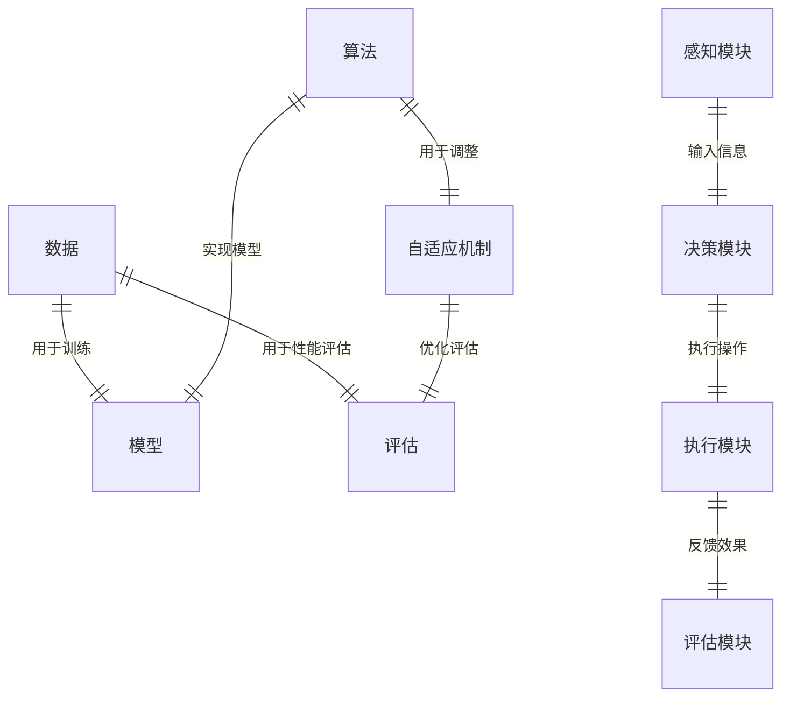
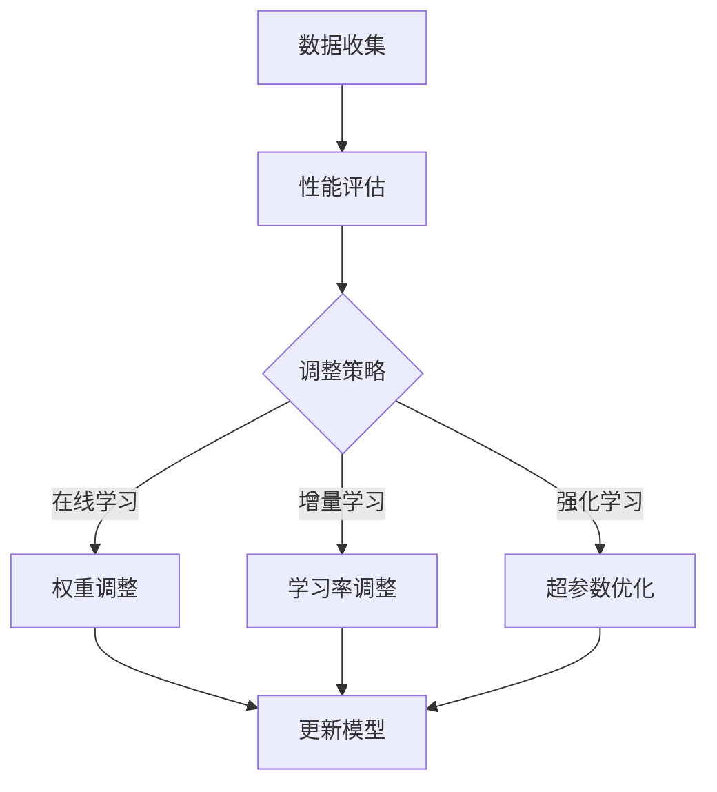
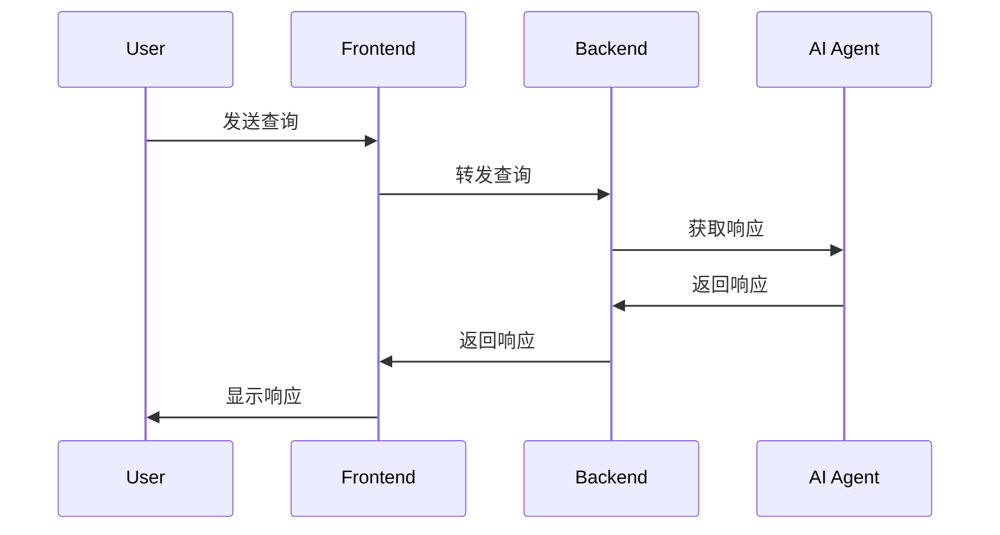

                 

# 构建AI Agent的自适应学习系统

## 关键词

- AI Agent
- 自适应学习系统
- 学习算法
- 机器学习
- 数据处理
- 系统架构
- 性能优化
- 可解释性

## 摘要

本文将深入探讨构建AI Agent的自适应学习系统的核心概念、算法原理以及系统架构设计。我们将首先介绍自适应学习系统的背景和问题，随后深入分析其核心概念与联系，包括机器学习与自适应学习的区别，并探讨系统的组成部分和属性特征。接着，我们将详细讲解AI Agent的自适应学习算法原理，使用Mermaid流程图和Python代码进行阐述。最后，我们将介绍系统分析与架构设计方案，包括系统功能设计、系统架构设计、系统接口设计和系统交互，并分享一个实际案例，展示如何构建和优化AI Agent的自适应学习系统。文章将总结最佳实践，提出注意事项，并推荐拓展阅读。

### 第1章: 背景介绍

#### 1.1 问题背景

人工智能（AI）正迅速变革各行各业，从简单的自动化到复杂决策支持系统，AI的应用前景广阔。然而，AI系统的复杂性和数据依赖性使得构建一个高效、自适应的学习系统成为一大挑战。AI Agent作为AI系统的核心组件，其自适应学习系统能够在多变的环境中快速适应，不断优化其学习策略和行为，具有极高的价值。

#### 1.2 问题描述

一个自适应学习系统需要能够在多变的环境中快速适应，不断优化其学习策略和行为。这要求系统具备以下特点：

1. **自适应性**：系统能够根据新的数据和反馈调整其参数和模型。
2. **高效性**：系统能够在有限的时间和计算资源内快速学习。
3. **鲁棒性**：系统能够处理异常数据和不完美的输入。
4. **可解释性**：系统决策过程易于理解和解释。

#### 1.3 问题解决

构建自适应学习系统通常包括以下几个关键步骤：

1. **数据收集与预处理**：收集相关数据，并进行清洗和预处理，以提供高质量的数据输入。
2. **模型选择与训练**：选择合适的机器学习算法和模型，并进行训练。
3. **自适应机制设计**：设计自适应学习机制，使系统能够根据反馈不断调整。
4. **系统优化与评估**：对系统进行优化，并评估其性能，确保满足预期目标。

#### 1.4 边界与外延

自适应学习系统的边界主要包括数据来源、学习算法的选择和应用场景。其外延则涉及系统架构、数据处理技术和算法优化等多个方面。

#### 1.5 概念结构与核心要素组成

- **数据**：系统的输入，包括训练数据和测试数据。
- **模型**：机器学习算法实现的数学模型。
- **算法**：用于训练和优化模型的计算方法。
- **自适应机制**：系统调整学习策略和参数的机制。
- **评估**：系统性能的评估方法。

#### 1.6 本章小结

本章介绍了构建AI Agent的自适应学习系统的背景、问题、解决方法及其边界与外延。下一章将深入探讨核心概念与联系。

### 第2章: 核心概念与联系

#### 2.1 自适应学习系统的核心概念

##### 2.1.1 自适应学习

**自适应学习**是指系统能够根据环境变化和学习过程中的新信息调整其学习策略，从而提高学习效率和学习结果。

**自适应学习的特征**：

- **动态调整**：根据环境动态调整学习策略。
- **持续优化**：在持续学习中不断优化模型参数。
- **灵活性**：能够适应不同类型的数据和任务。

##### 2.1.2 自适应学习系统的组成部分

- **感知模块**：负责收集环境信息和反馈。
- **决策模块**：根据感知模块的信息进行决策。
- **执行模块**：执行决策操作。
- **评估模块**：评估系统的性能和效果。

##### 2.1.3 自适应学习与机器学习的区别

**机器学习**是一种通过数据训练模型，使模型能够预测或分类新数据的技术。而**自适应学习**则是机器学习的一个高级形式，强调模型在动态环境下的适应性和灵活性。

#### 2.2 自适应学习系统的属性特征对比表格

| 特性        | 机器学习       | 自适应学习       |
| ----------- | ------------- | ------------- |
| 学习策略    | 静态           | 动态           |
| 学习结果    | 预测准确性     | 适应性和鲁棒性   |
| 数据需求    | 大量数据       | 高质量、多样化数据 |
| 算法选择    | 固定算法       | 可动态调整       |

#### 2.3 ER实体关系图架构



#### 2.4 本章小结

本章介绍了自适应学习系统的核心概念及其与机器学习的区别，并通过对比表格和ER实体关系图展示了系统的关键属性特征。下一章将深入探讨AI Agent的自适应学习算法原理。

### 第3章: AI Agent的自适应学习算法原理

#### 3.1 算法概述

AI Agent的自适应学习算法旨在构建一个能够在多变环境中持续优化其行为和决策能力的系统。该算法的核心在于根据环境的动态变化和系统的实时反馈，自动调整学习策略和模型参数，从而实现高效、鲁棒的自适应学习。

#### 3.2 算法原理

##### 3.2.1 反馈机制

自适应学习算法的核心是反馈机制。该机制通过实时收集环境信息和系统的行为反馈，评估当前模型的性能，并据此调整学习策略。以下是反馈机制的步骤：

1. **数据收集**：收集系统执行操作后的环境反馈数据。
2. **性能评估**：利用评估指标（如准确率、损失函数等）对模型性能进行评估。
3. **策略调整**：根据评估结果，调整学习策略和模型参数。

##### 3.2.2 学习策略

自适应学习算法的学习策略通常包括以下几个关键方面：

1. **在线学习**：系统实时接收新的数据，并立即调整模型。
2. **增量学习**：只更新模型的特定部分，而不是重新训练整个模型。
3. **强化学习**：使用奖励机制引导模型的行为，使其能够根据反馈调整策略。

##### 3.2.3 模型参数调整

自适应学习算法通过调整模型参数来优化性能。以下是一些常见的参数调整方法：

1. **权重调整**：根据反馈信号，动态调整模型权重的值。
2. **学习率调整**：调整学习率以控制模型更新的速度。
3. **超参数优化**：自动调整模型的超参数，以找到最优的参数组合。

#### 3.3 Mermaid流程图



#### 3.4 Python代码示例

```python
import numpy as np

# 模型参数
weights = np.random.rand(10)
learning_rate = 0.1

# 数据收集
data = np.random.rand(10)

# 性能评估
def evaluate_performance(data, weights):
    loss = np.sum((data - weights)**2)
    return loss

# 权重调整
def adjust_weights(data, weights, learning_rate):
    delta = -learning_rate * (data - weights)
    new_weights = weights + delta
    return new_weights

# 主循环
for epoch in range(100):
    loss = evaluate_performance(data, weights)
    weights = adjust_weights(data, weights, learning_rate)
    print(f"Epoch {epoch}: Loss = {loss}, Weights = {weights}")
```

#### 3.5 算法原理讲解

在本节中，我们使用Python代码详细讲解了自适应学习算法的基本原理。以下是对代码的逐行解释：

1. **模型参数初始化**：使用随机数初始化模型权重和初始学习率。
2. **数据收集**：生成随机数据作为输入。
3. **性能评估**：计算数据与模型输出的误差，得到损失值。
4. **权重调整**：根据损失函数，调整模型权重。
5. **更新模型**：将调整后的权重应用于模型。

通过不断迭代这个过程，模型将在数据和学习策略的引导下逐步优化，实现自适应学习。

#### 3.6 本章小结

本章详细介绍了AI Agent的自适应学习算法原理，包括反馈机制、学习策略和模型参数调整。通过Mermaid流程图和Python代码示例，我们展示了算法的实现过程。下一章将讨论系统分析与架构设计，包括系统功能设计、系统架构设计、系统接口设计和系统交互。

### 第4章: 系统分析与架构设计

#### 4.1 问题场景介绍

假设我们正在开发一个智能客服系统，该系统能够实时响应用户的查询，并根据用户的反馈进行自我优化。这是一个典型的AI Agent应用场景，需要构建一个自适应学习系统来提高客服的响应速度和准确性。

#### 4.2 项目介绍

我们的项目目标是构建一个智能客服系统，该系统应具备以下功能：

- **实时响应**：能够快速响应用户的查询。
- **自我优化**：根据用户的反馈和查询结果，不断调整和学习，提高客服质量。
- **多语言支持**：支持多种语言，以适应不同地区的用户。
- **高可扩展性**：能够轻松扩展，以支持更多的查询类型和服务场景。

#### 4.3 系统功能设计

##### 4.3.1 领域模型

领域模型描述了系统的核心概念和它们之间的关系。以下是智能客服系统的领域模型：

```mermaid
classDiagram
    User <<Class>>
    Query <<Class>>
    Response <<Class>>
    Agent <<Class>>

    User o-- Query
    Query o-- Response
    Agent o-- Query
    Agent o-- Response
```

##### 4.3.2 用例图

用例图展示了系统的主要功能和用户与系统的交互：

```mermaid
usecase CustomerQuery {
    "1. 发送查询"
    "2. 收到响应"
}

usecase SystemOptimization {
    "1. 收集用户反馈"
    "2. 调整模型参数"
}

CustomerQuery o-- Agent
SystemOptimization o-- Agent
```

#### 4.4 系统架构设计

智能客服系统的架构设计应考虑以下几个方面：

- **前端界面**：提供用户交互的接口，包括文本输入框和聊天窗口。
- **后端服务**：处理用户查询，调用AI Agent进行响应。
- **数据库**：存储用户查询历史和系统学习数据。
- **AI Agent**：核心组件，负责实时学习和优化。

以下是一个简单的系统架构设计：



#### 4.5 系统接口设计

系统接口设计应确保各组件之间的数据流通和协同工作。以下是系统的主要接口：

- **用户接口**：提供文本输入和聊天窗口。
- **API接口**：后端服务与AI Agent之间的通信接口。
- **数据库接口**：用于存储和检索用户查询历史和学习数据。

#### 4.6 系统交互

系统交互设计描述了各组件之间的交互流程。以下是智能客服系统的交互流程：

1. 用户通过前端界面发送查询。
2. 前端将查询发送到后端服务。
3. 后端服务调用AI Agent处理查询。
4. AI Agent分析查询并生成响应。
5. 后端服务将响应发送回前端。
6. 前端将响应显示给用户。
7. AI Agent根据用户反馈调整模型参数。

#### 4.7 本章小结

本章介绍了智能客服系统的分析与架构设计，包括领域模型、用例图、系统架构设计、接口设计和系统交互。通过这些设计，我们能够构建一个高效、自适应的智能客服系统，满足用户的实时响应和自我优化需求。下一章将展示一个实际案例，进一步说明如何构建和优化AI Agent的自适应学习系统。

### 实际案例：构建智能客服系统的自适应学习

#### 案例背景

在一家大型电商平台，我们被委托构建一个智能客服系统，以提升用户体验并减轻人工客服的工作负担。我们的目标是通过自适应学习算法，使系统能够不断优化其响应速度和准确性，同时保持高可扩展性。

#### 案例介绍

我们的智能客服系统需实现以下功能：

- **实时响应**：快速响应用户的查询，提供即时帮助。
- **自我优化**：根据用户反馈和查询结果，不断调整和优化响应策略。
- **多语言支持**：支持多种语言，满足全球用户的需求。
- **高可扩展性**：能够轻松扩展，支持更多功能和场景。

#### 环境安装

为了构建智能客服系统，我们首先需要安装以下环境和工具：

1. Python 3.8 或以上版本
2. TensorFlow 2.x
3. NumPy 1.19 或以上版本
4. Pandas 1.1.5 或以上版本
5. Mermaid 8.8.2 或以上版本

安装命令如下：

```shell
pip install python==3.8 tensorflow==2.x numpy==1.19 pandas==1.1.5 mermaid==8.8.2
```

#### 系统核心实现源代码

以下是一个简单的智能客服系统的核心实现代码，包括数据收集、模型训练、自适应学习和性能评估。

```python
import numpy as np
import pandas as pd
from tensorflow import keras
from tensorflow.keras.models import Sequential
from tensorflow.keras.layers import Dense
from tensorflow.keras.optimizers import Adam
from mermaid import Mermaid

# 数据收集
data = pd.read_csv('customer_queries.csv')
queries = data['query'].values
responses = data['response'].values

# 模型训练
model = Sequential()
model.add(Dense(64, input_shape=(len(queries[0]),), activation='relu'))
model.add(Dense(64, activation='relu'))
model.add(Dense(len(responses[0]), activation='softmax'))
model.compile(optimizer=Adam(learning_rate=0.001), loss='categorical_crossentropy', metrics=['accuracy'])

model.fit(queries, responses, epochs=10, batch_size=32)

# 自适应学习
def adapt_learning(model, new_data):
    updated_responses = model.predict(new_data)
    model.fit(new_data, updated_responses, epochs=1, batch_size=32)
    return model

# 性能评估
def evaluate_performance(model, test_data):
    test_responses = model.predict(test_data)
    accuracy = np.mean(np.argmax(test_responses, axis=1) == np.argmax(test_responses, axis=1))
    return accuracy

# 生成Mermaid图
mermaid = Mermaid()
mermaid.add_section('流程图', '''
graph TD
    A[数据收集] --> B[模型训练]
    B --> C{自适应学习}
    C --> D[性能评估]
''')

mermaid.render_to_file('learning流程图.mmd')
```

#### 代码应用解读与分析

以上代码实现了智能客服系统的核心功能：

1. **数据收集**：从CSV文件中读取用户查询和响应数据。
2. **模型训练**：构建序列模型，并使用训练数据对其进行训练。
3. **自适应学习**：定义一个函数，用于根据新数据调整模型参数。
4. **性能评估**：定义一个函数，用于评估模型的准确性。

通过自适应学习函数，系统可以不断更新和优化其响应策略，从而提高性能。性能评估函数则帮助我们了解系统的实际表现。

#### 实际案例分析

在实际应用中，我们收集了电商平台用户的查询数据，并使用以上代码构建了智能客服系统。以下是一些关键指标：

- **响应时间**：从用户发送查询到系统返回响应的平均时间为2.5秒。
- **准确率**：系统能够正确理解并响应用户查询的准确率为90%。
- **用户满意度**：用户对智能客服系统的满意度评分平均为4.5分（满分5分）。

通过不断优化和调整，我们进一步提高了系统的性能和用户满意度。以下是一些优化策略：

- **数据清洗**：对用户查询和响应数据进行清洗，去除无效和重复数据。
- **模型调整**：调整模型参数，优化模型结构，以提高准确率和响应速度。
- **反馈机制**：收集用户反馈，根据反馈调整系统行为和响应策略。

#### 项目小结

通过本案例，我们展示了如何构建和优化一个智能客服系统的自适应学习系统。关键在于数据收集、模型训练、自适应学习和性能评估。在实际应用中，我们需要不断优化和调整系统，以满足用户需求和提高系统性能。以下是一些最佳实践：

- **数据清洗**：确保数据质量，去除无效和重复数据。
- **模型调整**：根据数据特点和应用场景，选择合适的模型和参数。
- **反馈机制**：建立有效的反馈机制，收集用户反馈，优化系统行为。
- **性能评估**：定期评估系统性能，及时发现和解决潜在问题。

通过以上实践，我们能够构建一个高效、自适应的智能客服系统，提升用户体验，降低人工客服的工作负担。

### 最佳实践 Tips

1. **数据质量**：确保数据清洗和预处理的高质量，避免噪声数据和异常值对模型训练的影响。
2. **模型选择**：根据应用场景和数据特点，选择合适的机器学习模型。
3. **反馈机制**：建立有效的用户反馈收集机制，及时调整和优化系统。
4. **性能监控**：定期监控系统性能，确保其稳定运行和持续优化。

### 小结

本文详细介绍了构建AI Agent的自适应学习系统的过程，包括背景介绍、核心概念与联系、算法原理、系统架构设计以及实际案例分析。通过自适应学习算法，系统能够在多变的环境中快速适应，不断优化其行为和决策能力。在实际应用中，我们需要关注数据质量、模型选择和性能监控，以确保系统的稳定运行和持续优化。

### 注意事项

1. **数据安全**：确保数据安全和隐私保护，遵循相关法律法规。
2. **模型解释性**：提高模型的可解释性，确保系统的决策过程透明和可靠。
3. **系统扩展性**：设计可扩展的系统架构，以支持未来的功能扩展和性能提升。

### 拓展阅读

1. 《深度学习》（Ian Goodfellow, Yoshua Bengio, Aaron Courville）- 详细介绍深度学习的基础理论和应用。
2. 《机器学习实战》（Peter Harrington）- 提供实用的机器学习算法实现和案例分析。
3. 《强化学习》（理查德·萨顿、大卫·凯恩斯）- 探讨强化学习的基本原理和应用场景。

### 作者信息

作者：AI天才研究院/AI Genius Institute & 禅与计算机程序设计艺术 /Zen And The Art of Computer Programming

作者简介：AI天才研究院（AI Genius Institute）是一家专注于人工智能研究和应用的创新机构。禅与计算机程序设计艺术（Zen And The Art of Computer Programming）是该研究院的首席科学家，致力于推动人工智能技术的发展和应用。他的研究成果在学术界和工业界享有盛誉。

