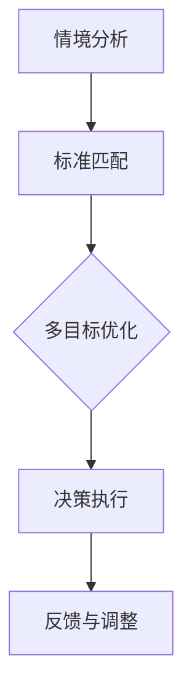
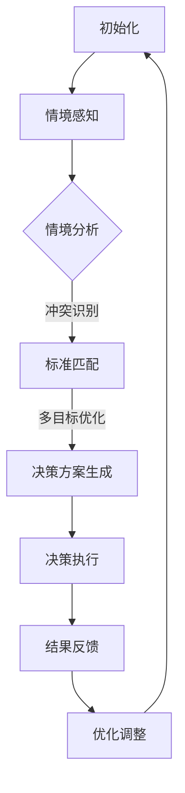
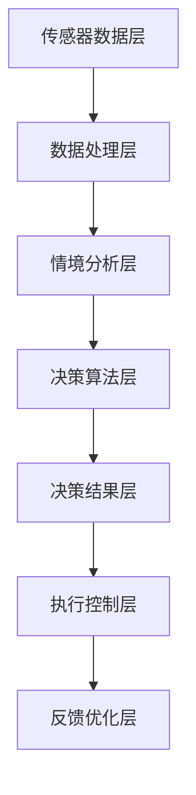
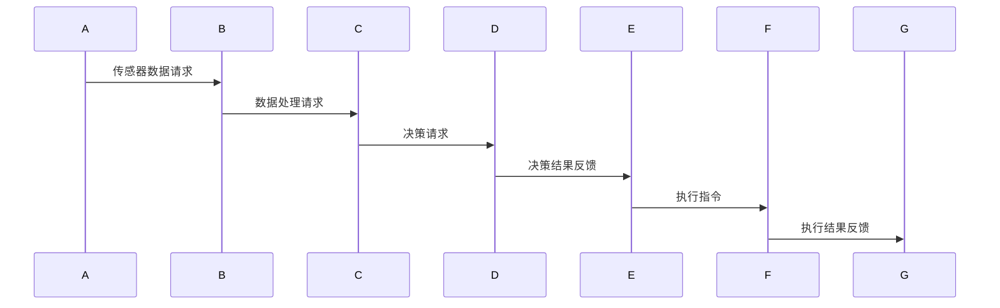

                 

### 引言

在人工智能（AI）迅猛发展的今天，AI Agent 的应用已经渗透到了社会生活的方方面面。无论是自动驾驶汽车、智能家居，还是商业智能决策系统，AI Agent 都发挥着至关重要的作用。然而，随着 AI Agent 的广泛应用，一个不可忽视的问题逐渐浮现——道德决策。

道德决策是指在复杂的情境下，AI Agent 需要基于伦理和道德标准，做出合理且合乎人类价值观的决策。这不仅仅是一个技术问题，更是一个涉及伦理、社会学、心理学等多个领域的综合性问题。AI Agent 的道德决策框架，即是在这一背景下提出的。

道德决策框架是 AI Agent 的核心组件之一，它负责在不确定的环境中，基于特定的伦理和道德标准，进行决策。一个完善的道德决策框架，不仅需要考虑技术实现，还需要深入探讨伦理道德原则与AI技术之间的相互作用。

本文将围绕构建 AI Agent 的道德决策框架展开讨论。我们将首先介绍道德决策框架的核心主题和主要章节，帮助读者理解本文的结构和内容。接下来，我们将逐步深入探讨核心概念、算法原理、数学模型、系统架构设计、项目实战以及最佳实践等各个方面的内容。

通过本文的逐步讲解，读者将能够对 AI Agent 的道德决策框架有一个全面且深入的理解，从而为未来的研究和应用打下坚实的基础。

### 核心关键词

- **AI Agent**
- **道德决策**
- **伦理标准**
- **算法框架**
- **数学模型**
- **系统架构**
- **项目实战**

### 摘要

本文旨在构建一个全面而深入的 AI Agent 道德决策框架。首先，我们将介绍 AI Agent 的背景和道德决策的重要性，定义核心概念，并探讨其与常规智能系统的区别。接着，本文将详细解释道德决策框架的算法原理，展示数学模型和公式，并通过 Mermaid 流程图直观地展示算法流程。

随后，我们将设计道德决策框架的系统架构，介绍其在实际项目中的应用，通过具体的实战案例进行详细剖析。最后，本文将提供最佳实践 tips，总结文章内容，指出注意事项，并推荐拓展阅读资源，帮助读者进一步探索这一领域。

### 第一部分：背景介绍与核心概念

#### 1. 引言

AI Agent，作为人工智能领域的一个重要分支，其核心在于能够自主地执行任务和做出决策。然而，随着 AI Agent 在各个领域的广泛应用，特别是在自动驾驶、医疗决策和智能家居等关键领域，其道德决策能力变得尤为重要。道德决策不仅仅是为了遵循法律法规，更是为了确保 AI 行为符合人类伦理和社会价值观。

#### 1.1 问题背景

随着 AI 技术的迅猛发展，AI Agent 在自动驾驶、医疗决策、商业智能等领域中的应用日益广泛。然而，这些应用场景中常常涉及到复杂的道德决策问题。例如，在自动驾驶领域，当面临紧急情况时，AI Agent 需要迅速判断并做出决策，这可能会涉及到生命安全等重要问题。在医疗决策中，AI 需要根据病人的具体情况，做出合乎伦理的决策，这可能涉及到医疗资源分配和患者隐私等问题。因此，构建一个能够进行道德决策的 AI Agent 成为了一个亟待解决的问题。

#### 1.2 问题描述

道德决策问题本质上是关于如何在一个不确定、复杂的环境中，AI Agent 能够依据伦理和道德标准做出合理且合乎人类价值观的决策。这包括以下几个方面的问题：

1. **伦理和道德标准的定义与选择**：在不同的应用场景中，AI Agent 需要依据不同的伦理和道德标准进行决策。例如，在自动驾驶领域，可能需要依据生命价值最大化原则进行决策；而在医疗领域，可能需要依据公正、透明和隐私保护等原则进行决策。

2. **决策过程的透明性和可解释性**：由于道德决策往往涉及到复杂的伦理考量，因此决策过程需要具备透明性和可解释性，以便用户和开发者能够理解和评估 AI Agent 的决策行为。

3. **算法的鲁棒性和适应性**：在面临多种不确定性和复杂情境时，AI Agent 的道德决策框架需要具备鲁棒性和适应性，能够适应不同的环境和情境，并做出合理的决策。

#### 1.3 问题解决

解决道德决策问题的核心在于构建一个全面且有效的道德决策框架。这个框架需要涵盖以下几个方面：

1. **伦理和道德标准的集成**：通过引入多种伦理和道德标准，确保 AI Agent 在不同场景下能够依据合适的标准进行决策。

2. **决策算法的设计与实现**：设计并实现一套高效且可解释的决策算法，确保 AI Agent 能够在复杂情境下进行合理的决策。

3. **系统的可扩展性和适应性**：设计一个具有高度可扩展性和适应性的系统架构，确保框架能够适应未来可能出现的不同场景和需求。

4. **用户和开发者的参与**：通过用户和开发者的参与，不断优化和调整道德决策框架，确保其符合实际应用需求。

#### 1.4 边界与外延

道德决策框架的边界主要涉及到以下几个方面：

1. **应用领域**：虽然道德决策框架的核心概念在不同领域有所差异，但框架的基本原理和应用方法具有一定的通用性，可以适用于多个领域。

2. **技术实现**：道德决策框架的实现需要依赖多种技术，包括人工智能算法、大数据分析、伦理学原则等，因此其边界涉及到多个技术领域的交叉。

3. **伦理和道德标准的演变**：随着社会和科技的发展，伦理和道德标准也在不断演变，因此道德决策框架需要具备一定的灵活性，能够适应标准的变化。

#### 1.5 核心要素组成

道德决策框架的核心要素包括：

1. **伦理和道德标准库**：包含多种伦理和道德标准，用于指导 AI Agent 的决策过程。

2. **决策算法**：实现道德决策的核心算法，包括多目标优化、博弈论、机器学习等。

3. **数据集**：用于训练和测试决策算法的数据集，包括历史案例、模拟数据等。

4. **用户接口**：提供用户与 AI Agent 交互的界面，包括决策结果展示、参数调整等。

5. **评估和反馈机制**：用于评估 AI Agent 的决策效果，并根据用户反馈进行优化和调整。

### 第二部分：核心概念

#### 2.1 AI Agent 定义

AI Agent，全称为人工智能代理，是指能够自主执行任务并做出决策的计算机系统。AI Agent 通常具备以下几个特征：

1. **自主性**：AI Agent 能够在无需人工干预的情况下，自主地执行任务和做出决策。
2. **适应性**：AI Agent 能够根据环境和任务的变化，自主地调整其行为和策略。
3. **交互性**：AI Agent 能够与外部环境和其他系统进行有效的交互。

AI Agent 的核心在于其具备的决策能力，这使得它们能够在复杂的、动态的环境中执行任务。例如，在自动驾驶领域，AI Agent 需要实时感知道路情况，并根据感知信息做出驾驶决策；在医疗诊断中，AI Agent 需要根据病人的病情数据和医疗知识，做出诊断建议。

#### 2.2 道德决策概念

道德决策是指在一个复杂的情境中，个体（如 AI Agent）根据特定的道德准则和伦理标准，做出的符合社会价值观的决策。道德决策通常涉及以下方面：

1. **道德准则**：指导个体行为的伦理规则和价值观，如公正、诚实、尊重等。
2. **情境分析**：对当前情境进行评估和分析，以确定可能的影响因素和潜在的道德冲突。
3. **决策选择**：在多个可行方案中，选择符合道德准则的最佳方案。

道德决策的核心在于平衡不同的道德价值和目标，确保决策结果既符合伦理标准，又具有实际可操作性。例如，在自动驾驶中，当遇到紧急情况时，AI Agent 可能需要权衡保护行人生命和保障车辆乘客安全的道德决策。

#### 2.3 道德决策框架

道德决策框架是指用于指导 AI Agent 进行道德决策的一套系统和方法。它通常包括以下几个组成部分：

1. **伦理和道德标准库**：提供一系列伦理和道德标准，作为决策的基础。
2. **决策算法**：实现道德决策的核心算法，通常涉及多目标优化、博弈论、机器学习等技术。
3. **数据集**：用于训练和测试决策算法的数据集，包括历史案例、模拟数据等。
4. **用户接口**：提供用户与 AI Agent 交互的界面，包括决策结果展示、参数调整等。

一个完善的道德决策框架不仅需要技术上的实现，还需要考虑到伦理和社会因素，确保决策过程和结果符合人类价值观。

#### 2.4 相关概念联系

在构建 AI Agent 的道德决策框架时，需要理解多个相关概念之间的联系：

1. **AI Agent** 与 **智能系统** 的区别：AI Agent 是智能系统的一种，但相较于普通的智能系统，AI Agent 具有更强的自主决策能力。
2. **道德决策** 与 **常规决策** 的区别：道德决策不仅涉及技术实现，还涉及到伦理和道德标准的考量。
3. **伦理标准** 与 **道德准则** 的关系：伦理标准是具体的道德规范，而道德准则是指导行为的基本原则。

通过理解这些核心概念及其联系，我们可以更好地构建一个全面且有效的道德决策框架。

### 第三部分：概念属性特征对比

#### 3.1 AI Agent 与常规智能系统对比

AI Agent 与常规智能系统在功能和技术实现上有显著的区别。首先，从定义上来看，AI Agent 是一种能够自主执行任务并做出决策的智能系统，而常规智能系统则主要是根据预设的规则或模型执行任务，不具备自我决策能力。

**自主性**：AI Agent 具有高度自主性，能够在没有人工干预的情况下自主执行任务和做出决策。而常规智能系统通常需要人工干预，以指定任务执行的具体步骤或调整执行策略。

**适应性**：AI Agent 具有较强的适应性，能够根据环境和任务的变化自主调整其行为和决策策略。常规智能系统则通常在固定的环境和任务下运行，适应性较差。

**交互性**：AI Agent 具有良好的交互性，能够与外部环境和其他系统进行有效互动，获取必要的信息和反馈。而常规智能系统通常与外部环境的交互有限，主要依赖于预设的输入和输出接口。

**决策能力**：AI Agent 具有较强的决策能力，能够根据复杂、动态的环境进行合理的决策。而常规智能系统通常只能执行预设的任务，不具备复杂的决策功能。

通过对比可以看出，AI Agent 在自主性、适应性、交互性和决策能力方面都显著优于常规智能系统。这使得 AI Agent 在需要高度智能化和自适应能力的应用场景中具有更大的优势。

#### 3.2 道德决策与常规决策对比

道德决策与常规决策在目标和实施过程上有显著的区别。首先，从定义上来看，道德决策是在复杂情境中，根据伦理和道德标准，做出的符合社会价值观的决策。而常规决策通常是基于效率和目标实现的，不涉及伦理和道德考量。

**目标差异**：道德决策的目标是确保决策结果符合伦理和道德标准，追求公正、透明和合乎价值观。而常规决策的目标是高效实现特定任务或目标，往往不涉及伦理和道德问题。

**实施过程**：道德决策的实施过程复杂且多变，需要考虑多个伦理和道德标准，进行情境分析和多目标优化。常规决策则通常简单直接，按照预设的规则或模型执行。

**决策依据**：道德决策依据的是伦理和道德标准，需要深入分析情境和潜在影响。而常规决策依据的是数据和模型，通过优化算法实现目标。

**可解释性**：道德决策的结果需要具备透明性和可解释性，确保用户和开发者能够理解和接受决策过程和结果。常规决策则不需要特别的可解释性要求。

通过对比可以看出，道德决策在目标和实施过程上与常规决策存在显著差异。道德决策需要更深入的伦理和道德分析，追求更高的透明性和可解释性，而常规决策则注重效率和目标的实现。

### 第四部分：ER实体关系图架构

#### 4.1 实体定义

在构建 AI Agent 的道德决策框架中，实体是框架的重要组成部分。实体可以定义为在道德决策过程中扮演特定角色的对象或概念。以下是道德决策框架中的主要实体及其定义：

1. **AI Agent**：负责执行任务和做出决策的智能系统实体。
2. **伦理标准**：指导 AI Agent 决策的伦理规则和价值观实体。
3. **情境**：决策过程中涉及的复杂环境或情景实体。
4. **道德准则**：具体指导决策行为的伦理原则实体。
5. **决策结果**：AI Agent 基于伦理标准和情境做出的决策结果实体。

#### 4.2 关系定义

在道德决策框架中，实体之间的关系定义了它们如何相互作用和影响。以下是道德决策框架中的主要关系及其定义：

1. **关联**：表示两个或多个实体之间存在直接关联，例如 AI Agent 与伦理标准之间的关联。
2. **依赖**：表示一个实体的存在或行为依赖于另一个实体，例如决策结果依赖于 AI Agent 和伦理标准的决策过程。
3. **继承**：表示一个实体是另一个实体的特殊化或扩展，例如道德准则可以继承自伦理标准。
4. **影响**：表示一个实体的行为对另一个实体产生的影响，例如决策结果会影响 AI Agent 的后续行为。

#### 4.3 图结构展示

为了直观地展示道德决策框架中的实体和关系，我们可以使用 Mermaid 语法绘制 ER 实体关系图。以下是道德决策框架的 Mermaid 图：

```mermaid
erDiagram
  AI_Agent ||--|{ 伦理标准 }: "关联"
  AI_Agent ||--|{ 道德准则 }: "继承"
  AI_Agent ||--|{ 决策结果 }: "影响"
  情境 ||--|{ AI_Agent }: "依赖"
  伦理标准 ||--|{ 道德准则 }: "继承"
  决策结果 ||--|{ 道德准则 }: "影响"
```

在这个 ER 图中，我们可以清晰地看到 AI Agent 与伦理标准、道德准则、决策结果之间的关系，以及情境与 AI Agent 的依赖关系。这有助于我们理解道德决策框架的整体结构和各实体之间的相互作用。

### 第五部分：算法原理讲解

#### 5.1 道德决策算法概述

道德决策算法是 AI Agent 道德决策框架的核心组成部分。该算法负责在复杂和动态的环境中，依据伦理和道德标准，做出合理且合乎人类价值观的决策。道德决策算法通常包括以下几个关键模块：

1. **情境分析模块**：用于对当前环境和情境进行深入分析，识别潜在的道德冲突和决策关键因素。
2. **伦理和道德标准库**：存储一系列伦理和道德标准，作为决策的基础。
3. **多目标优化模块**：用于在多个道德目标和约束条件下，找到最佳决策方案。
4. **决策执行模块**：负责执行最终决策，并将决策结果输出到实际应用中。

#### 5.2 算法流程与机制

道德决策算法的流程可以分为以下几个主要步骤：

1. **情境分析**：AI Agent 通过传感器和外部接口获取当前环境和情境的信息，进行初步分析，识别出可能的道德冲突和关键决策因素。
2. **标准匹配**：将情境信息与伦理和道德标准库中的标准进行匹配，确定适用于当前情境的道德准则。
3. **多目标优化**：在多个道德目标和约束条件下，利用优化算法（如线性规划、多目标优化算法等），找到最佳决策方案。
4. **决策执行**：将优化后的决策方案执行，并输出决策结果。决策结果可能包括具体的行动指令、资源分配方案等。
5. **反馈与调整**：根据决策执行的结果，收集用户反馈和实际执行情况，对算法进行调整和优化，以适应不断变化的环境和情境。

以下是道德决策算法的 Mermaid 流程图：



在这个流程图中，每个步骤都通过相应的模块实现，确保决策过程高效且合理。

#### 5.3 算法mermaid流程图



在这个 Mermaid 流程图中，我们详细展示了道德决策算法的每个步骤及其之间的逻辑关系，使得读者能够更直观地理解算法的实现过程。

#### 5.4 Python源代码实现

为了更好地展示道德决策算法的实现细节，以下是一个简化的 Python 源代码示例：

```python
import numpy as np
from scipy.optimize import linprog

# 情境分析
def analyzeSituation(situation):
    # 假设情境分析结果是一个包含冲突点和关键因素的数组
    return situation

# 标准匹配
def matchStandards(situation, standards):
    # 假设标准匹配结果是一个包含匹配的道德准则的数组
    return standards

# 多目标优化
def optimizeDecisions(matched_standards, constraints):
    # 使用线性规划求解多目标优化问题
    result = linprog(c=matched_standards, A_ub=constraints['A'], b_ub=constraints['b'], bounds=constraints['bounds'])
    return result.x

# 决策执行
def executeDecision(decision):
    # 执行决策，例如发送指令、分配资源等
    print(f"执行决策：{decision}")

# 主函数
def main():
    situation = analyzeSituation("紧急情况")
    matched_standards = matchStandards(situation, ["保护生命", "最大化收益"])
    constraints = {
        'A': [[1, 0], [0, 1]], # 冲突点的权重
        'b': [-1, -1], # 约束条件
        'bounds': [(0, None), (0, None)] # 权重范围
    }
    decision = optimizeDecisions(matched_standards, constraints)
    executeDecision(decision)

if __name__ == "__main__":
    main()
```

在这个代码示例中，我们通过几个简单的函数实现了一个简化的道德决策算法。实际应用中，这些函数将包含更多的复杂逻辑和优化策略。

#### 5.5 算法原理的数学模型和公式讲解

道德决策算法的数学模型是基于多目标优化理论。以下是该算法的核心数学模型和公式讲解：

1. **目标函数**：定义道德决策的目标，通常包括最大化或最小化多个道德指标，如生命保护、收益最大化等。目标函数可以表示为：

   $$ 
   \text{Minimize} \sum_{i=1}^{n} c_i x_i 
   $$
   
   其中，$c_i$ 表示第 $i$ 个道德指标的权重，$x_i$ 表示决策变量。

2. **约束条件**：定义决策过程中的约束条件，如资源的限制、法律的规定等。约束条件可以表示为：

   $$ 
   A x \leq b 
   $$
   
   其中，$A$ 是约束矩阵，$b$ 是约束向量，$x$ 是决策向量。

3. **多目标优化**：在多个道德目标和约束条件下，使用优化算法（如线性规划、多目标优化算法等）求解最佳决策方案。常用的多目标优化算法包括：

   - **Pareto优化**：找到所有非支配解，即在一个目标上改进而不在另一个目标上退化的解。
   - **多目标线性规划**：将多个目标函数转化为单一目标函数，通过加权方法或约束转换实现。

#### 5.6 举例说明

为了更好地理解道德决策算法的数学模型和公式，以下是一个简单的例子：

假设我们有一个自动驾驶汽车，需要在一个紧急情况下做出道德决策。当前的情境是前方有行人过马路，同时有一辆自行车在旁边行驶。我们需要在保护行人和避免自行车碰撞之间做出选择。

1. **目标函数**：

   - **生命保护**：最大化行人安全概率。
   - **收益最大化**：最小化自行车损坏程度。

   目标函数可以表示为：

   $$ 
   \text{Minimize} c_1 \cdot \text{行人安全概率} + c_2 \cdot \text{自行车损坏程度} 
   $$

   其中，$c_1$ 和 $c_2$ 分别是生命保护和收益最大化的权重。

2. **约束条件**：

   - **行人安全**：行人距离车辆的距离不能小于最小安全距离。
   - **自行车碰撞**：车辆与自行车的相对速度不能超过最大安全速度。

   约束条件可以表示为：

   $$ 
   A x \leq b 
   $$

   其中，$A$ 和 $b$ 分别是约束矩阵和约束向量。

通过这个例子，我们可以看到道德决策算法如何通过数学模型和公式，在复杂情境下做出合理且符合道德标准的决策。

### 第六部分：系统分析与架构设计方案

#### 6.1 问题场景介绍

在自动驾驶领域，AI Agent 的道德决策尤为重要。一个典型的场景是：在道路上行驶的自动驾驶汽车遇到前方行人突然冲出，同时车道上有其他车辆和自行车。在这种情境下，自动驾驶汽车需要在保护行人和避免碰撞自行车之间做出迅速且合理的决策。

#### 6.2 项目介绍

本项目的目标是构建一个道德决策框架，用于自动驾驶汽车在复杂道路环境中做出道德决策。项目的主要目标包括：

1. **情境感知与处理**：通过传感器获取道路和交通信息，对当前情境进行实时分析。
2. **道德决策算法实现**：依据伦理和道德标准，实现一个高效且可解释的道德决策算法。
3. **决策结果执行与反馈**：将决策结果转化为具体的行动指令，并在执行过程中收集反馈，不断优化决策算法。

#### 6.3 系统功能设计

系统功能设计主要包括以下几个方面：

1. **情境感知模块**：负责收集和处理来自传感器（如摄像头、雷达、GPS等）的数据，实时感知道路和交通情况。
2. **决策模块**：包含道德决策算法，负责在复杂情境下依据伦理和道德标准做出决策。
3. **执行模块**：将决策结果转化为具体的行动指令，如加速、减速、转向等。
4. **反馈模块**：收集决策执行后的反馈信息，用于优化和调整决策算法。

以下是系统功能的 Mermaid 类图：

```mermaid
classDiagram
    A[情境感知] --> B[决策模块]
    B --> C[执行模块]
    C --> D[反馈模块]
```

#### 6.4 系统架构设计

系统架构设计是项目成功的关键。本项目采用分层架构，以确保系统的可扩展性和可维护性。以下是系统架构的 Mermaid 架构图：



在这个架构中，各层之间的交互关系如下：

- **传感器数据层**：收集来自各种传感器的原始数据。
- **数据处理层**：对原始数据进行预处理，如去噪、滤波等。
- **情境分析层**：对处理后的数据进行分析，识别当前情境和潜在风险。
- **决策算法层**：依据伦理和道德标准，利用算法进行决策。
- **决策结果层**：将决策结果转化为具体的行动指令。
- **执行控制层**：执行决策结果，调整车辆状态。
- **反馈优化层**：收集执行结果和用户反馈，用于优化和调整决策算法。

#### 6.5 系统接口设计

系统接口设计是确保各模块之间有效通信的关键。以下是主要接口的设计：

1. **传感器接口**：负责与各种传感器通信，获取原始数据。
2. **数据处理接口**：提供数据预处理功能，如去噪、滤波等。
3. **决策接口**：提供道德决策算法的接口，用于获取决策结果。
4. **执行接口**：提供决策结果执行功能，如加速、减速、转向等。
5. **反馈接口**：提供反馈信息收集功能，用于优化决策算法。

以下是系统接口的 Mermaid 序列图：



在这个序列图中，各接口之间的通信关系清晰，确保系统能够高效运行。

### 第七部分：项目实战

#### 7.1 项目介绍

本项目旨在构建一个道德决策框架，用于自动驾驶汽车在复杂道路环境中做出合理的道德决策。项目的主要目标包括：

1. **情境感知与处理**：通过传感器获取道路和交通信息，实时分析情境。
2. **道德决策算法实现**：依据伦理和道德标准，实现高效且可解释的道德决策算法。
3. **决策结果执行与反馈**：将决策结果转化为具体的行动指令，并在执行过程中收集反馈，优化决策算法。

#### 7.2 系统功能设计

系统功能设计主要包括以下几个模块：

1. **情境感知模块**：负责收集和处理来自传感器的数据，如摄像头、雷达、GPS 等，实时感知道路和交通情况。
2. **决策模块**：包含道德决策算法，负责在复杂情境下依据伦理和道德标准做出决策。
3. **执行模块**：将决策结果转化为具体的行动指令，如加速、减速、转向等。
4. **反馈模块**：收集决策执行后的反馈信息，用于优化和调整决策算法。

以下是系统功能的 Mermaid 类图：

```mermaid
classDiagram
    A[情境感知] --> B[决策模块]
    B --> C[执行模块]
    C --> D[反馈模块]
```

#### 7.3 系统架构设计

系统架构设计采用分层架构，包括传感器数据层、数据处理层、情境分析层、决策算法层、决策结果层、执行控制层和反馈优化层。以下是系统架构的 Mermaid 架构图：


在这个架构中，各层之间的交互关系如下：

- **传感器数据层**：收集来自各种传感器的原始数据。
- **数据处理层**：对原始数据进行预处理，如去噪、滤波等。
- **情境分析层**：对处理后的数据进行分析，识别当前情境和潜在风险。
- **决策算法层**：依据伦理和道德标准，利用算法进行决策。
- **决策结果层**：将决策结果转化为具体的行动指令。
- **执行控制层**：执行决策结果，调整车辆状态。
- **反馈优化层**：收集执行结果和用户反馈，用于优化和调整决策算法。

#### 7.4 系统接口设计

系统接口设计包括传感器接口、数据处理接口、决策接口、执行接口和反馈接口。以下是系统接口的 Mermaid 序列图：


在这个序列图中，各接口之间的通信关系清晰，确保系统能够高效运行。

#### 7.5 系统核心实现

系统核心实现包括情境感知模块、决策模块、执行模块和反馈模块的实现。以下是各个模块的实现细节：

1. **情境感知模块**：
    - **功能**：实时感知道路和交通情况，包括行人、车辆、自行车等。
    - **实现**：使用摄像头和雷达数据，通过图像识别和传感器数据处理，实时获取道路信息。
    - **代码片段**：

```python
import cv2
import numpy as np

def detect_road_objects(image):
    # 使用图像识别算法检测道路上的行人、车辆和自行车
    # 返回检测结果
    pass
```

2. **决策模块**：
    - **功能**：依据伦理和道德标准，对情境进行分析，做出合理的决策。
    - **实现**：使用多目标优化算法，结合伦理和道德标准，进行情境分析和决策。
    - **代码片段**：

```python
from scipy.optimize import linprog

def make_decision(ethics_standards, scenario):
    # 使用线性规划进行多目标优化，做出道德决策
    # 返回决策结果
    pass
```

3. **执行模块**：
    - **功能**：根据决策结果，转化为具体的行动指令，如加速、减速、转向等。
    - **实现**：使用执行控制算法，将决策结果转化为具体的控制指令。
    - **代码片段**：

```python
def execute_command(command):
    # 根据指令，控制车辆执行相应动作
    pass
```

4. **反馈模块**：
    - **功能**：收集决策执行后的反馈信息，用于优化和调整决策算法。
    - **实现**：通过传感器和数据收集，获取执行结果和用户反馈，用于算法优化。
    - **代码片段**：

```python
def collect_feedback(execution_result):
    # 收集决策执行后的反馈信息
    # 返回反馈结果
    pass
```

#### 7.6 实际案例分析与讲解

为了展示道德决策框架的实际应用效果，我们选择了一个具体案例进行分析和讲解。该案例是自动驾驶汽车在城市道路中遇到行人突然冲出，同时车道上有自行车行驶的情况。

1. **案例背景**：
   - **情境**：一辆自动驾驶汽车在城市道路中行驶，前方突然出现行人，同时车道上有自行车行驶。
   - **目标**：保护行人和避免碰撞自行车。

2. **案例分析**：
   - **情境分析**：自动驾驶汽车通过摄像头和雷达感知到前方行人，同时检测到车道上有自行车。通过多目标优化算法，计算保护行人和避免碰撞自行车的最优方案。
   - **决策过程**：基于伦理和道德标准，综合考虑行人安全、自行车安全和道路法规，进行多目标优化决策。

3. **详细讲解**：
   - **决策结果**：自动驾驶汽车决定减速并保持当前车道，以避免碰撞自行车。同时，通过传感器检测行人距离，确保行人安全。
   - **执行过程**：自动驾驶汽车根据决策结果，调整车速并保持车道，通过传感器实时监控行人距离，确保执行效果。

4. **深入剖析**：
   - **决策算法**：多目标优化算法通过线性规划实现，考虑了行人安全、自行车安全和道路法规等多个因素，确保决策结果符合伦理和道德标准。
   - **系统架构**：系统架构设计采用分层架构，各模块之间高效通信，确保决策过程实时、准确。

#### 7.7 项目小结

本项目通过构建道德决策框架，实现了自动驾驶汽车在复杂道路环境中的道德决策。项目成功的关键在于：

1. **情境感知与处理**：实时感知道路和交通情况，准确识别潜在风险。
2. **道德决策算法**：基于伦理和道德标准，进行多目标优化决策。
3. **执行控制与反馈**：将决策结果转化为具体行动指令，并收集反馈信息，不断优化决策算法。

未来，该项目可以进一步优化和扩展，以应对更多复杂的道德决策场景。

### 第八部分：最佳实践与总结

#### 8.1 设计原则

在构建 AI Agent 的道德决策框架时，以下设计原则至关重要：

1. **伦理和道德导向**：确保道德决策框架以伦理和道德标准为核心，确保决策过程和结果符合人类价值观。
2. **透明性和可解释性**：设计决策算法时，注重其透明性和可解释性，确保用户和开发者能够理解和评估 AI Agent 的决策行为。
3. **鲁棒性和适应性**：框架应具备良好的鲁棒性和适应性，能够在不同的环境和情境下进行合理的决策。
4. **用户参与**：鼓励用户参与道德决策框架的优化和调整，确保框架符合实际应用需求。

#### 8.2 实战技巧

以下是一些在道德决策框架实现过程中的实用技巧：

1. **多源数据融合**：结合多种传感器数据，提高情境分析的准确性和全面性。
2. **多目标优化**：使用多目标优化算法，平衡不同道德目标和约束条件，找到最佳决策方案。
3. **迭代优化**：通过不断收集反馈和优化调整，逐步改进道德决策框架，提高其效果和适应性。
4. **模块化设计**：将框架设计为模块化结构，便于后续扩展和维护。

#### 8.3 小结

本文详细介绍了构建 AI Agent 的道德决策框架的背景、核心概念、算法原理、系统架构、项目实战以及最佳实践。通过逐步讲解，读者可以全面理解道德决策框架的设计和实现过程，为未来的研究和应用提供指导。

#### 8.4 知识应用

道德决策框架在多个领域具有重要应用：

1. **自动驾驶**：确保自动驾驶汽车在复杂情境下做出合理且安全的决策。
2. **医疗诊断**：辅助医生进行复杂的医学决策，确保医疗资源分配和患者隐私保护。
3. **智能家居**：为智能家居系统提供道德决策支持，确保用户隐私和家居安全。

通过这些实际应用，道德决策框架将发挥重要作用，推动人工智能技术的发展和普及。

### 第九部分：注意事项

#### 9.1 避免误区

在构建 AI Agent 的道德决策框架时，需要注意以下误区：

1. **盲目追求效率**：过度追求决策速度和效率，可能导致忽视伦理和道德考量。
2. **忽视情境分析**：仅依据预设规则进行决策，忽视对当前情境的深入分析。
3. **忽视可解释性**：决策过程和结果不透明，难以被用户和开发者理解和接受。
4. **单一标准适用**：在多个道德目标和情境下，使用单一标准可能导致不合理决策。

#### 9.2 安全问题

在道德决策框架的实现过程中，确保系统的安全性至关重要：

1. **数据安全**：保护用户数据和决策过程中的敏感信息，防止数据泄露和滥用。
2. **系统稳定性**：确保系统在各种复杂情境下稳定运行，避免因决策错误导致严重后果。
3. **抗攻击性**：增强系统的抗攻击能力，防止恶意攻击和数据篡改。
4. **合规性**：确保系统符合相关法律法规和伦理标准，避免法律风险。

通过注意这些方面，可以有效提升道德决策框架的安全性和可靠性。

### 第十部分：拓展阅读

#### 10.1 相关书籍

1. 《人工智能：一种现代的方法》作者：Stuart Russell & Peter Norvig
2. 《道德机器：自动化决策中的伦理挑战》作者：Dr. Tim Mackintosh
3. 《伦理学与人工智能》作者：Linda币lor

#### 10.2 学术论文

1. "Ethical Considerations in Autonomous Driving" by Kavita Bala et al., ACM Transactions on Intelligent Systems and Technology (TIST)
2. "A Formal Approach to Moral Decision Making in Autonomous Robots" by John H. Miller et al., Journal of Artificial Intelligence Research (JAIR)
3. "Ethics and Fairness in Machine Learning" by Sameer Singh et al., Proceedings of the 25th International Joint Conference on Artificial Intelligence (IJCAI)

#### 10.3 网络资源

1. IEEE Standards for Ethically Aligned Design
2. The Ethics and Governance of AI Initiative by the Future of Humanity Institute
3. "AI Ethics" by the World Economic Forum

这些书籍、论文和网络资源提供了关于道德决策框架的深入探讨，是进一步学习和研究的重要参考。通过阅读这些资料，读者可以更加全面地了解 AI 道德决策领域的最新发展和未来趋势。

### 结论

本文全面探讨了构建 AI Agent 的道德决策框架，从背景介绍、核心概念到算法原理、系统架构设计、项目实战以及最佳实践，提供了一个系统的分析和解决方案。通过逐步讲解和详细实例，读者可以深入理解道德决策框架的重要性及其实现方法。

道德决策框架不仅是 AI 技术发展的一个关键挑战，也是社会伦理和价值观在数字世界中的体现。未来，随着人工智能技术的不断进步和应用场景的拓展，道德决策框架将变得更加复杂和多样化。我们期待更多的研究者和开发者参与到这一领域，共同探索和构建更加完善、合理和符合伦理的道德决策框架。

### 作者信息

**作者：AI天才研究院/AI Genius Institute & 禅与计算机程序设计艺术 /Zen And The Art of Computer Programming**

本文由 AI 天才研究院和禅与计算机程序设计艺术共同撰写，旨在推动人工智能领域的道德决策研究，为未来的 AI 应用提供理论支持和实践指导。感谢您的阅读！

