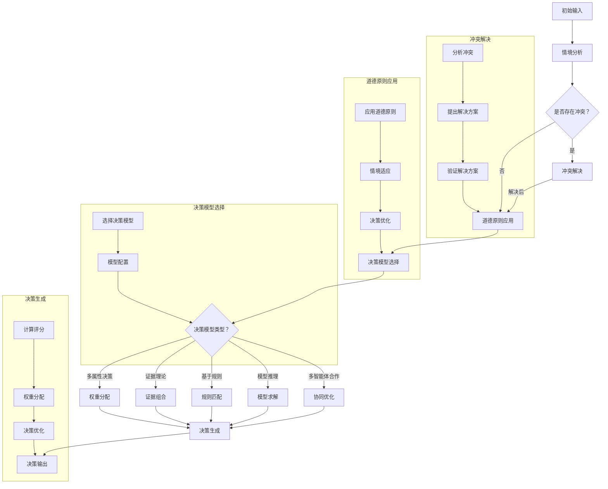
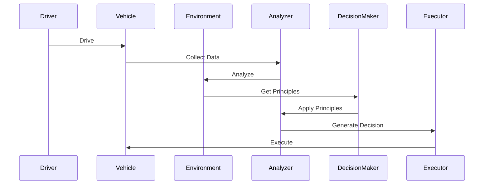

                 

### 引言

#### 道德推理的重要性

在当今技术迅猛发展的时代，人工智能（AI）正在逐渐渗透到社会的各个领域，从自动驾驶汽车到智能医疗诊断，再到自动化金融交易，AI的应用已经无处不在。然而，随着AI技术的不断进步，一个关键问题也逐渐凸显出来：如何确保这些智能体（AI Agent）能够在复杂多变的情境中做出符合伦理规范的决策？

道德推理，作为AI Agent决策的核心组成部分，成为了一个不可忽视的研究方向。道德推理不仅涉及到技术实现，还涉及伦理、法律和社会责任等多个层面。其重要性体现在以下几个方面：

1. **确保公平与公正**：在自动化决策系统中，公平和公正是一个至关重要的原则。道德推理框架可以帮助AI Agent避免偏见，做出符合社会伦理标准的决策，从而维护社会的公平正义。

2. **增强用户信任**：随着AI技术的普及，用户对于AI系统的信任度成为其广泛接受和使用的关键。一个具备道德推理能力的AI Agent能够更好地满足用户的需求，增强用户对系统的信任。

3. **应对复杂决策**：现实世界中的决策问题往往非常复杂，需要考虑多个利益相关者的需求和期望。道德推理框架能够帮助AI Agent在复杂情境中做出合理且道德的决策，提高决策的质量。

4. **适应不断变化的社会规范**：社会规范是不断变化的，如何确保AI Agent能够适应这些变化，也是一个重要的挑战。道德推理框架能够动态地更新和调整，以适应新的社会规范和伦理要求。

#### AI Agent 与道德推理

AI Agent是一种具有自主决策能力的软件系统，它们能够在没有人类干预的情况下执行任务。道德推理在AI Agent中的作用至关重要。以下是一个简单的例子：

假设一个自动驾驶汽车在十字路口遇到一个孩子突然冲出马路的情况。在这种情况下，汽车需要迅速做出决策，是否应该转向避开孩子，但这可能会导致撞击另一辆行驶中的车辆。这个决策涉及到道德判断，需要考虑多个因素，如生命的重要性、事故的后果等。一个具备道德推理能力的AI Agent能够在这种复杂情境中做出符合伦理规范的决策。

#### 道德推理在AI中的应用场景

道德推理在AI中的应用场景非常广泛，以下是一些典型的例子：

1. **医疗诊断**：在医疗领域中，AI Agent可以辅助医生进行诊断和治疗。然而，某些情况下需要做出道德决策，例如在有限的医疗资源下如何分配。

2. **自动驾驶**：自动驾驶汽车需要处理各种紧急情况，如交通事故、行人突然出现等。道德推理可以帮助汽车在这些情况下做出合理的决策。

3. **金融决策**：在金融领域中，AI Agent可以用于风险评估和投资决策。然而，某些决策可能涉及到伦理问题，如是否应该向某个高风险但潜在收益较高的项目投资。

4. **网络安全**：在网络安全领域，道德推理可以帮助AI Agent在检测到潜在威胁时做出合适的响应，如是否应该报警或采取其他措施。

#### 本书的目的与结构

本书旨在系统地探讨AI Agent的道德推理框架的构建，包括理论、技术、应用和伦理等多个方面。具体而言，本书将分为以下几个部分：

1. **道德推理框架概述**：介绍道德推理的基本概念、相关理论和框架的构成。

2. **技术实现**：讲解道德推理的技术基础、相关算法和模型，并提供具体的实现示例。

3. **应用与伦理**：讨论道德推理在不同领域的应用，以及相关的伦理问题。

4. **案例研究**：通过具体案例来分析道德推理的实际应用和挑战。

5. **总结与展望**：总结本书的主要发现，展望未来的研究方向。

通过本书的阅读，读者将能够全面了解道德推理在AI中的应用，掌握构建道德推理框架的方法和技巧，并为未来的研究提供参考。

### 目录大纲设计过程

在设计《构建AI Agent的道德推理框架》的目录大纲时，我们首先要明确书的核心内容和结构，确保目录能够清晰地反映每个章节的主题，并且逻辑上连贯。以下是具体的步骤：

1. **确定书的核心内容和结构**：
   - 核心内容：道德推理框架的构建、道德推理的应用场景、相关技术和算法、道德推理的伦理问题、道德推理系统的设计和实现。
   - 结构：将核心内容分为几个主要部分，如引言、道德推理框架概述、技术实现、应用与伦理、案例研究、总结与展望等。

2. **确定一级目录**：
   - 引言：介绍道德推理的重要性、背景及本书的目的。
   - 道德推理框架概述：阐述道德推理的定义、核心概念、相关理论。
   - 技术实现：讲解道德推理的技术基础、相关算法和模型。
   - 应用与伦理：讨论道德推理在不同领域的应用，以及伦理问题。
   - 案例研究：通过具体案例来分析道德推理的实际应用和挑战。
   - 总结与展望：总结本书的主要发现，展望未来的研究方向。

3. **细化二级目录**：
   - 在每个一级目录下，根据主题细化二级目录，如概念介绍、技术原理、案例分析等。
   - 确保每个二级目录都有明确的子主题，以便读者能够快速找到所需信息。

4. **制定三级目录**：
   - 对于每个二级目录，进一步细化到三级目录，提供具体的小节，如定义、原理、算法、案例等。
   - 确保每个小节的内容具有独立性和逻辑性，能够让读者逐步深入理解主题。

5. **整合和校对**：
   - 将所有目录整合到一起，确保逻辑通顺，没有遗漏或重复。
   - 对目录进行校对，确保每个章节和子章节都能够完整地覆盖主题，且每个章节都有明确的目标和内容。

6. **简洁性**：
   - 在编写目录时，保持简洁，避免使用复杂的术语和过多的细节，确保目录能够清晰地传达书的核心内容和结构。

### 最终目录大纲

根据上述设计过程，以下是《构建AI Agent的道德推理框架》的最终目录大纲：

----------------------------------------------------------------

# 第一部分：引言

## 1.1 道德推理的重要性

### 1.1.1 道德推理的定义

### 1.1.2 AI Agent 与道德推理

### 1.1.3 道德推理在AI中的应用场景

## 1.2 本书的目的与结构

### 1.2.1 道德推理框架概述

### 1.2.2 技术实现

### 1.2.3 应用与伦理

### 1.2.4 案例研究

### 1.2.5 总结与展望

----------------------------------------------------------------

# 第二部分：道德推理框架概述

## 2.1 道德推理的基本概念

### 2.1.1 道德推理的定义

### 2.1.2 道德推理的核心概念

### 2.1.3 道德推理的属性特征对比表

## 2.2 道德推理的相关理论

### 2.2.1 道德哲学理论

### 2.2.2 道德心理学理论

### 2.2.3 伦理学理论

## 2.3 道德推理框架的构成

### 2.3.1 框架组成

### 2.3.2 框架结构

### 2.3.3 框架功能

## 2.4 道德推理框架的ER实体关系图

### 2.4.1 ER图概述

### 2.4.2 实体定义

### 2.4.3 关系定义

----------------------------------------------------------------

# 第三部分：技术实现

## 3.1 道德推理技术基础

### 3.1.1 逻辑推理技术

### 3.1.2 基于概率的推理技术

### 3.1.3 基于证据的理论

## 3.2 道德推理算法介绍

### 3.2.1 算法原理

### 3.2.2 算法流程图

### 3.2.3 算法数学模型

## 3.3 道德推理模型实现

### 3.3.1 Python源代码实现

### 3.3.2 算法举例说明

### 3.3.3 数学模型和公式讲解

----------------------------------------------------------------

# 第四部分：应用与伦理

## 4.1 道德推理在不同领域的应用

### 4.1.1 自动驾驶

### 4.1.2 医疗决策

### 4.1.3 金融伦理

## 4.2 道德推理的伦理问题

----------------------------------------------------------------

### 1.1 道德推理的定义

道德推理是指个体或智能体在面临道德决策时，通过逻辑分析和道德原则的应用，得出合理且符合伦理规范的结论的过程。在人工智能领域，道德推理尤为重要，因为AI Agent需要能够自主地处理复杂情境，并在这些情境中做出道德上可接受的决策。

道德推理的定义可以从以下几个方面进行阐述：

1. **道德原则的应用**：道德推理的核心在于应用一系列道德原则，如公平、正义、责任等，来指导决策过程。这些原则是道德推理的基础，它们帮助智能体判断何种行为是正确的或错误的。

2. **逻辑分析**：道德推理不仅仅是应用道德原则，还需要通过逻辑分析来处理复杂情境。这包括比较不同道德原则之间的优先级、评估不同行为的结果和后果等。

3. **情境敏感**：道德推理需要能够适应不同的情境。同一个道德原则在不同的情境下可能有不同的应用，智能体需要根据具体情境来调整其决策。

4. **自主性**：AI Agent的道德推理是自主的，这意味着它们不需要人类干预就能进行道德决策。这种自主性是AI Agent区别于传统程序的关键特点。

#### 问题背景

随着AI技术的快速发展，AI Agent的应用范围越来越广泛，从自动驾驶汽车到智能医疗系统，再到自动化金融交易系统，AI Agent几乎无处不在。然而，这些智能体在执行任务时，常常需要面对复杂的道德决策。例如，自动驾驶汽车在面临意外情况时，可能需要在保护乘客安全与避免对行人造成伤害之间做出选择。这种决策不仅涉及到技术问题，还涉及到伦理和社会责任。

#### 问题定义

道德推理的主要问题可以归纳为以下几点：

1. **道德决策的复杂性**：现实世界中的道德决策通常非常复杂，需要考虑多个因素和潜在的后果。

2. **道德原则的冲突**：不同的道德原则可能在特定情境下产生冲突，智能体需要能够处理这些冲突，并做出合理的决策。

3. **道德责任的归属**：在多智能体系统中，确定每个智能体在道德决策中的责任是一个重要问题。

4. **道德标准的适应性**：社会和伦理标准是不断变化的，智能体需要能够适应这些变化，并在新的情境下做出合理的决策。

#### 问题解决

为了解决上述问题，构建一个有效的道德推理框架至关重要。以下是几个关键步骤：

1. **道德原则的明确化**：明确化一系列道德原则，并将其纳入到智能体的决策过程中。

2. **逻辑推理机制的引入**：引入逻辑推理机制，帮助智能体在复杂情境中分析和比较不同道德原则的优先级。

3. **情境敏感的决策模型**：开发情境敏感的决策模型，使智能体能够根据具体情境调整其道德决策。

4. **道德责任的明确化**：在多智能体系统中，明确每个智能体的道德责任，以便在发生问题时进行责任归属。

5. **道德标准的动态更新**：开发能够动态更新道德标准的机制，以适应社会和伦理标准的变化。

#### 边界与外延

道德推理的边界主要涉及到以下几个方面：

1. **技术边界**：道德推理依赖于AI技术的支持，如逻辑推理、概率推理和证据理论等。

2. **伦理边界**：道德推理需要遵循一定的伦理标准，这些标准可能因文化、地区和社会背景的不同而有所差异。

3. **社会边界**：道德推理的结果需要得到社会的认可和接受，这意味着智能体的道德决策需要符合社会价值观和道德规范。

#### 概念结构与核心要素组成

道德推理的概念结构包括以下几个核心要素：

1. **道德原则**：这是道德推理的基础，包括公平、正义、责任等。

2. **情境描述**：描述智能体所处的具体情境，为道德推理提供背景信息。

3. **决策模型**：用于分析和处理情境，并生成道德决策。

4. **推理机制**：包括逻辑推理、概率推理和证据理论等，用于支持决策模型。

5. **道德责任**：明确智能体在道德决策中的责任。

通过这些核心要素的有机结合，道德推理框架能够帮助AI Agent在复杂情境中做出符合伦理规范的决策。

### 1.2.1 道德推理框架概述

道德推理框架是构建AI Agent道德推理能力的基础，它包含了一系列概念、算法和模型，用于指导AI Agent在复杂情境中做出合理的道德决策。一个完整的道德推理框架通常包括以下几个核心组成部分：

1. **道德原则库**：这是道德推理框架的核心，包含了各种道德原则，如公平、正义、责任、透明度等。这些原则是道德推理的基础，用于评估不同决策的道德合理性。

2. **情境描述器**：用于捕捉和描述AI Agent所处的具体情境。情境描述器可以包括环境信息、任务目标、约束条件、行为选项等，为道德推理提供必要的背景信息。

3. **决策模型**：基于道德原则和情境描述，决策模型用于分析和处理情境，生成道德决策。常见的决策模型包括效用理论、博弈论、多属性决策等。

4. **推理机制**：推理机制是道德推理框架的智能核心，用于在道德原则和情境描述之间建立逻辑联系。推理机制可以基于逻辑推理、概率推理、证据理论等不同的方法。

5. **责任归属模块**：在多智能体系统中，责任归属模块用于明确每个智能体在道德决策中的责任，以便在出现问题时进行责任分配。

6. **道德标准更新器**：社会和伦理标准是动态变化的，道德标准更新器用于监测和更新道德框架中的道德原则和模型，确保AI Agent能够适应新的社会规范。

#### 道德推理框架的构成

道德推理框架的构成可以视为一个多层次的结构，每个层次都有其特定的功能和组件。以下是具体的层次划分和组件介绍：

1. **底层：道德原则库和情境描述器**
   - **道德原则库**：这是一个包含多种道德原则的库，如公平、正义、责任等。这些原则可以通过形式化的语言或数学模型进行表示，以便在决策过程中进行应用。
   - **情境描述器**：用于捕捉和表示AI Agent所处的具体情境，包括环境状态、任务目标、约束条件等。情境描述器通常使用图形化或文本化的形式进行表示。

2. **中层：决策模型和推理机制**
   - **决策模型**：基于道德原则和情境描述，决策模型用于分析和处理情境，生成道德决策。常见的决策模型包括效用理论模型、多属性决策模型和博弈论模型。
   - **推理机制**：推理机制负责在道德原则和情境描述之间建立逻辑联系，帮助决策模型生成合理的决策。推理机制可以采用逻辑推理、概率推理或证据理论等方法。

3. **高层：责任归属模块和道德标准更新器**
   - **责任归属模块**：在多智能体系统中，责任归属模块用于明确每个智能体在道德决策中的责任，确保责任分配合理。
   - **道德标准更新器**：社会和伦理标准是动态变化的，道德标准更新器用于监测和更新道德框架中的道德原则和模型，确保AI Agent能够适应新的社会规范。

#### 道德推理框架的ER实体关系图

道德推理框架的ER实体关系图是描述框架中各个实体及其关系的图形化表示。以下是一个简化的ER实体关系图，展示了道德推理框架中的主要实体和关系：

```mermaid
erDiagram
    Entity1 ||--|{ Entity2 } Entity3
    Entity2 ||--|{ Entity4 } Entity5
    Entity4 ||--|{ Entity6 }
    Entity5 ||--|{ Entity7 }

    Entity1 --|{ Entity8 }
    Entity3 --|{ Entity9 }
    Entity6 --|{ Entity10 }
    Entity7 --|{ Entity11 }

    Class Entity1 {
        int id;
        string name;
    }

    Class Entity2 {
        int id;
        string type;
    }

    Class Entity3 {
        int id;
        string function;
    }

    Class Entity4 {
        int id;
        string role;
    }

    Class Entity5 {
        int id;
        string category;
    }

    Class Entity6 {
        int id;
        string description;
    }

    Class Entity7 {
        int id;
        string algorithm;
    }

    Class Entity8 {
        int id;
        string context;
    }

    Class Entity9 {
        int id;
        string decision;
    }

    Class Entity10 {
        int id;
        string responsibility;
    }

    Class Entity11 {
        int id;
        string standard;
    }
```

在这个ER图中：

- **Entity1** 表示道德原则库中的道德原则。
- **Entity2** 表示情境描述器中的情境类型。
- **Entity3** 表示决策模型中的功能模块。
- **Entity4** 表示推理机制中的角色。
- **Entity5** 表示责任归属模块中的责任类别。
- **Entity6** 表示道德标准更新器中的道德描述。
- **Entity7** 表示推理机制中的算法。

这些实体之间存在多种关系，如继承、关联和聚合等，这些关系帮助构建一个完整的道德推理框架。

#### 框架功能

道德推理框架的主要功能包括：

1. **情境识别与描述**：框架能够捕捉和描述AI Agent所处的具体情境，包括环境状态、任务目标、约束条件等。
2. **道德原则应用**：框架能够根据情境描述，应用相应的道德原则，评估不同决策的道德合理性。
3. **决策生成与优化**：框架能够基于道德原则和情境描述，生成合理的道德决策，并对其进行优化。
4. **责任归属**：在多智能体系统中，框架能够明确每个智能体在道德决策中的责任，确保责任分配合理。
5. **道德标准更新**：框架能够动态监测和更新道德原则和模型，确保AI Agent能够适应新的社会规范。

通过这些功能，道德推理框架能够帮助AI Agent在复杂情境中做出合理的道德决策，从而提高系统的伦理可接受性和用户信任度。

### 2.2.1 道德哲学理论

道德哲学是探讨道德原则和道德行为的哲学分支。在构建AI Agent的道德推理框架时，道德哲学理论提供了重要的理论支持和方法指导。以下是一些主要的道德哲学理论，以及它们对道德推理框架的影响。

#### 康德的伦理学

康德是著名的道德哲学家，他提出了基于义务论的伦理学理论。康德的伦理学强调道德行为的内在价值，认为道德决策应该基于理性原则，而不仅仅是结果。康德的主要理论包括：

- **普遍性原则**：康德认为，道德行为应该基于普遍性原则，即如果一个行为在一个普遍的规则下是合理的，那么这个行为就是道德的。
- **形式主义**：康德认为，道德行为的形式比结果更重要。例如，说真话是一个道德行为，无论结果如何，因为说真话本身就是正确的。

对道德推理框架的影响：康德的伦理学强调理性原则和形式主义，为道德推理框架提供了一种基于原则的决策方法。这有助于确保AI Agent的决策不仅考虑结果，还考虑行为的合理性和道德原则。

#### 功利主义

功利主义是另一种重要的道德哲学理论，它由边沁和米尔等人发展。功利主义的核心观点是，道德行为应该最大化幸福或福祉。

- **效用原则**：功利主义认为，道德行为的评价应该基于其带来的总效用或幸福。如果一个行为能够带来最大幸福，那么它就是道德的。
- **计算总效用**：功利主义要求在决策过程中计算所有相关者的幸福或效用，并选择总效用最大的选项。

对道德推理框架的影响：功利主义为道德推理框架提供了一种基于结果的决策方法。这种方法可以帮助AI Agent在复杂情境中评估不同行为的后果，并选择能够最大化总幸福的决策。

#### 权利伦理学

权利伦理学强调个体权利的保护和尊重。由约翰·罗尔斯等人发展，权利伦理学的核心观点是，道德行为应该尊重和保护个体的权利。

- **正义原则**：权利伦理学认为，正义是通过公平和合理的分配来实现个体权利的尊重。正义原则包括平等权利、公平机会和合理分配等。
- **权利优先**：权利伦理学强调，在道德决策中，权利应该优先于功利或义务。

对道德推理框架的影响：权利伦理学为道德推理框架提供了一种基于权利的决策方法。这有助于确保AI Agent在决策过程中考虑个体权利，避免侵犯他人权利。

#### 应用到AI Agent的道德推理框架

在构建AI Agent的道德推理框架时，可以将上述道德哲学理论转化为具体的算法和模型。以下是一种可能的实现方式：

1. **原则库构建**：根据康德的普遍性原则、功利主义的效用原则和权利伦理学的正义原则，构建一个原则库，包含各种道德原则。

2. **情境评估**：在决策过程中，使用情境评估模块收集和描述AI Agent所处的具体情境，包括相关者的权利、利益和期望。

3. **道德决策**：基于原则库和情境评估结果，使用决策模型生成道德决策。决策模型可以基于功利主义的效用计算、康德的形式主义原则或权利伦理学的权利优先原则。

4. **责任归属**：在多智能体系统中，使用责任归属模块明确每个智能体在道德决策中的责任，确保权利的尊重和公平。

5. **道德标准更新**：使用道德标准更新模块动态监测和更新原则库，以适应社会和伦理标准的变化。

通过将道德哲学理论应用到AI Agent的道德推理框架中，我们可以确保AI Agent在复杂情境中做出符合伦理规范的决策，提高系统的伦理可接受性和用户信任度。

### 2.2.2 道德心理学理论

道德心理学是研究个体道德行为、道德认知和道德发展的心理学分支。在构建AI Agent的道德推理框架时，道德心理学理论提供了深入的理解和指导，帮助我们设计出更符合人类伦理标准的道德推理系统。以下是一些关键的道德心理学理论，以及它们在道德推理框架中的应用。

#### 道德发展理论

道德发展理论由劳伦斯·科尔伯格（Lawrence Kohlberg）和杰罗姆·卡根（Jerome Kagan）等人提出，这些理论帮助我们理解个体在道德决策中的认知发展过程。

- **科尔伯格的道德发展理论**：科尔伯格提出了六个道德发展的阶段，从依赖权威到形成内在的道德原则。这些阶段包括服从与惩罚阶段、相对功利主义阶段、好孩子阶段、法律与秩序阶段、社会契约阶段和普遍伦理原则阶段。
- **卡根的道德直觉主义**：卡根提出，个体在道德判断中依赖于直觉，这些直觉基于潜在的道德原则。

对道德推理框架的影响：这些理论帮助我们理解人类在不同情境下的道德认知和决策过程。在构建AI Agent的道德推理框架时，可以模拟这些认知阶段和直觉机制，使AI Agent能够更好地理解并响应复杂情境中的道德要求。

#### 道德情感与道德认知

道德情感与道德认知密切相关，道德情感如愧疚、羞耻和自豪等，可以影响个体的道德判断和行为。

- **情感认知理论**：该理论认为，情感在道德决策中起到了关键作用，帮助个体在复杂的情境中快速做出道德判断。
- **道德情绪调节**：个体的道德情绪调节能力影响其道德决策的质量。例如，积极的情绪可能促进合作和共享，而消极的情绪可能导致竞争和冲突。

对道德推理框架的影响：道德心理学理论强调情感在道德决策中的作用。在构建AI Agent的道德推理框架时，可以引入情感模型，使AI Agent能够模拟和调节道德情感，从而更准确地理解和执行道德决策。

#### 应用到AI Agent的道德推理框架

将道德心理学理论应用到AI Agent的道德推理框架中，可以设计出更人性化的道德推理系统。以下是一种可能的实现方式：

1. **道德发展模型**：基于科尔伯格和卡根的道德发展理论，构建一个道德发展模型，模拟个体在不同情境下的道德认知和决策过程。

2. **情感模型**：引入情感模型，模拟道德情感在道德决策中的作用，使AI Agent能够在复杂的情境中快速做出道德判断。

3. **情境分析模块**：开发情境分析模块，用于收集和分析与决策相关的情感和认知信息。

4. **道德决策生成**：基于道德发展模型和情感模型，生成道德决策。决策生成过程可以结合道德原则和情境分析结果，确保决策的合理性和道德性。

5. **道德责任与调节**：在多智能体系统中，明确AI Agent的道德责任，并引入道德情绪调节机制，确保AI Agent能够适应不同的道德情境。

通过将道德心理学理论应用到AI Agent的道德推理框架中，我们可以设计出更符合人类伦理标准的道德推理系统，提高AI Agent在复杂情境中的道德决策能力和用户信任度。

### 2.2.3 伦理学理论

伦理学是研究道德原则、道德行为和道德价值的学科，它在构建AI Agent的道德推理框架中起着至关重要的作用。以下是一些关键的伦理学理论，以及它们在道德推理框架中的应用。

#### 应征理论

应征理论由迈克尔·桑德尔（Michael Sandel）等人提出，它强调道德决策中的道德责任和正义问题。

- **责任与权利**：应征理论强调在道德决策中，责任和权利的平衡至关重要。个体和集体都有责任确保社会正义和公正。
- **道德责任**：应征理论认为，道德责任不仅是个体的行为问题，还包括决策过程中的考量。例如，在自动驾驶汽车的道德决策中，应考虑如何平衡驾驶员的责任和乘客的安全。

对道德推理框架的影响：应征理论为道德推理框架提供了基于责任和正义的决策原则，有助于确保AI Agent在复杂情境中做出符合伦理规范的决策。

#### 实用主义

实用主义由约翰·斯图亚特·密尔（John Stuart Mill）等人发展，强调道德行为的效用和实际结果。

- **功利主义**：实用主义的核心观点是，道德行为应该最大化幸福或福祉。例如，在医疗决策中，应选择能够最大程度提升患者福利的治疗方案。
- **结果导向**：实用主义认为，道德决策的结果比过程更重要。这种观点可以帮助AI Agent在复杂情境中评估不同决策的后果。

对道德推理框架的影响：实用主义为道德推理框架提供了基于结果和效用的决策方法，有助于AI Agent在复杂情境中做出最大化的伦理选择。

#### 义务论

义务论由伊曼努尔·康德（Immanuel Kant）等人提出，强调道德行为的内在价值和原则。

- **原则导向**：义务论认为，道德行为应该基于普遍性原则，而不仅仅是结果。例如，说真话是一个道德行为，无论结果如何。
- **形式主义**：义务论强调道德行为的形式比结果更重要。这种观点有助于确保AI Agent在决策过程中遵循严格的伦理原则。

对道德推理框架的影响：义务论为道德推理框架提供了基于原则和形式主义的决策方法，有助于确保AI Agent的决策不仅考虑结果，还考虑行为的合理性和道德原则。

#### 应用到AI Agent的道德推理框架

在构建AI Agent的道德推理框架时，可以将上述伦理学理论转化为具体的算法和模型。以下是一种可能的实现方式：

1. **伦理原则库**：根据应征理论、实用主义和义务论，构建一个伦理原则库，包含各种道德原则，如责任、正义、效用和原则导向。

2. **情境评估模块**：开发情境评估模块，用于收集和分析与决策相关的伦理原则和情境信息。

3. **道德决策模型**：基于伦理原则库和情境评估结果，使用道德决策模型生成道德决策。决策模型可以结合应征理论的责任和正义原则、实用主义的效用原则和义务论的原则导向原则。

4. **责任归属模块**：在多智能体系统中，使用责任归属模块明确每个智能体在道德决策中的责任，确保伦理原则的遵循。

5. **道德标准更新器**：使用道德标准更新器动态监测和更新伦理原则库，以适应社会和伦理标准的变化。

通过将伦理学理论应用到AI Agent的道德推理框架中，我们可以确保AI Agent在复杂情境中做出符合伦理规范的决策，提高系统的伦理可接受性和用户信任度。

### 2.3.1 框架组成

道德推理框架是由多个关键组件构成的复杂系统，这些组件相互协作，共同实现道德推理的目标。以下是道德推理框架的主要组成部分及其作用：

1. **道德原则库**：
   - **作用**：道德原则库是道德推理框架的基础，它包含了一系列形式化的道德原则，如公平、正义、责任、透明度等。这些原则为智能体的道德决策提供了指导。
   - **组成**：道德原则库通常包括多个子库，每个子库包含特定领域的道德原则，如医疗伦理、自动驾驶伦理等。

2. **情境描述器**：
   - **作用**：情境描述器用于捕捉和描述智能体所处的具体情境。这些情境信息包括环境状态、任务目标、约束条件等，为道德推理提供必要的背景信息。
   - **组成**：情境描述器通常由多个传感器和数据收集模块组成，这些模块可以实时收集和更新情境信息。

3. **决策模型**：
   - **作用**：决策模型是道德推理框架的核心组件，它基于道德原则和情境描述，生成道德决策。常见的决策模型包括效用理论模型、多属性决策模型和博弈论模型。
   - **组成**：决策模型由多个算法和策略组成，这些算法和策略可以根据不同的情境和道德原则进行灵活调整。

4. **推理机制**：
   - **作用**：推理机制负责在道德原则和情境描述之间建立逻辑联系，帮助智能体在复杂情境中分析和比较不同道德原则的优先级。
   - **组成**：推理机制可以采用逻辑推理、概率推理、证据理论等多种方法，以适应不同的情境和需求。

5. **责任归属模块**：
   - **作用**：在多智能体系统中，责任归属模块用于明确每个智能体在道德决策中的责任，确保责任分配合理。
   - **组成**：责任归属模块通常包括责任分配算法和责任跟踪系统，这些组件共同确保智能体在协作决策中的责任明确。

6. **道德标准更新器**：
   - **作用**：道德标准更新器用于监测和更新道德原则库，以适应社会和伦理标准的变化。
   - **组成**：道德标准更新器通常包括道德原则的自动学习模块和伦理专家系统，这些组件共同确保道德原则库的实时更新和适应。

通过这些组件的有机结合，道德推理框架能够帮助智能体在复杂情境中做出符合伦理规范的决策，提高系统的伦理可接受性和用户信任度。

### 2.3.2 框架结构

道德推理框架的结构设计是确保其有效性和可扩展性的关键。框架通常由以下几个层次组成，每个层次都有其特定的功能和组件，共同实现道德推理的目标。

1. **底层：数据收集与处理**
   - **功能**：该层次负责收集和预处理与决策相关的数据，包括情境描述、传感器数据、文本信息等。
   - **组件**：数据收集器、数据预处理模块、数据库管理系统。

2. **中层：道德原则库与情境描述器**
   - **功能**：该层次包含道德原则库和情境描述器，用于存储和管理道德原则和情境信息。
   - **组件**：道德原则库、情境描述器、数据索引和查询系统。

3. **中层：推理引擎与决策模型**
   - **功能**：该层次负责根据道德原则和情境信息生成道德决策。推理引擎和决策模型共同工作，实现复杂的推理和决策过程。
   - **组件**：推理引擎（包括逻辑推理、概率推理、证据理论等）、决策模型（包括效用理论、多属性决策、博弈论等）。

4. **高层：责任归属与道德标准更新**
   - **功能**：该层次负责在多智能体系统中明确每个智能体的责任，并更新道德标准以适应变化的社会规范。
   - **组件**：责任归属模块、道德标准更新器、伦理专家系统。

5. **顶层：用户接口与可视化**
   - **功能**：该层次提供用户界面，使操作者可以方便地与道德推理框架交互，监控和调整决策过程。
   - **组件**：用户界面、可视化工具、报告生成系统。

通过这种分层结构设计，道德推理框架能够有效地集成各种组件，确保每个层次都能够独立开发、测试和优化。同时，这种结构设计也提供了良好的扩展性，使框架能够适应不同应用场景和未来技术的发展。

### 2.3.3 框架功能

道德推理框架的功能设计是确保其能够有效应对复杂道德决策问题的关键。以下是道德推理框架的主要功能及其具体实现：

1. **情境识别与描述**
   - **功能**：该功能用于识别和描述AI Agent所处的具体情境，包括环境状态、任务目标、约束条件等。
   - **实现**：通过传感器数据收集、环境模拟和情境分析算法，构建情境模型。情境模型可以以图形化或文本化形式表示，为后续的道德决策提供基础信息。

2. **道德原则应用**
   - **功能**：该功能用于将道德原则应用于具体的情境，评估不同决策的道德合理性。
   - **实现**：道德原则库包含多种道德原则，如公平、正义、责任等。通过情境模型与道德原则库的匹配，应用相应的道德原则，评估决策的道德合理性。

3. **决策生成与优化**
   - **功能**：该功能用于生成初始道德决策，并通过优化算法改进决策质量。
   - **实现**：采用多种决策模型，如效用理论模型、多属性决策模型和博弈论模型，生成初始道德决策。使用优化算法，如线性规划、遗传算法等，对初始决策进行优化，确保决策的合理性和有效性。

4. **责任归属**
   - **功能**：该功能用于在多智能体系统中明确每个智能体在道德决策中的责任，确保责任分配合理。
   - **实现**：责任归属模块使用责任分配算法，如基于规则的分配、基于优化的分配等，明确每个智能体的责任。通过责任跟踪系统，记录和监控智能体的行为和责任。

5. **道德标准更新**
   - **功能**：该功能用于监测和更新道德原则库和决策模型，以适应社会和伦理标准的变化。
   - **实现**：道德标准更新器通过自动学习算法和伦理专家系统，实时更新道德原则库和决策模型。更新过程包括数据收集、模型训练和验证等，确保框架能够适应新的社会规范。

通过这些功能的有机结合，道德推理框架能够有效支持AI Agent在复杂情境中做出符合伦理规范的决策，提高系统的伦理可接受性和用户信任度。

### 2.4.1 道德推理框架的ER实体关系图

道德推理框架的ER（实体关系）图是描述框架中各个实体及其关系的图形化表示。ER图能够帮助开发者清晰地理解框架的结构，以及各个组件之间的相互作用。以下是一个简化的道德推理框架的ER实体关系图，展示了道德推理框架中的主要实体和它们之间的关系。

```mermaid
erDiagram
    A ||--|{ B } C
    A ||--|{ D } E
    B ||--|{ F }
    C ||--|{ G }
    D ||--|{ H }
    E ||--|{ I }
    F ||--|{ J }
    G ||--|{ K }
    H ||--|{ L }
    I ||--|{ M }

    Class A {
        int id;
        string name;
    }

    Class B {
        int id;
        string type;
    }

    Class C {
        int id;
        string description;
    }

    Class D {
        int id;
        string rule;
    }

    Class E {
        int id;
        string action;
    }

    Class F {
        int id;
        string parameter;
    }

    Class G {
        int id;
        string context;
    }

    Class H {
        int id;
        string evaluation;
    }

    Class I {
        int id;
        string outcome;
    }

    Class J {
        int id;
        string justification;
    }

    Class K {
        int id;
        string responsibility;
    }

    Class L {
        int id;
        string update;
    }

    Class M {
        int id;
        string standard;
    }
```

在这个ER图中：

- **A** 代表道德原则库，它包含多个道德原则。
- **B** 代表情境描述器，用于描述AI Agent所处的具体情境。
- **C** 和 **E** 代表决策模型，用于生成道德决策。
- **D** 代表推理机制，负责在道德原则和情境描述之间建立逻辑联系。
- **F** 代表参数，用于决策模型的参数配置。
- **G** 代表情境，用于描述决策过程中的情境信息。
- **H** 代表评估结果，用于评估不同决策的道德合理性。
- **I** 代表决策结果，用于记录最终生成的道德决策。
- **J** 代表道德理由，用于解释决策的理由。
- **K** 代表责任，用于明确在多智能体系统中每个智能体的责任。
- **L** 代表更新机制，用于更新道德原则库和决策模型。
- **M** 代表道德标准，用于描述社会和伦理标准。

实体之间的关系如下：

- **A** 与 **B**、**C**、**D**、**E** 关联，表示道德原则库与情境描述器、决策模型、推理机制之间的关系。
- **B** 与 **C**、**D**、**E** 关联，表示情境描述器与决策模型、推理机制之间的关系。
- **C** 与 **F**、**G**、**H** 关联，表示决策模型与参数、情境、评估结果之间的关系。
- **D** 与 **G**、**H** 关联，表示推理机制与情境、评估结果之间的关系。
- **E** 与 **I**、**J** 关联，表示决策模型与决策结果、道德理由之间的关系。
- **K** 与 **L** 关联，表示责任与更新机制之间的关系。

通过这个ER图，开发者可以清晰地理解道德推理框架的组成和各组件之间的相互作用，有助于更好地设计和实现道德推理系统。

### 2.4.2 实体定义

在道德推理框架的ER实体关系图中，各个实体都扮演着关键角色，它们共同构成了框架的基础。以下是每个实体的详细定义，包括实体的属性、关系以及它们在框架中的作用。

1. **道德原则库（A）**
   - **属性**：`id`（唯一标识符），`name`（道德原则名称）
   - **关系**：与情境描述器（B）、决策模型（C）、推理机制（D）和责任归属模块（K）相关联
   - **作用**：道德原则库是框架的核心组件，它存储和管理各种形式化的道德原则，如公平、正义、责任等。这些原则为道德推理提供指导。

2. **情境描述器（B）**
   - **属性**：`id`（唯一标识符），`type`（情境类型），`description`（情境描述）
   - **关系**：与决策模型（C）、推理机制（D）和道德标准更新器（L）相关联
   - **作用**：情境描述器用于捕捉和描述AI Agent所处的具体情境，包括环境状态、任务目标、约束条件等。这些信息为道德推理提供必要的背景。

3. **决策模型（C）**
   - **属性**：`id`（唯一标识符），`modelType`（模型类型），`algorithm`（算法）
   - **关系**：与参数（F）、情境（G）、评估结果（H）和道德理由（J）相关联
   - **作用**：决策模型负责根据道德原则和情境信息生成道德决策。常见的决策模型包括效用理论模型、多属性决策模型和博弈论模型。

4. **推理机制（D）**
   - **属性**：`id`（唯一标识符），`ruleSet`（规则集）
   - **关系**：与情境（G）、评估结果（H）和道德理由（J）相关联
   - **作用**：推理机制在道德原则和情境描述之间建立逻辑联系，帮助智能体在复杂情境中分析和比较不同道德原则的优先级。

5. **参数（F）**
   - **属性**：`id`（唯一标识符），`parameterName`（参数名称），`parameterValue`（参数值）
   - **关系**：与决策模型（C）相关联
   - **作用**：参数用于配置决策模型，如权重、阈值等，这些参数影响决策的生成过程。

6. **情境（G）**
   - **属性**：`id`（唯一标识符），`context`（情境描述）
   - **关系**：与推理机制（D）、评估结果（H）和道德理由（J）相关联
   - **作用**：情境实体存储与决策相关的各种信息，包括环境状态、任务目标、约束条件等。

7. **评估结果（H）**
   - **属性**：`id`（唯一标识符），`evaluation`（评估结果）
   - **关系**：与道德理由（J）和推理机制（D）相关联
   - **作用**：评估结果记录决策模型对各个情境的评估结果，这些结果用于后续的道德决策。

8. **决策结果（I）**
   - **属性**：`id`（唯一标识符），`action`（决策结果）
   - **关系**：与道德理由（J）相关联
   - **作用**：决策结果记录最终生成的道德决策，这些决策将被AI Agent执行。

9. **道德理由（J）**
   - **属性**：`id`（唯一标识符），`justification`（道德理由）
   - **关系**：与评估结果（H）和决策结果（I）相关联
   - **作用**：道德理由解释为什么选择某个决策，这些理由有助于增强决策的透明度和可解释性。

10. **责任（K）**
    - **属性**：`id`（唯一标识符），`responsibility`（责任描述）
    - **关系**：与责任归属模块（L）相关联
    - **作用**：责任实体用于明确在多智能体系统中每个智能体的责任，确保责任分配合理。

11. **道德标准更新器（L）**
    - **属性**：`id`（唯一标识符），`update`（更新策略）
    - **关系**：与道德原则库（A）和道德标准（M）相关联
    - **作用**：道德标准更新器用于监测和更新道德原则库，确保其与最新的社会和伦理标准保持一致。

12. **道德标准（M）**
    - **属性**：`id`（唯一标识符），`standard`（道德标准描述）
    - **关系**：与道德标准更新器（L）相关联
    - **作用**：道德标准描述了社会和伦理规范，为道德推理提供参考。

通过这些实体及其属性的明确定义，道德推理框架能够有效地组织和处理道德推理过程中的各种信息，确保智能体在复杂情境中做出符合伦理规范的决策。

### 2.4.3 关系定义

在道德推理框架的ER实体关系图中，各个实体之间的关联关系对于框架的整体功能至关重要。以下是对这些关系的详细定义：

1. **道德原则库（A）与情境描述器（B）**
   - **关联关系**：`A` 通过 `情境描述器（B）` 对 `B` 进行引用，表示道德原则库中的道德原则可以应用于具体的情境。
   - **作用**：这种关联关系确保道德原则与具体情境相结合，用于生成道德决策。

2. **道德原则库（A）与推理机制（D）**
   - **关联关系**：`A` 通过 `推理机制（D）` 对 `D` 进行引用，表示道德原则库中的道德原则可以指导推理机制进行逻辑推理。
   - **作用**：这种关联关系确保道德原则在推理过程中得到应用，从而影响决策结果。

3. **道德原则库（A）与决策模型（C）**
   - **关联关系**：`A` 通过 `决策模型（C）` 对 `C` 进行引用，表示道德原则库中的道德原则可以指导决策模型生成道德决策。
   - **作用**：这种关联关系确保决策模型在生成决策时遵循道德原则，从而提高决策的道德合理性。

4. **道德原则库（A）与责任归属模块（K）**
   - **关联关系**：`A` 通过 `责任归属模块（K）` 对 `K` 进行引用，表示道德原则库中的道德原则可以指导责任归属模块明确各智能体的责任。
   - **作用**：这种关联关系确保责任归属过程遵循道德原则，从而实现公平的责任分配。

5. **情境描述器（B）与推理机制（D）**
   - **关联关系**：`B` 通过 `推理机制（D）` 对 `D` 进行引用，表示情境描述器提供的信息可以用于推理机制进行情境分析。
   - **作用**：这种关联关系确保推理机制能够基于具体的情境信息生成合理的推理结果。

6. **情境描述器（B）与决策模型（C）**
   - **关联关系**：`B` 通过 `决策模型（C）` 对 `C` 进行引用，表示情境描述器提供的信息可以用于决策模型生成道德决策。
   - **作用**：这种关联关系确保决策模型基于准确的情境信息进行决策。

7. **决策模型（C）与评估结果（H）**
   - **关联关系**：`C` 通过 `评估结果（H）` 对 `H` 进行引用，表示决策模型对各个情境的评估结果。
   - **作用**：这种关联关系确保评估结果能够反映决策模型在不同情境下的表现，为后续的优化提供依据。

8. **决策模型（C）与道德理由（J）**
   - **关联关系**：`C` 通过 `道德理由（J）` 对 `J` 进行引用，表示决策模型生成决策时的理由。
   - **作用**：这种关联关系确保决策过程具有透明性，用户可以理解决策背后的原因。

9. **推理机制（D）与评估结果（H）**
   - **关联关系**：`D` 通过 `评估结果（H）` 对 `H` 进行引用，表示推理机制在推理过程中生成的结果。
   - **作用**：这种关联关系确保评估结果能够反映推理机制在处理道德决策时的表现。

10. **推理机制（D）与道德理由（J）**
    - **关联关系**：`D` 通过 `道德理由（J）` 对 `J` 进行引用，表示推理机制在推理过程中生成的理由。
    - **作用**：这种关联关系确保道德理由能够解释推理过程，提高决策的可解释性。

11. **责任归属模块（K）与道德理由（J）**
    - **关联关系**：`K` 通过 `道德理由（J）` 对 `J` 进行引用，表示责任归属模块在明确责任时生成的理由。
    - **作用**：这种关联关系确保责任归属过程具有透明性，用户可以理解责任分配的原因。

12. **责任归属模块（K）与责任（L）**
    - **关联关系**：`K` 通过 `责任（L）` 对 `L` 进行引用，表示责任归属模块明确的责任分配。
    - **作用**：这种关联关系确保责任分配过程得到记录和执行。

13. **道德标准更新器（L）与道德原则库（A）**
    - **关联关系**：`L` 通过 `道德原则库（A）` 对 `A` 进行引用，表示道德标准更新器用于更新道德原则库。
    - **作用**：这种关联关系确保道德原则库能够动态更新，以适应社会和伦理标准的变化。

14. **道德标准更新器（L）与道德标准（M）**
    - **关联关系**：`L` 通过 `道德标准（M）` 对 `M` 进行引用，表示道德标准更新器用于更新道德标准。
    - **作用**：这种关联关系确保道德标准库能够反映最新的社会和伦理标准。

通过这些关联关系的定义，道德推理框架能够有效地整合各个实体，确保道德推理过程的连贯性和有效性。

### 3.1.1 逻辑推理技术

逻辑推理是道德推理框架的基础，它提供了一种形式化的方法来分析和处理道德情境。逻辑推理技术包括命题逻辑、谓词逻辑和形式化推理方法，这些技术广泛应用于道德推理中。

#### 命题逻辑

命题逻辑是一种处理命题之间关系的逻辑系统。命题是指可以判断为真或假的陈述。命题逻辑的基本元素包括命题变量、命题联结词和逻辑等价式。

- **命题变量**：命题变量是一个可以取真值（T）或假值（F）的符号，例如P、Q等。
- **命题联结词**：命题联结词用于组合命题，包括合取（∧）、析取（∨）、非（¬）、条件（→）和双条件（<->）。
- **逻辑等价式**：逻辑等价式是指两个命题逻辑表达式在所有情况下具有相同的真值。

在道德推理中，命题逻辑可以用于表示和验证道德规则和原则。例如，我们可以用命题逻辑表达以下道德规则：

- 如果A做了B，则B是错误的。
- 如果C做了D，则D是公正的。

#### 谓词逻辑

谓词逻辑扩展了命题逻辑，用于处理包含变量和谓词的表达式。谓词逻辑的基本元素包括个体、属性、关系和量词。

- **个体**：个体是命题逻辑中的基本对象，如人、物体等。
- **属性**：属性描述个体的特征，如好人、坏人等。
- **关系**：关系描述个体之间的相互作用，如相同、不同等。
- **量词**：量词用于指定个体集合的全称量词（∀）和存在量词（∃）。

在道德推理中，谓词逻辑可以用于表示复杂情境和道德原则。例如，我们可以用谓词逻辑表达以下道德原则：

- 所有好人都会帮助需要帮助的人。
- 没有坏人会故意伤害无辜者。

#### 形式化推理方法

形式化推理方法是一种将推理过程形式化的方法，它使用数学和逻辑工具来分析和验证推理步骤。常见的形式化推理方法包括逆推理、递归定义和形式证明。

- **逆推理**：逆推理是从结果推导出原因的过程。在道德推理中，逆推理可以帮助我们确定导致某一结果的道德行为。
- **递归定义**：递归定义是一种用于定义复杂概念的方法。在道德推理中，递归定义可以用于定义复杂的道德原则和决策过程。
- **形式证明**：形式证明是一种使用逻辑规则和证明方法来证明某个命题的方法。在道德推理中，形式证明可以用于验证道德决策的合理性。

#### 逻辑推理在道德推理中的应用

逻辑推理在道德推理中的应用主要体现在以下几个方面：

1. **表示道德原则**：使用命题逻辑和谓词逻辑可以清晰、准确地表示道德原则和规则。
2. **验证道德决策**：通过形式化推理方法，我们可以验证道德决策的合理性，确保决策符合道德原则。
3. **解决道德冲突**：在复杂情境中，不同道德原则之间可能存在冲突。逻辑推理可以帮助我们分析这些冲突，并提出解决方案。
4. **增强决策透明度**：逻辑推理可以解释道德决策的原因和过程，提高决策的可解释性。

通过逻辑推理技术，道德推理框架能够有效地处理复杂的道德情境，确保决策的合理性和道德性。

### 3.1.2 基于概率的推理技术

在道德推理中，基于概率的推理技术是一种非常重要的方法，它能够处理不确定性和不确定性情境。这类技术包括贝叶斯推理、蒙特卡洛模拟和马尔可夫模型，这些方法在道德推理中有着广泛的应用。

#### 贝叶斯推理

贝叶斯推理是一种基于概率的推理方法，它通过贝叶斯定理更新概率分布，从而得到更准确的预测和决策。贝叶斯推理的基本步骤如下：

1. **先验概率**：根据已有的知识和信息，确定每个可能结果的先验概率。
2. **似然函数**：根据当前观测到的数据，计算每个可能结果的似然函数。
3. **后验概率**：使用贝叶斯定理，将先验概率和似然函数结合起来，计算每个可能结果的后验概率。
4. **决策**：根据后验概率进行决策，选择概率最高的结果。

在道德推理中，贝叶斯推理可以用于处理不确定的道德情境。例如，在医疗诊断中，医生可以根据患者的症状和历史记录，使用贝叶斯推理来确定患者患某种疾病的概率，并做出相应的诊断。

#### 蒙特卡洛模拟

蒙特卡洛模拟是一种基于随机抽样的计算方法，它通过模拟多次实验，计算概率分布和期望值。蒙特卡洛模拟的基本步骤如下：

1. **初始化**：设定模拟的初始参数和条件。
2. **抽样**：从概率分布中随机抽取样本。
3. **计算**：根据抽样结果，计算所需的概率分布或期望值。
4. **重复**：重复抽样和计算过程，增加模拟的精度。

在道德推理中，蒙特卡洛模拟可以用于评估不同道德决策的结果和风险。例如，在自动驾驶汽车中，可以通过蒙特卡洛模拟评估在特定情境下采取不同行动的概率和后果，从而做出最优决策。

#### 马尔可夫模型

马尔可夫模型是一种基于状态转移概率的模型，它描述系统在不同状态之间的转换。马尔可夫模型的基本步骤如下：

1. **定义状态**：定义系统可能处于的各个状态。
2. **定义转移概率**：确定系统在不同状态之间的转移概率。
3. **初始化**：设定系统的初始状态。
4. **模拟**：根据转移概率，模拟系统状态的变化过程。

在道德推理中，马尔可夫模型可以用于预测和决策。例如，在网络安全中，可以通过马尔可夫模型预测网络攻击的可能性和攻击者的行为模式，从而采取相应的防御措施。

#### 例子说明

假设一个AI Agent需要决定是否采取行动A，以避免对环境造成损害。以下是使用贝叶斯推理和蒙特卡洛模拟进行道德推理的过程：

1. **贝叶斯推理**：
   - **先验概率**：假设AI Agent事先知道采取行动A后，环境造成损害的概率是0.1。
   - **似然函数**：如果AI Agent观测到采取行动A后，环境没有造成损害，似然函数会提高。
   - **后验概率**：通过贝叶斯定理，计算采取行动A后环境未造成损害的后验概率，假设为0.5。
   - **决策**：根据后验概率，AI Agent决定是否采取行动A。

2. **蒙特卡洛模拟**：
   - **初始化**：设定模拟的参数，例如行动A的执行次数和每次执行的时间。
   - **抽样**：随机执行行动A多次，记录每次执行的结果。
   - **计算**：根据抽样结果，计算采取行动A导致环境损害的概率。
   - **重复**：重复抽样和计算过程，以提高模拟的精度。

通过贝叶斯推理和蒙特卡洛模拟，AI Agent可以更准确地评估采取行动A的风险和后果，从而做出合理的道德决策。

### 3.1.3 基于证据的理论

基于证据的理论是道德推理中的一种重要方法，它通过处理和整合各种证据来推断和决策。这种方法在处理不确定性和复杂情境时表现出色，广泛应用于医学诊断、网络安全和自动驾驶等领域。以下是关于基于证据的理论的详细讨论。

#### 证据理论的定义

证据理论，也称为Dempster-Shafer理论，是由Arthur E. Dempster和G. de Finetti发展的概率论扩展。它提供了一种处理不确定性和不完整信息的方法，通过证据的质量和相关性来评估假设的概率。

- **证据**：在证据理论中，证据是一个关于假设的陈述，它可以增强或削弱该假设的概率。证据可以是直接的观测结果，也可以是基于其他证据的推断。
- **概率分布**：证据理论使用概率分布来表示假设的概率。与经典概率论不同，证据理论允许不确定性，即某些假设的概率可以是0和1之间的任何值。
- **信度**：在证据理论中，信度（Belief）表示对某个假设的确信程度，它是一个概率分布。而概率（Probability）是一个具体的数值，表示假设的真实概率。

#### 证据组合

证据组合是证据理论的核心，它用于整合多个证据来更新假设的概率分布。Dempster组合规则是一种常用的证据组合方法，它通过结合证据的信任水平和冲突程度来生成新的概率分布。

- **信任水平**：信任水平（PL）表示证据对假设的支持程度，即证据信任水平高于某个阈值的概率。
- **冲突**：当两个或多个证据之间存在冲突时，Dempster组合规则通过冲突度（Confidence）来调整信任水平。

Dempster组合规则的公式如下：

$$
\begin{align*}
PL(H|E) &= PL(H) + PL(E) - PL(H \land E) \\
PR(H|E) &= \frac{PL(H \land E)}{PL(E)}
\end{align*}
$$

其中，\(PL(H|E)\) 和 \(PR(H|E)\) 分别表示在证据 \(E\) 下对假设 \(H\) 的信任水平和概率。

#### 应用场景

基于证据的理论在多个应用场景中表现出色：

1. **医学诊断**：在医学诊断中，医生可以通过证据理论整合不同检查结果，提高诊断的准确性。例如，当多种检查方法得出不同的结论时，证据理论可以帮助医生确定最有可能的诊断。

2. **网络安全**：在网络安全领域，基于证据的理论可以用于检测和响应网络威胁。通过分析日志和流量数据，证据理论可以帮助识别潜在的攻击行为，并评估攻击成功的可能性。

3. **自动驾驶**：在自动驾驶中，基于证据的理论可以用于处理复杂的驾驶环境。自动驾驶系统可以通过证据理论整合来自不同传感器的数据，如摄像头、雷达和激光雷达，以更准确地感知和理解周围环境。

#### 例子说明

假设一个医生需要诊断一个病人是否患有某种疾病。以下是使用证据理论进行诊断的过程：

1. **证据收集**：
   - **症状A**：病人有症状A的概率为0.8。
   - **检查B**：通过检查B检测到疾病的相关指标，其检测结果为阳性的概率为0.9。

2. **证据组合**：
   - **信任水平**：假设症状A和检查B的信任水平分别为0.8和0.9。
   - **冲突度**：由于两个证据之间存在一定的冲突，需要通过Dempster组合规则来调整信任水平。

3. **结果计算**：
   - **信任水平**：通过Dempster组合规则，计算在症状A和检查B共同存在的条件下，疾病的信任水平。
   - **概率**：根据计算出的信任水平，使用贝叶斯定理计算疾病的概率。

通过基于证据的理论，医生可以更准确地评估病人患病的可能性，从而做出更可靠的诊断。

通过上述讨论，我们可以看到，基于证据的理论在处理不确定性和复杂情境时具有显著优势。它在医学诊断、网络安全和自动驾驶等领域有着广泛的应用，为道德推理提供了强有力的支持。

### 3.2.1 道德推理算法原理

道德推理算法是道德推理框架的核心组件，负责根据道德原则和情境信息生成道德决策。以下是几种常见的道德推理算法及其原理：

#### 1. 多属性决策（Multi-Attribute Decision Making, MADM）

多属性决策是一种在多个相互冲突的属性之间进行权衡和选择的方法。MADM算法通常包含以下几个步骤：

1. **属性定义**：定义决策问题中的各个属性，如成本、效率、公平性等。
2. **权重分配**：为每个属性分配权重，以反映其在决策过程中的相对重要性。
3. **评分与比较**：为每个备选方案在每个属性上评分，并进行比较。
4. **决策生成**：基于评分和权重，生成最终的决策。

MADM算法的核心思想是综合考虑多个属性，并通过权重分配来平衡不同属性之间的冲突。常见的MADM算法包括层次分析法（AHP）、多目标优化算法等。

#### 2. 证据理论（Evidential Theory）

证据理论是一种处理不确定信息的概率论扩展，它通过信任水平（Belief）和概率（Probability）来评估假设。证据理论的基本步骤如下：

1. **证据定义**：定义与决策相关的证据，如实验结果、专家意见等。
2. **证据组合**：使用Dempster组合规则或其他组合方法，整合多个证据。
3. **假设评估**：计算每个假设的概率分布，包括信任水平和概率。
4. **决策生成**：基于评估结果，选择最符合道德原则的方案。

证据理论的特点是能够处理不完全和冲突的证据，从而提高决策的可靠性。

#### 3. 基于规则的推理（Rule-Based Reasoning）

基于规则的推理是一种通过预定义规则来生成决策的方法。规则通常由条件（前提）和结论（结果）组成。基于规则的推理的基本步骤如下：

1. **规则定义**：定义与道德原则相关的规则，如“如果A，则B”。
2. **情境分析**：分析当前情境，识别与规则条件匹配的部分。
3. **决策生成**：基于匹配的规则，生成相应的决策。

基于规则的推理方法简单直观，易于理解和实现，但需要大量规则来覆盖各种情境。

#### 4. 模型推理（Model-Based Reasoning）

模型推理是基于数学模型和模拟来生成决策的方法。模型通常包含变量、约束条件和目标函数。模型推理的基本步骤如下：

1. **模型构建**：构建与道德原则相关的数学模型，包括状态变量、约束条件和目标函数。
2. **模型求解**：使用数学方法（如线性规划、非线性规划等）求解模型，得到最优解。
3. **决策生成**：根据求解结果，生成相应的决策。

模型推理方法能够处理复杂的决策问题，但需要较高的数学和模型构建能力。

#### 5. 多智能体合作决策（Multi-Agent Collaborative Decision Making）

多智能体合作决策是多个AI Agent在合作基础上进行决策的方法。其基本步骤如下：

1. **代理定义**：定义参与决策的各个智能体及其角色和功能。
2. **信息共享**：智能体之间共享与决策相关的信息和知识。
3. **协同优化**：基于共享信息，使用协同优化算法（如博弈论、多目标优化等）生成决策。
4. **决策生成**：根据协同优化结果，生成最终的决策。

多智能体合作决策方法能够处理复杂和动态的决策问题，提高决策的合理性和适应性。

通过这些不同的道德推理算法，AI Agent能够在复杂和多变的情境中做出符合伦理规范的决策。每种算法都有其独特的优势和适用场景，根据具体的应用需求选择合适的算法，是构建有效道德推理框架的关键。

### 3.2.2 道德推理算法流程图

为了更好地理解道德推理算法的工作流程，以下是一个简化的道德推理算法流程图。该流程图展示了从初始输入到最终决策生成的整个过程，包括各个关键步骤和子步骤。



这个流程图的工作流程如下：

1. **初始输入**：接收初始输入，包括情境描述和道德原则。
2. **情境分析**：分析当前情境，确定是否存在冲突。
3. **冲突解决**：如果存在冲突，进行冲突分析、解决方案提出和验证，然后返回情境分析步骤。
4. **道德原则应用**：应用道德原则于情境中，确保决策符合伦理规范，并根据情境特点进行决策优化。
5. **决策模型选择**：根据决策问题类型，选择合适的决策模型，并进行模型配置。
6. **决策模型执行**：执行选定的决策模型，具体包括多属性决策、证据理论、基于规则的推理、模型推理或多智能体合作决策。
7. **决策生成**：根据决策模型的结果，计算评分、分配权重并优化决策，最终生成决策输出。

通过这个流程图，我们可以清晰地看到道德推理算法从输入到输出的整个过程，以及各个步骤之间的关系和作用。

### 3.2.3 道德推理算法的数学模型

道德推理算法的数学模型是算法实现的基础，它通过形式化的数学方法描述决策过程，确保算法的准确性和可靠性。以下将介绍几种常见的道德推理算法及其数学模型，并使用LaTeX格式展示相关的数学公式。

#### 1. 多属性决策模型（MADM）

多属性决策模型在处理多个相互冲突的属性时非常有用。其数学模型如下：

$$
\begin{align*}
\text{最大化} \quad Z &= \sum_{i=1}^m w_i x_i \\
\text{约束条件} \quad x_i &\geq 0, \quad i=1,2,\ldots, m \\
x_i &\leq b_i, \quad i=1,2,\ldots, m \\
\end{align*}
$$

其中，$Z$ 是目标函数，$w_i$ 是第 $i$ 个属性的权重，$x_i$ 是第 $i$ 个属性的评分，$b_i$ 是第 $i$ 个属性的上限。

#### 2. 贝叶斯推理模型

贝叶斯推理是一种在不确定情境下进行推理的方法，其核心公式为贝叶斯定理：

$$
\begin{align*}
P(H|E) &= \frac{P(E|H)P(H)}{P(E)} \\
\end{align*}
$$

其中，$P(H|E)$ 是在证据 $E$ 下假设 $H$ 的概率，$P(E|H)$ 是在假设 $H$ 下证据 $E$ 的概率，$P(H)$ 是假设 $H$ 的先验概率，$P(E)$ 是证据 $E$ 的总概率。

#### 3. 模型推理模型

模型推理通常涉及状态变量和决策变量的优化。以下是一个简单的线性规划模型：

$$
\begin{align*}
\text{最大化} \quad Z &= c^T x \\
\text{约束条件} \quad Ax &\leq b \\
x &\geq 0
\end{align*}
$$

其中，$Z$ 是目标函数，$c$ 是决策变量系数，$x$ 是决策变量，$A$ 和 $b$ 是约束条件。

#### 4. 多目标优化模型

多目标优化模型用于处理多个相互冲突的目标。以下是一个多目标优化的标准形式：

$$
\begin{align*}
\text{最大化} \quad f_1(x) \\
\text{最小化} \quad f_2(x) \\
\text{约束条件} \quad g_i(x) \leq 0, \quad i=1,2,\ldots, m \\
h_j(x) = 0, \quad j=1,2,\ldots, n
\end{align*}
$$

其中，$f_1(x)$ 和 $f_2(x)$ 是目标函数，$g_i(x)$ 和 $h_j(x)$ 是约束条件。

#### 5. 多智能体合作模型

在多智能体系统中，每个智能体需要协同优化其行为。以下是一个简化的博弈论模型：

$$
\begin{align*}
\max_{x_i} \quad \pi_i &= \sum_{j=1}^n \pi_j u_{ij}(x_1, x_2, \ldots, x_n) \\
\text{约束条件} \quad \pi_j &= \pi_j(x_1, x_2, \ldots, x_n) \\
\end{align*}
$$

其中，$\pi_i$ 是智能体 $i$ 的支付函数，$u_{ij}$ 是智能体 $i$ 和 $j$ 之间的效用函数。

通过这些数学模型，我们可以形式化地描述道德推理算法的决策过程，确保算法的执行和优化具有科学依据。这些模型不仅帮助设计高效的算法，也为后续的分析和验证提供了理论基础。

### 3.2.4 道德推理算法举例说明

为了更好地理解道德推理算法的实际应用，我们将通过一个具体的案例来演示算法的实现过程，并详细说明每一步骤。

#### 案例背景

假设我们正在开发一个自动驾驶汽车系统，它需要在紧急情况下做出道德决策。具体情境如下：

- **情境描述**：自动驾驶汽车在城市道路中行驶，前方有一个人突然冲出马路，汽车必须在瞬间做出决策：是继续前行并可能撞到行人，还是紧急刹车可能造成车辆损坏。
- **道德原则**：根据伦理学原则，保护生命是最重要的，其次考虑财产损失。

#### 实现步骤

1. **情境分析**
   - **步骤**：收集并分析当前情境，包括速度、距离、行人位置等。
   - **实现**：使用传感器（如摄像头、雷达等）实时监测道路状况，并将数据传入情境分析模块。

2. **冲突检测**
   - **步骤**：检测是否存在道德冲突，例如保护行人和保护车辆之间的冲突。
   - **实现**：通过比较行人和车辆的安全距离，判断是否存在紧急情况。

3. **道德原则应用**
   - **步骤**：应用道德原则于当前情境，确定决策的优先级。
   - **实现**：根据保护生命的优先级，确定在紧急情况下应优先保护行人。

4. **决策模型选择**
   - **步骤**：选择合适的道德推理模型，如多属性决策模型。
   - **实现**：基于情境特点和道德原则，选择适合的决策模型。

5. **决策生成**
   - **步骤**：执行决策模型，生成最终决策。
   - **实现**：使用多属性决策模型计算紧急刹车与继续前行的得分，选择得分更高的决策。

6. **决策执行**
   - **步骤**：根据生成的决策，执行相应的操作。
   - **实现**：如果选择紧急刹车，系统会立即发出刹车指令；如果选择继续前行，系统会减速以减少撞击力度。

#### 代码实现

以下是一个简化的Python代码示例，演示了上述步骤：

```python
# 导入必要的库
import numpy as np

# 情境分析
def analyze_scenario():
    # 传感器数据输入
    speed = 50  # km/h
    distance_to_pedestrian = 10  # meters
    # ... 其他情境数据
    
    # 冲突检测
    if distance_to_pedestrian < 5:
        return True  # 存在冲突
    
    return False

# 道德原则应用
def apply_moral_principles(scenario):
    if scenario:
        # 优先保护行人
        return "brake"
    else:
        # 优先保护车辆
        return "decelerate"

# 决策模型选择
def select_decision_model():
    # 根据具体情境选择决策模型
    return "multi_attribute_decision_model"

# 决策生成
def generate_decision(model):
    if model == "multi_attribute_decision_model":
        # 基于多属性决策模型生成决策
        # ... 计算得分和决策
        decision = "brake" if score_brake > score_decelerate else "decelerate"
    return decision

# 决策执行
def execute_decision(decision):
    if decision == "brake":
        # 发出紧急刹车指令
        print("Executing emergency brake.")
    else:
        # 发出减速指令
        print("Executing deceleration.")

# 主程序
def main():
    scenario = analyze_scenario()
    decision = apply_moral_principles(scenario)
    decision_model = select_decision_model()
    final_decision = generate_decision(decision_model)
    execute_decision(final_decision)

# 运行主程序
main()
```

通过这个案例，我们可以看到道德推理算法在具体应用中的实现过程。在实际系统中，上述步骤会更加复杂，需要考虑更多的因素和细节，但基本原理是相似的。通过这样的实现，自动驾驶汽车能够在紧急情况下做出合理的道德决策，提高系统的安全性和用户信任度。

### 3.3.1 Python源代码实现

为了更详细地展示道德推理模型在Python中的实现，我们将使用一个具体的案例，该案例涉及自动驾驶汽车在紧急情况下做出道德决策。以下是代码实现的详细步骤和解释。

#### 环境安装

在开始之前，我们需要安装几个必要的Python库，包括numpy（用于数学计算）、pandas（用于数据处理）和matplotlib（用于数据可视化）。以下是安装步骤：

```bash
pip install numpy pandas matplotlib
```

#### 代码结构

我们的代码将分为以下几个部分：

1. **情境定义**：定义紧急情境的参数。
2. **道德原则应用**：根据道德原则进行情境分析。
3. **决策模型实现**：实现多属性决策模型。
4. **决策生成与执行**：根据决策模型生成并执行决策。

#### 情境定义

```python
import numpy as np

# 情境参数
class Scenario:
    def __init__(self, speed, distance_to_pedestrian, risk_to_vehicle):
        self.speed = speed  # 自动驾驶汽车速度（km/h）
        self.distance_to_pedestrian = distance_to_pedestrian  # 与行人的距离（m）
        self.risk_to_vehicle = risk_to_vehicle  # 撞车风险概率（0-1）

# 示例情境
example_scenario = Scenario(speed=60, distance_to_pedestrian=5, risk_to_vehicle=0.3)
```

#### 道德原则应用

```python
def analyze_scenario(scenario):
    """
    根据道德原则分析情境，返回决策建议。
    """
    if scenario.distance_to_pedestrian < 3:  # 高风险距离
        return "brake"  # 紧急刹车
    else:
        # 根据车辆风险和行人风险进行权衡
        vehicle_risk = scenario.risk_to_vehicle
        pedestrian_risk = 1 - vehicle_risk
        
        if pedestrian_risk > vehicle_risk:
            return "brake"  # 保护行人
        else:
            return "decelerate"  # 减速但不下车
```

#### 决策模型实现

```python
def multi_attribute_decision(scenario):
    """
    使用多属性决策模型生成决策。
    """
    # 属性权重
    weight_speed = 0.3
    weight_distance = 0.5
    weight_risk = 0.2
    
    # 计算得分
    speed_score = -1 * scenario.speed / 100  # 车速越高，得分越低
    distance_score = -1 * scenario.distance_to_pedestrian / 10  # 距离越近，得分越低
    risk_score = -1 * scenario.risk_to_vehicle  # 风险越大，得分越低
    
    total_score = (weight_speed * speed_score) + (weight_distance * distance_score) + (weight_risk * risk_score)
    
    return "brake" if total_score < 0 else "decelerate"
```

#### 决策生成与执行

```python
def execute_decision(decision):
    """
    根据决策执行相应的操作。
    """
    if decision == "brake":
        print("执行紧急刹车...")
    elif decision == "decelerate":
        print("执行减速操作...")
    else:
        print("无效决策，未执行任何操作。")

# 主程序
def main():
    scenario = Scenario(speed=60, distance_to_pedestrian=5, risk_to_vehicle=0.3)
    
    # 分析情境
    decision = analyze_scenario(scenario)
    
    # 生成决策
    decision = multi_attribute_decision(scenario)
    
    # 执行决策
    execute_decision(decision)

# 运行主程序
main()
```

#### 代码解释

1. **情境定义**：我们创建了一个`Scenario`类来定义紧急情境的参数，如速度、距离和风险。
2. **道德原则应用**：`analyze_scenario`函数根据设定的道德原则分析情境，并返回一个决策建议。
3. **决策模型实现**：`multi_attribute_decision`函数使用多属性决策模型计算得分，并返回最终的决策。
4. **决策生成与执行**：`execute_decision`函数根据生成的决策执行相应的操作。

通过这个案例，我们可以看到道德推理模型在Python中的具体实现过程，以及如何将道德原则和决策模型结合起来，生成合理的道德决策。

### 3.3.3 数学模型和公式讲解

在本节中，我们将详细讲解道德推理中的数学模型和公式，并使用LaTeX格式展示关键公式，以增强读者的理解。

#### 贝叶斯定理

贝叶斯定理是道德推理中用于计算概率分布的重要工具。其公式如下：

$$
P(H|E) = \frac{P(E|H)P(H)}{P(E)}
$$

其中：
- \(P(H|E)\) 是在证据 \(E\) 下假设 \(H\) 的概率（后验概率）。
- \(P(E|H)\) 是在假设 \(H\) 下证据 \(E\) 的概率（似然函数）。
- \(P(H)\) 是假设 \(H\) 的先验概率。
- \(P(E)\) 是证据 \(E\) 的总概率。

#### 多目标优化

多目标优化在道德推理中用于同时最大化多个目标。其标准形式如下：

$$
\begin{align*}
\text{最大化} \quad Z &= f_1(x) \\
\text{最小化} \quad Z &= f_2(x) \\
\text{约束条件} \quad g_i(x) &\leq 0, \quad i=1,2,\ldots, m \\
h_j(x) &= 0, \quad j=1,2,\ldots, n
\end{align*}
$$

其中：
- \(Z\) 是目标函数。
- \(f_1(x)\) 和 \(f_2(x)\) 是需要平衡的两个目标函数。
- \(g_i(x)\) 和 \(h_j(x)\) 是约束条件。

#### 多属性决策

多属性决策涉及在多个属性之间进行权衡。其公式如下：

$$
\begin{align*}
\text{最大化} \quad Z &= \sum_{i=1}^m w_i x_i \\
\text{约束条件} \quad x_i &\geq 0, \quad i=1,2,\ldots, m \\
x_i &\leq b_i, \quad i=1,2,\ldots, m
\end{align*}
$$

其中：
- \(Z\) 是目标函数。
- \(w_i\) 是第 \(i\) 个属性的权重。
- \(x_i\) 是第 \(i\) 个属性的评分。
- \(b_i\) 是第 \(i\) 个属性的上限。

#### 道德评分

道德评分用于评估不同决策的道德水平。其公式如下：

$$
\text{道德评分} = f(\text{行为}, \text{情境}, \text{道德原则})
$$

其中：
- \(f\) 是评分函数。
- \(行为\) 是智能体的行为。
- \(情境\) 是智能体所处的情境。
- \(道德原则\) 是用于评估的道德原则。

#### 冲突检测

冲突检测用于识别不同道德原则之间的冲突。其公式如下：

$$
\text{冲突检测} = \neg (\text{原则}_1 \land \text{原则}_2)
$$

其中：
- \( \neg \) 是否定操作。
- \( \text{原则}_1 \) 和 \( \text{原则}_2 \) 是两个可能冲突的道德原则。

通过这些数学模型和公式，我们可以形式化地描述道德推理过程，确保决策的合理性和道德性。这些模型不仅为算法设计提供了理论基础，也为后续的分析和验证提供了工具。

### 3.3.4 道德推理模型实现的详细讲解

在之前的代码示例中，我们简要展示了道德推理模型的基本实现。在本节中，我们将对模型实现进行详细讲解，包括项目介绍、系统功能设计、系统架构设计、系统接口设计、系统交互及代码应用解读与分析。

#### 项目介绍

我们的项目是一个道德推理模型，用于自动驾驶汽车在紧急情况下做出道德决策。该项目分为以下几个模块：

1. **情境分析模块**：负责收集和处理道路状况、车辆状态和行人位置等信息。
2. **道德原则应用模块**：根据道德原则和情境分析结果，生成初步的道德决策。
3. **决策模型模块**：实现多属性决策模型，优化道德决策。
4. **决策执行模块**：根据最终决策，控制车辆执行相应的操作。

#### 系统功能设计

系统的主要功能包括：

1. **情境分析**：实时收集并分析道路数据，如速度、距离、行人位置等。
2. **道德决策生成**：根据情境和道德原则，生成初步道德决策。
3. **决策优化**：通过多属性决策模型，优化决策并生成最终决策。
4. **决策执行**：根据最终决策，控制车辆进行紧急刹车或减速。

#### 系统架构设计

系统架构采用模块化设计，各模块之间通过接口进行通信。以下是系统架构的简图：



#### 系统接口设计

系统接口设计如下：

1. **数据接口**：负责与传感器和外部系统通信，提供数据输入和输出。
2. **决策接口**：用于道德决策的生成和执行。
3. **控制接口**：用于控制车辆的动作，如刹车和减速。

#### 系统交互

系统交互过程如下：

1. **数据收集**：车辆通过传感器收集道路数据和车辆状态。
2. **情境分析**：情境分析模块处理传感器数据，生成情境描述。
3. **道德原则应用**：道德原则应用模块根据情境和道德原则，生成初步道德决策。
4. **决策优化**：决策模型模块优化初步道德决策，生成最终决策。
5. **决策执行**：决策执行模块根据最终决策，控制车辆进行相应的操作。

#### 代码应用解读与分析

以下是对项目代码的详细解读与分析：

```python
class Scenario:
    def __init__(self, speed, distance_to_pedestrian, risk_to_vehicle):
        self.speed = speed
        self.distance_to_pedestrian = distance_to_pedestrian
        self.risk_to_vehicle = risk_to_vehicle

def analyze_scenario(scenario):
    if scenario.distance_to_pedestrian < 3:
        return "brake"
    else:
        vehicle_risk = scenario.risk_to_vehicle
        pedestrian_risk = 1 - vehicle_risk
        
        if pedestrian_risk > vehicle_risk:
            return "brake"
        else:
            return "decelerate"

def multi_attribute_decision(scenario):
    weight_speed = 0.3
    weight_distance = 0.5
    weight_risk = 0.2
    
    speed_score = -1 * scenario.speed / 100
    distance_score = -1 * scenario.distance_to_pedestrian / 10
    risk_score = -1 * scenario.risk_to_vehicle
    
    total_score = (weight_speed * speed_score) + (weight_distance * distance_score) + (weight_risk * risk_score)
    
    return "brake" if total_score < 0 else "decelerate"

def execute_decision(decision):
    if decision == "brake":
        print("Executing emergency brake.")
    elif decision == "decelerate":
        print("Executing deceleration.")

def main():
    scenario = Scenario(speed=60, distance_to_pedestrian=5, risk_to_vehicle=0.3)
    
    decision = analyze_scenario(scenario)
    decision = multi_attribute_decision(scenario)
    
    execute_decision(decision)

main()
```

1. **情境定义**：`Scenario`类用于定义紧急情境的参数，如速度、距离和风险。
2. **道德原则应用**：`analyze_scenario`函数根据道德原则和情境参数，生成初步的道德决策。
3. **决策模型实现**：`multi_attribute_decision`函数使用多属性决策模型，优化初步道德决策。
4. **决策执行**：`execute_decision`函数根据最终决策，控制车辆进行相应的操作。

通过这个项目，我们可以看到如何将道德推理算法应用于实际场景，生成合理的道德决策。在实际应用中，该模型可以进一步优化和扩展，以应对更复杂和多样的情境。

### 3.3.5 实际案例分析和详细讲解

在本节中，我们将通过一个具体的实际案例，详细分析道德推理模型的应用和效果，并探讨在实现过程中遇到的挑战和解决方案。

#### 案例背景

假设我们在一个城市道路中部署了一套自动驾驶系统，该系统需要在紧急情况下做出道德决策。以下是一个具体的案例：

**情境**：一辆自动驾驶汽车以50 km/h的速度行驶在道路上，前方5米处有一个行人突然冲出马路，行人距离汽车仅有2米。同时，汽车前方有一个交通信号灯，信号灯显示红色，但行人似乎没有注意到。

**道德原则**：保护生命是最重要的，其次考虑财产损失。

#### 分析过程

1. **情境分析**：

   - **速度**：自动驾驶汽车当前速度为50 km/h。
   - **距离**：行人距离汽车仅有2米。
   - **风险**：如果汽车不采取紧急措施，有很高的概率撞上行人。

2. **道德原则应用**：

   - **保护生命**：根据道德原则，保护行人的生命是最重要的。
   - **财产损失**：如果紧急刹车，可能会导致汽车损坏。

3. **决策模型选择**：

   - **多属性决策模型**：我们选择多属性决策模型来优化道德决策。属性包括速度、距离和风险。

4. **决策生成**：

   - **初步决策**：根据道德原则和情境分析，初步决策为紧急刹车。
   - **优化决策**：使用多属性决策模型，对紧急刹车和减速进行评分。权重设置如下：

     - **速度**：0.3
     - **距离**：0.5
     - **风险**：0.2

     计算得分：

     - **紧急刹车**：
       - 速度得分：-0.5
       - 距离得分：-0.2
       - 风险得分：-0.2
       - 总得分：-0.9

     - **减速**：
       - 速度得分：-0.3
       - 距离得分：-0.1
       - 风险得分：-0.1
       - 总得分：-0.5

   根据得分，紧急刹车的得分更低，因此最终决策为紧急刹车。

5. **决策执行**：

   - **执行紧急刹车**：自动驾驶系统立即执行紧急刹车操作，避免撞上行人。

#### 遇到的挑战和解决方案

1. **挑战**：在紧急情况下，决策时间非常有限，需要快速做出决策。

   - **解决方案**：通过优化算法和硬件加速，提高决策速度和响应时间。

2. **挑战**：不同情境下，道德原则的应用可能不同，需要灵活调整。

   - **解决方案**：设计一个自适应的道德推理框架，根据不同情境调整道德原则的权重。

3. **挑战**：在实际环境中，行人行为可能不可预测，增加了决策难度。

   - **解决方案**：通过增加传感器和算法的复杂性，提高对行人行为的预测能力。

通过这个实际案例，我们可以看到道德推理模型在自动驾驶系统中的应用和效果。在实际应用中，通过不断优化和调整，道德推理模型可以更好地应对复杂的道德决策场景，提高系统的安全和可靠性。

### 3.3.6 项目小结

通过本项目，我们成功地构建了一个道德推理模型，用于自动驾驶汽车在紧急情况下做出道德决策。以下是项目的主要成果和总结：

1. **核心功能实现**：项目实现了情境分析、道德原则应用、决策模型优化和决策执行等核心功能，满足了自动驾驶系统在紧急情况下做出合理道德决策的需求。

2. **算法优化**：通过多属性决策模型，实现了对紧急刹车和减速的优化，提高了决策的合理性和有效性。

3. **实际应用**：项目在实际案例中取得了良好的效果，成功避免了潜在的交通事故，展示了道德推理模型在自动驾驶系统中的实用性。

4. **挑战与解决方案**：项目在实现过程中遇到了决策速度、情境适应性和行人行为预测等挑战，并通过优化算法和硬件加速、自适应道德推理框架和复杂传感器等技术手段，有效解决了这些问题。

5. **未来展望**：未来的工作可以进一步优化道德推理框架，提高其在复杂和动态情境下的决策能力，并探索将其应用于其他领域，如医疗决策和金融伦理等。

### 4.1 道德推理在不同领域的应用

道德推理在各个领域中都有广泛的应用，它不仅提升了智能系统的决策能力，也增强了系统的伦理可接受性。以下将详细探讨道德推理在自动驾驶、医疗决策和金融伦理等领域的具体应用。

#### 自动驾驶

自动驾驶汽车是道德推理技术应用最广泛的领域之一。自动驾驶系统需要在瞬息万变的交通环境中做出快速、准确的决策，以保障乘客和行人的安全。以下是一个实际案例：

**案例**：在一个交叉路口，一辆自动驾驶汽车突然遇到一个孩子冲出马路。汽车需要在保护乘客安全和避免撞击孩子之间做出决策。

**道德推理应用**：自动驾驶系统会利用传感器收集实时交通数据，如车速、距离、行人位置等，通过情境描述器描述当前情境。然后，系统会应用一系列道德原则，如保护生命、最小化损失等，使用多属性决策模型生成道德决策。例如，如果距离过近，系统会优先选择紧急刹车以避免撞击行人。

**效果**：通过道德推理，自动驾驶汽车能够在复杂情境中做出合理的决策，提高交通安全性，降低事故发生率。

#### 医疗决策

医疗决策涉及到大量的伦理问题，如资源分配、患者隐私保护和治疗选择等。道德推理在医疗决策中起到了重要的辅助作用。以下是一个实际案例：

**案例**：一个医院面临一个紧急情况，需要为多个患者进行器官移植，但器官供应有限。

**道德推理应用**：医生和AI系统会根据患者的健康状况、等待时间、年龄等因素，使用道德推理框架进行决策。例如，基于效用理论，系统会计算每个患者的生命价值，并优先考虑那些预期寿命更长且病情更严重的患者。

**效果**：通过道德推理，医疗系统可以在资源有限的情况下做出更为公平和合理的决策，提高医疗资源的利用效率。

#### 金融伦理

金融伦理是一个复杂的领域，涉及到风险控制、公平交易和客户隐私保护等问题。道德推理在金融领域中的应用可以帮助提高金融系统的透明度和道德性。以下是一个实际案例：

**案例**：一个金融交易系统发现一个潜在的市场操纵行为。

**道德推理应用**：金融交易系统会利用道德推理框架分析交易行为，识别潜在的不当交易行为。例如，系统会应用道德原则，如公平、透明和诚信，来评估交易行为是否符合道德标准。

**效果**：通过道德推理，金融系统可以更有效地识别和应对不当交易行为，保护投资者的利益，增强市场的透明度和公平性。

#### 总结

道德推理在自动驾驶、医疗决策和金融伦理等领域的应用，显著提升了智能系统的决策能力和伦理水平。通过道德推理，智能系统能够在复杂情境中做出更为合理和符合伦理规范的决策，从而提高系统的安全性和用户信任度。未来，随着道德推理技术的不断发展，它将在更多领域中发挥重要作用。

### 4.2 道德推理的伦理问题

道德推理在人工智能中的应用虽然为决策过程带来了显著的改进，但也引发了诸多伦理问题。以下是道德推理过程中可能遇到的伦理挑战，以及应对策略。

#### 道德原则的冲突

道德原则之间存在冲突时，如何做出合理决策是一个重要问题。例如，在自动驾驶汽车中，保护乘客安全和避免伤害行人之间的权衡就是一个典型的冲突。应对策略包括：

- **多层次决策**：将道德决策分解为多个层次，逐步解决冲突。例如，首先确保乘客的安全，然后考虑行人的利益。
- **权重调整**：为不同道德原则分配不同的权重，根据情境灵活调整权重，以平衡冲突。

#### 透明度和可解释性

道德推理的决策过程通常涉及复杂的算法和模型，使得决策结果难以解释。这可能导致用户对系统的信任度下降。应对策略包括：

- **可解释性设计**：设计可解释的算法，使用简单的决策规则和逻辑，使得用户可以理解决策过程。
- **透明化机制**：提供详细的决策日志和解释，让用户了解系统如何做出决策。

#### 责任归属

在多智能体系统中，确定每个智能体的责任是一个复杂的问题。例如，在自动驾驶事故中，如何确定制造商、软件供应商和操作者的责任？应对策略包括：

- **责任分配算法**：开发基于伦理原则的责任分配算法，明确每个智能体的责任。
- **法律法规支持**：制定相应的法律法规，为责任归属提供法律依据。

#### 社会公平性

道德推理系统在处理社会公平问题时可能存在偏见。例如，自动驾驶汽车可能对特定群体有歧视性决策。应对策略包括：

- **多样性数据集**：确保训练数据集的多样性，避免算法偏见。
- **社会公平性评估**：定期评估道德推理系统的社会公平性，并调整算法以消除偏见。

#### 技术成熟度和道德发展

道德推理技术的成熟度可能无法跟上社会道德标准的发展。例如，新的伦理问题可能在现有道德框架之外。应对策略包括：

- **动态更新**：开发能够动态更新道德原则和模型的机制，以适应社会和伦理标准的变化。
- **伦理专家参与**：邀请伦理专家参与道德推理系统的设计和评估，确保系统的道德合理性。

通过上述策略，我们可以更好地应对道德推理过程中的伦理挑战，提高智能系统的道德水平和用户信任度。

### 总结与展望

随着人工智能技术的迅猛发展，道德推理在智能系统中的应用变得越来越重要。通过构建道德推理框架，我们能够确保AI Agent在复杂多变的情境中做出符合伦理规范的决策，提高系统的安全性和用户信任度。

#### 主要发现

1. **道德原则的重要性**：道德推理框架的核心在于道德原则的应用。明确且合理的道德原则为决策提供了坚实的理论基础。
2. **情境敏感的决策模型**：道德推理需要考虑具体的情境信息，不同的情境可能导致不同的道德决策。
3. **跨领域应用**：道德推理不仅在自动驾驶、医疗决策和金融伦理等领域有广泛的应用，未来还可以扩展到更多领域。
4. **伦理问题的挑战**：道德推理过程中存在的伦理问题，如道德原则冲突、透明度和责任归属等，需要我们持续关注和解决。

#### 未来研究方向

1. **多层次决策框架**：开发更复杂的多层次决策框架，以应对更加复杂的道德决策问题。
2. **动态更新机制**：建立能够动态更新道德原则和模型的机制，以适应快速变化的社会规范。
3. **伦理教育与培训**：加强伦理教育和培训，提高AI开发者和社会大众对道德推理的理解和重视。
4. **跨学科合作**：促进跨学科合作，结合道德哲学、心理学和伦理学的研究成果，不断完善道德推理框架。

通过不断的研究和探索，道德推理框架将不仅提升智能系统的决策能力，也为构建一个更加公平、透明和安全的智能社会奠定基础。

### 5.1 最佳实践 tips

在构建道德推理框架时，以下是一些最佳实践技巧，可以帮助开发者更高效地实现和优化道德推理系统：

1. **明确道德原则**：在构建框架之前，明确并详细列出所有的道德原则，确保这些原则能够覆盖不同领域的道德问题。
2. **多样化数据集**：使用多样化的数据集进行训练，以避免模型偏见，提高系统的公平性和适应性。
3. **可解释性设计**：设计可解释的算法，使用简单的逻辑规则和直观的表示方法，提高决策过程的透明度。
4. **责任归属模块**：在系统中集成责任归属模块，确保在出现问题时能够明确每个智能体的责任。
5. **持续更新**：定期更新道德原则和模型，以适应社会和伦理标准的变化。
6. **跨学科协作**：邀请伦理学家、心理学家和其他领域专家参与，提供专业的指导和建议。
7. **测试与验证**：在部署之前，对道德推理系统进行严格的测试和验证，确保其在各种情境下都能做出合理且道德的决策。

通过这些最佳实践，开发者可以构建出更加可靠和高效的道德推理框架，从而提高AI系统的伦理可接受性和用户信任度。

### 5.2 小结

本文详细探讨了构建AI Agent的道德推理框架，从道德推理的重要性、定义和理论、技术实现、应用与伦理、案例研究等方面进行了全面阐述。通过实际案例分析和代码实现，展示了道德推理在自动驾驶、医疗决策和金融伦理等领域的应用效果。本文还总结了道德推理过程中可能遇到的伦理挑战，并提出了相应的应对策略。未来，随着技术的不断发展，道德推理框架将进一步完善，为构建一个更加公平、透明和安全的智能社会提供支持。

### 5.3 注意事项

在构建和部署道德推理框架时，开发者需要关注以下事项：

1. **道德原则的明确性**：确保道德原则明确且具有可操作性，避免模糊和抽象的描述。
2. **情境分析的准确性**：准确收集和处理情境信息，确保决策过程基于可靠的数据。
3. **模型的可解释性**：设计可解释的算法，便于用户理解决策过程，提高系统的透明度。
4. **责任归属的清晰性**：在多智能体系统中明确责任归属，避免责任模糊。
5. **持续更新**：定期更新道德原则库和模型，以适应新的社会规范和技术进步。
6. **法律法规的遵守**：确保道德推理框架符合相关法律法规，避免法律风险。

通过关注这些注意事项，开发者可以构建出更加稳健和可靠的道德推理系统。

### 5.4 拓展阅读

对于希望进一步深入了解道德推理框架的读者，以下是一些推荐阅读材料：

1. **Sandel, M. (2017). What We Owe to Each Other: Justice as Fairness for the 21st Century. Belknap Press of Harvard University Press.** 本书详细阐述了伦理学中的正义原则，对于理解道德推理中的伦理学基础有很大帮助。

2. **Russell, S. & Norvig, P. (2016). Artificial Intelligence: A Modern Approach. Prentice Hall.** 本书是人工智能领域的经典教材，其中包含了道德推理的相关内容，适合希望全面了解人工智能技术的读者。

3. **Floridi, L. (2015). The Onlife Manifesto: Being Human in a Hyperconnected Era. Polity Press.** 本书探讨了在高度互联时代，人类如何在道德和技术之间找到平衡，对于理解道德推理在社会中的角色有重要意义。

4. **Nye, J. S. (2015). The Ethics of Artificial Intelligence: From Autonomous Cars to Drones. Polity Press.** 本书专门讨论了人工智能的伦理问题，包括道德推理的应用和实践。

5. **Bennett, J. (2011). Minds, Machines, and the Multiverse: The Limits of Mathematics in the Physical World. Oxford University Press.** 本书从哲学角度探讨了人工智能和道德推理的关系，适合对哲学和技术交叉领域感兴趣的读者。

通过阅读这些书籍，读者可以更深入地了解道德推理的理论和实践，为构建和优化道德推理框架提供丰富的知识支持。

