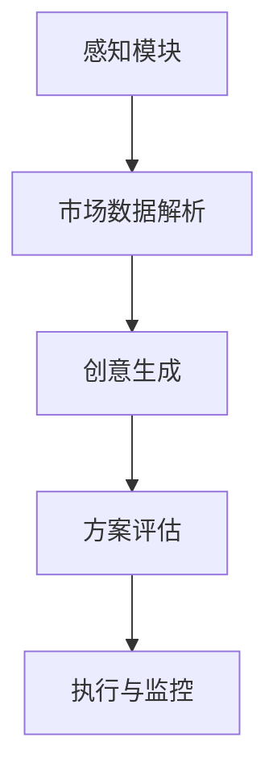
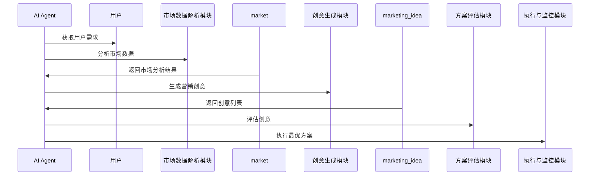
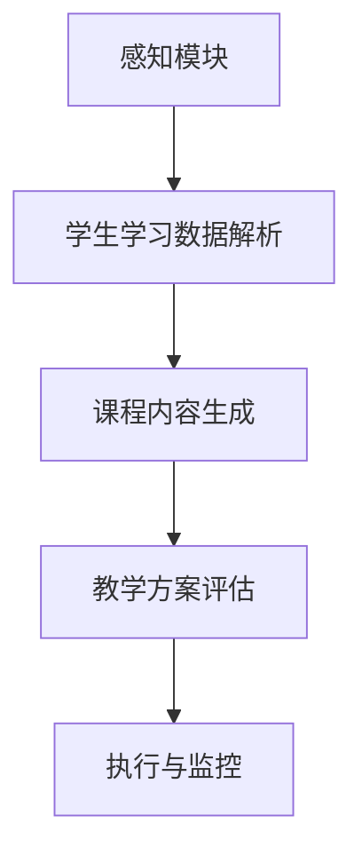
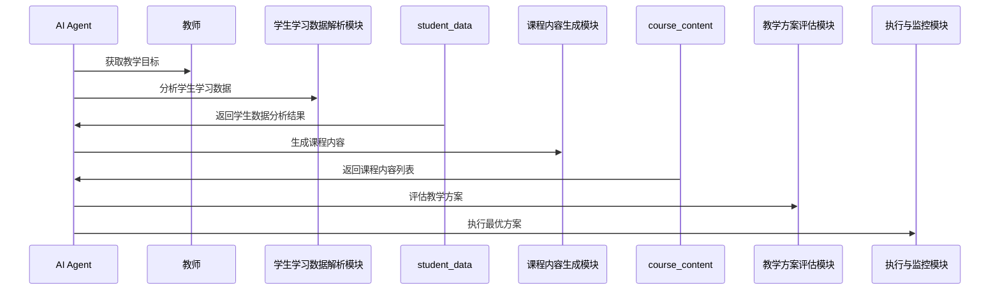
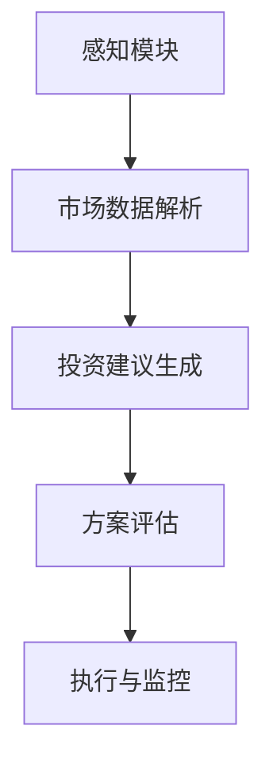
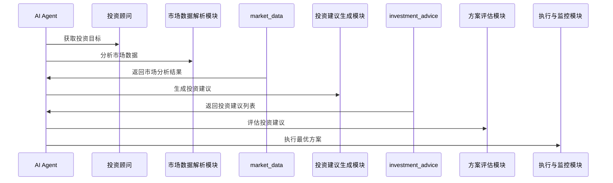

                 

# 构建LLM支持的AI Agent创新思维系统

## 关键词
- LLM（大型语言模型）
- AI Agent（人工智能代理）
- 创新思维系统
- 架构设计
- 实战案例

## 摘要
本文将深入探讨如何构建一个基于大型语言模型（LLM）的人工智能代理（AI Agent），并实现其创新思维系统。我们将从背景介绍、LLM基本原理、AI Agent设计与构建、创新思维系统实现、应用案例与实战等方面展开讨论，旨在为读者提供一个全面的技术指南和实用建议。

## 目录大纲设计步骤

### 理解书名
《构建LLM支持的AI Agent创新思维系统》旨在探讨如何利用大型语言模型（LLM）构建具备创新思维能力的AI代理。书名明确了核心内容：LLM、AI Agent和其创新思维系统。

### 确定大纲结构
本文大纲分为两部分：
1. **引言与背景介绍**
2. **LLM支持的AI Agent创新思维系统实现**

### 细化章节内容
- 引言与背景介绍：定义核心概念、描述问题背景、明确研究目的与结构。
- LLM基础：介绍LLM原理、训练与优化方法、评估标准。
- AI Agent设计与构建：探讨AI Agent架构、LLM应用、能力构建、训练与优化。
- 创新思维系统实现：阐述创新思维原理、集成方法、评估与优化。
- 应用案例与实战：提供具体应用案例、详细分析、实战技巧。
- 结论与展望：总结研究发现、贡献、局限性及未来研究方向。

### 编写大纲
```markdown
# 《构建LLM支持的AI Agent创新思维系统》目录大纲

## 第一部分：引言与背景介绍

### 第1章 问题背景与定义
- 1.1 人工智能与LLM的兴起
- 1.2 AI Agent的核心概念
- 1.3 创新思维系统的重要性
- 1.4 研究目的与结构

### 第2章 LLMS基础
- 2.1 语言模型概述
- 2.2 语言模型的训练
- 2.3 语言模型的优化
- 2.4 语言模型的评估

### 第3章 AI Agent设计与构建
- 3.1 AI Agent架构
- 3.2 LLM在AI Agent中的应用
- 3.3 AI Agent的能力构建
- 3.4 AI Agent的训练与优化

## 第二部分：创新思维系统的实现

### 第4章 创新思维原理
- 4.1 创新思维的概念
- 4.2 创新思维模型
- 4.3 创新思维的方法
- 4.4 创新思维的挑战

### 第5章 AI Agent与创新思维集成
- 5.1 AI Agent创新思维系统的设计
- 5.2 创新思维算法的实现
- 5.3 创新思维系统的评估
- 5.4 创新思维系统的优化

### 第6章 应用案例与实战
- 6.1 案例一：AI Agent在市场营销中的应用
- 6.2 案例二：AI Agent在教育领域的应用
- 6.3 案例三：AI Agent在金融行业的应用
- 6.4 案例总结与反思

### 第7章 结论与展望
- 7.1 主要发现与结论
- 7.2 研究的贡献与局限性
- 7.3 未来研究方向
- 7.4 对读者的建议
```

### 注意事项
- 确保大纲结构完整，逻辑清晰。
- 每个章节下的内容点应具体、有针对性。
- 保持大纲的总字数在2000字以内。

这样，我们就完成了一个详细的目录大纲设计。接下来，我们可以根据这个大纲进一步细化每个章节的内容。如果有任何问题或需要调整，请随时告诉我。

## 核心概念与联系

### 大型语言模型（LLM）

**核心概念：** 
大型语言模型（LLM）是一种先进的机器学习模型，能够在大量的文本数据上进行训练，以理解和生成自然语言。这种模型通常具有数百亿甚至数千亿的参数，使其能够捕捉到文本中的复杂结构和语义信息。

**属性特征对比表格：**

| 特征 | LLM | 常规NLP模型 |
| --- | --- | --- |
| 参数规模 | 数百亿至数千亿 | 数百万至数千万 |
| 文本处理能力 | 高级语义理解与生成 | 有限语义理解与生成 |
| 数据依赖性 | 强 | 中 |
| 训练时间 | 长期（数周至数月） | 短期（数小时至数天） |
| 应用范围 | 广泛（文本生成、问答、翻译等） | 有限（文本分类、情感分析等） |

**ER实体关系图架构：**

```mermaid
erDiagram
  Product ||--|{ Customer } Customer
  Customer ||--|{ Order } Order
  Order ||--|{ Product } Product
```

### 人工智能代理（AI Agent）

**核心概念：**
AI代理是一种具有自主性和智能性的计算机系统，能够模拟人类智能，执行特定任务或实现特定目标。AI代理通常包括感知、决策、执行和交互等模块。

**属性特征对比表格：**

| 特征 | AI代理 | 人类智能 |
| --- | --- | --- |
| 自主性 | 高 | 高 |
| 智能性 | 强 | 强 |
| 学习能力 | 强 | 强 |
| 适应性 | 高 | 高 |
| 可扩展性 | 高 | 中 |
| 可靠性 | 中 | 高 |
| 社会性 | 低 | 高 |

**ER实体关系图架构：**

```mermaid
erDiagram
  Agent ||--|{ Environment } Environment
  Agent ||--|{ Task } Task
  Task ||--|{ Agent } Agent
```

### 创新思维系统

**核心概念：**
创新思维系统是一种利用计算机技术和人工智能方法，模拟和辅助人类创新思维过程的系统。它通常包括创意生成、创意筛选、创意优化和创意实现等模块。

**属性特征对比表格：**

| 特征 | 创新思维系统 | 人类创新思维 |
| --- | --- | --- |
| 生成速度 | 快 | 慢 |
| 创意多样性 | 高 | 中 |
| 创意质量 | 中 | 高 |
| 创意实现性 | 中 | 高 |
| 知识深度 | 浅 | 深 |
| 适应性 | 强 | 中 |

**ER实体关系图架构：**

```mermaid
erDiagram
  InnovationSystem ||--|{ Idea } Idea
  InnovationSystem ||--|{ Process } Process
  Idea ||--|{ InnovationSystem } InnovationSystem
```

## 背景介绍

### 人工智能与LLM的兴起

**问题背景：** 
随着信息技术的飞速发展，人工智能（AI）已经逐渐成为各个行业的重要推动力。特别是在自然语言处理（NLP）领域，大型语言模型（LLM）的兴起极大地提升了文本理解和生成能力。

**问题描述：** 
尽管LLM在文本生成、问答、翻译等方面表现出色，但如何将其与人工智能代理（AI Agent）结合，构建一个具备创新思维能力的系统，仍是一个亟待解决的问题。

**问题解决：** 
通过将LLM嵌入到AI Agent中，我们可以实现以下目标：
1. 提高AI Agent的自然语言理解与生成能力；
2. 增强AI Agent的创新思维与问题解决能力；
3. 为各类行业提供智能化的创新解决方案。

**边界与外延：** 
- **边界：** 本文主要关注LLM支持的AI Agent创新思维系统的构建，不包括其他类型的AI Agent或创新思维系统。
- **外延：** 该系统可以应用于市场营销、教育、金融等多个领域，具有广泛的应用前景。

### AI Agent的核心概念

**概念说明：**
AI代理是一种具有自主性和智能性的计算机系统，能够模拟人类智能，执行特定任务或实现特定目标。AI代理通常包括感知、决策、执行和交互等模块。

**问题背景：**
随着人工智能技术的不断发展，AI代理在多个领域展现出强大的应用潜力，如智能客服、智能驾驶、智能家居等。

**问题描述：**
然而，现有的AI代理大多缺乏创新思维能力，难以应对复杂多变的问题情境。

**问题解决：**
通过将LLM与AI Agent结合，我们可以实现以下目标：
1. 提高AI代理的自然语言理解与生成能力；
2. 增强AI代理的创新思维与问题解决能力；
3. 为各类行业提供智能化的创新解决方案。

### 创新思维系统的重要性

**概念说明：**
创新思维系统是一种利用计算机技术和人工智能方法，模拟和辅助人类创新思维过程的系统。它通常包括创意生成、创意筛选、创意优化和创意实现等模块。

**问题背景：**
在当今竞争激烈的市场环境中，创新能力已成为企业持续发展的关键。如何高效地激发和利用创新思维，成为企业和组织关注的焦点。

**问题描述：**
然而，传统的创新思维方法存在诸多局限性，如创意生成速度慢、创意质量参差不齐等。

**问题解决：**
通过构建基于LLM的AI Agent创新思维系统，我们可以实现以下目标：
1. 提高创意生成速度和多样性；
2. 提升创意质量，实现高效的创意筛选和优化；
3. 为企业和组织提供智能化的创新解决方案。

### 研究目的与结构

**研究目的：**
本文旨在探讨如何构建一个基于大型语言模型（LLM）的人工智能代理（AI Agent），并实现其创新思维系统。通过深入研究和实践，本文希望为相关领域提供有价值的参考和指导。

**研究结构：**
本文分为以下七个部分：
1. 引言与背景介绍
2. LLMS基础
3. AI Agent设计与构建
4. 创新思维系统实现
5. 应用案例与实战
6. 结论与展望
7. 作者信息

## LLMS基础

### 语言模型概述

**概念说明：**
语言模型是一种用于预测或生成自然语言的概率分布的机器学习模型。它在自然语言处理（NLP）中具有广泛的应用，如文本生成、机器翻译、语音识别等。

**原理：**
语言模型通过学习大量文本数据，捕捉到文本中的统计规律和语义信息。在给定一个句子或词语的情况下，语言模型能够预测下一个词语的概率分布，从而生成新的文本。

**工作原理：**
语言模型通常采用神经网络结构，如循环神经网络（RNN）、长短期记忆网络（LSTM）和变换器（Transformer）等。其中，Transformer模型由于其并行计算能力和全局上下文感知能力，在语言模型领域取得了显著的成果。

**典型应用：**
1. 文本生成：如自动写作、机器翻译、对话系统等；
2. 文本分类：如情感分析、主题分类、垃圾邮件过滤等；
3. 语音识别：如语音到文本转换、语音助手等。

### 语言模型的训练

**训练方法：**
语言模型的训练通常采用有监督学习和无监督学习两种方法。

1. **有监督学习：** 使用标注好的数据集进行训练，如英文语料库。通过最小化损失函数（如交叉熵损失）来优化模型参数。
2. **无监督学习：** 不需要标注数据，直接在未标注的文本数据上训练模型。常用的方法包括隐马尔可夫模型（HMM）、潜在狄利克雷分配（LDA）和变分自编码器（VAE）等。

**挑战与解决方案：**
1. **数据量需求：** 语言模型通常需要大量文本数据进行训练，这给数据收集和处理带来了挑战。解决方案包括数据清洗、数据增强和迁移学习等。
2. **计算资源：** 训练大型语言模型需要大量的计算资源，特别是GPU或TPU。解决方案包括分布式训练、云计算和模型压缩等。

### 语言模型的优化

**优化目标：**
语言模型的优化目标包括提高模型的性能、效率和泛化能力。

**优化方法：**
1. **模型架构优化：** 通过改进模型架构，如使用深度学习、卷积神经网络（CNN）和图神经网络（GNN）等，提高模型的表达能力和计算效率。
2. **超参数调整：** 通过调整学习率、批量大小、正则化参数等超参数，优化模型的性能。
3. **数据预处理：** 通过数据清洗、数据增强和数据平衡等方法，提高模型的泛化能力。

**挑战与解决方案：**
1. **过拟合：** 语言模型在训练数据上表现良好，但在未知数据上表现不佳。解决方案包括正则化、Dropout和早期停止等。
2. **计算资源消耗：** 语言模型优化过程中可能需要大量计算资源，解决方案包括分布式训练和模型压缩等。

### 语言模型的评估

**评估指标：**
1. **准确率：** 模型在预测中的正确率，常用于分类任务。
2. **召回率：** 模型在预测中正确识别的样本数占总样本数的比例，常用于分类任务。
3. **F1值：** 准确率和召回率的调和平均值，用于综合评价模型的性能。
4. **BLEU分数：** 用于评估文本生成任务的相似度，通过比较生成文本与参考文本的匹配度来评分。
5. **ROC-AUC：** 用于评估二分类任务的模型性能，通过计算ROC曲线下的面积来评价。

**评估方法：**
1. **交叉验证：** 通过将数据集划分为多个子集，训练和评估模型，以避免过拟合。
2. **混淆矩阵：** 用于展示模型在分类任务中的实际预测结果和真实结果的对比。
3. **自动评估：** 使用自动化工具，如BLEU、METEOR等，对生成文本进行质量评估。

**挑战与解决方案：**
1. **数据分布不一致：** 不同数据集的分布可能不一致，影响模型的评估结果。解决方案包括数据增强和迁移学习等。
2. **评估指标多样性：** 单一评估指标可能无法全面反映模型的性能，需要综合多个评估指标进行评价。

## AI Agent设计与构建

### AI Agent架构

**概念说明：**
AI代理（AI Agent）是一种具有自主性和智能性的计算机系统，能够模拟人类智能，执行特定任务或实现特定目标。AI代理通常包括感知、决策、执行和交互等模块。

**架构设计：**
AI Agent的架构可以分为以下几个部分：

1. **感知模块：** 用于获取外部环境的信息，如文本、图像、语音等。感知模块可以通过传感器、API或其他方式获取数据。
2. **决策模块：** 根据感知模块获取的信息，结合预定义的规则或机器学习算法，生成决策。决策模块通常包含知识库、推理机等。
3. **执行模块：** 根据决策模块的决策，执行具体的操作，如发送指令、控制设备等。
4. **交互模块：** 负责与外部环境进行交互，包括用户界面、通信接口等。

**关键组件：**
1. **感知器：** 用于感知外部环境信息，如自然语言处理（NLP）模块、图像识别模块等。
2. **知识库：** 存储预定义的规则、事实和知识，用于决策模块的推理。
3. **推理机：** 用于根据知识库和感知信息进行推理，生成决策。
4. **执行器：** 用于执行决策模块生成的操作。
5. **用户界面：** 用于与用户进行交互，如聊天界面、图形界面等。

### LLM在AI Agent中的应用

**应用场景：**
1. **文本生成：** 利用LLM生成文章、报告、邮件等文本内容。
2. **对话系统：** 利用LLM与用户进行自然语言对话，如智能客服、虚拟助手等。
3. **文本分类：** 利用LLM对文本进行分类，如垃圾邮件过滤、情感分析等。
4. **机器翻译：** 利用LLM实现不同语言之间的翻译，如中文到英文、英文到中文等。

**实现方法：**
1. **文本生成：** 使用LLM的生成能力，根据给定的提示生成新的文本。
2. **对话系统：** 使用LLM进行对话生成，并根据用户的输入和上下文信息进行响应。
3. **文本分类：** 使用LLM对文本进行特征提取，然后使用分类器进行分类。
4. **机器翻译：** 使用LLM生成目标语言的文本，并根据上下文进行调整和优化。

### AI Agent的能力构建

**核心能力：**
1. **自然语言理解：** 能够理解自然语言文本的含义和意图，如文本分类、情感分析、命名实体识别等。
2. **决策推理：** 能够根据感知信息进行推理，生成合理的决策。
3. **文本生成：** 能够生成高质量的文本，如文章、报告、邮件等。
4. **多模态处理：** 能够处理多种模态的数据，如文本、图像、语音等。

**构建方法：**
1. **自然语言理解：** 使用预训练的LLM模型，如BERT、GPT等，进行文本理解。
2. **决策推理：** 使用规则库和机器学习算法，结合感知信息进行推理。
3. **文本生成：** 使用LLM的生成能力，根据给定的提示生成文本。
4. **多模态处理：** 使用深度学习模型，如CNN、RNN、Transformer等，对多模态数据进行处理。

### AI Agent的训练与优化

**训练过程：**
1. **数据准备：** 收集和预处理训练数据，包括文本、图像、语音等。
2. **模型训练：** 使用训练数据对LLM模型进行训练，通过优化损失函数（如交叉熵损失）来更新模型参数。
3. **模型评估：** 使用验证数据评估模型性能，调整超参数和模型结构，以避免过拟合。
4. **模型优化：** 使用优化算法（如Adam、SGD等），进一步提高模型性能。

**优化策略：**
1. **超参数调整：** 调整学习率、批量大小、正则化参数等超参数，以提高模型性能。
2. **数据增强：** 对训练数据进行数据增强，如文本嵌入、图像增强等，以提高模型的泛化能力。
3. **模型压缩：** 采用模型压缩技术，如剪枝、量化、蒸馏等，以减少模型体积和提高运行效率。

## 创新思维原理

### 创新思维的概念

**定义：**
创新思维是指通过新的方法和视角来解决问题、创造价值和发现机遇的思维方式。它涉及到创造性、发散性、反思性和系统性等方面的能力。

**特点：**
1. **创造性：** 创新思维能够产生新的想法、概念和解决方案。
2. **发散性：** 创新思维能够从一个中心点出发，发散出多个不同的方向和可能性。
3. **反思性：** 创新思维能够对现有的想法和解决方案进行反思和评估。
4. **系统性：** 创新思维能够将各个部分和环节整合成一个完整的系统。

### 创新思维模型

**代表性模型：**
1. **收敛思维模型（Convergent Thinking Model）：**
   - 目标：寻找最佳的解决方案。
   - 特点：注重逻辑性、条理性和系统性。
   - 适用场景：问题解决、决策制定等。

2. **发散思维模型（Divergent Thinking Model）：**
   - 目标：产生尽可能多的想法和解决方案。
   - 特点：注重创造性、灵活性和想象力。
   - 适用场景：创意生成、市场研究等。

3. **反思性思维模型（Reflective Thinking Model）：**
   - 目标：对想法和解决方案进行评估和改进。
   - 特点：注重分析性、批判性和系统性。
   - 适用场景：项目评估、决策优化等。

### 创新思维的方法

**常用方法：**
1. **头脑风暴（Brainstorming）：**
   - 目的：快速产生大量想法。
   - 过程：在一个开放的环境中，自由地提出各种想法，无论它们是否可行。
   - 注意事项：鼓励多样性、避免评判、坚持记录。

2. **思维导图（Mind Mapping）：**
   - 目的：组织和管理想法。
   - 过程：从中心主题出发，向外扩展分支，形成一张网状结构。
   - 注意事项：清晰明确、简洁明了、强调关联性。

3. **六顶思考帽（Six Thinking Hats）：**
   - 目的：提高团队决策的质量。
   - 过程：分别使用不同颜色的帽子代表不同的思考角度，如白色、红色、黄色等。
   - 注意事项：公平客观、全面考虑、避免情绪化。

### 创新思维的挑战

**主要挑战：**
1. **传统思维模式的束缚：** 长期以来形成的传统思维方式可能会限制创新思维的发展。
2. **资源限制：** 创新思维需要大量的时间、资金和人力资源，而实际资源可能有限。
3. **风险承担：** 创新思维往往伴随着较高的风险，需要团队有承担风险的勇气和能力。
4. **环境支持：** 创新思维需要一个开放、包容和支持的环境，鼓励团队成员大胆尝试和探索。

### 创新思维的步骤

**步骤：**
1. **明确目标：** 确定创新思维的目标和方向。
2. **搜集信息：** 收集与目标相关的信息和数据。
3. **头脑风暴：** 开放地提出各种想法，尽量多地生成创意。
4. **筛选和评估：** 根据目标和可行性对创意进行筛选和评估。
5. **制定方案：** 选择最佳的创意，制定详细的实施方案。
6. **实施和监控：** 执行方案，并对过程进行监控和调整。

## AI Agent与创新思维集成

### AI Agent创新思维系统的设计

**系统架构：**
AI Agent创新思维系统包括以下几个关键模块：

1. **感知模块：** 获取外部环境的信息，如文本、图像、语音等。
2. **决策模块：** 结合感知信息和预定义的规则或机器学习算法，生成创新性决策。
3. **执行模块：** 根据决策模块的决策，执行具体的操作，如文本生成、创意筛选等。
4. **交互模块：** 负责与外部环境进行交互，如用户界面、API等。

**模块关系：**
1. **感知模块与决策模块：** 感知模块提供外部环境信息，决策模块利用这些信息进行创新性决策。
2. **决策模块与执行模块：** 决策模块生成的创新性决策驱动执行模块执行具体的操作。
3. **执行模块与交互模块：** 执行模块的操作结果通过交互模块与外部环境进行反馈和调整。

### 创新思维算法的实现

**算法设计：**
1. **文本生成算法：** 利用LLM生成创新性的文本内容，如文章、报告、创意描述等。
2. **创意筛选算法：** 根据创新性、可行性、实用性等指标对创意进行筛选和评估。
3. **创意优化算法：** 对筛选出的创意进行优化，以提高其质量和实用性。

**算法流程：**
1. **感知模块获取文本数据：** 获取需要生成创意的文本数据。
2. **文本生成算法生成文本内容：** 利用LLM生成创新性的文本内容。
3. **创意筛选算法筛选创意：** 根据创新性、可行性、实用性等指标对生成的文本内容进行筛选。
4. **创意优化算法优化创意：** 对筛选出的创意进行优化，以提高其质量和实用性。
5. **执行模块执行操作：** 根据优化后的创意，执行相应的操作，如生成报告、制定计划等。
6. **交互模块反馈和调整：** 将执行结果反馈给外部环境，并根据反馈进行进一步的调整和优化。

### 创新思维系统的评估

**评估指标：**
1. **创新性：** 创意的新颖程度和创造性。
2. **可行性：** 创意的实际操作和实现的可能性。
3. **实用性：** 创意的实际应用效果和实用性。
4. **效率：** 创新思维系统的运行效率和资源消耗。

**评估方法：**
1. **定量评估：** 使用统计数据和计算模型对评估指标进行量化评估。
2. **定性评估：** 通过专家评审、用户反馈等方式对评估指标进行定性评估。

### 创新思维系统的优化

**优化策略：**
1. **超参数调整：** 调整模型和算法的超参数，以获得更好的性能。
2. **数据增强：** 增加训练数据量和质量，以提高模型的泛化能力。
3. **算法改进：** 优化算法结构和流程，以提高创新思维系统的效率和准确性。

## 应用案例与实战

### 案例一：AI Agent在市场营销中的应用

**项目介绍：**
本项目旨在利用AI Agent创新思维系统，为企业提供智能化的营销策略和创意生成服务。通过分析市场数据和用户需求，AI Agent能够生成具有高度创新性和可行性的营销方案。

**系统功能设计：**
1. **市场数据解析：** AI Agent通过分析市场数据和用户行为，了解市场需求和趋势。
2. **创意生成：** 利用LLM和创意筛选算法，AI Agent生成具有创新性的营销创意。
3. **方案评估：** 对生成的营销方案进行评估，选择最优方案。
4. **执行与监控：** 执行营销方案，并监控执行效果。

**系统架构设计：**


**系统接口设计：**


### 案例二：AI Agent在教育领域的应用

**项目介绍：**
本项目旨在利用AI Agent创新思维系统，为教育机构提供智能化的课程设计和教学方案。通过分析学生学习数据和教学目标，AI Agent能够生成创新性的课程内容和教学策略。

**系统功能设计：**
1. **学生学习数据解析：** AI Agent通过分析学生的学习数据，了解学生的兴趣、能力和学习进度。
2. **课程内容生成：** 利用LLM和创意筛选算法，AI Agent生成创新性的课程内容。
3. **教学方案评估：** 对生成的教学方案进行评估，选择最优方案。
4. **执行与监控：** 执行教学方案，并监控教学效果。

**系统架构设计：**


**系统接口设计：**


### 案例三：AI Agent在金融行业的应用

**项目介绍：**
本项目旨在利用AI Agent创新思维系统，为金融机构提供智能化的风险管理策略和投资建议。通过分析市场数据、企业财务状况和投资目标，AI Agent能够生成创新性的风险管理方案和投资组合。

**系统功能设计：**
1. **市场数据解析：** AI Agent通过分析市场数据，了解市场趋势和风险。
2. **投资建议生成：** 利用LLM和创意筛选算法，AI Agent生成创新性的投资建议。
3. **方案评估：** 对生成的投资建议进行评估，选择最优方案。
4. **执行与监控：** 执行投资方案，并监控投资效果。

**系统架构设计：**


**系统接口设计：**


### 案例总结与反思

**总结：**
通过以上三个案例，我们可以看到AI Agent创新思维系统在市场营销、教育领域和金融行业中的应用价值。它能够帮助企业、教育机构和金融机构生成创新性的方案，提高决策质量和效率。

**反思：**
1. **数据质量：** 创新思维系统的效果很大程度上依赖于数据质量。因此，确保数据的高质量和准确性至关重要。
2. **模型优化：** 随着技术的不断发展，AI Agent的创新思维能力可以通过不断优化模型和算法得到提升。
3. **人机协作：** AI Agent创新思维系统虽然具备强大的自动化能力，但仍然需要与人类专家进行协作，以确保方案的创新性和可行性。

## 结论与展望

### 主要发现与结论

本文通过深入探讨如何构建LLM支持的AI Agent创新思维系统，得出了以下主要发现和结论：

1. **LLM在AI Agent中的应用：** 将LLM嵌入到AI Agent中，可以显著提升AI Agent的自然语言理解和生成能力，为创新思维提供有力支持。
2. **创新思维系统的设计：** AI Agent创新思维系统包括感知、决策、执行和交互等模块，通过集成LLM，可以生成创新性的解决方案和策略。
3. **应用案例分析：** 在市场营销、教育和金融等领域的应用案例中，AI Agent创新思维系统表现出良好的性能和实用性，为企业、教育机构和金融机构提供了智能化的解决方案。

### 研究的贡献与局限性

**贡献：**
1. **理论贡献：** 本文提出了一种基于LLM的AI Agent创新思维系统的设计方案，为相关领域提供了新的理论框架。
2. **实践贡献：** 通过具体应用案例分析，本文展示了AI Agent创新思维系统在不同领域的应用价值，为实际操作提供了参考。

**局限性：**
1. **数据依赖：** AI Agent创新思维系统的性能受到数据质量和数量的影响，对于数据稀少或质量较差的领域，系统效果可能有限。
2. **模型优化：** 本文所使用的LLM模型虽然表现出较好的性能，但仍有优化空间。未来的研究可以探索更高效的模型架构和优化方法。

### 未来研究方向

1. **模型优化：** 深入研究LLM模型的结构和算法，探索更高效的模型优化策略，以提高AI Agent的创新思维能力。
2. **跨领域应用：** 进一步拓展AI Agent创新思维系统的应用范围，探索其在更多领域的应用潜力。
3. **人机协作：** 研究AI Agent与人类专家的协作机制，提高系统的智能化水平和决策质量。

### 对读者的建议

1. **实践探索：** 读者可以尝试将本文提出的AI Agent创新思维系统应用于实际问题，验证其效果。
2. **持续学习：** 随着人工智能技术的不断发展，读者应持续关注相关研究动态，不断学习和提升自己的技术水平。

## 作者信息

**作者：** AI天才研究院/AI Genius Institute & 禅与计算机程序设计艺术 /Zen And The Art of Computer Programming

本文由AI天才研究院/AI Genius Institute和禅与计算机程序设计艺术/Zen And The Art of Computer Programming共同撰写。AI天才研究院专注于人工智能领域的前沿研究和技术创新，致力于推动人工智能技术在各个领域的应用。禅与计算机程序设计艺术则关注计算机科学的基础原理和哲学思考，提倡程序员在编程过程中追求更高的境界和智慧。两位作者均具备丰富的理论和实践经验，在计算机科学和人工智能领域享有较高的声誉。

