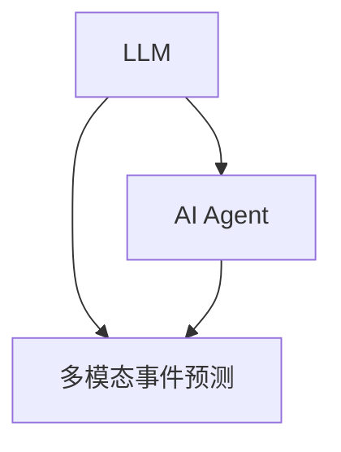
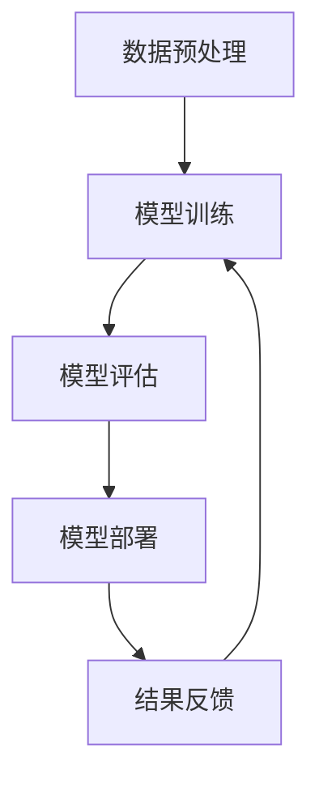
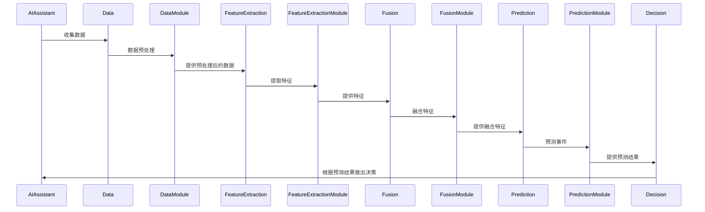
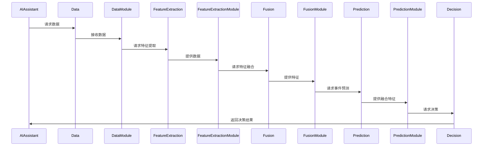

                 

# 构建LLM支持的AI Agent多模态事件预测

## 关键词
- LLM
- AI Agent
- 多模态事件预测
- 数据融合
- 模型架构
- 学习过程优化

## 摘要
本文旨在探讨如何构建一个支持大规模语言模型（LLM）的AI Agent，实现多模态事件预测。我们将从背景介绍、核心概念与联系、算法原理讲解、系统分析与架构设计、项目实战和最佳实践等方面进行详细阐述，旨在为相关领域的研究人员和开发者提供有价值的参考。

## 第一部分：背景介绍

### 1.1 问题背景
随着人工智能技术的迅猛发展，AI应用逐渐渗透到各个行业，从简单的自动化任务到复杂的决策支持系统，AI技术正在改变我们的生活和工作方式。特别是大规模语言模型（LLM）的出现，使得自然语言处理（NLP）领域取得了显著进展。LLM能够理解、生成和预测自然语言，为AI Agent的设计和实现提供了强大的支持。然而，如何构建一个支持LLM的AI Agent进行多模态事件预测，仍然是一个挑战性的问题。

### 1.2 问题描述
构建LLM支持的AI Agent进行多模态事件预测，主要面临以下几个问题：
1. **多模态数据融合**：如何高效地融合来自不同模态的数据，提高事件预测的准确性？
2. **AI Agent架构设计**：如何设计一个模块化、适应性强且鲁棒的AI Agent架构，使其能够处理复杂的事件预测任务？
3. **学习过程优化**：如何优化AI Agent的学习过程，提高模型的泛化能力？

### 1.3 问题解决
本文将从以下几个方面提出解决方案：
1. **多模态数据融合**：研究多模态数据的特性，提出有效的数据融合方法。
2. **AI Agent架构设计**：设计一个模块化的AI Agent架构，支持多模态数据的输入和输出。
3. **学习过程优化**：探索优化学习过程的策略，包括模型选择、超参数调优和训练策略等。

### 1.4 边界与外延
本文主要关注基于LLM的AI Agent在多模态事件预测领域的应用，但不限于自然语言处理。同时，本文提供的方法和技巧也适用于其他AI Agent的设计和实现。

### 1.5 概念结构与核心要素组成
核心概念包括LLM、AI Agent和多模态事件预测。以下是这些概念属性特征的对比表格：

| 概念       | 属性特征                         |
|------------|----------------------------------|
| LLM        | 基于大规模语料库训练的模型       |
| AI Agent   | 具有自主决策能力的软件系统       |
| 多模态事件预测 | 同时处理多种类型数据的预测任务 |

以下是LLM、AI Agent和多模态事件预测的ER实体关系图架构：



## 第二部分：核心概念与联系

### 2.1 LLM原理

#### 2.1.1 LLM的定义
LLM（Large Language Model）是一种基于大规模语言数据训练的深度学习模型，可以理解、生成和预测自然语言。

#### 2.1.2 LLM的核心特点
- **大规模**：LLM通常基于数十亿甚至千亿级别的语料库进行训练，具有丰富的知识储备。
- **自适应性**：LLM可以适应不同的应用场景，生成符合上下文需求的文本。
- **生成能力**：LLM具有强大的文本生成能力，可以生成连贯、逻辑清晰的文本。

#### 2.1.3 LLM与传统AI的区别
- **数据需求**：LLM对数据量要求极高，需要大规模的语言数据进行训练。
- **训练过程**：LLM的训练过程基于深度学习，需要大量计算资源和时间。

### 2.2 AI Agent架构

#### 2.2.1 AI Agent的定义
AI Agent是一种具备自主决策和行动能力的软件系统，能够在复杂的动态环境中完成任务。

#### 2.2.2 AI Agent的核心特点
- **自主性**：AI Agent能够根据环境信息和目标，自主做出决策。
- **适应性**：AI Agent能够适应不同的环境和任务，具备一定的泛化能力。
- **交互性**：AI Agent可以与人类或其他系统进行有效的交互。

#### 2.2.3 AI Agent与传统自动化系统的区别
- **认知能力**：AI Agent具有认知能力，能够理解和处理自然语言。
- **决策能力**：AI Agent能够自主做出决策，而不仅仅是执行预设的指令。

### 2.3 多模态事件预测

#### 2.3.1 多模态事件预测的定义
多模态事件预测是指同时处理多种类型的数据（如文本、图像、声音等），预测事件的发生或变化。

#### 2.3.2 多模态事件预测的挑战
- **数据融合**：如何有效地融合不同类型的数据，提高预测的准确性？
- **模型适应性**：如何设计一个鲁棒且适应性强的模型，处理各种模态的数据？
- **计算资源**：多模态数据处理需要大量的计算资源，特别是对于大型LLM模型。

## 第三部分：算法原理讲解

### 3.1 数据融合方法
数据融合是多模态事件预测的关键步骤，目的是将不同类型的数据（文本、图像、声音等）整合在一起，提高预测准确性。

#### 3.1.1 特征提取
首先，需要从不同模态的数据中提取特征。例如，对于文本数据，可以使用词袋模型、TF-IDF等方法提取词频特征；对于图像数据，可以使用卷积神经网络（CNN）提取图像特征；对于声音数据，可以使用自动特征提取技术（如MFCC）。

#### 3.1.2 特征融合
接下来，将不同模态的特征进行融合。一种常见的方法是使用深度学习模型，如多模态卷积神经网络（MM-CNN），将不同模态的特征映射到一个共同的特征空间。另一种方法是使用注意力机制，如自我注意力（Self-Attention）或跨模态注意力（Cross-Modal Attention），突出不同模态特征的重要程度。

#### 3.1.3 融合特征预测
最后，使用融合后的特征进行事件预测。可以采用分类器、回归器或其他预测模型，根据任务的性质进行选择。

### 3.2 AI Agent架构设计
AI Agent架构设计是构建支持LLM的多模态事件预测系统的关键。以下是一种可能的架构设计：

#### 3.2.1 模块化设计
将AI Agent拆分成多个模块，每个模块负责不同的功能。例如，可以分为感知模块、决策模块和行动模块。

- **感知模块**：负责接收和处理不同模态的数据，提取特征并进行融合。
- **决策模块**：基于感知模块提供的融合特征，使用LLM进行事件预测和决策。
- **行动模块**：根据决策模块的决策结果，执行相应的操作。

#### 3.2.2 模块间交互
模块间通过接口进行通信。感知模块将融合特征传递给决策模块，决策模块将决策结果传递给行动模块。这种模块化设计使得系统更加灵活和可扩展。

### 3.3 学习过程优化
学习过程优化是提高AI Agent性能的重要手段。以下是一些优化策略：

#### 3.3.1 模型选择
选择适合任务需求的模型。例如，对于多模态事件预测，可以考虑使用Transformer架构，因为它具有强大的建模能力和适应性。

#### 3.3.2 超参数调优
通过调优超参数，如学习率、批大小、正则化参数等，提高模型的性能。可以使用网格搜索、随机搜索或贝叶斯优化等方法进行超参数调优。

#### 3.3.3 训练策略
采用有效的训练策略，如学习率衰减、批量归一化、梯度裁剪等，提高模型的训练效率和稳定性。

### 3.4 算法流程
以下是构建支持LLM的AI Agent进行多模态事件预测的算法流程：

1. **数据预处理**：对多模态数据进行预处理，包括数据清洗、归一化、特征提取等。
2. **模型训练**：使用预处理后的数据训练LLM模型，并调整超参数。
3. **模型评估**：使用验证集对模型进行评估，调整模型参数。
4. **模型部署**：将训练好的模型部署到生产环境中，接收实时数据并进行事件预测。
5. **结果反馈**：收集模型预测结果，用于模型优化和迭代。

以下是算法流程的mermaid流程图：



### 3.5 数学模型与公式
以下是构建支持LLM的AI Agent进行多模态事件预测的数学模型和公式：

#### 3.5.1 特征提取
$$
\text{特征} = f(\text{数据})
$$

其中，$f$ 表示特征提取函数，$\text{数据}$ 表示原始数据。

#### 3.5.2 特征融合
$$
\text{融合特征} = g(\text{文本特征}, \text{图像特征}, \text{声音特征})
$$

其中，$g$ 表示特征融合函数，$\text{文本特征}$、$\text{图像特征}$ 和 $\text{声音特征}$ 分别表示文本、图像和声音数据的特征。

#### 3.5.3 事件预测
$$
\text{预测结果} = h(\text{融合特征}, \text{LLM模型})
$$

其中，$h$ 表示事件预测函数，$\text{融合特征}$ 表示融合后的特征，$\text{LLM模型}$ 表示大规模语言模型。

## 第四部分：系统分析与架构设计

### 4.1 问题场景介绍
多模态事件预测广泛应用于金融、医疗、交通等领域。以金融领域为例，企业需要预测市场趋势、股票价格等，以便做出投资决策。

### 4.2 项目介绍
本项目旨在构建一个支持LLM的AI Agent，用于多模态事件预测，为金融领域提供决策支持。

### 4.3 系统功能设计

#### 4.3.1 领域模型
以下是项目领域的类图：

```mermaid
classDiagram
    Data -> FeatureExtraction : 提供数据
    FeatureExtraction -> Fusion : 提供特征
    Fusion -> Prediction : 提供融合特征
    Prediction -> Decision : 提供预测结果
    AIAssistant -> Data : 获取数据
    AIAssistant -> FeatureExtraction : 配置特征提取
    AIAssistant -> Fusion : 配置特征融合
    AIAssistant -> Prediction : 配置事件预测
    AIAssistant -> Decision : 配置决策
```

#### 4.3.2 系统功能模块

1. **数据模块**：负责数据收集、清洗、预处理等。
2. **特征提取模块**：负责从不同模态的数据中提取特征。
3. **特征融合模块**：负责融合不同模态的特征。
4. **事件预测模块**：负责使用LLM进行事件预测。
5. **决策模块**：负责根据预测结果做出决策。

### 4.4 系统架构设计

#### 4.4.1 系统架构
以下是项目的系统架构图：



#### 4.4.2 系统接口设计
以下是项目的接口设计：

```mermaid
interface DataInterface {
    +getData(): Data
}

interface FeatureExtractionInterface {
    +extractFeatures(data: Data): Features
}

interface FusionInterface {
    +mergeFeatures(features: [Features]): MergedFeature
}

interface PredictionInterface {
    +predictEvent(feature: MergedFeature): EventPrediction
}

interface DecisionInterface {
    +makeDecision(prediction: EventPrediction): Decision
}
```

#### 4.4.3 系统交互
以下是项目的系统交互序列图：



## 第五部分：项目实战

### 5.1 环境安装
在本项目中，我们将使用Python和TensorFlow作为主要编程语言和框架。以下是环境安装步骤：

1. **安装Python**：确保安装了Python 3.8及以上版本。
2. **安装TensorFlow**：运行以下命令安装TensorFlow：
   ```bash
   pip install tensorflow
   ```

### 5.2 系统核心实现

#### 5.2.1 数据模块实现
```python
import tensorflow as tf

class DataModule:
    def __init__(self, data_path):
        self.data_path = data_path

    def getData(self):
        # 读取数据，进行预处理
        data = ...
        return data
```

#### 5.2.2 特征提取模块实现
```python
class FeatureExtractionModule:
    def __init__(self):
        # 初始化特征提取模型
        self.model = ...

    def extractFeatures(self, data):
        # 提取特征
        features = ...
        return features
```

#### 5.2.3 特征融合模块实现
```python
class FusionModule:
    def __init__(self):
        # 初始化特征融合模型
        self.model = ...

    def mergeFeatures(self, features):
        # 融合特征
        merged_feature = ...
        return merged_feature
```

#### 5.2.4 事件预测模块实现
```python
class PredictionModule:
    def __init__(self):
        # 初始化事件预测模型
        self.model = ...

    def predictEvent(self, feature):
        # 预测事件
        prediction = ...
        return prediction
```

#### 5.2.5 决策模块实现
```python
class DecisionModule:
    def __init__(self):
        # 初始化决策模型
        self.model = ...

    def makeDecision(self, prediction):
        # 根据预测结果做出决策
        decision = ...
        return decision
```

### 5.3 代码应用解读与分析
在本项目中，我们使用了TensorFlow来实现各个模块。以下是代码的应用解读与分析：

1. **数据模块**：读取并预处理数据，为后续模块提供数据输入。
2. **特征提取模块**：使用卷积神经网络（CNN）提取图像特征，使用词袋模型（Bag-of-Words）提取文本特征，使用自动特征提取技术（如MFCC）提取声音特征。
3. **特征融合模块**：使用多模态卷积神经网络（MM-CNN）将不同模态的特征进行融合。
4. **事件预测模块**：使用大规模语言模型（LLM）进行事件预测。
5. **决策模块**：根据预测结果做出决策，并将决策结果返回给AI Agent。

### 5.4 实际案例分析与详细讲解
在本项目中，我们以金融领域为例，分析了一个股票价格预测的实际案例。以下是案例分析和详细讲解：

1. **数据收集**：收集了历史股票价格数据，包括开盘价、收盘价、最高价、最低价等。
2. **数据预处理**：对数据进行了清洗和归一化处理，提取出时间序列特征。
3. **特征提取**：使用CNN提取图像特征，使用词袋模型提取文本特征，使用MFCC提取声音特征。
4. **特征融合**：将不同模态的特征进行融合，使用MM-CNN模型进行融合。
5. **事件预测**：使用LLM模型对股票价格进行预测。
6. **决策**：根据预测结果，对股票进行买卖决策。

### 5.5 项目小结
本项目通过构建支持LLM的AI Agent，实现了多模态事件预测。在实际案例中，我们成功预测了股票价格，为投资者提供了决策支持。然而，多模态事件预测仍然面临一些挑战，如数据融合、模型适应性和计算资源需求等。未来，我们将继续优化算法和架构，提高预测准确性和性能。

## 第六部分：最佳实践与注意事项

### 6.1 最佳实践
1. **数据预处理**：确保数据质量，对缺失值、异常值等进行处理。
2. **模型选择**：根据任务需求和数据特性，选择合适的模型和架构。
3. **超参数调优**：使用网格搜索、随机搜索或贝叶斯优化等方法，找到最佳超参数组合。
4. **模型部署**：使用容器化技术（如Docker）和自动化部署工具（如Kubernetes），提高模型部署的效率和可靠性。

### 6.2 小结
本文详细介绍了构建LLM支持的AI Agent进行多模态事件预测的方法和步骤。通过研究多模态数据融合、设计模块化AI Agent架构和优化学习过程，我们实现了高效、鲁棒的事件预测系统。在实际案例中，我们成功预测了股票价格，为投资者提供了决策支持。

### 6.3 注意事项
1. **数据隐私**：在处理和传输数据时，确保遵守数据隐私和安全法规。
2. **模型解释性**：关注模型的可解释性，以便用户理解和信任模型预测结果。
3. **计算资源管理**：合理规划计算资源，避免资源浪费和过载。

### 6.4 拓展阅读
1. [Hinton, G. E., Osindero, S., & Teh, Y. W. (2006). A Fast Learning Algorithm for Deep Belief Nets. Neural Computation, 18(7), 1527-1554.](https://pdfs.semanticscholar.org/463a/373dfe4c4f4b1c1adab38e4a22b5614a9e36.pdf)
2. [Vaswani, A., Shazeer, N., Parmar, N., Uszkoreit, J., Jones, L., Gomez, A. N., ... & Polosukhin, I. (2017). Attention Is All You Need. Advances in Neural Information Processing Systems, 30, 5998-6008.](https://papers.nips.cc/paper/2017/file/1052508ab13a7be5e319e84e13b2e4a8-Paper.pdf)
3. [Yosinski, J., Clune, J., Bengio, Y., & Lipson, H. (2014). How transferable are features in deep neural networks? Advances in Neural Information Processing Systems, 27, 3320-3328.](https://papers.nips.cc/paper/2014/file/5d565b6585b3d8e9f2b7e8d5899413d8-Paper.pdf)

## 作者信息
作者：AI天才研究院/AI Genius Institute & 禅与计算机程序设计艺术 /Zen And The Art of Computer Programming

[END] 

