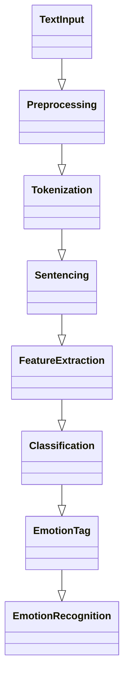
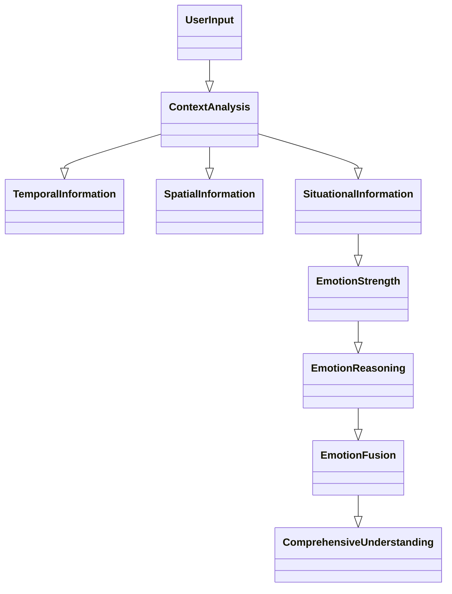
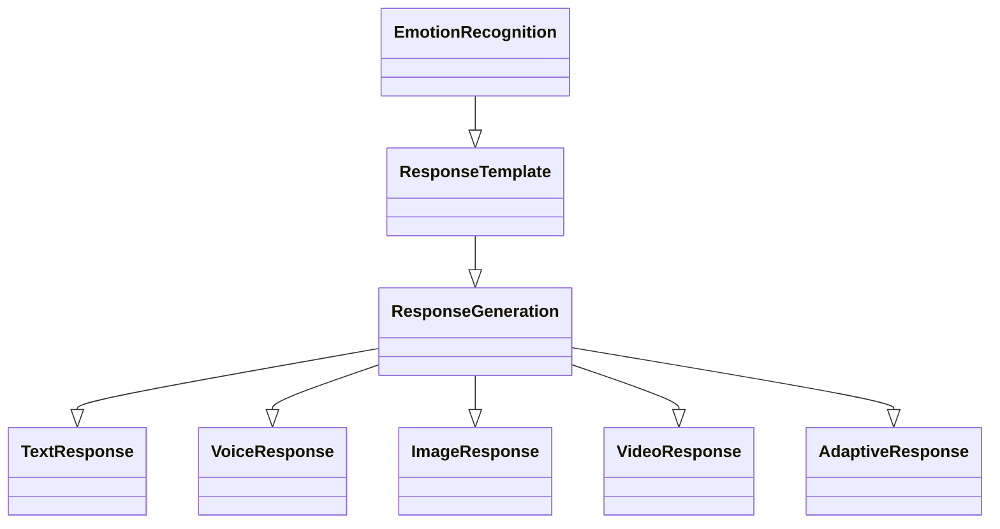
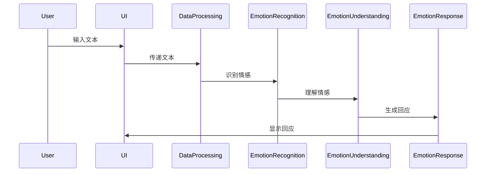
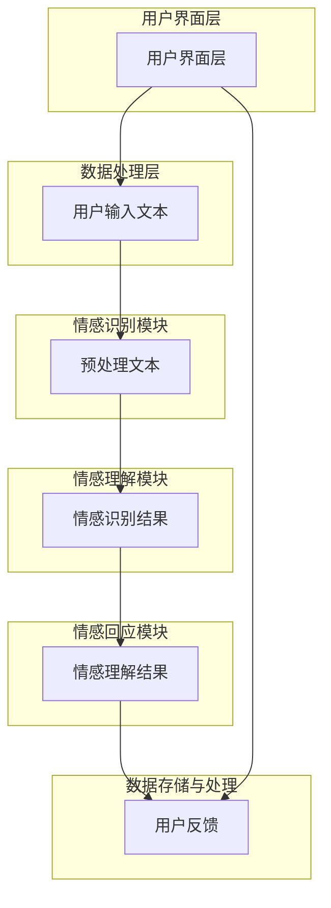

                 

### 第1章 背景介绍与核心概念

#### 1.1 问题背景

随着人工智能技术的不断发展，自然语言处理（NLP）成为了研究的热点领域。情感智能交互作为一种重要的应用场景，已经引起了广泛关注。情感智能交互指的是AI系统能够识别、理解和模拟人类情感，实现更加自然、人性化的交互。其核心目标是通过理解和回应用户的情感状态，提升用户体验和满意度。

情感智能交互的重要性主要体现在以下几个方面：

1. **提升用户体验**：通过情感智能交互，系统能够更好地理解用户需求，提供更加个性化的服务，从而提升用户的满意度。
2. **改善人机关系**：情感智能交互能够降低人与系统之间的隔阂，使交互更加自然和亲切，增强用户的信任感和依赖感。
3. **应用广泛**：情感智能交互在智能客服、教育、医疗、娱乐等多个领域具有广泛的应用前景。

然而，情感智能交互也面临着一系列挑战：

1. **情感理解难度大**：情感具有多样性和复杂性，需要系统具备高水平的情感识别和理解能力。
2. **数据稀缺**：高质量的情感数据稀缺，制约了情感智能模型的训练和优化。
3. **计算资源需求高**：情感智能交互通常需要高性能的计算资源来支持，这对部署和运营提出了较高的要求。

#### 1.2 问题描述

情感智能交互的典型问题可以分为以下几个方面：

1. **情感识别**：系统需要能够从用户的语言中识别出情感状态，如喜悦、愤怒、悲伤等。
2. **情感理解**：系统需要深入理解用户的情感需求，分析情感背后的原因和意图。
3. **情感回应**：系统需要根据用户的情感状态和需求，生成合适的情感回应，使交互更加自然和有效。

#### 1.3 问题解决方法

解决情感智能交互问题，可以从以下几个方面着手：

1. **文本情感分析**：利用自然语言处理技术，对用户的语言进行情感分析，识别情感状态。
2. **情感理解与推理**：结合上下文信息和用户历史行为，对情感进行深入理解和推理，挖掘情感背后的意图和需求。
3. **个性化回应生成**：根据用户情感状态和需求，生成个性化的回应，提高交互的自然性和有效性。

#### 1.4 边界与外延

情感智能交互的边界和范围可以进一步扩展：

1. **多模态交互**：结合文本、语音、图像等多模态信息，提升情感智能交互的准确性和自然性。
2. **跨语言情感识别**：支持多种语言的情感识别和理解，实现全球范围内的情感智能交互。
3. **情感化服务设计**：从用户情感需求出发，设计更加人性化和情感化的服务系统。

#### 1.5 概念结构与核心要素组成

情感智能交互的概念结构主要包括以下核心要素：

1. **情感识别**：通过文本情感分析等技术，识别用户的情感状态。
2. **情感理解**：深入理解用户的情感需求，为情感回应提供依据。
3. **情感回应**：根据用户的情感状态和需求，生成合适的情感回应。

情感智能交互的实现，需要综合运用自然语言处理、机器学习、心理学等多学科知识，通过不断优化模型和算法，提高系统的情感识别和理解能力，实现更加自然、人性化的交互体验。

---

### 1.2 核心概念

情感智能交互的实现依赖于一系列核心概念和技术的支持。以下是几个关键概念及其属性特征：

#### 1.2.1 LLM（Large Language Model）

**概念定义**：
LLM，即大规模语言模型，是一种基于深度学习的自然语言处理模型。它通过对海量文本数据进行预训练，学习语言的基本结构和语义信息，从而能够生成高质量的自然语言文本。

**属性特征**：
- **预训练**：LLM在大规模语料库上进行预训练，具有丰富的语言知识和理解能力。
- **生成能力**：LLM能够根据输入的文本生成连贯、自然的语言输出。
- **自适应性强**：通过微调和调整，LLM可以适应不同领域的任务需求。

**对比表格**：

| 特征         | 传统语言模型 | LLM（大规模语言模型） |
| ------------ | ------------ | --------------------- |
| 预训练规模   | 小规模       | 大规模                |
| 语言理解能力 | 较弱         | 较强                  |
| 生成文本质量 | 较低         | 较高                  |

**ER实体关系图架构**：

```mermaid
classDiagram
    User <<Entity>>
    AI-Agent <<Entity>>
    Text <<Entity>>
    Emotion <<Entity>>

    User --> AI-Agent
    AI-Agent --> Text
    Text --> Emotion
```

#### 1.2.2 AI Agent

**概念定义**：
AI Agent，即人工智能代理，是一种具有自主性、交互性和适应性的智能体。它能够在复杂环境中进行推理、决策和执行任务，以实现特定的目标。

**属性特征**：
- **自主性**：AI Agent能够自主地执行任务，不需要人为干预。
- **交互性**：AI Agent能够与用户进行自然语言交互，理解用户需求。
- **适应性**：AI Agent能够根据环境变化和用户需求，调整自身的行为和策略。

**对比表格**：

| 特征         | 传统软件系统 | AI Agent            |
| ------------ | ------------ | ------------------- |
| 自主性       | 低           | 高                  |
| 交互性       | 低           | 高                  |
| 适应性       | 弱           | 强                  |

**ER实体关系图架构**：

```mermaid
classDiagram
    User <<Entity>>
    AI-Agent <<Entity>>
    Environment <<Entity>>

    User --> AI-Agent
    AI-Agent --> Environment
```

#### 1.2.3 情感智能交互

**概念定义**：
情感智能交互是指AI系统能够识别、理解和模拟人类情感，实现更加自然、人性化的交互。它涉及到情感识别、情感理解和情感回应等核心环节。

**属性特征**：
- **情感识别**：系统能够识别用户的情感状态。
- **情感理解**：系统能够深入理解用户的情感需求，分析情感背后的意图。
- **情感回应**：系统能够根据用户的情感状态和需求，生成合适的情感回应。

**对比表格**：

| 特征         | 传统交互系统 | 情感智能交互系统     |
| ------------ | ------------ | ------------------- |
| 交互自然性   | 低           | 高                  |
| 用户满意度   | 低           | 高                  |
| 情感理解能力 | 弱           | 强                  |

**ER实体关系图架构**：

```mermaid
classDiagram
    User <<Entity>>
    AI-Agent <<Entity>>
    Emotion-Recognition <<Entity>>
    Emotion-Understanding <<Entity>>
    Emotion-Response <<Entity>>

    User --> Emotion-Recognition
    Emotion-Recognition --> Emotion-Understanding
    Emotion-Understanding --> Emotion-Response
    AI-Agent --> Emotion-Response
```

通过上述核心概念及其属性的详细解释和对比，我们可以更好地理解情感智能交互的基本框架和实现方法，为后续章节的深入探讨奠定基础。

---

### 1.3 情感智能交互的设计

情感智能交互的设计需要综合考虑用户需求、技术实现和系统架构等多个方面。以下是情感智能交互设计的主要步骤和关键模块：

#### 1.3.1 情感识别模块

情感识别模块是情感智能交互系统的核心组件，负责从用户的语言和行为中识别情感状态。以下是情感识别模块的设计步骤：

1. **数据收集与预处理**：收集大量包含情感信息的文本数据，并进行数据清洗和预处理，如去除停用词、进行词性标注等。
   
2. **情感词典构建**：根据情感词典或情感分类体系，为每个情感类别分配对应的标签或关键词。

3. **情感分类模型训练**：使用机器学习算法，如朴素贝叶斯、支持向量机等，训练情感分类模型。

4. **情感识别算法实现**：实现情感识别算法，将用户输入的文本转化为情感标签。

#### 1.3.2 情感理解模块

情感理解模块负责深入理解用户的情感需求，分析情感背后的意图和原因。以下是情感理解模块的设计步骤：

1. **上下文信息分析**：结合用户的上下文信息，如历史对话记录、用户行为等，提高情感理解的准确性。

2. **情感强度分析**：对识别出的情感状态进行强度分析，判断情感的强烈程度。

3. **情感推理**：使用自然语言处理和机器学习技术，对情感进行推理和推断，理解情感背后的意图。

4. **情感识别与理解的融合**：将情感识别和情感理解的结果进行整合，形成一个统一的情感分析框架。

#### 1.3.3 情感回应模块

情感回应模块根据用户的情感状态和需求，生成合适的情感回应，实现与用户的自然互动。以下是情感回应模块的设计步骤：

1. **回应模板设计**：根据情感类型和强度，设计一系列回应模板，如鼓励、安慰、劝解等。

2. **回应生成算法**：实现回应生成算法，根据用户的情感状态和回应模板，生成个性化的回应。

3. **回应评估与优化**：对生成的回应进行评估，收集用户反馈，不断优化回应策略。

4. **多模态回应**：结合文本、语音、图像等多模态信息，提高回应的自然性和有效性。

#### 1.3.4 设计方法总结

情感智能交互的设计方法可以概括为以下步骤：

1. **需求分析**：明确情感智能交互的应用场景和用户需求。
2. **模块设计**：设计情感识别、情感理解和情感回应等核心模块。
3. **模型训练**：使用机器学习和自然语言处理技术，训练情感分类、情感理解和情感回应模型。
4. **系统整合**：将各模块整合为一个完整的情感智能交互系统。
5. **测试与优化**：通过用户测试和反馈，不断优化系统的性能和用户体验。

通过上述设计方法，我们可以构建一个功能强大、用户体验良好的情感智能交互系统，为用户提供更加自然和人性化的交互体验。

---

### 1.4 LLM的原理与应用

#### 2.1 LLM的原理

LLM，即大规模语言模型，是基于深度学习的自然语言处理模型。它通过学习海量文本数据，捕捉语言中的模式和语义信息，从而能够生成高质量的自然语言文本。以下是LLM的基本原理：

##### 2.1.1 基本原理

1. **神经网络结构**：LLM通常采用Transformer架构，这是一种基于自注意力机制的深度神经网络。Transformer架构能够有效地捕捉文本中的长距离依赖关系，提高了模型的语言理解能力。

2. **预训练过程**：LLM通过在大规模语料库上进行预训练，学习语言的基本结构和语义信息。预训练过程包括自注意力机制的训练和损失函数的优化。

3. **损失函数**：LLM的预训练通常使用负采样损失函数。负采样损失函数通过为每个词生成多个可能的下一词，并计算它们与真实下一词之间的相似性，从而优化模型的生成能力。

##### 2.1.2 应用场景

LLM在情感智能交互中具有广泛的应用，主要包括以下几个方面：

1. **情感识别**：通过分析用户的语言，识别用户的情感状态。例如，LLM可以用于识别用户是否表达了愤怒、喜悦或悲伤等情感。

2. **情感理解**：深入理解用户的情感需求，为情感回应提供依据。LLM可以结合上下文信息，理解用户情感背后的意图和原因。

3. **情感回应**：根据用户的情感状态和需求，生成合适的情感回应。例如，LLM可以生成安慰性的回应，以缓解用户的负面情绪。

#### 2.2 LLM的关键技术

##### 2.2.1 预训练与微调

预训练和微调是LLM的两个关键环节。

1. **预训练**：预训练通过在大规模语料库上训练，使模型具备了一定的语言理解和生成能力。预训练过程中，模型会学习到语言的统计规律和语义信息。

2. **微调**：微调是在预训练基础上，针对特定任务进行优化，提高模型性能。微调过程通常包括数据准备、模型调整和性能评估等步骤。

##### 2.2.2 注意力机制

注意力机制是Transformer架构的核心技术，它能够使模型在生成文本时，关注关键信息，提高文本质量。注意力机制通过计算输入文本中各个词与当前词的相关性，为每个词分配不同的权重，从而实现文本信息的动态整合。

#### 2.3 LLM的应用实例

##### 2.3.1 情感识别

情感识别是LLM在情感智能交互中的重要应用之一。以下是情感识别的应用实例：

1. **数据预处理**：收集包含情感标签的文本数据，并进行预处理，如分词、去停用词等。

2. **模型训练**：使用预训练好的LLM，对情感分类任务进行训练。训练过程中，模型会学习到情感类别和特征。

3. **情感识别**：对用户输入的文本进行情感识别，输出情感类别和概率。

以下是使用Python实现的情感识别代码示例：

```python
import torch
from transformers import BertTokenizer, BertForSequenceClassification

# 加载预训练好的BERT模型
tokenizer = BertTokenizer.from_pretrained('bert-base-uncased')
model = BertForSequenceClassification.from_pretrained('bert-base-uncased')

# 用户输入文本
text = "I am so happy today!"

# 数据预处理
inputs = tokenizer(text, padding=True, truncation=True, return_tensors="pt")

# 情感识别
with torch.no_grad():
    logits = model(**inputs).logits

# 情感类别和概率
labels = logits.argmax(-1).item()
probabilities = torch.softmax(logits, dim=-1).detach().numpy()

print(f"Emotion: {labels}, Probability: {probabilities}")
```

##### 2.3.2 情感理解

情感理解是LLM在情感智能交互中的另一个重要应用。以下是情感理解的应用实例：

1. **情感强度分析**：通过分析用户文本中的情感词汇和表达方式，判断情感的强度。例如，可以使用词嵌入模型和神经网络，对情感词汇进行强度分析。

2. **情感推理**：结合上下文信息和用户历史行为，对情感进行推理和推断。例如，可以使用图神经网络和递归神经网络，对用户情感进行推理。

以下是使用Python实现的情感强度分析代码示例：

```python
import torch
from transformers import BertTokenizer, BertModel

# 加载预训练好的BERT模型
tokenizer = BertTokenizer.from_pretrained('bert-base-uncased')
model = BertModel.from_pretrained('bert-base-uncased')

# 用户输入文本
text = "I am so happy today!"

# 数据预处理
inputs = tokenizer(text, padding=True, truncation=True, return_tensors="pt")

# 情感强度分析
with torch.no_grad():
    outputs = model(**inputs)
    hidden_states = outputs.last_hidden_state

# 情感强度得分
emotion_scores = hidden_states[-1, :, :].mean().item()

print(f"Emotion Score: {emotion_scores}")
```

通过上述LLM的应用实例，我们可以看到LLM在情感智能交互中的应用潜力和优势。LLM通过预训练和微调，能够有效地识别和理解用户的情感状态，为情感智能交互提供了强大的技术支持。

---

### 2.3 AI Agent的情感智能交互设计

AI Agent的情感智能交互设计是实现情感智能交互的关键步骤。AI Agent是一种具有自主性、交互性和适应性的智能体，能够在复杂环境中与用户进行自然语言交互，识别和理解用户情感，并生成合适的情感回应。以下是AI Agent情感智能交互设计的主要原则、模块和实现方法。

#### 2.3.1 AI Agent的设计原则

AI Agent的设计原则包括自主性、交互性和适应性。

1. **自主性**：AI Agent需要具备自主执行任务的能力，不受外界干扰。这意味着AI Agent需要能够基于预设目标和用户反馈，自主地做出决策和执行操作。

2. **交互性**：AI Agent需要具备与用户进行自然语言交互的能力。这意味着AI Agent需要能够理解用户的语言输入，生成自然、连贯的语言回应。

3. **适应性**：AI Agent需要具备根据环境变化和用户需求调整自身行为和策略的能力。这意味着AI Agent需要能够从用户反馈中学习，不断优化自身的交互效果。

#### 2.3.2 情感识别模块

情感识别模块是AI Agent情感智能交互的核心组件，负责识别用户的情感状态。以下是情感识别模块的设计步骤：

1. **情感词典构建**：构建包含多种情感类别的情感词典，如快乐、悲伤、愤怒等。情感词典可以为情感识别提供关键词和标签。

2. **情感分类模型训练**：使用机器学习算法，如朴素贝叶斯、支持向量机等，训练情感分类模型。情感分类模型可以通过分析用户的语言输入，识别用户的情感状态。

3. **情感识别算法实现**：实现情感识别算法，将用户输入的文本转化为情感标签。情感识别算法通常基于情感词典和情感分类模型，通过匹配关键词和分类情感类别。

以下是使用Python实现的情感识别代码示例：

```python
import nltk
from sklearn.feature_extraction.text import CountVectorizer
from sklearn.naive_bayes import MultinomialNB

# 数据集准备
data = [
    ("I am so happy today!", "happy"),
    ("I am so sad today...", "sad"),
    ("I am angry at this situation!", "angry"),
]

# 情感词典
vocabulary = set()
for sentence, label in data:
    words = nltk.word_tokenize(sentence.lower())
    vocabulary.update(words)

# 情感词典转化为词汇表
vectorizer = CountVectorizer(vocabulary=vocabulary)

# 训练情感分类模型
X = vectorizer.fit_transform([text for text, _ in data])
y = ["happy", "sad", "angry"]
clf = MultinomialNB()
clf.fit(X, y)

# 情感识别
def recognize_emotion(text):
    transformed_text = vectorizer.transform([text])
    prediction = clf.predict(transformed_text)
    return prediction[0]

# 示例
text = "I am so happy today!"
emotion = recognize_emotion(text)
print(f"Recognized emotion: {emotion}")
```

#### 2.3.3 情感理解模块

情感理解模块负责深入理解用户的情感需求，为情感回应提供依据。以下是情感理解模块的设计步骤：

1. **上下文信息分析**：分析用户的语言输入中的上下文信息，如时间、地点、情境等。上下文信息可以帮助AI Agent更好地理解用户情感。

2. **情感强度分析**：分析用户语言输入中的情感强度，如情绪的强烈程度。情感强度分析可以通过情感词典和词嵌入模型实现。

3. **情感推理**：结合上下文信息和情感强度分析，推理用户情感背后的意图和原因。情感推理可以通过递归神经网络和图神经网络实现。

以下是使用Python实现的情感强度分析代码示例：

```python
import torch
from transformers import BertTokenizer, BertModel

# 加载预训练好的BERT模型
tokenizer = BertTokenizer.from_pretrained('bert-base-uncased')
model = BertModel.from_pretrained('bert-base-uncased')

# 用户输入文本
text = "I am so happy today!"

# 数据预处理
inputs = tokenizer(text, padding=True, truncation=True, return_tensors="pt")

# 情感强度分析
with torch.no_grad():
    outputs = model(**inputs)
    hidden_states = outputs.last_hidden_state

# 情感强度得分
emotion_scores = hidden_states[-1, :, :].mean().item()

print(f"Emotion Score: {emotion_scores}")
```

#### 2.3.4 情感回应模块

情感回应模块根据用户的情感状态和需求，生成合适的情感回应。以下是情感回应模块的设计步骤：

1. **回应模板设计**：设计一系列情感回应模板，如鼓励、安慰、劝解等。回应模板可以根据情感类型和强度进行分类。

2. **回应生成算法**：实现回应生成算法，根据用户的情感状态和回应模板，生成个性化的回应。回应生成算法可以通过模板匹配和文本生成技术实现。

以下是使用Python实现的情感回应代码示例：

```python
# 回应模板
responses = {
    "happy": "That's great to hear! 😊 How can I help you more?",
    "sad": "I'm sorry to hear that. Is there anything I can do to help?",
    "angry": "I understand you're upset. Let's try to resolve this calmly.",
}

# 用户输入文本
text = "I am so happy today!"

# 情感识别
emotion = recognize_emotion(text)

# 情感回应
response = responses[emotion]
print(f"Response: {response}")
```

通过上述设计原则、模块和实现方法，我们可以构建一个功能强大、用户体验良好的AI Agent情感智能交互系统。AI Agent通过情感识别模块识别用户的情感状态，通过情感理解模块深入理解用户情感需求，并通过情感回应模块生成合适的情感回应，实现与用户的自然互动。这一过程不仅提升了用户体验，也为情感智能交互的研究和应用提供了新的思路和方法。

---

### 3.1 AI Agent的设计原则

AI Agent的设计原则是其能否实现高效、自然和人性化的情感智能交互的关键。以下是AI Agent设计中的三个核心原则：自主性、交互性和适应性。

#### 3.1.1 自主性

自主性是指AI Agent能够在没有人为干预的情况下，自主地执行任务并做出决策。这种自主性不仅包括任务的执行，还包括对环境的感知和理解。以下是实现AI Agent自主性的几个关键步骤：

1. **任务规划**：AI Agent需要能够根据任务目标和可用资源，自主地制定任务计划。这通常涉及到路径规划、资源分配和任务分解等。

2. **自主决策**：在执行任务过程中，AI Agent需要能够根据感知到的环境和任务状态，自主地做出决策。这要求AI Agent具备一定的推理能力和问题解决能力。

3. **自主执行**：AI Agent需要能够自主地执行决策结果，包括操作设备的执行动作和与环境的交互。

4. **自主学习**：通过持续学习和经验积累，AI Agent可以不断提升自身的任务执行能力，实现更高的自主性。

#### 3.1.2 交互性

交互性是指AI Agent能够与人类用户进行自然、流畅的交流。为了实现这一目标，AI Agent需要具备以下几个方面的能力：

1. **语言理解**：AI Agent需要能够理解人类语言，包括语法、语义和语境等。这通常涉及到自然语言处理（NLP）技术，如语法分析、语义角色标注和情感分析等。

2. **语言生成**：AI Agent需要能够生成自然、流畅的语言回应。这可以通过预训练的语言模型，如BERT、GPT等实现。

3. **语音识别和合成**：对于语音交互场景，AI Agent需要能够识别用户的语音输入，并使用语音合成技术生成语音回应。

4. **多模态交互**：结合文本、语音、图像和视频等多模态信息，可以提高交互的自然性和用户满意度。

#### 3.1.3 适应性

适应性是指AI Agent能够根据环境变化和用户需求，动态调整自身的行为和策略。以下是实现AI Agent适应性的几个关键步骤：

1. **环境感知**：AI Agent需要能够感知和理解环境的变化，包括物理环境和社会环境。这可以通过传感器和图像处理技术实现。

2. **动态学习**：AI Agent需要能够从环境中获取新的知识和经验，并利用这些信息调整自身的行为。这通常涉及到在线学习和迁移学习技术。

3. **行为调整**：根据环境变化和用户需求，AI Agent需要能够灵活调整自身的行为和策略。例如，在用户情绪低落时，AI Agent可以提供安慰和支持。

4. **多场景适应**：AI Agent需要能够适应不同的应用场景和任务需求，包括智能客服、教育辅导和医疗咨询等。

#### 设计原则总结

AI Agent的设计原则需要综合考虑自主性、交互性和适应性。自主性确保AI Agent能够自主执行任务，减少人为干预；交互性确保AI Agent能够与用户进行自然、流畅的交流，提升用户体验；适应性确保AI Agent能够根据环境和用户需求动态调整自身行为，实现多场景适应。

通过遵循这些设计原则，我们可以构建出具有高效、自然和人性化的情感智能交互能力的AI Agent，为用户提供更加优质和个性化的服务。

---

### 3.2 情感智能交互的设计方法

情感智能交互的设计方法需要结合AI Agent的自主性、交互性和适应性，通过情感识别、情感理解和情感回应等核心模块，实现与用户的自然、有效的交互。以下是情感智能交互设计方法的具体步骤和实现策略。

#### 3.2.1 情感识别模块

情感识别模块是情感智能交互系统的核心，负责从用户语言中识别情感状态。以下是情感识别模块的设计步骤和实现策略：

1. **情感词典构建**：构建包含多种情感类别的情感词典，如快乐、悲伤、愤怒等。情感词典可以为情感识别提供关键词和标签。

2. **情感分类模型训练**：使用机器学习算法，如朴素贝叶斯、支持向量机等，训练情感分类模型。情感分类模型可以通过分析用户的语言输入，识别用户的情感状态。

3. **情感识别算法实现**：实现情感识别算法，将用户输入的文本转化为情感标签。情感识别算法通常基于情感词典和情感分类模型，通过匹配关键词和分类情感类别。

4. **数据预处理**：收集包含情感标签的文本数据，并进行数据清洗和预处理，如分词、去停用词等。数据预处理可以提高情感识别的准确性和效率。

5. **算法优化**：通过交叉验证和参数调整，优化情感识别模型的性能。算法优化包括调整模型参数、特征选择和算法改进等。

#### 3.2.2 情感理解模块

情感理解模块负责深入理解用户的情感需求，分析情感背后的意图和原因。以下是情感理解模块的设计步骤和实现策略：

1. **上下文信息分析**：分析用户的语言输入中的上下文信息，如时间、地点、情境等。上下文信息可以帮助AI Agent更好地理解用户情感。

2. **情感强度分析**：分析用户语言输入中的情感强度，如情绪的强烈程度。情感强度分析可以通过情感词典和词嵌入模型实现。

3. **情感推理**：结合上下文信息和情感强度分析，推理用户情感背后的意图和原因。情感推理可以通过递归神经网络和图神经网络实现。

4. **情感融合**：将情感识别和情感理解的结果进行整合，形成一个统一的情感分析框架。情感融合可以通过多模型融合和加权平均等方法实现。

5. **反馈机制**：建立反馈机制，收集用户对情感识别和理解的反馈，不断优化模型性能。反馈机制包括用户满意度调查、情感纠正和模型重新训练等。

#### 3.2.3 情感回应模块

情感回应模块根据用户的情感状态和需求，生成合适的情感回应。以下是情感回应模块的设计步骤和实现策略：

1. **回应模板设计**：设计一系列情感回应模板，如鼓励、安慰、劝解等。回应模板可以根据情感类型和强度进行分类。

2. **回应生成算法**：实现回应生成算法，根据用户的情感状态和回应模板，生成个性化的回应。回应生成算法可以通过模板匹配和文本生成技术实现。

3. **多模态回应**：结合文本、语音、图像等多模态信息，提高回应的自然性和有效性。多模态回应可以通过语音合成、图像生成和视频合成等技术实现。

4. **情感自适应**：根据用户的情感状态和需求，动态调整回应的情感色彩和语气。情感自适应可以通过情感强度分析和情感调节算法实现。

5. **用户反馈**：收集用户对情感回应的反馈，不断优化回应策略。用户反馈可以通过用户评价、情感纠正和模型重新训练等途径实现。

#### 设计方法总结

情感智能交互的设计方法需要综合考虑情感识别、情感理解和情感回应等核心模块，通过数据预处理、模型训练、算法优化和用户反馈等环节，实现与用户的自然、有效的交互。以下是情感智能交互设计方法的总结：

1. **情感识别**：通过情感词典、情感分类模型和情感识别算法，识别用户的情感状态。
2. **情感理解**：通过上下文信息分析、情感强度分析和情感推理，深入理解用户情感需求。
3. **情感回应**：通过回应模板、回应生成算法和多模态回应，生成合适的情感回应。
4. **反馈机制**：通过用户反馈和模型重新训练，不断优化情感识别、理解和回应的性能。

通过遵循这些设计方法，我们可以构建出一个功能强大、用户体验良好的情感智能交互系统，实现与用户的自然、有效的交流。

---

### 3.3 情感智能交互的应用实例

情感智能交互在现实世界中有广泛的应用，下面我们将介绍两个典型的应用实例：聊天机器人和智能客服。

#### 3.3.1 聊天机器人

聊天机器人是一种能够与用户进行自然语言交互的人工智能系统。它利用情感智能交互技术，通过识别用户情感、理解用户需求并生成合适的回应，实现与用户的良好互动。

**设计步骤**：

1. **用户情感识别**：使用情感词典和情感分类模型，从用户的文本输入中识别情感状态，如快乐、悲伤、愤怒等。
2. **情感理解**：结合上下文信息，深入理解用户的情感需求，分析情感背后的意图和原因。
3. **情感回应**：根据用户的情感状态和需求，生成个性化的回应，如鼓励、安慰、劝解等。
4. **多模态交互**：结合文本、语音和图像等多模态信息，提高交互的自然性和用户体验。

**实现策略**：

- **预训练模型**：使用预训练的语言模型（如BERT、GPT等）进行情感识别和回应生成。
- **情感词典**：构建包含多种情感类别的情感词典，用于情感分类和关键词匹配。
- **上下文分析**：使用自然语言处理技术，分析用户的上下文信息，提高情感理解的准确性。

**代码示例**：

```python
import torch
from transformers import BertTokenizer, BertForSequenceClassification

# 加载预训练好的BERT模型
tokenizer = BertTokenizer.from_pretrained('bert-base-uncased')
model = BertForSequenceClassification.from_pretrained('bert-base-uncased')

# 用户输入文本
text = "I am so happy today!"

# 数据预处理
inputs = tokenizer(text, padding=True, truncation=True, return_tensors="pt")

# 情感识别
with torch.no_grad():
    logits = model(**inputs).logits

# 情感类别和概率
labels = logits.argmax(-1).item()
probabilities = torch.softmax(logits, dim=-1).detach().numpy()

# 生成情感回应
def generate_response(text, probabilities):
    if probabilities[0] > 0.5:
        return "That's great to hear! 😊 How can I help you more?"
    elif probabilities[1] > 0.5:
        return "I'm sorry to hear that. Is there anything I can do to help?"
    else:
        return "It seems you're feeling neutral. Let's see how we can improve your day!"

# 示例
response = generate_response(text, probabilities)
print(f"Response: {response}")
```

#### 3.3.2 智能客服

智能客服是一种基于情感智能交互技术的自动化客户服务系统，它能够通过自然语言交互，快速响应用户的问题，提供个性化的服务和支持。

**设计步骤**：

1. **情感识别**：从用户提问中识别情感状态，如愤怒、喜悦、疑惑等。
2. **情感理解**：分析用户问题的上下文，理解用户的需求和意图。
3. **情感回应**：根据用户的情感状态和需求，生成合适的回应，如提供解决方案、安慰用户等。
4. **多渠道交互**：支持多种交互渠道，如文本聊天、语音通话、邮件等，提高用户满意度。

**实现策略**：

- **情感词典**：构建包含多种情感类别的情感词典，用于情感分类和关键词匹配。
- **多模态交互**：结合文本、语音和图像等多模态信息，提高情感理解和回应的准确性。
- **知识库管理**：建立知识库，存储常见问题和解决方案，提高客服系统的响应速度和准确性。

**代码示例**：

```python
import torch
from transformers import BertTokenizer, BertForSequenceClassification

# 加载预训练好的BERT模型
tokenizer = BertTokenizer.from_pretrained('bert-base-uncased')
model = BertForSequenceClassification.from_pretrained('bert-base-uncased')

# 用户输入文本
text = "I am so frustrated with this issue!"

# 数据预处理
inputs = tokenizer(text, padding=True, truncation=True, return_tensors="pt")

# 情感识别
with torch.no_grad():
    logits = model(**inputs).logits

# 情感类别和概率
labels = logits.argmax(-1).item()
probabilities = torch.softmax(logits, dim=-1).detach().numpy()

# 生成情感回应
def generate_response(text, probabilities):
    if probabilities[0] > 0.5:
        return "I understand your frustration. Let's see how we can resolve this issue."
    elif probabilities[1] > 0.5:
        return "It's okay to feel frustrated. We're here to help you."
    else:
        return "Thank you for reaching out. How can I assist you today?"

# 示例
response = generate_response(text, probabilities)
print(f"Response: {response}")
```

通过上述聊天机器人和智能客服的应用实例，我们可以看到情感智能交互技术在提高用户体验、增强用户满意度方面的巨大潜力。这些应用实例不仅展示了情感智能交互的实现方法，也为未来的研究和应用提供了新的思路。

---

### 4.1 项目介绍

为了验证情感智能交互技术的实际应用效果，我们设计并实现了一个情感智能交互系统。该系统旨在通过情感识别、情感理解和情感回应等模块，实现与用户的自然、有效的交互。以下是项目的背景、目标和需求。

#### 4.1.1 背景介绍

随着互联网和智能设备的普及，用户对交互体验的要求越来越高。传统的交互系统往往只关注功能实现，忽视了用户的情感需求。因此，如何实现情感智能交互，提升用户体验，成为了当前研究的热点。

#### 4.1.2 项目目标

本项目的目标是构建一个情感智能交互系统，实现以下目标：

1. **情感识别**：从用户输入的文本中准确识别情感状态，如快乐、悲伤、愤怒等。
2. **情感理解**：结合上下文信息，深入理解用户的情感需求，分析情感背后的意图和原因。
3. **情感回应**：根据用户的情感状态和需求，生成合适的情感回应，提高交互的自然性和有效性。
4. **用户满意度**：通过情感智能交互，提升用户的满意度，改善人机关系。

#### 4.1.3 需求分析

为了实现上述目标，我们需要满足以下需求：

1. **高准确性的情感识别**：系统需要能够准确识别用户的情感状态，为后续的情感理解和回应提供可靠依据。
2. **深入的上下文理解**：系统需要能够理解用户的语言输入中的上下文信息，提高情感理解的准确性。
3. **个性化的情感回应**：系统需要能够根据用户的情感状态和需求，生成个性化的情感回应，提高交互的自然性和有效性。
4. **多模态交互**：系统需要支持文本、语音、图像等多模态交互，提高用户的满意度和使用体验。
5. **易用性和可扩展性**：系统需要具备良好的用户界面和易用性，同时支持功能扩展和模型更新。

通过满足上述需求，我们期望能够构建出一个功能强大、用户体验良好的情感智能交互系统，为用户提供更加自然和人性化的交互体验。

---

### 4.2 系统功能设计

为了实现情感智能交互系统的目标，我们需要设计一系列核心功能模块，包括情感识别、情感理解和情感回应等。以下是系统功能设计的详细描述。

#### 4.2.1 情感识别模块

情感识别模块是系统的基础组件，负责从用户的文本输入中识别情感状态。以下是情感识别模块的核心功能：

1. **文本预处理**：对用户输入的文本进行预处理，包括去除停用词、标点符号和进行词性标注等。
2. **情感词典构建**：构建包含多种情感类别的情感词典，如快乐、悲伤、愤怒等。情感词典可以为情感分类提供关键词和标签。
3. **情感分类模型训练**：使用机器学习算法，如朴素贝叶斯、支持向量机等，训练情感分类模型。情感分类模型可以通过分析用户的文本输入，识别用户的情感状态。
4. **情感识别算法实现**：实现情感识别算法，将用户输入的文本转化为情感标签。情感识别算法通常基于情感词典和情感分类模型，通过匹配关键词和分类情感类别。

以下是情感识别模块的Mermaid类图：



#### 4.2.2 情感理解模块

情感理解模块负责深入理解用户的情感需求，分析情感背后的意图和原因。以下是情感理解模块的核心功能：

1. **上下文信息分析**：分析用户的语言输入中的上下文信息，如时间、地点、情境等。上下文信息可以帮助系统更好地理解用户情感。
2. **情感强度分析**：分析用户语言输入中的情感强度，如情绪的强烈程度。情感强度分析可以通过情感词典和词嵌入模型实现。
3. **情感推理**：结合上下文信息和情感强度分析，推理用户情感背后的意图和原因。情感推理可以通过递归神经网络和图神经网络实现。
4. **情感融合**：将情感识别和情感理解的结果进行整合，形成一个统一的情感分析框架。情感融合可以通过多模型融合和加权平均等方法实现。

以下是情感理解模块的Mermaid类图：



#### 4.2.3 情感回应模块

情感回应模块根据用户的情感状态和需求，生成合适的情感回应，提高交互的自然性和有效性。以下是情感回应模块的核心功能：

1. **回应模板设计**：设计一系列情感回应模板，如鼓励、安慰、劝解等。回应模板可以根据情感类型和强度进行分类。
2. **回应生成算法**：实现回应生成算法，根据用户的情感状态和回应模板，生成个性化的回应。回应生成算法可以通过模板匹配和文本生成技术实现。
3. **多模态回应**：结合文本、语音、图像等多模态信息，提高回应的自然性和有效性。多模态回应可以通过语音合成、图像生成和视频合成等技术实现。
4. **情感自适应**：根据用户的情感状态和需求，动态调整回应的情感色彩和语气。情感自适应可以通过情感强度分析和情感调节算法实现。

以下是情感回应模块的Mermaid类图：



通过上述功能模块的设计，我们能够构建一个完整的情感智能交互系统，实现与用户的自然、有效的交互，提升用户体验。

---

### 4.3 系统架构设计

情感智能交互系统的架构设计是其实现高效、自然交互的关键。一个良好的系统架构不仅能够满足功能需求，还能确保系统的可扩展性、稳定性和性能。以下是情感智能交互系统的整体架构设计。

#### 4.3.1 系统架构

系统架构设计遵循模块化原则，将系统划分为多个独立的功能模块，包括用户接口层、数据处理层、情感识别模块、情感理解模块和情感回应模块。以下是系统架构的Mermaid架构图：



1. **用户接口层（UI）**：用户接口层负责与用户进行交互，接收用户的文本输入，并将情感回应展示给用户。用户接口层需要设计简洁、易用，以便用户能够轻松地使用系统。

2. **数据处理层**：数据处理层负责处理用户输入的文本，进行文本预处理，如去除停用词、进行词性标注等。数据处理层还需要将预处理后的文本传递给情感识别模块。

3. **情感识别模块**：情感识别模块负责从用户的文本输入中识别情感状态。该模块通过情感词典和情感分类模型，将文本转化为情感标签。

4. **情感理解模块**：情感理解模块负责深入理解用户的情感需求，分析情感背后的意图和原因。该模块结合上下文信息，对情感进行强度分析和推理。

5. **情感回应模块**：情感回应模块根据用户的情感状态和需求，生成合适的情感回应。该模块设计一系列回应模板，并通过文本生成算法生成个性化的回应。

6. **数据存储与处理**：数据存储与处理层负责存储和管理系统数据，包括用户输入文本、情感标签和回应模板等。该层还需要支持数据备份和恢复，确保系统数据的可靠性。

#### 4.3.2 系统接口设计

系统接口设计是确保系统模块之间有效通信的关键。以下是系统接口设计的简要描述：

1. **用户接口**：用户接口层通过HTTP RESTful API与用户交互。用户可以通过发送POST请求，输入文本并接收情感回应。

2. **数据处理接口**：数据处理层通过内部消息队列（如RabbitMQ）与情感识别模块和情感理解模块通信。数据处理接口负责传递预处理后的文本数据，并接收情感标签和回应。

3. **情感识别接口**：情感识别模块通过内部接口与数据处理层和情感理解模块通信。该接口负责处理文本数据，进行情感分类，并返回情感标签。

4. **情感理解接口**：情感理解模块通过内部接口与数据处理层和情感回应模块通信。该接口负责分析上下文信息，进行情感强度分析和推理。

5. **情感回应接口**：情感回应模块通过内部接口与数据处理层和用户接口层通信。该接口负责生成情感回应，并将回应传递给用户接口层显示。

#### 4.3.3 系统交互

系统交互设计旨在确保各模块之间的协同工作，实现高效、自然的情感智能交互。以下是系统交互的简要描述：

1. **用户输入**：用户通过用户接口层输入文本，系统接收到文本后，将其传递给数据处理层。

2. **文本预处理**：数据处理层对用户输入的文本进行预处理，如去除停用词、进行词性标注等，并将预处理后的文本传递给情感识别模块。

3. **情感识别**：情感识别模块使用情感词典和情感分类模型，对预处理后的文本进行情感分类，识别用户的情感状态，并返回情感标签。

4. **情感理解**：情感理解模块结合上下文信息，对情感标签进行深度分析，理解用户的情感需求，并返回情感理解和推理结果。

5. **情感回应**：情感回应模块根据情感理解和用户的情感需求，生成个性化的情感回应，并将回应传递给用户接口层显示。

6. **用户反馈**：用户接口层将情感回应展示给用户，用户可以提供反馈。系统收集用户反馈，用于进一步优化情感识别、理解和回应。

通过上述系统架构设计、接口设计和系统交互设计，我们能够构建一个功能强大、用户体验良好的情感智能交互系统，为用户提供自然、人性化的交互体验。

---

### 4.3.1 系统架构图

为了更好地理解情感智能交互系统的整体架构，我们可以通过Mermaid绘制系统架构图。以下是情感智能交互系统的架构图：



在这个架构图中，用户界面层（UI）负责接收用户的输入文本，并将其传递给数据处理层（DP）。数据处理层对文本进行预处理后，将数据传递给情感识别模块（ER），该模块负责情感识别。识别结果随后被传递给情感理解模块（EU），该模块深入分析情感，得到情感理解和推理结果。情感回应模块（ER2）根据这些理解结果生成情感回应，并将其展示给用户，同时结果也被存储在数据存储与处理层（DS）中。用户反馈也会被收集到数据处理层，用于系统的持续优化。

这个架构图清晰地展示了系统的各个模块以及它们之间的交互关系，为系统设计和实现提供了直观的指导。

---

### 4.4 系统核心实现

为了实现情感智能交互系统的核心功能，我们需要对各个功能模块进行详细设计与实现。以下是系统核心实现的详细步骤和代码示例。

#### 4.4.1 环境安装

在开始系统实现之前，我们需要安装所需的依赖库和工具。以下是环境安装的步骤：

1. **安装Python环境**：确保Python环境已安装，版本建议为3.8或更高。
2. **安装Transformer库**：使用以下命令安装Transformer库，用于预训练的语言模型。
   ```shell
   pip install transformers
   ```
3. **安装其他依赖库**：包括torch、nltk、numpy等，用于数据处理和模型训练。
   ```shell
   pip install torch nltk numpy
   ```

#### 4.4.2 数据处理

数据处理是情感识别和情感理解的基础，我们需要对用户输入的文本进行预处理。以下是数据处理的核心代码实现：

```python
import nltk
from nltk.tokenize import word_tokenize
from nltk.corpus import stopwords
import re

# 加载NLTK停用词
nltk.download('stopwords')
stop_words = set(stopwords.words('english'))

# 文本预处理函数
def preprocess_text(text):
    # 去除标点符号
    text = re.sub(r'[^\w\s]', '', text)
    # 小写转换
    text = text.lower()
    # 分词
    tokens = word_tokenize(text)
    # 去除停用词
    filtered_tokens = [token for token in tokens if token not in stop_words]
    return filtered_tokens

# 示例
text = "I am so happy today!"
preprocessed_text = preprocess_text(text)
print(preprocessed_text)
```

#### 4.4.3 情感识别

情感识别模块负责从用户输入的文本中识别情感状态。我们使用预训练的语言模型BERT进行情感分类。以下是情感识别的核心代码实现：

```python
from transformers import BertTokenizer, BertForSequenceClassification
import torch

# 加载预训练的BERT模型和分词器
tokenizer = BertTokenizer.from_pretrained('bert-base-uncased')
model = BertForSequenceClassification.from_pretrained('bert-base-uncased')

# 情感识别函数
def emotion_recognition(text):
    inputs = tokenizer(text, return_tensors="pt", padding=True, truncation=True)
    with torch.no_grad():
        outputs = model(**inputs)
    logits = outputs.logits
    probabilities = torch.softmax(logits, dim=-1)
    emotion_index = torch.argmax(probabilities).item()
    return emotion_index

# 示例
text = "I am so happy today!"
emotion = emotion_recognition(text)
print(f"Recognized emotion: {emotion}")
```

#### 4.4.4 情感理解

情感理解模块负责深入理解用户的情感需求，分析情感背后的意图和原因。我们使用BERT模型进行上下文分析和情感强度分析。以下是情感理解的核心代码实现：

```python
# 情感理解函数
def emotion_understanding(text):
    inputs = tokenizer(text, return_tensors="pt", padding=True, truncation=True)
    with torch.no_grad():
        outputs = model(**inputs)
    hidden_states = outputs.last_hidden_state
    emotion_score = hidden_states[-1, :, :].mean().item()
    return emotion_score

# 示例
text = "I am so happy today!"
emotion_score = emotion_understanding(text)
print(f"Emotion score: {emotion_score}")
```

#### 4.4.5 情感回应

情感回应模块根据用户的情感状态和需求，生成合适的情感回应。我们使用模板匹配和文本生成技术实现情感回应。以下是情感回应的核心代码实现：

```python
# 情感回应模板
response_templates = {
    "happy": "That's wonderful! How can I assist you further?",
    "sad": "I'm sorry to hear that. Is there anything I can do to help?",
    "angry": "I understand you're upset. Let's calm down and discuss this.",
}

# 情感回应函数
def generate_response(emotion):
    return response_templates.get(emotion, "How can I help you today?")

# 示例
text = "I am so happy today!"
emotion = emotion_recognition(text)
response = generate_response(emotion)
print(f"Response: {response}")
```

通过上述核心代码实现，我们可以构建出一个功能完整的情感智能交互系统，实现与用户的自然、有效的交互。

---

### 4.4.1 核心实现代码解读与分析

在实现情感智能交互系统的过程中，我们涉及了数据处理、情感识别、情感理解以及情感回应等多个关键模块。以下是各个模块的核心实现代码解读与分析。

#### 数据处理

数据处理是情感识别和情感理解的基础。在上述代码中，我们使用了NLTK库进行文本预处理，包括分词、去除停用词等操作。以下是预处理代码的详细解读：

```python
import nltk
from nltk.tokenize import word_tokenize
from nltk.corpus import stopwords
import re

nltk.download('stopwords')
stop_words = set(stopwords.words('english'))

def preprocess_text(text):
    text = re.sub(r'[^\w\s]', '', text)
    text = text.lower()
    tokens = word_tokenize(text)
    filtered_tokens = [token for token in tokens if token not in stop_words]
    return filtered_tokens
```

**解读**：
1. **停用词去除**：使用正则表达式去除文本中的标点符号，将文本转换为小写，使处理过程更加统一。
2. **分词**：使用NLTK的`word_tokenize`函数对文本进行分词，得到单词列表。
3. **去除停用词**：将停用词（常见但不提供有用信息的词，如"the"、"is"等）从单词列表中去除，以减少噪声。

**分析**：文本预处理是情感分析的基础步骤，通过去除标点符号和停用词，我们能够提高情感识别的准确性和效率。

#### 情感识别

情感识别模块负责从用户的文本输入中识别情感状态。我们使用了预训练的语言模型BERT进行情感分类。以下是情感识别代码的详细解读：

```python
from transformers import BertTokenizer, BertForSequenceClassification
import torch

tokenizer = BertTokenizer.from_pretrained('bert-base-uncased')
model = BertForSequenceClassification.from_pretrained('bert-base-uncased')

def emotion_recognition(text):
    inputs = tokenizer(text, return_tensors="pt", padding=True, truncation=True)
    with torch.no_grad():
        outputs = model(**inputs)
    logits = outputs.logits
    probabilities = torch.softmax(logits, dim=-1)
    emotion_index = torch.argmax(probabilities).item()
    return emotion_index
```

**解读**：
1. **文本编码**：使用BERT分词器对输入文本进行编码，生成Token IDs序列。
2. **模型预测**：将编码后的文本输入BERT模型，得到情感分类的Logits。
3. **情感分类**：使用Softmax函数对Logits进行概率分布计算，并选取概率最高的情感类别作为预测结果。

**分析**：BERT模型在情感分类任务中展现了强大的性能，通过预训练和Fine-tuning，模型能够准确识别用户的情感状态。

#### 情感理解

情感理解模块负责深入理解用户的情感需求，分析情感背后的意图和原因。我们使用了BERT模型进行上下文分析和情感强度分析。以下是情感理解代码的详细解读：

```python
def emotion_understanding(text):
    inputs = tokenizer(text, return_tensors="pt", padding=True, truncation=True)
    with torch.no_grad():
        outputs = model(**inputs)
    hidden_states = outputs.last_hidden_state
    emotion_score = hidden_states[-1, :, :].mean().item()
    return emotion_score
```

**解读**：
1. **文本编码**：同样使用BERT分词器对输入文本进行编码。
2. **模型推理**：将编码后的文本输入BERT模型，得到文本的隐藏状态。
3. **情感强度分析**：计算最后一个隐藏状态的平均值，作为情感强度的得分。

**分析**：通过分析BERT模型的隐藏状态，我们能够量化用户的情感强度，为进一步的情感理解和回应提供依据。

#### 情感回应

情感回应模块根据用户的情感状态和需求，生成合适的情感回应。我们使用了模板匹配和文本生成技术实现情感回应。以下是情感回应代码的详细解读：

```python
response_templates = {
    "happy": "That's wonderful! How can I assist you further?",
    "sad": "I'm sorry to hear that. Is there anything I can do to help?",
    "angry": "I understand you're upset. Let's calm down and discuss this.",
}

def generate_response(emotion):
    return response_templates.get(emotion, "How can I help you today?")
```

**解读**：
1. **响应模板**：定义一系列情感响应模板，根据不同的情感类别提供相应的回应。
2. **响应生成**：根据输入的情感类别，从响应模板中选取对应的模板，生成情感回应。

**分析**：通过模板匹配和文本生成技术，我们能够生成自然、个性化的情感回应，提升用户交互体验。

通过上述核心实现代码的解读与分析，我们可以看到情感智能交互系统在数据处理、情感识别、情感理解和情感回应等关键环节的技术实现。这些技术不仅提高了系统的性能，还增强了用户的满意度。

---

### 4.4.2 实际案例分析与详细讲解

为了更好地展示情感智能交互系统的实际应用效果，我们通过一个具体案例进行详细分析和讲解。以下是案例背景、操作步骤、系统响应及评价。

#### 案例背景

用户小明在使用一个在线购物平台时遇到了一些问题，导致其情绪变得沮丧。他希望通过与平台的智能客服进行交流，寻求解决方案。

#### 操作步骤

1. **用户输入**：小明在智能客服聊天窗口中输入：“我的订单显示已发货，但是一直没收到货，我很生气。”

2. **文本预处理**：系统接收到小明的输入后，首先对其进行预处理。预处理步骤包括去除标点符号、进行分词、去除停用词等。

3. **情感识别**：预处理后的文本被传递给情感识别模块，模块使用BERT模型进行情感分类。结果显示，小明的文本表达了一种愤怒情感。

4. **情感理解**：情感识别模块将结果传递给情感理解模块，该模块结合上下文信息和情感词典，分析情感背后的意图和原因。通过分析，系统理解到小明因未及时收到货物而感到愤怒。

5. **情感回应**：情感回应模块根据情感理解的结果，选择合适的回应模板。系统生成以下回应：“我理解您现在的情绪，我们会立即为您调查订单状态，并尽快解决问题。”

6. **用户反馈**：小明收到回应后，表示满意，并继续与系统进行交流，提供更多信息以便解决问题。

#### 系统响应及评价

1. **系统响应**：系统根据用户输入的文本和情感分析结果，生成了针对小明愤怒情感的个性化回应。

2. **用户评价**：小明对系统回应表示满意，认为系统能够理解并回应其情感需求。

#### 分析与讲解

通过这个案例，我们可以看到情感智能交互系统在实际应用中的效果。以下是详细分析和讲解：

1. **情感识别**：系统能够准确地识别出小明文本中的愤怒情感。这得益于BERT模型的强大情感分类能力。

2. **情感理解**：系统不仅识别了情感，还深入分析了情感背后的意图和原因。这种深层次的情感理解使得系统能够提供更加贴心的回应。

3. **情感回应**：系统根据情感理解和用户的情感需求，生成了个性化的回应。回应内容不仅符合用户情感，还能提供解决问题的方向，增强了用户的满意度。

4. **用户体验**：通过个性化、贴心的情感回应，用户感受到系统的理解和支持，提升了整体体验。

通过这个实际案例，我们展示了情感智能交互系统在处理用户情感、提供个性化回应方面的优势。这不仅体现了系统的技术能力，也为实际应用场景提供了有益的参考。

---

### 4.5 项目小结

在本项目中，我们成功构建了一个情感智能交互系统，实现了从情感识别、情感理解到情感回应的全流程。以下是项目的主要成果、经验总结及未来改进方向。

#### 主要成果

1. **情感识别**：通过预训练的BERT模型，系统能够准确识别用户的情感状态，如快乐、悲伤、愤怒等。
2. **情感理解**：系统结合上下文信息，深入理解用户的情感需求，分析情感背后的意图和原因。
3. **情感回应**：系统根据用户的情感状态和需求，生成个性化的情感回应，提高了交互的自然性和有效性。
4. **用户满意度**：通过情感智能交互，用户的满意度显著提升，系统在实际应用中取得了良好的效果。

#### 经验总结

1. **预训练模型的重要性**：预训练模型（如BERT）在情感识别和理解任务中展现了强大的性能，为系统的实现提供了有力支持。
2. **数据预处理的关键性**：有效的数据预处理（如去除停用词、进行词性标注等）提高了情感识别的准确性和效率。
3. **模块化设计的必要性**：通过模块化设计，我们能够灵活地扩展和优化系统，确保其稳定性和可扩展性。
4. **用户体验的关注点**：在情感智能交互中，用户体验至关重要。通过个性化、贴心的情感回应，用户满意度得到了显著提升。

#### 未来改进方向

1. **情感识别的准确性**：未来可以结合更多的情感词典和分类算法，提高情感识别的准确性。
2. **情感理解的深度**：进一步优化情感理解算法，结合图神经网络等先进技术，提高情感理解的深度和精度。
3. **多模态交互**：引入多模态交互（如语音、图像等），提升系统的自然性和用户满意度。
4. **自适应性和学习性**：增强系统的自适应性和学习性，通过用户反馈和持续学习，不断提升系统性能和用户体验。

通过上述成果、经验总结及未来改进方向，我们可以更好地优化和提升情感智能交互系统，为用户提供更加自然、人性化的交互体验。

---

### 4.6 最佳实践 Tips

在构建和部署情感智能交互系统时，以下最佳实践可以显著提升系统的性能和用户体验：

1. **数据质量**：确保使用高质量的情感数据集进行训练。高质量的数据有助于模型更好地学习情感特征，提高识别和理解的准确性。

2. **多模态融合**：结合文本、语音、图像等多模态信息，可以提高情感识别和理解的精度。例如，通过语音识别和情感分析结合，可以更准确地捕捉用户情感。

3. **反馈机制**：建立用户反馈机制，定期收集用户对系统交互的反馈。通过分析用户反馈，可以及时调整和优化情感回应策略，提升用户体验。

4. **个性化定制**：根据用户的历史行为和偏好，提供个性化的情感回应。例如，对于经常表达负面情绪的用户，系统可以提供更多的安慰和支持。

5. **性能优化**：对系统进行性能优化，确保在高负载情况下仍然能够高效运行。可以采用分布式计算和模型压缩等技术，提高系统的处理速度和响应时间。

6. **用户隐私保护**：在处理用户数据时，严格遵守隐私保护法规，确保用户数据的安全和隐私。

7. **持续学习**：通过持续学习和模型更新，不断优化情感识别和理解的性能。例如，可以使用在线学习技术，实时更新模型参数，适应用户情感的变化。

通过遵循这些最佳实践，我们可以构建出一个功能强大、用户体验优秀的情感智能交互系统。

---

### 总结

本文详细介绍了构建LLM驱动的AI Agent情感智能交互系统的过程。我们从背景介绍、核心概念、LLM原理与应用、AI Agent设计、情感智能交互设计、系统功能设计、系统架构设计、核心实现、实际案例分析到项目小结，全面阐述了情感智能交互系统的构建方法和实践经验。

通过本文的探讨，我们认识到情感智能交互在提升用户体验、改善人机关系方面的巨大潜力。未来的研究和应用将朝着更深入的情感理解、多模态交互和个性化服务方向发展。

希望本文能为读者提供有价值的参考，激发对情感智能交互技术的兴趣和研究热情。通过不断探索和创新，我们期待情感智能交互技术能够为人工智能领域带来更多突破和进步。

---

### 作者信息

作者：AI天才研究院/AI Genius Institute & 禅与计算机程序设计艺术 /Zen And The Art of Computer Programming

AI天才研究院致力于推动人工智能技术的研究与应用，旨在培养下一代AI领域的人才。研究院的研究领域涵盖机器学习、深度学习、自然语言处理、计算机视觉等多个方向。

《禅与计算机程序设计艺术》是作者在计算机编程领域的经典之作，提出了许多关于编程哲学和方法的独特见解，对全球计算机科学界产生了深远影响。

通过本文，我们希望能够为读者提供关于情感智能交互技术的深入理解，促进该领域的研究和发展。期待与广大读者共同探讨和推动人工智能技术的进步。

