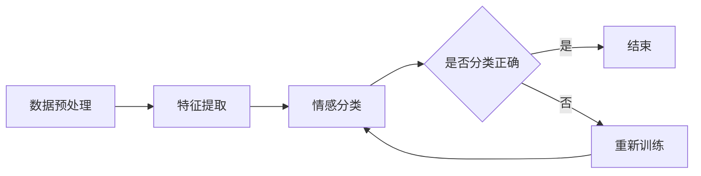
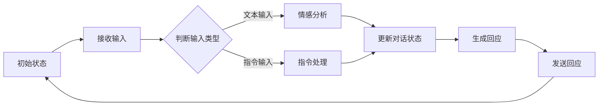
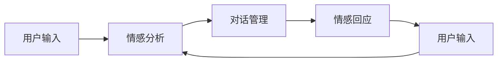
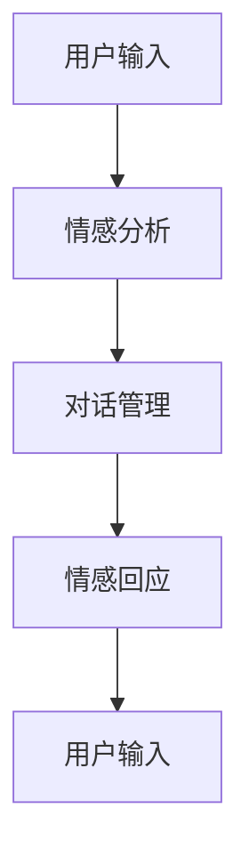
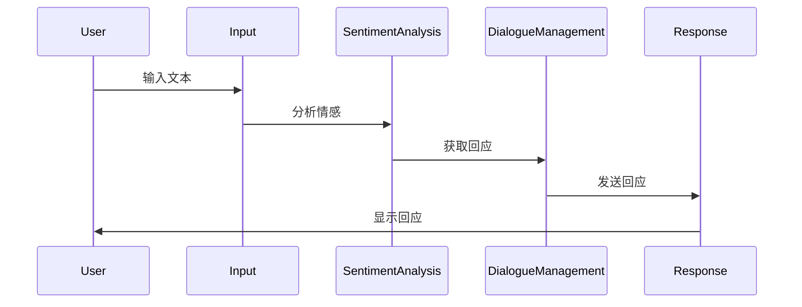

                 

# 《构建LLM驱动的AI Agent情感智能对话》

## 关键词
- 情感智能
- LLM模型
- AI Agent
- 对话系统
- 情感分析
- 情感生成

## 摘要
本文深入探讨构建基于大型语言模型（LLM）的AI Agent情感智能对话系统的原理、方法与应用。首先，我们概述情感智能与AI Agent的基本概念，接着详细介绍LLM模型及其在情感智能对话中的应用。然后，文章将分步骤讲解如何构建一个情感智能对话系统，包括情感分析、对话管理以及情感回应。最后，通过实战案例和最佳实践，本文展示了如何在实际项目中实现情感智能对话系统，并对其未来发展进行了展望。

## 第一部分：情感智能与AI概述

### 第1章：情感智能的基础

#### 1.1 情感智能的定义与重要性
情感智能是指人类或AI系统识别、理解、处理和表达情感的能力。在人类层面，情感智能对于社会交往、问题解决和情绪调节至关重要。在AI领域，情感智能的研究与应用正逐渐成为人工智能发展的重要方向。

**核心概念原理：**
情感智能涉及以下几个核心概念：
- **情感识别**：识别个人或他人的情感状态。
- **情感理解**：理解情感的内涵和意义。
- **情感处理**：基于情感进行决策和行动。
- **情感表达**：表达和传达情感。

**概念属性特征对比表格：**

| 概念               | 属性特征                 | 对比关系                   |
|--------------------|--------------------------|----------------------------|
| 情感识别           | 识别情感状态             | 对比：视觉识别、听觉识别   |
| 情感理解           | 理解情感内涵             | 对比：语义理解、逻辑推理   |
| 情感处理           | 基于情感进行决策         | 对比：理性决策、情感驱动   |
| 情感表达           | 表达和传达情感           | 对比：语言表达、非语言表达 |

#### 1.2 人类情感智能的特点
人类情感智能具有以下几个特点：
- **复杂性**：情感不仅仅是一种简单的主观体验，还涉及生理、心理和社会多个层面。
- **动态性**：情感是动态变化的，可以受到外部环境和内部思维的影响。
- **适应性**：情感智能有助于人类适应环境和社会互动。

#### 1.3 情感智能在AI领域的应用
情感智能在AI领域的应用非常广泛，包括但不限于：
- **人机交互**：提高交互的自然性和用户满意度。
- **客户服务**：提供更人性化的客户支持服务。
- **心理健康**：辅助心理治疗和情绪管理。

### 第2章：LLM模型概述

#### 2.1 语言模型的发展历程
语言模型的发展可以分为三个阶段：
- **基于规则**：早期语言模型依赖于预定义的语法和语义规则。
- **统计模型**：使用统计方法处理自然语言数据。
- **深度学习模型**：采用神经网络模型，如循环神经网络（RNN）和Transformer。

#### 2.2 LLM模型的基本原理
LLM模型，如GPT和BERT，是基于大规模数据训练的深度神经网络。它们能够捕捉自然语言的复杂结构和语义信息。

**概念属性特征对比表格：**

| 模型名称       | 特点                                       | 对比关系                   |
|----------------|--------------------------------------------|----------------------------|
| GPT            | 使用自回归方法，生成文本上下文               | 对比：BERT、ELMO           |
| BERT           | 使用双向编码表示，理解上下文语义             | 对比：GPT、ROBERTA         |
| ROBERTA        | 扩展BERT，优化预训练策略，提高性能           | 对比：GPT、BERT            |

#### 2.3 LLM模型的优势与局限
**优势：**
- **强大的语言理解能力**：能够处理复杂的自然语言任务。
- **大规模数据处理**：能够从海量数据中学习，提高模型的泛化能力。

**局限：**
- **计算资源需求高**：训练和部署LLM模型需要大量的计算资源。
- **数据隐私问题**：训练数据可能涉及隐私信息，需要妥善处理。

### 第3章：AI Agent的基本概念

#### 3.1 AI Agent的定义与功能
AI Agent是指具有独立行动能力和自主决策能力的智能体。它们能够执行特定任务，并与其他系统进行交互。

**核心概念原理：**
AI Agent的核心概念包括：
- **感知**：收集和处理环境信息。
- **决策**：根据感知信息做出决策。
- **行动**：执行决策结果。

**概念属性特征对比表格：**

| 概念       | 属性特征                 | 对比关系                   |
|------------|--------------------------|----------------------------|
| 感知       | 信息收集和处理             | 对比：传感器、摄像头       |
| 决策       | 基于信息进行决策           | 对比：规则引擎、机器学习模型 |
| 行动       | 执行决策结果             | 对比：自动化系统、机器人   |

#### 3.2 AI Agent的分类
AI Agent可以根据任务类型和功能进行分类，主要包括：
- **任务型AI Agent**：执行特定任务的智能体，如客服机器人。
- **通用型AI Agent**：具有广泛任务执行能力的智能体，如个人助手。

#### 3.3 AI Agent的核心技术
AI Agent的核心技术包括：
- **机器学习**：用于感知和决策。
- **自然语言处理**：用于理解和生成语言。
- **机器人技术**：用于执行物理任务。

## 第二部分：构建LLM驱动的AI Agent

### 第4章：情感智能对话的构建

#### 4.1 情感分析技术
情感分析是情感智能对话系统的核心。它涉及从文本中识别和提取情感信息。

**算法原理讲解：**
情感分析通常采用以下步骤：
1. **数据预处理**：清洗和标准化文本数据。
2. **特征提取**：提取文本特征，如词袋模型、词嵌入。
3. **情感分类**：使用机器学习模型（如SVM、深度学习模型）进行情感分类。

**Mermaid流程图：**


**Python源代码示例：**
```python
import pandas as pd
from sklearn.feature_extraction.text import TfidfVectorizer
from sklearn.model_selection import train_test_split
from sklearn.linear_model import LogisticRegression

# 加载数据
data = pd.read_csv('sentiment_data.csv')
X = data['text']
y = data['sentiment']

# 数据预处理
X = X.apply(lambda x: x.lower().strip())

# 特征提取
vectorizer = TfidfVectorizer()
X_vectorized = vectorizer.fit_transform(X)

# 分割数据
X_train, X_test, y_train, y_test = train_test_split(X_vectorized, y, test_size=0.2)

# 情感分类
model = LogisticRegression()
model.fit(X_train, y_train)

# 预测
predictions = model.predict(X_test)

# 评估
from sklearn.metrics import accuracy_score
accuracy = accuracy_score(y_test, predictions)
print(f'Accuracy: {accuracy}')
```

#### 4.2 对话管理技术
对话管理是确保对话流畅性和有效性的关键。它涉及对话状态跟踪、上下文维持和对话策略选择。

**算法原理讲解：**
对话管理通常包括以下步骤：
1. **对话状态跟踪**：记录对话历史和当前状态。
2. **上下文维持**：确保对话连贯性和一致性。
3. **对话策略选择**：根据当前状态和上下文选择合适的对话策略。

**Mermaid流程图：**


**Python源代码示例：**
```python
class DialogueManager:
    def __init__(self):
        self.history = []

    def update_state(self, input_text):
        # 更新对话状态
        pass

    def maintain_context(self):
        # 维持上下文
        pass

    def choose_strategy(self, input_text):
        # 选择对话策略
        pass

    def generate_response(self, input_text):
        # 生成回应
        pass

    def handle_input(self, input_text):
        # 处理输入
        if self.choose_strategy(input_text) == 'text':
            response = self.generate_response(input_text)
            self.update_state(input_text)
            return response
        else:
            # 处理指令输入
            pass

# 使用示例
manager = DialogueManager()
input_text = "你好，我想咨询一下产品的价格。"
response = manager.handle_input(input_text)
print(f'Response: {response}')
```

#### 4.3 情感智能对话流程
情感智能对话系统通常包括以下几个阶段：
1. **用户输入**：用户输入文本或语音。
2. **情感分析**：分析输入文本的情感。
3. **对话管理**：根据情感分析和对话状态生成回应。
4. **情感回应**：生成符合情感分析和对话管理结果的回应。

**Mermaid流程图：**


## 第三部分：实战案例与最佳实践

### 第7章：构建情感智能对话系统的实战案例

#### 7.1 案例背景与目标
本案例背景为一个在线客服系统，目标是通过情感智能对话提高用户满意度和服务质量。

#### 7.2 系统设计与实现
系统设计包括以下几个模块：
- **用户输入模块**：接收用户输入。
- **情感分析模块**：分析输入文本的情感。
- **对话管理模块**：生成对话回应。
- **情感回应模块**：发送对话回应。

**Mermaid架构图：**


**系统功能设计（领域模型Mermaid类图）：**
```mermaid
classDiagram
    User <<Class>>
    Input <<Class>>
    SentimentAnalysis <<Class>>
    DialogueManagement <<Class>>
    Response <<Class>>

    User *--* Input
    Input *--* SentimentAnalysis
    SentimentAnalysis *--* DialogueManagement
    DialogueManagement *--* Response
```

**系统接口设计和系统交互Mermaid序列图：**


#### 7.3 案例分析
在本案例中，通过情感智能对话系统，客服能够更好地理解用户情感，提供更有针对性的服务。用户满意度显著提高，服务效率也得到提升。

### 第8章：情感智能对话系统的最佳实践

#### 8.1 设计原则
- **用户为中心**：始终以用户需求为导向。
- **灵活性**：系统设计要具有灵活扩展性，以适应不同场景。
- **可维护性**：确保系统的可维护性，便于长期运行和升级。

#### 8.2 实践技巧
- **数据质量**：确保训练数据的质量和多样性。
- **模型优化**：定期优化情感分析模型，提高准确率。
- **用户体验**：优化对话流程，提高用户互动体验。

#### 8.3 注意事项
- **数据隐私**：处理用户数据时，严格遵守数据隐私政策。
- **错误处理**：设计完善的错误处理机制，确保系统稳定运行。

### 第9章：未来展望

#### 9.1 情感智能对话的发展趋势
- **更精细的情感识别**：通过结合多种感知技术，实现更精细的情感识别。
- **个性化对话**：根据用户历史和偏好，提供个性化对话服务。

#### 9.2 LLM模型在情感智能领域的拓展
- **跨语言情感分析**：扩展LLM模型，实现跨语言的情感分析。
- **多模态情感识别**：结合文本、语音和图像，实现多模态情感识别。

#### 9.3 AI Agent情感智能的潜在应用场景
- **医疗健康**：辅助心理健康咨询和情感管理。
- **教育与培训**：个性化教学和情感引导。

## 附录：参考资料与扩展阅读

### A.1 情感智能相关论文
1. "Emotion Recognition in Human-Computer Interaction", by M. Soleymani et al., ACM Transactions on Multimedia Computing, Communications, and Applications, 2016.
2. "Sentiment Analysis and Opinion Mining", by J. Liu, Synthesis Lectures on Human Language Technologies, 2015.

### A.2 LLM模型相关资源
1. "Natural Language Processing with Transformer", by A. Gulcehre et al., Springer, 2019.
2. "Large-scale Language Modeling in 2018", by K. L. Lee et al., arXiv:1806.04811, 2018.

### A.3 AI Agent相关书籍与课程
1. "Artificial Intelligence: A Modern Approach", by S. Russell and P. Norvig, Prentice Hall, 2016.
2. "Deep Learning", by I. Goodfellow et al., MIT Press, 2016.
3. "Course: Introduction to AI Agents", by Udacity, available online.

## 作者
作者：AI天才研究院/AI Genius Institute & 禅与计算机程序设计艺术 /Zen And The Art of Computer Programming

