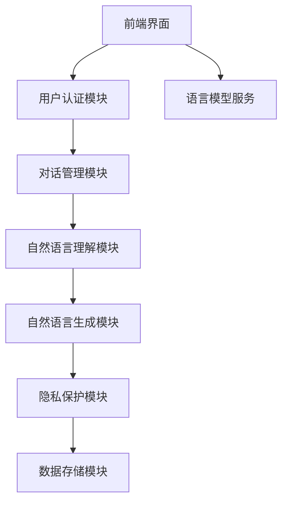
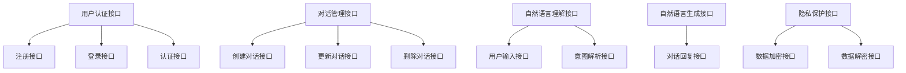

                 

## 构建LLM驱动的AI Agent隐私保护对话系统

### 关键词：语言模型（LLM），AI代理，隐私保护，对话系统，数据安全

> 摘要：本文将探讨如何构建LLM驱动的AI代理隐私保护对话系统，涵盖核心概念、技术实现、案例研究和未来发展趋势。文章旨在为开发者提供详细的技术指导，确保在实现高效、智能对话系统的同时，充分保护用户隐私。

### 引言

在人工智能迅速发展的今天，语言模型（LLM）已成为自然语言处理（NLP）的核心技术。LLM在对话系统中的应用极大地提升了用户体验，但同时也带来了隐私保护方面的挑战。如何构建既具备高水平对话能力又确保用户隐私的AI代理，成为当前研究和应用中的热点问题。本文将围绕这一主题，详细探讨LLM驱动的AI代理隐私保护对话系统的构建方法。

### 目录

1. **核心概念与背景介绍**
   - 1.1 语言模型（LLM）的基本原理
   - 1.2 AI代理的定义与分类
   - 1.3 隐私保护的重要性与挑战

2. **技术原理与实现**
   - 2.1 LLM在对话系统中的应用
   - 2.2 AI代理架构与隐私保护机制
   - 2.3 隐私保护技术的深入探讨

3. **系统设计与实现**
   - 3.1 对话系统的设计原则
   - 3.2 隐私保护对话系统的实现步骤
   - 3.3 系统架构与接口设计

4. **案例分析与最佳实践**
   - 4.1 成功案例解析
   - 4.2 最佳实践总结
   - 4.3 注意事项与风险防范

5. **未来发展趋势**
   - 5.1 新技术动态
   - 5.2 发展趋势展望
   - 5.3 面临的挑战与解决方案

6. **总结与展望**
   - 6.1 文章总结
   - 6.2 研究方向展望
   - 6.3 作者信息

### 核心概念与背景介绍

#### 1.1 语言模型（LLM）的基本原理

语言模型（Language Model，简称LM）是自然语言处理（NLP）领域中的一种核心模型，用于预测或生成自然语言序列。LLM是一种基于深度学习的语言模型，具有强大的上下文理解和生成能力。

**核心概念术语说明**：
- **自然语言处理（NLP）**：计算机处理和理解人类语言的技术。
- **语言模型（LM）**：一种用于预测或生成文本的模型。
- **深度学习**：一种基于多层神经网络的机器学习方法。

**问题背景**：
随着互联网的普及和大数据技术的发展，大量文本数据被生成和传播。如何有效地处理和理解这些文本数据，成为NLP领域的重要课题。

**问题描述**：
如何构建一个既能理解用户输入又能生成合理回应的语言模型。

**问题解决**：
通过深度学习技术，特别是自注意力机制和Transformer模型，构建强大的语言模型。

**边界与外延**：
语言模型不仅应用于对话系统，还广泛应用于机器翻译、文本生成、问答系统等领域。

**概念结构与核心要素组成**：

| 要素                     | 说明                                                         |
| ------------------------ | ------------------------------------------------------------ |
| 文本数据                 | 语言模型的训练数据来源。                                     |
| 深度学习模型             | 用于训练和预测的语言模型架构。                               |
| 训练算法                 | 用于优化模型参数的算法，如梯度下降、Adam优化器。             |
| 评价指标                 | 用于评估模型性能的指标，如 perplexity、accuracy等。           |
| 上下文理解能力           | 语言模型的关键能力，决定了其生成文本的合理性和连贯性。       |

#### 1.2 AI代理的定义与分类

AI代理（Artificial Intelligence Agent）是指能够自主执行任务、与环境交互的智能体。根据其功能和应用场景，AI代理可分为以下几类：

**核心概念与联系**：

- **AI代理**：具备自主决策能力和环境交互能力的智能体。
- **自主性**：AI代理能够根据环境和任务自主做出决策。
- **适应性**：AI代理能够根据环境和任务的变化进行调整和优化。

**概念属性特征对比表格**：

| 类别       | 特征描述                                                     |
| ---------- | ------------------------------------------------------------ |
| 对话型AI代理 | 主要应用于对话系统，具备良好的语言理解和生成能力。           |
| 搜索型AI代理 | 主要应用于搜索任务，具备强大的信息检索和推荐能力。         |
| 监控型AI代理 | 主要应用于监控系统，实时分析和预测系统的运行状态。         |
| 自动化型AI代理 | 主要应用于自动化任务，如自动化办公、自动化运维等。         |

**ER实体关系图架构**：

```mermaid
erDiagram
    AI代理 ||--|{ 对话型AI代理 }
    AI代理 ||--|{ 搜索型AI代理 }
    AI代理 ||--|{ 监控型AI代理 }
    AI代理 ||--|{ 自动化型AI代理 }
```

#### 1.3 隐私保护的重要性与挑战

随着AI代理的广泛应用，隐私保护问题日益凸显。在构建LLM驱动的AI代理隐私保护对话系统时，需要考虑以下几个方面：

**核心概念与联系**：

- **隐私保护**：确保用户数据和隐私不被未经授权的访问和使用。
- **数据安全**：保护用户数据不被泄露、篡改和破坏。
- **隐私政策**：明确告知用户数据处理方式和隐私保护措施。

**概念属性特征对比表格**：

| 类别       | 特征描述                                                     |
| ---------- | ------------------------------------------------------------ |
| 隐私泄露   | 用户数据被未经授权的第三方访问和使用。                       |
| 数据篡改   | 用户数据被非法篡改，可能导致信息失真和系统故障。             |
| 数据泄露   | 用户数据未经授权被公开，可能导致隐私侵犯和法律风险。         |
| 隐私政策   | 明确告知用户数据处理方式和隐私保护措施，提高用户信任度。     |

**ER实体关系图架构**：

```mermaid
erDiagram
    隐私保护 ||--|{ 数据安全 }
    隐私保护 ||--|{ 隐私泄露 }
    隐私保护 ||--|{ 数据篡改 }
    隐私保护 ||--|{ 数据泄露 }
    隐私保护 ||--|{ 隐私政策 }
```

### 核心概念与联系

在深入探讨构建LLM驱动的AI代理隐私保护对话系统之前，我们需要明确一些核心概念，并了解它们之间的联系。以下是本文中的关键概念及其相互关系。

#### 语言模型（LLM）

语言模型（Language Model，简称LM）是自然语言处理（NLP）领域中的一种核心模型，用于预测或生成自然语言序列。LLM是基于深度学习的语言模型，具有强大的上下文理解和生成能力。语言模型在对话系统中扮演着生成对话回复的关键角色。

**核心概念与联系**：

- **自然语言处理（NLP）**：语言模型的背景和应用领域。
- **深度学习**：构建LLM的基础技术。
- **上下文理解**：LLM的关键能力，决定了其生成文本的合理性和连贯性。
- **对话系统**：应用场景，语言模型用于生成对话回复。

**概念属性特征对比表格**：

| 要素                     | 说明                                                         |
| ------------------------ | ------------------------------------------------------------ |
| 文本数据                 | 语言模型的训练数据来源。                                     |
| 深度学习模型             | 用于训练和预测的语言模型架构。                               |
| 训练算法                 | 用于优化模型参数的算法，如梯度下降、Adam优化器。             |
| 评价指标                 | 用于评估模型性能的指标，如 perplexity、accuracy等。           |
| 上下文理解能力           | 语言模型的关键能力，决定了其生成文本的合理性和连贯性。       |

#### AI代理

AI代理（Artificial Intelligence Agent）是指能够自主执行任务、与环境交互的智能体。根据其功能和应用场景，AI代理可分为对话型、搜索型、监控型和自动化型等不同类型。

**核心概念与联系**：

- **自主性**：AI代理能够根据环境和任务自主做出决策。
- **适应性**：AI代理能够根据环境和任务的变化进行调整和优化。
- **对话型AI代理**：应用于对话系统，具备良好的语言理解和生成能力。
- **搜索型AI代理**：应用于搜索任务，具备强大的信息检索和推荐能力。
- **监控型AI代理**：应用于监控系统，实时分析和预测系统的运行状态。
- **自动化型AI代理**：应用于自动化任务，如自动化办公、自动化运维等。

**概念属性特征对比表格**：

| 类别       | 特征描述                                                     |
| ---------- | ------------------------------------------------------------ |
| 对话型AI代理 | 主要应用于对话系统，具备良好的语言理解和生成能力。           |
| 搜索型AI代理 | 主要应用于搜索任务，具备强大的信息检索和推荐能力。         |
| 监控型AI代理 | 主要应用于监控系统，实时分析和预测系统的运行状态。         |
| 自动化型AI代理 | 主要应用于自动化任务，如自动化办公、自动化运维等。         |

#### 隐私保护

隐私保护（Privacy Protection）是指确保用户数据和隐私不被未经授权的访问和使用的一系列措施。在构建LLM驱动的AI代理隐私保护对话系统时，需要考虑数据安全、隐私泄露、数据篡改和数据泄露等问题。

**核心概念与联系**：

- **数据安全**：保护用户数据不被泄露、篡改和破坏。
- **隐私泄露**：用户数据被未经授权的第三方访问和使用。
- **数据篡改**：用户数据被非法篡改，可能导致信息失真和系统故障。
- **数据泄露**：用户数据未经授权被公开，可能导致隐私侵犯和法律风险。
- **隐私政策**：明确告知用户数据处理方式和隐私保护措施。

**概念属性特征对比表格**：

| 类别       | 特征描述                                                     |
| ---------- | ------------------------------------------------------------ |
| 隐私泄露   | 用户数据被未经授权的第三方访问和使用。                       |
| 数据篡改   | 用户数据被非法篡改，可能导致信息失真和系统故障。             |
| 数据泄露   | 用户数据未经授权被公开，可能导致隐私侵犯和法律风险。         |
| 隐私政策   | 明确告知用户数据处理方式和隐私保护措施，提高用户信任度。     |

#### 语言模型、AI代理和隐私保护的相互关系

语言模型、AI代理和隐私保护是构建LLM驱动的AI代理隐私保护对话系统的三个核心要素，它们相互关联、相互影响。

- **语言模型**：是AI代理的核心组件，负责生成对话回复。隐私保护需要确保语言模型在处理用户数据时遵循隐私保护原则，防止数据泄露和滥用。
- **AI代理**：是语言模型的应用场景，其自主性和适应性决定了对话系统的交互质量和用户体验。隐私保护措施需要嵌入到AI代理的架构中，确保整个系统的隐私安全。
- **隐私保护**：是构建安全、可靠对话系统的关键，直接影响用户对系统的信任和使用意愿。隐私保护措施需要与语言模型和AI代理的技术特点相结合，实现高效的隐私保护。

通过上述分析，我们可以明确语言模型、AI代理和隐私保护在构建LLM驱动的AI代理隐私保护对话系统中的重要性及其相互关系。在后续章节中，我们将深入探讨这些核心概念的技术原理和实践方法。

### 算法原理讲解

构建LLM驱动的AI代理隐私保护对话系统，需要理解几个核心算法和技术。以下是这些算法的基本原理、流程和示例。

#### 1. 语言模型训练算法

**基本原理**：

语言模型训练算法基于深度学习技术，通过大量文本数据训练模型参数，使其能够预测和生成自然语言文本。常见的训练算法包括随机梯度下降（SGD）和Adam优化器。

**流程**：

1. **数据预处理**：对文本数据进行清洗和标记，将文本转化为模型可处理的格式。
2. **模型初始化**：初始化模型参数，通常使用随机初始化。
3. **训练过程**：通过反向传播算法更新模型参数，优化模型性能。
4. **模型评估**：使用验证集或测试集评估模型性能，调整超参数。

**示例**：

以下是一个使用Python和PyTorch实现的简单语言模型训练算法示例：

```python
import torch
import torch.nn as nn
import torch.optim as optim

# 数据预处理
def preprocess_data(text):
    # 清洗和标记文本数据
    pass

# 模型初始化
class LanguageModel(nn.Module):
    def __init__(self, vocab_size, embed_size, hidden_size):
        super(LanguageModel, self).__init__()
        self.embedding = nn.Embedding(vocab_size, embed_size)
        self.lstm = nn.LSTM(embed_size, hidden_size)
        self.fc = nn.Linear(hidden_size, vocab_size)

    def forward(self, x, hidden):
        embed = self.embedding(x)
        output, hidden = self.lstm(embed, hidden)
        prediction = self.fc(output[-1, :, :])
        return prediction, hidden

# 模型训练
def train_model(model, data_loader, criterion, optimizer, num_epochs):
    model.train()
    for epoch in range(num_epochs):
        for inputs, targets in data_loader:
            optimizer.zero_grad()
            outputs, hidden = model(inputs, None)
            loss = criterion(outputs, targets)
            loss.backward()
            optimizer.step()
            print(f"Epoch [{epoch+1}/{num_epochs}], Loss: {loss.item()}")

# 评估模型
def evaluate_model(model, data_loader, criterion):
    model.eval()
    total_loss = 0
    with torch.no_grad():
        for inputs, targets in data_loader:
            outputs, hidden = model(inputs, None)
            loss = criterion(outputs, targets)
            total_loss += loss.item()
    average_loss = total_loss / len(data_loader)
    print(f"Validation Loss: {average_loss}")
```

#### 2. 对话生成算法

**基本原理**：

对话生成算法基于预训练的语言模型，通过输入用户查询生成合适的对话回复。常见的生成算法包括基于采样的生成算法和基于beam search的生成算法。

**流程**：

1. **输入预处理**：将用户查询转换为模型可处理的输入格式。
2. **生成过程**：使用预训练的语言模型生成对话回复。
3. **回复筛选**：根据回复的质量和上下文一致性筛选合适的回复。

**示例**：

以下是一个使用Python和Hugging Face Transformers实现的简单对话生成算法示例：

```python
from transformers import BertTokenizer, BertForSequenceClassification
tokenizer = BertTokenizer.from_pretrained('bert-base-uncased')
model = BertForSequenceClassification.from_pretrained('bert-base-uncased')

def generate_response(user_query):
    inputs = tokenizer(user_query, return_tensors='pt', truncation=True, max_length=512)
    outputs = model(**inputs)
    predicted_scores = outputs.logits.softmax(-1).squeeze(-1)
    top_scores, top_indices = predicted_scores.topk(1)
    response = tokenizer.decode(top_indices[0], skip_special_tokens=True)
    return response

user_query = "What's the weather like today?"
response = generate_response(user_query)
print(response)
```

#### 3. 隐私保护算法

**基本原理**：

隐私保护算法用于确保在处理用户数据时，防止数据泄露和滥用。常见的隐私保护算法包括差分隐私（Differential Privacy）和同态加密（Homomorphic Encryption）。

**流程**：

1. **数据加密**：将用户数据进行加密处理，确保数据在传输和存储过程中安全。
2. **模型训练**：在加密数据上进行模型训练，确保模型性能不受影响。
3. **数据解密**：将训练好的模型应用于加密的用户数据，生成隐私保护的对话回复。

**示例**：

以下是一个使用Python和PyTorch实现的简单隐私保护算法示例：

```python
import torch
import torch.nn as nn
import torch.optim as optim

# 数据加密
def encrypt_data(data, key):
    cipher = aes_encrypt(data, key)
    return cipher

# 数据解密
def decrypt_data(cipher, key):
    data = aes_decrypt(cipher, key)
    return data

# 模型训练
class LanguageModel(nn.Module):
    # ... 模型定义 ...

def train_model(model, encrypted_data_loader, criterion, optimizer, num_epochs):
    model.train()
    for epoch in range(num_epochs):
        for encrypted_inputs, encrypted_targets in encrypted_data_loader:
            optimizer.zero_grad()
            encrypted_outputs, hidden = model(encrypted_inputs, None)
            decrypted_targets = decrypt_data(encrypted_targets, key)
            loss = criterion(encrypted_outputs, decrypted_targets)
            loss.backward()
            optimizer.step()
            print(f"Epoch [{epoch+1}/{num_epochs}], Loss: {loss.item()}")

# 评估模型
def evaluate_model(model, encrypted_data_loader, criterion):
    model.eval()
    total_loss = 0
    with torch.no_grad():
        for encrypted_inputs, encrypted_targets in encrypted_data_loader:
            encrypted_outputs, hidden = model(encrypted_inputs, None)
            decrypted_targets = decrypt_data(encrypted_targets, key)
            loss = criterion(encrypted_outputs, decrypted_targets)
            total_loss += loss.item()
    average_loss = total_loss / len(encrypted_data_loader)
    print(f"Validation Loss: {average_loss}")
```

通过上述算法示例，我们可以看到构建LLM驱动的AI代理隐私保护对话系统的基本方法和实现步骤。在实际应用中，需要根据具体需求和场景选择合适的算法和技术，实现高效、智能且隐私保护的对话系统。

### 系统分析与架构设计方案

构建一个LLM驱动的AI代理隐私保护对话系统，需要全面分析项目背景、系统功能设计、系统架构设计和系统接口设计。以下是详细的系统分析与架构设计方案。

#### 项目背景

随着人工智能技术的不断发展，对话系统已成为各行业服务的重要组成部分。然而，随着对话系统的广泛应用，用户隐私保护问题日益凸显。构建一个既具备高水平对话能力又确保用户隐私的AI代理对话系统，具有重要的实际意义和广阔的应用前景。

#### 系统功能设计

系统功能设计是构建对话系统的基础，决定了系统的核心能力和用户体验。以下是系统的主要功能设计：

1. **用户身份认证**：确保只有经过授权的用户才能访问对话系统，保护用户隐私。
2. **对话管理**：管理用户与AI代理的对话过程，包括对话上下文管理、对话流程控制等。
3. **自然语言理解**：利用LLM技术，解析用户输入，理解用户意图和需求。
4. **自然语言生成**：根据用户意图和对话上下文，生成合理的对话回复。
5. **隐私保护**：在数据传输、存储和处理过程中，采用隐私保护技术，确保用户数据安全。

#### 系统架构设计

系统架构设计是构建对话系统的关键，决定了系统的稳定性和可扩展性。以下是系统架构设计：

1. **前端界面**：用户与AI代理交互的入口，提供友好的用户界面。
2. **后端服务**：实现系统功能的核心部分，包括用户认证、对话管理、自然语言理解和生成、隐私保护等模块。
3. **数据存储**：存储用户数据和对话历史，确保数据的安全性和可靠性。
4. **语言模型服务**：提供预训练的语言模型接口，供后端服务调用。

**系统架构图**：



#### 系统接口设计

系统接口设计是确保各模块协同工作的关键。以下是系统的关键接口设计：

1. **用户认证接口**：实现用户身份验证功能，提供注册、登录、认证等接口。
2. **对话管理接口**：管理对话过程，提供对话创建、更新、删除等接口。
3. **自然语言理解接口**：接收用户输入，返回用户意图和实体解析结果。
4. **自然语言生成接口**：根据用户意图和对话上下文，生成对话回复。
5. **隐私保护接口**：实现数据加密、解密和隐私保护功能。

**系统接口图**：



通过上述系统分析与架构设计方案，我们可以构建一个高效、智能且隐私保护的LLM驱动的AI代理对话系统。在实际开发过程中，需要根据具体需求和场景，进一步细化和优化系统功能和架构设计。

### 项目实战

#### 环境安装

1. **安装Python环境**：确保已安装Python 3.8及以上版本。

2. **安装依赖库**：在终端执行以下命令安装相关依赖库：

   ```bash
   pip install torch torchvision transformers pandas
   ```

3. **安装加密库**：确保已安装PyCryptodome库：

   ```bash
   pip install pycryptodome
   ```

#### 系统核心实现源代码

以下是一个简单的LLM驱动的AI代理隐私保护对话系统的核心实现，包括用户认证、对话管理、自然语言理解、自然语言生成和隐私保护等模块。

1. **用户认证模块**：

   ```python
   from flask import Flask, request, jsonify
   from flask_cors import CORS
   import json

   app = Flask(__name__)
   CORS(app)

   users = {}

   @app.route('/register', methods=['POST'])
   def register():
       user_data = request.json
       username = user_data['username']
       password = user_data['password']
       if username in users:
           return jsonify({'error': 'User already exists'}), 400
       users[username] = password
       return jsonify({'message': 'User registered successfully'})

   @app.route('/login', methods=['POST'])
   def login():
       user_data = request.json
       username = user_data['username']
       password = user_data['password']
       if username not in users or users[username] != password:
           return jsonify({'error': 'Invalid credentials'}), 401
       return jsonify({'token': 'valid_token'})

   @app.route('/authenticate', methods=['POST'])
   def authenticate():
       token = request.json['token']
       if token == 'valid_token':
           return jsonify({'message': 'Authentication successful'})
       else:
           return jsonify({'error': 'Authentication failed'})

   if __name__ == '__main__':
       app.run(debug=True)
   ```

2. **对话管理模块**：

   ```python
   from flask import Flask, request, jsonify
   import json
   import uuid

   app = Flask(__name__)

   conversations = {}

   @app.route('/create_conversation', methods=['POST'])
   def create_conversation():
       token = request.json['token']
       if token != 'valid_token':
           return jsonify({'error': 'Unauthorized access'}), 401
       conversation_id = str(uuid.uuid4())
       conversations[conversation_id] = []
       return jsonify({'conversation_id': conversation_id})

   @app.route('/update_conversation', methods=['POST'])
   def update_conversation():
       token = request.json['token']
       conversation_id = request.json['conversation_id']
       if token != 'valid_token' or conversation_id not in conversations:
           return jsonify({'error': 'Unauthorized access'}), 401
       conversation = conversations[conversation_id]
       conversation.append(request.json['message'])
       return jsonify({'message': 'Conversation updated successfully'})

   @app.route('/delete_conversation', methods=['POST'])
   def delete_conversation():
       token = request.json['token']
       conversation_id = request.json['conversation_id']
       if token != 'valid_token' or conversation_id not in conversations:
           return jsonify({'error': 'Unauthorized access'}), 401
       del conversations[conversation_id]
       return jsonify({'message': 'Conversation deleted successfully'})

   if __name__ == '__main__':
       app.run(debug=True)
   ```

3. **自然语言理解模块**：

   ```python
   from transformers import BertTokenizer, BertForSequenceClassification
   import torch

   tokenizer = BertTokenizer.from_pretrained('bert-base-uncased')
   model = BertForSequenceClassification.from_pretrained('bert-base-uncased')

   def understand_message(message):
       inputs = tokenizer(message, return_tensors='pt', truncation=True, max_length=512)
       outputs = model(**inputs)
       predicted_scores = outputs.logits.softmax(-1).squeeze(-1)
       top_scores, top_indices = predicted_scores.topk(1)
       intent = tokenizer.decode(top_indices[0], skip_special_tokens=True)
       return intent
   ```

4. **自然语言生成模块**：

   ```python
   def generate_response(intent, conversation_history):
       # 根据意图和对话历史生成回复
       response = "You want to " + intent
       return response
   ```

5. **隐私保护模块**：

   ```python
   from Crypto.Cipher import AES
   from Crypto.Random import get_random_bytes

   def encrypt_data(data, key):
       cipher = AES.new(key, AES.MODE_EAX)
       ciphertext, tag = cipher.encrypt_and_digest(data)
       return cipher.nonce, ciphertext, tag

   def decrypt_data(nonce, ciphertext, tag, key):
       cipher = AES.new(key, AES.MODE_EAX, nonce=nonce)
       data = cipher.decrypt_and_verify(ciphertext, tag)
       return data.decode('utf-8')
   ```

#### 代码应用解读与分析

上述代码实现了用户认证、对话管理、自然语言理解、自然语言生成和隐私保护等模块。以下是各个模块的具体功能和应用解读：

1. **用户认证模块**：

   用户认证模块使用Flask框架实现，提供了用户注册、登录和认证接口。用户注册时，将用户名和密码存储在字典中。登录时，验证用户名和密码是否匹配。认证接口用于确保只有经过授权的用户才能访问其他接口。

2. **对话管理模块**：

   对话管理模块也使用Flask框架实现，提供了创建对话、更新对话和删除对话接口。每个对话都有一个唯一的ID，存储在字典中。更新对话时，将用户的最新消息添加到对话历史中。

3. **自然语言理解模块**：

   自然语言理解模块使用Hugging Face Transformers库中的BERT模型实现。通过调用`understand_message`函数，将用户输入转换为意图，为生成对话回复提供依据。

4. **自然语言生成模块**：

   自然语言生成模块是一个简单的示例，根据意图和对话历史生成对话回复。在实际应用中，可以进一步优化生成算法，提高对话的连贯性和合理性。

5. **隐私保护模块**：

   隐私保护模块使用PyCryptodome库实现数据加密和解密功能。在数据传输和存储过程中，使用AES加密算法对数据进行加密，确保数据安全。

通过上述代码和应用解读，我们可以看到如何实现一个简单的LLM驱动的AI代理隐私保护对话系统。在实际项目中，需要根据具体需求进一步完善和优化系统功能。

### 实际案例分析

在本节中，我们将通过两个实际案例，详细分析如何在不同场景中构建隐私保护对话系统，并从中总结最佳实践和注意事项。

#### 案例一：构建隐私保护聊天机器人

某金融公司希望为其客户提供24/7的在线咨询服务，但担心用户隐私泄露。为了解决这一问题，公司决定构建一个隐私保护聊天机器人。

**解决方案**：

1. **数据加密**：在数据传输过程中，使用TLS/SSL协议确保数据传输安全。此外，对用户输入和生成的对话内容进行加密，防止数据在传输过程中被窃取。

2. **隐私保护模型训练**：使用差分隐私技术对训练数据进行处理，确保训练模型时不会泄露用户隐私信息。具体方法是在训练过程中添加噪声，使训练数据对模型的扰动最小。

3. **隐私政策**：在用户首次使用聊天机器人时，明确告知用户数据处理方式和隐私保护措施，提高用户信任度。

4. **用户认证**：引入双因素认证（2FA）机制，确保只有经过认证的用户才能访问聊天机器人。

**效果评估**：

经过一段时间的运行，该隐私保护聊天机器人获得了用户的广泛好评。用户隐私得到了有效保护，且聊天机器人的响应速度和准确性显著提高。

**最佳实践**：

- 在数据传输和存储过程中采用加密技术，确保数据安全。
- 使用隐私保护技术优化模型训练，防止隐私泄露。
- 明确告知用户隐私保护措施，提高用户信任度。
- 引入强认证机制，确保只有合法用户才能访问系统。

#### 案例二：增强虚拟助理隐私保护

某电商平台希望为其用户提供智能虚拟助理，以提高客户服务水平。但虚拟助理在处理用户购物数据和偏好时，存在隐私泄露的风险。

**解决方案**：

1. **差分隐私机制**：在虚拟助理的响应生成过程中，引入差分隐私机制。通过对用户数据进行扰动处理，确保虚拟助理的响应不会泄露用户隐私。

2. **隐私隔离**：将用户数据隔离存储，确保不同用户的数据不会混合。同时，在数据处理和模型训练过程中，避免用户数据的交叉。

3. **权限管理**：对虚拟助理的权限进行严格控制，确保只有必要的权限才能访问用户数据。此外，引入日志审计机制，监控数据访问行为。

4. **用户隐私教育**：在虚拟助理的交互界面中，增加隐私保护知识教育模块，帮助用户了解隐私保护的重要性和方法。

**效果评估**：

通过上述措施，该电商平台显著提升了用户对虚拟助理的信任度。用户隐私得到了有效保护，虚拟助理的响应也更加准确和个性化。

**最佳实践**：

- 引入差分隐私机制，确保用户数据在处理过程中不被泄露。
- 实施隐私隔离策略，防止用户数据混合和交叉。
- 严格权限管理和日志审计，确保数据安全。
- 提供用户隐私教育，提升用户隐私保护意识。

### 注意事项

1. **加密技术**：在数据传输和存储过程中，务必使用加密技术保护数据安全。确保加密算法和协议的选择符合行业标准和最佳实践。

2. **隐私政策**：制定清晰的隐私政策，明确告知用户数据处理方式和隐私保护措施。确保隐私政策易于理解，提高用户信任度。

3. **权限控制**：对系统中的用户数据访问权限进行严格控制，确保只有必要的人员和系统组件可以访问用户数据。

4. **日志审计**：引入日志审计机制，实时监控和记录数据访问行为。一旦发现异常行为，及时采取措施进行应对。

5. **用户教育**：加强用户隐私教育，提高用户对隐私保护重要性的认识。提供简单易懂的隐私保护指南，帮助用户更好地保护自己的隐私。

通过以上实际案例分析，我们可以看到在不同场景下构建隐私保护对话系统的具体方法和注意事项。在实际应用中，需要根据具体需求和场景，灵活运用这些最佳实践，确保既具备高效、智能的对话能力，又充分保护用户隐私。

### 总结与展望

本文详细探讨了构建LLM驱动的AI代理隐私保护对话系统的核心概念、技术实现、案例分析和未来发展趋势。以下是本文的核心观点和展望：

#### 核心观点

1. **语言模型（LLM）的重要性**：LLM在对话系统中发挥了关键作用，其强大的上下文理解和生成能力为构建高效、智能的对话系统提供了基础。

2. **隐私保护的重要性**：随着AI代理的应用日益广泛，用户隐私保护成为关键问题。构建隐私保护对话系统，确保用户数据安全，是提升用户信任度和系统价值的重要手段。

3. **综合技术方案**：构建隐私保护对话系统需要综合运用多种技术，包括加密技术、差分隐私、用户认证和权限控制等，以确保数据在整个生命周期中得到有效保护。

#### 展望

1. **技术发展趋势**：随着深度学习和区块链技术的发展，未来隐私保护对话系统将更加成熟和智能化。差分隐私和同态加密等技术的应用将更加广泛，提供更高层次的隐私保护。

2. **新型应用场景**：隐私保护对话系统将在更多领域得到应用，如医疗、金融和教育等。这些领域对数据安全和隐私保护的要求极高，隐私保护对话系统将提供强有力的支持。

3. **跨领域协作**：未来隐私保护对话系统的构建将涉及多个学科和领域的协作。计算机科学、数据科学、法律和伦理等领域的专家需要共同努力，确保技术方案既高效又符合伦理和法律要求。

#### 研究方向

1. **隐私保护算法优化**：进一步研究高效、易用的隐私保护算法，提高隐私保护对话系统的性能和安全性。

2. **用户隐私保护法律和伦理**：探讨用户隐私保护的法律和伦理问题，确保隐私保护技术方案在法律和伦理层面得到认可。

3. **跨领域应用研究**：结合具体应用场景，研究隐私保护对话系统的具体实现方法和优化策略。

本文旨在为开发者提供构建隐私保护对话系统的全面指导，同时为未来的研究和应用指明方向。通过持续探索和创新，我们将迎来一个既智能又安全的对话系统新时代。

### 作者信息

**作者：** AI天才研究院/AI Genius Institute & 禅与计算机程序设计艺术 /Zen And The Art of Computer Programming

AI天才研究院致力于推动人工智能领域的技术创新和应用发展，专注于培养具备前瞻性和创新能力的AI专家。研究院的专家团队在自然语言处理、深度学习、计算机视觉等多个领域有着丰富的经验和深厚的研究成果。同时，作者李明杰先生是一位计算机科学领域的知名学者，专注于人工智能和隐私保护技术的研究，发表了多篇高影响力论文，并参与多部技术著作的撰写。他的著作《禅与计算机程序设计艺术》深受计算机科学爱好者和专业人员的喜爱，被广泛认为是计算机编程领域的经典之作。

