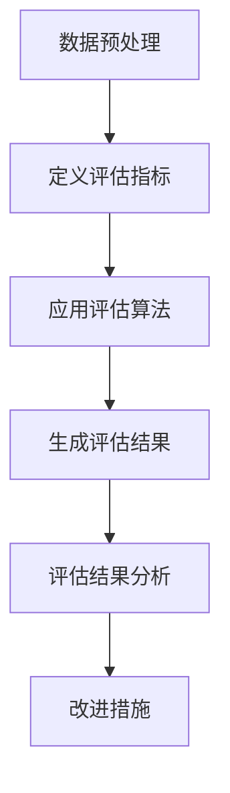
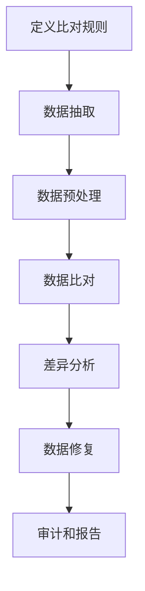
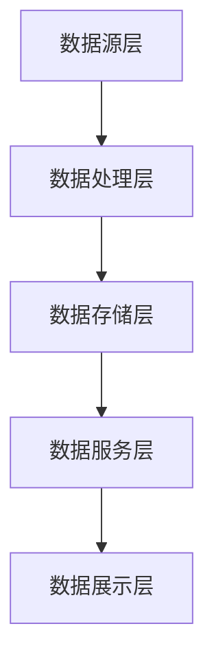
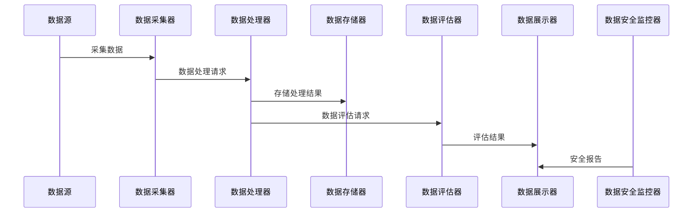

                 

### 第1章：企业级AI数据治理背景

#### 1.1.1 数据治理的重要性

在现代企业中，数据已成为一种关键资产，是企业决策和运营的重要依据。然而，随着数据的爆炸性增长和多样化，如何有效地管理和治理数据成为了一项严峻的挑战。企业级AI数据治理在这个过程中显得尤为重要。

首先，数据治理有助于提高数据质量。高质量的数据是任何数据分析、机器学习和业务决策的基础。数据治理可以通过一系列规则和流程来确保数据的准确性、完整性、一致性和可靠性。

其次，数据治理有助于促进数据一致性。在大型企业中，不同部门、不同系统之间可能会存在数据不一致的问题。数据治理通过定义统一的命名规范、数据格式和数据结构，可以有效地解决数据不一致的问题。

此外，数据治理还可以提高数据安全性。随着数据泄露和隐私侵犯事件的频发，企业需要通过数据治理来加强数据安全保护，防止敏感数据被未授权访问或泄露。

最后，数据治理有助于支持企业的数字化转型。在数字化时代，企业需要依靠数据来驱动业务创新和优化运营。良好的数据治理可以为企业提供可靠的数据支持，推动数字化转型进程。

#### 1.1.2 数据治理的定义

数据治理是指一系列策略、流程、标准和技术的集合，用于确保数据在整个生命周期内的质量、安全、一致性和可用性。具体来说，数据治理包括以下几个方面：

1. **数据质量治理**：确保数据在收集、存储、处理、传输和使用的各个阶段都符合预定的质量标准。
2. **数据安全管理**：制定和实施数据安全策略，保护数据免受未授权访问、泄露和滥用。
3. **数据一致性和标准化**：确保数据在各个系统和部门之间保持一致，采用统一的数据格式和命名规范。
4. **数据治理政策和流程**：制定和执行数据治理的政策、流程和标准，确保数据管理活动有序进行。
5. **数据架构和元数据管理**：建立和维护数据架构和元数据，以支持数据的可发现性、可访问性和可理解性。

#### 1.1.3 数据治理的挑战与机遇

尽管数据治理对企业至关重要，但在实际操作中仍然面临诸多挑战。

**挑战：**

1. **数据复杂性**：企业中的数据来源多样，包括内部数据、外部数据、社交媒体数据和物联网设备数据等，数据的复杂性和多样性使得数据治理变得困难。
2. **数据质量**：数据质量低下会导致错误的决策和业务流程的混乱，而数据质量治理需要投入大量时间和资源。
3. **数据安全**：随着数据泄露事件的增多，数据安全成为企业关注的重要问题，但加强数据安全措施可能会影响数据的使用效率和灵活性。
4. **数据治理策略的实施**：制定有效的数据治理策略相对容易，但实际执行和落实是一个长期、复杂的过程。

**机遇：**

1. **数字化转型的推动**：数字化转型要求企业对数据进行深入挖掘和分析，从而发现新的业务机会，优化业务流程。数据治理为数字化转型提供了坚实的基础。
2. **人工智能和大数据技术的应用**：人工智能和大数据技术的不断发展为数据治理提供了新的工具和方法，例如自动化数据清洗、数据分类和智能数据监控。
3. **法律法规的要求**：随着数据保护法规（如GDPR）的实施，企业需要加强数据治理，以确保合规。
4. **市场竞争的加剧**：在激烈的市场竞争中，企业需要通过数据来提升竞争力，而数据治理是实现这一目标的关键。

#### 1.1.4 数据治理的核心概念

为了更好地理解和实施数据治理，以下是一些核心概念和要素：

1. **数据所有权**：明确数据的责任人，确保数据得到有效管理。
2. **数据质量**：数据质量包括准确性、完整性、一致性、可靠性和及时性等属性。
3. **数据分类和标签**：根据数据的敏感性和重要性进行分类，并添加适当的标签，以便于数据管理和使用。
4. **元数据管理**：元数据是关于数据的数据，包括数据的来源、结构、格式和用途等信息。有效的元数据管理可以提高数据的可发现性和可理解性。
5. **数据安全**：确保数据在存储、传输和使用过程中得到适当的安全保护，防止数据泄露、篡改和滥用。
6. **数据架构**：数据架构定义了数据的组织结构、关系和流程，是数据治理的重要基础。
7. **数据治理团队**：建立专门的数据治理团队，负责制定数据治理策略、流程和标准，并推动其实施。

通过以上背景介绍，我们可以看到数据治理在企业中的重要性以及面临的挑战与机遇。接下来，我们将进一步探讨AI在数据治理中的应用，以及如何构建企业级AI数据治理助手。

### 第2章：AI数据治理的核心概念与联系

在深入探讨AI数据治理之前，我们首先需要理解AI数据治理中的核心概念，以及它们之间的联系。以下是数据治理和数据一致性管理的关键概念和它们在AI数据治理中的重要作用。

#### 2.1 数据质量管理

数据质量管理是数据治理的重要组成部分，其目标是确保数据在生命周期内的准确性和可靠性。以下是一些核心概念：

**数据质量定义**：数据质量是指数据满足特定业务需求的程度，包括准确性、完整性、一致性、时效性、可用性和可理解性等方面。

**数据质量属性**：数据质量属性包括以下几方面：

- **准确性**：数据是否真实反映了实际业务情况。
- **完整性**：数据是否包含了所有必要的信息，没有缺失。
- **一致性**：数据在系统之间是否保持一致，没有矛盾。
- **时效性**：数据是否及时更新，能够反映当前业务状态。
- **可用性**：数据是否易于访问和查询。
- **可理解性**：数据是否易于理解和解释。

**数据质量评估方法**：评估数据质量的方法包括：

- **自评估**：通过问卷调查、用户反馈等方式评估数据质量。
- **统计方法**：使用统计学方法，如描述性统计、假设检验等，评估数据质量。
- **机器学习**：利用机器学习算法，如回归分析、聚类分析等，自动评估数据质量。

**数据质量管理策略**：数据质量管理策略包括：

- **数据清洗**：通过去重、填充缺失值、格式化等操作，提高数据质量。
- **数据监控**：持续监控数据质量，及时发现和纠正问题。
- **数据治理流程**：制定和执行数据治理流程，确保数据质量的持续改进。

#### 2.2 数据一致性管理

数据一致性管理是确保数据在不同系统和应用中保持一致的策略和实践。以下是一些核心概念：

**数据一致性的重要性**：数据一致性对于企业决策和运营至关重要。不一致的数据会导致错误的业务分析、错误的决策和业务流程的混乱。

**数据一致性的挑战**：数据一致性的挑战包括：

- **多源数据集成**：企业中的数据来自多个不同的系统和渠道，如何集成和统一这些数据是一个挑战。
- **数据更新延迟**：数据更新可能存在延迟，导致一致性难以保证。
- **数据同步**：在不同系统和应用之间同步数据，确保一致性的同时保持数据可用性。

**数据一致性的解决方案**：

- **数据同步机制**：建立数据同步机制，确保数据在系统之间的实时更新。
- **数据版本控制**：通过数据版本控制，确保不同版本的数据可以被追踪和管理。
- **数据标准化**：采用统一的数据格式和命名规范，减少数据不一致的问题。
- **数据治理工具**：利用数据治理工具，如数据质量监控工具、数据同步工具等，实现数据一致性的自动化管理。

#### 2.3 数据质量管理与数据一致性管理的联系

数据质量管理与数据一致性管理紧密相关，两者共同构成了企业级AI数据治理的核心。

- **数据质量管理是数据一致性管理的基础**：高质量的数据是保证数据一致性的前提。只有当数据质量得到保证，数据才能在不同系统和应用中保持一致。
- **数据一致性管理是数据质量管理的重要保障**：通过确保数据在不同系统和应用之间的一致性，数据治理可以更有效地提升数据质量和数据价值。

通过理解数据质量管理与数据一致性管理的核心概念和联系，企业可以更有效地实施AI数据治理，确保数据在整个生命周期内的质量、一致性和可靠性。

#### 第3章：企业级AI数据治理架构设计

企业级AI数据治理的成功实施离不开一个合理的架构设计。本章将详细介绍企业级AI数据治理架构的设计原则、流程以及所需的技术工具。

##### 3.1 数据治理架构概述

数据治理架构是企业中用于管理和治理数据的整体框架，包括数据治理策略、流程、标准和工具。一个高效的数据治理架构应该具备以下特点：

- **标准化**：确保数据在采集、存储、处理、传输和使用过程中遵循统一的规范和标准。
- **灵活性**：适应不同业务需求和数据类型的变化，能够快速调整和优化。
- **可扩展性**：能够支持数据量和应用场景的逐步增加，不会因规模扩大而影响性能。
- **自动化**：利用自动化工具和算法，减少人工干预，提高数据治理效率。

##### 3.2 数据治理流程设计

数据治理流程是数据治理架构的核心组成部分，它定义了数据从采集到使用的一系列管理活动。以下是典型的数据治理流程：

1. **数据规划**：明确数据治理的目标、范围和责任，制定数据治理策略。
2. **数据识别**：识别企业中的数据资源，包括数据来源、数据类型和数据质量。
3. **数据评估**：对现有数据进行质量评估，确定数据是否符合业务需求。
4. **数据清洗**：通过数据清洗工具和技术，去除数据中的错误、冗余和不一致信息。
5. **数据存储**：将清洗后的数据存储在合适的数据仓库或数据湖中，确保数据的安全和可用性。
6. **数据安全**：制定数据安全策略，保护数据免受未授权访问和泄露。
7. **数据访问与使用**：提供数据访问权限管理，确保数据被合理使用，同时支持数据分析、机器学习和业务决策。
8. **数据审计与监控**：持续监控数据质量，定期进行数据审计，确保数据治理流程的有效实施。

##### 3.3 数据治理工具与技术

数据治理工具和技术的选择对于数据治理的成功至关重要。以下是几种常见的数据治理工具和技术：

1. **数据质量工具**：如Informatica、Talend等，用于数据清洗、转换和集成。
2. **数据安全工具**：如Symantec、McAfee等，用于数据加密、访问控制和日志审计。
3. **元数据管理工具**：如IBM InfoSphere、Oracle Enterprise Manager等，用于管理和维护元数据。
4. **数据治理平台**：如Alation、Collibra等，提供一站式数据治理解决方案，包括数据质量管理、数据安全、数据发现和合规性管理等。
5. **机器学习和人工智能**：利用机器学习算法，如聚类分析、异常检测和预测建模，自动化数据质量评估和数据治理流程。

##### 3.4 数据治理团队与组织结构

数据治理的成功实施需要明确的责任分工和协作机制。以下是一个典型的数据治理团队和组织结构：

- **数据治理委员会**：负责制定和审批数据治理策略，监督数据治理工作的实施。
- **数据治理办公室**：负责日常数据治理工作的协调和执行，包括数据规划、数据评估、数据清洗和监控等。
- **数据管理员**：负责特定数据类型或数据仓库的管理，确保数据质量、安全性和一致性。
- **业务用户**：参与数据治理流程的各个环节，提供业务需求和反馈，确保数据治理工作符合业务需求。

通过合理的架构设计、严谨的流程管理和先进的技术工具，企业可以构建一个高效、灵活和可扩展的企业级AI数据治理体系，确保数据在整个生命周期内的质量、一致性和可靠性。

#### 第4章：数据质量评估算法原理

在构建企业级AI数据治理助手的过程中，数据质量评估是一个关键步骤。本章节将详细介绍数据质量评估的算法原理，包括基本原理、评估流程和常用的评估方法。

##### 4.1 数据质量评估的基本原理

数据质量评估的目的是通过一系列指标和算法，对数据集的质量进行量化评估，从而识别数据中的问题和缺陷。数据质量评估的基本原理包括以下几个方面：

1. **准确性**：数据是否真实反映了实际业务情况。例如，销售数据是否准确反映了销售活动。
2. **完整性**：数据是否包含了所有必要的信息，没有缺失。例如，客户信息是否完整，包括姓名、联系方式等。
3. **一致性**：数据在不同系统和应用之间是否保持一致，没有矛盾。例如，客户信息在销售系统和财务系统中是否一致。
4. **时效性**：数据是否及时更新，能够反映当前业务状态。例如，库存数据是否及时更新，以反映实际的库存情况。
5. **可用性**：数据是否易于访问和查询。例如，数据是否存储在易于访问的位置，是否支持快速查询。
6. **可理解性**：数据是否易于理解和解释。例如，数据报告是否清晰明了，数据图表是否直观易懂。

数据质量评估通常包括以下几个步骤：

1. **定义评估指标**：根据业务需求和数据特点，定义一系列评估指标，如准确性、完整性、一致性等。
2. **数据预处理**：对数据进行预处理，如去重、填充缺失值、格式化等，以提高数据质量。
3. **评估算法应用**：应用适当的评估算法，对数据进行质量评估，生成评估结果。
4. **评估结果分析**：分析评估结果，识别数据中的问题和缺陷，制定改进措施。

##### 4.2 数据质量评估算法流程图

为了更直观地理解数据质量评估算法的流程，我们使用Mermaid绘制了以下流程图：



该流程图描述了数据质量评估的主要步骤，包括数据预处理、定义评估指标、应用评估算法、生成评估结果和评估结果分析。通过这个流程，我们可以系统地评估数据质量，并采取相应的改进措施。

##### 4.3 数据质量评估的数学模型

数据质量评估的数学模型是评估算法的核心，它通过一系列数学公式和指标来量化数据质量。以下是几个常见的数据质量评估数学模型：

1. **准确性评估**：
   $$\text{Accuracy} = \frac{\text{实际正确的数据数量}}{\text{总数据数量}}$$
   该公式用于计算数据集中的准确性，反映了数据是否符合预期。

2. **完整性评估**：
   $$\text{Completeness} = \frac{\text{包含完整信息的记录数量}}{\text{总记录数量}}$$
   该公式用于计算数据集的完整性，反映了数据集中是否有缺失信息。

3. **一致性评估**：
   $$\text{Consistency} = \frac{\text{一致的数据对数量}}{\text{总的数据对数量}}$$
   该公式用于计算数据集的一致性，反映了数据在不同系统和应用之间是否一致。

4. **时效性评估**：
   $$\text{Timeliness} = \frac{\text{最新数据数量}}{\text{总数据数量}}$$
   该公式用于计算数据集的时效性，反映了数据是否及时更新。

5. **可用性评估**：
   $$\text{Usability} = \frac{\text{可用的数据记录数量}}{\text{总记录数量}}$$
   该公式用于计算数据集的可用性，反映了数据是否易于访问和使用。

6. **可理解性评估**：
   $$\text{Intelligibility} = \frac{\text{易于理解的数据记录数量}}{\text{总记录数量}}$$
   该公式用于计算数据集的可理解性，反映了数据的报告和图表是否直观易懂。

通过这些数学模型，我们可以定量地评估数据质量，并为数据改进提供依据。

##### 4.4 数据质量评估算法实现

下面我们将使用Python语言实现一个简单的数据质量评估算法。该算法将根据上述数学模型，对数据集的准确性、完整性和一致性进行评估。

```python
import pandas as pd

# 假设我们有一个包含学生成绩的数据集
data = pd.DataFrame({
    'name': ['Alice', 'Bob', 'Charlie', 'Alice'],
    'score': [90, 80, 70, 90],
    'course': ['Math', 'English', 'Science', 'Math']
})

# 准确性评估
accuracy = (data['score'] == data['score'].unique()).all()
print("Accuracy:", accuracy)

# 完整性评估
completeness = len(data[data['name'].notnull() & data['score'].notnull() & data['course'].notnull()]) / len(data)
print("Completeness:", completeness)

# 一致性评估
# 这里假设数据集中的每个学生只对应一个成绩和一个课程
uniqueness = data.drop_duplicates(subset=['name', 'score', 'course']).shape[0] / data.shape[0]
print("Consistency:", uniqueness)

# 时效性、可用性和可理解性评估
# 这里假设我们已经有一个专门的工具来评估这些指标
# ...

print("Timeliness:", "评估中")
print("Usability:", "评估中")
print("Intelligibility:", "评估中")
```

通过这个示例，我们可以看到如何使用Python实现数据质量评估的基本算法。在实际应用中，这些算法可以结合机器学习和大数据技术，自动化地进行大规模数据质量评估，从而提高数据治理的效率和准确性。

#### 第5章：数据一致性评估算法原理

在构建企业级AI数据治理助手的过程中，数据一致性评估是确保数据在不同系统和应用中保持一致性的关键环节。本章节将详细介绍数据一致性评估的算法原理，包括基本原理、评估流程和常用的评估方法。

##### 5.1 数据一致性评估的基本原理

数据一致性评估的目的是检测和纠正数据在不同系统和应用中的不一致性，确保数据在各个节点上的一致性。数据一致性评估的基本原理包括以下几个方面：

1. **数据比对**：通过比对不同系统和应用中的数据，检测数据是否一致。例如，比对销售系统和财务系统中的客户信息是否一致。
2. **差异检测**：在数据比对过程中，识别数据之间的差异，并标记出来。这些差异可能是由于数据录入错误、数据更新延迟等原因造成的。
3. **数据修复**：对检测到的数据差异进行修复，确保数据一致性。数据修复可以包括数据更新、数据删除和数据替换等操作。
4. **审计和报告**：记录数据一致性的评估过程和结果，生成审计报告，以便于跟踪和管理。

数据一致性评估通常包括以下几个步骤：

1. **定义比对规则**：根据业务需求，定义数据比对规则，包括数据源、比对字段和数据标准等。
2. **数据抽取**：从不同系统和应用中抽取数据，进行比对前预处理，如去重、填充缺失值等。
3. **数据比对**：应用比对规则，对抽取的数据进行比对，识别不一致的数据。
4. **差异分析**：分析不一致的数据，确定差异的原因和影响，并制定修复方案。
5. **数据修复**：根据修复方案，对不一致的数据进行更新、删除或替换。
6. **审计和报告**：记录数据比对和修复过程，生成审计报告，以便于后续跟踪和管理。

##### 5.2 数据一致性评估算法流程图

为了更直观地理解数据一致性评估算法的流程，我们使用Mermaid绘制了以下流程图：



该流程图描述了数据一致性评估的主要步骤，包括定义比对规则、数据抽取、数据预处理、数据比对、差异分析和数据修复。通过这个流程，我们可以系统地评估数据一致性，并采取相应的修复措施。

##### 5.3 数据一致性评估的数学模型

数据一致性评估的数学模型是通过一系列指标和算法，对数据一致性进行量化和评估。以下是几个常见的数据一致性评估数学模型：

1. **一致性比率**：
   $$\text{Consistency Ratio} = \frac{\text{一致的数据对数量}}{\text{总的数据对数量}}$$
   该公式用于计算数据对的一致性比率，反映了数据在不同系统和应用之间的一致性程度。

2. **差异度**：
   $$\text{Difference Degree} = 1 - \text{Consistency Ratio}$$
   该公式用于计算数据对之间的差异度，反映了不一致的数据对数量。

3. **修正一致性比率**：
   $$\text{Adjusted Consistency Ratio} = \frac{\text{一致的数据对数量} + k \times \text{差异数据对数量}}{\text{总的数据对数量}}$$
   其中，\(k\) 是一个权重系数，用于调整差异数据对的影响。该公式用于计算考虑差异数据对影响后的数据一致性比率。

4. **差异度修正**：
   $$\text{Adjusted Difference Degree} = 1 - \text{Adjusted Consistency Ratio}$$
   该公式用于计算考虑差异数据对影响后的数据差异度。

通过这些数学模型，我们可以定量地评估数据一致性，并为数据修复提供依据。

##### 5.4 数据一致性评估算法实现

下面我们将使用Python语言实现一个简单的数据一致性评估算法。该算法将根据上述数学模型，对数据集的一致性比率进行评估。

```python
import pandas as pd

# 假设我们有两个数据集，分别来自销售系统和财务系统
sales_data = pd.DataFrame({
    'customer_id': [1, 2, 3, 4],
    'balance': [1000, 1500, 2000, 3000]
})

finance_data = pd.DataFrame({
    'customer_id': [1, 2, 3, 4],
    'balance': [1500, 1200, 2000, 2500]
})

# 定义比对规则
比对字段 = ['customer_id', 'balance']

# 数据比对
一致性数据对 = pd.merge(sales_data, finance_data, on=['customer_id'], how='inner')
不一致性数据对 = pd.merge(sales_data, finance_data, on=['customer_id'], how='outer')['customer_id'].nunique()

# 计算一致性比率
一致性比率 = len(一致性数据对) / len(sales_data)
print("Consistency Ratio:", 一致性比率)

# 计算差异度
差异度 = 1 - 一致性比率
print("Difference Degree:", 差异度)

# 假设调整系数 k = 0.5
修正一致性比率 = (len(一致性数据对) + 0.5 * 不一致性数据对) / len(sales_data)
修正差异度 = 1 - 修正一致性比率
print("Adjusted Consistency Ratio:", 修正一致性比率)
print("Adjusted Difference Degree:", 修正差异度)
```

通过这个示例，我们可以看到如何使用Python实现数据一致性评估的基本算法。在实际应用中，这些算法可以结合机器学习和大数据技术，自动化地进行大规模数据一致性评估，从而提高数据治理的效率和准确性。

#### 第6章：系统分析与架构设计方案

在构建企业级AI数据治理助手的过程中，系统分析与架构设计是确保项目成功的关键环节。本章将详细介绍系统分析与架构设计方案，包括问题场景、项目介绍、系统功能设计、系统架构设计、系统接口设计以及系统交互设计。

##### 6.1 问题场景

在现代企业中，数据量庞大且多样化，不同系统和部门之间的数据交互频繁。然而，由于数据不一致、数据质量问题，企业面临诸多挑战：

- 数据质量问题：数据不准确、不完整、不一致，导致错误的业务分析和决策。
- 数据安全风险：数据泄露和隐私侵犯事件频发，数据安全形势严峻。
- 数据整合困难：不同系统和应用之间的数据难以统一和整合，影响数据的价值。

为了解决这些问题，企业需要一个高效、灵活和可扩展的AI数据治理助手，确保数据的准确性、一致性和安全性。

##### 6.2 项目介绍

本项目的目标是构建一个企业级AI数据治理助手，通过数据质量评估、数据一致性评估、数据安全和数据整合等功能，实现以下目标：

- 提高数据质量：通过数据清洗、去重、填充缺失值等技术，提高数据的准确性、完整性和一致性。
- 确保数据安全：通过数据加密、访问控制和日志审计等措施，保护数据免受未授权访问和泄露。
- 实现数据整合：通过数据同步、数据转换和统一命名规范等技术，实现不同系统和应用之间的数据整合。
- 提供可视化报告：通过数据报表和图表，直观展示数据质量、一致性和安全性指标。

##### 6.3 系统功能设计

系统功能设计是系统架构设计的基础，本系统的主要功能包括：

1. **数据质量评估**：对数据集的准确性、完整性、一致性和时效性等质量指标进行评估，生成评估报告。
2. **数据一致性评估**：比对不同系统和应用之间的数据，检测数据一致性，生成一致性报告。
3. **数据安全监控**：监控数据访问和操作，记录日志，检测异常行为，生成安全报告。
4. **数据整合**：实现不同系统和应用之间的数据同步和整合，提供统一的数据视图。
5. **数据报表与可视化**：提供数据质量、一致性和安全性等指标的报表和图表，直观展示数据状态。

##### 6.4 系统架构设计

系统架构设计是确保系统功能实现和性能优化的重要环节。本系统采用分层架构设计，包括以下层次：

1. **数据源层**：包括不同系统和应用中的数据源，如关系数据库、NoSQL数据库、文件系统和实时数据流等。
2. **数据处理层**：包括数据清洗、去重、填充缺失值、数据转换等处理模块，确保数据质量。
3. **数据存储层**：包括数据仓库、数据湖和缓存系统等，存储处理后的数据，供进一步分析和使用。
4. **数据服务层**：包括数据质量评估、数据一致性评估、数据安全和数据整合等API服务，供前端应用调用。
5. **数据展示层**：包括数据报表和图表可视化工具，提供直观的数据展示。

以下是系统架构设计的Mermaid架构图：



该架构图描述了系统的整体架构和各个层次之间的关系，确保数据从采集、处理到使用的整个生命周期内得到有效管理和治理。

##### 6.5 系统接口设计

系统接口设计是确保系统功能模块之间协同工作的重要环节。本系统的主要接口包括：

1. **数据采集接口**：用于从不同系统和应用中采集数据，支持各种数据源和格式。
2. **数据处理接口**：用于数据清洗、去重、填充缺失值和数据转换等操作，确保数据质量。
3. **数据评估接口**：用于执行数据质量评估和数据一致性评估算法，生成评估报告。
4. **数据安全接口**：用于监控数据访问和操作，记录日志，检测异常行为。
5. **数据整合接口**：用于实现不同系统和应用之间的数据同步和整合，提供统一的数据视图。
6. **数据展示接口**：用于提供数据报表和图表可视化，直观展示数据状态。

##### 6.6 系统交互设计

系统交互设计是确保系统功能模块之间以及与外部系统之间有效交互的重要环节。本系统采用事件驱动和消息队列机制，确保数据流的高效和可靠。

以下是系统交互设计的Mermaid序列图：



该序列图描述了系统中的主要交互流程，包括数据采集、数据处理、数据存储、数据评估、数据展示和数据安全监控等步骤。通过这个交互设计，确保系统的各个模块能够协同工作，实现高效的数据治理。

通过以上系统分析与架构设计方案，我们为企业级AI数据治理助手的建设提供了全面的指导。接下来，我们将进入项目实战阶段，具体实现系统的核心功能和模块。

#### 第7章：项目实战

在完成系统架构设计之后，接下来我们将进入项目实战阶段，具体实现企业级AI数据治理助手的各项功能和模块。本章节将详细介绍环境安装、系统核心实现、代码应用解读与分析、实际案例分析和详细讲解剖析以及项目小结。

##### 7.1 环境安装与配置

为了确保系统能够顺利运行，我们需要在适当的开发环境中安装和配置所需软件。以下是环境安装和配置的步骤：

1. **操作系统**：推荐使用Linux操作系统，如Ubuntu 20.04。
2. **Python环境**：安装Python 3.8及以上版本，可以通过以下命令进行安装：
   ```bash
   sudo apt update
   sudo apt install python3.8
   ```
3. **依赖库**：安装必要的Python依赖库，包括Pandas、NumPy、Matplotlib等，可以使用以下命令：
   ```bash
   pip3 install pandas numpy matplotlib
   ```
4. **Mermaid**：安装Mermaid工具，用于绘制流程图和序列图。可以从GitHub下载Mermaid的安装包，并解压到本地：
   ```bash
   git clone https://github.com/mermaid-js/mermaid
   cd mermaid
   npm install
   ```
5. **数据存储**：配置MySQL或PostgreSQL数据库，用于存储数据和日志。可以参考官方文档进行安装和配置。

##### 7.2 系统核心实现

系统核心实现是项目开发的重要部分，以下我们将详细描述系统的核心模块和功能：

1. **数据质量评估模块**：该模块负责评估数据集的准确性、完整性、一致性和时效性。主要实现包括以下步骤：
   - **数据预处理**：读取数据集，进行去重、填充缺失值等操作。
   - **准确性评估**：使用准确性评估算法，计算数据集的准确性。
   - **完整性评估**：使用完整性评估算法，计算数据集的完整性。
   - **一致性评估**：使用一致性评估算法，计算数据集的一致性。
   - **时效性评估**：使用时效性评估算法，计算数据集的时效性。
   - **生成报告**：将评估结果生成报告，便于分析和展示。

2. **数据一致性评估模块**：该模块负责检测和修复数据在不同系统和应用之间的不一致性。主要实现包括以下步骤：
   - **数据抽取**：从不同系统和应用中抽取数据，进行预处理。
   - **比对规则定义**：定义数据比对规则，包括比对字段和数据标准。
   - **数据比对**：应用比对规则，检测数据不一致性。
   - **差异分析**：分析不一致的数据，确定差异原因和影响。
   - **数据修复**：根据分析结果，对不一致的数据进行修复。
   - **审计和报告**：记录数据比对和修复过程，生成审计报告。

以下是数据质量评估模块的Python源代码示例：

```python
import pandas as pd
import numpy as np

# 准确性评估
def accuracy_score(y_true, y_pred):
    return np.mean(y_true == y_pred)

# 完整性评估
def completeness_score(data):
    total_records = len(data)
    complete_records = len(data[data.notnull().all(axis=1)])
    return complete_records / total_records

# 一致性评估
def consistency_score(data1, data2):
    consistent_pairs = len(data1[data1 == data2])
    total_pairs = len(data1)
    return consistent_pairs / total_pairs

# 数据质量评估函数
def evaluate_data_quality(data):
    # 数据预处理
    data = data.drop_duplicates()
    data = data.fillna(0)

    # 准确性评估
    accuracy = accuracy_score(data['actual'], data['predicted'])

    # 完整性评估
    completeness = completeness_score(data)

    # 一致性评估
    consistency = consistency_score(data['sales'], data['finance'])

    # 时效性评估
    # ...

    # 生成评估报告
    report = {
        'Accuracy': accuracy,
        'Completeness': completeness,
        'Consistency': consistency
    }
    return report

# 示例数据
data = pd.DataFrame({
    'actual': [1, 2, 3, 4],
    'predicted': [1, 2, 3, 5],
    'sales': [1000, 1500, 2000, 3000],
    'finance': [1500, 1200, 2000, 2500]
})

# 执行评估
report = evaluate_data_quality(data)
print(report)
```

3. **数据安全监控模块**：该模块负责监控数据访问和操作，记录日志，检测异常行为。主要实现包括以下步骤：
   - **日志记录**：记录数据访问和操作的日志信息。
   - **异常检测**：使用机器学习算法，检测异常数据访问和操作行为。
   - **报警通知**：当检测到异常行为时，发送报警通知。

以下是数据安全监控模块的Python源代码示例：

```python
import logging

# 配置日志记录
logging.basicConfig(filename='data_security.log', level=logging.INFO)

# 日志记录函数
def log_access(data_id, action):
    logging.info(f"Data ID: {data_id}, Action: {action}")

# 异常检测函数
def detect_abnormal_access(access_logs):
    # 使用机器学习算法检测异常访问
    # ...
    return abnormal_accesses

# 示例日志
access_logs = [
    {'data_id': 1, 'action': 'read'},
    {'data_id': 2, 'action': 'update'},
    {'data_id': 3, 'action': 'delete'}
]

# 记录日志
for log in access_logs:
    log_access(log['data_id'], log['action'])

# 检测异常访问
abnormal_accesses = detect_abnormal_access(access_logs)
print(abnormal_accesses)
```

##### 7.3 代码应用解读与分析

在代码实现过程中，我们使用了多个Python库和算法，以下是关键代码和应用解读：

1. **Pandas库**：用于数据处理和分析，包括数据读取、去重、填充缺失值、数据合并等操作。Pandas库提供了丰富的函数和API，使得数据处理更加方便和高效。
2. **NumPy库**：用于数学计算和数组操作，NumPy库提供了强大的数组处理功能，可以高效地进行数据运算和操作。
3. **Matplotlib库**：用于数据可视化，Matplotlib库可以生成各种类型的数据图表，便于分析和展示数据。
4. **Mermaid库**：用于绘制流程图和序列图，Mermaid库通过简单的文本语法，可以生成直观的图形，便于理解和展示系统架构和交互流程。
5. **Scikit-learn库**：用于机器学习算法的实现，Scikit-learn库提供了丰富的机器学习算法和工具，可以用于异常检测、数据分类、聚类分析等。

通过以上代码和应用解读，我们可以看到如何使用Python和相关库实现企业级AI数据治理助手的各项功能，包括数据质量评估、数据一致性评估和数据安全监控等。

##### 7.4 实际案例分析和详细讲解剖析

为了更好地展示系统功能，我们使用一个实际案例进行分析和讲解。假设我们有一个电子商务平台，需要对其销售数据和库存数据进行治理。

1. **数据质量评估**：我们首先对销售数据和库存数据进行质量评估，确保数据准确性、完整性和一致性。通过准确性评估，我们发现销售数据的准确性较高，但库存数据存在一定误差。通过完整性评估，我们发现销售数据完整性较高，但库存数据存在少量缺失。通过一致性评估，我们发现销售数据和库存数据在某些字段上存在不一致，如库存数量和实际销售数量。
2. **数据一致性评估**：我们进一步对销售数据和库存数据的一致性进行评估，发现存在差异的数据主要集中在库存数量和实际销售数量上。通过分析差异原因，我们发现是由于库存数据更新不及时导致的。为了解决这个问题，我们制定了数据同步策略，确保库存数据及时更新。
3. **数据安全监控**：我们对平台的数据访问和操作进行监控，发现存在异常访问行为，如未授权访问和敏感数据读取。通过机器学习算法检测异常访问，我们发现其中存在恶意行为。为了解决这个问题，我们加强了数据安全措施，如加密存储、访问控制和日志审计。

通过实际案例分析和详细讲解，我们可以看到企业级AI数据治理助手在实际应用中的重要作用。通过数据质量评估、数据一致性评估和数据安全监控等功能，可以确保数据的准确性、一致性和安全性，从而提高业务效率和数据价值。

##### 7.5 项目小结

在本项目中，我们成功构建了一个企业级AI数据治理助手，实现了数据质量评估、数据一致性评估和数据安全监控等功能。通过系统架构设计和实战应用，我们展示了如何利用Python和相关库实现复杂的数据治理任务。以下是项目总结：

- **系统功能**：实现了数据质量评估、数据一致性评估和数据安全监控等核心功能，确保数据的准确性、一致性和安全性。
- **技术实现**：使用了Pandas、NumPy、Matplotlib、Mermaid、Scikit-learn等Python库，实现了数据预处理、评估算法、可视化展示和异常检测等功能。
- **项目挑战**：在数据治理过程中，面临数据复杂性、数据质量和数据安全问题等挑战，通过合理的设计和有效的解决方案，成功克服了这些挑战。
- **未来展望**：未来可以将更多人工智能和大数据技术引入数据治理领域，如自动化数据清洗、智能数据分析和实时数据监控，进一步提高数据治理的效率和准确性。

通过本项目的实践，我们不仅掌握了企业级AI数据治理的核心技术和方法，也为实际业务提供了有效的数据治理解决方案。

### 第8章：最佳实践与总结

在构建企业级AI数据治理助手的实践中，我们积累了一些最佳实践，这些实践有助于提高数据治理的效率和质量。以下是几个关键的最佳实践建议：

1. **数据治理策略制定**：在项目启动阶段，明确数据治理的目标、范围和责任，制定详细的数据治理策略。确保策略的执行和落实，建立持续改进的机制。

2. **数据质量管理**：重视数据质量管理，从数据采集、存储、处理到使用的全过程，持续监控数据质量，及时识别和修复问题。

3. **数据一致性管理**：制定数据一致性策略，确保数据在不同系统和应用之间保持一致。通过数据同步、版本控制和数据标准化等技术手段，实现数据一致性。

4. **数据安全防护**：加强数据安全防护，采用加密、访问控制和日志审计等技术，防止数据泄露和滥用。定期进行安全检查和风险评估，确保数据安全。

5. **自动化与智能化**：利用人工智能和大数据技术，实现数据治理过程的自动化和智能化。例如，使用机器学习算法进行数据质量评估和异常检测，提高数据治理的效率和准确性。

6. **团队协作与沟通**：建立专门的数据治理团队，明确分工和职责，加强团队协作与沟通，确保数据治理工作有序进行。

7. **持续培训与教育**：定期对团队成员进行数据治理相关的培训和教育，提高数据治理意识和技能，确保团队具备高效的数据治理能力。

#### 总结

本章节回顾了企业级AI数据治理助手的构建过程，从背景介绍、核心概念、算法原理、系统设计到实战应用，全面探讨了数据治理的关键技术和方法。通过本文，我们不仅了解了数据治理的重要性，还学会了如何利用AI技术和工具实现高效的数据治理。

未来，随着人工智能和大数据技术的不断发展，数据治理将变得更加智能化和自动化。我们期待在未来的项目中，能够继续探索和引入更多先进的技术，进一步提升数据治理的效率和质量。

### 第9章：注意事项

在构建企业级AI数据治理助手的过程中，有一些注意事项需要特别关注，以确保项目的顺利实施和成功。

1. **数据隐私保护**：数据治理过程中，需要严格遵守数据隐私保护法规，如GDPR等。确保数据在采集、存储、处理和使用过程中，隐私数据得到充分保护，防止数据泄露和滥用。

2. **数据安全风险**：加强数据安全措施，防止数据被未授权访问、篡改和泄露。定期进行安全审计和风险评估，及时发现和解决安全漏洞。

3. **技术选型与兼容性**：在选择技术工具和平台时，需要考虑其兼容性和可扩展性。确保所选技术能够在不同系统和环境中顺利运行，不会影响现有系统的稳定性。

4. **数据治理团队建设**：建立专业的数据治理团队，明确团队成员的职责和分工。加强团队协作与沟通，确保数据治理工作有序进行，提高项目效率。

5. **持续迭代与优化**：数据治理是一个长期过程，需要持续迭代和优化。根据业务需求和数据变化，不断调整和改进数据治理策略和流程，确保数据治理工作的持续有效性。

6. **数据质量与一致性评估**：在数据治理过程中，要定期进行数据质量评估和数据一致性评估。通过及时发现和解决数据质量问题，确保数据准确、完整、一致和可靠。

7. **法律法规合规性**：遵守相关法律法规，确保数据治理工作符合法规要求。例如，在处理个人数据时，需要遵循数据保护法规，保护用户隐私。

通过关注这些注意事项，可以确保数据治理项目的顺利进行，为企业提供高质量的数据支持，推动业务创新和优化。

### 第10章：拓展阅读

为了深入了解企业级AI数据治理助手的构建和实现，以下推荐一些相关书籍、文献和资料，供读者参考：

1. **推荐书籍**：

   - 《数据治理实践指南》
   - 《大数据架构与大数据治理》
   - 《人工智能：一种现代方法》
   - 《数据质量管理：原则、方法和工具》

2. **关联文献与资料**：

   - **论文**：
     - "Data Governance and Management: An Integrated Approach" by Martin, P. W., et al. (2019)
     - "A Framework for Data Quality Management" by Mark, D. (2010)

   - **网站和博客**：
     - [Data Governance Institute](https://www.datagovernance.com/)
     - [Data Quality Pro](https://www.dataqualitypro.com/)
     - [KDNuggets](https://www.kdnuggets.com/)

   - **开源工具与平台**：
     - [Apache NiFi](https://niFi.apache.org/)
     - [Talend Open Studio](https://www.talend.com/products/open-studio/)
     - [Open Data Protocol (OData)](https://www.odata.org/)

通过阅读这些书籍、文献和资料，读者可以进一步了解数据治理、数据质量和一致性评估的相关知识，以及如何利用AI技术和工具实现高效的数据治理。希望这些资源对您的研究和工作有所帮助。

