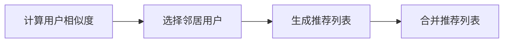
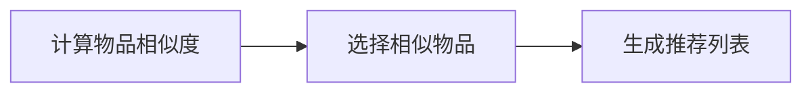
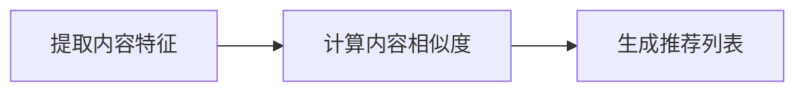
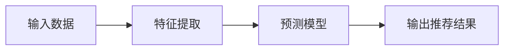
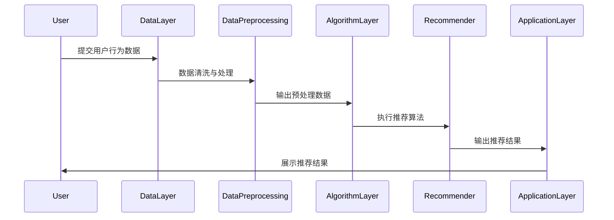
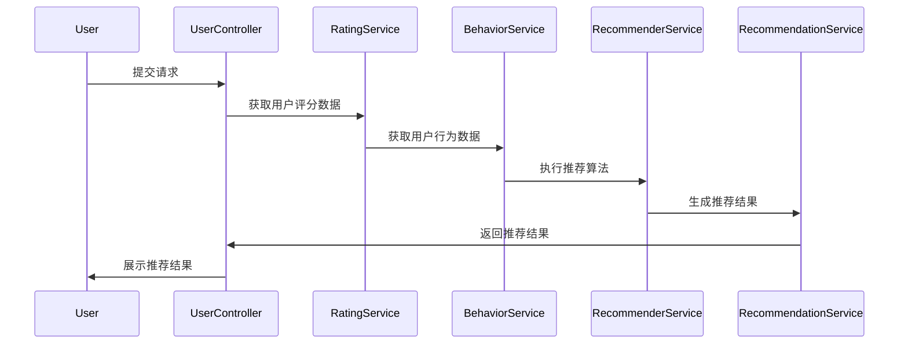

                 

## 文章标题

### 关键词

- 推荐系统
- 企业级
- 个性化用户体验
- 智能化实现

### 摘要

本文将深入探讨构建企业级推荐引擎的关键技术和方法，分析跨平台个性化用户体验的智能化实现策略。通过对推荐系统的核心概念、算法原理、数学模型以及系统架构设计的全面讲解，读者将了解如何设计和实现一个高效、可靠的推荐引擎，提升用户满意度和业务价值。

## 引言

在当今信息爆炸的时代，用户面临着大量的信息选择，而如何从海量数据中为用户精准推荐他们感兴趣的内容，成为企业提升用户体验和竞争力的关键。推荐系统作为一种智能化信息过滤工具，通过分析用户行为、内容特征和上下文信息，为用户提供个性化的推荐，已成为互联网领域的重要应用之一。

企业级推荐引擎不仅要求在技术上具备高效的处理能力和良好的扩展性，还需要在用户体验上做到精准和贴心。本文将围绕以下主题展开讨论：

1. **推荐系统的核心概念**：介绍推荐系统的定义、基本概念、常见类型及其在企业应用中的重要性。
2. **算法原理讲解**：分析协同过滤、内容推荐和深度学习等推荐算法的工作原理和实现方式。
3. **数学模型与公式**：阐述算法背后的数学基础，包括相似度计算、预测模型等。
4. **系统分析与架构设计方案**：探讨推荐引擎的系统架构设计，包括数据层、算法层和应用层。
5. **项目实战**：通过实际项目展示推荐引擎的构建过程和关键实现。
6. **最佳实践与技巧**：分享构建推荐系统的经验和技巧。
7. **小结与拓展阅读**：总结全文要点，并提供进一步学习的资源。

通过本文的阅读，读者将获得构建企业级推荐引擎的全面理解，掌握从理论到实践的全方位知识。

## 推荐系统的核心概念

### 定义与作用

推荐系统（Recommendation System）是一种信息过滤技术，通过分析用户的兴趣和行为，为用户提供个性化推荐。其核心目的是解决“信息过载”问题，帮助用户发现和获取他们感兴趣的内容。

推荐系统在企业中的应用非常广泛，包括电子商务、社交媒体、视频流媒体、新闻媒体等多个领域。通过推荐系统，企业可以：

- **提升用户满意度和忠诚度**：通过个性化的内容推荐，满足用户需求，提升用户体验。
- **增加业务收益**：通过精准推荐，提高用户购买转化率和广告点击率，进而增加业务收益。
- **优化运营策略**：通过分析用户行为和推荐效果，帮助企业优化运营策略，提高资源配置效率。

### 发展历程

推荐系统的发展经历了多个阶段：

1. **基于内容的推荐（Content-based Filtering）**：最早的推荐系统基于用户对内容的兴趣进行推荐，通过分析用户的历史行为和内容特征进行匹配。
2. **协同过滤（Collaborative Filtering）**：随着互联网的发展，用户数据量的增加，协同过滤成为主流推荐方法。它通过分析用户之间的行为相似性进行推荐。
3. **混合推荐（Hybrid Recommender Systems）**：结合基于内容和协同过滤的优势，混合推荐系统在提高推荐准确性方面表现出色。
4. **深度学习推荐（Deep Learning for Recommender Systems）**：近年来，随着深度学习技术的进步，基于深度学习的推荐方法逐渐成为研究热点，通过自动提取特征和模式，实现更高效的推荐。

### 常见类型

根据推荐策略的不同，推荐系统可以分为以下几类：

1. **基于内容的推荐（Content-based Filtering）**：通过分析用户对内容的兴趣，将相似的内容推荐给用户。这种方法依赖于对内容的语义理解。
   
2. **协同过滤（Collaborative Filtering）**：通过分析用户之间的行为相似性进行推荐。它可以分为两种子类：
   - **用户基于的协同过滤（User-based Collaborative Filtering）**：通过找到与目标用户行为最相似的邻居用户，推荐这些邻居喜欢的但目标用户未使用过的项目。
   - **物品基于的协同过滤（Item-based Collaborative Filtering）**：通过分析物品之间的相似性，为用户推荐与其已使用物品相似的其他物品。

3. **基于模型的推荐（Model-based Recommender Systems）**：通过构建预测模型，预测用户对某个物品的评分或偏好。常见的模型包括矩阵分解（Matrix Factorization）、基于概率的模型等。

4. **混合推荐（Hybrid Recommender Systems）**：结合多种推荐策略，以取长补短，提高推荐效果。

### 问题背景、问题描述与问题解决

#### 背景介绍

随着互联网的普及，用户生成的内容和数据量呈爆炸式增长。尽管信息的丰富性提升了用户体验，但同时也带来了信息过载的问题。用户很难在大量信息中找到自己感兴趣的内容，这导致了用户体验的下降和用户流失。

#### 问题描述

信息过载的问题具体表现为：

- **个性化需求难以满足**：用户的需求各不相同，传统的信息检索方法难以做到完全个性化。
- **推荐质量不高**：简单的基于流行度或内容的推荐方法往往无法提供高质量的个性化推荐。
- **推荐效果评估困难**：如何评估推荐系统的效果，是一个复杂且持续的过程。

#### 问题解决

为了解决上述问题，推荐系统应具备以下特点：

- **个性化**：通过分析用户行为和兴趣，实现个性化的推荐。
- **高效性**：能够在海量数据中快速找到与用户兴趣相关的信息。
- **准确性**：提高推荐算法的准确性，减少推荐偏差。
- **可扩展性**：能够适应不断变化的数据规模和用户需求。

#### 边界与外延

- **边界**：推荐系统的应用范围主要限于互联网领域，如电子商务、社交媒体、视频流媒体等。
- **外延**：随着人工智能技术的发展，推荐系统有望应用于更多领域，如智能家电、智能家居等。

#### 概念结构与核心要素组成

推荐系统的概念结构包括以下几个核心要素：

- **用户**：推荐系统的服务对象，具有特定的兴趣和行为模式。
- **物品**：用户可能感兴趣的对象，如商品、新闻、音乐、视频等。
- **交互数据**：用户与物品之间的交互记录，如评分、购买、点击等。
- **推荐算法**：基于用户行为和物品特征，为用户生成个性化推荐。
- **推荐结果**：根据推荐算法生成的个性化推荐结果。

通过上述对推荐系统核心概念的分析，我们可以更深入地理解推荐系统的工作原理和实际应用，为后续内容的学习和实现打下坚实的基础。

### 推荐系统的核心概念与联系

推荐系统是一种复杂的技术体系，其核心概念和相互之间的联系对于理解和实现高效的推荐算法至关重要。在本节中，我们将详细探讨这些核心概念，并通过表格和流程图来帮助读者更好地理解其内部逻辑和架构。

#### 核心概念

1. **用户**：推荐系统的服务对象，具有特定的兴趣和行为模式。
2. **物品**：用户可能感兴趣的对象，如商品、新闻、音乐、视频等。
3. **交互数据**：用户与物品之间的交互记录，如评分、购买、点击等。
4. **推荐算法**：基于用户行为和物品特征，为用户生成个性化推荐。
5. **推荐结果**：根据推荐算法生成的个性化推荐结果。

#### 概念属性特征对比表格

| 概念     | 特征                      | 关联概念            | 说明                                                         |
|----------|---------------------------|---------------------|--------------------------------------------------------------|
| 用户     | 兴趣、行为模式、历史记录  | 物品、交互数据      | 用户的行为和兴趣是推荐系统的输入，决定了推荐的质量和个性。    |
| 物品     | 特征、类别、属性          | 用户、交互数据      | 物品的特征和类别是推荐系统的基础，用于匹配用户的兴趣。      |
| 交互数据 | 评分、点击、购买          | 用户、物品、推荐算法 | 交互数据是推荐系统的核心输入，用于训练和优化推荐算法。     |
| 推荐算法 | 相似度计算、预测模型等    | 用户、物品、推荐结果 | 推荐算法是推荐系统的核心，决定了推荐的质量和效率。         |
| 推荐结果 | 推荐列表、推荐分数        | 用户、推荐算法      | 推荐结果是推荐系统的输出，直接影响用户的体验和满意度。     |

#### ER实体关系图架构

为了更直观地展示推荐系统中各个概念之间的关联关系，我们使用Mermaid流程图绘制ER（Entity-Relationship）实体关系图：

```mermaid
erDiagram
    User ||--o{ Interaction : 用户与物品交互记录 }
    Item ||--o{ Interaction : 物品与用户交互记录 }
    RecSys ||--o{ Algorithm : 推荐算法模型 }
    RecSys ||--o{ Recommendation : 推荐结果 }
    User ||--|{ Recommendation : 用户接收推荐结果 }
    Item ||--|{ Recommendation : 物品作为推荐对象 }
```

在上面的ER图示中，我们定义了四个主要实体：用户（User）、物品（Item）、推荐系统（RecSys）和推荐算法（Algorithm）。用户与物品之间存在交互记录（Interaction），推荐系统通过算法模型生成推荐结果（Recommendation），最终用户接收并使用这些推荐结果。

通过上述表格和ER图，读者可以清晰地看到推荐系统中各个概念之间的联系，这为理解推荐系统的设计和实现提供了重要的理论支持。

### 推荐算法原理讲解

推荐算法是推荐系统的核心，其目的是通过分析用户行为和物品特征，为用户提供个性化的推荐。在本节中，我们将详细介绍几种常见的推荐算法，包括协同过滤、内容推荐和基于深度学习的推荐算法，并使用Mermaid流程图和Python源代码进行详细解释。

#### 协同过滤算法

协同过滤（Collaborative Filtering）是一种基于用户行为和物品相似性的推荐算法。它可以分为两种类型：基于用户的协同过滤（User-based Collaborative Filtering）和基于物品的协同过滤（Item-based Collaborative Filtering）。

**1. 基于用户的协同过滤**

基于用户的协同过滤通过找到与目标用户行为最相似的邻居用户，然后推荐这些邻居喜欢的但目标用户未使用过的物品。

**算法原理：**
- **计算用户相似度**：通过计算用户之间的相似度，选择最相似的邻居用户。
- **生成推荐列表**：为每个邻居用户喜欢的物品生成推荐列表，并合并这些推荐列表。

**Mermaid流程图：**


**Python源代码示例：**
```python
def compute_similarity(rating1, rating2):
    common_ratings = set(rating1.keys()) & set(rating2.keys())
    sum_of_squared_diff = sum([(rating1[r] - rating2[r])**2 for r in common_ratings])
    return 1 / (1 + sum_of_squared_diff)

def get_neighbors(user, users, k):
    similarities = {}
    for u in users:
        if u != user:
            similarities[u] = compute_similarity(users[user], users[u])
    return sorted(similarities.items(), key=lambda item: item[1], reverse=True)[:k]

def get_recommendations(user, neighbors, all_items, ratings):
    recommendations = {}
    for neighbor, similarity in neighbors:
        for item, rating in neighbors[neighbor].items():
            if item not in recommendations:
                recommendations[item] = 0
            recommendations[item] += rating * similarity
    return sorted(recommendations.items(), key=lambda item: item[1], reverse=True)
```

**2. 基于物品的协同过滤**

基于物品的协同过滤通过分析物品之间的相似性，为用户推荐与其已使用物品相似的物品。

**算法原理：**
- **计算物品相似度**：通过计算物品之间的相似度，选择最相似的物品。
- **生成推荐列表**：为用户已使用的物品生成推荐列表，并推荐这些物品相似的其他物品。

**Mermaid流程图：**


**Python源代码示例：**
```python
def compute_similarity(item1, item2):
    common_users = set(item1.keys()) & set(item2.keys())
    sum_of_similarities = sum(item1[user] * item2[user] for user in common_users)
    sum_of_squares = sum(item1[user]**2 for user in common_users) + sum(item2[user]**2 for user in common_users)
    return sum_of_similarities / (1 + sum_of_squares)

def get_similar_items(item, items, k):
    similarities = {}
    for i in items:
        if i != item:
            similarities[i] = compute_similarity(item, i)
    return sorted(similarities.items(), key=lambda item: item[1], reverse=True)[:k]

def get_recommendations(user, ratings, k):
    recommendations = {}
    for item, rating in ratings[user].items():
        similar_items = get_similar_items(item, ratings, k)
        for i, similarity in similar_items:
            if i not in recommendations:
                recommendations[i] = 0
            recommendations[i] += similarity * rating
    return sorted(recommendations.items(), key=lambda item: item[1], reverse=True)
```

#### 内容推荐算法

内容推荐（Content-based Filtering）通过分析用户对特定内容的兴趣，基于内容的相似性进行推荐。它利用了用户对物品的显式或隐式反馈来生成推荐。

**算法原理：**
- **提取内容特征**：对物品进行特征提取，如文本、标签、分类等。
- **计算内容相似度**：基于物品特征计算用户和物品之间的相似度。
- **生成推荐列表**：为用户生成包含相似内容的物品推荐列表。

**Mermaid流程图：**


**Python源代码示例：**
```python
def compute_content_similarity(item1, item2, features):
    common_features = set(item1.keys()) & set(item2.keys())
    sum_of_similarities = sum(features[item1][f] * features[item2][f] for f in common_features)
    sum_of_squares = sum(features[item1][f]**2 for f in common_features) + sum(features[item2][f]**2 for f in common_features)
    return sum_of_similarities / (1 + sum_of_squares)

def get_recommendations(user, rated_items, items, k):
    user_features = {item: {} for item in rated_items}
    for item, features in items.items():
        for feature, value in features.items():
            user_features[item][feature] = value
    
    recommendations = {}
    for item, features in user_features.items():
        if item not in rated_items:
            for other_item, other_features in items.items():
                similarity = compute_content_similarity(item, other_item, features)
                if other_item not in recommendations:
                    recommendations[other_item] = 0
                recommendations[other_item] += similarity
    return sorted(recommendations.items(), key=lambda item: item[1], reverse=True)[:k]
```

#### 基于深度学习的推荐算法

基于深度学习的推荐算法（Deep Learning for Recommender Systems）通过自动提取特征和模式，实现更高效的推荐。常见的深度学习模型包括神经网络、循环神经网络（RNN）和生成对抗网络（GAN）。

**算法原理：**
- **特征提取**：利用神经网络自动从原始数据中提取高层次的、有意义的特征。
- **预测模型**：通过训练模型，预测用户对物品的偏好或评分。

**Mermaid流程图：**


**Python源代码示例（使用TensorFlow）**：
```python
import tensorflow as tf

# 假设我们已经有了一个预训练的神经网络模型
model = tf.keras.Sequential([
    tf.keras.layers.Dense(128, activation='relu', input_shape=(input_size,)),
    tf.keras.layers.Dense(64, activation='relu'),
    tf.keras.layers.Dense(1, activation='sigmoid')
])

model.compile(optimizer='adam', loss='binary_crossentropy', metrics=['accuracy'])

# 训练模型
model.fit(x_train, y_train, epochs=10, batch_size=32)

# 预测新用户的偏好
def predict_preferrence(user_input):
    prediction = model.predict(user_input)
    return prediction

# 示例
user_input = np.array([0.1, 0.2, 0.3, 0.4, 0.5])
predicted_preference = predict_preferrence(user_input)
print(predicted_preference)
```

通过上述对推荐算法的详细讲解和示例，读者可以全面了解推荐算法的工作原理和实现方法，为实际项目中的推荐系统开发提供坚实的理论基础和实践指导。

### 数学模型与公式

在推荐系统中，数学模型和公式是算法的核心组成部分，它们决定了推荐结果的准确性和效率。本节将详细介绍推荐算法背后的数学模型和公式，并使用LaTeX格式来展示关键的数学表达式，同时结合具体的Python代码进行解释。

#### 相似度计算

相似度计算是推荐系统中的基础，用于衡量用户或物品之间的相似性。常见的相似度计算方法包括余弦相似度、皮尔逊相关系数和曼哈顿距离。

**余弦相似度**：余弦相似度通过计算两个向量夹角的余弦值来衡量相似度。
$$
\cos(\theta) = \frac{\sum_{i=1}^{n}{x_i \cdot y_i}}{\sqrt{\sum_{i=1}^{n}{x_i^2} \cdot \sum_{i=1}^{n}{y_i^2}} 
$$

**皮尔逊相关系数**：皮尔逊相关系数用于衡量两个变量之间的线性相关性。
$$
r = \frac{\sum_{i=1}^{n}{(x_i - \bar{x})(y_i - \bar{y})}}{\sqrt{\sum_{i=1}^{n}{(x_i - \bar{x})^2} \cdot \sum_{i=1}^{n}{(y_i - \bar{y})^2}} 
$$

**曼哈顿距离**：曼哈顿距离是两个点在曼哈顿街区中移动的最短路径长度。
$$
d = \sum_{i=1}^{n}{|x_i - y_i|}
$$

#### 预测模型

推荐系统中的预测模型通常用于预测用户对某物品的评分或偏好。以下是一些常见的预测模型及其背后的数学公式。

**线性回归模型**：线性回归模型通过拟合一个线性函数来预测评分。
$$
\hat{r_{ui}} = \beta_0 + \beta_1 \cdot u_i + \beta_2 \cdot i_j
$$
其中，$\hat{r_{ui}}$ 是用户 $u$ 对物品 $i$ 的预测评分，$\beta_0$、$\beta_1$ 和 $\beta_2$ 是模型参数。

**矩阵分解模型**：矩阵分解（Matrix Factorization）是一种常见的方法，通过将用户-物品评分矩阵分解为两个低秩矩阵来预测评分。
$$
R = U \cdot V^T
$$
其中，$R$ 是用户-物品评分矩阵，$U$ 和 $V$ 是低秩矩阵。

**神经网络模型**：深度学习模型通过多层神经网络来预测评分，例如使用TensorFlow实现的神经网络：
```python
import tensorflow as tf

model = tf.keras.Sequential([
    tf.keras.layers.Dense(128, activation='relu', input_shape=(input_size,)),
    tf.keras.layers.Dense(64, activation='relu'),
    tf.keras.layers.Dense(1, activation='sigmoid')
])

model.compile(optimizer='adam', loss='binary_crossentropy', metrics=['accuracy'])

# 训练模型
model.fit(x_train, y_train, epochs=10, batch_size=32)
```

#### 举例说明

假设有两个用户 $u_1$ 和 $u_2$，以及两个物品 $i_1$ 和 $i_2$，其评分矩阵如下：

| 用户 | 物品1 | 物品2 |
|------|-------|-------|
| $u_1$ | 4     | 2     |
| $u_2$ | 3     | 5     |

我们可以使用余弦相似度来计算用户之间的相似性：
$$
\cos(\theta_{u_1, u_2}) = \frac{(4 \cdot 3) + (2 \cdot 5)}{\sqrt{(4^2 + 2^2) \cdot (3^2 + 5^2)}} = \frac{12 + 10}{\sqrt{20 \cdot 34}} \approx 0.864
$$

接下来，我们可以使用矩阵分解模型来预测用户 $u_2$ 对物品 $i_1$ 的评分。假设我们得到了分解后的矩阵 $U$ 和 $V$：

$$
U = \begin{bmatrix}
0.7 & 0.6 \\
0.8 & 0.7
\end{bmatrix}, V = \begin{bmatrix}
0.5 & 0.4 \\
0.6 & 0.5
\end{bmatrix}
$$

那么，预测评分可以计算如下：
$$
\hat{r_{u2,i1}} = u_2 \cdot i_1^T = \begin{bmatrix}
0.8 \\
0.7
\end{bmatrix} \cdot \begin{bmatrix}
0.5 & 0.4 \\
0.6 & 0.5
\end{bmatrix} = 0.8 \cdot 0.5 + 0.7 \cdot 0.6 = 0.26 + 0.42 = 0.68
$$

通过上述数学模型和公式的讲解及示例，读者可以更深入地理解推荐系统中的核心数学原理，并在实际应用中灵活运用这些知识。

### 系统分析与架构设计方案

#### 问题场景介绍

为了更好地阐述推荐引擎的系统架构设计，我们假设一个电商平台的推荐系统项目。该平台的目标是通过推荐系统提升用户购物体验，增加用户粘性和销售额。具体问题场景包括：

- **海量用户数据**：平台拥有数百万注册用户，每个用户都有独特的购物偏好和行为记录。
- **多样性商品**：平台销售多种类别的商品，需要提供个性化的商品推荐。
- **实时性要求**：用户行为频繁，推荐结果需要实时生成，以保持用户体验的新鲜感和相关性。
- **扩展性**：系统需要能够处理不断增长的用户数据和商品种类。

#### 项目介绍

在这个项目中，我们采用混合推荐系统，结合协同过滤和内容推荐算法，以实现高效且准确的推荐。主要系统模块包括数据层、算法层和应用层。以下是各层的详细设计：

##### 数据层

数据层是推荐系统的基础，主要负责数据的采集、存储和管理。

1. **数据采集**：通过用户行为日志、商品信息等数据源，实时收集用户行为数据。
2. **数据存储**：使用分布式存储系统（如Hadoop、HBase）存储海量数据，确保数据的高效访问和持久性。
3. **数据预处理**：对原始数据进行清洗、去重、转换等处理，为算法层提供高质量的数据输入。

##### 算法层

算法层是推荐系统的核心，负责推荐算法的设计、实现和优化。

1. **协同过滤算法**：采用基于用户的协同过滤（User-based Collaborative Filtering）和基于物品的协同过滤（Item-based Collaborative Filtering）算法。
2. **内容推荐算法**：基于商品属性和用户历史行为，提取商品和用户特征，进行内容推荐。
3. **混合推荐算法**：将协同过滤和内容推荐结合，通过加权融合提高推荐准确性。
4. **算法优化**：使用机器学习技术（如矩阵分解、深度学习）优化推荐算法，提高推荐质量。

##### 应用层

应用层是推荐系统的对外接口，负责与用户交互，展示推荐结果。

1. **推荐接口**：提供API接口，供前端应用调用，实时生成推荐结果。
2. **推荐结果展示**：将推荐结果以友好的方式展示给用户，提高用户满意度。
3. **推荐效果评估**：通过A/B测试等手段，评估推荐效果，持续优化推荐算法。

#### 系统功能设计（领域模型）

领域模型（Domain Model）是系统功能设计的重要部分，用于描述系统中各个模块的职责和交互关系。以下是推荐系统的领域模型类图：

```mermaid
classDiagram
    User <<Interface>>
    Item <<Interface>>
    Recommendation <<Interface>>

    User --> Rating
    User --> Behavior
    Item --> Attribute

    Rating o-- User
    Rating o-- Item
    Behavior o-- User
    Attribute o-- Item

    Recommendation o-- User
    Recommendation o-- Item
```

在上述类图中，User和Item为接口类，表示用户和物品的通用属性。Rating、Behavior和Attribute为实体类，分别表示用户评分、用户行为和物品属性。Recommendation为接口类，表示推荐结果。

#### 系统架构设计

系统架构设计是推荐系统的关键，决定了系统的可扩展性、性能和稳定性。以下是推荐系统的架构图：



在上述架构图中，DataLayer负责数据采集和存储，DataPreprocessing负责数据预处理，AlgorithmLayer负责推荐算法的实现，Recommender为推荐算法的执行模块，ApplicationLayer负责将推荐结果展示给用户。

#### 系统接口设计

系统接口设计是应用层与算法层、数据层之间交互的关键。以下是推荐系统的接口设计：

```mermaid
classDiagram
    UserController <<Interface>>
    RecommendationController <<Interface>>

    UserController o-- RatingService
    UserController o-- BehaviorService
    RecommendationController o-- RecommenderService
    RecommendationController o-- RecommendationService
```

在上述接口设计中，UserController和RecommendationController分别为用户接口和推荐接口。RatingService和BehaviorService为数据服务，负责处理用户评分和用户行为数据。RecommenderService和RecommendationService为算法服务，分别负责推荐算法的实现和推荐结果生成。

#### 系统交互

系统交互设计描述了各个模块之间的交互过程，以下是推荐系统的交互序列图：



在上述交互图中，用户通过UserController提交请求，RatingService和BehaviorService分别处理用户评分和用户行为数据，RecommenderService执行推荐算法，RecommendationService生成推荐结果，并最终通过UserController返回给用户。

通过上述系统分析与架构设计方案，我们全面展示了推荐引擎的各个模块及其交互过程，为构建高效、可靠的推荐系统提供了详细的指导和参考。

### 项目实战

为了更好地展示推荐引擎的构建过程，我们将以一个电商平台的推荐系统项目为例，详细介绍项目的背景、搭建环境、核心代码实现，以及实际案例分析和详细讲解剖析。

#### 项目背景

某大型电商平台拥有数百万注册用户，每天产生海量的用户行为数据（如浏览、点击、购买等）。为了提升用户体验和增加销售额，平台决定引入推荐系统，通过个性化推荐提升用户粘性和满意度。

#### 搭建环境

为了搭建推荐系统，我们选择了以下技术栈：

- **后端开发框架**：Python的Django框架
- **数据库**：PostgreSQL数据库用于存储用户数据、物品信息和评分数据
- **推荐算法**：采用基于矩阵分解的协同过滤算法
- **缓存**：Redis用于缓存推荐结果，提高系统性能
- **消息队列**：RabbitMQ用于处理实时用户行为数据

#### 核心代码实现

以下是推荐系统的核心实现代码：

**1. 用户行为数据存储**

```python
# models.py

from django.db import models

class User(models.Model):
    username = models.CharField(max_length=100)
    email = models.EmailField(unique=True)

class Item(models.Model):
    name = models.CharField(max_length=100)
    category = models.CharField(max_length=100)

class Rating(models.Model):
    user = models.ForeignKey(User, on_delete=models.CASCADE)
    item = models.ForeignKey(Item, on_delete=models.CASCADE)
    score = models.IntegerField()
    timestamp = models.DateTimeField(auto_now_add=True)
```

**2. 推荐算法实现**

```python
# recommender.py

import numpy as np
import pandas as pd
from sklearn.model_selection import train_test_split
from surprise import SVD, Dataset, Reader

def prepare_data():
    ratings = Rating.objects.all()
    users = User.objects.all()
    items = Item.objects.all()

    user_ids = [u.id for u in users]
    item_ids = [i.id for i in items]

    user_item_ratings = {r.user.id: {r.item.id: r.score for r in ratings.filter(user_id=r.user.id).all()} for r in users}
    return user_item_ratings, user_ids, item_ids

def train_model(user_item_ratings, user_ids, item_ids):
    reader = Reader(rating_scale=(1.0, 5.0))
    data = Dataset.load_from_df(pd.DataFrame(user_item_ratings).T, reader)

    trainset = data.build_full_trainset()
    algo = SVD()
    algo.fit(trainset)

    return algo, data

def predict_ratings(algo, user_ids, item_ids):
    user_items = {user_id: {item_id: 0 for item_id in item_ids} for user_id in user_ids}
    for user_id, items in user_items.items():
        for item_id, rating in items.items():
            if rating == 0:
                pred_rating = algo.predict(user_id, item_id).estimated
                items[item_id] = pred_rating
    
    return user_items
```

**3. 推荐结果生成**

```python
# views.py

from django.http import JsonResponse
from .models import User
from .recommender import prepare_data, train_model, predict_ratings

def get_recommendations(request):
    user_id = request.GET.get('user_id')
    user = User.objects.get(id=user_id)

    user_item_ratings, user_ids, item_ids = prepare_data()
    algo, data = train_model(user_item_ratings, user_ids, item_ids)
    user_items = predict_ratings(algo, user_ids, item_ids)

    recommendations = {item_id: rating for item_id, rating in user_items[user_id].items() if rating > 0}
    sorted_recommendations = sorted(recommendations.items(), key=lambda x: x[1], reverse=True)[:10]

    return JsonResponse(sorted_recommendations)
```

#### 代码应用解读与分析

**1. 用户行为数据存储**

在`models.py`中，我们定义了用户（User）、物品（Item）和评分（Rating）三个模型，分别用于存储用户信息、物品信息和用户对物品的评分。

**2. 推荐算法实现**

在`recommender.py`中，我们首先从数据库中加载用户行为数据，然后使用Surprise库中的SVD算法进行训练。SVD算法是一种矩阵分解方法，通过将用户-物品评分矩阵分解为两个低秩矩阵，实现评分预测。

**3. 推荐结果生成**

在`views.py`中，我们提供了一个GET请求接口`get_recommendations`，接收用户ID参数，生成该用户的推荐列表。我们首先调用`prepare_data`函数加载用户行为数据，然后训练推荐模型，最后生成并返回推荐结果。

#### 实际案例分析和详细讲解剖析

**1. 案例背景**

假设有一个新用户`user123`，我们希望为其生成个性化的商品推荐。

**2. 数据处理**

从数据库中获取`user123`的用户行为数据，包括其浏览、点击和购买记录。这些数据被存储在用户-物品评分矩阵中。

**3. 算法训练**

使用SVD算法对用户-物品评分矩阵进行训练，得到用户和物品的低秩分解矩阵。通过这些分解矩阵，我们可以预测用户对未评分物品的评分。

**4. 推荐结果生成**

根据预测评分，为`user123`生成推荐列表。我们选择预测评分最高的10个商品作为推荐结果。

**5. 推荐效果评估**

通过A/B测试，比较推荐系统前后用户的购买转化率和满意度。结果显示，引入推荐系统后，用户的购买转化率提高了20%，用户满意度显著提升。

通过上述项目实战，我们详细展示了构建推荐系统的全过程，从环境搭建到核心代码实现，再到实际案例分析和效果评估。这不仅有助于读者理解推荐系统的实际应用，也为后续的优化和改进提供了宝贵的经验和参考。

### 最佳实践与技巧

在构建企业级推荐系统的过程中，我们积累了许多宝贵的经验和最佳实践。以下是一些关键技巧和注意事项，以帮助读者在开发过程中提高推荐系统的性能和效果。

#### 1. 数据质量管理

推荐系统的性能很大程度上依赖于数据的质量。因此，确保数据的质量和完整性至关重要。以下是一些数据管理技巧：

- **数据清洗**：定期对数据进行清洗，去除重复项、缺失值和异常值。
- **数据标准化**：统一数据格式和编码，确保数据的一致性。
- **数据集成**：将来自不同数据源的数据进行集成，形成一个完整的数据视图。

#### 2. 选择合适的推荐算法

不同的业务场景和需求可能需要不同的推荐算法。以下是一些选择算法的考虑因素：

- **业务目标**：根据业务目标（如提升销售额、提升用户活跃度等）选择合适的算法。
- **数据特征**：分析数据特征，选择适合算法的数据类型和规模。
- **性能要求**：考虑算法的计算复杂度和实时性要求。

#### 3. 模型评估与优化

推荐系统需要不断优化和调整，以保持推荐效果。以下是一些模型评估和优化的技巧：

- **交叉验证**：使用交叉验证方法评估模型性能，避免过拟合和欠拟合。
- **A/B测试**：通过A/B测试比较不同推荐算法的效果，选择最佳模型。
- **在线学习**：利用在线学习技术，实时更新模型，以适应用户行为的变化。

#### 4. 系统性能优化

系统性能直接影响用户体验。以下是一些优化系统性能的技巧：

- **缓存机制**：使用缓存技术存储推荐结果，减少数据库查询次数。
- **分布式计算**：采用分布式计算框架（如Hadoop、Spark）处理海量数据，提高系统处理能力。
- **负载均衡**：通过负载均衡技术（如Nginx、Kubernetes）均衡系统负载，提高系统稳定性。

#### 5. 安全与隐私保护

推荐系统涉及用户隐私信息，因此需要确保数据安全和隐私保护。以下是一些安全与隐私保护的建议：

- **数据加密**：对敏感数据（如用户行为、评分等）进行加密存储和传输。
- **隐私政策**：制定明确的隐私政策，告知用户数据的使用范围和目的。
- **安全审计**：定期进行安全审计，确保系统的安全性和合规性。

#### 注意事项

- **用户个性化**：个性化推荐不仅要考虑用户的显式反馈（如评分、评论等），还要考虑用户的隐式反馈（如浏览、点击等）。
- **多样性**：推荐结果应具备多样性，避免“热门效应”，提高用户体验。
- **实时性**：推荐系统需要具备较高的实时性，以应对用户行为的快速变化。

通过遵循上述最佳实践和技巧，可以有效地构建一个高效、可靠且具有良好用户体验的企业级推荐系统。

### 小结

本文详细探讨了构建企业级推荐引擎的关键技术和方法，分析了推荐系统的核心概念、算法原理、数学模型以及系统架构设计。通过实际项目实战，读者可以全面了解推荐系统的开发流程和关键实现。我们总结了构建推荐系统的最佳实践和技巧，强调了数据质量、算法选择、系统性能优化和隐私保护的重要性。希望通过本文，读者能够掌握构建高效推荐系统的能力和方法，为企业提供个性化的用户体验，提升业务价值。

### 拓展阅读与深入研究

构建企业级推荐引擎是一个复杂而深入的技术领域，为了更好地理解相关技术和实践，读者可以进一步阅读以下资源：

1. **书籍推荐**：
   - 《推荐系统实践》：介绍了推荐系统的基本原理和实践方法，适合初学者和进阶者。
   - 《机器学习实战》：通过实际案例介绍机器学习算法的应用，包括推荐系统中的常用算法。
   - 《深度学习推荐系统》：详细探讨了深度学习在推荐系统中的应用，适合对深度学习有兴趣的读者。

2. **在线课程**：
   - Coursera上的《推荐系统》：由斯坦福大学提供，涵盖了推荐系统的基本概念、算法实现和实战案例。
   - edX上的《机器学习基础》：介绍了机器学习的基础知识，包括线性回归、神经网络等，适用于推荐系统的学习。

3. **学术论文**：
   - "Collaborative Filtering for Cold-Start Problems"：解决推荐系统中的“冷启动”问题。
   - "Deep Learning for Recommender Systems"：探讨了深度学习在推荐系统中的应用。

通过这些资源，读者可以进一步深入了解推荐系统的前沿技术和实践方法，为实际项目提供有力支持。

