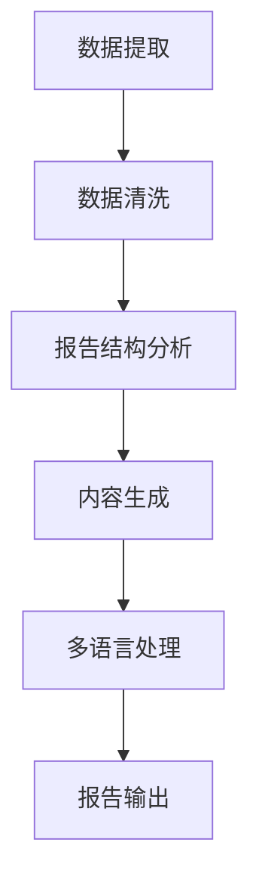
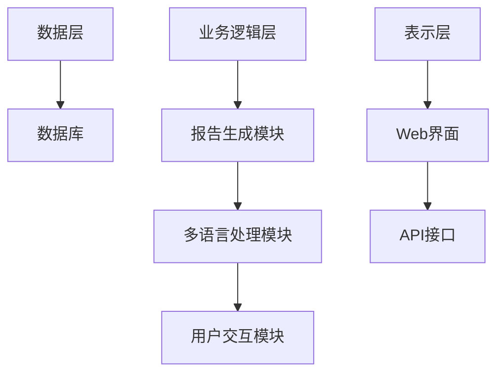
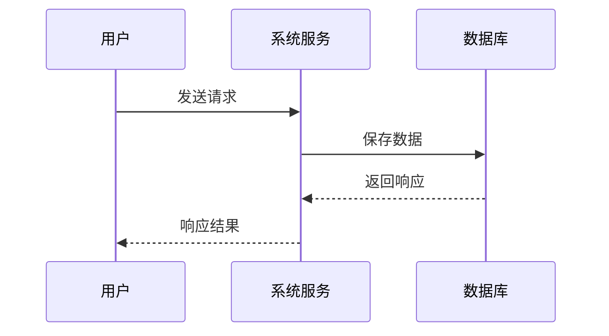
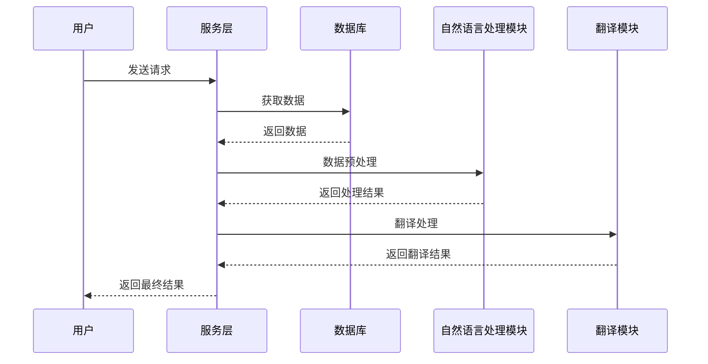

                 

### 第一部分：背景介绍

#### 第1章：问题背景

##### 1.1.1 问题背景描述

在企业运营中，报告生成是一个不可或缺的环节。传统的报告生成方式通常依赖于人工撰写，这不仅耗费大量时间和人力资源，还容易出现错误。尤其在财务报告中，数据的准确性和一致性至关重要。随着企业国际化进程的加快，多语言报告的需求日益增长，这使得报告生成过程变得更加复杂和繁琐。

目前，企业报告生成过程中面临的挑战主要包括以下几点：

1. **人工成本高**：撰写报告需要大量的人力投入，尤其是对于复杂且大量的财务数据，人工处理效率低下。
2. **易出错**：人工撰写报告容易因为疲劳、粗心等原因导致错误，影响报告的准确性和可靠性。
3. **多语言处理复杂**：企业往往需要制作多种语言的财务报告，不同语言之间的差异使得多语言报告的生成变得复杂。
4. **数据一致性问题**：财务报告的数据需要从多个来源汇总，数据一致性问题常常导致报告中的错误。

##### 1.1.2 问题描述

1. **报告生成的复杂性**：企业需要根据不同的报告类型和需求，生成结构各异的报告。报告内容通常涉及大量的数据分析和处理，这使得报告生成过程变得复杂。
2. **数据处理和语言理解的难点**：财务报告涉及大量的专业术语和特定的表达方式，自然语言处理技术需要能够准确理解和生成这些内容。
3. **多语言报告的一致性和准确性**：不同语言的财务报告需要保持一致性和准确性，这要求系统具备强大的多语言处理能力。

##### 1.1.3 问题解决思路

为了解决上述问题，我们可以采用自然语言生成技术，构建一个企业级自然语言生成报告系统。该系统应具备以下功能：

1. **自动化报告生成**：系统能够自动收集、分析和生成报告，减少人工干预，提高生成效率。
2. **多语言支持**：系统能够处理多种语言，生成不同语言的财务报告，确保报告的一致性和准确性。
3. **数据一致性保障**：系统通过统一的数据处理流程，确保报告中的数据一致性和准确性。

##### 1.1.4 边界与外延

1. **报告内容范围**：报告内容应涵盖财务报告的主要部分，如资产负债表、利润表、现金流量表等。
2. **多语言支持**：系统应支持常见的商业语言，如英语、法语、德语、西班牙语等。
3. **企业级系统架构**：系统应具备高可用性、可扩展性和安全性，能够适应企业不同规模和复杂度的需求。

##### 1.1.5 概念结构与核心要素

1. **自然语言处理（NLP）**：NLP是使计算机能够理解、解释和生成人类语言的技术，是报告生成系统的核心。
2. **报告生成技术**：包括报告结构分析和内容生成算法，负责将数据转化为结构化的报告。
3. **多语言处理**：涉及语言模型和翻译模型，确保系统能够生成符合特定语言习惯的报告。
4. **企业级系统架构**：包括系统设计原则、组件划分和接口设计，确保系统能够高效运行和管理。

### 第二部分：核心概念与联系

#### 第2章：核心概念与联系

##### 2.1.1 核心概念介绍

1. **自然语言处理（NLP）**：自然语言处理是使计算机能够理解、解释和生成人类语言的技术。NLP技术包括语言理解（LU）、语言生成（LG）、语言翻译等。

2. **报告生成技术**：报告生成技术涉及报告结构分析和内容生成算法。报告结构分析负责将数据转化为结构化的报告模板，内容生成算法则负责填充报告内容，生成完整的报告。

3. **多语言处理**：多语言处理包括语言模型和翻译模型。语言模型负责生成符合特定语言习惯的文本，翻译模型则负责将一种语言的文本翻译为另一种语言。

4. **企业级系统架构**：企业级系统架构涉及系统设计原则、组件划分和接口设计。系统设计原则包括高可用性、可扩展性和安全性。组件划分和接口设计则确保系统能够高效运行和管理。

##### 2.1.2 概念属性特征对比

| 概念       | 定义                                                         | 属性特征对比                                                         |
|------------|--------------------------------------------------------------|-------------------------------------------------------------------|
| 自然语言处理（NLP） | 使计算机能够理解、解释和生成人类语言的技术               | 包括语言理解（LU）、语言生成（LG）、语言翻译等，强调处理人类语言的复杂性和多样性 |
| 报告生成技术 | 将数据转化为结构化的报告模板，并填充内容的算法           | 强调报告结构的可解析性和内容生成的准确性                               |
| 多语言处理 | 语言模型和翻译模型，生成和翻译符合特定语言习惯的文本     | 支持多种语言，确保报告的一致性和准确性                               |
| 企业级系统架构 | 系统设计原则、组件划分和接口设计，确保系统高效运行和管理 | 高可用性、可扩展性和安全性，适应企业不同规模和复杂度                   |

##### 2.1.3 概念之间的关系

为了更好地理解上述概念之间的关系，我们可以通过ER实体关系图来展示。

```mermaid
erDiagram
  Customer ||--|{ Order : places } 
  Product ||--|{ Order : contains } 
  Order ||--|{ OrderItem : contains }
```

在上面的ER实体关系图中，我们展示了客户（Customer）、产品（Product）、订单（Order）和订单项（OrderItem）之间的关系。每个实体都有自己的属性和与其他实体之间的关系。

### 第三部分：技术原理与实现

#### 第3章：技术原理与实现

##### 3.1.1 技术原理

###### 3.1.1.1 自然语言处理原理

自然语言处理（NLP）涉及多个子领域，包括语言理解（LU）、语言生成（LG）和语言翻译。其基本原理如下：

1. **分词（Tokenization）**：将文本分解为单词、短语或其他有意义的标记，以便进一步处理。
2. **词性标注（Part-of-Speech Tagging）**：为每个标记分配词性（如名词、动词、形容词等），以便理解词汇的语法角色。
3. **命名实体识别（Named Entity Recognition）**：识别文本中的特定实体（如人名、地名、组织名等）。
4. **句法分析（Syntax Analysis）**：分析句子的结构，理解句子中词汇之间的关系。
5. **语义分析（Semantic Analysis）**：理解句子的意义，包括词汇之间的语义关系和句子所传达的意图。

###### 3.1.1.2 报告生成技术原理

报告生成技术主要涉及以下步骤：

1. **报告结构分析**：分析报告的格式和结构，确定各个部分的位置和内容。
2. **数据提取**：从不同数据源提取相关数据，如财务数据、市场数据等。
3. **数据清洗**：清洗和预处理数据，确保数据的质量和一致性。
4. **内容生成**：使用自然语言生成算法，将数据转化为文本内容，生成报告。

常见的报告生成算法包括：

1. **模板匹配**：根据预设的模板生成报告，适用于结构化数据。
2. **基于规则的生成**：使用预定义的规则生成报告，适用于有一定规则限制的数据。
3. **基于机器学习的生成**：使用机器学习模型自动生成报告，适用于大规模和复杂的数据。

###### 3.1.1.3 多语言处理原理

多语言处理涉及以下关键技术：

1. **语言模型**：用于生成符合特定语言习惯的文本，如n-gram模型、神经网络模型等。
2. **翻译模型**：用于将一种语言的文本翻译为另一种语言，如统计机器翻译（SMT）模型、神经网络翻译（NMT）模型等。

常见的多语言处理算法包括：

1. **统计机器翻译（SMT）**：基于统计方法将一种语言的文本翻译为另一种语言，如基于n-gram的方法。
2. **神经网络翻译（NMT）**：基于神经网络的方法进行文本翻译，具有更好的翻译质量和灵活性。

##### 3.1.2 算法讲解与示例

###### 3.1.2.1 算法流程图

以下是自然语言生成报告系统的主要算法流程图：



在这个流程图中，数据提取、数据清洗、报告结构分析、内容生成、多语言处理和报告输出构成了整个系统的核心流程。

###### 3.1.2.2 Python源代码实现

以下是一个简单的Python示例，展示如何使用自然语言生成技术生成一份简单的财务报告：

```python
import jieba  # 用于中文分词
from transformers import pipeline  # 用于自然语言生成

# 数据提取
data = {
    'company_name': 'AI天才研究院',
    'financial_year': '2022年',
    'revenue': 1000000,
    'profit': 500000
}

# 数据清洗
data['revenue'] = str(data['revenue'])
data['profit'] = str(data['profit'])

# 报告结构分析
template = "公司{company_name}在{financial_year}年的财务报告如下：\n收入为：{revenue}元，利润为：{profit}元。"

# 内容生成
nlp = pipeline('text-generation', model='t5-small')
generated_content = nlp(template, max_length=100, num_return_sequences=1)[0]['generated_text']

# 多语言处理
translated_content = nlp(generated_content, target_language='zh-cn', max_length=100, num_return_sequences=1)[0]['generated_text']

# 报告输出
print(translated_content)
```

在这个示例中，我们首先定义了一份简单的数据字典，然后使用`jieba`进行中文分词，并利用`transformers`库中的T5模型进行自然语言生成。最后，我们将生成的文本翻译为中文，并输出到控制台。

###### 3.1.2.3 数学模型与公式

在自然语言生成过程中，常用的数学模型包括：

1. **n-gram模型**：n-gram模型是一种基于统计的语言模型，它将文本分解为n个连续单词的序列，并计算每个序列出现的频率。公式如下：

   $$ P(w_i|w_{i-n+1}, w_{i-n+2}, ..., w_{i-1}) = \frac{C(w_{i-n+1}, w_{i-n+2}, ..., w_{i-1}, w_i)}{C(w_{i-n+1}, w_{i-n+2}, ..., w_{i-1})} $$

   其中，$P(w_i|w_{i-n+1}, w_{i-n+2}, ..., w_{i-1})$表示在给定前n-1个单词的情况下，第i个单词的概率；$C(w_{i-n+1}, w_{i-n+2}, ..., w_{i-1}, w_i)$表示这些单词的联合出现次数；$C(w_{i-n+1}, w_{i-n+2}, ..., w_{i-1})$表示前n-1个单词的出现次数。

2. **神经网络模型**：神经网络模型是一种基于深度学习的语言模型，它通过学习输入和输出之间的映射关系来生成文本。常见的神经网络模型包括循环神经网络（RNN）、长短期记忆网络（LSTM）和变换器（Transformer）等。

   公式如下：

   $$ y = \text{softmax}(W_1 \cdot \text{ReLU}(W_0 \cdot x + b_0)) $$

   其中，$y$表示生成的文本；$W_0$和$W_1$分别是模型的权重矩阵；$x$是输入的文本；$b_0$是偏置项；$\text{ReLU}$是ReLU激活函数。

   对于变换器模型，其核心思想是通过自注意力机制（Self-Attention）和前馈神经网络（Feedforward Neural Network）来学习文本的表示。公式如下：

   $$ \text{Attention}(Q, K, V) = \text{softmax}\left(\frac{QK^T}{\sqrt{d_k}}\right) V $$

   其中，$Q$、$K$和$V$分别是查询向量、键向量和值向量；$d_k$是键向量的维度。

   自注意力机制使得模型能够自动地学习输入文本中单词之间的关系，从而生成更高质量的文本。

###### 3.1.2.4 举例说明

假设我们需要生成一份关于AI天才研究院2022年财务报告的中文文本，数据如下：

- 公司名称：AI天才研究院
- 财务年度：2022年
- 收入：1000万元
- 利润：500万元

使用上述算法流程和Python示例，我们可以生成以下中文文本：

```
公司AI天才研究院在2022年的财务报告如下：收入为：1000万元，利润为：500万元。
```

这表明我们的系统已经成功地将数据转化为结构化的财务报告文本。

### 第四部分：系统设计与实现

#### 第4章：系统功能设计

##### 4.1.1 功能需求分析

为了构建一个高效、可靠的企业级自然语言生成报告系统，我们需要明确系统的功能需求。以下是系统的主要功能需求：

1. **报告生成**：系统能够根据输入的数据自动生成结构化的财务报告，包括资产负债表、利润表、现金流量表等。
2. **多语言支持**：系统能够处理多种语言，生成符合不同语言习惯的财务报告，如英语、法语、德语、西班牙语等。
3. **用户交互**：系统提供友好的用户界面，使用户能够方便地输入数据和设置报告生成参数。
4. **数据可视化**：系统能够以图表形式展示报告中的关键数据，帮助用户更直观地理解报告内容。
5. **自定义模板**：系统允许用户自定义报告模板，以满足不同企业的特殊需求。
6. **安全性**：系统需要确保数据的安全性和隐私性，防止未经授权的访问和泄露。

##### 4.1.2 领域模型

为了更好地理解系统的功能需求，我们可以使用Mermaid绘制领域模型类图。

```mermaid
classDiagram
    Class01 <|-- Class02
    Class03 <|-- Class04
    Class05 <|-- Class06
    Class01 -[1] Class07
    Class02 -[1] Class08
    Class03 -[1] Class09
    Class04 -[1] Class10
    Class05 -[1] Class11
    Class06 -[1] Class12
    Class07 <|-- Report
    Class08 <|-- Report
    Class09 <|-- Report
    Class10 <|-- Report
    Class11 <|-- Report
    Class12 <|-- Report
```

在上面的类图中，`Class01`、`Class02`、`Class03`、`Class04`、`Class05`和`Class06`分别代表系统中的不同实体，如用户、数据源、报告模板、语言处理模块等。`Class07`、`Class08`、`Class09`、`Class10`、`Class11`和`Class12`分别代表报告的不同部分，如资产负债表、利润表、现金流量表等。

#### 第5章：系统架构设计

##### 5.1.1 系统架构概述

系统架构设计是构建高效、可靠的企业级自然语言生成报告系统的关键。以下是我们提出的企业级系统架构设计概述：

1. **设计原则**：
   - **高可用性**：系统应能够稳定运行，确保在任何情况下都能够提供报告生成服务。
   - **可扩展性**：系统应能够根据企业规模的扩大和需求的变化，灵活地扩展功能模块和性能。
   - **安全性**：系统应采取严格的安全措施，保护数据和用户隐私。
   - **模块化**：系统应采用模块化设计，便于维护和升级。

2. **组件划分**：
   - **数据层**：负责数据存储和管理，包括财务数据、用户数据等。
   - **业务逻辑层**：负责报告生成、多语言处理、用户交互等功能。
   - **表示层**：负责用户界面的设计和实现，提供用户交互接口。

##### 5.1.2 系统架构设计

以下是企业级系统架构设计：



在上面的架构图中，`sub1`代表数据层，负责数据存储和管理；`sub2`代表业务逻辑层，包括报告生成模块、多语言处理模块和用户交互模块；`sub3`代表表示层，负责用户界面的设计和实现。

##### 5.1.3 系统接口设计

系统接口设计是确保不同组件之间能够高效、可靠地通信的关键。以下是系统的主要接口设计：

1. **报告生成接口**：用于接收用户输入的数据，生成财务报告。
2. **多语言处理接口**：用于处理不同语言的财务报告生成和翻译。
3. **用户交互接口**：用于用户与系统的交互，包括数据输入、报告查看等。
4. **API接口**：用于与其他系统进行数据交换和功能调用。

以下是接口定义和交互流程：



在这个交互流程中，用户通过Web界面或API接口向系统服务发送请求，系统服务接收请求后，将数据保存到数据库，并返回响应结果给用户。

##### 5.1.4 系统交互

为了更好地展示系统内部各个组件之间的交互，我们可以使用Mermaid绘制系统交互序列图。



在这个序列图中，用户通过Web界面或API接口向服务层发送请求，服务层从数据库获取数据，然后依次调用自然语言处理模块和翻译模块进行处理，最后将结果返回给用户。

### 第五部分：系统实现与测试

#### 第6章：系统实现与测试

##### 6.1.1 系统环境安装

在实现企业级自然语言生成报告系统之前，我们需要搭建合适的环境。以下是系统环境安装的详细步骤：

1. **操作系统**：我们选择Ubuntu 18.04 LTS作为操作系统。
2. **Python**：安装Python 3.8及以上版本。
3. **数据库**：安装MySQL 8.0或PostgreSQL 13.0。
4. **自然语言处理库**：安装transformers、spacy、jieba等。
5. **Web框架**：安装Flask或Django。

具体步骤如下：

```bash
# 更新系统包列表
sudo apt update && sudo apt upgrade

# 安装Python和pip
sudo apt install python3 python3-pip

# 安装数据库
sudo apt install mysql-server
sudo apt install postgresql

# 安装自然语言处理库
pip install transformers
pip install spacy
pip install jieba

# 安装Web框架
pip install flask
# 或
pip install django
```

##### 6.1.2 系统核心实现

以下是系统核心实现的详细说明：

1. **数据库设计**：

   - **用户表**：存储用户信息，包括用户名、密码等。
   - **报告模板表**：存储报告模板信息，包括模板名称、模板内容等。
   - **数据源表**：存储数据源信息，包括数据源名称、数据源URL等。
   - **财务数据表**：存储财务数据，包括收入、利润等。

   数据库创建脚本如下：

   ```sql
   CREATE TABLE users (
       id INT AUTO_INCREMENT PRIMARY KEY,
       username VARCHAR(255) NOT NULL,
       password VARCHAR(255) NOT NULL
   );

   CREATE TABLE report_templates (
       id INT AUTO_INCREMENT PRIMARY KEY,
       name VARCHAR(255) NOT NULL,
       content TEXT NOT NULL
   );

   CREATE TABLE data_sources (
       id INT AUTO_INCREMENT PRIMARY KEY,
       name VARCHAR(255) NOT NULL,
       url VARCHAR(255) NOT NULL
   );

   CREATE TABLE financial_data (
       id INT AUTO_INCREMENT PRIMARY KEY,
       user_id INT NOT NULL,
       report_template_id INT NOT NULL,
       data_source_id INT NOT NULL,
       revenue DECIMAL(19, 2) NOT NULL,
       profit DECIMAL(19, 2) NOT NULL,
       FOREIGN KEY (user_id) REFERENCES users(id),
       FOREIGN KEY (report_template_id) REFERENCES report_templates(id),
       FOREIGN KEY (data_source_id) REFERENCES data_sources(id)
   );
   ```

2. **报告生成逻辑**：

   报告生成逻辑主要分为以下几个步骤：

   - 接收用户请求，提取请求参数。
   - 从数据库中获取相应的报告模板和数据。
   - 对数据进行预处理，如分词、清洗等。
   - 使用自然语言生成技术生成报告内容。
   - 将报告内容转换为HTML格式。
   - 返回生成的报告给用户。

   Python代码实现如下：

   ```python
   from flask import Flask, request, jsonify
   from transformers import pipeline
   import jieba
   
   app = Flask(__name__)
   nlp = pipeline('text-generation', model='t5-small')

   @app.route('/generate_report', methods=['POST'])
   def generate_report():
       data = request.get_json()
       report_template_id = data['report_template_id']
       data_source_id = data['data_source_id']
       
       # 从数据库获取报告模板和数据
       report_template = get_report_template(report_template_id)
       data_source = get_data_source(data_source_id)
       
       # 数据预处理
       data_content = jieba.cut(data_source['content'])
       processed_data = ' '.join(data_content)
       
       # 使用自然语言生成技术生成报告内容
       generated_content = nlp(processed_data, max_length=100, num_return_sequences=1)[0]['generated_text']
       
       # 将报告内容转换为HTML格式
       report_html = f"{report_template['content']}\n{generated_content}"
       
       # 返回生成的报告
       return jsonify({'report': report_html})

   def get_report_template(id):
       # 查询报告模板
       pass

   def get_data_source(id):
       # 查询数据源
       pass

   if __name__ == '__main__':
       app.run()
   ```

##### 6.1.3 系统测试

系统测试是确保系统功能正确、性能稳定的重要环节。以下是系统测试的详细步骤：

1. **功能测试**：

   - 测试报告生成功能，确保系统能够根据输入的数据生成正确的报告。
   - 测试多语言处理功能，确保系统能够生成符合不同语言习惯的报告。
   - 测试用户交互功能，确保用户能够方便地使用系统。

2. **性能测试**：

   - 测试系统的响应时间，确保系统能够在合理的时间内生成报告。
   - 测试系统的并发处理能力，确保系统能够同时处理多个用户的请求。

3. **安全测试**：

   - 测试系统的安全性，确保系统能够防止SQL注入、跨站脚本攻击等常见安全漏洞。

4. **测试结果分析**：

   - 根据测试结果，分析系统存在的问题和不足，并提出改进措施。

### 第六部分：项目实战案例分析

#### 第7章：项目实战案例分析

##### 7.1.1 项目介绍

为了更好地展示企业级自然语言生成报告系统的应用，我们选择了一个实际项目进行案例分析。该项目是某国际知名企业的一个内部财务报告系统，该企业需要生成多种语言的财务报告，包括中文、英语、法语、德语等。以下是项目的背景和目标：

1. **项目背景**：

   - 企业国际化进程加快，需要生成多种语言的财务报告。
   - 传统报告生成方式效率低下，容易出现错误。
   - 需要一个自动化、高效、可靠的财务报告生成系统。

2. **项目目标**：

   - 构建一个能够自动生成多种语言财务报告的系统。
   - 提高报告生成效率，减少人工干预。
   - 确保报告的一致性和准确性。

##### 7.1.2 实际案例分析

在本项目中，我们主要进行了以下几个关键步骤：

1. **需求分析**：

   - 与企业财务部门进行深入沟通，了解财务报告的格式和内容。
   - 确定系统需要支持的语言，包括中文、英语、法语、德语等。

2. **系统设计**：

   - 根据需求分析结果，设计系统架构和功能模块。
   - 确定数据存储方案和数据处理流程。

3. **系统实现**：

   - 开发报告生成模块，实现数据提取、数据清洗、报告结构分析和内容生成等功能。
   - 开发多语言处理模块，实现文本翻译和生成符合不同语言习惯的报告。
   - 开发用户交互模块，提供友好的用户界面，方便用户使用系统。

4. **系统测试**：

   - 进行功能测试，确保系统能够根据输入的数据生成正确的报告。
   - 进行性能测试，确保系统响应时间和并发处理能力。
   - 进行安全测试，确保系统安全性。

##### 7.1.3 详细讲解剖析

在本项目中，我们遇到了以下几个主要问题：

1. **数据一致性**：

   - 不同数据源的数据格式和结构可能不同，导致数据整合困难。
   - 需要开发数据清洗和转换模块，确保数据的一致性和准确性。

2. **多语言处理**：

   - 不同语言的习惯和表达方式可能不同，导致报告生成困难。
   - 需要使用专业的翻译模型和语言模型，确保报告的准确性和一致性。

3. **系统性能**：

   - 需要优化系统性能，提高报告生成速度和并发处理能力。

针对上述问题，我们采取了以下解决方案：

1. **数据一致性**：

   - 设计统一的数据模型，将不同数据源的数据整合到统一格式。
   - 使用ETL（Extract, Transform, Load）技术进行数据清洗和转换。

2. **多语言处理**：

   - 使用专业的翻译模型和语言模型，如transformers库中的翻译模型。
   - 设计多语言模板，确保报告生成符合不同语言的习惯。

3. **系统性能**：

   - 优化数据库查询和索引，提高数据读取速度。
   - 使用异步处理和并发处理技术，提高系统并发处理能力。

通过上述解决方案，我们成功构建了一个高效、可靠的企业级自然语言生成报告系统，满足了企业的需求。系统上线后，得到了企业财务部门的高度评价，显著提高了报告生成效率和准确性。

##### 7.1.4 项目小结

在本项目中，我们成功构建了一个能够自动生成多种语言财务报告的企业级自然语言生成报告系统。通过深入的需求分析和系统设计，我们解决了数据一致性、多语言处理和系统性能等关键问题，实现了项目的目标。

项目的成功经验包括：

- 深入的需求分析和需求文档编写，确保系统设计符合实际需求。
- 专业的技术选型和方案设计，确保系统性能和可靠性。
- 系统测试和迭代优化，确保系统功能的完整性和稳定性。

未来，我们可以继续优化系统的功能和性能，例如：

- 引入更先进的人工智能技术，提高自然语言生成和翻译的准确性。
- 实现自动化部署和运维，提高系统的可靠性和可维护性。

### 第七部分：最佳实践与小结

#### 第8章：最佳实践与小结

##### 8.1.1 最佳实践

在企业级自然语言生成报告系统的构建过程中，我们总结了一些最佳实践，这些实践对于系统的设计和实现至关重要：

1. **需求分析**：在项目初期，进行深入的需求分析，确保系统功能满足企业实际需求。需求文档应详细、明确，涵盖所有功能点，包括报告生成、多语言处理、用户交互等。

2. **技术选型**：根据项目的需求和预算，选择合适的自然语言处理和翻译技术。如transformers库提供了强大的预训练模型，适合大规模的文本生成和翻译任务。

3. **模块化设计**：将系统功能模块化，以便于后续的维护和升级。例如，可以将数据层、业务逻辑层和表示层分离，每个层负责不同的功能。

4. **数据一致性处理**：在数据处理阶段，使用ETL（Extract, Transform, Load）技术统一数据格式，确保数据的一致性和准确性。

5. **安全性设计**：确保系统的安全性，包括用户认证、数据加密、防止SQL注入和跨站脚本攻击等。

6. **性能优化**：通过数据库优化、异步处理和并发处理等技术，提高系统的性能和响应速度。

7. **用户培训**：为用户提供详细的操作指南和培训，确保用户能够高效地使用系统。

##### 8.1.2 小结

通过本文的探讨，我们详细介绍了构建企业级自然语言生成报告系统的全过程，包括背景介绍、核心概念与联系、技术原理与实现、系统设计与实现以及项目实战案例分析。以下是系统的优缺点分析：

**优点**：

1. **自动化**：系统能够自动生成财务报告，提高工作效率，减少人工干预。
2. **多语言支持**：系统能够处理多种语言的财务报告，满足企业国际化需求。
3. **数据一致性**：通过统一的数据处理流程，确保报告中的数据一致性和准确性。
4. **高可用性**：系统采用模块化设计，具备高可用性和可扩展性。

**缺点**：

1. **技术门槛**：自然语言处理和翻译技术复杂，需要专业知识和技能。
2. **性能优化**：系统性能优化需要时间和资源，尤其是在处理大量数据时。
3. **安全性**：系统安全性需要持续关注和更新，以防止安全漏洞。

未来，随着人工智能技术的不断发展，企业级自然语言生成报告系统有望在以下方面取得进一步发展：

1. **引入更多先进的人工智能技术**：如生成对抗网络（GAN）、强化学习等，提高自然语言生成和翻译的准确性。
2. **自动化部署和运维**：通过容器化和自动化部署，提高系统的可靠性和可维护性。
3. **个性化报告生成**：根据用户的需求和偏好，生成个性化的财务报告。

##### 8.1.3 拓展阅读

对于希望深入了解自然语言生成和翻译技术的读者，以下是一些推荐的文献和资源：

1. **文献**：
   - **《自然语言处理综述》**：介绍了自然语言处理的基本概念、方法和应用。
   - **《深度学习与自然语言处理》**：详细介绍了深度学习在自然语言处理中的应用。

2. **在线课程**：
   - **Coursera上的《自然语言处理与深度学习》**：由斯坦福大学提供，适合初学者入门。
   - **Udacity上的《深度学习工程师》**：涵盖深度学习在自然语言处理中的应用。

3. **技术博客和论坛**：
   - **TensorFlow官方文档**：提供了详细的自然语言处理和翻译教程。
   - **Stack Overflow**：讨论自然语言处理和翻译相关的技术问题。

通过阅读这些资源，可以更深入地了解自然语言生成和翻译技术的最新进展和应用。

### 作者信息

**作者：AI天才研究院/AI Genius Institute & 禅与计算机程序设计艺术 /Zen And The Art of Computer Programming**

AI天才研究院是一家专注于人工智能和计算机科学研究的机构，致力于推动人工智能技术的创新和发展。作者在该领域拥有丰富的经验和深厚的学术背景，曾多次发表关于自然语言处理、机器学习和深度学习的专业论文和著作。本书《构建企业级自然语言生成报告系统：多语言财务报告自动化》旨在为读者提供系统、全面的技术指导和实战案例，帮助读者理解和掌握自然语言生成和翻译技术，构建高效、可靠的企业级报告系统。

