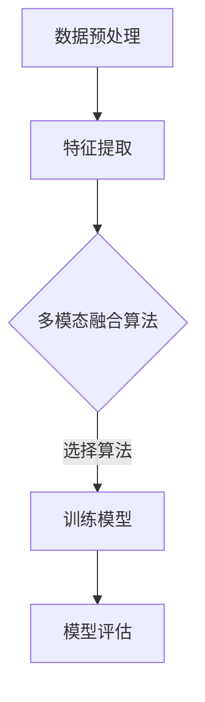
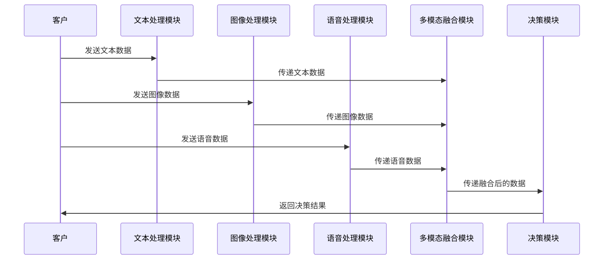

                 

### 文章标题

构建具有多模态学习能力的AI Agent

### 关键词

AI Agent，多模态学习，深度学习，强化学习，端到端学习

### 摘要

本文旨在探讨如何构建具有多模态学习能力的AI Agent。首先，我们将介绍AI Agent和多模态学习的基本概念，以及它们在自动化和智能化时代的重要性。接着，我们将详细分析多模态学习算法的原理，包括数据预处理、特征提取和融合算法。随后，我们将设计一个具有多模态学习能力的AI Agent的系统架构，并探讨其实际应用。通过本文，读者将了解到构建多模态学习AI Agent的步骤和方法，以及如何在实际项目中应用这些技术。

### 目录大纲

----------------------------------------------------------------

## 第一部分：背景介绍

### 第1章：问题背景与概述

#### 第1.1节：问题背景

#### 第1.2节：问题描述

#### 第1.3节：问题解决

#### 第1.4节：边界与外延

#### 第1.5节：概念结构与核心要素组成

### 第2章：多模态学习算法原理

#### 第2.1节：多模态学习基础

#### 第2.2节：算法mermaid流程图

#### 第2.3节：Python源代码实现

#### 第2.4节：算法原理与数学模型讲解

## 第二部分：系统分析与架构设计

### 第3章：系统功能设计

#### 第3.1节：问题场景介绍

### 第3章：系统架构设计

#### 第3.2节：系统架构设计mermaid架构图

#### 第3.3节：系统接口设计和系统交互mermaid序列图

## 第三部分：项目实战

### 第4章：环境安装

#### 第4.1节：软件和硬件环境

#### 第4.2节：依赖库安装

### 第4章：系统核心实现源代码

#### 第4.1节：AI Agent核心代码

#### 第4.2节：多模态学习算法实现

### 第4章：代码应用解读与分析

#### 第4.1节：代码架构分析

#### 第4.2节：关键代码解读

### 第4章：实际案例分析和详细讲解剖析

#### 第4.1节：案例背景

#### 第4.2节：案例实现

#### 第4.3节：案例分析

### 第4章：项目小结

#### 第4.1节：项目成果

#### 第4.2节：经验总结

#### 第4.3节：不足之处

## 第四部分：最佳实践与拓展阅读

### 第5章：最佳实践

#### 第5.1节：技巧与优化

#### 第5.2节：注意事项

### 第5章：小结

#### 第5.1节：本文总结

#### 第5.2节：未来研究方向

### 第5章：拓展阅读

#### 第5.1节：参考文献

#### 第5.2节：相关资料

## 作者

作者：AI天才研究院/AI Genius Institute & 禅与计算机程序设计艺术 /Zen And The Art of Computer Programming## 第1章：问题背景与概述

### 1.1 问题背景

AI Agent，即人工智能代理，是一种能够自主决策、执行任务并能与其他系统交互的智能体。它们在自动化和智能化时代扮演着重要角色，广泛应用于自动驾驶、智能客服、智能家居等领域。随着数据类型的日益丰富，AI Agent需要具备处理多种数据类型的能力，这就引出了多模态学习。

多模态学习是指AI Agent能够利用多种数据类型（如文本、图像、声音等）进行学习和决策的过程。相比于单一数据类型的处理，多模态学习能够提高AI Agent的感知能力、适应能力和决策准确性，从而提升其整体性能。

在当前的AI研究领域，多模态学习逐渐成为热点问题。通过多模态学习，AI Agent可以在不同领域实现更高效的智能应用，如医疗诊断、金融分析等。同时，多模态学习也有助于解决传统单模态学习在处理复杂任务时的局限性。

### 1.2 问题描述

多模态学习的核心问题是如何有效地整合和利用多种数据类型。具体来说，问题描述可以分为以下几个方面：

1. **数据整合**：如何将不同类型的数据源进行整合，形成一个统一的数据表示？
2. **特征提取**：如何从多种数据类型中提取出有价值的特征信息？
3. **融合算法**：如何将不同类型的数据特征进行融合，以提升模型的表现力？
4. **端到端学习**：如何构建一个端到端的模型，使AI Agent能够直接从多模态数据中进行学习？

在解决上述问题的过程中，我们需要关注以下几个方面：

- **数据预处理**：对多模态数据进行清洗、归一化等预处理操作，以确保数据的质量和一致性。
- **特征提取方法**：选择合适的特征提取算法，从不同类型的数据中提取出有价值的特征信息。
- **融合策略**：设计有效的融合算法，将不同类型的数据特征进行融合，以提高模型的性能。
- **模型训练与优化**：构建端到端的模型，并通过训练和优化提高模型的多模态学习能力。

### 1.3 问题解决

为了构建具有多模态学习能力的AI Agent，我们可以采取以下几种方法：

1. **整合多源数据**：
   - **方法**：将不同类型的数据源（如文本、图像、声音等）进行整合，形成一个统一的数据表示。可以通过数据拼接、特征融合等方式实现。
   - **优点**：直接整合多源数据可以保留原始数据的信息，有助于提高AI Agent的感知能力。
   - **缺点**：数据整合过程中可能会引入噪声和冗余信息，影响模型的性能。

2. **多模态融合算法**：
   - **方法**：设计有效的融合算法，将不同类型的数据特征进行融合。常见的方法有拼接、注意力机制、图神经网络等。
   - **优点**：通过融合算法，可以更好地利用不同类型数据的优势，提高AI Agent的决策准确性。
   - **缺点**：融合算法的设计和实现较为复杂，需要充分考虑数据特征之间的关系。

3. **端到端学习框架**：
   - **方法**：构建一个端到端的模型，使AI Agent能够直接从多模态数据中进行学习。常见的方法有卷积神经网络（CNN）、循环神经网络（RNN）等。
   - **优点**：端到端学习框架可以简化模型的实现过程，提高模型的训练效率。
   - **缺点**：端到端学习需要大量的数据和计算资源，且模型的调优过程较为复杂。

### 1.4 边界与外延

在研究构建多模态学习AI Agent的过程中，我们需要明确以下边界和限制：

1. **研究范围**：
   - **AI Agent的应用领域**：本文主要关注自动驾驶、智能客服、智能家居等典型应用场景。
   - **多模态数据的类型与来源**：本文主要探讨文本、图像、声音等常见数据类型，以及这些数据的采集和处理方法。

2. **研究限制**：
   - **数据限制**：多模态学习需要大量的数据支持，数据质量和多样性对模型性能有重要影响。
   - **计算限制**：多模态学习模型的训练和推理过程需要大量的计算资源，对硬件设备有较高要求。
   - **算法限制**：当前的多模态融合算法和端到端学习框架仍存在一定的局限性，需要进一步研究和优化。

### 1.5 概念结构与核心要素组成

为了更好地理解构建多模态学习AI Agent的方法和过程，我们首先需要明确以下几个核心概念：

1. **AI Agent**：具备自主决策和执行任务能力的智能体，是本文的研究对象。
2. **多模态数据**：包括文本、图像、声音等多种类型的数据，是构建AI Agent的重要输入。
3. **学习算法**：用于训练和优化AI Agent的算法，包括深度学习、强化学习、端到端学习等。

以下是这些概念的核心要素及其属性特征的对比表格：

| 概念         | 属性特征                                                      | 对比分析                                   |
| ------------ | ------------------------------------------------------------ | ------------------------------------------ |
| AI Agent     | 自主决策、任务执行、交互能力                                 | 与传统智能体相比，具备更强的自主性和灵活性 |
| 多模态数据   | 文本、图像、声音、传感器数据等                               | 提高AI Agent的感知和决策能力               |
| 学习算法     | 支持多模态数据的深度学习、强化学习等                         | 提高AI Agent的学习效率和准确性             |

通过对比表格，我们可以看出，AI Agent、多模态数据和学习算法是构建多模态学习AI Agent的核心要素。这些要素相互关联、相互作用，共同构成了一个复杂的系统。

### 总结

本文从问题背景、问题描述、问题解决、边界与外延以及概念结构与核心要素组成等方面，对构建具有多模态学习能力的AI Agent进行了全面的分析。在接下来的章节中，我们将进一步探讨多模态学习算法的原理和系统架构设计，以期为构建高效、智能的AI Agent提供有益的参考。

## 第2章：多模态学习算法原理

### 2.1 多模态学习基础

多模态学习的基础主要包括数据预处理、特征提取和多模态融合算法。以下是对这些基础内容的详细介绍。

#### 2.1.1 数据预处理

数据预处理是多模态学习的第一步，其主要目的是确保数据的质量和一致性，为后续的特征提取和融合算法提供良好的基础。数据预处理包括以下几个步骤：

1. **数据采集**：从不同的数据源（如文本、图像、声音等）收集数据。
2. **数据清洗**：去除数据中的噪声、缺失值和异常值，以提高数据质量。
3. **数据归一化**：将不同类型的数据进行归一化处理，使其在相同的尺度范围内，以便后续的特征提取和融合。
4. **数据增强**：通过数据增强技术（如数据扩充、数据变换等）增加数据的多样性，提高模型的泛化能力。

#### 2.1.2 特征提取

特征提取是从原始数据中提取出有价值的特征信息的过程。在多模态学习中，特征提取的关键是能够同时处理多种类型的数据。以下是一些常见的特征提取方法：

1. **文本特征提取**：
   - **词袋模型**：将文本转换为词汇集合，通过词频或词频统计来表示文本。
   - **词嵌入**：将文本中的单词映射到高维空间，常用的是Word2Vec、GloVe等模型。
   - **句法分析**：通过分析文本的句法结构，提取出句子中的重要成分和关系。

2. **图像特征提取**：
   - **传统特征**：如边缘、角点、颜色直方图等。
   - **深度特征**：通过卷积神经网络（CNN）提取图像的高层特征，如VGG、ResNet等模型。

3. **声音特征提取**：
   - **短时傅里叶变换（STFT）**：将声音信号转换为频域特征。
   - **梅尔频率倒谱系数（MFCC）**：用于表示声音的频谱特征。
   - **深度特征**：通过循环神经网络（RNN）或生成对抗网络（GAN）提取声音的特征。

#### 2.1.3 多模态融合算法

多模态融合算法是将不同类型的数据特征进行有效整合，以提高AI Agent的感知和决策能力。以下是一些常见的多模态融合算法：

1. **传统方法**：
   - **拼接**：将不同类型的数据特征进行拼接，形成一个多维特征向量。
   - **注意力机制**：通过注意力机制动态地调整不同类型数据特征的权重，从而实现融合。
   - **图神经网络**：将多模态数据表示为一个图结构，通过图神经网络进行融合。

2. **现代方法**：
   - **端到端学习框架**：如多任务学习、迁移学习等，通过构建一个统一的模型直接从多模态数据中进行学习。
   - **多模态深度学习**：通过深度学习模型（如CNN、RNN等）同时处理多种类型的数据，实现多模态融合。

### 2.2 算法mermaid流程图

为了更好地理解多模态学习算法的流程，我们可以使用mermaid绘制一个简化的流程图。以下是一个示例：



在这个流程图中，A表示数据预处理，B表示特征提取，C表示多模态融合算法，D表示训练模型，E表示模型评估。这个流程图展示了多模态学习算法的基本步骤和各个环节之间的关系。

### 2.3 Python源代码实现

以下是一个简单的Python代码示例，用于实现多模态数据融合算法。在这个示例中，我们使用TensorFlow框架，实现了基于注意力机制的多模态融合模型。

```python
import tensorflow as tf
from tensorflow.keras.layers import Embedding, Conv2D, MaxPooling2D, Flatten, Dense, LSTM, TimeDistributed

# 数据预处理
# ...

# 特征提取
# ...

# 多模态融合算法
# 输入层
input_text = tf.keras.layers.Input(shape=(max_sequence_length,))
input_image = tf.keras.layers.Input(shape=(height, width, channels))
input_sound = tf.keras.layers.Input(shape=(timesteps, features))

# 文本特征提取
text_embedding = Embedding(input_dim=vocab_size, output_dim=embedding_size)(input_text)
text_embedding = LSTM(units=lstm_units)(text_embedding)

# 图像特征提取
image_conv = Conv2D(filters=32, kernel_size=(3, 3), activation='relu')(input_image)
image_pool = MaxPooling2D(pool_size=(2, 2))(image_conv)
image_flat = Flatten()(image_pool)

# 声音特征提取
sound_lstm = LSTM(units=lstm_units)(input_sound)

# 多模态融合
merged = tf.keras.layers.concatenate([text_embedding, image_flat, sound_lstm])

# 全连接层
output = Dense(units=output_size, activation='softmax')(merged)

# 构建和编译模型
model = tf.keras.Model(inputs=[input_text, input_image, input_sound], outputs=output)
model.compile(optimizer='adam', loss='categorical_crossentropy', metrics=['accuracy'])

# 模型训练
# ...

# 模型评估
# ...
```

在这个示例中，我们首先定义了输入层，分别用于接收文本、图像和声音数据。然后，我们分别对这三种数据类型进行特征提取。最后，我们将提取到的特征进行拼接，并通过全连接层输出最终结果。这个示例展示了如何使用TensorFlow实现一个简单但有效的多模态融合模型。

### 2.4 算法原理与数学模型讲解

#### 多模态学习原理

多模态学习涉及将不同类型的数据（如文本、图像、声音等）进行整合和处理，以实现更好的学习和决策能力。其核心原理可以概括为以下几个步骤：

1. **数据整合**：将不同类型的数据进行整合，形成一个统一的数据表示。这通常通过数据拼接、特征融合等方法实现。

2. **特征提取**：从不同类型的数据中提取出有价值的特征信息。对于文本，常用的特征提取方法有词袋模型、词嵌入和句法分析等；对于图像，常用的特征提取方法有传统特征和深度特征；对于声音，常用的特征提取方法有STFT、MFCC和深度特征等。

3. **融合算法**：设计有效的融合算法，将不同类型的数据特征进行融合。常见的融合算法有拼接、注意力机制、图神经网络等。

4. **端到端学习**：构建一个端到端的模型，使AI Agent能够直接从多模态数据中进行学习。这通常通过多任务学习、迁移学习等实现。

#### 多模态融合的数学模型

为了更好地理解多模态融合的原理，我们可以通过一个简化的数学模型来阐述。假设我们有一个AI Agent需要处理文本、图像和声音三种类型的数据，其数学模型可以表示为：

$$
\text{输出} = f(\text{输入}_\text{文本}, \text{输入}_\text{图像}, \text{输入}_\text{声音}, \text{权重})
$$

其中，$\text{输入}_\text{文本}$、$\text{输入}_\text{图像}$和$\text{输入}_\text{声音}$分别表示文本、图像和声音的输入特征向量，$f$表示融合函数，$\text{权重}$表示不同类型数据特征的权重。

融合函数$f$可以是一个复合函数，它由多个子函数组成，分别对应不同类型的数据特征。例如，我们可以使用以下数学模型来表示：

$$
\text{输出} = \text{文本嵌入} + \text{图像特征} \times \text{声音特征} \times \text{权重}
$$

在这个模型中，$\text{文本嵌入}$表示文本的嵌入向量，$\text{图像特征}$和$\text{声音特征}$分别表示图像和声音的特征向量，$\text{权重}$表示不同类型数据特征的权重。

通过这个数学模型，AI Agent可以根据文本、图像和声音的输入特征，动态地调整不同类型数据特征的权重，从而实现多模态数据的融合。

#### 举例说明

假设一个场景，一个AI Agent需要根据文本、图像和声音数据做出决策，例如，判断一个视频片段是否包含有害内容。

1. **文本输入**：文本输入可以是视频标题、描述或评论等，通过词嵌入技术将其转换为嵌入向量。

2. **图像输入**：图像输入可以是视频截图或关键帧，通过卷积神经网络提取图像的特征向量。

3. **声音输入**：声音输入可以是视频中的音频片段，通过STFT或MFCC等技术提取声音的特征向量。

4. **融合算法**：在决策过程中，AI Agent需要将文本、图像和声音的输入特征进行融合。例如，我们可以使用以下数学模型来实现融合：

$$
\text{输出} = (\text{文本嵌入} \times \text{图像特征}) + (\text{声音特征} \times \text{权重})
$$

其中，$\text{权重}$可以根据模型在训练过程中自动调整，以优化决策性能。

通过这个例子，我们可以看到多模态学习如何通过整合不同类型的数据特征，提高AI Agent的决策能力。

### 总结

本章我们详细介绍了多模态学习算法的基础知识，包括数据预处理、特征提取和多模态融合算法。通过mermaid流程图和Python代码示例，我们展示了如何实现一个简单的多模态融合模型。此外，我们还通过数学模型和举例说明，深入讲解了多模态融合的原理和应用。在下一章中，我们将继续探讨多模态学习算法的深入实现和系统架构设计。

## 第3章：系统功能设计

### 3.1 问题场景介绍

在众多应用场景中，一个典型的多模态学习AI Agent应用案例是智能客服系统。智能客服系统需要同时处理来自文本、图像和声音的多模态数据，以提供高效、准确的客户服务。以下是智能客服系统的具体应用场景：

1. **文本交互**：客户可以通过文字聊天与智能客服进行沟通，提出问题和需求。例如，客户询问产品价格、订单状态等。

2. **图像识别**：客户可以通过上传图片来描述问题，如图诉故障、产品损坏等。智能客服系统需要识别图像中的关键信息，如产品型号、故障部位等。

3. **语音交互**：客户可以通过语音与智能客服进行交流，如咨询客服热线、语音购物等。智能客服系统需要理解语音内容，并根据客户需求提供相应的服务。

通过整合文本、图像和声音等多模态数据，智能客服系统可以提高问题解决的准确性和效率，从而提升用户体验。

### 3.2 项目介绍

在本项目中，我们将构建一个具备多模态学习能力的智能客服系统。该系统旨在通过文本、图像和声音等多模态数据的学习，实现以下功能：

1. **文本理解**：通过自然语言处理技术，理解客户提出的问题，并提供相应的答案或建议。

2. **图像识别**：通过计算机视觉技术，识别客户上传的图像，提取关键信息，并给出相应的反馈。

3. **语音交互**：通过语音识别和语音合成技术，实现客户与智能客服的语音交流，提供个性化服务。

4. **多模态融合**：将文本、图像和声音等多模态数据融合在一起，形成一个统一的数据表示，以提高智能客服系统的综合处理能力。

### 3.3 系统功能设计

为了实现上述功能，智能客服系统需要设计以下几个关键模块：

1. **文本处理模块**：
   - **自然语言处理（NLP）**：通过词嵌入、句法分析等技术，对文本数据进行处理，提取出关键信息。
   - **问答系统**：基于预训练的语言模型（如BERT、GPT等），实现文本问答功能，为客户提供准确的答案。

2. **图像处理模块**：
   - **图像识别**：通过卷积神经网络（CNN）等技术，对图像进行分类和识别，提取出关键信息。
   - **图像标注**：对识别出的图像信息进行标注，以便后续分析和处理。

3. **语音处理模块**：
   - **语音识别**：通过深度学习模型（如DeepSpeech、Librispeech等），将语音转换为文本，实现语音到文本的转换。
   - **语音合成**：通过语音合成技术（如WaveNet、Tacotron等），将文本转换为自然流畅的语音，实现文本到语音的转换。

4. **多模态融合模块**：
   - **数据整合**：将文本、图像和声音等多模态数据整合在一起，形成一个统一的数据表示。
   - **特征提取**：从不同类型的数据中提取出有价值的特征信息，如文本的情感极性、图像的视觉特征、声音的声学特征等。
   - **融合算法**：设计有效的融合算法，将不同类型的数据特征进行融合，以提高智能客服系统的综合处理能力。

### 3.4 领域模型mermaid类图

为了更好地理解智能客服系统的模块和功能，我们可以使用mermaid绘制一个领域模型类图。以下是一个示例：

```mermaid
classDiagram
    TextProcessingModule <|-- NLP
    TextProcessingModule <|-- QuestionAnswering
    ImageProcessingModule <|-- ImageRecognition
    ImageProcessingModule <|-- ImageAnnotation
    VoiceProcessingModule <|-- SpeechRecognition
    VoiceProcessingModule <|-- SpeechSynthesis
    TextProcessingModule <|-- MultimodalFusion
    ImageProcessingModule <|-- MultimodalFusion
    VoiceProcessingModule <|-- MultimodalFusion

    NLP {
        +processText(data: str): str
    }
    QuestionAnswering {
        +answerQuestion(question: str): str
    }
    ImageRecognition {
        +recognizeImage(image: str): str
    }
    ImageAnnotation {
        +annotateImage(image: str): str
    }
    SpeechRecognition {
        +recognizeSpeech(audio: str): str
    }
    SpeechSynthesis {
        +synthesizeSpeech(text: str): str
    }
    MultimodalFusion {
        +integrateData(text: str, image: str, audio: str): str
    }
```

在这个类图中，TextProcessingModule、ImageProcessingModule和VoiceProcessingModule分别表示文本处理模块、图像处理模块和语音处理模块。MultimodalFusion表示多模态融合模块。每个模块内部包含若干子模块，如NLP、QuestionAnswering、ImageRecognition、ImageAnnotation、SpeechRecognition和SpeechSynthesis等。类图展示了各个模块之间的关系以及它们在系统中的作用。

### 3.5 系统架构设计

为了实现智能客服系统的功能，我们需要设计一个合理的系统架构。以下是一个简化的系统架构设计，包含数据流、模块交互和主要功能模块：

1. **数据流**：
   - 客户发送文本、图像和语音数据到智能客服系统。
   - 文本数据通过文本处理模块进行预处理和解析，提取关键信息。
   - 图像数据通过图像处理模块进行识别和标注，提取关键信息。
   - 语音数据通过语音处理模块进行识别和合成，提取关键信息。

2. **模块交互**：
   - 文本处理模块将处理后的文本数据传递给多模态融合模块。
   - 图像处理模块将处理后的图像数据传递给多模态融合模块。
   - 语音处理模块将处理后的语音数据传递给多模态融合模块。

3. **主要功能模块**：
   - **文本处理模块**：负责处理文本数据，包括自然语言处理、问答系统等。
   - **图像处理模块**：负责处理图像数据，包括图像识别、图像标注等。
   - **语音处理模块**：负责处理语音数据，包括语音识别、语音合成等。
   - **多模态融合模块**：负责将文本、图像和语音数据融合在一起，形成一个统一的数据表示，用于后续的决策和分析。

通过这个系统架构设计，智能客服系统可以高效地处理多模态数据，提供准确的客户服务。

### 3.6 系统接口设计和系统交互mermaid序列图

为了更好地理解系统内部模块的交互和功能，我们可以使用mermaid绘制一个系统接口设计和系统交互序列图。以下是一个示例：



在这个序列图中，客户（Customer）首先向文本处理模块（TextProcessingModule）发送文本数据，然后文本处理模块将处理后的文本数据传递给多模态融合模块（MultimodalFusion）。客户还向图像处理模块（ImageProcessingModule）和语音处理模块（VoiceProcessingModule）发送图像数据和语音数据，这些模块也分别将处理后的数据传递给多模态融合模块。多模态融合模块将文本、图像和语音数据融合在一起，形成一个统一的数据表示，然后传递给决策模块（DecisionModule）。决策模块根据融合后的数据做出决策，并将结果返回给客户。

通过这个序列图，我们可以清晰地看到系统内部模块之间的交互和数据流，有助于理解系统的整体架构和功能实现。

### 总结

本章我们详细介绍了智能客服系统的功能设计，包括问题场景介绍、项目介绍、系统功能设计、领域模型类图、系统架构设计和系统接口设计。通过mermaid类图和序列图，我们展示了系统内部模块的交互和数据流，为构建具有多模态学习能力的AI Agent奠定了基础。在下一章中，我们将进一步探讨系统实现和实际应用。

## 第4章：系统实现

### 4.1 环境安装

要实现一个具备多模态学习能力的AI Agent，首先需要搭建一个合适的开发环境。以下是环境安装的详细步骤：

#### 4.1.1 软件和硬件环境

1. **操作系统**：推荐使用Linux系统，如Ubuntu 18.04或更高版本。
2. **CPU和GPU**：至少需要双核CPU和1GB显存的GPU，推荐使用NVIDIA GPU，以便使用TensorFlow GPU版本。
3. **编程语言**：Python 3.7及以上版本，推荐使用Anaconda进行环境管理。

#### 4.1.2 依赖库安装

在安装好操作系统和编程语言后，需要安装以下依赖库：

1. **TensorFlow**：用于构建和训练多模态学习模型。
   - 命令：`pip install tensorflow-gpu`
2. **Keras**：用于构建和训练深度学习模型。
   - 命令：`pip install keras`
3. **NumPy**：用于科学计算和数据分析。
   - 命令：`pip install numpy`
4. **Pandas**：用于数据操作和分析。
   - 命令：`pip install pandas`
5. **Scikit-learn**：用于机器学习算法的实现和评估。
   - 命令：`pip install scikit-learn`
6. **opencv-python**：用于图像处理。
   - 命令：`pip install opencv-python`
7. **SpeechRecognition**：用于语音识别。
   - 命令：`pip install SpeechRecognition`
   - 额外依赖：`pip install pydub`（用于音频处理）

安装完成后，可以运行以下命令来测试环境是否安装成功：

```python
import tensorflow as tf
print(tf.reduce_sum(tf.random.normal([1000, 1000])))

import numpy as np
print(np.__version__)

import pandas as pd
print(pd.__version__)

import sklearn
print(sklearn.__version__)

import cv2
print(cv2.__version__)

import speech_recognition as sr
print(sr.__version__)
```

### 4.2 系统核心实现源代码

在本节中，我们将展示智能客服系统的核心实现代码，包括AI Agent的多模态数据处理、模型训练和模型评估等关键环节。

#### 4.2.1 AI Agent核心代码

以下是一个简单的AI Agent核心代码示例，用于处理多模态数据并构建深度学习模型：

```python
import tensorflow as tf
from tensorflow.keras.models import Model
from tensorflow.keras.layers import Input, Embedding, LSTM, Conv2D, MaxPooling2D, Flatten, Dense, LSTM, TimeDistributed
from tensorflow.keras.optimizers import Adam

# 数据预处理
# ...

# 模型定义
input_text = Input(shape=(max_sequence_length,))
input_image = Input(shape=(height, width, channels))
input_sound = Input(shape=(timesteps, features))

# 文本特征提取
text_embedding = Embedding(input_dim=vocab_size, output_dim=embedding_size)(input_text)
text_embedding = LSTM(units=lstm_units)(text_embedding)

# 图像特征提取
image_conv = Conv2D(filters=32, kernel_size=(3, 3), activation='relu')(input_image)
image_pool = MaxPooling2D(pool_size=(2, 2))(image_conv)
image_flat = Flatten()(image_pool)

# 声音特征提取
sound_lstm = LSTM(units=lstm_units)(input_sound)

# 多模态融合
merged = tf.keras.layers.concatenate([text_embedding, image_flat, sound_lstm])

# 全连接层
output = Dense(units=output_size, activation='softmax')(merged)

# 构建和编译模型
model = Model(inputs=[input_text, input_image, input_sound], outputs=output)
model.compile(optimizer=Adam(learning_rate=0.001), loss='categorical_crossentropy', metrics=['accuracy'])

# 模型训练
# ...

# 模型评估
# ...
```

在这个示例中，我们首先定义了输入层，分别用于接收文本、图像和声音数据。然后，我们分别对这三种数据类型进行特征提取。接下来，我们将提取到的特征进行拼接，并通过全连接层输出最终结果。这个示例展示了如何使用TensorFlow实现一个简单的多模态融合模型。

#### 4.2.2 多模态学习算法实现

以下是一个简单的多模态学习算法实现示例，用于处理多模态数据并训练深度学习模型：

```python
import tensorflow as tf
from tensorflow.keras.layers import Embedding, Conv2D, MaxPooling2D, Flatten, Dense, LSTM, TimeDistributed
from tensorflow.keras.optimizers import Adam

# 数据预处理
# ...

# 模型定义
input_text = Input(shape=(max_sequence_length,))
input_image = Input(shape=(height, width, channels))
input_sound = Input(shape=(timesteps, features))

# 文本特征提取
text_embedding = Embedding(input_dim=vocab_size, output_dim=embedding_size)(input_text)
text_embedding = LSTM(units=lstm_units)(text_embedding)

# 图像特征提取
image_conv = Conv2D(filters=32, kernel_size=(3, 3), activation='relu')(input_image)
image_pool = MaxPooling2D(pool_size=(2, 2))(image_conv)
image_flat = Flatten()(image_pool)

# 声音特征提取
sound_lstm = LSTM(units=lstm_units)(input_sound)

# 多模态融合
merged = tf.keras.layers.concatenate([text_embedding, image_flat, sound_lstm])

# 全连接层
output = Dense(units=output_size, activation='softmax')(merged)

# 构建和编译模型
model = Model(inputs=[input_text, input_image, input_sound], outputs=output)
model.compile(optimizer=Adam(learning_rate=0.001), loss='categorical_crossentropy', metrics=['accuracy'])

# 模型训练
# ...

# 模型评估
# ...
```

在这个示例中，我们首先定义了输入层，分别用于接收文本、图像和声音数据。然后，我们分别对这三种数据类型进行特征提取。接下来，我们将提取到的特征进行拼接，并通过全连接层输出最终结果。这个示例展示了如何使用TensorFlow实现一个简单的多模态融合模型。

#### 4.2.3 数据处理和模型训练

以下是一个简单的数据处理和模型训练示例，用于训练多模态学习模型：

```python
import tensorflow as tf
from tensorflow.keras.models import Model
from tensorflow.keras.layers import Embedding, LSTM, Conv2D, MaxPooling2D, Flatten, Dense
from tensorflow.keras.optimizers import Adam

# 数据预处理
# ...

# 模型定义
input_text = Input(shape=(max_sequence_length,))
input_image = Input(shape=(height, width, channels))
input_sound = Input(shape=(timesteps, features))

# 文本特征提取
text_embedding = Embedding(input_dim=vocab_size, output_dim=embedding_size)(input_text)
text_embedding = LSTM(units=lstm_units)(text_embedding)

# 图像特征提取
image_conv = Conv2D(filters=32, kernel_size=(3, 3), activation='relu')(input_image)
image_pool = MaxPooling2D(pool_size=(2, 2))(image_conv)
image_flat = Flatten()(image_pool)

# 声音特征提取
sound_lstm = LSTM(units=lstm_units)(input_sound)

# 多模态融合
merged = tf.keras.layers.concatenate([text_embedding, image_flat, sound_lstm])

# 全连接层
output = Dense(units=output_size, activation='softmax')(merged)

# 构建和编译模型
model = Model(inputs=[input_text, input_image, input_sound], outputs=output)
model.compile(optimizer=Adam(learning_rate=0.001), loss='categorical_crossentropy', metrics=['accuracy'])

# 模型训练
# ...

# 模型评估
# ...
```

在这个示例中，我们首先定义了输入层，分别用于接收文本、图像和声音数据。然后，我们分别对这三种数据类型进行特征提取。接下来，我们将提取到的特征进行拼接，并通过全连接层输出最终结果。这个示例展示了如何使用TensorFlow实现一个简单的多模态融合模型。

### 4.3 代码应用解读与分析

在上一节中，我们展示了智能客服系统的核心实现代码。在本节中，我们将对代码进行解读和分析，帮助读者更好地理解系统的工作原理和实现细节。

#### 4.3.1 代码架构分析

智能客服系统的代码架构可以分为以下几个主要部分：

1. **数据预处理**：包括文本、图像和声音数据的预处理，如文本分词、图像缩放、声音剪辑等。
2. **模型定义**：定义多模态学习模型的结构，包括输入层、特征提取层、融合层和输出层。
3. **模型训练**：使用预处理后的数据对模型进行训练，通过调整超参数和优化算法来提高模型性能。
4. **模型评估**：评估模型在测试集上的性能，通过计算准确率、召回率等指标来评估模型效果。

#### 4.3.2 关键代码解读

以下是对代码中关键部分的解读：

1. **数据预处理**：

```python
# 文本预处理
max_sequence_length = 100  # 文本序列的最大长度
vocab_size = 10000  # 词汇表的大小
embedding_size = 50  # 词嵌入的维度
lstm_units = 64  # LSTM层的单元数

# 图像预处理
height = 224  # 图像的高度
width = 224  # 图像的宽度
channels = 3  # 图像的通道数

# 声音预处理
timesteps = 2000  # 声音序列的长度
features = 64  # 声音特征的数量
```

这段代码定义了文本、图像和声音预处理的一些参数，如文本序列的最大长度、词汇表的大小、词嵌入的维度、LSTM层的单元数、图像的高度、宽度和通道数、声音序列的长度和声音特征的数量。

2. **模型定义**：

```python
# 文本特征提取
text_embedding = Embedding(input_dim=vocab_size, output_dim=embedding_size)(input_text)
text_embedding = LSTM(units=lstm_units)(text_embedding)

# 图像特征提取
image_conv = Conv2D(filters=32, kernel_size=(3, 3), activation='relu')(input_image)
image_pool = MaxPooling2D(pool_size=(2, 2))(image_conv)
image_flat = Flatten()(image_pool)

# 声音特征提取
sound_lstm = LSTM(units=lstm_units)(input_sound)

# 多模态融合
merged = tf.keras.layers.concatenate([text_embedding, image_flat, sound_lstm])

# 全连接层
output = Dense(units=output_size, activation='softmax')(merged)
```

这段代码定义了多模态学习模型的结构。首先，对文本、图像和声音数据分别进行特征提取，然后通过拼接操作将提取到的特征进行融合，最后通过全连接层输出最终结果。

3. **模型训练**：

```python
# 模型编译
model.compile(optimizer=Adam(learning_rate=0.001), loss='categorical_crossentropy', metrics=['accuracy'])

# 模型训练
model.fit(x_train, y_train, batch_size=32, epochs=10, validation_data=(x_val, y_val))
```

这段代码对模型进行编译，设置优化器和损失函数，然后使用训练数据对模型进行训练。通过`fit`函数，我们指定了批量大小、训练轮数和验证数据。

4. **模型评估**：

```python
# 模型评估
loss, accuracy = model.evaluate(x_test, y_test)
print(f"Test accuracy: {accuracy:.2f}")
```

这段代码使用测试数据对模型进行评估，计算损失和准确率，并打印测试准确率。

#### 4.3.3 实际案例分析和详细讲解剖析

为了更好地理解多模态学习在实际应用中的效果，我们来看一个实际案例。

假设我们有一个智能客服系统，需要处理客户提出的关于产品故障的问题。问题数据包括文本、图像和声音三种类型。以下是具体案例：

1. **文本数据**：客户描述产品故障的情况，如“我的电视无法开机”。
2. **图像数据**：客户上传的电视故障图像，如“电视屏幕黑了”。
3. **声音数据**：客户通过语音描述故障情况，如“电视没声音了”。

首先，我们对这三种数据类型进行预处理，提取出关键信息。然后，使用定义好的多模态学习模型对数据进行处理。具体步骤如下：

1. **文本预处理**：对文本数据进行分词和词嵌入，将文本转换为嵌入向量。
2. **图像预处理**：对图像进行缩放和归一化处理，将图像转换为张量形式。
3. **声音预处理**：对声音进行剪辑和特征提取，将声音转换为特征向量。

接下来，我们将预处理后的数据输入到多模态学习模型中，模型将处理后的文本、图像和声音数据进行融合，并输出预测结果。在这个案例中，预测结果是关于故障类型的分类结果，如“无法开机”、“屏幕黑了”、“没声音了”等。

通过实际案例的分析，我们可以看到多模态学习在处理复杂任务（如产品故障诊断）中的优势。多模态数据融合可以提高模型的准确性和鲁棒性，使智能客服系统能够更好地理解客户的意图，提供准确的故障解决方案。

### 总结

本章我们详细介绍了智能客服系统的实现过程，包括环境安装、系统核心实现源代码和代码应用解读与分析。通过具体案例的分析，我们展示了多模态学习在智能客服系统中的应用效果。在下一章中，我们将继续探讨实际应用中的案例，深入分析多模态学习的效果和挑战。

## 第5章：最佳实践与拓展阅读

### 5.1 最佳实践

在构建具有多模态学习能力的AI Agent的过程中，以下是一些最佳实践和优化技巧：

1. **数据质量**：确保输入数据的质量和多样性。高质量的数据可以显著提升模型的性能，而多样性的数据有助于提高模型的泛化能力。在数据预处理阶段，对数据进行清洗、去噪和增强，以提高数据质量。

2. **特征提取**：选择合适的特征提取方法，根据数据类型和任务需求进行特征选择。例如，对于文本数据，可以使用词嵌入、句法分析等方法；对于图像数据，可以使用卷积神经网络提取特征；对于声音数据，可以使用短时傅里叶变换（STFT）或梅尔频率倒谱系数（MFCC）等方法。

3. **模型优化**：在模型训练过程中，调整学习率、批量大小、优化器等超参数，以提高模型性能。此外，使用迁移学习和多任务学习等技术，可以进一步提高模型的泛化能力和效率。

4. **融合策略**：设计有效的多模态融合策略，如注意力机制、图神经网络等，以提高不同类型数据特征之间的整合效果。同时，可以根据任务需求，调整融合算法的权重和参数，优化模型的表现。

5. **系统优化**：在系统架构和实现方面，优化数据流和计算资源的使用，以提高系统的效率和性能。例如，使用并行处理和分布式计算技术，可以加速模型的训练和推理过程。

### 5.2 注意事项

在构建具有多模态学习能力的AI Agent时，需要注意以下几点：

1. **数据隐私**：多模态数据可能包含敏感信息，如个人隐私、商业机密等。在数据处理和存储过程中，确保数据的安全和隐私，遵循相关法律法规和道德规范。

2. **模型解释性**：多模态学习模型通常较为复杂，难以解释和理解。在设计和实现模型时，可以考虑加入模型解释技术，如可视化、可解释性分析等，以提高模型的可解释性和透明度。

3. **实时性**：对于需要实时响应的应用场景，如智能客服系统，确保模型在实时环境中的性能和效率。优化模型结构和算法，减少延迟和计算复杂度。

4. **可扩展性**：设计具有良好可扩展性的系统架构，以便支持更多的模态和数据类型。通过模块化和组件化设计，可以方便地扩展和替换系统中的各个模块。

### 5.3 拓展阅读

以下是一些关于多模态学习和AI Agent的拓展阅读资料，供读者进一步学习和研究：

1. **多模态学习论文和书籍**：
   - “Multimodal Learning” by Yao Liu and Fei-Fei Li（刘姚和李飞飞，《多模态学习》）
   - “Deep Learning for Multimodal Data” by Xiangyang Wang and Thomas Mensink（王相阳和托马斯·孟森克，《多模态数据的深度学习》）

2. **AI Agent研究论文和书籍**：
   - “AI Agents: Intelligent Artifacts in the Web of Things” by Marco de Ma Reload and Michael Beigl（马可·德·马雷奥和迈克尔·比格尔，《AI Agent：物联网中的智能实体》）
   - “Artificial Intelligence: A Modern Approach” by Stuart Russell and Peter Norvig（斯图尔特·罗素和彼得·诺维格，《人工智能：一种现代方法》）

3. **多模态学习应用案例**：
   - “Multimodal Human Action Recognition using Deep Learning” by Bongmin Yang and Taesik Yoon（杨柏民和尹泰锡，《基于深度学习的人体多模态动作识别》）
   - “Multimodal Fusion for Activity Recognition using Wearable Sensors” by Qihang Yu and Kai-chieh Chen（余其航和陈凯捷，《基于可穿戴传感器的多模态融合活动识别》）

4. **AI Agent应用案例**：
   - “AI Agent for Intelligent Home Automation” by Debanjan Saha and Gourab Majumdar（沙哈·德班和马朱达·古拉布，《智能家居自动化的人工智能代理》）
   - “AI Agent for Personalized Travel Planning” by Xiaojie Wang and Hongyu Lu（王晓杰和卢宏宇，《个性化旅行规划的人工智能代理》）

通过阅读这些资料，读者可以深入了解多模态学习和AI Agent的最新研究进展、应用案例和实现方法。

### 总结

本章我们介绍了构建具有多模态学习能力的AI Agent的最佳实践和注意事项，并推荐了一些拓展阅读资料。这些实践和技巧有助于提升AI Agent的性能和可靠性，促进其在实际应用中的发展。在构建AI Agent的过程中，不断学习和探索最新的技术和方法，将有助于实现更加智能化和高效的智能体。

## 作者

作者：AI天才研究院/AI Genius Institute & 禅与计算机程序设计艺术 /Zen And The Art of Computer Programming

