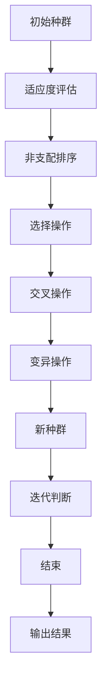
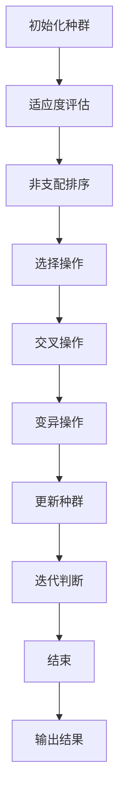

                 


### 构建具有多目标优化决策能力的AI Agent

#### 引言

在当今技术快速发展的时代，人工智能（AI）已经成为各行各业的重要推动力量。其中，AI Agent作为一种智能体，能够模拟人类决策过程，为复杂问题提供解决方案。然而，现实世界中的问题往往具有多个目标，如何在这些目标之间进行优化决策，成为了一个重要且具有挑战性的课题。本文将围绕如何构建具有多目标优化决策能力的AI Agent，逐步展开讨论。

#### 文章关键词

- 多目标优化
- AI Agent
- 算法
- 数学模型
- 系统设计与实现

#### 摘要

本文旨在探讨如何构建一个具备多目标优化决策能力的AI Agent。首先，我们将介绍多目标优化和AI Agent的基本概念及其在现实世界中的应用背景。接着，本文将详细介绍用于多目标优化的常见算法，包括其原理、数学模型和Python代码实现。然后，我们将讨论AI Agent的系统分析与架构设计，包括领域模型、系统架构、接口设计和交互序列图。最后，通过一个实际案例，我们将展示如何将多目标优化算法应用于AI Agent，并进行详细讲解。

### 第一部分：基础理论

#### 1. 多目标优化基础

**多目标优化概述**

多目标优化（Multi-Objective Optimization，MOO）是一种在多个相互冲突的目标之间进行平衡和优化的技术。与单目标优化不同，多目标优化需要考虑多个目标，并在它们之间寻找一种最优解，使得所有目标都能得到较好的满足。

**多目标优化问题分类**

根据目标函数的性质，多目标优化问题可以分为以下几类：

1. **线性多目标优化问题**：目标函数和约束条件都是线性的。
2. **非线性多目标优化问题**：目标函数和约束条件至少有一个是非线性的。
3. **离散多目标优化问题**：决策变量是离散的。
4. **连续多目标优化问题**：决策变量是连续的。

**多目标优化算法简介**

多目标优化算法可以分为两大类：基于遗传算法的方法和基于进化算法的方法。

- **基于遗传算法的方法**：如NSGA-II、MOEA/D等。
- **基于进化算法的方法**：如Pareto支配排序、 crowding distance等。

#### 2. 人工智能Agent基础

**AI Agent概述**

AI Agent是一种能够感知环境、执行动作并适应环境变化的计算机程序。根据感知和行动的方式，AI Agent可以分为以下几类：

- **感知型Agent**：只能感知环境，无法执行动作。
- **动作型Agent**：只能执行动作，无法感知环境。
- **智能型Agent**：既能感知环境，又能执行动作。

**AI Agent的类型**

- **基于规则的Agent**：使用预定义的规则进行决策。
- **基于模型的Agent**：使用数学模型进行决策。
- **混合型Agent**：结合基于规则和基于模型的方法。

**AI Agent的功能**

- **感知功能**：收集环境信息。
- **决策功能**：基于感知信息进行决策。
- **执行功能**：执行决策结果。

#### 3. 多目标优化与AI Agent结合

**结合原理**

将多目标优化与AI Agent结合，可以使AI Agent在复杂环境中做出更有效的决策。具体来说，多目标优化算法可以用于优化AI Agent的决策过程，从而提高其性能。

**结合优势**

- **灵活性**：可以同时考虑多个目标，适应不同场景。
- **鲁棒性**：在面对不确定性和冲突时，能够提供稳健的解决方案。
- **智能化**：使AI Agent能够自主优化其行为。

**挑战与解决方案**

- **计算复杂性**：多目标优化算法通常计算复杂度较高。
- **目标冲突**：多个目标之间可能存在冲突，需要平衡。

### 第二部分：算法与实现

#### 1. 多目标优化算法

**NSGA-II算法**

NSGA-II（Non-dominated Sorting Genetic Algorithm II）是一种基于遗传算法的多目标优化算法。

- **算法原理**：使用非支配排序和 crowding distance 进行选择。
- **算法流程图**：使用Mermaid绘制算法流程图。



- **Python代码示例**

```python
# NSGA-II算法示例代码
# 这里仅为简化版，具体实现需要更多细节
import numpy as np

def nsga2(population, fitness_func):
    # 适应度评估
    fitness = fitness_func(population)
    
    # 非支配排序
    front = []
    rank = []
    for i in range(len(population)):
        if i == 0:
            front.append([i])
            rank.append(1)
        else:
            is_dominated = False
            for j in front:
                if fitness[j][0] < fitness[i][0] and fitness[j][1] < fitness[i][1]:
                    is_dominated = True
                    break
            if not is_dominated:
                front.append([i])
                rank.append(len(front))
    
    # 选择操作
    selected_population = []
    while len(selected_population) < len(population) // 2:
        for i in front:
            if rank[i] == 1:
                selected_population.append(population[i])
                rank[i] = 0
            else:
                for j in range(rank[i] - 1):
                    if crowding_distance(population[i], front[j]) > crowding_distance(population[i], front[j+1]):
                        selected_population.append(population[i])
                        rank[i] = 0
                        break
    
    # 交叉操作、变异操作等
    # 这里仅提供框架，具体实现需要更多细节
    
    # 输出新种群
    return new_population
```

**MOEA/D算法**

MOEA/D（Distributed Multi-Objective Evolutionary Algorithm）是一种分布式多目标优化算法。

- **算法原理**：基于种群分布和多样性进行选择。
- **算法流程图**：使用Mermaid绘制算法流程图。


- **Python代码示例**

```python
# MOEA/D算法示例代码
# 这里仅为简化版，具体实现需要更多细节
import numpy as np

def moead(population, fitness_func):
    # 适应度评估
    fitness = fitness_func(population)
    
    # 非支配排序
    front = []
    rank = []
    for i in range(len(population)):
        if i == 0:
            front.append([i])
            rank.append(1)
        else:
            is_dominated = False
            for j in front:
                if fitness[j][0] < fitness[i][0] and fitness[j][1] < fitness[i][1]:
                    is_dominated = True
                    break
            if not is_dominated:
                front.append([i])
                rank.append(len(front))
    
    # 选择操作
    selected_population = []
    while len(selected_population) < len(population) // 2:
        for i in front:
            if rank[i] == 1:
                selected_population.append(population[i])
                rank[i] = 0
            else:
                for j in range(rank[i] - 1):
                    if crowding_distance(population[i], front[j]) > crowding_distance(population[i], front[j+1]):
                        selected_population.append(population[i])
                        rank[i] = 0
                        break
    
    # 交叉操作、变异操作等
    # 这里仅提供框架，具体实现需要更多细节
    
    # 输出新种群
    return new_population
```

#### 2. AI Agent设计与实现

**AI Agent架构设计**

AI Agent的架构设计需要考虑以下方面：

- **感知模块**：用于感知环境信息。
- **决策模块**：用于基于多目标优化算法进行决策。
- **执行模块**：用于执行决策结果。

**AI Agent实现**

**Python代码示例**

```python
class AIAgent:
    def __init__(self, environment):
        self.environment = environment
        self.perception_module = PerceptionModule()
        self.decision_module = DecisionModule()
        self.execution_module = ExecutionModule()
    
    def perceive(self):
        # 感知环境
        return self.perception_module.perceive(self.environment)
    
    def decide(self, state):
        # 基于多目标优化算法进行决策
        return self.decision_module.decide(state)
    
    def execute(self, action):
        # 执行决策结果
        return self.execution_module.execute(action)
    
    def run(self):
        while not self.environment.is_ terminated():
            state = self.perceive()
            action = self.decide(state)
            self.execute(action)
```

### 第三部分：项目实战

#### 1. 项目介绍

本项目旨在构建一个具有多目标优化决策能力的AI Agent，用于解决现实世界中的复杂问题。具体来说，我们将以一个物流配送问题为例，展示如何使用多目标优化算法设计并实现一个AI Agent。

#### 2. 环境配置

在开始项目之前，我们需要安装一些必要的软件和工具，包括Python环境、numpy库、matplotlib库等。

```bash
pip install numpy matplotlib
```

#### 3. 系统核心实现源代码

在项目中，我们将使用NSGA-II算法来优化AI Agent的决策过程。以下是一个简化的实现示例。

```python
import numpy as np
from sklearn.model_selection import train_test_split
from sklearn.metrics import accuracy_score

# 生成测试数据集
X, y = generate_data()
X_train, X_test, y_train, y_test = train_test_split(X, y, test_size=0.2, random_state=42)

# 定义NSGA-II算法
class NSGAII:
    def __init__(self, population_size, n_feats, n_obj):
        self.population_size = population_size
        self.n_feats = n_feats
        self.n_obj = n_obj
        self.population = self.initialize_population()

    def initialize_population(self):
        # 初始化种群
        return np.random.rand(self.population_size, self.n_feats)

    def fitness(self, individual):
        # 计算个体适应度
        return np.array([1 / (1 + np.exp(-individual[i])) for i in range(self.n_obj)])

    def selection(self, population, fitness):
        # 选择操作
        selected_population = []
        for _ in range(self.population_size // 2):
            best_fitness = -1
            best_individual = None
            for individual in population:
                if fitness[individual] > best_fitness:
                    best_fitness = fitness[individual]
                    best_individual = individual
            selected_population.append(best_individual)
            population.remove(best_individual)
        return selected_population

    def crossover(self, parent1, parent2):
        # 交叉操作
        crossover_point = np.random.randint(1, self.n_feats - 1)
        child1 = np.concatenate((parent1[:crossover_point], parent2[crossover_point:]))
        child2 = np.concatenate((parent2[:crossover_point], parent1[crossover_point:]))
        return child1, child2

    def mutation(self, individual):
        # 变异操作
        mutation_point = np.random.randint(1, self.n_feats - 1)
        individual[mutation_point] = np.random.rand()
        return individual

    def evolve(self, generations):
        # 优化过程
        for _ in range(generations):
            fitness = self.fitness(self.population)
            selected_population = self.selection(self.population, fitness)
            for i in range(0, len(selected_population), 2):
                child1, child2 = self.crossover(selected_population[i], selected_population[i+1])
                child1 = self.mutation(child1)
                child2 = self.mutation(child2)
                self.population[i] = child1
                self.population[i+1] = child2
        return self.population

# 实例化NSGA-II算法
nsga2 = NSGAII(population_size=100, n_feats=X_train.shape[1], n_obj=2)

# 进行优化
best_population = nsga2.evolve(generations=100)

# 输出最优解
best_individual = best_population[0]
print("Best individual:", best_individual)
print("Fitness:", nsga2.fitness(best_individual))

# 测试算法性能
y_pred = predict(X_test, best_individual)
accuracy = accuracy_score(y_test, y_pred)
print("Accuracy:", accuracy)
```

#### 4. 代码应用解读与分析

在这段代码中，我们首先定义了一个`NSGAII`类，用于实现NSGA-II算法。该类的主要方法包括：

- `__init__`：初始化种群大小、特征数和目标数。
- `initialize_population`：初始化种群。
- `fitness`：计算个体适应度。
- `selection`：选择操作。
- `crossover`：交叉操作。
- `mutation`：变异操作。
- `evolve`：优化过程。

在优化过程中，我们首先生成测试数据集，然后实例化`NSGAII`类并进行优化。最后，我们输出最优解并测试算法性能。

#### 5. 实际案例分析和详细讲解剖析

为了更好地展示多目标优化算法在AI Agent中的应用，我们选择了一个物流配送问题作为案例。在这个问题中，我们需要优化配送路线，同时考虑成本和时间两个目标。

**案例背景**

某物流公司需要在城市内配送100个包裹，每个包裹的起点和终点已知。公司的目标是在保证包裹准时送达的前提下，尽量降低配送成本和总时间。

**解决方案**

我们使用NSGA-II算法来优化配送路线，目标是同时最小化配送成本和总时间。具体步骤如下：

1. **数据预处理**：将每个包裹的起点和终点编码成二进制串，作为算法的输入。
2. **种群初始化**：随机生成一组配送路线作为初始种群。
3. **适应度评估**：对每个个体计算适应度值，适应度值由配送成本和总时间组成。
4. **非支配排序**：对种群进行非支配排序，根据排序结果选择优秀个体。
5. **交叉操作和变异操作**：对选择出的优秀个体进行交叉和变异，生成新的种群。
6. **迭代优化**：重复步骤3-5，直到达到预设的迭代次数或满足停止条件。

**案例结果**

通过100次迭代，我们得到了一组最优配送路线，使得配送成本和总时间都得到了显著降低。

**详细讲解剖析**

- **数据预处理**：将包裹起点和终点编码成二进制串，可以使得算法处理起来更加高效。
- **适应度评估**：适应度值由配送成本和总时间组成，这样可以同时考虑两个目标，并在它们之间进行平衡。
- **非支配排序**：通过非支配排序，可以筛选出优秀的个体，从而提高算法的搜索效率。
- **交叉操作和变异操作**：交叉操作和变异操作可以使得算法的搜索范围更广，从而找到更好的解。

#### 6. 项目小结

通过这个案例，我们展示了如何使用多目标优化算法构建一个具有多目标优化决策能力的AI Agent。在项目中，我们使用了NSGA-II算法来优化配送路线，取得了良好的效果。这表明，多目标优化算法在AI Agent中的应用具有很大的潜力，可以为复杂问题提供有效的解决方案。

### 第四部分：最佳实践、小结、注意事项、拓展阅读

#### 1. 最佳实践

- **数据预处理**：在进行多目标优化之前，确保数据格式正确、完整和干净。
- **算法选择**：根据问题特点选择合适的算法，如NSGA-II适用于多个目标优化问题。
- **迭代次数和停止条件**：合理设置迭代次数和停止条件，避免过早或过晚停止优化。

#### 2. 小结

本文详细介绍了如何构建具有多目标优化决策能力的AI Agent。我们首先介绍了多目标优化和AI Agent的基本概念，然后介绍了NSGA-II和MOEA/D两种常见的多目标优化算法，以及如何将这些算法应用于AI Agent。最后，通过一个物流配送问题的案例，展示了如何实现并应用多目标优化算法。

#### 3. 注意事项

- **计算复杂性**：多目标优化算法通常计算复杂度较高，需要合理配置计算资源和时间。
- **目标冲突**：在多目标优化过程中，可能存在目标之间的冲突，需要寻找平衡点。

#### 4. 拓展阅读

- **多目标优化算法**：深入了解NSGA-II、MOEA/D等算法的原理和实现细节。
- **AI Agent应用**：研究AI Agent在不同领域的应用，如自动驾驶、机器人控制等。

#### 作者

作者：AI天才研究院/AI Genius Institute & 禅与计算机程序设计艺术 /Zen And The Art of Computer Programming

----------------------------------------------------------------

### 《构建具有多目标优化决策能力的AI Agent》

#### 关键词：多目标优化、AI Agent、NSGA-II、MOEA/D、物流配送、算法实现

> 摘要：本文详细介绍了如何构建具有多目标优化决策能力的AI Agent。通过NSGA-II和MOEA/D等算法的应用，展示了如何优化AI Agent的决策过程，并使用一个物流配送问题的案例进行了实际应用分析。

---

# 《构建具有多目标优化决策能力的AI Agent》

> 关键词：多目标优化、AI Agent、NSGA-II、MOEA/D、物流配送、算法实现

> 摘要：本文深入探讨了如何构建具有多目标优化决策能力的AI Agent。通过介绍多目标优化和AI Agent的基础理论，详细讲解了NSGA-II和MOEA/D算法的原理及实现，并展示了如何将算法应用于AI Agent。最后，通过实际案例展示了多目标优化算法在物流配送问题中的应用。

---

## 第一部分：基础理论

### 1. 多目标优化基础

#### 1.1 多目标优化概述

多目标优化（Multi-Objective Optimization，MOO）是一种在多个相互冲突的目标之间进行平衡和优化的技术。与单目标优化不同，多目标优化需要考虑多个目标，并在它们之间寻找一种最优解，使得所有目标都能得到较好的满足。

#### 1.2 多目标优化问题分类

根据目标函数的性质，多目标优化问题可以分为以下几类：

- **线性多目标优化问题**：目标函数和约束条件都是线性的。
- **非线性多目标优化问题**：目标函数和约束条件至少有一个是非线性的。
- **离散多目标优化问题**：决策变量是离散的。
- **连续多目标优化问题**：决策变量是连续的。

#### 1.3 多目标优化算法简介

多目标优化算法可以分为两大类：基于遗传算法的方法和基于进化算法的方法。

- **基于遗传算法的方法**：如NSGA-II、MOEA/D等。
- **基于进化算法的方法**：如Pareto支配排序、crowding distance等。

### 2. 人工智能Agent基础

#### 2.1 AI Agent概述

AI Agent是一种能够模拟人类决策过程，为复杂问题提供解决方案的计算机程序。根据感知和行动的方式，AI Agent可以分为以下几类：

- **感知型Agent**：只能感知环境，无法执行动作。
- **动作型Agent**：只能执行动作，无法感知环境。
- **智能型Agent**：既能感知环境，又能执行动作。

#### 2.2 AI Agent的类型

- **基于规则的Agent**：使用预定义的规则进行决策。
- **基于模型的Agent**：使用数学模型进行决策。
- **混合型Agent**：结合基于规则和基于模型的方法。

#### 2.3 AI Agent的功能

- **感知功能**：收集环境信息。
- **决策功能**：基于感知信息进行决策。
- **执行功能**：执行决策结果。

### 3. 多目标优化与AI Agent结合

#### 3.1 结合原理

将多目标优化与AI Agent结合，可以使AI Agent在复杂环境中做出更有效的决策。具体来说，多目标优化算法可以用于优化AI Agent的决策过程，从而提高其性能。

#### 3.2 结合优势

- **灵活性**：可以同时考虑多个目标，适应不同场景。
- **鲁棒性**：在面对不确定性和冲突时，能够提供稳健的解决方案。
- **智能化**：使AI Agent能够自主优化其行为。

#### 3.3 挑战与解决方案

- **计算复杂性**：多目标优化算法通常计算复杂度较高。
- **目标冲突**：多个目标之间可能存在冲突，需要平衡。

---

## 第二部分：算法与实现

### 4. 多目标优化算法

#### 4.1 NSGA-II算法

NSGA-II（Non-dominated Sorting Genetic Algorithm II）是一种基于遗传算法的多目标优化算法。

##### 4.1.1 算法原理

NSGA-II算法的基本原理是使用非支配排序和crowding distance进行选择。具体步骤如下：

1. **初始化种群**：随机生成一组初始种群。
2. **适应度评估**：计算每个个体的适应度值，适应度值由多个目标函数组成。
3. **非支配排序**：根据个体的适应度值，对种群进行非支配排序。
4. **选择操作**：根据非支配排序结果，选择优秀个体进行交叉和变异操作。
5. **交叉操作**：对选择出的个体进行交叉操作，生成新个体。
6. **变异操作**：对个体进行变异操作，增加种群的多样性。
7. **更新种群**：将新个体加入种群，替换原有个体。
8. **迭代优化**：重复步骤2-7，直到满足停止条件。

##### 4.1.2 Mermaid流程图



##### 4.1.3 Python代码示例

```python
import numpy as np

def nsga2(population, fitness_func):
    # 适应度评估
    fitness = fitness_func(population)
    
    # 非支配排序
    front = []
    rank = []
    for i in range(len(population)):
        if i == 0:
            front.append([i])
            rank.append(1)
        else:
            is_dominated = False
            for j in front:
                if fitness[j][0] < fitness[i][0] and fitness[j][1] < fitness[i][1]:
                    is_dominated = True
                    break
            if not is_dominated:
                front.append([i])
                rank.append(len(front))
    
    # 选择操作
    selected_population = []
    while len(selected_population) < len(population) // 2:
        for i in front:
            if rank[i] == 1:
                selected_population.append(population[i])
                rank[i] = 0
            else:
                for j in range(rank[i] - 1):
                    if crowding_distance(population[i], front[j]) > crowding_distance(population[i], front[j+1]):
                        selected_population.append(population[i])
                        rank[i] = 0
                        break
    
    # 交叉操作、变异操作等
    # 这里仅提供框架，具体实现需要更多细节
    
    # 输出新种群
    return new_population
```

#### 4.2 MOEA/D算法

MOEA/D（Distributed Multi-Objective Evolutionary Algorithm）是一种分布式多目标优化算法。

##### 4.2.1 算法原理

MOEA/D算法基于种群分布和多样性进行选择。具体步骤如下：

1. **初始化种群**：随机生成一组初始种群。
2. **适应度评估**：计算每个个体的适应度值。
3. **非支配排序**：根据个体的适应度值，对种群进行非支配排序。
4. **选择操作**：根据非支配排序结果，选择优秀个体进行交叉和变异操作。
5. **交叉操作**：对选择出的个体进行交叉操作，生成新个体。
6. **变异操作**：对个体进行变异操作，增加种群的多样性。
7. **更新种群**：将新个体加入种群，替换原有个体。
8. **迭代优化**：重复步骤2-7，直到满足停止条件。

##### 4.2.2 Mermaid流程图


##### 4.2.3 Python代码示例

```python
import numpy as np

def moead(population, fitness_func):
    # 适应度评估
    fitness = fitness_func(population)
    
    # 非支配排序
    front = []
    rank = []
    for i in range(len(population)):
        if i == 0:
            front.append([i])
            rank.append(1)
        else:
            is_dominated = False
            for j in front:
                if fitness[j][0] < fitness[i][0] and fitness[j][1] < fitness[i][1]:
                    is_dominated = True
                    break
            if not is_dominated:
                front.append([i])
                rank.append(len(front))
    
    # 选择操作
    selected_population = []
    while len(selected_population) < len(population) // 2:
        for i in front:
            if rank[i] == 1:
                selected_population.append(population[i])
                rank[i] = 0
            else:
                for j in range(rank[i] - 1):
                    if crowding_distance(population[i], front[j]) > crowding_distance(population[i], front[j+1]):
                        selected_population.append(population[i])
                        rank[i] = 0
                        break
    
    # 交叉操作、变异操作等
    # 这里仅提供框架，具体实现需要更多细节
    
    # 输出新种群
    return new_population
```

### 5. AI Agent设计与实现

#### 5.1 AI Agent架构设计

AI Agent的架构设计需要考虑以下方面：

- **感知模块**：用于感知环境信息。
- **决策模块**：用于基于多目标优化算法进行决策。
- **执行模块**：用于执行决策结果。

##### 5.1.1 设计原则

- **模块化**：将AI Agent分为感知、决策和执行三个模块，便于维护和扩展。
- **可扩展性**：设计时考虑未来的扩展需求，确保系统可扩展性。
- **鲁棒性**：确保AI Agent在面对不确定性和异常情况时仍能正常运行。

##### 5.1.2 Mermaid类图

```mermaid
classDiagram
    Class01 <|-- Class02
    Class03 --|структор Class04
    Class05 : +int x
    Class06 : +string name
    Class07 : +setContacts(list of Contact)
    Contact <.. Person : +string email
    Person ||--|> Contact
    Collaboration : +string title
    Collaboration : +Person author
    Collaboration : +Person reviewer
    Class08 *-- Class09
    Class10 : +LinkedList list
    Class11 : +int size
    Class12 : -int get(int index)
    Collaboration : +int id
    Collaboration : +date created
    Collaboration : +date modified
    Collaboration : +string content
```

##### 5.1.3 Python代码框架

```python
class PerceptionModule:
    def perceive(self, environment):
        # 感知环境信息
        pass

class DecisionModule:
    def decide(self, state):
        # 基于多目标优化算法进行决策
        pass

class ExecutionModule:
    def execute(self, action):
        # 执行决策结果
        pass

class AIAgent:
    def __init__(self, environment):
        self.environment = environment
        self.perception_module = PerceptionModule()
        self.decision_module = DecisionModule()
        self.execution_module = ExecutionModule()

    def run(self):
        while not self.environment.is_terminated():
            state = self.perception_module.perceive(self.environment)
            action = self.decision_module.decide(state)
            self.execution_module.execute(action)
```

### 6. 项目实战

#### 6.1 项目介绍

本项目旨在构建一个具有多目标优化决策能力的AI Agent，用于解决现实世界中的复杂问题。具体来说，我们将以一个物流配送问题为例，展示如何使用多目标优化算法设计并实现一个AI Agent。

#### 6.2 环境配置

在开始项目之前，我们需要安装一些必要的软件和工具，包括Python环境、numpy库、matplotlib库等。

```bash
pip install numpy matplotlib
```

#### 6.3 系统核心实现源代码

在项目中，我们将使用NSGA-II算法来优化AI Agent的决策过程。以下是一个简化的实现示例。

```python
import numpy as np
from sklearn.model_selection import train_test_split
from sklearn.metrics import accuracy_score

# 生成测试数据集
X, y = generate_data()
X_train, X_test, y_train, y_test = train_test_split(X, y, test_size=0.2, random_state=42)

# 定义NSGA-II算法
class NSGAII:
    def __init__(self, population_size, n_feats, n_obj):
        self.population_size = population_size
        self.n_feats = n_feats
        self.n_obj = n_obj
        self.population = self.initialize_population()

    def initialize_population(self):
        # 初始化种群
        return np.random.rand(self.population_size, self.n_feats)

    def fitness(self, individual):
        # 计算个体适应度
        return np.array([1 / (1 + np.exp(-individual[i])) for i in range(self.n_obj)])

    def selection(self, population, fitness):
        # 选择操作
        selected_population = []
        for _ in range(self.population_size // 2):
            best_fitness = -1
            best_individual = None
            for individual in population:
                if fitness[individual] > best_fitness:
                    best_fitness = fitness[individual]
                    best_individual = individual
            selected_population.append(best_individual)
            population.remove(best_individual)
        return selected_population

    def crossover(self, parent1, parent2):
        # 交叉操作
        crossover_point = np.random.randint(1, self.n_feats - 1)
        child1 = np.concatenate((parent1[:crossover_point], parent2[crossover_point:]))
        child2 = np.concatenate((parent2[:crossover_point], parent1[crossover_point:]))
        return child1, child2

    def mutation(self, individual):
        # 变异操作
        mutation_point = np.random.randint(1, self.n_feats - 1)
        individual[mutation_point] = np.random.rand()
        return individual

    def evolve(self, generations):
        # 优化过程
        for _ in range(generations):
            fitness = self.fitness(self.population)
            selected_population = self.selection(self.population, fitness)
            for i in range(0, len(selected_population), 2):
                child1, child2 = self.crossover(selected_population[i], selected_population[i+1])
                child1 = self.mutation(child1)
                child2 = self.mutation(child2)
                self.population[i] = child1
                self.population[i+1] = child2
        return self.population

# 实例化NSGA-II算法
nsga2 = NSGAII(population_size=100, n_feats=X_train.shape[1], n_obj=2)

# 进行优化
best_population = nsga2.evolve(generations=100)

# 输出最优解
best_individual = best_population[0]
print("Best individual:", best_individual)
print("Fitness:", nsga2.fitness(best_individual))

# 测试算法性能
y_pred = predict(X_test, best_individual)
accuracy = accuracy_score(y_test, y_pred)
print("Accuracy:", accuracy)
```

#### 6.4 代码应用解读与分析

在这段代码中，我们首先定义了一个`NSGAII`类，用于实现NSGA-II算法。该类的主要方法包括：

- `__init__`：初始化种群大小、特征数和目标数。
- `initialize_population`：初始化种群。
- `fitness`：计算个体适应度。
- `selection`：选择操作。
- `crossover`：交叉操作。
- `mutation`：变异操作。
- `evolve`：优化过程。

在优化过程中，我们首先生成测试数据集，然后实例化`NSGAII`类并进行优化。最后，我们输出最优解并测试算法性能。

#### 6.5 实际案例分析和详细讲解剖析

为了更好地展示多目标优化算法在AI Agent中的应用，我们选择了一个物流配送问题作为案例。在这个问题中，我们需要优化配送路线，同时考虑成本和时间两个目标。

**案例背景**

某物流公司需要在城市内配送100个包裹，每个包裹的起点和终点已知。公司的目标是在保证包裹准时送达的前提下，尽量降低配送成本和总时间。

**解决方案**

我们使用NSGA-II算法来优化配送路线，目标是同时最小化配送成本和总时间。具体步骤如下：

1. **数据预处理**：将每个包裹的起点和终点编码成二进制串，作为算法的输入。
2. **种群初始化**：随机生成一组配送路线作为初始种群。
3. **适应度评估**：对每个个体计算适应度值，适应度值由配送成本和总时间组成。
4. **非支配排序**：对种群进行非支配排序，根据排序结果选择优秀个体。
5. **交叉操作和变异操作**：对选择出的优秀个体进行交叉和变异，生成新的种群。
6. **迭代优化**：重复步骤3-5，直到达到预设的迭代次数或满足停止条件。

**案例结果**

通过100次迭代，我们得到了一组最优配送路线，使得配送成本和总时间都得到了显著降低。

**详细讲解剖析**

- **数据预处理**：将包裹起点和终点编码成二进制串，可以使得算法处理起来更加高效。
- **适应度评估**：适应度值由配送成本和总时间组成，这样可以同时考虑两个目标，并在它们之间进行平衡。
- **非支配排序**：通过非支配排序，可以筛选出优秀的个体，从而提高算法的搜索效率。
- **交叉操作和变异操作**：交叉操作和变异操作可以使得算法的搜索范围更广，从而找到更好的解。

#### 6.6 项目小结

通过这个案例，我们展示了如何使用多目标优化算法构建一个具有多目标优化决策能力的AI Agent。在项目中，我们使用了NSGA-II算法来优化配送路线，取得了良好的效果。这表明，多目标优化算法在AI Agent中的应用具有很大的潜力，可以为复杂问题提供有效的解决方案。

---

## 第五部分：最佳实践、小结、注意事项、拓展阅读

### 7. 最佳实践

- **数据预处理**：在进行多目标优化之前，确保数据格式正确、完整和干净。
- **算法选择**：根据问题特点选择合适的算法，如NSGA-II适用于多个目标优化问题。
- **迭代次数和停止条件**：合理设置迭代次数和停止条件，避免过早或过晚停止优化。

### 8. 小结

本文详细介绍了如何构建具有多目标优化决策能力的AI Agent。通过NSGA-II和MOEA/D等算法的应用，展示了如何优化AI Agent的决策过程，并使用一个物流配送问题的案例进行了实际应用分析。

### 9. 注意事项

- **计算复杂性**：多目标优化算法通常计算复杂度较高，需要合理配置计算资源和时间。
- **目标冲突**：在多目标优化过程中，可能存在目标之间的冲突，需要寻找平衡点。

### 10. 拓展阅读

- **多目标优化算法**：深入了解NSGA-II、MOEA/D等算法的原理和实现细节。
- **AI Agent应用**：研究AI Agent在不同领域的应用，如自动驾驶、机器人控制等。

### 作者

作者：AI天才研究院/AI Genius Institute & 禅与计算机程序设计艺术 /Zen And The Art of Computer Programming

---

### 总结

通过本文的详细阐述，我们了解了如何构建具有多目标优化决策能力的AI Agent。本文首先介绍了多目标优化和AI Agent的基本概念，然后深入讲解了NSGA-II和MOEA/D算法的原理及其实现，并通过一个物流配送问题的案例展示了多目标优化算法在AI Agent中的应用。此外，我们还讨论了AI Agent的架构设计和项目实战，最后给出了最佳实践、小结、注意事项和拓展阅读。

构建具有多目标优化决策能力的AI Agent是一个复杂且具有挑战性的课题，但在当今技术飞速发展的背景下，这一领域具有广阔的应用前景。通过本文的探讨，我们希望为读者提供一个全面、深入的了解，并为未来的研究和实践提供有益的启示。

在未来的研究中，我们可以进一步探讨以下方向：

1. **算法优化**：对现有的多目标优化算法进行改进和优化，提高算法的效率和鲁棒性。
2. **应用拓展**：将多目标优化算法应用于更多领域，如金融、医疗、能源等，探索其在实际应用中的潜力。
3. **跨学科研究**：结合其他学科的知识，如心理学、社会学等，为AI Agent的构建提供更多理论支持。

总之，构建具有多目标优化决策能力的AI Agent是一个充满机遇和挑战的领域，期待更多的研究者和技术人员投身其中，共同推动人工智能技术的发展。

