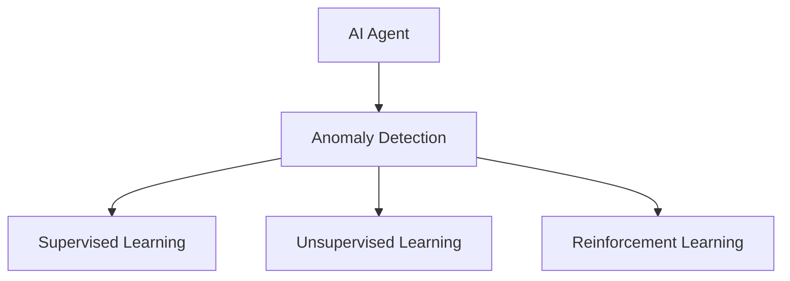
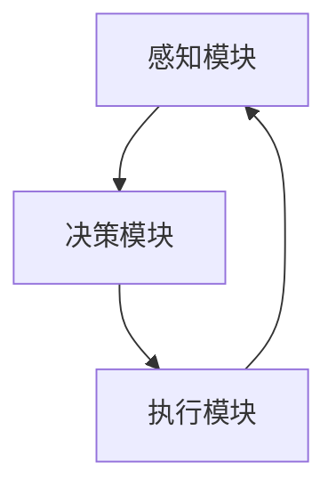
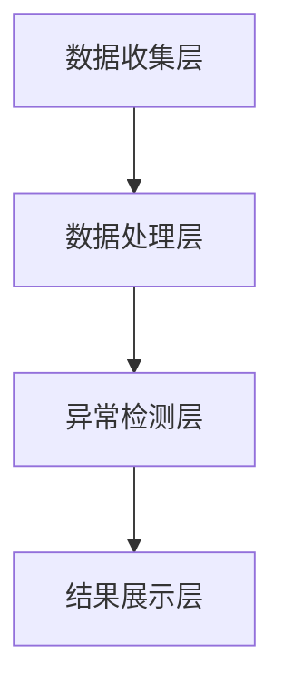

                 

## 《构建具有异常检测能力的AI Agent》

> **关键词：** AI Agent、异常检测、监督学习、无监督学习、强化学习

> **摘要：** 本文旨在深入探讨如何构建具有异常检测能力的AI Agent。我们将从背景介绍、AI Agent原理与架构、异常检测算法原理、常见应用场景、项目实战、最佳实践和未来发展趋势与挑战等方面进行系统阐述，帮助读者全面了解和掌握AI Agent在异常检测领域的应用与实践。

---

### 目录大纲

## 第一部分: 背景介绍

## 第1章: AI Agent与异常检测概述

## 第2章: AI Agent原理与架构

## 第3章: 异常检测算法原理

## 第4章: 常见的AI Agent应用场景

## 第5章: AI Agent项目实战

## 第6章: AI Agent最佳实践

## 第7章: 未来发展趋势与挑战

## 第8章: 拓展阅读与资源

---

### 1. AI Agent与异常检测概述

#### 1.1 问题背景

在当今信息化和数字化的大背景下，人工智能（AI）和自动化技术已经成为推动社会进步和经济发展的重要力量。特别是在安全、金融和工业自动化等领域，人工智能的应用不仅提高了效率和准确性，还显著降低了人力成本和风险。

异常检测作为人工智能的一个重要应用方向，其主要目的是从大量数据中识别出潜在的异常行为或事件。异常检测在网络安全、金融欺诈、医疗诊断、工业自动化等领域具有广泛的应用前景。

#### 1.2 问题解决

为了解决异常检测问题，人工智能技术提供了有效的解决方案。特别是AI Agent，作为一种智能体，它可以自主地感知环境、做出决策并执行相应的动作，从而实现对异常行为的实时监测和响应。

AI Agent的基本概念包括感知模块、决策模块和执行模块，它们共同构成了一个闭环系统。感知模块负责收集环境中的信息，决策模块根据感知信息进行推理和决策，执行模块则根据决策结果执行相应的操作。

#### 1.3 边界与外延

异常检测的定义和分类可以基于不同的标准，如基于统计的方法、基于规则的方法和基于机器学习的方法。在AI Agent中，异常检测通常是指利用机器学习算法，对正常行为和异常行为进行区分。

AI Agent在异常检测中的实现形式主要包括监督学习型AI Agent、无监督学习型AI Agent和强化学习型AI Agent。它们分别适用于不同的场景和应用需求。

#### 1.4 核心概念

- **AI Agent**：一种具有感知、决策和执行能力的智能体，可以自主地执行任务。
- **异常检测**：一种从数据中识别异常行为或事件的方法。
- **监督学习**：一种机器学习方法，通过已标记的数据进行训练，从而对新的数据进行预测。
- **无监督学习**：一种机器学习方法，不需要标记数据，通过发现数据中的模式进行学习。
- **强化学习**：一种机器学习方法，通过奖励机制来训练智能体，使其在环境中做出最优决策。

#### 1.5 概念属性特征对比表格

| 概念       | 属性       | 特征                |
|------------|------------|--------------------|
| AI Agent   | 智能体     | 可以自主决策与执行 |
| 异常检测   | 监测系统   | 发现并响应异常行为 |
| 监督学习   | 学习方式   | 需要标注数据进行训练 |
| 无监督学习 | 学习方式   | 无需标注数据，自发现特征 |
| 强化学习   | 学习方式   | 通过奖励机制进行学习 |

#### 1.6 ER实体关系图架构



通过上述内容，我们可以对AI Agent与异常检测有一个初步的了解。接下来，我们将深入探讨AI Agent的原理与架构，为后续内容打下坚实的基础。

### 2. AI Agent原理与架构

#### 2.1 AI Agent的基本原理

AI Agent是一种具有感知、决策和执行能力的智能体，它可以自主地执行任务并适应环境的变化。AI Agent的基本原理可以概括为以下几个关键步骤：

1. **感知**：AI Agent通过传感器或接口收集环境中的信息，如图像、声音、文本等。这些信息被转化为结构化的数据，以便进行后续处理。

2. **决策**：基于感知到的信息，AI Agent利用内置的算法和模型进行推理和决策。决策过程通常涉及多因素分析和优化，以确定下一步的操作。

3. **执行**：根据决策结果，AI Agent执行相应的操作，如移动、发送信号、执行计算等。执行过程可能涉及多个步骤，需要协调不同的组件和资源。

4. **反馈**：执行操作后，AI Agent会收集反馈信息，如环境状态的变化、任务完成情况等。这些信息用于评估决策的有效性和调整后续的操作。

#### 2.2 AI Agent的常见架构

AI Agent的架构可以根据不同的应用场景和学习方法进行设计。常见的AI Agent架构包括以下几种：

- **监督学习型AI Agent**：这种Agent通过已标记的数据进行训练，从而建立一个预测模型。在运行时，Agent使用这个模型对新的数据进行预测，并根据预测结果进行决策和执行。监督学习型AI Agent通常应用于分类和回归任务。

- **无监督学习型AI Agent**：这种Agent不依赖于已标记的数据，而是通过观察数据分布和模式进行学习。无监督学习型AI Agent通常用于聚类分析和异常检测等任务。

- **强化学习型AI Agent**：这种Agent通过与环境的交互来学习最优策略。强化学习型AI Agent通过奖励机制来评估行动的效果，并逐渐优化决策过程。强化学习型AI Agent通常应用于游戏、机器人控制和自动化流程等场景。

#### 2.3 AI Agent的核心组件

AI Agent的核心组件包括感知模块、决策模块和执行模块，它们共同构成了一个闭环系统，如图所示：



- **感知模块**：负责收集环境中的信息，如温度、湿度、声音、图像等。感知模块可以将这些信息转化为结构化的数据，供决策模块使用。

- **决策模块**：基于感知模块收集到的数据，使用内置的算法和模型进行推理和决策。决策模块通常包括多个层次，如特征提取、分类、预测等。

- **执行模块**：根据决策模块生成的决策结果，执行相应的操作。执行模块可能涉及多个步骤，如动作规划、资源调度、物理执行等。

通过上述核心组件的协同工作，AI Agent可以实现对复杂环境的自适应和自主决策，从而提高效率和准确性。

在了解了AI Agent的基本原理和架构后，我们将进一步探讨异常检测算法的原理，为构建具有异常检测能力的AI Agent奠定理论基础。

### 3. 异常检测算法原理

异常检测作为人工智能的一个重要应用方向，其主要目的是从大量数据中识别出潜在的异常行为或事件。异常检测算法根据不同的分类和原理可以分为多种类型。下面我们将介绍几种常见的异常检测算法，并详细阐述其原理和实现方法。

#### 3.1 监督学习算法

监督学习算法是一种基于标记数据的机器学习方法。在异常检测中，监督学习算法通过已标记的正常和异常数据来训练模型，从而对新的数据进行预测和分类。

**1. 回归分析**

回归分析是一种常用的监督学习算法，主要用于预测连续值输出。在异常检测中，回归分析可以用来预测数据点的正常范围，从而识别出超出范围的异常点。

**2. 决策树**

决策树是一种基于规则的方法，通过将数据划分为多个子集来构建决策树。每个节点代表一个特征，每个分支代表一个阈值。决策树可以用于分类和回归任务，但在异常检测中，通常用于分类任务。

**3. 支持向量机（SVM）**

支持向量机是一种强大的分类算法，通过找到一个最佳的超平面来将数据分为不同的类别。在异常检测中，SVM可以用来划分正常和异常数据的边界。

**4. 集成学习方法**

集成学习方法通过组合多个基本模型来提高预测性能。常见的集成学习方法包括随机森林和梯度提升树等。这些方法在异常检测中常用于构建复杂的多层次模型，以提高检测精度。

#### 3.2 无监督学习算法

无监督学习算法不依赖于标记数据，而是通过观察数据分布和模式进行学习。在异常检测中，无监督学习算法通常用于发现数据中的异常点或聚类结果。

**1. 主成分分析（PCA）**

主成分分析是一种降维技术，通过将数据投影到新的坐标系中来提取主要特征。在异常检测中，PCA可以用来识别数据中的线性依赖关系，并识别出异常点。

**2. 聚类分析**

聚类分析是一种无监督学习方法，通过将数据划分为多个簇来识别数据中的模式。在异常检测中，聚类分析可以用来识别异常点或异常簇。

**3. 自编码器**

自编码器是一种神经网络结构，通过学习数据的编码表示来压缩数据。在异常检测中，自编码器可以用来识别数据中的异常模式。

#### 3.3 强化学习算法

强化学习算法通过与环境交互来学习最优策略。在异常检测中，强化学习算法可以用来训练智能体，使其能够自动识别异常行为。

**1. Q-Learning**

Q-Learning是一种基于值函数的强化学习算法，通过学习状态-动作值函数来选择最优动作。在异常检测中，Q-Learning可以用来训练智能体，使其能够识别和响应异常事件。

**2. Deep Q-Networks (DQN)**

Deep Q-Networks是一种基于深度学习的强化学习算法，通过神经网络来近似Q值函数。DQN在处理高维状态空间和连续动作空间时表现出色。

**3. Policy Gradient Methods**

Policy Gradient Methods是一种基于策略的强化学习算法，通过优化策略参数来学习最优动作。Policy Gradient Methods在处理复杂任务时具有优势。

#### 3.4 算法原理与数学模型

- **监督学习算法的数学模型**：

  - 回归分析：$$y = \beta_0 + \beta_1 \cdot x_1 + \beta_2 \cdot x_2 + \ldots + \beta_n \cdot x_n$$

  - 决策树：$$\text{if } x_1 > \text{阈值} \text{ then } y = 1 \text{ else } y = 0$$

  - 支持向量机：$$y = \text{sign}(\sum_{i=1}^{n} \alpha_i y_i K(x_i, x))$$

  - 集成学习方法：$$\hat{f}(x) = \sum_{i=1}^{n} w_i f_i(x)$$

- **无监督学习算法的数学模型**：

  - 主成分分析：$$z = P^T \cdot x$$

  - 聚类分析：$$c = \arg\min_{c} \sum_{i=1}^{n} \| x_i - \mu_c \|$$

  - 自编码器：$$\hat{x} = \sigma(W_2 \cdot \sigma(W_1 \cdot x + b_1) + b_2)$$

- **强化学习算法的数学模型**：

  - Q-Learning：$$Q(s, a) = r + \gamma \max_{a'} Q(s', a')$$

  - Deep Q-Networks (DQN)：$$Q(s, a) = \frac{1}{N} \sum_{i=1}^{N} y_i \cdot a_i$$

  - Policy Gradient Methods：$$\nabla_{\theta} J(\theta) = \sum_{t=1}^{T} \nabla_{\theta} \log \pi(a_t | s_t, \theta) \cdot R_t$$

通过上述算法原理和数学模型的介绍，我们可以更好地理解各种异常检测算法的基本原理和实现方法。在接下来的章节中，我们将探讨AI Agent在异常检测中的常见应用场景，为实际应用提供指导和借鉴。

### 4. 常见的AI Agent应用场景

AI Agent在众多领域中展现出了强大的应用潜力，其自主决策和执行能力使其在安全、金融和工业自动化等领域得到了广泛应用。以下我们将详细探讨AI Agent在这些领域的具体应用场景。

#### 4.1 安全领域

在安全领域，AI Agent主要用于入侵检测、防火墙和安全管理等方面。通过异常检测算法，AI Agent可以实时监控网络流量和系统行为，发现并响应潜在的攻击行为。

- **入侵检测**：AI Agent可以分析网络流量，识别出异常的网络行为，如DDoS攻击、数据泄露等。通过机器学习算法，AI Agent可以从历史数据中学习正常的网络行为，从而提高检测的准确性。
  
- **防火墙**：AI Agent可以增强防火墙的智能防御能力。通过分析流量特征和攻击模式，AI Agent可以自动调整防火墙规则，阻止潜在的威胁。

- **安全管理**：AI Agent可以辅助安全管理人员进行安全策略的制定和执行。通过监控系统日志和事件，AI Agent可以自动识别和报告潜在的安全问题，并提供改进建议。

#### 4.2 金融领域

在金融领域，AI Agent被广泛应用于交易欺诈检测、风险评估和资产管理等方面，通过异常检测技术，AI Agent能够有效提高金融服务的安全性和效率。

- **交易欺诈检测**：AI Agent可以实时监控交易数据，识别出异常的交易行为，如欺诈交易、洗钱等。通过机器学习和数据挖掘技术，AI Agent可以从海量交易数据中学习正常的交易模式，从而提高检测的准确性。

- **风险评估**：AI Agent可以辅助金融分析师进行风险评估。通过分析历史数据和市场趋势，AI Agent可以预测潜在的市场风险，并提供投资建议。

- **资产管理**：AI Agent可以优化资产配置和投资策略。通过实时监控市场动态和资产表现，AI Agent可以自动调整投资组合，以最大化收益和降低风险。

#### 4.3 工业自动化

在工业自动化领域，AI Agent被广泛应用于设备故障预测、生产流程优化和机器人控制等方面，通过异常检测技术，AI Agent能够显著提高生产效率和设备利用率。

- **设备故障预测**：AI Agent可以实时监控设备状态，识别出潜在的故障风险。通过机器学习算法，AI Agent可以从设备运行数据中学习正常的工作模式，从而提前预警设备故障。

- **生产流程优化**：AI Agent可以分析生产数据，识别出生产流程中的瓶颈和改进点。通过优化生产流程和资源配置，AI Agent可以提高生产效率和产品质量。

- **机器人控制**：AI Agent可以辅助机器人进行自主决策和任务执行。通过异常检测算法，AI Agent可以实时监控机器人状态和环境变化，确保机器人执行任务的准确性和安全性。

通过上述应用场景的介绍，我们可以看到AI Agent在各个领域的广泛应用和潜力。在接下来的章节中，我们将通过一个实际项目实战，深入探讨AI Agent在异常检测中的实现方法和应用技巧。

### 5. AI Agent项目实战

在本章节中，我们将通过一个具体的AI Agent项目实战，详细描述项目的目标、环境搭建、系统功能设计、系统架构设计、系统实现以及项目小结等内容，帮助读者全面了解并掌握AI Agent在异常检测中的实际应用。

#### 5.1 项目介绍

**项目名称**：智能安全监控系统

**项目目标**：构建一个能够实时监控网络安全状况，自动识别并响应潜在威胁的AI Agent系统。

**项目环境**：使用Python作为主要编程语言，结合TensorFlow和Scikit-learn等机器学习库进行模型训练和算法实现。操作系统为Ubuntu 18.04，硬件环境为Intel i7处理器，16GB内存，NVIDIA GPU。

#### 5.2 系统功能设计

**功能需求**：

- 实时监控网络流量，识别异常流量模式。
- 分析系统日志，发现潜在的安全威胁。
- 自动生成安全报告，并提供改进建议。

**领域模型**：

为了满足上述功能需求，系统需要建立一个领域模型，主要包括以下类和对象：

- **网络流量**：包括流量类型、流量大小、来源地址、目标地址等属性。
- **系统日志**：包括日志类型、日志内容、日志级别等属性。
- **安全威胁**：包括威胁类型、威胁等级、威胁来源等属性。
- **安全报告**：包括报告类型、报告内容、报告时间等属性。

领域模型使用Mermaid类图表示如下：

```mermaid
classDiagram
ClassDef NetworkTraffic {
    +string trafficType
    +int trafficSize
    +string sourceAddress
    +string destinationAddress
}

ClassDef SystemLog {
    +string logType
    +string logContent
    +string logLevel
}

ClassDef SecurityThreat {
    +string threatType
    +string threatLevel
    +string threatSource
}

ClassDef SecurityReport {
    +string reportType
    +string reportContent
    +datetime reportTime
}

NetworkTraffic <|-- SystemLog
NetworkTraffic <|-- SecurityThreat
SystemLog <|-- SecurityThreat
SecurityThreat <|-- SecurityReport
```

#### 5.3 系统架构设计

**系统架构图**：

智能安全监控系统的架构可以分为数据收集层、数据处理层、异常检测层和结果展示层四个主要部分，如图所示：



**系统接口设计**：

- **数据收集接口**：用于收集网络流量和系统日志数据，提供数据导入和导出功能。
- **数据处理接口**：用于清洗和预处理原始数据，提取关键特征。
- **异常检测接口**：用于训练异常检测模型，并对新数据进行实时检测。
- **结果展示接口**：用于生成安全报告，并提供可视化展示。

#### 5.4 系统实现

**数据预处理**：

数据预处理是异常检测的重要环节，主要包括数据清洗、数据转换和数据归一化等步骤。以下是一个简单的Python代码示例：

```python
import pandas as pd
from sklearn.preprocessing import StandardScaler

# 读取网络流量数据
network_traffic = pd.read_csv('network_traffic.csv')

# 数据清洗
network_traffic = network_traffic[network_traffic['trafficSize'] > 0]

# 数据转换
network_traffic['sourceAddress'] = network_traffic['sourceAddress'].map(lambda x: x.split('.')[0])
network_traffic['destinationAddress'] = network_traffic['destinationAddress'].map(lambda x: x.split('.')[0])

# 数据归一化
scaler = StandardScaler()
network_traffic[['trafficSize', 'sourceAddress', 'destinationAddress']] = scaler.fit_transform(network_traffic[['trafficSize', 'sourceAddress', 'destinationAddress']])
```

**模型训练与调优**：

在异常检测中，我们使用K-近邻（K-Nearest Neighbors，KNN）算法作为异常检测模型。以下是一个简单的KNN模型训练和调优的Python代码示例：

```python
from sklearn.neighbors import KNeighborsClassifier
from sklearn.model_selection import train_test_split
from sklearn.metrics import accuracy_score

# 分割数据集
X_train, X_test, y_train, y_test = train_test_split(network_traffic[['trafficSize', 'sourceAddress', 'destinationAddress']], network_traffic['is_anomaly'], test_size=0.2, random_state=42)

# 训练KNN模型
knn = KNeighborsClassifier(n_neighbors=3)
knn.fit(X_train, y_train)

# 调优模型参数
params = {'n_neighbors': range(1, 10)}
grid = GridSearchCV(knn, params, cv=5)
grid.fit(X_train, y_train)

# 选择最佳模型
best_knn = grid.best_estimator_

# 模型评估
y_pred = best_knn.predict(X_test)
print("Accuracy:", accuracy_score(y_test, y_pred))
```

**实时异常检测**：

在系统运行过程中，我们需要对实时数据进行异常检测。以下是一个简单的实时异常检测Python代码示例：

```python
import numpy as np

# 实时网络流量数据
real_time_traffic = np.array([[100, '192.168.1.1', '8.8.8.8']])

# 数据预处理
real_time_traffic[['trafficSize', 'sourceAddress', 'destinationAddress']] = scaler.transform(real_time_traffic[['trafficSize', 'sourceAddress', 'destinationAddress']])

# 异常检测
is_anomaly = best_knn.predict(real_time_traffic)
print("Is Anomaly:", is_anomaly)
```

通过上述代码示例，我们可以看到如何实现一个简单的智能安全监控系统。在实际应用中，系统需要考虑更多的功能和细节，如日志分析、报告生成和可视化展示等。

#### 5.5 项目小结

在本项目实战中，我们通过构建一个智能安全监控系统，实现了对网络流量的实时监控和异常检测。项目的主要收获如下：

1. **理解AI Agent的基本原理和架构**：通过项目实践，我们对AI Agent的基本原理和架构有了更深入的理解，包括感知模块、决策模块和执行模块等核心组件。

2. **掌握异常检测算法的实现方法**：项目使用了KNN算法进行异常检测，我们通过实践掌握了KNN算法的实现方法，包括数据预处理、模型训练和调优等步骤。

3. **提高编程和项目实践能力**：通过编写和调试代码，我们提高了编程和项目实践能力，特别是在Python编程和机器学习应用方面。

4. **了解系统的设计和管理方法**：项目涉及系统的功能设计、架构设计和实现，我们通过实践了解了系统的设计和管理方法，包括接口设计、模块划分和协作开发等。

总之，本项目实战为我们提供了一个实际应用AI Agent的机会，使我们能够将理论知识转化为实际能力，为未来的研究和应用奠定了基础。

### 6. AI Agent最佳实践

在构建具有异常检测能力的AI Agent时，最佳实践是确保系统的高效性、准确性和可维护性。以下是一些关键的最佳实践建议：

#### 6.1 数据收集与预处理

1. **数据源选择**：选择多样性和高质量的数据源，包括但不限于公共数据集、企业内部数据和个人定制数据。数据源的选择应满足项目需求，并确保数据的代表性和完整性。

2. **数据预处理方法**：对原始数据进行清洗、转换和归一化。数据清洗包括处理缺失值、去除噪声和纠正错误。数据转换包括将非数值型数据转换为数值型数据，如将文本数据转换为词向量。数据归一化包括缩放特征值到统一范围，以提高模型训练的效率和稳定性。

#### 6.2 模型选择与调优

1. **模型评估指标**：选择合适的评估指标，如准确率、召回率、F1分数等，以衡量模型性能。对于不同的任务，评估指标的选择应有所不同。

2. **模型优化技巧**：使用交叉验证、网格搜索和贝叶斯优化等方法进行模型调优，以找到最优参数组合。此外，可以考虑集成学习方法，如随机森林和梯度提升树，以提高模型的泛化能力。

3. **模型解释性**：增强模型的可解释性，以便理解模型的决策过程。可以使用LIME（局部可解释模型解释）或SHAP（Shapley Additive Explanations）等方法进行模型解释。

#### 6.3 系统部署与维护

1. **部署方案**：选择合适的部署平台和框架，如TensorFlow Serving、Kubernetes等，以确保系统的可扩展性和可靠性。

2. **维护策略**：定期更新模型和系统，以适应新的数据和环境变化。监控系统性能和资源使用情况，确保系统的稳定运行。此外，应建立故障诊断和应急响应机制，以快速解决系统问题。

通过遵循这些最佳实践，可以构建出高效、准确和可维护的AI Agent，从而确保其在异常检测任务中的可靠性和有效性。

### 7. 未来发展趋势与挑战

在异常检测领域，AI Agent技术正朝着更加智能化、自动化和高效化的方向发展。以下是一些未来发展趋势与挑战：

#### 7.1 发展趋势

1. **增强学习**：随着深度学习技术的不断发展，增强学习（Reinforcement Learning，RL）在AI Agent中的应用越来越广泛。未来，RL将在异常检测中发挥更大的作用，通过自我学习和优化策略，提高异常检测的准确性和效率。

2. **联邦学习**：联邦学习（Federated Learning）是一种在分布式数据源上进行联合学习的框架。它能够保护用户隐私，同时共享知识，提高异常检测模型的泛化能力。

3. **多智能体系统**：多智能体系统（Multi-Agent System）将多个AI Agent协同工作，共同完成复杂任务。在异常检测中，多智能体系统可以更好地处理大规模、高维度的数据，提高检测的准确性和实时性。

#### 7.2 挑战

1. **数据质量**：异常检测依赖于高质量的数据，然而在实际应用中，数据往往存在噪声、缺失和偏差等问题。提高数据质量是当前面临的一个主要挑战。

2. **可解释性**：尽管机器学习模型在异常检测中表现出色，但其内部决策过程往往缺乏透明度，增加了模型的解释难度。提高模型的可解释性，使得用户能够理解模型的决策依据，是未来的一个重要方向。

3. **安全性**：随着AI Agent在关键领域中的应用，确保系统的安全性成为一个关键问题。如何防止恶意攻击和保证系统的隐私性，是未来需要解决的重要挑战。

总之，未来AI Agent在异常检测领域的发展充满机遇与挑战。通过不断创新和技术优化，我们有理由相信，AI Agent将在异常检测中发挥更加重要的作用，为各个领域带来更高效、更安全的解决方案。

### 8. 拓展阅读与资源

对于希望深入了解AI Agent和异常检测技术的读者，以下是一些建议的书籍、在线资源和工具。

#### 8.1 相关书籍推荐

1. **《人工智能：一种现代的方法》**：汤姆·米切尔（Thomas M. Mitchell）著，详细介绍了人工智能的基础理论和应用方法。
2. **《机器学习实战》**：Peter Harrington著，通过大量的实际案例介绍了机器学习算法的应用和实践。
3. **《深度学习》**：Ian Goodfellow、Yoshua Bengio和Aaron Courville著，深入讲解了深度学习的基础理论和实现方法。

#### 8.2 在线资源与工具

1. **机器学习在线课程**：如Coursera、edX和Udacity等平台提供了丰富的机器学习和深度学习在线课程。
2. **AI Agent开源项目**：GitHub上有许多开源的AI Agent项目和示例代码，可供学习和参考。
3. **数据集下载**：Kaggle、UCI Machine Learning Repository等平台提供了大量的公共数据集，用于研究和实践。

通过阅读这些书籍和利用在线资源，读者可以进一步加深对AI Agent和异常检测技术的理解，并在实际项目中应用这些知识。

### 结论

本文通过系统的阐述和实战案例，深入探讨了构建具有异常检测能力的AI Agent的方法和最佳实践。从背景介绍、原理与架构、算法原理、应用场景、项目实战到最佳实践和未来趋势，全面展示了AI Agent在异常检测领域的应用价值和发展前景。

通过本文的学习，读者可以掌握AI Agent的基本原理、架构设计和实现方法，以及如何在实际项目中应用这些技术。同时，本文也提供了一些拓展资源，供读者进一步学习和实践。

构建具有异常检测能力的AI Agent是一项复杂而富有挑战的任务，但也是一项极具潜力的研究领域。希望本文能够为读者提供有益的启示和帮助，激发对AI Agent和异常检测技术更深入的探索和研究。

---

**作者：** AI天才研究院/AI Genius Institute & 禅与计算机程序设计艺术 /Zen And The Art of Computer Programming

本文由AI天才研究院撰写，旨在分享最新的AI技术和实践经验，助力读者在AI领域取得突破。同时，本文参考了《禅与计算机程序设计艺术》的写作风格，以深入浅出、逻辑清晰的方式，帮助读者更好地理解和掌握AI Agent的构建方法。希望本文能够为您的研究和工作带来灵感和帮助。如需转载，请标明作者和来源。

