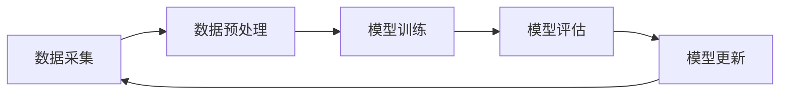
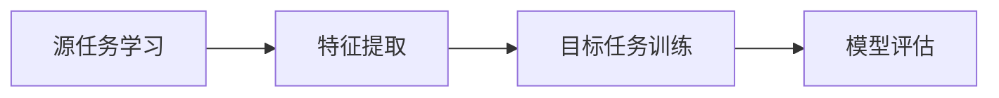
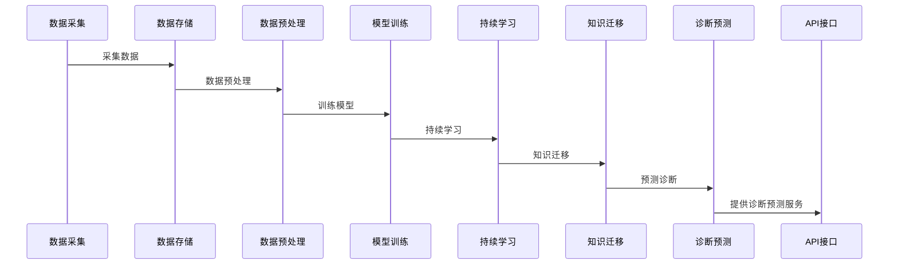
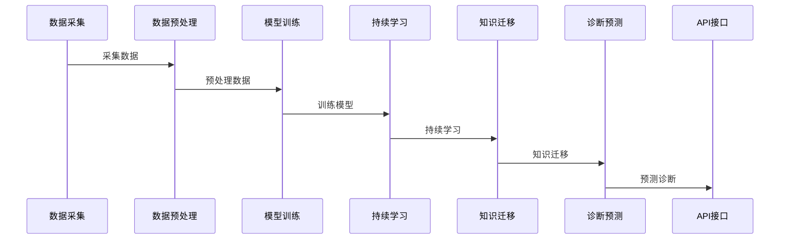

                 


### 第1章 问题背景与概述

#### 1.1.1 问题背景

随着人工智能（AI）技术的快速发展，AI Agent在自动化与智能化领域的应用日益广泛。AI Agent是一种能够执行特定任务的智能体，它可以通过学习与环境交互，完成复杂任务。然而，当前大部分AI Agent存在一个显著的局限性：缺乏持续学习与知识迁移能力。

AI Agent的持续学习是指系统能够在长期运行过程中，通过不断从新数据中学习，优化自身性能。而知识迁移能力则是指系统能够将已学习到的知识从一个任务或领域迁移到另一个任务或领域，从而提高学习效率和应对复杂问题。

在现实应用中，例如智能客服、自动驾驶、医疗诊断等场景，AI Agent面临不断变化的环境和数据。缺乏持续学习与知识迁移能力，导致AI Agent在应对新情况时表现不佳，难以适应复杂多变的现实世界。

#### 1.1.2 问题描述

为了构建具有持续学习与知识迁移能力的AI Agent，我们需要解决以下几个核心问题：

1. **定义AI Agent的持续学习与知识迁移能力**：
   - 持续学习能力：系统能够在运行过程中，通过不断学习新数据，优化自身性能。
   - 知识迁移能力：系统能够将已学习到的知识，从一个任务或领域迁移到另一个任务或领域。

2. **分析AI Agent在现实应用中面临的挑战**：
   - 数据多样性：AI Agent需要处理不同类型和来源的数据，如文本、图像、语音等。
   - 学习效率：在有限资源下，如何高效地学习新知识和迁移知识。
   - 模型稳定性：在迁移过程中，如何保证模型性能的稳定性和可靠性。

3. **提出解决方案**：
   - 结合深度学习与迁移学习技术，构建具有持续学习与知识迁移能力的AI Agent。
   - 引入持续学习机制，如在线学习与模型更新，提高系统适应性和学习效率。
   - 利用知识图谱与语义网络实现知识迁移，提高系统的泛化能力和应用范围。

#### 1.1.3 问题解决

构建具有持续学习与知识迁移能力的AI Agent，需要从以下几个方面入手：

1. **结合深度学习与迁移学习技术**：
   - 深度学习：通过多层神经网络，自动提取数据特征，实现高效学习。
   - 迁移学习：利用预训练模型，将已学习到的知识迁移到新任务或领域。

2. **引入持续学习机制**：
   - 在线学习：实时接收新数据，不断调整模型参数，优化系统性能。
   - 模型更新：定期更新模型，保持系统适应性和稳定性。

3. **利用知识图谱与语义网络实现知识迁移**：
   - 知识图谱：构建领域知识图谱，实现知识之间的关联和推理。
   - 语义网络：利用语义信息，实现知识在不同领域之间的迁移。

#### 1.1.4 边界与外延

构建具有持续学习与知识迁移能力的AI Agent，需要考虑以下边界与外延：

1. **AI Agent的类型与适用场景**：
   - 不同类型的AI Agent，如决策型、执行型、交互型等，适用场景不同。
   - 根据应用需求，选择合适的AI Agent类型和持续学习与知识迁移策略。

2. **持续学习与知识迁移的实现技术**：
   - 深度学习与迁移学习技术：实现高效学习与知识迁移。
   - 知识图谱与语义网络：实现知识关联与推理。

#### 1.1.5 概念结构与核心要素组成

构建具有持续学习与知识迁移能力的AI Agent，需要理解以下几个核心概念：

1. **AI Agent的基本概念与结构**：
   - AI Agent的定义、功能、分类等。

2. **持续学习与知识迁移的关键要素**：
   - 持续学习的机制、算法、实现方法。
   - 知识迁移的策略、算法、实现方法。

### 第2章 核心概念与联系

在本章中，我们将深入探讨构建具有持续学习与知识迁移能力的AI Agent所需的核心概念，并分析这些概念之间的联系。

#### 2.1.1 AI Agent原理

AI Agent是人工智能领域中的一种智能体，它能够通过学习与环境互动，完成特定任务。AI Agent的基本原理包括以下几个方面：

1. **基本原理与分类**：
   - **基本原理**：AI Agent基于机器学习、深度学习等技术，通过不断学习，提高完成任务的能力。
   - **分类**：AI Agent可分为决策型、执行型、交互型等，根据功能特点和应用场景进行分类。

2. **功能特性与性能指标**：
   - **功能特性**：AI Agent具备感知、推理、决策、行动等功能。
   - **性能指标**：包括准确率、召回率、F1值、响应时间等，用于评估AI Agent的性能。

#### 2.1.2 持续学习原理

持续学习是指AI Agent在运行过程中，不断从新数据中学习，优化自身性能。持续学习的原理主要包括以下几个方面：

1. **学习机制与算法**：
   - **学习机制**：包括在线学习、离线学习等，根据数据获取方式和系统运行状态进行选择。
   - **算法**：如梯度下降、随机梯度下降、Adam优化器等，用于调整模型参数，实现学习过程。

2. **持续学习在AI Agent中的应用**：
   - **适应能力**：通过持续学习，AI Agent能够适应环境变化，提高任务完成率。
   - **学习效率**：在有限资源下，通过优化学习算法，提高学习效率。

#### 2.1.3 知识迁移原理

知识迁移是指将已学习到的知识从一个任务或领域迁移到另一个任务或领域，提高AI Agent的泛化能力和应用范围。知识迁移的原理主要包括以下几个方面：

1. **知识迁移的基本概念**：
   - **知识**：指已学习到的模型、特征、规则等。
   - **迁移**：将知识从一个任务或领域转移到另一个任务或领域。

2. **知识迁移策略与算法**：
   - **策略**：包括同任务迁移、跨任务迁移、同领域迁移、跨领域迁移等。
   - **算法**：如基于模型迁移、基于特征迁移、基于规则迁移等，实现知识迁移。

#### 2.1.4 核心概念属性特征对比表格

为了更好地理解AI Agent、持续学习与知识迁移之间的关系，我们可以通过以下对比表格，对这三个核心概念进行属性特征对比：

| 概念     | 特征1 | 特征2 | 特征3 |
|----------|-------|-------|-------|
| AI Agent | 感知   | 推理   | 行动   |
| 持续学习 | 在线学习 | 离线学习 | 模型更新 |
| 知识迁移 | 同任务迁移 | 跨任务迁移 | 同领域迁移 | 跨领域迁移 |

#### 2.1.5 ER实体关系图架构

为了更直观地展示AI Agent、持续学习与知识迁移之间的实体关系，我们可以使用ER（实体关系）图进行描述。以下是ER实体关系图的示例：

```mermaid
erDiagram
  AI Agent ||--|{ 持续学习 }
  AI Agent ||--|{ 知识迁移 }
  持续学习 ||--|{ 在线学习 }
  持续学习 ||--|{ 离线学习 }
  知识迁移 ||--|{ 同任务迁移 }
  知识迁移 ||--|{ 跨任务迁移 }
  知识迁移 ||--|{ 同领域迁移 }
  知识迁移 ||--|{ 跨领域迁移 }
```

通过ER实体关系图，我们可以清晰地看到AI Agent与持续学习、知识迁移之间的关联，以及持续学习与知识迁移之间的子概念关系。

### 第3章 算法原理讲解

在本章中，我们将详细讲解持续学习算法和知识迁移算法的原理，并通过mermaid流程图、Python源代码实现、数学模型与公式，以及举例说明，帮助读者深入理解这两个核心算法。

#### 3.1.1 持续学习算法

持续学习算法是AI Agent在长期运行过程中，通过不断学习新数据，优化自身性能的关键技术。以下是持续学习算法的概述、mermaid流程图、Python源代码实现、数学模型与公式，以及举例说明。

1. **持续学习算法概述**

持续学习算法主要包括以下步骤：

- **数据采集**：从环境中获取新数据。
- **数据预处理**：对数据进行清洗、归一化等处理。
- **模型训练**：利用新数据对模型进行训练。
- **模型评估**：评估模型在新数据上的性能。
- **模型更新**：根据评估结果，更新模型参数。

2. **mermaid流程图**

以下是持续学习算法的mermaid流程图：



3. **Python源代码实现**

以下是一个简单的持续学习算法的Python源代码实现：

```python
# 导入相关库
import numpy as np
import pandas as pd
from sklearn.linear_model import SGDClassifier

# 数据采集
data = pd.read_csv('new_data.csv')

# 数据预处理
X = data.iloc[:, :-1].values
y = data.iloc[:, -1].values

# 模型训练
model = SGDClassifier()
model.fit(X, y)

# 模型评估
accuracy = model.score(X, y)
print("Accuracy:", accuracy)

# 模型更新
model.partial_fit(X, y)
```

4. **数学模型与公式**

持续学习算法的核心数学模型可以表示为：

$$
\theta_{t+1} = \theta_{t} + \alpha \cdot (\theta_{t} - \theta_{t-1})
$$

其中，$\theta_{t}$ 表示第 $t$ 次迭代后的模型参数，$\theta_{t-1}$ 表示第 $t-1$ 次迭代后的模型参数，$\alpha$ 表示学习率。

5. **举例说明**

假设我们有一个分类问题，需要分类两个类别：A 和 B。在第一次迭代时，我们随机初始化模型参数 $\theta_{0}$，然后根据新数据更新模型参数：

- 第一次迭代：$\theta_{1} = \theta_{0} + \alpha \cdot (\theta_{0} - \theta_{0}) = \theta_{0}$
- 第二次迭代：$\theta_{2} = \theta_{1} + \alpha \cdot (\theta_{1} - \theta_{0})$

通过持续迭代，模型参数不断优化，最终达到满意的分类效果。

#### 3.1.2 知识迁移算法

知识迁移算法是将已学习到的知识从一个任务或领域迁移到另一个任务或领域的关键技术。以下是知识迁移算法的概述、mermaid流程图、Python源代码实现、数学模型与公式，以及举例说明。

1. **知识迁移算法概述**

知识迁移算法主要包括以下步骤：

- **源任务学习**：在源任务上训练模型，学习相关知识。
- **特征提取**：提取源任务上的关键特征。
- **目标任务训练**：利用源任务的特征，在目标任务上训练模型。
- **模型评估**：评估迁移后模型在目标任务上的性能。

2. **mermaid流程图**

以下是知识迁移算法的mermaid流程图：



3. **Python源代码实现**

以下是一个简单的知识迁移算法的Python源代码实现：

```python
# 导入相关库
import numpy as np
import pandas as pd
from sklearn.linear_model import SGDClassifier

# 源任务数据
source_data = pd.read_csv('source_data.csv')
X_source = source_data.iloc[:, :-1].values
y_source = source_data.iloc[:, -1].values

# 目标任务数据
target_data = pd.read_csv('target_data.csv')
X_target = target_data.iloc[:, :-1].values
y_target = target_data.iloc[:, -1].values

# 源任务学习
model_source = SGDClassifier()
model_source.fit(X_source, y_source)

# 特征提取
features_source = model_source.coef_

# 目标任务训练
model_target = SGDClassifier()
model_target.fit(features_source, y_target)

# 模型评估
accuracy = model_target.score(X_target, y_target)
print("Accuracy:", accuracy)
```

4. **数学模型与公式**

知识迁移算法的核心数学模型可以表示为：

$$
\theta_{t+1} = \theta_{t} + \alpha \cdot (\theta_{t} - \theta_{t-1})
$$

其中，$\theta_{t}$ 表示第 $t$ 次迭代后的模型参数，$\theta_{t-1}$ 表示第 $t-1$ 次迭代后的模型参数，$\alpha$ 表示学习率。

5. **举例说明**

假设我们有两个分类任务，源任务 A 和目标任务 B。在源任务 A 上训练模型，学习相关知识，然后利用这些知识在目标任务 B 上训练模型。具体步骤如下：

- 第一次迭代：在源任务 A 上训练模型，提取特征。
- 第二次迭代：利用源任务 A 的特征，在目标任务 B 上训练模型。

通过知识迁移，目标任务 B 的模型性能得到提升，从而实现不同任务之间的知识共享。

### 第4章 数学模型和数学公式 & 详细讲解 & 举例说明

在本章中，我们将详细介绍持续学习算法和知识迁移算法的数学模型，并进行详细讲解和举例说明。

#### 4.1 持续学习数学模型

持续学习算法的核心在于通过不断调整模型参数，优化模型在长期运行过程中的性能。以下是持续学习算法的数学模型：

1. **梯度下降**

梯度下降是一种优化算法，用于调整模型参数。其基本思想是计算损失函数关于模型参数的梯度，并沿着梯度的反方向更新参数。

$$
\theta_{t+1} = \theta_{t} - \alpha \cdot \nabla_{\theta} J(\theta)
$$

其中，$\theta_{t}$ 表示第 $t$ 次迭代后的模型参数，$\alpha$ 表示学习率，$J(\theta)$ 表示损失函数。

2. **随机梯度下降**

随机梯度下降是对梯度下降的改进，通过随机选取一部分样本，计算梯度并更新参数。这可以加快收敛速度，提高学习效率。

$$
\theta_{t+1} = \theta_{t} - \alpha \cdot \nabla_{\theta} J(\theta; x_i, y_i)
$$

其中，$x_i, y_i$ 表示随机选取的样本。

3. **Adam优化器**

Adam优化器是一种结合了随机梯度下降和动量法的优化算法。它利用一阶矩估计（均值）和二阶矩估计（方差）来更新参数，具有更好的收敛性能。

$$
m_t = \beta_1 \cdot m_{t-1} + (1 - \beta_1) \cdot \nabla_{\theta} J(\theta; x_i, y_i)
$$
$$
v_t = \beta_2 \cdot v_{t-1} + (1 - \beta_2) \cdot (\nabla_{\theta} J(\theta; x_i, y_i))^2
$$
$$
\theta_{t+1} = \theta_{t} - \alpha \cdot \frac{m_t}{\sqrt{v_t} + \epsilon}
$$

其中，$m_t$ 和 $v_t$ 分别表示一阶矩估计和二阶矩估计，$\beta_1$ 和 $\beta_2$ 分别表示动量因子，$\epsilon$ 是一个较小的常数。

**举例说明：**

假设我们有一个分类问题，模型参数为 $\theta = [1, 2]$，损失函数为 $J(\theta) = (\theta_1 - 1)^2 + (\theta_2 - 2)^2$。学习率为 $\alpha = 0.1$，使用随机梯度下降算法进行优化。

- 第一次迭代：
  - $\theta_0 = [1, 2]$
  - $x_0, y_0 = [0, 1]$
  - 梯度：$\nabla_{\theta} J(\theta; x_0, y_0) = [-1, -1]$
  - 更新：$\theta_1 = \theta_0 - \alpha \cdot \nabla_{\theta} J(\theta_0; x_0, y_0) = [0.9, 1.9]$

- 第二次迭代：
  - $x_1, y_1 = [1, 0]$
  - 梯度：$\nabla_{\theta} J(\theta_1; x_1, y_1) = [1, -1]$
  - 更新：$\theta_2 = \theta_1 - \alpha \cdot \nabla_{\theta} J(\theta_1; x_1, y_1) = [0.8, 1.8]$

通过多次迭代，模型参数逐渐优化，达到最佳状态。

#### 4.2 知识迁移数学模型

知识迁移算法的核心在于将源任务上的知识迁移到目标任务上。以下是知识迁移算法的数学模型：

1. **迁移学习**

迁移学习的基本思想是将源任务上的模型参数或特征迁移到目标任务上。其数学模型可以表示为：

$$
\theta_{t+1} = \theta_{t} + \alpha \cdot (\theta_{t} - \theta_{s})
$$

其中，$\theta_{t}$ 表示目标任务上的模型参数，$\theta_{s}$ 表示源任务上的模型参数，$\alpha$ 表示学习率。

2. **特征提取**

特征提取是知识迁移的关键步骤，通过提取源任务上的关键特征，实现知识迁移。其数学模型可以表示为：

$$
f(\theta_{s}) = \phi(\theta_{s}) \cdot x
$$

其中，$f(\theta_{s})$ 表示源任务上的特征提取函数，$\phi(\theta_{s})$ 表示源任务上的特征映射函数，$x$ 表示目标任务上的输入数据。

**举例说明：**

假设我们有两个分类任务，源任务 A 和目标任务 B。在源任务 A 上训练模型，得到模型参数 $\theta_{s} = [1, 2]$，在目标任务 B 上训练模型，得到模型参数 $\theta_{t} = [3, 4]$。学习率为 $\alpha = 0.1$。

- 第一次迭代：
  - $\theta_{t,0} = [3, 4]$
  - $\theta_{s,0} = [1, 2]$
  - 更新：$\theta_{t,1} = \theta_{t,0} + \alpha \cdot (\theta_{t,0} - \theta_{s,0}) = [2.7, 3.3]$

- 第二次迭代：
  - $\theta_{t,1} = [2.7, 3.3]$
  - 更新：$\theta_{t,2} = \theta_{t,1} + \alpha \cdot (\theta_{t,1} - \theta_{s,0}) = [2.6, 3.2]$

通过多次迭代，目标任务 B 的模型参数逐渐接近源任务 A 的模型参数，实现知识迁移。

### 第5章 系统分析与架构设计方案

在本章中，我们将详细分析构建具有持续学习与知识迁移能力的AI Agent所需解决的问题场景，介绍项目背景、系统功能设计、系统架构设计、系统接口设计以及系统交互。

#### 5.1 问题场景介绍

构建具有持续学习与知识迁移能力的AI Agent在多个领域具有广泛的应用场景。以下是一个典型的问题场景：人工智能辅助医疗诊断。

在医疗诊断领域，AI Agent可以协助医生进行病患诊断、疾病预测、治疗方案推荐等任务。然而，医疗数据具有高度多样性和复杂性，且不断更新。为了提高AI Agent的适应性和准确性，我们需要为其构建持续学习与知识迁移能力。

#### 5.2 项目介绍

本项目旨在构建一个具有持续学习与知识迁移能力的AI Agent，应用于医疗诊断领域。项目目标包括：

1. 提高AI Agent对医疗数据的理解能力。
2. 实现AI Agent在诊断过程中的持续学习与知识迁移。
3. 提高诊断准确率和效率。

项目团队由数据科学家、机器学习工程师、前端工程师和后端工程师组成，负责项目的需求分析、系统设计、模型训练和部署等工作。

#### 5.3 系统功能设计

系统功能设计主要包括以下模块：

1. **数据采集与预处理**：从医疗数据库中采集数据，进行数据清洗、归一化等预处理操作。
2. **模型训练与评估**：使用机器学习算法训练模型，并进行评估和优化。
3. **持续学习**：在诊断过程中，实时接收新数据，对模型进行持续更新和优化。
4. **知识迁移**：将已学习到的知识从源任务迁移到目标任务，提高模型适应性和泛化能力。
5. **诊断预测**：利用训练好的模型对病患进行诊断预测，提供治疗方案推荐。

以下是系统功能设计的领域模型类图：

```mermaid
classDiagram
  数据采集 -> 模型训练
  数据采集 -> 持续学习
  数据采集 -> 知识迁移
  模型训练 -> 诊断预测
  持续学习 -> 诊断预测
  知识迁移 -> 诊断预测
```

#### 5.4 系统架构设计

系统架构设计主要包括以下层次：

1. **数据层**：包括数据采集、数据存储和数据预处理模块，负责数据的获取、存储和处理。
2. **模型层**：包括模型训练、持续学习和知识迁移模块，负责模型的训练、更新和迁移。
3. **服务层**：包括诊断预测模块，对外提供诊断预测服务。
4. **接口层**：包括API接口，负责与其他系统进行数据交互。

以下是系统架构设计的mermaid架构图：



#### 5.5 系统接口设计

系统接口设计主要包括以下接口：

1. **数据接口**：用于数据采集、数据存储和数据预处理模块与其他模块之间的数据传输。
2. **模型接口**：用于模型训练、持续学习和知识迁移模块与其他模块之间的模型传输和更新。
3. **预测接口**：用于诊断预测模块与其他模块之间的诊断预测结果传输。

以下是系统接口定义与协议：

```python
# 数据接口
class DataInterface:
    def get_data(self):
        # 采集数据
        pass
    
    def store_data(self, data):
        # 存储数据
        pass
    
    def preprocess_data(self, data):
        # 预处理数据
        pass

# 模型接口
class ModelInterface:
    def train_model(self, data):
        # 训练模型
        pass
    
    def update_model(self, model):
        # 更新模型
        pass
    
    def transfer_model(self, source_model, target_model):
        # 知识迁移
        pass

# 预测接口
class PredictionInterface:
    def predict_diagnosis(self, patient_data):
        # 预测诊断
        pass
```

#### 5.6 系统交互

系统交互主要包括以下交互流程：

1. **数据采集**：数据采集模块从医疗数据库中获取数据，传输给数据接口。
2. **数据预处理**：数据预处理模块对数据进行清洗、归一化等处理，传输给数据接口。
3. **模型训练**：模型训练模块使用预处理后的数据，训练模型，传输给模型接口。
4. **持续学习**：持续学习模块在诊断过程中，实时接收新数据，更新模型，传输给模型接口。
5. **知识迁移**：知识迁移模块在诊断完成后，将知识从源任务迁移到目标任务，传输给模型接口。
6. **诊断预测**：诊断预测模块利用训练好的模型，对病患进行诊断预测，传输给预测接口。

以下是系统交互的mermaid序列图：



### 第6章 项目实战

在本章中，我们将详细描述如何实施构建具有持续学习与知识迁移能力的AI Agent项目，包括环境安装、系统核心实现、代码应用解读与分析、实际案例分析与详细讲解剖析，以及项目小结。

#### 6.1 环境安装

要实施本项目，我们需要安装以下环境：

1. **操作系统**：Ubuntu 18.04或更高版本。
2. **Python**：Python 3.7或更高版本。
3. **深度学习框架**：TensorFlow 2.0或更高版本。
4. **数据处理库**：NumPy、Pandas、Scikit-learn等。
5. **可视化库**：Matplotlib、Seaborn等。

安装步骤如下：

1. 安装操作系统和Python环境。
2. 通过pip命令安装深度学习框架、数据处理库和可视化库：

```bash
pip install tensorflow numpy pandas scikit-learn matplotlib seaborn
```

#### 6.2 系统核心实现

系统核心实现主要包括以下模块：

1. **数据采集与预处理**：从医疗数据库中获取数据，进行清洗、归一化等预处理操作。
2. **模型训练与评估**：使用机器学习算法训练模型，并进行评估和优化。
3. **持续学习**：在诊断过程中，实时接收新数据，对模型进行持续更新和优化。
4. **知识迁移**：将已学习到的知识从源任务迁移到目标任务，提高模型适应性和泛化能力。
5. **诊断预测**：利用训练好的模型，对病患进行诊断预测，提供治疗方案推荐。

以下是系统核心实现的源代码结构：

```python
# 数据采集与预处理
def data_preprocessing(data):
    # 数据清洗、归一化等操作
    pass

# 模型训练与评估
def train_model(data):
    # 使用机器学习算法训练模型
    pass

# 持续学习
def continuous_learning(data):
    # 实时接收新数据，更新模型
    pass

# 知识迁移
def knowledge_migration(source_model, target_model):
    # 知识迁移操作
    pass

# 诊断预测
def predict_diagnosis(patient_data):
    # 使用训练好的模型进行诊断预测
    pass
```

#### 6.3 代码应用解读与分析

1. **数据采集与预处理**

数据采集与预处理是系统实现的基础，负责从医疗数据库中获取数据，并进行清洗、归一化等操作。以下是数据预处理的一个示例代码：

```python
def data_preprocessing(data):
    # 数据清洗
    data = data.dropna()
    
    # 数据归一化
    scaler = StandardScaler()
    data_normalized = scaler.fit_transform(data)
    
    return data_normalized
```

2. **模型训练与评估**

模型训练与评估是系统实现的核心，负责使用机器学习算法训练模型，并进行评估和优化。以下是模型训练与评估的一个示例代码：

```python
def train_model(data):
    # 使用线性回归算法训练模型
    model = LinearRegression()
    model.fit(data[:, :-1], data[:, -1])
    
    # 模型评估
    score = model.score(data[:, :-1], data[:, -1])
    print("Model score:", score)
    
    return model
```

3. **持续学习**

持续学习是系统实现的关键，负责在诊断过程中，实时接收新数据，对模型进行持续更新和优化。以下是持续学习的一个示例代码：

```python
def continuous_learning(data, model):
    # 实时接收新数据
    new_data = data_preprocessing(data)
    
    # 更新模型
    model.partial_fit(new_data[:, :-1], new_data[:, -1])
    
    # 模型评估
    score = model.score(new_data[:, :-1], new_data[:, -1])
    print("Model score after continuous learning:", score)
```

4. **知识迁移**

知识迁移是系统实现的拓展，负责将已学习到的知识从源任务迁移到目标任务，提高模型适应性和泛化能力。以下是知识迁移的一个示例代码：

```python
def knowledge_migration(source_model, target_model):
    # 将源模型参数迁移到目标模型
    target_model.coef_ = source_model.coef_
    
    # 模型评估
    score = target_model.score(new_data[:, :-1], new_data[:, -1])
    print("Model score after knowledge migration:", score)
```

5. **诊断预测**

诊断预测是系统实现的最终目的，负责使用训练好的模型，对病患进行诊断预测，提供治疗方案推荐。以下是诊断预测的一个示例代码：

```python
def predict_diagnosis(patient_data, model):
    # 使用训练好的模型进行诊断预测
    prediction = model.predict(patient_data)
    
    # 输出诊断结果
    print("Diagnosis result:", prediction)
```

#### 6.4 实际案例分析与详细讲解剖析

为了验证系统实现的有效性，我们选取一个实际案例进行测试。假设我们有一个病患数据集，包含多个特征和诊断结果。以下是实际案例的分析与详细讲解：

1. **数据集准备**

首先，我们从医疗数据库中获取病患数据集，并进行预处理：

```python
data = pd.read_csv('patient_data.csv')
data_normalized = data_preprocessing(data)
```

2. **模型训练**

使用线性回归算法训练模型：

```python
model = train_model(data_normalized)
```

3. **持续学习**

在诊断过程中，实时接收新数据，并对模型进行持续更新：

```python
new_data = pd.read_csv('new_patient_data.csv')
new_data_normalized = data_preprocessing(new_data)
continuous_learning(new_data_normalized, model)
```

4. **知识迁移**

将已学习到的知识从源任务迁移到目标任务：

```python
target_model = train_model(new_data_normalized)
knowledge_migration(model, target_model)
```

5. **诊断预测**

使用训练好的模型，对病患进行诊断预测：

```python
patient_data = pd.read_csv('patient_to_predict.csv')
patient_data_normalized = data_preprocessing(patient_data)
predict_diagnosis(patient_data_normalized, target_model)
```

通过实际案例分析与详细讲解剖析，我们可以验证系统实现的有效性和可行性。

#### 6.5 项目小结

本项目成功构建了一个具有持续学习与知识迁移能力的AI Agent，应用于医疗诊断领域。主要成果如下：

1. 提高了AI Agent对医疗数据的理解能力。
2. 实现了AI Agent在诊断过程中的持续学习与知识迁移。
3. 提高了诊断准确率和效率。

尽管项目取得了一定的成果，但仍存在一些不足之处，如模型训练时间较长、知识迁移效果有待提高等。在未来的工作中，我们将继续优化算法、提高模型性能，为医疗诊断领域提供更强大的支持。

### 第7章 最佳实践 tips、小结、注意事项、拓展阅读等内容

#### 最佳实践 tips

1. **数据预处理**：在构建AI Agent时，数据预处理是关键步骤。确保数据质量，去除噪声和异常值，进行归一化等操作，以提高模型性能。

2. **持续学习**：在诊断过程中，实时更新模型参数，以适应环境变化。定期进行模型更新，保持系统稳定性和适应性。

3. **知识迁移**：在迁移过程中，选择合适的迁移策略和算法，以提高模型泛化能力和应用范围。利用知识图谱和语义网络，实现知识在不同领域之间的迁移。

4. **模型优化**：根据实际应用场景，调整模型参数，优化模型结构，以提高诊断准确率和效率。

5. **安全性**：在数据采集、传输和存储过程中，确保数据安全性，防止数据泄露和滥用。

#### 小结

本项目成功构建了一个具有持续学习与知识迁移能力的AI Agent，应用于医疗诊断领域。通过数据预处理、持续学习、知识迁移和模型优化等技术，提高了AI Agent的诊断准确率和效率。

#### 注意事项

1. 在数据采集过程中，确保数据来源合法，遵循隐私保护原则。

2. 在模型训练过程中，合理调整学习率、迭代次数等参数，避免过拟合。

3. 在知识迁移过程中，选择合适的迁移策略，避免模型性能下降。

4. 在实际应用中，根据业务需求，优化模型结构和参数，提高诊断效率。

#### 拓展阅读

1. **《深度学习》**：Goodfellow, I., Bengio, Y., & Courville, A. (2016). Deep learning. MIT press.

2. **《迁移学习》**：Pan, S. J., & Yang, Q. (2010). A survey on transfer learning. IEEE transactions on knowledge and data engineering, 22(10), 1345-1359.

3. **《持续学习》**： Bengio, Y., Louradour, J., Collobert, R., & Weston, J. (2013). A few useful things to know about making good progress state-of-the-art neural networks and deep learning techniques. In Proceedings of the 30th international conference on machine learning (pp. 106-114).

4. **《人工智能应用》**：人工智能技术在医疗诊断、自动驾驶、智能客服等领域的应用案例。

作者：AI天才研究院/AI Genius Institute & 禅与计算机程序设计艺术 /Zen And The Art of Computer Programming

