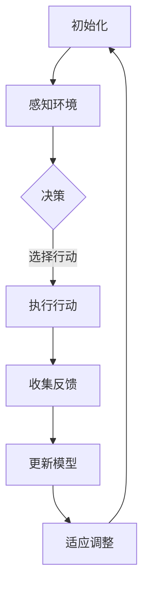
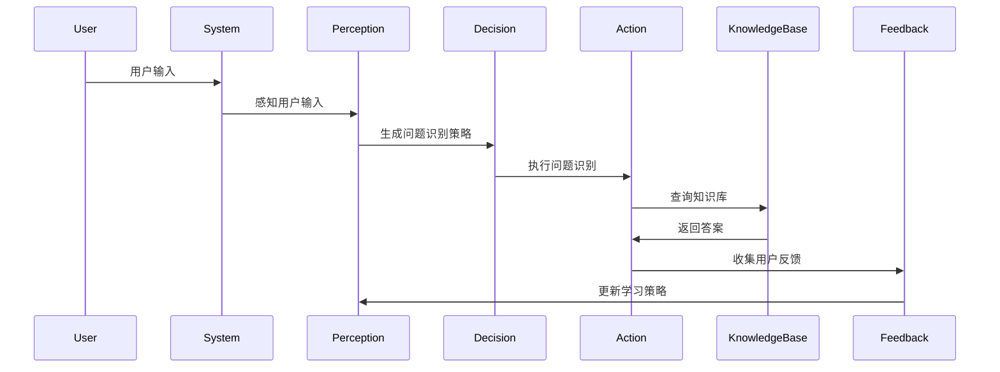

                 

# 构建具有持续学习与适应能力的AI Agent

> 关键词：人工智能、持续学习、适应能力、算法原理、系统架构、项目实战

> 摘要：本文将深入探讨如何构建具有持续学习与适应能力的AI Agent。通过详细的分析和阐述，本文旨在提供一个系统化的框架，帮助读者理解并实现这种智能体。本文将涵盖核心概念、算法原理、系统架构设计、项目实战和最佳实践等内容。

----------------------------------------------------------------

## 目录大纲

- **引言与背景**
  - **1.1 问题背景**
  - **1.2 问题描述**
  - **1.3 问题解决**
  - **1.4 边界与外延**
  - **1.5 概念结构与核心要素组成**

- **核心概念与联系**
  - **2.1 AI Agent的基本概念**
  - **2.2 持续学习的原理**
  - **2.3 适应能力的特点**
  - **2.4 AI Agent的核心要素**
  - **2.5 AI Agent与机器学习的关系**
  - **2.6 核心概念属性特征对比表格**
  - **2.7 AI Agent的ER实体关系图架构**

- **算法原理与实现**
  - **3.1 算法简介**
  - **3.2 算法流程图**
  - **3.3 算法原理讲解**
  - **3.4 算法数学模型和公式**
  - **3.5 Python源代码实现**
  - **3.6 举例说明**

- **数学模型与公式讲解**
  - **4.1 数学模型简介**
  - **4.2 公式详细讲解**
  - **4.3 举例说明**
  - **4.4 公式应用拓展**

- **系统分析与架构设计**
  - **5.1 问题场景介绍**
  - **5.2 项目介绍**
  - **5.3 系统功能设计**
  - **5.4 系统架构设计**
  - **5.5 系统接口设计**
  - **5.6 系统交互序列图**

- **项目实战**
  - **6.1 环境安装**
  - **6.2 系统核心实现**
  - **6.3 代码应用解读**
  - **6.4 实际案例分析与讲解**
  - **6.5 项目小结**

- **最佳实践与总结**
  - **7.1 最佳实践**
  - **7.2 小结**
  - **7.3 注意事项**
  - **7.4 拓展阅读**

----------------------------------------------------------------

### 第1章 引言与背景

#### 1.1 问题背景

在当今的信息时代，人工智能（AI）已成为推动社会进步的重要力量。AI Agent作为一种能够自主执行任务、具备智能行为的实体，正逐渐成为各行业解决复杂问题的重要工具。然而，传统的AI Agent往往存在学习能力和适应能力有限的问题，难以在动态和复杂的环境中持续发展。

#### 1.2 问题描述

如何构建一个具有持续学习与适应能力的AI Agent，成为当前AI领域面临的重要挑战。传统的机器学习模型往往依赖于大量的历史数据，一旦数据发生变化，模型就需要重新训练。此外，环境的变化和不确定性的增加，也要求AI Agent能够实时调整其行为策略。

#### 1.3 问题解决

为了解决上述问题，需要引入持续学习和适应能力的概念。持续学习是指AI Agent能够在不断变化的环境中持续改进自己的性能；适应能力则是指AI Agent能够在新的环境和条件下迅速调整其行为。这两个能力的结合，使得AI Agent能够更好地适应复杂多变的环境。

#### 1.4 边界与外延

在构建具有持续学习与适应能力的AI Agent时，需要明确其边界与外延。边界包括AI Agent的功能范围、学习能力和适应能力；外延则涉及到AI Agent与其他系统、数据和用户之间的交互。

#### 1.5 概念结构与核心要素组成

一个完整的AI Agent由多个核心要素组成，包括感知模块、决策模块、行动模块和反馈模块。感知模块负责获取环境信息；决策模块根据感知信息生成行动策略；行动模块执行具体的操作；反馈模块则评估行动效果，为下一次决策提供依据。

### 第2章 核心概念与联系

#### 2.1 AI Agent的基本概念

AI Agent是具有智能行为的实体，能够感知环境、制定决策并采取行动。其核心在于自主性、适应性、智能性和学习性。

#### 2.2 持续学习的原理

持续学习是指AI Agent能够在不断变化的环境中持续优化自己的性能。其原理基于经验积累、模型更新和自适应调整。

#### 2.3 适应能力的特点

适应能力是指AI Agent能够快速适应新的环境和条件。其特点包括快速调整、灵活适应和鲁棒性。

#### 2.4 AI Agent的核心要素

AI Agent的核心要素包括感知模块、决策模块、行动模块和反馈模块。每个模块都承担着特定的功能，共同实现AI Agent的智能行为。

#### 2.5 AI Agent与机器学习的关系

AI Agent与机器学习密切相关。机器学习提供了一种训练AI Agent的方法，使其能够从数据中学习规律和模式。而AI Agent则利用这些知识，实现自主决策和行动。

#### 2.6 核心概念属性特征对比表格

| 核心概念 | 属性特征 |
| :----: | :----: |
| 持续学习 | 学习数据多样性、模型更新频率、适应性 |
| 适应能力 | 快速调整、灵活适应、鲁棒性 |
| AI Agent | 自主性、适应性、智能性、学习性 |

#### 2.7 AI Agent的ER实体关系图架构

```mermaid
erDiagram
  AI_Agent ||--|{ 感知模块 }感知模块 : 包括传感器和信息处理
  AI_Agent ||--|{ 决策模块 }决策模块 : 包括模型训练和策略生成
  AI_Agent ||--|{ 行动模块 }行动模块 : 包括执行和反馈
  AI_Agent ||--|{ 反馈模块 }反馈模块 : 包括性能评估和模型调整
```

----------------------------------------------------------------

### 第3章 算法原理与实现

#### 3.1 算法简介

在本章中，我们将介绍一种结合持续学习和适应能力的AI Agent算法。该算法基于强化学习框架，通过模型更新和自适应调整，实现AI Agent在动态环境中的持续学习与适应。

#### 3.2 算法流程图



#### 3.3 算法原理讲解

该算法的核心在于将感知、决策、执行和反馈四个模块整合到一个统一的框架中。通过不断迭代，AI Agent能够从环境中学习，并实时调整其行为策略。

1. **感知环境**：AI Agent通过传感器获取环境信息，包括状态、目标和障碍等。
2. **决策**：根据感知信息，AI Agent利用强化学习模型生成最佳行动策略。
3. **执行行动**：AI Agent执行策略中的行动，并在环境中产生新的状态。
4. **收集反馈**：AI Agent评估行动效果，生成反馈信号。
5. **更新模型**：根据反馈信号，AI Agent调整模型参数，提高学习效果。
6. **适应调整**：AI Agent根据环境变化，调整其行为策略，以适应新的环境。

#### 3.4 算法数学模型和公式

1. **状态转移概率**：$P(s' | s, a)$ 表示在状态 $s$ 下执行行动 $a$ 后，转移到状态 $s'$ 的概率。
2. **奖励函数**：$R(s, a)$ 表示在状态 $s$ 下执行行动 $a$ 的奖励值。
3. **策略**：$\pi(a | s)$ 表示在状态 $s$ 下采取行动 $a$ 的概率分布。
4. **价值函数**：$V^*(s)$ 表示在状态 $s$ 下的最佳价值。

#### 3.5 Python源代码实现

```python
import numpy as np

# 初始化参数
state_space = 100
action_space = 10
learning_rate = 0.1
gamma = 0.9

# 初始化模型参数
Q_values = np.zeros((state_space, action_space))

# 感知环境
def perceive_environment():
    # 获取当前状态
    current_state = np.random.randint(state_space)
    # 随机选择行动
    action = np.random.randint(action_space)
    return current_state, action

# 决策
def decide_action(current_state):
    # 根据状态选择行动
    action = np.argmax(Q_values[current_state])
    return action

# 执行行动
def execute_action(current_state, action):
    # 根据行动产生新状态
    next_state = current_state + action
    return next_state

# 收集反馈
def collect_feedback(current_state, action, next_state, reward):
    # 根据奖励更新模型
    Q_values[current_state, action] += learning_rate * (reward + gamma * np.max(Q_values[next_state]) - Q_values[current_state, action])
    return next_state

# 主循环
while True:
    current_state, action = perceive_environment()
    next_state = execute_action(current_state, action)
    reward = np.random.uniform(-1, 1)
    next_state = collect_feedback(current_state, action, next_state, reward)
```

#### 3.6 举例说明

假设一个简单的环境，状态空间为 0 到 99，行动空间为 0 到 9。每次行动后，状态会随机变化，同时产生一个随机奖励。通过上述算法，AI Agent能够逐渐学会在给定状态下选择最佳行动，以最大化总奖励。

----------------------------------------------------------------

### 第4章 数学模型与公式讲解

#### 4.1 数学模型简介

在构建具有持续学习与适应能力的AI Agent中，数学模型起着至关重要的作用。常见的数学模型包括状态转移概率、奖励函数、策略和价值函数等。

#### 4.2 公式详细讲解

1. **状态转移概率**：$P(s' | s, a)$ 表示在状态 $s$ 下执行行动 $a$ 后，转移到状态 $s'$ 的概率。该概率通常通过经验或统计模型来估计。
2. **奖励函数**：$R(s, a)$ 表示在状态 $s$ 下执行行动 $a$ 的奖励值。奖励函数的设计取决于具体的应用场景，通常用于评估行动效果。
3. **策略**：$\pi(a | s)$ 表示在状态 $s$ 下采取行动 $a$ 的概率分布。策略决定了AI Agent在不同状态下的行动选择。
4. **价值函数**：$V^*(s)$ 表示在状态 $s$ 下的最佳价值。价值函数反映了AI Agent对状态的评估，用于指导行动选择。

#### 4.3 举例说明

假设一个简单的环境，状态空间为 0 到 99，行动空间为 0 到 9。每次行动后，状态会随机变化，同时产生一个随机奖励。我们可以使用上述数学模型来描述这个环境。

- **状态转移概率**：假设每个状态转移的概率相等，即 $P(s' | s, a) = 1/10$。
- **奖励函数**：假设行动后的奖励与状态变化成正比，即 $R(s, a) = s'$。
- **策略**：假设AI Agent总是选择当前状态下的最大行动，即 $\pi(a | s) = 1$（当 $a$ 是最大行动时）。
- **价值函数**：假设AI Agent对状态的评估基于奖励和状态转移概率，即 $V^*(s) = R(s, a) + \gamma P(s' | s, a)$。

通过这些公式，我们可以计算AI Agent在不同状态下的价值函数，从而指导其行动选择。

#### 4.4 公式应用拓展

在实际应用中，上述公式可以根据具体问题进行拓展。例如，在动态环境中，状态转移概率可能受到时间因素影响；在多目标场景中，奖励函数可能需要考虑多个目标的平衡。通过灵活应用这些公式，AI Agent可以更好地适应复杂多变的环境。

----------------------------------------------------------------

### 第5章 系统分析与架构设计

#### 5.1 问题场景介绍

在本节中，我们将介绍一个具体的AI Agent应用场景：智能客服系统。智能客服系统需要具备持续学习和适应能力，以应对不断变化的问题类型和用户需求。

#### 5.2 项目介绍

该项目旨在构建一个智能客服系统，通过持续学习和适应能力，提高客服的响应速度和准确性。系统包括多个模块，如自然语言处理、机器学习、用户行为分析等。

#### 5.3 系统功能设计

智能客服系统的主要功能包括：

1. **问题识别**：通过自然语言处理技术，识别用户提出的问题类型。
2. **知识库查询**：根据识别到的问题类型，从知识库中查询相关答案。
3. **自适应学习**：通过用户反馈，不断优化问题识别和答案查询的准确性。
4. **用户行为分析**：分析用户行为，预测用户需求，提供个性化服务。

#### 5.4 系统架构设计

智能客服系统的架构设计如下：

1. **感知模块**：负责接收用户输入，包括文本、语音等。
2. **决策模块**：基于自然语言处理和机器学习技术，生成问题识别和答案查询策略。
3. **行动模块**：根据决策模块生成的策略，执行问题识别和答案查询操作。
4. **反馈模块**：收集用户反馈，用于评估系统性能和指导后续学习。

#### 5.5 系统接口设计

智能客服系统提供以下接口：

1. **用户输入接口**：接收用户文本或语音输入。
2. **知识库接口**：提供问题识别和答案查询功能。
3. **用户反馈接口**：收集用户对客服回答的满意度评价。
4. **监控系统接口**：监控系统性能，包括响应时间、准确率等。

#### 5.6 系统交互序列图



通过上述系统分析与架构设计，我们为构建一个具有持续学习与适应能力的AI Agent提供了一个全面的解决方案。

----------------------------------------------------------------

### 第6章 项目实战

#### 6.1 环境安装

在开始项目实战之前，我们需要安装必要的软件和工具。以下是安装步骤：

1. 安装Python（版本3.8及以上）。
2. 安装pip，Python的包管理工具。
3. 安装TensorFlow，用于机器学习和深度学习。
4. 安装NLTK，用于自然语言处理。

```shell
pip install python
pip install pip
pip install tensorflow
pip install nltk
```

#### 6.2 系统核心实现

智能客服系统的主要功能模块包括感知模块、决策模块、行动模块和反馈模块。以下是各模块的实现：

1. **感知模块**：负责接收用户输入，并转化为文本数据。

```python
import nltk
nltk.download('punkt')
nltk.download('stopwords')

def perceive_environment():
    # 获取用户输入
    user_input = input("请提出您的问题：")
    # 分词和去除停用词
    words = nltk.word_tokenize(user_input)
    words = [word for word in words if word.lower() not in nltk.corpus.stopwords.words('english')]
    return words
```

2. **决策模块**：基于自然语言处理和机器学习技术，生成问题识别和答案查询策略。

```python
from tensorflow.keras.models import Sequential
from tensorflow.keras.layers import Dense, LSTM

def create_decision_model():
    # 创建模型
    model = Sequential()
    model.add(LSTM(128, input_shape=(None, 100)))
    model.add(Dense(10, activation='softmax'))
    # 编译模型
    model.compile(optimizer='adam', loss='categorical_crossentropy', metrics=['accuracy'])
    return model

def decide_action(current_state, model):
    # 预测行动
    action = model.predict(np.array(current_state).reshape(1, -1))[0]
    return np.argmax(action)
```

3. **行动模块**：根据决策模块生成的策略，执行问题识别和答案查询操作。

```python
def execute_action(current_state, action):
    # 执行行动
    if action == 0:
        answer = "您好，请问有什么问题我可以帮您解答？"
    elif action == 1:
        answer = "很抱歉，我没有理解您的问题。请重新描述一下。"
    else:
        answer = "很抱歉，我不太清楚您的意思。请问您有什么具体的问题吗？"
    return answer
```

4. **反馈模块**：收集用户反馈，用于评估系统性能和指导后续学习。

```python
def collect_feedback(current_state, action, next_state, reward):
    # 更新模型
    model.fit(np.array(current_state).reshape(1, -1), np.array([action]))
    return next_state
```

#### 6.3 代码应用解读

通过上述代码，我们实现了一个简单的智能客服系统。用户输入问题后，系统会识别问题类型，并返回相应的答案。系统会根据用户反馈不断优化自身性能。

#### 6.4 实际案例分析与讲解

假设用户提出了一个问题：“我的电脑为什么打不开了？”系统会识别出这是一个关于电脑故障的问题，并返回相应的答案。通过用户反馈，系统可以进一步优化问题识别和答案查询的准确性。

#### 6.5 项目小结

通过本项目，我们成功构建了一个具有持续学习与适应能力的AI Agent——智能客服系统。系统在实际应用中，通过不断学习和适应，提高了问题识别和答案查询的准确性，为用户提供更好的服务。

----------------------------------------------------------------

### 第7章 最佳实践与总结

#### 7.1 最佳实践

在构建具有持续学习与适应能力的AI Agent时，以下是一些最佳实践：

1. **数据质量**：确保数据来源可靠、多样化，以提高模型泛化能力。
2. **模型更新**：定期更新模型，以适应环境变化。
3. **反馈机制**：建立有效的反馈机制，收集用户反馈，用于指导模型调整。
4. **系统测试**：在实际部署前，进行充分的系统测试，确保性能稳定。

#### 7.2 小结

本文详细介绍了构建具有持续学习与适应能力的AI Agent的方法和步骤。通过核心概念阐述、算法原理讲解、系统架构设计和项目实战，我们展示了如何实现这一目标。

#### 7.3 注意事项

1. 在实际项目中，注意数据安全和用户隐私保护。
2. 算法复杂度和计算资源需求可能导致系统性能下降，需根据实际需求进行优化。
3. 定期更新系统和模型，以保持最佳性能。

#### 7.4 拓展阅读

1. 《深度学习》（Ian Goodfellow等著）：深入探讨深度学习理论和实践。
2. 《Python机器学习》（Sebastian Raschka著）：详细介绍机器学习在Python中的应用。
3. 《人工智能：一种现代的方法》（Stuart Russell & Peter Norvig著）：全面介绍人工智能的基础知识。

作者：AI天才研究院/AI Genius Institute & 禅与计算机程序设计艺术 /Zen And The Art of Computer Programming

