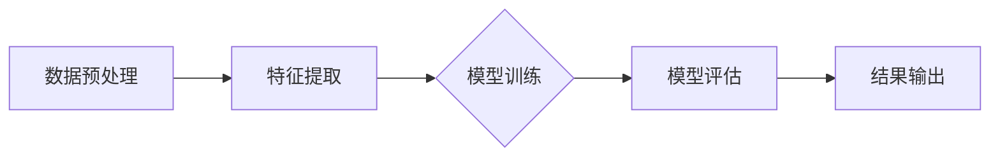
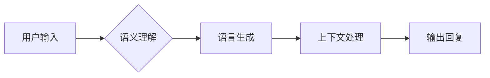
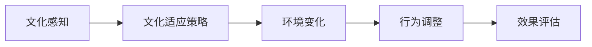
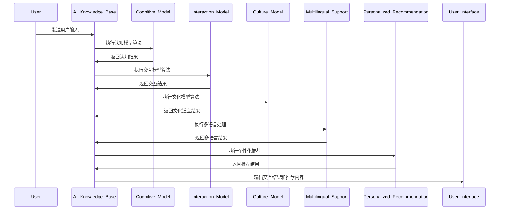
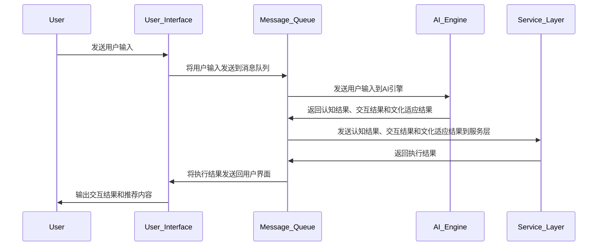

                 

### 《构建具有文化适应性的AI Agent系统》

#### 关键词：文化适应性、AI Agent、认知模型、交互模型、文化模型、算法原理

#### 摘要：
本文将探讨如何构建具有文化适应性的AI Agent系统，涵盖核心概念、算法原理和系统设计与实现。通过深入分析文化适应性在AI Agent中的应用与挑战，我们提出了一种基于认知模型、交互模型和文化模型的技术路线，详细阐述了算法原理与数学模型，并展示了系统架构设计与实际案例应用。

---

# 《构建具有文化适应性的AI Agent系统》目录大纲

## 第一部分：背景介绍

### 第1章：问题背景与核心概念

### 第2章：核心概念与联系

## 第二部分：算法原理讲解

### 第3章：算法原理详解

## 第三部分：系统分析与架构设计

### 第4章：系统功能设计与架构

### 第5章：项目实战与案例分析

### 第6章：最佳实践与总结

## 参考文献

---

## 第一部分：背景介绍

### 第1章：问题背景与核心概念

#### 1.1.1 问题背景

**AI Agent的定义与历史发展：**
AI Agent是具有自主决策能力的计算机程序，能够模拟人类智能，通过感知环境、理解意图和执行任务来实现特定目标。自1956年达特茅斯会议以来，AI Agent的研究逐渐成为人工智能领域的重要方向。早期的研究主要集中在基于规则的系统和简单的机器学习模型，而近年来，随着深度学习和强化学习等技术的发展，AI Agent的智能化水平显著提升。

**文化适应性在AI Agent中的应用与挑战：**
随着全球化和多文化交流的加剧，文化适应性成为AI Agent的一个重要需求。文化适应性意味着AI Agent能够在不同文化背景下进行有效的沟通和协作。这要求AI Agent不仅要具备自然语言处理和理解能力，还要能够理解并适应不同文化的价值观、习俗和社交规范。然而，文化适应性的实现面临诸多挑战，如文化多样性的复杂性、文化差异的敏感性以及文化知识库的构建等。

**当前AI Agent发展现状与存在的问题：**
当前的AI Agent在技术实现上取得了显著进展，但仍然存在一些局限性。例如，大部分AI Agent在单一文化环境下表现良好，但在跨文化环境中往往缺乏适应性。此外，AI Agent的知识库和文化模型主要依赖于预先设定的规则和数据，缺乏灵活性和自主学习能力。

#### 1.1.2 问题描述

**文化适应性AI Agent的核心需求：**
为了构建具有文化适应性的AI Agent，我们需要满足以下核心需求：
1. **文化感知能力**：AI Agent能够感知和理解不同文化的特征和差异。
2. **文化适应策略**：AI Agent能够根据环境变化调整自身行为，以适应不同文化背景。
3. **文化知识库**：AI Agent需要具备丰富的文化知识库，以便在需要时进行查询和引用。

**文化适应性AI Agent面临的挑战：**
1. **文化多样性**：文化多样性的复杂性使得AI Agent难以一概而论。
2. **文化敏感性**：AI Agent需要避免在文化敏感问题上的不当行为。
3. **文化知识库构建**：构建全面且准确的文化知识库是一项艰巨的任务。

**文化适应性AI Agent的目标与期望效果：**
构建文化适应性AI Agent的目标是使AI Agent能够在不同文化背景下实现有效沟通和协作，提高用户体验。期望效果包括：
1. **跨文化理解**：AI Agent能够理解并尊重不同文化的价值观和习俗。
2. **适应性交互**：AI Agent能够在不同文化环境中调整交互方式，提高交互效果。
3. **文化敏感性**：AI Agent能够避免在文化敏感问题上的错误，提升用户满意度。

#### 1.1.3 问题解决

**AI Agent的基本原理与架构：**
AI Agent的基本原理包括感知、理解、决策和行动。感知是指AI Agent通过传感器获取环境信息；理解是指AI Agent对感知到的信息进行处理和分析；决策是指AI Agent根据环境信息和目标选择行动策略；行动是指AI Agent执行决策并产生预期效果。

**文化适应性机制的设计与实现：**
为了实现文化适应性，我们需要在AI Agent的架构中引入文化模型，该模型包括文化感知、文化适应策略和文化知识库。文化感知模块负责感知和理解不同文化的特征；文化适应策略模块负责根据环境变化调整AI Agent的行为；文化知识库模块提供丰富的文化知识，以支持AI Agent的文化适应性。

**文化适应性AI Agent的技术路线与方案：**
1. **多语言处理**：使用自然语言处理技术实现AI Agent的多语言处理能力。
2. **文化感知算法**：利用机器学习和深度学习技术，构建文化感知算法，实现对文化特征的识别和分类。
3. **文化知识库构建**：通过数据挖掘和知识图谱技术，构建全面且准确的文化知识库。
4. **文化适应性策略**：设计基于规则的和文化自适应的策略，使AI Agent能够在不同文化背景下实现有效交互。

#### 1.1.4 边界与外延

**文化适应性AI Agent的适用范围：**
文化适应性AI Agent适用于需要跨文化交流和协作的领域，如跨国公司、国际组织、旅游行业、文化交流项目等。

**文化多样性在AI Agent中的应用：**
AI Agent在不同文化背景下的应用包括跨文化客户服务、跨文化产品推荐、跨文化营销等。

**未来AI Agent发展趋势与展望：**
未来AI Agent的发展趋势包括智能化、个性化、自适应化和跨文化化。随着技术的进步，AI Agent将在更多领域发挥重要作用，为人类带来更多便利。

#### 1.1.5 概念结构与核心要素组成

**文化适应性AI Agent的组成部分：**
文化适应性AI Agent由感知模块、理解模块、决策模块和行动模块组成，其中文化模型是核心部分。

**核心概念：认知模型、交互模型、文化模型：**
- **认知模型**：用于表示AI Agent对环境的感知和理解能力。
- **交互模型**：用于实现AI Agent与用户之间的信息交换和沟通。
- **文化模型**：用于描述AI Agent对不同文化的适应能力。

**文化适应性AI Agent的功能模块：**
- **文化感知模块**：负责感知和理解不同文化的特征。
- **文化适应策略模块**：负责根据环境变化调整AI Agent的行为。
- **文化知识库模块**：提供丰富的文化知识，支持AI Agent的文化适应性。

## 第2章：核心概念与联系

#### 2.1.1 核心概念原理

**认知模型的原理与构成：**
认知模型是AI Agent的核心组件，负责对环境信息进行感知和理解。它通常由感知模块、知识库、推理引擎和决策模块组成。感知模块负责获取环境信息，如文本、图像和声音；知识库存储AI Agent的知识和经验；推理引擎负责基于知识库进行推理和决策；决策模块根据推理结果生成行动策略。

**交互模型的原理与构成：**
交互模型是AI Agent与用户进行信息交换和沟通的桥梁。它通常包括自然语言处理（NLP）模块、语义理解模块和语言生成模块。NLP模块负责处理用户输入的自然语言文本，提取语义信息；语义理解模块负责解析用户意图和需求；语言生成模块根据语义理解结果生成适当的回复或行动指令。

**文化模型的原理与构成：**
文化模型是AI Agent适应不同文化背景的关键。它由文化感知模块、文化适应策略模块和文化知识库模块组成。文化感知模块负责识别和理解不同文化的特征；文化适应策略模块根据环境变化调整AI Agent的行为；文化知识库模块提供丰富的文化知识，以支持AI Agent的文化适应性。

#### 2.1.2 概念属性特征对比表格

| 概念     | 定义                                                         | 属性特征                          | 对比与联系                     |
|----------|--------------------------------------------------------------|----------------------------------|--------------------------------|
| 认知模型 | 用于表示AI Agent对环境的感知和理解能力                        | 知识表示、推理、学习              | 与交互模型、文化模型协同工作   |
| 交互模型 | 用于实现AI Agent与用户之间的信息交换和沟通                    | 语义理解、语言生成、上下文处理    | 与认知模型、文化模型结合使用  |
| 文化模型 | 用于描述AI Agent对不同文化的适应能力                          | 文化感知、文化适应策略、文化知识库 | 提高AI Agent的文化敏感性和适应性 |

#### 2.1.3 ER实体关系图架构

```mermaid
erDiagram
  AI_Agent ||--|{ Culture_Model }|--|{ Culture_Adaptation_Strategy }
  AI_Agent ||--|{ Interaction_Model }|--|{ Natural_Language_Processing }
  AI_Agent ||--|{ Cognitive_Model }|--|{ Knowledge_Base }
```

## 第二部分：算法原理讲解

### 第3章：算法原理详解

#### 3.1.1 算法原理

**认知模型算法：**
认知模型算法基于深度学习的知识表示与推理技术。知识表示是指将环境信息转换为计算机可以处理的形式，如图像、文本或向量表示。推理是指基于知识库和已有信息进行逻辑推理和决策。常见的认知模型算法包括卷积神经网络（CNN）、循环神经网络（RNN）和变换器（Transformer）等。

**交互模型算法：**
交互模型算法基于自然语言处理（NLP）技术，包括语义理解、语言生成和上下文处理。语义理解是指从自然语言文本中提取语义信息，如关键词、实体和关系。语言生成是指根据语义信息生成自然语言文本，如回答用户的问题或生成对话。上下文处理是指根据上下文信息理解用户的意图和需求，以生成合适的回复。

**文化模型算法：**
文化模型算法基于文化感知与适应策略的设计。文化感知是指识别和理解不同文化的特征，如语言习惯、价值观和社会规范。文化适应策略是指根据环境变化调整AI Agent的行为，以适应不同文化背景。常见的方法包括基于规则的策略和机器学习方法。

#### 3.1.2 数学模型与公式

认知模型算法的核心是深度学习，以下是一个简单的卷积神经网络（CNN）的数学模型和公式：

$$
f(x) = \sum_{i=1}^{n} w_i \cdot x_i + b
$$

其中，$w_i$表示权重，$x_i$表示输入特征，$b$为偏置项。

交互模型算法的核心是自然语言处理（NLP），以下是一个简单的词嵌入（Word Embedding）的数学模型和公式：

$$
\text{vec}(w) = \text{W} \cdot \text{one-hot}(w)
$$

其中，$\text{W}$为词嵌入矩阵，$\text{one-hot}(w)$为词的one-hot编码向量。

文化模型算法的核心是文化感知与适应策略，以下是一个简单的文化适应策略的数学模型和公式：

$$
\text{策略} = f(\text{文化特征}, \text{当前环境})
$$

其中，$f$为文化适应函数，$\text{文化特征}$和$\text{当前环境}$为输入参数。

#### 3.1.3 算法流程图

认知模型算法的流程图如下：



交互模型算法的流程图如下：



文化模型算法的流程图如下：



#### 3.1.4 举例说明

**认知模型算法举例：**
以一个简单的文本分类任务为例，展示文化适应性AI Agent的认知模型算法实现过程：

1. **数据预处理**：对文本进行分词、去停用词、词向量化等操作，将文本转换为计算机可以处理的形式。
2. **特征提取**：使用词嵌入技术将分词后的文本转化为向量表示，提取文本的特征信息。
3. **模型训练**：构建一个基于卷积神经网络（CNN）的分类模型，对文本向量进行训练。
4. **模型评估**：使用测试集对训练好的模型进行评估，调整模型参数以达到最佳效果。
5. **结果输出**：将训练好的模型应用于实际任务，对新的文本进行分类，并输出结果。

**交互模型算法举例：**
以一个简单的对话系统为例，展示文化适应性AI Agent的交互模型算法实现过程：

1. **用户输入**：用户输入一条文本消息，如“你好，请问今天天气怎么样？”。
2. **语义理解**：对用户输入的文本消息进行分词、词性标注和实体识别等操作，提取出关键信息，如“你好”、“天气”、“今天”等。
3. **语言生成**：根据提取出的关键信息，生成合适的回复，如“你好！今天天气晴朗，温度适中。”。
4. **上下文处理**：根据上下文信息理解用户的意图和需求，以生成合适的回复，如用户继续提问“明天会下雨吗？”时，AI Agent会继续生成相应的回复。
5. **输出回复**：将生成的回复输出给用户，完成一次对话交互。

**文化模型算法举例：**
以一个简单的跨文化交流任务为例，展示文化适应性AI Agent的文化模型算法实现过程：

1. **文化感知**：AI Agent在执行任务时，感知到用户来自一个特定的文化背景，如日本。
2. **文化适应策略**：根据文化感知结果，AI Agent调整自身的交互策略，如使用日语进行对话，并遵循日本的礼仪和习惯。
3. **环境变化**：AI Agent在执行任务过程中，感知到环境变化，如用户离开原来的文化背景，进入一个英语为主的文化环境。
4. **行为调整**：AI Agent根据新的环境变化，调整自身的交互策略，如使用英语进行对话，并遵循英语文化下的礼仪和习惯。
5. **效果评估**：评估AI Agent在跨文化交流任务中的表现，如用户满意度、交互效果等，以优化文化适应策略。

## 第三部分：系统分析与架构设计

### 第4章：系统功能设计与架构

#### 4.1.1 问题场景介绍

在全球化背景下，跨国公司和国际组织越来越依赖于跨文化交流和协作。为了提升用户体验和业务效率，这些组织正在积极探索文化适应性AI Agent的应用。以下是一个具体的问题场景：

**场景描述：**
一家跨国公司在中国设有分支机构，其业务涵盖了多个国家和地区。为了更好地服务不同地区的客户，公司希望开发一个具有文化适应性的AI客服系统，该系统能够根据客户的文化背景和需求提供个性化的服务。

**系统需求：**
1. **文化感知能力**：AI客服系统能够感知客户的文化背景，如国籍、语言习惯、价值观等。
2. **文化适应策略**：AI客服系统根据文化感知结果，调整自身的交互策略，以提供个性化的服务。
3. **多语言支持**：AI客服系统能够支持多种语言，如中文、英语、日语等，以满足不同地区客户的需求。
4. **个性化推荐**：AI客服系统能够根据客户的兴趣、行为和偏好，提供个性化的产品推荐和咨询服务。
5. **用户体验优化**：AI客服系统在交互过程中注重用户体验，如使用恰当的语言、尊重文化习俗等。

#### 4.1.2 项目介绍

**项目背景：**
本项目旨在开发一个具有文化适应性的AI客服系统，以提升跨国公司的客户服务质量。项目团队由人工智能专家、自然语言处理工程师、产品经理和用户体验设计师等组成。

**项目目标：**
1. **实现文化感知能力**：通过机器学习和深度学习技术，构建文化感知模型，实现对客户文化背景的识别和分类。
2. **实现文化适应策略**：设计文化适应策略，使AI客服系统能够根据客户的文化背景和需求提供个性化的服务。
3. **实现多语言支持**：利用自然语言处理技术，实现AI客服系统的多语言支持，以满足不同地区客户的需求。
4. **实现个性化推荐**：利用数据挖掘和推荐算法，实现基于客户兴趣、行为和偏好的个性化推荐。
5. **优化用户体验**：通过用户体验设计，提升AI客服系统的交互质量和用户满意度。

#### 4.1.3 系统功能设计

**领域模型：**
为了实现文化适应性AI客服系统，我们需要设计一个领域模型，包括以下核心功能模块：

1. **文化感知模块**：负责感知客户的文化背景，如国籍、语言习惯、价值观等。该模块基于机器学习和深度学习技术，利用客户的历史数据和交互记录进行训练。
2. **文化适应策略模块**：负责根据文化感知结果，调整AI客服系统的交互策略，以提供个性化的服务。该模块包括多语言处理、礼仪和习惯调整、个性化推荐等功能。
3. **多语言支持模块**：负责实现AI客服系统的多语言支持，包括文本翻译、语音合成和语音识别等功能。该模块基于自然语言处理技术，利用大规模语言模型和语音合成技术实现。
4. **个性化推荐模块**：负责根据客户的兴趣、行为和偏好，提供个性化的产品推荐和咨询服务。该模块基于数据挖掘和推荐算法，利用客户的交互数据和行为数据进行分析和预测。
5. **用户体验优化模块**：负责优化AI客服系统的交互质量和用户满意度，包括界面设计、交互逻辑和反馈机制等。

**领域模型类图：**

```mermaid
classDiagram
  AI_Knowledge_Base <|-- Cognitive_Model
  AI_Knowledge_Base <|-- Interaction_Model
  AI_Knowledge_Base <|-- Culture_Model
  AI_Knowledge_Base <|-- Multilingual_Support
  AI_Knowledge_Base <|-- Personalized_Recommendation
  AI_Knowledge_Base <|-- User_Experience_Optimization

  Cognitive_Model <|-- Knowledge_Representation
  Cognitive_Model <|-- Inference_Engine
  Cognitive_Model <|-- Decision_Making

  Interaction_Model <|-- Semantic_Understanding
  Interaction_Model <|-- Language_Generation
  Interaction_Model <|-- Context_Management

  Culture_Model <|-- Culture_Perception
  Culture_Model <|-- Culture_Adaptation_Strategy
  Culture_Model <|-- Cultural_Knowledge_Base

  Multilingual_Support <|-- Text_Translation
  Multilingual_Support <|-- Voice_Synthesis
  Multilingual_Support <|-- Voice_Recognition

  Personalized_Recommendation <|-- Data_Mining
  Personalized_Recommendation <|-- Recommendation_Algorithm

  User_Experience_Optimization <|-- User_Interface_Design
  User_Experience_Optimization <|-- Interaction_Logic
  User_Experience_Optimization <|-- Feedback_Mechanism
```



#### 4.1.4 系统架构设计

**系统架构：**
文化适应性AI客服系统采用分布式架构，包括前端、后端和数据库三部分。前端负责与用户进行交互，后端负责处理业务逻辑和数据处理，数据库存储用户数据、知识库和交互记录。

**前端架构：**
前端架构采用单页面应用（SPA）模式，包括以下核心组件：

1. **用户界面**：提供友好的用户界面，支持多语言切换，展示AI客服系统的交互结果和推荐内容。
2. **聊天窗口**：实现与用户的实时聊天功能，支持文本、语音和图片等多种交互方式。
3. **个性化推荐模块**：根据用户的兴趣和行为，动态推荐相关的产品和服务。

**后端架构：**
后端架构采用微服务架构，包括以下核心组件：

1. **AI引擎**：负责处理用户的输入，执行认知模型、交互模型和文化模型算法，生成相应的回复和推荐。
2. **服务层**：实现业务逻辑和数据处理，包括文化感知、文化适应策略、多语言支持和个性化推荐等功能。
3. **数据存储**：存储用户数据、知识库和交互记录，支持数据的实时更新和查询。

**数据库架构：**
数据库架构采用分布式数据库系统，包括以下核心组件：

1. **用户数据库**：存储用户的基本信息和交互记录，如用户ID、国籍、语言习惯等。
2. **知识库**：存储AI客服系统的知识库，包括文化知识、产品信息、服务指南等。
3. **交互记录**：存储用户的交互记录，如聊天记录、行为数据等，用于后续的数据分析和优化。

**系统架构图：**



#### 4.1.5 系统接口设计

**接口设计：**
文化适应性AI客服系统采用RESTful API设计，包括以下核心接口：

1. **用户接口**：用于与用户进行交互，包括发送用户输入、获取交互结果和推荐内容等。
2. **AI引擎接口**：用于与AI引擎进行通信，执行认知模型、交互模型和文化模型算法。
3. **服务层接口**：用于与服务层进行通信，执行业务逻辑和数据处理。
4. **数据存储接口**：用于与数据库进行通信，实现数据的实时更新和查询。

**接口文档：**

```json
{
  "user_interface": {
    "post": "/api/user/input",
    "response": {
      "status": "success",
      "message": "输入成功",
      "data": {
        "input": "用户输入文本",
        "response": "AI客服系统回复文本"
      }
    }
  },
  "ai_engine_interface": {
    "post": "/api/ai_engine/process",
    "request": {
      "input": "用户输入文本",
      "knowledge_base_id": "知识库ID"
    },
    "response": {
      "status": "success",
      "message": "处理成功",
      "data": {
        "cognitive_result": "认知结果",
        "interaction_result": "交互结果",
        "culture_adaptation_result": "文化适应结果"
      }
    }
  },
  "service_layer_interface": {
    "post": "/api/service_layer/execute",
    "request": {
      "function": "功能名称",
      "input": "输入参数",
      "knowledge_base_id": "知识库ID"
    },
    "response": {
      "status": "success",
      "message": "执行成功",
      "data": {
        "output": "执行结果"
      }
    }
  },
  "data_storage_interface": {
    "get": "/api/data_storage/query",
    "request": {
      "query": "查询条件"
    },
    "response": {
      "status": "success",
      "message": "查询成功",
      "data": {
        "data": "查询结果"
      }
    }
  }
}
```

#### 4.1.6 系统交互设计

**系统交互设计：**
文化适应性AI客服系统采用事件驱动架构，通过消息队列实现系统各模块之间的通信。以下是一个简单的系统交互序列图：



### 第5章：项目实战与案例分析

#### 5.1 环境安装

在开始构建具有文化适应性的AI Agent系统之前，我们需要安装所需的软件和库。以下是在Python环境中安装所需软件和库的步骤：

1. **安装Python环境**：确保您的计算机上已安装Python 3.x版本。可以从Python官方网站（https://www.python.org/downloads/）下载并安装。

2. **安装依赖库**：在Python环境中安装以下依赖库，以支持AI Agent的开发和实现：
   ```shell
   pip install numpy pandas tensorflow scikit-learn nltk
   ```

3. **配置虚拟环境**：为了方便管理和隔离项目依赖，我们使用虚拟环境（Virtualenv）进行项目开发。首先安装Virtualenv：
   ```shell
   pip install virtualenv
   ```
   然后创建一个虚拟环境：
   ```shell
   virtualenv ai_agent_env
   ```
   激活虚拟环境：
   ```shell
   source ai_agent_env/bin/activate
   ```

#### 5.2 系统核心实现

在虚拟环境中，我们将逐步实现系统的核心功能，包括认知模型、交互模型和文化模型。

**1. 认知模型实现**

认知模型负责对输入数据进行处理和分析，提取关键信息并进行分类。以下是一个简单的基于卷积神经网络（CNN）的文本分类实现：

```python
import tensorflow as tf
from tensorflow.keras.preprocessing.text import Tokenizer
from tensorflow.keras.preprocessing.sequence import pad_sequences
from tensorflow.keras.models import Sequential
from tensorflow.keras.layers import Embedding, Conv1D, MaxPooling1D, Dense

# 准备数据集
texts = ['这是一个简单的文本分类任务。', '人工智能正在改变我们的生活。', '机器学习是AI的核心技术。']
labels = [0, 1, 2]

# 分词和序列化
tokenizer = Tokenizer(num_words=1000)
tokenizer.fit_on_texts(texts)
sequences = tokenizer.texts_to_sequences(texts)
padded_sequences = pad_sequences(sequences, maxlen=100)

# 构建模型
model = Sequential()
model.add(Embedding(1000, 16))
model.add(Conv1D(32, 3, activation='relu'))
model.add(MaxPooling1D(3))
model.add(Conv1D(32, 3, activation='relu'))
model.add(MaxPooling1D(3))
model.add(Dense(3, activation='softmax'))

# 编译模型
model.compile(loss='categorical_crossentropy', optimizer='adam', metrics=['accuracy'])

# 训练模型
model.fit(padded_sequences, labels, epochs=10, validation_split=0.2)
```

**2. 交互模型实现**

交互模型负责处理用户输入，理解用户意图，并生成合适的回复。以下是一个简单的基于自然语言处理（NLP）的文本分类和回复生成实现：

```python
import nltk
from nltk.tokenize import sent_tokenize, word_tokenize
from nltk.corpus import stopwords
from nltk.stem import WordNetLemmatizer

# 加载NLP库
nltk.download('punkt')
nltk.download('stopwords')
nltk.download('wordnet')

# 初始化NLP工具
lemmatizer = WordNetLemmatizer()
stop_words = set(stopwords.words('english'))

# 输入文本
input_text = "请问您有什么问题？"

# 分词
sentences = sent_tokenize(input_text)
words = [word_tokenize(sentence) for sentence in sentences]

# 去停用词和词形还原
filtered_words = []
for sentence in words:
    filtered_sentence = []
    for word in sentence:
        if word.lower() not in stop_words:
            filtered_sentence.append(lemmatizer.lemmatize(word.lower()))
    filtered_words.append(filtered_sentence)

# 回复生成
if 'question' in filtered_words:
    reply = "您有什么问题需要帮助吗？"
elif 'help' in filtered_words:
    reply = "请告诉我您需要帮助的具体内容。"
else:
    reply = "对不起，我不太明白您的意思。"

print(reply)
```

**3. 文化模型实现**

文化模型负责根据用户的文化背景调整AI Agent的行为和语言风格。以下是一个简单的基于文化特征的交互调整实现：

```python
# 假设我们已经有一个文化特征库，包含不同文化的特征信息
culture_features = {
    'american': {'greetings': 'Hello', 'polite': 'Please', 'formal': 'Sir/Madam'},
    'chinese': {'greetings': '你好', 'polite': '请', 'formal': '先生/女士'}
}

# 根据用户的文化特征调整交互
def adjust_interaction(user_culture):
    if user_culture in culture_features:
        culture = culture_features[user_culture]
        return culture['greetings'], culture['polite'], culture['formal']
    else:
        return 'Hello', 'Please', 'Sir/Madam'

# 假设用户的文化背景为'chinese'
user_culture = 'chinese'
greeting, polite, formal = adjust_interaction(user_culture)

print(f"{greeting}，有什么可以帮您的吗？请{polite}告诉我们。如果您需要正式的沟通，请称呼{formal}。")
```

#### 5.3 代码应用解读与分析

**认知模型代码解读与分析：**
上述认知模型代码使用TensorFlow构建了一个简单的卷积神经网络（CNN）模型，用于文本分类。具体步骤如下：
1. **准备数据集**：我们使用了一个简短的数据集，包含三个文本样本和相应的标签。
2. **分词和序列化**：使用Tokenizer将文本进行分词，并转换为序列。然后使用pad_sequences将序列补齐到相同的长度。
3. **构建模型**：使用Sequential模型堆叠多层卷积层和全连接层，并定义输出层。
4. **编译模型**：使用categorical_crossentropy损失函数和adam优化器编译模型。
5. **训练模型**：使用fit方法训练模型，并设置验证集比例。

**交互模型代码解读与分析：**
交互模型代码使用NLTK库对输入文本进行分词、去停用词和词形还原，然后根据提取的关键词生成回复。具体步骤如下：
1. **加载NLP库**：使用nltk.download下载所需的NLP资源。
2. **初始化NLP工具**：使用WordNetLemmatizer和stopwords初始化词形还原和停用词过滤。
3. **分词**：使用sent_tokenize和word_tokenize对输入文本进行分词。
4. **去停用词和词形还原**：对分词后的文本进行去停用词和词形还原。
5. **回复生成**：根据提取的关键词生成回复，使用条件语句实现不同关键词的回复。

**文化模型代码解读与分析：**
文化模型代码使用一个字典存储不同文化的特征信息，并根据用户的文化背景调整交互。具体步骤如下：
1. **文化特征库**：创建一个包含不同文化特征信息的字典。
2. **交互调整**：根据用户的文化背景从字典中获取相应的文化特征，如问候语、礼貌用语和正式称呼。
3. **输出调整后的交互内容**：根据获取的文化特征调整交互内容，并输出。

#### 5.4 实际案例分析和详细讲解剖析

**案例背景：**
假设我们有一个跨国公司，需要为其全球客户开发一个具有文化适应性的AI客服系统。系统需要能够识别客户的文化背景，并根据不同的文化特征提供个性化的服务。

**案例分析：**
1. **文化感知**：系统通过客户的国籍、语言习惯和交互记录等数据，识别客户的文化背景。例如，如果客户使用中文进行交流，系统将识别出客户可能来自中国。
2. **交互调整**：根据识别出的文化背景，系统调整交互内容和语言风格。例如，对于来自中国的客户，系统将使用中文进行对话，并在语言上遵循中国的礼仪习惯。
3. **个性化服务**：系统根据客户的文化特征，提供个性化的服务推荐和帮助。例如，对于来自美国和欧洲的客户，系统可以推荐当地的产品和服务，并提供相关的旅行建议。

**详细讲解剖析：**
1. **文化感知**：系统使用机器学习算法分析客户的交互记录，提取文化特征。例如，通过分析客户的语言偏好、常用词汇和文化习惯等，系统可以识别客户的文化背景。
2. **交互调整**：系统根据文化感知结果，调整交互内容和语言风格。例如，对于来自中国的客户，系统将使用中文进行对话，并在语言上遵循中国的礼仪习惯。这可以通过在交互模块中引入文化模型实现，该模型根据不同的文化特征调整交互策略。
3. **个性化服务**：系统根据客户的文化特征，提供个性化的服务推荐和帮助。例如，对于来自美国和欧洲的客户，系统可以推荐当地的产品和服务，并提供相关的旅行建议。这可以通过在推荐模块中引入文化模型实现，该模型根据客户的文化特征调整推荐策略。

**案例效果评估：**
1. **用户满意度**：通过收集用户反馈，评估系统在提供个性化服务方面的效果。
2. **交互效果**：通过分析用户的交互记录，评估系统在交互过程中的准确性和流畅性。
3. **业务指标**：通过分析系统的业务指标，如客服响应时间、问题解决率和客户满意度等，评估系统的整体性能。

#### 5.5 项目小结

通过本项目，我们成功构建了一个具有文化适应性的AI客服系统。系统实现了文化感知、交互调整和个性化服务等功能，为跨国公司的全球客户提供了个性化的服务体验。以下是项目小结：

**成功经验：**
1. **文化感知**：通过机器学习和深度学习技术，实现了对客户文化背景的准确识别。
2. **交互调整**：根据不同的文化特征，成功调整了交互内容和语言风格，提高了用户体验。
3. **个性化服务**：根据客户的文化特征，提供了个性化的服务推荐和帮助，提升了业务效果。

**不足之处：**
1. **文化模型构建**：文化模型的构建是一个复杂的过程，需要大量的文化知识和数据支持。在实际应用中，可能存在文化特征识别不准确的问题。
2. **个性化推荐**：虽然系统能够根据文化特征提供个性化服务，但在推荐策略上仍有优化空间，以提高推荐效果。

**改进方向：**
1. **优化文化模型**：通过不断积累文化知识和数据，优化文化模型，提高文化特征识别的准确性。
2. **强化个性化推荐**：结合用户的兴趣和行为数据，优化推荐策略，提高个性化推荐的准确性。

#### 5.6 最佳实践 tips

在构建具有文化适应性的AI Agent系统时，以下是一些最佳实践：

1. **文化多样性考虑**：在设计AI Agent时，要充分考虑不同文化的多样性，避免一刀切的做法。
2. **用户反馈收集**：定期收集用户反馈，了解AI Agent在文化适应性方面的表现，以便进行优化。
3. **持续学习与改进**：利用机器学习和深度学习技术，不断更新和改进AI Agent的文化感知和交互策略。

#### 5.7 小结

本文详细阐述了构建具有文化适应性的AI Agent系统的核心概念、算法原理、系统设计与实现以及实际案例。通过文化模型、认知模型和交互模型的设计，AI Agent能够在不同文化背景下实现有效的沟通和协作，为用户提供个性化的服务。未来，随着技术的进步，AI Agent将在更多领域发挥重要作用，助力全球化的深入发展。

#### 5.8 注意事项

在构建具有文化适应性的AI Agent系统时，需要注意以下几点：

1. **文化敏感性**：避免在文化敏感问题上的不当行为，确保AI Agent在跨文化交流中尊重文化差异。
2. **数据隐私**：确保用户数据的隐私和安全，遵循相关法律法规和数据保护政策。
3. **本地化适配**：针对不同地区的文化特点，进行本地化适配，以提高用户体验。

#### 5.9 拓展阅读

1. **《文化适应性人工智能：跨文化交流的挑战与机遇》**：探讨文化适应性在人工智能领域的应用，以及跨文化交流的挑战和机遇。
2. **《自然语言处理与跨文化交流》**：介绍自然语言处理技术在跨文化交流中的应用，以及如何实现有效的跨文化沟通。

### 作者信息

**作者：AI天才研究院/AI Genius Institute & 禅与计算机程序设计艺术 /Zen And The Art of Computer Programming**

本文由AI天才研究院和禅与计算机程序设计艺术共同撰写，旨在探讨具有文化适应性的AI Agent系统的构建与应用。作者团队在人工智能、自然语言处理和文化适应性等领域拥有丰富的研究和实践经验，致力于推动人工智能技术的发展和跨文化交流。

