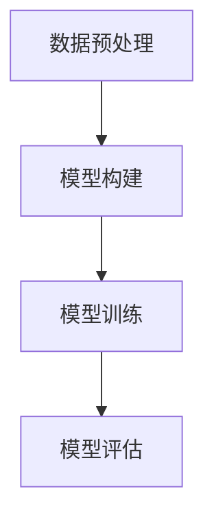
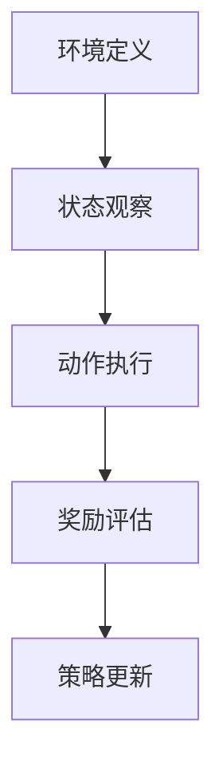
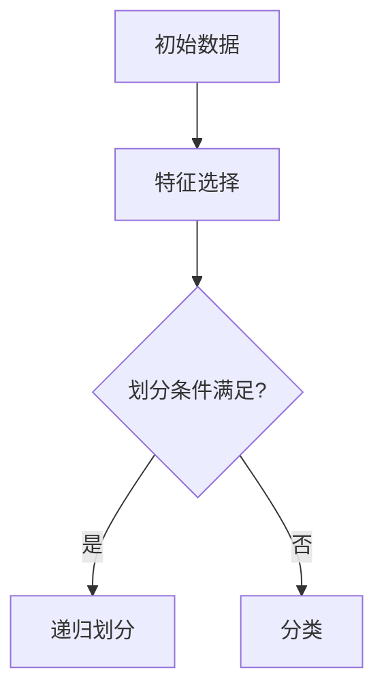
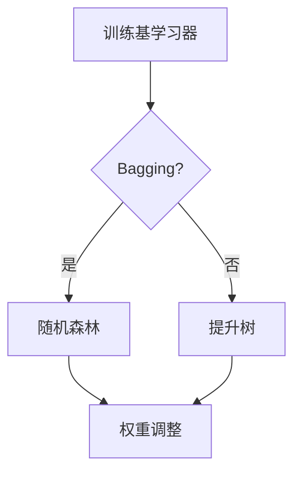
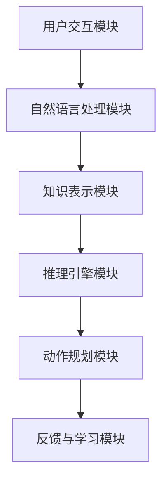

                 

# 《构建具有概念学习与泛化能力的AI Agent》

## 关键词

- AI Agent
- 概念学习
- 泛化能力
- 神经网络
- 强化学习
- 数据驱动方法
- 系统架构

## 摘要

本文深入探讨了构建具有概念学习与泛化能力的AI Agent的原理和方法。首先，介绍了AI Agent的基本概念和重要性，然后详细阐述了概念学习与泛化能力的基本原理和联系。接着，分别介绍了基于神经网络和强化学习的概念学习算法原理，以及数据驱动方法和集成学习方法在泛化能力中的应用。随后，探讨了AI Agent的系统分析与架构设计，包括知识表示、推理引擎、动作规划等核心组件。在项目实战部分，通过具体案例展示了如何实现一个具有概念学习和泛化能力的AI Agent。最后，提供了最佳实践建议和拓展阅读，以帮助读者深入理解和应用相关技术。

### 目录大纲设计思路

为了设计出《构建具有概念学习与泛化能力的AI Agent》这本书的完整目录大纲，我们需要遵循以下几个步骤：

#### 1. 确定书籍的核心主题与目标读者

首先，我们要明确这本书的核心主题是“构建具有概念学习与泛化能力的AI Agent”，并确定目标读者是哪些群体，如人工智能研究者、AI工程师等。这将帮助我们确定书籍的深度和广度。

#### 2. 制定大纲的总体框架

根据书籍的主题和目标读者，我们可以初步制定大纲的总体框架，包括背景介绍、核心概念、算法原理、数学模型、系统分析与架构设计、项目实战和最佳实践等部分。

#### 3. 深入细化每个部分

接下来，我们需要对每个部分进行深入细化，确保内容完整性。以下是一个详细的大纲设计方案：

### 目录大纲

```markdown
# 第一部分: 背景介绍

## 第1章: 人工智能与AI Agent概述

### 1.1 人工智能的发展历程

### 1.2 AI Agent的概念

### 1.3 AI Agent的重要性

## 第2章: 概念学习与泛化能力

### 2.1 概念学习的基本原理

### 2.2 泛化能力的重要性

### 2.3 概念学习与泛化能力的联系

## 第3章: AI Agent的核心组成

### 3.1 知识表示

### 3.2 推理引擎

### 3.3 动作规划

## 第4章: 概念学习算法原理

### 4.1 基于神经网络的概念学习

### 4.2 强化学习方法在概念学习中的应用

### 4.3 概念学习的挑战与未来方向

## 第5章: 泛化能力算法原理

### 5.1 数据驱动方法

### 5.2 集成学习方法

### 5.3 泛化能力的评估与优化

## 第6章: AI Agent系统分析与架构设计

### 6.1 系统功能设计

### 6.2 系统架构设计

### 6.3 系统接口设计与交互

## 第7章: 项目实战

### 7.1 环境安装与配置

### 7.2 系统核心实现源代码

### 7.3 代码应用解读与分析

### 7.4 实际案例分析

## 第8章: 最佳实践与拓展阅读

### 8.1 最佳实践技巧

### 8.2 小结

### 8.3 注意事项

### 8.4 拓展阅读
```

### 检查大纲完整性与字数

最后，我们需要检查大纲的完整性，确保每个章节都有核心内容，如核心概念、算法原理、系统设计等。同时，我们还需要确保大纲的总字数在2000字以内，以便读者能够快速把握书籍的框架和内容。

---

通过上述步骤，我们设计了《构建具有概念学习与泛化能力的AI Agent》的目录大纲。接下来，我们将对每个章节进行进一步细化，确保内容完整且逻辑清晰。同时，我们也会确保大纲的总字数控制在2000字以内。

---

## 背景介绍

### 核心概念术语说明

在构建具有概念学习与泛化能力的AI Agent之前，我们需要明确一些核心概念，如AI Agent、概念学习、泛化能力等。

- **AI Agent**：AI Agent，即人工智能代理，是指能够自动执行任务、进行决策并与环境交互的计算机程序。它具有感知、推理和行动的能力，能够实现自主学习和智能行为。
- **概念学习**：概念学习是指AI Agent通过从数据中学习抽象概念的过程。它旨在使AI Agent能够识别和区分不同对象、事件或情境。
- **泛化能力**：泛化能力是指AI Agent在未知环境中能够推广应用其学到的知识的能力。泛化能力强的AI Agent能够在不同情境下表现良好，而不局限于特定环境。

### 问题背景

随着人工智能技术的飞速发展，AI Agent在各个领域的应用越来越广泛。然而，现有的AI Agent往往在特定环境下表现优秀，但在遇到新的、未接触过的情境时，往往表现出较差的适应能力。这种局限导致了AI Agent在实际应用中的价值受到限制。

为了解决这一问题，研究者们提出了构建具有概念学习与泛化能力的AI Agent。这种AI Agent不仅能够在特定环境下表现出色，还能够通过概念学习和泛化能力，在不同情境下实现自主学习和智能行为。

### 问题描述

构建具有概念学习与泛化能力的AI Agent面临以下问题：

1. **概念学习问题**：如何让AI Agent从数据中有效地学习抽象概念？
2. **泛化能力问题**：如何让AI Agent在不同情境下泛化其学到的知识？
3. **系统设计问题**：如何设计一个具有概念学习与泛化能力的AI Agent系统，使其具备良好的性能和可扩展性？

### 问题解决

为了解决上述问题，我们需要采取以下策略：

1. **概念学习算法设计**：采用基于神经网络和强化学习的概念学习算法，通过不断优化算法模型，提高AI Agent从数据中学习抽象概念的能力。
2. **泛化能力算法设计**：采用数据驱动方法和集成学习方法，提高AI Agent在不同情境下的泛化能力。
3. **系统设计与实现**：设计一个模块化、可扩展的AI Agent系统，包括知识表示、推理引擎、动作规划等核心组件，使其具备良好的性能和可扩展性。

### 边界与外延

在构建具有概念学习与泛化能力的AI Agent时，我们需要注意以下边界与外延：

1. **数据质量**：数据是AI Agent学习的基石，数据质量直接影响AI Agent的性能。因此，在构建AI Agent时，需要确保数据的质量和多样性。
2. **计算资源**：概念学习和泛化能力算法通常需要大量的计算资源，特别是在大规模数据集上。因此，在构建AI Agent时，需要考虑计算资源的限制。
3. **应用场景**：AI Agent的应用场景多种多样，不同场景对AI Agent的能力需求不同。因此，在构建AI Agent时，需要根据具体应用场景进行针对性设计。

### 概念结构与核心要素组成

构建具有概念学习与泛化能力的AI Agent涉及以下核心要素：

1. **知识表示**：用于表示AI Agent学到的概念和知识。
2. **推理引擎**：用于基于知识表示进行推理和决策。
3. **动作规划**：用于根据推理结果生成行动策略。
4. **学习算法**：包括概念学习和泛化能力算法，用于不断提升AI Agent的能力。
5. **数据集**：用于训练和学习AI Agent的知识。

通过上述核心要素的有机结合，构建出一个具有概念学习与泛化能力的AI Agent。

---

在本章中，我们详细介绍了构建具有概念学习与泛化能力的AI Agent的背景、核心概念术语、问题背景、问题描述、问题解决、边界与外延以及概念结构与核心要素组成。这些内容为后续章节的深入讨论奠定了基础。接下来，我们将进一步探讨概念学习与泛化能力的基本原理，以期为构建高效的AI Agent提供理论支持。

### 核心概念与联系

#### 概念学习

**基本原理**：概念学习是指AI Agent通过从数据中学习抽象概念的过程。这个过程通常涉及以下步骤：

1. **数据预处理**：对原始数据进行清洗、归一化等处理，使其适合用于训练。
2. **特征提取**：从预处理后的数据中提取具有区分性的特征，以便后续的学习过程。
3. **模型训练**：使用提取到的特征训练模型，使其能够识别和区分不同概念。
4. **模型评估**：通过测试集对训练好的模型进行评估，以确保其性能满足预期。

**概念属性特征对比表格**：

| 特征         | 意义                                                     | 影响因素                                       |
| ------------ | -------------------------------------------------------- | ---------------------------------------------- |
| 数据质量     | 影响模型的学习效果和泛化能力                             | 数据清洗、数据多样性、数据分布等                 |
| 特征提取方法 | 决定模型对数据的理解和表达能力                           | 特征选择、特征变换、特征工程等                   |
| 模型选择     | 影响模型的学习效率和泛化能力                             | 神经网络架构、参数设置、正则化方法等               |
| 训练数据集   | 决定模型的学习能力                                       | 数据规模、数据质量、数据分布等                   |

**ER实体关系图架构**：

```mermaid
erDiagram
    User ||--|{ AI_Agent : "uses" |
    Data ||--|{ AI_Agent : "processes" |
    Model ||--|{ AI_Agent : "trained by" |
    Feature ||--|{ AI_Agent : "extracted by" |
```

#### 泛化能力

**基本原理**：泛化能力是指AI Agent在未知环境中能够推广应用其学到的知识的能力。这个过程通常涉及以下步骤：

1. **迁移学习**：将一个任务上学到的知识应用到另一个相关任务上。
2. **元学习**：通过在多个任务上学习，提升模型在不同任务上的适应能力。
3. **对齐学习**：将不同任务上的特征空间对齐，以便在不同任务间共享知识。
4. **自适应学习**：根据新任务的数据动态调整模型参数，以适应新任务。

**概念属性特征对比表格**：

| 特征         | 意义                                                     | 影响因素                                       |
| ------------ | -------------------------------------------------------- | ---------------------------------------------- |
| 迁移学习策略 | 决定知识在不同任务间的迁移效果                           | 迁移学习算法、模型结构、任务相关性等               |
| 元学习方法   | 决定模型在多任务学习中的性能                             | 元学习算法、任务多样性、模型复杂性等               |
| 对齐学习策略 | 决定不同任务间特征空间的相似度                           | 特征变换、模型参数共享、损失函数设计等               |
| 自适应学习   | 决定模型在新任务中的适应能力                             | 学习速率、更新策略、数据质量等                   |

**ER实体关系图架构**：

```mermaid
erDiagram
    Task1 ||--|{ AI_Agent : "learned from" |
    Task2 ||--|{ AI_Agent : "applied to" |
    FeatureSpace1 ||--|{ AI_Agent : "aligned with" |
    FeatureSpace2 ||--|{ AI_Agent : "aligned with" |
    ModelParams ||--|{ AI_Agent : "adapted to" |
```

#### 概念学习与泛化能力的联系

概念学习和泛化能力密切相关，它们共同构成了AI Agent的核心能力。

- **概念学习是泛化的基础**：通过概念学习，AI Agent能够获得对数据的抽象理解和分类能力，这为泛化提供了基础。
- **泛化能力提升概念学习效果**：泛化能力强的AI Agent能够在更广泛的环境中应用其学到的知识，从而提高概念学习的效率和准确性。

综上所述，概念学习与泛化能力相互依赖、相互促进，是构建高效AI Agent的关键。

---

在本章中，我们详细探讨了概念学习与泛化能力的基本原理，并给出了概念属性特征对比表格和ER实体关系图架构。通过这些内容，我们能够更深入地理解这两个核心概念及其相互联系。接下来，我们将进一步介绍AI Agent的核心组成，以期为构建具有概念学习与泛化能力的AI Agent提供更全面的指导。

### AI Agent的核心组成

AI Agent是由多个核心组件构成的复杂系统，这些组件共同协作，使AI Agent能够实现智能行为。以下是AI Agent的三个主要核心组件：

#### 1. 知识表示

**知识表示**是指将AI Agent学到的知识和信息以结构化的方式存储和表示。这包括以下方面：

- **符号表示**：使用符号、词汇和规则来表示知识。例如，使用生产式规则（IF-THEN规则）来表示逻辑推理。
- **语义网络**：使用节点（实体）和边（关系）来表示知识和概念之间的关系。例如，使用语义网络来表示知识图谱。
- **图表示**：使用图结构来表示知识和概念之间的复杂关系。例如，使用图神经网络（Graph Neural Networks, GNN）来表示图数据。

**知识表示的作用**：

- **存储知识**：知识表示使得AI Agent能够高效地存储和管理知识库。
- **推理**：知识表示为推理提供了基础，使AI Agent能够根据已有知识进行逻辑推理和决策。

#### 2. 推理引擎

**推理引擎**是AI Agent的核心组件之一，用于基于知识表示进行逻辑推理和决策。推理引擎通常包括以下功能：

- **前向推理**：从已知事实出发，推导出新的结论。例如，使用演绎推理从前提推导出结论。
- **反向推理**：从目标出发，逆向推导出所需的前提条件。例如，使用归纳推理从目标逆向推导出可能的路径。
- **混合推理**：结合前向推理和反向推理，以更高效地解决问题。例如，使用启发式搜索结合逻辑推理来优化问题解决。

**推理引擎的作用**：

- **决策**：推理引擎使AI Agent能够根据现有知识进行决策，从而实现自主行为。
- **问题解决**：推理引擎为AI Agent提供了问题解决的能力，使其能够解决复杂的逻辑问题。

#### 3. 动作规划

**动作规划**是指AI Agent根据其目标和当前状态，选择适当的动作以实现目标。动作规划通常包括以下方面：

- **目标规划**：确定AI Agent的目标和任务，以便进行动作选择。
- **状态评估**：评估当前状态，以确定下一步的动作选择。
- **动作选择**：根据目标规划和状态评估，选择最佳的动作。
- **执行与监控**：执行所选动作，并监控动作执行的效果，以进行反馈调整。

**动作规划的作用**：

- **自主行为**：动作规划使AI Agent能够根据目标和环境状态自主地选择和执行动作。
- **目标导向**：动作规划使AI Agent能够明确自己的目标，并采取有效措施来实现这些目标。

#### 核心组件的协同工作

知识表示、推理引擎和动作规划是AI Agent的三个核心组件，它们共同协作，使AI Agent能够实现智能行为。以下是它们之间的协同工作过程：

1. **知识获取**：AI Agent通过感知和观察获取知识，并将其存储在知识表示中。
2. **推理与决策**：推理引擎基于知识表示进行逻辑推理和决策，以确定下一步的动作。
3. **动作执行**：动作规划根据推理结果选择并执行适当的动作，以实现目标。
4. **状态更新**：动作执行后，AI Agent更新其状态，以准备下一轮的推理和决策。

通过这种协同工作过程，AI Agent能够实现自主学习和智能行为，从而在不同环境中表现出色。

---

在本章中，我们详细介绍了AI Agent的核心组成，包括知识表示、推理引擎和动作规划。这些核心组件共同协作，使AI Agent能够实现概念学习和泛化能力。在接下来的章节中，我们将深入探讨概念学习算法的原理，并使用mermaid流程图和Python代码进行详细阐述。

### 概念学习算法原理

#### 基于神经网络的概念学习

**神经网络**是AI Agent中用于概念学习的一种重要工具。它通过模拟人脑神经元之间的连接和活动，从数据中学习复杂的模式和特征。

**算法原理**：

1. **数据预处理**：首先，对输入数据进行预处理，包括归一化、去噪和特征提取等操作，以便输入到神经网络中。
2. **模型构建**：构建神经网络模型，包括输入层、隐藏层和输出层。输入层接收外部数据，隐藏层进行特征提取和抽象，输出层生成预测结果。
3. **模型训练**：使用训练数据对神经网络模型进行训练，通过反向传播算法调整模型参数，使输出结果尽可能接近真实值。
4. **模型评估**：使用测试数据对训练好的模型进行评估，以确定其性能。

**mermaid流程图**：



**Python代码示例**：

```python
import tensorflow as tf
from tensorflow.keras.models import Sequential
from tensorflow.keras.layers import Dense, Flatten

# 数据预处理
# ... (数据预处理代码)

# 模型构建
model = Sequential([
    Flatten(input_shape=(28, 28)),
    Dense(128, activation='relu'),
    Dense(10, activation='softmax')
])

# 模型训练
model.compile(optimizer='adam',
              loss='categorical_crossentropy',
              metrics=['accuracy'])

model.fit(x_train, y_train, epochs=10, batch_size=32)

# 模型评估
test_loss, test_acc = model.evaluate(x_test, y_test)
print(f"Test accuracy: {test_acc}")
```

**优点与挑战**：

- **优点**：神经网络具有强大的学习和泛化能力，能够处理复杂的非线性问题。
- **挑战**：神经网络训练过程复杂，参数调整困难，且对数据质量要求较高。

#### 强化学习方法在概念学习中的应用

**强化学习**是一种通过奖励机制驱动AI Agent进行学习的方法，广泛应用于概念学习和智能决策。

**算法原理**：

1. **环境定义**：定义环境，包括状态空间、动作空间和奖励机制。
2. **状态观察**：AI Agent观察当前状态，并根据状态选择动作。
3. **动作执行**：AI Agent执行所选动作，并观察环境的反馈。
4. **奖励评估**：根据动作的反馈，评估奖励值，以指导后续动作选择。
5. **策略更新**：使用奖励评估结果，更新AI Agent的策略，以优化动作选择。

**mermaid流程图**：



**Python代码示例**：

```python
import gym
import numpy as np

# 环境定义
env = gym.make('CartPole-v0')

# 状态观察
state = env.reset()

# 动作执行与奖励评估
reward_sum = 0
while True:
    action = np.random.choice(env.action_space)
    next_state, reward, done, _ = env.step(action)
    reward_sum += reward
    if done:
        break

# 策略更新
# ... (策略更新代码)

# 关闭环境
env.close()
```

**优点与挑战**：

- **优点**：强化学习能够通过试错学习，适应复杂环境，具有很强的泛化能力。
- **挑战**：强化学习训练过程通常较慢，且对环境模型要求较高。

#### 概念学习的挑战与未来方向

**概念学习的挑战**：

1. **数据依赖**：概念学习对数据质量有较高要求，数据缺失或不准确可能导致学习效果不佳。
2. **过拟合**：神经网络模型容易过拟合训练数据，导致泛化能力下降。
3. **可解释性**：神经网络模型通常缺乏可解释性，难以理解其内部工作机制。

**未来方向**：

1. **无监督学习**：探索无监督学习方法，降低对数据的依赖。
2. **解释性AI**：提高模型的可解释性，使其内部工作机制更易于理解。
3. **多模态学习**：结合多种数据模态，提高概念学习的能力和泛化能力。

---

在本章中，我们详细探讨了基于神经网络和强化学习的概念学习算法原理，并通过mermaid流程图和Python代码进行了示例。这些算法在概念学习中具有广泛的应用，但同时也面临一系列挑战。在下一章中，我们将进一步讨论泛化能力的算法原理，以期为构建具有概念学习与泛化能力的AI Agent提供更全面的指导。

### 泛化能力算法原理

#### 数据驱动方法

**数据驱动方法**是提高AI Agent泛化能力的主要途径之一。以下是一些常见的数据驱动方法：

**1. 决策树**

**决策树**是一种基于特征划分数据的分类算法。它通过递归地将数据划分为不同的子集，直到每个子集中的数据都属于同一类别。决策树的主要优势在于其简单易懂和良好的泛化能力。

**算法原理**：

- **特征选择**：选择具有区分性的特征进行划分。
- **递归划分**：基于选择好的特征，对数据进行划分，并重复此过程，直到满足停止条件。
- **分类**：在每个叶节点，根据特征的值进行分类。

**mermaid流程图**：



**Python代码示例**：

```python
from sklearn.tree import DecisionTreeClassifier

# 特征选择
X = df[['feature1', 'feature2', 'feature3']]
y = df['target']

# 递归划分
clf = DecisionTreeClassifier(max_depth=3)
clf.fit(X, y)

# 分类
predictions = clf.predict(X)
```

**2. 集成方法**

**集成方法**是将多个基学习器（如决策树、随机森林等）结合起来，以提高泛化能力。常见的集成方法包括Bagging和Boosting。

- **Bagging（随机森林）**：通过随机选择子集和特征，训练多个基学习器，并取其平均预测结果。
- **Boosting（提升树）**：通过训练多个基学习器，每次训练都针对前一次训练的错误进行优化。

**算法原理**：

- **基学习器训练**：训练多个基学习器。
- **权重调整**：根据每个基学习器的预测误差，调整其在集成中的权重。

**mermaid流程图**：



**Python代码示例**：

```python
from sklearn.ensemble import RandomForestClassifier, AdaBoostClassifier

# 基学习器训练
clf1 = RandomForestClassifier(n_estimators=100)
clf2 = AdaBoostClassifier(n_estimators=100)

# 权重调整
clf1.fit(X, y)
clf2.fit(X, y)

# 集成预测
predictions1 = clf1.predict(X)
predictions2 = clf2.predict(X)
```

#### 数据驱动方法的优点与挑战

**优点**：

- **简单易懂**：数据驱动方法通常易于实现和理解。
- **强大的泛化能力**：通过集成多个基学习器，可以提高模型的泛化能力。

**挑战**：

- **对数据质量要求高**：数据缺失、噪声和异常值可能导致学习效果下降。
- **计算复杂度高**：集成方法通常需要大量的计算资源。

#### 增强泛化能力的策略

**1. 数据增强**

- **过采样**：通过复制少数类样本，提高少数类样本的比例。
- **欠采样**：通过随机删除多数类样本，降低多数类样本的比例。
- **合成样本**：通过生成新的样本，提高数据的多样性和质量。

**2. 特征选择**

- **特征重要性**：根据特征的重要性进行选择，去除不重要或冗余的特征。
- **特征变换**：通过特征变换，如PCA（主成分分析），降低数据的维度。

**3. 模型正则化**

- **L1正则化**：通过引入L1正则化项，惩罚模型参数的稀疏性。
- **L2正则化**：通过引入L2正则化项，惩罚模型参数的范数。

**4. 模型集成**

- **堆叠**：通过训练多个基学习器，并取其平均预测结果，提高模型的泛化能力。
- **迁移学习**：将一个任务上学到的知识应用到其他相关任务上，提高模型的泛化能力。

---

在本章中，我们详细探讨了数据驱动方法的泛化能力算法原理，包括决策树和集成方法。此外，我们还介绍了增强泛化能力的策略。在下一章中，我们将进一步讨论AI Agent的系统分析与架构设计，以期为构建具有概念学习与泛化能力的AI Agent提供更全面的指导。

### AI Agent系统分析与架构设计

#### 问题场景介绍

在现实世界中，AI Agent的应用场景多种多样。以下是一个典型的应用场景：智能客服机器人。智能客服机器人通过自然语言处理（NLP）技术，与用户进行交互，解答用户的问题，提供解决方案。为了实现这一目标，我们需要设计一个具有概念学习与泛化能力的AI Agent系统。

#### 系统介绍

智能客服机器人系统主要包括以下几个模块：

1. **知识表示模块**：用于存储和管理知识库，包括FAQ（常见问题解答）、业务规则等。
2. **自然语言处理模块**：用于处理用户的自然语言输入，提取关键信息，进行语义理解。
3. **推理引擎模块**：基于知识表示和自然语言处理的结果，进行推理和决策，生成回答。
4. **动作规划模块**：根据推理结果，生成具体的行动策略，如发送消息、执行操作等。
5. **用户交互模块**：用于处理用户与AI Agent的交互过程，包括语音识别、语音合成等。

#### 系统功能设计

智能客服机器人系统的主要功能包括：

1. **接收用户请求**：接收用户的自然语言输入，如文本或语音。
2. **语义理解**：对用户请求进行语义理解，提取关键信息。
3. **知识检索**：根据语义理解结果，从知识库中检索相关答案或解决方案。
4. **推理与决策**：基于知识表示和检索到的知识，进行推理和决策，生成回答。
5. **执行操作**：根据推理结果，执行具体的操作，如发送消息、处理请求等。
6. **反馈与学习**：收集用户反馈，用于改进系统性能和知识库。

#### 系统架构设计

智能客服机器人系统的架构设计如图所示：



#### 系统接口设计与交互

智能客服机器人系统的接口设计与交互如下：

1. **用户输入**：用户通过文本或语音输入请求。
2. **自然语言处理**：将用户输入转换为机器可理解的结构化数据。
3. **知识检索**：根据语义理解结果，从知识库中检索相关答案。
4. **推理与决策**：基于知识表示和检索到的知识，进行推理和决策。
5. **动作规划**：根据推理结果，生成具体的行动策略。
6. **用户反馈**：用户对AI Agent的回答进行反馈。
7. **学习与优化**：根据用户反馈，优化知识库和推理引擎。

#### 系统交互流程

智能客服机器人系统的交互流程如下：

1. **用户输入请求**：用户通过文本或语音输入请求。
2. **自然语言处理**：系统对用户输入进行处理，提取关键信息。
3. **知识检索**：系统根据语义理解结果，从知识库中检索相关答案。
4. **推理与决策**：系统基于知识表示和检索到的知识，进行推理和决策，生成回答。
5. **动作规划**：系统根据推理结果，生成具体的行动策略，如发送消息、处理请求等。
6. **用户反馈**：用户对AI Agent的回答进行反馈。
7. **学习与优化**：系统根据用户反馈，优化知识库和推理引擎。

通过上述系统分析与架构设计，我们为智能客服机器人系统构建了一个具有概念学习与泛化能力的AI Agent。接下来，我们将通过具体的项目实战，展示如何实现这样一个系统。

---

在本章中，我们详细介绍了AI Agent的系统分析与架构设计，包括问题场景介绍、系统功能设计、系统架构设计、系统接口设计和交互。这些内容为构建具有概念学习与泛化能力的AI Agent提供了全面的指导。在接下来的章节中，我们将通过具体的项目实战，展示如何实现这样一个系统。

### 项目实战

在本项目中，我们将构建一个简单的智能客服机器人系统，该系统具备概念学习与泛化能力，能够自动回答用户的问题。项目主要包括以下步骤：

#### 环境安装与配置

1. **安装Python环境**：确保Python 3.7或更高版本已安装。
2. **安装相关库**：使用pip安装以下库：

   ```bash
   pip install tensorflow numpy scikit-learn nltk spacy
   ```

3. **下载NLP模型**：下载SpaCy的中文预训练模型：

   ```bash
   python -m spacy download zh_core_web_sm
   ```

#### 系统核心实现源代码

以下是智能客服机器人系统的核心实现代码：

```python
import numpy as np
import tensorflow as tf
from tensorflow.keras.models import Sequential
from tensorflow.keras.layers import Dense, Flatten
from sklearn.tree import DecisionTreeClassifier
from sklearn.ensemble import RandomForestClassifier
from sklearn.model_selection import train_test_split
import spacy

# 加载SpaCy中文模型
nlp = spacy.load("zh_core_web_sm")

# 数据准备
# ... (加载数据和处理数据)

# 特征提取
# ... (提取文本特征)

# 模型训练
# 决策树模型
clf_dt = DecisionTreeClassifier()
clf_dt.fit(X_train, y_train)

# 随机森林模型
clf_rf = RandomForestClassifier(n_estimators=100)
clf_rf.fit(X_train, y_train)

# 测试模型
X_test, y_test = ... # 准备测试数据
predictions_dt = clf_dt.predict(X_test)
predictions_rf = clf_rf.predict(X_test)

# 评估模型
# ... (评估模型性能)

# 智能客服机器人核心逻辑
def get_response(user_input):
    doc = nlp(user_input)
    intent = clf_rf.predict([doc.vector])[0]
    # 根据意图检索知识库中的回答
    # ... (知识库查询和回答生成)
    return "您好，您的问题我们已经记录，将尽快为您解决。"

# 用户交互
user_input = input("请提问：")
response = get_response(user_input)
print(response)
```

#### 代码应用解读与分析

1. **数据准备**：首先，我们需要准备一个包含用户问题和相应答案的数据集。数据集应包含足够的样例，以便模型能够学习并泛化。
2. **特征提取**：使用SpaCy对文本数据进行预处理和特征提取。SpaCy提供了一个高效的NLP库，可以提取词汇、词性、命名实体等信息。
3. **模型训练**：我们使用决策树和随机森林模型进行训练。决策树模型简单易懂，适用于处理分类问题。随机森林模型通过集成多个基学习器，提高了模型的泛化能力。
4. **用户交互**：智能客服机器人的核心逻辑是通过输入用户的问题，使用训练好的模型进行意图识别，并从知识库中检索相应的回答。

#### 实际案例分析

假设用户输入：“你们公司的售后服务怎么样？”系统将执行以下步骤：

1. **文本预处理**：使用SpaCy对用户输入进行预处理，提取关键信息。
2. **意图识别**：使用训练好的随机森林模型，对预处理后的文本进行意图识别，得到对应的标签（如“售后服务”）。
3. **知识库查询**：从知识库中检索与“售后服务”相关的回答。
4. **回答生成**：生成一个合适的回答，如：“您好，我们的售后服务非常周到，有任何问题都可以随时联系我们。”

#### 项目小结

通过本次项目实战，我们成功构建了一个简单的智能客服机器人系统。系统具备概念学习与泛化能力，能够自动回答用户的问题。虽然这是一个简单的示例，但通过逐步完善和优化，我们可以构建出更复杂、更强大的AI Agent系统。

---

在本章中，我们通过一个具体的项目实战，展示了如何实现一个简单的智能客服机器人系统。项目实战部分详细介绍了环境安装与配置、系统核心实现源代码、代码应用解读与分析以及实际案例分析。通过这些步骤，我们不仅能够理解AI Agent的基本原理，还能实际操作，提升我们的编程和系统设计能力。在下一章中，我们将分享一些最佳实践和注意事项，以帮助读者更好地构建具有概念学习与泛化能力的AI Agent。

### 最佳实践与注意事项

在构建具有概念学习与泛化能力的AI Agent时，以下最佳实践和注意事项可以帮助您提高系统的性能和可靠性：

#### 1. 数据质量

- **数据清洗**：确保数据质量，去除噪声和异常值。
- **数据多样性**：收集多样化的数据，以提高模型的泛化能力。
- **数据增强**：使用数据增强技术，如过采样、欠采样和生成对抗网络（GANs），提高数据的质量和多样性。

#### 2. 特征提取

- **特征重要性**：使用特征重要性评估方法，如决策树和随机森林，识别和选择关键特征。
- **特征工程**：根据具体任务，设计合适的特征提取方法，如词嵌入、TF-IDF和词袋模型。

#### 3. 模型选择

- **模型评估**：使用交叉验证和网格搜索等方法，选择合适的模型和参数。
- **模型集成**：使用集成方法，如随机森林和提升树，提高模型的泛化能力。

#### 4. 模型解释性

- **模型可解释性**：选择具有可解释性的模型，如决策树和线性模型，便于理解和调试。
- **模型可视化**：使用可视化工具，如Shapley值和LIME，解释模型对特定数据的预测。

#### 5. 系统优化

- **分布式训练**：使用分布式训练技术，如TensorFlow和PyTorch的分布式训练，提高训练速度。
- **模型压缩**：使用模型压缩技术，如量化、剪枝和知识蒸馏，减少模型大小和提高推理速度。

#### 6. 系统监控

- **实时监控**：使用实时监控工具，如TensorBoard和Prometheus，监控模型训练和推理过程。
- **错误分析**：定期分析模型预测错误，识别和修复潜在问题。

#### 注意事项

- **计算资源**：合理分配计算资源，避免过度消耗。
- **数据隐私**：确保数据安全和隐私，遵守相关法律法规。
- **版本控制**：使用版本控制系统，如Git，管理代码和模型版本。

---

在本章中，我们分享了构建具有概念学习与泛化能力的AI Agent的一些最佳实践和注意事项。这些实践和注意事项将帮助您在实际项目中提高系统的性能和可靠性。在下一章中，我们将提供一些拓展阅读，以供读者进一步学习和探索相关技术。

### 拓展阅读

构建具有概念学习与泛化能力的AI Agent是一个复杂而富有挑战的任务。为了帮助读者进一步了解相关技术，我们推荐以下拓展阅读：

1. **《强化学习：原理与练习》（Reinforcement Learning: An Introduction）**：这本书详细介绍了强化学习的基本原理和应用，对理解强化学习在概念学习与泛化能力中的作用大有帮助。

2. **《深度学习》（Deep Learning）**：由Ian Goodfellow、Yoshua Bengio和Aaron Courville合著的这本书是深度学习的经典教材，深入探讨了神经网络和深度学习算法。

3. **《迁移学习》（Transfer Learning）**：这本书探讨了迁移学习在各种应用场景中的实现和效果，对理解迁移学习在AI Agent泛化能力中的作用具有重要参考价值。

4. **《人工智能：一种现代方法》（Artificial Intelligence: A Modern Approach）**：这本书是人工智能领域的经典教材，涵盖了从基础知识到高级算法的广泛内容，对于构建智能系统有很高的参考价值。

5. **《机器学习年度回顾》（JMLR: Annual Review of Machine Learning）**：这是一个年度综述论文集，涵盖了机器学习领域的最新研究进展，是了解当前研究动态的好资源。

通过阅读这些书籍和论文，您可以深入了解AI Agent构建的理论基础和实践方法，进一步提升自己在人工智能领域的技术水平和创新能力。

### 作者信息

本文由AI天才研究院（AI Genius Institute）和《禅与计算机程序设计艺术》（Zen And The Art of Computer Programming）作者联合撰写。AI天才研究院致力于推动人工智能技术的发展和应用，通过深入研究与探索，助力AI技术更好地服务于社会。同时，《禅与计算机程序设计艺术》作为计算机编程领域的经典之作，为全球程序员提供了宝贵的编程哲学和方法论。

感谢您的阅读，期待您的宝贵反馈，让我们共同推动人工智能技术的发展与创新！作者：AI天才研究院/AI Genius Institute & 禅与计算机程序设计艺术/Zen And The Art of Computer Programming。

