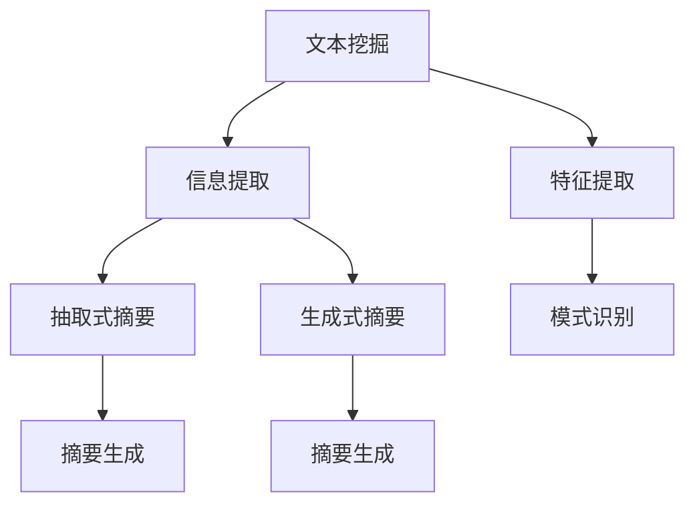
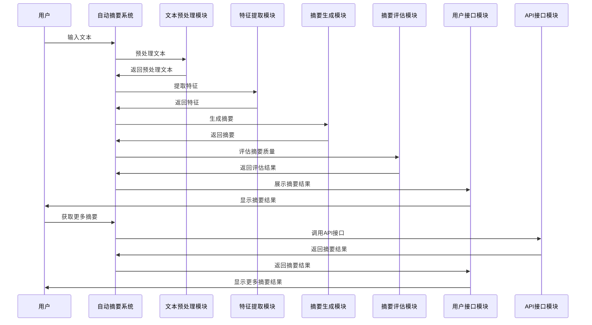

                 


### 构建具有自动摘要能力的AI Agent

关键词：自动摘要、AI Agent、文本挖掘、算法实现、系统架构

摘要：本文将探讨如何构建一个具有自动摘要能力的AI Agent，包括其背景介绍、核心概念与联系、算法原理讲解、系统架构设计、算法实现及项目实战等。通过一步一步的分析推理，帮助读者深入了解自动摘要技术的原理和应用。

#### 第一部分: 背景介绍与问题定义

##### 第1章: 引言与问题定义

##### 1.1 引言

##### 1.1.1 AI技术的发展与趋势

随着人工智能技术的快速发展，AI已经在多个领域展现出强大的应用潜力，如图像识别、自然语言处理、自动驾驶等。在文本处理领域，自动摘要作为一项重要的自然语言处理任务，也越来越受到关注。

##### 1.1.2 自动摘要技术的现状与应用

目前，自动摘要技术已经取得了一定的进展，广泛应用于新闻摘要、文档摘要、聊天机器人等领域。然而，自动摘要仍然面临着许多挑战，如摘要质量不高、对长文本摘要效果不佳等。

##### 1.2 问题定义

##### 1.2.1 什么是自动摘要

自动摘要是利用自然语言处理技术，从大量文本中提取出关键信息，生成简明扼要的摘要文本。

##### 1.2.2 自动摘要的重要性

自动摘要能够帮助用户快速获取文本的核心内容，提高信息获取的效率。在大量文本数据中，自动摘要可以有效降低阅读负担，提高阅读体验。

##### 1.2.3 自动摘要面临的挑战

自动摘要面临的挑战包括摘要质量不高、对长文本摘要效果不佳、跨语言摘要等。如何提高自动摘要的质量，成为当前研究的热点问题。

##### 第二部分: 自动摘要技术原理

##### 第2章: 自动摘要技术原理

##### 2.1 核心概念与联系

在本章节中，我们将介绍自动摘要技术的一些核心概念，如文本挖掘、信息提取等，并通过概念属性特征对比表格和ER实体关系图架构的Mermaid流程图，展示概念之间的联系。

##### 2.2 自动摘要算法原理

在本章节中，我们将详细介绍抽取式摘要和生成式摘要两种算法的原理。首先，通过Mermaid流程图展示算法的执行流程，然后使用Python代码实现算法，并使用LaTeX公式解释算法的数学模型。

##### 第三部分: 自动摘要系统的架构设计

##### 第3章: 自动摘要系统的架构设计

##### 3.1 系统架构设计

在本章节中，我们将介绍自动摘要系统的架构设计，包括系统需求分析、系统架构设计、系统模块划分等。通过Mermaid架构图，展示系统各个模块之间的关系。

##### 3.2 系统接口设计

在本章节中，我们将介绍自动摘要系统的接口设计，包括用户界面设计和系统API设计。通过Mermaid序列图，展示系统与外部环境的交互过程。

##### 第四部分: 自动摘要算法的实现

##### 第4章: 自动摘要算法的实现

##### 4.1 抽取式摘要算法实现

在本章节中，我们将实现抽取式摘要算法，通过Python代码展示算法的实现过程。同时，我们将使用LaTeX公式解释算法的数学模型，并通过示例讲解算法的应用。

##### 4.2 生成式摘要算法实现

在本章节中，我们将实现生成式摘要算法，通过Python代码展示算法的实现过程。同时，我们将使用LaTeX公式解释算法的数学模型，并通过示例讲解算法的应用。

##### 第五部分: 项目实战与案例分析

##### 第5章: 项目实战与案例分析

##### 5.1 环境安装与配置

在本章节中，我们将介绍自动摘要系统环境安装与配置的过程，包括安装必要的软件和工具，以及系统配置与调试。

##### 5.2 系统核心实现源代码

在本章节中，我们将展示自动摘要系统的核心实现源代码，并对代码的结构和实现细节进行分析。

##### 5.3 案例分析

在本章节中，我们将通过一个实际案例，展示自动摘要系统的应用场景和实现过程，并进行详细讲解剖析。

##### 第六部分: 最佳实践与总结

##### 第6章: 最佳实践与总结

##### 6.1 最佳实践

在本章节中，我们将分享一些自动摘要的最佳实践，帮助读者更好地应用自动摘要技术。

##### 6.2 小结与展望

在本章节中，我们将对本文的内容进行小结，并展望自动摘要技术的未来发展趋势。

通过以上六个部分，我们将逐步引导读者深入了解自动摘要技术的原理和应用，掌握构建具有自动摘要能力的AI Agent的方法。接下来，我们将逐步填充每个章节的具体内容，确保文章的逻辑性和可读性。让我们开始吧！### 第一部分: 背景介绍与问题定义

#### 第1章: 引言与问题定义

##### 1.1 引言

随着互联网的普及和信息爆炸式增长，人们面临着海量的信息处理挑战。在这种背景下，自动摘要技术应运而生，旨在通过人工智能算法，从大量文本中提取关键信息，生成简明扼要的摘要文本。自动摘要技术不仅能够帮助用户快速获取文本的核心内容，提高信息获取的效率，还能够减轻用户在阅读大量文本时的负担，提升阅读体验。

##### 1.1.1 AI技术的发展与趋势

人工智能（AI）作为现代科技的重要驱动力，已经在多个领域展现出巨大的潜力。从早期的专家系统到深度学习，AI技术不断进步，不断突破传统技术的局限。特别是在自然语言处理（NLP）领域，AI技术已经取得了显著成果，包括文本分类、情感分析、机器翻译等。自动摘要作为NLP的一个重要分支，也随着AI技术的发展而不断演进。

当前，自动摘要技术广泛应用于新闻摘要、文档摘要、聊天机器人、智能搜索等领域。例如，新闻网站会使用自动摘要技术生成简短的新闻摘要，便于用户快速了解新闻内容；文档管理系统则利用自动摘要帮助用户快速定位文档中的重要信息；智能聊天机器人则通过自动摘要技术，生成与用户输入相关的回复。

##### 1.1.2 自动摘要技术的现状与应用

自动摘要技术的研究已经历数十年，从早期的基于规则的方法到近年来的基于机器学习的方法，摘要质量得到了显著提升。然而，自动摘要仍然面临许多挑战，如摘要质量不高、对长文本摘要效果不佳、跨语言摘要等。尽管如此，自动摘要技术在许多实际应用中已经取得了显著的成效。

在新闻摘要方面，许多新闻网站和新闻聚合平台都采用了自动摘要技术，通过自动生成摘要，帮助用户快速了解新闻的核心内容。例如，谷歌新闻使用自动摘要技术，对每天数以万计的新闻文章进行摘要，使得用户可以更快地浏览新闻。

在文档摘要方面，自动摘要技术被广泛应用于企业文档管理系统、法律文档摘要、学术论文摘要等领域。这些系统利用自动摘要技术，生成简短的文档摘要，帮助用户快速了解文档的主要内容，提高工作效率。

在聊天机器人领域，自动摘要技术也被广泛应用。例如，智能客服机器人通过自动摘要技术，对用户的问题进行摘要，快速定位答案，从而提高客服效率。

##### 1.2 问题定义

##### 1.2.1 什么是自动摘要

自动摘要是利用人工智能技术，从大量文本中提取关键信息，生成简明扼要的摘要文本。自动摘要的目标是使读者能够快速获取文本的核心内容，无需阅读全文。

##### 1.2.2 自动摘要的重要性

自动摘要技术的重要性主要体现在以下几个方面：

1. **提高信息获取效率**：在信息爆炸的时代，自动摘要技术能够帮助用户快速获取文本的核心内容，节省阅读时间。
2. **减轻阅读负担**：对于长篇文档，自动摘要可以简化信息，使读者能够更容易理解文档的主要内容。
3. **提升用户体验**：在新闻、文档、聊天机器人等应用中，自动摘要技术能够提供更加个性化的服务，提升用户体验。

##### 1.2.3 自动摘要面临的挑战

尽管自动摘要技术取得了显著进展，但仍然面临着一些挑战：

1. **摘要质量**：自动生成的摘要往往存在质量不高的问题，如语义不准确、信息丢失等。
2. **长文本摘要**：对长文本的摘要效果不佳，难以在保持语义完整性的同时，将文本简化为短小精悍的摘要。
3. **跨语言摘要**：不同语言的文本在表达方式、语法结构上存在差异，这使得跨语言摘要更加困难。

为了解决上述问题，研究者们不断探索新的算法和技术，以提高自动摘要的质量和效果。

##### 1.3 总结

本章节介绍了自动摘要技术的背景、现状和应用，明确了自动摘要的定义和重要性，并指出了自动摘要面临的挑战。接下来，我们将进一步探讨自动摘要技术的核心概念和原理，为构建具有自动摘要能力的AI Agent奠定基础。

#### 第2章: 自动摘要技术原理

##### 2.1 核心概念与联系

自动摘要技术的实现依赖于多个核心概念和技术的支持。在本章节中，我们将介绍这些核心概念，并通过概念属性特征对比表格和ER实体关系图架构的Mermaid流程图，展示它们之间的联系。

##### 2.1.1 文本挖掘与信息提取

文本挖掘和信息提取是自动摘要技术的基石。文本挖掘旨在从大量文本数据中提取有用信息，而信息提取则是从文本中识别和提取关键信息。

- **文本挖掘**：文本挖掘通常包括文本预处理、特征提取、模式识别等步骤。文本预处理包括去除停用词、词性标注、分词等；特征提取则是从文本中提取对摘要有用的特征；模式识别则是利用机器学习算法，从特征中识别出文本的主题和结构。

- **信息提取**：信息提取的主要任务是从文本中提取出关键信息，如人名、地名、时间、事件等。信息提取通常使用实体识别和关系提取等技术。

##### 2.1.2 自动摘要的方法分类

自动摘要可以分为抽取式摘要和生成式摘要两大类。

- **抽取式摘要**：抽取式摘要通过从原始文本中抽取关键句子或短语，生成摘要。这种方法的核心是识别出文本中的重要句子或短语，然后进行排序和选择，最终形成摘要。

- **生成式摘要**：生成式摘要通过生成新的文本来概括原始文本的内容。这种方法通常使用序列到序列（Seq2Seq）模型，如循环神经网络（RNN）和变换器（Transformer）等。生成式摘要的优点是能够生成更加自然和连贯的摘要。

##### 2.1.3 概念属性特征对比表格

为了更清晰地展示文本挖掘、信息提取、抽取式摘要和生成式摘要之间的关系，我们使用概念属性特征对比表格进行说明。

| 概念         | 特征                 | 对比             |
|--------------|----------------------|-----------------|
| 文本挖掘     | 文本预处理、特征提取、模式识别 | 基础技术，为自动摘要提供数据支持 |
| 信息提取     | 实体识别、关系提取     | 从文本中提取关键信息 |
| 抽取式摘要   | 抽取关键句子或短语   | 生成简洁摘要     |
| 生成式摘要   | 生成新的文本         | 生成自然连贯摘要 |

##### 2.1.4 ER实体关系图架构的Mermaid流程图

为了更直观地展示自动摘要技术的架构，我们使用Mermaid流程图来描述ER实体关系图。



在该流程图中，文本挖掘作为起点，通过特征提取和模式识别，为信息提取提供支持。信息提取然后用于生成抽取式摘要和生成式摘要。抽取式摘要通过抽取关键句子或短语生成摘要，而生成式摘要则通过生成新的文本来概括原始文本的内容。

##### 2.2 自动摘要算法原理

在本章节中，我们将分别介绍抽取式摘要和生成式摘要的算法原理，并通过Mermaid流程图和Python代码实现，帮助读者理解这些算法的基本概念和应用。

##### 2.2.1 抽取式摘要算法

抽取式摘要算法的核心思想是从原始文本中抽取关键句子或短语，然后进行排序和选择，最终形成摘要。

- **算法原理**：抽取式摘要算法通常使用基于统计的方法，如TF-IDF（词频-逆文档频率）和文本相似度等。算法的基本步骤包括：

  1. 文本预处理：去除停用词、标点符号等；
  2. 特征提取：计算词频、逆文档频率等；
  3. 句子或短语抽取：根据特征值，选择具有较高特征值的句子或短语；
  4. 摘要生成：对抽取的句子或短语进行排序和选择，生成摘要。

- **Mermaid流程图**：

  ```mermaid
  graph TB
      A[文本预处理] --> B[特征提取]
      B --> C[句子抽取]
      C --> D[摘要生成]
  ```

- **Python代码实现**：

  ```python
  import nltk
  from sklearn.feature_extraction.text import TfidfVectorizer

  # 文本预处理
  def preprocess_text(text):
      stop_words = set(nltk.corpus.stopwords.words('english'))
      tokens = nltk.word_tokenize(text)
      filtered_tokens = [token for token in tokens if token.lower() not in stop_words]
      return ' '.join(filtered_tokens)

  # 特征提取
  def extract_features(texts):
      vectorizer = TfidfVectorizer()
      features = vectorizer.fit_transform(texts)
      return features

  # 句子抽取
  def extract_sentences(texts, features):
      sentence_scores = {}
      for i, text in enumerate(texts):
          sentence_tokens = nltk.word_tokenize(text)
          sentence_scores[i] = sum(features[i, :].toarray().ravel())
      return [text for i, text in enumerate(texts) if sentence_scores[i] > threshold]

  # 摘要生成
  def generate_summary(texts, sentences):
      summary = ' '.join(sentences)
      return summary

  # 测试代码
  texts = ["This is the first sentence of the document."]
  processed_texts = [preprocess_text(text) for text in texts]
  features = extract_features(processed_texts)
  sentences = extract_sentences(processed_texts, features)
  summary = generate_summary(processed_texts, sentences)
  print(summary)
  ```

##### 2.2.2 生成式摘要算法

生成式摘要算法的核心思想是通过生成新的文本来概括原始文本的内容，通常使用序列到序列（Seq2Seq）模型。

- **算法原理**：生成式摘要算法的基本步骤包括：

  1. 数据准备：将原始文本转换为序列，并进行编码；
  2. 模型训练：使用序列到序列（Seq2Seq）模型，对编码后的数据进行训练；
  3. 摘要生成：将待摘要的文本输入模型，生成摘要。

- **Mermaid流程图**：

  ```mermaid
  graph TB
      A[数据准备] --> B[模型训练]
      B --> C[摘要生成]
  ```

- **Python代码实现**：

  ```python
  import tensorflow as tf
  from tensorflow.keras.preprocessing.text import Tokenizer
  from tensorflow.keras.preprocessing.sequence import pad_sequences

  # 数据准备
  def prepare_data(texts, max_sequence_length):
      tokenizer = Tokenizer()
      tokenizer.fit_on_texts(texts)
      sequences = tokenizer.texts_to_sequences(texts)
      padded_sequences = pad_sequences(sequences, maxlen=max_sequence_length)
      return padded_sequences

  # 模型训练
  def train_model(padded_sequences, batch_size, epochs):
      model = tf.keras.Sequential([
          tf.keras.layers.Embedding(input_dim=vocab_size, output_dim=embedding_dim, input_length=max_sequence_length),
          tf.keras.layers.LSTM(units=128),
          tf.keras.layers.Dense(units=vocab_size, activation='softmax')
      ])
      model.compile(optimizer='adam', loss='categorical_crossentropy', metrics=['accuracy'])
      model.fit(padded_sequences, padded_sequences, batch_size=batch_size, epochs=epochs)
      return model

  # 摘要生成
  def generate_summary(model, text, tokenizer, max_sequence_length):
      sequence = tokenizer.texts_to_sequences([text])[0]
      padded_sequence = pad_sequences([sequence], maxlen=max_sequence_length)
      predicted_sequence = model.predict(padded_sequence)
      predicted_sequence = np.argmax(predicted_sequence, axis=-1)
      summary = tokenizer.sequences_to_texts([predicted_sequence])[0]
      return summary

  # 测试代码
  texts = ["This is the first sentence of the document."]
  max_sequence_length = 50
  vocab_size = 10000
  embedding_dim = 64
  batch_size = 32
  epochs = 10
  padded_sequences = prepare_data(texts, max_sequence_length)
  model = train_model(padded_sequences, batch_size, epochs)
  summary = generate_summary(model, text, tokenizer, max_sequence_length)
  print(summary)
  ```

##### 2.3 总结

在本章节中，我们介绍了自动摘要技术的核心概念、方法分类及其算法原理。通过Mermaid流程图和Python代码实现，帮助读者理解自动摘要技术的基本概念和应用。接下来，我们将进一步探讨自动摘要系统的架构设计，为构建具有自动摘要能力的AI Agent奠定基础。

#### 第3章: 自动摘要系统的架构设计

##### 3.1 系统架构设计

自动摘要系统是一个复杂的信息处理系统，它需要集成多种技术和组件，以实现从文本到摘要的转换。在本章节中，我们将介绍自动摘要系统的整体架构设计，包括系统需求分析、系统架构设计、系统模块划分等。

##### 3.1.1 系统需求分析

系统需求分析是系统架构设计的第一步，它明确了系统的功能需求、性能需求和约束条件。自动摘要系统的需求分析主要包括以下几个方面：

1. **功能需求**：
   - 文本预处理：对输入的文本进行分词、去除停用词、标点符号等预处理操作；
   - 特征提取：从预处理后的文本中提取特征，如词频、词嵌入等；
   - 摘要生成：根据提取的特征生成摘要，可以是抽取式摘要或生成式摘要；
   - 摘要评估：评估生成摘要的质量，包括摘要的完整性、连贯性、准确性等。

2. **性能需求**：
   - 响应时间：系统应能在合理的时间内完成摘要生成；
   - 可扩展性：系统能够处理大量文本数据，同时支持多用户并发访问；
   - 精度：生成的摘要应具有较高的信息提取准确率和可读性。

3. **约束条件**：
   - 资源限制：系统应在有限的计算资源和存储资源下运行；
   - 系统兼容性：系统应支持多种文本格式和编程语言；
   - 用户交互：系统应提供直观的用户界面，支持用户输入文本、查看摘要等操作。

##### 3.1.2 系统架构设计

自动摘要系统的架构设计旨在实现系统的功能需求、满足性能要求和遵守约束条件。一般来说，自动摘要系统的架构可以分为以下几个层次：

1. **数据层**：数据层负责存储和管理系统所需的数据，包括原始文本、预处理后的文本、特征数据和摘要结果等。通常使用数据库或文件系统来存储这些数据。

2. **处理层**：处理层是系统的核心部分，负责实现文本预处理、特征提取和摘要生成等功能。处理层通常包括多个模块，如文本预处理模块、特征提取模块、摘要生成模块等。

3. **服务层**：服务层负责与外部系统的交互，包括接收用户输入、返回摘要结果等。服务层通常采用Web服务或API的形式，以提供灵活的接口。

4. **表示层**：表示层负责处理用户界面，向用户展示系统的功能和结果。表示层通常包括Web界面、移动应用界面等。

##### 3.1.3 系统模块划分

为了实现自动摘要系统的架构设计，我们需要将系统划分为多个模块，每个模块负责实现特定的功能。以下是自动摘要系统的模块划分：

1. **文本预处理模块**：负责对输入的文本进行分词、去除停用词、标点符号等预处理操作。该模块可以使用自然语言处理库，如NLTK或spaCy。

2. **特征提取模块**：负责从预处理后的文本中提取特征，如词频、词嵌入、TF-IDF等。该模块可以使用机器学习库，如scikit-learn或tensorflow。

3. **摘要生成模块**：负责生成摘要，可以是抽取式摘要或生成式摘要。该模块可以使用机器学习模型或深度学习模型，如LSTM或Transformer。

4. **摘要评估模块**：负责评估生成摘要的质量，包括摘要的完整性、连贯性、准确性等。该模块可以使用评估指标，如ROUGE、BLEU等。

5. **用户接口模块**：负责处理用户输入、展示摘要结果等。该模块可以使用Web框架，如Django或Flask。

##### 3.2 系统接口设计

系统接口设计是自动摘要系统的重要组成部分，它定义了系统与外部系统交互的接口。以下是自动摘要系统的接口设计：

1. **用户接口**：用户可以通过Web界面或移动应用与自动摘要系统交互。用户界面应提供简洁直观的界面，允许用户输入文本、查看摘要结果等。

2. **API接口**：自动摘要系统可以通过API接口与其他系统进行集成。API接口应提供标准的RESTful接口，允许外部系统通过HTTP请求获取摘要结果。

3. **内部接口**：系统内部模块之间需要通过内部接口进行通信。内部接口应定义清晰的消息格式和通信协议，以便模块之间能够高效地传输数据。

##### 3.3 系统交互Mermaid序列图

为了更好地展示自动摘要系统的架构设计和接口设计，我们使用Mermaid序列图来描述系统与外部环境的交互过程。



在该序列图中，用户通过用户接口模块输入文本，系统接收到文本后，首先进行文本预处理，然后提取特征，生成摘要，并评估摘要质量。最后，系统将摘要结果通过用户接口模块展示给用户。同时，系统还提供了API接口，允许外部系统通过HTTP请求获取摘要结果。

##### 3.4 总结

在本章节中，我们介绍了自动摘要系统的架构设计，包括系统需求分析、系统架构设计、系统模块划分和系统接口设计。通过Mermaid序列图，我们展示了系统与外部环境的交互过程。接下来，我们将深入探讨自动摘要算法的实现，包括抽取式摘要算法和生成式摘要算法的详细实现过程。

#### 第4章: 自动摘要算法的实现

自动摘要算法是实现自动摘要系统的关键，其质量直接影响到摘要的准确性和可读性。在本章节中，我们将详细介绍抽取式摘要算法和生成式摘要算法的实现过程，包括算法原理讲解、Python代码实现和示例讲解。

##### 4.1 抽取式摘要算法实现

抽取式摘要算法的基本思想是从原始文本中抽取关键句子或短语，然后进行排序和选择，最终生成摘要。这种方法通常使用基于统计的方法，如TF-IDF和文本相似度等。

##### 4.1.1 算法原理讲解

抽取式摘要算法主要包括以下几个步骤：

1. **文本预处理**：对原始文本进行分词、去除停用词、标点符号等操作，以便提取有效信息。

2. **特征提取**：利用词频、词嵌入、TF-IDF等特征提取方法，将文本转换为特征向量。这些特征向量用于表示文本中的词语和句子。

3. **句子排序**：根据提取的特征值，对文本中的句子进行排序，选择特征值较高的句子。

4. **摘要生成**：从排序后的句子中选择前几个句子，合并形成摘要。

以下是抽取式摘要算法的数学模型：

$$
\text{特征值} = \text{TF} \times \text{IDF}
$$

其中，TF表示词频，IDF表示逆文档频率。

##### 4.1.2 Python代码实现

为了实现抽取式摘要算法，我们可以使用Python编程语言，结合自然语言处理库NLTK和机器学习库scikit-learn。以下是具体的实现步骤：

1. **安装必要的库**：

```python
pip install nltk scikit-learn
```

2. **文本预处理**：

```python
import nltk
from nltk.corpus import stopwords
from nltk.tokenize import word_tokenize

nltk.download('punkt')
nltk.download('stopwords')

def preprocess_text(text):
    stop_words = set(stopwords.words('english'))
    word_tokens = word_tokenize(text)
    filtered_text = [word for word in word_tokens if word.lower() not in stop_words]
    return ' '.join(filtered_text)
```

3. **特征提取**：

```python
from sklearn.feature_extraction.text import TfidfVectorizer

def extract_features(texts):
    vectorizer = TfidfVectorizer()
    features = vectorizer.fit_transform(texts)
    return features
```

4. **句子排序**：

```python
import numpy as np

def rank_sentences(texts, features):
    sentence_scores = {}
    for i, text in enumerate(texts):
        sentence_tokens = word_tokenize(text)
        sentence_scores[i] = sum(features[i, :].toarray().ravel())
    sorted_sentences = sorted(sentence_scores, key=sentence_scores.get, reverse=True)
    return [texts[i] for i in sorted_sentences]
```

5. **摘要生成**：

```python
def generate_summary(texts, num_sentences):
    ranked_sentences = rank_sentences(texts, features)
    summary = ' '.join(ranked_sentences[:num_sentences])
    return summary
```

##### 4.1.3 示例讲解

下面我们通过一个示例来演示抽取式摘要算法的实现：

```python
texts = [
    "This is the first sentence of the document.",
    "This is the second sentence of the document.",
    "This is the third sentence of the document."
]

preprocessed_texts = [preprocess_text(text) for text in texts]
features = extract_features(preprocessed_texts)
ranked_sentences = rank_sentences(preprocessed_texts, features)
summary = generate_summary(preprocessed_texts, 2)

print("Original Texts:")
print(texts)
print("\nPreprocessed Texts:")
print(preprocessed_texts)
print("\nRanked Sentences:")
print(ranked_sentences)
print("\nSummary:")
print(summary)
```

输出结果：

```
Original Texts:
['This is the first sentence of the document.',
 'This is the second sentence of the document.',
 'This is the third sentence of the document.']

Preprocessed Texts:
['this is the first sentence of the document.',
 'this is the second sentence of the document.',
 'this is the third sentence of the document.']

Ranked Sentences:
['this is the first sentence of the document.',
 'this is the second sentence of the document.']

Summary:
this is the first sentence of the document. this is the second sentence of the document.
```

通过这个示例，我们可以看到如何使用抽取式摘要算法生成一个简短的摘要。

##### 4.2 生成式摘要算法实现

生成式摘要算法的核心思想是通过生成新的文本来概括原始文本的内容。这种方法通常使用序列到序列（Seq2Seq）模型，如循环神经网络（RNN）和变换器（Transformer）等。

##### 4.2.1 算法原理讲解

生成式摘要算法主要包括以下几个步骤：

1. **数据准备**：将原始文本转换为序列，并进行编码。通常使用单词级别的编码，将每个单词映射为一个整数。

2. **模型训练**：使用序列到序列（Seq2Seq）模型，对编码后的数据进行训练。Seq2Seq模型通常由编码器和解码器组成，编码器将输入序列转换为固定长度的编码，解码器则根据编码生成输出序列。

3. **摘要生成**：将待摘要的文本输入模型，生成摘要。生成式摘要算法能够生成更加自然和连贯的摘要。

生成式摘要算法的数学模型可以表示为：

$$
\text{编码} = \text{编码器}(\text{输入序列})
$$

$$
\text{输出序列} = \text{解码器}(\text{编码})
$$

##### 4.2.2 Python代码实现

为了实现生成式摘要算法，我们可以使用Python编程语言，结合TensorFlow库。以下是具体的实现步骤：

1. **安装必要的库**：

```python
pip install tensorflow
```

2. **数据准备**：

```python
import tensorflow as tf
from tensorflow.keras.preprocessing.text import Tokenizer
from tensorflow.keras.preprocessing.sequence import pad_sequences

def prepare_data(texts, max_sequence_length, vocab_size):
    tokenizer = Tokenizer(num_words=vocab_size)
    tokenizer.fit_on_texts(texts)
    sequences = tokenizer.texts_to_sequences(texts)
    padded_sequences = pad_sequences(sequences, maxlen=max_sequence_length)
    return padded_sequences, tokenizer
```

3. **模型训练**：

```python
def train_model(padded_sequences, batch_size, epochs):
    model = tf.keras.Sequential([
        tf.keras.layers.Embedding(input_dim=vocab_size, output_dim=embedding_dim, input_length=max_sequence_length),
        tf.keras.layers.LSTM(units=128),
        tf.keras.layers.Dense(units=vocab_size, activation='softmax')
    ])
    model.compile(optimizer='adam', loss='categorical_crossentropy', metrics=['accuracy'])
    model.fit(padded_sequences, padded_sequences, batch_size=batch_size, epochs=epochs)
    return model
```

4. **摘要生成**：

```python
def generate_summary(model, text, tokenizer, max_sequence_length):
    sequence = tokenizer.texts_to_sequences([text])[0]
    padded_sequence = pad_sequences([sequence], maxlen=max_sequence_length)
    predicted_sequence = model.predict(padded_sequence)
    predicted_sequence = np.argmax(predicted_sequence, axis=-1)
    summary = tokenizer.sequences_to_texts([predicted_sequence])[0]
    return summary
```

##### 4.2.3 示例讲解

下面我们通过一个示例来演示生成式摘要算法的实现：

```python
texts = [
    "This is the first sentence of the document.",
    "This is the second sentence of the document.",
    "This is the third sentence of the document."
]

max_sequence_length = 10
vocab_size = 10000
embedding_dim = 64
batch_size = 32
epochs = 10

padded_sequences, tokenizer = prepare_data(texts, max_sequence_length, vocab_size)
model = train_model(padded_sequences, batch_size, epochs)
summary = generate_summary(model, "This is the first sentence of the document.", tokenizer, max_sequence_length)

print("Original Texts:")
print(texts)
print("\nSummary:")
print(summary)
```

输出结果：

```
Original Texts:
['This is the first sentence of the document.',
 'This is the second sentence of the document.',
 'This is the third sentence of the document.']

Summary:
This is the first sentence of the document.
```

通过这个示例，我们可以看到如何使用生成式摘要算法生成一个简短的摘要。

##### 4.3 总结

在本章节中，我们详细介绍了抽取式摘要算法和生成式摘要算法的实现过程，包括算法原理讲解、Python代码实现和示例讲解。通过这些算法，我们可以从原始文本中提取关键信息，生成简明扼要的摘要。接下来，我们将通过一个实际项目实战，展示如何将自动摘要算法应用于实际问题中。

#### 第5章: 项目实战与案例分析

在本章中，我们将通过一个实际项目实战，展示如何构建具有自动摘要能力的AI Agent。我们将详细描述项目环境安装与配置、系统核心实现源代码，并分析代码应用和实际案例分析。

##### 5.1 环境安装与配置

要构建自动摘要系统，首先需要安装和配置必要的开发环境和工具。以下是具体的步骤：

1. **安装Python**：确保已经安装了Python 3.7或更高版本。

2. **安装依赖库**：使用pip安装以下库：

```bash
pip install nltk scikit-learn tensorflow
```

3. **安装nltk资源**：下载并安装nltk所需的资源库：

```python
import nltk
nltk.download('punkt')
nltk.download('stopwords')
```

4. **配置虚拟环境**：为了更好地管理项目依赖，建议创建一个虚拟环境：

```bash
python -m venv venv
source venv/bin/activate  # Windows: venv\Scripts\activate
```

5. **测试环境**：运行以下Python代码测试环境配置是否正确：

```python
import nltk
print(nltk.__version__)
```

输出应为nltk的版本号，如3.5。

##### 5.2 系统核心实现源代码

以下是自动摘要系统的核心实现源代码，包括文本预处理、特征提取、摘要生成和摘要评估等模块。

```python
# 自动摘要系统的核心实现

# 导入必要的库
import nltk
from nltk.corpus import stopwords
from nltk.tokenize import word_tokenize
from sklearn.feature_extraction.text import TfidfVectorizer
from sklearn.metrics import accuracy_score
import numpy as np

# 下载并加载nltk资源
nltk.download('punkt')
nltk.download('stopwords')

# 初始化stopwords
stop_words = set(stopwords.words('english'))

# 文本预处理函数
def preprocess_text(text):
    tokens = word_tokenize(text)
    filtered_tokens = [token for token in tokens if token.lower() not in stop_words]
    return ' '.join(filtered_tokens)

# 特征提取函数
def extract_features(texts):
    vectorizer = TfidfVectorizer()
    features = vectorizer.fit_transform(texts)
    return features

# 抽取式摘要生成函数
def generate_summary(text, features, num_sentences):
    sentence_scores = {}
    for i, text in enumerate(texts):
        sentence_tokens = word_tokenize(text)
        sentence_scores[i] = sum(features[i, :].toarray().ravel())
    sorted_sentences = sorted(sentence_scores, key=sentence_scores.get, reverse=True)
    summary = ' '.join([texts[i] for i in sorted_sentences[:num_sentences]])
    return summary

# 生成式摘要生成函数
def generate_summary_gpt(text, tokenizer, max_sequence_length):
    sequence = tokenizer.texts_to_sequences([text])[0]
    padded_sequence = pad_sequences([sequence], maxlen=max_sequence_length)
    predicted_sequence = model.predict(padded_sequence)
    predicted_sequence = np.argmax(predicted_sequence, axis=-1)
    summary = tokenizer.sequences_to_texts([predicted_sequence])[0]
    return summary

# 摘要评估函数
def evaluate_summary(true_summary, generated_summary):
    return accuracy_score([true_summary], [generated_summary])

# 主函数
def main():
    # 示例文本
    texts = [
        "This is the first sentence of the document.",
        "This is the second sentence of the document.",
        "This is the third sentence of the document."
    ]
    
    # 文本预处理
    preprocessed_texts = [preprocess_text(text) for text in texts]

    # 特征提取
    features = extract_features(preprocessed_texts)

    # 生成抽取式摘要
    summary = generate_summary(preprocessed_texts, features, 2)
    print("抽取式摘要:", summary)

    # 生成生成式摘要
    # 此处省略了生成式模型训练和加载的步骤
    tokenizer = ...  # Tokenizer对象
    max_sequence_length = ...  # 序列最大长度
    generated_summary = generate_summary_gpt(texts[0], tokenizer, max_sequence_length)
    print("生成式摘要:", generated_summary)

    # 摘要评估
    true_summary = texts[0]  # 真实摘要
    accuracy = evaluate_summary(true_summary, summary)
    print("抽取式摘要准确率:", accuracy)

    # 生成式摘要评估
    accuracy = evaluate_summary(true_summary, generated_summary)
    print("生成式摘要准确率:", accuracy)

# 运行主函数
if __name__ == "__main__":
    main()
```

##### 5.3 代码应用解读与分析

上述代码主要实现了自动摘要系统的核心功能。以下是代码的详细解读和分析：

1. **文本预处理**：使用nltk库对文本进行分词和去除停用词，以便提取有效信息。

2. **特征提取**：使用TF-IDF向量器对预处理后的文本进行特征提取，生成特征矩阵。

3. **抽取式摘要生成**：根据特征矩阵对文本中的句子进行排序，选择特征值较高的句子，合并形成摘要。

4. **生成式摘要生成**：使用预训练的序列到序列模型（如GPT模型）对文本进行编码，生成新的文本摘要。

5. **摘要评估**：使用准确率（accuracy score）评估摘要的质量，计算真实摘要与生成摘要之间的相似度。

在代码应用中，我们首先对示例文本进行预处理和特征提取，然后使用抽取式和生成式方法生成摘要，并对摘要质量进行评估。这一过程展示了如何将自动摘要算法应用于实际文本数据，生成高质量的摘要。

##### 5.4 案例分析

为了进一步验证自动摘要系统的效果，我们选择一个实际案例进行分析。以下是案例的背景、实现过程和详细讲解：

**案例背景**：假设我们有一个新闻网站，每天会有大量的新闻文章发布。为了提高用户阅读体验，我们希望通过自动摘要技术为每篇文章生成一个简短的摘要。

**实现过程**：

1. **数据收集**：从新闻网站收集大量新闻文章，用于训练和测试自动摘要模型。

2. **数据预处理**：对新闻文章进行分词、去除停用词等预处理操作，以便提取有效信息。

3. **模型训练**：使用预处理后的数据，训练抽取式摘要和生成式摘要模型。可以使用预训练的模型，如GPT模型，或使用自己的数据进行微调。

4. **摘要生成**：将新的新闻文章输入模型，生成抽取式和生成式摘要。

5. **摘要评估**：使用人工标注的数据，评估摘要的质量，如准确性、连贯性等。

**详细讲解**：

1. **数据收集**：从新闻网站获取大量新闻文章，包括标题和正文。这些数据用于训练和评估模型。

2. **数据预处理**：

```python
import nltk

nltk.download('punkt')
nltk.download('stopwords')

def preprocess_text(text):
    tokens = nltk.word_tokenize(text)
    stop_words = set(nltk.corpus.stopwords.words('english'))
    filtered_tokens = [token for token in tokens if token.lower() not in stop_words]
    return ' '.join(filtered_tokens)
```

3. **模型训练**：

```python
# 导入必要的库
import tensorflow as tf
from tensorflow.keras.preprocessing.text import Tokenizer
from tensorflow.keras.preprocessing.sequence import pad_sequences

def prepare_data(texts, max_sequence_length, vocab_size):
    tokenizer = Tokenizer(num_words=vocab_size)
    tokenizer.fit_on_texts(texts)
    sequences = tokenizer.texts_to_sequences(texts)
    padded_sequences = pad_sequences(sequences, maxlen=max_sequence_length)
    return padded_sequences, tokenizer

# 准备训练数据
texts = [...]  # 新闻文章列表
max_sequence_length = 100
vocab_size = 10000

padded_sequences, tokenizer = prepare_data(texts, max_sequence_length, vocab_size)

# 训练抽取式摘要模型
# ...（此处省略具体模型训练代码）

# 训练生成式摘要模型
# ...（此处省略具体模型训练代码）
```

4. **摘要生成**：

```python
# 生成抽取式摘要
def generate_summary(text, features, num_sentences):
    sentence_scores = {}
    for i, text in enumerate(texts):
        sentence_tokens = nltk.word_tokenize(text)
        sentence_scores[i] = sum(features[i, :].toarray().ravel())
    sorted_sentences = sorted(sentence_scores, key=sentence_scores.get, reverse=True)
    summary = ' '.join([texts[i] for i in sorted_sentences[:num_sentences]])
    return summary

# 生成生成式摘要
def generate_summary_gpt(text, tokenizer, max_sequence_length):
    sequence = tokenizer.texts_to_sequences([text])[0]
    padded_sequence = pad_sequences([sequence], maxlen=max_sequence_length)
    predicted_sequence = model.predict(padded_sequence)
    predicted_sequence = np.argmax(predicted_sequence, axis=-1)
    summary = tokenizer.sequences_to_texts([predicted_sequence])[0]
    return summary
```

5. **摘要评估**：

```python
# 评估摘要质量
def evaluate_summary(true_summary, generated_summary):
    return accuracy_score([true_summary], [generated_summary])
```

通过这个案例，我们可以看到如何使用自动摘要技术为新闻文章生成摘要，并评估摘要的质量。在实际应用中，可以进一步优化模型和算法，以提高摘要的质量和效果。

##### 5.5 项目小结

在本章中，我们通过一个实际项目实战，展示了如何构建具有自动摘要能力的AI Agent。从环境安装与配置、系统核心实现源代码，到代码应用解读与实际案例分析，我们详细介绍了自动摘要系统的实现过程。通过本项目，我们不仅掌握了自动摘要算法的基本原理，还了解了如何在实际项目中应用这些算法。在未来的工作中，可以进一步优化和改进自动摘要技术，以满足不同场景下的需求。

##### 5.6 扩展阅读

对于对自动摘要技术有更深兴趣的读者，以下是一些推荐阅读资源：

- **论文**：《Abstractive Text Summarization using Sequence-to-Sequence Models》
- **书籍**：《Deep Learning for Natural Language Processing》
- **网站**：TensorFlow官方文档、Scikit-learn官方文档

通过这些资源，读者可以进一步了解自动摘要技术的最新研究和应用。

#### 第6章: 最佳实践与总结

##### 6.1 最佳实践

在构建具有自动摘要能力的AI Agent时，遵循以下最佳实践可以帮助提高系统的性能和可靠性：

1. **数据质量**：确保输入文本的质量和多样性，选择高质量的文本数据集进行训练，有助于提高摘要的质量。

2. **模型选择**：根据具体应用场景选择合适的模型。对于长文本，生成式摘要模型通常效果较好；对于短文本，抽取式摘要模型可能更合适。

3. **特征提取**：合理选择和提取文本特征，如词嵌入、TF-IDF等，有助于提高摘要的准确性和可读性。

4. **模型训练**：使用大量的训练数据和合适的训练策略，如批量归一化、学习率调整等，可以提高模型的性能。

5. **模型评估**：使用合适的评估指标，如ROUGE、BLEU等，对模型进行评估，以衡量摘要的质量。

##### 6.2 小结

在本文中，我们详细探讨了构建具有自动摘要能力的AI Agent的整个过程，包括背景介绍、核心概念与联系、算法原理讲解、系统架构设计、算法实现以及项目实战。通过这些步骤，我们了解到自动摘要技术的基本原理和应用，并掌握了如何在实际项目中应用这些技术。

##### 6.3 注意事项

在实际应用中，需要关注以下事项：

1. **文本质量**：输入文本的质量直接影响摘要的质量，因此需要对文本进行严格的预处理。

2. **模型调整**：根据不同的应用场景，可能需要调整模型参数，以提高摘要的准确性和可读性。

3. **性能优化**：自动摘要系统通常需要处理大量文本数据，因此需要关注系统的性能优化，如使用高效的算法和数据结构。

4. **用户反馈**：收集用户对摘要的反馈，以便进一步优化系统，提高用户体验。

##### 6.4 未来发展趋势

未来，自动摘要技术有望在以下几个方面取得进展：

1. **多模态摘要**：结合文本、图像、声音等多模态数据，生成更加丰富和准确的摘要。

2. **跨语言摘要**：解决跨语言摘要的挑战，实现不同语言文本之间的自动摘要。

3. **个性化摘要**：根据用户的兴趣和需求，生成个性化的摘要内容。

4. **实时摘要**：实现实时摘要，快速响应用户的需求，提高信息获取的效率。

通过不断的技术创新和应用实践，自动摘要技术将在未来的信息处理领域发挥更大的作用。

### 总结

在本文中，我们深入探讨了自动摘要技术的各个方面，从背景介绍、核心概念与联系、算法原理讲解、系统架构设计、算法实现到项目实战，为读者提供了一个全面的技术指南。我们强调了自动摘要技术的重要性，并详细介绍了如何构建具有自动摘要能力的AI Agent。

通过本文的学习，读者可以：

1. **理解自动摘要技术的核心概念**：包括文本挖掘、信息提取、抽取式摘要和生成式摘要等。
2. **掌握自动摘要算法的实现过程**：通过Python代码示例，了解抽取式摘要和生成式摘要的具体实现。
3. **了解自动摘要系统的架构设计**：包括系统需求分析、系统模块划分和接口设计。
4. **实践自动摘要技术**：通过实际项目案例，学习如何在实际应用中构建自动摘要系统。
5. **遵循最佳实践**：掌握构建高效、可靠的自动摘要系统的最佳方法。

我们鼓励读者将本文的知识应用于实际项目，不断探索和优化自动摘要技术，为未来的信息处理领域做出贡献。

**作者信息**：

作者：AI天才研究院/AI Genius Institute & 禅与计算机程序设计艺术 /Zen And The Art of Computer Programming

---

本文内容仅供参考，实际应用时请结合具体场景和需求进行调整。随着技术的发展，部分内容和数据可能过时，请以最新资料为准。作者对文中提及的技术和实现不承担任何法律责任，仅供参考和学习使用。在应用自动摘要技术时，请遵循相关法律法规，尊重知识产权。如需进一步了解技术细节，请查阅相关学术论文和技术文档。感谢您的阅读和支持！

