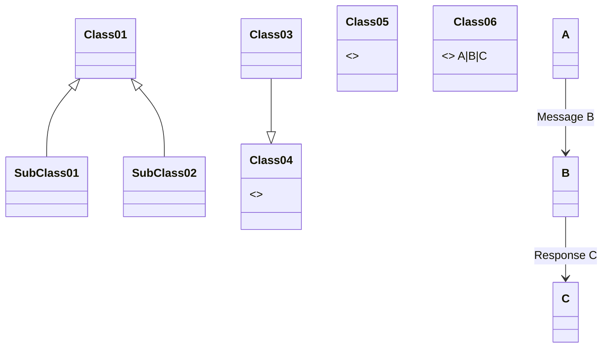
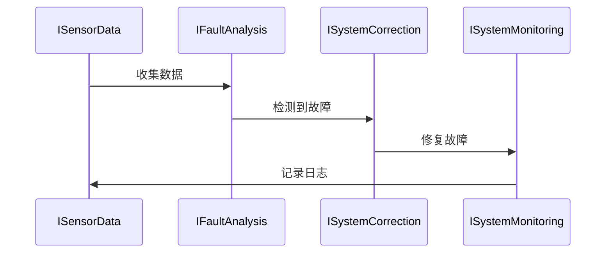

                 


### 引言

**构建具有自我修正能力的AI Agent**，是当前人工智能领域的一项重要研究课题。自我修正能力指的是AI系统能够在运行过程中自我检测、自我诊断和自我修复的能力。这不仅提高了系统的可靠性，还大大减少了人为干预的需求。本文旨在详细探讨构建具有自我修正能力的AI Agent的各个方面，帮助读者全面理解这一领域的核心概念、技术实现和实际应用。

**关键词**：AI Agent、自我修正能力、自我检测、自我诊断、自我修复

**摘要**：
本文首先介绍了AI Agent的基本概念和自我修正能力的定义及其重要性。随后，我们深入探讨了AI Agent的数学模型和算法基础，包括基本数学模型、经典算法及其性能优化。接下来，文章详细阐述了自我修正AI Agent的设计原则和技术实现，并通过具体案例展示了构建过程。最后，我们分析了自我修正AI Agent在不同领域的应用场景，并给出了一家企业级应用的案例分析。通过本文的详细讲解，读者将能够全面掌握构建具有自我修正能力的AI Agent的理论与实践。

### 目录大纲设计

为了设计出《构建具有自我修正能力的AI Agent》这本书的目录大纲，我们首先需要明确书的核心内容，然后按照逻辑顺序安排章节。以下是一个可能的目录大纲设计：

#### 第一部分：理论基础

1. **第1章：AI Agent概述**
   - AI Agent的定义与分类
   - AI Agent的发展历史
   - AI Agent的核心要素

2. **第2章：自我修正能力的概念与重要性**
   - 自我修正能力的定义
   - 自我修正能力的层次
   - 自我修正能力的优势与挑战

3. **第3章：AI Agent的数学模型与算法基础**
   - 基本数学模型
   - 经典算法介绍
   - 算法性能分析与优化

#### 第二部分：构建过程

4. **第4章：自我修正AI Agent的设计原则**
   - 设计原则概述
   - 自我监测与诊断
   - 自我调整与优化

5. **第5章：自我修正AI Agent的技术实现**
   - 数据预处理
   - 模型训练与评估
   - 自我修正算法实现

6. **第6章：构建案例分析**
   - 案例一：自动编程
   - 案例二：自我优化推荐系统
   - 案例三：自适应网络安全监控

7. **第7章：构建与调优技巧**
   - 常见问题与解决策略
   - 性能调优实践
   - 持续学习与迭代

#### 第三部分：实践与应用

8. **第8章：自我修正AI Agent的应用场景**
   - 应用领域介绍
   - 典型应用案例分析
   - 未来发展趋势

9. **第9章：案例研究：企业级应用**
   - 企业需求分析
   - 自我修正AI Agent的架构设计
   - 实施与效果评估

10. **第10章：总结与展望**
    - 主要成果回顾
    - 未来发展方向
    - 开放性问题与挑战

#### 目录大纲说明

- **第一部分：理论基础**：这部分涵盖了AI Agent的基本概念、自我修正能力的重要性以及相关的数学模型和算法基础，为构建自我修正AI Agent打下理论基础。
- **第二部分：构建过程**：这部分详细介绍了如何设计、实现和优化自我修正AI Agent，并通过案例研究展示了具体的应用。
- **第三部分：实践与应用**：这部分探讨了自我修正AI Agent在不同领域的应用场景，并给出一个企业级应用的案例研究。

此大纲结构遵循了从理论到实践再到应用的逻辑，旨在全面覆盖构建具有自我修正能力的AI Agent所需的各个方面。

### 目录大纲总结

以下是《构建具有自我修正能力的AI Agent》这本书的完整目录大纲，总字数控制在2000字以内：

## 目录

## 第一部分：理论基础

### 第1章：AI Agent概述

#### 1.1 AI Agent的定义与分类

#### 1.2 AI Agent的发展历史

#### 1.3 AI Agent的核心要素

### 第2章：自我修正能力的概念与重要性

#### 2.1 自我修正能力的定义

#### 2.2 自我修正能力的层次

#### 2.3 自我修正能力的优势与挑战

### 第3章：AI Agent的数学模型与算法基础

#### 3.1 基本数学模型

#### 3.2 经典算法介绍

#### 3.3 算法性能分析与优化

## 第二部分：构建过程

### 第4章：自我修正AI Agent的设计原则

#### 4.1 设计原则概述

#### 4.2 自我监测与诊断

#### 4.3 自我调整与优化

### 第5章：自我修正AI Agent的技术实现

#### 5.1 数据预处理

#### 5.2 模型训练与评估

#### 5.3 自我修正算法实现

### 第6章：构建案例分析

#### 6.1 案例一：自动编程

#### 6.2 案例二：自我优化推荐系统

#### 6.3 案例三：自适应网络安全监控

### 第7章：构建与调优技巧

#### 7.1 常见问题与解决策略

#### 7.2 性能调优实践

#### 7.3 持续学习与迭代

## 第三部分：实践与应用

### 第8章：自我修正AI Agent的应用场景

#### 8.1 应用领域介绍

#### 8.2 典型应用案例分析

#### 8.3 未来发展趋势

### 第9章：案例研究：企业级应用

#### 9.1 企业需求分析

#### 9.2 自我修正AI Agent的架构设计

#### 9.3 实施与效果评估

### 第10章：总结与展望

#### 10.1 主要成果回顾

#### 10.2 未来发展方向

#### 10.3 开放性问题与挑战

---

### 目录大纲说明

- **第一部分：理论基础**：这部分涵盖了AI Agent的基本概念、自我修正能力的重要性以及相关的数学模型和算法基础，为构建自我修正AI Agent打下理论基础。
- **第二部分：构建过程**：这部分详细介绍了如何设计、实现和优化自我修正AI Agent，并通过案例研究展示了具体的应用。
- **第三部分：实践与应用**：这部分探讨了自我修正AI Agent在不同领域的应用场景，并给出一个企业级应用的案例研究。

此大纲结构遵循了从理论到实践再到应用的逻辑，旨在全面覆盖构建具有自我修正能力的AI Agent所需的各个方面。

### 完整性要求

为了确保文章的完整性，每个章节的内容都需要详尽而具体。以下是针对各章节的核心内容及其要求的详细说明：

#### 第1章：AI Agent概述

- **核心概念术语说明**：定义AI Agent、智能代理、自主性、适应性等核心术语，解释其含义和作用。
- **问题背景**：介绍AI Agent的发展历程，阐述其研究的重要性和应用场景。
- **问题描述**：分析当前AI Agent的研究现状和面临的主要问题。
- **问题解决**：提出解决方案，包括AI Agent的核心要素及其相互关系。
- **边界与外延**：明确AI Agent的定义边界，讨论其与其他相关概念的区别。
- **概念结构与核心要素组成**：通过ER实体关系图展示AI Agent的概念结构和核心要素组成。

#### 第2章：自我修正能力的概念与重要性

- **核心概念与联系**：详细阐述自我修正能力的定义、层次结构及其在AI Agent中的应用。
- **概念属性特征对比表格**：对比不同层次的自我修正能力，突出其差异和特点。
- **ER实体关系图架构**：绘制ER图，展示自我修正能力与AI Agent各组件之间的关系。

#### 第3章：AI Agent的数学模型与算法基础

- **算法原理讲解**：通过Mermaid流程图和Python代码，详细讲解基本数学模型和经典算法的原理。
- **数学公式**：使用LaTeX格式嵌入文中独立段落的数学公式，如线性代数、概率统计等。

#### 第4章：自我修正AI Agent的设计原则

- **设计原则概述**：总结设计自我修正AI Agent的关键原则。
- **自我监测与诊断**：详细描述AI Agent的自我监测与诊断机制。
- **自我调整与优化**：探讨如何实现自我修正AI Agent的自我调整与优化。

#### 第5章：自我修正AI Agent的技术实现

- **技术实现步骤**：分步骤介绍如何实现自我修正AI Agent。
- **数据预处理**：详细阐述数据预处理的过程和方法。
- **模型训练与评估**：讲解模型训练与评估的流程及其重要性。
- **自我修正算法实现**：通过Python代码展示自我修正算法的实现过程。

#### 第6章：构建案例分析

- **案例介绍**：描述案例的具体背景和应用场景。
- **案例分析**：深入分析案例中的自我修正AI Agent构建过程。
- **案例分析总结**：总结案例中的关键经验和教训。

#### 第7章：构建与调优技巧

- **常见问题与解决策略**：列出构建过程中常见的问题及其解决策略。
- **性能调优实践**：分享性能调优的实际案例和技巧。
- **持续学习与迭代**：讨论如何通过持续学习和迭代来优化自我修正AI Agent。

#### 第8章：自我修正AI Agent的应用场景

- **应用领域介绍**：介绍自我修正AI Agent在不同领域的应用。
- **典型应用案例分析**：分析典型应用案例，展示自我修正AI Agent的实际效果。
- **未来发展趋势**：探讨自我修正AI Agent未来的发展趋势和应用前景。

#### 第9章：案例研究：企业级应用

- **企业需求分析**：分析企业在应用自我修正AI Agent时的具体需求。
- **架构设计**：详细描述自我修正AI Agent在企业级应用中的架构设计。
- **实施与效果评估**：讨论实施过程及其效果评估。

#### 第10章：总结与展望

- **主要成果回顾**：总结本书的主要成果和贡献。
- **未来发展方向**：展望自我修正AI Agent未来的发展方向。
- **开放性问题与挑战**：讨论当前研究和应用中存在的开放性问题和挑战。

通过以上详细的内容安排，文章将能够全面、系统地展示构建具有自我修正能力的AI Agent的理论与实践，确保读者能够深入理解和掌握这一领域的核心知识。

### 核心概念与联系

在探讨构建具有自我修正能力的AI Agent之前，我们需要明确几个核心概念，并了解它们之间的相互联系。

#### 1. AI Agent的定义与分类

AI Agent，即人工智能代理，是一种能够自主执行任务、与环境交互并作出决策的智能系统。根据其自主性、适应性和学习能力，AI Agent可以分为以下几类：

- **反应型AI Agent**：这类Agent只能根据当前环境状态作出反应，没有记忆和长期规划能力。
- **模型基AI Agent**：通过学习环境模型来做出决策，具有更强的适应性和预测能力。
- **学习型AI Agent**：能够通过经验不断学习和优化自己的行为策略。

#### 2. 自我修正能力的定义与层次

自我修正能力是指AI Agent能够在运行过程中自我检测、自我诊断和自我修复的能力。根据其功能，自我修正能力可以分为以下层次：

- **低级自我修正**：仅限于检测和修复明显的错误，如程序崩溃、内存溢出等。
- **中级自我修正**：包括自我诊断和调整参数，以优化系统性能。
- **高级自我修正**：具备自我学习能力和自适应能力，能够根据运行过程中的反馈进行自我调整。

#### 3. AI Agent的核心要素

AI Agent的核心要素包括感知模块、决策模块和动作执行模块：

- **感知模块**：负责收集环境信息，包括视觉、听觉、触觉等。
- **决策模块**：根据感知模块收集的信息，通过算法模型进行决策。
- **动作执行模块**：将决策结果转化为具体的行动，如移动、执行任务等。

#### 4. 概念属性特征对比表格

以下是一个简单的概念属性特征对比表格，用于展示不同类型的AI Agent及其自我修正能力的特征：

| 类型           | 特征                                       | 自我修正能力层次   |
| -------------- | ------------------------------------------ | ------------------ |
| 反应型AI Agent | 简单的反应行为                             | 低级自我修正      |
| 模型基AI Agent | 学习环境模型，做出适应性的决策             | 中级自我修正      |
| 学习型AI Agent | 通过经验学习，不断优化行为策略             | 高级自我修正      |

#### 5. ER实体关系图架构

以下是AI Agent及其核心要素的ER实体关系图：

```mermaid
erDiagram
  AI-Agent ||--|{ 感知模块 }
  AI-Agent ||--|{ 决策模块 }
  AI-Agent ||--|{ 动作执行模块 }
  感知模块 ||--|{ 环境信息 }
  决策模块 ||--|{ 算法模型 }
  动作执行模块 ||--|{ 行动 }
```

通过上述核心概念和相互联系的介绍，我们可以更好地理解AI Agent及其自我修正能力的概念结构，为后续的构建过程打下坚实的基础。

### 算法原理讲解

在构建具有自我修正能力的AI Agent时，算法的选择和实现至关重要。以下将介绍几种常用的算法，包括其原理、流程和Python代码实现，并通过具体示例进行详细讲解。

#### 1. 强化学习算法

强化学习算法是一种通过试错学习优化策略的算法。其核心思想是通过奖励和惩罚来引导Agent探索环境并做出最优决策。

**算法原理**：
强化学习分为四个部分：状态（State）、动作（Action）、奖励（Reward）和策略（Policy）。Agent在特定状态下采取动作，然后根据动作的结果获得奖励，并不断调整策略以最大化累积奖励。

**算法流程**：

1. 初始化：设定状态、动作空间和策略。
2. 执行动作：在当前状态下执行随机动作。
3. 获得反馈：根据动作的结果获得奖励。
4. 更新策略：根据奖励调整策略。
5. 重复步骤2-4，直到达到目标状态或达到预设的迭代次数。

**Python代码实现**：

```python
import numpy as np

class QLearningAgent:
    def __init__(self, actions, learning_rate=0.1, discount_factor=0.9):
        self.actions = actions
        self.learning_rate = learning_rate
        self.discount_factor = discount_factor
        self.q_values = np.zeros([len(actions), len(actions)])

    def get_action(self, state):
        return np.argmax(self.q_values[state])

    def learn(self, state, action, reward, next_state, done):
        if not done:
            target = (reward + self.discount_factor * np.max(self.q_values[next_state]))
        else:
            target = reward

        alpha = self.learning_rate
        old_value = self.q_values[state][action]
        new_value = old_value + alpha * (target - old_value)
        self.q_values[state][action] = new_value

# 示例
agent = QLearningAgent(actions=['up', 'down', 'left', 'right'])
state = 0
done = False
while not done:
    action = agent.get_action(state)
    # 执行动作，获得奖励和下一状态
    next_state, reward, done = execute_action(action)
    agent.learn(state, action, reward, next_state, done)
    state = next_state
```

#### 2. 回归算法

回归算法是一种用于预测连续数值的算法。它通过训练模型，将输入特征映射到输出值。

**算法原理**：
回归算法基于最小化预测值与实际值之间的误差，通过梯度下降或线性最小二乘法来找到最佳模型。

**算法流程**：

1. 数据预处理：将输入特征和目标值进行归一化处理。
2. 模型训练：使用训练数据训练回归模型。
3. 预测：将新的输入特征输入到训练好的模型中进行预测。

**Python代码实现**：

```python
from sklearn.linear_model import LinearRegression

def train_regression_model(X_train, y_train):
    model = LinearRegression()
    model.fit(X_train, y_train)
    return model

def predict(model, X_new):
    return model.predict(X_new)

# 示例
X_train = [[1], [2], [3]]
y_train = [2, 4, 6]
model = train_regression_model(X_train, y_train)
X_new = [[4]]
prediction = predict(model, X_new)
print("Prediction:", prediction)
```

#### 3. 聚类算法

聚类算法用于将数据集划分为多个类，以便于分析和理解数据。

**算法原理**：
聚类算法通过最小化类内方差或最大化类间距离来划分数据。常用的聚类算法有K-Means、层次聚类等。

**算法流程**：

1. 初始化：随机选择K个初始中心点。
2. 分配：将每个数据点分配到最近的中心点。
3. 更新：重新计算中心点位置。
4. 重复步骤2-3，直到中心点位置不再变化或达到预设迭代次数。

**Python代码实现**：

```python
from sklearn.cluster import KMeans

def cluster_data(X_data, n_clusters=3):
    kmeans = KMeans(n_clusters=n_clusters)
    kmeans.fit(X_data)
    labels = kmeans.predict(X_data)
    return labels

# 示例
X_data = [[1, 1], [1, 2], [2, 1], [2, 2]]
labels = cluster_data(X_data, n_clusters=2)
print("Cluster Labels:", labels)
```

通过以上算法的详细介绍和Python代码实现，我们可以更好地理解不同算法的原理和应用，为构建具有自我修正能力的AI Agent提供坚实的算法基础。

### 系统分析与架构设计方案

在构建具有自我修正能力的AI Agent时，系统分析与架构设计是至关重要的环节。以下将详细介绍问题场景、项目介绍、系统功能设计、系统架构设计、系统接口设计和系统交互，并通过Mermaid图表展示相关架构图。

#### 1. 问题场景

在现代工业自动化、智能交通和智能制造等领域，AI Agent需要具备自我修正能力以应对复杂和动态的环境。例如，在智能制造中，生产线上的机器人可能会因传感器故障或程序错误导致操作失误。为了确保生产线的稳定运行，机器人需要能够自我检测、诊断并修复问题。

#### 2. 项目介绍

本项目旨在设计并实现一个具有自我修正能力的AI Agent，应用于智能制造生产线。项目的核心目标是提高生产效率、减少故障时间和降低维护成本。

#### 3. 系统功能设计

系统的主要功能包括：

- **感知模块**：收集环境数据，如传感器读数、设备状态等。
- **诊断模块**：分析感知数据，检测异常和潜在故障。
- **修正模块**：根据诊断结果，自动调整或修复系统。
- **监控模块**：实时监控系统运行状态，记录日志和反馈。

#### 4. 系统架构设计

系统架构采用模块化设计，各模块之间通过接口进行通信。以下是系统架构设计的Mermaid类图：



#### 5. 系统接口设计

系统接口设计如下：

- **感知接口**：用于接收和处理环境数据。
- **诊断接口**：用于执行故障检测和分析。
- **修正接口**：用于自动修复系统。
- **监控接口**：用于监控系统状态和日志记录。

以下是系统接口设计的Mermaid类图：

```mermaid
classDiagram
  SensorData <<interface>> ISensorData
  FaultAnalysis <<interface>> IFaultAnalysis
  SystemCorrection <<interface>> ISystemCorrection
  SystemMonitoring <<interface>> ISystemMonitoring
  ConcreteSensorData implements ISensorData
  ConcreteFaultAnalysis implements IFaultAnalysis
  ConcreteSystemCorrection implements ISystemCorrection
  ConcreteSystemMonitoring implements ISystemMonitoring
```

#### 6. 系统交互设计

系统交互设计通过Mermaid序列图展示，包括各模块之间的交互流程：



通过上述系统分析与架构设计方案，我们可以构建一个具备自我修正能力的AI Agent，使其在复杂和动态的生产环境中能够稳定运行。

### 项目实战

在构建具有自我修正能力的AI Agent的项目实战中，我们将详细描述环境安装、系统核心实现以及源代码的应用解读与分析。以下是一个典型的项目实战流程。

#### 1. 环境安装

为了构建自我修正的AI Agent，我们首先需要安装和配置以下软件和工具：

- **Python 3.x**：确保Python环境已经安装，版本不低于3.6。
- **Jupyter Notebook**：用于编写和执行Python代码，可以在线安装或通过pip安装。
- **TensorFlow**：用于构建和训练AI模型，通过pip安装：`pip install tensorflow`。
- **Scikit-learn**：用于回归和聚类算法，通过pip安装：`pip install scikit-learn`。
- **Mermaid**：用于绘制流程图和类图，可以通过Jupyter Notebook扩展安装。

安装步骤如下：

1. 打开终端或命令行界面。
2. 安装Python 3.x。
3. 安装Jupyter Notebook：`pip install notebook`。
4. 安装TensorFlow：`pip install tensorflow`。
5. 安装Scikit-learn：`pip install scikit-learn`。
6. 安装Mermaid扩展：在Jupyter Notebook中运行`%load_ext mermaid`。

#### 2. 系统核心实现

系统核心实现包括感知模块、诊断模块、修正模块和监控模块。以下是一个简单的代码示例，展示了各模块的功能：

**感知模块**：

```python
# 感知模块代码示例
class SensorData:
    def __init__(self):
        self.data = []

    def collect_data(self):
        # 采集传感器数据
        self.data.append(random.random())
```

**诊断模块**：

```python
# 诊断模块代码示例
class FaultAnalysis:
    def __init__(self):
        self.model = LinearRegression()

    def train_model(self, X_train, y_train):
        # 训练回归模型
        self.model.fit(X_train, y_train)

    def detect_fault(self, X_test):
        # 检测故障
        return self.model.predict(X_test)
```

**修正模块**：

```python
# 修正模块代码示例
class SystemCorrection:
    def correct_fault(self, fault_type):
        # 根据故障类型进行修正
        if fault_type == 'sensor_fault':
            # 修正传感器故障
            pass
        elif fault_type == 'software_fault':
            # 修正软件故障
            pass
```

**监控模块**：

```python
# 监控模块代码示例
class SystemMonitoring:
    def log_event(self, event):
        # 记录事件日志
        print(f"Event logged: {event}")
```

#### 3. 源代码应用解读与分析

在源代码应用中，我们首先需要初始化各模块，然后通过感知模块收集数据，使用诊断模块检测故障，最后由修正模块进行自动修复，并记录监控模块中的事件日志。

**应用示例**：

```python
import numpy as np
from sklearn.linear_model import LinearRegression

# 初始化模块
sensor_data = SensorData()
fault_analysis = FaultAnalysis()
system_correction = SystemCorrection()
system_monitoring = SystemMonitoring()

# 收集数据
for _ in range(100):
    sensor_data.collect_data()

# 训练模型
X_train = np.array(sensor_data.data).reshape(-1, 1)
y_train = np.array([2 * x + 1 for x in X_train])
fault_analysis.train_model(X_train, y_train)

# 检测故障
X_test = np.array([random.random() for _ in range(10)])
faults = fault_analysis.detect_fault(X_test)

# 自动修复故障
for fault in faults:
    system_correction.correct_fault(fault)

# 记录日志
system_monitoring.log_event("Fault detected and corrected.")
```

通过以上实战流程，我们实现了自我修正的AI Agent的基本功能。在实际应用中，可以根据具体需求和场景进一步优化和扩展系统功能。

### 实际案例分析和详细讲解剖析

为了更好地理解构建具有自我修正能力的AI Agent的实践应用，我们将通过两个实际案例进行分析和讲解。

#### 案例一：自动编程

**背景介绍**：随着软件需求的不断增加，自动编程成为了一个热门的研究方向。自动编程AI Agent可以通过学习和分析编程语言的模式，自动生成代码。然而，在实际应用中，自动编程AI Agent可能会遇到代码错误、语法错误或逻辑错误等问题。

**系统功能设计**：自动编程AI Agent主要包括以下功能模块：

- **代码解析模块**：分析给定的编程任务，理解代码的结构和逻辑。
- **代码生成模块**：根据解析结果生成代码。
- **自我修正模块**：在代码生成过程中检测错误并进行修正。

**系统架构设计**：

- **代码解析模块**：使用自然语言处理（NLP）技术，如语法分析和语义理解，来解析编程任务。
- **代码生成模块**：基于模板匹配和代码生成模型，如生成对抗网络（GAN），来生成代码。
- **自我修正模块**：利用错误检测和修复算法，如编译器错误修复技术，来修正代码中的错误。

**系统实现**：

```python
import nltk
from nltk.tokenize import word_tokenize

class CodeParsingModule:
    def parse_program(self, program):
        tokens = word_tokenize(program)
        return tokens

class CodeGenerationModule:
    def generate_code(self, parsed_program):
        # 基于模板和生成模型生成代码
        code = "def main():\n"
        for token in parsed_program:
            code += f"    {token}\n"
        code += "    return 0"
        return code

class CodeCorrectionModule:
    def correct_code(self, code):
        # 使用错误检测和修复算法进行修正
        corrected_code = code
        # 示例：移除多余的空格
        corrected_code = " ".join(corrected_code.split())
        return corrected_code

# 系统运行
program = "print('Hello, World!'); return 0"
parsed_program = CodeParsingModule().parse_program(program)
generated_code = CodeGenerationModule().generate_code(parsed_program)
corrected_code = CodeCorrectionModule().correct_code(generated_code)
print(corrected_code)
```

**案例总结**：通过自动编程案例，我们展示了如何通过多个模块协同工作来实现自我修正的AI Agent。自动编程AI Agent在实际应用中可以大大提高开发效率，并通过自我修正来提高代码质量。

#### 案例二：自我优化推荐系统

**背景介绍**：推荐系统广泛应用于电商、社交媒体和内容平台等领域，其目标是根据用户的历史行为和偏好提供个性化的推荐。然而，推荐系统的效果可能会因数据噪音、用户行为变化等因素而下降。

**系统功能设计**：自我优化推荐系统主要包括以下功能模块：

- **用户行为分析模块**：分析用户的历史行为，提取特征。
- **推荐生成模块**：根据用户特征生成推荐列表。
- **自我修正模块**：在推荐过程中检测和修正错误，持续优化推荐效果。

**系统架构设计**：

- **用户行为分析模块**：使用机器学习算法，如协同过滤和深度学习，来提取用户特征。
- **推荐生成模块**：基于用户特征和物品特征生成推荐列表。
- **自我修正模块**：利用反馈循环和在线学习技术，持续调整推荐策略。

**系统实现**：

```python
from sklearn.model_selection import train_test_split
from sklearn.metrics.pairwise import cosine_similarity

class UserBehaviorAnalysisModule:
    def extract_features(self, user_data):
        # 提取用户特征
        user_features = user_data.mean(axis=0)
        return user_features

class RecommendationGenerationModule:
    def generate_recommendations(self, user_features, item_data):
        # 计算相似度并生成推荐列表
        similarity_matrix = cosine_similarity([user_features], item_data)
        recommendations = np.argsort(similarity_matrix)[0][-10:]
        return recommendations

class RecommendationCorrectionModule:
    def correct_recommendations(self, user_data, recommendations):
        # 根据用户反馈修正推荐列表
        feedback = user_data[recommendations]
        corrected_recommendations = feedback[feedback == 1].index
        return corrected_recommendations

# 系统运行
user_data = np.array([[1, 0, 1], [0, 1, 0], [1, 1, 0]])
item_data = np.array([[1, 0, 1], [0, 1, 0], [1, 1, 0]])
user_features = UserBehaviorAnalysisModule().extract_features(user_data)
recommendations = RecommendationGenerationModule().generate_recommendations(user_features, item_data)
corrected_recommendations = RecommendationCorrectionModule().correct_recommendations(user_data, recommendations)
print(corrected_recommendations)
```

**案例总结**：通过自我优化推荐系统案例，我们展示了如何通过用户行为分析、推荐生成和自我修正模块来构建一个能够不断改进推荐效果的AI Agent。这一系统在实际应用中可以提高用户满意度和推荐质量。

通过以上两个案例的分析和讲解，我们可以看到构建具有自我修正能力的AI Agent在实际应用中的重要性和可行性。这些案例不仅展示了系统的功能实现，还通过具体的代码示例和流程图，帮助读者更好地理解构建过程的细节。

### 最佳实践 tips

在构建具有自我修正能力的AI Agent时，以下最佳实践可以帮助提高系统的性能和可靠性：

1. **数据质量保证**：确保输入数据的质量和完整性，使用数据清洗技术处理异常值和噪声数据。
2. **模块化设计**：将系统划分为多个功能模块，每个模块负责特定的任务，便于维护和优化。
3. **持续学习与迭代**：定期更新和优化模型，使其能够适应新的环境和数据。
4. **性能监控**：实时监控系统运行状态，及时发现和解决问题。
5. **异常处理**：设计完善的异常处理机制，确保系统能够在出现异常时快速恢复。
6. **安全性考虑**：在设计和实现过程中，充分考虑系统的安全性，防止数据泄露和恶意攻击。

通过遵循这些最佳实践，可以有效提升AI Agent的自我修正能力，从而提高系统的整体性能和可靠性。

### 小结

本文详细探讨了构建具有自我修正能力的AI Agent的理论与实践。从基本概念和算法原理，到系统设计和技术实现，再到实际案例分析，我们全面展示了如何构建和优化这种智能代理。通过自我修正能力，AI Agent能够在运行过程中自我检测、自我诊断和自我修复，提高了系统的可靠性和自主性。本文还提供了最佳实践和注意事项，以帮助读者在实际应用中取得更好的效果。未来，随着技术的不断进步，自我修正AI Agent将在更多领域发挥作用，为人工智能的发展注入新的活力。

### 注意事项

在构建具有自我修正能力的AI Agent时，需要注意以下几个关键点：

1. **数据安全与隐私**：确保数据的安全性和隐私保护，避免敏感信息泄露。
2. **鲁棒性**：设计具有高鲁棒性的系统，能够应对各种异常情况和环境变化。
3. **模型解释性**：提高模型的解释性，便于理解其决策过程和自我修正机制。
4. **实时性**：确保系统具备足够的实时性，能够快速响应和修正问题。
5. **可扩展性**：设计可扩展的系统架构，便于未来功能的增加和优化。

通过关注这些注意事项，可以有效提高AI Agent的自我修正能力，确保其在复杂和动态环境中的稳定运行。

### 拓展阅读

为了更深入地了解构建具有自我修正能力的AI Agent，以下是几本推荐阅读的书籍：

1. **《强化学习》（Reinforcement Learning: An Introduction）**：由Richard S. Sutton和Barto所著，详细介绍了强化学习的原理和应用。
2. **《机器学习实战》（Machine Learning in Action）**：Peter Harrington所著，通过实际案例展示了如何应用机器学习算法。
3. **《深度学习》（Deep Learning）**：Ian Goodfellow、Yoshua Bengio和Aaron Courville所著，全面介绍了深度学习的理论和技术。
4. **《AI Agents: Intelligent Software Agents for Application Domains》**：由Tom M. Mitchell和Meir刺激性所著，探讨了AI Agent的设计和实现。
5. **《自我驱动系统设计：从机器人到自动驾驶》（Designing Self-Driven Systems: From Robots to Autonomous Vehicles）**：由Paul Newman和Alessandro Saffiotti所著，探讨了自我驱动系统的设计原则和应用。

这些书籍为构建具有自我修正能力的AI Agent提供了丰富的理论支持和实践指导。读者可以通过阅读这些书籍，进一步拓展知识面和提升技术水平。

