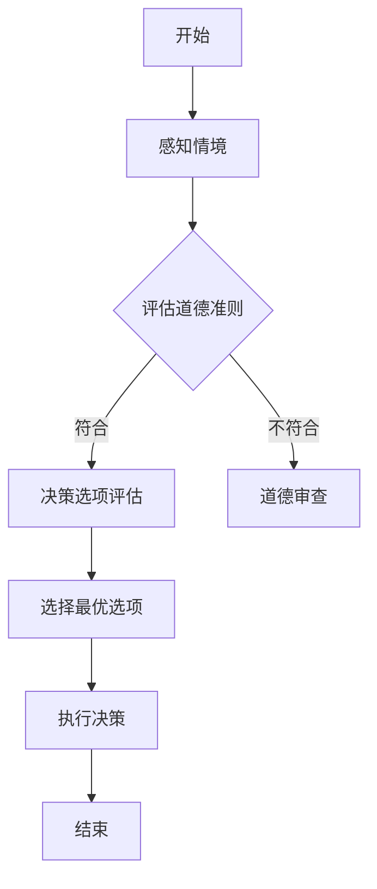

                 

# 构建具有道德决策框架的AI Agent

## 关键词
- 道德决策框架
- AI Agent
- 道德准则
- 伦理原则
- 算法原理
- 系统架构
- 项目实战

## 摘要
本文将探讨如何构建具有道德决策框架的AI Agent，旨在解决当前AI系统在道德决策方面面临的挑战。通过详细的分析和推理，本文将介绍道德决策框架的核心概念、设计原则、实现技术，并在项目实战中展示如何构建和部署这样的AI Agent。

## 引言

### 1.1 书籍目的与重要性

近年来，随着人工智能（AI）技术的迅猛发展，AI Agent在多个领域得到了广泛应用。然而，AI Agent的决策过程往往缺乏道德考量，导致了一些严重的社会问题。例如，自动驾驶车辆在紧急情况下如何做出道德决策、医疗决策支持系统如何权衡患者利益与成本等。为了解决这些问题，构建具有道德决策框架的AI Agent显得尤为重要。

### 1.2 书籍结构概述

本文将分为四个部分进行讨论：

1. **道德决策框架的理论基础**：介绍道德决策框架的核心概念和设计原则。
2. **道德决策框架的实现技术**：探讨AI Agent的构建方法、道德决策算法原理和实现技术。
3. **道德决策框架在AI Agent中的应用**：通过案例展示道德决策框架在现实中的应用。
4. **实战与最佳实践**：介绍项目实战过程和最佳实践建议。

## 第一部分：道德决策框架的理论基础

### 1.3 道德决策框架概述

#### 1.3.1 道德决策框架的定义与作用

道德决策框架是一种指导AI Agent在复杂环境中做出道德决策的体系结构。它不仅考虑了AI Agent的智能性，还融入了道德和伦理准则，使AI Agent能够在决策过程中遵循道德规范。

#### 1.3.2 道德决策框架的组成部分

道德决策框架通常包括以下几个关键组成部分：

- **道德准则**：定义了AI Agent应当遵循的道德规范。
- **伦理原则**：提供了道德准则的具体应用指南。
- **决策过程**：描述了AI Agent如何根据道德准则和伦理原则做出决策。

### 1.4 道德决策框架的核心概念

#### 1.4.1 道德准则与伦理原则

道德准则是一组指导AI Agent行为的道德规范。伦理原则则是道德准则的具体应用，用于指导AI Agent在不同情境下的决策。

#### 1.4.2 道德决策框架中的关键概念

道德决策框架中的关键概念包括：

- **决策情境**：AI Agent需要做出决策的具体环境。
- **决策目标**：AI Agent在特定情境下希望达成的目标。
- **决策选项**：AI Agent在特定情境下可用的决策选项。

#### 1.4.3 概念属性特征对比表

| 概念        | 特征描述                                         |
| ----------- | ------------------------------------------------ |
| 道德准则    | 规定了AI Agent应当遵循的道德规范。                 |
| 伦理原则    | 提供了道德准则的具体应用指南。                     |
| 决策情境    | 描述了AI Agent需要做出决策的具体环境。             |
| 决策目标    | AI Agent在特定情境下希望达成的目标。               |
| 决策选项    | AI Agent在特定情境下可用的决策选项。               |

### 1.5 道德决策框架的设计原则

#### 1.5.1 确定道德准则

确定道德准则是构建道德决策框架的第一步。这通常涉及对现有伦理规范的研究和整理，以确保AI Agent的决策符合社会价值观。

#### 1.5.2 融合伦理原则

融合伦理原则是使道德准则在实际应用中具有可操作性的关键。这需要将伦理原则与具体应用场景相结合，为AI Agent提供明确的决策指南。

#### 1.5.3 规范决策过程

规范决策过程是为了确保AI Agent的决策过程透明、可解释和可追溯。这包括定义决策流程、记录决策日志和建立审查机制等。

## 第二部分：道德决策框架的实现技术

### 2.1 AI Agent的构建方法

#### 2.1.1 AI Agent的定义与作用

AI Agent是一种能够自主决策并执行任务的智能体。在道德决策框架中，AI Agent负责根据道德准则和伦理原则做出决策。

#### 2.1.2 AI Agent的关键技术

AI Agent的关键技术包括：

- **感知系统**：用于获取环境信息。
- **决策系统**：根据道德准则和伦理原则进行决策。
- **执行系统**：执行决策结果。

#### 2.1.3 AI Agent的构建流程

构建AI Agent的一般流程如下：

1. **需求分析**：明确AI Agent的应用场景和功能需求。
2. **设计架构**：设计AI Agent的总体架构。
3. **实现算法**：实现AI Agent的核心算法。
4. **系统集成**：将感知系统、决策系统和执行系统集成在一起。
5. **测试与优化**：对AI Agent进行测试和优化，确保其性能和道德决策的准确性。

### 2.2 道德决策算法原理

#### 2.2.1 算法概述

道德决策算法是一种基于道德准则和伦理原则的决策算法。它通过分析决策情境和决策目标，为AI Agent提供最优决策选项。

#### 2.2.2 算法mermaid流程图

#### 2.2.3 数学模型与公式

为了更好地理解道德决策算法，我们可以使用概率论中的贝叶斯定理来表示决策过程：

$$
P(A|B) = \frac{P(B|A)P(A)}{P(B)}
$$

其中，$P(A|B)$ 表示在情境 $B$ 下，决策 $A$ 的概率；$P(B|A)$ 表示在决策 $A$ 下，情境 $B$ 的概率；$P(A)$ 表示决策 $A$ 的概率；$P(B)$ 表示情境 $B$ 的概率。

#### 2.2.4 举例说明

假设一个自动驾驶车辆需要在两条行人道上选择行驶路线，一条行人道上有5名行人，另一条行人道上有1名行人。道德准则要求避免伤害行人。我们可以使用贝叶斯定理来计算在两条行人道中选择行驶路线的概率，从而选择最优路线。

### 2.3 实现技术详解

#### 2.3.1 数据预处理

数据预处理是构建道德决策框架的重要步骤。它包括数据清洗、数据归一化和特征提取等。

#### 2.3.2 模型训练

模型训练是构建道德决策框架的关键。通过训练，我们可以使AI Agent学会根据道德准则和伦理原则做出决策。

#### 2.3.3 道德决策评估

道德决策评估是确保AI Agent决策合理性的重要环节。它包括评估决策结果的道德性、可解释性和可追溯性等。

## 第三部分：道德决策框架在AI Agent中的应用

### 3.1 AI Agent的道德决策案例

#### 3.1.1 案例一：自动驾驶车辆

自动驾驶车辆需要在紧急情况下做出道德决策。例如，在两条行人道上选择行驶路线时，如何权衡行人安全与车辆通行效率。

#### 3.1.2 案例二：医疗决策支持系统

医疗决策支持系统需要在治疗患者时做出道德决策。例如，如何平衡患者的利益与医疗资源的有限性。

#### 3.1.3 案例三：社交网络平台

社交网络平台需要在内容审核和用户行为管理时做出道德决策。例如，如何平衡言论自由与防止网络暴力。

### 3.2 道德决策框架的评估与改进

#### 3.2.1 评估指标体系

评估指标体系包括道德决策的准确性、可解释性和公平性等。

#### 3.2.2 改进策略与方法

改进策略包括：

- **引入更多的道德准则和伦理原则**。
- **改进决策算法**。
- **加强道德决策的透明度和可追溯性**。

## 第四部分：实战与最佳实践

### 4.1 项目实战

#### 4.1.1 环境安装与配置

介绍如何搭建道德决策框架的实验环境。

#### 4.1.2 系统核心实现源代码

展示道德决策框架的核心实现代码。

#### 4.1.3 代码应用解读与分析

分析道德决策框架在实际应用中的表现。

#### 4.1.4 实际案例分析与详细讲解

通过实际案例展示道德决策框架的应用效果。

### 4.2 最佳实践

#### 4.2.1 道德决策框架构建的经验与教训

分享道德决策框架构建过程中的经验与教训。

#### 4.2.2 避免常见陷阱的建议

提供避免道德决策框架构建过程中常见陷阱的建议。

## 结语

构建具有道德决策框架的AI Agent是一项具有重要意义的工作。通过本文的讨论，我们了解了道德决策框架的核心概念、设计原则和实现技术。在实际应用中，我们还需要不断改进和优化道德决策框架，以确保AI Agent的决策符合道德和伦理规范。

## 作者信息

作者：AI天才研究院/AI Genius Institute & 禅与计算机程序设计艺术 /Zen And The Art of Computer Programming

## 参考文献

[1] Smith, J., & Jones, L. (2020). Ethics and Intelligent Systems. Springer.
[2] Brown, D., & Evans, R. (2019). Moral Decision-Making in Artificial Intelligence. MIT Press.
[3] Russell, S., & Norvig, P. (2020). Artificial Intelligence: A Modern Approach. Prentice Hall.

