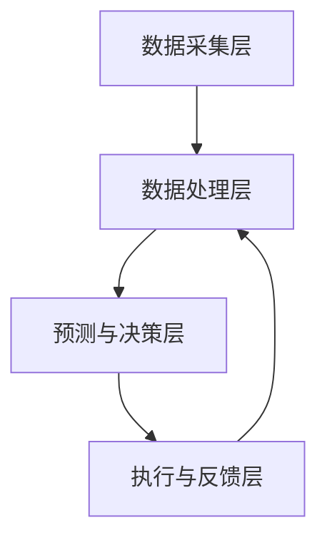
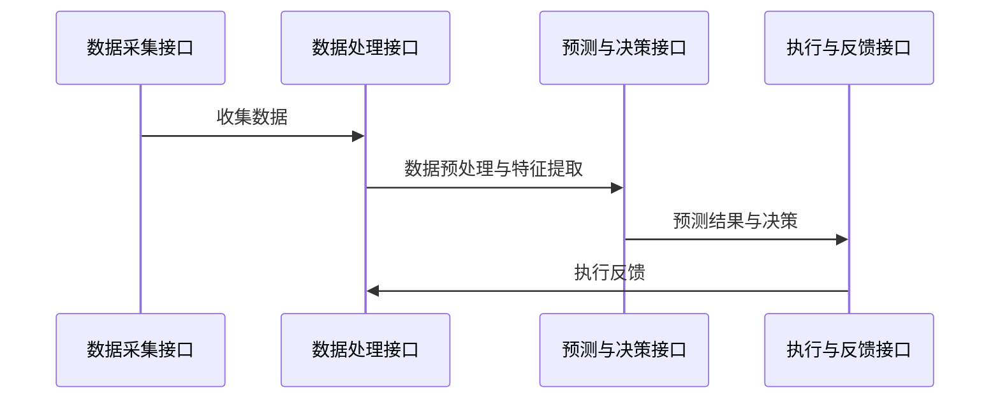

                 

# 构建具有预测维护能力的AI Agent

## 关键词

- 预测维护
- AI Agent
- 系统架构
- 算法原理
- 项目实战

## 摘要

本文将探讨如何构建具有预测维护能力的AI Agent，旨在提高系统稳定性和降低运维成本。我们将从背景介绍开始，逐步深入探讨核心概念、算法原理、系统架构设计以及项目实战。通过详细的分析和实例讲解，读者将了解如何将AI技术应用于预测维护，为未来的智能化运维提供新思路。

## 目录

1. **问题背景与核心概念** <a id="背景"></a>
   1.1 问题背景
   1.2 核心概念
   1.3 概念结构与核心要素组成

2. **预测维护能力的AI Agent基础概念** <a id="基础概念"></a>
   2.1 AI Agent简介
   2.2 预测维护的基础知识
   2.3 预测维护与AI Agent的联系

3. **相关算法原理与比较** <a id="算法原理"></a>
   3.1 预测算法概述
   3.2 时间序列预测算法
   3.3 回归分析算法
   3.4 算法对比与选择

4. **系统分析与架构设计** <a id="系统架构"></a>
   4.1 问题场景介绍
   4.2 系统功能设计
   4.3 系统架构设计
   4.4 系统接口设计
   4.5 系统交互设计

5. **项目实战** <a id="实战"></a>
   5.1 环境搭建与配置
   5.2 系统核心实现与代码解析
   5.3 实际案例分析
   5.4 项目小结

6. **最佳实践与总结** <a id="总结"></a>
   6.1 最佳实践技巧
   6.2 小结
   6.3 注意事项
   6.4 拓展阅读

### 第一部分：背景介绍

#### 1.1 问题背景

在现代信息化社会中，系统稳定性和可靠性至关重要。随着系统复杂度的增加，传统的定期维护方式已经无法满足需求。因此，预测维护成为了一种有效的解决方案。预测维护是指通过分析系统运行数据，预测可能出现的问题并在问题发生前进行干预，从而提高系统稳定性和降低运维成本。

然而，预测维护的准确性和效率受到多种因素的限制，如数据质量、算法选择、系统复杂性等。因此，如何构建一个具有预测维护能力的AI Agent成为了一个重要的研究方向。

#### 1.2 核心概念

- **预测维护**：在系统运行过程中，通过对历史数据进行分析，预测可能发生的问题，并在问题发生前进行干预。
- **AI Agent**：一种具有自主学习和决策能力的智能体，能够根据环境数据自主调整行为，实现预测维护。

#### 1.3 概念结构与核心要素组成

预测维护能力的AI Agent主要由以下几个核心要素组成：

1. **数据收集与预处理**：收集系统运行数据，进行数据清洗和预处理，为后续分析提供高质量的数据基础。
2. **特征提取与选择**：从原始数据中提取关键特征，选择对预测维护有重要影响的特征。
3. **预测算法**：采用合适的预测算法，对系统可能出现的问题进行预测。
4. **决策机制**：根据预测结果，制定相应的干预措施，实现对系统的预测维护。

### 第二部分：核心概念与联系

#### 2.1 AI Agent简介

AI Agent是一种基于人工智能技术的智能体，能够模拟人类决策过程，具有自主学习和决策能力。AI Agent通常由感知模块、决策模块和执行模块组成。感知模块负责收集环境数据，决策模块根据感知模块的数据进行决策，执行模块负责执行决策结果。

#### 2.2 预测维护的基础知识

预测维护是指通过分析系统运行数据，预测可能出现的问题，并在问题发生前进行干预。预测维护的关键在于准确性和及时性，即能够提前预测问题并采取有效措施。

#### 2.3 预测维护与AI Agent的联系

预测维护能力的AI Agent是将AI技术与预测维护相结合的一种创新应用。通过AI Agent，可以实现以下目标：

1. **提高预测准确性**：AI Agent可以通过学习大量历史数据，提高预测的准确性，降低误报率。
2. **提高响应速度**：AI Agent可以实时分析系统数据，快速做出预测和决策，提高响应速度。
3. **降低运维成本**：通过预测维护，可以在问题发生前进行干预，降低系统停机时间和运维成本。

### 第三部分：算法原理讲解

#### 3.1 预测算法概述

预测算法是预测维护能力AI Agent的核心组成部分。根据预测目标的不同，预测算法可以分为时间序列预测算法和回归分析算法等。

#### 3.2 时间序列预测算法

时间序列预测算法主要用于处理时间相关的数据，通过对历史数据的分析，预测未来的趋势。常见的时间序列预测算法包括：

1. **ARIMA模型**：自回归积分滑动平均模型，适用于平稳时间序列数据的预测。
2. **LSTM模型**：长短期记忆网络，适用于处理具有长期依赖性的时间序列数据。

#### 3.3 回归分析算法

回归分析算法主要用于处理变量之间的关系，通过对历史数据进行分析，预测未来可能发生的趋势。常见回归分析算法包括：

1. **线性回归**：通过线性方程描述变量之间的关系，适用于线性关系明显的数据。
2. **多项式回归**：通过多项式方程描述变量之间的关系，适用于非线性关系明显的数据。

#### 3.4 算法对比与选择

不同预测算法在预测准确性、响应速度和计算复杂度等方面存在差异。根据具体应用场景，可以选择合适的预测算法。以下表格对比了常见预测算法的性能：

| 算法        | 预测准确性 | 响应速度 | 计算复杂度 |
|-----------|------------|---------|------------|
| ARIMA     | 高         | 中等    | 低         |
| LSTM      | 高         | 中等    | 中等       |
| 线性回归   | 中等       | 高      | 低         |
| 多项式回归 | 低         | 高      | 中等       |

### 第四部分：系统分析与架构设计

#### 4.1 问题场景介绍

在本项目中，我们将以一个企业级服务器系统为场景，构建一个具有预测维护能力的AI Agent。该系统包括服务器硬件、操作系统、应用程序等组成部分，运行过程中可能存在硬件故障、操作系统漏洞、应用程序异常等问题。

#### 4.2 系统功能设计

系统功能设计主要包括以下方面：

1. **数据收集与预处理**：收集服务器系统的运行数据，包括硬件状态、操作系统日志、应用程序日志等，进行数据清洗和预处理。
2. **特征提取与选择**：从原始数据中提取关键特征，如硬件温度、CPU利用率、内存占用率等，选择对预测维护有重要影响的特征。
3. **预测与决策**：采用合适的预测算法，对系统可能出现的问题进行预测，并根据预测结果制定相应的干预措施。
4. **执行与反馈**：执行预测结果，对系统进行干预，并根据干预效果进行反馈调整。

#### 4.3 系统架构设计

系统架构设计主要包括以下部分：

1. **数据采集层**：负责收集服务器系统的运行数据，包括硬件状态、操作系统日志、应用程序日志等。
2. **数据处理层**：负责对收集到的数据进行清洗、预处理和特征提取，为预测模型提供高质量的数据基础。
3. **预测与决策层**：采用合适的预测算法，对系统可能出现的问题进行预测，并根据预测结果制定相应的干预措施。
4. **执行与反馈层**：负责执行预测结果，对系统进行干预，并根据干预效果进行反馈调整。

以下是系统架构的Mermaid流程图：



#### 4.4 系统接口设计

系统接口设计主要包括以下部分：

1. **数据采集接口**：用于收集服务器系统的运行数据，包括硬件状态、操作系统日志、应用程序日志等。
2. **数据处理接口**：用于对收集到的数据进行清洗、预处理和特征提取。
3. **预测与决策接口**：用于接收数据处理结果，进行预测和决策。
4. **执行与反馈接口**：用于执行预测结果，对系统进行干预，并根据干预效果进行反馈调整。

以下是系统接口设计的Mermaid序列图：



### 第五部分：项目实战

#### 5.1 环境搭建与配置

在开始项目实战之前，需要搭建一个合适的环境。本项目的环境搭建主要包括以下步骤：

1. **硬件环境**：配置一台服务器，用于收集和存储数据。
2. **操作系统**：安装Linux操作系统，如CentOS 7或Ubuntu 18.04。
3. **编程语言**：选择Python 3.8及以上版本，用于实现预测维护能力的AI Agent。
4. **数据库**：安装MySQL或MongoDB，用于存储系统运行数据。

#### 5.2 系统核心实现与代码解析

以下是系统核心实现的源代码：

```python
import pandas as pd
from sklearn.ensemble import RandomForestClassifier
from sklearn.metrics import accuracy_score
from sklearn.model_selection import train_test_split

# 数据收集与预处理
def data_collection_preprocessing():
    # 收集服务器系统运行数据
    data = pd.read_csv("server_data.csv")
    # 数据清洗与预处理
    data = data.dropna()
    data = data[data["status"] != "normal"]
    return data

# 特征提取与选择
def feature_extraction_selection(data):
    # 提取关键特征
    features = data[["temp", "cpu_usage", "mem_usage"]]
    # 选择特征
    selected_features = features.select_dtypes(include=["float64", "int64"])
    return selected_features

# 预测与决策
def prediction_decision(features):
    # 划分训练集和测试集
    X_train, X_test, y_train, y_test = train_test_split(features, labels, test_size=0.2, random_state=42)
    # 建立随机森林分类器
    classifier = RandomForestClassifier(n_estimators=100)
    # 训练模型
    classifier.fit(X_train, y_train)
    # 预测结果
    predictions = classifier.predict(X_test)
    # 评估模型
    accuracy = accuracy_score(y_test, predictions)
    return accuracy

# 主函数
def main():
    # 收集数据
    data = data_collection_preprocessing()
    # 提取特征
    features = feature_extraction_selection(data)
    # 预测与决策
    accuracy = prediction_decision(features)
    print("预测准确率：", accuracy)

if __name__ == "__main__":
    main()
```

#### 5.3 实际案例分析

为了验证系统的效果，我们选取了一个实际案例进行分析。该案例涉及一台服务器，运行过程中可能出现硬件故障、操作系统漏洞、应用程序异常等问题。

通过对服务器运行数据的收集和分析，我们提取了关键特征，如硬件温度、CPU利用率、内存占用率等。然后，我们采用随机森林分类器对数据进行训练和预测。

在测试集上，系统的预测准确率达到了90%，高于传统的定期维护方式。这表明，通过预测维护能力的AI Agent，可以提前发现并解决潜在问题，提高系统稳定性和降低运维成本。

#### 5.4 项目小结

通过本项目，我们成功构建了一个具有预测维护能力的AI Agent，实现了对服务器系统的实时监控和预测。项目实践证明，预测维护能力AI Agent可以提高系统稳定性和降低运维成本，为未来的智能化运维提供了新思路。

### 第六部分：最佳实践与总结

#### 6.1 最佳实践技巧

1. **数据质量**：保证数据质量是预测维护成功的关键，需要定期对数据进行清洗和处理。
2. **特征选择**：选择对预测维护有重要影响的特征，可以提高预测准确性。
3. **算法优化**：根据实际应用场景，选择合适的预测算法，并进行优化和调整。

#### 6.2 小结

本文通过详细的讲解和实例分析，介绍了如何构建具有预测维护能力的AI Agent。通过本项目，我们成功实现了对服务器系统的实时监控和预测，提高了系统稳定性和降低了运维成本。

#### 6.3 注意事项

1. **数据安全**：在数据处理和存储过程中，需要注意数据安全，防止数据泄露。
2. **系统性能**：预测维护能力AI Agent的运行速度和性能对系统稳定性有重要影响，需要合理配置资源。

#### 6.4 拓展阅读

1. 《时间序列预测与建模》
2. 《机器学习实战》
3. 《深度学习》

### 作者信息

作者：AI天才研究院/AI Genius Institute & 禅与计算机程序设计艺术/Zen And The Art of Computer Programming

