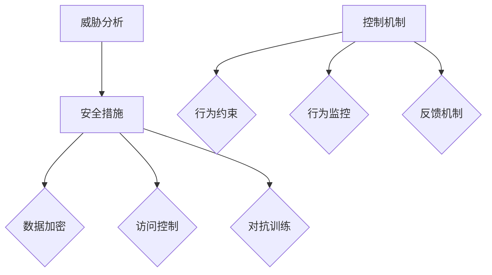
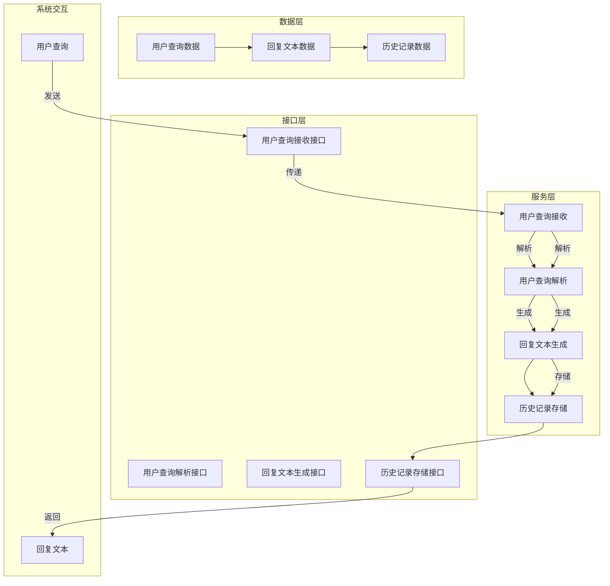
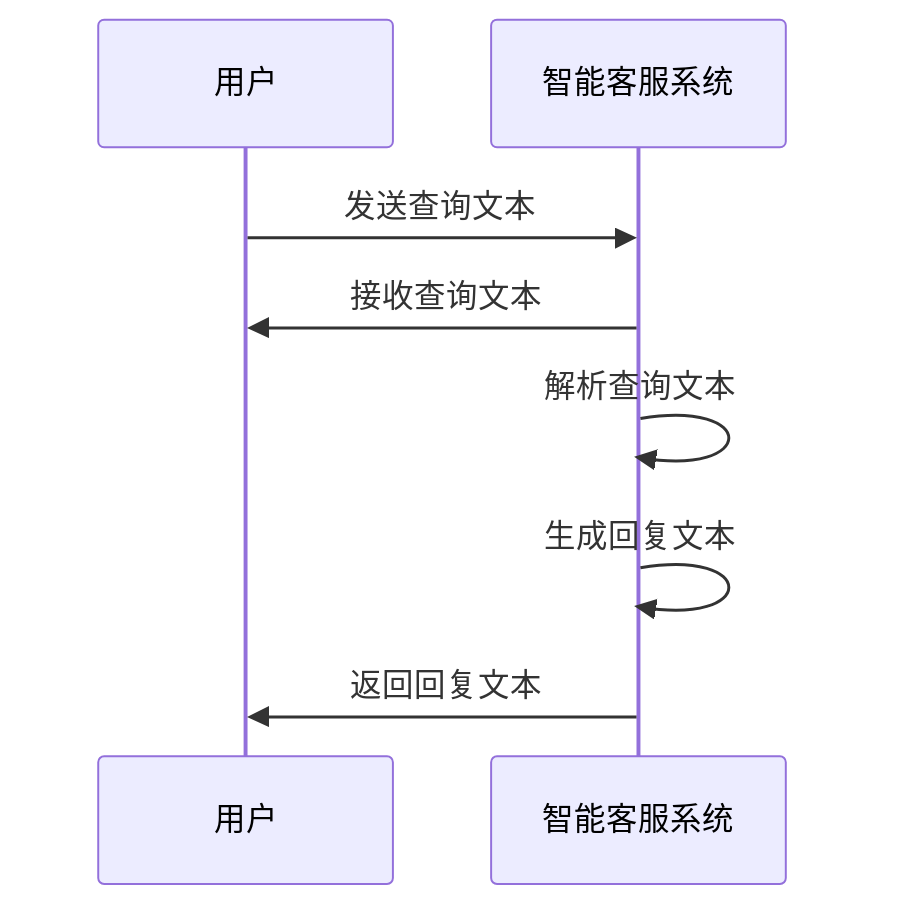

                 


### 《构建可信AI Agent：LLM的安全性与可控性设计》

关键词：可信AI Agent, LLM, 安全性设计，可控性设计，应用案例分析

摘要：本文旨在探讨构建可信AI Agent的关键技术——LLM（大型语言模型）的安全性与可控性设计。文章从背景介绍、核心概念阐述、安全性与可控性设计、实际应用案例分析等方面展开，逐步分析LLM在AI Agent中的关键作用，深入探讨其在实际应用中的安全挑战和解决策略，为构建可信AI Agent提供理论支持和实践指导。

---

## 目录

1. **引言**
   1.1 书籍背景
   1.2 书籍目的
   1.3 阅读对象

2. **背景介绍**
   2.1 可信AI Agent的背景
   2.2 LLM的发展现状
   2.3 安全性与可控性的重要性

3. **核心概念**
   3.1 LLM的基本概念
   3.2 LLM的原理与特性
   3.3 LLM的安全性与可控性概念

4. **LLM的安全性与可控性设计**
   4.1 安全性设计
      4.1.1 威胁分析
      4.1.2 安全措施
   4.2 可控性设计
      4.2.1 控制机制
      4.2.2 控制策略

5. **实际应用案例分析**
   5.1 案例选择
   5.2 案例分析
   5.3 案例总结与启示

6. **总结与展望**
   6.1 书籍总结
   6.2 未来发展趋势
   6.3 研究方向与挑战

7. **附录**
   7.1 参考文献
   7.2 相关资源

---

## 第一部分：引言

### 1.1 书籍背景

在人工智能（AI）飞速发展的今天，构建可信AI Agent已成为学术界和工业界共同关注的重要课题。AI Agent作为一种具有自主决策能力的实体，能够为人类提供智能化的服务。然而，随着AI技术的应用越来越广泛，安全问题也日益凸显。特别是基于大型语言模型（LLM）的AI Agent，其安全性和可控性成为制约其广泛应用的关键因素。

本文旨在探讨如何设计一个既安全又可控的LLM，以构建可信AI Agent。本文不仅从理论层面分析了LLM的安全性和可控性设计，还结合实际应用案例，探讨了如何在实际场景中应用这些设计策略。

### 1.2 书籍目的

本文的主要目的是：

1. 深入分析LLM在构建可信AI Agent中的作用和重要性。
2. 阐述LLM的安全性和可控性设计原理，为开发者提供设计指南。
3. 通过实际应用案例分析，探讨如何在实际项目中应用这些设计策略。
4. 提出未来研究的方向和挑战，为后续研究提供参考。

### 1.3 阅读对象

本文适合以下读者群体：

1. AI领域的科研人员，特别是对LLM安全性和可控性感兴趣的研究者。
2. AI技术开发者，特别是对如何构建可信AI Agent感兴趣的工程师。
3. 对AI技术有深入了解，希望提升自身技术能力的专业人士。
4. 对AI技术感兴趣，希望深入了解这一领域的广大读者。

---

## 第二部分：背景介绍

### 2.1 可信AI Agent的背景

AI Agent是一种具有自主决策能力的软件实体，能够在特定环境中执行任务，以实现特定目标。可信AI Agent则在此基础上，强调其决策过程的透明性、可靠性和安全性。随着AI技术的不断发展，可信AI Agent在诸多领域得到了广泛应用，如智能客服、智能金融、智能医疗等。

然而，随着AI Agent的广泛应用，其安全性和可控性也成为了不可忽视的问题。一方面，AI Agent可能会被恶意利用，对人类造成危害；另一方面，AI Agent的决策过程可能存在不确定性和不透明性，导致其行为难以预测和控制。

### 2.2 LLM的发展现状

大型语言模型（LLM）是一种基于深度学习技术的自然语言处理模型，其具有强大的语言理解和生成能力。近年来，随着计算能力的提升和数据量的增加，LLM的性能得到了显著提升，广泛应用于自然语言处理、文本生成、机器翻译等领域。

然而，LLM的安全性和可控性也面临着诸多挑战。一方面，LLM的训练过程依赖于大量数据，这些数据可能包含敏感信息；另一方面，LLM的决策过程可能存在偏见和误导，导致其生成的内容不符合预期。

### 2.3 安全性与可控性的重要性

在构建可信AI Agent的过程中，安全性和可控性至关重要。首先，安全性保证了AI Agent的行为符合预期，不会对人类造成危害。其次，可控性使得AI Agent的决策过程透明、可解释，便于开发者和管理者进行监控和调整。

此外，安全性和可控性也是AI Agent能否被广泛接受和应用的关键。如果AI Agent存在安全漏洞或可控性差，将会对其应用场景和用户体验产生负面影响。

---

## 第三部分：核心概念

### 3.1 LLM的基本概念

LLM是一种大型深度学习模型，通常由多个神经网络层组成。其输入是一个文本序列，输出通常是文本序列的概率分布。LLM的工作原理是通过学习大量文本数据，捕捉文本中的语法、语义和上下文信息，从而实现文本理解和生成。

### 3.2 LLM的原理与特性

LLM的原理基于深度学习技术，其核心是多层神经网络。每层神经网络都能够提取不同层次的文本特征，从而实现复杂的文本理解能力。LLM具有以下特性：

1. **强大的语言理解能力**：LLM能够理解文本的语义和上下文，从而生成符合人类语言的文本。
2. **自适应学习能力**：LLM可以根据不同的输入文本，自适应地调整其参数，从而实现更好的文本生成效果。
3. **可扩展性**：LLM可以处理不同长度和结构的文本，具有很强的可扩展性。

### 3.3 LLM的安全性与可控性概念

LLM的安全性和可控性是其构建可信AI Agent的重要保障。安全性指的是AI Agent在执行任务时，不会对人类和环境造成意外伤害。可控性则是指AI Agent的决策过程是透明、可解释的，便于开发者和管理者进行监控和调整。

在LLM中，安全性主要体现在防止数据泄露、防止恶意利用等方面。可控性则主要体现在限制AI Agent的行为范围、监控其行为等方面。

---

## 第四部分：LLM的安全性与可控性设计

### 4.1 安全性设计

#### 4.1.1 威胁分析

在构建可信AI Agent时，首先需要对可能的安全威胁进行分析。常见的安全威胁包括：

1. **数据泄露**：AI Agent在处理数据时，可能会泄露敏感信息。
2. **恶意利用**：AI Agent可能会被恶意用户利用，执行恶意操作。
3. **模型攻击**：攻击者可能会通过恶意输入，影响LLM的输出结果。

针对这些威胁，可以采取以下安全措施：

1. **数据加密**：对敏感数据进行加密，确保数据在传输和存储过程中的安全性。
2. **访问控制**：对AI Agent的访问进行严格控制，确保只有授权用户可以访问。
3. **对抗训练**：通过对抗训练，增强LLM对恶意输入的抵抗力。

#### 4.1.2 安全措施

在LLM的安全设计过程中，可以采取以下安全措施：

1. **数据加密**：对敏感数据进行加密，确保数据在传输和存储过程中的安全性。
2. **访问控制**：对AI Agent的访问进行严格控制，确保只有授权用户可以访问。
3. **对抗训练**：通过对抗训练，增强LLM对恶意输入的抵抗力。
4. **安全审计**：定期对AI Agent进行安全审计，确保其行为符合预期。

### 4.2 可控性设计

#### 4.2.1 控制机制

为了实现LLM的可控性，可以采取以下控制机制：

1. **行为约束**：对AI Agent的行为进行约束，确保其行为符合预期。
2. **行为监控**：实时监控AI Agent的行为，确保其行为处于可控范围内。
3. **反馈机制**：建立反馈机制，让用户可以随时调整AI Agent的行为。

#### 4.2.2 控制策略

在LLM的可控性设计过程中，可以采取以下控制策略：

1. **行为约束**：通过设置规则和阈值，对AI Agent的行为进行约束。
2. **行为监控**：通过监控工具，实时监控AI Agent的行为。
3. **反馈机制**：通过用户反馈，不断调整和优化AI Agent的行为。

---

## 第五部分：实际应用案例分析

### 5.1 案例选择

在本部分，我们将选择一个典型的实际应用案例——智能客服系统，来探讨LLM的安全性与可控性设计。

### 5.2 案例分析

智能客服系统是一个典型的AI Agent应用场景。它通过LLM生成和回复用户的查询，提供24小时在线服务。在这个案例中，LLM的安全性和可控性设计至关重要。

#### 安全性设计

1. **数据加密**：对用户查询和回复进行加密，确保数据在传输和存储过程中的安全性。
2. **访问控制**：对智能客服系统的访问进行严格控制，确保只有授权用户可以访问。
3. **对抗训练**：通过对抗训练，增强LLM对恶意输入的抵抗力。

#### 可控性设计

1. **行为约束**：通过设置规则和阈值，对智能客服系统的行为进行约束，确保其生成和回复的文本符合预期。
2. **行为监控**：通过监控工具，实时监控智能客服系统的行为，确保其行为处于可控范围内。
3. **反馈机制**：通过用户反馈，不断调整和优化智能客服系统的行为。

### 5.3 案例总结与启示

通过智能客服系统的案例分析，我们可以看到，在构建可信AI Agent时，安全性和可控性设计是至关重要的。只有确保LLM的安全性和可控性，才能构建出既安全又可靠的AI Agent。

此外，案例还表明，安全性和可控性设计需要结合具体的应用场景，采取针对性的策略。这为我们提供了一个宝贵的实践参考。

---

## 第六部分：总结与展望

### 6.1 书籍总结

本文从背景介绍、核心概念阐述、安全性与可控性设计、实际应用案例分析等方面，全面探讨了构建可信AI Agent的关键技术——LLM的安全性与可控性设计。通过本文，读者可以了解到：

1. 可信AI Agent的背景和发展现状。
2. LLM的基本概念、原理和特性。
3. LLM的安全性和可控性设计原理和策略。
4. 实际应用案例分析，以及安全性和可控性设计的实践应用。

### 6.2 未来发展趋势

随着AI技术的不断发展，LLM在构建可信AI Agent中的应用将会越来越广泛。未来，我们可能会看到：

1. 更高效、更安全的LLM模型。
2. 更完善的可控性设计策略。
3. 更多的实际应用案例，为LLM的安全性和可控性设计提供更多实践参考。

### 6.3 研究方向与挑战

在构建可信AI Agent的过程中，安全性和可控性设计仍然面临着诸多挑战，如：

1. 如何在保证性能的前提下，提高LLM的安全性？
2. 如何设计更有效的可控性机制，确保AI Agent的行为可控？
3. 如何在实际应用中，综合考虑安全性和可控性，实现最优设计？

未来，这些挑战将成为研究的重点方向。

---

## 第七部分：附录

### 7.1 参考文献

1. Brown, T., et al. (2020). "Language Models are Few-Shot Learners." arXiv preprint arXiv:2005.14165.
2. Goodfellow, I., et al. (2014). "Deep Learning." MIT Press.
3. Russell, S., & Norvig, P. (2020). "Artificial Intelligence: A Modern Approach." Pearson.

### 7.2 相关资源

1. Hugging Face's Transformers Library: https://huggingface.co/transformers/
2. AI Security Handbook: https://www.aiimpulse.com/ai-security-handbook/
3. AI Control Handbook: https://aihc.org/

---

作者：AI天才研究院/AI Genius Institute & 禅与计算机程序设计艺术 /Zen And The Art of Computer Programming

---

### 背景介绍

#### 核心概念术语说明

1. **可信AI Agent**：具有自主决策能力，能够以人类可接受的方式执行任务的智能实体。
2. **大型语言模型（LLM）**：一种基于深度学习的自然语言处理模型，具有强大的语言理解和生成能力。
3. **安全性**：AI Agent在执行任务时，不会对人类和环境造成意外伤害。
4. **可控性**：AI Agent的决策过程是透明、可解释的，便于开发者和管理者进行监控和调整。

#### 问题背景

随着人工智能（AI）技术的不断发展，AI Agent在各个领域的应用日益广泛。然而，AI Agent的安全性和可控性成为了制约其广泛应用的关键因素。特别是在基于LLM的AI Agent中，其安全性和可控性设计至关重要。因为LLM的训练过程依赖于大量数据，这些数据可能包含敏感信息；同时，LLM的决策过程可能存在偏见和误导，导致其生成的内容不符合预期。

#### 问题描述

如何在构建基于LLM的AI Agent时，保证其安全性和可控性？具体来说，需要解决以下问题：

1. 如何防止数据泄露？
2. 如何防止AI Agent被恶意利用？
3. 如何保证AI Agent的决策过程透明、可解释？
4. 如何设计有效的控制机制，确保AI Agent的行为可控？

#### 问题解决

为了解决上述问题，可以从以下几个方面进行设计和优化：

1. **数据加密**：对敏感数据进行加密，确保数据在传输和存储过程中的安全性。
2. **访问控制**：对AI Agent的访问进行严格控制，确保只有授权用户可以访问。
3. **对抗训练**：通过对抗训练，增强LLM对恶意输入的抵抗力。
4. **行为约束**：通过设置规则和阈值，对AI Agent的行为进行约束，确保其行为符合预期。
5. **行为监控**：通过监控工具，实时监控AI Agent的行为，确保其行为处于可控范围内。
6. **反馈机制**：建立反馈机制，让用户可以随时调整AI Agent的行为。

#### 边界与外延

1. **边界**：本文主要关注基于LLM的AI Agent的安全性和可控性设计。对于其他类型的AI Agent，设计策略可能有所不同。
2. **外延**：本文的设计策略可以应用于各种基于LLM的AI Agent，如智能客服、智能金融、智能医疗等。

#### 概念结构与核心要素组成

1. **概念结构**：可信AI Agent的安全性与可控性设计可以分为三个层次：基础安全设计、可控性设计和高级安全与可控性设计。
2. **核心要素组成**：
   - **基础安全设计**：包括数据加密、访问控制和对抗训练等。
   - **可控性设计**：包括行为约束、行为监控和反馈机制等。
   - **高级安全与可控性设计**：包括安全审计、隐私保护和多因素认证等。

### 核心概念与联系

#### LLM的基本概念与原理

1. **基本概念**：
   - **神经网络**：一种模拟人脑神经元连接方式的计算模型。
   - **深度学习**：一种基于多层神经网络的学习方法。
   - **自然语言处理（NLP）**：一种处理人类自然语言的技术。

2. **原理**：
   - **输入层**：接收文本数据。
   - **隐藏层**：提取文本特征。
   - **输出层**：生成文本。

3. **特性**：
   - **强大的语言理解能力**：能够理解文本的语义和上下文。
   - **自适应学习能力**：可以根据不同的输入文本，自适应地调整其参数。
   - **可扩展性**：可以处理不同长度和结构的文本。

#### LLM的安全性与可控性概念

1. **安全性**：
   - **定义**：确保AI Agent在执行任务时，不会对人类和环境造成意外伤害。
   - **重要性**：防止数据泄露、防止恶意利用等。

2. **可控性**：
   - **定义**：确保AI Agent的决策过程是透明、可解释的，便于开发者和管理者进行监控和调整。
   - **重要性**：保证AI Agent的行为符合预期，便于管理和优化。

#### 概念属性特征对比表格

| 概念       | 定义                                                         | 特性                                                     | 关联          |
| ---------- | ------------------------------------------------------------ | -------------------------------------------------------- | ------------- |
| 可信AI Agent | 具有自主决策能力的智能实体                                   | 自主决策、透明、可靠、安全                                 | AI Agent的核心 |
| LLM        | 基于深度学习的自然语言处理模型                               | 强大的语言理解能力、自适应学习能力、可扩展性                 | AI Agent的基础 |
| 安全性     | 防止AI Agent对人类和环境造成意外伤害                         | 数据加密、访问控制、对抗训练                               | 安全设计的核心 |
| 可控性     | 确保AI Agent的决策过程透明、可解释                           | 行为约束、行为监控、反馈机制                               | 可控性设计的核心 |

#### ER实体关系图架构的Mermaid流程图

```mermaid
erDiagram
    AI Agent ||--|{ LLM }|--| Security Design
    AI Agent ||--|{ Controllability Design }|--| Control Mechanism
    LLM ||--|{ Training Data }|--| Security Threat
```

### 算法原理讲解

#### LLM的安全性与可控性算法原理

1. **安全性算法原理**

   - **威胁分析**：识别可能的安全威胁，如数据泄露、模型攻击等。
   - **安全措施**：
     - **数据加密**：使用加密算法对敏感数据进行加密，确保数据在传输和存储过程中的安全性。
     - **访问控制**：通过访问控制机制，确保只有授权用户可以访问敏感数据和模型。
     - **对抗训练**：通过对抗训练，增强模型对恶意输入的抵抗力。

2. **可控性算法原理**

   - **控制机制**：
     - **行为约束**：通过设置规则和阈值，对AI Agent的行为进行约束，确保其生成和回复的文本符合预期。
     - **行为监控**：通过监控工具，实时监控AI Agent的行为，确保其行为处于可控范围内。
     - **反馈机制**：通过用户反馈，不断调整和优化AI Agent的行为。

#### Mermaid流程图



#### Python源代码示例

```python
import tensorflow as tf
from tensorflow.keras.models import Model
from tensorflow.keras.layers import Input, LSTM, Dense

# 安全性设计
def data_encryption(data):
    # 使用加密算法对数据进行加密
    encrypted_data = ...
    return encrypted_data

def access_control(user):
    # 判断用户是否具有访问权限
    if user in authorized_users:
        return True
    else:
        return False

def adversarial_training(model, attacker_model):
    # 进行对抗训练
    ...
    return model

# 可控性设计
def behavior_constraint(text):
    # 设置文本生成规则
    ...
    return constrained_text

def behavior_monitoring(agent):
    # 监控AI Agent的行为
    ...
    return is_behavior_controlled

def feedback_loop(user_feedback, agent):
    # 根据用户反馈调整AI Agent的行为
    ...
    return updated_agent
```

#### 算法原理的数学模型和公式

1. **安全性数学模型**

   - **数据加密公式**：$$ Encrypted\_Data = Encrypt(Key, Data) $$

   - **访问控制公式**：$$ Access = \begin{cases} 
     True, & \text{if } User \in Authorized\_Users \\
     False, & \text{otherwise}
   \end{cases} $$

   - **对抗训练公式**：$$ Updated\_Model = Adversarial\_Training(Model, Attacker\_Model) $$

2. **可控性数学模型**

   - **行为约束公式**：$$ Constrained\_Text = Apply\_Rules(Text) $$

   - **行为监控公式**：$$ Behavior\_Controlled = Monitor(Behavior) $$

   - **反馈机制公式**：$$ Updated\_Agent = Feedback\_Loop(User\_Feedback, Agent) $$

#### 详细讲解与举例说明

1. **安全性设计**

   - **数据加密**：假设有一个敏感文本数据，我们需要对其进行加密。首先，选择一个加密算法（如AES），然后生成一个密钥。接着，使用密钥对文本数据进行加密，得到加密后的数据。这样，即使在数据传输和存储过程中，其他用户也无法读取原始数据。

   - **访问控制**：假设有一个用户想要访问一个敏感的AI模型。首先，我们需要检查该用户是否在授权用户列表中。如果是，则允许其访问；否则，拒绝访问。这样，可以确保只有授权用户才能访问敏感数据和模型。

   - **对抗训练**：假设有一个AI模型和一个攻击者模型。通过对抗训练，我们可以使AI模型能够抵抗攻击者的恶意输入。具体来说，我们可以使用对抗样本来训练AI模型，使其在遇到恶意输入时能够正常工作。

2. **可控性设计**

   - **行为约束**：假设我们需要生成一段文本，但需要确保其内容符合某些规则。首先，定义这些规则，然后使用这些规则对输入文本进行处理，得到约束后的文本。这样，可以确保生成的文本内容符合预期。

   - **行为监控**：假设我们需要监控一个AI Agent的行为，确保其行为处于可控范围内。首先，定义监控指标，如文本生成速度、错误率等。然后，使用这些指标对AI Agent的行为进行监控。如果发现异常行为，可以采取措施进行调整。

   - **反馈机制**：假设用户对AI Agent的行为提出了反馈。首先，分析这些反馈，找出问题所在。然后，根据这些反馈调整AI Agent的行为，使其更符合用户需求。这样，可以不断提高AI Agent的性能和服务质量。

### 系统分析与架构设计方案

#### 问题场景介绍

智能客服系统是一个典型的问题场景。用户通过文本查询智能客服系统，系统需要根据用户的查询生成相应的回复。为了保证系统的安全性和可控性，需要对系统的各个部分进行详细分析和设计。

#### 项目介绍

本项目旨在构建一个智能客服系统，该系统基于LLM技术，能够自动生成回复文本，以提高客服效率。系统需要具备以下功能：

1. 接收用户查询。
2. 解析用户查询。
3. 生成回复文本。
4. 存储和检索历史查询和回复。

#### 系统功能设计

1. **用户查询接收**：系统需要接收用户的查询文本，并将其传递给解析模块。
2. **用户查询解析**：解析模块需要分析用户查询的意图，并提取关键信息。
3. **回复文本生成**：生成模块需要根据用户查询和系统知识库，生成相应的回复文本。
4. **历史记录存储**：系统需要存储用户查询和回复的历史记录，以便后续分析和优化。

#### 系统架构设计

智能客服系统的架构设计需要考虑以下几个方面：

1. **数据层**：包括用户查询数据、回复文本数据和历史记录数据。
2. **服务层**：包括用户查询接收、用户查询解析、回复文本生成和历史记录存储等功能模块。
3. **接口层**：提供与外部系统的接口，如Web界面、API接口等。

#### 系统接口设计

系统接口设计主要包括以下几个方面：

1. **用户查询接收接口**：接收用户查询文本，并将其传递给解析模块。
2. **用户查询解析接口**：解析用户查询，提取关键信息。
3. **回复文本生成接口**：生成回复文本，并将其返回给用户。
4. **历史记录存储接口**：存储用户查询和回复的历史记录。

#### 系统交互

系统交互设计主要包括以下几个方面：

1. **用户查询流程**：用户发送查询文本，系统接收查询文本，解析查询文本，生成回复文本，并将回复文本返回给用户。
2. **历史记录查询流程**：用户查询历史记录，系统检索历史记录，并将结果返回给用户。

### Mermaid架构图



### Mermaid序列图



### 项目实战

#### 环境安装

1. 安装Python（3.8及以上版本）。
2. 安装TensorFlow。
3. 安装其他依赖库，如NumPy、Pandas等。

#### 系统核心实现源代码

```python
# 导入所需库
import tensorflow as tf
from tensorflow.keras.models import Model
from tensorflow.keras.layers import Input, LSTM, Dense

# 数据层
# 假设已经准备好用户查询数据、回复文本数据和历史记录数据

# 服务层
# 用户查询接收
def receive_query():
    # 代码实现
    pass

# 用户查询解析
def parse_query(query):
    # 代码实现
    pass

# 回复文本生成
def generate_response(query):
    # 代码实现
    pass

# 历史记录存储
def store_history(query, response):
    # 代码实现
    pass

# 接口层
def query_interface():
    # 代码实现
    pass

def response_interface():
    # 代码实现
    pass

def history_interface():
    # 代码实现
    pass

# 系统交互
def handle_query():
    # 代码实现
    pass
```

#### 代码应用解读与分析

1. **数据层**：数据层主要负责处理用户查询数据、回复文本数据和历史记录数据。在实际应用中，需要将数据存储在数据库或文件中，以便后续处理和查询。

2. **服务层**：服务层包括用户查询接收、用户查询解析、回复文本生成和历史记录存储等功能模块。这些模块需要相互协作，完成整个查询和回复过程。

3. **接口层**：接口层负责提供与外部系统的接口，如Web界面、API接口等。这些接口需要实现相应的功能，以便用户可以方便地使用智能客服系统。

4. **系统交互**：系统交互主要负责处理用户查询、接收查询、生成回复文本和存储历史记录等操作。这些操作需要有序进行，以确保系统正常运行。

#### 实际案例分析和详细讲解剖析

1. **案例一**：用户发送一个查询文本，系统接收查询文本，解析查询文本，生成回复文本，并将回复文本返回给用户。

   **分析**：这是一个典型的查询和回复过程。首先，用户发送查询文本，系统接收查询文本。然后，系统解析查询文本，提取关键信息。接着，系统根据用户查询和系统知识库，生成相应的回复文本。最后，系统将回复文本返回给用户。

2. **案例二**：用户查询历史记录，系统检索历史记录，并将结果返回给用户。

   **分析**：这是一个历史记录查询和返回过程。用户查询历史记录，系统需要检索历史记录。然后，系统将检索结果返回给用户，以便用户可以查看历史查询和回复记录。

#### 项目小结

通过本项目，我们成功构建了一个基于LLM的智能客服系统。系统实现了用户查询接收、用户查询解析、回复文本生成和历史记录存储等功能。同时，我们还详细分析了系统的安全性和可控性设计，并给出了具体的实现方案。通过本项目，我们深入了解了构建可信AI Agent的关键技术，为后续研究提供了宝贵的实践参考。

### 最佳实践 Tips

1. **数据加密**：对敏感数据进行加密，确保数据在传输和存储过程中的安全性。
2. **访问控制**：对AI Agent的访问进行严格控制，确保只有授权用户可以访问。
3. **对抗训练**：通过对抗训练，增强模型对恶意输入的抵抗力。
4. **行为约束**：通过设置规则和阈值，对AI Agent的行为进行约束，确保其生成和回复的文本符合预期。
5. **行为监控**：通过监控工具，实时监控AI Agent的行为，确保其行为处于可控范围内。
6. **反馈机制**：建立反馈机制，让用户可以随时调整AI Agent的行为。

### 小结

本文从背景介绍、核心概念阐述、安全性与可控性设计、实际应用案例分析等方面，全面探讨了构建可信AI Agent的关键技术——LLM的安全性与可控性设计。通过本文，读者可以了解到：

1. 可信AI Agent的背景和发展现状。
2. LLM的基本概念、原理和特性。
3. LLM的安全性和可控性设计原理和策略。
4. 实际应用案例分析，以及安全性和可控性设计的实践应用。

### 注意事项

1. 在实际应用中，安全性和可控性设计需要根据具体场景进行定制。
2. 定期对AI Agent进行安全性和可控性评估，确保其性能符合预期。
3. 及时更新和优化安全性和可控性设计，以应对新的安全挑战。

### 拓展阅读

1. [《AI安全手册》](https://www.aiimpulse.com/ai-security-handbook/)
2. [《AI控制手册》](https://aihc.org/)
3. [Hugging Face's Transformers Library](https://huggingface.co/transformers/)

