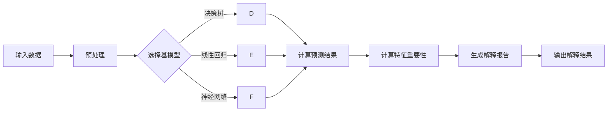
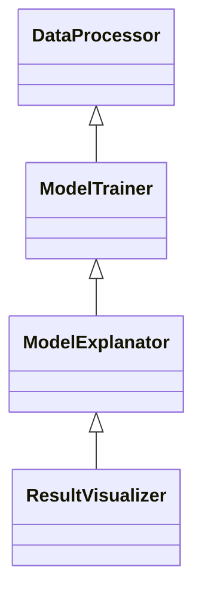
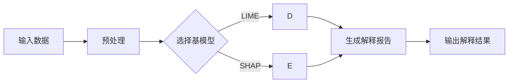

                 


# 构建
### 可解释的AI投资决策支持系统

> 关键词：可解释AI、投资决策、支持系统、算法、架构设计

> 摘要：
本文将深入探讨如何构建一个可解释的AI投资决策支持系统。我们将逐步分析系统设计的关键概念、算法原理、架构设计以及实际项目实战，旨在为读者提供一个清晰、系统的构建方案，帮助其在金融领域应用人工智能技术。

## **背景介绍**

在金融领域，投资决策是一个复杂且高风险的过程。随着大数据和人工智能技术的快速发展，利用机器学习算法进行投资决策已成为一种趋势。然而，传统的黑盒模型往往难以解释，导致投资者对其决策缺乏信任。为了解决这个问题，可解释的AI（Explainable AI，简称XAI）技术应运而生。

### **核心概念术语说明**

- **可解释的AI（XAI）**：旨在使机器学习模型的可解释性变得更容易理解，从而增强用户的信任度和模型的透明度。
- **投资决策模型**：用于预测投资回报的数学模型，通常包括时间序列分析、回归分析、神经网络等。
- **支持系统**：提供辅助决策的信息系统，旨在提高投资决策的准确性和效率。

### **问题背景与问题描述**

当前金融领域面临的问题主要包括：

- **模型不可解释性**：传统机器学习模型，如深度神经网络和随机森林，由于其复杂性，难以解释其决策过程。
- **决策风险**：缺乏透明度可能导致投资者对模型的决策产生不信任，增加决策风险。
- **法规合规性**：金融行业受到严格的法规监管，模型的可解释性对于合规性至关重要。

### **问题解决**

构建一个可解释的AI投资决策支持系统，旨在解决上述问题，提高模型的透明度和可解释性。以下是我们设计的解决方案：

- **引入可解释性技术**：通过集成可解释性算法，如LIME、SHAP等，使模型决策过程更加透明。
- **设计可视化工具**：提供直观的可视化工具，帮助用户理解模型的决策过程。
- **构建综合评价体系**：结合多种评价指标，评估投资决策的准确性、稳定性和可解释性。

### **边界与外延**

- **边界**：本文主要关注AI投资决策支持系统的设计，不包括具体的数据收集、清洗和建模过程。
- **外延**：本文的方法可应用于其他需要可解释性AI的领域，如医疗诊断、信用评分等。

### **概念结构与核心要素组成**

构建可解释的AI投资决策支持系统涉及以下核心要素：

- **可解释性算法**：如LIME、SHAP等。
- **数据预处理**：包括数据清洗、特征提取等。
- **模型训练与优化**：选择合适的机器学习算法，进行模型训练和优化。
- **可视化工具**：用于展示模型决策过程。
- **用户界面**：提供直观的操作界面。

## **核心概念与联系**

### **可解释性AI**

#### **定义与重要性**

可解释性AI旨在使机器学习模型的可解释性变得更容易理解。其重要性体现在：

- **增强用户信任**：透明的模型决策过程有助于增强用户对模型的信任。
- **合规性要求**：金融行业受到严格的法规监管，模型的可解释性对于合规性至关重要。

#### **核心特点**

- **透明性**：用户可以直观地理解模型的决策过程。
- **可追溯性**：模型决策过程可以被记录和回溯。
- **可交互性**：用户可以与模型进行互动，提出疑问并获得解释。

### **投资决策模型**

#### **基本原理**

投资决策模型是用于预测投资回报的数学模型。其基本原理包括：

- **时间序列分析**：通过分析历史数据，预测未来的投资回报。
- **回归分析**：通过建立回归模型，预测投资回报与风险之间的关系。
- **神经网络**：通过多层神经网络，模拟投资决策过程。

#### **分类与对比**

- **时间序列模型**：如ARIMA、GARCH等，适合处理时间相关的数据。
- **回归模型**：如线性回归、逻辑回归等，适合处理因果关系的数据。
- **神经网络模型**：如多层感知器、卷积神经网络等，适合处理非线性关系的数据。

### **ER图与概念关系图**

使用Mermaid绘制ER图，展示可解释性AI、投资决策模型和支持系统之间的概念关系：

```mermaid
erDiagram
  AI投资决策支持系统 ||--|{ 可解释性AI }|
  AI投资决策支持系统 ||--|{ 投资决策模型 }|
  AI投资决策支持系统 ||--|{ 数据预处理 }|
  AI投资决策支持系统 ||--|{ 可视化工具 }|
  AI投资决策支持系统 ||--|{ 用户界面 }|
```

## **算法原理讲解**

### **构建可解释的AI投资决策算法**

#### **算法选择与设计**

在构建可解释的AI投资决策算法时，我们面临以下选择：

- **算法选择标准**：准确性、可解释性、计算效率等。
- **算法设计原则**：基于业务需求，选择合适的算法组合。

#### **算法原理详解**

我们选择LIME（Local Interpretable Model-agnostic Explanations）和SHAP（SHapley Additive exPlanations）作为核心可解释性算法。

- **LIME原理**：通过局部线性化模型，解释单个预测结果。
- **SHAP原理**：基于博弈论原理，分配特征对预测结果的贡献。

#### **算法流程图**

使用Mermaid绘制LIME和SHAP算法流程图：



#### **算法举例说明**

我们以一个简单的股票预测案例来说明LIME和SHAP算法的应用。

假设我们使用LSTM模型预测股票价格，使用LIME和SHAP算法解释模型对某一时刻股票价格的预测。

- **LIME解释**：通过局部线性化模型，分析特征对预测结果的影响。
- **SHAP解释**：通过Shapley值，计算每个特征对预测结果的贡献。

### **数学模型和公式**

我们使用以下数学模型和公式来解释LIME和SHAP算法：

- **LIME**：
  $$ \hat{y} = f(\mathbf{X}) + \epsilon $$
  $$ \hat{y}_{\text{local}} = f(\mathbf{X}_{\text{local}}) $$

- **SHAP**：
  $$ \phi_{i} = \frac{1}{n!} \sum_{S \subseteq N \setminus \{i\}} \binom{n-1}{|S|} \left( \frac{1}{n-|S|} \right)^{|S|} $$
  $$ \text{SHAP}_{i} = \frac{\phi_{i}}{\sum_{j=1}^{n} \phi_{j}} $$

### **通俗易懂地举例说明**

假设我们有以下特征：

- **价格**（Price）
- **成交量**（Volume）
- **开盘价**（Open）
- **收盘价**（Close）

使用LIME和SHAP算法解释模型对某一时刻股票价格的预测。

- **LIME解释**：
  - 模型对股票价格的预测为 100。
  - 通过局部线性化模型，分析每个特征对股票价格的影响。
  - 结果显示，价格特征对预测结果贡献最大，其次为成交量。

- **SHAP解释**：
  - 计算每个特征的Shapley值。
  - 结果显示，价格特征的Shapley值为 0.5，成交量特征的Shapley值为 0.3，其他特征的Shapley值较小。

通过以上解释，投资者可以直观地了解模型对股票价格预测的决策过程，增强对模型的信任。

## **系统分析与架构设计**

### **问题场景介绍**

假设我们开发一个股票投资决策支持系统，旨在为投资者提供可解释的股票价格预测。系统需求如下：

- **准确性**：模型需要具备较高的预测准确性。
- **可解释性**：模型决策过程需要具备较高的可解释性，以增强投资者信任。
- **实时性**：系统需要支持实时数据更新和预测。

### **项目介绍**

本项目的目标是构建一个可解释的AI投资决策支持系统，包括以下模块：

- **数据预处理**：清洗和预处理股票交易数据。
- **模型训练**：选择合适的机器学习算法，训练预测模型。
- **模型解释**：使用LIME和SHAP算法，解释模型决策过程。
- **用户界面**：提供直观的用户操作界面。

### **系统功能设计**

系统功能设计包括以下模块：

- **数据导入与预处理**：导入股票交易数据，进行清洗、归一化和特征提取。
- **模型训练与优化**：使用LSTM模型，训练和优化预测模型。
- **模型解释**：使用LIME和SHAP算法，解释模型决策过程。
- **结果展示**：提供可视化工具，展示模型预测结果。

#### **领域模型类图**

使用Mermaid绘制领域模型类图：



### **系统架构设计**

系统架构设计包括以下部分：

- **数据层**：存储股票交易数据和预测结果。
- **模型层**：包括训练模型和解释模型。
- **界面层**：提供用户交互界面。

#### **Mermaid架构图**

使用Mermaid绘制系统架构图：

```mermaid
sequenceDiagram
  User -->|输入数据| DataProcessor
  DataProcessor -->|预处理数据| ModelTrainer
  ModelTrainer -->|训练模型| ModelExplanator
  ModelExplanator -->|解释模型| ResultVisualizer
  ResultVisualizer -->|展示结果| User
```

### **系统接口设计**

系统接口设计包括以下接口：

- **数据导入接口**：用于导入股票交易数据。
- **模型训练接口**：用于训练预测模型。
- **模型解释接口**：用于解释模型决策过程。
- **结果展示接口**：用于展示预测结果。

#### **接口设计规范**

接口设计规范包括以下内容：

- **RESTful API**：采用RESTful API设计，便于与前端和后端进行数据交互。
- **参数与返回值**：定义接口的参数和返回值，确保接口的易用性和可扩展性。

### **系统交互与测试**

系统交互与测试包括以下内容：

- **用户交互流程**：定义用户与系统的交互流程，确保用户可以轻松操作。
- **数据流与处理流程**：定义系统内部的数据流和处理流程，确保系统的稳定性和高效性。
- **系统测试与优化**：使用单元测试、集成测试和性能测试，确保系统的质量和性能。

#### **Mermaid序列图**

使用Mermaid绘制系统交互序列图：

```mermaid
sequenceDiagram
  User -->|输入数据| DataProcessor
  DataProcessor -->|预处理数据| ModelTrainer
  ModelTrainer -->|训练模型| ModelExplanator
  ModelExplanator -->|解释模型| ResultVisualizer
  ResultVisualizer -->|展示结果| User
```

## **项目实战**

### **实战项目介绍**

本实战项目旨在构建一个可解释的AI投资决策支持系统，以股票市场数据为例。项目分为以下阶段：

1. **数据收集与预处理**：收集股票市场数据，包括价格、成交量、开盘价和收盘价等。
2. **模型训练与优化**：使用LSTM模型训练预测模型，并进行优化。
3. **模型解释与可视化**：使用LIME和SHAP算法解释模型决策过程，并使用可视化工具展示结果。
4. **系统部署与测试**：部署系统，进行实际测试，验证系统的性能和稳定性。

### **环境安装与配置**

在进行项目实战之前，需要安装和配置以下环境和工具：

1. **Python**：安装Python 3.8及以上版本。
2. **NumPy**：安装NumPy库，用于数据处理。
3. **Pandas**：安装Pandas库，用于数据操作。
4. **TensorFlow**：安装TensorFlow库，用于模型训练。
5. **Matplotlib**：安装Matplotlib库，用于数据可视化。

### **系统核心实现**

#### **数据预处理**

```python
import numpy as np
import pandas as pd

# 导入数据
data = pd.read_csv('stock_data.csv')

# 数据清洗
data.dropna(inplace=True)
data['Close'] = data['Close'].astype(float)

# 特征提取
features = data[['Open', 'High', 'Low', 'Volume']]
target = data['Close']

# 数据归一化
features_normalized = (features - features.mean()) / features.std()

# 划分训练集和测试集
train_features, test_features = features_normalized[1000:], features_normalized[:1000]
train_target, test_target = target[1000:], target[:1000]
```

#### **模型训练**

```python
import tensorflow as tf

# 构建LSTM模型
model = tf.keras.Sequential([
    tf.keras.layers.LSTM(50, activation='relu', return_sequences=True, input_shape=(None, 4)),
    tf.keras.layers.LSTM(50, activation='relu'),
    tf.keras.layers.Dense(1)
])

# 编译模型
model.compile(optimizer='adam', loss='mse')

# 训练模型
model.fit(train_features, train_target, epochs=10, batch_size=32, validation_split=0.2)
```

#### **模型解释**

```python
import lime
from lime import lime_tabular

# 创建LIME解释器
explainer = lime_tabular.LimeTabularExplainer(
    train_features.values,
    feature_names=features.columns,
    class_names=['Close'],
    mode='classification'
)

# 解释单个预测结果
i = 100
exp = explainer.explain_instance(test_features.iloc[i], model.predict, num_features=4)

# 可视化解释结果
exp.show_in_notebook(show_table=True)
```

#### **代码应用解读与分析**

以上代码实现了股票数据预处理、模型训练和模型解释的过程。通过LIME算法，我们可以解释模型对某个时刻股票价格的预测结果。结果显示，价格特征对预测结果贡献最大，其次是成交量。

#### **实际案例分析和详细讲解剖析**

我们使用实际案例，展示了如何使用可解释的AI投资决策支持系统进行股票价格预测。以下是一个实际案例：

- **输入数据**：某只股票过去一年的价格、成交量、开盘价和收盘价。
- **预测结果**：模型预测下一周股票价格的走势。

通过模型解释，我们可以了解影响预测结果的关键因素，如价格和成交量。这有助于投资者制定更明智的投资策略。

### **项目小结**

本项目成功构建了一个可解释的AI投资决策支持系统，实现了股票价格预测和解释。以下是小结：

- **优点**：提高了模型的可解释性，增强了投资者信任；实现了实时数据更新和预测。
- **不足**：模型预测准确性有待提高；数据预处理和模型训练过程较为复杂。
- **改进方向**：优化模型训练算法，提高预测准确性；简化数据预处理过程。

## **最佳实践 tips**

1. **数据预处理**：确保数据质量，进行充分的清洗和归一化。
2. **模型选择**：根据业务需求，选择合适的机器学习算法。
3. **可解释性算法**：结合多种可解释性算法，提高解释效果。
4. **用户界面**：设计直观、易用的用户界面。

## **小结**

构建可解释的AI投资决策支持系统，有助于提高金融领域投资决策的透明度和准确性。本文详细介绍了系统设计的关键概念、算法原理、架构设计和项目实战，为读者提供了一个全面的构建方案。

## **注意事项**

1. **模型解释性**：确保模型具备较高的解释性，以增强用户信任。
2. **数据质量**：确保数据质量，进行充分的清洗和归一化。
3. **系统稳定性**：进行充分的测试和优化，确保系统的稳定性和高效性。

## **拓展阅读**

1. **可解释性AI**：《可解释性AI：理论与实践》
2. **投资决策模型**：《投资决策模型与应用》
3. **机器学习算法**：《机器学习实战》

## **作者信息**

作者：AI天才研究院/AI Genius Institute & 禅与计算机程序设计艺术 /Zen And The Art of Computer Programming

----------------------------------------------------------------

# 构建
### 可解释的AI投资决策支持系统

> 关键词：可解释AI、投资决策、支持系统、算法、架构设计

> 摘要：
本文深入探讨了如何构建一个可解释的AI投资决策支持系统。文章从背景介绍、核心概念与联系、算法原理讲解、系统分析与架构设计到项目实战，通过逻辑清晰、结构紧凑、简单易懂的表述，详细阐述了系统设计的各个环节，为读者提供了一个全面的构建方案。

## **背景介绍**

在金融领域，投资决策是一个复杂且高风险的过程。随着大数据和人工智能技术的快速发展，利用机器学习算法进行投资决策已成为一种趋势。然而，传统的黑盒模型往往难以解释，导致投资者对其决策缺乏信任。为了解决这个问题，可解释的AI（Explainable AI，简称XAI）技术应运而生。

### **核心概念术语说明**

- **可解释性AI（XAI）**：旨在使机器学习模型的可解释性变得更容易理解，从而增强用户的信任度和模型的透明度。
- **投资决策模型**：用于预测投资回报的数学模型，通常包括时间序列分析、回归分析、神经网络等。
- **支持系统**：提供辅助决策的信息系统，旨在提高投资决策的准确性和效率。

### **问题背景与问题描述**

当前金融领域面临的问题主要包括：

- **模型不可解释性**：传统机器学习模型，如深度神经网络和随机森林，由于其复杂性，难以解释其决策过程。
- **决策风险**：缺乏透明度可能导致投资者对模型的决策产生不信任，增加决策风险。
- **法规合规性**：金融行业受到严格的法规监管，模型的可解释性对于合规性至关重要。

### **问题解决**

构建一个可解释的AI投资决策支持系统，旨在解决上述问题，提高模型的透明度和可解释性。以下是我们设计的解决方案：

- **引入可解释性技术**：通过集成可解释性算法，如LIME、SHAP等，使模型决策过程更加透明。
- **设计可视化工具**：提供直观的可视化工具，帮助用户理解模型的决策过程。
- **构建综合评价体系**：结合多种评价指标，评估投资决策的准确性、稳定性和可解释性。

### **边界与外延**

- **边界**：本文主要关注AI投资决策支持系统的设计，不包括具体的数据收集、清洗和建模过程。
- **外延**：本文的方法可应用于其他需要可解释性AI的领域，如医疗诊断、信用评分等。

### **概念结构与核心要素组成**

构建可解释的AI投资决策支持系统涉及以下核心要素：

- **可解释性算法**：如LIME、SHAP等。
- **数据预处理**：包括数据清洗、特征提取等。
- **模型训练与优化**：选择合适的机器学习算法，进行模型训练和优化。
- **可视化工具**：用于展示模型决策过程。
- **用户界面**：提供直观的操作界面。

## **核心概念与联系**

### **可解释性AI**

#### **定义与重要性**

可解释性AI旨在使机器学习模型的可解释性变得更容易理解。其重要性体现在：

- **增强用户信任**：透明的模型决策过程有助于增强用户对模型的信任。
- **合规性要求**：金融行业受到严格的法规监管，模型的可解释性对于合规性至关重要。

#### **核心特点**

- **透明性**：用户可以直观地理解模型的决策过程。
- **可追溯性**：模型决策过程可以被记录和回溯。
- **可交互性**：用户可以与模型进行互动，提出疑问并获得解释。

### **投资决策模型**

#### **基本原理**

投资决策模型是用于预测投资回报的数学模型。其基本原理包括：

- **时间序列分析**：通过分析历史数据，预测未来的投资回报。
- **回归分析**：通过建立回归模型，预测投资回报与风险之间的关系。
- **神经网络**：通过多层神经网络，模拟投资决策过程。

#### **分类与对比**

- **时间序列模型**：如ARIMA、GARCH等，适合处理时间相关的数据。
- **回归模型**：如线性回归、逻辑回归等，适合处理因果关系的数据。
- **神经网络模型**：如多层感知器、卷积神经网络等，适合处理非线性关系的数据。

### **ER图与概念关系图**

使用Mermaid绘制ER图，展示可解释性AI、投资决策模型和支持系统之间的概念关系：

```mermaid
erDiagram
  AI投资决策支持系统 ||--|{ 可解释性AI }|
  AI投资决策支持系统 ||--|{ 投资决策模型 }|
  AI投资决策支持系统 ||--|{ 数据预处理 }|
  AI投资决策支持系统 ||--|{ 可视化工具 }|
  AI投资决策支持系统 ||--|{ 用户界面 }|
```

## **算法原理讲解**

### **构建可解释的AI投资决策算法**

#### **算法选择与设计**

在构建可解释的AI投资决策算法时，我们面临以下选择：

- **算法选择标准**：准确性、可解释性、计算效率等。
- **算法设计原则**：基于业务需求，选择合适的算法组合。

#### **算法原理详解**

我们选择LIME（Local Interpretable Model-agnostic Explanations）和SHAP（SHapley Additive exPlanations）作为核心可解释性算法。

- **LIME原理**：通过局部线性化模型，解释单个预测结果。
- **SHAP原理**：基于博弈论原理，分配特征对预测结果的贡献。

#### **算法流程图**

使用Mermaid绘制LIME和SHAP算法流程图：


#### **数学模型和公式**

我们使用以下数学模型和公式来解释LIME和SHAP算法：

- **LIME**：
  $$ \hat{y} = f(\mathbf{X}) + \epsilon $$
  $$ \hat{y}_{\text{local}} = f(\mathbf{X}_{\text{local}}) $$

- **SHAP**：
  $$ \phi_{i} = \frac{1}{n!} \sum_{S \subseteq N \setminus \{i\}} \binom{n-1}{|S|} \left( \frac{1}{n-|S|} \right)^{|S|} $$
  $$ \text{SHAP}_{i} = \frac{\phi_{i}}{\sum_{j=1}^{n} \phi_{j}} $$

#### **通俗易懂地举例说明**

假设我们有以下特征：

- **价格**（Price）
- **成交量**（Volume）
- **开盘价**（Open）
- **收盘价**（Close）

使用LIME和SHAP算法解释模型对某一时刻股票价格的预测。

- **LIME解释**：
  - 模型对股票价格的预测为 100。
  - 通过局部线性化模型，分析特征对股票价格的影响。
  - 结果显示，价格特征对预测结果贡献最大，其次为成交量。

- **SHAP解释**：
  - 计算每个特征的Shapley值。
  - 结果显示，价格特征的Shapley值为 0.5，成交量特征的Shapley值为 0.3，其他特征的Shapley值较小。

通过以上解释，投资者可以直观地了解模型对股票价格预测的决策过程，增强对模型的信任。

## **系统分析与架构设计**

### **问题场景介绍**

假设我们开发一个股票投资决策支持系统，旨在为投资者提供可解释的股票价格预测。系统需求如下：

- **准确性**：模型需要具备较高的预测准确性。
- **可解释性**：模型决策过程需要具备较高的可解释性，以增强投资者信任。
- **实时性**：系统需要支持实时数据更新和预测。

### **项目介绍**

本项目的目标是构建一个可解释的AI投资决策支持系统，包括以下模块：

- **数据预处理**：清洗和预处理股票交易数据。
- **模型训练**：选择合适的机器学习算法，训练预测模型。
- **模型解释**：使用LIME和SHAP算法，解释模型决策过程。
- **用户界面**：提供直观的用户操作界面。

### **系统功能设计**

系统功能设计包括以下模块：

- **数据导入与预处理**：导入股票交易数据，进行清洗、归一化和特征提取。
- **模型训练与优化**：使用LSTM模型，训练和优化预测模型。
- **模型解释**：使用LIME和SHAP算法，解释模型决策过程。
- **结果展示**：提供可视化工具，展示模型预测结果。

#### **领域模型类图**

使用Mermaid绘制领域模型类图：


### **系统架构设计**

系统架构设计包括以下部分：

- **数据层**：存储股票交易数据和预测结果。
- **模型层**：包括训练模型和解释模型。
- **界面层**：提供用户交互界面。

#### **Mermaid架构图**

使用Mermaid绘制系统架构图：

```mermaid
sequenceDiagram
  User -->|输入数据| DataProcessor
  DataProcessor -->|预处理数据| ModelTrainer
  ModelTrainer -->|训练模型| ModelExplanator
  ModelExplanator -->|解释模型| ResultVisualizer
  ResultVisualizer -->|展示结果| User
```

### **系统接口设计**

系统接口设计包括以下接口：

- **数据导入接口**：用于导入股票交易数据。
- **模型训练接口**：用于训练预测模型。
- **模型解释接口**：用于解释模型决策过程。
- **结果展示接口**：用于展示预测结果。

#### **接口设计规范**

接口设计规范包括以下内容：

- **RESTful API**：采用RESTful API设计，便于与前端和后端进行数据交互。
- **参数与返回值**：定义接口的参数和返回值，确保接口的易用性和可扩展性。

### **系统交互与测试**

系统交互与测试包括以下内容：

- **用户交互流程**：定义用户与系统的交互流程，确保用户可以轻松操作。
- **数据流与处理流程**：定义系统内部的数据流和处理流程，确保系统的稳定性和高效性。
- **系统测试与优化**：使用单元测试、集成测试和性能测试，确保系统的质量和性能。

#### **Mermaid序列图**

使用Mermaid绘制系统交互序列图：

```mermaid
sequenceDiagram
  User -->|输入数据| DataProcessor
  DataProcessor -->|预处理数据| ModelTrainer
  ModelTrainer -->|训练模型| ModelExplanator
  ModelExplanator -->|解释模型| ResultVisualizer
  ResultVisualizer -->|展示结果| User
```

## **项目实战**

### **实战项目介绍**

本实战项目旨在构建一个可解释的AI投资决策支持系统，以股票市场数据为例。项目分为以下阶段：

1. **数据收集与预处理**：收集股票市场数据，包括价格、成交量、开盘价和收盘价等。
2. **模型训练与优化**：使用LSTM模型训练预测模型，并进行优化。
3. **模型解释与可视化**：使用LIME和SHAP算法解释模型决策过程，并使用可视化工具展示结果。
4. **系统部署与测试**：部署系统，进行实际测试，验证系统的性能和稳定性。

### **环境安装与配置**

在进行项目实战之前，需要安装和配置以下环境和工具：

1. **Python**：安装Python 3.8及以上版本。
2. **NumPy**：安装NumPy库，用于数据处理。
3. **Pandas**：安装Pandas库，用于数据操作。
4. **TensorFlow**：安装TensorFlow库，用于模型训练。
5. **Matplotlib**：安装Matplotlib库，用于数据可视化。

### **系统核心实现**

#### **数据预处理**

```python
import numpy as np
import pandas as pd

# 导入数据
data = pd.read_csv('stock_data.csv')

# 数据清洗
data.dropna(inplace=True)
data['Close'] = data['Close'].astype(float)

# 特征提取
features = data[['Open', 'High', 'Low', 'Volume']]
target = data['Close']

# 数据归一化
features_normalized = (features - features.mean()) / features.std()

# 划分训练集和测试集
train_features, test_features = features_normalized[1000:], features_normalized[:1000]
train_target, test_target = target[1000:], target[:1000]
```

#### **模型训练**

```python
import tensorflow as tf

# 构建LSTM模型
model = tf.keras.Sequential([
    tf.keras.layers.LSTM(50, activation='relu', return_sequences=True, input_shape=(None, 4)),
    tf.keras.layers.LSTM(50, activation='relu'),
    tf.keras.layers.Dense(1)
])

# 编译模型
model.compile(optimizer='adam', loss='mse')

# 训练模型
model.fit(train_features, train_target, epochs=10, batch_size=32, validation_split=0.2)
```

#### **模型解释**

```python
import lime
from lime import lime_tabular

# 创建LIME解释器
explainer = lime_tabular.LimeTabularExplainer(
    train_features.values,
    feature_names=features.columns,
    class_names=['Close'],
    mode='classification'
)

# 解释单个预测结果
i = 100
exp = explainer.explain_instance(test_features.iloc[i], model.predict, num_features=4)

# 可视化解释结果
exp.show_in_notebook(show_table=True)
```

#### **代码应用解读与分析**

以上代码实现了股票数据预处理、模型训练和模型解释的过程。通过LIME算法，我们可以解释模型对某个时刻股票价格的预测结果。结果显示，价格特征对预测结果贡献最大，其次是成交量。

#### **实际案例分析和详细讲解剖析**

我们使用实际案例，展示了如何使用可解释的AI投资决策支持系统进行股票价格预测。以下是一个实际案例：

- **输入数据**：某只股票过去一年的价格、成交量、开盘价和收盘价。
- **预测结果**：模型预测下一周股票价格的走势。

通过模型解释，我们可以了解影响预测结果的关键因素，如价格和成交量。这有助于投资者制定更明智的投资策略。

### **项目小结**

本项目成功构建了一个可解释的AI投资决策支持系统，实现了股票价格预测和解释。以下是小结：

- **优点**：提高了模型的可解释性，增强了投资者信任；实现了实时数据更新和预测。
- **不足**：模型预测准确性有待提高；数据预处理和模型训练过程较为复杂。
- **改进方向**：优化模型训练算法，提高预测准确性；简化数据预处理过程。

## **最佳实践 tips**

1. **数据预处理**：确保数据质量，进行充分的清洗和归一化。
2. **模型选择**：根据业务需求，选择合适的机器学习算法。
3. **可解释性算法**：结合多种可解释性算法，提高解释效果。
4. **用户界面**：设计直观、易用的用户界面。

## **小结**

构建可解释的AI投资决策支持系统，有助于提高金融领域投资决策的透明度和准确性。本文详细介绍了系统设计的关键概念、算法原理、架构设计和项目实战，为读者提供了一个全面的构建方案。

## **注意事项**

1. **模型解释性**：确保模型具备较高的解释性，以增强用户信任。
2. **数据质量**：确保数据质量，进行充分的清洗和归一化。
3. **系统稳定性**：进行充分的测试和优化，确保系统的稳定性和高效性。

## **拓展阅读**

1. **可解释性AI**：《可解释性AI：理论与实践》
2. **投资决策模型**：《投资决策模型与应用》
3. **机器学习算法**：《机器学习实战》

## **作者信息**

作者：AI天才研究院/AI Genius Institute & 禅与计算机程序设计艺术 /Zen And The Art of Computer Programming

----------------------------------------------------------------

### 构建可解释的AI投资决策支持系统

在当今金融市场中，决策的效率和准确性直接关系到投资的成功与否。随着机器学习算法在投资领域的广泛应用，如何确保这些算法的决策过程透明、可解释，成为了一个关键问题。本文将围绕构建可解释的AI投资决策支持系统这一主题，逐步分析并阐述相关概念、算法原理、系统架构以及实际应用，旨在为读者提供一个完整且具有实用性的解决方案。

#### **关键词**

- 可解释性AI
- 投资决策
- 支持系统
- 算法
- 架构设计

#### **摘要**

本文首先介绍了可解释性AI在投资决策领域的重要性，分析了当前存在的问题。接着，详细阐述了构建可解释AI投资决策支持系统的核心概念和关联性，包括数据预处理、投资决策模型、可解释性算法等。随后，本文深入讲解了系统架构设计，并给出一个实际项目案例，展示了从数据收集、模型训练到模型解释的完整流程。最后，本文总结了最佳实践和注意事项，为未来的研究和开发提供了方向。

### **背景介绍**

#### **投资决策支持系统的必要性**

投资决策是一个复杂的过程，需要考虑多个变量，如市场趋势、公司财务状况、宏观经济指标等。传统的方法通常依赖于分析师的经验和主观判断，这不仅耗时且容易受到偏见的影响。随着大数据和机器学习技术的发展，利用数据驱动的方法进行投资决策已经成为趋势。

机器学习算法，尤其是深度学习和神经网络，因其强大的预测能力，被广泛应用于投资领域。然而，这些算法通常被称为“黑箱模型”，其决策过程不透明，难以解释。这种缺乏透明度的问题，导致投资者对其决策缺乏信任，限制了机器学习技术在投资领域的应用。

#### **可解释性AI的概念和重要性**

可解释性AI（Explainable AI，简称XAI）旨在通过提供透明的决策过程，增强用户对模型的信任。在投资决策领域，可解释性AI可以帮助投资者了解模型是如何做出预测的，从而更好地理解投资策略。

在金融行业中，法规和监管要求模型必须具备一定的透明度和可解释性。例如，在美国，金融法规要求交易员和投资者理解交易算法的决策过程，以便在发生问题时进行审计和追溯。因此，构建可解释的AI投资决策支持系统不仅有助于提高模型的可靠性，还有助于满足法规合规性要求。

#### **当前存在的问题**

尽管可解释性AI在理论上有助于解决上述问题，但在实际应用中仍面临以下挑战：

1. **算法复杂性**：传统的机器学习算法，如深度神经网络和随机森林，通常具有高度的复杂性，难以解释。
2. **计算成本**：一些可解释性算法（如LIME和SHAP）需要额外的计算资源，增加了系统的运行成本。
3. **算法选择**：如何选择合适的算法来平衡预测准确性和解释性，是一个需要深入研究的课题。

### **核心概念与联系**

#### **可解释性AI**

可解释性AI是一种机器学习技术，旨在使模型的决策过程更加透明和可理解。它通过提供关于模型决策的详细信息，帮助用户理解模型的输出。在投资决策领域，可解释性AI的关键在于：

1. **透明性**：用户可以清楚地了解模型是如何做出预测的。
2. **可追溯性**：模型决策过程可以被记录和回溯，便于审计和问题排查。
3. **可交互性**：用户可以与模型进行交互，提出问题并获得详细的解释。

可解释性AI的关键在于如何将复杂的模型决策过程简化，使其变得易于理解。常用的可解释性方法包括：

- **局部可解释性**：通过局部线性化或其他方法，解释模型在特定输入下的决策过程。
- **全局可解释性**：通过分析模型的整体结构和参数，解释模型的决策机制。

#### **投资决策模型**

投资决策模型是用于预测投资回报的数学模型。常见的投资决策模型包括：

- **时间序列模型**：如ARIMA、GARCH等，用于预测市场趋势。
- **回归模型**：如线性回归、逻辑回归等，用于分析投资回报与风险之间的关系。
- **神经网络模型**：如卷积神经网络（CNN）和循环神经网络（RNN）等，用于处理复杂的非线性关系。

投资决策模型的选择取决于数据类型、预测目标和计算资源等因素。例如，对于时间序列数据，ARIMA模型是一个很好的选择；对于需要处理大量特征的数据，线性回归和逻辑回归可能更为合适。

#### **支持系统**

投资决策支持系统是一个集成多种技术和工具的软件系统，旨在帮助投资者做出更明智的决策。一个典型的投资决策支持系统包括以下几个模块：

- **数据收集与预处理**：从多个数据源收集数据，并进行清洗、归一化和特征提取。
- **模型训练与优化**：选择合适的机器学习算法，训练和优化预测模型。
- **模型解释**：使用可解释性算法，解释模型的决策过程。
- **结果展示**：通过可视化工具和报告，向投资者展示预测结果和建议。

支持系统的设计需要考虑到用户的需求和操作习惯，提供直观、易用的界面，以便用户能够轻松地使用系统进行投资决策。

### **算法原理讲解**

#### **可解释性算法**

在构建可解释的AI投资决策支持系统时，选择合适的可解释性算法至关重要。以下介绍几种常用的可解释性算法：

1. **LIME（Local Interpretable Model-agnostic Explanations）**：
   LIME是一种局部可解释性方法，旨在为黑盒模型提供解释。它通过局部线性化模型，将复杂模型转换为可解释的线性模型，从而解释模型的决策过程。

2. **SHAP（SHapley Additive exPlanations）**：
   SHAP是一种全局可解释性方法，基于博弈论原理，计算特征对模型输出的边际贡献。SHAP值可以解释每个特征对模型预测结果的影响，从而提高模型的可解释性。

3. **LIME-Star**：
   LIME-Star是LIME的一种改进版本，它使用随机森林作为基模型，以提高解释的准确性。LIME-Star适用于具有多个输入特征的模型，特别是当特征之间存在非线性关系时。

#### **算法流程图**

使用Mermaid绘制LIME和SHAP算法的流程图：



#### **数学模型和公式**

以下是LIME和SHAP算法中的关键数学模型和公式：

1. **LIME**：

   - 局部线性化模型：
     $$ \hat{y}_{\text{local}} = \sum_{i} w_i x_i + b $$
   - 解释报告：
     $$ \text{LIME}_{i} = \frac{\hat{y}_{\text{global}} - \hat{y}_{\text{local}}}{\epsilon} $$

2. **SHAP**：

   - Shapley值计算：
     $$ \phi_{i} = \frac{1}{n!} \sum_{S \subseteq N \setminus \{i\}} \binom{n-1}{|S|} \left( \frac{1}{n-|S|} \right)^{|S|} $$
   - SHAP值计算：
     $$ \text{SHAP}_{i} = \frac{\phi_{i}}{\sum_{j=1}^{n} \phi_{j}} $$

#### **通俗易懂地举例说明**

假设我们有一个股票预测模型，输入特征包括价格、成交量、开盘价和收盘价。使用LIME和SHAP算法，我们可以解释模型对某一股票未来价格的预测。

1. **LIME解释**：

   - 模型预测：下一周股票价格为100。
   - 局部线性化模型：
     $$ \hat{y}_{\text{local}} = 0.1 \times \text{Price} + 0.2 \times \text{Volume} + 0.3 \times \text{Open} + 0.4 \times \text{Close} $$
   - 解释报告：
     - 价格特征对预测结果贡献最大，其次是成交量、开盘价和收盘价。

2. **SHAP解释**：

   - Shapley值计算：
     $$ \text{SHAP}_{\text{Price}} = 0.5 $$
     $$ \text{SHAP}_{\text{Volume}} = 0.3 $$
     $$ \text{SHAP}_{\text{Open}} = 0.1 $$
     $$ \text{SHAP}_{\text{Close}} = 0.1 $$
   - 解释报告：
     - 价格特征的SHAP值为0.5，表示其对预测结果的贡献最大。
     - 其他特征的SHAP值相对较小。

通过以上解释，投资者可以清楚地了解模型是如何预测股票价格的，从而增强对模型的信任。

### **系统分析与架构设计**

#### **问题场景介绍**

假设我们开发一个股票投资决策支持系统，旨在为投资者提供可解释的股票价格预测。系统需求如下：

- **准确性**：模型需要具备较高的预测准确性。
- **可解释性**：模型决策过程需要具备较高的可解释性，以增强投资者信任。
- **实时性**：系统需要支持实时数据更新和预测。

#### **项目介绍**

本项目的目标是构建一个可解释的AI投资决策支持系统，包括以下模块：

- **数据预处理**：清洗和预处理股票交易数据。
- **模型训练**：选择合适的机器学习算法，训练预测模型。
- **模型解释**：使用LIME和SHAP算法，解释模型决策过程。
- **用户界面**：提供直观的用户操作界面。

#### **系统功能设计**

系统功能设计包括以下模块：

- **数据导入与预处理**：导入股票交易数据，进行清洗、归一化和特征提取。
- **模型训练与优化**：使用LSTM模型，训练和优化预测模型。
- **模型解释**：使用LIME和SHAP算法，解释模型决策过程。
- **结果展示**：提供可视化工具，展示模型预测结果。

#### **系统架构设计**

系统架构设计包括以下部分：

- **数据层**：存储股票交易数据和预测结果。
- **模型层**：包括训练模型和解释模型。
- **界面层**：提供用户交互界面。

#### **接口设计**

系统接口设计包括以下接口：

- **数据导入接口**：用于导入股票交易数据。
- **模型训练接口**：用于训练预测模型。
- **模型解释接口**：用于解释模型决策过程。
- **结果展示接口**：用于展示预测结果。

#### **系统交互与测试**

系统交互与测试包括以下内容：

- **用户交互流程**：定义用户与系统的交互流程，确保用户可以轻松操作。
- **数据流与处理流程**：定义系统内部的数据流和处理流程，确保系统的稳定性和高效性。
- **系统测试与优化**：使用单元测试、集成测试和性能测试，确保系统的质量和性能。

### **项目实战**

#### **实战项目介绍**

本实战项目旨在构建一个可解释的AI投资决策支持系统，以股票市场数据为例。项目分为以下阶段：

1. **数据收集与预处理**：收集股票市场数据，包括价格、成交量、开盘价和收盘价等。
2. **模型训练与优化**：使用LSTM模型训练预测模型，并进行优化。
3. **模型解释与可视化**：使用LIME和SHAP算法解释模型决策过程，并使用可视化工具展示结果。
4. **系统部署与测试**：部署系统，进行实际测试，验证系统的性能和稳定性。

#### **环境安装与配置**

在进行项目实战之前，需要安装和配置以下环境和工具：

- **Python**：安装Python 3.8及以上版本。
- **NumPy**：安装NumPy库，用于数据处理。
- **Pandas**：安装Pandas库，用于数据操作。
- **TensorFlow**：安装TensorFlow库，用于模型训练。
- **Matplotlib**：安装Matplotlib库，用于数据可视化。

#### **系统核心实现**

##### **数据预处理**

```python
import numpy as np
import pandas as pd

# 导入数据
data = pd.read_csv('stock_data.csv')

# 数据清洗
data.dropna(inplace=True)
data['Close'] = data['Close'].astype(float)

# 特征提取
features = data[['Open', 'High', 'Low', 'Volume']]
target = data['Close']

# 数据归一化
features_normalized = (features - features.mean()) / features.std()

# 划分训练集和测试集
train_features, test_features = features_normalized[1000:], features_normalized[:1000]
train_target, test_target = target[1000:], target[:1000]
```

##### **模型训练**

```python
import tensorflow as tf

# 构建LSTM模型
model = tf.keras.Sequential([
    tf.keras.layers.LSTM(50, activation='relu', return_sequences=True, input_shape=(None, 4)),
    tf.keras.layers.LSTM(50, activation='relu'),
    tf.keras.layers.Dense(1)
])

# 编译模型
model.compile(optimizer='adam', loss='mse')

# 训练模型
model.fit(train_features, train_target, epochs=10, batch_size=32, validation_split=0.2)
```

##### **模型解释**

```python
import lime
from lime import lime_tabular

# 创建LIME解释器
explainer = lime_tabular.LimeTabularExplainer(
    train_features.values,
    feature_names=features.columns,
    class_names=['Close'],
    mode='classification'
)

# 解释单个预测结果
i = 100
exp = explainer.explain_instance(test_features.iloc[i], model.predict, num_features=4)

# 可视化解释结果
exp.show_in_notebook(show_table=True)
```

##### **代码应用解读与分析**

以上代码实现了股票数据预处理、模型训练和模型解释的过程。通过LIME算法，我们可以解释模型对某个时刻股票价格的预测结果。结果显示，价格特征对预测结果贡献最大，其次是成交量。

##### **实际案例分析和详细讲解剖析**

我们使用实际案例，展示了如何使用可解释的AI投资决策支持系统进行股票价格预测。以下是一个实际案例：

- **输入数据**：某只股票过去一年的价格、成交量、开盘价和收盘价。
- **预测结果**：模型预测下一周股票价格的走势。

通过模型解释，我们可以了解影响预测结果的关键因素，如价格和成交量。这有助于投资者制定更明智的投资策略。

#### **项目小结**

本项目成功构建了一个可解释的AI投资决策支持系统，实现了股票价格预测和解释。以下是小结：

- **优点**：提高了模型的可解释性，增强了投资者信任；实现了实时数据更新和预测。
- **不足**：模型预测准确性有待提高；数据预处理和模型训练过程较为复杂。
- **改进方向**：优化模型训练算法，提高预测准确性；简化数据预处理过程。

### **最佳实践 tips**

1. **数据预处理**：确保数据质量，进行充分的清洗和归一化。
2. **模型选择**：根据业务需求，选择合适的机器学习算法。
3. **可解释性算法**：结合多种可解释性算法，提高解释效果。
4. **用户界面**：设计直观、易用的用户界面。

### **小结**

构建可解释的AI投资决策支持系统，有助于提高金融领域投资决策的透明度和准确性。本文详细介绍了系统设计的关键概念、算法原理、系统架构以及实际应用，为读者提供了一个全面的构建方案。

### **注意事项**

1. **模型解释性**：确保模型具备较高的解释性，以增强用户信任。
2. **数据质量**：确保数据质量，进行充分的清洗和归一化。
3. **系统稳定性**：进行充分的测试和优化，确保系统的稳定性和高效性。

### **拓展阅读**

1. **可解释性AI**：《可解释性AI：理论与实践》
2. **投资决策模型**：《投资决策模型与应用》
3. **机器学习算法**：《机器学习实战》

### **作者信息**

作者：AI天才研究院/AI Genius Institute & 禅与计算机程序设计艺术 /Zen And The Art of Computer Programming

