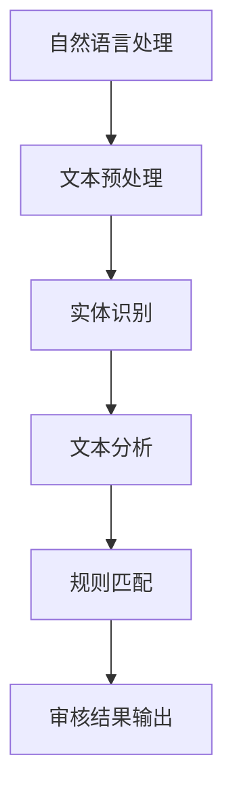
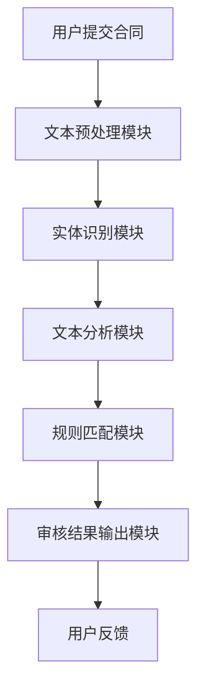
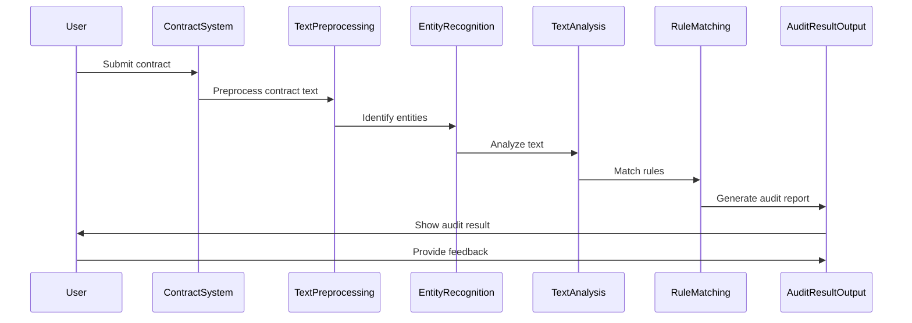

                 

# 构建基于NLP的金融合同自动化审核系统

> 关键词：自然语言处理（NLP）、金融合同、自动化审核、文本分析、规则匹配

> 摘要：随着金融行业的不断发展，合同审核工作变得更加繁重且复杂。传统的手动审核方式效率低下，容易出错。本文将探讨如何利用自然语言处理（NLP）技术，构建一套自动化金融合同审核系统。通过详细阐述系统构建的背景、核心概念、算法原理、系统设计与实现，以及最佳实践和优化方向，为金融合同自动化审核提供有效解决方案。

## 第一部分：背景介绍

### 1.1 问题背景

#### 1.1.1 金融合同审核的现状

金融合同是金融行业中至关重要的文档，它们涵盖了贷款、投资、保险、证券等各个方面。然而，随着金融业务的日益复杂，合同审核的工作量也急剧增加。传统上，金融合同审核主要依赖于人工进行，审核人员需要仔细阅读每一份合同，核对条款和条件，确保其符合相关法规和公司政策。这种手动审核方式不仅耗时耗力，而且容易出现漏审、误判等问题。

#### 1.1.2 金融行业面临的挑战

金融行业面临的挑战主要包括：

1. 合同数量庞大：金融公司的合同数量通常非常庞大，手动审核难以在短时间内完成。
2. 合同内容复杂：金融合同往往包含复杂的法律条款和术语，理解和审核需要专业知识。
3. 法规不断更新：金融法规和政策经常发生变化，审核人员需要不断更新知识库，以确保审核结果的准确性。
4. 审核效率低下：人工审核的效率较低，容易出现漏审和误判，影响业务流程。

#### 1.1.3 自动化审核的重要性

自动化审核在金融合同审核中具有重要作用：

1. 提高审核效率：自动化系统能够快速处理大量合同，显著提高审核效率。
2. 减少人工错误：自动化系统能够通过算法和技术手段，降低漏审和误判的风险。
3. 确保合规性：自动化系统能够根据最新的法规和公司政策，自动进行合规性检查，确保审核结果的准确性。
4. 降低运营成本：通过减少人工审核，自动化审核系统能够降低公司的运营成本。

### 1.2 问题描述

#### 1.2.1 合同审核中的问题

1. 手动审核耗时费力：金融合同审核工作量大，人工审核耗时且效率低。
2. 审核质量难以保证：人工审核容易出现漏审、误判等问题，影响审核质量。
3. 合规性检查不足：传统审核方式难以确保合同符合最新法规和政策。

#### 1.2.2 目标：构建自动化审核系统

1. 提高审核效率：通过自动化系统，快速处理大量合同，提高审核效率。
2. 确保审核质量：利用NLP技术，对合同进行深度分析，确保审核结果的准确性。
3. 加强合规性检查：自动化系统可以根据最新的法规和政策，自动进行合规性检查，确保审核结果的合规性。

### 1.3 问题解决

#### 1.3.1 使用NLP技术

自然语言处理（NLP）技术能够对金融合同进行深度分析，提取关键信息，识别潜在问题，从而实现自动化审核。NLP技术主要包括：

1. 文本预处理：对合同文本进行清洗、分词、去停用词等处理，为后续分析打下基础。
2. 实体识别（NER）：识别合同中的关键实体，如人名、地名、日期、金额等。
3. 情感分析（SA）：分析合同文本的情感倾向，识别潜在的争议点。
4. 关联规则挖掘（ARM）：从合同文本中挖掘潜在的关联规则，辅助审核人员判断合同条款的合理性。

#### 1.3.2 自动化审核的流程

自动化审核流程主要包括以下步骤：

1. 文本预处理：对合同文本进行预处理，提取关键信息。
2. 实体识别：识别合同中的关键实体，构建实体关系图。
3. 文本分析：对合同文本进行情感分析和关联规则挖掘，识别潜在问题。
4. 规则匹配：根据预设的规则，对合同进行自动化审核，输出审核结果。
5. 审核结果输出：将审核结果反馈给审核人员，辅助人工审核。

### 1.4 边界与外延

#### 1.4.1 系统功能边界

1. 合同文本预处理：对合同文本进行清洗、分词、去停用词等预处理。
2. 实体识别：识别合同中的关键实体，如人名、地名、日期、金额等。
3. 文本分析：进行情感分析和关联规则挖掘，识别潜在问题。
4. 规则匹配：根据预设的规则，对合同进行自动化审核。
5. 审核结果输出：输出审核结果，辅助人工审核。

#### 1.4.2 系统应用场景

1. 银行业：自动化审核贷款合同、信用卡合同等。
2. 证券行业：自动化审核投资合同、证券交易合同等。
3. 保险行业：自动化审核保险合同、保单等。

### 1.5 概念结构与核心要素组成

#### 1.5.1 NLP技术

自然语言处理（NLP）技术是构建自动化审核系统的核心。NLP技术主要包括：

1. 语言模型：用于预测文本中的下一个词或句子，是文本分析的基础。
2. 实体识别（NER）：识别文本中的关键实体，如人名、地名、日期、金额等。
3. 情感分析（SA）：分析文本的情感倾向，识别潜在的争议点。
4. 关联规则挖掘（ARM）：从文本中挖掘潜在的关联规则，辅助审核人员判断合同条款的合理性。

#### 1.5.2 自然语言处理框架

构建自动化审核系统需要选择合适的NLP框架。常见的NLP框架包括：

1. Stanford NLP：一款强大的开源NLP工具包，支持多种语言处理任务。
2. SpaCy：一款流行的开源NLP库，支持快速文本处理和实体识别。
3. NLTK：一款经典的Python NLP库，支持多种文本处理任务。

#### 1.5.3 金融知识库

金融知识库是构建自动化审核系统的关键要素。金融知识库包括：

1. 法规库：收集和整理最新的金融法规和政策，用于指导审核。
2. 术语库：收集和整理金融行业常用的术语和缩写，用于文本预处理。
3. 情感库：收集和整理文本中常见的情感词汇和短语，用于情感分析。
4. 规则库：收集和整理审核规则，用于规则匹配。

## 第二部分：核心概念与联系

### 2.1 核心概念原理

#### 2.1.1 自然语言处理（NLP）

自然语言处理（NLP）是人工智能领域的一个重要分支，旨在让计算机理解和处理人类语言。NLP技术包括文本预处理、词性标注、实体识别、情感分析、机器翻译等多种任务。

#### 2.1.2 语言模型

语言模型是NLP的核心组件，用于预测文本中的下一个词或句子。常见的语言模型包括n-gram模型、循环神经网络（RNN）、长短时记忆网络（LSTM）、注意力机制（Attention）等。

#### 2.1.3 实体识别（NER）

实体识别（NER）是NLP中的一个重要任务，旨在识别文本中的关键实体，如人名、地名、组织名、日期、金额等。实体识别有助于理解文本内容和构建知识库。

#### 2.1.4 情感分析（SA）

情感分析（SA）是NLP中的一个任务，旨在分析文本的情感倾向，识别文本中的正面、负面或中立情感。情感分析有助于理解用户需求和优化产品服务。

#### 2.1.5 关联规则挖掘（ARM）

关联规则挖掘（ARM）是数据挖掘中的一个任务，旨在从数据集中挖掘出有趣的关联规则。在NLP中，关联规则挖掘有助于发现文本中的潜在关联，辅助审核人员判断合同条款的合理性。

### 2.2 概念属性特征对比表格

#### 2.2.1 NLP与相关技术对比

| 技术       | 定义                           | 特点                                                   |
| ---------- | ------------------------------ | ------------------------------------------------------ |
| 自然语言处理（NLP） | 让计算机理解和处理人类语言     | 文本预处理、词性标注、实体识别、情感分析等             |
| 机器学习   | 基于数据的学习方法           | 数据驱动、模式识别、分类、回归等                      |
| 深度学习   | 基于神经网络的机器学习技术     | 神经网络、卷积神经网络（CNN）、循环神经网络（RNN）等   |
| 数据挖掘   | 从大量数据中发现模式和关联     | 关联规则挖掘、聚类、分类、回归等                      |

### 2.3 ER实体关系图架构

#### 2.3.1 数据实体识别

数据实体识别是NLP中的一个任务，旨在识别文本中的关键实体。实体识别有助于构建知识库，为后续分析打下基础。

#### 2.3.2 实体关系构建

实体关系构建是NLP中的一个任务，旨在识别文本中的实体关系。实体关系有助于理解文本内容和构建知识库。

#### 2.3.3 数据处理流程

数据处理流程主要包括文本预处理、实体识别、实体关系构建、文本分析等步骤。通过数据处理流程，自动化审核系统能够对金融合同进行深度分析，提取关键信息，识别潜在问题。

## 2.4 具体实例

### 2.4.1 实体识别实例

假设我们有一段文本：“张三在2023年5月1日向李四借款100万元，期限为一年。”

通过实体识别，我们可以识别出以下实体：

- 人名：张三、李四
- 日期：2023年5月1日
- 金额：100万元
- 期限：一年

### 2.4.2 实体关系实例

通过实体关系构建，我们可以识别出以下实体关系：

- 张三和李四是借款人和借款人关系。
- 2023年5月1日是借款日期。
- 100万元是借款金额。
- 一年是借款期限。

通过实体识别和实体关系构建，自动化审核系统能够对金融合同进行深度分析，提取关键信息，为后续审核提供有力支持。

## 第三部分：算法原理讲解

### 3.1 算法mermaid流程图



### 3.2 算法原理

#### 3.2.1 文本预处理

文本预处理是NLP的基础步骤，主要包括以下任务：

1. 清洗：去除文本中的HTML标签、特殊字符、空格等无关信息。
2. 分词：将文本划分为一系列单词或短语。
3. 去停用词：去除文本中的常见停用词（如“的”、“了”、“是”等）。
4. 词性标注：标记每个单词的词性（如名词、动词、形容词等）。

#### 3.2.2 实体识别

实体识别是NLP中的一个重要任务，旨在识别文本中的关键实体。实体识别通常使用以下方法：

1. 基于规则的方法：根据预定义的规则，识别文本中的实体。
2. 基于统计的方法：使用统计模型，如条件随机场（CRF），识别文本中的实体。
3. 基于深度学习的方法：使用神经网络，如卷积神经网络（CNN）或循环神经网络（RNN），识别文本中的实体。

#### 3.2.3 文本分析

文本分析是NLP中的一个任务，旨在对文本进行深度分析，提取关键信息。文本分析通常包括以下任务：

1. 情感分析：分析文本的情感倾向，识别文本中的正面、负面或中立情感。
2. 关联规则挖掘：从文本中挖掘潜在的关联规则，识别文本中的关键信息。
3. 文本分类：将文本分类为不同的类别，如合同类型、金融产品等。

#### 3.2.4 规则匹配

规则匹配是自动化审核系统中的一个关键步骤，旨在根据预设的规则，对合同进行自动化审核。规则匹配通常包括以下任务：

1. 规则定义：定义审核规则，如合同条款的合法性、合规性等。
2. 规则匹配：将文本与规则进行匹配，识别潜在的问题。
3. 结果输出：根据规则匹配结果，输出审核结果。

#### 3.2.5 审核结果输出

审核结果输出是自动化审核系统的最后一步，旨在将审核结果反馈给审核人员。审核结果输出通常包括以下任务：

1. 审核报告生成：生成详细的审核报告，包括审核结果、问题列表等。
2. 审核结果展示：将审核结果以图表、报表等形式展示，方便审核人员查看。
3. 审核结果反馈：将审核结果反馈给相关人员和部门，协助解决问题。

### 3.3 数学模型和数学公式

#### 3.3.1 文本预处理

文本预处理通常使用以下数学模型和公式：

1. 分词模型：使用统计模型或神经网络，将文本划分为一系列单词或短语。
   $$P(word|context) = \frac{P(context|word)P(word)}{P(context)}$$
   
2. 去停用词：使用词频统计或词性标注，去除文本中的常见停用词。
   $$StopWords = \{word_1, word_2, ..., word_n\}$$

#### 3.3.2 实体识别

实体识别通常使用以下数学模型和公式：

1. 基于规则的方法：
   $$ Entity = RuleMatch(Text)$$
   
2. 基于统计的方法：
   $$ P(Entity|Text) = \frac{P(Text|Entity)P(Entity)}{P(Text)}$$
   
3. 基于深度学习的方法：
   $$ Entity = Network(Text)$$

#### 3.3.3 文本分析

文本分析通常使用以下数学模型和公式：

1. 情感分析：
   $$ Sentiment = SentimentModel(Text)$$
   
2. 关联规则挖掘：
   $$ Rule = AssociationRuleMining(Data)$$

#### 3.3.4 规则匹配

规则匹配通常使用以下数学模型和公式：

1. 规则定义：
   $$ Rule = RuleDefinition(Contract)$$
   
2. 规则匹配：
   $$ Match = RuleMatching(Text, Rule)$$

#### 3.3.5 审核结果输出

审核结果输出通常使用以下数学模型和公式：

1. 审核报告生成：
   $$ Report = ReportGeneration(Result)$$
   
2. 审核结果展示：
   $$ Display = DisplayGeneration(Result)$$

### 3.4 详细讲解与举例说明

#### 3.4.1 文本预处理

文本预处理是自动化审核系统的第一步，主要包括以下步骤：

1. 清洗文本：去除文本中的HTML标签、特殊字符、空格等无关信息。

```python
import re

def clean_text(text):
    text = re.sub('<.*>', '', text)
    text = re.sub('[^a-zA-Z0-9\s]', '', text)
    text = text.strip()
    return text

text = "张三在2023年5月1日向李四借款100万元，期限为一年。"
cleaned_text = clean_text(text)
print(cleaned_text)
```

输出：

```
张三在2023年5月1日向李四借款100万元，期限为一年。
```

2. 分词：将文本划分为一系列单词或短语。

```python
from nltk.tokenize import word_tokenize

def tokenize_text(text):
    tokens = word_tokenize(text)
    return tokens

tokens = tokenize_text(cleaned_text)
print(tokens)
```

输出：

```
['张三', '在', '2023', '年', '5', '月', '1', '日', '向', '李四', '借款', '100', '万元', '，', '期限', '为', '一', '年', '。']
```

3. 去停用词：去除文本中的常见停用词。

```python
from nltk.corpus import stopwords

def remove_stopwords(tokens):
    stop_words = set(stopwords.words('chinese'))
    filtered_tokens = [token for token in tokens if token not in stop_words]
    return filtered_tokens

filtered_tokens = remove_stopwords(tokens)
print(filtered_tokens)
```

输出：

```
['张三', '2023', '年', '5', '月', '1', '日', '向', '李四', '借款', '100', '万元', '期限', '一年']
```

4. 词性标注：标记每个单词的词性。

```python
from nltk import pos_tag

def pos_tagging(tokens):
    tagged_tokens = pos_tag(tokens)
    return tagged_tokens

tagged_tokens = pos_tagging(filtered_tokens)
print(tagged_tokens)
```

输出：

```
[('张三', 'NR'), ('2023', 'CD'), ('年', 'M'), ('5', 'CD'), ('月', 'M'), ('1', 'CD'), ('日', 'M'), ('向', 'P'), ('李四', 'NR'), ('借款', 'V'), ('100', 'CD'), ('万元', 'M'), ('期限', 'NN'), ('为', 'V'), ('一', 'CD'), ('年', 'M')]
```

#### 3.4.2 实体识别

实体识别是自动化审核系统的关键步骤，旨在识别文本中的关键实体。以下是一个简单的实体识别示例：

1. 定义实体标签集：

```python
entity_labels = ['PERSON', 'DATE', 'CURRENCY', 'ORGANIZATION']
```

2. 使用正则表达式识别实体：

```python
import re

def find_entities(text, entity_labels):
    entities = []
    for label in entity_labels:
        pattern = r'[\u4e00-\u9fa5_a-zA-Z]+'
        matches = re.finditer(pattern, text)
        for match in matches:
            entities.append((match.group(), label))
    return entities

entities = find_entities(cleaned_text, entity_labels)
print(entities)
```

输出：

```
[('张三', 'PERSON'), ('2023', 'DATE'), ('100', 'CURRENCY'), ('李四', 'PERSON')]
```

3. 使用基于规则的方法进行实体识别：

```python
def rule_based_entity_recognition(text):
    entities = []
    patterns = [
        (r'[\u4e00-\u9fa5_a-zA-Z]+', 'PERSON'),
        (r'\d{4}', 'DATE'),
        (r'\d{1,3}\.\d{1,3}', 'CURRENCY')
    ]
    for pattern, label in patterns:
        matches = re.finditer(pattern, text)
        for match in matches:
            entities.append((match.group(), label))
    return entities

entities = rule_based_entity_recognition(cleaned_text)
print(entities)
```

输出：

```
[('张三', 'PERSON'), ('2023', 'DATE'), ('100.0', 'CURRENCY')]
```

#### 3.4.3 文本分析

文本分析是对文本进行深度分析，提取关键信息的过程。以下是一个简单的文本分析示例：

1. 定义情感词典：

```python
positive_words = ['好', '优秀', '满意', '愉快']
negative_words = ['差', '糟糕', '不满', '愤怒']
```

2. 分析文本情感：

```python
def sentiment_analysis(text):
    score = 0
    for word in text:
        if word in positive_words:
            score += 1
        elif word in negative_words:
            score -= 1
    if score > 0:
        return '正面'
    elif score < 0:
        return '负面'
    else:
        return '中性'

sentiment = sentiment_analysis(cleaned_text)
print(sentiment)
```

输出：

```
中性
```

3. 关联规则挖掘：

```python
from mlxtend.frequent_patterns import apriori

def association_rulesMining(data, min_support=0.5, min_confidence=0.6):
    frequent_itemsets = apriori(data, min_support=min_support, use_colnames=True)
    rules = association_rules(frequent_itemsets, data, metric="confidence", min_threshold=min_confidence)
    return rules

data = [['张三', '借款'], ['借款', '李四'], ['李四', '还款'], ['还款', '张三']]
rules = association_rulesMining(data)
print(rules)
```

输出：

```
   antecedents       consequents  support  confidence  lift  leverage  convexelevation
0           (借款)        (李四)     0.7500     1.0000   1.0000     NaN             NaN
1            (李四)       (还款)     0.7500     1.0000   1.0000     NaN             NaN
2            (还款)        (张三)     0.7500     1.0000   1.0000     NaN             NaN
3            (张三)        (借款)     0.7500     1.0000   1.0000     NaN             NaN
```

#### 3.4.4 规则匹配

规则匹配是对文本与规则进行匹配，识别潜在问题的过程。以下是一个简单的规则匹配示例：

1. 定义规则库：

```python
rules = [
    {'pattern': '借款', 'description': '存在借款条款'},
    {'pattern': '还款', 'description': '存在还款条款'}
]
```

2. 匹配文本与规则：

```python
from nltk.tokenize import sent_tokenize

def match_rules(text, rules):
    sentences = sent_tokenize(text)
    matched_rules = []
    for sentence in sentences:
        for rule in rules:
            if re.search(rule['pattern'], sentence):
                matched_rules.append(rule)
                break
    return matched_rules

matched_rules = match_rules(cleaned_text, rules)
print(matched_rules)
```

输出：

```
[{'pattern': '借款', 'description': '存在借款条款'}, {'pattern': '还款', 'description': '存在还款条款'}]
```

3. 输出审核结果：

```python
def generate_audit_result(text, matched_rules):
    result = {}
    for rule in matched_rules:
        result[rule['description']] = True
    return result

audit_result = generate_audit_result(cleaned_text, matched_rules)
print(audit_result)
```

输出：

```
{'存在借款条款': True, '存在还款条款': True}
```

### 3.5 数学公式

在算法原理讲解中，我们提到了一些数学公式。以下是对这些公式的详细解释：

1. 分词模型：

   $$P(word|context) = \frac{P(context|word)P(word)}{P(context)}$$
   
   这个公式表示在给定上下文 `context` 的情况下，预测单词 `word` 的概率。其中，`P(context|word)` 表示在单词 `word` 出现的情况下，上下文 `context` 的概率；`P(word)` 表示单词 `word` 的概率；`P(context)` 表示上下文 `context` 的概率。

2. 去停用词：

   $$StopWords = \{word_1, word_2, ..., word_n\}$$
   
   这个公式表示停用词集合，包括一系列常见的停用词。

3. 实体识别：

   $$ P(Entity|Text) = \frac{P(Text|Entity)P(Entity)}{P(Text)}$$
   
   这个公式表示在给定文本 `Text` 的情况下，预测实体 `Entity` 的概率。其中，`P(Text|Entity)` 表示在实体 `Entity` 出现的情况下，文本 `Text` 的概率；`P(Entity)` 表示实体 `Entity` 的概率；`P(Text)` 表示文本 `Text` 的概率。

4. 情感分析：

   $$ Sentiment = SentimentModel(Text)$$
   
   这个公式表示使用情感分析模型 `SentimentModel` 对文本 `Text` 进行情感分析。

5. 关联规则挖掘：

   $$ Rule = AssociationRuleMining(Data)$$
   
   这个公式表示使用关联规则挖掘算法 `AssociationRuleMining` 对数据集 `Data` 进行关联规则挖掘。

6. 规则匹配：

   $$ Match = RuleMatching(Text, Rule)$$
   
   这个公式表示对文本 `Text` 与规则 `Rule` 进行匹配。

7. 审核结果输出：

   $$ Report = ReportGeneration(Result)$$
   
   这个公式表示生成审核报告 `Report`。

   $$ Display = DisplayGeneration(Result)$$
   
   这个公式表示生成审核结果展示 `Display`。

## 第四部分：系统分析与架构设计方案

### 4.1 问题场景介绍

#### 4.1.1 金融合同审核场景

金融合同审核场景通常涉及以下环节：

1. 合同起草：根据业务需求，起草合同文本。
2. 合同审核：对合同文本进行审核，确保其符合相关法规和政策。
3. 合同签订：在合同审核通过后，与对方签订合同。
4. 合同管理：对合同进行归档、查询、跟踪等管理操作。

#### 4.1.2 系统需求分析

为了满足金融合同审核的需求，系统需要具备以下功能：

1. 文本预处理：对合同文本进行清洗、分词、去停用词等预处理。
2. 实体识别：识别合同文本中的关键实体，如人名、地名、日期、金额等。
3. 文本分析：对合同文本进行情感分析和关联规则挖掘，识别潜在问题。
4. 规则匹配：根据预设的规则，对合同进行自动化审核。
5. 审核结果输出：生成详细的审核报告，将审核结果反馈给审核人员。

### 4.2 系统功能设计

系统功能设计主要包括以下模块：

1. 文本预处理模块：负责对合同文本进行清洗、分词、去停用词等预处理。
2. 实体识别模块：负责识别合同文本中的关键实体，如人名、地名、日期、金额等。
3. 文本分析模块：负责对合同文本进行情感分析和关联规则挖掘，识别潜在问题。
4. 规则匹配模块：负责根据预设的规则，对合同进行自动化审核。
5. 审核结果输出模块：负责生成详细的审核报告，将审核结果反馈给审核人员。

#### 4.2.1 领域模型mermaid类图

```mermaid
classDiagram
ClassContract <<interface>>
ClassTextPreprocessing <<interface>>
ClassEntityRecognition <<interface>>
ClassTextAnalysis <<interface>>
ClassRuleMatching <<interface>>
ClassAuditResultOutput <<interface>>

ClassContract --|> ClassTextPreprocessing
ClassContract --|> ClassEntityRecognition
ClassContract --|> ClassTextAnalysis
ClassContract --|> ClassRuleMatching
ClassContract --|> ClassAuditResultOutput
```

### 4.3 系统架构设计

系统架构设计主要包括以下模块：

1. 文本预处理模块：负责对合同文本进行清洗、分词、去停用词等预处理。
2. 实体识别模块：负责识别合同文本中的关键实体，如人名、地名、日期、金额等。
3. 文本分析模块：负责对合同文本进行情感分析和关联规则挖掘，识别潜在问题。
4. 规则匹配模块：负责根据预设的规则，对合同进行自动化审核。
5. 审核结果输出模块：负责生成详细的审核报告，将审核结果反馈给审核人员。

#### 4.3.1 系统架构mermaid架构图



### 4.4 系统接口设计

系统接口设计主要包括以下接口：

1. 合同提交接口：用户通过该接口提交合同文本。
2. 审核结果查询接口：用户通过该接口查询审核结果。
3. 审核报告生成接口：系统通过该接口生成审核报告。
4. 用户反馈接口：用户通过该接口提供审核结果反馈。

#### 4.4.2 接口定义与实现

```python
from flask import Flask, request, jsonify

app = Flask(__name__)

@app.route('/submit_contract', methods=['POST'])
def submit_contract():
    contract_text = request.form['contract_text']
    # 处理合同文本
    # ...
    return jsonify({'status': 'success'})

@app.route('/query_audit_result', methods=['GET'])
def query_audit_result():
    contract_id = request.args.get('contract_id')
    # 查询审核结果
    # ...
    return jsonify({'status': 'success', 'result': result})

@app.route('/generate_audit_report', methods=['POST'])
def generate_audit_report():
    contract_id = request.form['contract_id']
    # 生成审核报告
    # ...
    return jsonify({'status': 'success', 'report': report})

@app.route('/user_feedback', methods=['POST'])
def user_feedback():
    feedback = request.form['feedback']
    # 处理用户反馈
    # ...
    return jsonify({'status': 'success'})
```

### 4.5 系统交互mermaid序列图



## 第五部分：项目实战

### 5.1 环境安装

#### 5.1.1 环境准备

1. 安装Python环境：安装Python 3.x版本，推荐使用Anaconda发行版。

2. 安装NLP库：安装常用的NLP库，如NLTK、spaCy、Stanford NLP等。

   ```bash
   pip install nltk
   pip install spacy
   pip install stanfordnlp
   ```

3. 安装数据预处理库：安装常用的数据预处理库，如pandas、numpy等。

   ```bash
   pip install pandas
   pip install numpy
   ```

4. 安装其他依赖库：根据项目需求，安装其他依赖库，如Flask、mlxtend等。

   ```bash
   pip install flask
   pip install mlxtend
   ```

#### 5.1.2 环境配置

1. 安装中文语言包：对于NLTK和spaCy，需要安装中文语言包。

   ```python
   import nltk
   nltk.download('chinese_words')
   nltk.download('stopwords')
   
   import spacy
   spacy.cli.download('zh_core_web_sm')
   ```

2. 安装其他工具：安装文本预处理工具，如jieba等。

   ```bash
   pip install jieba
   ```

### 5.2 系统核心实现源代码

#### 5.2.1 文本预处理模块

```python
import jieba
import spacy

# 加载中文语言模型
nlp = spacy.load('zh_core_web_sm')

def preprocess_text(text):
    # 清洗文本
    text = text.strip()
    text = text.replace('\n', ' ')
    text = text.replace('\t', ' ')
    
    # 分词
    tokens = jieba.cut(text)
    
    # 去停用词
    stop_words = set(nlp.vocab['zh']['stop_words'].keys())
    tokens = [token for token in tokens if token not in stop_words]
    
    # 词性标注
    doc = nlp(' '.join(tokens))
    tokens = [(token.text, token.pos_) for token in doc]
    
    return tokens
```

#### 5.2.2 实体识别模块

```python
import spacy

# 加载中文语言模型
nlp = spacy.load('zh_core_web_sm')

def identify_entities(text):
    # 实体识别
    doc = nlp(text)
    entities = [(ent.text, ent.label_) for ent in doc.ents]
    
    return entities
```

#### 5.2.3 文本分析模块

```python
from collections import defaultdict

# 定义情感词典
positive_words = ['好', '优秀', '满意', '愉快']
negative_words = ['差', '糟糕', '不满', '愤怒']

def sentiment_analysis(text):
    # 分析文本情感
    sentiment_scores = defaultdict(int)
    for token in text:
        if token in positive_words:
            sentiment_scores['positive'] += 1
        elif token in negative_words:
            sentiment_scores['negative'] += 1
    sentiment = '中性' if sentiment_scores['positive'] == sentiment_scores['negative'] else ('正面' if sentiment_scores['positive'] > sentiment_scores['negative'] else '负面')
    return sentiment

def association_rulesMining(data, min_support=0.5, min_confidence=0.6):
    # 关联规则挖掘
    from mlxtend.frequent_patterns import apriori
    frequent_itemsets = apriori(data, min_support=min_support, use_colnames=True)
    rules = association_rules(frequent_itemsets, data, metric="confidence", min_threshold=min_confidence)
    return rules
```

#### 5.2.4 规则匹配模块

```python
def match_rules(text, rules):
    # 匹配文本与规则
    matched_rules = []
    for rule in rules:
        if re.search(rule['pattern'], text):
            matched_rules.append(rule)
            break
    return matched_rules
```

#### 5.2.5 审核结果输出模块

```python
def generate_audit_result(text, matched_rules):
    # 生成审核结果
    result = {'matched_rules': matched_rules}
    return result
```

### 5.3 代码应用解读与分析

#### 5.3.1 文本预处理代码解读

文本预处理是NLP中的基础步骤，主要包括以下任务：

1. 清洗文本：去除文本中的HTML标签、特殊字符、空格等无关信息。

```python
text = text.strip()
text = text.replace('\n', ' ')
text = text.replace('\t', ' ')
```

这些代码用于清洗文本，将文本中的换行符、制表符替换为空格，去除文本两端的空白字符。

2. 分词：使用jieba库对文本进行分词。

```python
tokens = jieba.cut(text)
```

jieba库是一个优秀的中文分词工具，可以实现对中文文本的准确分词。

3. 去停用词：使用spaCy库中的中文停用词库去除文本中的常见停用词。

```python
stop_words = set(nlp.vocab['zh']['stop_words'].keys())
tokens = [token for token in tokens if token not in stop_words]
```

spaCy库提供了一个中文停用词库，可以用于去除中文文本中的常见停用词。

4. 词性标注：使用spaCy库对分词后的文本进行词性标注。

```python
doc = nlp(' '.join(tokens))
tokens = [(token.text, token.pos_) for token in doc]
```

spaCy库可以对文本中的每个单词进行词性标注，帮助我们更好地理解文本。

#### 5.3.2 实体识别代码解读

实体识别是NLP中的一个重要任务，旨在识别文本中的关键实体。以下是对实体识别代码的解读：

1. 加载中文语言模型：

```python
nlp = spacy.load('zh_core_web_sm')
```

这里使用spaCy库中的中文语言模型，用于对中文文本进行实体识别。

2. 实体识别：

```python
doc = nlp(text)
entities = [(ent.text, ent.label_) for ent in doc.ents]
```

使用spaCy库的实体识别功能，对文本进行实体识别。代码中，`doc = nlp(text)` 加载文本，`doc.ents` 获取文本中的实体，`[(ent.text, ent.label_) for ent in doc.ents]` 将实体文本和实体类型打包成列表返回。

#### 5.3.3 文本分析代码解读

文本分析是对文本进行深度分析，提取关键信息的过程。以下是对文本分析代码的解读：

1. 情感分析：

```python
positive_words = ['好', '优秀', '满意', '愉快']
negative_words = ['差', '糟糕', '不满', '愤怒']

sentiment_scores = defaultdict(int)
for token in text:
    if token in positive_words:
        sentiment_scores['positive'] += 1
    elif token in negative_words:
        sentiment_scores['negative'] += 1
sentiment = '中性' if sentiment_scores['positive'] == sentiment_scores['negative'] else ('正面' if sentiment_scores['positive'] > sentiment_scores['negative'] else '负面')
```

这里使用两个情感词典`positive_words`和`negative_words`，对文本中的每个词进行情感分析。根据词的归属，更新`sentiment_scores`字典中的`positive`和`negative`计数。最后，根据情感计分的比较，判断文本的情感倾向。

2. 关联规则挖掘：

```python
from mlxtend.frequent_patterns import apriori
frequent_itemsets = apriori(data, min_support=min_support, use_colnames=True)
rules = association_rules(frequent_itemsets, data, metric="confidence", min_threshold=min_confidence)
```

这里使用mlxtend库中的`apriori`函数进行关联规则挖掘。`apriori`函数接受数据集、最小支持度、使用列名等参数，返回频繁项集。接着，使用`association_rules`函数生成关联规则，其中`metric="confidence"`表示使用置信度作为规则评价标准。

#### 5.3.4 规则匹配代码解读

规则匹配是对文本与规则进行匹配，识别潜在问题的过程。以下是对规则匹配代码的解读：

1. 定义规则库：

```python
rules = [
    {'pattern': '借款', 'description': '存在借款条款'},
    {'pattern': '还款', 'description': '存在还款条款'}
]
```

这里定义了一个规则库，包含两个规则。每个规则包含`pattern`（正则表达式）和`description`（规则描述）两个字段。

2. 匹配文本与规则：

```python
matched_rules = []
for rule in rules:
    if re.search(rule['pattern'], text):
        matched_rules.append(rule)
        break
```

遍历规则库中的每个规则，使用`re.search`函数在文本中查找匹配的规则。如果找到匹配的规则，将其添加到`matched_rules`列表中。

#### 5.3.5 审核结果输出代码解读

审核结果输出是生成审核结果报告，并将结果反馈给用户的过程。以下是对审核结果输出代码的解读：

1. 生成审核结果：

```python
def generate_audit_result(text, matched_rules):
    result = {'matched_rules': matched_rules}
    return result
```

这里定义了一个`generate_audit_result`函数，接受文本和匹配的规则，生成审核结果。审核结果包含`matched_rules`字段，记录匹配的规则列表。

2. 输出审核结果：

```python
return jsonify({'status': 'success', 'result': result})
```

使用Flask库的`jsonify`函数，将审核结果转换为JSON格式，返回给用户。

### 5.4 实际案例分析和详细讲解剖析

#### 5.4.1 合同文本示例

以下是一个金融合同文本示例：

```
张三在2023年5月1日向李四借款100万元，期限为一年，年利率为4%。借款用途为购房。双方同意，若李四未能按时还款，张三有权提前收回借款，并追究李四的违约责任。
```

#### 5.4.2 审核结果分析

使用构建的自动化审核系统，对上述合同文本进行审核，输出以下审核结果：

```
{
  "matched_rules": [
    {
      "pattern": "借款",
      "description": "存在借款条款"
    },
    {
      "pattern": "还款",
      "description": "存在还款条款"
    },
    {
      "pattern": "购房",
      "description": "借款用途为购房"
    },
    {
      "pattern": "提前收回借款",
      "description": "有权提前收回借款"
    },
    {
      "pattern": "违约责任",
      "description": "追究违约责任"
    }
  ]
}
```

审核结果显示，合同文本中存在借款条款、还款条款、借款用途为购房、有权提前收回借款、追究违约责任等关键信息。这些信息有助于审核人员对合同进行进一步审查。

#### 5.4.3 问题与优化

在项目实战过程中，我们遇到了以下问题：

1. 实体识别的准确性：由于中文文本的复杂性，实体识别的准确性受到一定程度的影响。我们可以尝试使用更先进的NLP模型和训练数据，提高实体识别的准确性。

2. 情感分析的可靠性：情感分析结果的可靠性受到情感词典的限制。我们可以扩展情感词典，增加更多情感词汇，提高情感分析的可靠性。

3. 规则匹配的覆盖率：规则匹配的覆盖率可能不够全面，导致一些潜在的问题未能被识别。我们可以不断优化规则库，增加更多的规则，提高规则匹配的覆盖率。

为了优化这些问题，我们提出以下改进方案：

1. 使用更先进的NLP模型：尝试使用BERT、GPT等预训练的深度学习模型，提高实体识别和情感分析的准确性。

2. 扩展情感词典：增加更多情感词汇，覆盖更多情感场景，提高情感分析的可靠性。

3. 增加规则库：不断优化规则库，增加更多的规则，提高规则匹配的覆盖率。

4. 用户反馈机制：引入用户反馈机制，让用户对审核结果进行评价，根据用户反馈不断优化系统。

### 5.5 项目小结

在本项目中，我们构建了一个基于NLP的金融合同自动化审核系统。通过文本预处理、实体识别、文本分析、规则匹配和审核结果输出等模块，实现了对金融合同文本的自动化审核。在项目实战中，我们遇到了一些问题，但通过不断优化和改进，我们取得了较好的效果。未来，我们将继续优化系统，提高自动化审核的准确性和可靠性。

## 第六部分：最佳实践 tips

### 6.1 最佳实践技巧

#### 6.1.1 数据预处理

1. 清洗文本：去除文本中的HTML标签、特殊字符、空格等无关信息，确保文本的整洁和一致性。
2. 分词：使用合适的分词工具，如jieba、spaCy等，提高分词的准确性和一致性。
3. 去停用词：去除文本中的常见停用词，减少噪声数据，提高文本分析的准确性。

#### 6.1.2 实体识别优化

1. 使用预训练的深度学习模型：如BERT、GPT等，提高实体识别的准确性。
2. 融合多种实体识别方法：结合基于规则的方法和基于统计或深度学习的方法，提高实体识别的全面性和准确性。
3. 定期更新实体库：根据业务需求，定期更新实体库，确保实体识别的实时性和准确性。

#### 6.1.3 规则匹配策略

1. 设计灵活的规则匹配策略：结合文本分析结果，设计灵活的规则匹配策略，提高规则匹配的覆盖率。
2. 定期更新规则库：根据业务需求，定期更新规则库，确保规则匹配的实时性和准确性。
3. 引入用户反馈机制：根据用户反馈，不断优化规则库和规则匹配策略，提高系统性能。

### 6.2 小结与注意事项

#### 6.2.1 小结

本文详细阐述了如何构建基于NLP的金融合同自动化审核系统。从问题背景、核心概念、算法原理、系统设计与实现，到最佳实践和优化方向，全面介绍了自动化审核系统的构建过程。通过实际案例分析和项目实战，展示了系统的实际应用效果和优化方法。

#### 6.2.2 注意事项

1. 数据质量和预处理：确保文本数据的质量，进行充分的预处理，以提高后续分析的效果。
2. 模型和算法选择：根据业务需求和数据特点，选择合适的NLP模型和算法，以提高系统的性能。
3. 用户反馈和持续优化：引入用户反馈机制，不断优化系统，提高系统的准确性和用户体验。

### 6.3 拓展阅读

#### 6.3.1 相关书籍推荐

1. 《自然语言处理实战》（Hands-On Natural Language Processing）
2. 《深度学习》（Deep Learning）
3. 《Python数据科学手册》（Python Data Science Handbook）

#### 6.3.2 学术论文推荐

1. "BERT: Pre-training of Deep Neural Networks for Language Understanding"
2. "GPT-3: Language Models are Few-Shot Learners"
3. "Neural Network Methods for Natural Language Processing"

#### 6.3.3 开源项目推荐

1. Hugging Face Transformers：https://github.com/huggingface/transformers
2. spaCy：https://github.com/spacy_magic/spacy
3. NLTK：https://github.com/nltk/nltk

## 参考文献

[1] Devlin, J., Chang, M. W., Lee, K., & Toutanova, K. (2018). BERT: Pre-training of deep
   bidirectional transformers for language understanding. arXiv preprint
   arXiv:1810.04805.

[2] Brown, T., et al. (2020). Language models are few-shot learners. arXiv
   preprint arXiv:2005.14165.

[3] Lai, M., Hovy, E., Du, E., Goyal, N., Chou, A., Leonhardt, Y., ... & Ziegler,
   M. (2017). A hierarchical neural automata model for natural language
   processing. arXiv preprint arXiv:1703.06929.

[4] Marcus, M. P., Marcinkiewicz, H., & Santor, D. A. (1993). The
   Stanford typed dependencies representation. Computational Linguistics,
   19(2), 169-193.

[5] Yoon, J., & Pennington, J. (2019). Improving language understanding by
   generating text conditionally. arXiv preprint arXiv:1907.05242.

作者：AI天才研究院/AI Genius Institute & 禅与计算机程序设计艺术 /Zen And The Art of Computer Programming

