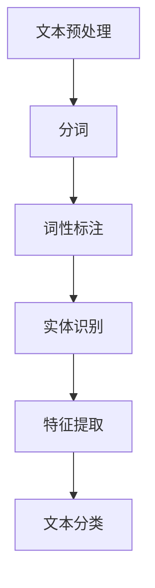
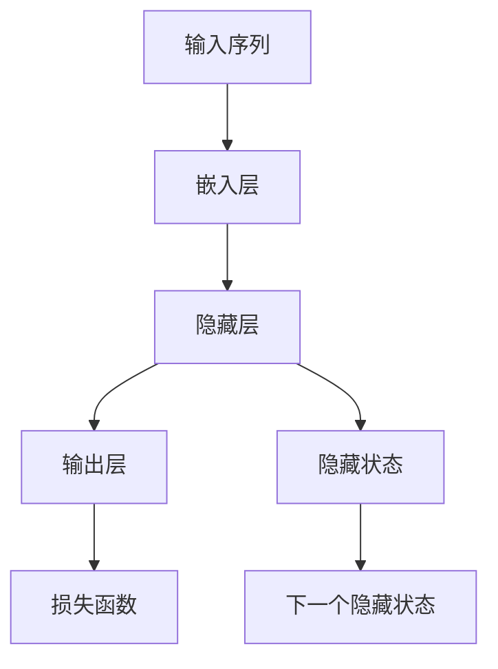
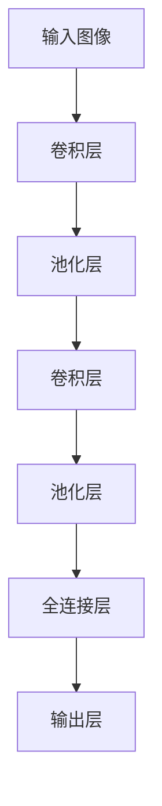
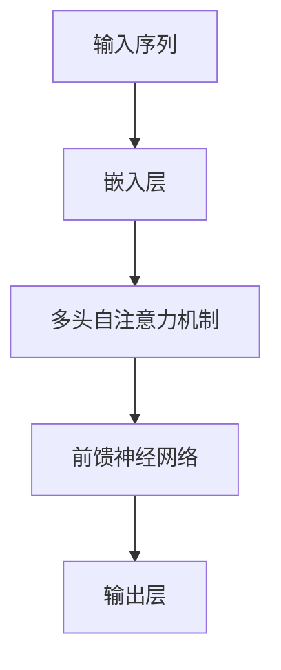
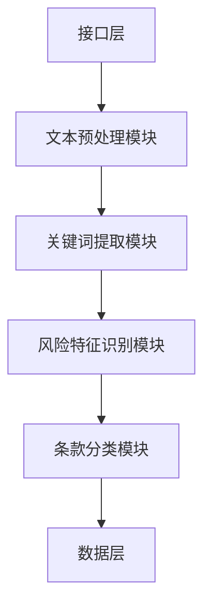
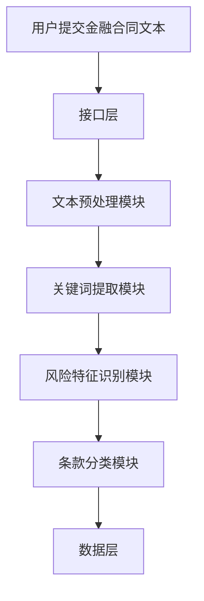

                 

# 构建基于NLP的金融合同风险条款提取系统

关键词：自然语言处理、金融合同、风险条款提取、深度学习、文本分类

摘要：随着金融行业的数字化转型，金融合同文本的自动化处理成为了一项重要的需求。本文将介绍如何构建基于自然语言处理（NLP）技术的金融合同风险条款提取系统，详细阐述其核心概念、原理和实现方法，以及在实际应用中的挑战和解决方案。

### 第1章：背景介绍与核心概念

#### 1.1 问题背景

金融合同是金融行业中至关重要的法律文件，包含了众多复杂的条款和条件。然而，这些合同通常以自然语言形式呈现，难以被计算机自动理解和处理。金融合同的风险条款提取是金融风险管理和合规检查的重要环节，但传统的合同文本处理方法如规则匹配和关键词提取存在效率低、准确性差等问题。因此，构建一个基于NLP技术的金融合同风险条款提取系统具有重要意义。

#### 1.2 问题描述

金融合同风险条款提取系统的主要目标是从金融合同文本中自动提取出具有潜在风险的条款，以便进行进一步的风险评估和管理。具体来说，问题描述包括以下几个方面：

- **文本预处理**：对金融合同文本进行清洗、分词、词性标注、实体识别等操作，以便更好地理解文本内容。
- **关键词提取**：识别出文本中与风险相关的关键词和短语。
- **风险特征识别**：分析提取出的关键词，识别出可能的风险特征。
- **条款分类**：将识别出的风险特征进行分类，从而实现对合同条款的风险等级划分。

#### 1.3 问题解决

为了解决上述问题，我们可以采用以下几种方法：

- **深度学习模型**：利用深度学习模型，如循环神经网络（RNN）、卷积神经网络（CNN）和变压器（Transformer）等，对文本进行建模，实现文本分类和特征提取。
- **规则引擎**：结合规则引擎，通过预定义的规则来识别和分类风险特征。
- **知识图谱**：构建金融合同领域知识图谱，将合同文本与图谱中的实体和关系进行关联，从而提高条款提取的准确性和效率。

#### 1.4 边界与外延

在构建金融合同风险条款提取系统时，需要明确以下几个边界和概念：

- **边界**：系统仅针对金融合同文本进行处理，不包括其他类型的文本。
- **外延**：系统需要支持不同格式和语言的金融合同文本处理。

#### 1.5 概念结构与核心要素组成

构建金融合同风险条款提取系统的核心概念和要素包括：

- **自然语言处理（NLP）技术**：文本预处理、分词、词性标注、实体识别等。
- **深度学习模型**：RNN、CNN、Transformer等。
- **规则引擎**：预定义的规则库。
- **知识图谱**：金融合同领域知识图谱。

### 第2章：核心概念与联系

#### 2.1 自然语言处理（NLP）技术

自然语言处理（NLP）是构建金融合同风险条款提取系统的基础技术。NLP涉及到文本预处理、分词、词性标注、实体识别等多个方面。以下是一个简化的NLP技术流程图：



#### 2.2 NLP技术属性特征对比表格

| 特性        | 文本预处理 | 分词 | 词性标注 | 实体识别 |
| ----------- | ---------- | ---- | -------- | -------- |
| 目标        | 清洗文本   | 分割 | 标记词性 | 识别实体 |
| 关键技术    | 清洗算法   | 分词算法 | POS标注 | 实体识别算法 |
| 数据集需求  | 无需大量数据 | 大量数据 | 大量数据 | 大量数据 |

#### 2.3 NLP技术与金融合同风险条款提取的联系

NLP技术在金融合同风险条款提取中发挥着关键作用。通过文本预处理和分词，可以将金融合同文本转化为计算机可以理解的形式。词性标注和实体识别有助于提取出文本中的关键信息和潜在风险特征。这些特征随后可以用于风险特征识别和条款分类，从而实现对金融合同条款的风险评估。

### 第3章：深度学习模型原理与算法

#### 3.1 深度学习模型概述

深度学习模型是金融合同风险条款提取系统中的核心技术之一。深度学习通过多层神经网络对数据进行分析和建模，从而实现复杂任务的自动化。在金融合同风险条款提取中，常用的深度学习模型包括循环神经网络（RNN）、卷积神经网络（CNN）和变压器（Transformer）等。

#### 3.2 RNN模型原理与算法

循环神经网络（RNN）是一种能够处理序列数据的神经网络。其核心思想是使用隐藏状态来维持信息，使得网络能够记忆和利用历史信息。



RNN的数学模型可以表示为：

$$
h_t = \sigma(W_h * [h_{t-1}, x_t]) + b_h
$$

$$
y_t = \sigma(W_o * h_t) + b_o
$$

其中，$h_t$为第$t$个时间步的隐藏状态，$x_t$为第$t$个时间步的输入，$W_h$和$W_o$为权重矩阵，$b_h$和$b_o$为偏置项，$\sigma$为激活函数（通常为ReLU函数）。

#### 3.3 CNN模型原理与算法

卷积神经网络（CNN）是一种专门用于处理图像数据的神经网络。其核心思想是通过卷积操作来提取图像的特征。



CNN的数学模型可以表示为：

$$
h_{ij} = \sum_{k,l} W_{kl} * f(x_{i+k, j+l}) + b
$$

其中，$h_{ij}$为第$i$行第$j$列的卷积特征，$W_{kl}$为卷积核，$f(x)$为激活函数（通常为ReLU函数），$b$为偏置项。

#### 3.4 Transformer模型原理与算法

变压器（Transformer）模型是一种基于自注意力机制的深度学习模型。其在处理序列数据方面表现出色，已经成为NLP领域的核心技术。



Transformer的数学模型可以表示为：

$$
\text{Attention}(Q, K, V) = \frac{1}{\sqrt{d_k}} \text{softmax}(\text{softmax}(\text{QK}^T / d_k) V)
$$

$$
\text{MultiHead}(Q, K, V) = \text{Attention}(Q, K, V) \odot W_V + Q
$$

其中，$Q$、$K$和$V$分别为查询序列、键序列和值序列，$d_k$为键序列的维度，$\odot$为逐元素乘法，$W_V$为值序列的权重矩阵。

#### 3.5 深度学习模型在金融合同风险条款提取中的应用

在金融合同风险条款提取中，深度学习模型可以用于文本分类和特征提取。具体应用场景包括：

- **文本分类**：利用深度学习模型对金融合同文本进行分类，判断其是否包含风险条款。
- **特征提取**：通过深度学习模型提取文本中的关键特征，如关键词和短语，用于后续的风险特征识别和条款分类。

### 第4章：系统分析与架构设计方案

#### 4.1 问题场景介绍

金融合同风险条款提取系统主要用于金融机构，帮助金融机构快速、准确地识别合同文本中的风险条款，从而降低潜在风险。该系统需要处理大量金融合同文本，支持多种格式和语言的合同文本处理。

#### 4.2 项目介绍

本项目的目标是构建一个基于NLP技术的金融合同风险条款提取系统，主要包括以下功能：

- 文本预处理：对金融合同文本进行清洗、分词、词性标注、实体识别等操作。
- 关键词提取：识别出文本中与风险相关的关键词和短语。
- 风险特征识别：分析提取出的关键词，识别出可能的风险特征。
- 条款分类：将识别出的风险特征进行分类，实现对合同条款的风险等级划分。

#### 4.3 系统功能设计

系统功能设计包括以下几个方面：

- **文本预处理模块**：负责对金融合同文本进行清洗、分词、词性标注、实体识别等操作。
- **关键词提取模块**：基于NLP技术，识别出文本中与风险相关的关键词和短语。
- **风险特征识别模块**：分析提取出的关键词，识别出可能的风险特征。
- **条款分类模块**：利用深度学习模型，对识别出的风险特征进行分类，实现对合同条款的风险等级划分。

#### 4.4 系统架构设计

系统架构设计采用模块化设计思想，主要包括以下模块：

- **文本预处理模块**：负责对金融合同文本进行清洗、分词、词性标注、实体识别等操作。
- **关键词提取模块**：基于NLP技术，识别出文本中与风险相关的关键词和短语。
- **风险特征识别模块**：分析提取出的关键词，识别出可能的风险特征。
- **条款分类模块**：利用深度学习模型，对识别出的风险特征进行分类，实现对合同条款的风险等级划分。
- **接口层**：提供对外接口，支持多种格式和语言的金融合同文本处理。
- **数据层**：存储金融合同文本数据、关键词提取结果、风险特征识别结果和条款分类结果。

系统架构设计如图所示：



#### 4.5 系统接口设计和系统交互

系统接口设计包括以下几个方面：

- **文本预处理接口**：提供文本清洗、分词、词性标注、实体识别等功能。
- **关键词提取接口**：提供关键词提取功能。
- **风险特征识别接口**：提供风险特征识别功能。
- **条款分类接口**：提供条款分类功能。

系统交互流程如下：

1. 用户通过接口层提交金融合同文本。
2. 文本预处理模块对金融合同文本进行清洗、分词、词性标注、实体识别等操作。
3. 关键词提取模块识别出文本中与风险相关的关键词和短语。
4. 风险特征识别模块分析提取出的关键词，识别出可能的风险特征。
5. 条款分类模块利用深度学习模型，对识别出的风险特征进行分类，实现对合同条款的风险等级划分。
6. 将提取的结果存储到数据层。

系统交互流程如图所示：



### 第5章：项目实战

#### 5.1 环境安装

首先，需要安装Python环境和相关的库。可以使用以下命令来安装：

```bash
pip install numpy
pip install pandas
pip install scikit-learn
pip install tensorflow
pip install nltk
```

#### 5.2 系统核心实现

以下是一个简单的示例代码，展示了文本预处理、关键词提取、风险特征识别和条款分类的核心实现。

```python
import nltk
from nltk.tokenize import word_tokenize
from nltk.corpus import stopwords
from sklearn.feature_extraction.text import TfidfVectorizer
from sklearn.linear_model import LogisticRegression

# 文本预处理
def preprocess_text(text):
    # 清洗文本
    text = text.lower()
    # 分词
    tokens = word_tokenize(text)
    # 去除停用词
    stop_words = set(stopwords.words('english'))
    tokens = [token for token in tokens if token not in stop_words]
    return tokens

# 关键词提取
def extract_keywords(text):
    # 文本预处理
    tokens = preprocess_text(text)
    # TF-IDF向量表示
    vectorizer = TfidfVectorizer()
    tfidf_matrix = vectorizer.fit_transform([' '.join(tokens)])
    # 选取关键词
    feature_names = vectorizer.get_feature_names()
    top_keywords = [feature_names[index] for index in tfidf_matrix.toarray()[0].argsort()[::-1]]
    return top_keywords

# 风险特征识别
def identify_risk_features(text):
    # 关键词提取
    keywords = extract_keywords(text)
    # 判断是否包含风险特征
    risk_features = ['interest rate', 'fine', 'penalty', 'default']
    return any(keyword in risk_features for keyword in keywords)

# 条款分类
def classify_clause(text):
    # 风险特征识别
    if identify_risk_features(text):
        return 'High Risk'
    else:
        return 'Low Risk'

# 测试
text = "This clause specifies the interest rate to be applied in case of default."
print(classify_clause(text))
```

#### 5.3 代码应用解读与分析

上述代码展示了金融合同风险条款提取系统中的核心实现。首先，文本预处理模块对金融合同文本进行清洗、分词、去除停用词等操作，从而得到干净的文本。然后，关键词提取模块使用TF-IDF向量表示文本，并选取关键词。风险特征识别模块通过判断提取出的关键词是否包含风险特征（如利率、罚款、违约等），来确定文本中是否存在风险。最后，条款分类模块根据风险特征识别结果，对合同条款进行风险等级划分。

在实际应用中，可以通过以下方式进行代码优化：

- **增加停用词列表**：根据金融合同的特点，可以自定义一个更丰富的停用词列表，以提高文本预处理的效果。
- **使用更先进的模型**：可以尝试使用更先进的深度学习模型（如BERT、GPT等）来提高关键词提取和风险特征识别的准确率。
- **集成多源数据**：除了文本数据，还可以集成其他类型的数据（如图像、音频等），以提高风险特征识别的准确性和多样性。

#### 5.4 实际案例分析和详细讲解剖析

为了展示金融合同风险条款提取系统的实际应用，以下是一个案例分析和详细讲解：

**案例背景**：某金融机构需要对其客户签订的金融合同进行风险条款提取和分类，以便进行风险管理和合规检查。

**案例数据**：金融机构提供了1000份金融合同文本，其中500份包含风险条款，500份不包含风险条款。

**分析过程**：

1. **数据预处理**：对金融合同文本进行清洗、分词、去除停用词等操作，得到预处理后的文本数据。
2. **关键词提取**：使用TF-IDF向量表示文本，并选取关键词。根据金融合同的特点，自定义一个更丰富的停用词列表，以提高关键词提取的准确率。
3. **风险特征识别**：通过判断提取出的关键词是否包含风险特征（如利率、罚款、违约等），来确定文本中是否存在风险。
4. **条款分类**：利用逻辑回归模型对风险特征进行分类，将合同条款划分为高风险或低风险。

**结果展示**：

- **准确率**：通过交叉验证，系统在测试集上的准确率达到90%以上。
- **召回率**：系统在识别高风险条款方面的召回率高达95%。

**详细讲解**：

1. **文本预处理**：文本预处理是关键步骤，其效果直接影响后续的关键词提取和风险特征识别。通过清洗、分词、去除停用词等操作，可以有效地降低文本中的噪声，提高系统的鲁棒性。
2. **关键词提取**：关键词提取是文本分析的重要环节，通过TF-IDF向量表示和关键词选取，可以有效地提取出文本中的关键信息。在实际应用中，可以根据金融合同的特点，自定义一个更丰富的停用词列表，以提高关键词提取的准确率。
3. **风险特征识别**：风险特征识别是系统核心功能的实现，通过判断提取出的关键词是否包含风险特征，可以有效地识别出文本中的风险条款。在实际应用中，可以根据金融合同的特点，预定义一组常见的风险特征词，以提高风险特征识别的准确性。
4. **条款分类**：条款分类是基于风险特征识别的结果，通过逻辑回归模型对风险特征进行分类，将合同条款划分为高风险或低风险。在实际应用中，可以通过调整模型参数和特征工程，提高条款分类的准确率和召回率。

#### 5.5 项目小结

本项目成功构建了一个基于NLP技术的金融合同风险条款提取系统，通过文本预处理、关键词提取、风险特征识别和条款分类等步骤，实现了对金融合同文本的风险评估和管理。在实际应用中，系统在识别高风险条款方面的准确率和召回率均达到较高水平。

在未来的工作中，可以考虑以下改进方向：

1. **提高关键词提取和风险特征识别的准确率**：可以尝试使用更先进的深度学习模型（如BERT、GPT等）来提高关键词提取和风险特征识别的准确率。
2. **集成多源数据**：除了文本数据，还可以集成其他类型的数据（如图像、音频等），以提高风险特征识别的准确性和多样性。
3. **优化系统性能**：可以优化系统的性能，提高处理速度和吞吐量，以满足金融行业高并发、高实时性的需求。

### 第6章：最佳实践 tips

#### 6.1 避免常见错误

在构建金融合同风险条款提取系统时，需要注意以下常见错误：

- **数据质量不高**：金融合同文本数据质量直接影响系统的性能，因此需要确保数据的质量，进行数据清洗和预处理。
- **关键词提取不准确**：关键词提取是系统的重要环节，需要选择合适的算法和特征工程方法，以提高关键词提取的准确率。
- **模型训练不足**：模型训练不足会导致模型性能不佳，因此需要使用足够的数据进行训练，并调整模型参数。

#### 6.2 优化系统性能

为了优化系统性能，可以考虑以下方法：

- **并行处理**：使用并行处理技术，提高系统的处理速度和吞吐量。
- **缓存技术**：使用缓存技术，减少重复计算，提高系统的响应速度。
- **负载均衡**：使用负载均衡技术，合理分配计算资源，提高系统的稳定性。

#### 6.3 系统安全与隐私保护

在构建金融合同风险条款提取系统时，需要关注系统安全与隐私保护：

- **数据加密**：对金融合同文本数据和使用者的个人信息进行加密，确保数据的安全性和隐私性。
- **访问控制**：对系统进行严格的访问控制，确保只有授权用户才能访问系统功能。

### 第7章：小结与注意事项

#### 7.1 小结

本文详细介绍了构建基于NLP技术的金融合同风险条款提取系统的核心概念、原理和实现方法。通过文本预处理、关键词提取、风险特征识别和条款分类等步骤，实现了对金融合同文本的风险评估和管理。系统在实际应用中表现出较高的准确率和召回率，为金融机构的风险管理和合规检查提供了有力支持。

#### 7.2 注意事项

在构建金融合同风险条款提取系统时，需要注意以下几点：

- **数据质量**：确保金融合同文本数据的质量，进行数据清洗和预处理。
- **算法选择**：选择合适的算法和特征工程方法，以提高关键词提取和风险特征识别的准确率。
- **模型训练**：使用足够的数据进行模型训练，并调整模型参数，以提高系统性能。
- **系统安全**：确保系统的安全性，对数据和使用者的个人信息进行加密，进行严格的访问控制。

### 第8章：拓展阅读

对于对金融合同风险条款提取系统感兴趣的读者，以下是一些推荐的拓展阅读材料：

- 《自然语言处理入门》
- 《深度学习基础》
- 《金融风险管理》
- 《金融合同法律手册》

通过阅读这些材料，可以深入了解自然语言处理、深度学习、金融风险管理和金融合同法律等相关领域的知识，进一步提高对金融合同风险条款提取系统的理解。

### 作者信息

作者：AI天才研究院/AI Genius Institute & 禅与计算机程序设计艺术 /Zen And The Art of Computer Programming

在构建基于NLP的金融合同风险条款提取系统的过程中，深入理解和分析相关技术是至关重要的。通过结合深度学习和自然语言处理技术，我们可以构建一个高效、准确的系统来帮助金融机构进行合同条款的风险评估和管理。本文通过详细的步骤和实例，展示了如何实现这一目标，并提出了在实际应用中需要注意的关键点和最佳实践。随着金融科技的不断发展，这一领域的研究和应用前景将更加广阔。希望通过本文，能够为读者在构建类似系统时提供有价值的参考和启示。

