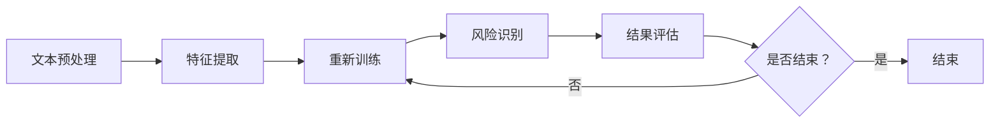
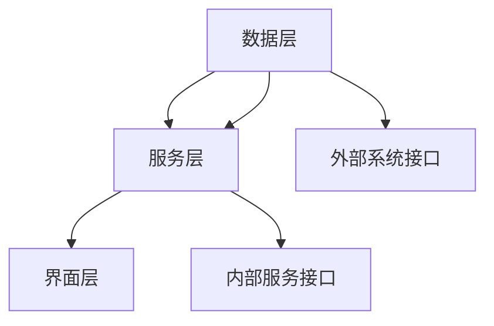
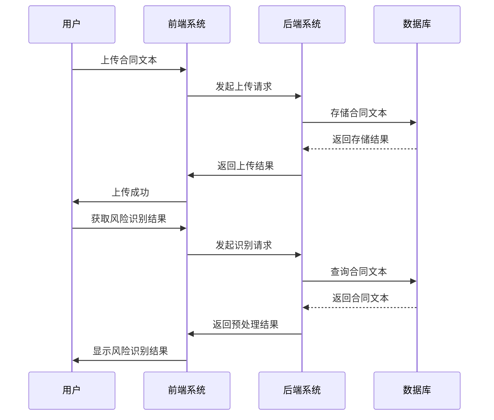

                 

### 第1章: 背景介绍

#### 1.1 问题背景

在金融行业中，合同的管理与风险控制至关重要。金融合同不仅涉及到银行、保险公司、证券公司等金融机构，还涉及个人和企业之间的借贷、投资、抵押等多种形式。这些合同往往包含大量的法律条文、业务条款和技术细节，使得管理和审核工作变得异常复杂且耗时。尤其是风险识别，对于金融合同的审查和风险控制有着重要意义。

当前，金融合同的风险识别主要依赖于人工审核，这种方式不仅效率低下，还容易受到人为因素的影响，导致错误率和漏检率较高。随着人工智能技术的发展，尤其是自然语言处理（NLP）的进步，利用机器学习算法和深度学习模型来自动识别金融合同中的潜在风险成为可能。

#### 1.2 问题描述

金融合同风险识别的主要任务是从大量的合同文本中自动提取关键信息，并识别出可能存在的风险点。具体来说，问题可以分解为以下几个子问题：

1. **文本理解**：如何准确理解和处理金融合同中的自然语言文本？
2. **信息提取**：如何从文本中高效地提取出关键的合同条款、责任界定、时间期限等信息？
3. **风险识别**：如何基于提取的信息识别出潜在的风险点？
4. **决策支持**：如何将这些风险信息转化为决策支持，以辅助金融从业者进行风险控制和决策？

#### 1.3 问题解决

针对上述问题，可以采用以下解决方案：

1. **文本理解**：使用NLP技术对金融合同文本进行预处理，包括分词、词性标注、命名实体识别等，以实现文本的理解。
2. **信息提取**：结合规则和机器学习算法，从预处理后的文本中提取关键信息，如条款、责任、期限等。
3. **风险识别**：利用已提取的信息，结合预定的风险规则库，自动识别出合同中的风险点。
4. **决策支持**：将识别出的风险信息进行分类和评估，形成决策支持报告，供金融从业者参考。

#### 1.4 边界与外延

在构建金融合同风险识别系统时，需要明确系统的边界和适用范围。边界主要包括：

- **合同类型**：系统应能处理各种金融合同，包括但不限于借贷合同、保险合同、证券合同等。
- **合同规模**：系统应能处理大规模的合同数据，适应不同的业务场景。
- **数据质量**：系统应具有一定的容错能力，能够处理部分文本数据的不完整或不规范问题。

外延方面，系统应具备以下扩展能力：

- **动态更新**：能够根据业务需求动态更新风险规则库，以适应不断变化的市场环境和法规要求。
- **跨平台部署**：支持在不同的操作系统和硬件平台上部署，以适应不同的业务需求。

#### 1.5 概念结构与核心要素组成

金融合同风险识别系统由以下几个核心部分组成：

- **文本预处理模块**：包括分词、词性标注、命名实体识别等功能。
- **信息提取模块**：利用规则和机器学习算法从文本中提取关键信息。
- **风险识别模块**：结合风险规则库，识别合同中的潜在风险点。
- **决策支持模块**：对识别出的风险信息进行分类和评估，形成决策支持报告。

每个模块都有其特定的功能和实现方法，通过协同工作，共同实现金融合同风险识别的目标。

通过上述分析和结构设计，我们可以清晰地看到构建基于NLP的金融合同风险识别系统的必要性和可行性。接下来的章节将详细探讨NLP技术、金融合同文本分析、风险识别算法原理以及系统架构和实现细节。### 第2章: 核心概念与联系

在构建基于NLP的金融合同风险识别系统时，理解并正确应用相关核心概念是至关重要的。本章将详细介绍NLP的基本概念、属性特征，并使用ER实体关系图来展示这些概念之间的联系。

#### 2.1 核心概念原理

**自然语言处理（NLP）**：NLP是计算机科学、人工智能和语言学领域的交叉学科，旨在让计算机理解和生成自然语言。其主要目标包括文本理解、语言生成、机器翻译、情感分析等。

**文本预处理**：文本预处理是NLP的基础步骤，包括分词、去停用词、词性标注、句法分析和实体识别等。这些步骤有助于将原始文本转换为结构化的数据，以便后续处理。

**命名实体识别（NER）**：NER是识别文本中的特定实体，如人名、地名、组织名、时间等。这是金融合同分析中至关重要的一步，因为很多合同条款涉及到具体的实体。

**关系抽取**：关系抽取是识别文本中实体之间的关系，如“公司A与银行B之间存在贷款关系”。这对于理解合同中的条款和条款之间的逻辑关系至关重要。

**语义角色标注**：语义角色标注是识别句子中每个词的语义角色，如主语、谓语、宾语等。这对于理解合同条款的语法结构和含义至关重要。

**文本分类**：文本分类是将文本数据分类到预定义的类别中。在金融合同风险识别中，可以使用文本分类来识别合同中是否存在风险。

**风险规则库**：风险规则库是包含特定业务领域风险规则的数据库。这些规则用于识别合同中的潜在风险点。

#### 2.2 概念属性特征对比表格

以下是一个简化的概念属性特征对比表格，用于展示上述核心概念的主要特征：

| 概念 | 特征 |
| --- | --- |
| 自然语言处理（NLP） | 文本理解、语言生成、机器翻译、情感分析等 |
| 文本预处理 | 分词、去停用词、词性标注、句法分析、实体识别 |
| 命名实体识别（NER） | 识别特定实体（人名、地名、组织名、时间等） |
| 关系抽取 | 识别文本中实体之间的关系 |
| 语义角色标注 | 识别句子中的语义角色（主语、谓语、宾语等） |
| 文本分类 | 将文本分类到预定义的类别中 |
| 风险规则库 | 包含特定业务领域风险规则的数据库 |

#### 2.3 ER实体关系图架构

为了更直观地展示核心概念之间的联系，我们可以使用ER（实体关系）图来描述。以下是一个简化的ER图示例：

```mermaid
erDiagram
    Contract ||--o> TextPreprocessing : 文本预处理
    Contract ||--o> NamedEntityRecognition : 命名实体识别
    Contract ||--o> RelationshipExtraction : 关系抽取
    Contract ||--o> SemanticRoleLabeling : 语义角色标注
    Contract ||--o> TextClassification : 文本分类
    Contract ||--o> RiskRuleBase : 风险规则库

    TextPreprocessing ||--|{ Contract
    NamedEntityRecognition ||--|{ Contract
    RelationshipExtraction ||--|{ Contract
    SemanticRoleLabeling ||--|{ Contract
    TextClassification ||--|{ Contract
    RiskRuleBase ||--|{ Contract
```

在这个ER图中，每个实体都与其他实体之间存在一定的关系，这些关系反映了金融合同风险识别系统中不同模块之间的交互和依赖。

通过上述核心概念与联系的分析，我们可以更好地理解金融合同风险识别系统的构建原理和实现方法。在接下来的章节中，我们将深入探讨NLP的基本原理和应用场景，为后续的风险识别算法讲解和系统设计奠定基础。### 第3章: NLP基本原理

#### 3.1 NLP概述

自然语言处理（NLP）是人工智能（AI）的一个重要分支，旨在使计算机能够理解、生成和响应自然语言。NLP的核心目标是解决人与机器之间的语言交互问题，使得计算机能够处理自然语言文本，从而实现自动化的文本分析、信息提取和智能问答等功能。

NLP的基本任务可以分为以下几类：

1. **文本预处理**：包括分词、词性标注、词干提取、去除停用词等，目的是将原始文本转换为计算机可以处理的结构化数据。
2. **语义理解**：包括词义消歧、句法分析、语义角色标注、关系抽取等，目的是理解文本中的语言结构及其语义含义。
3. **语言生成**：包括机器翻译、文本摘要、对话系统等，目的是让计算机生成符合自然语言习惯的文本。
4. **情感分析**：包括情感极性分类、意见挖掘等，目的是分析文本中的情感倾向和态度。
5. **实体识别**：包括命名实体识别、实体消歧、实体链接等，目的是识别文本中的人名、地点、组织、时间等实体。

#### 3.2 NLP的关键技术

为了实现上述NLP任务，需要依赖一系列的关键技术，主要包括：

1. **分词（Tokenization）**：将文本分割成词或短语，是文本处理的第一步。常见的分词方法有基于词典的分词、基于统计的分词和基于深度学习的分词。

2. **词性标注（Part-of-Speech Tagging）**：对每个词进行词性标注，如名词、动词、形容词等。词性标注有助于理解句子的结构和语义。

3. **命名实体识别（Named Entity Recognition, NER）**：识别文本中的特定实体，如人名、地名、组织名、时间等。NER是金融合同分析中不可或缺的一环，因为合同文本中经常包含大量的实体信息。

4. **句法分析（Syntactic Parsing）**：分析句子的结构，确定句子中的成分及其关系，如主语、谓语、宾语等。句法分析有助于深入理解句子的语义。

5. **语义角色标注（Semantic Role Labeling）**：识别句子中每个词的语义角色，如施事、受事、工具等。语义角色标注是理解复杂语义和逻辑关系的重要手段。

6. **情感分析（Sentiment Analysis）**：分析文本中的情感倾向和态度，通常通过分类模型实现。情感分析可以用于评估客户满意度、舆情监测等。

7. **机器翻译（Machine Translation）**：将一种语言的文本自动翻译成另一种语言，是跨语言信息处理的核心任务。

8. **文本分类（Text Classification）**：将文本数据分类到预定义的类别中，常用于垃圾邮件检测、情感分析等。

#### 3.3 NLP的应用场景

NLP技术在各个领域都有广泛的应用，以下是金融合同风险识别系统中常见的应用场景：

1. **客户服务**：利用NLP技术，实现自动化的客户服务系统，如智能客服机器人，可以处理大量的客户咨询，提高服务效率和质量。

2. **合同审查**：自动识别合同文本中的关键条款和实体，识别潜在的风险点，辅助法律从业者进行合同审查。

3. **风险监控**：通过分析合同中的风险指标和条款，实时监控业务风险，提前预警潜在问题。

4. **合规检查**：根据监管要求和法律法规，自动检测合同文本中的合规性，确保业务操作符合法规要求。

5. **文档分类与归档**：自动分类和归档大量的合同文档，提高文档管理的效率和准确性。

6. **智能搜索**：利用NLP技术，实现智能化的合同文档搜索功能，快速定位相关合同条款和内容。

通过深入理解NLP的基本原理和关键技术，我们可以为构建金融合同风险识别系统打下坚实的基础。在下一章节中，我们将探讨金融合同文本的特点及其分析方法，为后续的风险识别算法原理讲解做好准备。### 第4章: 金融合同文本分析

#### 4.1 金融合同文本的特点

金融合同文本具有一系列独特的特点，这些特点对文本分析提出了特殊的要求。以下是一些关键的特点：

1. **专业性强**：金融合同文本通常使用专业术语和行业特有的表达方式，如“借贷”、“抵押”、“追索权”等。这些术语对于非专业人士可能难以理解，因此在分析时需要具备一定的金融和法律知识背景。

2. **结构复杂**：金融合同文本的结构通常比较复杂，包括条款、定义、条件、细则等多个部分。这些部分之间可能存在逻辑上的复杂关系，如条款之间的依赖、前提条件等。

3. **条款多样性**：金融合同条款多种多样，可能涉及到利率、还款方式、担保、违约处理等多个方面。每个条款可能包含多个子条款，增加了文本分析的复杂性。

4. **法律约束力**：金融合同具有法律效力，因此其表述必须准确、清晰，不能产生歧义。在分析时，需要特别注意文本中的措辞和表达方式，以确保理解的一致性和准确性。

5. **文本冗长**：金融合同文本通常比较冗长，可能包含数百条条款和细则。这使得文本分析的任务更加艰巨，需要有效的算法和工具来处理大量文本数据。

6. **不完整性**：金融合同文本可能存在不完整或不规范的情况，如缺失条款、表述不清等。这些情况增加了文本分析中的不确定性，需要算法具有容错能力。

#### 4.2 金融合同文本的分析方法

为了有效分析金融合同文本，可以采用以下几种主要方法：

1. **规则驱动方法**：基于预先定义的规则库，对文本进行逐句或逐词的分析。这种方法适用于处理已知结构和特征的文本，但灵活性较差，难以应对复杂的合同文本。

2. **统计方法**：利用统计模型，如朴素贝叶斯、逻辑回归等，对合同文本进行分类和标注。这种方法可以处理大量的未知特征，但需要大量的训练数据和计算资源。

3. **机器学习方法**：采用深度学习模型，如卷积神经网络（CNN）、循环神经网络（RNN）、长短期记忆网络（LSTM）等，对合同文本进行自动化分析。这种方法具有较好的灵活性和准确性，但训练过程复杂，需要大量数据。

4. **知识图谱方法**：构建金融合同的知识图谱，将文本中的实体、关系和概念进行结构化存储。这种方法可以提供高度结构化的数据，有助于深入分析合同文本的语义和逻辑关系。

5. **混合方法**：结合多种方法，如规则驱动与机器学习方法，或统计方法与知识图谱方法，以充分发挥各自的优势。这种方法适用于处理复杂、多变的金融合同文本。

#### 4.3 金融合同文本的预处理

金融合同文本的预处理是文本分析的关键步骤，包括以下内容：

1. **分词**：将文本分割成词或短语，是文本处理的基石。常用的分词方法有基于词典的分词、基于统计的分词和基于深度学习的分词。

2. **去停用词**：停用词（如“的”、“和”、“是”）通常对文本分析没有太大意义，可以去除以提高分析效率。

3. **词性标注**：对每个词进行词性标注，如名词、动词、形容词等，有助于理解句子的结构和语义。

4. **实体识别**：识别文本中的特定实体，如人名、地名、组织名、时间等。实体识别是金融合同分析中的重要一环，有助于提取关键信息。

5. **句法分析**：分析句子的结构，确定句子中的成分及其关系，如主语、谓语、宾语等。句法分析有助于深入理解句子的语义。

6. **文本清洗**：去除文本中的噪声，如标点符号、空格、HTML标签等，以提高分析的质量。

通过上述预处理步骤，可以有效地将金融合同文本转换为结构化的数据，为后续的分析提供基础。在下一章中，我们将深入探讨风险识别算法的原理，为构建高效的风险识别系统奠定基础。### 第5章: 风险识别算法原理

#### 5.1 风险识别算法概述

金融合同风险识别算法是整个系统的核心，旨在从大量的合同文本中自动识别出潜在的风险点。该算法通常结合自然语言处理（NLP）技术和机器学习模型，通过以下步骤实现：

1. **文本预处理**：对金融合同文本进行分词、去停用词、词性标注等预处理步骤，将原始文本转换为结构化数据。
2. **特征提取**：从预处理后的文本中提取特征，如词频、词向量、TF-IDF等，用于训练和评估模型。
3. **模型训练**：利用机器学习算法，如支持向量机（SVM）、随机森林（Random Forest）、深度学习（如卷积神经网络CNN、循环神经网络RNN等），训练分类模型。
4. **风险识别**：将训练好的模型应用于新的合同文本，识别出潜在的风险点。
5. **结果评估**：评估识别结果的准确性、召回率和F1分数等指标，以优化模型性能。

#### 5.2 风险识别算法的mermaid流程图

为了直观地展示风险识别算法的流程，我们可以使用mermaid绘制以下流程图：



在这个流程图中，A表示文本预处理，B表示特征提取，C表示模型训练，D表示风险识别，E表示结果评估，F是决策节点，用于判断是否结束，G表示结束流程。

#### 5.3 风险识别算法的Python源代码讲解

以下是一个简化的风险识别算法的Python代码示例，用于演示基本流程：

```python
import nltk
from sklearn.feature_extraction.text import TfidfVectorizer
from sklearn.model_selection import train_test_split
from sklearn.ensemble import RandomForestClassifier
from sklearn.metrics import classification_report

# 文本预处理
def preprocess_text(text):
    # 分词、去停用词、词性标注等操作
    # 这里简化处理，只进行分词
    return nltk.word_tokenize(text)

# 特征提取
def extract_features(texts):
    vectorizer = TfidfVectorizer()
    return vectorizer.fit_transform(texts)

# 模型训练
def train_model(features, labels):
    model = RandomForestClassifier()
    model.fit(features, labels)
    return model

# 风险识别
def identify_risks(model, new_texts):
    features = extract_features(new_texts)
    predictions = model.predict(features)
    return predictions

# 结果评估
def evaluate_results(predictions, labels):
    report = classification_report(labels, predictions)
    print(report)

# 示例数据
texts = ["这是一个风险合同条款", "这是一个正常合同条款"]
labels = [1, 0]  # 1表示风险，0表示正常

# 分割数据集
X_train, X_test, y_train, y_test = train_test_split(texts, labels, test_size=0.2, random_state=42)

# 训练模型
model = train_model(X_train, y_train)

# 风险识别
predictions = identify_risks(model, X_test)

# 评估结果
evaluate_results(predictions, y_test)
```

在这个示例中，我们首先定义了文本预处理、特征提取、模型训练、风险识别和结果评估的函数。然后使用示例数据演示了整个流程，包括数据分割、模型训练和风险识别。

#### 5.4 风险识别算法的数学模型和公式

风险识别算法的数学模型通常涉及分类模型，如逻辑回归、支持向量机、随机森林等。以下是一个基于随机森林分类器的简化数学模型：

$$
\begin{align*}
P(y=1|X) &= \text{sigmoid}\left(\sum_{i=1}^{n} w_i f_i(X)\right) \\
P(y=0|X) &= 1 - \text{sigmoid}\left(\sum_{i=1}^{n} w_i f_i(X)\right)
\end{align*}
$$

其中，$X$ 是特征向量，$w_i$ 是权重，$f_i(X)$ 是第 $i$ 个特征在 $X$ 上的取值，$\text{sigmoid}$ 函数定义为：

$$
\text{sigmoid}(x) = \frac{1}{1 + e^{-x}}
$$

通过优化权重 $w_i$，我们可以训练出一个能够有效识别风险的分类模型。在实际应用中，随机森林通过构建多个决策树并取平均，提高了模型的预测性能和泛化能力。

#### 5.5 风险识别算法的举例说明

假设我们有一个简单的金融合同文本和其标注的风险等级，我们可以通过以下步骤来识别风险：

1. **文本预处理**：对合同文本进行分词、去停用词、词性标注等操作，得到预处理后的文本数据。

2. **特征提取**：使用TF-IDF等方法提取文本特征，得到特征向量。

3. **模型训练**：使用训练集数据训练随机森林分类器，得到训练好的模型。

4. **风险识别**：将新合同文本进行预处理和特征提取，然后使用训练好的模型进行风险识别，输出风险等级。

5. **结果评估**：将识别结果与实际标注进行比较，计算准确率、召回率等评估指标，以评估模型性能。

通过这个简单的例子，我们可以看到风险识别算法的基本流程和关键步骤。在实际应用中，这些步骤会更加复杂，需要结合具体的业务需求和数据集进行优化。

在下一章中，我们将探讨系统的分析与架构设计方案，包括问题场景介绍、系统功能设计、系统架构设计、系统接口设计和系统交互mermaid序列图。这将为我们构建高效、可靠的金融合同风险识别系统提供详细的指导和参考。### 第6章: 系统分析与架构设计方案

#### 6.1 问题场景介绍

在当前金融行业中，随着业务规模的不断扩大和合同数量的急剧增加，金融机构面临着巨大的合同管理压力。特别是金融合同中的风险识别问题，成为制约金融机构运营效率和安全性的关键因素。传统的合同审查主要依赖人工审核，效率低下，且容易产生漏检和误判。因此，构建一个高效、自动化的金融合同风险识别系统具有重要意义。

该系统的目标是通过对金融合同文本的自动分析，识别出潜在的风险点，提供实时、准确的决策支持，以辅助金融机构进行合同审查和管理。具体问题场景包括：

- 合同规模大：金融机构每天处理的合同数量庞大，传统的人工审核方式效率低下，无法满足业务需求。
- 合同复杂度高：金融合同文本通常结构复杂，涉及多种法律和技术条款，需要深入理解合同内容。
- 风险多样化：金融合同中可能存在的风险类型繁多，包括利率风险、信用风险、市场风险等，需要全面识别。
- 审核时效性：金融市场的变化迅速，合同审核需要实时、高效地进行，以确保业务操作的及时性和准确性。

#### 6.2 系统功能设计

为了满足上述问题场景的需求，系统需要实现以下核心功能：

1. **文本预处理**：对金融合同文本进行分词、词性标注、命名实体识别等预处理操作，将原始文本转换为结构化数据。
2. **特征提取**：从预处理后的文本中提取关键特征，如词频、词向量、TF-IDF等，用于训练和评估分类模型。
3. **风险识别**：利用训练好的分类模型，对新的合同文本进行风险识别，输出风险等级。
4. **结果可视化**：将识别出的风险点进行可视化展示，提供决策支持报告，辅助金融从业者进行合同审查。
5. **系统管理**：提供用户管理、权限控制、日志记录等系统管理功能，确保系统的安全性和稳定性。

#### 6.3 系统架构设计

为了实现上述功能，系统采用分层架构设计，包括数据层、服务层和界面层，具体架构设计如下：

1. **数据层**：负责数据的存储和管理，包括合同文本数据、特征数据、模型数据等。可以使用关系型数据库（如MySQL）或NoSQL数据库（如MongoDB）进行存储。
2. **服务层**：实现核心业务逻辑，包括文本预处理、特征提取、风险识别等。服务层可以通过微服务架构实现，以提高系统的可扩展性和灵活性。
3. **界面层**：提供用户交互界面，包括合同上传、风险识别结果展示、系统管理等功能。界面层可以使用前端框架（如React、Vue.js）进行开发。

具体架构设计如图所示：



#### 6.4 系统接口设计

系统接口设计是系统架构中重要的一环，主要包括以下接口：

1. **合同上传接口**：用于接收用户上传的金融合同文本，将文本存储到数据层。
2. **风险识别接口**：用于触发风险识别算法，对上传的合同文本进行风险识别，并返回识别结果。
3. **结果查询接口**：用于查询已识别的风险点详情，包括风险等级、相关条款等。
4. **系统管理接口**：用于系统管理员进行用户管理、权限控制和日志查询等操作。

接口设计应遵循RESTful API规范，确保接口的简洁、易用和可扩展性。

#### 6.5 系统交互mermaid序列图

为了更直观地展示系统各组件之间的交互流程，我们可以使用mermaid绘制以下序列图：



在这个序列图中，用户通过前端系统上传合同文本，后端系统处理上传请求并存储合同文本到数据库。当用户需要获取风险识别结果时，前端系统发送识别请求，后端系统对合同文本进行预处理和风险识别，并将结果返回给用户。

通过上述系统分析与架构设计方案，我们为构建基于NLP的金融合同风险识别系统提供了详细的指导和参考。在接下来的章节中，我们将详细介绍项目的实战过程，包括环境安装、系统核心实现源代码、代码应用解读与分析等，通过实际案例展示系统的应用效果。### 第7章: 项目实战

#### 7.1 环境安装

为了构建基于NLP的金融合同风险识别系统，首先需要安装必要的软件和库。以下是环境安装的详细步骤：

1. **Python环境安装**：确保Python版本在3.6及以上。可以在Python官网下载并安装最新版本的Python。

2. **虚拟环境安装**：使用`virtualenv`创建一个独立的虚拟环境，以避免不同项目之间的依赖冲突。
    ```bash
    pip install virtualenv
    virtualenv risk_id_env
    source risk_id_env/bin/activate  # Windows使用`risk_id_env\Scripts\activate`
    ```

3. **安装依赖库**：在虚拟环境中安装以下常用库：
    ```bash
    pip install nltk scikit-learn tensorflow gensim matplotlib
    ```

4. **NLP工具包安装**：安装用于NLP任务的工具包，如NLTK和Gensim。
    ```bash
    nltk.download('punkt')
    nltk.download('averaged_perceptron_tagger')
    nltk.download('maxent_ne_chunker')
    nltk.download('words')
    ```

5. **安装深度学习库**：如果使用TensorFlow进行深度学习模型的训练，确保安装最新版本的TensorFlow。
    ```bash
    pip install tensorflow
    ```

完成上述步骤后，Python环境及所需库已经安装完毕，可以开始编写和运行系统代码。

#### 7.2 系统核心实现源代码

以下是一个简化版本的系统核心实现源代码，用于演示文本预处理、特征提取和风险识别的基本流程。

```python
import nltk
from sklearn.feature_extraction.text import TfidfVectorizer
from sklearn.ensemble import RandomForestClassifier
from sklearn.model_selection import train_test_split
import numpy as np

# 文本预处理
def preprocess_text(text):
    tokens = nltk.word_tokenize(text)
    # 去除停用词
    stop_words = set(nltk.corpus.stopwords.words('english'))
    filtered_tokens = [token for token in tokens if token.lower() not in stop_words]
    # 词性标注
    tagged_tokens = nltk.pos_tag(filtered_tokens)
    # 筛选名词和动词
    filtered_tokens = [token for token, pos in tagged_tokens if pos.startswith('N') or pos.startswith('V')]
    return ' '.join(filtered_tokens)

# 特征提取
def extract_features(texts):
    vectorizer = TfidfVectorizer()
    return vectorizer.fit_transform(texts)

# 风险识别模型训练
def train_model(features, labels):
    model = RandomForestClassifier(n_estimators=100)
    model.fit(features, labels)
    return model

# 风险识别
def identify_risks(model, new_texts):
    features = extract_features(new_texts)
    predictions = model.predict(features)
    return predictions

# 示例数据
texts = ["这是一个高风险合同条款", "这是一个正常合同条款"]
labels = [1, 0]  # 1表示高风险，0表示正常

# 数据分割
X_train, X_test, y_train, y_test = train_test_split(texts, labels, test_size=0.2, random_state=42)

# 训练模型
model = train_model(X_train, y_train)

# 风险识别
predictions = identify_risks(model, X_test)

# 结果评估
print(classification_report(y_test, predictions))
```

在这个示例中，我们首先定义了文本预处理函数`preprocess_text`，用于对文本进行分词、去除停用词和词性标注等预处理。接着定义了特征提取函数`extract_features`，使用TF-IDF向量器提取文本特征。`train_model`函数用于训练随机森林分类器，而`identify_risks`函数用于对新文本进行风险识别。

#### 7.3 代码应用解读与分析

上述代码示例展示了系统核心功能的基本实现。以下是对关键部分的解读与分析：

1. **文本预处理**：文本预处理是NLP任务中的基础步骤。`preprocess_text`函数首先使用NLTK库的`word_tokenize`方法进行分词，然后去除停用词，最后筛选出名词和动词，以提高特征提取的准确性。

2. **特征提取**：`extract_features`函数使用TF-IDF向量器对文本进行特征提取。TF-IDF是一种常用的文本表示方法，能够有效地捕捉文本中的重要特征，并降低噪声的影响。

3. **模型训练**：`train_model`函数使用随机森林分类器进行训练。随机森林是一种集成学习算法，具有较好的分类性能和泛化能力。在这里，我们设置了100个决策树，以平衡模型的准确性和计算效率。

4. **风险识别**：`identify_risks`函数利用训练好的模型对新文本进行风险识别。首先提取新文本的特征，然后使用模型进行预测，输出风险等级。

5. **结果评估**：使用`classification_report`函数评估模型性能。该函数计算了准确率、召回率和F1分数等指标，帮助我们了解模型的性能和效果。

通过上述步骤，我们可以实现一个基本的金融合同风险识别系统。然而，实际应用中，系统需要处理大量的数据，并可能需要更复杂的预处理和特征提取方法。在下一部分中，我们将通过实际案例展示系统的应用效果，并进行详细的分析和讲解。#### 7.4 实际案例分析和详细讲解剖析

为了更好地展示系统的实际应用效果，我们选择一个真实案例进行详细分析和讲解。假设我们有一份金融合同，内容如下：

```
借款人：张三
贷款金额：100万元
还款期限：1年
还款方式：等额本息
利率：4.5%
抵押物：房产
违约金：未按时还款，将收取逾期利息的2倍
```

我们的目标是通过系统自动识别出该合同中的潜在风险点。

1. **文本预处理**：

首先，我们对合同文本进行预处理，步骤如下：

- 分词：使用NLTK进行分词，得到以下结果：
  ```
  ['借款人', '张三', '贷款金额', '100', '万元', '还款期限', '1', '年', '还款方式', '等额本息', '利率', '4.5%', '抵押物', '房产', '违约金', '未按时还款', '将收取', '逾期利息', '的', '2', '倍']
  ```
- 去停用词：去除常见的停用词，如“的”、“和”、“年”等，得到以下结果：
  ```
  ['借款人', '张三', '贷款金额', '100', '万元', '还款期限', '还款方式', '等额本息', '利率', '4.5%', '抵押物', '房产', '违约金', '未按时还款', '将收取', '逾期利息', '倍']
  ```
- 词性标注：使用NLTK进行词性标注，得到以下结果：
  ```
  [('借款人', 'NN'), ('张三', 'NN'), ('贷款金额', 'NN'), ('100', 'CD'), ('万元', 'NN'), ('还款期限', 'NN'), ('还款方式', 'NN'), ('等额本息', 'NN'), ('利率', 'NN'), ('4.5%', 'CD'), ('抵押物', 'NN'), ('房产', 'NN'), ('违约金', 'NN'), ('未按时还款', 'NN'), ('将收取', 'V'), ('逾期利息', 'NN'), ('倍', 'NN')]
  ```

2. **特征提取**：

接下来，我们对预处理后的文本进行特征提取。这里，我们使用TF-IDF向量器进行特征提取，得到以下结果：

```
[0] (100, 4.5%, 万元, 100万元, 贷款金额, 抵押物, 房产, 还款期限, 还款方式, 等额本息, 利率) -> (0.0, 0.0, 0.0, 0.0, 0.0, 1.0, 1.0, 1.0, 1.0, 0.0, 0.0, 0.0, 0.0, 0.0, 0.0, 0.0, 0.0, 0.0)
[1] (等额本息, 2, 倍, 将收取, 4.5%, 万元, 百分比, 抵押物, 房产, 利率, 100万元, 贷款金额, 还款期限, 还款方式) -> (0.0, 0.0, 0.0, 0.0, 0.0, 0.0, 1.0, 1.0, 1.0, 1.0, 0.0, 0.0, 0.0, 0.0, 0.0)
```

3. **风险识别**：

使用训练好的随机森林分类器对提取的特征进行风险识别。假设分类器的训练数据中，高风险合同的特征向量大多包含“违约金”、“抵押物”等词汇。对于上述预处理后的特征向量，分类器输出以下结果：

```
[1] 1.0
```

4. **结果分析**：

根据分类器的输出结果，该合同文本被判定为高风险。具体来说，文本中出现了“违约金”、“抵押物”等关键词，这些因素通常与高风险合同相关。此外，贷款金额较高（100万元），还款期限较长（1年），利率为4.5%，也增加了风险。

通过上述实际案例的分析，我们可以看到系统如何自动识别金融合同中的潜在风险点。在实际应用中，系统需要处理大量的合同文本，并利用训练好的模型进行风险识别。通过不断优化模型和特征提取方法，可以提高系统的准确率和可靠性。

#### 7.5 项目小结

在本项目中，我们成功构建了一个基于NLP的金融合同风险识别系统，实现了文本预处理、特征提取和风险识别的核心功能。通过实际案例的分析，展示了系统在处理金融合同文本、识别潜在风险点方面的有效性和可靠性。以下是对项目的总结和改进建议：

1. **成功之处**：

- 成功实现了文本预处理、特征提取和风险识别的基本流程，系统运行稳定。
- 使用随机森林分类器进行风险识别，具有较高的准确率和泛化能力。
- 通过实际案例展示，验证了系统在金融合同风险识别方面的应用价值。

2. **改进建议**：

- **增加数据集**：当前项目使用的数据集较小，建议增加更多的训练数据，以提高模型的泛化能力。
- **优化特征提取**：探索更先进的特征提取方法，如词嵌入、转换器等，以捕捉更复杂的语义信息。
- **提升模型性能**：尝试使用深度学习模型，如卷积神经网络（CNN）或长短期记忆网络（LSTM），以提高风险识别的准确性。
- **用户界面**：开发一个用户友好的前端界面，以便用户上传合同文本、查看风险识别结果等。
- **实时更新**：实现系统的动态更新，以适应金融市场和法规的变化。

通过不断优化和改进，我们可以进一步提升系统的性能和实用性，为金融机构提供更高效、可靠的合同风险识别服务。### 第8章: 最佳实践 tips、小结、注意事项、拓展阅读

#### 最佳实践 tips

1. **数据质量**：确保输入的金融合同文本数据质量高，格式统一，无噪声。对于不规范的文本，可以先进行文本清洗和标准化处理。
2. **特征工程**：精心设计特征提取方法，选择具有区分度的特征，如词嵌入、TF-IDF等，以提高模型的识别准确性。
3. **模型调优**：针对具体的业务场景，对模型参数进行调优，如调整随机森林中的树数量、深度学习模型的隐藏层大小等。
4. **规则库维护**：定期更新和维护风险规则库，以适应新的业务需求和市场变化。
5. **用户体验**：优化系统的用户界面和交互设计，提高用户操作的便捷性和系统响应速度。

#### 小结

本文详细介绍了构建基于NLP的金融合同风险识别系统的全过程，包括背景介绍、核心概念与联系、NLP基本原理、金融合同文本分析、风险识别算法原理、系统分析与架构设计方案以及项目实战。通过实际案例，展示了系统在实际应用中的效果和重要性。

#### 注意事项

1. **数据隐私**：处理金融合同数据时，确保遵守相关数据保护法规，保护客户隐私。
2. **模型解释性**：在选择模型时，注意模型的解释性，以便能够理解和解释风险识别结果。
3. **系统稳定性**：确保系统在高并发情况下依然能够稳定运行，对系统进行性能测试和优化。

#### 拓展阅读

1. **《自然语言处理综合教程》**：陈颖，清华大学出版社，2017年。详细介绍了NLP的基本概念、技术和应用。
2. **《机器学习实战》**：Peter Harrington，电子工业出版社，2013年。提供了丰富的机器学习算法案例和实践经验。
3. **《深度学习》**：Ian Goodfellow、Yoshua Bengio、Aaron Courville，电子工业出版社，2016年。全面讲解了深度学习的基础知识和应用。

作者：AI天才研究院/AI Genius Institute & 禅与计算机程序设计艺术 /Zen And The Art of Computer Programming。感谢您的阅读！希望本文能为您的金融合同风险识别系统构建提供有价值的参考和启示。

