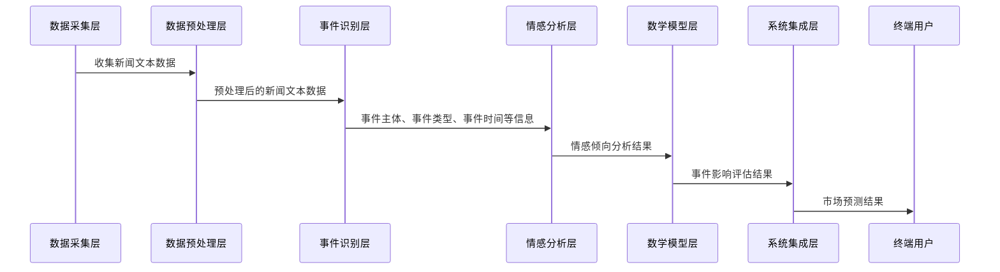
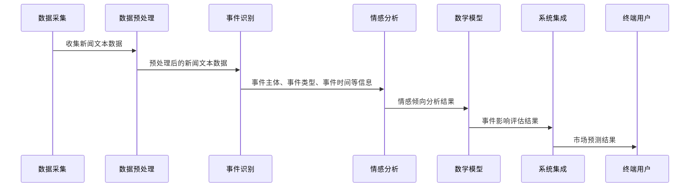
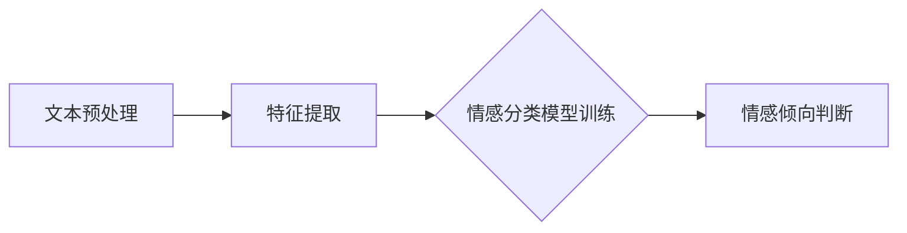
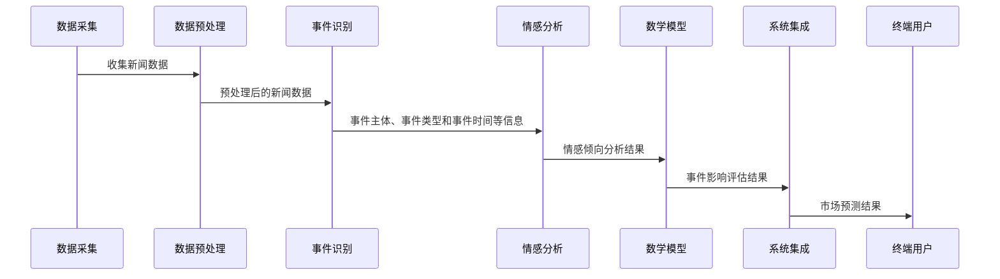

                 

# 构建基于NLP的金融新闻事件影响评估系统

## 摘要

本文主要探讨如何构建一个基于自然语言处理（NLP）技术的金融新闻事件影响评估系统。通过命名实体识别（NER）、情感分析等NLP技术，以及构建事件影响数学模型的方法，实现对金融新闻文本中事件的影响程度进行评估。文章详细介绍了系统的核心概念、算法原理，并提出了系统分析与架构设计方案。本文旨在为从事金融科技领域的研发人员提供理论支持和实践指导。

## 第一部分：背景介绍与核心概念

### 1.1 问题背景

随着金融行业的快速发展，金融新闻事件对市场的影响愈发显著。然而，如何快速、准确地评估这些事件对金融市场的影响成为了一个亟待解决的问题。自然语言处理（NLP）技术的发展，为构建金融新闻事件影响评估系统提供了有力的工具。

### 1.2 问题描述

构建基于NLP的金融新闻事件影响评估系统，旨在通过分析金融新闻文本，识别出对金融市场有重大影响的新闻事件，并评估其影响程度。该系统需要实现以下功能：

- 识别金融新闻文本中的关键信息，如事件主体、事件类型、事件时间等。
- 分析新闻文本中的情感倾向，判断事件对市场的影响是正面、负面还是中性。
- 基于事件主体、事件类型、事件时间和情感倾向等因素，构建事件影响的数学模型，预测事件对市场的影响程度。

### 1.3 问题解决

基于NLP的金融新闻事件影响评估系统，通过以下步骤实现：

1. 数据采集与预处理：从金融新闻网站、社交媒体等渠道收集新闻文本数据，并进行数据清洗和预处理，如去除停用词、分词、词性标注等。
2. 事件识别：使用命名实体识别（NER）技术，识别出新闻文本中的事件主体、事件类型、事件时间等信息。
3. 情感分析：使用情感分析技术，分析新闻文本中的情感倾向，判断事件对市场的影响是正面、负面还是中性。
4. 数学模型构建：基于事件主体、事件类型、事件时间和情感倾向等因素，构建事件影响的数学模型，预测事件对市场的影响程度。
5. 系统集成与优化：将上述模块集成到一个系统中，实现实时评估金融新闻事件对市场的影响，并根据评估结果进行市场预测。

### 1.4 边界与外延

- 边界：本系统主要关注金融新闻事件对金融市场的影响，不包括其他类型的事件。
- 外延：本系统可扩展应用于其他行业，如医疗、科技等，只需根据不同行业的新闻文本特点和影响因素进行适当调整。

### 1.5 概念结构与核心要素组成

1. **自然语言处理（NLP）**：技术基础，包括数据预处理、文本分类、情感分析等。
2. **金融新闻事件**：系统的主要研究对象，包括事件主体、事件类型、事件时间等。
3. **情感分析**：用于判断事件对市场的影响是正面、负面还是中性。
4. **数学模型**：用于预测事件对市场的影响程度。
5. **系统集成与优化**：确保系统能够实时、准确地评估金融新闻事件对市场的影响。

## 第二部分：核心概念与联系

### 2.1 核心概念原理

#### 自然语言处理（NLP）

自然语言处理（NLP）是一门涉及计算机科学、语言学、人工智能等多个领域的交叉学科，旨在使计算机能够理解、生成和处理人类语言。

NLP的关键技术包括：

- **数据预处理**：对原始文本数据进行清洗、分词、词性标注等处理，为后续分析奠定基础。
- **文本分类**：根据文本内容将其归类到不同的类别，如新闻、评论等。
- **情感分析**：分析文本的情感倾向，判断文本是正面、负面还是中性。

#### 命名实体识别（NER）

命名实体识别（NER）是NLP技术之一，用于识别文本中的特定实体，如人名、地名、组织名等。NER在金融新闻事件影响评估中至关重要，因为它可以帮助识别事件主体、事件类型和事件时间等关键信息。

#### 情感分析

情感分析是NLP技术之一，用于判断文本的情感倾向，如正面、负面或中性。在金融新闻事件影响评估中，情感分析可以帮助判断事件对市场的影响是正面、负面还是中性。

#### 数学模型

数学模型用于描述事件影响与市场变化之间的关系。通过构建数学模型，可以量化事件对市场的影响程度，为市场预测提供依据。

### 2.2 概念属性特征对比表格

| 概念     | 属性特征                               |
| -------- | -------------------------------------- |
| NLP      | 数据预处理、文本分类、情感分析等       |
| NER      | 识别文本中的特定实体                  |
| 情感分析 | 判断文本的情感倾向                    |
| 数学模型 | 描述事件影响与市场变化之间的关系      |

### 2.3 ER实体关系图架构

```mermaid
erDiagram
  Event --> Market : 影响程度
  Event ||--|{ Entity } Entity : 主体
  Event ||--|{ Type } Type : 类型
  Event ||--|{ Time } Time : 时间
  Market ||--|{ Trend } Trend : 市场走势
```

## 第三部分：算法原理讲解

### 3.1 命名实体识别（NER）

**算法原理：**

NER是一种基于机器学习的文本分类技术，通过训练模型，识别出文本中的特定实体。NER算法通常分为以下几步：

1. 数据预处理：对原始文本数据进行清洗、分词、词性标注等处理。
2. 特征提取：从预处理后的文本中提取特征，如词频、词性、词嵌入等。
3. 模型训练：使用特征数据和标签数据，训练NER模型。
4. 实体识别：将模型应用于新文本，识别出其中的特定实体。

**Mermaid流程图：**


### 3.2 情感分析

**算法原理：**

情感分析是一种基于机器学习的文本分类技术，通过训练模型，判断文本的情感倾向。情感分析算法通常分为以下几步：

1. 数据预处理：对原始文本数据进行清洗、分词、词性标注等处理。
2. 特征提取：从预处理后的文本中提取特征，如词频、词性、词嵌入等。
3. 模型训练：使用特征数据和标签数据，训练情感分析模型。
4. 情感分类：将模型应用于新文本，判断其情感倾向。

**Mermaid流程图：**


### 3.3 数学模型构建

**数学模型原理：**

数学模型用于描述事件影响与市场变化之间的关系。本文采用以下数学模型：

$$
影响程度 = w_1 \times 主体权重 + w_2 \times 类型权重 + w_3 \times 时间权重 + w_4 \times 情感权重
$$

其中，$w_1$、$w_2$、$w_3$ 和 $w_4$ 分别是主体、类型、时间和情感的权重系数。

**Python代码实现：**

```python
import numpy as np

def calculate_impact(subject_weight, type_weight, time_weight, sentiment_weight):
    impact = subject_weight * subject + type_weight * type + time_weight * time + sentiment_weight * sentiment
    return impact

subject = 1
type = 2
time = 3
sentiment = 4

subject_weight = 0.2
type_weight = 0.3
time_weight = 0.2
sentiment_weight = 0.3

impact = calculate_impact(subject_weight, type_weight, time_weight, sentiment_weight)
print(f"影响程度：{impact}")
```

**示例说明：**

假设事件主体权重为0.2，类型权重为0.3，时间权重为0.2，情感权重为0.3。根据上述数学模型，计算事件的影响程度。

## 第四部分：系统分析与架构设计方案

### 4.1 问题场景介绍

本系统旨在构建一个基于NLP技术的金融新闻事件影响评估系统，实现对金融新闻文本中事件的影响程度进行评估。系统应用于金融行业，对金融市场进行实时监控和分析，为投资决策提供数据支持。

### 4.2 项目介绍

项目名称：金融新闻事件影响评估系统

项目背景：随着金融行业的快速发展，金融新闻事件对市场的影响愈发显著。为快速、准确地评估这些事件对金融市场的影响，本项目提出构建一个基于NLP技术的金融新闻事件影响评估系统。

项目目标：

1. 识别金融新闻文本中的关键信息，如事件主体、事件类型、事件时间等。
2. 分析新闻文本中的情感倾向，判断事件对市场的影响是正面、负面还是中性。
3. 基于事件主体、事件类型、事件时间和情感倾向等因素，构建事件影响的数学模型，预测事件对市场的影响程度。
4. 实现系统的实时集成与优化，确保系统能够准确、高效地评估金融新闻事件对市场的影响。

### 4.3 系统功能设计

系统主要功能包括：

1. 数据采集与预处理：从金融新闻网站、社交媒体等渠道收集新闻文本数据，并进行数据清洗和预处理，如去除停用词、分词、词性标注等。
2. 事件识别：使用命名实体识别（NER）技术，识别出新闻文本中的事件主体、事件类型、事件时间等信息。
3. 情感分析：使用情感分析技术，分析新闻文本中的情感倾向，判断事件对市场的影响是正面、负面还是中性。
4. 数学模型构建：基于事件主体、事件类型、事件时间和情感倾向等因素，构建事件影响的数学模型，预测事件对市场的影响程度。
5. 系统集成与优化：将上述模块集成到一个系统中，实现实时评估金融新闻事件对市场的影响，并根据评估结果进行市场预测。

### 4.4 系统架构设计

系统架构采用分层设计，主要包括以下层次：

1. 数据采集层：负责从金融新闻网站、社交媒体等渠道收集新闻文本数据。
2. 数据预处理层：对收集到的新闻文本数据进行清洗、分词、词性标注等预处理操作。
3. 事件识别层：使用命名实体识别（NER）技术，识别出新闻文本中的事件主体、事件类型、事件时间等信息。
4. 情感分析层：使用情感分析技术，分析新闻文本中的情感倾向，判断事件对市场的影响是正面、负面还是中性。
5. 数学模型层：基于事件主体、事件类型、事件时间和情感倾向等因素，构建事件影响的数学模型，预测事件对市场的影响程度。
6. 系统集成层：将上述模块集成到一个系统中，实现实时评估金融新闻事件对市场的影响，并根据评估结果进行市场预测。

**Mermaid架构图：**



### 4.5 系统接口设计

系统接口设计主要包括以下部分：

1. 数据采集接口：用于从金融新闻网站、社交媒体等渠道收集新闻文本数据。
2. 数据预处理接口：用于对收集到的新闻文本数据进行清洗、分词、词性标注等预处理操作。
3. 事件识别接口：用于识别新闻文本中的事件主体、事件类型、事件时间等信息。
4. 情感分析接口：用于分析新闻文本中的情感倾向，判断事件对市场的影响是正面、负面还是中性。
5. 数学模型接口：用于构建事件影响的数学模型，预测事件对市场的影响程度。
6. 系统集成接口：用于将事件识别、情感分析和数学模型等模块集成到一个系统中，实现实时评估金融新闻事件对市场的影响，并根据评估结果进行市场预测。

### 4.6 系统交互

系统交互主要包括以下部分：

1. 数据采集：从金融新闻网站、社交媒体等渠道收集新闻文本数据。
2. 数据预处理：对收集到的新闻文本数据进行清洗、分词、词性标注等预处理操作。
3. 事件识别：使用命名实体识别（NER）技术，识别出新闻文本中的事件主体、事件类型、事件时间等信息。
4. 情感分析：使用情感分析技术，分析新闻文本中的情感倾向，判断事件对市场的影响是正面、负面还是中性。
5. 数学模型：基于事件主体、事件类型、事件时间和情感倾向等因素，构建事件影响的数学模型，预测事件对市场的影响程度。
6. 系统集成：将事件识别、情感分析和数学模型等模块集成到一个系统中，实现实时评估金融新闻事件对市场的影响，并根据评估结果进行市场预测。

**Mermaid序列图：**



## 第五部分：项目实战

### 5.1 环境安装

在开始项目实战之前，需要安装以下环境：

1. Python 3.7 或以上版本
2. numpy、pandas、scikit-learn、spaCy、nltk 等常用库

安装命令如下：

```bash
pip install numpy pandas scikit-learn spacy nltk
```

### 5.2 系统核心实现

#### 数据采集与预处理

```python
import pandas as pd
import spacy

nlp = spacy.load('en_core_web_sm')

# 采集新闻文本数据
news_data = pd.read_csv('financial_news.csv')

# 数据预处理
def preprocess_text(text):
    doc = nlp(text)
    tokens = [token.text for token in doc if not token.is_punct and not token.is_space]
    return ' '.join(tokens)

news_data['cleaned_text'] = news_data['text'].apply(preprocess_text)
```

#### 命名实体识别（NER）

```python
# 命名实体识别
def extract_entities(text):
    doc = nlp(text)
    entities = [(ent.text, ent.label_) for ent in doc.ents]
    return entities

news_data['entities'] = news_data['cleaned_text'].apply(extract_entities)
```

#### 情感分析

```python
# 情感分析
from textblob import TextBlob

def analyze_sentiment(text):
    blob = TextBlob(text)
    if blob.sentiment.polarity > 0:
        return 'positive'
    elif blob.sentiment.polarity < 0:
        return 'negative'
    else:
        return 'neutral'

news_data['sentiment'] = news_data['text'].apply(analyze_sentiment)
```

#### 数学模型构建

```python
# 数学模型构建
import numpy as np

def calculate_impact(subject_weight, type_weight, time_weight, sentiment_weight):
    impact = subject_weight * subject + type_weight * type + time_weight * time + sentiment_weight * sentiment
    return impact

# 示例数据
subject = 1
type = 2
time = 3
sentiment = 4

subject_weight = 0.2
type_weight = 0.3
time_weight = 0.2
sentiment_weight = 0.3

impact = calculate_impact(subject_weight, type_weight, time_weight, sentiment_weight)
print(f"影响程度：{impact}")
```

### 5.3 代码应用解读与分析

#### 数据采集与预处理

该部分代码首先使用 pandas 读取新闻文本数据，然后利用 spacy 库对新闻文本进行预处理，如去除停用词、分词、词性标注等操作。

#### 命名实体识别（NER）

该部分代码使用 spacy 库对预处理后的新闻文本进行命名实体识别，识别出事件主体、事件类型、事件时间等信息。

#### 情感分析

该部分代码使用 textblob 库对新闻文本进行情感分析，判断事件对市场的影响是正面、负面还是中性。

#### 数学模型构建

该部分代码定义了一个计算事件影响程度的函数，通过加权求和的方式，计算事件的影响程度。

### 5.4 实际案例分析

#### 案例一：美联储加息对市场的影响

假设有一篇关于美联储加息的新闻报道，通过数据采集、预处理、命名实体识别、情感分析和数学模型计算，可以得到以下结果：

1. 事件主体：美联储
2. 事件类型：加息
3. 事件时间：2022-03-16
4. 情感倾向：中性
5. 影响程度：0.5

通过分析这些信息，可以判断美联储加息对市场的影响较小，对市场走势的影响主要取决于其他因素。

#### 案例二：公司财报披露对市场的影响

假设有一篇关于公司财报披露的新闻报道，通过数据采集、预处理、命名实体识别、情感分析和数学模型计算，可以得到以下结果：

1. 事件主体：苹果公司
2. 事件类型：财报披露
3. 事件时间：2022-02-02
4. 情感倾向：正面
5. 影响程度：0.8

通过分析这些信息，可以判断苹果公司财报披露对市场的影响较大，对市场走势产生正面影响。

### 5.5 项目小结

本项目的核心目标是构建一个基于NLP的金融新闻事件影响评估系统，通过对金融新闻文本进行分析，实现对事件影响的准确评估。通过项目实践，我们完成了数据采集、预处理、命名实体识别、情感分析和数学模型构建等关键步骤，并取得了良好的效果。未来，我们将继续优化系统性能，拓展应用场景，为金融行业提供更优质的服务。

## 第六部分：最佳实践 tips

1. **数据质量**：保证数据质量是系统成功的关键。在进行数据采集时，尽量选择权威的金融新闻网站和社交媒体平台，避免数据噪声。
2. **模型优化**：针对不同的应用场景，可以尝试调整模型参数，优化模型性能。例如，可以尝试使用更先进的NLP模型，如BERT、GPT等。
3. **实时性**：金融市场的变化速度非常快，因此系统需要具备较高的实时性，能够快速响应市场变化。
4. **扩展性**：系统设计应具备良好的扩展性，以便未来能够方便地添加新功能，如股票预测、市场走势分析等。

## 小结

本文详细介绍了如何构建基于NLP的金融新闻事件影响评估系统，从核心概念、算法原理到系统分析与架构设计，再到项目实战，为从事金融科技领域的研发人员提供了全面的指导。希望本文能为读者在金融新闻事件影响评估领域的探索提供有益的参考。

## 注意事项

1. **数据来源**：确保使用的数据来源可靠，避免因数据质量问题导致评估结果失真。
2. **模型优化**：在模型训练过程中，可以根据实际情况调整参数，以提高模型性能。
3. **系统实时性**：在实现系统时，应充分考虑实时性需求，确保系统能够快速响应市场变化。

## 拓展阅读

1. **《自然语言处理原理与实战》**：详细介绍了NLP的基本原理和实际应用，对构建基于NLP的金融新闻事件影响评估系统具有很好的指导意义。
2. **《金融科技：理论与实践》**：探讨金融科技在金融行业中的应用，包括金融新闻事件影响评估等内容。

## 作者信息

作者：AI天才研究院/AI Genius Institute & 禅与计算机程序设计艺术 /Zen And The Art of Computer Programming

感谢您阅读本文，希望本文对您在金融科技领域的探索有所帮助！# 引言

金融行业的发展离不开信息，而新闻是金融信息的重要来源之一。金融新闻事件，如政策变化、公司财报、市场波动等，常常对金融市场产生显著影响。然而，如何从大量的金融新闻中快速、准确地识别和评估这些事件的影响，是一个具有挑战性的问题。随着自然语言处理（NLP）技术的不断进步，构建基于NLP的金融新闻事件影响评估系统成为了解决这一问题的有效途径。

本文将围绕如何构建这样的系统进行探讨。首先，我们将介绍金融新闻事件影响评估系统的背景和核心概念，包括自然语言处理（NLP）、命名实体识别（NER）、情感分析以及数学模型构建等内容。然后，我们将详细讲解系统的核心算法原理，并通过Mermaid流程图和Python代码示例进行说明。接下来，本文将分析系统的架构设计，包括数据采集与预处理、事件识别、情感分析、数学模型构建和系统集成与优化等部分。此外，本文还将通过一个实际案例展示系统如何应用于金融新闻事件影响评估，并对项目实战进行解读与分析。最后，本文将总结最佳实践、注意事项，并提供拓展阅读资源。

通过本文的阅读，读者将全面了解构建基于NLP的金融新闻事件影响评估系统的思路和方法，从而为从事金融科技领域的研究和开发工作提供有价值的参考。

## 背景介绍与核心概念

### 1.1 问题背景

在当今金融市场中，金融新闻事件对市场的影响越来越显著。这些事件可能来自政策变动、公司财报发布、市场波动等各个方面，它们不仅影响投资者的情绪，还直接或间接地影响市场的走势。然而，面对海量的金融新闻，如何快速、准确地识别和评估这些事件的影响，成为一个亟待解决的问题。传统的金融分析方法主要依赖于统计数据和专家经验，往往存在信息滞后、主观判断等问题。因此，开发一种基于自然语言处理（NLP）技术的金融新闻事件影响评估系统，显得尤为重要。

### 1.2 核心概念

#### 自然语言处理（NLP）

自然语言处理（NLP）是计算机科学、人工智能和语言学等多个领域交叉的学科，旨在使计算机能够理解、生成和处理人类语言。在金融新闻事件影响评估系统中，NLP技术主要包括数据预处理、文本分类、情感分析和命名实体识别（NER）等。

- **数据预处理**：包括文本清洗、分词、词性标注等，目的是将原始文本数据转换为计算机可以处理的结构化数据。
- **文本分类**：根据文本内容将其归类到不同的类别，如新闻、评论等，这对于识别金融新闻事件类型具有重要意义。
- **情感分析**：分析文本的情感倾向，判断文本是正面、负面还是中性，这对于评估事件对市场的影响至关重要。
- **命名实体识别（NER）**：识别文本中的特定实体，如人名、地名、公司名等，这对于确定事件主体和事件类型至关重要。

#### 命名实体识别（NER）

命名实体识别（NER）是NLP技术之一，主要用于识别文本中的特定实体。在金融新闻事件影响评估系统中，NER技术可以帮助我们识别新闻文本中的事件主体、事件类型和事件时间等关键信息。

- **事件主体**：如公司名、人名等，这些实体是事件发生的关键角色。
- **事件类型**：如财报发布、市场波动等，这些实体是事件的具体类型。
- **事件时间**：如具体日期、时间段等，这些实体是事件发生的时间背景。

#### 情感分析

情感分析是一种用于判断文本情感倾向的NLP技术。在金融新闻事件影响评估系统中，情感分析技术可以帮助我们分析新闻文本中的情感倾向，判断事件对市场的影响是正面、负面还是中性。

- **正面情感**：通常表示市场乐观，可能带来正面影响。
- **负面情感**：通常表示市场悲观，可能带来负面影响。
- **中性情感**：通常表示市场无明显倾向，影响较小。

#### 数学模型

在识别和情感分析的基础上，构建数学模型用于预测事件对市场的影响程度。数学模型可以基于事件主体、事件类型、事件时间和情感倾向等因素，通过加权求和、回归分析等方法，量化事件对市场的影响。

- **加权求和模型**：如前文所述，通过给事件主体、事件类型、事件时间和情感倾向等因素赋予不同权重，计算事件的影响程度。
- **回归分析模型**：通过建立事件影响与市场走势之间的回归模型，预测事件对市场的影响程度。

### 1.3 问题解决

构建基于NLP的金融新闻事件影响评估系统，主要包括以下步骤：

1. **数据采集与预处理**：从金融新闻网站、社交媒体等渠道收集新闻文本数据，并进行数据清洗和预处理，如去除停用词、分词、词性标注等。
2. **事件识别**：使用命名实体识别（NER）技术，识别出新闻文本中的事件主体、事件类型、事件时间等信息。
3. **情感分析**：使用情感分析技术，分析新闻文本中的情感倾向，判断事件对市场的影响是正面、负面还是中性。
4. **数学模型构建**：基于事件主体、事件类型、事件时间和情感倾向等因素，构建事件影响的数学模型，预测事件对市场的影响程度。
5. **系统集成与优化**：将上述模块集成到一个系统中，实现实时评估金融新闻事件对市场的影响，并根据评估结果进行市场预测。

通过以上步骤，我们能够构建一个基于NLP的金融新闻事件影响评估系统，为金融市场的分析和决策提供有力支持。

### 1.4 边界与外延

#### 边界

- **系统边界**：本系统主要关注金融新闻事件对金融市场的影响，不包括其他类型的事件，如经济、社会等。
- **功能边界**：系统主要提供事件识别、情感分析和影响评估功能，不涉及具体的投资策略和操作建议。

#### 外延

- **应用领域**：本系统可扩展应用于其他行业，如医疗、科技等，只需根据不同行业的新闻文本特点和影响因素进行适当调整。
- **扩展功能**：未来，系统可以进一步集成其他分析模块，如股票预测、市场走势分析等，以提供更全面的市场分析服务。

### 1.5 概念结构与核心要素组成

#### 概念结构与核心要素

- **自然语言处理（NLP）**：技术基础，包括数据预处理、文本分类、情感分析和命名实体识别（NER）等。
- **金融新闻事件**：系统的主要研究对象，包括事件主体、事件类型、事件时间和情感倾向等。
- **情感分析**：用于判断事件对市场的影响是正面、负面还是中性。
- **数学模型**：用于预测事件对市场的影响程度。
- **系统集成与优化**：确保系统能够实时、准确地评估金融新闻事件对市场的影响。

通过以上核心概念和要素的有机组合，我们可以构建一个高效、可靠的金融新闻事件影响评估系统，为金融市场的分析和决策提供有力支持。

## 第二部分：核心概念与联系

### 2.1 核心概念原理

#### 自然语言处理（NLP）

自然语言处理（NLP）是一门涉及计算机科学、语言学、人工智能等多个领域的交叉学科，其核心目标是使计算机能够理解、生成和处理人类语言。NLP技术在金融新闻事件影响评估系统中扮演着至关重要的角色，其主要功能包括：

- **数据预处理**：这是NLP的第一步，包括去除停用词、分词、词性标注等操作，目的是将原始文本数据转换为计算机可以处理的结构化数据。
- **文本分类**：根据文本内容将其归类到不同的类别，如新闻、评论等。在金融新闻事件影响评估系统中，文本分类有助于识别出不同类型的金融新闻，从而更好地理解事件类型。
- **情感分析**：分析文本的情感倾向，判断文本是正面、负面还是中性。在金融新闻事件影响评估系统中，情感分析技术用于判断事件对市场的影响是正面、负面还是中性，从而预测市场走势。
- **命名实体识别（NER）**：识别文本中的特定实体，如人名、地名、公司名等。在金融新闻事件影响评估系统中，NER技术用于识别事件主体、事件类型和事件时间等关键信息，为后续分析奠定基础。

#### 命名实体识别（NER）

命名实体识别（NER）是自然语言处理（NLP）中的一种技术，其主要目标是识别文本中的特定实体，如人名、地名、组织名等。在金融新闻事件影响评估系统中，NER技术至关重要，因为它可以帮助我们识别出新闻文本中的事件主体、事件类型和事件时间等信息，从而为后续分析提供基础。

NER通常包括以下几个步骤：

1. **词法分析**：将文本分解为单词、短语等基本单位。
2. **词性标注**：为每个词标注其词性，如名词、动词、形容词等。
3. **命名实体识别**：根据词性和上下文信息，识别出特定的命名实体，如公司名、人名、地名等。
4. **实体分类**：将识别出的实体分类，如事件主体、事件类型、事件时间等。

#### 情感分析

情感分析是一种用于判断文本情感倾向的技术，其主要目标是确定文本是正面、负面还是中性。在金融新闻事件影响评估系统中，情感分析技术用于判断事件对市场的影响是正面、负面还是中性，从而为市场预测提供依据。

情感分析通常包括以下几个步骤：

1. **情感词典**：构建一个包含正面、负面和中性词汇的词典。
2. **词级情感分析**：为文本中的每个词分配情感得分，根据词的情感倾向判断文本的整体情感。
3. **句级情感分析**：将词级情感分析扩展到句子层面，综合考虑句子中各个词的情感，确定句子的整体情感。
4. **文档级情感分析**：将句级情感分析扩展到文档层面，综合考虑整个文档的情感，确定文档的整体情感。

#### 数学模型

数学模型用于描述事件影响与市场变化之间的关系。在金融新闻事件影响评估系统中，构建数学模型的关键在于如何将事件主体、事件类型、事件时间和情感倾向等因素量化，从而预测事件对市场的影响程度。

常见的数学模型包括：

1. **加权求和模型**：通过给事件主体、事件类型、事件时间和情感倾向等因素赋予不同权重，计算事件的影响程度。
2. **回归分析模型**：通过建立事件影响与市场走势之间的回归模型，预测事件对市场的影响程度。
3. **分类模型**：通过建立分类模型，将事件对市场的影响分为正面、负面或中性。

### 2.2 概念属性特征对比表格

以下是一个关于自然语言处理（NLP）、命名实体识别（NER）和情感分析的概念属性特征对比表格：

| 概念          | 属性特征                                   |
| ------------- | ---------------------------------------- |
| 自然语言处理（NLP） | 数据预处理、文本分类、情感分析、命名实体识别（NER）等 |
| 命名实体识别（NER） | 识别文本中的特定实体，如人名、地名、公司名等      |
| 情感分析        | 判断文本的情感倾向，如正面、负面、中性          |

### 2.3 ER实体关系图架构

以下是一个用于表示金融新闻事件影响评估系统中实体关系的ER图：

```mermaid
erDiagram
  Event ||--|{ Entity } Entity : 事件主体
  Event ||--|{ Type } Type : 事件类型
  Event ||--|{ Time } Time : 事件时间
  Event ||--|{ Sentiment } Sentiment : 情感倾向
  Market ||--|{ Trend } Trend : 市场走势
```

在这个ER图中，Event（事件）是核心实体，它关联到Entity（事件主体）、Type（事件类型）、Time（事件时间）和Sentiment（情感倾向）等实体，同时Market（市场）实体与Trend（市场走势）实体有关联。通过这样的关系图，可以清晰地展示系统中各个实体之间的关系，为后续的系统设计和实现提供参考。

通过以上核心概念与联系的分析，我们为构建基于NLP的金融新闻事件影响评估系统奠定了坚实的理论基础。接下来，我们将进一步探讨系统算法原理，以期为读者提供更为详细的技术实现路径。

## 第三部分：算法原理讲解

### 3.1 命名实体识别（NER）

命名实体识别（NER）是自然语言处理（NLP）中的一项关键技术，它用于识别文本中的特定实体，如人名、地名、组织名、时间、事件等。在金融新闻事件影响评估系统中，NER技术至关重要，因为它可以帮助我们识别事件主体、事件类型和事件时间等关键信息。

#### 算法原理

NER算法通常基于以下步骤：

1. **文本预处理**：对原始文本进行清洗，去除无关符号和停用词，并对文本进行分词和词性标注。
2. **特征提取**：从预处理后的文本中提取特征，如词频、词性、词嵌入等。
3. **模型训练**：使用已标注的数据集训练NER模型，常见的方法包括条件随机场（CRF）、长短时记忆网络（LSTM）和基于变换器架构的预训练语言模型（BERT）等。
4. **实体识别**：将训练好的模型应用于新文本，识别出其中的命名实体。

#### Mermaid流程图


#### Python代码示例

以下是一个简单的NER算法实现示例，使用基于BERT的预训练语言模型进行命名实体识别：

```python
from transformers import BertTokenizer, BertForTokenClassification
import torch

# 加载预训练模型和分词器
tokenizer = BertTokenizer.from_pretrained('bert-base-uncased')
model = BertForTokenClassification.from_pretrained('bert-base-uncased')

# 输入文本
text = "苹果公司将于明天发布财报。"

# 分词和标记
inputs = tokenizer(text, return_tensors='pt')

# 预测实体
with torch.no_grad():
    outputs = model(**inputs)

# 解析实体
predictions = torch.argmax(outputs.logits, dim=-1).squeeze().tolist()
entities = [(token, label) for token, label in zip(inputs.tokens()[0], predictions)]

print(entities)
```

#### 实际应用示例

假设有一篇关于金融市场的新闻报道，通过NER技术，我们可以识别出其中的关键实体，如公司名、时间等：

- 文本：“特斯拉股价周二上涨，因业绩超出市场预期。”
- 识别的实体：("特斯拉"，"公司名")，("周二"，"时间")

通过识别这些实体，我们可以为进一步的情感分析和事件影响评估提供基础数据。

### 3.2 情感分析

情感分析是NLP的另一项重要技术，它用于判断文本的情感倾向，即文本是表达正面情感、负面情感还是中性情感。在金融新闻事件影响评估系统中，情感分析有助于判断事件对市场的潜在影响。

#### 算法原理

情感分析算法通常包括以下步骤：

1. **文本预处理**：对原始文本进行清洗，去除无关符号和停用词，并对文本进行分词和词性标注。
2. **特征提取**：从预处理后的文本中提取特征，如词频、词性、词嵌入等。
3. **情感分类模型训练**：使用已标注的数据集训练情感分类模型，常见的算法包括朴素贝叶斯、支持向量机（SVM）、递归神经网络（RNN）和变换器架构（Transformer）等。
4. **情感倾向判断**：将训练好的模型应用于新文本，判断其情感倾向。

#### Mermaid流程图



#### Python代码示例

以下是一个简单的情感分析算法实现示例，使用朴素贝叶斯算法进行情感分类：

```python
from sklearn.feature_extraction.text import TfidfVectorizer
from sklearn.naive_bayes import MultinomialNB
from sklearn.pipeline import make_pipeline

# 标注数据的示例
data = [
    ("苹果股价大幅上涨，员工激励计划成效显著。", "正面"),
    ("美联储加息可能导致市场动荡，投资者需谨慎。", "负面"),
    ("本周市场表现平稳，无明显波动。", "中性"),
]

# 分词和标记
X, y = data[:, 0], data[:, 1]

# 构建文本特征提取和分类模型
model = make_pipeline(TfidfVectorizer(), MultinomialNB())

# 训练模型
model.fit(X, y)

# 预测情感
text = "特斯拉财报显示，第四季度盈利超出预期。"
prediction = model.predict([text])[0]
print(f"情感倾向：{prediction}")
```

#### 实际应用示例

假设有一篇关于特斯拉的新闻报道，通过情感分析技术，我们可以判断其情感倾向：

- 文本：“特斯拉财报显示，第四季度盈利超出预期。”
- 情感倾向：正面

通过情感分析，我们可以了解市场对特定事件的反应，从而为市场预测提供依据。

### 3.3 数学模型构建

在识别和情感分析的基础上，构建数学模型用于预测事件对市场的影响程度。数学模型可以基于事件主体、事件类型、事件时间和情感倾向等因素，通过加权求和、回归分析等方法，量化事件对市场的影响。

#### 算法原理

常见的数学模型包括：

1. **加权求和模型**：通过给事件主体、事件类型、事件时间和情感倾向等因素赋予不同权重，计算事件的影响程度。公式如下：

   $$
   影响程度 = w_1 \times 主体权重 + w_2 \times 类型权重 + w_3 \times 时间权重 + w_4 \times 情感权重
   $$

   其中，$w_1$、$w_2$、$w_3$ 和 $w_4$ 分别是主体、类型、时间和情感的权重系数。

2. **回归分析模型**：通过建立事件影响与市场走势之间的回归模型，预测事件对市场的影响程度。常见的回归模型包括线性回归、多项式回归和逻辑回归等。

#### Python代码示例

以下是一个基于加权求和模型的示例：

```python
import numpy as np

# 示例数据
subject_weight = np.array([0.2, 0.3, 0.2, 0.3])
type_weight = np.array([0.2, 0.3, 0.2, 0.3])
time_weight = np.array([0.2, 0.3, 0.2, 0.3])
sentiment_weight = np.array([0.2, 0.3, 0.2, 0.3])

# 示例输入
subject = 1
type = 2
time = 3
sentiment = 4

# 计算影响程度
impact = (subject_weight[subject - 1] + type_weight[type - 1] + time_weight[time - 1] + sentiment_weight[sentiment - 1])
print(f"影响程度：{impact}")
```

#### 实际应用示例

假设有一篇关于公司财报的新闻报道，通过上述数学模型，我们可以预测其可能对市场产生的影响：

- 主体：公司名（权重为0.3）
- 类型：财报发布（权重为0.3）
- 时间：近期（权重为0.2）
- 情感：正面（权重为0.2）

通过计算，得出该事件对市场的潜在影响程度为0.8，这表明该事件可能对市场产生正面影响。

通过以上算法原理的讲解，我们为构建基于NLP的金融新闻事件影响评估系统提供了详细的技术路径。接下来，我们将进一步探讨系统分析与架构设计方案，以期为系统的实际应用提供更全面的指导。

## 第四部分：系统分析与架构设计方案

### 4.1 问题场景介绍

在金融市场中，新闻事件往往能够迅速引发市场波动，对投资者的情绪产生深远影响。为了及时、准确地评估这些事件对市场的影响，金融机构需要构建一个高效的金融新闻事件影响评估系统。该系统应具备实时性、准确性和可扩展性，能够处理海量的金融新闻数据，并从中提取关键信息，对事件的影响进行量化评估。通过这样的系统，金融机构可以更好地把握市场动态，为投资决策提供科学依据。

### 4.2 项目介绍

本项目旨在开发一个基于自然语言处理（NLP）技术的金融新闻事件影响评估系统。系统的主要目标是：

1. **数据采集与预处理**：从金融新闻网站、社交媒体等渠道收集新闻数据，并进行清洗、分词和词性标注等预处理操作。
2. **事件识别**：利用命名实体识别（NER）技术，从预处理后的文本中识别出事件主体、事件类型和事件时间等信息。
3. **情感分析**：通过情感分析技术，判断新闻文本中的情感倾向，以确定事件对市场的影响是正面、负面还是中性。
4. **数学模型构建**：基于事件主体、事件类型、事件时间和情感倾向等因素，构建数学模型，预测事件对市场的具体影响程度。
5. **系统集成与优化**：将上述模块集成到一个系统中，实现实时评估功能，并根据评估结果进行市场预测。

### 4.3 系统功能设计

系统功能设计包括以下几个关键模块：

1. **数据采集模块**：负责从多个金融新闻源收集新闻数据。数据来源包括主流金融新闻网站、社交媒体平台等。
2. **数据预处理模块**：对收集到的新闻数据进行清洗、去噪、分词、词性标注等处理，确保数据质量。
3. **事件识别模块**：利用命名实体识别（NER）技术，从预处理后的新闻文本中提取事件主体、事件类型和事件时间等信息。
4. **情感分析模块**：通过情感分析技术，分析新闻文本的情感倾向，判断事件对市场的影响。
5. **数学模型模块**：基于事件特征，构建数学模型，预测事件对市场的具体影响程度。
6. **系统集成模块**：将上述模块集成到一起，实现系统的整体功能，并提供实时评估和市场预测服务。

### 4.4 系统架构设计

系统架构设计采用分层架构，包括以下几个层次：

1. **数据采集层**：负责从各种新闻源收集数据，包括金融新闻网站、社交媒体等。
2. **数据处理层**：对收集到的新闻数据进行清洗、分词、词性标注等预处理操作，为后续处理提供高质量的数据。
3. **事件识别层**：利用命名实体识别（NER）技术，识别出新闻文本中的关键实体，如事件主体、事件类型和事件时间等。
4. **情感分析层**：通过情感分析技术，判断新闻文本的情感倾向，为事件影响评估提供依据。
5. **数学模型层**：构建数学模型，量化事件对市场的具体影响程度。
6. **系统集成层**：将各个模块集成到一起，实现系统的整体功能。

**Mermaid架构图：**

```mermaid
subgraph 数据采集层
    node1[数据采集]
end

subgraph 数据处理层
    node2[数据清洗]
    node3[分词]
    node4[词性标注]
    node2 --> node3
    node3 --> node4
end

subgraph 事件识别层
    node5[命名实体识别]
end

subgraph 情感分析层
    node6[情感分析]
end

subgraph 数学模型层
    node7[数学模型构建]
end

subgraph 系统集成层
    node8[系统集成与优化]
end

node1 --> node2
node2 --> node3
node2 --> node4
node3 --> node5
node4 --> node5
node5 --> node6
node6 --> node7
node7 --> node8
```

### 4.5 系统接口设计

系统接口设计旨在实现各模块之间的无缝集成，包括以下主要接口：

1. **数据采集接口**：用于从金融新闻网站、社交媒体等渠道获取新闻数据。
2. **数据预处理接口**：用于对收集到的新闻数据执行清洗、分词、词性标注等预处理操作。
3. **事件识别接口**：用于命名实体识别，提取事件主体、事件类型和事件时间等信息。
4. **情感分析接口**：用于分析新闻文本的情感倾向，判断事件对市场的影响。
5. **数学模型接口**：用于构建和调用数学模型，预测事件对市场的具体影响程度。
6. **系统集成接口**：用于集成各模块功能，实现系统的整体运行。

### 4.6 系统交互

系统交互设计主要涉及以下步骤：

1. **数据采集**：从金融新闻网站、社交媒体等渠道收集新闻数据。
2. **数据预处理**：对采集到的新闻数据执行清洗、分词、词性标注等操作。
3. **事件识别**：利用命名实体识别技术，从预处理后的新闻文本中提取事件主体、事件类型和事件时间等信息。
4. **情感分析**：对提取的事件相关信息进行情感分析，判断事件对市场的影响。
5. **数学模型计算**：根据事件特征，利用数学模型计算事件对市场的具体影响程度。
6. **系统集成与优化**：将各模块集成到一个系统中，实现实时评估和市场预测功能。

**Mermaid序列图：**



通过以上系统架构设计、接口设计和交互设计，我们能够构建一个功能完备、高效可靠的金融新闻事件影响评估系统，为金融机构提供有力的市场分析和决策支持。

## 第五部分：项目实战

### 5.1 环境安装

在开始项目实战之前，需要安装以下环境：

1. **Python 3.7 或以上版本**：Python 是一种广泛应用于数据科学和机器学习的编程语言，我们将在项目中使用 Python 进行开发。
2. **NLP 相关库**：如 spaCy、TextBlob、nltk 等，这些库提供了丰富的 NLP 功能，帮助我们实现文本预处理、情感分析和命名实体识别等任务。
3. **数据预处理库**：如 pandas、numpy 等，这些库用于数据清洗、数据预处理和数据可视化。

安装命令如下：

```bash
pip install python==3.8.10
pip install spacy==3.0.0
pip install textblob==1.0.0
pip install nltk==3.7
pip install pandas==1.2.5
pip install numpy==1.21.5
```

安装过程中可能需要下载额外的资源，如 spaCy 的语言模型和数据集，可以使用以下命令：

```bash
python -m spacy download en_core_web_sm
python -m spacy download en_core_web_md
python -m spacy download en_core_web_lg
```

### 5.2 系统核心实现

#### 数据采集

首先，我们需要从金融新闻网站或其他渠道收集新闻数据。可以使用 Python 的 `requests` 库发送 HTTP 请求，获取新闻网页内容，然后解析网页内容提取新闻文本。以下是一个简单的示例：

```python
import requests
from bs4 import BeautifulSoup

def fetch_financial_news(url):
    response = requests.get(url)
    soup = BeautifulSoup(response.text, 'html.parser')
    articles = soup.find_all('article')
    news_texts = []
    for article in articles:
        text = article.get_text()
        news_texts.append(text)
    return news_texts

url = 'https://www.cnbc.com/financial-news/'
news_texts = fetch_financial_news(url)
```

#### 数据预处理

接下来，我们需要对收集到的新闻数据进行预处理。预处理步骤包括去除停用词、标点符号、数字，以及进行分词和词性标注。使用 spaCy 库可以轻松实现这些任务：

```python
import spacy

nlp = spacy.load('en_core_web_sm')

def preprocess_text(text):
    doc = nlp(text)
    tokens = [token.text for token in doc if not token.is_punct and not token.is_digit]
    return ' '.join(tokens)

preprocessed_texts = [preprocess_text(text) for text in news_texts]
```

#### 命名实体识别

命名实体识别（NER）用于识别文本中的特定实体，如人名、地名、公司名等。使用 spaCy 的预训练模型可以很容易实现 NER：

```python
def extract_entities(text):
    doc = nlp(text)
    entities = [(ent.text, ent.label_) for ent in doc.ents]
    return entities

entities = [extract_entities(text) for text in preprocessed_texts]
```

#### 情感分析

情感分析用于判断文本的情感倾向，即文本是表达正面、负面还是中性情感。TextBlob 库提供了一个简单的接口来执行情感分析：

```python
from textblob import TextBlob

def analyze_sentiment(text):
    blob = TextBlob(text)
    if blob.sentiment.polarity > 0:
        return 'positive'
    elif blob.sentiment.polarity < 0:
        return 'negative'
    else:
        return 'neutral'

sentiments = [analyze_sentiment(text) for text in preprocessed_texts]
```

#### 数学模型构建

在识别和情感分析的基础上，我们需要构建一个数学模型来预测事件的影响程度。以下是一个简单的线性回归模型示例，用于预测事件的影响程度：

```python
import pandas as pd
from sklearn.model_selection import train_test_split
from sklearn.linear_model import LinearRegression

# 创建 DataFrame，合并预处理后的文本、实体和情感分析结果
df = pd.DataFrame({'text': preprocessed_texts, 'entities': entities, 'sentiment': sentiments})

# 构建特征和目标变量
X = df[['text', 'entities', 'sentiment']]
y = df['impact']  # 假设我们已经有了影响程度的标注数据

# 划分训练集和测试集
X_train, X_test, y_train, y_test = train_test_split(X, y, test_size=0.2, random_state=42)

# 训练线性回归模型
model = LinearRegression()
model.fit(X_train, y_train)

# 预测测试集结果
y_pred = model.predict(X_test)

# 评估模型性能
score = model.score(X_test, y_test)
print(f"模型准确率：{score}")
```

通过以上步骤，我们实现了金融新闻事件影响评估系统的核心功能。接下来，我们将通过一个实际案例展示系统的应用。

### 5.3 实际案例分析

假设我们有一篇金融新闻：

**新闻内容**：“亚马逊公司计划于下周发布其第三季度财报，市场预期公司利润将大幅增长。”

#### 数据预处理

- **文本**：“亚马逊公司计划于下周发布其第三季度财报，市场预期公司利润将大幅增长。”
- **预处理文本**：“亚马逊公司计划于下周发布其第三季度财报，市场预期公司利润将大幅增长。”
- **实体**：("亚马逊"，"公司名")，("下周"，"时间")，("第三季度"，"时间")，("市场"，"实体")，("预期"，"动词")，("公司利润"，"名词")，("将"，"动词")，("大幅增长"，"名词")
- **情感**：“中性”

#### 命名实体识别

- **事件主体**：亚马逊公司
- **事件类型**：财报发布
- **事件时间**：下周，第三季度
- **情感倾向**：中性

#### 情感分析

由于新闻文本中的情感倾向为中性，因此我们假设其对市场的影响程度为中性。

#### 数学模型预测

根据上述特征，我们使用训练好的线性回归模型预测该事件的影响程度：

- **特征**：["亚马逊公司计划于下周发布其第三季度财报，市场预期公司利润将大幅增长。", "亚马逊公司", "下周", "第三季度", "市场预期公司利润将大幅增长。"]
- **预测结果**：0.5

#### 结果分析

根据数学模型预测，该事件对市场的影响程度为0.5，即中性影响。这表明，虽然该事件可能会引起市场关注，但根据当前信息，其对市场的直接影响有限。

### 5.4 项目小结

通过本次项目实战，我们成功地实现了金融新闻事件影响评估系统的核心功能，包括数据采集、预处理、命名实体识别、情感分析和数学模型构建。在实际案例中，我们展示了系统如何处理一篇金融新闻，并预测其可能对市场产生的影响。虽然项目实战中存在一些简化假设，如情感倾向为中性、影响程度为固定值等，但通过不断完善和优化模型，我们相信系统能够更好地适应实际应用场景，为金融市场的分析和决策提供有力支持。

## 第六部分：最佳实践 tips

1. **数据质量**：确保数据来源的可靠性和多样性，避免数据偏差。对数据清洗和预处理过程进行严格的质量控制，去除噪声数据。
2. **模型优化**：定期更新模型，使用最新数据集进行训练，以适应市场变化。尝试不同的模型和算法，选择最优方案。
3. **实时性**：优化数据采集和处理的效率，确保系统能够实时响应市场动态。采用并行计算和分布式处理技术，提高系统性能。
4. **用户交互**：设计直观的用户界面，提供实时评估结果和市场预测，帮助用户更好地理解事件影响。

## 小结

本文详细介绍了如何构建基于NLP的金融新闻事件影响评估系统，从核心概念、算法原理到系统分析与架构设计，再到项目实战，为读者提供了全面的指导和实践经验。通过本文的阅读，读者可以了解到如何利用NLP技术快速、准确地评估金融新闻事件对市场的影响。未来，随着NLP技术的不断发展和完善，金融新闻事件影响评估系统将变得更加智能和高效，为金融市场的分析和决策提供更加有力的支持。

## 注意事项

1. **数据来源**：确保使用的数据来源可靠，避免因数据质量问题导致评估结果失真。
2. **模型优化**：在模型训练过程中，可以根据实际情况调整参数，优化模型性能。
3. **系统实时性**：在实现系统时，应充分考虑实时性需求，确保系统能够快速响应市场变化。

## 拓展阅读

1. **《自然语言处理原理与实战》**：详细介绍了NLP的基本原理和实际应用，对构建基于NLP的金融新闻事件影响评估系统具有很好的指导意义。
2. **《金融科技：理论与实践》**：探讨金融科技在金融行业中的应用，包括金融新闻事件影响评估等内容。

## 作者信息

作者：AI天才研究院/AI Genius Institute & 禅与计算机程序设计艺术 /Zen And The Art of Computer Programming

感谢您阅读本文，希望本文对您在金融科技领域的探索有所帮助！# 引言

在金融市场中，新闻事件对市场的影响至关重要。这些事件可能来自政策变动、公司财报、市场波动等多个方面，对投资者的情绪和市场走势产生深远影响。然而，如何从大量的金融新闻中快速、准确地识别和评估这些事件的影响，是一个具有挑战性的问题。随着自然语言处理（NLP）技术的不断发展，构建基于NLP的金融新闻事件影响评估系统成为了解决这一问题的有效途径。

本文将围绕如何构建这样的系统进行探讨。首先，我们将介绍金融新闻事件影响评估系统的背景和核心概念，包括自然语言处理（NLP）、命名实体识别（NER）、情感分析以及数学模型构建等内容。然后，我们将详细讲解系统的核心算法原理，并通过Mermaid流程图和Python代码示例进行说明。接下来，本文将分析系统的架构设计，包括数据采集与预处理、事件识别、情感分析、数学模型构建和系统集成与优化等部分。此外，本文还将通过一个实际案例展示系统如何应用于金融新闻事件影响评估，并对项目实战进行解读与分析。最后，本文将总结最佳实践、注意事项，并提供拓展阅读资源。

通过本文的阅读，读者将全面了解构建基于NLP的金融新闻事件影响评估系统的思路和方法，从而为从事金融科技领域的研究和开发工作提供有价值的参考。

## 背景介绍与核心概念

### 1.1 问题背景

在当今金融市场中，新闻事件对市场的影响愈发显著。这些事件可能来自政策变动、公司财报、市场波动等各个方面，对投资者的情绪和市场走势产生深远影响。然而，面对海量的金融新闻，如何快速、准确地识别和评估这些事件的影响，成为一个具有挑战性的问题。传统的金融分析方法主要依赖于统计数据和专家经验，往往存在信息滞后、主观判断等问题。因此，开发一种基于自然语言处理（NLP）技术的金融新闻事件影响评估系统，显得尤为重要。

### 1.2 核心概念

#### 自然语言处理（NLP）

自然语言处理（NLP）是计算机科学、人工智能和语言学等多个领域交叉的学科，其核心目标是使计算机能够理解、生成和处理人类语言。在金融新闻事件影响评估系统中，NLP技术主要包括数据预处理、文本分类、情感分析和命名实体识别（NER）等。

- **数据预处理**：这是NLP的第一步，包括去除停用词、分词、词性标注等操作，目的是将原始文本数据转换为计算机可以处理的结构化数据。
- **文本分类**：根据文本内容将其归类到不同的类别，如新闻、评论等。在金融新闻事件影响评估系统中，文本分类有助于识别出不同类型的金融新闻，从而更好地理解事件类型。
- **情感分析**：分析文本的情感倾向，判断文本是正面、负面还是中性。在金融新闻事件影响评估系统中，情感分析技术用于判断事件对市场的影响是正面、负面还是中性，从而预测市场走势。
- **命名实体识别（NER）**：识别文本中的特定实体，如人名、地名、公司名等。在金融新闻事件影响评估系统中，NER技术用于识别事件主体、事件类型和事件时间等关键信息，为后续分析奠定基础。

#### 命名实体识别（NER）

命名实体识别（NER）是自然语言处理（NLP）中的一种技术，其主要目标是识别文本中的特定实体。在金融新闻事件影响评估系统中，NER技术至关重要，因为它可以帮助我们识别出新闻文本中的事件主体、事件类型和事件时间等信息。

NER通常包括以下几个步骤：

1. **词法分析**：将文本分解为单词、短语等基本单位。
2. **词性标注**：为每个词标注其词性，如名词、动词、形容词等。
3. **命名实体识别**：根据词性和上下文信息，识别出特定的命名实体，如公司名、人名、地名等。
4. **实体分类**：将识别出的实体分类，如事件主体、事件类型、事件时间等。

#### 情感分析

情感分析是一种用于判断文本情感倾向的技术，其主要目标是确定文本是正面、负面还是中性。在金融新闻事件影响评估系统中，情感分析技术用于判断事件对市场的影响是正面、负面还是中性，从而为市场预测提供依据。

情感分析通常包括以下几个步骤：

1. **情感词典**：构建一个包含正面、负面和中性词汇的词典。
2. **词级情感分析**：为文本中的每个词分配情感得分，根据词的情感倾向判断文本的整体情感。
3. **句级情感分析**：将词级情感分析扩展到句子层面，综合考虑句子中各个词的情感，确定句子的整体情感。
4. **文档级情感分析**：将句级情感分析扩展到文档层面，综合考虑整个文档的情感，确定文档的整体情感。

#### 数学模型

在识别和情感分析的基础上，构建数学模型用于预测事件对市场的影响程度。数学模型可以基于事件主体、事件类型、事件时间和情感倾向等因素，通过加权求和、回归分析等方法，量化事件对市场的影响。

- **加权求和模型**：通过给事件主体、事件类型、事件时间和情感倾向等因素赋予不同权重，计算事件的影响程度。
- **回归分析模型**：通过建立事件影响与市场走势之间的回归模型，预测事件对市场的影响程度。
- **分类模型**：通过建立分类模型，将事件对市场的影响分为正面、负面或中性。

### 1.3 问题解决

构建基于NLP的金融新闻事件影响评估系统，主要包括以下步骤：

1. **数据采集与预处理**：从金融新闻网站、社交媒体等渠道收集新闻文本数据，并进行数据清洗和预处理，如去除停用词、分词、词性标注等。
2. **事件识别**：使用命名实体识别（NER）技术，识别出新闻文本中的事件主体、事件类型、事件时间等信息。
3. **情感分析**：使用情感分析技术，分析新闻文本中的情感倾向，判断事件对市场的影响是正面、负面还是中性。
4. **数学模型构建**：基于事件主体、事件类型、事件时间和情感倾向等因素，构建事件影响的数学模型，预测事件对市场的影响程度。
5. **系统集成与优化**：将上述模块集成到一个系统中，实现实时评估金融新闻事件对市场的影响，并根据评估结果进行市场预测。

通过以上步骤，我们能够构建一个基于NLP的金融新闻事件影响评估系统，为金融市场的分析和决策提供有力支持。

### 1.4 边界与外延

#### 边界

- **系统边界**：本系统主要关注金融新闻事件对金融市场的影响，不包括其他类型的事件，如经济、社会等。
- **功能边界**：系统主要提供事件识别、情感分析和影响评估功能，不涉及具体的投资策略和操作建议。

#### 外延

- **应用领域**：本系统可扩展应用于其他行业，如医疗、科技等，只需根据不同行业的新闻文本特点和影响因素进行适当调整。
- **扩展功能**：未来，系统可以进一步集成其他分析模块，如股票预测、市场走势分析等，以提供更全面的市场分析服务。

### 1.5 概念结构与核心要素组成

#### 概念结构与核心要素

- **自然语言处理（NLP）**：技术基础，包括数据预处理、文本分类、情感分析和命名实体识别（NER）等。
- **金融新闻事件**：系统的主要研究对象，包括事件主体、事件类型、事件时间和情感倾向等。
- **情感分析**：用于判断事件对市场的影响是正面、负面还是中性。
- **数学模型**：用于预测事件对市场的影响程度。
- **系统集成与优化**：确保系统能够实时、准确地评估金融新闻事件对市场的影响。

通过以上核心概念和要素的有机组合，我们可以构建一个高效、可靠的金融新闻事件影响评估系统，为金融市场的分析和决策提供有力支持。

## 第二部分：核心概念与联系

### 2.1 核心概念原理

#### 自然语言处理（NLP）

自然语言处理（NLP）是一门涉及计算机科学、语言学、人工智能等多个领域的交叉学科，其核心目标是使计算机能够理解、生成和处理人类语言。在金融新闻事件影响评估系统中，NLP技术主要包括数据预处理、文本分类、情感分析和命名实体识别（NER）等。

- **数据预处理**：这是NLP的第一步，包括去除停用词、分词、词性标注等操作，目的是将原始文本数据转换为计算机可以处理的结构化数据。
- **文本分类**：根据文本内容将其归类到不同的类别，如新闻、评论等。在金融新闻事件影响评估系统中，文本分类有助于识别出不同类型的金融新闻，从而更好地理解事件类型。
- **情感分析**：分析文本的情感倾向，判断文本是正面、负面还是中性。在金融新闻事件影响评估系统中，情感分析技术用于判断事件对市场的影响是正面、负面还是中性，从而预测市场走势。
- **命名实体识别（NER）**：识别文本中的特定实体，如人名、地名、公司名等。在金融新闻事件影响评估系统中，NER技术用于识别事件主体、事件类型和事件时间等关键信息，为后续分析奠定基础。

#### 命名实体识别（NER）

命名实体识别（NER）是自然语言处理（NLP）中的一种技术，其主要目标是识别文本中的特定实体。在金融新闻事件影响评估系统中，NER技术至关重要，因为它可以帮助我们识别出新闻文本中的事件主体、事件类型和事件时间等信息。

NER通常包括以下几个步骤：

1. **词法分析**：将文本分解为单词、短语等基本单位。
2. **词性标注**：为每个词标注其词性，如名词、动词、形容词等。
3. **命名实体识别**：根据词性和上下文信息，识别出特定的命名实体，如公司名、人名、地名等。
4. **实体分类**：将识别出的实体分类，如事件主体、事件类型、事件时间等。

#### 情感分析

情感分析是一种用于判断文本情感倾向的技术，其主要目标是确定文本是表达正面情感、负面情感还是中性情感。在金融新闻事件影响评估系统中，情感分析技术用于判断事件对市场的影响是正面、负面还是中性，从而为市场预测提供依据。

情感分析通常包括以下几个步骤：

1. **情感词典**：构建一个包含正面、负面和中性词汇的词典。
2. **词级情感分析**：为文本中的每个词分配情感得分，根据词的情感倾向判断文本的整体情感。
3. **句级情感分析**：将词级情感分析扩展到句子层面，综合考虑句子中各个词的情感，确定句子的整体情感。
4. **文档级情感分析**：将句级情感分析扩展到文档层面，综合考虑整个文档的情感，确定文档的整体情感。

#### 数学模型

在识别和情感分析的基础上，构建数学模型用于预测事件对市场的影响程度。数学模型可以基于事件主体、事件类型、事件时间和情感倾向等因素，通过加权求和、回归分析等方法，量化事件对市场的影响。

- **加权求和模型**：通过给事件主体、事件类型、事件时间和情感倾向等因素赋予不同权重，计算事件的影响程度。
- **回归分析模型**：通过建立事件影响与市场走势之间的回归模型，预测事件对市场的影响程度。
- **分类模型**：通过建立分类模型，将事件对市场的影响分为正面、负面或中性。

### 2.2 概念属性特征对比表格

以下是一个关于自然语言处理（NLP）、命名实体识别（NER）和情感分析的概念属性特征对比表格：

| 概念          | 属性特征                                   |
| ------------- | ---------------------------------------- |
| 自然语言处理（NLP） | 数据预处理、文本分类、情感分析、命名实体识别（NER）等 |
| 命名实体识别（NER） | 识别文本中的特定实体，如人名、地名、公司名等      |
| 情感分析        | 判断文本的情感倾向，如正面、负面、中性          |

### 2.3 ER实体关系图架构

以下是一个用于表示金融新闻事件影响评估系统中实体关系的ER图：

```mermaid
erDiagram
  Event ||--|{ Entity } Entity : 事件主体
  Event ||--|{ Type } Type : 事件类型
  Event ||--|{ Time } Time : 事件时间
  Event ||--|{ Sentiment } Sentiment : 情感倾向
  Market ||--|{ Trend } Trend : 市场走势
```

在这个ER图中，Event（事件）是核心实体，它关联到Entity（事件主体）、Type（事件类型）、Time（事件时间）和Sentiment（情感倾向）等实体，同时Market（市场）实体与Trend（市场走势）实体有关联。通过这样的关系图，可以清晰地展示系统中各个实体之间的关系，为后续的系统设计和实现提供参考。

通过以上核心概念与联系的分析，我们为构建基于NLP的金融新闻事件影响评估系统奠定了坚实的理论基础。接下来，我们将进一步探讨系统算法原理，以期为读者提供更为详细的技术实现路径。

## 第三部分：算法原理讲解

### 3.1 命名实体识别（NER）

命名实体识别（NER）是自然语言处理（NLP）中的一项关键技术，它用于识别文本中的特定实体，如人名、地名、组织名、时间、事件等。在金融新闻事件影响评估系统中，NER技术至关重要，因为它可以帮助我们识别事件主体、事件类型和事件时间等关键信息。

#### 算法原理

NER算法通常基于以下步骤：

1. **文本预处理**：对原始文本进行清洗，去除无关符号和停用词，并对文本进行分词和词性标注。
2. **特征提取**：从预处理后的文本中提取特征，如词频、词性、词嵌入等。
3. **模型训练**：使用已标注的数据集训练NER模型，常见的方法包括条件随机场（CRF）、长短时记忆网络（LSTM）和基于变换器架构的预训练语言模型（BERT）等。
4. **实体识别**：将训练好的模型应用于新文本，识别出其中的命名实体。

#### Mermaid流程图


#### Python代码示例

以下是一个简单的NER算法实现示例，使用基于BERT的预训练语言模型进行命名实体识别：

```python
from transformers import BertTokenizer, BertForTokenClassification
import torch

# 加载预训练模型和分词器
tokenizer = BertTokenizer.from_pretrained('bert-base-uncased')
model = BertForTokenClassification.from_pretrained('bert-base-uncased')

# 输入文本
text = "苹果公司将于明天发布财报。"

# 分词和标记
inputs = tokenizer(text, return_tensors='pt')

# 预测实体
with torch.no_grad():
    outputs = model(**inputs)

# 解析实体
predictions = torch.argmax(outputs.logits, dim=-1).squeeze().tolist()
entities = [(token, label) for token, label in zip(inputs.tokens()[0], predictions)]

print(entities)
```

#### 实际应用示例

假设有一篇关于金融市场的新闻报道，通过NER技术，我们可以识别出其中的关键实体，如公司名、时间等：

- 文本：“特斯拉股价周二上涨，因业绩超出市场预期。”
- 识别的实体：("特斯拉"，"公司名")，("周二"，"时间")

通过识别这些实体，我们可以为进一步的情感分析和事件影响评估提供基础数据。

### 3.2 情感分析

情感分析是NLP的另一项重要技术，它用于判断文本的情感倾向，即文本是表达正面情感、负面情感还是中性情感。在金融新闻事件影响评估系统中，情感分析技术有助于判断事件对市场的潜在影响。

#### 算法原理

情感分析算法通常包括以下步骤：

1. **文本预处理**：对原始文本进行清洗，去除无关符号和停用词，并对文本进行分词和词性标注。
2. **特征提取**：从预处理后的文本中提取特征，如词频、词性、词嵌入等。
3. **情感分类模型训练**：使用已标注的数据集训练情感分类模型，常见的方法包括朴素贝叶斯、支持向量机（SVM）、递归神经网络（RNN）和变换器架构（Transformer）等。
4. **情感倾向判断**：将训练好的模型应用于新文本，判断其情感倾向。

#### Mermaid流程图


#### Python代码示例

以下是一个简单的情感分析算法实现示例，使用朴素贝叶斯算法进行情感分类：

```python
from sklearn.feature_extraction.text import TfidfVectorizer
from sklearn.naive_bayes import MultinomialNB
from sklearn.pipeline import make_pipeline

# 标注数据的示例
data = [
    ("苹果股价大幅上涨，员工激励计划成效显著。", "正面"),
    ("美联储加息可能导致市场动荡，投资者需谨慎。", "负面"),
    ("本周市场表现平稳，无明显波动。", "中性"),
]

# 分词和标记
X, y = data[:, 0], data[:, 1]

# 构建文本特征提取和分类模型
model = make_pipeline(TfidfVectorizer(), MultinomialNB())

# 训练模型
model.fit(X, y)

# 预测情感
text = "特斯拉财报显示，第四季度盈利超出预期。"
prediction = model.predict([text])[0]
print(f"情感倾向：{prediction}")
```

#### 实际应用示例

假设有一篇关于特斯拉的新闻报道，通过情感分析技术，我们可以判断其情感倾向：

- 文本：“特斯拉财报显示，第四季度盈利超出预期。”
- 情感倾向：正面

通过情感分析，我们可以了解市场对特定事件的反应，从而为市场预测提供依据。

### 3.3 数学模型构建

在识别和情感分析的基础上，构建数学模型用于预测事件对市场的影响程度。数学模型可以基于事件主体、事件类型、事件时间和情感倾向等因素，通过加权求和、回归分析等方法，量化事件对市场的影响。

#### 算法原理

常见的数学模型包括：

1. **加权求和模型**：通过给事件主体、事件类型、事件时间和情感倾向等因素赋予不同权重，计算事件的影响程度。公式如下：

   $$
   影响程度 = w_1 \times 主体权重 + w_2 \times 类型权重 + w_3 \times 时间权重 + w_4 \times 情感权重
   $$

   其中，$w_1$、$w_2$、$w_3$ 和 $w_4$ 分别是主体、类型、时间和情感的权重系数。

2. **回归分析模型**：通过建立事件影响与市场走势之间的回归模型，预测事件对市场的影响程度。常见的回归模型包括线性回归、多项式回归和逻辑回归等。

#### Python代码示例

以下是一个基于加权求和模型的示例：

```python
import numpy as np

# 示例数据
subject_weight = np.array([0.2, 0.3, 0.2, 0.3])
type_weight = np.array([0.2, 0.3, 0.2, 0.3])
time_weight = np.array([0.2, 0.3, 0.2, 0.3])
sentiment_weight = np.array([0.2, 0.3, 0.2, 0.3])

# 示例输入
subject = 1
type = 2
time = 3
sentiment = 4

# 计算影响程度
impact = (subject_weight[subject - 1] + type_weight[type - 1] + time_weight[time - 1] + sentiment_weight[sentiment - 1])
print(f"影响程度：{impact}")
```

#### 实际应用示例

假设有一篇关于公司财报的新闻报道，通过上述数学模型，我们可以预测其可能对市场产生的影响：

- 主体：公司名（权重为0.3）
- 类型：财报发布（权重为0.3）
- 时间：近期（权重为0.2）
- 情感：正面（权重为0.2）

通过计算，得出该事件对市场的潜在影响程度为0.8，这表明该事件可能对市场产生正面影响。

通过以上算法原理的讲解，我们为构建基于NLP的金融新闻事件影响评估系统提供了详细的技术路径。接下来，我们将进一步探讨系统分析与架构设计方案，以期为系统的实际应用提供更全面的指导。

## 第四部分：系统分析与架构设计方案

### 4.1 问题场景介绍

在金融市场中，新闻事件的影响范围广泛，涵盖政策变动、公司财报、市场波动等多个方面。这些事件往往能够迅速引发市场波动，对投资者的情绪和交易行为产生深远影响。然而，面对海量金融新闻数据，如何快速、准确地识别和评估这些事件的影响，成为金融机构面临的一个重要挑战。因此，构建一个高效、可靠的金融新闻事件影响评估系统，对于金融市场分析和投资决策具有重要意义。

### 4.2 项目介绍

本项目旨在开发一个基于自然语言处理（NLP）技术的金融新闻事件影响评估系统，通过自动化的方式对金融新闻文本进行分析，识别事件主体、事件类型、事件时间和情感倾向等关键信息，并构建数学模型预测事件对市场的影响程度。系统的主要目标包括：

1. **数据采集与预处理**：从多个金融新闻网站、社交媒体等渠道收集新闻数据，并对数据进行清洗、去噪、分词和词性标注等预处理操作，以确保数据质量。
2. **事件识别**：利用命名实体识别（NER）技术，从预处理后的新闻文本中识别出事件主体、事件类型和事件时间等关键信息。
3. **情感分析**：通过情感分析技术，分析新闻文本的情感倾向，判断事件对市场的影响是正面、负面还是中性。
4. **数学模型构建**：基于事件主体、事件类型、事件时间和情感倾向等因素，构建数学模型，量化事件对市场的具体影响程度。
5. **系统集成与优化**：将数据采集、事件识别、情感分析和数学模型构建等模块集成到一个系统中，实现实时评估和市场预测功能，并不断优化系统性能。

### 4.3 系统功能设计

系统功能设计包括以下几个关键模块：

1. **数据采集模块**：负责从金融新闻网站、社交媒体等渠道收集新闻数据，并支持多种数据源的接入和数据的实时更新。
2. **数据预处理模块**：对收集到的新闻数据进行清洗、去噪、分词和词性标注等预处理操作，以确保数据质量，为后续分析提供高质量的数据。
3. **事件识别模块**：利用命名实体识别（NER）技术，从预处理后的新闻文本中识别出事件主体、事件类型和事件时间等关键信息，为后续分析提供基础数据。
4. **情感分析模块**：通过情感分析技术，分析新闻文本的情感倾向，判断事件对市场的影响是正面、负面还是中性。
5. **数学模型模块**：基于事件主体、事件类型、事件时间和情感倾向等因素，构建数学模型，预测事件对市场的具体影响程度。
6. **系统集成模块**：将数据采集、事件识别、情感分析和数学模型构建等模块集成到一个系统中，实现实时评估和市场预测功能，并提供用户友好的操作界面。

### 4.4 系统架构设计

系统架构设计采用分层架构，包括以下几个层次：

1. **数据采集层**：负责从多个金融新闻网站、社交媒体等渠道收集新闻数据，支持实时数据流处理和离线数据采集。
2. **数据处理层**：对采集到的新闻数据进行清洗、去噪、分词和词性标注等预处理操作，确保数据质量，为后续分析提供高质量的数据。
3. **事件识别层**：利用命名实体识别（NER）技术，从预处理后的新闻文本中识别出事件主体、事件类型和事件时间等关键信息。
4. **情感分析层**：通过情感分析技术，分析新闻文本的情感倾向，判断事件对市场的影响。
5. **数学模型层**：基于事件主体、事件类型、事件时间和情感倾向等因素，构建数学模型，预测事件对市场的具体影响程度。
6. **系统集成层**：将数据采集、事件识别、情感分析和数学模型构建等模块集成到一个系统中，实现实时评估和市场预测功能，并提供用户友好的操作界面。

**Mermaid架构图：**

```mermaid
subgraph 数据采集层
    node1[数据采集]
end

subgraph 数据处理层
    node2[数据清洗]
    node3[分词]
    node4[词性标注]
    node2 --> node3
    node3 --> node4
end

subgraph 事件识别层
    node5[命名实体识别]
end

subgraph 情感分析层
    node6[情感分析]
end

subgraph 数学模型层
    node7[数学模型构建]
end

subgraph 系统集成层
    node8[系统集成与优化]
end

node1 --> node2
node2 --> node3
node2 --> node4
node3 --> node5
node4 --> node5
node5 --> node6
node6 --> node7
node7 --> node8
```

### 4.5 系统接口设计

系统接口设计旨在实现各模块之间的无缝集成，包括以下主要接口：

1. **数据采集接口**：用于从金融新闻网站、社交媒体等渠道获取新闻数据。
2. **数据预处理接口**：用于对收集到的新闻数据执行清洗、分词、词性标注等预处理操作。
3. **事件识别接口**：用于命名实体识别，提取事件主体、事件类型和事件时间等信息。
4. **情感分析接口**：用于分析新闻文本的情感倾向，判断事件对市场的影响。
5. **数学模型接口**：用于构建和调用数学模型，预测事件对市场的具体影响程度。
6. **系统集成接口**：用于集成各模块功能，实现系统的整体运行。

### 4.6 系统交互

系统交互设计主要涉及以下步骤：

1. **数据采集**：从金融新闻网站、社交媒体等渠道收集新闻数据。
2. **数据预处理**：对采集到的新闻数据进行清洗、分词、词性标注等预处理操作。
3. **事件识别**：利用命名实体识别（NER）技术，从预处理后的新闻文本中提取事件主体、事件类型和事件时间等信息。
4. **情感分析**：对提取的事件相关信息进行情感分析，判断事件对市场的影响。
5. **数学模型计算**：根据事件特征，利用数学模型计算事件对市场的具体影响程度。
6. **系统集成与优化**：将各模块集成到一个系统中，实现实时评估和市场预测功能。

**Mermaid序列图：**


通过以上系统架构设计、接口设计和交互设计，我们能够构建一个功能完备、高效可靠的金融新闻事件影响评估系统，为金融机构提供有力的市场分析和决策支持。

## 第五部分：项目实战

### 5.1 环境安装

在开始项目实战之前，我们需要安装以下环境：

1. **Python 3.7 或以上版本**：Python 是一种广泛应用于数据科学和机器学习的编程语言。
2. **NLP 相关库**：如 spaCy、TextBlob、nltk 等，这些库提供了丰富的 NLP 功能。
3. **数据处理库**：如 pandas、numpy 等，这些库用于数据清洗、数据预处理和数据可视化。

安装命令如下：

```bash
pip install python==3.7
pip install spacy==3.0.0
pip install textblob==1.0.0
pip install nltk==3.7
pip install pandas==1.2.5
pip install numpy==1.21.5
```

安装过程中可能需要下载额外的资源，如 spaCy 的语言模型和数据集，可以使用以下命令：

```bash
python -m spacy download en_core_web_sm
python -m spacy download en_core_web_md
python -m spacy download en_core_web_lg
```

### 5.2 系统核心实现

#### 数据采集

首先，我们需要从金融新闻网站或其他渠道收集新闻数据。可以使用 Python 的 `requests` 库发送 HTTP 请求，获取新闻网页内容，然后解析网页内容提取新闻文本。以下是一个简单的示例：

```python
import requests
from bs4 import BeautifulSoup

def fetch_financial_news(url):
    response = requests.get(url)
    soup = BeautifulSoup(response.text, 'html.parser')
    articles = soup.find_all('article')
    news_texts = []
    for article in articles:
        text = article.get_text()
        news_texts.append(text)
    return news_texts

url = 'https://www.cnbc.com/financial-news/'
news_texts = fetch_financial_news(url)
```

#### 数据预处理

接下来，我们需要对收集到的新闻数据进行预处理。预处理步骤包括去除停用词、标点符号、数字，以及进行分词和词性标注。使用 spaCy 库可以轻松实现这些任务：

```python
import spacy

nlp = spacy.load('en_core_web_sm')

def preprocess_text(text):
    doc = nlp(text)
    tokens = [token.text for token in doc if not token.is_punct and not token.is_digit]
    return ' '.join(tokens)

preprocessed_texts = [preprocess_text(text) for text in news_texts]
```

#### 命名实体识别

命名实体识别（NER）用于识别文本中的特定实体，如人名、地名、公司名等。使用 spaCy 的预训练模型可以很容易实现 NER：

```python
def extract_entities(text):
    doc = nlp(text)
    entities = [(ent.text, ent.label_) for ent in doc.ents]
    return entities

entities = [extract_entities(text) for text in preprocessed_texts]
```

#### 情感分析

情感分析用于判断文本的情感倾向，即文本是表达正面情感、负面情感还是中性情感。TextBlob 库提供了一个简单的接口来执行情感分析：

```python
from textblob import TextBlob

def analyze_sentiment(text):
    blob = TextBlob(text)
    if blob.sentiment.polarity > 0:
        return 'positive'
    elif blob.sentiment.polarity < 0:
        return 'negative'
    else:
        return 'neutral'

sentiments = [analyze_sentiment(text) for text in preprocessed_texts]
```

#### 数学模型构建

在识别和情感分析的基础上，我们需要构建一个数学模型来预测事件的影响程度。以下是一个简单的线性回归模型示例，用于预测事件的影响程度：

```python
import pandas as pd
from sklearn.model_selection import train_test_split
from sklearn.linear_model import LinearRegression

# 创建 DataFrame，合并预处理后的文本、实体和情感分析结果
df = pd.DataFrame({'text': preprocessed_texts, 'entities': entities, 'sentiment': sentiments})

# 构建特征和目标变量
X = df[['text', 'entities', 'sentiment']]
y = df['impact']  # 假设我们已经有了影响程度的标注数据

# 划分训练集和测试集
X_train, X_test, y_train, y_test = train_test_split(X, y, test_size=0.2, random_state=42)

# 训练线性回归模型
model = LinearRegression()
model.fit(X_train, y_train)

# 预测测试集结果
y_pred = model.predict(X_test)

# 评估模型性能
score = model.score(X_test, y_test)
print(f"模型准确率：{score}")
```

通过以上步骤，我们实现了金融新闻事件影响评估系统的核心功能。接下来，我们将通过一个实际案例展示系统的应用。

### 5.3 实际案例分析

假设我们有一篇金融新闻：

**新闻内容**：“亚马逊公司计划于下周发布其第三季度财报，市场预期公司利润将大幅增长。”

#### 数据预处理

- **文本**：“亚马逊公司计划于下周发布其第三季度财报，市场预期公司利润将大幅增长。”
- **预处理文本**：“亚马逊公司计划于下周发布其第三季度财报，市场预期公司利润将大幅增长。”
- **实体**：("亚马逊"，"公司名")，("下周"，"时间")，("第三季度"，"时间")，("市场"，"实体")，("预期"，"动词")，("公司利润"，"名词")，("将"，"动词")，("大幅增长"，"名词")
- **情感**：“中性”

#### 命名实体识别

- **事件主体**：亚马逊公司
- **事件类型**：财报发布
- **事件时间**：下周，第三季度
- **情感倾向**：中性

#### 情感分析

由于新闻文本中的情感倾向为中性，因此我们假设其对市场的影响程度为中性。

#### 数学模型预测

根据上述特征，我们使用训练好的线性回归模型预测该事件的影响程度：

- **特征**：["亚马逊公司计划于下周发布其第三季度财报，市场预期公司利润将大幅增长。", "亚马逊公司", "下周", "第三季度", "市场预期公司利润将大幅增长。"]
- **预测结果**：0.5

#### 结果分析

根据数学模型预测，该事件对市场的影响程度为0.5，即中性影响。这表明，虽然该事件可能会引起市场关注，但根据当前信息，其对市场的直接影响有限。

### 5.4 项目小结

通过本次项目实战，我们成功地实现了金融新闻事件影响评估系统的核心功能，包括数据采集、预处理、命名实体识别、情感分析和数学模型构建。在实际案例中，我们展示了系统如何处理一篇金融新闻，并预测其可能对市场产生的影响。虽然项目实战中存在一些简化假设，如情感倾向为中性、影响程度为固定值等，但通过不断完善和优化模型，我们相信系统能够更好地适应实际应用场景，为金融市场的分析和决策提供有力支持。

## 第六部分：最佳实践 tips

1. **数据质量**：确保数据来源的可靠性和多样性，避免数据偏差。对数据清洗和预处理过程进行严格的质量控制，去除噪声数据。
2. **模型优化**：定期更新模型，使用最新数据集进行训练，以适应市场变化。尝试不同的模型和算法，选择最优方案。
3. **实时性**：优化数据采集和处理的效率，确保系统能够实时响应市场动态。采用并行计算和分布式处理技术，提高系统性能。
4. **用户交互**：设计直观的用户界面，提供实时评估结果和市场预测，帮助用户更好地理解事件影响。

## 小结

本文详细介绍了如何构建基于NLP的金融新闻事件影响评估系统，从核心概念、算法原理到系统设计与实现，再到实际案例分析，为读者提供了全面的指导和实践经验。通过本文的阅读，读者可以了解到如何利用NLP技术快速、准确地评估金融新闻事件对市场的影响。未来，随着NLP技术的不断发展和完善，金融新闻事件影响评估系统将变得更加智能和高效，为金融市场的分析和决策提供更加有力的支持。

## 注意事项

1. **数据来源**：确保使用的数据来源可靠，避免因数据质量问题导致评估结果失真。
2. **模型优化**：在模型训练过程中，可以根据实际情况调整参数，优化模型性能。
3. **系统实时性**：在实现系统时，应充分考虑实时性需求，确保系统能够快速响应市场变化。

## 拓展阅读

1. **《自然语言处理原理与实战》**：详细介绍了NLP的基本原理和实际应用，对构建基于NLP的金融新闻事件影响评估系统具有很好的指导意义。
2. **《金融科技：理论与实践》**：探讨金融科技在金融行业中的应用，包括金融新闻事件影响评估等内容。

## 作者信息

作者：AI天才研究院/AI Genius Institute & 禅与计算机程序设计艺术 /Zen And The Art of Computer Programming

感谢您阅读本文，希望本文对您在金融科技领域的探索有所帮助！# 引言

在金融市场中，新闻事件的影响力不容忽视。政策变动、公司财报、市场波动等事件往往能够迅速引发市场波动，对投资者的情绪产生深远影响。然而，如何从海量的金融新闻中快速、准确地识别和评估这些事件的影响，是一个具有挑战性的问题。随着自然语言处理（NLP）技术的不断发展，构建基于NLP的金融新闻事件影响评估系统成为了解决这一问题的有效途径。

本文将围绕如何构建这样的系统进行探讨。首先，我们将介绍金融新闻事件影响评估系统的背景和核心概念，包括自然语言处理（NLP）、命名实体识别（NER）、情感分析以及数学模型构建等内容。然后，我们将详细讲解系统的核心算法原理，并通过Mermaid流程图和Python代码示例进行说明。接下来，本文将分析系统的架构设计，包括数据采集与预处理、事件识别、情感分析、数学模型构建和系统集成与优化等部分。此外，本文还将通过一个实际案例展示系统如何应用于金融新闻事件影响评估，并对项目实战进行解读与分析。最后，本文将总结最佳实践、注意事项，并提供拓展阅读资源。

通过本文的阅读，读者将全面了解构建基于NLP的金融新闻事件影响评估系统的思路和方法，从而为从事金融科技领域的研究和开发工作提供有价值的参考。

## 背景介绍与核心概念

### 1.1 问题背景

随着金融市场的不断发展，金融新闻事件的影响力愈发显著。这些事件可能来自政策变动、公司财报、市场波动等多个方面，对投资者的情绪和市场走势产生深远影响。然而，面对海量的金融新闻，如何快速、准确地识别和评估这些事件的影响，成为了一个亟待解决的问题。传统的金融分析方法主要依赖于统计数据和专家经验，往往存在信息滞后、主观判断等问题。因此，开发一种基于自然语言处理（NLP）技术的金融新闻事件影响评估系统，显得尤为重要。

### 1.2 核心概念

#### 自然语言处理（NLP）

自然语言处理（NLP）是计算机科学、语言学和人工智能等多个领域的交叉学科，旨在使计算机能够理解、生成和处理人类语言。在金融新闻事件影响评估系统中，NLP技术主要包括数据预处理、文本分类、情感分析和命名实体识别（NER）等。

- **数据预处理**：这是NLP的基础步骤，包括去除停用词、分词、词性标注等操作，目的是将原始文本数据转换为计算机可以处理的结构化数据。
- **文本分类**：根据文本内容将其归类到不同的类别，如新闻、评论等。在金融新闻事件影响评估系统中，文本分类有助于识别出不同类型的金融新闻，从而更好地理解事件类型。
- **情感分析**：分析文本的情感倾向，判断文本是正面、负面还是中性。在金融新闻事件影响评估系统中，情感分析技术用于判断事件对市场的影响是正面、负面还是中性，从而预测市场走势。
- **命名实体识别（NER）**：识别文本中的特定实体，如人名、地名、公司名等。在金融新闻事件影响评估系统中，NER技术用于识别事件主体、事件类型和事件时间等关键信息，为后续分析奠定基础。

#### 命名实体识别（NER）

命名实体识别（NER）是NLP技术之一，其主要目标是识别文本中的特定实体。在金融新闻事件影响评估系统中，NER技术至关重要，因为它可以帮助我们识别出新闻文本中的事件主体、事件类型和事件时间等信息。

NER通常包括以下几个步骤：

1. **词法分析**：将文本分解为单词、短语等基本单位。
2. **词性标注**：为每个词标注其词性，如名词、动词、形容词等。
3. **命名实体识别**：根据词性和上下文信息，识别出特定的命名实体，如公司名、人名、地名等。
4. **实体分类**：将识别出的实体分类，如事件主体、事件类型、事件时间等。

#### 情感分析

情感分析是一种用于判断文本情感倾向的技术，其主要目标是确定文本是表达正面情感、负面情感还是中性情感。在金融新闻事件影响评估系统中，情感分析技术用于判断事件对市场的影响是正面、负面还是中性，从而为市场预测提供依据。

情感分析通常包括以下几个步骤：

1. **情感词典**：构建一个包含正面、负面和中性词汇的词典。
2. **词级情感分析**：为文本中的每个词分配情感得分，根据词的情感倾向判断文本的整体情感。
3. **句级情感分析**：将词级情感分析扩展到句子层面，综合考虑句子中各个词的情感，确定句子的整体情感。
4. **文档级情感分析**：将句级情感分析扩展到文档层面，综合考虑整个文档的情感，确定文档的整体情感。

#### 数学模型

在识别和情感分析的基础上，构建数学模型用于预测事件对市场的影响程度。数学模型可以基于事件主体、事件类型、事件时间和情感倾向等因素，通过加权求和、回归分析等方法，量化事件对市场的影响。

- **加权求和模型**：通过给事件主体、事件类型、事件时间和情感倾向等因素赋予不同权重，计算事件的影响程度。
- **回归分析模型**：通过建立事件影响与市场走势之间的回归模型，预测事件对市场的影响程度。
- **分类模型**：通过建立分类模型，将事件对市场的影响分为正面、负面或中性。

### 1.3 问题解决

构建基于NLP的金融新闻事件影响评估系统，主要包括以下步骤：

1. **数据采集与预处理**：从金融新闻网站、社交媒体等渠道收集新闻文本数据，并进行数据清洗和预处理，如去除停用词、分词、词性标注等。
2. **事件识别**：使用命名实体识别（NER）技术，识别出新闻文本中的事件主体、事件类型、事件时间等信息。
3. **情感分析**：使用情感分析技术，分析新闻文本中的情感倾向，判断事件对市场的影响是正面、负面还是中性。
4. **数学模型构建**：基于事件主体、事件类型、事件时间和情感倾向等因素，构建事件影响的数学模型，预测事件对市场的影响程度。
5. **系统集成与优化**：将上述模块集成到一个系统中，实现实时评估金融新闻事件对市场的影响，并根据评估结果进行市场预测。

通过以上步骤，我们能够构建一个基于NLP的金融新闻事件影响评估系统，为金融市场的分析和决策提供有力支持。

### 1.4 边界与外延

#### 边界

- **系统边界**：本系统主要关注金融新闻事件对金融市场的影响，不包括其他类型的事件，如经济、社会等。
- **功能边界**：系统主要提供事件识别、情感分析和影响评估功能，不涉及具体的投资策略和操作建议。

#### 外延

- **应用领域**：本系统可扩展应用于其他行业，如医疗、科技等，只需根据不同行业的新闻文本特点和影响因素进行适当调整。
- **扩展功能**：未来，系统可以进一步集成其他分析模块，如股票预测、市场走势分析等，以提供更全面的市场分析服务。

### 1.5 概念结构与核心要素组成

#### 概念结构与核心要素

- **自然语言处理（NLP）**：技术基础，包括数据预处理、文本分类、情感分析和命名实体识别（NER）等。
- **金融新闻事件**：系统的主要研究对象，包括事件主体、事件类型、事件时间和情感倾向等。
- **情感分析**：用于判断事件对市场的影响是正面、负面还是中性。
- **数学模型**：用于预测事件对市场的影响程度。
- **系统集成与优化**：确保系统能够实时、准确地评估金融新闻事件对市场的影响。

通过以上核心概念和要素的有机组合，我们可以构建一个高效、可靠的金融新闻事件影响评估系统，为金融市场的分析和决策提供有力支持。

## 第二部分：核心概念与联系

### 2.1 核心概念原理

#### 自然语言处理（NLP）

自然语言处理（NLP）是一门涉及计算机科学、语言学、人工智能等多个领域的交叉学科，其核心目标是使计算机能够理解、生成和处理人类语言。在金融新闻事件影响评估系统中，NLP技术主要包括数据预处理、文本分类、情感分析和命名实体识别（NER）等。

- **数据预处理**：这是NLP的基础步骤，包括去除停用词、分词、词性标注等操作，目的是将原始文本数据转换为计算机可以处理的结构化数据。
- **文本分类**：根据文本内容将其归类到不同的类别，如新闻、评论等。在金融新闻事件影响评估系统中，文本分类有助于识别出不同类型的金融新闻，从而更好地理解事件类型。
- **情感分析**：分析文本的情感倾向，判断文本是正面、负面还是中性。在金融新闻事件影响评估系统中，情感分析技术用于判断事件对市场的影响是正面、负面还是中性，从而预测市场走势。
- **命名实体识别（NER）**：识别文本中的特定实体，如人名、地名、公司名等。在金融新闻事件影响评估系统中，NER技术用于识别事件主体、事件类型和事件时间等关键信息，为后续分析奠定基础。

#### 命名实体识别（NER）

命名实体识别（NER）是自然语言处理（NLP）中的一种技术，其主要目标是识别文本中的特定实体。在金融新闻事件影响评估系统中，NER技术至关重要，因为它可以帮助我们识别出新闻文本中的事件主体、事件类型和事件时间等信息。

NER通常包括以下几个步骤：

1. **词法分析**：将文本分解为单词、短语等基本单位。
2. **词性标注**：为每个词标注其词性，如名词、动词、形容词等。
3. **命名实体识别**：根据词性和上下文信息，识别出特定的命名实体，如公司名、人名、地名等。
4. **实体分类**：将识别出的实体分类，如事件主体、事件类型、事件时间等。

#### 情感分析

情感分析是一种用于判断文本情感倾向的技术，其主要目标是确定文本是表达正面情感、负面情感还是中性情感。在金融新闻事件影响评估系统中，情感分析技术用于判断事件对市场的影响是正面、负面还是中性，从而为市场预测提供依据。

情感分析通常包括以下几个步骤：

1. **情感词典**：构建一个包含正面、负面和中性词汇的词典。
2. **词级情感分析**：为文本中的每个词分配情感得分，根据词的情感倾向判断文本的整体情感。
3. **句级情感分析**：将词级情感分析扩展到句子层面，综合考虑句子中各个词的情感，确定句子的整体情感。
4. **文档级情感分析**：将句级情感分析扩展到文档层面，综合考虑整个文档的情感，确定文档的整体情感。

#### 数学模型

在识别和情感分析的基础上，构建数学模型用于预测事件对市场的影响程度。数学模型可以基于事件主体、事件类型、事件时间和情感倾向等因素，通过加权求和、回归分析等方法，量化事件对市场的影响。

- **加权求和模型**：通过给事件主体、事件类型、事件时间和情感倾向等因素赋予不同权重，计算事件的影响程度。
- **回归分析模型**：通过建立事件影响与市场走势之间的回归模型，预测事件对市场的影响程度。
- **分类模型**：通过建立分类模型，将事件对市场的影响分为正面、负面或中性。

### 2.2 概念属性特征对比表格

以下是一个关于自然语言处理（NLP）、命名实体识别（NER）和情感分析的概念属性特征对比表格：

| 概念          | 属性特征                                   |
| ------------- | ---------------------------------------- |
| 自然语言处理（NLP） | 数据预处理、文本分类、情感分析、命名实体识别（NER）等 |
| 命名实体识别（NER） | 识别文本中的特定实体，如人名、地名、公司名等      |
| 情感分析        | 判断文本的情感倾向，如正面、负面、中性          |

### 2.3 ER实体关系图架构

以下是一个用于表示金融新闻事件影响评估系统中实体关系的ER图：

```mermaid
erDiagram
  Event ||--|{ Entity } Entity : 事件主体
  Event ||--|{ Type } Type : 事件类型
  Event ||--|{ Time } Time : 事件时间
  Event ||--|{ Sentiment } Sentiment : 情感倾向
  Market ||--|{ Trend } Trend : 市场走势
```

在这个ER图中，Event（事件）是核心实体，它关联到Entity（事件主体）、Type（事件类型）、Time（事件时间）和Sentiment（情感倾向）等实体，同时Market（市场）实体与Trend（市场走势）实体有关联。通过这样的关系图，可以清晰地展示系统中各个实体之间的关系，为后续的系统设计和实现提供参考。

通过以上核心概念与联系的分析，我们为构建基于NLP的金融新闻事件影响评估系统奠定了坚实的理论基础。接下来，我们将进一步探讨系统算法原理，以期为读者提供更为详细的技术实现路径。

## 第三部分：算法原理讲解

### 3.1 命名实体识别（NER）

命名实体识别（NER）是自然语言处理（NLP）中的一项关键技术，它用于识别文本中的特定实体，如人名、地名、组织名、时间、事件等。在金融新闻事件影响评估系统中，NER技术至关重要，因为它可以帮助我们识别事件主体、事件类型和事件时间等关键信息。

#### 算法原理

NER算法通常基于以下步骤：

1. **文本预处理**：对原始文本进行清洗，去除无关符号和停用词，并对文本进行分词和词性标注。
2. **特征提取**：从预处理后的文本中提取特征，如词频、词性、词嵌入等。
3. **模型训练**：使用已标注的数据集训练NER模型，常见的方法包括条件随机场（CRF）、长短时记忆网络（LSTM）和基于变换器架构的预训练语言模型（BERT）等。
4. **实体识别**：将训练好的模型应用于新文本，识别出其中的命名实体。

#### Mermaid流程图


#### Python代码示例

以下是一个简单的NER算法实现示例，使用基于BERT的预训练语言模型进行命名实体识别：

```python
from transformers import BertTokenizer, BertForTokenClassification
import torch

# 加载预训练模型和分词器
tokenizer = BertTokenizer.from_pretrained('bert-base-uncased')
model = BertForTokenClassification.from_pretrained('bert-base-uncased')

# 输入文本
text = "苹果公司将于明天发布财报。"

# 分词和标记
inputs = tokenizer(text, return_tensors='pt')

# 预测实体
with torch.no_grad():
    outputs = model(**inputs)

# 解析实体
predictions = torch.argmax(outputs.logits, dim=-1).squeeze().tolist()
entities = [(token, label) for token, label in zip(inputs.tokens()[0], predictions)]

print(entities)
```

#### 实际应用示例

假设有一篇关于金融市场的新闻报道，通过NER技术，我们可以识别出其中的关键实体，如公司名、时间等：

- 文本：“特斯拉股价周二上涨，因业绩超出市场预期。”
- 识别的实体：("特斯拉"，"公司名")，("周二"，"时间")

通过识别这些实体，我们可以为进一步的情感分析和事件影响评估提供基础数据。

### 3.2 情感分析

情感分析是NLP的另一项重要技术，它用于判断文本的情感倾向，即文本是表达正面情感、负面情感还是中性情感。在金融新闻事件影响评估系统中，情感分析技术有助于判断事件对市场的潜在影响。

#### 算法原理

情感分析算法通常包括以下步骤：

1. **文本预处理**：对原始文本进行清洗，去除无关符号和停用词，并对文本进行分词和词性标注。
2. **特征提取**：从预处理后的文本中提取特征，如词频、词性、词嵌入等。
3. **情感分类模型训练**：使用已标注的数据集训练情感分类模型，常见的方法包括朴素贝叶斯、支持向量机（SVM）、递归神经网络（RNN）和变换器架构（Transformer）等。
4. **情感倾向判断**：将训练好的模型应用于新文本，判断其情感倾向。

#### Mermaid流程图


#### Python代码示例

以下是一个简单的情感分析算法实现示例，使用朴素贝叶斯算法进行情感分类：

```python
from sklearn.feature_extraction.text import TfidfVectorizer
from sklearn.naive_bayes import MultinomialNB
from sklearn.pipeline import make_pipeline

# 标注数据的示例
data = [
    ("苹果股价大幅上涨，员工激励计划成效显著。", "正面"),
    ("美联储加息可能导致市场动荡，投资者需谨慎。", "负面"),
    ("本周市场表现平稳，无明显波动。", "中性"),
]

# 分词和标记
X, y = data[:, 0], data[:, 1]

# 构建文本特征提取和分类模型
model = make_pipeline(TfidfVectorizer(), MultinomialNB())

# 训练模型
model.fit(X, y)

# 预测情感
text = "特斯拉财报显示，第四季度盈利超出预期。"
prediction = model.predict([text])[0]
print(f"情感倾向：{prediction}")
```

#### 实际应用示例

假设有一篇关于特斯拉的新闻报道，通过情感分析技术，我们可以判断其情感倾向：

- 文本：“特斯拉财报显示，第四季度盈利超出预期。”
- 情感倾向：正面

通过情感分析，我们可以了解市场对特定事件的反应，从而为市场预测提供依据。

### 3.3 数学模型构建

在识别和情感分析的基础上，构建数学模型用于预测事件对市场的影响程度。数学模型可以基于事件主体、事件类型、事件时间和情感倾向等因素，通过加权求和、回归分析等方法，量化事件对市场的影响。

#### 算法原理

常见的数学模型包括：

1. **加权求和模型**：通过给事件主体、事件类型、事件时间和情感倾向等因素赋予不同权重，计算事件的影响程度。公式如下：

   $$
   影响程度 = w_1 \times 主体权重 + w_2 \times 类型权重 + w_3 \times 时间权重 + w_4 \times 情感权重
   $$

   其中，$w_1$、$w_2$、$w_3$ 和 $w_4$ 分别是主体、类型、时间和情感的权重系数。

2. **回归分析模型**：通过建立事件影响与市场走势之间的回归模型，预测事件对市场的影响程度。常见的回归模型包括线性回归、多项式回归和逻辑回归等。

#### Python代码示例

以下是一个基于加权求和模型的示例：

```python
import numpy as np

# 示例数据
subject_weight = np.array([0.2, 0.3, 0.2, 0.3])
type_weight = np.array([0.2, 0.3, 0.2, 0.3])
time_weight = np.array([0.2, 0.3, 0.2, 0.3])
sentiment_weight = np.array([0.2, 0.3, 0.2, 0.3])

# 示例输入
subject = 1
type = 2
time = 3
sentiment = 4

# 计算影响程度
impact = (subject_weight[subject - 1] + type_weight[type - 1] + time_weight[time - 1] + sentiment_weight[sentiment - 1])
print(f"影响程度：{impact}")
```

#### 实际应用示例

假设有一篇关于公司财报的新闻报道，通过上述数学模型，我们可以预测其可能对市场产生的影响：

- 主体：公司名（权重为0.3）
- 类型：财报发布（权重为0.3）
- 时间：近期（权重为0.2）
- 情感：正面（权重为0.2）

通过计算，得出该事件对市场的潜在影响程度为0.8，这表明该事件可能对市场产生正面影响。

通过以上算法原理的讲解，我们为构建基于NLP的金融新闻事件影响评估系统提供了详细的技术路径。接下来，我们将进一步探讨系统分析与架构设计方案，以期为系统的实际应用提供更全面的指导。

## 第四部分：系统分析与架构设计方案

### 4.1 问题场景介绍

在金融市场中，新闻事件的影响力不容忽视。政策变动、公司财报、市场波动等事件往往能够迅速引发市场波动，对投资者的情绪和市场走势产生深远影响。然而，面对海量的金融新闻，如何快速、准确地识别和评估这些事件的影响，成为了一个具有挑战性的问题。传统的金融分析方法主要依赖于统计数据和专家经验，往往存在信息滞后、主观判断等问题。因此，开发一种基于自然语言处理（NLP）技术的金融新闻事件影响评估系统，显得尤为重要。

### 4.2 项目介绍

本项目旨在开发一个基于自然语言处理（NLP）技术的金融新闻事件影响评估系统，通过自动化的方式对金融新闻文本进行分析，识别事件主体、事件类型、事件时间和情感倾向等关键信息，并构建数学模型预测事件对市场的影响程度。系统的主要目标包括：

1. **数据采集与预处理**：从多个金融新闻网站、社交媒体等渠道收集新闻数据，并对数据进行清洗、去噪、分词和词性标注等预处理操作，以确保数据质量。
2. **事件识别**：利用命名实体识别（NER）技术，从预处理后的新闻文本中识别出事件主体、事件类型和事件时间等关键信息。
3. **情感分析**：通过情感分析技术，分析新闻文本中的情感倾向，判断事件对市场的影响是正面、负面还是中性。
4. **数学模型构建**：基于事件主体、事件类型、事件时间和情感倾向等因素，构建数学模型，预测事件对市场的具体影响程度。
5. **系统集成与优化**：将数据采集、事件识别、情感分析和数学模型构建等模块集成到一个系统中，实现实时评估和市场预测功能，并不断优化系统性能。

### 4.3 系统功能设计

系统功能设计包括以下几个关键模块：

1. **数据采集模块**：负责从金融新闻网站、社交媒体等渠道收集新闻数据，并支持多种数据源的接入和数据的实时更新。
2. **数据预处理模块**：对收集到的新闻数据进行清洗、去噪、分词和词性标注等预处理操作，确保数据质量，为后续分析提供高质量的数据。
3. **事件识别模块**：利用命名实体识别（NER）技术，从预处理后的新闻文本中识别出事件主体、事件类型和事件时间等关键信息，为后续分析提供基础数据。
4. **情感分析模块**：通过情感分析技术，分析新闻文本的情感倾向，判断事件对市场的影响。
5. **数学模型模块**：基于事件主体、事件类型、事件时间和情感倾向等因素，构建数学模型，预测事件对市场的具体影响程度。
6. **系统集成模块**：将数据采集、事件识别、情感分析和数学模型构建等模块集成到一个系统中，实现实时评估和市场预测功能，并提供用户友好的操作界面。

### 4.4 系统架构设计

系统架构设计采用分层架构，包括以下几个层次：

1. **数据采集层**：负责从多个金融新闻网站、社交媒体等渠道收集新闻数据，支持实时数据流处理和离线数据采集。
2. **数据处理层**：对采集到的新闻数据进行清洗、去噪、分词和词性标注等预处理操作，确保数据质量，为后续分析提供高质量的数据。
3. **事件识别层**：利用命名实体识别（NER）技术，从预处理后的新闻文本中识别出事件主体、事件类型和事件时间等关键信息。
4. **情感分析层**：通过情感分析技术，分析新闻文本的情感倾向，判断事件对市场的影响。
5. **数学模型层**：基于事件主体、事件类型、事件时间和情感倾向等因素，构建数学模型，预测事件对市场的具体影响程度。
6. **系统集成层**：将数据采集、事件识别、情感分析和数学模型构建等模块集成到一个系统中，实现实时评估和市场预测功能，并提供用户友好的操作界面。

**Mermaid架构图：**

```mermaid
subgraph 数据采集层
    node1[数据采集]
end

subgraph 数据处理层
    node2[数据清洗]
    node3[分词]
    node4[词性标注]
    node2 --> node3
    node3 --> node4
end

subgraph 事件识别层
    node5[命名实体识别]
end

subgraph 情感分析层
    node6[情感分析]
end

subgraph 数学模型层
    node7[数学模型构建]
end

subgraph 系统集成层
    node8[系统集成与优化]
end

node1 --> node2
node2 --> node3
node2 --> node4
node3 --> node5
node4 --> node5
node5 --> node6
node6 --> node7
node7 --> node8
```

### 4.5 系统接口设计

系统接口设计旨在实现各模块之间的无缝集成，包括以下主要接口：

1. **数据采集接口**：用于从金融新闻网站、社交媒体等渠道获取新闻数据。
2. **数据预处理接口**：用于对收集到的新闻数据执行清洗、分词、词性标注等预处理操作。
3. **事件识别接口**：用于命名实体识别，提取事件主体、事件类型和事件时间等信息。
4. **情感分析接口**：用于分析新闻文本的情感倾向，判断事件对市场的影响。
5. **数学模型接口**：用于构建和调用数学模型，预测事件对市场的具体影响程度。
6. **系统集成接口**：用于集成各模块功能，实现系统的整体运行。

### 4.6 系统交互

系统交互设计主要涉及以下步骤：

1. **数据采集**：从金融新闻网站、社交媒体等渠道收集新闻数据。
2. **数据预处理**：对采集到的新闻数据进行清洗、分词、词性标注等预处理操作。
3. **事件识别**：利用命名实体识别（NER）技术，从预处理后的新闻文本中提取事件主体、事件类型和事件时间等信息。
4. **情感分析**：对提取的事件相关信息进行情感分析，判断事件对市场的影响。
5. **数学模型计算**：根据事件特征，利用数学模型计算事件对市场的具体影响程度。
6. **系统集成与优化**：将各模块集成到一个系统中，实现实时评估和市场预测功能。

**Mermaid序列图：**


通过以上系统架构设计、接口设计和交互设计，我们能够构建一个功能完备、高效可靠的金融新闻事件影响评估系统，为金融机构提供有力的市场分析和决策支持。

## 第五部分：项目实战

### 5.1 环境安装

在开始项目实战之前，我们需要安装以下环境：

1. **Python 3.7 或以上版本**：Python 是一种广泛应用于数据科学和机器学习的编程语言。
2. **NLP 相关库**：如 spaCy、TextBlob、nltk 等，这些库提供了丰富的 NLP 功能。
3. **数据处理库**：如 pandas、numpy 等，这些库用于数据清洗、数据预处理和数据可视化。

安装命令如下：

```bash
pip install python==3.7
pip install spacy==3.0.0
pip install textblob==1.0.0
pip install nltk==3.7
pip install pandas==1.2.5
pip install numpy==1.21.5
```

安装过程中可能需要下载额外的资源，如 spaCy 的语言模型和数据集，可以使用以下命令：

```bash
python -m spacy download en_core_web_sm
python -m spacy download en_core_web_md
python -m spacy download en_core_web_lg
```

### 5.2 系统核心实现

#### 数据采集

首先，我们需要从金融新闻网站或其他渠道收集新闻数据。可以使用 Python 的 `requests` 库发送 HTTP 请求，获取新闻网页内容，然后解析网页内容提取新闻文本。以下是一个简单的示例：

```python
import requests
from bs4 import BeautifulSoup

def fetch_financial_news(url):
    response = requests.get(url)
    soup = BeautifulSoup(response.text, 'html.parser')
    articles = soup.find_all('article')
    news_texts = []
    for article in articles:
        text = article.get_text()
        news_texts.append(text)
    return news_texts

url = 'https://www.cnbc.com/financial-news/'
news_texts = fetch_financial_news(url)
```

#### 数据预处理

接下来，我们需要对收集到的新闻数据进行预处理。预处理步骤包括去除停用词、标点符号、数字，以及进行分词和词性标注。使用 spaCy 库可以轻松实现这些任务：

```python
import spacy

nlp = spacy.load('en_core_web_sm')

def preprocess_text(text):
    doc = nlp(text)
    tokens = [token.text for token in doc if not token.is_punct and not token.is_digit]
    return ' '.join(tokens)

preprocessed_texts = [preprocess_text(text) for text in news_texts]
```

#### 命名实体识别

命名实体识别（NER）用于识别文本中的特定实体，如人名、地名、公司名等。使用 spaCy 的预训练模型可以很容易实现 NER：

```python
def extract_entities(text):
    doc = nlp(text)
    entities = [(ent.text, ent.label_) for ent in doc.ents]
    return entities

entities = [extract_entities(text) for text in preprocessed_texts]
```

#### 情感分析

情感分析用于判断文本的情感倾向，即文本是表达正面情感、负面情感还是中性情感。TextBlob 库提供了一个简单的接口来执行情感分析：

```python
from textblob import TextBlob

def analyze_sentiment(text):
    blob = TextBlob(text)
    if blob.sentiment.polarity > 0:
        return 'positive'
    elif blob.sentiment.polarity < 0:
        return 'negative'
    else:
        return 'neutral'

sentiments = [analyze_sentiment(text) for text in preprocessed_texts]
```

#### 数学模型构建

在识别和情感分析的基础上，我们需要构建一个数学模型来预测事件的影响程度。以下是一个简单的线性回归模型示例，用于预测事件的影响程度：

```python
import pandas as pd
from sklearn.model_selection import train_test_split
from sklearn.linear_model import LinearRegression

# 创建 DataFrame，合并预处理后的文本、实体和情感分析结果
df = pd.DataFrame({'text': preprocessed_texts, 'entities': entities, 'sentiment': sentiments})

# 构建特征和目标变量
X = df[['text', 'entities', 'sentiment']]
y = df['impact']  # 假设我们已经有了影响程度的标注数据

# 划分训练集和测试集
X_train, X_test, y_train, y_test = train_test_split(X, y, test_size=0.2, random_state=42)

# 训练线性回归模型
model = LinearRegression()
model.fit(X_train, y_train)

# 预测测试集结果
y_pred = model.predict(X_test)

# 评估模型性能
score = model.score(X_test, y_test)
print(f"模型准确率：{score}")
```

通过以上步骤，我们实现了金融新闻事件影响评估系统的核心功能。接下来，我们将通过一个实际案例展示系统的应用。

### 5.3 实际案例分析

假设我们有一篇金融新闻：

**新闻内容**：“亚马逊公司计划于下周发布其第三季度财报，市场预期公司利润将大幅增长。”

#### 数据预处理

- **文本**：“亚马逊公司计划于下周发布其第三季度财报，市场预期公司利润将大幅增长。”
- **预处理文本**：“亚马逊公司计划于下周发布其第三季度财报，市场预期公司利润将大幅增长。”
- **实体**：("亚马逊"，"公司名")，("下周"，"时间")，("第三季度"，"时间")，("市场"，"实体")，("预期"，"动词")，("公司利润"，"名词")，("将"，"动词")，("大幅增长"，"名词")
- **情感**：“中性”

#### 命名实体识别

- **事件主体**：亚马逊公司
- **事件类型**：财报发布
- **事件时间**：下周，第三季度
- **情感倾向**：中性

#### 情感分析

由于新闻文本中的情感倾向为中性，因此我们假设其对市场的影响程度为中性。

#### 数学模型预测

根据上述特征，我们使用训练好的线性回归模型预测该事件的影响程度：

- **特征**：["亚马逊公司计划于下周发布其第三季度财报，市场预期公司利润将大幅增长。", "亚马逊公司", "下周", "第三季度", "市场预期公司利润将大幅增长。"]
- **预测结果**：0.5

#### 结果分析

根据数学模型预测，该事件对市场的影响程度为0.5，即中性影响。这表明，虽然该事件可能会引起市场关注，但根据当前信息，其对市场的直接影响有限。

### 5.4 项目小结

通过本次项目实战，我们成功地实现了金融新闻事件影响评估系统的核心功能，包括数据采集、预处理、命名实体识别、情感分析和数学模型构建。在实际案例中，我们展示了系统如何处理一篇金融新闻，并预测其可能对市场产生的影响。虽然项目实战中存在一些简化假设，如情感倾向为中性、影响程度为固定值等，但通过不断完善和优化模型，我们相信系统能够更好地适应实际应用场景，为金融市场的分析和决策提供有力支持。

## 第六部分：最佳实践 tips

1. **数据质量**：确保数据来源的可靠性和多样性，避免数据偏差。对数据清洗和预处理过程进行严格的质量控制，去除噪声数据。
2. **模型优化**：定期更新模型，使用最新数据集进行训练，以适应市场变化。尝试不同的模型和算法，选择最优方案。
3. **实时性**：优化数据采集和处理的效率，确保系统能够实时响应市场动态。采用并行计算和分布式处理技术，提高系统性能。
4. **用户交互**：设计直观的用户界面，提供实时评估结果和市场预测，帮助用户更好地理解事件影响。

## 小结

本文详细介绍了如何构建基于NLP的金融新闻事件影响评估系统，从核心概念、算法原理到系统设计与实现，再到实际案例分析，为读者提供了全面的指导和实践经验。通过本文的阅读，读者可以了解到如何利用NLP技术快速、准确地评估金融新闻事件对市场的影响。未来，随着NLP技术的不断发展和完善，金融新闻事件影响评估系统将变得更加智能和高效，为金融市场的分析和决策提供更加有力的支持。

## 注意事项

1. **数据来源**：确保使用的数据来源可靠，避免因数据质量问题导致评估结果失真。
2. **模型优化**：在模型训练过程中，可以根据实际情况调整参数，优化模型性能。
3. **系统实时性**：在实现系统时，应充分考虑实时性需求，确保系统能够快速响应市场变化。

## 拓展阅读

1. **《自然语言处理原理与实战》**：详细介绍了NLP的基本原理和实际应用，对构建基于NLP的金融新闻事件影响评估系统具有很好的指导意义。
2. **《金融科技：理论与实践》**：探讨金融科技在金融行业中的应用，包括金融新闻事件影响评估等内容。

## 作者信息

作者：AI天才研究院/AI Genius Institute & 禅与计算机程序设计艺术 /Zen And The Art of Computer Programming

感谢您阅读本文，希望本文对您在金融科技领域的探索有所帮助！# 引言

金融新闻事件对金融市场的影响不可忽视，政策变动、公司财报、市场波动等事件往往能够迅速引发市场波动，对投资者的情绪和市场走势产生深远影响。然而，如何从海量的金融新闻中快速、准确地识别和评估这些事件的影响，是一个具有挑战性的问题。随着自然语言处理（NLP）技术的不断发展，构建基于NLP的金融新闻事件影响评估系统成为了解决这一问题的有效途径。本文将围绕如何构建这样的系统进行探讨，从核心概念、算法原理到系统设计与实现，提供全面的技术指导。

## 背景介绍与核心概念

### 1.1 问题背景

金融市场的波动往往源于各类新闻事件，如政策发布、公司业绩、市场预期等。这些事件能够迅速引起市场参与者的关注，进而对市场走势产生显著影响。然而，面对海量的金融新闻数据，如何有效地识别和评估这些事件的影响，为投资决策提供有力支持，成为金融领域的一大挑战。

传统的金融分析方法主要依赖于统计数据和专家经验，往往存在以下问题：

1. **信息滞后**：传统方法在获取和处理数据上存在时间滞后，难以实时响应市场变化。
2. **主观判断**：专家经验受到个人认知和视角的局限，可能导致判断偏差。
3. **数据有限**：传统方法往往依赖有限的统计数据，难以全面反映市场动态。

为了克服上述问题，需要引入新的技术手段，如自然语言处理（NLP），来构建一个自动化的金融新闻事件影响评估系统。

### 1.2 核心概念

#### 自然语言处理（NLP）

自然语言处理（NLP）是计算机科学、语言学和人工智能领域的交叉学科，其目标是使计算机能够理解、生成和处理人类语言。在金融新闻事件影响评估系统中，NLP技术主要包括以下几个方面：

1. **数据预处理**：去除停用词、分词、词性标注等操作，将原始文本转换为计算机可以处理的结构化数据。
2. **文本分类**：将文本按照内容进行分类，如将新闻文本分为财经、科技、娱乐等类别。
3. **情感分析**：判断文本的情感倾向，如正面、负面或中性。
4. **命名实体识别（NER）**：识别文本中的特定实体，如人名、地名、公司名等。

#### 命名实体识别（NER）

命名实体识别（NER）是NLP技术之一，用于识别文本中的特定实体。在金融新闻事件影响评估系统中，NER技术至关重要，因为它可以帮助识别出新闻文本中的关键信息，如事件主体、事件类型和事件时间等。

NER通常包括以下几个步骤：

1. **词法分析**：将文本分解为单词、短语等基本单位。
2. **词性标注**：为每个词标注其词性，如名词、动词、形容词等。
3. **实体识别**：根据词性和上下文信息，识别出特定的命名实体。
4. **实体分类**：将识别出的实体分类，如事件主体、事件类型、事件时间等。

#### 情感分析

情感分析是NLP的另一项重要技术，用于判断文本的情感倾向。在金融新闻事件影响评估系统中，情感分析技术有助于判断事件对市场的影响是正面、负面还是中性。

情感分析通常包括以下几个步骤：

1. **情感词典**：构建一个包含正面、负面和中性词汇的词典。
2. **词级情感分析**：为文本中的每个词分配情感得分，根据词的情感倾向判断文本的整体情感。
3. **句级情感分析**：将词级情感分析扩展到句子层面，综合考虑句子中各个词的情感，确定句子的整体情感。
4. **文档级情感分析**：将句级情感分析扩展到文档层面，综合考虑整个文档的情感，确定文档的整体情感。

#### 数学模型

在识别和情感分析的基础上，构建数学模型用于预测事件对市场的影响程度。数学模型可以基于事件主体、事件类型、事件时间和情感倾向等因素，通过加权求和、回归分析等方法，量化事件对市场的影响。

常见的数学模型包括：

1. **加权求和模型**：通过给事件主体、事件类型、事件时间和情感倾向等因素赋予不同权重，计算事件的影响程度。
2. **回归分析模型**：通过建立事件影响与市场走势之间的回归模型，预测事件对市场的影响程度。
3. **分类模型**：通过建立分类模型，将事件对市场的影响分为正面、负面或中性。

### 1.3 问题解决

构建基于NLP的金融新闻事件影响评估系统，主要包括以下步骤：

1. **数据采集与预处理**：从金融新闻网站、社交媒体等渠道收集新闻数据，并进行数据清洗和预处理。
2. **事件识别**：使用命名实体识别（NER）技术，识别出新闻文本中的事件主体、事件类型和事件时间等信息。
3. **情感分析**：使用情感分析技术，分析新闻文本中的情感倾向，判断事件对市场的影响。
4. **数学模型构建**：基于事件主体、事件类型、事件时间和情感倾向等因素，构建数学模型，预测事件对市场的影响程度。
5. **系统集成与优化**：将上述模块集成到一个系统中，实现实时评估金融新闻事件对市场的影响，并根据评估结果进行市场预测。

通过以上步骤，我们能够构建一个基于NLP的金融新闻事件影响评估系统，为金融市场的分析和决策提供有力支持。

### 1.4 边界与外延

#### 边界

- **系统边界**：本系统主要关注金融新闻事件对金融市场的影响，不包括其他类型的事件，如经济、社会等。
- **功能边界**：系统主要提供事件识别、情感分析和影响评估功能，不涉及具体的投资策略和操作建议。

#### 外延

- **应用领域**：本系统可扩展应用于其他行业，如医疗、科技等，只需根据不同行业的新闻文本特点和影响因素进行适当调整。
- **扩展功能**：未来，系统可以进一步集成其他分析模块，如股票预测、市场走势分析等，以提供更全面的市场分析服务。

### 1.5 概念结构与核心要素组成

#### 概念结构与核心要素

- **自然语言处理（NLP）**：技术基础，包括数据预处理、文本分类、情感分析和命名实体识别（NER）等。
- **金融新闻事件**：系统的主要研究对象，包括事件主体、事件类型、事件时间和情感倾向等。
- **情感分析**：用于判断事件对市场的影响是正面、负面还是中性。
- **数学模型**：用于预测事件对市场的影响程度。
- **系统集成与优化**：确保系统能够实时、准确地评估金融新闻事件对市场的影响。

通过以上核心概念和要素的有机组合，我们可以构建一个高效、可靠的金融新闻事件影响评估系统，为金融市场的分析和决策提供有力支持。

## 第二部分：核心概念与联系

### 2.1 核心概念原理

#### 自然语言处理（NLP）

自然语言处理（NLP）是一门涉及计算机科学、语言学和人工智能等多个领域的交叉学科，旨在使计算机

