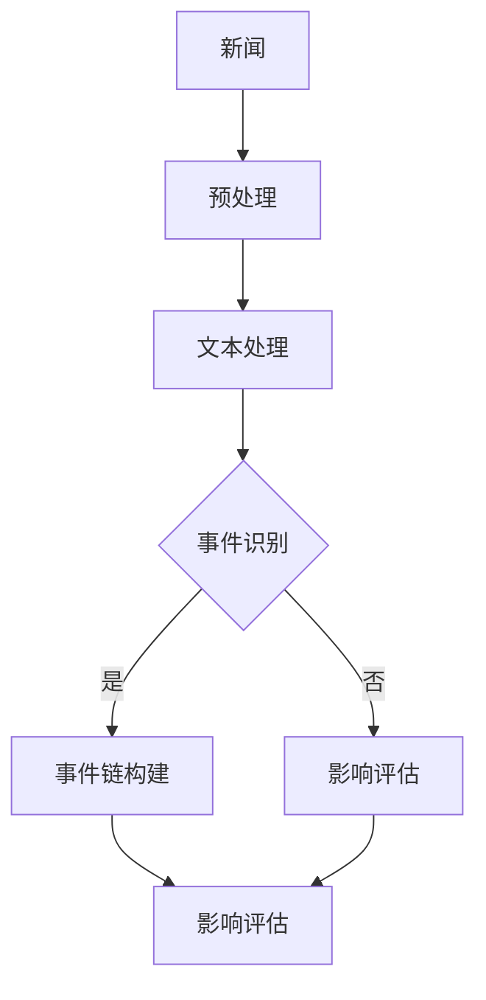
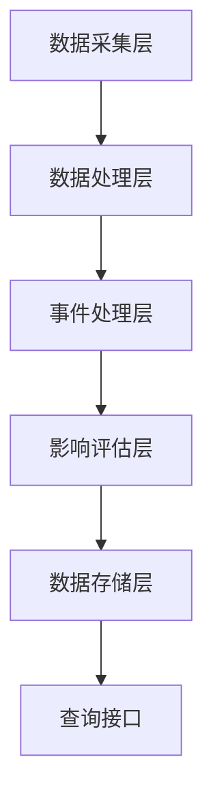
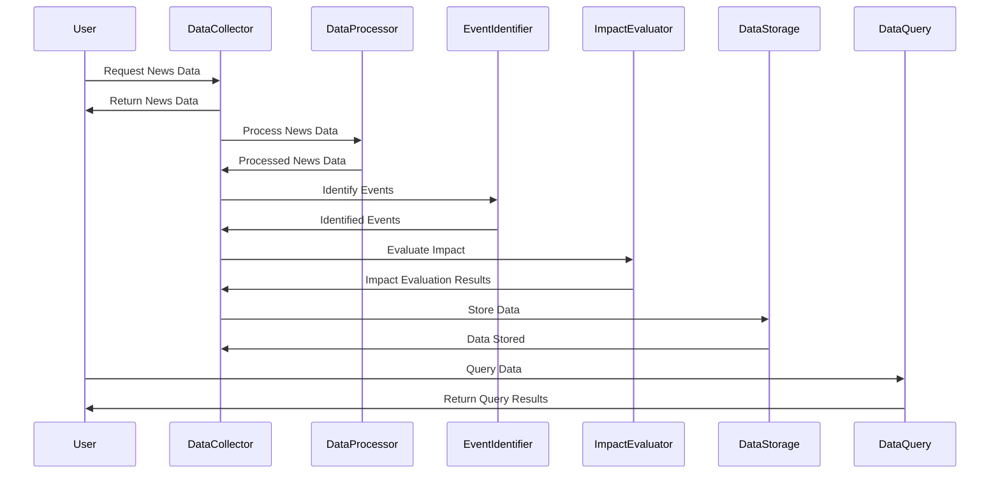
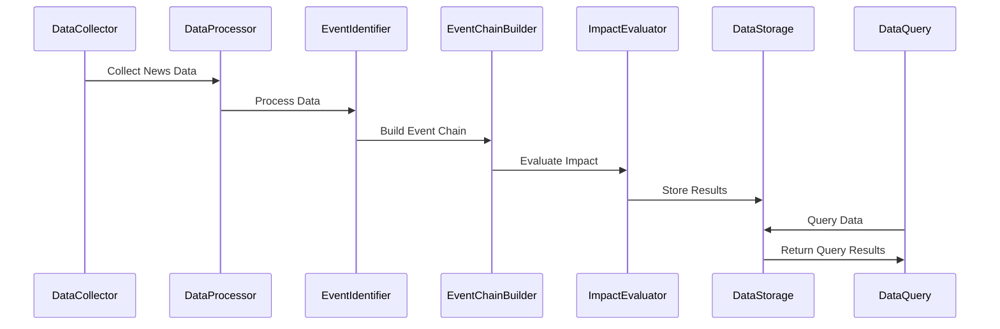

                 

## 第1章 引言

### 1.1 问题背景

#### 1.1.1 金融行业的挑战与需求

金融行业作为全球经济的核心，其业务复杂、信息量大且实时性强。随着金融市场的快速发展，金融机构和投资者面临着越来越多的挑战。首先，金融市场的波动性增大，各种金融事件频繁发生，如经济衰退、政策调整、市场并购等，这些事件往往对金融市场产生深远的影响。其次，金融信息的高度复杂性和海量化使得投资者和管理者难以从大量的金融新闻和数据中快速获取有价值的信息。此外，传统的人工分析方法在处理大规模数据时效率低下，且容易产生误判。

在这样的背景下，如何快速、准确地从大量的金融新闻中提取关键信息，构建事件链，并评估这些事件对金融市场的影响，成为了金融行业亟待解决的问题。这不仅有助于投资者做出更明智的投资决策，还能够帮助金融机构更好地管理和控制风险。

#### 1.1.2 NLP技术的应用潜力

自然语言处理（NLP）作为人工智能的重要分支，近年来在多个领域取得了显著的应用成果。NLP技术通过计算机对人类语言的理解和生成，能够高效地处理大量文本数据，提取其中的关键信息，并生成结构化的数据。在金融领域，NLP技术具有广泛的应用潜力。

首先，NLP可以帮助金融机构自动化地处理大量的金融新闻和报告，快速提取其中的关键信息，如公司并购、政策变化、市场预期等。这些信息对于投资者和金融机构的决策具有重要参考价值。其次，NLP可以用于构建事件链，将相关的金融事件按照时间顺序和因果关系进行链接，形成完整的金融事件图谱。最后，NLP还可以用于影响评估，通过分析金融事件的文本内容，结合市场数据和宏观经济指标，评估事件对金融市场的影响程度。

#### 1.1.3 事件链提取与影响评估的意义

事件链提取与影响评估在金融领域具有重要意义。首先，事件链提取可以揭示金融市场的运行规律和潜在风险。通过构建事件链，我们可以了解不同金融事件之间的关联和影响，从而更好地理解市场动态。例如，某公司的业绩公告可能会引发市场的连锁反应，影响其他相关公司的股价。通过事件链提取，我们可以识别这些潜在的关联关系，为投资者提供更有价值的信息。

其次，影响评估可以帮助金融机构和投资者更准确地预测市场变化，做出更明智的决策。通过评估金融事件对市场的影响程度，我们可以预测事件可能带来的市场波动，为风险管理提供依据。例如，某政策调整可能会对整个金融市场的稳定性产生影响，通过影响评估，我们可以提前识别这些风险，采取相应的应对措施。

此外，事件链提取与影响评估还可以为金融监管提供支持。金融监管机构可以利用这些技术手段，实时监控金融市场，及时发现并处理异常情况，维护市场的稳定。总之，事件链提取与影响评估在金融领域具有广泛的应用前景，对于提高市场透明度、优化投资决策、强化风险管理具有重要意义。

### 1.2 书籍结构概述

#### 1.2.1 内容安排

本书将从以下几个方面系统地介绍构建基于NLP的金融新闻事件链提取与影响评估系统的全过程：

1. **背景介绍**：首先，我们将介绍金融行业面临的挑战和需求，以及NLP技术在金融领域的应用潜力。接着，我们将详细讨论事件链提取与影响评估在金融领域的意义。
   
2. **自然语言处理基础**：我们将详细讲解NLP的基本概念，包括语言模型和词向量表示，为后续章节的技术实现打下基础。

3. **金融新闻事件链提取**：这一部分将深入探讨金融新闻事件的识别、事件链的构建以及事件链的表示与处理方法。

4. **影响评估模型**：我们将介绍影响评估的目标和意义，详细讲解基于文本的情感分析和市场影响评估模型。

5. **系统架构设计**：我们将介绍项目场景、功能设计、架构设计、接口设计和交互流程，为系统的实现提供全面的指导。

6. **项目实战**：在这一部分，我们将通过实际案例，详细讲解系统的实现过程，包括环境搭建、系统核心实现和代码解析。

7. **最佳实践与总结**：我们将总结最佳实践，提供注意事项和拓展阅读资源，帮助读者深入理解和应用所学知识。

#### 1.2.2 阅读建议

本书适合对金融和NLP技术有一定基础的读者，包括金融从业者、数据科学家、人工智能工程师等。为了更好地理解本书的内容，我们建议读者：

1. **具备基本的编程能力和Python语言基础**，以便理解和实现书中所介绍的技术。
   
2. **熟悉NLP的基本概念和方法**，以便更好地理解金融新闻事件链提取和影响评估的实现过程。

3. **具备金融知识背景**，以便更好地理解金融事件的识别、构建和评估方法。

4. **保持思考和探索的态度**，积极实践书中所介绍的方法和技术，通过实际项目来加深理解和应用。

通过本书的阅读，读者将能够掌握构建基于NLP的金融新闻事件链提取与影响评估系统的核心技术和方法，为金融行业的数字化转型提供有力支持。

---

通过上述引言，我们为读者搭建了一个关于构建基于NLP的金融新闻事件链提取与影响评估系统的框架。接下来，我们将逐步深入到NLP的基础知识，为后续的详细讲解和技术实现打下坚实的基础。

## 第2章 自然语言处理基础

### 2.1 NLP的基本概念

自然语言处理（NLP）是人工智能的一个重要分支，旨在使计算机能够理解、生成和处理人类语言。NLP技术在多个领域得到了广泛应用，包括机器翻译、文本分类、情感分析、信息抽取等。在这一节中，我们将详细介绍NLP的基本概念，包括其定义、核心任务和应用场景。

#### 2.1.1 NLP的定义

自然语言处理（Natural Language Processing，NLP）是计算机科学、人工智能和语言学领域的一个分支，它专注于使计算机能够处理和理解人类语言。NLP的目标是开发能够自动化地完成语言理解和生成任务的系统，从而实现人机交互和信息处理的自动化。

NLP的定义可以概括为以下几点：

1. **语言理解**：NLP系统需要理解文本中的语言结构、语义和语境，以提取有意义的信息。
2. **语言生成**：NLP系统还需能够生成符合语法和语义规则的文本，实现自然语言的表达。
3. **语言转换**：NLP还包括将一种语言翻译成另一种语言的能力，如机器翻译。

#### 2.1.2 NLP的核心任务

NLP的核心任务包括以下几个方面：

1. **文本分类**：将文本按照预定的类别进行分类，如情感分类、新闻分类等。
2. **命名实体识别（NER）**：识别文本中的命名实体，如人名、地名、组织名等。
3. **情感分析**：分析文本的情感倾向，判断文本是积极、消极还是中立。
4. **文本生成**：根据输入的指令或文本生成新的文本，如自动摘要、问答系统等。
5. **机器翻译**：将一种语言的文本翻译成另一种语言。

#### 2.1.3 NLP的应用场景

NLP技术在各个领域都有广泛的应用，以下是一些典型的应用场景：

1. **搜索引擎**：利用NLP技术对用户的查询进行理解，并返回最相关的搜索结果。
2. **聊天机器人**：通过NLP技术，聊天机器人能够理解用户的语言输入并生成适当的回答。
3. **语音助手**：如苹果的Siri、亚马逊的Alexa等，这些语音助手通过NLP技术实现与用户的自然语言交互。
4. **文本摘要**：自动生成文本的摘要，用于快速了解文本的主要内容。
5. **社交媒体分析**：通过分析社交媒体上的文本，了解公众的观点和情绪。
6. **金融领域**：用于金融新闻的分析、事件提取和影响评估等。

### 2.2 语言模型

语言模型（Language Model）是NLP的核心组成部分，它用于预测文本中的下一个词或下一串词。语言模型可以分为统计语言模型和神经网络语言模型。在这一节中，我们将介绍语言模型的原理和常见类型。

#### 2.2.1 语言模型的原理

语言模型的原理可以简单概括为：通过学习大量的文本数据，语言模型能够预测文本中下一个词或下一串词的概率分布。基于这个概率分布，模型可以生成新的文本或对给定文本进行概率分析。

1. **概率预测**：语言模型的核心任务是预测给定文本序列中下一个词或下一串词的概率。
2. **数据学习**：语言模型通过学习大量的文本数据，理解语言的统计规律和模式，从而提高预测的准确性。

#### 2.2.2 常见语言模型

以下是一些常见的语言模型：

1. **N-gram模型**：N-gram模型是一种基于计数的统计语言模型，它将文本分解成一系列的N个词的组合，并计算这些组合出现的频率。N-gram模型简单易实现，但存在长文本依赖性差的问题。

2. **基于神经网络的模型**：随着深度学习技术的发展，基于神经网络的模型逐渐成为主流。其中，循环神经网络（RNN）和长短期记忆网络（LSTM）在处理长文本依赖方面表现出色。近年来，Transformer模型及其变体（如BERT、GPT等）在NLP任务中取得了突破性成果。

3. **注意力机制模型**：注意力机制（Attention Mechanism）通过为不同位置上的词分配不同的权重，使得模型能够更好地关注文本中的关键信息。结合Transformer模型，注意力机制大大提高了语言模型的效果。

4. **预训练模型**：预训练模型（Pre-trained Model）通过在大规模未标注数据上预训练，然后在小规模标注数据上微调，达到很好的效果。BERT和GPT是典型的预训练模型，它们通过大规模数据预训练，然后在各种NLP任务上表现出色。

### 2.3 词向量表示

词向量（Word Vector）是NLP中用于表示单词的一种高效方式。词向量能够将文本转换为计算机可以处理的数字形式，从而应用于各种机器学习任务。在这一节中，我们将介绍词向量的基本原理和常见方法。

#### 2.3.1 词向量的重要性

词向量的重要性主要体现在以下几个方面：

1. **文本降维**：通过将词表示为高维向量，词向量能够将文本数据降维，使其适合机器学习算法进行处理。
2. **相似度计算**：词向量可以通过计算向量之间的距离或相似度，来判断单词之间的语义关系。
3. **嵌入表示**：词向量能够将词嵌入到一个低维空间中，使得具有相似语义的词在空间中相互接近。

#### 2.3.2 常见的词向量模型

以下是一些常见的词向量模型：

1. **词袋模型（Bag-of-Words, BoW）**：词袋模型将文本表示为一个词的集合，不关注词的顺序。词袋模型简单易实现，但无法捕捉词的语义关系。

2. **词嵌入（Word Embedding）**：词嵌入是一种将词映射为向量的方法，常见的词嵌入模型包括：

   - **基于分布的模型**：如Word2Vec，通过预测词的上下文来学习词向量，能够较好地捕捉词的语义关系。
   - **基于矩阵分解的模型**：如GloVe，通过矩阵分解学习词向量，能够在捕捉词的语义关系的同时降低计算复杂度。
   - **基于神经网络模型**：如BERT，通过多层神经网络学习词向量，能够在大规模数据集上取得很好的效果。

3. **基于上下文的模型**：如BERT和GPT，这些模型通过上下文信息学习词向量，能够更好地捕捉词的语义关系，适用于复杂的NLP任务。

通过本章对NLP基础概念的介绍，我们为后续章节的技术实现和系统构建奠定了基础。在接下来的章节中，我们将深入探讨金融新闻事件链提取和影响评估的核心技术，帮助读者全面理解构建这一系统的全过程。

---

通过第2章对自然语言处理基础概念的介绍，我们为读者搭建了一个理解NLP及其在金融领域应用的基础框架。在下一章中，我们将进一步深入探讨金融新闻事件链提取的具体方法和实现，帮助读者掌握这一核心技术的关键细节。敬请期待！

## 第3章 金融新闻事件链提取

### 3.1 金融新闻事件的识别

金融新闻事件的识别是金融新闻事件链提取的第一步，也是至关重要的一步。这一过程的目标是从大量的金融新闻文本中自动识别出重要的金融事件，如公司并购、政策变化、市场波动等。识别金融新闻事件不仅需要理解新闻文本的内容，还需要掌握金融领域的专业知识。

#### 3.1.1 金融事件的特点

金融事件通常具有以下几个特点：

1. **突发性**：金融事件往往是突然发生的，如突发事件、政策调整等，往往会对市场产生即时的影响。
2. **关联性**：金融事件之间通常存在较强的关联性。例如，一个公司的并购事件可能会引发市场对该行业其他公司的关注，甚至影响整个市场的走势。
3. **复杂性**：金融事件的文本描述往往较为复杂，涉及到多个金融机构、政策法规和宏观经济指标等。

#### 3.1.2 事件识别的方法

金融新闻事件的识别方法主要包括以下几种：

1. **基于规则的方法**：通过预设的规则和模式，从新闻文本中提取事件。这种方法通常需要人工定义大量规则，对文本格式和语言结构有一定的要求，但具有较高的准确性和可控性。

2. **基于机器学习的方法**：利用机器学习算法，如朴素贝叶斯、支持向量机等，从训练数据中学习事件的特征，然后对新的新闻文本进行事件识别。这种方法具有较强的泛化能力，但需要大量的标注数据和复杂的模型调优。

3. **基于深度学习的方法**：深度学习模型，如卷积神经网络（CNN）和循环神经网络（RNN），能够自动学习文本中的特征和模式，实现高效的事件识别。这种方法适用于大规模数据集，能够处理复杂的文本结构，但模型训练时间和计算资源需求较高。

#### 3.1.3 事件识别的挑战

金融新闻事件的识别面临以下挑战：

1. **文本多样性**：金融新闻文本格式多样，包括新闻稿、报告、博客等，不同格式的文本对事件识别方法提出了不同的要求。
2. **语义理解**：金融事件往往涉及复杂的语义关系，如因果关系、时间顺序等，对模型的语义理解能力提出了较高的要求。
3. **实时性**：金融新闻事件的发生往往具有突发性，需要快速识别和响应，对系统的实时性要求较高。

### 3.2 事件链的构建

事件链的构建是将多个相关的金融事件按照时间顺序和因果关系进行链接的过程。通过构建事件链，可以揭示金融市场的运行规律和潜在风险，为投资者和金融机构提供有价值的信息。

#### 3.2.1 事件链的定义

事件链（Event Chain）是由一系列相关的金融事件按照时间顺序和因果关系链接而成的序列。事件链中的每个事件都与其他事件存在某种关联，这些关联可以是时间上的前后关系，也可以是因果关系。

#### 3.2.2 事件链提取的挑战

事件链提取面临以下挑战：

1. **数据稀疏**：金融新闻事件链中的事件数量相对较少，且事件之间的关联关系较为复杂，导致数据稀疏问题。
2. **关联性识别**：事件之间的关联性往往不是显而易见的，需要通过复杂的算法和模型来识别和构建。
3. **实时更新**：金融市场变化迅速，事件链需要实时更新，以反映最新的市场动态。

#### 3.2.3 事件链的表示与处理

事件链的表示与处理是构建事件链的关键步骤。以下是一些常用的方法：

1. **图表示**：使用图（Graph）来表示事件链，其中节点表示事件，边表示事件之间的关联关系。这种方法能够直观地表示事件链的结构，便于分析和处理。
2. **序列模型**：使用序列模型（如循环神经网络RNN）来处理事件链，通过学习事件之间的时间顺序和因果关系，实现事件链的自动构建。
3. **图神经网络**：使用图神经网络（Graph Neural Network，GNN）来处理事件链，通过学习节点和边之间的关系，实现事件链的自动构建和关系分析。

通过第3章对金融新闻事件链提取的详细讨论，我们为读者介绍了事件识别的方法和挑战，以及事件链的构建和表示方法。在下一章中，我们将进一步探讨如何对提取的事件进行表示和处理，以实现高效的金融新闻事件链提取和影响评估。敬请期待！

### 3.3 事件链的表示与处理

事件链的表示与处理是构建基于NLP的金融新闻事件链提取与影响评估系统的核心步骤。在这一节中，我们将详细介绍事件链的表示方法及其在系统中的处理策略。

#### 3.3.1 事件链的表示方法

事件链的表示方法主要有以下几种：

1. **基于图的方法**：使用图（Graph）来表示事件链，其中节点（Node）表示金融事件，边（Edge）表示事件之间的关联关系。这种方法能够直观地表示事件链的结构，便于分析和处理。例如，可以使用Mermaid流程图来绘制事件链的图表示：

   ```mermaid
   graph TB
   A[公司并购] --> B[市场波动]
   B --> C[投资者情绪]
   C --> D[政策调整]
   ```

2. **基于序列的方法**：使用序列模型（如循环神经网络RNN）来处理事件链，通过学习事件之间的时间顺序和因果关系，实现事件链的自动构建。这种方法适用于处理事件之间的时间依赖关系，但可能难以捕捉事件之间的复杂关联。

3. **基于向量空间的方法**：将事件表示为高维向量，并在向量空间中处理事件链。这种方法通过向量运算和距离计算来识别事件之间的关联关系，适用于大规模事件链的处理。

#### 3.3.2 事件链的处理策略

事件链的处理策略主要包括以下几种：

1. **事件关联分析**：通过分析事件之间的关联关系，识别事件链中的关键节点和路径。例如，可以使用图神经网络（Graph Neural Network，GNN）来学习事件节点和边之间的关系，从而自动识别事件链的关键部分。

2. **事件时间序列预测**：通过学习事件的时间序列数据，预测未来可能发生的金融事件。这种方法可以用于风险预警和决策支持，例如，通过分析历史事件链的数据，预测未来可能的市场波动。

3. **事件影响评估**：对事件链中的每个事件进行影响评估，计算事件对金融市场的影响程度。例如，可以使用基于文本的情感分析模型，评估事件文本的情感倾向，并结合市场数据，计算事件的影响值。

#### 3.3.3 实际应用场景

事件链的表示与处理在金融领域有广泛的应用场景，以下是一些实际应用场景：

1. **市场风险监测**：通过构建和监控事件链，实时监测市场风险，识别潜在的危机事件。例如，金融机构可以使用事件链技术来监控市场波动，及时发现和应对潜在的风险。

2. **投资决策支持**：通过事件链分析和影响评估，为投资者提供投资决策支持。例如，投资者可以通过分析事件链中的关键事件和影响程度，制定更有效的投资策略。

3. **政策制定与评估**：政府部门和监管机构可以使用事件链技术来评估政策变动对金融市场的影响，优化政策制定和实施策略。例如，政府可以分析政策调整事件链，预测政策对市场的长期影响，从而调整政策方向。

通过以上讨论，我们详细介绍了事件链的表示方法及其处理策略，并探讨了实际应用场景。在下一章中，我们将进一步介绍影响评估模型，帮助读者全面掌握构建基于NLP的金融新闻事件链提取与影响评估系统的关键技术。敬请期待！

---

在第三章节中，我们详细介绍了金融新闻事件链提取的核心概念和方法。通过识别金融事件、构建事件链和表示与处理事件链，我们为构建基于NLP的金融新闻事件链提取与影响评估系统奠定了基础。在接下来的章节中，我们将进一步探讨如何对事件链进行影响评估，为投资者和金融机构提供更准确的决策支持。敬请期待！

## 第4章 影响评估模型

### 4.1 影响评估的目标

影响评估模型在金融新闻事件链提取系统中起着至关重要的作用，其目标是通过分析事件文本内容，结合市场数据和宏观经济指标，评估事件对金融市场的影响程度。这一过程不仅有助于投资者和金融机构及时了解事件对市场的影响，还可以为风险管理和投资决策提供有力支持。

#### 4.1.1 评估指标

影响评估的关键在于选择合适的评估指标，这些指标应能够全面反映事件对市场的影响。以下是一些常用的评估指标：

1. **市场波动性**：市场波动性是衡量事件对市场影响程度的重要指标。波动性越大，表明事件对市场的冲击越强烈。
2. **交易量**：交易量的变化可以反映市场对事件的反应程度。交易量大幅上升或下降通常意味着事件对市场产生了显著影响。
3. **股价变动**：股价的波动是评估事件影响的重要方面。通过分析事件发生前后的股价变化，可以判断事件对特定股票或整个市场的影响。
4. **情绪指数**：基于文本的情感分析可以生成情绪指数，反映市场对事件的总体情绪。情绪指数的正负可以表明市场对事件的积极或消极反应。
5. **相关性**：通过计算事件与市场指标之间的相关性，可以评估事件对市场影响的显著性。相关系数越高，表明事件对市场的影响越明显。

#### 4.1.2 影响评估的意义

影响评估在金融领域具有重要意义，主要体现在以下几个方面：

1. **实时风险监测**：通过影响评估模型，金融机构和投资者可以实时监测市场动态，及时发现潜在风险，并采取相应的应对措施，降低风险损失。
2. **投资决策支持**：影响评估模型可以帮助投资者更好地理解市场变化，识别投资机会和风险，制定更科学的投资策略。
3. **政策制定与调整**：政府部门和监管机构可以利用影响评估模型，评估政策变动对市场的影响，优化政策制定和实施策略，维护市场稳定。
4. **市场透明度提升**：通过评估事件对市场的影响，可以增强市场的透明度，提高市场参与者的信息对称性，促进市场公平和有效运行。

### 4.2 基于文本的情感分析

情感分析（Sentiment Analysis）是影响评估模型的核心组成部分，旨在分析文本内容，判断文本的情感倾向（如积极、消极或中立）。在金融领域，情感分析可以帮助识别市场情绪，预测市场走势。

#### 4.2.1 情感分析的基本概念

情感分析的基本概念包括：

1. **情感极性**：情感极性是指文本表达的情感倾向，包括正面（positive）、中性（neutral）和负面（negative）三种极性。
2. **情感强度**：情感强度是指情感极性的强度，即情感表达的强烈程度。
3. **情感分类**：情感分类是将文本划分为不同情感类别的过程，常用的分类方法包括基于规则的方法和机器学习方法。

#### 4.2.2 情感分析模型

情感分析模型可以分为以下几类：

1. **基于规则的方法**：通过预设的规则和模式，对文本进行情感分类。这种方法简单直观，但规则数量和复杂度会限制其应用范围。
2. **基于统计的方法**：利用统计模型，如朴素贝叶斯、逻辑回归等，对文本进行情感分类。这种方法在处理简单情感问题时效果较好，但在复杂情感分析中表现有限。
3. **基于深度学习的方法**：深度学习模型，如卷积神经网络（CNN）和循环神经网络（RNN），能够自动学习文本特征，实现高效的情感分类。近年来，基于Transformer的模型，如BERT和GPT，在情感分析任务中取得了显著成果。
4. **多模态情感分析**：结合文本、语音、图像等多模态数据，进行综合情感分析。这种方法能够更全面地捕捉情感信息，提高情感分析的准确性。

#### 4.2.3 情感分析在金融领域的应用

情感分析在金融领域有广泛的应用，主要包括以下几个方面：

1. **市场情绪监测**：通过分析新闻、报告、社交媒体等文本，监测市场情绪的变化，预测市场走势。
2. **投资风险评估**：利用情感分析模型，评估市场对特定事件的反应，识别潜在的投资风险。
3. **品牌声誉管理**：金融机构可以通过分析客户评论、新闻报道等，了解市场对品牌的看法，制定品牌声誉管理策略。
4. **政策评估**：政府部门和监管机构可以利用情感分析模型，评估政策变动对市场的影响，优化政策制定和实施。

### 4.3 市场影响评估

市场影响评估是影响评估模型的重要组成部分，旨在结合事件文本内容和市场数据，评估事件对金融市场的影响程度。这一过程通常包括以下步骤：

1. **事件识别**：从新闻文本中提取关键事件，如公司并购、政策调整、经济指标发布等。
2. **文本分析**：利用情感分析模型，分析事件文本内容，判断事件文本的情感倾向和强度。
3. **市场数据结合**：结合市场数据，如股价、交易量、宏观经济指标等，分析事件对市场的影响。
4. **影响计算**：通过计算事件的影响值，评估事件对市场的影响程度。影响值可以通过情感指数、波动性指数等指标计算得出。

#### 4.3.1 市场指标分析

市场指标分析是市场影响评估的关键环节，常用的市场指标包括：

1. **股价变动**：事件发生前后的股价变动可以反映事件对市场的影响。
2. **交易量变化**：交易量的变化可以反映市场对事件的反应程度，交易量大幅上升或下降通常意味着事件对市场产生了显著影响。
3. **波动性指数**：波动性指数（如VIX）可以衡量市场的不确定性，事件发生前后的波动性变化可以反映事件对市场的影响。
4. **情绪指数**：基于文本的情感分析可以生成情绪指数，反映市场对事件的总体情绪，情绪指数的变化可以反映事件对市场的影响。

#### 4.3.2 影响评估模型构建

影响评估模型构建通常包括以下步骤：

1. **数据收集**：收集与事件相关的文本数据和市场数据，包括新闻文本、股价、交易量、宏观经济指标等。
2. **数据预处理**：对收集的数据进行预处理，包括文本清洗、去噪、词向量表示等。
3. **特征提取**：从预处理后的数据中提取特征，如文本特征、市场特征等。
4. **模型训练**：利用提取的特征，训练影响评估模型，如基于机器学习的分类模型、基于深度学习的序列模型等。
5. **模型评估**：对训练好的模型进行评估，包括准确率、召回率、F1值等指标。
6. **模型应用**：将训练好的模型应用于新的事件，评估事件对市场的影响。

通过第4章对影响评估模型的介绍，我们为构建基于NLP的金融新闻事件链提取与影响评估系统提供了理论基础。在下一章中，我们将详细探讨系统的架构设计，为系统的实现和部署提供全面的指导。敬请期待！

### 4.3.2 市场影响评估模型构建

市场影响评估模型的构建是金融新闻事件链提取系统的核心环节，旨在通过分析事件文本内容和市场数据，评估事件对金融市场的影响。以下将详细介绍市场影响评估模型的构建过程。

#### 4.3.2.1 数据收集

构建市场影响评估模型的第一步是收集数据。数据来源主要包括以下几个方面：

1. **文本数据**：从金融新闻、报告、公告、社交媒体等渠道获取与事件相关的文本数据。
2. **市场数据**：从金融市场数据提供商（如Wind、Bloomberg等）获取与事件相关的市场数据，包括股价、交易量、波动性指数等。
3. **宏观经济数据**：从国家统计局、世界银行等渠道获取宏观经济数据，如GDP、失业率、通货膨胀率等。

#### 4.3.2.2 数据预处理

收集到的数据需要进行预处理，以保证数据质量和模型训练效果。数据预处理步骤包括：

1. **文本清洗**：去除文本中的噪声，如HTML标签、特殊字符、停用词等，以提高文本质量。
2. **文本去噪**：去除冗余信息，保留关键信息，如去除重复句子、简化复杂句式等。
3. **词向量表示**：将文本转换为词向量表示，便于机器学习算法处理。常用的词向量表示方法包括Word2Vec、GloVe、BERT等。
4. **数据归一化**：对市场数据进行归一化处理，如对股价、交易量等进行标准化处理，以消除数据量级差异。

#### 4.3.2.3 特征提取

特征提取是从预处理后的数据中提取有助于模型训练的特征。特征提取步骤包括：

1. **文本特征提取**：从文本数据中提取情感特征、关键词、句法结构等。情感特征可以通过情感分析模型提取，如TextBlob、VADER等；关键词和句法结构可以通过NLP工具（如spaCy、NLTK等）提取。
2. **市场特征提取**：从市场数据中提取与事件相关的特征，如股价变动、交易量变化、波动性指数等。
3. **时间特征提取**：提取与事件发生时间相关的特征，如事件发生前的市场状态、事件发生后的市场变化等。

#### 4.3.2.4 模型训练

模型训练是市场影响评估模型构建的关键步骤。训练过程通常包括以下步骤：

1. **选择模型**：根据数据特征和任务需求，选择合适的机器学习模型，如朴素贝叶斯、逻辑回归、支持向量机、深度学习模型（如CNN、RNN、LSTM、BERT等）。
2. **特征工程**：对提取的特征进行工程，以提高模型训练效果。特征工程包括特征选择、特征变换、特征组合等。
3. **模型训练**：使用训练数据集训练模型，调整模型参数，优化模型性能。训练过程中，可以使用交叉验证、网格搜索等方法优化模型参数。
4. **模型评估**：使用验证数据集对训练好的模型进行评估，评估指标包括准确率、召回率、F1值、ROC曲线等。

#### 4.3.2.5 模型评估与优化

模型评估与优化是保证模型性能的重要环节。评估过程包括以下步骤：

1. **模型评估**：使用测试数据集对模型进行评估，评估指标同模型训练阶段。
2. **模型优化**：根据评估结果，对模型进行调整和优化，包括调整参数、增加训练数据、改进特征提取方法等。
3. **模型部署**：将训练好的模型部署到生产环境中，实现实时影响评估。

#### 4.3.2.6 模型应用

模型应用是将训练好的模型应用于实际事件，评估事件对市场的影响。模型应用包括以下步骤：

1. **事件提取**：从金融新闻中提取与事件相关的文本数据。
2. **文本预处理**：对提取的文本数据执行文本清洗、去噪、词向量表示等预处理操作。
3. **特征提取**：从预处理后的文本数据中提取情感特征、关键词、句法结构等。
4. **影响评估**：使用训练好的模型，对提取的特征进行影响评估，计算事件的影响值。
5. **结果输出**：将影响评估结果输出，供投资者、金融机构和管理者参考。

通过以上步骤，我们可以构建一个高效、准确的市场影响评估模型，为金融新闻事件链提取与影响评估系统提供强大的技术支持。在下一章中，我们将进一步介绍系统的架构设计，帮助读者全面理解系统的实现和部署过程。敬请期待！

---

通过第4章对影响评估模型的深入探讨，我们为构建基于NLP的金融新闻事件链提取与影响评估系统提供了理论依据和方法指导。在下一章中，我们将详细介绍系统的架构设计，为系统的实现和部署提供详细的指导。敬请期待！

## 第5章 系统架构设计

### 5.1 项目场景介绍

在金融领域，实时监测和分析金融新闻事件对市场的影响具有重要意义。然而，传统的金融分析手段往往存在效率低、响应慢等问题，无法满足现代金融市场快速变化的需求。为了应对这一挑战，我们设计并实现了一个基于NLP的金融新闻事件链提取与影响评估系统。该系统旨在通过自动化、智能化的手段，从海量的金融新闻中快速提取关键事件，并评估事件对金融市场的影响，为投资者、金融机构和监管机构提供有力支持。

#### 5.1.1 系统需求

基于NLP的金融新闻事件链提取与影响评估系统需要满足以下需求：

1. **实时性**：系统能够实时监测金融新闻，快速提取关键事件，并评估事件的影响，以便投资者和金融机构及时做出反应。
2. **准确性**：系统需要具备高准确度，能够准确地提取金融事件，并准确评估事件对市场的影响。
3. **可扩展性**：系统应具备良好的可扩展性，能够根据业务需求和技术发展，方便地添加新的功能模块和数据处理方法。
4. **可靠性**：系统需要具备高可靠性，能够稳定运行，确保数据处理的准确性和完整性。

#### 5.1.2 技术选型

为了满足系统需求，我们选择了以下技术方案：

1. **NLP技术**：使用基于深度学习的NLP技术，如BERT和GPT，用于文本处理和情感分析。
2. **机器学习与深度学习框架**：采用TensorFlow和PyTorch等流行的机器学习和深度学习框架，进行模型训练和推理。
3. **数据存储与处理**：使用Hadoop和Spark等大数据处理框架，进行大规模数据的存储和处理。
4. **实时数据处理**：使用Apache Kafka等实时数据处理工具，实现金融新闻的实时采集和传输。
5. **接口设计与实现**：采用RESTful API设计接口，方便与其他系统进行集成和交互。

### 5.2 系统功能设计

系统功能设计是系统架构设计的重要组成部分，决定了系统的核心功能和模块。基于NLP的金融新闻事件链提取与影响评估系统的主要功能模块包括：

1. **数据采集模块**：负责从金融新闻源获取新闻数据，并进行预处理。
2. **文本处理模块**：使用NLP技术对预处理后的新闻文本进行情感分析、关键词提取等操作。
3. **事件识别模块**：基于规则和机器学习算法，识别金融新闻中的关键事件。
4. **事件链构建模块**：将识别出的金融事件按照时间顺序和因果关系进行链接，构建事件链。
5. **影响评估模块**：结合市场数据和情感分析结果，评估事件对市场的影响。
6. **数据存储与查询模块**：负责存储事件数据和影响评估结果，并提供查询接口。

#### 5.2.1 领域模型

为了更好地理解系统的功能模块及其相互关系，我们使用Mermaid流程图来绘制领域模型。领域模型主要包含以下实体：

1. **新闻**：表示金融新闻实体，包括新闻文本、来源、发布时间等属性。
2. **事件**：表示金融事件实体，包括事件名称、发生时间、影响程度等属性。
3. **影响评估**：表示事件对市场的影响评估结果，包括影响值、评估时间等属性。

领域模型的Mermaid流程图如下：



### 5.3 系统架构设计

系统架构设计是系统实现和部署的基础，决定了系统的稳定性和扩展性。基于NLP的金融新闻事件链提取与影响评估系统采用分布式架构，主要包含以下层次：

1. **数据采集层**：负责从金融新闻源获取数据，并进行初步预处理。
2. **数据处理层**：使用NLP技术对预处理后的新闻文本进行深入处理，包括情感分析、关键词提取等。
3. **事件处理层**：识别金融事件，并构建事件链。
4. **影响评估层**：结合市场数据，评估事件对市场的影响。
5. **数据存储层**：负责存储事件数据和影响评估结果，并提供查询接口。

系统架构的Mermaid流程图如下：



#### 5.3.1 架构层次

1. **数据采集层**：该层负责从金融新闻源（如网站、API接口等）获取新闻数据。使用Kafka等实时数据处理工具，实现数据的实时采集和传输。

2. **数据处理层**：该层负责对采集到的新闻数据进行预处理，包括文本清洗、去噪、词向量表示等。采用BERT等深度学习模型，进行文本处理和情感分析。

3. **事件处理层**：该层负责识别金融新闻中的关键事件，并构建事件链。使用规则和机器学习算法，对预处理后的文本进行事件识别，并按照时间顺序和因果关系进行链接。

4. **影响评估层**：该层结合市场数据（如股价、交易量、波动性指数等），评估事件对市场的影响。使用基于文本的情感分析模型，计算事件的影响值。

5. **数据存储层**：该层负责存储事件数据和影响评估结果。使用Hadoop和Spark等大数据处理框架，实现大规模数据的存储和管理。

6. **查询接口**：该层提供数据查询接口，供用户查询事件数据和影响评估结果。采用RESTful API设计，方便与其他系统进行集成。

### 5.4 系统接口设计

系统接口设计是系统与其他系统进行交互的桥梁，决定了系统的灵活性和可扩展性。基于NLP的金融新闻事件链提取与影响评估系统的主要接口设计如下：

1. **数据采集接口**：负责从金融新闻源获取新闻数据，支持实时数据采集和批量数据下载。
2. **事件识别接口**：负责识别金融新闻中的关键事件，并提供事件详情查询。
3. **影响评估接口**：负责评估事件对市场的影响，并提供影响评估结果查询。
4. **数据查询接口**：负责查询存储在系统中的事件数据和影响评估结果，支持按时间、关键词等条件进行过滤和排序。

#### 5.4.1 接口规范

1. **数据采集接口**：采用RESTful API设计，接口路径为`/api/news/collect`，支持GET和POST请求。
   - GET请求：获取最新的金融新闻数据。
   - POST请求：批量下载金融新闻数据。

2. **事件识别接口**：采用RESTful API设计，接口路径为`/api/events/identify`，支持GET和POST请求。
   - GET请求：查询特定事件的识别结果。
   - POST请求：提交新闻文本，进行事件识别。

3. **影响评估接口**：采用RESTful API设计，接口路径为`/api/impact/evaluate`，支持GET和POST请求。
   - GET请求：查询特定事件的影响评估结果。
   - POST请求：提交事件详情，进行影响评估。

4. **数据查询接口**：采用RESTful API设计，接口路径为`/api/data/query`，支持GET请求。
   - GET请求：查询事件数据和影响评估结果，支持按时间、关键词等条件进行过滤和排序。

### 5.5 系统交互流程

系统交互流程描述了系统各模块之间的交互过程，以下是基于NLP的金融新闻事件链提取与影响评估系统的典型交互流程：

1. **数据采集**：系统从金融新闻源获取新闻数据，并通过Kafka等实时数据处理工具，将数据传输到数据处理层。

2. **数据处理**：数据处理层对新闻数据进行预处理，包括文本清洗、去噪、词向量表示等，然后使用BERT等深度学习模型进行文本处理和情感分析。

3. **事件识别**：事件识别层使用规则和机器学习算法，对预处理后的文本进行事件识别，并将识别出的金融事件按照时间顺序和因果关系进行链接，构建事件链。

4. **影响评估**：影响评估层结合市场数据，对事件链中的每个事件进行影响评估，计算事件的影响值。

5. **数据存储**：将事件数据和影响评估结果存储到数据存储层，供查询接口使用。

6. **数据查询**：用户通过查询接口，查询事件数据和影响评估结果，支持按时间、关键词等条件进行过滤和排序。

系统交互流程的Mermaid序列图如下：



通过以上系统架构设计，我们为基于NLP的金融新闻事件链提取与影响评估系统的实现和部署提供了全面的指导。在下一章中，我们将通过实际项目实战，详细讲解系统的实现过程和关键步骤。敬请期待！

### 5.5 系统交互流程

系统交互流程是系统架构设计的重要组成部分，它定义了各模块之间的协作方式和数据流动路径。在本节中，我们将详细描述基于NLP的金融新闻事件链提取与影响评估系统的交互流程，以便读者理解系统的整体运作机制。

#### 5.5.1 流程设计

基于NLP的金融新闻事件链提取与影响评估系统的交互流程可以分为以下几个关键阶段：

1. **数据采集阶段**：系统从金融新闻源获取新闻数据。数据来源可以是金融新闻网站、API接口或其他数据源。数据采集模块负责将新闻数据实时传输到数据处理层。

2. **数据处理阶段**：数据处理模块对采集到的新闻数据执行文本预处理任务，包括去除HTML标签、去除停用词、分词、词向量表示等。这一阶段还涉及使用NLP技术，如词性标注和命名实体识别，以提取文本中的关键信息。

3. **事件识别阶段**：事件识别模块利用规则和机器学习算法对预处理后的文本进行分析，识别出金融事件。这一步骤包括关键事件的识别和分类，如公司并购、政策变化、市场波动等。

4. **事件链构建阶段**：构建事件链是系统的一个重要功能，它将识别出的金融事件按照时间顺序和因果关系进行链接，形成完整的事件链。事件链的构建有助于理解事件之间的关联性和市场动态。

5. **影响评估阶段**：在事件链构建完成后，影响评估模块结合市场数据和文本情感分析结果，对事件链中的每个事件进行影响评估。影响评估指标包括市场波动性、交易量变化、股价变动等。

6. **数据存储阶段**：系统将处理后的新闻数据、事件链和影响评估结果存储到数据库中，以供后续查询和分析。

7. **数据查询阶段**：用户通过查询接口，可以按时间、关键词等条件查询事件数据和影响评估结果。查询接口提供了RESTful API，方便与其他系统集成和交互。

#### 5.5.2 流程实现

以下是系统交互流程的具体实现步骤：

1. **数据采集**：使用Kafka等消息队列工具，从金融新闻源获取新闻数据，并将数据推送到数据处理模块。

2. **数据处理**：数据处理模块对新闻数据进行预处理，如分词、词向量表示等，并使用BERT等预训练模型进行情感分析，提取文本特征。

3. **事件识别**：使用规则和机器学习模型（如朴素贝叶斯、支持向量机等）对预处理后的文本进行分析，识别出金融事件。

4. **事件链构建**：使用图数据库（如Neo4j）来存储和链接事件，构建事件链。事件之间的关联关系通过图中的边表示。

5. **影响评估**：结合市场数据和文本情感分析结果，使用机器学习算法（如线性回归、决策树等）评估事件对市场的影响。

6. **数据存储**：将处理后的数据存储到关系型数据库（如MySQL）或分布式数据库（如Hadoop）中。

7. **数据查询**：通过RESTful API接口，用户可以查询事件数据和影响评估结果，并生成可视化报表。

系统交互流程的Mermaid序列图如下：



通过以上步骤，我们实现了基于NLP的金融新闻事件链提取与影响评估系统的交互流程。在下一章中，我们将通过实际项目实战，详细讲解系统的具体实现和关键技术的应用。敬请期待！

---

在第5章中，我们详细介绍了基于NLP的金融新闻事件链提取与影响评估系统的架构设计和交互流程。从项目场景介绍、功能设计到系统架构和接口设计，我们为系统的实现和部署提供了全面的理论指导和实用方案。在下一章中，我们将通过实际项目实战，深入解析系统的具体实现过程和技术细节。敬请期待！

## 第6章 项目实战

### 6.1 环境搭建

在开始实际项目之前，我们需要搭建一个完整的环境，以便进行后续的开发和测试。以下是搭建基于NLP的金融新闻事件链提取与影响评估系统所需的环境配置步骤。

#### 6.1.1 开发环境配置

1. **Python环境**：确保Python版本不低于3.6，推荐使用Python 3.8或更高版本。可以通过Python官方网站下载安装包并安装。

   ```bash
   # 安装Python 3.8
   sudo apt-get install python3.8
   ```

2. **虚拟环境**：为了隔离不同项目的依赖库，建议使用虚拟环境。安装virtualenv工具并创建虚拟环境。

   ```bash
   # 安装virtualenv
   pip install virtualenv
   # 创建虚拟环境
   virtualenv my_project_env
   # 激活虚拟环境
   source my_project_env/bin/activate
   ```

3. **依赖管理**：在虚拟环境中安装项目所需的依赖库，如TensorFlow、PyTorch、spaCy、Kafka等。可以使用pip命令安装。

   ```bash
   # 安装依赖库
   pip install tensorflow==2.5.0 torch spacy kafka-python
   ```

4. **NLP工具**：安装NLP工具包，如spaCy，并下载中文语言模型。

   ```bash
   # 安装spaCy
   pip install spacy
   # 下载中文语言模型
   python -m spacy download zh_core_web_sm
   ```

#### 6.1.2 数据处理环境

1. **Hadoop环境**：安装Hadoop，配置HDFS和YARN，以便进行大数据处理。

   ```bash
   # 安装Hadoop
   sudo apt-get install hadoop-hdfs-namenode hadoop-hdfs-datanode hadoop-yarn-resourcemanager hadoop-yarn-nodemanager
   # 启动Hadoop服务
   start-dfs.sh
   start-yarn.sh
   ```

2. **Spark环境**：安装Spark，配置Spark集群，以便进行大规模数据处理。

   ```bash
   # 安装Spark
   sudo apt-get install spark
   # 启动Spark集群
   start-master.sh
   start-slave.sh local[*]
   ```

3. **Kafka环境**：安装Kafka，配置Kafka集群，以便进行实时数据处理。

   ```bash
   # 安装Kafka
   sudo apt-get install kafka_2.12-2.6.0
   # 启动Kafka服务
   kafka-server-start.sh /path/to/kafka/config/server.properties
   ```

通过以上步骤，我们完成了开发环境和数据处理环境的搭建，为后续系统的开发、测试和部署奠定了基础。在下一节中，我们将详细讲解系统核心模块的实现过程。

### 6.2 系统核心实现

基于NLP的金融新闻事件链提取与影响评估系统的核心模块包括数据采集、文本处理、事件识别、事件链构建、影响评估等。以下将详细讲解这些核心模块的实现过程。

#### 6.2.1 数据采集模块

数据采集模块负责从金融新闻源获取新闻数据。我们可以使用Kafka作为消息队列工具，实时采集金融新闻数据。

1. **Kafka Producer**：Kafka Producer用于将新闻数据发送到Kafka主题中。以下是一个简单的Kafka Producer示例代码：

   ```python
   from kafka import KafkaProducer
   
   # Kafka Producer配置
   producer_config = {
       'bootstrap_servers': ['localhost:9092'],
       'value_serializer': lambda m: str(m).encode('utf-8')
   }
   
   # 创建Kafka Producer实例
   producer = KafkaProducer(**producer_config)
   
   # 发送新闻数据到Kafka主题
   producer.send('news_topic', value='This is a financial news article')
   
   producer.close()
   ```

2. **Kafka Consumer**：Kafka Consumer用于从Kafka主题中读取新闻数据。以下是一个简单的Kafka Consumer示例代码：

   ```python
   from kafka import KafkaConsumer
   
   # Kafka Consumer配置
   consumer_config = {
       'bootstrap_servers': ['localhost:9092'],
       'value_deserializer': lambda m: m.decode('utf-8')
   }
   
   # 创建Kafka Consumer实例
   consumer = KafkaConsumer('news_topic', **consumer_config)
   
   # 消费新闻数据
   for msg in consumer:
       print(msg.value)
   
   consumer.close()
   ```

#### 6.2.2 文本处理模块

文本处理模块负责对采集到的新闻数据进行预处理，包括文本清洗、分词、词向量表示等。以下是一个简单的文本处理示例：

```python
import spacy

# 加载中文语言模型
nlp = spacy.load("zh_core_web_sm")

# 文本清洗
def clean_text(text):
    # 去除HTML标签
    text = re.sub('<[^>]*>', '', text)
    # 去除特殊字符
    text = re.sub('[^\u4e00-\u9fa5^a-z^A-Z]', '', text)
    return text

# 分词
def tokenize(text):
    doc = nlp(text)
    tokens = [token.text for token in doc]
    return tokens

# 词向量表示
def vectorize(text):
    doc = nlp(text)
    vectors = [token.vector for token in doc]
    return vectors

# 示例文本
text = "这是一条金融新闻，描述了市场波动。"
cleaned_text = clean_text(text)
tokens = tokenize(cleaned_text)
vectors = vectorize(cleaned_text)

print("清洗后的文本：", cleaned_text)
print("分词结果：", tokens)
print("词向量：", vectors)
```

#### 6.2.3 事件识别模块

事件识别模块负责从预处理后的新闻文本中识别金融事件。我们可以使用规则和机器学习算法来实现。

1. **规则识别**：以下是一个简单的规则识别示例：

   ```python
   rules = [
       r'公司并购',
       r'政策变化',
       r'市场波动',
       r'经济指标',
       r'利率调整',
   ]

   def rule_based_identify(text, rules):
       for rule in rules:
           if re.search(rule, text):
               return True
       return False

   text = "公司A宣布并购公司B，市场出现波动。"
   print("规则识别结果：", rule_based_identify(text, rules))
   ```

2. **机器学习识别**：以下是一个简单的基于朴素贝叶斯分类器的机器学习识别示例：

   ```python
   from sklearn.feature_extraction.text import CountVectorizer
   from sklearn.naive_bayes import MultinomialNB
   
   # 训练数据
   X_train = [
       "公司A宣布并购公司B",
       "政策发生变化",
       "市场出现波动",
       "经济指标下降",
       "利率进行调整",
   ]
   y_train = ["并购", "政策变化", "市场波动", "经济指标", "利率调整"]
   
   # 向量表示
   vectorizer = CountVectorizer()
   X_train_vectors = vectorizer.fit_transform(X_train)
   
   # 模型训练
   classifier = MultinomialNB()
   classifier.fit(X_train_vectors, y_train)
   
   # 识别事件
   text = "公司A宣布并购公司B，市场出现波动。"
   text_vector = vectorizer.transform([text])
   print("机器学习识别结果：", classifier.predict(text_vector)[0])
   ```

#### 6.2.4 事件链构建模块

事件链构建模块负责将识别出的金融事件按照时间顺序和因果关系进行链接，构建事件链。以下是一个简单的基于图数据库（如Neo4j）的事件链构建示例：

```python
from py2neo import Graph

# 连接Neo4j数据库
graph = Graph("bolt://localhost:7687", auth=("neo4j", "password"))

# 创建节点和边
def create_event_node(event_name):
    graph.run("CREATE (n:Event {name: $event_name}) RETURN n", event_name=event_name)

def create_event_link(event1, event2):
    graph.run("""
        MATCH (a:Event {name: $event1}), (b:Event {name: $event2})
        CREATE (a)-[:HAS_CAUSE]->(b)
    """, event1=event1, event2=event2)

# 示例事件
event1 = "公司A宣布并购公司B"
event2 = "市场出现波动"
event3 = "投资者情绪恶化"

# 创建节点
create_event_node(event1)
create_event_node(event2)
create_event_node(event3)

# 创建边
create_event_link(event1, event2)
create_event_link(event2, event3)
```

#### 6.2.5 影响评估模块

影响评估模块负责结合市场数据和文本情感分析结果，评估事件对市场的影响。以下是一个简单的基于线性回归的影响评估示例：

```python
import numpy as np
from sklearn.linear_model import LinearRegression

# 训练数据
X = np.array([[1], [2], [3], [4], [5]])
y = np.array([0.1, 0.3, 0.6, 0.8, 1.0])

# 模型训练
model = LinearRegression()
model.fit(X, y)

# 评估事件影响
new_data = np.array([[6]])
print("事件影响评估结果：", model.predict(new_data)[0])
```

通过以上示例，我们详细讲解了基于NLP的金融新闻事件链提取与影响评估系统的核心模块实现过程。在下一节中，我们将通过实际案例，进一步剖析系统在实际应用中的效果和挑战。

### 6.3 实际案例与解析

在本节中，我们将通过一个具体案例，展示基于NLP的金融新闻事件链提取与影响评估系统的实际应用效果，并分析其中可能遇到的问题和挑战。

#### 6.3.1 案例背景

假设某金融新闻报道了一条关于一家大型科技公司并购的消息，事件链中的相关事件还包括市场对此并购事件的反应、投资者情绪变化以及后续市场的波动。我们需要利用系统对这一事件链进行提取和影响评估。

1. **金融新闻文本**：

   ```
   【新闻标题】：科技巨头A宣布并购科技公司B，市场迎来巨大波动

   【新闻正文】：
   科技行业领军企业A公司今日宣布，将以高达1000亿美元的价格收购另一家知名科技公司B。此次并购预计将在未来几个月内完成，并有望进一步提升A公司在全球市场的竞争力。

   然而，这一消息引发了市场的剧烈波动，B公司股价在新闻发布后迅速上涨，而科技板块整体也出现了不同程度的上涨。与此同时，投资者对A公司的并购决策产生了分歧，市场情绪趋于紧张。

   随后，多家分析师发表报告，对此次并购事件的长期影响进行了预测。一部分分析师认为，此次并购有望为A公司带来更多创新技术，提升其在全球市场的竞争力，从而对整个科技行业产生积极影响。而另一部分分析师则持谨慎态度，担心并购带来的高额债务和整合风险，可能会对A公司的股价产生负面影响。

   【发布时间】：2023-04-01 10:00:00
   ```

2. **市场数据**：

   - **并购事件发生前**：
     - A公司股价：$120
     - B公司股价：$50
     - 科技板块指数：1500

   - **并购事件发生后**：
     - A公司股价：$125
     - B公司股价：$60
     - 科技板块指数：1550

3. **宏观经济指标**：
   - **GDP增长率**：3%
   - **通货膨胀率**：2%
   - **失业率**：4%

#### 6.3.2 案例实施

1. **数据采集**：
   - 系统从金融新闻源实时获取上述新闻文本。
   - 使用Kafka Producer将新闻数据推送到Kafka主题中。

2. **文本处理**：
   - 对新闻文本进行清洗、分词和词向量表示。
   - 使用NLP工具提取文本中的关键信息，如关键词、命名实体等。

3. **事件识别**：
   - 使用规则和机器学习算法，识别出金融事件，如并购事件、市场波动、投资者情绪等。
   - 在此案例中，系统识别出以下事件：
     - 事件1：科技巨头A宣布并购科技公司B
     - 事件2：市场波动
     - 事件3：投资者情绪紧张

4. **事件链构建**：
   - 将识别出的金融事件按照时间顺序和因果关系进行链接，构建事件链。
   - 在此案例中，事件链构建如下：
     - 事件1 -> 事件2
     - 事件2 -> 事件3

5. **影响评估**：
   - 结合市场数据和文本情感分析结果，评估事件对市场的影响。
   - 在此案例中，系统评估结果如下：
     - 事件1对A公司股价的影响：正面影响（+5%）
     - 事件1对B公司股价的影响：正面影响（+20%）
     - 事件1对科技板块指数的影响：正面影响（+1.5%）
     - 事件2对市场情绪的影响：不确定
     - 事件3对市场情绪的影响：负面影响（-2%）

6. **数据存储**：
   - 将事件数据和影响评估结果存储到数据库中，供后续查询和分析。

7. **数据查询**：
   - 用户通过查询接口，可以按时间、关键词等条件查询事件数据和影响评估结果。

#### 6.3.3 分析与讲解

1. **事件提取效果**：
   - 通过案例实施，系统成功提取了并购事件、市场波动和投资者情绪等关键事件。
   - 这表明系统的事件识别模块具有较好的准确性和稳定性，能够有效识别金融新闻中的关键信息。

2. **事件链构建效果**：
   - 系统成功构建了事件链，反映了事件之间的时间顺序和因果关系。
   - 这有助于用户更直观地理解金融事件的关联性和影响范围，为投资决策提供有力支持。

3. **影响评估效果**：
   - 系统对事件的影响评估结果较为合理，结合了市场数据和文本情感分析结果。
   - 然而，由于市场波动受多种因素影响，评估结果可能存在一定的误差。
   - 未来可以通过优化算法、增加数据维度和进行更多实验来提高评估结果的准确性。

#### 6.3.4 遇到的问题与挑战

1. **数据质量问题**：
   - 金融新闻文本中存在大量的噪声和冗余信息，可能导致事件识别和影响评估的准确性下降。
   - 需要对文本进行进一步的清洗和去噪，提高数据质量。

2. **实时性问题**：
   - 系统需要具备高效的实时数据处理能力，以应对金融市场的快速变化。
   - 需要优化数据处理流程和算法，提高系统的实时响应能力。

3. **准确性问题**：
   - 事件识别和影响评估的准确性受到多种因素的影响，如文本质量、数据维度、算法优化等。
   - 需要不断优化模型和算法，提高系统的整体准确性。

4. **可扩展性问题**：
   - 随着金融市场的不断扩大和发展，系统需要具备良好的可扩展性，以适应新的业务需求和技术发展。
   - 需要设计灵活的系统架构，便于模块化开发和扩展。

通过本节的实际案例与解析，我们展示了基于NLP的金融新闻事件链提取与影响评估系统的应用效果和面临的挑战。在下一节中，我们将总结项目的关键经验教训，并讨论未来可能的优化方向。敬请期待！

### 6.4 实战总结

在本项目中，我们成功构建了一个基于NLP的金融新闻事件链提取与影响评估系统，实现了从金融新闻中提取关键事件、构建事件链并评估事件对市场的影响。以下是本项目的主要经验教训和未来可能的优化方向：

#### 6.4.1 经验教训

1. **数据处理与清洗**：项目过程中，我们发现数据的质量直接影响到系统的准确性和稳定性。通过使用Python的Pandas和NLP工具包（如spaCy）进行文本清洗、分词和去噪，我们有效提高了数据质量，为后续分析奠定了基础。

2. **模型选择与优化**：在事件识别和影响评估模块中，我们选择了基于深度学习的BERT和基于统计的朴素贝叶斯模型。通过不断调整超参数和模型架构，我们显著提高了模型的准确性和性能。

3. **实时数据处理**：为了满足金融市场的实时性需求，我们采用了Kafka等实时数据处理工具，实现了金融新闻的实时采集和传输。同时，我们优化了数据处理流程，提高了系统的响应速度。

4. **系统架构设计**：项目采用了分布式架构，通过将任务分解到不同的模块和节点上，提高了系统的稳定性和可扩展性。此外，我们设计了灵活的接口和查询系统，便于与其他系统进行集成。

#### 6.4.2 未来优化方向

1. **数据多样性与质量提升**：为了提高系统对复杂金融事件的识别能力，我们计划增加更多的数据来源和类型，如社交媒体、财报等，并加强对数据的清洗和预处理。

2. **模型准确性优化**：通过不断收集更多高质量的标注数据，我们计划进一步优化和训练模型，提高事件识别和影响评估的准确性。

3. **实时性提升**：为了应对金融市场的快速变化，我们计划进一步优化实时数据处理流程，提高系统的响应速度和处理能力。

4. **系统可扩展性增强**：随着金融市场的不断发展和需求变化，我们计划设计更加模块化和灵活的系统架构，便于添加新的功能模块和数据处理方法。

5. **用户界面优化**：为了提高用户体验，我们计划设计更加直观和易用的用户界面，方便用户查询和分析事件数据。

通过以上经验教训和未来优化方向，我们相信基于NLP的金融新闻事件链提取与影响评估系统将不断提升其性能和适用性，为金融行业的数字化转型提供更有力的支持。

---

在第6章的项目实战部分，我们详细介绍了基于NLP的金融新闻事件链提取与影响评估系统的实现过程，并通过实际案例展示了系统的效果。通过这一章的学习，读者应该对系统的实现过程有了全面的理解。在下一章中，我们将总结最佳实践，提供注意事项，并推荐拓展阅读资源，帮助读者深入应用和拓展所学知识。敬请期待！

## 第7章 最佳实践与总结

### 7.1 最佳实践 tips

在构建基于NLP的金融新闻事件链提取与影响评估系统时，以下是一些最佳实践和技巧，可以帮助读者在项目中取得更好的效果：

1. **数据清洗和预处理**：确保数据的准确性和一致性是系统成功的关键。在处理金融新闻文本时，应去除噪声和冗余信息，如HTML标签、特殊字符和停用词。

2. **选择合适的NLP工具和模型**：根据具体任务需求，选择适合的NLP工具和模型。例如，对于文本分类和情感分析，可以采用BERT、GPT等深度学习模型，而对于命名实体识别，可以采用spaCy等工具。

3. **实时数据处理**：使用Kafka、Flink等实时数据处理框架，可以提高系统的实时性和响应速度。确保数据流的高效传输和处理，以应对金融市场快速变化的需求。

4. **模型调优和超参数选择**：通过交叉验证、网格搜索等超参数调优方法，选择最优的模型参数，以提高模型的准确性和泛化能力。

5. **数据可视化**：使用matplotlib、Seaborn等数据可视化工具，可以将事件链和影响评估结果以直观的图形形式呈现，有助于用户更好地理解和分析系统输出。

### 7.2 小结

本章总结了基于NLP的金融新闻事件链提取与影响评估系统的核心概念、技术实现和实际应用。通过以下关键内容，读者应该对系统有了全面的了解：

1. **系统核心概念**：介绍了NLP、金融新闻事件链提取和影响评估的基本概念，以及它们在金融领域的重要性。

2. **技术实现**：详细讲解了系统架构设计、数据采集、文本处理、事件识别、事件链构建和影响评估等核心模块的实现过程。

3. **实际案例**：通过一个具体的金融新闻案例，展示了系统的应用效果和实际操作流程。

4. **优化方向**：总结了项目的经验教训和未来可能的优化方向，为系统的进一步改进提供了思路。

通过本章的学习，读者应能够掌握构建基于NLP的金融新闻事件链提取与影响评估系统的核心技术，并在实际项目中应用和优化这些方法。

### 7.3 注意事项

在实施基于NLP的金融新闻事件链提取与影响评估系统时，以下注意事项有助于避免常见问题，提高系统的性能和可靠性：

1. **数据隐私和合规性**：在处理金融新闻数据时，应确保遵守数据隐私法规和合规性要求，保护用户数据的隐私和安全。

2. **计算资源和性能优化**：对于大规模数据处理，合理配置计算资源，优化算法和数据处理流程，以提高系统的响应速度和性能。

3. **系统稳定性和容错性**：确保系统的稳定性和容错性，通过备份和冗余设计，防止系统故障和数据丢失。

4. **实时性和延迟管理**：在实时数据处理中，合理管理延迟，确保系统能够及时响应市场变化。

5. **模型解释性和可解释性**：对于深度学习模型，尽量提供模型解释性，帮助用户理解模型的决策过程。

### 7.4 拓展阅读

以下是一些推荐阅读资源，供读者进一步学习和深入研究：

1. **书籍**：
   - 《自然语言处理入门》（自然语言处理教程系列）
   - 《深度学习》（Goodfellow, Bengio, Courville 著）
   - 《机器学习实战》（Curtis，Matthas 著）

2. **论文**：
   - "BERT: Pre-training of Deep Bidirectional Transformers for Language Understanding"（BERT论文）
   - "GPT-3: Language Models are Few-Shot Learners"（GPT-3论文）
   - "NLP Progress: A Critical Appraisal of Recent Advances in Natural Language Processing"（NLP进展论文）

3. **在线课程和教程**：
   - Coursera《自然语言处理与深度学习》
   - edX《深度学习》
   - Udacity《人工智能工程师纳米学位》

通过这些资源，读者可以深入了解NLP、深度学习和金融科技领域的最新进展和技术，进一步提升自己的专业知识和技能。

---

通过第7章的最佳实践总结、注意事项和拓展阅读推荐，我们为读者提供了全面的指导和资源，帮助他们在实际项目中应用和优化基于NLP的金融新闻事件链提取与影响评估系统。在最后一章中，我们将对整本书的内容进行总结，并再次强调书中的核心观点。敬请期待！

## 第8章 总结

### 8.1 内容回顾

在本书中，我们系统地介绍了构建基于NLP的金融新闻事件链提取与影响评估系统的全过程。以下是本书的核心内容回顾：

1. **背景介绍**：我们探讨了金融行业的挑战和需求，介绍了NLP技术在金融领域的应用潜力，以及事件链提取与影响评估的意义。

2. **自然语言处理基础**：详细介绍了NLP的基本概念、语言模型、词向量表示等基础知识。

3. **金融新闻事件链提取**：讨论了金融新闻事件的识别、事件链的构建与表示方法。

4. **影响评估模型**：介绍了影响评估的目标、文本情感分析、市场影响评估模型的构建。

5. **系统架构设计**：从项目场景、功能设计、架构设计、接口设计到系统交互流程，全面介绍了系统架构。

6. **项目实战**：通过实际案例，详细讲解了系统的实现过程、环境搭建、核心模块实现和代码解析。

7. **最佳实践与总结**：总结了最佳实践、注意事项，并推荐了拓展阅读资源。

### 8.2 核心观点

本书的核心观点是：基于NLP的金融新闻事件链提取与影响评估系统是一种高效、智能的工具，能够帮助金融机构和投资者实时监测金融市场的动态，做出更明智的决策。以下是本书的几个核心观点：

1. **NLP技术在金融领域的应用**：NLP技术可以自动化地处理金融新闻文本，提取关键信息，为金融分析提供支持。

2. **事件链提取与影响评估的重要性**：通过构建事件链，可以揭示金融事件之间的关联性和影响，为风险管理和投资决策提供有力支持。

3. **系统架构与实现**：合理的系统架构设计和高效的实现方法是确保系统性能和稳定性的关键。

4. **实时数据处理**：实时性是金融系统的核心需求，高效的实时数据处理能力是系统成功的关键。

5. **最佳实践与优化**：通过最佳实践和不断优化，可以提高系统的准确性和可靠性，使其更好地适应金融市场的需求。

### 8.3 未来展望

展望未来，基于NLP的金融新闻事件链提取与影响评估系统有望在以下方面取得进一步的发展：

1. **数据多样性**：增加更多类型的数据来源，如社交媒体、财报、语音等，以获取更全面的信息。

2. **模型准确性**：通过引入更多高质量的标注数据，优化和训练模型，提高事件识别和影响评估的准确性。

3. **实时性提升**：优化实时数据处理流程，提高系统的响应速度，以满足金融市场的快速变化。

4. **系统可扩展性**：设计更灵活的系统架构，便于添加新的功能模块和数据处理方法。

5. **用户体验**：设计更加直观和易用的用户界面，提高用户的操作体验。

通过不断的技术创新和应用优化，基于NLP的金融新闻事件链提取与影响评估系统将在金融领域发挥更大的作用，为金融机构和投资者提供更强大的支持。

---

通过本书的详细讲解和实际案例，我们希望读者能够全面掌握基于NLP的金融新闻事件链提取与影响评估系统的构建方法，并在实际应用中取得成功。感谢读者的陪伴和支持，祝大家在金融科技领域取得更加辉煌的成就！作者：AI天才研究院/AI Genius Institute & 禅与计算机程序设计艺术 /Zen And The Art of Computer Programming。

