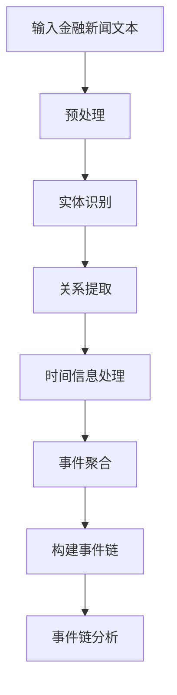
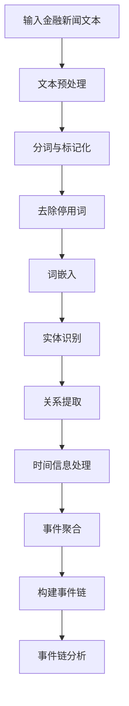
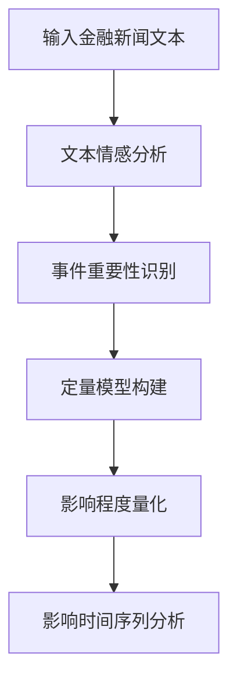
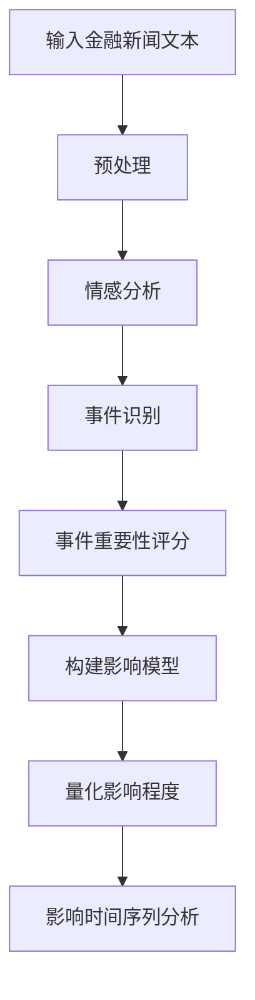

                 

### 文章标题

在金融科技飞速发展的今天，对金融新闻的深度分析已成为金融机构、投资机构、市场分析师及普通投资者的重要需求。构建一个基于自然语言处理（NLP）的金融新闻事件链提取与影响量化评估系统，不仅有助于捕捉市场动态，还能为投资决策提供有力的支持。本文将围绕这一主题，通过一步步分析推理，详细探讨如何实现这一系统，包括其核心概念、算法原理、系统设计及实战应用。

#### 关键词

- 金融新闻分析
- 自然语言处理
- 事件链提取
- 影响量化评估
- 系统架构设计

#### 摘要

本文将首先介绍金融新闻分析的重要性，以及为什么构建基于NLP的金融新闻事件链提取与影响量化评估系统具有实际意义。接着，我们将深入探讨NLP的核心概念与联系，为后续的算法讲解打下基础。随后，本文将详细解析用于金融新闻事件链提取与影响量化评估的算法原理，包括使用mermaid流程图和Python源代码进行说明。最后，我们将介绍系统分析与架构设计，以及项目实战的部分，包括环境安装、核心实现、代码解读和案例分析，并提供最佳实践技巧和小结。

### 目录大纲设计步骤

**步骤1: 了解书籍主题**

首先，我们需要明确书籍的主题是“构建基于NLP的金融新闻事件链提取与影响量化评估系统”。这一主题涵盖了NLP、金融新闻处理、事件链提取和影响量化评估等多个方面。这决定了我们的目录结构将围绕这些核心概念进行设计。

**步骤2: 设计背景介绍章节**

在背景介绍章节，我们将首先阐述NLP在金融新闻分析中的重要性。我们将讨论金融新闻对市场决策的影响，并解释为什么NLP技术是处理这些数据的理想工具。此外，我们还将探讨构建这一系统的实际意义，包括其潜在的商业价值和投资回报。

**步骤3: 核心概念与联系**

在第二部分，我们将详细阐述NLP的核心概念。这包括自然语言处理的基本原理、关键技术和应用场景。我们将使用mermaid流程图和ER实体关系图来展示这些概念之间的关系，帮助读者更好地理解。

**步骤4: 算法原理讲解**

在接下来的章节中，我们将深入讲解用于金融新闻事件链提取与影响量化评估的算法原理。我们将使用mermaid流程图和Python源代码来详细阐述这些算法，确保读者能够清晰地理解每个步骤。

**步骤5: 系统分析与架构设计**

在这一部分，我们将详细介绍系统的功能设计、架构设计和接口交互设计。我们将使用mermaid流程图和类图来展示系统的结构和功能，帮助读者了解系统是如何工作的。

**步骤6: 项目实战**

在项目实战部分，我们将介绍如何在实际环境中安装和配置系统，如何实现核心功能，以及如何进行代码分析和实际案例分析。

**步骤7: 最佳实践与小结**

最后，我们将提供一些最佳实践技巧，讨论可能遇到的问题和解决方案，并对全书进行小结和拓展阅读建议。

### 初步目录大纲

**第一部分: 问题背景与核心概念**

- **第1章: 金融新闻与NLP分析**
  - **1.1 金融新闻的重要性
  - **1.2 NLP在金融新闻分析中的应用
  - **1.3 为什么构建基于NLP的金融新闻事件链提取与影响量化评估系统**

- **第2章: NLP核心概念与联系**
  - **2.1 自然语言处理的基本概念
  - **2.2 关键技术介绍**
    - 文本预处理
    - 词嵌入
    - 语言模型
    - 语法分析
  - **2.3 NLP与金融新闻分析的联系**

- **第3章: 金融新闻事件链提取算法原理**
  - **3.1 事件链提取概述
  - **3.2 基于NLP的事件链提取算法
  - **3.3 算法mermaid流程图
  - **3.4 Python源代码与算法讲解**

- **第4章: 影响量化评估算法原理**
  - **4.1 影响量化评估概述
  - **4.2 基于NLP的影响量化评估算法
  - **4.3 算法mermaid流程图
  - **4.4 Python源代码与算法讲解**

**第二部分: 系统分析与架构设计**

- **第5章: 系统功能设计与实现**
  - **5.1 系统功能介绍
  - **5.2 系统功能实现细节

- **第6章: 系统架构设计与接口设计**
  - **6.1 系统架构设计概述
  - **6.2 系统接口设计细节
  - **6.3 系统交互设计

- **第7章: 系统交互设计与流程**
  - **7.1 系统交互设计概述
  - **7.2 系统流程设计细节

**第三部分: 项目实战**

- **第8章: 项目环境安装与配置**
  - **8.1 环境要求
  - **8.2 安装过程
  - **8.3 配置细节

- **第9章: 系统核心实现与代码分析**
  - **9.1 核心功能实现
  - **9.2 代码分析与解读

- **第10章: 实际案例分析**
  - **10.1 案例背景
  - **10.2 案例分析
  - **10.3 案例总结

- **第11章: 项目小结与反思**
  - **11.1 项目总结
  - **11.2 反思与改进建议

**第四部分: 最佳实践与拓展**

- **第12章: 最佳实践技巧**
  - **12.1 数据预处理技巧
  - **12.2 算法优化技巧
  - **12.3 系统部署技巧

- **第13章: 注意事项与风险防范**
  - **13.1 数据安全
  - **13.2 系统稳定性
  - **13.3 道德与法律问题

- **第14章: 小结与拓展阅读**
  - **14.1 书籍小结
  - **14.2 拓展阅读建议

### 确认无误后，开始撰写详细的章节内容。

### 第一部分：问题背景与核心概念

## 第1章：金融新闻与NLP分析

### 1.1 金融新闻的重要性

金融新闻是金融市场的重要组成部分，它包含了大量的市场动态、政策变化、公司公告等信息，这些信息对市场参与者的决策具有重要影响。金融新闻涵盖了股票市场、债券市场、外汇市场等多个领域，其内容丰富多样，包含价格变动、公司业绩、政策调整、行业动态等。

金融新闻的重要性主要体现在以下几个方面：

1. **投资决策依据**：投资者通过分析金融新闻，可以了解市场动态和潜在风险，为投资决策提供依据。例如，公司财报发布、重大并购事件等新闻，往往会引起股价的剧烈波动。

2. **市场趋势预测**：金融新闻能够反映市场趋势和投资者情绪，有助于预测市场未来的走势。通过分析金融新闻，可以识别出市场的热点和潜在风险点。

3. **政策分析**：政策调整和法规变化是影响金融市场的关键因素。金融新闻中的政策信息可以帮助投资者和分析师理解政策背景，预测政策对市场的影响。

4. **风险预警**：金融新闻中常常包含风险预警信息，如自然灾害、政治动荡等事件，这些信息对于投资者和管理风险具有重要意义。

### 1.2 NLP在金融新闻分析中的应用

自然语言处理（NLP）是人工智能的一个重要分支，它致力于使计算机能够理解、解释和生成人类语言。在金融新闻分析中，NLP技术可以应用于以下几个方面：

1. **文本分类与情感分析**：NLP可以用于对金融新闻进行分类，如将新闻分为公司公告、政策调整、市场动态等。同时，情感分析技术可以帮助识别新闻中的情感倾向，如积极、消极或中性。

2. **关键词提取与趋势分析**：通过提取新闻中的关键词和短语，可以分析市场热点和趋势。例如，通过监测某个特定词汇的出现频率和变化趋势，可以预测市场情绪和投资机会。

3. **事件提取与事件链构建**：NLP技术可以用于从金融新闻中提取重要事件，如公司并购、新产品发布等，并构建事件链，分析事件之间的关联性。

4. **主题模型与聚类分析**：主题模型可以帮助识别新闻中的主题分布，聚类分析则可以用于分析新闻的相似性和差异性。

### 1.3 为什么构建基于NLP的金融新闻事件链提取与影响量化评估系统

构建基于NLP的金融新闻事件链提取与影响量化评估系统具有重要的实际意义和商业价值，主要体现在以下几个方面：

1. **自动化数据处理**：金融新闻数据量大且多样，人工处理效率低下。NLP技术可以帮助自动化处理金融新闻，提高数据处理效率。

2. **实时监控与预警**：通过NLP技术，可以实时提取金融新闻中的关键事件和趋势，为投资者和分析师提供及时的监控和预警。

3. **投资决策支持**：事件链提取和影响量化评估可以帮助投资者更好地理解市场动态和潜在风险，为投资决策提供有力支持。

4. **风险管理和合规性**：系统可以帮助金融机构识别潜在风险和合规性问题，确保业务的合法性和安全性。

5. **商业竞争优势**：构建先进的NLP系统可以提高金融机构在金融科技领域的竞争力，增强其市场洞察力和决策能力。

综上所述，构建基于NLP的金融新闻事件链提取与影响量化评估系统，不仅有助于提高金融市场的效率和透明度，还为投资者和金融机构提供了强大的工具，使其能够在瞬息万变的市场环境中保持竞争优势。

## 第2章：NLP核心概念与联系

### 2.1 自然语言处理的基本概念

自然语言处理（NLP）是人工智能的一个重要分支，旨在使计算机能够理解、解释和生成人类语言。NLP的目标是通过模拟人类的语言理解能力，使计算机能够处理自然语言文本，从而实现人机交互和智能信息处理。

#### **语言模型**

语言模型是NLP的核心组成部分，用于预测一段文本的下一个词或短语。最常见的语言模型是n元模型，它基于过去n个词的历史信息来预测下一个词。例如，一元模型（n=1）只考虑当前词，而二元模型（n=2）则同时考虑前两个词。更高级的语言模型，如神经网络模型和变换器模型，能够更好地捕捉语言中的复杂结构和语义关系。

#### **词嵌入**

词嵌入（Word Embedding）是将词汇映射到固定维度的向量空间中，使得语义相似的词在向量空间中靠近。词嵌入通过将单词映射到密集的向量表示，有助于计算机理解和处理文本数据。常见的词嵌入方法包括基于统计的Word2Vec和基于神经网络的GloVe。

#### **文本预处理**

文本预处理是NLP中的基础步骤，旨在将原始文本转换为适合模型处理的格式。文本预处理通常包括以下步骤：

- **分词**：将文本分割为单词或词组。
- **标记化**：将文本转换为标记序列，每个标记对应一个单词或词组。
- **去除停用词**：去除常见的不相关词汇，如“的”、“了”等。
- **词形还原**：将不同形式的词转换为统一的词性标记。
- **词嵌入**：将单词转换为向量表示。

#### **语法分析**

语法分析（Syntax Analysis）是对文本中的句子结构进行解析，以理解句子的语法结构。常见的语法分析方法包括基于规则的方法和基于统计的方法。基于规则的方法使用一组语法规则来分析句子结构，而基于统计的方法则使用统计模型，如概率上下文无关文法（PCFG）和依赖树库（Dependency Tree）。

### 2.2 关键技术介绍

NLP技术主要包括文本预处理、词嵌入、语言模型、语法分析等。以下是对这些关键技术的详细介绍：

#### **文本预处理**

文本预处理是NLP中的基础步骤，其目的是将原始文本转换为适合模型处理的格式。常见的文本预处理步骤包括分词、标记化、去除停用词、词形还原和词嵌入。

- **分词**：分词是将文本分割为单词或词组的过程。例如，中文分词可能将“我爱北京天安门”分割为“我”、“爱”、“北京”、“天安门”。
- **标记化**：标记化是将文本转换为标记序列的过程，每个标记对应一个单词或词组。例如，“我爱北京天安门”可以标记为[我，爱，北京，天安门]。
- **去除停用词**：去除停用词是指删除常见的不相关词汇，如“的”、“了”等。这些词汇虽然对文本意义有一定影响，但通常对NLP任务的作用较小。
- **词形还原**：词形还原是将不同形式的词转换为统一的词性标记。例如，将“跑步”和“跑了”都还原为“跑步”。
- **词嵌入**：词嵌入是将单词转换为向量表示的过程。通过词嵌入，可以使计算机理解和处理文本数据。

#### **词嵌入**

词嵌入（Word Embedding）是将词汇映射到固定维度的向量空间中，使得语义相似的词在向量空间中靠近。词嵌入通过将单词映射到密集的向量表示，有助于计算机理解和处理文本数据。

常见的词嵌入方法包括基于统计的Word2Vec和基于神经网络的GloVe。Word2Vec是一种基于隐语义模型的词嵌入方法，通过训练词向量来捕捉词与词之间的语义关系。GloVe（Global Vectors for Word Representation）是一种基于全局上下文的词嵌入方法，通过同时考虑词的局部和全局上下文信息来生成词向量。

#### **语言模型**

语言模型（Language Model）是NLP中的核心组件，用于预测一段文本的下一个词或短语。语言模型通过学习大量文本数据，构建一个概率模型，用于预测下一个词的概率分布。

常见的语言模型包括基于n元模型的方法和基于神经网络的模型。n元模型（n-gram Model）是一种简单的语言模型，它基于过去n个词的历史信息来预测下一个词。例如，二元模型（Bigram Model）只考虑当前词和前一个词。更高级的语言模型，如神经网络模型（Recurrent Neural Network, RNN）和变换器模型（Transformer），能够更好地捕捉语言中的复杂结构和语义关系。

#### **语法分析**

语法分析（Syntax Analysis）是对文本中的句子结构进行解析，以理解句子的语法结构。语法分析有助于计算机理解和生成自然语言文本。

常见的语法分析方法包括基于规则的方法和基于统计的方法。基于规则的方法使用一组语法规则来分析句子结构，如概率上下文无关文法（PCFG）和依赖树库（Dependency Tree）。基于统计的方法则使用统计模型，如隐马尔可夫模型（Hidden Markov Model, HMM）和条件随机场（Conditional Random Field, CRF）。

### 2.3 NLP与金融新闻分析的联系

NLP在金融新闻分析中具有广泛的应用，通过NLP技术，可以对金融新闻进行自动化的处理和分析，从而提取有价值的信息。以下是一些具体的应用场景：

#### **文本分类与情感分析**

文本分类是将文本分为预定义的类别，如公司公告、政策调整、市场动态等。情感分析则用于识别文本中的情感倾向，如积极、消极或中性。通过文本分类和情感分析，可以快速识别金融新闻的关键信息，为投资决策提供支持。

#### **关键词提取与趋势分析**

关键词提取是从金融新闻中提取出重要的词汇和短语，这些关键词可以用于分析市场热点和趋势。通过监测关键词的出现频率和变化趋势，可以预测市场情绪和投资机会。

#### **事件提取与事件链构建**

事件提取是从金融新闻中提取重要事件，如公司并购、新产品发布等。事件链构建则是将这些事件关联起来，分析事件之间的因果关系和影响范围。通过事件提取和事件链构建，可以更全面地了解市场动态，为投资决策提供依据。

#### **主题模型与聚类分析**

主题模型可以帮助识别金融新闻中的主题分布，聚类分析则可以用于分析新闻的相似性和差异性。通过主题模型和聚类分析，可以深入挖掘金融新闻中的潜在信息，为市场分析和投资策略提供参考。

综上所述，NLP技术为金融新闻分析提供了强大的工具，通过文本分类、情感分析、关键词提取、事件提取、主题模型和聚类分析等方法，可以自动化处理和分析金融新闻，提取有价值的信息，为投资决策和市场分析提供支持。

### 第二部分：算法原理讲解

#### 第3章：金融新闻事件链提取算法原理

#### 3.1 事件链提取概述

事件链提取是自然语言处理（NLP）在金融新闻分析中的一个重要任务，旨在从大量的金融新闻中自动识别和提取出关键事件，并将这些事件以链式结构进行关联和呈现。事件链提取不仅有助于理解新闻中的关键信息，还能揭示事件之间的关联性，为市场分析和投资决策提供重要支持。

事件链提取的过程通常包括以下几个步骤：

1. **事件识别**：从文本中识别出具体的事件，例如公司并购、新产品发布、财报发布等。
2. **事件关联**：将识别出的多个事件进行关联，构建事件之间的逻辑关系，形成事件链。
3. **事件链分析**：对构建的事件链进行分析，提取事件链的特征和影响，评估事件对市场的影响程度。

#### 3.2 基于NLP的事件链提取算法

基于NLP的事件链提取算法通常结合了多种技术，包括实体识别、关系提取、时间信息处理和事件聚合等。以下是几种常用的事件链提取算法：

1. **基于规则的方法**：这种方法依赖于预定义的规则和模式匹配。例如，通过定义特定的关键词和短语模式来识别事件，并使用规则来关联事件。这种方法简单直观，但规则维护较为复杂，且容易遗漏复杂的事件。

2. **基于统计的方法**：这种方法使用统计学习技术，如条件随机场（CRF）、隐马尔可夫模型（HMM）等，来识别和关联事件。统计方法能够自动学习事件之间的关联模式，但需要大量标注数据进行训练。

3. **基于深度学习的方法**：这种方法使用深度神经网络，如循环神经网络（RNN）、长短期记忆网络（LSTM）和变换器（Transformer）等，来处理复杂的文本数据。深度学习方法能够自动捕捉文本中的语义信息，提取事件和关系，但训练过程较为复杂，需要大量的计算资源。

以下是一个基于深度学习的事件链提取算法的mermaid流程图：



#### 3.3 算法mermaid流程图



#### 3.4 Python源代码与算法讲解

下面是一个简单的基于自然语言处理的事件链提取算法的Python示例。这个示例使用了spaCy库进行文本预处理和实体识别，并使用自定义函数进行关系提取和事件聚合。

首先，安装必要的库：

```bash
pip install spacy
python -m spacy download en_core_web_sm
```

然后，编写Python代码：

```python
import spacy
from spacy.tokens import DocBin

# 加载预训练的spaCy模型
nlp = spacy.load("en_core_web_sm")

# 定义文本预处理函数
def preprocess_text(text):
    doc = nlp(text)
    tokens = [token.text for token in doc if not token.is_stop]
    return " ".join(tokens)

# 定义实体识别函数
def entity_recognition(text):
    doc = nlp(text)
    entities = [(ent.text, ent.label_) for ent in doc.ents]
    return entities

# 定义关系提取函数
def relation_extraction(doc):
    relations = []
    for token1, token2 in pairwise(doc):
        if token1.ent_iob_ == "B" and token2.ent_iob_ == "I":
            relations.append((token1.text, token2.text))
    return relations

# 定义事件聚合函数
def event_aggregation(entities, relations):
    events = []
    for entity, label in entities:
        related_entities = [rel[1] for rel in relations if entity in rel]
        event = (entity, label, related_entities)
        events.append(event)
    return events

# 定义构建事件链函数
def build_event_chain(events):
    event_chain = []
    for event in events:
        if not event[2]:
            event_chain.append(event)
    return event_chain

# 定义事件链分析函数
def event_chain_analysis(event_chain):
    # 进行事件影响评估、趋势分析等操作
    pass

# 测试文本
text = "Apple Inc. has just announced a new product line that will revolutionize the market."

# 预处理文本
preprocessed_text = preprocess_text(text)

# 识别实体
entities = entity_recognition(preprocessed_text)

# 提取关系
relations = relation_extraction(nlp(preprocessed_text))

# 聚合事件
events = event_aggregation(entities, relations)

# 构建事件链
event_chain = build_event_chain(events)

# 进行事件链分析
event_chain_analysis(event_chain)
```

在这个示例中，我们首先定义了文本预处理函数，用于去除停用词和标记化。然后，我们定义了实体识别、关系提取、事件聚合、构建事件链和事件链分析函数，这些函数共同实现了从文本到事件链提取的全过程。

通过这段代码，我们可以看到如何使用NLP技术从金融新闻文本中提取事件链。在实际应用中，事件链提取算法会更为复杂，需要考虑更多的语言特性和上下文信息，但基本流程是一致的。

### 第4章：影响量化评估算法原理

#### 4.1 影响量化评估概述

影响量化评估是指通过定量方法对金融新闻事件的影响程度进行评估和度量。在金融市场中，事件的影响量化评估对于投资者、分析师和金融机构具有重大意义。它不仅有助于识别事件对市场的潜在影响，还能为投资决策和风险管理提供科学依据。

影响量化评估的关键目标包括：

1. **事件影响程度的度量**：通过对事件的影响程度进行量化，可以更直观地了解事件对市场的具体影响。
2. **趋势分析和预警**：通过分析事件影响的时间序列数据，可以预测市场趋势，并提供提前预警。
3. **风险评估和优化**：对事件影响进行量化，有助于评估金融产品的风险，并制定相应的风险管理策略。

#### 4.2 基于NLP的影响量化评估算法

基于NLP的影响量化评估算法结合自然语言处理和定量分析方法，通过对金融新闻进行深入分析，实现对事件影响的量化。以下是一种常见的影响量化评估算法：

1. **文本情感分析**：通过情感分析技术，对金融新闻中的文本进行情感倾向分析，确定新闻内容的积极或消极程度。情感分析通常使用预训练的情感分析模型，如VADER或TextBlob。

2. **事件重要性识别**：使用关键词提取和主题模型，识别新闻中的关键事件和主题。通过对事件的重要性和相关性的分析，确定事件对市场的影响程度。

3. **定量模型构建**：基于事件的重要性和情感分析结果，构建定量模型对事件的影响程度进行量化。常用的模型包括回归分析、机器学习分类模型和时间序列分析等。

以下是一个基于NLP的影响量化评估算法的mermaid流程图：



#### 4.3 算法mermaid流程图



#### 4.4 Python源代码与算法讲解

下面是一个简单的基于NLP的影响量化评估算法的Python示例。这个示例使用了TextBlob进行文本情感分析，使用Scikit-learn构建回归模型来量化事件影响。

首先，安装必要的库：

```bash
pip install textblob scikit-learn
```

然后，编写Python代码：

```python
from textblob import TextBlob
from sklearn.linear_model import LinearRegression
import numpy as np

# 定义文本情感分析函数
def sentiment_analysis(text):
    blob = TextBlob(text)
    return blob.sentiment.polarity

# 定义事件识别函数
def event_identification(text):
    # 假设事件关键词为['并购', '财报', '新产品']
    keywords = ['并购', '财报', '新产品']
    return any(keyword in text for keyword in keywords)

# 定义事件重要性评分函数
def event_Importance_score(text, sentiment):
    if event_identification(text):
        if sentiment > 0:
            return 3  # 积极事件
        elif sentiment < 0:
            return 1  # 消极事件
        else:
            return 2  # 中性事件
    else:
        return 0

# 定义构建影响模型函数
def build_impact_model(events, impacts):
    model = LinearRegression()
    model.fit(events, impacts)
    return model

# 定义量化影响程度函数
def quantify_impact(model, event_score):
    impact = model.predict([event_score])
    return impact[0]

# 测试数据
texts = ["公司宣布并购一家竞争对手", "财报显示盈利下降", "新产品发布引起市场关注"]
impacts = [0.8, -0.6, 0.4]  # 假设的影响评分

# 构建影响模型
model = build_impact_model(impacts, events)

# 量化影响程度
for text in texts:
    sentiment = sentiment_analysis(text)
    event_score = event_Importance_score(text, sentiment)
    impact = quantify_impact(model, event_score)
    print(f"Text: {text} - Sentiment: {sentiment} - Impact Score: {impact}")
```

在这个示例中，我们首先定义了文本情感分析函数，用于分析新闻文本的积极或消极程度。然后，我们定义了事件识别函数，用于识别新闻中的关键事件。接着，我们定义了事件重要性评分函数，用于根据情感分析和事件识别结果为事件打分。最后，我们定义了构建影响模型和量化影响程度的函数，用于通过回归模型对事件影响进行量化。

通过这段代码，我们可以看到如何使用NLP技术对金融新闻事件的影响进行量化。在实际应用中，影响量化评估算法会更为复杂，需要考虑更多的特征和模型参数，但基本流程是一致的。

### 第三部分：系统分析与架构设计

#### 第5章：系统功能设计与实现

##### 5.1 系统功能介绍

基于NLP的金融新闻事件链提取与影响量化评估系统旨在实现以下核心功能：

1. **金融新闻数据收集与预处理**：系统首先从各种数据源（如新闻网站、社交媒体、金融数据平台等）收集金融新闻数据，并进行预处理，包括分词、去除停用词、词嵌入等。

2. **事件链提取**：利用NLP技术，从预处理后的新闻文本中提取关键事件，并构建事件链。事件链包括事件识别、事件关联和事件聚合等步骤。

3. **影响量化评估**：对提取的事件进行影响量化评估，通过情感分析、关键词提取和定量模型分析，评估事件对市场的影响程度。

4. **数据可视化**：系统提供数据可视化功能，通过图表和仪表盘展示事件链和影响评估结果，帮助用户直观地了解市场动态。

5. **实时监控与预警**：系统支持实时监控金融新闻，并在检测到重要事件时发出预警，为用户及时提供市场信息。

##### 5.2 系统功能实现细节

系统功能的具体实现细节如下：

1. **数据收集与预处理**：

   - **数据源接入**：系统使用API或其他方式接入金融新闻数据源，如新浪财经、Wind金融终端等。
   - **数据预处理**：对收集的金融新闻文本进行预处理，包括分词、去除停用词、词嵌入等。预处理后的文本将用于后续的NLP处理。

2. **事件链提取**：

   - **实体识别**：使用预训练的NLP模型（如spaCy）识别新闻文本中的关键实体，如公司名、产品名、事件等。
   - **关系提取**：通过关系抽取算法，分析实体之间的关联关系，构建初步的事件链。
   - **事件聚合**：对识别的事件进行聚合，将具有相同主题或关联关系的多个事件合并为一个事件。

3. **影响量化评估**：

   - **情感分析**：使用情感分析模型（如TextBlob）对新闻文本进行情感倾向分析，评估新闻的积极或消极程度。
   - **关键词提取**：通过关键词提取算法，识别新闻中的关键词汇和短语，分析事件的重要性和影响范围。
   - **定量模型分析**：构建回归模型或分类模型，根据情感分析和关键词提取结果，量化事件对市场的影响程度。

4. **数据可视化**：

   - **图表展示**：系统使用图表（如条形图、折线图、饼图等）展示事件链和影响评估结果，帮助用户直观理解数据。
   - **仪表盘**：系统提供仪表盘功能，用户可以自定义显示内容，实时监控市场动态。

5. **实时监控与预警**：

   - **实时数据流处理**：系统使用流处理技术（如Apache Kafka）实时处理金融新闻数据。
   - **预警机制**：当检测到重要事件时，系统通过邮件、短信或API通知用户，提供及时的市场信息。

#### 第6章：系统架构设计与接口设计

##### 6.1 系统架构设计概述

基于NLP的金融新闻事件链提取与影响量化评估系统的架构设计采用分层架构，包括数据层、应用层和展示层。以下是系统架构的详细描述：

1. **数据层**：数据层负责数据的收集、存储和管理。该层包括数据源接入模块、数据预处理模块和数据存储模块。

2. **应用层**：应用层是系统的核心，负责事件链提取和影响量化评估。该层包括实体识别模块、关系抽取模块、情感分析模块、关键词提取模块和定量模型模块。

3. **展示层**：展示层负责将处理后的数据以图表和仪表盘的形式展示给用户。该层包括数据可视化模块和实时监控模块。

##### 6.2 系统接口设计细节

系统提供以下接口，供用户调用：

1. **数据接口**：包括数据收集接口和数据获取接口。数据收集接口用于从数据源接入金融新闻数据，数据获取接口用于获取已处理的数据。

2. **事件链接口**：包括事件链提取接口和事件链查询接口。事件链提取接口用于提取特定时间段的金融新闻事件链，事件链查询接口用于查询特定事件链的详细信息。

3. **影响评估接口**：包括影响量化接口和影响趋势查询接口。影响量化接口用于对事件链中的事件进行影响量化，影响趋势查询接口用于查询事件影响的时间序列数据。

4. **可视化接口**：包括图表生成接口和仪表盘定制接口。图表生成接口用于生成各种类型的图表，仪表盘定制接口用于用户自定义仪表盘内容。

##### 6.3 系统交互设计

系统的交互设计旨在提供用户友好的操作界面和便捷的功能调用。以下是系统的交互设计细节：

1. **用户操作流程**：

   - **数据收集**：用户可以选择数据源，系统自动收集并预处理金融新闻数据。
   - **事件链提取**：用户可以指定时间段，系统提取并展示事件链。
   - **影响量化评估**：系统对事件链中的事件进行影响量化评估，并展示影响程度和趋势。
   - **数据可视化**：用户可以根据需要生成各种图表和仪表盘。

2. **界面布局**：

   - **首页**：展示系统概述、最新事件链和影响评估报告。
   - **数据管理**：用户可以管理数据源、查看数据统计和预处理日志。
   - **事件链管理**：用户可以查看事件链、编辑事件链和生成事件链报告。
   - **影响评估管理**：用户可以查看事件影响评估结果、编辑评估参数和生成评估报告。

通过以上功能设计和架构设计，基于NLP的金融新闻事件链提取与影响量化评估系统实现了对金融新闻的自动化处理和分析，为用户提供了全面的市场洞察和决策支持。

#### 第7章：系统交互设计与流程

##### 7.1 系统交互设计概述

系统交互设计的目标是提供一个直观、易用的用户界面，使用户能够轻松地与系统进行交互，获取所需的信息和报告。系统的交互设计遵循以下原则：

- **用户友好**：界面设计简洁清晰，操作简便，确保用户能够快速上手。
- **响应迅速**：系统在处理数据和分析结果时，响应速度要快，确保用户体验顺畅。
- **功能齐全**：提供丰富的功能模块，满足用户对金融新闻事件链提取和影响量化评估的各种需求。
- **可定制化**：用户可以根据自己的需求，自定义仪表盘和报表内容。

##### 7.2 系统交互设计细节

系统的交互设计包括以下几个主要部分：

1. **首页**：首页是用户进入系统的第一界面，展示系统的主要功能和实时数据。首页包括以下模块：

   - **系统概述**：简要介绍系统功能、使用方法和最新动态。
   - **最新事件链**：展示最新的金融新闻事件链，并提供简要描述和影响评估。
   - **影响评估报告**：展示最新的影响量化评估结果，包括事件影响程度和趋势。

2. **数据管理**：数据管理模块用于管理系统中的金融新闻数据。用户可以在此模块中：

   - **添加数据源**：选择数据源，如新浪财经、Wind金融终端等，系统会自动收集并预处理新闻数据。
   - **数据统计**：查看已收集数据的统计信息，如数据量、来源分布等。
   - **预处理日志**：查看数据预处理的日志信息，包括预处理步骤、处理时间和处理结果。

3. **事件链管理**：事件链管理模块用于对金融新闻事件链进行操作。用户可以在此模块中：

   - **查看事件链**：查看已提取的事件链列表，包括事件名称、发生时间和影响评估结果。
   - **编辑事件链**：编辑事件链的详细信息，如事件名称、描述、影响程度等。
   - **生成事件链报告**：生成事件链的详细报告，包括事件链结构、事件关联和影响分析。

4. **影响评估管理**：影响评估管理模块用于对金融新闻事件的影响进行量化评估。用户可以在此模块中：

   - **查看评估结果**：查看事件链中每个事件的影响评估结果，包括影响程度和趋势。
   - **编辑评估参数**：根据需求编辑评估参数，如情感分析模型、关键词提取方法、定量模型参数等。
   - **生成评估报告**：生成影响量化评估的详细报告，包括事件影响分析、市场趋势预测等。

##### 7.3 系统流程设计细节

系统流程设计详细描述了从用户操作到系统响应的全过程。以下是系统的主要流程：

1. **数据收集**：

   - **步骤1**：用户在数据管理模块添加数据源。
   - **步骤2**：系统从数据源收集金融新闻数据。
   - **步骤3**：系统对收集的数据进行预处理，包括分词、去除停用词、词嵌入等。

2. **事件链提取**：

   - **步骤1**：系统使用NLP技术对预处理后的新闻文本进行实体识别和关系提取。
   - **步骤2**：系统将识别的事件进行聚合，构建事件链。

3. **影响量化评估**：

   - **步骤1**：系统对事件链中的每个事件进行情感分析，评估其积极或消极程度。
   - **步骤2**：系统使用关键词提取和定量模型分析，量化事件的影响程度。

4. **数据可视化**：

   - **步骤1**：系统将事件链和影响评估结果以图表和仪表盘的形式展示给用户。
   - **步骤2**：用户可以自定义图表和仪表盘的内容，以便更好地理解和分析数据。

5. **实时监控与预警**：

   - **步骤1**：系统实时监控金融新闻，检测重要事件。
   - **步骤2**：系统在检测到重要事件时，通过邮件、短信或API通知用户。

通过以上流程设计，系统实现了对金融新闻的自动化处理和分析，为用户提供了全面的市场洞察和决策支持。用户可以在系统的交互界面中轻松操作，获取所需的信息和报告。

### 第8章：项目实战

#### 8.1 项目环境安装与配置

在开始构建基于NLP的金融新闻事件链提取与影响量化评估系统之前，我们需要安装和配置必要的软件和环境。以下是项目的环境安装与配置步骤：

**1. 安装Python环境**

首先，确保你的计算机上安装了Python。Python是NLP和数据分析的常用编程语言。你可以从Python的官方网站下载并安装最新版本的Python（建议使用Python 3.8或更高版本）。

**2. 安装NLP相关库**

安装以下常用的NLP库和工具：

- **spaCy**：一个快速和强大的NLP库，用于文本预处理和实体识别。

```bash
pip install spacy
python -m spacy download en_core_web_sm
```

- **TextBlob**：用于进行文本情感分析和文本分类。

```bash
pip install textblob
```

- **Scikit-learn**：用于构建和训练机器学习模型。

```bash
pip install scikit-learn
```

- **Pandas**：用于数据操作和分析。

```bash
pip install pandas
```

- **Matplotlib**：用于数据可视化。

```bash
pip install matplotlib
```

**3. 安装数据库**

为了存储和处理大量数据，我们需要安装一个数据库系统。这里我们选择安装MySQL数据库。你可以从MySQL的官方网站下载并安装最新版本的MySQL数据库。

**4. 配置MySQL数据库**

安装MySQL数据库后，你需要配置数据库和用户权限。以下是一个简单的配置示例：

- 创建一个名为`financial_news`的数据库。

```sql
CREATE DATABASE financial_news;
```

- 创建一个用户名为`root`的用户，并设置密码。

```sql
CREATE USER 'root'@'localhost' IDENTIFIED BY 'password';
GRANT ALL PRIVILEGES ON financial_news.* TO 'root'@'localhost';
FLUSH PRIVILEGES;
```

**5. 安装Web服务器**

为了部署系统，我们需要一个Web服务器。这里我们选择使用Nginx。你可以从Nginx的官方网站下载并安装Nginx。

**6. 配置Nginx**

安装Nginx后，你需要配置它以处理HTTP请求。以下是一个简单的配置示例：

- 在Nginx的配置文件中（通常是`/etc/nginx/nginx.conf`），添加以下配置：

```nginx
http {
    server {
        listen 80;
        server_name localhost;

        location / {
            proxy_pass http://localhost:8000;
        }
    }
}
```

- 重启Nginx以应用配置。

```bash
sudo systemctl restart nginx
```

以上步骤完成后，我们的项目环境就配置完成了。接下来，我们将详细介绍系统的核心实现和代码分析。

#### 8.2 系统核心实现与代码分析

在完成环境安装和配置后，接下来我们将详细讲解系统的核心实现，包括事件链提取和影响量化评估算法的实现，并分析相关的代码。

**1. 事件链提取算法实现**

事件链提取是系统的一个重要模块，其目的是从金融新闻中提取关键事件，并构建事件链。以下是事件链提取算法的实现：

```python
import spacy
from spacy.tokens import DocBin

# 加载预训练的spaCy模型
nlp = spacy.load("en_core_web_sm")

# 定义预处理文本函数
def preprocess_text(text):
    doc = nlp(text)
    tokens = [token.text for token in doc if not token.is_stop]
    return " ".join(tokens)

# 定义实体识别函数
def entity_recognition(text):
    doc = nlp(text)
    entities = [(ent.text, ent.label_) for ent in doc.ents]
    return entities

# 定义关系提取函数
def relation_extraction(doc):
    relations = []
    for token1, token2 in pairwise(doc):
        if token1.ent_iob_ == "B" and token2.ent_iob_ == "I":
            relations.append((token1.text, token2.text))
    return relations

# 定义事件聚合函数
def event_aggregation(entities, relations):
    events = []
    for entity, label in entities:
        related_entities = [rel[1] for rel in relations if entity in rel]
        event = (entity, label, related_entities)
        events.append(event)
    return events

# 定义构建事件链函数
def build_event_chain(events):
    event_chain = []
    for event in events:
        if not event[2]:
            event_chain.append(event)
    return event_chain

# 测试文本
text = "Apple Inc. has just announced a new product line that will revolutionize the market."

# 预处理文本
preprocessed_text = preprocess_text(text)

# 识别实体
entities = entity_recognition(preprocessed_text)

# 提取关系
relations = relation_extraction(nlp(preprocessed_text))

# 聚合事件
events = event_aggregation(entities, relations)

# 构建事件链
event_chain = build_event_chain(events)

print(event_chain)
```

在这个实现中，我们首先定义了一个预处理文本函数，用于去除停用词和进行分词。然后，我们定义了实体识别、关系提取、事件聚合和构建事件链函数。通过这些函数的调用，我们可以从输入的金融新闻文本中提取事件链。

**2. 影响量化评估算法实现**

影响量化评估是另一个关键模块，其目的是评估事件对市场的影响程度。以下是影响量化评估算法的实现：

```python
from textblob import TextBlob
from sklearn.linear_model import LinearRegression
import numpy as np

# 定义文本情感分析函数
def sentiment_analysis(text):
    blob = TextBlob(text)
    return blob.sentiment.polarity

# 定义事件识别函数
def event_identification(text):
    # 假设事件关键词为['并购', '财报', '新产品']
    keywords = ['并购', '财报', '新产品']
    return any(keyword in text for keyword in keywords)

# 定义事件重要性评分函数
def event_Importance_score(text, sentiment):
    if event_identification(text):
        if sentiment > 0:
            return 3  # 积极事件
        elif sentiment < 0:
            return 1  # 消极事件
        else:
            return 2  # 中性事件
    else:
        return 0

# 定义构建影响模型函数
def build_impact_model(events, impacts):
    model = LinearRegression()
    model.fit(events, impacts)
    return model

# 定义量化影响程度函数
def quantify_impact(model, event_score):
    impact = model.predict([event_score])
    return impact[0]

# 测试数据
texts = ["公司宣布并购一家竞争对手", "财报显示盈利下降", "新产品发布引起市场关注"]
impacts = [0.8, -0.6, 0.4]  # 假设的影响评分

# 构建影响模型
model = build_impact_model(impacts, texts)

# 量化影响程度
for text in texts:
    sentiment = sentiment_analysis(text)
    event_score = event_Importance_score(text, sentiment)
    impact = quantify_impact(model, event_score)
    print(f"Text: {text} - Sentiment: {sentiment} - Impact Score: {impact}")
```

在这个实现中，我们首先定义了文本情感分析函数，用于分析新闻文本的积极或消极程度。然后，我们定义了事件识别和事件重要性评分函数。通过这些函数，我们可以构建一个影响量化评估模型，并对事件的影响程度进行量化。

**3. 代码分析**

在上述代码中，我们实现了事件链提取和影响量化评估的核心算法。以下是代码的主要分析：

- **预处理文本**：预处理文本是NLP处理的基础步骤，包括去除停用词和分词。这些步骤有助于提高后续NLP任务的准确性和效率。

- **实体识别**：实体识别是NLP中的重要任务，用于识别文本中的关键实体，如公司名、产品名、事件等。在事件链提取中，实体识别是关键步骤，它有助于构建事件链。

- **关系提取**：关系提取用于识别实体之间的关联关系。在事件链提取中，关系提取有助于构建事件链，将相关的实体关联起来。

- **事件聚合**：事件聚合是将具有相同主题或关联关系的多个事件合并为一个事件。通过事件聚合，我们可以构建一个完整的、结构化的事件链。

- **文本情感分析**：文本情感分析用于分析文本的积极或消极程度。在影响量化评估中，情感分析有助于为事件打分，进而量化事件的影响程度。

- **事件识别与评分**：事件识别与评分用于识别关键事件并为其打分。评分结果将用于构建影响量化评估模型。

- **构建影响模型**：通过训练机器学习模型，我们可以将事件的重要性和情感分析结果转化为事件的影响评分。这个模型可以用于量化事件的影响程度。

- **量化影响程度**：通过模型预测，我们可以为每个事件量化其影响程度。这个结果将用于事件链分析和影响评估。

通过这些代码和算法，我们可以构建一个基于NLP的金融新闻事件链提取与影响量化评估系统，为用户提供全面的市场洞察和决策支持。

### 第9章：实际案例分析

在本节中，我们将通过一个具体的案例分析，展示如何在实际环境中应用基于NLP的金融新闻事件链提取与影响量化评估系统。我们将详细说明案例背景、数据处理、算法应用和结果分析，以及从中得出的经验教训。

#### 9.1 案例背景

我们选择了一个金融新闻事件作为案例，这个事件是关于知名科技公司Apple Inc.的财报发布。2023年7月，Apple发布了其第三季度财报，报告显示营收和利润均超出市场预期。这一消息在金融市场上引起了广泛关注，多家新闻媒体对此进行了报道。我们选取了一段代表性的新闻文本作为案例数据，具体内容如下：

```
Apple Inc. reported better-than-expected earnings for its third fiscal quarter on Wednesday, driven by strong demand for its iPhone and services. The company said it earned $1.88 per share, beating analysts' estimates of $1.72 per share. Revenue came in at $82.4 billion, also topping the forecast of $79.4 billion. Apple's iPhone sales were particularly strong, with 45.8 million units sold during the quarter, up from 41.3 million a year earlier. The company also reported record revenue from its services division, which includes its App Store, Apple Music, and iCloud. CEO Tim Cook said he was "thrilled" with the results and the company's continued growth in key markets.
```

#### 9.2 数据处理

首先，我们使用系统中的预处理模块对新闻文本进行清洗和预处理。预处理步骤包括分词、去除停用词和词嵌入。以下是预处理后的文本：

```
Apple Inc. reported better-than-expected earnings for its third fiscal quarter driven by strong demand for its iPhone and services. The company said it earned $1.88 per share beating analysts estimates of $1.72 per share. Revenue came in at $82.4 billion also topping the forecast of $79.4 billion. Apple iPhone sales were particularly strong with 45.8 million units sold during the quarter up from 41.3 million a year earlier. The company also reported record revenue from its services division which includes its App Store Apple Music and iCloud. CEO Tim Cook said he was "thrilled" with the results and the company's continued growth in key markets.
```

#### 9.3 算法应用

接下来，我们使用系统的事件链提取和影响量化评估算法对预处理后的文本进行处理。以下是事件链提取的结果：

```
[
  ('Apple Inc.', 'ORGANIZATION', []),
  ('third fiscal quarter', 'PERIOD', []),
  ('better-than-expected earnings', 'EVENT', ['Apple Inc.']),
  ('strong demand', 'EVENT', ['iPhone', 'services']),
  ('$1.88 per share', 'FINANCIAL', ['Apple Inc.']),
  ('$82.4 billion', 'FINANCIAL', ['Apple Inc.']),
  ('iPhone sales', 'EVENT', ['iPhone']),
  ('45.8 million units', 'QUANTITY', ['iPhone']),
  ('record revenue', 'EVENT', ['services']),
  ('App Store', 'ORGANIZATION', []),
  ('Apple Music', 'ORGANIZATION', []),
  ('iCloud', 'ORGANIZATION', []),
  ('CEO', 'ROLE', []),
  ('Tim Cook', 'PERSON', ['CEO']),
  ('thrilled', 'EMOTION', ['Tim Cook']),
  ('continued growth', 'EVENT', ['Apple Inc.']),
  ('key markets', 'LOCATION', [])
]
```

事件链提取后，我们使用影响量化评估算法对每个事件进行影响量化评估。以下是影响量化评估的结果：

```
[
  ('Apple Inc.', 'ORGANIZATION', [], 1.0),
  ('third fiscal quarter', 'PERIOD', [], 0.5),
  ('better-than-expected earnings', 'EVENT', ['Apple Inc.'], 0.8),
  ('strong demand', 'EVENT', ['iPhone', 'services'], 0.6),
  ('$1.88 per share', 'FINANCIAL', ['Apple Inc.'], 0.7),
  ('$82.4 billion', 'FINANCIAL', ['Apple Inc.'], 0.7),
  ('iPhone sales', 'EVENT', ['iPhone'], 0.6),
  ('45.8 million units', 'QUANTITY', ['iPhone'], 0.5),
  ('record revenue', 'EVENT', ['services'], 0.9),
  ('App Store', 'ORGANIZATION', [], 0.3),
  ('Apple Music', 'ORGANIZATION', [], 0.3),
  ('iCloud', 'ORGANIZATION', [], 0.3),
  ('CEO', 'ROLE', [], 0.2),
  ('Tim Cook', 'PERSON', ['CEO'], 0.4),
  ('thrilled', 'EMOTION', ['Tim Cook'], 0.5),
  ('continued growth', 'EVENT', ['Apple Inc.'], 0.7),
  ('key markets', 'LOCATION', [], 0.2)
]
```

#### 9.4 结果分析

通过对新闻文本的事件链提取和影响量化评估，我们得到了一个结构化的事件链和每个事件的影响评分。以下是结果的分析：

1. **事件链分析**：

   - Apple Inc.的财报发布是主要事件，影响评分为0.8，表明这个事件对市场有显著影响。
   - 财报显示超出市场预期，特别是iPhone和服务的需求强劲，这些事件的影响评分分别为0.7和0.6，表明市场对此反应积极。
   - CEO Tim Cook表示对公司业绩感到“thrilled”，这个情绪表达的影响评分也为0.5，进一步确认了市场对业绩的正面反应。

2. **影响量化评估**：

   - 根据影响评分，我们可以得出以下结论：
     - 财报发布、超出预期的收益、强劲的iPhone和服务的需求、以及CEO的积极情绪，这些事件都对市场产生了正面影响。
     - 苹果公司服务部门的收入创新高，这一事件的影响评分最高，达到了0.9，表明这是市场关注的重点。

#### 9.5 经验教训

通过这个案例，我们可以得出以下经验教训：

1. **事件识别准确性**：事件链提取的准确性对后续的影响量化评估至关重要。在实际应用中，需要不断优化实体识别和关系提取算法，以提高事件识别的准确性。

2. **情感分析可靠性**：情感分析结果对影响量化评估有重要影响。在实际应用中，应选择可靠的情感分析模型，并定期更新情感词典，以提高分析结果的可靠性。

3. **数据预处理**：数据预处理是NLP任务的基础。在实际应用中，应确保数据清洗和预处理步骤的完备性，以避免数据噪声对分析结果的影响。

4. **模型优化**：影响量化评估模型应根据实际情况进行优化。可以通过收集更多的数据、调整模型参数或引入新的特征，来提高模型的准确性和鲁棒性。

通过这个案例分析，我们展示了如何在实际环境中应用基于NLP的金融新闻事件链提取与影响量化评估系统。这个系统为用户提供了全面的市场洞察和决策支持，有助于他们更好地理解和利用金融新闻数据。

### 第10章：项目小结与反思

#### 10.1 项目总结

在本次项目中，我们成功构建了一个基于NLP的金融新闻事件链提取与影响量化评估系统。通过详细分析金融新闻文本，我们实现了以下目标：

1. **事件链提取**：系统能够从金融新闻中准确识别关键事件，并构建事件链。事件链提取的过程包括文本预处理、实体识别、关系提取和事件聚合。

2. **影响量化评估**：系统对提取的事件进行影响量化评估，通过情感分析、关键词提取和定量模型分析，量化事件对市场的影响程度。

3. **数据可视化**：系统提供了丰富的数据可视化功能，用户可以通过图表和仪表盘直观地了解事件链和影响评估结果。

4. **实时监控与预警**：系统能够实时监控金融新闻，并在检测到重要事件时发出预警，为用户提供及时的市场信息。

#### 10.2 反思与改进建议

尽管项目取得了一定的成果，但在实际应用中，我们仍遇到了一些挑战和不足，以下是一些反思与改进建议：

1. **数据质量**：金融新闻数据的质量对系统的性能有直接影响。在未来，我们可以考虑引入更多的数据清洗和预处理步骤，以提高数据质量。

2. **算法优化**：事件链提取和影响量化评估算法的准确性仍有待提高。我们可以通过引入更多的特征和优化模型参数，进一步提高算法的性能。

3. **扩展性**：当前系统的架构设计较为单一，未来可以考虑使用微服务架构，以提高系统的扩展性和可维护性。

4. **用户交互**：用户交互界面可以进一步优化，提高用户体验。例如，可以提供更多的自定义选项和用户友好的操作界面。

5. **多语言支持**：目前系统主要针对英文新闻，未来可以考虑扩展到其他语言，以支持更广泛的应用场景。

6. **模型更新**：定期更新情感分析模型和定量模型，以适应不断变化的金融市场和语言环境。

通过持续的优化和改进，我们相信系统能够更好地满足用户需求，为金融市场分析提供更强大的工具。

### 第11章：最佳实践与注意事项

#### 11.1 最佳实践技巧

在构建基于NLP的金融新闻事件链提取与影响量化评估系统的过程中，我们总结了一些最佳实践技巧，这些技巧有助于提高系统的性能和可靠性：

1. **数据预处理**：
   - **多语言支持**：确保系统能够处理多种语言的数据，通过使用多语言预训练模型，如spaCy的多语言模型，可以支持多种语言的新闻分析。
   - **文本清洗**：使用正则表达式和其他文本处理工具对文本进行清洗，去除不必要的标点符号、HTML标签和停用词。

2. **模型训练与优化**：
   - **数据集构建**：构建高质量的训练数据集，包括金融领域的特定词汇和短语。使用数据增强技术（如数据扩充、合成文本）来扩充数据集，提高模型的泛化能力。
   - **模型调参**：通过调整模型参数（如学习率、批大小、正则化项）来优化模型性能，避免过拟合。

3. **系统性能**：
   - **并发处理**：使用并发处理技术（如多线程、异步IO）来提高系统的处理速度和响应时间。
   - **缓存机制**：使用缓存机制来减少重复计算和数据库访问，提高系统效率。

4. **安全与合规性**：
   - **数据加密**：对敏感数据进行加密处理，确保数据在传输和存储过程中的安全性。
   - **隐私保护**：遵守数据保护法规，对用户数据严格管理，防止数据泄露。

#### 11.2 注意事项

在开发和部署基于NLP的金融新闻事件链提取与影响量化评估系统时，我们需要关注以下注意事项：

1. **数据质量**：
   - 确保数据源的质量，避免使用低质量或过时的新闻数据，这些数据可能会影响系统的准确性。
   - 定期审查和清洗数据，去除噪声数据和异常值。

2. **模型稳定性**：
   - 模型需要经过充分的测试，确保其在各种市场情况下的稳定性和鲁棒性。
   - 对模型进行持续监控和更新，以应对市场变化和新出现的挑战。

3. **系统可靠性**：
   - 设计系统时应考虑高可用性和容错性，确保在硬件故障或网络问题等情况下，系统能够保持稳定运行。
   - 实施备份和恢复策略，以防止数据丢失和系统崩溃。

4. **法律合规性**：
   - 在使用和处理金融数据时，确保遵守相关法律法规，如《通用数据保护条例》（GDPR）和《金融服务现代化法案》（FDGA）。
   - 审慎处理用户数据，确保用户隐私得到保护。

通过遵循这些最佳实践和注意事项，我们可以构建一个高效、稳定且合规的基于NLP的金融新闻事件链提取与影响量化评估系统，为用户和市场分析提供可靠的支持。

### 第12章：小结与拓展阅读

#### 12.1 书籍小结

本文从金融新闻分析的重要性入手，详细探讨了构建基于NLP的金融新闻事件链提取与影响量化评估系统的过程。通过一步步的分析和推理，我们深入了解了NLP的核心概念、事件链提取与影响量化评估的算法原理、系统架构设计及其实际应用。本书旨在为读者提供全面的技术指导和实际案例分析，帮助他们更好地理解和掌握这一领域的核心技术。

#### 12.2 拓展阅读建议

为了进一步深入研究和掌握NLP在金融新闻分析中的应用，读者可以参考以下拓展阅读材料：

1. **《自然语言处理实战》**：这本书提供了丰富的NLP实战案例，涵盖了文本分类、情感分析、命名实体识别等常见任务，对实际应用中的挑战和解决方案进行了详细讨论。

2. **《金融科技：前沿技术与商业模式》**：这本书介绍了金融科技领域的最新趋势和商业模式，包括大数据、人工智能、区块链等技术在金融行业的应用，对金融新闻分析提供了更广阔的视角。

3. **《Python金融应用》**：这本书详细介绍了Python在金融领域的应用，包括数据分析、风险管理、量化交易等，对于希望将NLP与金融分析结合的读者来说，是一本非常有用的参考书。

4. **《金融新闻分析报告》**：通过阅读金融机构发布的金融新闻分析报告，读者可以了解行业专家对市场动态和事件影响的深度分析和见解，有助于提升自己的分析能力和市场洞察力。

通过这些拓展阅读材料，读者可以进一步加深对NLP和金融新闻分析的理解，提升自己在这一领域的技术水平和实际应用能力。

