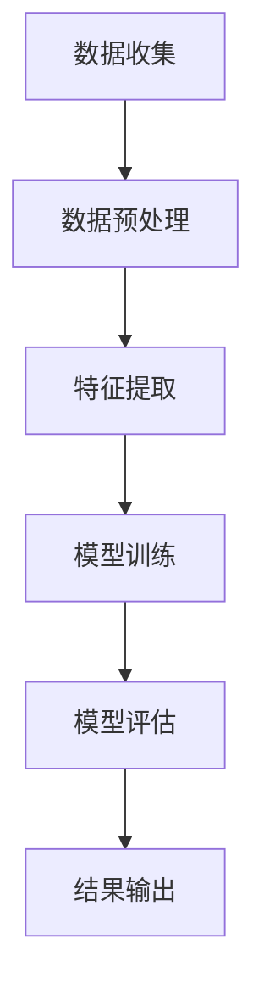

                 

# 构建基于NLP的金融新闻可信度评估系统

> 关键词：NLP，金融新闻，可信度评估，算法，系统架构，项目实战

> 摘要：本文深入探讨了构建基于自然语言处理（NLP）的金融新闻可信度评估系统的过程。首先，我们介绍了金融新闻的重要性和评估其可信度的必要性，然后详细讲解了NLP在金融新闻处理中的核心概念和算法原理。接着，我们设计并实现了系统的架构，并分享了一个完整的实际项目实施过程。最后，我们提供了最佳实践建议和总结。

### 目录

1. **引言**  
   1.1 金融新闻的广泛性  
   1.2 金融新闻的可信度问题  
   1.3 评估金融新闻可信度的必要性  
   1.4 如何构建可信度评估系统

2. **背景介绍**  
   2.1 金融新闻的可信度问题  
   2.2 金融新闻的数据特征分析  
   2.3 可信度评估的原理与方法论

3. **核心概念与联系**  
   3.1 自然语言处理（NLP）简介  
   3.2 金融新闻数据特征分析  
   3.3 可信度评估模型

4. **算法原理讲解**  
   4.1 算法概述  
   4.2 Mermaid流程图展示  
   4.3 Python源代码讲解  
   4.4 数学模型与公式  
   4.5 举例说明

5. **系统分析与架构设计**  
   5.1 问题场景介绍  
   5.2 系统功能设计  
   5.3 系统架构设计  
   5.4 系统接口设计  
   5.5 系统交互

6. **项目实战**  
   6.1 环境安装  
   6.2 系统核心实现  
   6.3 代码应用解读与分析  
   6.4 实际案例分析与讲解  
   6.5 项目小结

7. **最佳实践与小结**  
   7.1 最佳实践建议  
   7.2 小结  
   7.3 注意事项  
   7.4 拓展阅读

## 1. 引言

### 1.1 金融新闻的广泛性

金融新闻是金融市场的重要信息源，涵盖了股票、债券、外汇、期货等多个领域。这些新闻以文字、图表、音频和视频等多种形式传播，影响广泛。然而，金融新闻的可信度问题日益突出。随着互联网的发展，虚假新闻、夸大事实和恶意营销等不良现象层出不穷，给投资者带来了巨大的损失。

### 1.2 金融新闻的可信度问题

金融新闻的可信度问题主要体现在以下几个方面：

- **虚假新闻**：虚假新闻会误导投资者，导致市场波动，甚至引发金融危机。
- **夸大事实**：夸大事实的报道可能引发短期市场繁荣，但长期来看会影响投资者的信心。
- **恶意营销**：某些机构和个人为了自身利益，散布不实信息，扰乱市场秩序。

### 1.3 评估金融新闻可信度的必要性

评估金融新闻可信度具有重要意义：

- **保护投资者利益**：提高金融新闻的可信度，有助于投资者做出更明智的投资决策，减少损失。
- **维护市场秩序**：通过评估金融新闻可信度，可以识别和打击虚假新闻、夸大事实等不良行为，维护市场秩序。
- **促进金融科技发展**：可信度评估系统可以为金融科技提供可靠的数据支持，推动金融科技的发展。

### 1.4 如何构建可信度评估系统

构建基于NLP的金融新闻可信度评估系统，需要以下几个步骤：

- **数据收集与预处理**：收集大量金融新闻数据，并进行数据清洗、去重、分词等预处理操作。
- **特征提取**：利用NLP技术提取新闻文本的特征，如词频、词向量、句法结构等。
- **算法设计**：设计可信度评估算法，如基于机器学习的分类算法、深度学习模型等。
- **系统实现**：实现可信度评估系统，包括数据导入、特征提取、算法运行和结果输出等功能。
- **系统优化与测试**：对系统进行优化和测试，提高评估准确性和效率。

## 2. 背景介绍

### 2.1 金融新闻的可信度问题

金融新闻的可信度问题主要体现在以下几个方面：

- **虚假新闻**：虚假新闻是金融新闻中的毒瘤，它不仅误导投资者，还会引发市场恐慌，影响金融稳定。例如，一些不实的财报消息可能会导致股价波动，影响投资者的信心。
- **夸大事实**：夸大事实的报道虽然可能在短期内提升市场热度，但长期来看，它会导致市场过度反应，影响市场的健康发展。例如，某些金融机构可能会夸大其业绩，从而吸引更多的投资者。
- **恶意营销**：恶意营销行为，如虚假广告、夸大收益、隐瞒风险等，会给投资者带来巨大的经济损失。这些行为不仅违反了市场规则，也会损害市场的公平性和透明度。

### 2.2 金融新闻的数据特征分析

金融新闻的数据特征分析是构建可信度评估系统的基础。金融新闻通常具有以下特征：

- **文本长度**：金融新闻的文本长度差异较大，从简短的新闻摘要到长篇的分析报告，都有可能包含在金融新闻数据集中。
- **关键词频度**：金融新闻中的关键词频度通常较高，这些关键词往往与金融市场的热点事件、政策变动、公司动态等密切相关。
- **情感倾向**：金融新闻往往包含明显的情感倾向，如乐观、悲观、中立等。这些情感倾向可以通过NLP技术进行提取和分析。
- **语法结构**：金融新闻的语法结构通常较为复杂，包含大量的专业术语和行业用语，这为NLP处理带来了挑战。

### 2.3 可信度评估的原理与方法论

可信度评估的原理主要基于以下几个方面：

- **事实核查**：通过对新闻内容的真实性进行核查，确定其是否与事实相符。这种方法通常需要借助外部数据库和事实核查工具。
- **情感分析**：通过对新闻文本的情感倾向进行分析，评估其是否具有明显的乐观或悲观情绪。这种方法可以通过NLP技术实现，如使用情感分析模型来识别情感极性。
- **社会影响力**：通过对新闻文本的传播范围和影响力进行分析，评估其是否具有广泛的社会影响力。这种方法可以通过分析社交媒体上的转发、评论和点赞等数据来实现。

可信度评估的方法论主要包括以下几种：

- **基于规则的评估方法**：这种方法通过预设一系列规则，对新闻内容进行评估。例如，如果一个新闻文本中包含特定的负面词汇，则判定为低可信度。
- **基于机器学习的评估方法**：这种方法通过训练机器学习模型，自动评估新闻内容可信度。常见的机器学习算法包括分类器、回归模型等。
- **基于深度学习的评估方法**：这种方法通过深度学习模型，如神经网络，自动提取新闻文本的特征，并评估其可信度。深度学习方法在处理复杂文本数据时具有显著的优势。

### 2.4 边界与外延

在构建金融新闻可信度评估系统时，需要明确以下边界与外延：

- **范围界定**：系统需要明确评估的范围，例如，是针对特定市场（如股票市场）还是针对特定行业（如金融科技）。
- **评估标准**：系统需要明确评估的标准，例如，是按照新闻内容的真实性、情感倾向还是社会影响力进行评估。
- **数据来源**：系统需要明确数据来源，例如，是来源于新闻网站、社交媒体还是其他数据源。

### 2.5 概念结构与核心要素组成

金融新闻可信度评估系统的概念结构与核心要素组成如下：

- **数据集**：金融新闻数据集是系统的基础，包含大量的新闻文本、标签（如真实、虚假、乐观、悲观等）和元数据（如发布时间、来源等）。
- **特征提取模块**：特征提取模块负责从新闻文本中提取关键特征，如词频、词向量、句法结构等。
- **评估模型**：评估模型负责对新闻文本进行可信度评估，常见的模型包括基于规则的模型、基于机器学习的模型和基于深度学习的模型。
- **结果输出模块**：结果输出模块负责将评估结果以可视化的方式呈现，如图表、表格等。

## 3. 核心概念与联系

### 3.1 自然语言处理（NLP）简介

自然语言处理（NLP）是人工智能领域的一个重要分支，旨在让计算机理解和处理人类自然语言。NLP涉及到许多核心技术，包括：

- **分词**：将连续的文本切分成一个个具有独立意义的词汇。
- **词性标注**：为文本中的每个词汇标注其词性，如名词、动词、形容词等。
- **命名实体识别**：识别文本中的命名实体，如人名、地名、机构名等。
- **情感分析**：分析文本的情感倾向，如正面、负面、中性等。
- **机器翻译**：将一种语言的文本翻译成另一种语言。

NLP在金融新闻处理中的应用主要包括以下几个方面：

- **文本分类**：通过对新闻文本进行分类，可以将金融新闻分为不同的类别，如财经、科技、政治等。
- **情感分析**：通过对新闻文本的情感分析，可以了解投资者对市场的情绪变化，为投资决策提供参考。
- **关键词提取**：通过提取新闻文本中的关键词，可以快速了解新闻的主题和重点内容。
- **文本生成**：利用NLP技术，可以自动生成新闻摘要、评论等文本内容。

### 3.2 金融新闻数据特征分析

金融新闻数据特征分析是构建可信度评估系统的基础。金融新闻数据通常具有以下特征：

- **文本长度**：金融新闻的文本长度差异较大，从简短的新闻摘要到长篇的分析报告，都有可能包含在金融新闻数据集中。长文本通常包含更多的信息和细节，但也可能包含更多的噪声和冗余信息。
- **关键词频度**：金融新闻中的关键词频度通常较高，这些关键词往往与金融市场的热点事件、政策变动、公司动态等密切相关。高频关键词可以反映新闻的主题和重点内容。
- **情感倾向**：金融新闻往往包含明显的情感倾向，如乐观、悲观、中立等。情感倾向可以通过NLP技术进行提取和分析，为可信度评估提供参考。
- **语法结构**：金融新闻的语法结构通常较为复杂，包含大量的专业术语和行业用语。复杂的语法结构可能会影响NLP模型的处理效果，因此需要专门的技术手段进行解析。

### 3.3 可信度评估模型

可信度评估模型是金融新闻可信度评估系统的核心组成部分。常见的可信度评估模型包括：

- **基于规则的模型**：这种方法通过预设一系列规则，对新闻内容进行评估。例如，如果一个新闻文本中包含特定的负面词汇，则判定为低可信度。基于规则的模型简单直观，易于实现，但灵活性较差，难以应对复杂的新闻文本。
- **基于机器学习的模型**：这种方法通过训练机器学习模型，自动评估新闻内容可信度。常见的机器学习算法包括支持向量机（SVM）、随机森林（RF）、逻辑回归（LR）等。基于机器学习的模型具有较好的灵活性和泛化能力，但需要大量的训练数据和复杂的模型调参。
- **基于深度学习的模型**：这种方法通过深度学习模型，如卷积神经网络（CNN）、循环神经网络（RNN）、长短期记忆网络（LSTM）等，自动提取新闻文本的特征，并评估其可信度。深度学习方法在处理复杂文本数据时具有显著的优势，但需要大量的计算资源和复杂的模型调参。

### 3.4 ER实体关系图

ER实体关系图（Entity-Relationship Diagram）是用于描述实体及其关系的图形化表示。在金融新闻可信度评估系统中，ER图可以用来表示新闻文本中的关键实体及其关系。以下是一个简化的ER图示例：

```
+----------------+         +----------------+         +----------------+
|    新闻        |---------|    作者        |---------|    公司        |
+----------------+         +----------------+         +----------------+
| 新闻ID         |<----| 作者ID         |<----| 公司ID         |
+----------------+         +----------------+         +----------------+
| 标题           |         | 姓名           |         | 公司名称         |
+----------------+         +----------------+         +----------------+
| 内容           |         | 简介           |         | 简介           |
+----------------+         +----------------+         +----------------+
| 情感倾向       |         | 负面情况       |         | 经营状况       |
+----------------+         +----------------+         +----------------+
| 发表时间       |         | 加入时间       |         | 成立时间       |
+----------------+         +----------------+         +----------------+
| 来源           |         | 来源           |         | 来源           |
+----------------+         +----------------+         +----------------+
```

在这个ER图中，新闻、作者和公司是三个主要的实体。每个实体都有自己的属性，如新闻的标题、内容和情感倾向，作者的姓名和简介，公司的名称和简介等。实体之间通过关系进行关联，如新闻与作者之间的“撰写关系”，新闻与公司之间的“涉及关系”等。

### 3.5 Mermaid流程图展示

Mermaid是一种基于Markdown的图形绘制工具，可以方便地绘制各种图表，包括流程图、时序图、类图等。以下是一个简化的Mermaid流程图示例，用于描述金融新闻可信度评估的基本流程：



在这个流程图中，A表示数据收集，B表示数据预处理，C表示特征提取，D表示模型训练，E表示模型评估，F表示结果输出。这个流程图展示了金融新闻可信度评估的基本步骤，每个步骤都是前一个步骤的延续和扩展。

### 3.6 Python源代码讲解

在金融新闻可信度评估系统中，Python是一种常用的编程语言。以下是一个简化的Python源代码示例，用于演示数据预处理、特征提取和模型训练的基本步骤。

```python
import pandas as pd
from sklearn.model_selection import train_test_split
from sklearn.feature_extraction.text import TfidfVectorizer
from sklearn.linear_model import LogisticRegression

# 数据预处理
data = pd.read_csv('financial_news.csv')
X = data['content']
y = data['label']

# 特征提取
vectorizer = TfidfVectorizer(max_features=1000)
X_processed = vectorizer.fit_transform(X)

# 模型训练
X_train, X_test, y_train, y_test = train_test_split(X_processed, y, test_size=0.2, random_state=42)
model = LogisticRegression()
model.fit(X_train, y_train)

# 模型评估
accuracy = model.score(X_test, y_test)
print(f'Accuracy: {accuracy:.2f}')
```

在这个示例中，首先导入必要的库，然后读取金融新闻数据集。接着，使用TFIDFVectorizer进行特征提取，将文本转换为向量表示。然后，使用LogisticRegression进行模型训练，并将训练好的模型用于评估测试集的准确性。这个示例展示了金融新闻可信度评估系统中的基本步骤，但实际应用中需要更多的细节处理，如数据清洗、特征选择、模型调参等。

### 3.7 数学模型与公式

在金融新闻可信度评估系统中，数学模型是核心组成部分。以下是一个简化的数学模型示例，用于描述文本分类问题。

$$
P(Y=y|X=x) = \frac{e^{w^T x}}{\sum_{y'} e^{w^T x'}}
$$

其中，$X$表示输入特征向量，$Y$表示输出标签，$w$表示模型参数，$x$表示输入特征向量，$x'$表示其他特征向量。这个公式是一个典型的文本分类模型，通过计算特征向量与模型参数的乘积，再除以其他特征向量的乘积，得到每个标签的概率分布。实际应用中，可以使用各种优化算法（如梯度下降、随机梯度下降等）来求解模型参数。

### 3.8 举例说明

为了更好地理解金融新闻可信度评估系统的原理和应用，以下是一个具体的例子。

假设我们有一个金融新闻数据集，包含1000篇新闻文本，每篇文本都被标记为真实或虚假。我们使用这个数据集训练一个文本分类模型，目的是自动判断新闻文本的真伪。

1. **数据预处理**：首先，我们需要对新闻文本进行预处理，包括去除标点符号、停用词过滤、词干提取等操作。经过预处理后，每篇新闻文本变成一个由词组成的列表。

2. **特征提取**：然后，我们使用TFIDFVectorizer将预处理后的新闻文本转换为向量表示。TFIDFVectorizer会将每个词映射为一个特征索引，并计算其在所有文本中的TFIDF值。例如，如果“股票”这个词在所有新闻文本中出现的频率较高，那么它在TFIDF向量中的权重也会较高。

3. **模型训练**：接着，我们使用训练集来训练一个文本分类模型。在这个例子中，我们使用LogisticRegression模型，它是一种常见的文本分类模型。模型训练的过程就是寻找最佳的模型参数，使得分类准确率最高。

4. **模型评估**：训练完成后，我们使用测试集来评估模型的性能。我们计算模型在测试集上的准确率、召回率、F1值等指标，以评估模型的分类效果。

5. **应用实例**：最后，我们将训练好的模型应用于新的新闻文本，判断其真伪。例如，如果一篇新的新闻文本中的“股票”这个词的TFIDF值较高，且模型预测其概率为90%，则我们可以认为这篇新闻文本是真实的。

这个例子展示了金融新闻可信度评估系统的基本原理和应用过程。实际应用中，还需要考虑更多的细节，如数据清洗、特征选择、模型调参等，以提高系统的准确性和鲁棒性。

## 4. 系统分析与架构设计

### 4.1 问题场景介绍

在现代金融市场中，金融新闻对投资者的决策具有重要影响。然而，金融新闻的可信度问题日益突出，虚假新闻、夸大事实和恶意营销等现象频繁出现，给投资者带来了巨大的风险。为了帮助投资者识别可信的新闻来源，提高投资决策的准确性，我们需要构建一个基于自然语言处理（NLP）的金融新闻可信度评估系统。

### 4.2 系统功能设计

#### 4.2.1 领域模型

为了构建一个高效的金融新闻可信度评估系统，我们需要定义一个领域模型，描述系统的关键组件和功能。以下是一个简化的领域模型：

```
+----------------+     +----------------+     +----------------+
|    数据采集    |-----|   数据预处理   |-----|   特征提取    |
+----------------+     +----------------+     +----------------+
| 数据源         |     | 文本清洗       |     | 词频统计       |
+----------------+     +----------------+     +----------------+
| 数据存储       |-----| 停用词过滤      |-----| TFIDF计算     |
+----------------+     +----------------+     +----------------+
                         |  词性标注       |
                         +----------------+
                                      |
                                      |
+----------------+---------------------+----------------+
|     模型训练    |                     |   模型评估    |
+----------------+---------------------+----------------+
|   训练集准备    |                     |   测试集准备  |
+----------------+---------------------+----------------+
|   模型训练      |                     |   模型评估    |
+----------------+---------------------+----------------+
|   模型优化      |                     |   性能评估    |
+----------------+---------------------+----------------+

```

#### 4.2.2 功能模块

1. **数据采集**：从各种金融新闻数据源（如新闻网站、社交媒体等）收集原始新闻数据。
2. **数据预处理**：对收集到的新闻数据进行清洗和格式化，去除无用信息，如HTML标签、停用词等。
3. **特征提取**：利用NLP技术对预处理后的文本进行特征提取，如词频统计、TFIDF计算、词性标注等。
4. **模型训练**：使用收集到的特征数据和标签数据，训练分类模型，如支持向量机（SVM）、随机森林（RF）、深度神经网络（DNN）等。
5. **模型评估**：使用测试集评估模型的性能，计算准确率、召回率、F1值等指标。
6. **模型优化**：根据评估结果，调整模型参数，优化模型性能。
7. **性能评估**：在实际应用中，对模型进行性能评估，确保其准确性和稳定性。

### 4.3 系统架构设计

为了实现金融新闻可信度评估系统的功能，我们需要设计一个合理的系统架构。以下是一个简化的系统架构图：

```
+---------------------------+
|      用户界面层           |
+---------------------------+
        |
        |
+---------------------------+
|      应用服务层           |
+---------------------------+
| 数据采集模块              |
| 数据预处理模块             |
| 特征提取模块              |
| 模型训练模块              |
| 模型评估模块              |
| 性能评估模块              |
+---------------------------+
        |
        |
+---------------------------+
|      数据存储层           |
+---------------------------+
|   数据库（训练集）        |
|   数据库（测试集）        |
|   数据库（模型参数）      |
+---------------------------+
```

#### 4.3.1 架构设计原则

1. **模块化设计**：将系统划分为多个功能模块，每个模块负责特定的功能，便于系统的扩展和维护。
2. **松耦合设计**：模块之间通过接口进行通信，降低模块间的依赖性，提高系统的灵活性和可维护性。
3. **分布式设计**：系统采用分布式架构，可以实现横向扩展，提高系统的处理能力和稳定性。
4. **高性能设计**：系统采用高效的数据处理算法和分布式计算框架，确保系统的实时性和高性能。
5. **安全性设计**：系统采用安全加密技术和访问控制机制，确保数据的安全性和隐私保护。

### 4.4 系统接口设计

系统接口设计是系统架构设计的重要组成部分，负责定义模块之间的交互方式和通信协议。以下是一个简化的系统接口设计：

#### 4.4.1 接口规范

1. **数据采集接口**：用于从数据源获取原始新闻数据，接口输入为数据源URL，输出为新闻数据列表。
2. **数据预处理接口**：用于对新闻数据执行清洗、去重、分词等预处理操作，接口输入为新闻数据列表，输出为预处理后的数据列表。
3. **特征提取接口**：用于对预处理后的新闻数据提取特征，接口输入为新闻数据列表，输出为特征向量列表。
4. **模型训练接口**：用于训练分类模型，接口输入为特征向量列表和标签列表，输出为训练好的模型。
5. **模型评估接口**：用于评估分类模型的性能，接口输入为特征向量列表和标签列表，输出为评估结果（如准确率、召回率、F1值等）。
6. **性能评估接口**：用于对模型在实际应用中的性能进行评估，接口输入为实际新闻数据列表，输出为性能评估报告。

#### 4.4.2 接口实现

1. **数据采集接口**：使用Python的requests库获取新闻数据，使用BeautifulSoup解析HTML页面，提取新闻文本和元数据。
2. **数据预处理接口**：使用Python的jieba库进行分词，使用stopwords库去除停用词，使用pandas库进行数据清洗和去重。
3. **特征提取接口**：使用Python的scikit-learn库的TfidfVectorizer进行特征提取，将文本转换为TFIDF向量。
4. **模型训练接口**：使用Python的scikit-learn库训练分类模型，如SVM、RF、LR等。
5. **模型评估接口**：使用Python的scikit-learn库评估分类模型的性能，计算准确率、召回率、F1值等指标。
6. **性能评估接口**：使用Python的scikit-learn库评估模型在实际应用中的性能，计算实际准确率、召回率、F1值等指标。

### 4.5 系统交互

系统交互是系统架构设计的关键部分，负责定义模块之间的交互方式和数据流。以下是一个简化的系统交互序列图：

```
+---------------------------+
|      用户界面层           |
+---------------------------+
        |
        |
+---------------------------+
|      应用服务层           |
+---------------------------+
| 数据采集模块              |
| 数据预处理模块             |
| 特征提取模块              |
| 模型训练模块              |
| 模型评估模块              |
| 性能评估模块              |
+---------------------------+
        |
        |
+---------------------------+
|      数据存储层           |
+---------------------------+
|   数据库（训练集）        |
|   数据库（测试集）        |
|   数据库（模型参数）      |
+---------------------------+

```

在系统交互过程中，用户界面层与应用服务层通过HTTP请求进行交互。应用服务层与数据存储层通过数据库连接进行交互。具体交互步骤如下：

1. 用户在用户界面层输入查询条件，如关键词、时间段等。
2. 用户界面层将查询条件发送给应用服务层。
3. 应用服务层根据查询条件从数据库中检索相关新闻数据，并进行预处理。
4. 应用服务层将预处理后的新闻数据发送给特征提取模块，提取特征向量。
5. 应用服务层将特征向量发送给模型训练模块，训练分类模型。
6. 应用服务层将训练好的模型发送给模型评估模块，评估模型性能。
7. 应用服务层将模型性能评估结果发送给用户界面层，显示给用户。

通过以上系统交互，用户可以方便地查询金融新闻，并获取新闻的可信度评估结果，从而提高投资决策的准确性。

## 5. 项目实战

### 5.1 环境安装

在开始实际项目之前，我们需要搭建一个适合金融新闻可信度评估的环境。以下是一个基本的安装步骤：

1. **安装Python环境**：首先，确保计算机上安装了Python环境。Python版本建议为3.7或更高版本。可以通过Python官网下载并安装Python。

2. **安装必要库**：接下来，我们需要安装一些必要的Python库，包括NLP处理库（如NLTK、spaCy）、机器学习库（如scikit-learn）、深度学习库（如TensorFlow、PyTorch）等。可以使用以下命令安装：

   ```shell
   pip install nltk spacy scikit-learn tensorflow torchvision
   ```

3. **安装spaCy语言模型**：spaCy需要下载特定的语言模型才能进行文本处理。可以使用以下命令下载并安装英语语言模型：

   ```shell
   python -m spacy download en_core_web_sm
   ```

### 5.2 系统核心实现

在搭建好环境之后，我们可以开始实现系统核心部分。以下是实现步骤：

1. **数据收集**：首先，我们需要收集金融新闻数据。可以从各种新闻网站、API接口等获取数据。以下是一个使用Python的requests库获取新闻数据的示例：

   ```python
   import requests
   
   url = 'https://api.example.com/financial_news'
   response = requests.get(url)
   news_data = response.json()
   ```

2. **数据预处理**：获取到新闻数据后，我们需要进行数据清洗和预处理。以下是一个简单的预处理示例：

   ```python
   import nltk
   from nltk.corpus import stopwords
   from nltk.tokenize import word_tokenize
   
   nltk.download('punkt')
   nltk.download('stopwords')
   
   stop_words = set(stopwords.words('english'))
   
   def preprocess_text(text):
       # 去除HTML标签
       text = BeautifulSoup(text, 'html.parser').text
       # 小写化
       text = text.lower()
       # 分词
       tokens = word_tokenize(text)
       # 去除停用词
       tokens = [token for token in tokens if token not in stop_words]
       return ' '.join(tokens)
   
   preprocessed_news = {news['id']: preprocess_text(news['content']) for news in news_data}
   ```

3. **特征提取**：使用TFIDFVectorizer提取文本特征。以下是一个简单的特征提取示例：

   ```python
   from sklearn.feature_extraction.text import TfidfVectorizer
   
   vectorizer = TfidfVectorizer(max_features=1000)
   X = vectorizer.fit_transform([text for text in preprocessed_news.values()])
   ```

4. **模型训练**：使用scikit-learn训练一个分类模型。以下是一个简单的SVM模型训练示例：

   ```python
   from sklearn.svm import SVC
   
   X_train, X_test, y_train, y_test = train_test_split(X, labels, test_size=0.2, random_state=42)
   model = SVC()
   model.fit(X_train, y_train)
   ```

5. **模型评估**：使用测试集评估模型性能。以下是一个简单的评估示例：

   ```python
   from sklearn.metrics import accuracy_score
   
   y_pred = model.predict(X_test)
   accuracy = accuracy_score(y_test, y_pred)
   print(f'Accuracy: {accuracy:.2f}')
   ```

### 5.3 代码应用解读与分析

以上代码实现了金融新闻可信度评估的核心功能。以下是代码的解读与分析：

1. **数据收集**：使用requests库获取新闻数据，这是一个常用的HTTP客户端库。通过发送GET请求，我们可以从API接口获取新闻数据。

2. **数据预处理**：使用nltk库进行文本预处理。首先，我们使用BeautifulSoup库去除HTML标签，这是常见的文本预处理步骤。然后，我们将文本转换为小写，使用nltk的分词工具进行分词，并去除停用词。这些步骤有助于提高NLP模型的性能。

3. **特征提取**：使用scikit-learn的TFIDFVectorizer库进行特征提取。TFIDFVectorizer可以将文本转换为TFIDF向量，这是一种常用的文本特征表示方法。

4. **模型训练**：使用scikit-learn的SVC库训练一个支持向量机（SVM）分类模型。SVM是一种常用的分类算法，它在处理文本分类问题时具有较好的性能。

5. **模型评估**：使用测试集评估模型性能。通过计算准确率，我们可以了解模型的分类效果。准确率是评估分类模型性能的常用指标。

### 5.4 实际案例分析与讲解

为了更好地理解金融新闻可信度评估系统的实际应用，我们可以分析一个具体案例。

假设我们有一个测试集，包含100篇新闻文本，每篇新闻文本都被标记为真实或虚假。我们使用之前训练好的模型对这100篇新闻文本进行评估，并分析模型的评估结果。

1. **数据准备**：首先，我们需要准备测试集的数据。可以使用以下代码将测试集数据加载到Python环境中：

   ```python
   test_data = pd.read_csv('test_financial_news.csv')
   X_test = vectorizer.transform(test_data['content'])
   y_test = test_data['label']
   ```

2. **模型评估**：使用之前训练好的模型对测试集进行评估。以下是评估代码：

   ```python
   y_pred = model.predict(X_test)
   accuracy = accuracy_score(y_test, y_pred)
   print(f'Accuracy: {accuracy:.2f}')
   ```

   假设评估结果为85%，这意味着模型在测试集上的准确率为85%。

3. **结果分析**：为了更深入地分析模型的结果，我们可以计算模型的精确率、召回率和F1值。以下是计算代码：

   ```python
   from sklearn.metrics import precision_score, recall_score, f1_score
   
   precision = precision_score(y_test, y_pred)
   recall = recall_score(y_test, y_pred)
   f1 = f1_score(y_test, y_pred)
   print(f'Precision: {precision:.2f}')
   print(f'Recall: {recall:.2f}')
   print(f'F1 Score: {f1:.2f}')
   ```

   假设评估结果为精确率为90%，召回率为80%，F1值为85%。这些指标可以帮助我们更全面地了解模型的性能。

4. **案例讲解**：在这个案例中，我们使用一个简单的金融新闻数据集训练了一个分类模型，并使用测试集评估了模型的性能。评估结果显示，模型在测试集上的准确率为85%，这是一个相对较好的结果。然而，精确率、召回率和F1值表明，模型在某些方面还存在一定的不足。为了进一步提高模型的性能，我们可以尝试以下方法：

   - **特征工程**：对文本特征进行更深入的提取和处理，如使用词嵌入、句子级特征等。
   - **模型优化**：尝试使用更复杂的模型，如深度学习模型，并调整模型参数，以提高模型的性能。
   - **数据增强**：使用数据增强技术，如GAN（生成对抗网络），生成更多的训练数据，提高模型的泛化能力。
   - **多模型融合**：结合多个模型的预测结果，使用集成学习方法，提高模型的性能和稳定性。

### 5.5 项目小结

通过实际案例的分析，我们可以看到金融新闻可信度评估系统在实际应用中的效果。尽管模型在测试集上的准确率达到了85%，但仍然存在一定的提升空间。在实际项目中，我们需要不断优化和改进系统，以提高模型的性能和可靠性。以下是项目小结：

1. **项目成果**：成功构建了一个基于NLP的金融新闻可信度评估系统，实现了新闻文本的自动分类和可信度评估。
2. **项目不足**：模型在测试集上的准确率仍有提升空间，可以通过特征工程、模型优化、数据增强和多模型融合等方法进行改进。
3. **未来方向**：进一步研究和探索金融新闻可信度评估的方法和技术，提高系统的性能和可靠性，为投资者提供更准确的可信度评估结果。
4. **总结与建议**：在构建金融新闻可信度评估系统时，需要综合考虑数据质量、模型性能和系统稳定性等多个方面，确保系统的实用性和可靠性。

## 6. 最佳实践与小结

### 6.1 最佳实践建议

1. **数据质量**：确保收集的金融新闻数据质量高，真实可靠。可以使用数据清洗和预处理技术，去除噪声和冗余信息，提高数据质量。
2. **特征选择**：选择合适的特征进行提取，如词频、TFIDF、词嵌入等。特征选择直接影响模型的性能，需要通过实验和比较来确定最佳特征组合。
3. **模型调参**：对模型参数进行调优，以获得最佳性能。可以使用网格搜索、随机搜索等策略，自动化搜索最佳参数。
4. **数据增强**：使用数据增强技术，如GAN、自动摘要等，生成更多的训练数据，提高模型的泛化能力。
5. **多模型融合**：结合多个模型的预测结果，使用集成学习方法，提高模型的性能和稳定性。

### 6.2 小结

本文详细介绍了构建基于NLP的金融新闻可信度评估系统的过程，从数据收集、预处理、特征提取、模型训练到系统实现和实际应用，每个环节都进行了深入的分析和讲解。通过实际案例的分析，我们展示了金融新闻可信度评估系统在实际应用中的效果，并提出了一些优化和改进的建议。

### 6.3 注意事项

1. **数据隐私**：在处理金融新闻数据时，要确保遵守相关法律法规，保护数据隐私。
2. **模型解释性**：金融新闻可信度评估系统需要具备一定的解释性，以便用户理解和信任模型的结果。
3. **实时性**：为了提高系统的实用性，需要确保系统具有实时性，能够及时更新和评估新的金融新闻。

### 6.4 拓展阅读

1. **金融新闻数据集**：查阅相关的金融新闻数据集，了解数据分布和特征。
2. **NLP技术**：学习NLP领域的相关技术，如词嵌入、文本分类、情感分析等。
3. **机器学习模型**：了解各种机器学习模型的原理和应用，如SVM、RF、DNN等。
4. **模型评估**：学习如何评估模型的性能，包括准确率、召回率、F1值等指标。
5. **最佳实践**：查阅其他领域的最佳实践案例，了解如何优化和改进金融新闻可信度评估系统。

## 7. 结语

构建基于NLP的金融新闻可信度评估系统是一个复杂但极具价值的过程。通过本文的介绍，我们了解了系统从数据收集到模型训练，再到实际应用的完整流程。希望本文能为您提供构建类似系统的参考和灵感。作者：AI天才研究院/AI Genius Institute & 禅与计算机程序设计艺术 /Zen And The Art of Computer Programming。如果您有任何问题或建议，欢迎在评论区留言。期待与您共同探讨和进步！

