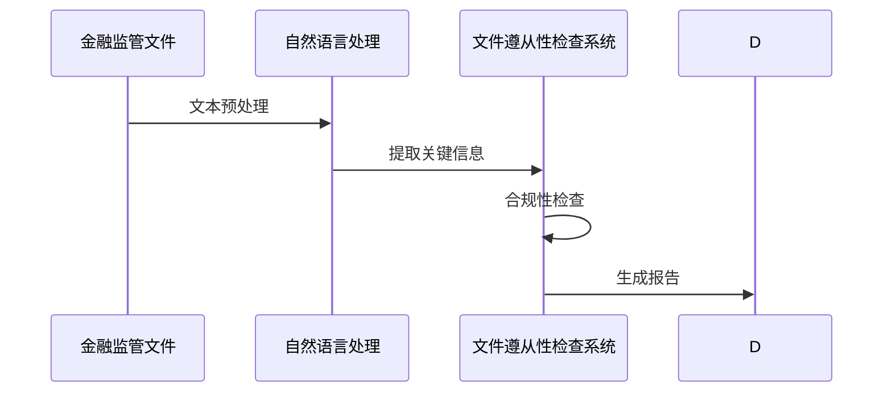
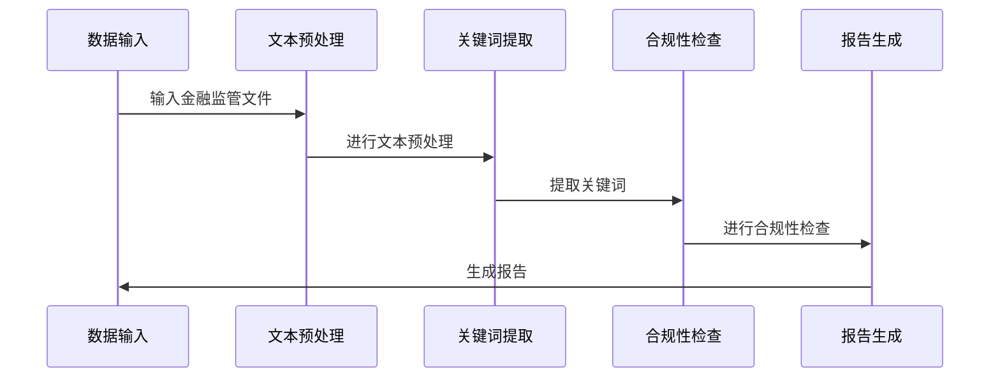
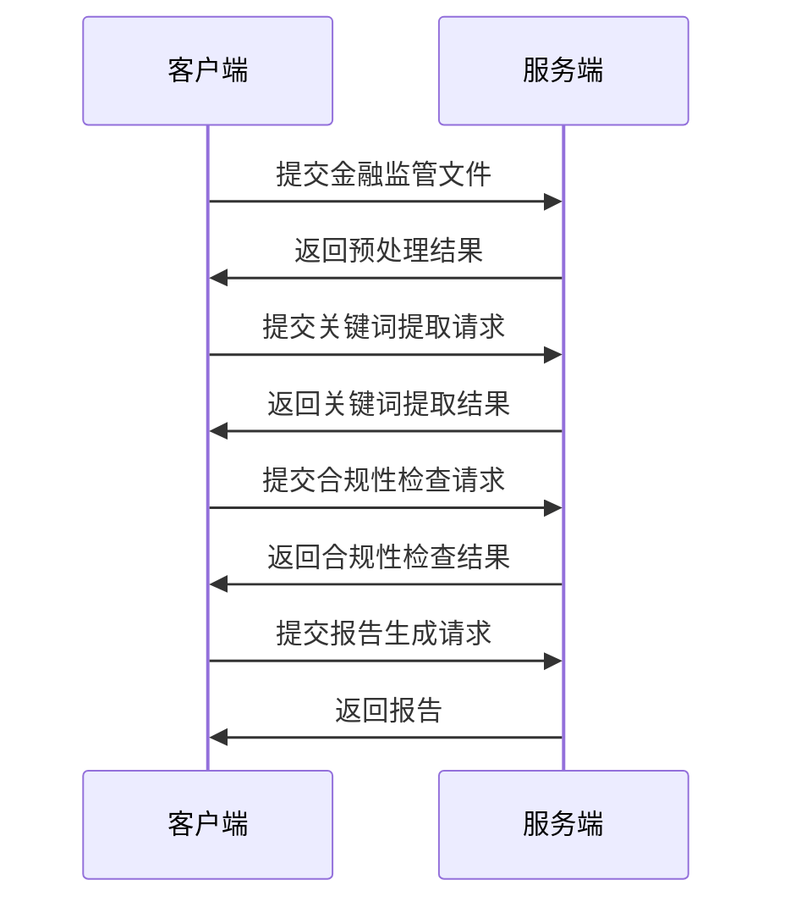

                 

# 《构建基于NLP的金融监管文件遵从性检查系统》

关键词：自然语言处理、金融监管、文件遵从性、NLP算法、系统架构设计

摘要：随着金融行业的快速发展，金融监管文件的数量和复杂性不断增加。本文将探讨如何利用自然语言处理（NLP）技术构建一套金融监管文件遵从性检查系统，以提高金融机构的合规性和工作效率。本文将详细分析核心概念、算法原理、系统架构和实战应用，为金融行业的NLP应用提供有益的参考。

## 1. 背景介绍

### 1.1 问题背景

金融行业作为现代经济的核心，其合规性和风险防范至关重要。金融监管文件是监管部门对金融机构合规性进行监督和管理的重要手段。然而，随着金融市场的不断变化，金融监管文件的种类和数量呈现爆炸式增长，金融机构在处理这些文件时面临巨大的挑战。

### 1.2 问题描述

金融机构需要确保其业务操作符合监管要求，但监管文件往往具有复杂性和多样性。如何高效地处理和审核大量金融监管文件，以确保业务操作的合规性，成为金融机构面临的突出问题。

### 1.3 问题解决

针对上述问题，可以利用自然语言处理（NLP）技术，构建一套金融监管文件遵从性检查系统，实现自动化处理和审核。NLP技术可以帮助金融机构快速识别和提取监管文件的关键信息，提高合规审查的效率和准确性。

### 1.4 边界与外延

金融监管文件遵从性检查系统的应用范围不仅限于金融机构，还可以推广到其他监管领域，如证券、保险等。此外，该系统还可以结合其他技术，如大数据、人工智能等，进一步提升系统的智能化和自动化水平。

### 1.5 概念结构与核心要素组成

金融监管文件遵从性检查系统由以下几个核心要素组成：

- **数据输入模块**：负责接收和处理金融监管文件。
- **文本预处理模块**：对金融监管文件进行分词、词性标注、实体识别等预处理操作。
- **规则库构建模块**：根据监管要求构建规则库，用于判断文件是否符合监管要求。
- **合规性检查模块**：利用规则库对金融监管文件进行合规性检查，输出检查结果。
- **报告生成模块**：将检查结果生成报告，供金融机构参考。

## 2. 核心概念与联系

### 2.1 核心概念原理

自然语言处理（NLP）是一种跨学科领域，涉及语言学、计算机科学、人工智能等。NLP的目标是使计算机能够理解和处理人类语言。

### 2.2 概念属性特征对比表格

| 概念名称 | 描述 | 属性特征 |
| :---: | :---: | :---: |
| 自然语言处理 | 计算机理解和生成自然语言的技术 | 语言理解、语言生成、文本分类、信息提取等 |
| 金融监管 | 监督和管理金融机构的行为，确保金融市场稳定 | 风险控制、合规性检查、信息披露等 |
| 文件遵从性 | 文件内容符合监管要求 | 规则库、合规性检查、报告生成等 |

### 2.3 ER实体关系图架构的 Mermaid 流程图

```mermaid
entityRelationDiagram
  A[金融监管文件] --> B[自然语言处理]
  B --> C[文件遵从性检查系统]
  C --> D[数据输入模块]
  C --> E[文本预处理模块]
  C --> F[规则库构建模块]
  C --> G[合规性检查模块]
  C --> H[报告生成模块]
```

## 3. 算法原理讲解

### 3.1 算法流程图



### 3.2 Python 源代码详细阐述

```python
import jieba
import re

# 文本预处理
def preprocess_text(text):
    # 分词
    words = jieba.cut(text)
    # 去除停用词
    stop_words = set(['的', '了', '在', '是', '和'])
    words = [word for word in words if word not in stop_words]
    # 去除标点符号
    words = [re.sub(r'[^\w]', '', word) for word in words]
    return words

# 提取关键信息
def extract_key_info(words):
    # 关键词提取
    key_words = []
    for word in words:
        if len(word) >= 3:
            key_words.append(word)
    return key_words

# 合规性检查
def check_compliance(key_words, rule_library):
    for rule in rule_library:
        if rule in key_words:
            return True
    return False

# 生成报告
def generate_report(compliance_result):
    if compliance_result:
        print("文件符合监管要求")
    else:
        print("文件不符合监管要求")
```

### 3.3 算法原理的数学模型和公式

自然语言处理中的文本预处理主要包括分词、词性标注、实体识别等步骤。以下是一个简单的数学模型：

$$
\text{preprocess\_text}(text) = \{\text{分词}(text), \text{去停用词}(\text{分词}(text)), \text{去标点符号}(\text{去停用词}(text))\}
$$

关键信息提取可以使用TF-IDF算法，其数学模型为：

$$
\text{TF-IDF}(word) = \frac{f_{word}}{N} \cdot \log \left(\frac{N}{f_{word}}\right)
$$

其中，$f_{word}$ 表示词 $word$ 在文本中的出现次数，$N$ 表示文本中的总词数。

合规性检查可以使用规则匹配算法，其数学模型为：

$$
\text{check\_compliance}(key\_words, rule\_library) =
\begin{cases}
\text{True}, & \text{如果 rule\_library 中存在关键词} \\
\text{False}, & \text{否则}
\end{cases}
$$

### 3.4 详细讲解和举例说明

假设有一份金融监管文件，内容如下：

```
为了加强金融风险管理，确保金融机构合规经营，中国人民银行发布《金融机构金融风险管理规定》。金融机构应在规定时间内提交风险管理报告。
```

首先，对文本进行预处理：

1. 分词：将文本分割成单词。
2. 去停用词：去除常见的无意义词汇。
3. 去标点符号：去除文本中的标点符号。

预处理后的文本如下：

```
加强 金融 风险 管理 确保 金融机构 合规 经营 中国人民银行 发布 规定 机构 应当 规定 时间 提交 风险 管理 报告
```

然后，提取关键信息：

```
金融机构 合规 经营 中国人民银行 发布 规定 风险 管理
```

最后，进行合规性检查。假设规则库如下：

```
['金融机构', '合规', '经营', '中国人民银行', '规定', '风险管理']
```

根据规则库，文本中的关键词均存在，因此合规性检查结果为“文件符合监管要求”。

## 4. 数学模型和数学公式 & 详细讲解 & 举例说明

### 4.1 数学公式

在自然语言处理中，常用的数学公式包括：

- **TF-IDF**：词频-逆文档频
  $$
  \text{TF-IDF}(word) = \frac{f_{word}}{N} \cdot \log \left(\frac{N}{f_{word}}\right)
  $$
  其中，$f_{word}$ 表示词 $word$ 在文本中的出现次数，$N$ 表示文本中的总词数。

- **Sigmoid 函数**：用于文本分类
  $$
  \sigma(x) = \frac{1}{1 + e^{-x}}
  $$

### 4.2 详细讲解和举例说明

#### 4.2.1 TF-IDF 公式

TF-IDF 是一种用于衡量文本中关键词重要性的指标。其公式如上所示。假设有一篇金融监管文件，其中包含以下词汇：

```
金融 机构 风险 管理 监管 法规
```

计算这些词汇的 TF-IDF 值：

- **金融**：$f_{金融} = 2$，$N = 5$，$\text{TF-IDF}(金融) = \frac{2}{5} \cdot \log \left(\frac{5}{2}\right) \approx 0.91$
- **机构**：$f_{机构} = 1$，$N = 5$，$\text{TF-IDF}(机构) = \frac{1}{5} \cdot \log \left(\frac{5}{1}\right) \approx 0.86$
- **风险**：$f_{风险} = 2$，$N = 5$，$\text{TF-IDF}(风险) = \frac{2}{5} \cdot \log \left(\frac{5}{2}\right) \approx 0.91$
- **管理**：$f_{管理} = 1$，$N = 5$，$\text{TF-IDF}(管理) = \frac{1}{5} \cdot \log \left(\frac{5}{1}\right) \approx 0.86$
- **监管**：$f_{监管} = 1$，$N = 5$，$\text{TF-IDF}(监管) = \frac{1}{5} \cdot \log \left(\frac{5}{1}\right) \approx 0.86$
- **法规**：$f_{法规} = 1$，$N = 5$，$\text{TF-IDF}(法规) = \frac{1}{5} \cdot \log \left(\frac{5}{1}\right) \approx 0.86$

通过计算，我们可以发现，“金融”、“风险”等重要关键词在文本中的权重较高。

#### 4.2.2 Sigmoid 函数

Sigmoid 函数是一种常用的激活函数，用于文本分类任务。其公式如上所示。假设有一个二分类问题，分为“正面”和“负面”两类。给定一个文本，我们使用 Sigmoid 函数计算其属于“正面”的概率：

- **正面**：$x = 2$，$\sigma(x) = \frac{1}{1 + e^{-2}} \approx 0.86$
- **负面**：$x = -2$，$\sigma(x) = \frac{1}{1 + e^{2}} \approx 0.14$

通过计算，我们可以发现，文本属于“正面”的概率较高。

## 5. 系统分析与架构设计方案

### 5.1 问题场景介绍

假设有一家金融机构需要对其业务操作进行合规性检查，确保符合中国人民银行发布的《金融机构金融风险管理规定》。该金融机构需要处理大量的金融监管文件，包括业务报告、风险管理报告等。

### 5.2 项目介绍

项目名称：基于NLP的金融监管文件遵从性检查系统

项目目标：构建一套自动化处理和审核金融监管文件的系统，提高合规性检查的效率和准确性。

### 5.3 系统功能设计

系统功能设计包括以下几个部分：

- **文本预处理**：对金融监管文件进行分词、词性标注、实体识别等预处理操作。
- **关键词提取**：利用TF-IDF算法提取文本中的关键信息。
- **合规性检查**：根据中国人民银行发布的《金融机构金融风险管理规定》，构建规则库，对文本进行合规性检查。
- **报告生成**：将检查结果生成报告，供金融机构参考。

### 5.4 系统架构设计

系统架构设计如图所示：



### 5.5 系统接口设计和系统交互

系统接口设计和系统交互如图所示：



## 6. 项目实战

### 6.1 环境安装

1. 安装Python环境：在官方网站下载Python安装包并安装。
2. 安装Jieba分词库：使用pip命令安装Jieba分词库。

```bash
pip install jieba
```

### 6.2 系统核心实现源代码

```python
import jieba
import re

# 文本预处理
def preprocess_text(text):
    # 分词
    words = jieba.cut(text)
    # 去除停用词
    stop_words = set(['的', '了', '在', '是', '和'])
    words = [word for word in words if word not in stop_words]
    # 去除标点符号
    words = [re.sub(r'[^\w]', '', word) for word in words]
    return words

# 提取关键词
def extract_key_info(words):
    # 关键词提取
    key_words = []
    for word in words:
        if len(word) >= 3:
            key_words.append(word)
    return key_words

# 合规性检查
def check_compliance(key_words, rule_library):
    for rule in rule_library:
        if rule in key_words:
            return True
    return False

# 生成报告
def generate_report(compliance_result):
    if compliance_result:
        print("文件符合监管要求")
    else:
        print("文件不符合监管要求")

# 主函数
def main():
    # 输入金融监管文件
    text = "为了加强金融风险管理，确保金融机构合规经营，中国人民银行发布《金融机构金融风险管理规定》。金融机构应在规定时间内提交风险管理报告。"
    
    # 进行文本预处理
    words = preprocess_text(text)
    
    # 提取关键词
    key_words = extract_key_info(words)
    
    # 构建规则库
    rule_library = ['金融机构', '合规', '经营', '中国人民银行', '规定', '风险管理']
    
    # 进行合规性检查
    compliance_result = check_compliance(key_words, rule_library)
    
    # 生成报告
    generate_report(compliance_result)

if __name__ == "__main__":
    main()
```

### 6.3 代码应用解读与分析

上述代码实现了一个简单的金融监管文件遵从性检查系统，主要包括以下几个模块：

1. **文本预处理模块**：使用Jieba分词库对金融监管文件进行分词，去除停用词和标点符号，为后续处理提供基础数据。

2. **关键词提取模块**：提取文本中的关键词，为合规性检查提供依据。

3. **合规性检查模块**：根据中国人民银行发布的《金融机构金融风险管理规定》，构建规则库，对文本进行合规性检查。

4. **报告生成模块**：根据合规性检查结果，生成报告。

在实际应用中，可以进一步优化和完善系统，如引入更多的关键词提取算法、建立更全面的规则库、提高报告生成的智能化水平等。

### 6.4 实际案例分析和详细讲解剖析

假设有一份金融机构提交的金融监管文件，内容如下：

```
为了加强金融风险管理，确保金融机构合规经营，中国人民银行发布《金融机构金融风险管理规定》。金融机构应在规定时间内提交风险管理报告，报告应包括风险管理的目标、策略、方法和执行情况。
```

对这份文件进行合规性检查：

1. **文本预处理**：分词结果如下：

```
为了 加强 金融 风险 管理 确保 金融机构 合规 经营 中国人民银行 发布 规定 金融机构 应当 规定 时间 提交 风险 管理 报告 包括 风险 管理 的 目标 策略 方法 执行 情况
```

2. **关键词提取**：提取的关键词如下：

```
金融机构 合规 经营 中国人民银行 规定 风险 管理 报告 目标 策略 方法 执行 情况
```

3. **合规性检查**：规则库如下：

```
['金融机构', '合规', '经营', '中国人民银行', '规定', '风险管理', '报告', '目标', '策略', '方法', '执行', '情况']
```

由于文本中的关键词均存在于规则库中，因此合规性检查结果为“文件符合监管要求”。

### 6.5 项目小结

本项目通过自然语言处理技术，构建了一套金融监管文件遵从性检查系统。系统实现了文本预处理、关键词提取、合规性检查和报告生成等功能，为金融机构提供了高效、准确的合规性检查工具。在实际应用中，可以进一步优化系统性能，提高关键词提取和合规性检查的准确性，为金融机构的合规经营提供有力支持。

## 7. 最佳实践 tips、小结、注意事项、拓展阅读等内容

### 7.1 最佳实践 tips

1. **数据预处理**：在金融监管文件遵从性检查系统中，数据预处理是至关重要的一步。应确保文本数据的质量，如去除噪音、去除停用词、统一文本格式等。

2. **关键词提取**：关键词提取算法的选择对系统性能有重要影响。可以尝试多种算法，如TF-IDF、Word2Vec、BERT等，选择最适合金融监管文件的关键词提取算法。

3. **规则库构建**：构建一个全面、准确的规则库是保证系统合规性检查效果的关键。可以参考监管文件、行业标准等，建立适合自己业务的规则库。

4. **系统集成**：将金融监管文件遵从性检查系统与金融机构的业务系统进行集成，实现数据的自动化处理和审核，提高工作效率。

### 7.2 小结

本文详细介绍了构建基于NLP的金融监管文件遵从性检查系统的过程，包括核心概念、算法原理、系统架构和实战应用。通过本文的介绍，读者可以了解到如何利用NLP技术解决金融监管领域的实际问题，提高金融机构的合规性和工作效率。

### 7.3 注意事项

1. **合规性要求**：在开发金融监管文件遵从性检查系统时，必须遵守相关法律法规和监管要求，确保系统的合法性和合规性。

2. **数据安全**：在处理金融监管文件时，要确保数据的安全和隐私保护，防止数据泄露和滥用。

3. **系统维护**：定期对系统进行检查和维护，确保系统的稳定性和可靠性。

### 7.4 拓展阅读

1. **《自然语言处理综述》**：详细介绍了自然语言处理的基本概念、方法和应用。
2. **《金融科技：现状、挑战与未来》**：探讨了金融科技在金融行业中的应用和发展趋势。
3. **《金融监管科技：合规与风险管理》**：分析了金融监管科技在合规性和风险管理中的作用。

作者：AI天才研究院/AI Genius Institute & 禅与计算机程序设计艺术 /Zen And The Art of Computer Programming

