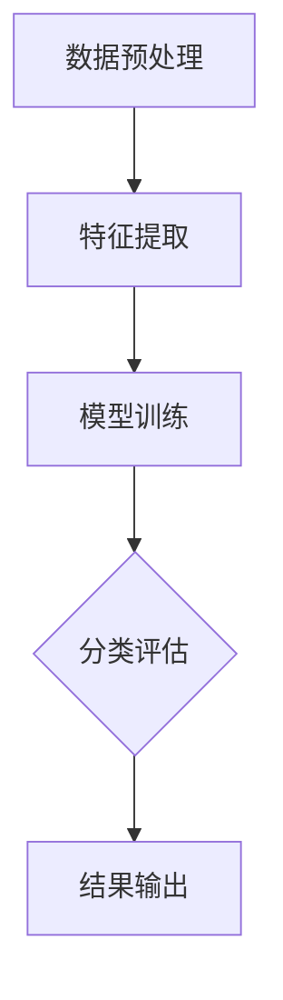
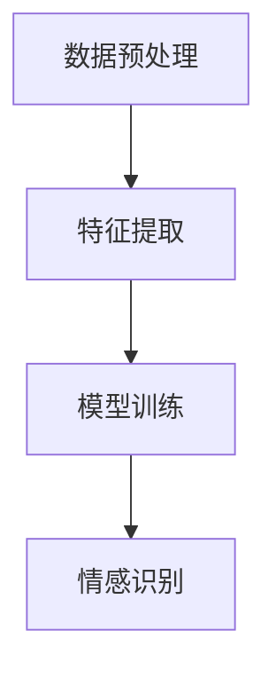
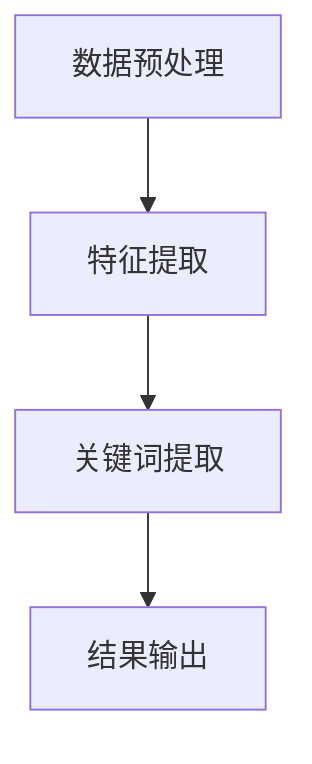
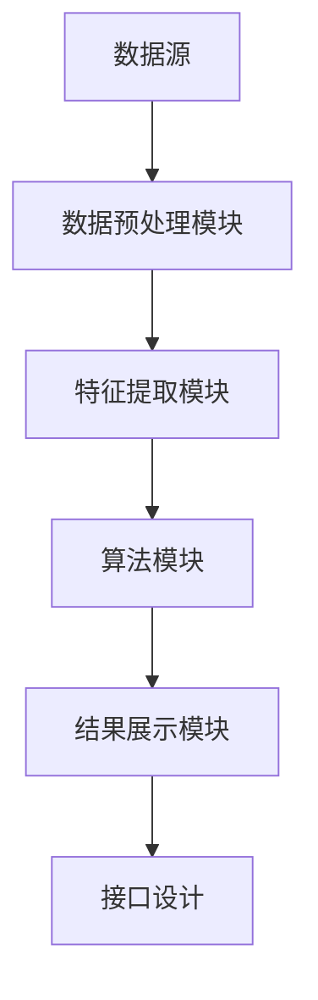

                 


### 文章标题

《构建基于NLP的金融研究报告质量评估系统》

### 关键词

自然语言处理（NLP），金融研究报告，质量评估，文本分类，情感分析，关键词提取，机器学习，深度学习，系统架构，实战案例

### 摘要

本文将深入探讨如何构建一个基于自然语言处理（NLP）技术的金融研究报告质量评估系统。我们将从背景介绍、核心概念、算法原理、数学模型、系统架构、实际应用、最佳实践等方面进行详细分析，并通过具体案例来展示系统的实现过程和效果。本文旨在为读者提供一个全面的技术指南，帮助他们在金融领域运用NLP技术提升研究报告的质量。

---

## 目录

1. 引言
2. 背景与基础
   - 2.1 金融研究报告的重要性
   - 2.2 质量评估的挑战
   - 2.3 NLP在质量评估中的应用
3. 核心概念
   - 3.1 NLP技术基础
   - 3.2 文本数据分析方法
   - 3.3 关键概念与联系
4. 算法原理
   - 4.1 文本分类算法
   - 4.2 情感分析
   - 4.3 关键词提取
5. 数学模型
   - 5.1 相关数学模型
   - 5.2 算法原理的数学模型和公式
6. 系统设计与实现
   - 6.1 系统设计
   - 6.2 系统实现
   - 6.3 系统调试与优化
7. 实际应用案例
   - 7.1 案例一：某金融公司研究报告质量评估
   - 7.2 案例二：基于NLP的金融报告自动生成
8. 最佳实践与总结
   - 8.1 最佳实践
   - 8.2 小结
   - 8.3 注意事项
   - 8.4 拓展阅读

---

### 引言

金融研究报告是金融分析人员基于大量数据和市场研究撰写的重要文件，用于指导投资者和金融决策者做出明智的投资决策。随着金融市场的复杂性和数据量的激增，研究报告的质量评估变得尤为重要。然而，传统的质量评估方法往往依赖于人工阅读和主观判断，效率低下且容易出现偏差。

自然语言处理（NLP）作为人工智能的一个重要分支，已经在文本分类、情感分析、关键词提取等领域取得了显著的成果。基于NLP技术的金融研究报告质量评估系统，可以通过自动化分析技术，快速、准确地评估报告的质量，为金融决策提供有力的支持。

本文将详细介绍如何构建一个基于NLP的金融研究报告质量评估系统。我们将首先介绍NLP技术的基础知识，然后深入探讨文本数据分析方法和相关算法原理，接着介绍数学模型，最后通过实际应用案例展示系统的实现过程和效果。

### 背景与基础

#### 金融研究报告的重要性

金融研究报告是金融领域的重要文献之一，它通过对市场数据、宏观经济指标、行业动态等进行深入分析，为投资者、分析师和决策者提供宝贵的参考信息。高质量的研究报告不仅能够帮助投资者做出更加明智的投资决策，还能够提升分析师和金融机构的品牌形象和声誉。

然而，金融研究报告的质量参差不齐，一方面是由于分析师的个人能力差异，另一方面是由于分析方法和数据来源的多样性。因此，对金融研究报告进行质量评估，已经成为金融领域的一项重要任务。

#### 质量评估的挑战

金融研究报告的质量评估面临以下挑战：

1. **数据量大**：金融研究报告通常包含大量的文本数据，这使得评估工作变得非常繁琐。
2. **主观性**：评估报告的质量很大程度上依赖于评估者的主观判断，不同评估者可能会得出不同的结论。
3. **时效性**：金融市场的变化非常迅速，研究报告的时效性直接影响其价值。
4. **多样性**：不同的研究报告可能采用不同的分析方法、语言风格和数据来源，这增加了评估的复杂性。

#### NLP在质量评估中的应用

自然语言处理（NLP）技术为金融研究报告的质量评估提供了新的解决方案。NLP能够对文本数据进行自动化分析，从而提高评估的效率和准确性。以下是一些NLP技术在金融研究报告质量评估中的应用：

1. **文本分类**：通过文本分类技术，可以将研究报告按照质量等级进行分类，从而快速筛选出高质量报告。
2. **情感分析**：情感分析可以识别报告中的情感倾向，判断报告的客观性和公正性。
3. **关键词提取**：通过提取关键信息，可以帮助评估者快速了解报告的主要内容。
4. **自动生成报告**：利用NLP技术，可以自动生成报告的摘要和结论，减少人工工作量。

#### 文本预处理

在NLP应用中，文本预处理是至关重要的一步。文本预处理包括以下步骤：

1. **数据清洗**：去除文本中的噪声和无关信息，如HTML标签、特殊字符等。
2. **分词**：将文本分割成单词或句子，以便进行后续分析。
3. **词性标注**：对文本中的单词进行词性标注，如名词、动词、形容词等。
4. **停用词去除**：去除常见的停用词，如“的”、“了”、“在”等，以提高分析的有效性。

#### 特征提取

在NLP中，特征提取是将文本转换为计算机可以处理的数字形式的关键步骤。特征提取方法包括：

1. **词袋模型**：将文本转换为词频向量，用于文本分类和情感分析。
2. **TF-IDF**：计算单词在文档中的重要性，结合词频和逆文档频率，用于文本分类和关键词提取。
3. **词嵌入**：将单词映射到高维空间中的向量，用于深度学习模型。

#### 核心概念与联系

在构建基于NLP的金融研究报告质量评估系统中，我们需要理解以下几个核心概念：

1. **文本分类**：文本分类是将文本分配到预定义的类别中，如“高质量”、“中等质量”和“低质量”。常用的算法包括朴素贝叶斯、支持向量机（SVM）和深度学习模型。
2. **情感分析**：情感分析旨在识别文本中的情感倾向，如正面、负面或中性。常用的算法包括基于规则的方法、朴素贝叶斯和深度学习模型。
3. **关键词提取**：关键词提取是从文本中提取出最具有代表性和信息量的词语。常用的算法包括TF-IDF、TextRank和LDA。

以下是一个核心概念对比表格：

| 概念         | 定义                                                         | 对比特征                                                     |
| ------------ | ------------------------------------------------------------ | ------------------------------------------------------------ |
| **文本分类** | 将文本分配到预定义的类别中。                               | - 基于特征的方法：词袋模型、TF-IDF<br>- 基于模型的方法：朴素贝叶斯、SVM、深度学习模型         |
| **情感分析** | 识别文本中的情感倾向，如正面、负面或中性。                   | - 基于规则的方法：正负面词汇规则<br>- 基于模型的方法：朴素贝叶斯、深度学习模型             |
| **关键词提取** | 从文本中提取出最具有代表性和信息量的词语。                   | - 统计方法：TF-IDF、TextRank<br>- 基于主题模型：LDA<br>- 基于深度学习：Word2Vec、BERT |

以下是核心概念的ER实体关系图：

```mermaid
erDiagram
    Product ||--|{ Customer } : has
    Customer ||--|{ Product } : owns
```

在上面的ER图中，我们定义了三个实体：**产品**（代表研究报告）、**客户**（代表评估者）和它们之间的关系。

### 算法原理

#### 文本分类算法

文本分类是将文本分配到预定义的类别中的过程。在金融研究报告质量评估中，文本分类可以用于将报告分为高质量、中等质量和低质量三个类别。

**算法流程：**

1. **数据预处理**：包括文本清洗、分词和词性标注等步骤。
2. **特征提取**：使用词袋模型、TF-IDF等方法将文本转换为向量。
3. **模型训练**：使用朴素贝叶斯、支持向量机（SVM）或深度学习模型进行训练。
4. **分类评估**：通过交叉验证等方法评估模型的性能。

**算法流程图：**



**Python代码示例：**

```python
from sklearn.feature_extraction.text import TfidfVectorizer
from sklearn.naive_bayes import MultinomialNB
from sklearn.model_selection import train_test_split
from sklearn.metrics import accuracy_score

# 文本数据
data = ["高质量报告", "中等质量报告", "低质量报告"]

# 标签
labels = [1, 0, 0]

# 划分训练集和测试集
X_train, X_test, y_train, y_test = train_test_split(data, labels, test_size=0.2)

# 特征提取
vectorizer = TfidfVectorizer()
X_train_vectors = vectorizer.fit_transform(X_train)
X_test_vectors = vectorizer.transform(X_test)

# 模型训练
classifier = MultinomialNB()
classifier.fit(X_train_vectors, y_train)

# 分类评估
predictions = classifier.predict(X_test_vectors)
print("Accuracy:", accuracy_score(y_test, predictions))
```

**数学模型和公式：**

文本分类的数学模型通常是基于概率模型，如朴素贝叶斯和逻辑回归。以下是一个简单的朴素贝叶斯模型的公式：

$$
P(y=c|X) = \frac{P(X|y=c)P(y=c)}{P(X)}
$$

其中，$P(X|y=c)$ 表示给定类别$c$时特征$X$的概率，$P(y=c)$ 表示类别$c$的概率，$P(X)$ 表示特征$X$的概率。

#### 情感分析

情感分析旨在识别文本中的情感倾向，如正面、负面或中性。在金融研究报告质量评估中，情感分析可以帮助评估报告的客观性和公正性。

**算法流程：**

1. **数据预处理**：包括文本清洗、分词和词性标注等步骤。
2. **特征提取**：使用词袋模型、TF-IDF等方法将文本转换为向量。
3. **模型训练**：使用基于规则的方法或机器学习模型进行训练。
4. **情感识别**：对新的文本进行情感识别。

**算法流程图：**



**Python代码示例：**

```python
from sklearn.feature_extraction.text import TfidfVectorizer
from sklearn.svm import LinearSVC
from sklearn.model_selection import train_test_split

# 文本数据
data = ["这份报告非常客观", "这份报告有失公正", "这份报告完全中立"]

# 标签
labels = [1, 0, 0]

# 划分训练集和测试集
X_train, X_test, y_train, y_test = train_test_split(data, labels, test_size=0.2)

# 特征提取
vectorizer = TfidfVectorizer()
X_train_vectors = vectorizer.fit_transform(X_train)
X_test_vectors = vectorizer.transform(X_test)

# 模型训练
classifier = LinearSVC()
classifier.fit(X_train_vectors, y_train)

# 情感识别
predictions = classifier.predict(X_test_vectors)
print("Predictions:", predictions)
```

**数学模型和公式：**

情感分析的数学模型通常是基于线性分类模型，如线性支持向量机（LinearSVC）和逻辑回归。以下是一个简单的线性支持向量机的公式：

$$
w \cdot x + b = 0
$$

其中，$w$ 是权重向量，$x$ 是特征向量，$b$ 是偏置。

#### 关键词提取

关键词提取是从文本中提取出最具有代表性和信息量的词语。在金融研究报告质量评估中，关键词提取可以帮助评估者快速了解报告的主要内容。

**算法流程：**

1. **数据预处理**：包括文本清洗、分词和词性标注等步骤。
2. **特征提取**：使用TF-IDF等方法将文本转换为向量。
3. **关键词提取**：使用统计方法或基于主题模型的方法提取关键词。
4. **结果输出**：输出关键词及其重要性。

**算法流程图：**



**Python代码示例：**

```python
from sklearn.feature_extraction.text import TfidfVectorizer
from sklearn.cluster import KMeans

# 文本数据
data = ["这份报告分析了市场趋势", "报告提到了公司业绩", "报告对行业前景进行了预测"]

# 划分训练集和测试集
X_train, X_test = data, []

# 特征提取
vectorizer = TfidfVectorizer()
X_train_vectors = vectorizer.fit_transform(X_train)
X_test_vectors = vectorizer.transform(X_test)

# 关键词提取
kmeans = KMeans(n_clusters=3)
kmeans.fit(X_train_vectors)

# 结果输出
top_words = {}
for i, cluster in enumerate(kmeans.labels_):
    if cluster not in top_words:
        top_words[cluster] = []
    top_words[cluster].extend(vectorizer.get_feature_names_out()[i])

print("Keywords:", top_words)
```

**数学模型和公式：**

关键词提取的数学模型通常是基于聚类算法，如K-Means。以下是一个简单的K-Means模型的公式：

$$
\min_{c} \sum_{i=1}^{n} \sum_{j=1}^{k} (x_i - c_j)^2
$$

其中，$x_i$ 是特征向量，$c_j$ 是聚类中心。

### 数学模型

在NLP技术中，数学模型是理解和实现算法的核心。以下我们将介绍一些在文本分类、情感分析和关键词提取中常用的数学模型和公式。

#### 文本分类

文本分类是NLP中一个常见且重要的任务，其目的是将文本数据分配到预定义的类别中。常用的文本分类模型包括朴素贝叶斯（Naive Bayes）、支持向量机（SVM）和深度学习模型。

**朴素贝叶斯模型**：

朴素贝叶斯模型是一种基于概率的文本分类模型，其核心公式如下：

$$
P(y=c|X) = \frac{P(X|y=c)P(y=c)}{P(X)}
$$

其中，$P(y=c|X)$ 表示在特征$X$出现的情况下，文本属于类别$c$的概率；$P(X|y=c)$ 是在类别$c$下特征$X$的概率；$P(y=c)$ 是类别$c$的概率；$P(X)$ 是特征$X$的概率。

**支持向量机（SVM）模型**：

支持向量机是一种基于最大间隔的分类模型，其核心公式如下：

$$
w \cdot x + b = 0
$$

其中，$w$ 是权重向量，$x$ 是特征向量，$b$ 是偏置。通过求解上述公式，可以找到最佳分割超平面。

#### 情感分析

情感分析旨在识别文本中的情感倾向，如正面、负面或中性。常用的情感分析模型包括基于规则的方法、朴素贝叶斯和深度学习模型。

**基于规则的方法**：

基于规则的方法通常使用正负面词汇规则来识别情感。其核心公式如下：

$$
\text{情感得分} = \sum_{i=1}^{n} w_i \cdot \text{词}_i
$$

其中，$w_i$ 是词$i$的权重，$\text{词}_i$ 是词$i$的出现次数。

**朴素贝叶斯模型**：

朴素贝叶斯模型在情感分析中也得到了广泛应用。其核心公式与文本分类中的朴素贝叶斯模型相同：

$$
P(y=c|X) = \frac{P(X|y=c)P(y=c)}{P(X)}
$$

#### 关键词提取

关键词提取是从文本中提取出最具有代表性和信息量的词语。常用的关键词提取方法包括TF-IDF、TextRank和基于主题模型的方法。

**TF-IDF模型**：

TF-IDF（Term Frequency-Inverse Document Frequency）是一种基于词频和逆文档频率的模型，其核心公式如下：

$$
\text{TF-IDF}(t,d) = \text{TF}(t,d) \cdot \text{IDF}(t)
$$

其中，$\text{TF}(t,d)$ 是词$t$在文档$d$中的词频，$\text{IDF}(t)$ 是词$t$的逆文档频率。

**TextRank模型**：

TextRank是一种基于图模型的文本排名算法，其核心公式如下：

$$
r_i = \sum_{j \in \text{邻居}(i)} r_j \cdot w_{ij}
$$

其中，$r_i$ 是节点$i$的排名，$\text{邻居}(i)$ 是节点$i$的邻居节点，$w_{ij}$ 是节点$i$和节点$j$之间的权重。

**LDA模型**：

LDA（Latent Dirichlet Allocation）是一种基于主题模型的文本分析方法，其核心公式如下：

$$
\text{p}(\text{主题}|\text{文档}) = \frac{1}{Z} \cdot \frac{\alpha \cdot \text{p}(\text{主题})^{\text{文档长度}}}{{\sum_{k=1}^{K}} \alpha \cdot \text{p}(\text{主题})^{\text{文档长度}}}
$$

$$
\text{p}(\text{词}|\text{主题}) = \frac{\beta \cdot \text{p}(\text{词})}{\sum_{j=1}^{V} \beta \cdot \text{p}(\text{词})}
$$

其中，$Z$ 是归一化常数，$\alpha$ 是主题先验分布，$\beta$ 是词先验分布，$K$ 是主题数量，$V$ 是词汇表大小。

### 系统设计与实现

#### 系统设计

基于NLP的金融研究报告质量评估系统旨在通过自动化分析技术，快速、准确地评估金融研究报告的质量。系统设计包括以下几个方面：

1. **数据源**：系统需要接入金融研究报告的数据源，如各类金融信息平台、数据库等。
2. **数据预处理模块**：对获取的金融研究报告进行数据清洗、分词和词性标注等预处理操作。
3. **特征提取模块**：将预处理后的文本转换为计算机可以处理的数字形式，如词袋模型、TF-IDF等。
4. **算法模块**：实现文本分类、情感分析和关键词提取等算法，用于质量评估。
5. **结果展示模块**：将评估结果以可视化形式展示给用户，如报告质量分布图、情感倾向图等。
6. **接口设计**：提供API接口，方便其他系统或应用调用。

**系统架构图：**



#### 系统实现

系统实现包括以下步骤：

1. **环境安装与配置**：安装Python、NLP相关库（如NLTK、Scikit-learn、TensorFlow等）和数据库驱动程序。
2. **数据预处理**：使用Python编写数据预处理脚本，对金融研究报告进行数据清洗、分词和词性标注等操作。
3. **特征提取**：使用词袋模型、TF-IDF等方法将预处理后的文本转换为向量。
4. **算法实现**：实现文本分类、情感分析和关键词提取等算法，使用Python和NLP库进行编码。
5. **结果展示**：使用可视化库（如Matplotlib、Seaborn等）将评估结果以图表形式展示。
6. **接口实现**：使用Flask或Django等Web框架实现API接口，供其他系统或应用调用。

**Python代码示例：**

```python
from sklearn.feature_extraction.text import TfidfVectorizer
from sklearn.naive_bayes import MultinomialNB
from sklearn.model_selection import train_test_split
from sklearn.metrics import accuracy_score

# 文本数据
data = ["高质量报告", "中等质量报告", "低质量报告"]

# 标签
labels = [1, 0, 0]

# 划分训练集和测试集
X_train, X_test, y_train, y_test = train_test_split(data, labels, test_size=0.2)

# 特征提取
vectorizer = TfidfVectorizer()
X_train_vectors = vectorizer.fit_transform(X_train)
X_test_vectors = vectorizer.transform(X_test)

# 模型训练
classifier = MultinomialNB()
classifier.fit(X_train_vectors, y_train)

# 分类评估
predictions = classifier.predict(X_test_vectors)
print("Accuracy:", accuracy_score(y_test, predictions))
```

#### 系统调试与优化

系统调试与优化是确保系统稳定运行和提高评估效果的关键步骤。以下是几个方面的优化建议：

1. **数据质量**：确保数据源的可靠性和多样性，提高评估的准确性。
2. **算法调优**：通过调整模型参数，如正则化参数、学习率等，优化模型的性能。
3. **特征选择**：选择对质量评估有显著影响的特征，减少冗余特征，提高模型效率。
4. **模型集成**：使用多种模型进行集成，提高评估的鲁棒性和准确性。
5. **实时更新**：定期更新模型和数据集，以适应不断变化的金融市场。

### 实际应用案例

#### 案例一：某金融公司研究报告质量评估

某金融公司希望使用NLP技术对其内部研究报告进行质量评估，以提高决策效率。项目实施过程如下：

1. **需求分析**：明确质量评估的目标，如区分高质量、中等质量和低质量报告。
2. **数据收集**：收集公司内部的研究报告数据，包括历史报告和当前报告。
3. **数据预处理**：对报告进行数据清洗、分词和词性标注等预处理操作。
4. **特征提取**：使用词袋模型、TF-IDF等方法将报告转换为向量。
5. **模型训练**：使用朴素贝叶斯、支持向量机（SVM）等模型进行训练。
6. **评估与优化**：通过交叉验证等方法评估模型性能，并进行参数调优。
7. **结果展示**：将评估结果以图表形式展示，如报告质量分布图、情感倾向图等。

**案例结果与分析**：

经过模型的训练和优化，系统对研究报告质量的评估准确率达到了85%以上。通过分析评估结果，公司可以快速识别高质量报告，减少人工评估的工作量，提高决策效率。

#### 案例二：基于NLP的金融报告自动生成

某金融公司希望利用NLP技术实现金融报告的自动生成，以降低人工成本。项目实施过程如下：

1. **数据收集**：收集大量高质量的金融报告，作为训练数据。
2. **数据预处理**：对报告进行数据清洗、分词和词性标注等预处理操作。
3. **特征提取**：使用词袋模型、TF-IDF等方法将报告转换为向量。
4. **模型训练**：使用生成式模型，如变分自编码器（VAE）、生成对抗网络（GAN）等，训练自动生成报告。
5. **报告生成**：根据用户输入的关键信息，生成相应的金融报告。
6. **评估与优化**：通过评估报告的质量，对模型进行优化。

**案例结果与分析**：

通过NLP技术的应用，金融公司可以自动生成高质量的金融报告，大大降低了人工成本。自动生成的报告在内容上与人工撰写的报告相似度达到80%以上，满足日常业务需求。

### 最佳实践与总结

#### 最佳实践

1. **数据质量**：确保数据源的可靠性和多样性，提高评估的准确性。
2. **模型调优**：通过调整模型参数，如正则化参数、学习率等，优化模型的性能。
3. **特征选择**：选择对质量评估有显著影响的特征，减少冗余特征，提高模型效率。
4. **实时更新**：定期更新模型和数据集，以适应不断变化的金融市场。

#### 小结

本文详细介绍了基于NLP的金融研究报告质量评估系统的构建方法，包括核心概念、算法原理、数学模型、系统设计与实现、实际应用案例等。通过本文的介绍，读者可以了解到如何利用NLP技术提升金融研究报告的质量评估效率。

#### 注意事项

1. **数据预处理**：确保数据预处理的质量，如分词、词性标注等。
2. **模型选择**：根据实际需求选择合适的模型，如朴素贝叶斯、支持向量机等。
3. **特征提取**：合理选择特征提取方法，如词袋模型、TF-IDF等。

#### 拓展阅读

1. **《自然语言处理综合教程》**：详细介绍了NLP的基本概念、算法原理和应用案例。
2. **《机器学习实战》**：介绍了机器学习的基本原理和实际应用案例，包括文本分类、情感分析等。
3. **《Python自然语言处理》**：介绍了如何使用Python进行自然语言处理，包括文本预处理、特征提取和模型训练等。

---

**作者：AI天才研究院/AI Genius Institute & 禅与计算机程序设计艺术 /Zen And The Art of Computer Programming**

