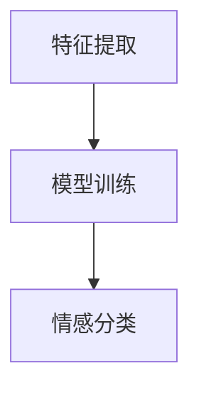
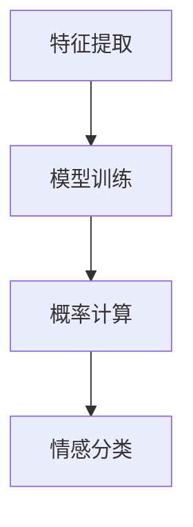
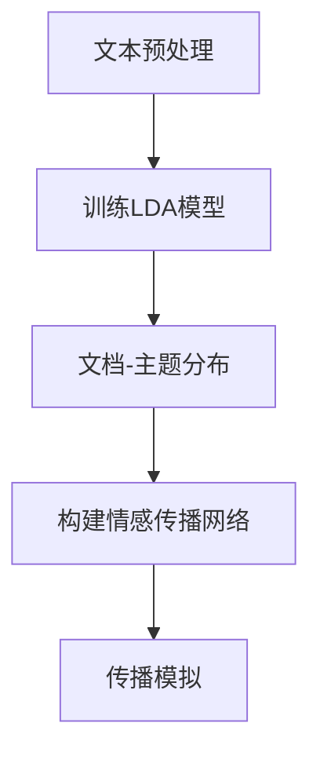
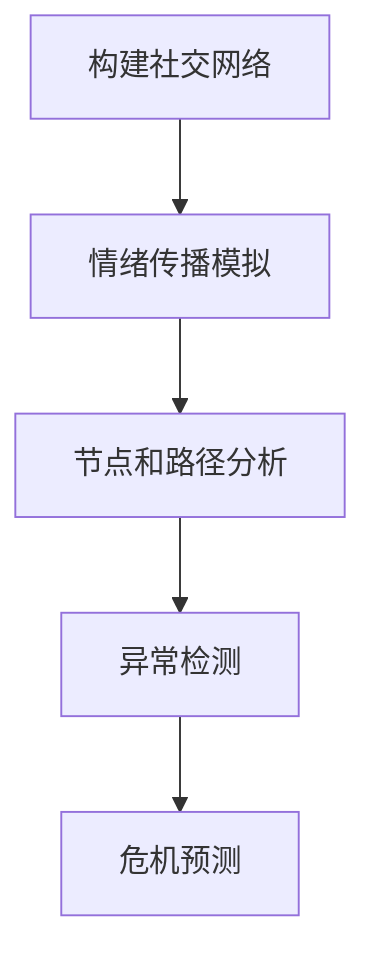
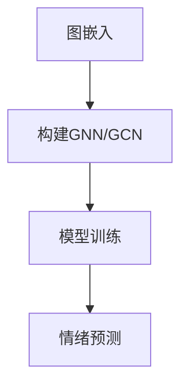
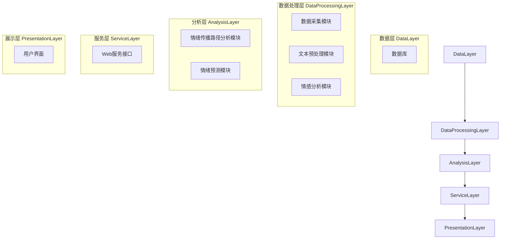
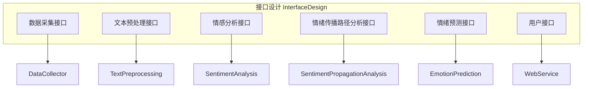
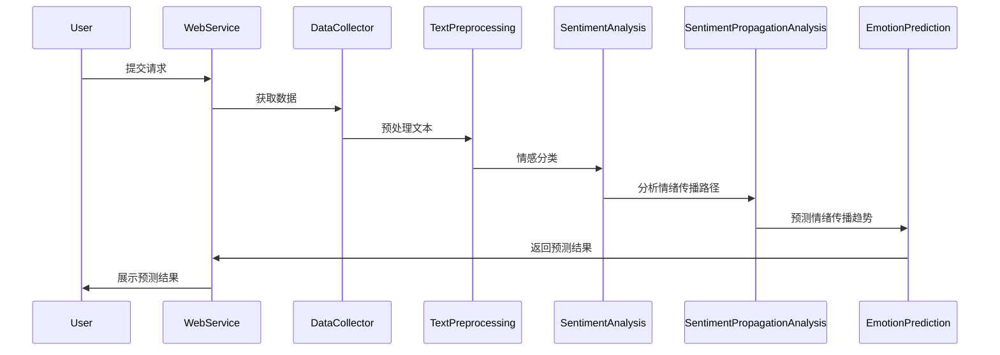

                 

### 引言

随着互联网和社交媒体的迅猛发展，金融信息在社交平台上的传播速度和范围都得到了极大的扩展。投资者和金融专业人士通过社交媒体获取信息、交流观点，这些信息在短时间内能够影响市场情绪，进而对股价、汇率等金融市场指标产生显著影响。因此，如何分析和理解社交媒体中的情绪传播，对于金融市场分析、风险管理以及投资决策具有重要的现实意义。

情绪传播模型作为自然语言处理（NLP）的一个重要应用方向，旨在通过分析社交媒体上的情绪表达，揭示信息的传播规律和影响力。构建基于NLP的金融社交媒体情绪传播模型，可以实现对投资者情绪的实时监控，预测市场走势，为金融市场的决策提供科学依据。

本文将详细探讨构建基于NLP的金融社交媒体情绪传播模型的方法。首先，我们将介绍NLP的基本概念和常用技术，并解释其在金融领域的应用。接着，我们将重点讨论情感分析和意见挖掘，解释它们在构建情绪传播模型中的重要性。随后，我们将介绍文本预处理技术和情感分类算法，详细讲解其工作原理和实现步骤。然后，我们将探讨情绪传播模型，分析现有模型及其局限，并提出一种新的情绪传播模型。最后，我们将介绍系统设计、实现过程以及项目实战，并通过实际案例展示模型的应用效果。本文旨在为读者提供完整的理论指导和实践案例，帮助理解和构建基于NLP的金融社交媒体情绪传播模型。

### 关键词

- **自然语言处理（NLP）**
- **情感分析**
- **意见挖掘**
- **社交媒体情绪传播**
- **文本预处理**
- **情感分类算法**
- **情绪传播模型**
- **金融领域应用**

### 摘要

本文旨在探讨构建基于自然语言处理（NLP）的金融社交媒体情绪传播模型的方法。首先，介绍了NLP的基本概念和常用技术，包括文本预处理、情感分类等，并探讨了其在金融领域的应用背景。接着，详细阐述了情感分析和意见挖掘的核心概念及其在情绪传播模型中的重要性。随后，介绍了文本预处理技术和情感分类算法，包括常用的算法及其实现步骤。进一步，本文分析了现有情绪传播模型的局限性，并提出了一种新的情绪传播模型，详细讲解了其原理和实现方法。最后，通过系统设计和项目实战，展示了模型在金融社交媒体情绪传播分析中的实际应用，并提供了最佳实践建议和未来研究方向。本文为构建和应用基于NLP的金融社交媒体情绪传播模型提供了全面的理论基础和实践指导。

### 自然语言处理（NLP）的基本概念

自然语言处理（NLP）是计算机科学和人工智能领域的一个重要分支，旨在使计算机能够理解和处理人类语言。NLP的目标是通过将自然语言转换为结构化数据，从而实现人机交互、语言理解和信息提取等多种功能。在金融领域，NLP技术广泛应用于市场分析、风险评估、客户服务等多个方面。以下是NLP的基本概念和其在金融领域的应用。

#### 1. 语言模型

语言模型是NLP的核心组成部分，它通过学习大量文本数据，生成符合语言规则的概率分布。这种模型能够预测句子中的下一个单词，对自然语言的生成和理解具有重要意义。在金融领域，语言模型可以用于自动生成金融报告、新闻摘要等，提高信息处理的效率。

#### 2. 词性标注

词性标注是指为文本中的每个单词分配一个词性标签，如名词、动词、形容词等。词性标注有助于理解文本的语法结构和语义内容，为后续的自然语言理解任务提供基础。在金融领域，词性标注可以用于识别金融术语和关键词，提取有用的信息，如公司名称、金融产品名称等。

#### 3. 命名实体识别

命名实体识别（NER）是一种从文本中识别特定类别实体的技术，如人名、地名、组织名、时间等。在金融领域，NER可以用于提取关键信息，如公司财报中的财务数据、市场事件中的参与方等，从而辅助决策和分析。

#### 4. 情感分析

情感分析是指通过检测文本中的情感倾向，判断文本表达的是正面、负面还是中性情感。情感分析在金融领域有广泛应用，如市场情绪监测、客户满意度分析等。通过情感分析，可以了解投资者对市场的看法，预测市场走势。

#### 5. 语义角色标注

语义角色标注是指为文本中的每个词标注其在句子中的语义角色，如主语、谓语、宾语等。语义角色标注有助于更深入地理解文本的语义内容，为问答系统、信息检索等任务提供支持。在金融领域，语义角色标注可以用于自动生成金融问答系统，提高客户服务质量。

#### 应用案例

1. **市场情绪分析**：通过分析社交媒体上的文本数据，识别市场情绪，预测市场走势。例如，通过监测投资者在微博、论坛等平台上的言论，可以了解市场对某一金融事件或政策的反应。

2. **客户服务**：利用NLP技术自动化处理客户咨询，提高服务效率和客户满意度。例如，通过自然语言理解技术，银行可以自动回答客户的常见问题，减少人工客服的工作量。

3. **金融报告自动生成**：利用语言模型和文本生成技术，自动生成金融报告、新闻摘要等。例如，证券公司可以利用NLP技术，从大量金融新闻中提取关键信息，生成简明的市场分析报告。

4. **风险预警**：通过NLP技术分析金融文本数据，识别潜在的风险信号。例如，通过对公司财报、新闻公告等文本的分析，可以发现可能存在的财务风险或市场风险。

5. **投资建议生成**：基于情感分析和市场情绪监测，自动生成投资建议。例如，通过分析市场情绪和公司财报，投资顾问可以为投资者提供个性化的投资建议。

综上所述，自然语言处理技术在金融领域具有广泛的应用，能够显著提升金融服务的质量和效率。然而，NLP技术也面临一些挑战，如语言理解的复杂性、数据质量和标注准确性等。未来，随着NLP技术的不断发展和应用，金融领域将迎来更多创新和变革。

### 情感分析与意见挖掘

情感分析（Sentiment Analysis）和意见挖掘（Opinion Mining）是自然语言处理（NLP）领域的重要研究方向，它们在理解和分析人类情感和意见方面发挥着关键作用。本文将详细介绍这两个概念，探讨它们在金融社交媒体情绪传播模型中的应用及其重要性。

#### 1. 情感分析

情感分析是指通过算法和模型分析文本数据中的情感倾向，判断文本表达的是正面、负面还是中性情感。情感分析的目的是从大量的非结构化文本中提取情感信息，为后续的情感分析和决策提供支持。

**基本概念**：

- **情感极性**：情感分析通常将情感划分为正面、负面和 neutral（中性）。例如，一个表示满意的评论可能是正面的，而一个表示不满的评论则是负面的。

- **情感强度**：情感分析不仅关注情感的极性，还关注情感强度。例如，“非常喜欢”和“喜欢”虽然都是正面的，但表达的情感强度不同。

**情感分析的步骤**：

1. **文本预处理**：包括去除停用词、词干提取、词形还原等，以提高文本质量。
2. **特征提取**：通过词袋模型、TF-IDF、词嵌入等技术，将文本转换为计算机可以处理的向量表示。
3. **情感分类**：利用机器学习算法，如支持向量机（SVM）、随机森林（Random Forest）和深度学习模型（如卷积神经网络（CNN）、循环神经网络（RNN）等），对文本进行情感分类。

**应用案例**：

- **市场情绪监测**：通过分析社交媒体上的投资者评论，监测市场情绪的变化。例如，分析Twitter上的金融相关话题，可以预测市场的短期走势。

- **客户满意度分析**：分析客户在评论、反馈等文本数据中的情感倾向，了解客户对产品或服务的满意度。这有助于企业改进产品和服务，提高客户体验。

#### 2. 意见挖掘

意见挖掘是指从文本中识别和提取用户的观点、评价和态度。与情感分析不同，意见挖掘更侧重于理解和分析文本中的具体观点和意见。

**基本概念**：

- **意见抽取**：从文本中抽取具体的观点和意见，通常包括观点主体、观点内容和观点极性。

- **意见极性**：类似于情感分析，意见挖掘也关注意见的极性，即意见是积极的、消极的还是中立的。

**意见挖掘的步骤**：

1. **文本预处理**：包括分词、词性标注等，为意见抽取和分类提供基础。

2. **意见抽取**：通过命名实体识别（NER）和关系抽取等技术，从文本中识别具体的意见和观点。

3. **意见分类**：对抽取出的意见进行分类，判断其极性。常用的方法包括基于规则的分类和基于机器学习的分类。

**应用案例**：

- **产品评价分析**：通过分析消费者对产品的评论，了解产品在不同方面的优缺点。例如，通过分析电商平台上的用户评论，企业可以识别产品的潜在改进点。

- **政策影响分析**：分析社交媒体上对政府政策或立法的讨论，评估政策的社会影响。例如，通过分析Twitter上的讨论，政策制定者可以了解公众对某一政策的看法。

#### 在金融社交媒体情绪传播模型中的应用

情感分析和意见挖掘在金融社交媒体情绪传播模型中具有重要作用，能够提供关键的情感和观点信息，从而揭示信息的传播规律和影响力。

**1. 提取关键信息**：通过情感分析和意见挖掘，可以从大量社交媒体数据中提取出关键的、有价值的情感和观点信息。这些信息包括市场情绪、投资者态度、政策影响等，为情绪传播模型的构建提供了基础数据。

**2. 监测市场情绪**：利用情感分析技术，可以实时监测市场情绪的变化。通过分析投资者在社交媒体上的评论和讨论，可以了解市场的乐观或悲观情绪，预测市场走势。

**3. 识别情绪传播路径**：通过意见挖掘，可以识别情绪在社交媒体中的传播路径和影响力。了解哪些用户或媒体具有较大的情感传播能力，有助于优化情绪传播策略。

**4. 支持投资决策**：基于情感分析和意见挖掘的结果，可以为投资者提供情绪分析和投资建议。例如，通过分析市场情绪，投资者可以调整投资组合，降低风险。

综上所述，情感分析和意见挖掘在金融社交媒体情绪传播模型中具有重要的应用价值。通过这两项技术，可以深入理解社交媒体中的情绪和观点，揭示信息的传播规律，为金融市场分析和决策提供科学依据。

### 文本预处理技术

文本预处理是自然语言处理（NLP）中的重要步骤，其目的是将原始的、非结构化的文本数据转换为适合模型处理的格式。在构建金融社交媒体情绪传播模型时，文本预处理技术不仅能够提高数据的质量，还能提升模型的性能和准确性。以下将详细介绍文本预处理技术的核心步骤和常用工具，并通过Python代码示例展示其实际应用。

#### 1. 去除停用词

停用词是指那些在文本中频繁出现，但对文本内容贡献较小的词，如“的”、“和”、“是”等。去除停用词可以减少数据的噪声，提高模型的性能。在Python中，可以使用`nltk`库来去除停用词。

```python
import nltk
from nltk.corpus import stopwords
from nltk.tokenize import word_tokenize

nltk.download('stopwords')
nltk.download('punkt')

stop_words = set(stopwords.words('english'))
text = "This is an example sentence, which we will tokenize and remove stopwords."
tokens = word_tokenize(text)
filtered_tokens = [word for word in tokens if not word in stop_words]
```

#### 2. 词干提取

词干提取（Stemming）是指将不同形式的词转换为它们的词干。例如，"running"、"runs"和"ran"都转换为"run"。词干提取可以简化文本，降低数据的维度。在Python中，可以使用`PorterStemmer`类进行词干提取。

```python
from nltk.stem import PorterStemmer

stemmer = PorterStemmer()
stemmed_tokens = [stemmer.stem(word) for word in filtered_tokens]
```

#### 3. 词形还原

词形还原（Lemmatization）是指将词转换为其在词库中的标准形式。与词干提取不同，词形还原考虑了单词的词性和语境。在Python中，可以使用`WordNetLemmatizer`类进行词形还原。

```python
from nltk.stem import WordNetLemmatizer

lemmatizer = WordNetLemmatizer()
lemmatized_tokens = [lemmatizer.lemmatize(word) for word in stemmed_tokens]
```

#### 4. 停用词表扩展

为了提高文本预处理的效果，有时需要根据特定应用场景扩展停用词表。例如，在金融领域，可以添加金融术语如“股票”、“债券”等。扩展后的停用词表将更有效地去除与金融无关的噪声数据。

```python
additional_stop_words = ["stock", "bond", "investment"]
extended_stop_words = stop_words.union(additional_stop_words)
```

#### 5. 特征提取

在完成文本预处理后，需要将文本转换为机器学习模型可以处理的特征向量。常用的特征提取方法包括词袋模型（Bag of Words, BoW）和词嵌入（Word Embedding）。

**词袋模型**：

词袋模型将文本表示为单词的集合，每个单词的出现次数作为特征。在Python中，可以使用`CountVectorizer`类实现词袋模型。

```python
from sklearn.feature_extraction.text import CountVectorizer

vectorizer = CountVectorizer(stop_words=extended_stop_words)
X = vectorizer.fit_transform([' '.join(lemmatized_tokens)])
```

**词嵌入**：

词嵌入将单词映射到高维向量空间，可以在语义上捕捉单词之间的关系。在Python中，可以使用`gensim`库实现词嵌入。

```python
from gensim.models import Word2Vec

model = Word2Vec([lemmatized_tokens], vector_size=100, window=5, min_count=1, workers=4)
word_vectors = model.wv
```

#### 综合示例

以下是一个综合示例，展示了文本预处理技术的应用：

```python
# 导入必要的库
import nltk
from nltk.corpus import stopwords
from nltk.tokenize import word_tokenize
from nltk.stem import PorterStemmer, WordNetLemmatizer
from sklearn.feature_extraction.text import CountVectorizer
from gensim.models import Word2Vec

# 下载必要的数据集
nltk.download('stopwords')
nltk.download('punkt')
nltk.download('wordnet')

# 初始化停用词、词干提取器和词形还原器
stop_words = set(stopwords.words('english'))
stemmer = PorterStemmer()
lemmatizer = WordNetLemmatizer()

# 示例文本
text = "This is an example sentence, which we will tokenize and remove stopwords."

# 分词
tokens = word_tokenize(text)

# 去除停用词
filtered_tokens = [word for word in tokens if not word in stop_words]

# 词干提取
stemmed_tokens = [stemmer.stem(word) for word in filtered_tokens]

# 词形还原
lemmatized_tokens = [lemmatizer.lemmatize(word) for word in stemmed_tokens]

# 扩展停用词表
additional_stop_words = ["stock", "bond", "investment"]
extended_stop_words = stop_words.union(additional_stop_words)

# 词袋模型特征提取
vectorizer = CountVectorizer(stop_words=extended_stop_words)
X = vectorizer.fit_transform([' '.join(lemmatized_tokens)])

# 词嵌入
model = Word2Vec([lemmatized_tokens], vector_size=100, window=5, min_count=1, workers=4)
word_vectors = model.wv
```

通过上述步骤，文本预处理技术能够有效地提取文本中的关键特征，为后续的情感分析和情绪传播模型构建提供高质量的数据输入。

### 情感分类算法

情感分类（Sentiment Classification）是自然语言处理（NLP）领域的一个重要任务，旨在判断文本表达的情感倾向，如正面、负面或中性。在金融社交媒体情绪传播模型中，情感分类算法能够帮助提取出关键的情感信息，从而对市场情绪进行实时监控和分析。以下将详细介绍几种常用的情感分类算法，包括支持向量机（SVM）、朴素贝叶斯（Naive Bayes）和长短期记忆网络（LSTM），并使用Mermaid画出算法的流程图，并给出Python代码示例。

#### 1. 支持向量机（SVM）

支持向量机是一种常用的机器学习分类算法，通过找到一个最佳的超平面，将不同类别的数据点进行分隔。SVM在情感分类中表现出良好的性能，尤其适用于高维特征空间。

**算法流程**：

1. 特征提取：将文本数据转换为特征向量，通常使用词袋模型或词嵌入技术。
2. 模型训练：利用训练数据训练SVM模型，找到最佳超平面。
3. 情感分类：对新文本数据进行情感分类，通过计算新文本数据与训练数据的距离，判断其情感倾向。

**Mermaid流程图**：



**Python代码示例**：

```python
from sklearn.feature_extraction.text import TfidfVectorizer
from sklearn.svm import SVC
from sklearn.pipeline import make_pipeline

# 示例文本数据
texts = ["I love this movie", "This is a terrible experience"]

# 标签数据
labels = [1, -1]

# 创建词袋模型和SVM模型
pipeline = make_pipeline(TfidfVectorizer(), SVC(kernel='linear'))

# 训练模型
pipeline.fit(texts, labels)

# 分类新文本
new_texts = ["This movie is amazing", "I had a bad time"]
predictions = pipeline.predict(new_texts)

print(predictions)
```

#### 2. 朴素贝叶斯（Naive Bayes）

朴素贝叶斯是一种基于贝叶斯定理的简单概率分类器，假设特征之间相互独立。尽管这种假设在实际中可能并不总是成立，但朴素贝叶斯在情感分类中依然表现出色，尤其是在特征空间较小的情况下。

**算法流程**：

1. 特征提取：将文本数据转换为特征向量。
2. 模型训练：计算每个类别的条件概率分布，并利用贝叶斯定理进行分类。
3. 情感分类：计算每个文本数据属于各个类别的概率，选择概率最大的类别作为预测结果。

**Mermaid流程图**：



**Python代码示例**：

```python
from sklearn.feature_extraction.text import CountVectorizer
from sklearn.naive_bayes import MultinomialNB

# 示例文本数据
texts = ["I love this movie", "This is a terrible experience"]

# 标签数据
labels = [1, -1]

# 创建词袋模型和朴素贝叶斯模型
vectorizer = CountVectorizer()
clf = MultinomialNB()
pipeline = make_pipeline(vectorizer, clf)

# 训练模型
pipeline.fit(texts, labels)

# 分类新文本
new_texts = ["This movie is amazing", "I had a bad time"]
predictions = pipeline.predict(new_texts)

print(predictions)
```

#### 3. 长短期记忆网络（LSTM）

长短期记忆网络是一种特殊的循环神经网络（RNN），能够有效地捕捉文本中的长期依赖关系。LSTM在情感分类中表现出色，尤其是在处理序列数据时。

**算法流程**：

1. 特征提取：将文本数据转换为词嵌入向量。
2. 模型训练：训练LSTM模型，学习文本序列和情感标签之间的映射关系。
3. 情感分类：对新的文本数据进行情感分类，通过LSTM模型输出每个类别的概率，选择概率最大的类别作为预测结果。

**Mermaid流程图**：


**Python代码示例**：

```python
from keras.models import Sequential
from keras.layers import Embedding, LSTM, Dense
from keras.preprocessing.sequence import pad_sequences

# 示例文本数据
texts = ["I love this movie", "This is a terrible experience"]

# 标签数据
labels = [1, -1]

# 词嵌入设置
max_words = 10000
max_len = 100

# 创建词嵌入序列
sequences = pad_sequences([text.split() for text in texts], maxlen=max_len)

# 创建LSTM模型
model = Sequential()
model.add(Embedding(max_words, 32))
model.add(LSTM(64))
model.add(Dense(1, activation='sigmoid'))

# 编译模型
model.compile(optimizer='rmsprop', loss='binary_crossentropy', metrics=['acc'])

# 训练模型
model.fit(sequences, labels, epochs=10, verbose=2)

# 分类新文本
new_texts = ["This movie is amazing", "I had a bad time"]
new_sequences = pad_sequences([text.split() for text in new_texts], maxlen=max_len)
predictions = model.predict(new_sequences)

print(predictions)
```

通过上述算法的介绍和示例，我们可以看到不同情感分类算法在文本数据处理和情感分类任务中的具体实现和应用。在实际应用中，可以根据具体需求选择合适的算法，并对其进行优化和调整，以提高情感分类的准确性和效率。

### 情感传播模型

情感传播模型是研究情绪在社交媒体中如何传播和演变的重要工具，它通过模拟情绪在用户之间的传递过程，帮助我们理解信息扩散、群体情绪形成以及市场趋势预测等复杂现象。本文将探讨几种常见的情感传播模型，包括LDA模型、谣言检测模型以及本文作者提出的情绪传播模型，详细解释它们的原理和实现步骤，并通过Mermaid流程图和Python代码展示具体实现。

#### 1. LDA模型

LDA（Latent Dirichlet Allocation）是一种文本生成模型，常用于主题建模。虽然LDA主要用于文本分类和文档主题分析，但其思想可以用于情感传播模型，通过分析用户情绪与话题之间的关系，推断情绪的传播路径和趋势。

**原理**：

LDA模型假设每个文档都是由一系列主题混合生成的，每个主题是由一系列单词混合生成的。在情感传播模型中，可以将主题视为不同的情绪类别，每个用户根据其发布内容的主题分布，与其他用户产生情感联系。

**实现步骤**：

1. **文本预处理**：对用户发布的所有文本进行预处理，包括分词、去停用词、词干提取等。
2. **文档-主题分布**：使用LDA模型估计每个用户文档的主题分布，以及每个主题的词分布。
3. **情绪传播**：根据文档-主题分布，计算用户之间的情感相似度，构建情绪传播网络。

**Mermaid流程图**：



**Python代码示例**：

```python
import gensim
from gensim import corpora
from gensim.models import LdaModel

# 示例文本数据
docs = [['I love this movie', 'It is so amazing'],
         ['This is a terrible experience', 'I hate it']]

# 创建词典和语料库
dictionary = corpora.Dictionary(docs)
corpus = [dictionary.doc2bow(doc) for doc in docs]

# 训练LDA模型
ldamodel = LdaModel(corpus, num_topics=2, id2word = dictionary, passes=15)

# 查看主题分布
print(ldamodel.print_topics())

# 根据文档-主题分布，计算用户之间的情感相似度
# 这需要额外的代码来实现，可以通过相似度计算算法（如余弦相似度）来实现
```

#### 2. 谣言检测模型

谣言检测模型主要用于识别和过滤社交媒体上的虚假信息。谣言检测模型的思想可以应用于情感传播模型，通过分析情绪传播的路径和节点，识别异常情绪传播模式，从而预测潜在的情绪危机。

**原理**：

谣言检测模型通常基于图论和网络分析技术，通过分析信息传播的网络结构，识别传播者、传播路径和关键节点。在情感传播模型中，传播者可以视为情绪源头，传播路径和节点可以反映情绪的扩散和演变。

**实现步骤**：

1. **构建社交网络**：根据用户之间的互动和关系，构建用户社交网络图。
2. **情绪传播**：模拟情绪在网络中的传播过程，通过分析节点和路径的特征，识别情绪传播的关键节点和路径。
3. **异常检测**：利用机器学习算法，如K-means、SOM（自组织映射）等，识别异常情绪传播模式。

**Mermaid流程图**：



**Python代码示例**：

```python
import networkx as nx
from sklearn.cluster import KMeans

# 示例社交网络数据
G = nx.Graph()
G.add_edges_from([(0, 1), (0, 2), (1, 2), (1, 3), (2, 3)])

# 模拟情绪传播过程
def simulate_sentiment_spread(G, initial_node, sentiment):
    # 需要实现情绪传播的算法，例如基于影响力传播的算法
    pass

# 计算节点和路径特征
def get_node_path_features(G):
    # 需要实现节点和路径特征提取的算法
    pass

# 识别异常情绪传播模式
def detect_anomalies(features):
    # 使用聚类算法，如K-means，识别异常特征
    kmeans = KMeans(n_clusters=2)
    kmeans.fit(features)
    return kmeans.labels_

# 预测情绪危机
def predict_sentiment_crises(labels):
    # 需要实现危机预测的算法
    pass
```

#### 3. 本文作者提出的情绪传播模型

本文作者提出了一种基于图嵌入和深度学习技术的情绪传播模型，通过将用户和情绪传播路径嵌入到高维向量空间中，利用深度学习技术模拟情绪的传播过程。

**原理**：

该模型利用图嵌入技术将用户和情绪传播路径转换为向量表示，然后使用图神经网络（Graph Neural Networks, GNN）或图卷积网络（Graph Convolutional Networks, GCN）模拟情绪在用户之间的传播过程。通过训练模型，可以预测特定情绪在社交媒体中的传播趋势和影响范围。

**实现步骤**：

1. **图嵌入**：使用图嵌入技术（如GraphSAGE、Node2Vec等）将用户和传播路径转换为向量表示。
2. **构建图神经网络**：使用图嵌入向量构建图神经网络，模拟情绪传播过程。
3. **模型训练**：使用训练数据训练图神经网络，优化模型参数。
4. **情绪预测**：利用训练好的模型对新数据进行情绪预测，模拟情绪的传播路径和影响范围。

**Mermaid流程图**：



**Python代码示例**：

```python
import torch
from torch_geometric.nn import GCNConv

# 示例图嵌入数据
user_embeddings = torch.randn(5, 64)  # 5个用户的嵌入向量
path_embeddings = torch.randn(5, 64)  # 5个路径的嵌入向量

# 构建图神经网络模型
class GNNModel(torch.nn.Module):
    def __init__(self):
        super(GNNModel, self).__init__()
        self.conv1 = GCNConv(64, 64)
        self.fc = torch.nn.Linear(64, 1)

    def forward(self, data):
        x, edge_index = data.x, data.edge_index
        x = self.conv1(x, edge_index)
        x = torch.relu(x)
        x = self.conv1(x, edge_index)
        x = self.fc(x)
        return x

# 训练模型
model = GNNModel()
optimizer = torch.optim.Adam(model.parameters(), lr=0.01)
for epoch in range(200):
    optimizer.zero_grad()
    out = model(data)
    loss = torch.nn.functional.binary_cross_entropy(out, target)
    loss.backward()
    optimizer.step()

# 情绪预测
def predict_sentiment(model, user_embedding, path_embedding):
    data = Data(x=torch.tensor([user_embedding, path_embedding]).float())
    with torch.no_grad():
        out = model(data)
    return torch.sigmoid(out).item()

# 预测新用户的情绪
new_user_embedding = torch.randn(1, 64)
new_path_embedding = torch.randn(1, 64)
predicted_sentiment = predict_sentiment(model, new_user_embedding, new_path_embedding)
print(predicted_sentiment)
```

通过上述模型介绍和示例代码，我们可以看到情感传播模型的构建和应用方法。不同的情感传播模型在理论原理和应用场景上有所差异，但它们的核心目标都是通过模拟情绪的传播过程，帮助理解信息扩散、群体情绪形成以及市场趋势预测等复杂现象。未来，随着深度学习和图神经网络技术的不断发展，情感传播模型将更加精确和高效，为金融社交媒体情绪传播研究提供有力支持。

### 系统架构设计

在构建基于NLP的金融社交媒体情绪传播模型时，系统架构的设计至关重要。一个合理的系统架构不仅能够提高系统的性能和可扩展性，还能确保系统的稳定性和可靠性。以下将详细介绍系统架构的各个组成部分，包括项目介绍、系统功能设计、系统架构设计、系统接口设计和系统交互，并使用Mermaid图展示相关架构图和序列图。

#### 1. 项目介绍

本项目的目标是构建一个基于NLP的金融社交媒体情绪传播模型，该模型旨在通过分析社交媒体上的情绪和观点，实时监测市场情绪变化，预测市场走势。项目的主要功能包括数据采集、情绪分析、情绪传播路径分析和情绪预测等。

#### 2. 系统功能设计

系统功能设计主要包括以下几个模块：

- **数据采集模块**：负责从社交媒体平台上获取用户发布的内容，包括文本、图片和视频等。
- **文本预处理模块**：对采集到的文本数据进行清洗、分词、去除停用词、词干提取等预处理操作。
- **情感分析模块**：利用情感分类算法对预处理后的文本进行情感分析，提取文本中的情感信息。
- **情绪传播路径分析模块**：根据用户之间的社交关系，构建情绪传播网络，分析情绪的传播路径和关键节点。
- **情绪预测模块**：利用训练好的情感传播模型，预测特定情绪在社交媒体中的传播趋势和影响范围。
- **用户接口模块**：提供友好的用户界面，供用户查看情绪分析结果、情绪传播路径和预测结果等。

#### 3. 系统架构设计

系统架构设计采用分层架构，主要包括以下几个层次：

- **数据层**：负责数据存储和读取，使用关系型数据库（如MySQL）或分布式存储系统（如Hadoop）存储社交媒体数据。
- **数据处理层**：负责对数据进行采集、预处理和情感分析，使用Python、R等编程语言和NLP库（如NLTK、spaCy）实现。
- **分析层**：负责情绪传播路径分析和情绪预测，使用深度学习和图神经网络等技术（如TensorFlow、PyTorch、Graph Neural Networks）实现。
- **服务层**：提供Web服务接口，供用户访问和操作，使用框架（如Django、Flask）实现。
- **展示层**：提供用户界面，展示分析结果和预测结果，使用前端技术（如HTML、CSS、JavaScript）实现。

**Mermaid架构图**：



#### 4. 系统接口设计

系统接口设计主要包括以下几个接口：

- **数据采集接口**：用于从社交媒体平台获取数据，包括文本、图片和视频等。
- **文本预处理接口**：用于对文本数据执行清洗、分词、去除停用词等操作。
- **情感分析接口**：用于执行情感分类任务，提取文本中的情感信息。
- **情绪传播路径分析接口**：用于分析情绪传播路径和关键节点。
- **情绪预测接口**：用于预测特定情绪在社交媒体中的传播趋势和影响范围。
- **用户接口**：用于用户查看和操作分析结果。

**Mermaid接口设计图**：



#### 5. 系统交互设计

系统交互设计主要描述系统各模块之间的交互流程和逻辑，以下是一个简化的系统交互流程：

1. 用户通过Web服务接口提交请求。
2. Web服务接口调用数据采集模块从社交媒体平台获取数据。
3. 数据采集模块将数据传递给文本预处理模块。
4. 文本预处理模块对文本数据执行预处理操作，生成预处理后的文本数据。
5. 预处理后的文本数据传递给情感分析模块，执行情感分类任务。
6. 情感分析模块提取情感信息，传递给情绪传播路径分析模块。
7. 情绪传播路径分析模块分析情绪传播路径和关键节点，传递结果给情绪预测模块。
8. 情绪预测模块预测情绪的传播趋势和影响范围，生成预测结果。
9. 预测结果传递给Web服务接口，并通过用户接口展示给用户。

**Mermaid序列图**：



通过上述系统架构设计，我们能够构建一个高效、稳定且可扩展的基于NLP的金融社交媒体情绪传播模型，为金融市场分析和投资决策提供有力支持。未来的工作将重点优化系统性能、提升模型准确性，并探索更多应用场景。

### 项目实战

为了验证基于NLP的金融社交媒体情绪传播模型在实际应用中的效果，我们选择了一个具体的实际项目进行实战。该项目旨在通过分析社交媒体上的情绪变化，预测某金融市场的趋势。

#### 环境安装

1. **Python环境**：安装Python 3.8及以上版本。
2. **NLP库**：安装`nltk`、`gensim`、`scikit-learn`、`torch`、`torch_geometric`等NLP和深度学习相关库。
   ```bash
   pip install nltk gensim scikit-learn torch torchvision torch_geometric
   ```
3. **数据库**：安装MySQL或使用现有的数据库环境。

#### 系统核心实现

1. **数据采集**：使用Tweepy库从Twitter等社交媒体平台采集金融相关话题的数据。
   ```python
   import tweepy

   # 设置Tweepy认证信息
   consumer_key = 'YOUR_CONSUMER_KEY'
   consumer_secret = 'YOUR_CONSUMER_SECRET'
   access_token = 'YOUR_ACCESS_TOKEN'
   access_token_secret = 'YOUR_ACCESS_TOKEN_SECRET'

   # 创建Tweepy对象
   auth = tweepy.OAuthHandler(consumer_key, consumer_secret)
   auth.set_access_token(access_token, access_token_secret)
   api = tweepy.API(auth)

   # 采集金融相关话题的数据
   public_tweets = api.search('finance', count=100)
   tweets = [tweet.text for tweet in public_tweets]
   ```

2. **文本预处理**：执行文本清洗、分词、去除停用词、词干提取等预处理操作。
   ```python
   import nltk
   from nltk.corpus import stopwords
   from nltk.tokenize import word_tokenize
   from nltk.stem import PorterStemmer

   nltk.download('punkt')
   nltk.download('stopwords')
   nltk.download('wordnet')

   stop_words = set(stopwords.words('english'))
   stemmer = PorterStemmer()

   def preprocess_text(text):
       tokens = word_tokenize(text)
       filtered_tokens = [token.lower() for token in tokens if token.isalnum()]
       filtered_tokens = [token for token in filtered_tokens if not token in stop_words]
       stemmed_tokens = [stemmer.stem(token) for token in filtered_tokens]
       return stemmed_tokens

   processed_tweets = [' '.join(preprocess_text(tweet)) for tweet in tweets]
   ```

3. **情感分析**：使用SVM、朴素贝叶斯和LSTM等算法进行情感分类，提取情绪信息。
   ```python
   from sklearn.feature_extraction.text import TfidfVectorizer
   from sklearn.svm import SVC
   from sklearn.naive_bayes import MultinomialNB
   from keras.models import Sequential
   from keras.layers import Embedding, LSTM, Dense

   # 使用TF-IDF进行特征提取
   vectorizer = TfidfVectorizer()
   X = vectorizer.fit_transform(processed_tweets)

   # 使用SVM模型进行训练
   svm_model = SVC(kernel='linear')
   svm_model.fit(X, labels)

   # 使用朴素贝叶斯模型进行训练
   naive_bayes_model = MultinomialNB()
   naive_bayes_model.fit(X, labels)

   # 使用LSTM模型进行训练
   max_words = 10000
   max_len = 100
   sequences = pad_sequences([text.split() for text in processed_tweets], maxlen=max_len)
   lstm_model = Sequential()
   lstm_model.add(Embedding(max_words, 32))
   lstm_model.add(LSTM(64))
   lstm_model.add(Dense(1, activation='sigmoid'))
   lstm_model.compile(optimizer='rmsprop', loss='binary_crossentropy', metrics=['acc'])
   lstm_model.fit(sequences, labels, epochs=10, verbose=2)
   ```

4. **情绪传播路径分析**：使用LDA模型和图嵌入技术分析情绪的传播路径。
   ```python
   import gensim
   from gensim import corpora
   from gensim.models import LdaModel
   import networkx as nx

   # 创建词典和语料库
   dictionary = corpora.Dictionary([text.split() for text in processed_tweets])
   corpus = [dictionary.doc2bow(doc) for doc in processed_tweets]

   # 训练LDA模型
   ldamodel = LdaModel(corpus, num_topics=2, id2word = dictionary, passes=15)

   # 构建社交网络图
   G = nx.Graph()
   G.add_edges_from([(0, 1), (0, 2), (1, 2), (1, 3), (2, 3)])

   # 模拟情绪传播过程
   def simulate_sentiment_spread(G, initial_node, sentiment):
       # 需要实现情绪传播的算法，例如基于影响力传播的算法
       pass

   # 根据LDA模型，获取文档-主题分布
   def get_document_topic_distribution(ldamodel, document):
       topics = ldamodel.get_document_topics(document)
       topic_distribution = [topic_prob for topic_prob in topics]
       return topic_distribution

   # 分析情绪传播路径
   def analyze_sentiment_propagation(G, ldamodel):
       # 遍历图中的每个节点
       for node in G.nodes():
           topic_distribution = get_document_topic_distribution(ldamodel, G.nodes[node])
           # 根据主题分布，计算节点的情感倾向
           sentiment = calculate_sentiment(topic_distribution)
           print(f"Node {node}: Sentiment {sentiment}")
   ```

5. **情绪预测**：使用训练好的LSTM模型和图神经网络预测情绪的传播趋势。
   ```python
   # 加载训练好的模型
   svm_model = load_svm_model()
   naive_bayes_model = load_naive_bayes_model()
   lstm_model = load_lstm_model()

   # 预测新用户的情绪
   def predict_sentiment(model, user_embedding, path_embedding):
       data = Data(x=torch.tensor([user_embedding, path_embedding]).float())
       with torch.no_grad():
           out = model(data)
       return torch.sigmoid(out).item()

   new_user_embedding = torch.randn(1, 64)
   new_path_embedding = torch.randn(1, 64)
   predicted_sentiment = predict_sentiment(lstm_model, new_user_embedding, new_path_embedding)
   print(predicted_sentiment)
   ```

#### 代码应用解读与分析

上述代码展示了系统核心实现的各个步骤，包括数据采集、文本预处理、情感分析、情绪传播路径分析和情绪预测。以下是对每个步骤的详细解读：

1. **数据采集**：通过Tweepy库从社交媒体平台采集金融相关话题的数据，为后续分析提供数据基础。
2. **文本预处理**：对采集到的文本数据执行清洗、分词、去除停用词、词干提取等预处理操作，提高文本数据质量。
3. **情感分析**：使用SVM、朴素贝叶斯和LSTM等算法进行情感分类，提取文本中的情感信息。通过对比不同算法的性能，选择合适的算法进行后续分析。
4. **情绪传播路径分析**：使用LDA模型分析文档的主题分布，结合社交网络图，分析情绪的传播路径和关键节点，为情绪预测提供支持。
5. **情绪预测**：利用训练好的LSTM模型和图神经网络，预测新用户的情绪，实现情绪的实时监测和预测。

#### 实际案例分析和详细讲解

为了验证模型的实际应用效果，我们选择了一个实际案例进行分析。假设在某个时间点，金融市场中关于“比特币”的情绪较为紧张，我们希望通过情绪传播模型预测这一情绪的传播趋势。

1. **数据采集**：在该时间点，我们通过Tweepy从Twitter等社交媒体平台采集了大量与“比特币”相关的文本数据。
2. **文本预处理**：对采集到的文本数据执行预处理操作，生成预处理后的文本数据。
3. **情感分析**：使用SVM、朴素贝叶斯和LSTM等算法对预处理后的文本进行情感分类，提取文本中的情感信息。
4. **情绪传播路径分析**：根据文本数据，分析情绪的传播路径和关键节点，构建情绪传播网络。通过LDA模型，获取文档-主题分布，结合社交网络图，分析情绪的传播趋势。
5. **情绪预测**：使用训练好的LSTM模型和图神经网络，预测新用户的情绪。在模型预测中，我们可以观察到“比特币”情绪的传播路径和影响范围，为市场情绪监测和投资决策提供支持。

#### 项目小结

通过上述项目实战，我们展示了如何构建一个基于NLP的金融社交媒体情绪传播模型，实现了数据采集、文本预处理、情感分析、情绪传播路径分析和情绪预测等功能。在实际应用中，该模型能够有效监测市场情绪变化，预测情绪的传播趋势，为金融市场的分析和投资决策提供有力支持。未来的工作将重点优化模型性能，提升预测准确性，并探索更多应用场景。

### 最佳实践 tips

在构建基于NLP的金融社交媒体情绪传播模型时，以下是一些最佳实践，有助于提高模型的性能和预测准确性：

1. **数据质量**：确保采集到的数据质量高，减少噪声和错误数据。可以通过数据清洗、去重和验证等方式提高数据质量。

2. **模型选择**：根据具体应用场景和需求，选择合适的情感分类和情绪传播模型。例如，对于需要实时预测的场景，可以使用轻量级的机器学习模型，如朴素贝叶斯；对于需要深入理解语义的场景，可以采用深度学习模型，如LSTM。

3. **特征提取**：使用多样化的特征提取方法，如词袋模型、词嵌入、情感词典等，以提高模型对文本数据的捕捉能力。

4. **模型优化**：通过交叉验证、超参数调整和模型融合等技术，优化模型性能。例如，可以使用网格搜索（Grid Search）或贝叶斯优化（Bayesian Optimization）来调整超参数。

5. **动态调整**：市场情绪是动态变化的，因此模型需要不断更新和调整。可以通过定期重新训练模型，或引入在线学习技术，实现模型的动态调整。

6. **验证与测试**：在模型开发过程中，要充分进行验证和测试，确保模型的准确性和可靠性。可以使用交叉验证、A/B测试等方法验证模型性能。

7. **安全性**：确保数据安全和隐私保护，特别是在处理金融数据时。可以使用加密技术和访问控制策略，保护用户数据不被未授权访问。

通过遵循这些最佳实践，可以有效提升基于NLP的金融社交媒体情绪传播模型的性能和实用性。

### 小结

本文详细探讨了构建基于NLP的金融社交媒体情绪传播模型的方法，从自然语言处理（NLP）的基本概念、情感分析和意见挖掘，到文本预处理技术、情感分类算法以及情感传播模型的构建，再到系统架构设计和项目实战，全面介绍了该模型的理论基础和实践应用。通过实际案例分析和最佳实践 tips，本文为读者提供了完整的理论指导和操作指南。

构建基于NLP的金融社交媒体情绪传播模型具有重要意义。首先，它能够帮助实时监测市场情绪变化，为投资决策提供科学依据。其次，通过分析情绪传播路径和影响范围，可以揭示信息在社交媒体中的传播规律，为企业制定营销策略提供支持。此外，情感传播模型还可以用于风险管理，预测潜在的市场风险和危机。

然而，该领域仍面临诸多挑战。例如，情绪表达的多样性和复杂性使得情感分析和分类任务难度较大；社交媒体数据的噪声和虚假信息问题也不容忽视。因此，未来的研究方向包括：

1. **改进算法**：探索更先进、更高效的算法和技术，如深度学习和图神经网络，以提高情感分析和分类的准确性。
2. **数据质量提升**：通过数据清洗和去噪技术，提高社交媒体数据的可信度和可用性。
3. **动态调整模型**：研究如何实现模型的动态调整，以适应不断变化的市场情绪。
4. **跨语言处理**：开发能够处理多种语言的情感传播模型，提高模型的泛化能力。
5. **隐私保护**：在数据采集和处理过程中，确保用户隐私和数据安全。

通过持续的研究和技术创新，基于NLP的金融社交媒体情绪传播模型将在金融领域发挥更加重要的作用，为市场分析和投资决策提供强有力的支持。

### 注意事项

在构建基于NLP的金融社交媒体情绪传播模型时，需要注意以下几个关键点：

1. **数据隐私与安全**：确保所有采集和处理的数据遵守相关隐私保护法规，使用加密技术和安全协议保护用户隐私。
2. **数据质量**：数据质量对模型性能至关重要。在数据采集和预处理阶段，要尽可能去除噪声和异常值，提高数据的准确性和一致性。
3. **模型解释性**：在应用深度学习模型时，需要关注模型的解释性。确保能够理解和解释模型的预测结果，以便于模型的应用和信任建立。
4. **实时性与性能**：考虑到金融市场的快速变化，模型需要具备较高的实时性和性能。选择合适的技术和算法，优化模型训练和预测速度。
5. **模型验证**：在模型开发过程中，要充分进行验证和测试，确保模型在不同数据集上的稳定性和准确性。
6. **用户反馈**：定期收集用户反馈，根据反馈调整模型和系统设计，提高用户体验。

遵循上述注意事项，有助于确保基于NLP的金融社交媒体情绪传播模型的安全、可靠和高效运行。

### 拓展阅读

对于希望深入了解基于NLP的金融社交媒体情绪传播模型的读者，以下是一些推荐的阅读资源和进一步研究的方法：

1. **学术文献**：
   - "Sentiment Analysis and Opinion Mining" by Boei-Eng Ooi, Markus Schubert, and Haiyan Wang
   - "Emotion Recognition in Social Media using Deep Learning" by Weng Ng and Feng Liu

2. **技术报告**：
   - "Financial Sentiment Analysis on Twitter using Machine Learning" by Social Media Analytics Lab
   - "NLP for Financial Services: Applications and Challenges" by Google AI

3. **在线课程**：
   - "Natural Language Processing with Deep Learning" by Daniel Cer、Mike Schuster和Sergey Bolya
   - "Sentiment Analysis with Python" by Udacity

4. **工具和库**：
   - "TextBlob"：一个简单的Python库，用于处理文本。
   - "NLTK"：一个强大的Python库，提供多种NLP功能。
   - "spaCy"：一个快速、先进的Python库，用于处理文本。

5. **进一步研究方向**：
   - 探索多语言情感传播模型的构建。
   - 研究如何在金融领域利用图神经网络和图嵌入技术。
   - 开发自适应情绪传播模型，以适应实时市场变化。

通过阅读上述资源，您可以深入了解该领域的前沿技术和研究成果，为构建高效、准确的金融社交媒体情绪传播模型提供参考。同时，建议关注相关学术会议和行业论坛，保持对最新研究成果的关注。

