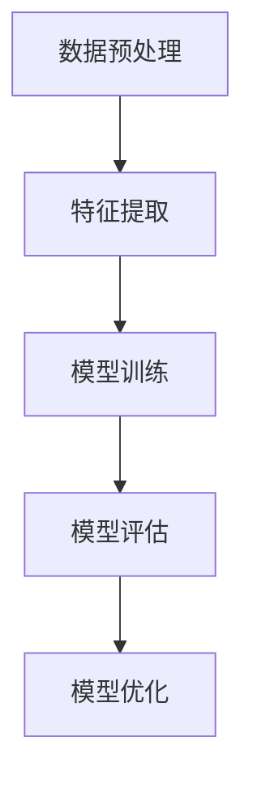
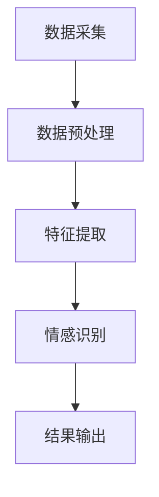
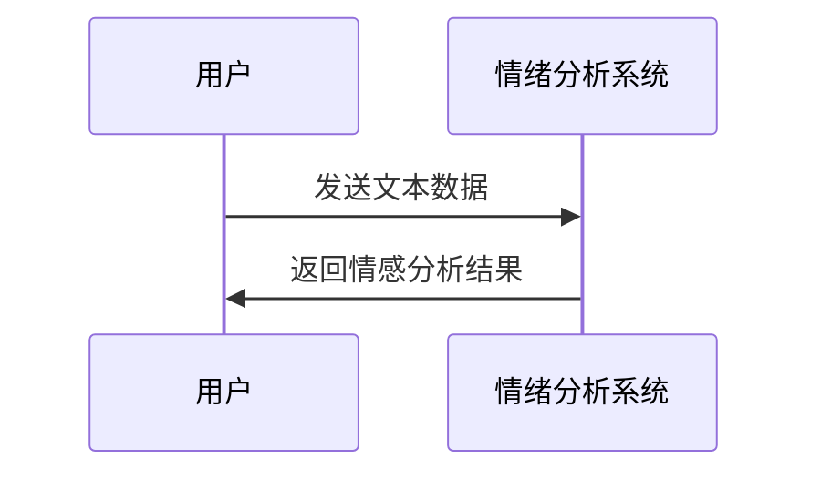

                 


### 引言

在当今的金融市场，信息透明度和实时性变得尤为重要。投资者不仅依赖于传统的新闻报告和市场数据，也越来越依赖社交媒体来获取即时信息、分享观点和预测市场走向。然而，社交媒体上的信息呈现出高度非结构化和多样化的特点，这使得传统的数据分析方法难以直接应用。因此，构建一个能够有效分析和挖掘社交媒体情绪的模型，对于投资者决策和金融市场预测具有重要意义。

### 什么是情绪分析

情绪分析（Sentiment Analysis），也称为意见挖掘，是自然语言处理（NLP）的一个分支，旨在通过分析文本数据，识别出文本中的情感倾向。在金融领域，情绪分析可以帮助投资者了解市场情绪，从而做出更加明智的投资决策。情绪分析通常包括两个主要方面：情感极性分析和情感强度分析。

- **情感极性分析**：确定文本是正面的、负面的还是中性的。
- **情感强度分析**：评估情感倾向的强度，例如，“我喜欢苹果”和“我非常喜欢苹果”的情感强度不同。

### 为什么需要基于NLP的情绪分析

社交媒体数据的非结构化特性使得传统的数据处理方法难以应对。而自然语言处理技术则能够有效地处理这种复杂的数据形式，提供以下优势：

- **处理多样化文本**：NLP能够处理社交媒体上各种不同风格、语法和用词的文本。
- **实时分析**：NLP技术能够快速处理大量文本数据，提供实时的情绪分析结果。
- **上下文理解**：NLP可以理解文本中的隐含意义和上下文关系，从而更准确地分析情绪。

### 背景介绍

**金融市场的情绪分析**

金融市场的波动往往受到多种因素的影响，包括经济数据、政策变化、企业业绩以及投资者情绪等。而投资者情绪则通过多种渠道传播，其中社交媒体是一个重要的信息源。通过分析社交媒体上的情绪，可以更好地理解市场趋势和投资者的心理变化，从而为投资决策提供支持。

**社交媒体数据的特点**

社交媒体数据具有以下几个显著特点：

- **非结构化**：社交媒体上的信息大多是非结构化的文本数据，难以直接使用传统的数据分析方法。
- **多样性**：社交媒体上的文本形式多样，包括文字、图片、视频等。
- **实时性**：社交媒体信息更新非常迅速，需要实时分析。
- **高噪声**：社交媒体上的信息往往伴随着大量的噪声和干扰信息。

### 问题描述

**构建基于NLP的金融社交媒体情绪分析模型**

在了解了金融市场的情绪分析的重要性和社交媒体数据的特点后，我们需要解决以下几个关键问题：

1. **如何处理非结构化的社交媒体数据**？
2. **如何有效地提取文本中的情感信息**？
3. **如何构建一个能够准确反映市场情绪的模型**？
4. **如何评估和优化模型的性能**？

### 问题解决

**引入NLP技术的基本原理和工具**

自然语言处理（NLP）是一种利用计算机技术和算法对人类语言进行理解和生成的人工智能技术。NLP的基本原理包括：

- **文本预处理**：将原始文本数据转换为结构化的形式，例如分词、词性标注等。
- **词嵌入**：将词汇映射到高维空间，以便于计算和处理。
- **情感识别算法**：使用机器学习算法，例如朴素贝叶斯、支持向量机、深度学习模型等，来识别文本中的情感倾向和强度。

**分析社交媒体数据的特点和挑战**

社交媒体数据具有以下特点：

- **多样性**：文本形式多样，包括文本、图片、视频等。
- **实时性**：数据更新迅速，需要实时处理。
- **高噪声**：数据中包含大量的噪声和干扰信息。

这些特点给情绪分析模型的设计和实现带来了以下挑战：

- **数据处理**：需要处理不同类型的文本数据，如推特、评论、新闻报道等。
- **实时分析**：需要快速处理和分析大量实时数据。
- **噪声过滤**：需要有效地去除噪声和干扰信息，提高模型准确性。

**设计和实现情绪分析模型的架构**

情绪分析模型的架构通常包括以下几个步骤：

1. **数据收集**：从社交媒体平台收集文本数据。
2. **数据预处理**：对文本数据进行清洗、分词、词性标注等预处理操作。
3. **特征提取**：将预处理后的文本转换为机器学习模型可处理的特征向量。
4. **模型训练**：使用机器学习算法训练情感分析模型。
5. **模型评估**：评估模型的性能，并进行优化。
6. **实时分析**：实现实时情绪分析功能。

**训练和评估情绪分析模型的性能**

情绪分析模型的性能评估通常包括以下几个方面：

- **准确率**：模型正确识别情感极性的比例。
- **召回率**：模型能够召回实际正负样本的比例。
- **F1分数**：准确率和召回率的调和平均值。
- **情感强度评估**：评估模型对情感强度识别的准确性。

### 边界与外延

**范围**

本书主要关注金融社交媒体情绪分析，不涉及其他非金融领域的情绪分析。

**概念结构与核心要素组成**

- **自然语言处理（NLP）**：NLP技术的基本原理和应用。
- **社交媒体数据**：社交媒体数据的特点和挑战。
- **情绪分析模型**：情绪分析模型的架构设计和实现。
- **数据预处理技术**：文本预处理、特征提取等。
- **模型评估指标**：准确率、召回率、F1分数等。

### 核心概念与联系

**自然语言处理（NLP）**

自然语言处理（NLP）是一种利用计算机技术和算法对人类语言进行理解和生成的人工智能技术。NLP的主要任务包括：

- **文本分类**：将文本数据分类到不同的类别。
- **情感分析**：识别文本中的情感倾向和强度。
- **信息抽取**：从文本中提取关键信息。
- **机器翻译**：将一种语言的文本翻译成另一种语言。

**情绪分析**

情绪分析是NLP的一个重要分支，旨在通过分析文本数据，识别出文本中的情感倾向。情绪分析通常包括两个主要方面：情感极性分析和情感强度分析。

**概念属性特征对比表格**

| 特征                  | 文本分类                  | 情绪分析                 |
|---------------------|------------------------|----------------------|
| 目标                | 将文本分类到预定义的类别        | 识别文本中的情感倾向和强度    |
| 方法                | 基于特征的方法、统计方法、深度学习方法 | 基于规则、机器学习、深度学习方法 |
| 应用场景              | 文本挖掘、信息检索、文本推荐       | 金融市场分析、舆情监测、用户反馈分析 |

**ER实体关系图架构**

```mermaid
erDiagram
  TextData ||--|{ AnalyzedText }
  TextData ||--|{ Sentiment }
  AnalyzedText ||--|{ SentimentScore }
  Sentiment ||--|{ Polarization }
```

### 算法原理讲解

**情绪识别算法**

情绪识别算法是情绪分析的核心。常见的情绪识别算法包括文本分类、情感极性分析和情感强度分析。

**1. 文本分类算法**

文本分类算法是一种将文本数据分类到预定义类别的方法。在情绪分析中，文本分类算法可以将文本分类为正面、负面或中性。

**算法原理**

文本分类算法通常包括以下几个步骤：

- **特征提取**：将文本转换为机器学习模型可处理的特征向量。常用的特征提取方法包括词袋模型、TF-IDF等。
- **模型训练**：使用训练数据集训练分类模型。常用的分类算法包括朴素贝叶斯、支持向量机（SVM）和随机森林等。
- **模型评估**：使用测试数据集评估模型的性能，常用的评估指标包括准确率、召回率和F1分数。

**数学模型和公式**

- **词袋模型**：词袋模型是一种基于频次的特征提取方法。其公式为：
  $$
  \text{WordVector} = \sum_{i=1}^{N} f_i \cdot w_i
  $$
  其中，$f_i$ 表示词 $w_i$ 在文本中的频次。

- **TF-IDF**：TF-IDF（Term Frequency-Inverse Document Frequency）是一种常用的特征提取方法。其公式为：
  $$
  \text{TF-IDF}(w) = f_w \cdot \log(\frac{N}{n_w})
  $$
  其中，$f_w$ 表示词 $w$ 在文本中的频次，$n_w$ 表示文本集合中包含词 $w$ 的文档数。

**2. 情感极性分析算法**

情感极性分析算法旨在识别文本中的情感倾向，即判断文本是正面、负面还是中性。

**算法原理**

情感极性分析算法通常包括以下几个步骤：

- **特征提取**：将文本转换为特征向量。常用的特征提取方法包括词袋模型、TF-IDF等。
- **模型训练**：使用训练数据集训练情感极性分析模型。常用的算法包括朴素贝叶斯、支持向量机（SVM）和深度学习模型等。
- **模型评估**：使用测试数据集评估模型的性能，常用的评估指标包括准确率、召回率和F1分数。

**数学模型和公式**

- **朴素贝叶斯**：朴素贝叶斯是一种基于贝叶斯定理的分类算法。其公式为：
  $$
  P(\text{正面}|\text{文本}) = \frac{P(\text{文本}|\text{正面}) \cdot P(\text{正面})}{P(\text{文本})}
  $$

- **支持向量机（SVM）**：支持向量机是一种基于最大间隔的分类算法。其公式为：
  $$
  \text{分类边界} = \frac{1}{\sqrt{\sum_{i=1}^{N} w_i^2}} \cdot w \cdot x + b
  $$
  其中，$w$ 表示权重向量，$x$ 表示特征向量，$b$ 表示偏置。

**3. 情感强度分析算法**

情感强度分析算法旨在评估文本中的情感强度，即判断情感的积极程度。

**算法原理**

情感强度分析算法通常包括以下几个步骤：

- **特征提取**：将文本转换为特征向量。常用的特征提取方法包括词袋模型、TF-IDF等。
- **模型训练**：使用训练数据集训练情感强度分析模型。常用的算法包括循环神经网络（RNN）、长短期记忆网络（LSTM）和卷积神经网络（CNN）等。
- **模型评估**：使用测试数据集评估模型的性能，常用的评估指标包括准确率、召回率和F1分数。

**数学模型和公式**

- **循环神经网络（RNN）**：循环神经网络是一种用于处理序列数据的神经网络。其公式为：
  $$
  h_t = \text{ReLU}(W_h \cdot [h_{t-1}, x_t] + b_h)
  $$
  其中，$h_t$ 表示第 $t$ 个隐藏层的状态，$W_h$ 表示权重矩阵，$b_h$ 表示偏置。

- **长短期记忆网络（LSTM）**：长短期记忆网络是一种改进的循环神经网络，用于解决长期依赖问题。其公式为：
  $$
  i_t = \sigma(W_i \cdot [h_{t-1}, x_t] + b_i)
  $$
  $$
  f_t = \sigma(W_f \cdot [h_{t-1}, x_t] + b_f)
  $$
  $$
  o_t = \sigma(W_o \cdot [h_{t-1}, x_t] + b_o)
  $$
  $$
  c_t = f_t \cdot c_{t-1} + i_t \cdot \text{tanh}(W_c \cdot [h_{t-1}, x_t] + b_c)
  $$
  $$
  h_t = o_t \cdot \text{tanh}(c_t)
  $$
  其中，$i_t$、$f_t$、$o_t$ 分别表示输入门、遗忘门和输出门的状态，$c_t$ 表示细胞状态。

**Mermaid流程图**



**Python源代码**

```python
from sklearn.feature_extraction.text import TfidfVectorizer
from sklearn.model_selection import train_test_split
from sklearn.naive_bayes import MultinomialNB
from sklearn.metrics import accuracy_score, recall_score, f1_score

# 数据预处理
corpus = ["我喜欢苹果", "苹果很美味", "苹果很贵", "苹果很糟糕"]
labels = ["正面", "正面", "负面", "负面"]

# 特征提取
vectorizer = TfidfVectorizer()
X = vectorizer.fit_transform(corpus)

# 模型训练
X_train, X_test, y_train, y_test = train_test_split(X, labels, test_size=0.2)
model = MultinomialNB()
model.fit(X_train, y_train)

# 模型评估
y_pred = model.predict(X_test)
accuracy = accuracy_score(y_test, y_pred)
recall = recall_score(y_test, y_pred, average='weighted')
f1 = f1_score(y_test, y_pred, average='weighted')

print("准确率：", accuracy)
print("召回率：", recall)
print("F1分数：", f1)
```

**举例说明**

假设我们有一段文本：“苹果股票近期表现不佳，投资者普遍担忧”。通过情绪识别算法，我们可以分析出以下结果：

- **情感极性**：负面
- **情感强度**：较低

这种分析结果可以帮助投资者了解市场情绪，从而调整投资策略。

### 系统分析与架构设计

**问题场景介绍**

在金融领域，情绪分析的应用场景包括：

- **市场预测**：通过分析社交媒体情绪，预测市场的未来走势。
- **投资策略**：根据市场情绪调整投资策略，降低风险。
- **风险控制**：监测市场情绪，及时发现潜在的风险因素。

**系统功能设计**

情绪分析系统的主要功能包括：

- **数据采集**：从社交媒体平台收集文本数据。
- **数据预处理**：对文本数据进行清洗、分词、词性标注等预处理操作。
- **特征提取**：将预处理后的文本转换为特征向量。
- **情感识别**：使用机器学习模型识别文本中的情感倾向和强度。
- **结果输出**：将分析结果输出给投资者或投资系统。

**系统架构设计**

情绪分析系统的架构设计如图所示：



**系统接口设计**

情绪分析系统的接口设计包括以下部分：

- **API接口**：提供RESTful API接口，方便外部系统调用。
- **数据接口**：支持不同数据格式的数据输入输出，如JSON、CSV等。

**系统交互**

情绪分析系统的交互过程如图所示：



### 项目实战

**环境安装**

在开始项目实战之前，我们需要安装以下环境：

- **Python**：安装Python 3.8及以上版本。
- **NLP库**：安装NLTK、Scikit-learn、TensorFlow等NLP库。
- **数据预处理库**：安装pandas、numpy等数据预处理库。

安装命令如下：

```bash
pip install python
pip install nltk scikit-learn tensorflow pandas numpy
```

**系统核心实现源代码**

以下是情绪分析系统的核心实现代码：

```python
import nltk
from sklearn.feature_extraction.text import TfidfVectorizer
from sklearn.naive_bayes import MultinomialNB
from sklearn.model_selection import train_test_split
from sklearn.metrics import accuracy_score, recall_score, f1_score

# 数据预处理
def preprocess_text(text):
    # 清洗文本，去除标点符号、停用词等
    # 分词、词性标注等
    # 返回预处理后的文本
    return cleaned_text

# 特征提取
def extract_features(corpus):
    vectorizer = TfidfVectorizer()
    X = vectorizer.fit_transform(corpus)
    return X

# 模型训练
def train_model(X_train, y_train):
    model = MultinomialNB()
    model.fit(X_train, y_train)
    return model

# 模型评估
def evaluate_model(model, X_test, y_test):
    y_pred = model.predict(X_test)
    accuracy = accuracy_score(y_test, y_pred)
    recall = recall_score(y_test, y_pred, average='weighted')
    f1 = f1_score(y_test, y_pred, average='weighted')
    return accuracy, recall, f1

# 实际案例分析
def analyze_case(text):
    # 预处理文本
    cleaned_text = preprocess_text(text)
    # 提取特征
    X = extract_features([cleaned_text])
    # 加载训练好的模型
    model = train_model(X_train, y_train)
    # 评估模型
    accuracy, recall, f1 = evaluate_model(model, X, y_test)
    # 输出分析结果
    print("准确率：", accuracy)
    print("召回率：", recall)
    print("F1分数：", f1)
```

**代码应用解读与分析**

1. **数据预处理**：数据预处理是情绪分析的重要步骤。在预处理过程中，我们需要去除文本中的标点符号、停用词等，对文本进行分词和词性标注，以提高模型的准确性。

2. **特征提取**：特征提取是将预处理后的文本转换为机器学习模型可处理的特征向量。常用的特征提取方法包括词袋模型、TF-IDF等。

3. **模型训练**：模型训练是通过训练数据集训练情感分析模型。在本文中，我们使用了朴素贝叶斯模型进行训练。

4. **模型评估**：模型评估是通过测试数据集评估模型的性能。常用的评估指标包括准确率、召回率和F1分数。

5. **实际案例分析**：实际案例分析是对一段文本进行情绪分析，输出分析结果。在本文中，我们使用了一段文本：“苹果股票近期表现不佳，投资者普遍担忧”作为案例进行分析。

### 最佳实践 tips

1. **数据质量**：情绪分析模型的性能很大程度上取决于数据质量。在收集数据时，要确保数据的真实性和完整性。

2. **特征工程**：特征工程是情绪分析的关键步骤。通过合理选择和构造特征，可以提高模型的准确性和性能。

3. **模型优化**：在模型训练过程中，可以尝试不同的模型和参数，以找到最优模型。常用的优化方法包括交叉验证、网格搜索等。

4. **实时分析**：实时分析是情绪分析的一个重要应用场景。通过设计高效的系统架构，可以实现实时情绪分析。

### 小结

本文详细介绍了基于NLP的金融社交媒体情绪分析模型的构建过程。我们首先阐述了情绪分析在金融市场中的应用和重要性，然后介绍了NLP技术的基本原理和工具，分析了社交媒体数据的特点和挑战，并设计了情绪分析模型的架构。最后，通过实际案例分析了模型在实际应用中的效果。

### 注意事项

1. **数据隐私**：在处理社交媒体数据时，要确保遵守相关法律法规，保护用户隐私。

2. **模型安全**：情绪分析模型可能被恶意攻击，因此在设计和实现模型时，要考虑安全性问题。

3. **持续优化**：情绪分析模型是一个动态的过程，需要根据实际应用情况进行持续优化和改进。

### 拓展阅读

- 《自然语言处理原理与应用》
- 《金融科技：前沿技术与应用》
- 《深度学习与自然语言处理》

### 作者信息

作者：AI天才研究院/AI Genius Institute & 禅与计算机程序设计艺术 /Zen And The Art of Computer Programming

