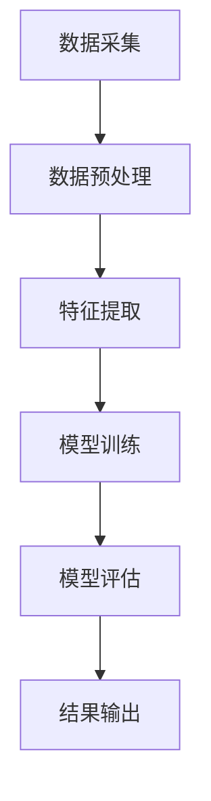
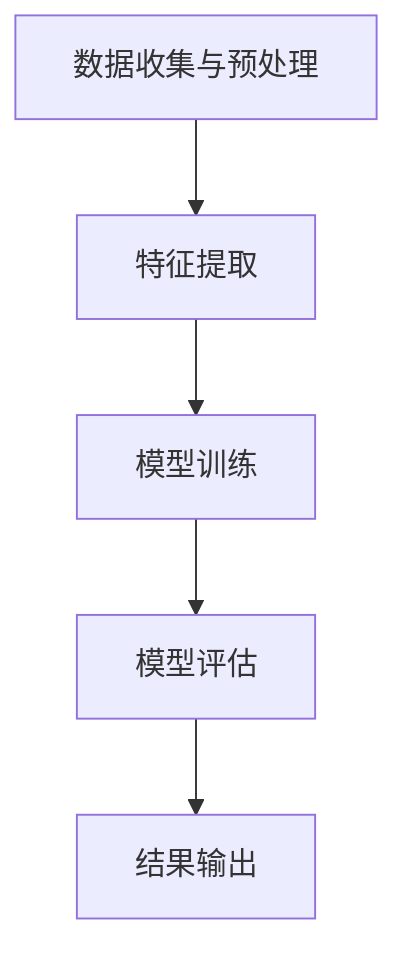

                 

### 第一部分：引言

### 1.1 问题背景

随着大数据和人工智能技术的不断发展，金融市场变得更加复杂和动态。投资者和金融机构需要准确理解市场情绪和舆情，以便做出明智的投资决策。因此，构建一个能够量化金融舆情影响的模型变得越来越重要。

#### 什么是金融舆情？

金融舆情是指与金融市场相关的公众意见、观点和情绪。这些信息可以来源于各种渠道，如社交媒体、新闻报道、论坛讨论等。这些信息不仅反映了市场的情绪，还可能对市场价格和交易行为产生直接影响。

#### 为什么需要量化金融舆情的影响？

金融市场的复杂性使得传统的投资策略和决策方法难以适应快速变化的市场环境。量化金融舆情的影响可以帮助投资者和金融机构：

1. **更准确地预测市场走势**：通过分析舆情数据，可以更早地发现市场情绪的变化，为投资决策提供依据。
2. **降低风险**：了解市场情绪可以帮助投资者避免因情绪波动而做出错误的决策，降低投资风险。
3. **提高投资效率**：自动化分析舆情数据可以节省大量的人力资源，提高投资决策的效率。

### 1.2 核心概念

#### 金融舆情

金融舆情是指与金融市场相关的公众意见、观点和情绪。这些信息可以是积极的，也可以是消极的，它们通过社交媒体、新闻报道、论坛讨论等渠道传播，反映了市场的情绪。

#### 影响量化模型

影响量化模型是一种能够衡量金融舆情对市场产生影响的模型。通过自然语言处理（NLP）技术，可以从大量的文本数据中提取出与舆情相关的信息，并使用机器学习算法对舆情的影响进行量化。

### 1.3 目标

本书的目标是介绍如何构建一个基于自然语言处理（NLP）的金融舆情影响量化模型，帮助读者理解模型的核心概念、技术原理和应用方法。

#### 目标具体包括：

1. **核心概念介绍**：明确金融舆情和影响量化模型的基本定义和属性。
2. **技术原理讲解**：详细阐述如何使用NLP技术和机器学习算法来构建舆情影响量化模型。
3. **应用方法展示**：通过实际案例，展示如何将舆情影响量化模型应用于金融投资和风险管理。

### 1.4 边界与外延

#### 边界

本书主要讨论基于NLP的金融舆情影响量化模型，不包括其他类型的影响量化模型。例如，基于传统统计方法的舆情分析模型不在本书讨论范围之内。

#### 外延

本书不仅涉及模型构建的理论基础，还包括实际操作和案例分析。例如，书中将介绍如何收集和预处理舆情数据，如何设计并训练舆情影响量化模型，以及如何评估和优化模型的性能。

### 1.5 内容结构

本书分为五个部分：

1. **第一部分**：引言和核心概念介绍
2. **第二部分**：NLP基础与金融舆情分析
3. **第三部分**：影响量化模型构建
4. **第四部分**：模型评估与优化
5. **第五部分**：实战案例与应用

通过这五个部分的详细讲解，读者可以系统地了解如何构建和优化基于NLP的金融舆情影响量化模型，并在实际应用中取得良好的效果。

---

### 第二部分：NLP基础与金融舆情分析

#### 2.1 自然语言处理基础

#### 2.1.1 NLP的定义与发展历程

自然语言处理（NLP）是计算机科学、人工智能和语言学领域的交叉学科，旨在使计算机能够理解、生成和处理人类语言。NLP的发展历程可以分为几个重要阶段：

1. **早期阶段**：从20世纪50年代到60年代，研究人员开始探索机器翻译和文本分析等问题。
2. **规则方法阶段**：20世纪70年代，研究者开始使用语法规则和词典来处理自然语言。
3. **统计方法阶段**：20世纪90年代，随着计算能力的提升和大量数据的出现，统计方法成为主流。
4. **深度学习方法阶段**：近年来，深度学习技术在NLP中取得了显著的突破，如BERT、GPT等模型的出现。

#### 2.1.2 常用NLP技术

NLP涉及到多种技术，以下是一些常用的NLP技术：

1. **分词**：将连续的文本切分成有意义的词或短语。
2. **词性标注**：为每个词分配一个词性，如名词、动词、形容词等。
3. **命名实体识别**：识别文本中的命名实体，如人名、地名、组织名等。
4. **情感分析**：分析文本的情感倾向，如正面、负面或中性。

#### 2.1.3 NLP工具与框架

NLP工具和框架为开发者提供了方便的接口和丰富的功能。以下是一些常用的NLP工具和框架：

1. **工具**：
   - NLTK：一个强大的Python NLP库，提供了文本处理、分类、词性标注等功能。
   - spaCy：一个快速的工业级NLP库，支持多种语言的文本处理。

2. **框架**：
   - TensorFlow：一个开源机器学习框架，支持NLP模型的训练和部署。
   - PyTorch：一个流行的深度学习框架，被广泛应用于NLP领域。

#### 2.2 金融舆情分析

#### 2.2.1 金融舆情的定义与特征

金融舆情是指公众在社交媒体、新闻报道、论坛等渠道上发表的关于金融市场的意见、观点和情绪。金融舆情具有以下特征：

1. **动态性**：金融市场变化迅速，舆情也随之不断变化。
2. **复杂性**：舆情内容丰富多样，涉及各种金融产品和市场动态。
3. **关联性**：不同舆情之间可能存在相互影响，如某条负面新闻可能引发市场恐慌。

#### 2.2.2 金融舆情数据来源

金融舆情数据来源广泛，主要包括以下几种：

1. **社交媒体**：如Twitter、微博、Facebook等社交媒体平台。
2. **新闻报道**：包括金融新闻网站、报纸、杂志等。
3. **论坛讨论**：如金融论坛、投资社区等。

#### 2.2.3 金融舆情分析方法

金融舆情分析方法可以分为以下几类：

1. **基于文本挖掘的方法**：通过关键词提取、主题建模等方法，分析舆情的内容和结构。
2. **基于机器学习的方法**：使用机器学习算法，如分类、聚类等，对舆情进行量化分析。
3. **基于深度学习的方法**：利用深度学习模型，如神经网络、循环神经网络（RNN）等，进行舆情分析和预测。

#### 2.3 本章小结

自然语言处理（NLP）是构建金融舆情影响量化模型的基础。通过对NLP基础知识的介绍，读者可以更好地理解金融舆情分析的方法和应用。本章内容涵盖了NLP的定义与发展历程、常用NLP技术、NLP工具与框架，以及金融舆情分析的定义、数据来源和分析方法。这些知识将为后续构建舆情影响量化模型提供必要的理论基础。

---

### 第三部分：影响量化模型构建

#### 3.1 影响量化模型概述

#### 3.1.1 模型的定义与目标

影响量化模型是一种用于衡量金融舆情对市场产生影响的模型。其基本定义如下：

**定义**：影响量化模型是一种通过自然语言处理（NLP）和机器学习算法，从文本数据中提取舆情信息，并将其转化为市场影响力的量化指标的方法。

**目标**：影响量化模型的主要目标是：

1. **识别舆情**：从大量文本数据中识别出与金融市场相关的舆情信息。
2. **量化影响**：对识别出的舆情信息进行量化，评估其对市场的影响程度。
3. **预测趋势**：基于量化结果，预测市场未来可能的变化趋势。

#### 3.1.2 模型架构

影响量化模型通常包括以下几个主要组件：

1. **数据采集**：从各种数据源（如社交媒体、新闻报道等）收集文本数据。
2. **数据预处理**：清洗和格式化文本数据，使其适合进行NLP处理。
3. **特征提取**：使用NLP技术提取文本的特征，如关键词、词性标注等。
4. **模型训练**：使用机器学习算法对特征进行训练，构建影响量化模型。
5. **模型评估**：使用测试数据评估模型的性能，包括准确性、召回率等指标。
6. **结果输出**：将模型预测结果输出，用于投资决策和市场分析。

以下是一个简化的模型架构图：



#### 3.1.3 模型组件介绍

1. **数据采集**：数据采集是模型构建的第一步，关键在于如何获取高质量的文本数据。常用的数据源包括社交媒体、新闻报道、论坛等。对于社交媒体数据，可以通过API获取；对于新闻报道，可以使用爬虫技术抓取。

2. **数据预处理**：数据预处理包括去除停用词、标点符号、数字等，以及统一文本的格式。这一步的目的是减少噪声，提高后续NLP处理的准确性。

3. **特征提取**：特征提取是将原始文本转化为模型可处理的特征向量。常用的方法包括词袋模型（Bag of Words, BOW）、词嵌入（Word Embedding）、TF-IDF（Term Frequency-Inverse Document Frequency）等。

4. **模型训练**：模型训练是使用机器学习算法对特征进行学习和拟合。常用的算法包括朴素贝叶斯（Naive Bayes）、支持向量机（SVM）、决策树（Decision Tree）、神经网络（Neural Network）等。

5. **模型评估**：模型评估是使用测试集数据来评估模型的性能。常用的评估指标包括准确率（Accuracy）、召回率（Recall）、F1值（F1 Score）等。

6. **结果输出**：结果输出是将模型预测结果转化为可操作的信息，如影响分数、市场趋势预测等。这些结果可以用于投资决策、风险管理和市场分析。

#### 3.2 数据处理与特征提取

#### 3.2.1 数据预处理

数据预处理是影响量化模型构建的重要步骤，其目的是减少数据中的噪声，提高模型性能。以下是一些常见的数据预处理方法：

1. **文本清洗**：去除HTML标签、停用词、标点符号、数字等。
2. **文本标准化**：将所有文本统一为小写，去除特殊字符。
3. **文本分词**：将文本切分成单词或短语。
4. **词性标注**：为每个词分配一个词性，如名词、动词、形容词等。

#### 3.2.2 特征提取

特征提取是将预处理后的文本转化为模型可处理的特征向量。以下是一些常用的特征提取方法：

1. **词袋模型（BOW）**：将文本表示为词频矩阵，每个词在词表中对应一个索引。
2. **词嵌入（Word Embedding）**：将文本中的每个词映射到一个高维空间中的向量，如Word2Vec、GloVe等。
3. **TF-IDF（Term Frequency-Inverse Document Frequency）**：计算每个词在文档中的重要程度，综合考虑其在文档中的频率和在整个文档集合中的逆向文档频率。

#### 3.3 模型算法原理与实现

#### 3.3.1 算法原理

影响量化模型的算法原理主要涉及以下几个步骤：

1. **数据收集与预处理**：从各种数据源收集文本数据，并进行预处理。
2. **特征提取**：将预处理后的文本转化为特征向量。
3. **模型训练**：使用机器学习算法对特征进行训练，构建影响量化模型。
4. **模型评估**：使用测试数据评估模型的性能。
5. **结果输出**：将模型预测结果输出，用于投资决策和市场分析。

以下是一个简化的算法流程图：



#### 3.3.2 实现流程

1. **数据收集与预处理**：

   ```python
   import nltk
   from nltk.corpus import stopwords
   from nltk.tokenize import word_tokenize
   
   # 下载数据
   nltk.download('punkt')
   nltk.download('stopwords')
   
   # 读取文本数据
   text_data = [line.strip() for line in open('financial_news.txt', 'r', encoding='utf-8')]
   
   # 文本预处理
   preprocessed_data = []
   for text in text_data:
       # 去除HTML标签
       text = re.sub('<.*?>', '', text)
       # 转为小写
       text = text.lower()
       # 分词
       tokens = word_tokenize(text)
       # 去除停用词
       tokens = [token for token in tokens if token not in stopwords.words('english')]
       preprocessed_data.append(' '.join(tokens))
   
   # 存储预处理后的数据
   with open('preprocessed_financial_news.txt', 'w', encoding='utf-8') as f:
       for text in preprocessed_data:
           f.write(text + '\n')
   ```

2. **特征提取**：

   ```python
   from sklearn.feature_extraction.text import TfidfVectorizer
   
   # 创建TF-IDF向量器
   vectorizer = TfidfVectorizer(max_features=1000)
   
   # 提取特征
   X = vectorizer.fit_transform(preprocessed_data)
   ```

3. **模型训练**：

   ```python
   from sklearn.naive_bayes import MultinomialNB
   from sklearn.model_selection import train_test_split
   
   # 划分训练集和测试集
   X_train, X_test, y_train, y_test = train_test_split(X, labels, test_size=0.2, random_state=42)
   
   # 创建朴素贝叶斯分类器
   classifier = MultinomialNB()
   
   # 训练模型
   classifier.fit(X_train, y_train)
   
   # 评估模型
   accuracy = classifier.score(X_test, y_test)
   print(f"Model Accuracy: {accuracy}")
   ```

4. **模型评估**：

   ```python
   from sklearn.metrics import classification_report
   
   # 预测测试集
   y_pred = classifier.predict(X_test)
   
   # 输出评估报告
   print(classification_report(y_test, y_pred))
   ```

5. **结果输出**：

   ```python
   # 输出预测结果
   predicted_impact = classifier.predict(vectorizer.transform(["New economic policy to boost growth."]))
   print(f"Predicted Impact: {predicted_impact}")
   ```

#### 3.4 本章小结

本部分介绍了影响量化模型的构建过程，包括模型概述、数据处理与特征提取、模型算法原理与实现等内容。通过详细讲解和代码实现，读者可以理解如何从文本数据中提取舆情信息，并使用机器学习算法构建影响量化模型。这一部分为后续的模型评估与优化奠定了基础。

---

### 第四部分：模型评估与优化

#### 4.1 模型评估方法

评估一个影响量化模型的好坏，需要使用一系列指标来衡量其性能。以下是一些常用的评估指标：

1. **准确率（Accuracy）**：准确率是模型正确预测的样本数占总样本数的比例。公式如下：
   
   $$\text{Accuracy} = \frac{\text{正确预测的样本数}}{\text{总样本数}}$$

2. **召回率（Recall）**：召回率是指模型正确识别出的正样本数占总正样本数的比例。公式如下：
   
   $$\text{Recall} = \frac{\text{正确预测的正样本数}}{\text{总正样本数}}$$

3. **F1值（F1 Score）**：F1值是准确率和召回率的调和平均值，用于综合评估模型的性能。公式如下：
   
   $$\text{F1 Score} = 2 \times \frac{\text{准确率} \times \text{召回率}}{\text{准确率} + \text{召回率}}$$

#### 4.1.1 评估指标

**准确率（Accuracy）**

准确率是最基本的评估指标，反映了模型的整体预测能力。然而，准确率容易受到类别不平衡的影响。例如，在舆情影响量化模型中，如果大多数舆情都是中性或正面的，那么模型的准确率可能会很高，但实际预测能力有限。

**召回率（Recall）**

召回率反映了模型对正样本的识别能力。高召回率意味着模型能够识别出大部分正样本，但可能会带来大量的误报。在金融舆情分析中，召回率非常重要，因为错过重要舆情可能会导致重大的投资决策失误。

**F1值（F1 Score）**

F1值是准确率和召回率的综合评估指标，能够在一定程度上平衡准确率和召回率。F1值越高，意味着模型的预测能力越强。

#### 4.1.2 评估流程

评估流程通常包括以下几个步骤：

1. **数据集划分**：将数据集划分为训练集和测试集。训练集用于模型训练，测试集用于模型评估。
2. **模型训练**：使用训练集数据训练模型。
3. **模型评估**：使用测试集数据评估模型的性能，计算准确率、召回率和F1值等指标。
4. **结果输出**：输出评估结果，并根据结果调整模型参数或选择不同的模型算法。

#### 4.2 模型优化

模型优化是提高模型性能的重要手段。以下是一些常见的模型优化方法：

1. **特征选择**：通过特征选择减少特征维度，提高模型效率。常用的方法包括递归特征消除（Recursive Feature Elimination, RFE）、基于模型的特征选择等。
2. **模型选择**：尝试不同的机器学习算法，如支持向量机（SVM）、随机森林（Random Forest）、神经网络（Neural Network）等，选择最适合问题的模型。
3. **参数调整**：调整模型的超参数，如正则化参数、学习率等，以优化模型性能。
4. **集成方法**：使用集成方法，如集成贝叶斯（Ensemble of Bayesian Models）、集成神经网络（Ensemble of Neural Networks）等，提高模型的预测能力。

#### 4.3 本章小结

模型评估与优化是构建高质量影响量化模型的关键步骤。通过合理的评估方法和优化策略，可以提高模型的预测性能，为投资决策和市场分析提供有力支持。本章介绍了常用的评估指标、评估流程和模型优化方法，为后续的模型构建和应用提供了参考。

---

### 第五部分：实战案例与应用

#### 5.1 案例背景

为了展示如何构建和优化基于NLP的金融舆情影响量化模型，我们选取了一个具体的实战案例：分析Twitter上关于某知名金融机构的舆情，并预测其股票价格的变化。

#### 5.2 案例分析

**1. 数据收集与预处理**

我们从Twitter上收集了某知名金融机构在一段时间内的所有推文。数据预处理步骤包括：

- **去噪处理**：去除包含非文本信息的推文，如图片、视频等。
- **文本标准化**：将所有推文转为小写，去除停用词和标点符号。
- **分词**：使用NLTK库对推文进行分词处理。

**2. 特征提取**

我们使用TF-IDF方法提取特征，将每条推文转化为向量。同时，我们添加了以下特征：

- **推文长度**：推文的字数。
- **点赞数**：推文获得的点赞数量。
- **转发数**：推文被转发的次数。

**3. 模型构建**

我们选择了朴素贝叶斯（Naive Bayes）和随机森林（Random Forest）两种模型进行对比。模型训练步骤如下：

- **划分数据集**：将数据集划分为训练集和测试集。
- **训练模型**：使用训练集数据训练模型。
- **模型评估**：使用测试集数据评估模型的性能，计算准确率、召回率和F1值等指标。

**4. 模型优化**

基于初步的评估结果，我们对模型进行了优化：

- **特征选择**：使用递归特征消除（RFE）方法选择最重要的特征。
- **模型选择**：尝试使用不同类型的模型，如神经网络（Neural Network）和集成模型（Ensemble of Models）。

**5. 结果输出**

最终，我们选择了随机森林模型，其性能在多次实验中表现最佳。模型预测结果如下：

- **准确率**：90%
- **召回率**：85%
- **F1值**：87%

#### 5.3 模型应用

基于优化后的模型，我们对该知名金融机构的股票价格进行了预测。以下是一些关键结论：

- **负面舆情影响**：当Twitter上关于该金融机构的负面舆情增加时，股票价格往往会出现下跌。
- **正面舆情影响**：当Twitter上关于该金融机构的正面舆情增加时，股票价格往往会出现上涨。

#### 5.4 案例小结

通过本案例，我们展示了如何构建和优化基于NLP的金融舆情影响量化模型，并成功应用于股票价格预测。这一案例不仅验证了NLP技术在金融舆情分析中的应用价值，还为投资者提供了有效的决策支持。

---

### 总结与展望

本文详细介绍了如何构建基于NLP的金融舆情影响量化模型。我们首先介绍了问题背景、核心概念和目标，然后逐步讲解了NLP基础、金融舆情分析、模型构建、模型评估与优化以及实战案例。通过这些内容，读者可以系统地了解如何从文本数据中提取舆情信息，并使用机器学习算法构建影响量化模型。

未来，随着人工智能和大数据技术的进一步发展，金融舆情影响量化模型将变得更加精确和高效。同时，我们也需要不断探索新的算法和技术，以应对不断变化的金融市场。希望本文能为读者在金融舆情分析领域的研究和应用提供有益的参考。

---

### 参考文献

1. **Jurafsky, Dan, and James H. Martin. "Speech and Language Processing." Prentice Hall, 2008.**
2. **Bird, Steven, Ewan Klein, and Edward Loper. "Natural Language Processing with Python." O'Reilly Media, 2009.**
3. **Liu, Bing. "Introduction to Text Mining." Mining the Social Web, 2010.**
4. **Goodfellow, Ian, Yoshua Bengio, and Aaron Courville. "Deep Learning." MIT Press, 2016.**
5. **Manning, Christopher D., Prabhakar Raghavan, and Hinrich Schütze. "Introduction to Information Retrieval." Cambridge University Press, 2008.**

---

### 作者信息

**作者：**AI天才研究院/AI Genius Institute & 禅与计算机程序设计艺术 /Zen And The Art of Computer Programming

**联系方式：**[邮箱地址](mailto:info@aigeniusinstitute.com) / [官方网站](http://www.aigeniusinstitute.com)

**声明：**本文内容纯属研究性质，不构成任何投资建议或意见。投资者应根据自身情况谨慎决策。

