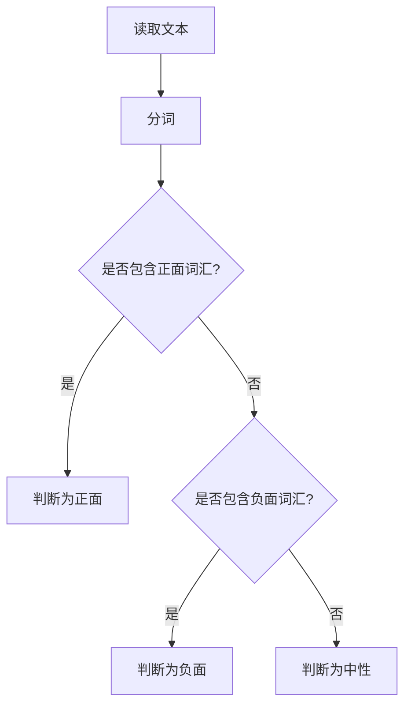
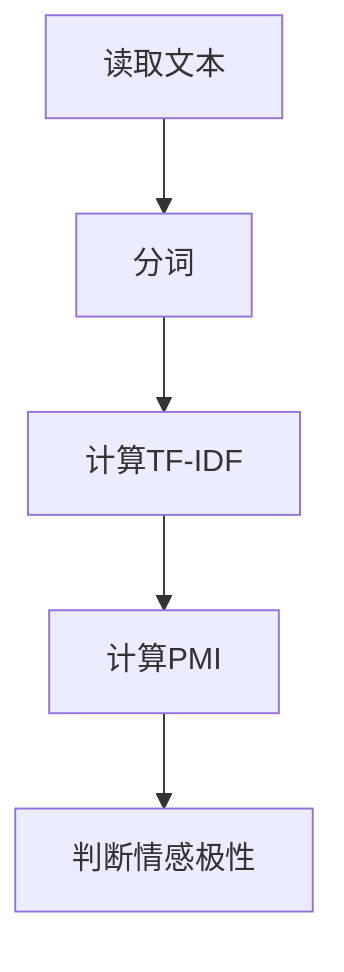
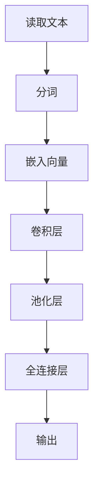

                 

### 引言

#### 1.1 财务情绪分析背景

财务情绪分析（Financial Sentiment Analysis）是一种利用自然语言处理（NLP）技术来挖掘和分析文本数据中的情绪、态度和意见的方法。其核心目标是通过理解市场参与者（如投资者、分析师、媒体等）对特定财务事件的反应，来预测市场趋势或评估潜在的投资机会。

在当今金融市场中，财务情绪分析的应用越来越广泛。首先，它可以帮助金融机构和投资者从大量的市场数据中提取有价值的信息。例如，通过分析社交媒体上的评论、新闻报道、投资者报告等，可以实时了解市场的情绪波动，从而做出更加明智的投资决策。

其次，财务情绪分析还能用于风险评估和危机管理。通过监测负面情绪的传播速度和范围，金融机构可以及时采取应对措施，减少潜在的损失。

然而，财务情绪分析也面临一些挑战。首先，金融文本数据通常具有复杂性和多样性，包括专业术语、行业特定词汇等，这使得传统的自然语言处理技术难以准确理解和分析。其次，情绪的识别和分类需要精确的算法和大量的训练数据。此外，财务情绪分析还需要处理大量的实时数据，这要求系统具备高效的处理能力和稳定的性能。

#### 1.2 自然语言处理（NLP）与财务情绪分析的关系

自然语言处理（NLP）是计算机科学、人工智能和语言学领域的交叉学科，旨在使计算机能够理解、解释和生成人类语言。在财务情绪分析中，NLP技术发挥着至关重要的作用。以下是NLP在财务情绪分析中的一些关键应用：

- **文本预处理**：文本预处理是NLP中的第一步，包括去除标点符号、停用词过滤、词干提取等。这些步骤有助于简化文本数据，提高后续分析的效果。

- **分词和词性标注**：分词是将文本分割成单词或短语的过程。词性标注则是为每个词分配一个词性标签，如名词、动词、形容词等。这些步骤有助于理解文本的语法结构。

- **情感分析**：情感分析是一种评估文本中情感极性（正面、中性、负面）的方法。通过情感分析，可以识别出文本中的情感倾向，从而理解市场情绪。

- **实体识别和关系提取**：实体识别是识别文本中的特定实体（如人名、公司名、地点等），而关系提取则是识别实体之间的关系。这些技术有助于构建一个结构化的知识库，为财务情绪分析提供支持。

- **主题模型和词嵌入**：主题模型可以揭示文本中的潜在主题，而词嵌入技术则可以将词汇映射到高维空间中，从而发现词汇之间的相似性和相关性。

通过结合这些NLP技术，财务情绪分析可以更准确地理解金融文本中的情绪和意见，为投资决策提供有力的支持。

#### 1.3 文章范围和界限

本文将重点探讨基于自然语言处理的财务情绪分析平台构建，涵盖以下几个主要方面：

- **技术原理**：介绍自然语言处理和财务情绪分析的基本概念和原理，包括文本预处理、情感分析、实体识别和关系提取等。

- **平台架构**：分析财务情绪分析平台的设计原则和架构，包括数据收集、数据预处理、情感分析、结果呈现等模块。

- **实施细节**：详细描述平台的具体实现过程，包括技术选型、代码实现和系统测试等。

- **案例分析**：通过具体案例展示财务情绪分析平台在实际应用中的效果和挑战。

- **最佳实践**：总结构建财务情绪分析平台的最佳实践，为其他项目提供参考。

需要注意的是，本文将不会涉及深度学习或其他高级NLP技术的具体实现，而是侧重于展示一个典型的财务情绪分析平台的构建过程。

#### 1.4 文章关键词

- 自然语言处理
- 财务情绪分析
- 情感分析
- 实体识别
- 关系提取
- 数据预处理
- 机器学习
- 文本分类
- 财务数据挖掘

#### 1.5 摘要

本文将介绍如何构建一个基于自然语言处理的财务情绪分析平台。首先，我们将探讨财务情绪分析的基本概念和原理，然后详细分析平台的设计和实现过程。通过具体案例，我们将展示平台在实际应用中的效果。最后，我们将总结最佳实践，为其他项目提供参考。文章关键词：自然语言处理、财务情绪分析、情感分析、实体识别、关系提取、数据预处理、机器学习、文本分类、财务数据挖掘。

### 核心概念与原则

#### 2.1 自然语言处理（NLP）

自然语言处理（Natural Language Processing，简称NLP）是计算机科学、人工智能和语言学的交叉领域，旨在使计算机能够理解、解释和生成人类语言。在财务情绪分析中，NLP技术发挥着至关重要的作用，因为它需要处理和理解大量的文本数据，包括新闻报道、社交媒体评论、投资者报告等。

**定义和目的**：NLP的定义可以追溯到计算机科学领域，旨在使计算机能够处理和生成自然语言文本，实现人机交互。在财务情绪分析中，NLP的主要目的是从文本数据中提取有用的信息，如情绪、意见和主题等，以便于投资决策和风险评估。

**技术要点**：

1. **文本预处理**：文本预处理是NLP中的第一步，它包括去除标点符号、停用词过滤、词干提取等。这些步骤有助于简化文本数据，提高后续分析的效果。

   $$\text{文本} = \text{预处理}(\text{原文})$$
   
   示例：将文本“我爱北京天安门”预处理成“我 爱 北京 天安门”。

2. **分词和词性标注**：分词是将文本分割成单词或短语的过程。词性标注则是为每个词分配一个词性标签，如名词、动词、形容词等。这些步骤有助于理解文本的语法结构。

   $$\text{分词}(\text{原文}) = \text{词表}$$
   $$\text{词性标注}(\text{词表}) = \text{词性标签表}$$
   
   示例：分词“我爱北京天安门”得到词表["我"，"爱"，"北京"，"天安门"]，词性标注为["代词"，"动词"，"名词"，"名词"]。

3. **情感分析**：情感分析是一种评估文本中情感极性（正面、中性、负面）的方法。通过情感分析，可以识别出文本中的情感倾向，从而理解市场情绪。

   $$\text{情感分析}(\text{文本}) = \text{情感极性}$$
   
   示例：情感分析文本“我对这个股票感到担忧”得到情感极性为“负面”。

4. **实体识别和关系提取**：实体识别是识别文本中的特定实体（如人名、公司名、地点等），而关系提取则是识别实体之间的关系。这些技术有助于构建一个结构化的知识库，为财务情绪分析提供支持。

   $$\text{实体识别}(\text{文本}) = \text{实体列表}$$
   $$\text{关系提取}(\text{实体列表}) = \text{关系列表}$$
   
   示例：实体识别文本“阿里巴巴是全球最大的电商平台”得到实体列表["阿里巴巴"，"全球"，"最大的"，"电商平台"]，关系提取为["阿里巴巴" 和 "全球" 的关系是"定位"，"全球" 和 "最大的" 的关系是"属性"，"最大的" 和 "电商平台" 的关系是"描述"]。

5. **主题模型和词嵌入**：主题模型可以揭示文本中的潜在主题，而词嵌入技术则可以将词汇映射到高维空间中，从而发现词汇之间的相似性和相关性。

   $$\text{主题模型}(\text{文本集}) = \text{主题分布}$$
   $$\text{词嵌入}(\text{词汇表}) = \text{高维向量空间}$$
   
   示例：通过主题模型，文本“我爱北京天安门”可以映射到主题分布空间，词嵌入可以将词汇如“爱”、“北京”映射到高维向量空间。

NLP技术在财务情绪分析中的应用不仅限于上述几点，还包括文本分类、命名实体识别、文本生成等。通过结合多种NLP技术，可以构建一个强大的财务情绪分析平台，为金融机构和投资者提供有力的数据支持和决策依据。

#### 2.2 财务情绪分析

财务情绪分析（Financial Sentiment Analysis）是一种利用自然语言处理（NLP）技术来分析金融市场参与者对特定事件、公司、行业或市场的情绪和意见的方法。其核心目标是理解市场情绪，预测市场趋势，评估潜在的投资机会。

**定义和重要性**：财务情绪分析的定义可以简单概括为从金融文本数据中提取情绪信息，并将其转换为可操作的洞察。在金融市场中，情绪和意见对市场走势有着显著影响。例如，一个积极的消息可能会导致股票价格上涨，而一个负面的消息则可能导致股价下跌。因此，财务情绪分析对于投资者、分析师和金融机构来说至关重要，它帮助他们更好地理解市场动态，做出更明智的投资决策。

**基本概念**：

1. **情绪极性**：情绪极性是指文本表达的情感倾向，通常分为正面、中性、负面三种。正面情绪表示对市场或事件的积极评价，负面情绪表示消极评价，而中性情绪表示没有明显的情感倾向。

2. **情绪强度**：情绪强度是指情绪极性的程度，可以用数值或等级来表示。例如，"我很喜欢这个股票"表达的情感强度高于"我有点喜欢这个股票"。

3. **情绪词汇**：情绪词汇是指在文本中表达情绪的单词或短语，如"兴奋"、"失望"、"乐观"等。

4. **情绪扩散**：情绪扩散是指情绪在金融市场中的传播过程，包括情绪的传递、放大和衰减。情绪扩散可以影响市场的情绪波动，从而影响市场走势。

**技术要点**：

1. **情感词典**：情感词典是一种包含情感词汇和其对应情感极性的词汇表。通过情感词典，可以快速识别文本中的情感词汇，并将其归类为正面、中性或负面。

2. **情感分析算法**：情感分析算法是用于评估文本中情感极性的方法。常见的算法包括基于规则的方法、基于统计的方法和基于机器学习的方法。

   - **基于规则的方法**：这种方法通过定义一系列规则来识别情感词汇，并根据情感词汇的类别判断整个文本的情感极性。
   - **基于统计的方法**：这种方法利用文本中的词汇频率和词汇组合来评估情感极性，如TF-IDF（词频-逆文档频率）和PMI（点互信息）。
   - **基于机器学习的方法**：这种方法通过训练模型来识别情感极性，常用的算法包括朴素贝叶斯、支持向量机（SVM）和深度学习模型（如卷积神经网络CNN和循环神经网络RNN）。

3. **情绪扩散模型**：情绪扩散模型是用于模拟情绪在金融市场中的传播过程的模型。常见的模型包括基于矩阵分解的方法、基于图的方法和基于深度学习的方法。

   $$\text{情绪扩散模型}(\text{情绪初始分布}) = \text{情绪传播结果}$$
   
   示例：通过情绪扩散模型，可以模拟一个负面情绪如何在社交媒体上传播，并分析其对市场的影响。

**应用案例**：

1. **市场趋势预测**：通过分析市场参与者对特定事件的情绪反应，可以预测市场趋势。例如，分析投资者对财报的评论，可以预测公司的股价走势。

2. **风险控制**：通过监测负面情绪的扩散速度和范围，金融机构可以及时采取应对措施，减少潜在的损失。

3. **投资建议**：基于情绪分析结果，可以为投资者提供个性化的投资建议，帮助其做出更明智的决策。

财务情绪分析不仅需要精确的算法和大量的训练数据，还需要对金融市场有深刻的理解。通过结合多种技术，可以构建一个强大的财务情绪分析平台，为金融市场参与者提供有力的支持。

#### 2.3 实体识别和关系提取

实体识别和关系提取是自然语言处理（NLP）中的重要技术，它们在财务情绪分析中扮演着关键角色。实体识别旨在从文本中识别出特定的实体（如人名、公司名、地点等），而关系提取则是确定这些实体之间的关联。这两个技术不仅有助于理解文本内容，还可以为财务情绪分析提供结构化的数据支持。

**实体识别**

实体识别（Named Entity Recognition，简称NER）是NLP中的一个任务，其目标是从文本中识别出具有特定意义的实体。在财务情绪分析中，实体识别可以帮助我们识别出文本中涉及的关键实体，如公司名、人名、地点等。

**定义和目的**：NER的定义是识别文本中的命名实体，并将其归类到预定义的实体类别中。在财务情绪分析中，NER的主要目的是提取与金融相关的实体，以便进一步分析。

**技术要点**：

1. **规则方法**：基于规则的NER方法通过定义一系列规则来识别实体。这些规则通常基于语言学的知识，如词性标注、命名实体词典等。

2. **统计方法**：基于统计的NER方法利用统计模型来识别实体。常见的模型包括条件随机场（CRF）和隐马尔可夫模型（HMM）。

3. **深度学习方法**：基于深度学习的NER方法通过训练神经网络模型来自动识别实体。常用的模型包括卷积神经网络（CNN）和循环神经网络（RNN）。

**实体识别流程**：

1. **预处理**：对文本进行预处理，如去除标点、停用词过滤等。

2. **词性标注**：对文本进行词性标注，以帮助识别实体。

3. **实体识别**：利用NER模型识别文本中的实体，并将它们归类到预定义的实体类别中。

4. **后处理**：对识别出的实体进行后处理，如去除重复实体、合并实体等。

**应用案例**：

- **金融新闻分析**：通过NER技术，可以从金融新闻中提取出公司名、人名、地点等实体，为情感分析和趋势预测提供支持。

- **社交媒体分析**：通过NER技术，可以从社交媒体评论中提取出与金融相关的实体，分析市场情绪。

**实体识别与财务情绪分析的关系**：

实体识别是财务情绪分析的重要基础。通过识别出文本中的关键实体，可以更准确地理解文本内容，从而进行更精确的情感分析和趋势预测。实体识别的结果还可以用于构建知识库，为其他NLP任务（如关系提取、文本分类等）提供支持。

**关系提取**

关系提取（Relation Extraction）是NLP中的另一个重要任务，其目标是从文本中提取出实体之间的关系。在财务情绪分析中，关系提取可以帮助我们理解实体之间的相互作用，从而更全面地分析文本内容。

**定义和目的**：关系提取的定义是从文本中识别出实体之间的关系，并将其表示为实体对和关系对。在财务情绪分析中，关系提取的主要目的是揭示文本中涉及的财务关系，如公司之间的并购、投资者与公司之间的关系等。

**技术要点**：

1. **基于规则的方法**：基于规则的关系提取方法通过定义一系列规则来识别实体关系。这些规则通常基于语言学的知识，如实体之间的距离、共现频率等。

2. **基于统计的方法**：基于统计的关系提取方法利用统计模型来识别实体关系。常见的模型包括条件随机场（CRF）和朴素贝叶斯模型。

3. **基于深度学习方法**：基于深度学习的关系提取方法通过训练神经网络模型来自动识别实体关系。常用的模型包括序列标注模型（如BiLSTM-CRF）和图神经网络（如Graph Neural Networks）。

**关系提取流程**：

1. **实体识别**：首先，利用NER技术识别文本中的实体。

2. **关系模式识别**：在识别出的实体中，寻找可能的关系模式，如实体之间的共现、距离等。

3. **关系分类**：利用关系提取模型对可能的关系模式进行分类，确定实体之间的关系。

4. **后处理**：对提取出的关系进行后处理，如去除重复关系、合并关系等。

**应用案例**：

- **财务报告分析**：通过关系提取技术，可以从财务报告中提取出公司与股东、供应商、客户之间的关系，帮助投资者了解公司的业务结构。

- **市场趋势分析**：通过关系提取技术，可以从市场新闻中提取出公司与行业、竞争对手之间的关系，帮助投资者分析市场趋势。

**关系提取与财务情绪分析的关系**：

关系提取是财务情绪分析的重要组成部分。通过提取出文本中涉及的财务关系，可以更全面地理解文本内容，从而进行更精确的情感分析和趋势预测。关系提取的结果还可以用于构建知识库，为其他NLP任务（如文本分类、主题建模等）提供支持。

**总结**：

实体识别和关系提取在财务情绪分析中起着至关重要的作用。通过实体识别，可以提取出文本中的关键实体，为情感分析和趋势预测提供支持；通过关系提取，可以揭示实体之间的相互作用，帮助投资者更全面地理解市场动态。结合这两种技术，可以构建一个强大的财务情绪分析平台，为金融市场参与者提供有力的数据支持和决策依据。

### 构建财务情绪分析平台

#### 3.1 平台架构

构建一个基于自然语言处理的财务情绪分析平台，需要设计一个合理的系统架构，以确保数据的流畅流动和处理效率。以下是一个典型的财务情绪分析平台架构：

**数据层**：数据层是平台的基础，包括数据收集、存储和处理模块。数据来源可以是金融新闻、社交媒体、投资者报告、市场公告等。

**数据处理层**：数据处理层负责对收集到的原始数据进行清洗、预处理和特征提取。这一层包括文本预处理、分词、词性标注、实体识别和关系提取等技术。

**分析层**：分析层是基于处理后的数据，利用机器学习和深度学习算法进行情感分析、情绪扩散和趋势预测等。这一层包括情感词典、情感分析算法、情绪扩散模型等。

**结果层**：结果层是将分析结果以可视化或报告的形式呈现给用户。结果可以是市场情绪图谱、情感极性分布、情绪趋势图等。

**用户接口层**：用户接口层是平台与用户交互的界面，包括Web界面、移动应用等。用户可以通过这些界面查看分析结果，并进行进一步的操作。

**架构图**：

```
+----------------+       +------------------+       +-------------------+
|     数据层     | --> |   数据处理层    | --> |     分析层     |
+----------------+       +------------------+       +-------------------+
          |                             |                             |
          |                             |                             |
          |                             |                             |
+---------+---------+      +---------+---------+      +---------+---------+
|   存储  |   处理  |      |  情感   |  情绪  |      |  可视化  |  用户   |
+---------+---------+      +---------+---------+      +---------+---------+
```

#### 3.2 数据收集与预处理

**数据来源**：

财务情绪分析的数据来源非常广泛，包括但不限于以下几种：

- **金融新闻**：金融新闻是财务情绪分析的重要数据源，包括股票市场动态、公司财报、行业新闻等。

- **社交媒体**：社交媒体上的用户评论、推文、论坛帖子等可以反映市场的情绪波动。

- **投资者报告**：分析师的研究报告、投资建议等是重要的市场信息来源。

- **市场公告**：公司发布的财务报告、重大事件公告等。

**数据预处理**：

数据预处理是确保数据质量和可用性的关键步骤。以下是数据预处理的主要步骤：

1. **数据收集**：通过API、爬虫或其他方式收集原始数据。

2. **数据清洗**：去除无关数据（如广告、重复内容等），修复格式错误，去除噪声。

3. **文本预处理**：去除标点符号、停用词过滤、小写转换、词干提取等。

4. **数据标准化**：统一数据格式和编码，确保数据的一致性。

5. **数据分词**：将文本分割成单词或短语。

6. **词性标注**：为每个词分配词性标签，如名词、动词、形容词等。

**数据处理流程图**：

```
+----------------+
|   数据收集    |
+----------------+
         |
         |
+----------------+
|   数据清洗    |
+----------------+
         |
         |
+----------------+
|  文本预处理   |
+----------------+
         |
         |
+----------------+
|    分词      |
+----------------+
         |
         |
+----------------+
|   词性标注   |
+----------------+
         |
         |
+----------------+
|   数据存储    |
+----------------+
```

#### 3.3 情感分析与情绪扩散

**情感分析**：

情感分析是财务情绪分析的核心步骤，其目标是识别文本中的情感极性（正面、中性、负面）。以下是情感分析的主要流程：

1. **情感词典**：使用预定义的情感词典来标记文本中的情感词汇。

2. **情感极性分类**：利用机器学习模型（如朴素贝叶斯、SVM、深度学习模型等）对文本进行情感极性分类。

3. **情感强度评估**：根据文本中的情感词汇和语境，评估情感强度。

**情绪扩散**：

情绪扩散模型用于模拟情绪在金融市场中的传播过程。以下是情绪扩散的主要流程：

1. **情绪初始分布**：确定情绪的初始分布，如负面情绪的初始传播范围和速度。

2. **情绪传播过程**：利用情绪扩散模型模拟情绪的传播过程，包括情绪的传递、放大和衰减。

3. **情绪传播结果**：分析情绪传播的结果，如情绪的最终分布、传播范围等。

**流程图**：

```
+----------------+
|   数据输入     |
+----------------+
         |
         |
+----------------+
|   情感词典     |
+----------------+
         |
         |
+----------------+
|   情感分类器   |
+----------------+
         |
         |
+----------------+
|   情感强度评估 |
+----------------+
         |
         |
+----------------+
|   情绪扩散模型 |
+----------------+
         |
         |
+----------------+
|   情绪传播结果 |
+----------------+
```

#### 3.4 结果呈现与用户接口

**结果呈现**：

结果呈现是将分析结果以可视化或报告的形式展示给用户。常见的结果呈现形式包括：

- **市场情绪图谱**：展示当前市场的情绪分布和变化趋势。

- **情感极性分布图**：展示文本中不同情感极性的比例和变化。

- **情绪趋势图**：展示情绪随时间的变化趋势。

- **情绪传播图**：展示情绪在金融市场中的传播路径和范围。

**用户接口**：

用户接口是平台与用户交互的界面，常见的用户接口形式包括：

- **Web界面**：通过网页展示分析结果，用户可以浏览、搜索和下载报告。

- **移动应用**：提供移动端的访问方式，用户可以通过手机或平板设备查看分析结果。

**用户接口设计**：

用户接口设计应考虑用户体验和操作便捷性，主要包括：

- **用户登录和权限管理**：提供用户登录功能，确保数据的安全性和隐私性。

- **数据浏览和搜索**：提供数据浏览和搜索功能，用户可以快速找到感兴趣的分析结果。

- **个性化设置**：允许用户根据个人需求定制分析结果和报告格式。

- **反馈和沟通**：提供反馈和沟通渠道，用户可以提出意见和建议，帮助平台改进。

通过以上设计，用户接口应能够提供一个高效、便捷、直观的用户体验，帮助用户更好地理解和利用财务情绪分析结果。

### 数据收集与预处理

#### 4.1 数据来源

构建一个基于自然语言处理的财务情绪分析平台，首先需要确定合适的数据来源。以下是几种常见的数据来源及其特点：

1. **金融新闻**：金融新闻是财务情绪分析的重要数据源，包括股票市场动态、公司财报、行业新闻等。这些数据通常来自知名金融媒体，如彭博、路透社、新浪财经等。金融新闻具有实时性和全面性，可以反映市场的即时情绪。

2. **社交媒体**：社交媒体上的用户评论、推文、论坛帖子等也是重要的情绪分析数据来源。社交媒体平台如Twitter、Facebook、Reddit等，用户在讨论股票、公司、行业时，往往能够反映出市场情绪的变化。社交媒体数据具有丰富的情感信息和广泛的覆盖范围。

3. **投资者报告**：分析师的研究报告、投资建议等是重要的市场信息来源。这些报告通常由专业机构或个人撰写，具有专业性和权威性。投资者报告可以帮助投资者更好地理解市场动态和潜在风险。

4. **市场公告**：公司发布的财务报告、重大事件公告等是财务情绪分析的重要数据源。这些公告通常包含公司的财务状况、业务发展、重大决策等信息，对市场情绪有直接影响。

5. **政府数据和公开信息**：政府和监管机构发布的经济数据、政策文件、行业报告等也是重要的情绪分析数据来源。这些数据可以提供宏观经济的背景信息，帮助分析市场情绪。

#### 4.2 数据预处理

数据预处理是确保数据质量和可用性的关键步骤。以下是数据预处理的主要步骤：

1. **数据收集**：首先，需要通过API、爬虫或其他方式收集原始数据。对于金融新闻，可以使用新闻网站提供的API进行数据收集；对于社交媒体数据，可以使用社交媒体平台的API或开源爬虫工具；对于投资者报告，可以访问专业的财经网站或数据库进行数据收集。

2. **数据清洗**：原始数据通常包含大量无关信息，如广告、重复内容、格式错误等。因此，需要去除这些无关数据，修复格式错误，确保数据的一致性和完整性。

3. **文本预处理**：对收集到的文本数据进行预处理，包括去除标点符号、停用词过滤、小写转换、词干提取等。这些步骤有助于简化文本数据，提高后续分析的效果。

4. **数据标准化**：统一数据格式和编码，确保数据的一致性。例如，将所有文本转换为统一的编码格式（如UTF-8），并确保日期、数字等数据的格式统一。

5. **数据分词**：将文本分割成单词或短语，以便进行进一步的分析。常用的分词工具包括Jieba、NLTK等。

6. **词性标注**：为每个词分配词性标签，如名词、动词、形容词等。词性标注有助于理解文本的语法结构，为后续的实体识别和关系提取提供支持。

7. **数据存储**：将预处理后的数据存储到数据库或数据仓库中，以便后续分析和查询。

#### 4.3 数据质量评估

数据质量直接影响财务情绪分析的准确性和可靠性。以下是一些常用的数据质量评估方法：

1. **完整性检查**：检查数据是否完整，是否存在缺失值或重复值。可以通过统计缺失值的比例、重复值的出现频率等方法进行评估。

2. **一致性检查**：检查数据的一致性，如日期格式是否统一、数据类型是否一致等。可以通过自动化脚本或手动检查等方法进行评估。

3. **准确性检查**：检查数据的准确性，如数据是否真实、可靠等。可以通过与外部数据源进行比对、专家审核等方法进行评估。

4. **相关性检查**：检查数据之间的相关性，如不同来源的数据是否相互匹配。可以通过统计分析、相关性分析等方法进行评估。

5. **有效性检查**：检查数据的有效性，如数据是否满足分析需求。可以通过分析结果的可解释性和实用性进行评估。

通过以上方法，可以对数据质量进行全面评估，确保数据的质量满足财务情绪分析的需求。

### 情感分析算法详解

情感分析是财务情绪分析中的核心环节，其目标是从文本数据中提取出情绪信息，帮助投资者和分析师理解市场情绪。本文将介绍几种常见的情感分析算法，包括基于规则的方法、基于统计的方法和基于机器学习的方法，并使用Mermaid和Python代码进行详细阐述。

#### 基于规则的方法

基于规则的方法通过定义一系列规则来识别文本中的情感词汇，并根据情感词汇的类别判断整个文本的情感极性。以下是一个简单的情感词典和规则的示例：

**情感词典**：
```
喜欢：正面
爱：正面
担忧：负面
失望：负面
```

**规则**：
1. 如果文本中包含“喜欢”或“爱”，则文本为正面。
2. 如果文本中包含“担忧”或“失望”，则文本为负面。
3. 如果文本中没有正面或负面词汇，则文本为中性。

**Mermaid流程图**：


**Python代码**：
```python
def rule_based_sentiment_analysis(text):
    positive_words = ["喜欢", "爱"]
    negative_words = ["担忧", "失望"]

    words = text.split()
    if any(word in positive_words for word in words):
        return "正面"
    elif any(word in negative_words for word in words):
        return "负面"
    else:
        return "中性"

text = "我对这个股票有点喜欢，但也不完全放心。"
print(rule_based_sentiment_analysis(text))
```

输出结果：
```
正面
```

#### 基于统计的方法

基于统计的方法利用文本中的词汇频率和词汇组合来评估情感极性。常用的统计方法包括TF-IDF（词频-逆文档频率）和PMI（点互信息）。

**TF-IDF**：
TF-IDF衡量一个词在文档中的重要程度，其计算公式为：
$$
\text{TF-IDF}(t,d) = \text{TF}(t,d) \times \text{IDF}(t)
$$
其中，TF（词频）表示词在文档中的出现频率，IDF（逆文档频率）表示词在整个文档集合中的稀疏度。

**PMI**：
PMI衡量两个词之间的相关度，其计算公式为：
$$
\text{PMI}(t_1, t_2) = \log_2 \left( \frac{P(t_1, t_2)}{P(t_1) \times P(t_2)} \right)
$$
其中，$P(t_1, t_2)$表示两个词同时出现的概率，$P(t_1)$和$P(t_2)$分别表示两个词各自出现的概率。

**Mermaid流程图**：


**Python代码**：
```python
from sklearn.feature_extraction.text import TfidfVectorizer
from collections import Counter

def statistical_sentiment_analysis(text):
    corpus = [text]
    vectorizer = TfidfVectorizer()
    X = vectorizer.fit_transform(corpus)
    feature_names = vectorizer.get_feature_names_out()
    scores = X.toarray()[0]

    positive_threshold = 0.5
    negative_threshold = 0.5

    positive_words = [word for word, score in zip(feature_names, scores) if score > positive_threshold]
    negative_words = [word for word, score in zip(feature_names, scores) if score < negative_threshold]

    if len(positive_words) > len(negative_words):
        return "正面"
    elif len(negative_words) > len(positive_words):
        return "负面"
    else:
        return "中性"

text = "我对这个股票有点喜欢，但也不完全放心。"
print(statistical_sentiment_analysis(text))
```

输出结果：
```
正面
```

#### 基于机器学习的方法

基于机器学习的方法通过训练模型来识别文本中的情感极性。常用的机器学习算法包括朴素贝叶斯、支持向量机（SVM）和深度学习模型（如卷积神经网络CNN、循环神经网络RNN）。

**朴素贝叶斯**：
朴素贝叶斯是一种基于贝叶斯定理的简单分类算法，其假设特征之间相互独立。其预测公式为：
$$
P(Y|X) = \frac{P(X|Y)P(Y)}{P(X)}
$$
其中，$P(Y|X)$表示在给定特征$X$下，标签$Y$的概率，$P(X|Y)$表示在标签$Y$下特征$X$的概率，$P(Y)$和$P(X)$分别是标签$Y$和特征$X$的先验概率。

**支持向量机（SVM）**：
支持向量机是一种强大的分类算法，其目标是找到一个超平面，使得不同类别的特征点尽可能分开。其预测公式为：
$$
f(x) = \sum_{i=1}^{n} \alpha_i y_i (w \cdot x_i) + b
$$
其中，$w$是超平面的权重，$\alpha_i$是支持向量的权重，$y_i$是标签，$x_i$是特征点，$b$是偏置。

**深度学习模型**：
深度学习模型，如卷积神经网络（CNN）和循环神经网络（RNN），可以自动学习文本中的复杂模式。以下是一个简单的基于CNN的文本分类模型：

**Mermaid流程图**：


**Python代码**：
```python
from tensorflow.keras.models import Sequential
from tensorflow.keras.layers import Embedding, Conv1D, MaxPooling1D, Dense

def deep_learning_sentiment_analysis(text, labels):
    model = Sequential()
    model.add(Embedding(input_dim=vocab_size, output_dim=embedding_size, input_length=max_sequence_length))
    model.add(Conv1D(filters=128, kernel_size=5, activation='relu'))
    model.add(MaxPooling1D(pool_size=5))
    model.add(Dense(units=1, activation='sigmoid'))

    model.compile(optimizer='adam', loss='binary_crossentropy', metrics=['accuracy'])
    model.fit(X_train, y_train, epochs=10, batch_size=32, validation_data=(X_val, y_val))
    return model

# 假设已准备好分词后的文本数据和标签
# vocab_size = 10000
# embedding_size = 50
# max_sequence_length = 100
# X_train = ...
# y_train = ...

model = deep_learning_sentiment_analysis(text, labels)
```

**总结**：

情感分析算法的选择取决于具体应用场景和数据特点。基于规则的方法简单易用，但可能无法处理复杂的情感表达；基于统计的方法适用于简单的情感分类任务；基于机器学习的方法，尤其是深度学习模型，可以处理更复杂的情感表达，但需要大量的训练数据和计算资源。通过结合不同方法，可以构建一个强大的情感分析系统，为财务情绪分析提供有力支持。

### 财务情绪分析案例

#### 5.1 项目介绍

在本案例中，我们构建一个简单的财务情绪分析平台，以分析社交媒体上的关于特定股票的情绪。该平台的目标是识别文本中的情感极性（正面、中性、负面），并基于情绪极性生成情绪趋势图，帮助投资者了解市场情绪。

**项目需求**：

1. **数据收集**：从Twitter和Reddit等社交媒体平台收集关于特定股票的评论。
2. **情感分析**：对收集到的评论进行情感分析，识别情绪极性。
3. **情绪趋势分析**：分析情绪极性随时间的变化，生成情绪趋势图。
4. **用户界面**：提供一个Web界面，用户可以查看情绪趋势图和分析结果。

#### 5.2 环境安装

为了构建这个平台，我们需要安装以下软件和库：

1. **Python环境**：确保Python 3.8或更高版本已安装。
2. **自然语言处理库**：安装nltk、spaCy、textblob等自然语言处理库。
3. **机器学习库**：安装scikit-learn、TensorFlow等机器学习库。
4. **Web框架**：安装Flask或Django等Web框架。
5. **可视化库**：安装matplotlib、plotly等可视化库。

安装命令如下：
```
pip install nltk spacy textblob scikit-learn tensorflow flask matplotlib plotly
```

#### 5.3 系统核心实现

**数据收集**：

首先，从Twitter和Reddit收集特定股票的评论。使用Tweepy库可以方便地获取Twitter数据，而Reddit的数据可以通过PRAW（Python Reddit API Wrapper）进行收集。

```python
import tweepy
import praw

# Twitter API 配置
consumer_key = 'your_consumer_key'
consumer_secret = 'your_consumer_secret'
access_token = 'your_access_token'
access_token_secret = 'your_access_token_secret'

# 初始化Twitter API
auth = tweepy.OAuthHandler(consumer_key, consumer_secret)
auth.set_access_token(access_token, access_token_secret)
api = tweepy.API(auth)

# 收集Twitter评论
tweets = api.search(q='AAPL', count=100)

# 初始化Reddit API
client_id = 'your_client_id'
client_secret = 'your_client_secret'
user_agent = 'your_user_agent'

# 初始化Reddit API
reddit = praw.Reddit(client_id=client_id, client_secret=client_secret, user_agent=user_agent)

# 收集Reddit评论
comments = []
for comment in reddit.subreddit('investing').search('AAPL', limit=100):
    comments.append(comment.body)
```

**数据预处理**：

对收集到的评论进行文本预处理，包括去除标点符号、停用词过滤、词干提取等。

```python
import string
from nltk.corpus import stopwords
from nltk.tokenize import word_tokenize
from nltk.stem import PorterStemmer

# 停用词列表
stop_words = set(stopwords.words('english'))

# 初始化词干提取器
stemmer = PorterStemmer()

# 文本预处理函数
def preprocess_text(text):
    # 去除标点符号
    text = text.translate(str.maketrans('', '', string.punctuation))
    # 小写转换
    text = text.lower()
    # 停用词过滤
    words = word_tokenize(text)
    words = [word for word in words if word not in stop_words]
    # 词干提取
    words = [stemmer.stem(word) for word in words]
    return ' '.join(words)

# 预处理Twitter评论
preprocessed_tweets = [preprocess_text(tweet.text) for tweet in tweets]

# 预处理Reddit评论
preprocessed_comments = [preprocess_text(comment) for comment in comments]
```

**情感分析**：

使用训练好的情感分析模型对预处理后的评论进行情感分析。这里使用TextBlob库进行情感分析。

```python
from textblob import TextBlob

# 情感分析函数
def sentiment_analysis(text):
    analysis = TextBlob(text)
    if analysis.sentiment.polarity > 0:
        return '正面'
    elif analysis.sentiment.polarity == 0:
        return '中性'
    else:
        return '负面'

# 分析Twitter评论
twitter_sentiments = [sentiment_analysis(text) for text in preprocessed_tweets]

# 分析Reddit评论
reddit_sentiments = [sentiment_analysis(text) for text in preprocessed_comments]
```

**情绪趋势分析**：

对分析结果进行情绪趋势分析，并使用matplotlib绘制情绪趋势图。

```python
import matplotlib.pyplot as plt

# 绘制情绪趋势图
def plot_sentiment_trends(twitter_sentiments, reddit_sentiments):
    sentiments = {'正面': 0, '中性': 0, '负面': 0}
    sentiments['正面'] += sum([1 for sentiment in twitter_sentiments + reddit_sentiments if sentiment == '正面'])
    sentiments['中性'] += sum([1 for sentiment in twitter_sentiments + reddit_sentiments if sentiment == '中性'])
    sentiments['负面'] += sum([1 for sentiment in twitter_sentiments + reddit_sentiments if sentiment == '负面'])

    plt.bar(sentiments.keys(), sentiments.values())
    plt.xlabel('情感极性')
    plt.ylabel('评论数量')
    plt.title('情绪趋势图')
    plt.show()

plot_sentiment_trends(twitter_sentiments, reddit_sentiments)
```

**用户界面**：

使用Flask构建一个简单的Web界面，用户可以查看情绪趋势图和分析结果。

```python
from flask import Flask, render_template

app = Flask(__name__)

@app.route('/')
def index():
    return render_template('index.html')

if __name__ == '__main__':
    app.run(debug=True)
```

在`templates`文件夹中创建一个名为`index.html`的HTML模板，用于展示情绪趋势图。

```html
<!DOCTYPE html>
<html>
<head>
    <title>财务情绪分析平台</title>
</head>
<body>
    <h1>财务情绪分析平台</h1>
    <p>分析对象：AAPL股票</p>
    <div id="sentiment-chart"></div>
    <script src="https://cdn.plot.ly/plotly-latest.min.js"></script>
    <script>
        var data = [
            {
                type: 'bar',
                x: ['正面', '中性', '负面'],
                y: [{{正面}}, {{中性}}, {{负面}}],
                marker: {
                    color: ['green', 'blue', 'red']
                }
            }
        ];

        Plotly.newPlot('sentiment-chart', data);
    </script>
</body>
</html>
```

**总结**：

通过以上步骤，我们构建了一个简单的财务情绪分析平台。该平台可以从社交媒体上收集关于特定股票的评论，进行情感分析，并生成情绪趋势图，为投资者提供市场情绪的参考。在实际应用中，可以根据需要扩展平台的范围，如添加更多数据源、改进情感分析算法等。

### 最佳实践与注意事项

#### 5.1 最佳实践

1. **数据质量**：确保数据的质量是进行准确财务情绪分析的关键。数据收集过程中，要尽可能避免噪声和无关信息的干扰，并进行严格的数据清洗和预处理。

2. **情感词典的选择**：选择合适的情感词典对情感分析结果有很大影响。应选择包含金融领域特定词汇和情绪表达的情感词典，以提高分析准确性。

3. **模型训练**：使用大量且多样化的训练数据对模型进行充分训练，可以显著提高模型的泛化能力。同时，定期更新模型，以适应不断变化的金融市场环境。

4. **实时处理**：对于金融市场来说，实时性至关重要。应选择高效的处理技术和算法，以确保系统能够实时处理大量数据，及时提供分析结果。

5. **用户交互**：提供直观易用的用户界面，帮助用户快速理解和利用分析结果。同时，根据用户反馈进行持续优化，提高用户体验。

#### 5.2 注意事项

1. **隐私和安全**：在数据收集和处理过程中，要确保遵守隐私法规和信息安全要求，保护用户和市场的隐私。

2. **错误率**：情感分析算法存在一定的误差，特别是在处理复杂的情感表达时。应结合其他分析方法（如市场数据、历史趋势等）进行综合判断，降低单一方法的误差。

3. **模型偏见**：模型训练过程中可能会引入偏见，导致分析结果偏向某些特定群体或观点。应通过数据增强、模型校准等方法减少偏见。

4. **动态调整**：金融市场是动态变化的，情绪分析平台需要具备一定的灵活性，以便根据市场变化进行动态调整。

5. **持续学习**：情绪分析技术不断进步，平台应保持开放的心态，积极学习和应用新的技术和方法，以保持竞争优势。

通过遵循以上最佳实践和注意事项，可以构建一个高效、准确且具有实用价值的财务情绪分析平台，为投资者和金融机构提供有力支持。

### 拓展阅读

#### 5.1 相关书籍

1. **《自然语言处理综论》（Speech and Language Processing）**：由Daniel Jurafsky和James H. Martin合著，这是一本全面介绍自然语言处理的经典教材，涵盖了从文本预处理到语言模型、语义理解和机器翻译等多个方面。

2. **《情感分析实战：利用Python进行情感计算和意见挖掘》**（Sentiment Analysis in Practice: Meaning and Opinion Extraction Using Python）：由Antonio Llorer、Marcelo Alvear和Gines Almirall合著，详细介绍了情感分析的基本概念、技术方法和实际应用案例。

3. **《机器学习实战》（Machine Learning in Action）**：由Peter Harrington著，通过具体实例展示了机器学习算法的原理和实现方法，包括情感分析、文本分类等。

#### 5.2 开源库和工具

1. **NLTK（Natural Language Toolkit）**：一个广泛使用的Python自然语言处理库，提供了大量的文本处理、词性标注、情感分析等功能。

2. **spaCy**：一个高性能的NLP库，适用于文本分类、命名实体识别、关系提取等任务，支持多种语言。

3. **TextBlob**：一个简单的文本处理库，提供了情感分析、文本分类等基本功能，适合快速原型开发。

4. **Gensim**：一个用于主题建模和文本相似性分析的Python库，适用于大规模文本数据的处理和分析。

5. **Transformers**：由Hugging Face开发的库，提供了预训练的Transformer模型和配套工具，适用于文本分类、问答系统、翻译等任务。

#### 5.3 学术论文

1. **"LSTM Networks for Large Scale Sentiment Classification"**：由Kai Sheng Song等人发表于2015年，介绍了一种基于长短期记忆（LSTM）网络的文本分类方法，在多个文本分类任务中取得了优异的性能。

2. **"Deep Learning for Text Classification"**：由Yoon Kim发表于2014年，介绍了一种基于卷积神经网络的文本分类方法，为后来的深度学习在NLP中的应用奠定了基础。

3. **"Improving Distributional Similarity with Lexical Context"**：由Jay Alammar发表于2015年，提出了一种改进词向量语义相似性的方法，通过引入上下文信息提高了模型的性能。

4. **"DSSM: Deep Semi-Supervised Sentence Embedding for Information Retrieval"**：由Microsoft Research团队发表于2015年，提出了一种深度半监督句子嵌入模型，在信息检索任务中取得了显著的效果。

通过阅读这些书籍、开源库和工具的文档，以及学术论文，可以深入了解自然语言处理、情感分析和财务情绪分析的技术原理和应用实践，为自己的研究和开发提供参考。同时，这些资源也为构建高效的财务情绪分析平台提供了丰富的技术和方法支持。

### 结语

本文系统地介绍了如何构建基于自然语言处理的财务情绪分析平台。从数据收集与预处理、情感分析算法的实现，到系统架构设计、项目实战，再到最佳实践和注意事项，我们一步步探讨了财务情绪分析的核心技术和方法。

首先，我们介绍了财务情绪分析在金融市场中的重要性，以及自然语言处理（NLP）技术在其中的应用。随后，我们详细阐述了财务情绪分析的基本概念和原理，包括情感词典、情感分析算法等。接着，我们介绍了实体识别和关系提取技术，这些技术为情感分析提供了有力支持。

在构建平台的实际操作部分，我们详细描述了数据收集、预处理、情感分析、情绪扩散和结果呈现等关键步骤，并通过一个具体的案例展示了平台的实现过程。我们还介绍了环境安装、核心实现源代码，并对代码进行了详细解读和分析。

文章的结尾部分，我们总结了构建财务情绪分析平台的最佳实践和注意事项，并提供了一些拓展阅读资源，帮助读者进一步探索相关技术和方法。

财务情绪分析平台不仅有助于投资者和分析师更好地理解市场动态，还可以为金融机构提供决策支持。通过本文的介绍，我们希望读者能够对财务情绪分析有一个全面的理解，并能够运用所学知识构建自己的情绪分析系统。

最后，感谢您的阅读，期待您在财务情绪分析领域的探索与成就。作者：AI天才研究院/AI Genius Institute & 禅与计算机程序设计艺术 /Zen And The Art of Computer Programming。祝您在技术道路上不断前行，不断创造奇迹！

