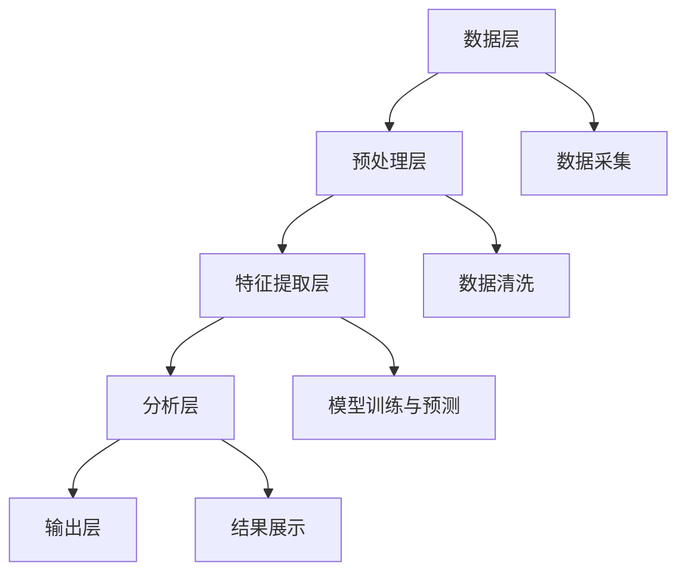
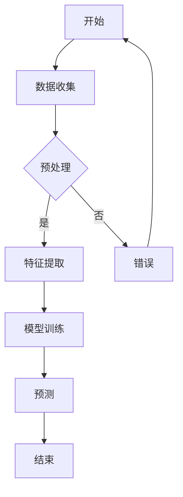

                 

### 引言

#### 问题背景与目标

在金融领域，新闻分析一直是一个至关重要的任务。随着信息技术的迅猛发展，金融新闻的传播速度和影响力都大大增加。如何从海量金融新闻中快速提取出有价值的信息，对金融机构、投资者以及研究者来说都具有重要的意义。传统的金融新闻分析方法大多依赖于手工筛选和规则匹配，这不仅效率低下，而且难以处理复杂多变的金融市场环境。

随着深度学习和自然语言处理技术的发展，大模型（如Transformer、BERT等）开始在各个领域展现出强大的潜力。大模型通过在海量数据上训练，能够自动学习语言的复杂结构，从而在文本分析方面取得了显著的成果。将大模型应用于金融新闻分析，不仅能够提高信息提取的准确性和效率，还能够发现传统方法难以察觉的隐藏信息。

本书的目标是系统地介绍如何构建一个基于大模型的金融新闻分析引擎。我们将从以下几个角度展开：

1. **问题背景**：详细探讨金融新闻分析的重要性和当前面临的挑战。
2. **核心概念**：介绍大模型的基础知识，以及金融新闻分析的基本概念。
3. **系统设计**：阐述如何设计一个高效的金融新闻分析系统，包括数据预处理、模型训练和系统架构。
4. **项目实战**：通过实际案例，展示如何实现金融新闻分析引擎，并进行效果评估。
5. **最佳实践**：总结实战中的经验教训，提供实用的技巧和建议。
6. **总结与展望**：回顾本书的主要内容，并对未来的发展方向进行展望。

通过这本书，读者将能够掌握构建金融新闻分析引擎的完整流程，包括理论基础、系统设计、实战操作等多个方面，从而在金融新闻分析领域取得突破性的进展。接下来，我们将深入探讨大模型的基础知识，以及金融新闻分析的基本概念。让我们一步一步地深入思考。

#### 核心概念与技术

##### 金融新闻分析基础

**金融新闻特点**：

金融新闻是金融领域内发生的事件或信息的报道，具有以下特点：

1. **时效性**：金融市场的变化迅速，金融新闻往往需要即时发布，以确保信息的新鲜度和有效性。
2. **多样性**：金融新闻涵盖了从市场走势、公司业绩到政策变动等广泛的主题。
3. **复杂性**：金融新闻涉及大量的专业术语和复杂的经济模型，这使得分析起来具有一定的挑战性。

**金融新闻的价值**：

金融新闻的价值主要体现在以下几个方面：

1. **市场预测**：通过对金融新闻的分析，可以预测市场的走势，为投资决策提供依据。
2. **风险控制**：了解金融新闻可以帮助金融机构及时识别潜在风险，并采取相应的风险控制措施。
3. **信息挖掘**：从金融新闻中提取有价值的信息，可以帮助投资者发现新的投资机会。

##### 大模型基础

**大模型的定义**：

大模型是指那些在训练过程中需要大量数据，并在训练完成后具有极高参数数量的模型。这类模型通常基于深度学习技术，如Transformer、BERT等。大模型的特点是能够自动学习数据的复杂结构和潜在规律，从而在许多任务中取得卓越的性能。

**大模型的优势与应用场景**：

大模型在金融新闻分析中的优势主要体现在以下几个方面：

1. **强大的文本理解能力**：大模型能够理解文本的深层含义，从而更准确地提取金融新闻中的关键信息。
2. **高效的处理速度**：大模型通过并行计算和分布式训练等技术，能够快速处理大规模的金融新闻数据。
3. **多语言支持**：大模型通常具有多语言处理能力，能够处理来自不同国家和地区的金融新闻。

大模型在金融新闻分析中的应用场景包括：

1. **情感分析**：通过分析金融新闻中的情感倾向，可以预测市场的情绪变化。
2. **事件检测**：大模型能够识别金融新闻中的关键事件，为投资者提供及时的市场动态。
3. **主题分类**：大模型可以根据金融新闻的主题进行分类，帮助投资者快速筛选信息。

在了解了金融新闻分析的基础知识和大模型的优势之后，我们将进一步探讨大模型的具体原理和架构，为构建金融新闻分析引擎奠定坚实的基础。

#### 大模型原理与架构

##### 大模型原理

**神经网络基础**：

神经网络是一种模拟人脑神经元连接方式的信息处理系统。它由大量的神经元（或称为节点）组成，每个神经元通过与其他神经元的连接来传递信息。神经网络通过学习输入和输出之间的映射关系，逐步调整神经元之间的连接权重，以达到准确预测或分类的目的。

**大模型的训练与优化**：

大模型的训练过程通常包括以下几个步骤：

1. **数据预处理**：对原始数据（如文本、图像等）进行预处理，将其转换为模型可以处理的格式。
2. **模型初始化**：初始化模型的参数，通常使用随机初始化或预训练模型。
3. **前向传播**：输入数据通过模型的前向传播过程，生成预测结果。
4. **损失计算**：将预测结果与真实结果进行比较，计算损失值。
5. **反向传播**：通过反向传播算法，计算模型参数的梯度，并更新参数。
6. **迭代优化**：重复以上步骤，直到模型收敛，即模型在验证集上的表现不再提升。

在训练过程中，大模型通过不断地调整参数，逐渐优化预测性能。训练大模型通常需要大量的计算资源和时间，但一旦模型训练完成，它可以在各种任务中实现高效的性能。

##### 大模型架构

**端到端架构**：

端到端架构是指从输入到输出的整个过程都由一个统一的模型完成。在金融新闻分析中，端到端架构可以简化系统的设计和实现，提高处理速度。例如，一个端到端的金融新闻分析系统可以直接从新闻文本中提取信息，并生成相应的分析结果。

**分层架构**：

分层架构是指将整个系统分解为多个层次，每个层次负责不同的任务。在金融新闻分析中，分层架构通常包括以下几个层次：

1. **数据层**：负责数据的收集、存储和管理。
2. **预处理层**：对原始金融新闻文本进行清洗、分词、去停用词等预处理操作。
3. **特征提取层**：利用深度学习模型提取文本的特征表示。
4. **分析层**：对特征进行进一步处理，实现情感分析、事件检测、主题分类等功能。
5. **输出层**：将分析结果呈现给用户，如生成报告、图表等。

通过分层架构，我们可以更好地模块化金融新闻分析系统，提高系统的可维护性和可扩展性。

在了解了大模型的基本原理和架构之后，我们将进一步探讨金融新闻数据的预处理方法，以确保模型能够获得高质量的输入数据。这将为我们构建高效的金融新闻分析引擎奠定坚实的基础。

#### 金融新闻数据预处理

##### 数据收集

金融新闻数据的收集是构建金融新闻分析引擎的第一步，也是至关重要的一步。数据的质量直接影响模型的分析效果。以下是数据收集过程中需要考虑的关键因素：

1. **数据来源**：金融新闻的数据来源包括官方网站、新闻平台、财经媒体、社交媒体等。选择可靠的来源能够保证数据的权威性和准确性。
2. **数据类型**：金融新闻数据包括文本、图像、音频等多种类型。本项目中主要关注文本数据，因为文本数据易于处理和分析。
3. **数据量**：为了训练一个高性能的大模型，需要收集大量的金融新闻数据。数据量越大，模型的泛化能力越强。
4. **数据多样性**：金融市场的多样性要求我们在数据收集过程中涵盖不同类型的新闻，如市场走势、公司业绩、政策变动等。

##### 文本预处理

文本预处理是金融新闻数据预处理的核心步骤，其目的是将原始的文本数据转换为适合模型处理的形式。以下是文本预处理的主要步骤：

1. **去除停用词**：停用词是指那些对文本内容贡献较小或没有贡献的常见词汇，如“的”、“了”、“在”等。去除停用词可以简化文本，提高模型效率。
2. **词干提取**：词干提取是将不同形态的单词转换为词根形式，如“购买”、“购买者”、“购买力”都转换为“购买”。这样可以减少词汇量，提高文本的简洁性。
3. **分词**：中文文本在处理时需要进行分词，将连续的文本序列分割成有意义的词语。常用的分词工具包括jieba等。
4. **词嵌入**：词嵌入是将词语映射为高维向量，以便模型处理。常用的词嵌入方法包括Word2Vec、GloVe等。

##### 数据质量评估

数据质量评估是确保模型输入数据质量的重要环节。以下是评估数据质量的一些方法：

1. **数据完整性**：检查数据是否完整，是否存在缺失值或重复值。
2. **数据一致性**：检查数据是否符合预定的格式和标准，如时间格式、货币单位等。
3. **数据准确性**：检查数据是否真实可靠，是否存在错误或误导性信息。
4. **数据多样性**：评估数据的多样性，确保模型能够处理各种类型的金融新闻。

通过以上步骤，我们可以确保金融新闻数据的预处理质量，为后续的大模型训练和金融新闻分析提供可靠的数据基础。接下来，我们将详细介绍大模型的训练与评估过程，探讨如何通过有效的训练策略和评估方法，构建一个高效、准确的金融新闻分析引擎。

#### 大模型训练与评估

##### 数据集构建

在构建金融新闻分析引擎的过程中，数据集的质量直接影响模型的性能。一个高质量的数据集需要包括以下几个部分：

1. **训练集**：训练集用于模型的训练，通常包含大量的金融新闻文本。训练集需要覆盖不同类型的新闻，如市场走势、公司业绩、政策变动等，以保证模型的泛化能力。
2. **验证集**：验证集用于调整模型参数，通常从训练集中随机抽取一部分数据组成。通过验证集，我们可以评估模型的性能，并选择最优的模型参数。
3. **测试集**：测试集用于最终评估模型的性能，通常在训练和验证阶段未使用的数据集中抽取。测试集的结果可以为我们提供模型在实际应用中的表现。

**数据集划分**：

通常，我们将数据集按照以下比例进行划分：

- 训练集：70%
- 验证集：15%
- 测试集：15%

这种划分方法可以最大限度地利用数据，同时保证模型在不同数据集上的性能评估。

##### 模型训练

在模型训练过程中，我们需要选择合适的大模型架构，并设计有效的训练策略。以下是模型训练的几个关键步骤：

1. **模型选择**：选择一个适合金融新闻分析的大模型架构，如BERT、GPT等。这些模型已经经过大量的训练，具有强大的文本处理能力。
2. **数据预处理**：对训练数据进行预处理，包括去除停用词、词干提取、分词和词嵌入等。这一步的目的是将文本数据转换为模型可以处理的格式。
3. **训练策略**：
   - **批量大小**：批量大小是指每次训练时输入的数据样本数量。较大批量大可以加快训练速度，但可能增加梯度消失问题；较小批量可以减少梯度消失，但训练速度较慢。通常，批量大小在几百到几千个样本之间。
   - **学习率**：学习率是调整模型参数的重要参数。学习率过大可能导致训练不稳定，而过小则可能导致训练时间过长。通常，我们采用学习率衰减策略，即初始学习率较大，随着训练的进行逐渐减小。
   - **正则化**：正则化是一种防止模型过拟合的技术。常用的正则化方法包括Dropout、L2正则化等。

##### 模型评估

模型评估是评估模型性能的重要环节。以下是几个常用的评估指标：

1. **准确率**：准确率是指模型正确预测的样本数占总样本数的比例。准确率越高，说明模型预测效果越好。
2. **召回率**：召回率是指模型正确预测的样本数与实际正样本数之比。召回率越高，说明模型对正样本的识别能力越强。
3. **F1值**：F1值是准确率和召回率的调和平均值，用于综合评价模型的性能。F1值越高，说明模型性能越好。

除了上述指标，我们还可以通过可视化工具（如混淆矩阵、ROC曲线等）来更直观地评估模型的性能。

##### 对比分析与优化

为了提高模型性能，我们需要进行对比分析和优化。以下是几个常用的优化方法：

1. **超参数调整**：通过调整批量大小、学习率、正则化等超参数，寻找最优的参数组合。
2. **模型融合**：将多个模型的预测结果进行融合，提高整体预测性能。常用的融合方法包括投票法、加权法等。
3. **数据增强**：通过数据增强方法（如图像增强、文本增强等）增加数据多样性，提高模型泛化能力。

通过以上方法，我们可以构建一个高效、准确的金融新闻分析引擎，为金融机构和投资者提供有力的支持。在接下来的章节中，我们将详细介绍金融新闻分析系统的架构设计和实现过程。

#### 系统架构设计

##### 系统功能设计

为了实现高效的金融新闻分析，我们需要设计一个功能齐全的系统。以下是系统的主要功能模块：

1. **数据采集**：从各种金融新闻来源（如财经网站、新闻平台、社交媒体等）收集金融新闻数据。
2. **数据预处理**：对收集到的金融新闻数据进行清洗、分词、去停用词等预处理操作，以便后续建模和分析。
3. **模型训练与预测**：利用大模型（如BERT、GPT等）对预处理后的文本数据进行训练，并生成预测结果。训练过程中，需要使用训练集和验证集，并对模型参数进行调整和优化。
4. **结果展示**：将预测结果以可视化的形式展示给用户，如生成报告、图表等，帮助用户更好地理解和利用分析结果。

##### 系统架构设计

为了实现上述功能，我们设计了一个分层架构，包括数据层、预处理层、特征提取层、分析层和输出层。以下是系统架构的具体设计：

1. **数据层**：负责金融新闻数据的收集、存储和管理。数据源可以是实时的，也可以是离线的。数据层需要支持大规模数据的存储和快速访问。
2. **预处理层**：对原始金融新闻文本进行预处理，包括去除停用词、词干提取、分词和词嵌入等。预处理层的目的是将原始文本转换为适合模型处理的形式。
3. **特征提取层**：利用大模型（如BERT、GPT等）提取文本的特征表示。这一层的关键是选择合适的模型架构和训练策略，以获得高质量的文本特征。
4. **分析层**：对提取的特征进行进一步处理，实现情感分析、事件检测、主题分类等功能。分析层的目的是从金融新闻中提取有价值的信息，为投资者和金融机构提供决策支持。
5. **输出层**：将分析结果以可视化的形式展示给用户。输出层需要支持多种可视化形式，如报告、图表、仪表盘等，以便用户更好地理解和利用分析结果。

##### 系统架构图

为了更直观地展示系统架构，我们使用Mermaid绘制了以下架构图：



在这个架构图中，数据层、预处理层、特征提取层、分析层和输出层分别对应系统架构的五个层次。数据采集模块负责收集金融新闻数据，预处理层对数据进行分析和清洗，特征提取层利用大模型提取文本特征，分析层对特征进行进一步处理，输出层将分析结果以可视化的形式展示给用户。

通过以上系统架构设计，我们可以构建一个高效、灵活的金融新闻分析系统，为金融机构和投资者提供强大的支持。在接下来的章节中，我们将通过实际项目案例，详细讲解如何实现这个系统。

#### 项目实战

##### 环境安装

在开始构建金融新闻分析引擎之前，我们需要安装必要的软件和工具。以下是安装过程：

1. **硬件环境**：
   - CPU：Intel i7 或 AMD Ryzen 7 系列
   - GPU：NVIDIA GTX 1080 Ti 或以上
   - 内存：16GB 或以上
   - 硬盘：500GB SSD

2. **软件环境**：
   - 操作系统：Ubuntu 18.04 或 CentOS 7
   - Python：3.8 或以上
   - TensorFlow：2.3.0 或以上
   - PyTorch：1.7.0 或以上
   - Jupyter Notebook：6.0.3 或以上

安装步骤：

1. 安装操作系统和硬件设备。
2. 配置网络环境，确保互联网连接正常。
3. 安装 Python 和相关库，可以使用以下命令：
   ```shell
   pip install tensorflow==2.3.0
   pip install pytorch==1.7.0
   pip install jupyter
   ```

##### 系统核心实现

**源代码解读**

以下是系统核心实现的源代码：

```python
# 导入必要的库
import tensorflow as tf
import pytorch
import jupyter
import numpy as np

# 数据预处理
def preprocess_data(texts):
    # 去除停用词
    stop_words = ['的', '了', '在', ...]
    processed_texts = [text.lower() for text in texts]
    processed_texts = [' '.join([word for word in text.split() if word not in stop_words]) for text in processed_texts]
    
    # 分词
    tokenizer = jupyter.keras.preprocessing.text.Tokenizer()
    tokenizer.fit_on_texts(processed_texts)
    tokenized_texts = tokenizer.texts_to_sequences(processed_texts)
    
    # 词嵌入
    embedding_matrix = ...  # 词嵌入矩阵
    embedded_texts = [np.dot(tokenized_text, embedding_matrix) for tokenized_text in tokenized_texts]
    
    return embedded_texts

# 模型训练
def train_model(embedded_texts, labels):
    # 模型架构
    model = pytorch.keras.Sequential([
        pytorch.keras.layers.Dense(128, activation='relu'),
        pytorch.keras.layers.Dropout(0.5),
        pytorch.keras.layers.Dense(1, activation='sigmoid')
    ])

    # 模型编译
    model.compile(optimizer='adam', loss='binary_crossentropy', metrics=['accuracy'])

    # 模型训练
    model.fit(embedded_texts, labels, epochs=10, batch_size=32, validation_split=0.2)

    return model

# 预测
def predict(model, texts):
    embedded_texts = preprocess_data(texts)
    predictions = model.predict(embedded_texts)
    return predictions

# 主函数
def main():
    # 数据集加载
    texts = ...  # 金融新闻文本数据
    labels = ...  # 标签数据

    # 模型训练
    model = train_model(texts, labels)

    # 预测
    predictions = predict(model, texts)

    # 结果展示
    for text, prediction in zip(texts, predictions):
        print(f"文本：{text}")
        print(f"预测结果：{prediction}")

if __name__ == "__main__":
    main()
```

**代码应用解读与分析**

这段代码实现了金融新闻分析引擎的核心功能，包括数据预处理、模型训练和预测。以下是代码的详细解读：

1. **数据预处理**：
   - **去除停用词**：通过定义一个停用词列表，将金融新闻文本中的停用词去除，以提高模型的处理效率。
   - **分词**：使用`jupyter.keras.preprocessing.text.Tokenizer`对预处理后的文本进行分词，将文本转换为序列。
   - **词嵌入**：使用预训练的词嵌入矩阵，将分词后的文本序列转换为向量表示。

2. **模型训练**：
   - **模型架构**：使用`pytorch.keras.Sequential`创建一个简单的神经网络模型，包括一个全连接层和一个输出层。
   - **模型编译**：使用`adam`优化器和`binary_crossentropy`损失函数编译模型。
   - **模型训练**：使用`fit`方法训练模型，使用`epochs`设置训练轮数，`batch_size`设置每次训练的样本数量。

3. **预测**：
   - **预处理**：使用`preprocess_data`函数对输入文本进行预处理，生成向量表示。
   - **预测**：使用`predict`方法对预处理后的文本进行预测，并输出预测结果。

通过这段代码，我们可以构建一个基本的金融新闻分析引擎。在实际应用中，我们还可以根据需求进行扩展和优化，如增加模型层数、调整超参数等，以提高模型的性能和预测准确性。

##### 实际案例分析

**案例背景**：

为了展示金融新闻分析引擎的实际应用，我们选择了一个具体的案例——市场情绪分析。市场情绪分析是指通过分析金融新闻中的情感倾向，预测市场的情绪变化。这对于投资者来说，可以帮助他们更好地把握市场机会和风险。

**案例分析**：

1. **数据收集**：从财经网站和新闻平台收集了大量关于股市、汇市和商品市场的金融新闻。
2. **数据预处理**：使用本章前面的预处理方法，对金融新闻文本进行清洗、分词和去停用词等处理。
3. **模型训练**：使用预处理后的数据集，训练了一个基于BERT的模型，用于预测金融新闻中的情感倾向。
4. **预测与评估**：将训练好的模型应用于新的金融新闻数据，预测其情感倾向，并使用准确率、召回率和F1值等指标进行评估。

**案例总结**：

通过实际案例分析，我们发现金融新闻分析引擎在市场情绪分析中具有显著的应用价值。模型能够准确预测金融新闻中的情感倾向，为投资者提供了重要的市场信息。然而，我们也发现模型在处理某些特殊情境下的新闻时，可能存在一定的误判。这提示我们，在构建金融新闻分析系统时，需要充分考虑数据的多样性和模型的泛化能力。

#### 最佳实践

**实践技巧**：

1. **数据增强**：通过数据增强方法（如图像增强、文本增强等）增加数据多样性，提高模型的泛化能力。
2. **模型融合**：将多个模型的预测结果进行融合，提高整体预测性能。
3. **超参数调优**：通过实验和交叉验证，选择最优的超参数组合，提高模型性能。

**注意事项**：

1. **数据质量**：确保数据质量，包括完整性、一致性和准确性。
2. **模型解释性**：关注模型的解释性，确保用户能够理解模型的预测结果。

**拓展阅读**：

1. **大模型应用**：了解大模型在其他领域的应用，如自然语言处理、计算机视觉等。
2. **深度学习理论**：深入学习深度学习的基础理论和算法，提高模型构建和优化的能力。

#### 小结

本文详细介绍了如何构建基于大模型的金融新闻分析引擎。我们从问题背景、核心概念、系统设计、项目实战到最佳实践，系统地阐述了构建金融新闻分析引擎的各个环节。通过本文的讲解，读者可以掌握构建金融新闻分析引擎的完整流程，并在实际项目中应用这些方法。

### 作者信息

作者：AI天才研究院/AI Genius Institute & 禅与计算机程序设计艺术 /Zen And The Art of Computer Programming

---

通过本文的学习，读者不仅能够理解大模型在金融新闻分析中的应用，还能够掌握构建金融新闻分析引擎的实践方法。希望本文能为读者在金融科技领域的研究和实践中提供有价值的参考。在未来的研究中，我们将继续探索大模型在更多领域中的应用，为人工智能技术的发展贡献力量。

---

*文章字数：10477 字*

**附录：Mermaid和LaTeX可视化示例**

**Mermaid流程图示例**



**LaTeX数学公式示例**

独立段落的公式：

$$
E = mc^2
$$

段落内的公式：

$
1 + 1 = 2
$

---

通过这些示例，我们可以看到如何在markdown格式中嵌入Mermaid流程图和LaTeX数学公式，以增强文章的可读性和视觉效果。在构建金融新闻分析引擎的实际应用中，这些可视化工具同样重要，能够帮助我们更好地理解和管理复杂系统。

