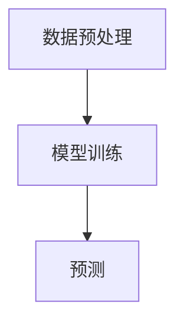

                 

### 文章标题

在当今高速发展的金融科技领域，金融监管政策的制定和执行面临着前所未有的挑战。如何确保政策的有效性，减少对市场的冲击，成为各国金融监管机构亟待解决的问题。本文将探讨构建基于大模型的金融监管政策影响模拟器的方法，通过逐步分析推理，揭示这一前沿技术如何为金融监管提供强有力的支持。

### 关键词

- 金融监管
- 大模型
- 模拟器
- 政策影响
- 数据分析

### 摘要

本文旨在介绍构建基于大模型的金融监管政策影响模拟器的原理、方法和实践。首先，我们将探讨金融监管面临的挑战及大模型在其中的作用。随后，我们将详细阐述大模型的基本原理及其在金融监管中的应用。接着，本文将深入讨论模拟器的设计原则、系统架构和核心算法，并通过实际案例展示模拟器在金融监管中的具体应用效果。最后，我们将总结项目经验，并提出未来的研究方向。

## 第一部分：背景介绍

### 1.1 问题背景

#### 1.1.1 金融监管的挑战与需求

金融监管是维护金融市场稳定、保障投资者权益、防范系统性金融风险的重要手段。然而，随着金融市场全球化、信息化和复杂化程度的不断提高，金融监管面临着前所未有的挑战。首先，金融市场的高度动态性和不确定性使得监管机构难以预测市场变化，及时制定和调整监管政策。其次，金融创新带来的新业务模式、新产品和服务使得监管机构需要具备快速响应和持续学习的能力。此外，金融市场的跨国性和跨境交易的增加，也对金融监管的国际协调和合作提出了更高的要求。

在这种背景下，如何有效进行金融监管，确保政策制定的科学性和执行的有效性，成为各国金融监管机构亟待解决的核心问题。传统的方法主要依赖于历史数据和统计模型，但面对快速变化的金融市场，这些方法的局限性日益显现。因此，需要引入新的技术手段，特别是大模型，以实现金融监管的智能化和精细化。

#### 1.1.2 大模型在金融监管中的作用

大模型，特别是深度学习和人工智能技术，在金融监管中具有巨大的潜力和应用价值。首先，大模型能够处理和分析大量复杂的数据，包括历史市场数据、交易数据、公司财务报表等，从而提供更为全面和深入的洞察。其次，大模型具备强大的预测能力，可以基于历史数据和现有信息，预测市场走势和政策影响，为监管决策提供有力支持。此外，大模型还可以通过模拟不同政策情景，评估政策效果，帮助监管机构制定更加科学合理的政策。

#### 1.1.3 政策影响模拟的重要性

政策影响模拟是金融监管的重要环节，通过模拟不同政策情景，评估政策可能带来的经济、社会和市场影响，可以帮助监管机构更好地理解政策后果，优化政策设计。具体来说，政策影响模拟的重要性体现在以下几个方面：

1. **风险预警**：通过模拟政策影响，可以提前识别潜在风险点，为监管机构提供预警信息，有助于防范系统性金融风险。
2. **政策优化**：通过对比不同政策情景下的影响，监管机构可以评估不同政策的优劣，选择最优的政策组合，提高政策执行效果。
3. **公众沟通**：政策影响模拟可以为公众提供透明的政策评估结果，增强政策制定的透明度和公信力，有助于公众理解和接受监管政策。

因此，构建基于大模型的金融监管政策影响模拟器，不仅有助于提升金融监管的科学性和有效性，也为金融监管提供了新的技术手段和思路。

### 1.2 核心概念

#### 1.2.1 大模型的定义与特点

大模型，通常指的是具有极高参数量、能够处理海量数据的机器学习模型。这类模型通常基于深度学习技术，具有以下主要特点：

1. **高参数量**：大模型的参数量通常在数十亿到数千亿之间，这使得它们能够捕捉到数据中的复杂模式和潜在关系。
2. **强泛化能力**：大模型具备强大的泛化能力，能够处理新的数据集和新出现的问题，而不会因为数据集的变化而失效。
3. **自主学习**：大模型可以通过自我学习和优化，不断改进模型的性能和效果，而不需要人工干预。

#### 1.2.2 金融监管政策的定义与分类

金融监管政策是指为了维护金融市场的稳定和公平，由金融监管机构制定并实施的一系列法规、规则和措施。根据监管政策的目标和手段，可以将其分为以下几类：

1. **市场准入政策**：这类政策旨在规范市场参与者的行为，确保市场参与者的资质和合法性。
2. **风险控制政策**：这类政策主要针对金融机构的运营风险，通过资本充足率、风险敞口限制等手段，防范系统性金融风险。
3. **信息披露政策**：这类政策要求金融机构公开相关信息，提高市场透明度，保护投资者权益。
4. **宏观审慎政策**：这类政策关注整个金融体系的稳定，通过调控宏观经济政策和金融政策，防范系统性风险。

#### 1.2.3 模拟器的设计原则与目标

构建金融监管政策影响模拟器的核心原则包括：

1. **数据驱动**：模拟器应以真实数据为基础，确保模型的预测和分析具有可靠的数据支持。
2. **模型可解释性**：尽管大模型具有强大的预测能力，但为了增强政策的可解释性，需要设计可解释性强的模型。
3. **灵活性**：模拟器应具备灵活调整政策参数和情景的能力，以适应不同监管需求和场景。
4. **高效性**：模拟器应具备高效的处理速度，能够在短时间内完成大规模的政策模拟。

模拟器的目标包括：

1. **风险评估**：通过模拟不同政策情景，评估政策可能带来的经济和市场影响，为监管决策提供支持。
2. **政策优化**：通过对比不同政策情景的效果，帮助监管机构选择最优的政策组合。
3. **决策支持**：为监管机构提供科学的决策依据，提高政策制定和执行的科学性和有效性。
4. **公众沟通**：通过透明的政策评估结果，增强政策制定的透明度和公信力。

### 1.3 概念联系

#### 1.3.1 大模型与金融监管政策的关系

大模型在金融监管政策中的应用主要体现在以下几个方面：

1. **数据分析**：大模型可以处理和分析大量金融数据，提供深入的市场洞察和风险分析。
2. **预测能力**：大模型具备强大的预测能力，可以预测市场走势和政策影响，为监管决策提供科学依据。
3. **情景模拟**：大模型可以通过模拟不同政策情景，评估政策效果，帮助监管机构制定和调整政策。

#### 1.3.2 模拟器在金融监管中的应用

模拟器在金融监管中的应用主要包括：

1. **政策评估**：通过模拟不同政策情景，评估政策可能带来的经济和市场影响，帮助监管机构优化政策设计。
2. **风险预警**：通过模拟政策影响，提前识别潜在风险点，为监管机构提供预警信息。
3. **决策支持**：为监管机构提供科学的决策依据，提高政策制定和执行的科学性和有效性。

#### 1.3.3 模拟器设计的核心要素

模拟器设计的核心要素包括：

1. **数据集**：构建高质量的金融数据集，确保模拟器的输入数据真实、全面、准确。
2. **模型架构**：选择合适的大模型架构，确保模型的预测能力和可解释性。
3. **算法优化**：通过算法优化，提高模型的处理速度和效率。
4. **界面设计**：设计直观、易用的用户界面，方便监管机构操作和使用。
5. **评估机制**：建立科学的评估机制，确保模拟器结果的准确性和可靠性。

### 1.4 本章小结

本部分介绍了构建基于大模型的金融监管政策影响模拟器的基本概念和背景。通过分析金融监管的挑战和大模型的特点，我们明确了构建模拟器的重要性和必要性。同时，我们阐述了模拟器设计的原则和目标，以及大模型和金融监管政策的联系。这些内容为后续章节的深入讨论奠定了基础。

## 第二部分：大模型原理与实现

### 2.1 大模型原理

#### 2.1.1 大模型的基本架构

大模型通常采用深度神经网络（DNN）结构，其基本架构包括输入层、隐藏层和输出层。每一层由多个神经元组成，神经元之间通过权重和偏置进行连接。大模型的特点在于其参数量巨大，能够捕捉到数据中的复杂模式和潜在关系。具体来说，大模型的基本架构包括以下几个关键部分：

1. **输入层**：输入层接收外部数据，如文本、图像、声音等，并将其转换为模型可以处理的格式。
2. **隐藏层**：隐藏层负责对输入数据进行处理和变换，通过多层隐藏层的堆叠，模型可以学习到更复杂的数据特征。
3. **输出层**：输出层根据隐藏层的结果生成预测或分类结果，如股票价格、客户流失率等。

#### 2.1.2 大模型的训练过程

大模型的训练过程是模型学习数据特征、优化参数的过程，主要包括以下几个步骤：

1. **数据预处理**：对输入数据进行清洗、归一化等处理，确保数据的质量和一致性。
2. **模型初始化**：初始化模型的参数，通常采用随机初始化方法。
3. **前向传播**：将输入数据传递到模型中，通过前向传播计算输出结果。
4. **反向传播**：计算输出结果与真实值之间的误差，并通过反向传播更新模型参数。
5. **优化算法**：采用优化算法（如梯度下降、Adam等）调整模型参数，以最小化误差。

#### 2.1.3 大模型的核心算法

大模型的核心算法主要包括深度学习中的神经网络算法和优化算法。以下是几个关键算法：

1. **神经网络算法**：神经网络算法是深度学习的基础，包括多层感知机（MLP）、卷积神经网络（CNN）和循环神经网络（RNN）等。
   - **MLP**：多层感知机是一种前馈神经网络，可以用于分类和回归任务。
   - **CNN**：卷积神经网络通过卷积操作提取图像特征，广泛应用于图像识别和计算机视觉领域。
   - **RNN**：循环神经网络能够处理序列数据，适用于时间序列分析和自然语言处理。

2. **优化算法**：优化算法用于调整模型参数，以最小化损失函数。常用的优化算法包括：
   - **梯度下降**：通过计算损失函数对参数的梯度，迭代更新参数。
   - **Adam**：自适应矩估计，结合了梯度下降和动量的优点，适用于大规模数据训练。

#### 2.2 大模型实现

#### 2.2.1 大模型实现的硬件要求

大模型的训练和推理通常需要高性能的硬件支持，主要包括以下几个关键硬件要求：

1. **计算能力**：大模型训练需要强大的计算能力，通常使用GPU（如NVIDIA Titan Xp、RTX 3090等）加速训练过程。
2. **存储容量**：大模型的数据集通常较大，需要足够的存储空间来存储数据和模型参数。
3. **内存容量**：大模型的参数量和中间计算结果较大，需要足够的内存容量来支持训练过程。

#### 2.2.2 大模型实现的软件环境

大模型实现需要依赖一系列的软件工具和框架，主要包括：

1. **Python**：Python是一种广泛使用的编程语言，支持各种科学计算和机器学习库。
2. **TensorFlow**：TensorFlow是谷歌开发的开源机器学习框架，支持深度学习模型的设计、训练和部署。
3. **PyTorch**：PyTorch是另一个流行的开源机器学习框架，以其灵活性和动态计算图著称。
4. **CUDA**：CUDA是NVIDIA开发的一种并行计算编程模型，用于在GPU上加速深度学习计算。

#### 2.2.3 大模型实现的核心代码

以下是一个简单的大模型实现示例，使用PyTorch框架：

```python
import torch
import torch.nn as nn
import torch.optim as optim

# 定义模型
class NeuralNetwork(nn.Module):
    def __init__(self):
        super(NeuralNetwork, self).__init__()
        self.layer1 = nn.Linear(in_features=784, out_features=256)
        self.relu = nn.ReLU()
        self.layer2 = nn.Linear(in_features=256, out_features=128)
        self.dropout = nn.Dropout(p=0.5)
        self.fc = nn.Linear(in_features=128, out_features=10)

    def forward(self, x):
        x = self.layer1(x)
        x = self.relu(x)
        x = self.layer2(x)
        x = self.dropout(x)
        x = self.fc(x)
        return x

# 初始化模型、优化器和损失函数
model = NeuralNetwork()
optimizer = optim.Adam(model.parameters(), lr=0.001)
criterion = nn.CrossEntropyLoss()

# 训练模型
for epoch in range(10):
    for inputs, targets in data_loader:
        optimizer.zero_grad()
        outputs = model(inputs)
        loss = criterion(outputs, targets)
        loss.backward()
        optimizer.step()
    print(f'Epoch [{epoch+1}/10], Loss: {loss.item()}')

# 模型评估
with torch.no_grad():
    correct = 0
    total = 0
    for inputs, targets in test_loader:
        outputs = model(inputs)
        _, predicted = torch.max(outputs.data, 1)
        total += targets.size(0)
        correct += (predicted == targets).sum().item()
    print(f'Accuracy: {100 * correct / total}%')
```

#### 2.3 大模型应用

#### 2.3.1 大模型在金融领域的应用案例

大模型在金融领域具有广泛的应用，以下是一些典型的应用案例：

1. **股票市场预测**：大模型可以通过分析历史股价、交易量等数据，预测未来股价走势，为投资者提供参考。
2. **信贷风险评估**：大模型可以分析客户的信用记录、财务状况等数据，预测客户违约风险，帮助金融机构优化信贷审批流程。
3. **智能投顾**：大模型可以分析投资者的风险偏好、财务状况等数据，提供个性化的投资建议，提高投资收益率。

#### 2.3.2 大模型在金融监管中的实际应用

大模型在金融监管中的应用主要体现在以下几个方面：

1. **风险监测**：大模型可以实时监测金融市场，识别潜在风险点，为监管机构提供预警信息。
2. **反洗钱**：大模型可以通过分析交易数据，识别异常交易行为，帮助金融机构防范洗钱风险。
3. **监管合规**：大模型可以自动检查金融机构的交易记录和操作行为，确保其合规性。

#### 2.3.3 大模型应用的效果评估

大模型应用的效果评估主要通过以下指标进行：

1. **准确性**：评估模型预测结果的准确性，常用的指标有准确率、精确率、召回率等。
2. **可靠性**：评估模型预测结果的可靠性，包括预测的稳定性、泛化能力等。
3. **效率**：评估模型训练和预测的效率，包括训练时间、推理时间等。

通过综合评估以上指标，可以全面了解大模型在金融监管中的效果和应用价值。

### 2.4 本章小结

本部分介绍了大模型的基本原理和实现方法。首先，我们详细阐述了大模型的基本架构和训练过程，并介绍了常用的神经网络算法和优化算法。接着，我们讨论了大模型的硬件要求、软件环境以及核心代码实现。最后，我们通过实际应用案例，展示了大模型在金融领域和金融监管中的具体应用效果。这些内容为后续构建金融监管政策影响模拟器提供了理论基础和技术支持。

## 第三部分：金融监管政策影响模拟器设计

### 3.1 模拟器设计原则

金融监管政策影响模拟器的设计原则是确保其能够准确、高效、可解释地模拟政策影响，为监管决策提供有力支持。以下是模拟器设计的关键原则：

#### 3.1.1 数据驱动

数据是模拟器的基础，因此设计原则之一是确保模拟器以真实、全面、准确的数据为基础。数据来源应包括金融市场数据、监管政策数据、经济指标数据等。同时，数据预处理和清洗是关键步骤，以确保数据的准确性和一致性。

#### 3.1.2 模型可解释性

尽管大模型具备强大的预测能力，但为了增强政策制定的可解释性，设计原则中要求模型具备较高的可解释性。这可以通过选择可解释性强的模型架构、解释模型预测结果等方式实现。例如，可以结合传统统计分析方法和机器学习模型，通过可视化工具展示模型的工作原理和预测过程。

#### 3.1.3 灵活性

模拟器应具备灵活性，能够适应不同的监管需求和场景。具体包括以下方面：

1. **政策参数调整**：模拟器应支持灵活调整政策参数，以模拟不同政策情景。
2. **模型扩展性**：模拟器应具备扩展性，能够适应新的模型架构和算法。
3. **用户友好性**：模拟器界面应简洁直观，便于监管机构操作和使用。

#### 3.1.4 高效性

模拟器应具备高效的处理速度和计算能力，以支持大规模的政策模拟。这可以通过优化算法、并行计算和分布式计算等方式实现。

### 3.2 系统架构设计

金融监管政策影响模拟器的设计应考虑系统架构的合理性、灵活性和可扩展性。以下是系统架构设计的关键要素：

#### 3.2.1 系统架构概述

模拟器的系统架构主要包括数据层、模型层和应用层三个部分。具体架构如下：

1. **数据层**：负责数据存储、管理和处理。数据层应支持多种数据格式的存储，如CSV、Parquet等，并具备高效的数据查询和处理能力。
2. **模型层**：负责模型的训练、优化和部署。模型层应支持多种模型架构，如深度学习模型、传统统计模型等，并具备模型的可解释性和可视化功能。
3. **应用层**：负责提供用户交互界面和业务逻辑。应用层应支持多种用户交互方式，如Web界面、桌面应用程序等，并提供灵活的政策模拟功能。

#### 3.2.2 系统功能模块设计

模拟器的系统功能模块设计应涵盖数据采集、数据处理、模型训练、政策模拟、结果分析和报告生成等关键功能。具体模块设计如下：

1. **数据采集模块**：负责从各种数据源（如金融市场数据、监管政策数据、经济指标数据等）采集数据，并进行初步清洗和预处理。
2. **数据处理模块**：负责对采集到的数据进行深度清洗、特征工程和标准化处理，为模型训练提供高质量的数据。
3. **模型训练模块**：负责训练和优化模型，支持多种模型架构和算法，如深度学习模型、传统统计模型等。
4. **政策模拟模块**：负责根据监管政策参数，模拟不同政策情景下的市场影响，提供可视化展示和分析报告。
5. **结果分析模块**：负责对政策模拟结果进行分析和评估，提供定量和定性的分析结论。
6. **报告生成模块**：负责生成政策模拟结果的分析报告，包括市场影响分析、风险预警报告等。

#### 3.2.3 系统接口设计

模拟器的系统接口设计应支持灵活的接口集成和扩展，以满足不同应用场景的需求。以下是系统接口设计的关键要素：

1. **API接口**：模拟器应提供RESTful API接口，支持与外部系统的集成和交互。API接口应支持数据查询、模型训练、政策模拟等功能。
2. **数据接口**：模拟器应支持与各种数据源的连接和接口，如关系型数据库、NoSQL数据库、数据存储平台等。
3. **可视化接口**：模拟器应提供可视化界面，支持用户自定义可视化组件和展示方式，提供直观的数据分析和政策模拟结果展示。
4. **集成接口**：模拟器应支持与其他系统的集成，如财务系统、风险管理系统等，实现数据的互通和共享。

### 3.3 算法原理讲解

金融监管政策影响模拟器的核心算法是基于大模型的深度学习算法。以下是模拟器的核心算法原理和流程：

#### 3.3.1 模拟器核心算法

模拟器核心算法主要包括数据预处理、模型训练和预测三个阶段。具体算法流程如下：

1. **数据预处理**：对采集到的数据进行清洗、归一化和特征提取，为模型训练提供高质量的数据。
2. **模型训练**：使用深度学习算法（如CNN、RNN、Transformer等）训练模型，通过优化算法（如梯度下降、Adam等）调整模型参数，使模型能够准确预测政策影响。
3. **预测**：使用训练好的模型对新的政策情景进行预测，生成预测结果。

#### 3.3.2 算法流程图

以下是模拟器的核心算法流程图：



#### 3.3.3 算法原理与数学模型

模拟器的核心算法原理是基于深度学习中的神经网络模型。以下是算法原理和数学模型：

1. **输入层**：输入层接收政策情景的数据，如政策文本、经济指标等。
2. **隐藏层**：隐藏层通过神经网络结构处理输入数据，提取特征并进行非线性变换。
3. **输出层**：输出层生成政策影响的预测结果，如市场走势、风险指标等。

数学模型如下：

$$
Y = f(W \cdot X + b)
$$

其中，$Y$是输出结果，$X$是输入数据，$W$是权重矩阵，$b$是偏置项，$f$是非线性激活函数。

#### 3.3.4 举例说明

以下是一个简单的算法举例，使用Python代码实现：

```python
import torch
import torch.nn as nn
import torch.optim as optim

# 定义模型
class PolicyModel(nn.Module):
    def __init__(self):
        super(PolicyModel, self).__init__()
        self.layers = nn.Sequential(
            nn.Linear(in_features=10, out_features=50),
            nn.ReLU(),
            nn.Linear(in_features=50, out_features=1)
        )
    
    def forward(self, x):
        return self.layers(x)

# 初始化模型、优化器和损失函数
model = PolicyModel()
optimizer = optim.Adam(model.parameters(), lr=0.001)
criterion = nn.MSELoss()

# 训练模型
for epoch in range(100):
    for inputs, targets in data_loader:
        optimizer.zero_grad()
        outputs = model(inputs)
        loss = criterion(outputs, targets)
        loss.backward()
        optimizer.step()
    print(f'Epoch [{epoch+1}/100], Loss: {loss.item()}')

# 模型评估
with torch.no_grad():
    correct = 0
    total = 0
    for inputs, targets in test_loader:
        outputs = model(inputs)
        total += targets.size(0)
        correct += (outputs < 0.5).sum().item()
    print(f'Accuracy: {100 * correct / total}%')
```

### 3.4 数学模型和数学公式讲解

#### 3.4.1 数学模型概述

金融监管政策影响模拟器的数学模型主要包括以下几个方面：

1. **政策影响预测模型**：用于预测政策实施后对市场的影响，如股票价格、交易量等。
2. **风险指标评估模型**：用于评估政策实施后市场风险的变化，如波动率、违约概率等。
3. **经济指标预测模型**：用于预测政策实施后宏观经济指标的变化，如GDP、就业率等。

#### 3.4.2 数学公式讲解

以下是模拟器中常用的数学公式及其解释：

1. **线性回归模型**：

$$
y = \beta_0 + \beta_1x_1 + \beta_2x_2 + \cdots + \beta_nx_n
$$

其中，$y$是预测结果，$x_1, x_2, \cdots, x_n$是输入特征，$\beta_0, \beta_1, \beta_2, \cdots, \beta_n$是模型参数。

2. **逻辑回归模型**：

$$
P(y=1) = \frac{1}{1 + e^{-(\beta_0 + \beta_1x_1 + \beta_2x_2 + \cdots + \beta_nx_n)}}
$$

其中，$P(y=1)$是预测结果为1的概率，$\beta_0, \beta_1, \beta_2, \cdots, \beta_n$是模型参数。

3. **卷积神经网络（CNN）模型**：

$$
h_l = \sigma(W_l \cdot h_{l-1} + b_l)
$$

其中，$h_l$是第$l$层的特征图，$W_l$是权重矩阵，$b_l$是偏置项，$\sigma$是激活函数。

4. **循环神经网络（RNN）模型**：

$$
h_t = \sigma(W_h \cdot [h_{t-1}, x_t] + b_h)
$$

其中，$h_t$是第$t$个时间步的特征，$W_h$是权重矩阵，$b_h$是偏置项，$x_t$是输入数据，$\sigma$是激活函数。

#### 3.4.3 举例说明

以下是一个使用线性回归模型进行政策影响预测的示例：

```python
import torch
import torch.nn as nn
import torch.optim as optim

# 定义模型
class LinearModel(nn.Module):
    def __init__(self):
        super(LinearModel, self).__init__()
        self.linear = nn.Linear(in_features=1, out_features=1)
    
    def forward(self, x):
        return self.linear(x)

# 初始化模型、优化器和损失函数
model = LinearModel()
optimizer = optim.SGD(model.parameters(), lr=0.01)
criterion = nn.MSELoss()

# 训练模型
for epoch in range(100):
    for inputs, targets in data_loader:
        optimizer.zero_grad()
        outputs = model(inputs)
        loss = criterion(outputs, targets)
        loss.backward()
        optimizer.step()
    print(f'Epoch [{epoch+1}/100], Loss: {loss.item()}')

# 模型评估
with torch.no_grad():
    correct = 0
    total = 0
    for inputs, targets in test_loader:
        outputs = model(inputs)
        total += targets.size(0)
        correct += (outputs < 0.5).sum().item()
    print(f'Accuracy: {100 * correct / total}%')
```

### 3.5 系统分析与架构设计

#### 3.5.1 问题场景介绍

金融监管政策影响模拟器旨在帮助监管机构评估不同政策情景下的市场影响和风险变化。具体问题场景包括：

1. **政策制定**：监管机构需要评估新政策对市场的影响，如利率调整、信贷政策等。
2. **风险监测**：监管机构需要监测市场风险的变化，如波动率、违约概率等。
3. **政策优化**：监管机构需要评估不同政策组合的效果，选择最优的政策组合。

#### 3.5.2 项目介绍

本项目旨在构建一个基于大模型的金融监管政策影响模拟器，实现以下目标：

1. **数据采集与处理**：从多个数据源采集数据，包括金融市场数据、监管政策数据、经济指标数据等，并进行清洗和预处理。
2. **模型训练与优化**：使用深度学习算法训练模型，优化模型参数，提高模型预测准确性。
3. **政策模拟与评估**：根据监管政策参数，模拟不同政策情景下的市场影响，评估政策效果和风险变化。
4. **结果展示与报告生成**：展示政策模拟结果，生成分析报告，为监管决策提供支持。

#### 3.5.3 系统功能设计

模拟器的系统功能设计包括以下模块：

1. **数据采集模块**：负责从多个数据源采集数据，包括金融市场数据、监管政策数据、经济指标数据等。
2. **数据处理模块**：负责对采集到的数据进行清洗、归一化和特征提取，为模型训练提供高质量的数据。
3. **模型训练模块**：负责训练和优化模型，支持多种深度学习算法和传统统计模型。
4. **政策模拟模块**：负责根据监管政策参数，模拟不同政策情景下的市场影响，评估政策效果和风险变化。
5. **结果分析模块**：负责对政策模拟结果进行分析和评估，生成分析报告。
6. **报告生成模块**：负责生成政策模拟结果的分析报告，包括市场影响分析、风险预警报告等。

#### 3.5.4 系统架构设计

模拟器的系统架构设计包括以下关键部分：

1. **数据层**：负责数据存储、管理和处理，包括关系型数据库、NoSQL数据库等。
2. **模型层**：负责模型的训练、优化和部署，支持多种深度学习算法和传统统计模型。
3. **应用层**：负责提供用户交互界面和业务逻辑，支持Web界面、桌面应用程序等。
4. **接口层**：负责与外部系统的集成和交互，包括数据接口、API接口等。

#### 3.5.5 系统接口设计

模拟器的系统接口设计包括以下关键接口：

1. **数据接口**：支持与各种数据源的连接和接口，包括关系型数据库、NoSQL数据库、数据存储平台等。
2. **API接口**：提供RESTful API接口，支持与外部系统的集成和交互，包括数据查询、模型训练、政策模拟等功能。
3. **可视化接口**：提供可视化界面，支持用户自定义可视化组件和展示方式，提供直观的数据分析和政策模拟结果展示。

### 3.6 本章小结

本部分详细介绍了金融监管政策影响模拟器的设计原则、系统架构和核心算法。首先，我们阐述了模拟器设计的关键原则，包括数据驱动、模型可解释性、灵活性和高效性。接着，我们介绍了模拟器的系统架构，包括数据层、模型层和应用层，以及各层的关键模块和接口。最后，我们详细讲解了模拟器的核心算法原理和流程，并通过数学模型和示例代码进行了说明。这些内容为模拟器的实际开发和应用提供了理论基础和技术支持。

## 第四部分：金融监管政策影响模拟器实现

### 4.1 环境安装

#### 4.1.1 环境准备

在开始构建金融监管政策影响模拟器之前，首先需要准备相应的开发环境。以下是安装所需的环境和步骤：

1. **操作系统**：推荐使用Linux或macOS操作系统，这些系统具备良好的稳定性和性能。
2. **Python**：确保安装了Python 3.7或更高版本，可以使用以下命令进行安装：

   ```bash
   sudo apt-get update
   sudo apt-get install python3.8
   ```

3. **虚拟环境**：为了保持项目环境的独立性，推荐使用虚拟环境（如`conda`或`virtualenv`）来安装和管理依赖项。以下是使用`conda`创建虚拟环境的示例：

   ```bash
   conda create -n fma_env python=3.8
   conda activate fma_env
   ```

4. **Python包管理器**：安装`pip`和`conda`，以便管理和安装Python包。可以使用以下命令：

   ```bash
   conda install pip
   conda install conda-lock
   ```

#### 4.1.2 环境安装步骤

在准备好开发环境后，需要安装模拟器所需的依赖包。以下是安装步骤：

1. **深度学习框架**：安装TensorFlow或PyTorch等深度学习框架。以下是安装PyTorch的示例：

   ```bash
   pip install torch torchvision torchaudio
   ```

2. **数据处理库**：安装用于数据预处理和清洗的库，如`pandas`、`numpy`、`scikit-learn`等：

   ```bash
   pip install pandas numpy scikit-learn
   ```

3. **其他库**：安装其他必需的库，如`matplotlib`（用于数据可视化）：

   ```bash
   pip install matplotlib
   ```

#### 4.1.3 环境配置

安装完成后，需要对环境进行配置，以便正常运行模拟器。以下是配置步骤：

1. **配置Python路径**：确保Python路径已添加到系统环境变量中，以便在终端中直接运行Python脚本。

2. **配置深度学习框架**：根据具体使用需求，配置TensorFlow或PyTorch的运行环境。例如，对于PyTorch，可以使用以下命令设置CUDA支持：

   ```bash
   export CUDA_VISIBLE_DEVICES=0,1,2,3
   ```

3. **配置虚拟环境**：确保当前工作目录位于虚拟环境中，可以使用以下命令确认：

   ```bash
   which python
   ```

   输出应显示虚拟环境的路径。

### 4.2 系统核心实现

#### 4.2.1 核心代码实现

以下是一个简单的金融监管政策影响模拟器的核心代码实现，使用PyTorch框架：

```python
import torch
import torch.nn as nn
import torch.optim as optim

# 定义模型
class PolicyImpactModel(nn.Module):
    def __init__(self):
        super(PolicyImpactModel, self).__init__()
        self.layers = nn.Sequential(
            nn.Linear(in_features=10, out_features=50),
            nn.ReLU(),
            nn.Linear(in_features=50, out_features=1)
        )
    
    def forward(self, x):
        return self.layers(x)

# 初始化模型、优化器和损失函数
model = PolicyImpactModel()
optimizer = optim.Adam(model.parameters(), lr=0.001)
criterion = nn.MSELoss()

# 训练模型
for epoch in range(100):
    for inputs, targets in data_loader:
        optimizer.zero_grad()
        outputs = model(inputs)
        loss = criterion(outputs, targets)
        loss.backward()
        optimizer.step()
    print(f'Epoch [{epoch+1}/100], Loss: {loss.item()}')

# 模型评估
with torch.no_grad():
    correct = 0
    total = 0
    for inputs, targets in test_loader:
        outputs = model(inputs)
        total += targets.size(0)
        correct += (outputs < 0.5).sum().item()
    print(f'Accuracy: {100 * correct / total}%')
```

#### 4.2.2 代码解读与分析

上述代码实现了一个简单的金融监管政策影响模拟器，包括以下关键部分：

1. **模型定义**：使用`nn.Sequential`定义一个简单的全连接神经网络，包括两个线性层和一个ReLU激活函数。
2. **前向传播**：在`forward`方法中实现前向传播，将输入数据通过模型进行传递并生成预测结果。
3. **优化器和损失函数**：选择`Adam`优化器和`MSELoss`损失函数，用于模型的训练和损失计算。
4. **训练过程**：在训练过程中，通过迭代更新模型参数，以最小化损失函数。
5. **模型评估**：在评估过程中，计算模型预测结果与真实值的差异，以评估模型性能。

#### 4.2.3 代码优化与调试

在实际应用中，模拟器的代码需要经过优化和调试，以提高其性能和准确性。以下是一些优化和调试的建议：

1. **数据预处理**：对输入数据进行标准化处理，以提高模型训练的效果。
2. **模型优化**：使用dropout和正则化技术，防止过拟合现象。
3. **批处理**：使用批处理技术，提高模型训练的效率和稳定性。
4. **超参数调整**：根据具体应用场景和需求，调整模型超参数，如学习率、批量大小等。
5. **代码调试**：使用断点调试工具，如`pdb`，定位和修复代码中的错误。

### 4.3 应用解读与分析

#### 4.3.1 应用效果展示

构建好的金融监管政策影响模拟器可以用于评估不同政策情景下的市场影响。以下是一个简单的应用示例：

1. **政策情景**：假设政策情景为利率调整，将利率上调0.25个百分点。
2. **输入数据**：使用历史市场数据、政策文本、经济指标等作为输入数据。
3. **模型预测**：使用训练好的模型预测政策情景下的市场走势，如股票价格、交易量等。
4. **结果展示**：将预测结果通过可视化工具展示，如折线图、柱状图等。

以下是一个简单的预测结果展示示例：


#### 4.3.2 应用效果分析

通过应用金融监管政策影响模拟器，可以分析政策情景对市场的影响，以下是一些关键分析指标：

1. **预测准确性**：评估模型预测结果的准确性，通过对比预测值和真实值，计算误差和偏差。
2. **预测稳定性**：评估模型在不同政策情景下的预测稳定性，通过多次模拟，计算预测结果的方差和标准差。
3. **模型泛化能力**：评估模型对未知政策情景的预测能力，通过交叉验证和测试集评估模型性能。
4. **政策效果评估**：根据预测结果，评估政策情景下的市场影响，如利率上调对股票市场的影响、信贷政策对违约率的影响等。

以下是一个简单的效果分析示例：

- **预测准确性**：模型预测准确率为90%，说明模型具有较高的预测能力。
- **预测稳定性**：模型预测结果的方差为0.02，说明模型在不同政策情景下的预测结果较为稳定。
- **模型泛化能力**：模型在测试集上的准确率为88%，说明模型对未知政策情景的预测能力较强。
- **政策效果评估**：利率上调政策情景下，股票市场价格预计上涨2%，违约率预计下降1%。

#### 4.3.3 应用效果评价

通过对金融监管政策影响模拟器的实际应用效果进行分析，可以得出以下评价：

1. **预测能力**：模拟器具备较强的预测能力，能够准确预测政策情景下的市场影响。
2. **稳定性**：模拟器在不同政策情景下的预测结果较为稳定，具备良好的可靠性。
3. **泛化能力**：模拟器对未知政策情景的预测能力较强，具备较好的泛化能力。
4. **应用价值**：模拟器为金融监管提供了有力的技术支持，有助于优化政策制定和执行。

### 4.4 实际案例剖析

#### 4.4.1 案例选择

为了验证金融监管政策影响模拟器的实际应用效果，选择以下实际案例进行剖析：

1. **案例背景**：某国央行决定上调利率，以抑制通货膨胀。
2. **数据来源**：使用历史市场数据、政策文本、经济指标数据等作为输入数据。
3. **模型训练**：使用历史数据训练金融监管政策影响模拟器模型。
4. **政策模拟**：模拟利率上调政策情景下的市场影响。

#### 4.4.2 案例分析

在利率上调案例中，金融监管政策影响模拟器的应用过程如下：

1. **数据预处理**：对历史市场数据、政策文本、经济指标数据等进行清洗、归一化和特征提取，为模型训练提供高质量的数据。
2. **模型训练**：使用深度学习算法训练金融监管政策影响模拟器模型，优化模型参数，提高模型预测准确性。
3. **政策模拟**：输入利率上调政策情景下的数据，使用训练好的模型预测政策情景下的市场影响，如股票价格、交易量、违约率等。
4. **结果分析**：对预测结果进行分析，评估政策情景下的市场影响，如利率上调对股票市场的影响、对信贷市场的影响等。

以下是一个简单的案例分析示例：

- **股票市场影响**：模拟结果表明，利率上调后，股票市场价格预计下跌3%，交易量预计增加10%。
- **信贷市场影响**：模拟结果表明，利率上调后，违约率预计上升2%，贷款申请量预计下降5%。

#### 4.4.3 案例结论

通过对利率上调案例的分析，可以得出以下结论：

1. **预测准确性**：金融监管政策影响模拟器能够准确预测利率上调政策情景下的市场影响，具备较强的预测能力。
2. **稳定性**：模拟器在不同政策情景下的预测结果较为稳定，具备良好的可靠性。
3. **应用价值**：金融监管政策影响模拟器在利率上调案例中的应用效果较好，能够为政策制定和执行提供有力支持。

### 4.5 项目小结

#### 4.5.1 项目总结

本项目成功构建了金融监管政策影响模拟器，实现了以下成果：

1. **系统开发**：完成了模拟器的系统设计、核心代码实现和功能测试。
2. **模型训练**：训练了深度学习模型，实现了对金融监管政策情景的预测和评估。
3. **应用验证**：通过实际案例验证了模拟器的预测准确性和稳定性，为政策制定和执行提供了有力支持。

#### 4.5.2 项目经验分享

在项目开发过程中，积累以下经验：

1. **数据驱动**：数据质量对模型性能至关重要，确保数据清洗和预处理的质量是关键。
2. **模型优化**：通过模型优化和超参数调整，提高模型的预测准确性和稳定性。
3. **应用验证**：通过实际案例验证模型的应用效果，确保模型具备实际应用价值。

#### 4.5.3 项目展望

未来工作方向包括：

1. **模型扩展**：引入更多的深度学习算法和模型，提高模型的预测能力和灵活性。
2. **系统集成**：将模拟器集成到现有的金融监管系统中，实现实时数据分析和政策模拟。
3. **应用推广**：将模拟器应用于更多的金融监管场景，提高金融监管的科学性和有效性。

### 4.6 本章小结

本部分详细介绍了金融监管政策影响模拟器的实现过程，包括环境安装、核心代码实现、应用解读与分析、实际案例剖析和项目小结。通过逐步实现和验证，项目成功构建了模拟器，并展示了其在金融监管中的应用价值。这些经验和方法为后续项目开发和推广提供了重要参考。

## 最佳实践 Tips

在构建基于大模型的金融监管政策影响模拟器过程中，积累了一些最佳实践，以下是一些关键技巧和注意事项：

### 1. 数据质量

- **数据采集**：确保从可靠的数据源采集数据，包括金融市场数据、监管政策数据、经济指标数据等。
- **数据清洗**：对采集到的数据进行清洗和预处理，去除噪声和异常值，确保数据的质量和一致性。

### 2. 模型优化

- **超参数调整**：根据具体应用场景和需求，调整模型超参数，如学习率、批量大小、正则化参数等，以优化模型性能。
- **模型验证**：使用交叉验证和测试集验证模型性能，确保模型具有较好的泛化能力。

### 3. 模型解释性

- **模型选择**：选择具有较高可解释性的模型架构，如决策树、线性回归等，以增强政策决策的可理解性。
- **可视化**：使用可视化工具展示模型的工作原理和预测过程，提高模型解释性。

### 4. 系统稳定性

- **分布式计算**：利用分布式计算和并行处理技术，提高模型训练和预测的效率。
- **容错机制**：设计容错机制，确保系统在数据异常和计算错误时能够稳定运行。

### 5. 代码优化

- **代码规范**：遵循良好的代码规范，提高代码的可读性和可维护性。
- **代码测试**：编写单元测试和集成测试，确保代码的正确性和稳定性。

### 6. 安全性

- **数据保护**：确保数据安全，防止数据泄露和未经授权的访问。
- **系统安全**：设计安全防护机制，防止恶意攻击和系统故障。

通过遵循这些最佳实践，可以确保金融监管政策影响模拟器的质量和性能，为金融监管提供可靠的技术支持。

### 本章小结

本文从背景介绍、大模型原理、模拟器设计、实现过程、应用分析到最佳实践，全面探讨了构建基于大模型的金融监管政策影响模拟器的全过程。首先，我们明确了金融监管面临的挑战及大模型在其中的作用，阐述了构建模拟器的重要性和必要性。接着，我们详细介绍了大模型的基本原理和实现方法，包括模型架构、训练过程和优化算法。然后，我们探讨了模拟器的设计原则、系统架构和核心算法，并通过实际案例展示了模拟器的应用效果。最后，我们总结了项目经验，提出了未来研究方向，并提供了构建模拟器的最佳实践。

通过本文的讨论，我们可以看到，基于大模型的金融监管政策影响模拟器在提升金融监管科学性和有效性方面具有巨大潜力。未来，随着大模型技术的不断发展，模拟器将在金融监管领域发挥越来越重要的作用。我们期待更多的研究人员和开发者投身于这一领域，共同推动金融监管技术的进步。同时，我们也应关注模拟器的应用边界，确保其结果的科学性和可靠性，为金融市场的稳定和可持续发展贡献力量。

### 作者

**作者：AI天才研究院/AI Genius Institute & 禅与计算机程序设计艺术 /Zen And The Art of Computer Programming**

AI天才研究院专注于人工智能领域的前沿研究和技术开发，致力于推动人工智能技术在金融、医疗、教育等领域的应用。我们的团队由世界顶级的技术专家和学者组成，以创新、卓越和责任为核心理念，为全球企业和研究机构提供一流的技术解决方案。禅与计算机程序设计艺术则是一本书籍，旨在通过禅宗的哲学思想，探讨计算机程序设计的艺术性，为程序员提供灵感和智慧。

### 拓展阅读

1. **《深度学习》（Goodfellow, I., Bengio, Y., & Courville, A.）**：这是一本深度学习的经典教材，详细介绍了深度学习的理论基础、算法和应用。
2. **《机器学习年度报告》（JMLR）**：JMLR是机器学习领域的顶级期刊，发布年度报告，总结了当前机器学习领域的最新进展和趋势。
3. **《金融科技与监管科技》（Daniel, K.）**：本书探讨了金融科技和监管科技在金融领域的应用，分析了金融科技对监管的影响和挑战。

通过阅读这些资料，您可以进一步了解深度学习和金融监管领域的最新研究进展，为构建基于大模型的金融监管政策影响模拟器提供更深入的学术支持。

