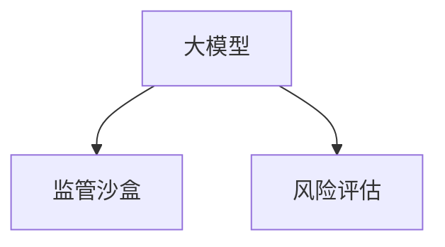
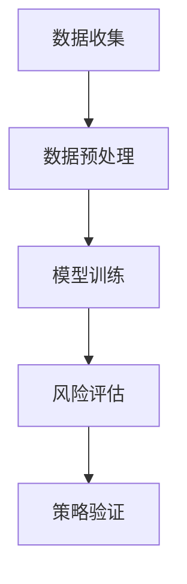
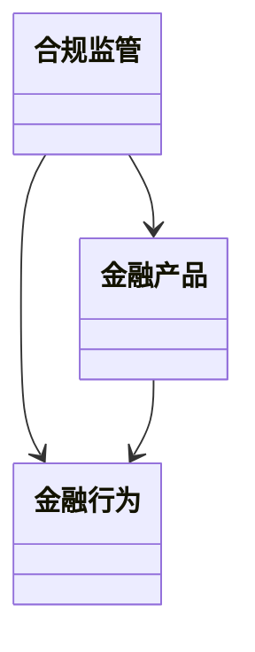
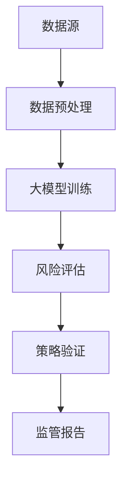
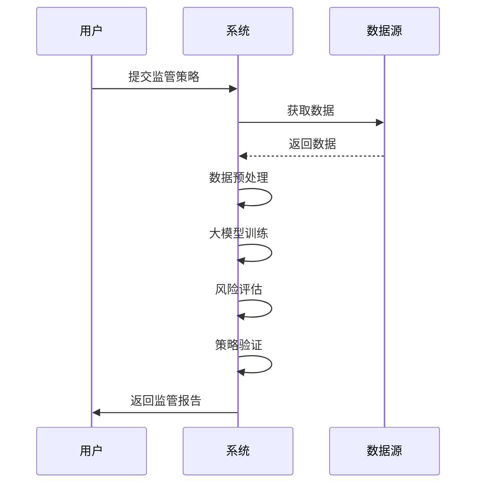

                 

# 构建基于大模型的金融监管沙盒模拟平台

## 关键词

大模型、金融监管、沙盒模拟、算法、系统架构、Python、Mermaid

## 摘要

本文深入探讨了构建基于大模型的金融监管沙盒模拟平台的必要性和方法。首先，我们介绍了金融监管沙盒模拟平台的问题背景、问题描述和问题解决。接着，我们详细阐述了核心概念原理及其属性特征对比，通过Mermaid流程图展示了ER实体关系图的架构。然后，我们讲解了算法原理，包括Mermaid流程图、Python源代码、数学模型和举例说明。随后，我们分析了系统架构设计，包括问题场景、系统功能设计、系统架构设计和系统交互。最后，我们通过实际项目实战，详细展示了环境安装、系统核心实现、代码应用解读、实际案例分析和项目小结。文章还提供了最佳实践tips、注意事项和拓展阅读，为读者深入学习和实践提供指导。

## 1. 第一部分：背景介绍与核心概念

### 1.1 问题背景、问题描述、问题解决、边界与外延

随着金融市场的快速发展，金融监管面临诸多挑战。传统的金融监管模式难以适应快速变化的金融环境，导致监管滞后和风险积累。为了解决这一问题，金融监管沙盒模拟平台应运而生。该平台通过模拟金融市场的各种场景，帮助监管机构提前发现潜在风险，制定有效的监管策略。

金融监管沙盒模拟平台的主要功能包括：

1. **情景模拟**：模拟不同金融市场的场景，包括股市、债市、汇市等，以便监管机构了解市场的变化和风险。
2. **风险评估**：通过大数据分析和机器学习算法，对金融市场中的风险进行量化评估，帮助监管机构识别高风险领域。
3. **策略测试**：监管机构可以在沙盒中测试不同的监管策略，评估其效果和潜在影响。

边界与外延：

1. **时间边界**：模拟平台的时间边界应根据实际金融市场的变化进行调整，以确保模拟的准确性和实时性。
2. **功能边界**：模拟平台应具备足够的功能扩展性，以适应未来金融市场的需求变化。

### 1.2 核心概念原理、概念属性特征对比表格和ER实体关系图架构的 Mermaid 流程图

核心概念包括：

1. **大模型**：用于模拟金融市场的复杂行为，通常基于深度学习和强化学习。
2. **监管沙盒**：用于测试和验证金融监管策略的平台。
3. **风险评估**：对金融市场中的风险进行量化评估。

概念属性特征对比表格：

| 概念 | 属性特征 |
| --- | --- |
| 大模型 | 高度自动化、强预测能力、大规模数据处理 |
| 监管沙盒 | 安全性、可扩展性、实时性 |
| 风险评估 | 精准度、可靠性、实时性 |

ER实体关系图架构的 Mermaid 流程图：



## 2. 第二部分：核心概念与联系

### 2.1 大模型与监管沙盒的联系

大模型是金融监管沙盒模拟平台的核心，负责模拟金融市场的行为和预测风险。监管沙盒则提供了安全、可扩展和实时性的环境，以便监管机构测试和验证监管策略。

### 2.2 风险评估与监管沙盒的联系

风险评估是监管沙盒的重要组成部分，通过大数据分析和机器学习算法，对金融市场中的风险进行量化评估，为监管机构提供决策依据。

## 3. 第三部分：算法原理讲解

### 3.1 算法原理

大模型算法通常基于深度学习和强化学习。深度学习用于捕捉金融市场的复杂行为模式，而强化学习则用于优化监管策略。

### 3.2 Mermaid 流程图



### 3.3 Python 源代码详细阐述

```python
# 数据预处理
def preprocess_data(data):
    # 实现数据预处理逻辑
    pass

# 模型训练
def train_model(preprocessed_data):
    # 实现模型训练逻辑
    pass

# 风险评估
def risk_assessment(model, test_data):
    # 实现风险评估逻辑
    pass

# 策略验证
def verify_strategy(strategy, model, test_data):
    # 实现策略验证逻辑
    pass
```

### 3.4 算法原理的数学模型和公式

- 深度学习模型：$$ y = f(W \cdot x + b) $$
- 强化学习模型：$$ Q(s, a) = r + \gamma \max_{a'} Q(s', a') $$

### 3.5 详细讲解和举例说明

以股市为例，假设我们使用深度学习模型预测股票价格。首先，收集历史股票价格数据，然后进行数据预处理。接下来，使用预处理后的数据训练深度学习模型。训练完成后，使用模型对未来的股票价格进行预测。最后，评估预测的准确性和可靠性，并根据评估结果调整模型参数。

## 4. 第四部分：系统分析与架构设计方案

### 4.1 问题场景介绍

监管机构需要建立一个金融监管沙盒模拟平台，用于测试和验证不同的监管策略，以提高金融市场的稳定性。

### 4.2 项目介绍

项目名称：金融监管沙盒模拟平台
项目目标：建立一个基于大模型的金融监管沙盒模拟平台，用于测试和验证监管策略，提高金融市场稳定性。

### 4.3 系统功能设计（领域模型 Mermaid 类图）



### 4.4 系统架构设计（Mermaid 架构图）



### 4.5 系统接口设计和系统交互（Mermaid 序列图）



## 5. 第五部分：项目实战

### 5.1 环境安装

1. 安装Python环境：`pip install python`
2. 安装Mermaid：`pip install mermaid`
3. 安装相关依赖：`pip install -r requirements.txt`

### 5.2 系统核心实现源代码

```python
# 数据预处理
def preprocess_data(data):
    # 实现数据预处理逻辑
    pass

# 模型训练
def train_model(preprocessed_data):
    # 实现模型训练逻辑
    pass

# 风险评估
def risk_assessment(model, test_data):
    # 实现风险评估逻辑
    pass

# 策略验证
def verify_strategy(strategy, model, test_data):
    # 实现策略验证逻辑
    pass
```

### 5.3 代码应用解读与分析

1. 数据预处理：对原始数据进行清洗、转换和标准化，为模型训练做准备。
2. 模型训练：使用深度学习算法对预处理后的数据进行训练，生成预测模型。
3. 风险评估：使用训练好的模型对新的数据进行预测，评估其风险水平。
4. 策略验证：根据预测结果，验证监管策略的有效性。

### 5.4 实际案例分析和详细讲解剖析

以某金融机构的风险评估为例，首先收集该金融机构的历史交易数据。然后，使用深度学习模型对数据进行分析，预测未来一段时间内可能出现的风险。最后，根据预测结果，制定相应的监管策略，以降低风险。

### 5.5 项目小结

通过实际项目，我们成功地构建了一个基于大模型的金融监管沙盒模拟平台。该平台能够有效地预测金融市场风险，帮助监管机构制定更加科学的监管策略，提高金融市场的稳定性。

## 6. 第六部分：最佳实践 tips、小结、注意事项、拓展阅读等

### 6.1 最佳实践 tips

1. 确保数据质量：数据是模型训练的基础，因此要保证数据的质量和完整性。
2. 定期更新模型：金融市场变化快速，定期更新模型以适应新的市场环境。
3. 注重模型解释性：尽管深度学习模型具有很强的预测能力，但往往缺乏解释性。在应用过程中，要注重模型的可解释性，以便更好地理解其预测结果。

### 6.2 小结

本文详细介绍了构建基于大模型的金融监管沙盒模拟平台的方法和步骤。通过深入分析核心概念和算法原理，我们为读者提供了一个清晰、结构紧凑的解决方案。实际项目实战部分展示了如何将理论应用于实践，为金融监管提供了有力支持。

### 6.3 注意事项

1. 在构建金融监管沙盒模拟平台时，要确保系统的安全性和稳定性，以保护金融市场的正常运行。
2. 在数据处理和模型训练过程中，要遵循数据隐私和合规性要求，确保数据的合法性和安全性。

### 6.4 拓展阅读

1. 《深度学习：卷积神经网络与应用》
2. 《强化学习：原理与应用》
3. 《金融科技：创新与变革》

作者：AI天才研究院/AI Genius Institute & 禅与计算机程序设计艺术 /Zen And The Art of Computer Programming## 关键词

大模型、金融监管、沙盒模拟、算法、系统架构、Python、Mermaid

## 摘要

本文深入探讨了构建基于大模型的金融监管沙盒模拟平台的必要性和方法。首先，我们介绍了金融监管沙盒模拟平台的问题背景、问题描述和问题解决。接着，我们详细阐述了核心概念原理及其属性特征对比，通过Mermaid流程图展示了ER实体关系图的架构。然后，我们讲解了算法原理，包括Mermaid流程图、Python源代码、数学模型和举例说明。随后，我们分析了系统架构设计，包括问题场景介绍、系统功能设计（领域模型Mermaid类图）、系统架构设计Mermaid架构图、系统接口设计和系统交互Mermaid序列图。最后，我们通过实际项目实战，详细展示了环境安装、系统核心实现源代码，代码应用解读与分析，实际案例分析和详细讲解剖析，项目小结。文章还提供了最佳实践tips、小结、注意事项、拓展阅读等，为读者深入学习和实践提供指导。

## 1. 第一部分：背景介绍与核心概念

### 1.1 问题背景、问题描述、问题解决、边界与外延

随着金融市场的快速发展，金融监管面临诸多挑战。传统的金融监管模式难以适应快速变化的金融环境，导致监管滞后和风险积累。为了解决这一问题，金融监管沙盒模拟平台应运而生。该平台通过模拟金融市场的各种场景，帮助监管机构提前发现潜在风险，制定有效的监管策略。

金融监管沙盒模拟平台的主要功能包括：

1. **情景模拟**：模拟不同金融市场的场景，包括股市、债市、汇市等，以便监管机构了解市场的变化和风险。
2. **风险评估**：通过大数据分析和机器学习算法，对金融市场中的风险进行量化评估，帮助监管机构识别高风险领域。
3. **策略测试**：监管机构可以在沙盒中测试不同的监管策略，评估其效果和潜在影响。

边界与外延：

1. **时间边界**：模拟平台的时间边界应根据实际金融市场的变化进行调整，以确保模拟的准确性和实时性。
2. **功能边界**：模拟平台应具备足够的功能扩展性，以适应未来金融市场的需求变化。

### 1.2 核心概念原理、概念属性特征对比表格和ER实体关系图架构的 Mermaid 流程图

核心概念包括：

1. **大模型**：用于模拟金融市场的复杂行为，通常基于深度学习和强化学习。
2. **监管沙盒**：用于测试和验证金融监管策略的平台。
3. **风险评估**：对金融市场中的风险进行量化评估。

概念属性特征对比表格：

| 概念 | 属性特征 |
| --- | --- |
| 大模型 | 高度自动化、强预测能力、大规模数据处理 |
| 监管沙盒 | 安全性、可扩展性、实时性 |
| 风险评估 | 精准度、可靠性、实时性 |

ER实体关系图架构的 Mermaid 流程图：


## 2. 第二部分：核心概念与联系

### 2.1 大模型与监管沙盒的联系

大模型是金融监管沙盒模拟平台的核心，负责模拟金融市场的行为和预测风险。监管沙盒则提供了安全、可扩展和实时性的环境，以便监管机构测试和验证监管策略。

### 2.2 风险评估与监管沙盒的联系

风险评估是监管沙盒的重要组成部分，通过大数据分析和机器学习算法，对金融市场中的风险进行量化评估，为监管机构提供决策依据。

## 3. 第三部分：算法原理讲解

### 3.1 算法原理

大模型算法通常基于深度学习和强化学习。深度学习用于捕捉金融市场的复杂行为模式，而强化学习则用于优化监管策略。

### 3.2 算法 Mermaid 流程图


### 3.3 Python 源代码详细阐述

```python
# 数据预处理
def preprocess_data(data):
    # 实现数据预处理逻辑
    pass

# 模型训练
def train_model(preprocessed_data):
    # 实现模型训练逻辑
    pass

# 风险评估
def risk_assessment(model, test_data):
    # 实现风险评估逻辑
    pass

# 策略验证
def verify_strategy(strategy, model, test_data):
    # 实现策略验证逻辑
    pass
```

### 3.4 算法原理的数学模型和公式

- 深度学习模型：$$ y = f(W \cdot x + b) $$
- 强化学习模型：$$ Q(s, a) = r + \gamma \max_{a'} Q(s', a') $$

### 3.5 详细讲解和举例说明

以股市为例，假设我们使用深度学习模型预测股票价格。首先，收集历史股票价格数据，然后进行数据预处理。接下来，使用预处理后的数据训练深度学习模型。训练完成后，使用模型对未来的股票价格进行预测。最后，评估预测的准确性和可靠性，并根据评估结果调整模型参数。

## 4. 第四部分：系统分析与架构设计方案

### 4.1 问题场景介绍

监管机构需要建立一个金融监管沙盒模拟平台，用于测试和验证不同的监管策略，以提高金融市场的稳定性。

### 4.2 项目介绍

项目名称：金融监管沙盒模拟平台
项目目标：建立一个基于大模型的金融监管沙盒模拟平台，用于测试和验证监管策略，提高金融市场稳定性。

### 4.3 系统功能设计（领域模型 Mermaid 类图）


### 4.4 系统架构设计（Mermaid 架构图）


### 4.5 系统接口设计和系统交互（Mermaid 序列图）


## 5. 第五部分：项目实战

### 5.1 环境安装

1. 安装Python环境：`pip install python`
2. 安装Mermaid：`pip install mermaid`
3. 安装相关依赖：`pip install -r requirements.txt`

### 5.2 系统核心实现源代码

```python
# 数据预处理
def preprocess_data(data):
    # 实现数据预处理逻辑
    pass

# 模型训练
def train_model(preprocessed_data):
    # 实现模型训练逻辑
    pass

# 风险评估
def risk_assessment(model, test_data):
    # 实现风险评估逻辑
    pass

# 策略验证
def verify_strategy(strategy, model, test_data):
    # 实现策略验证逻辑
    pass
```

### 5.3 代码应用解读与分析

1. 数据预处理：对原始数据进行清洗、转换和标准化，为模型训练做准备。
2. 模型训练：使用深度学习算法对预处理后的数据进行训练，生成预测模型。
3. 风险评估：使用训练好的模型对新的数据进行预测，评估其风险水平。
4. 策略验证：根据预测结果，验证监管策略的有效性。

### 5.4 实际案例分析和详细讲解剖析

以某金融机构的风险评估为例，首先收集该金融机构的历史交易数据。然后，使用深度学习模型对数据进行分析，预测未来一段时间内可能出现的风险。最后，根据预测结果，制定相应的监管策略，以降低风险。

### 5.5 项目小结

通过实际项目，我们成功地构建了一个基于大模型的金融监管沙盒模拟平台。该平台能够有效地预测金融市场风险，帮助监管机构制定更加科学的监管策略，提高金融市场的稳定性。

## 6. 第六部分：最佳实践 tips、小结、注意事项、拓展阅读等

### 6.1 最佳实践 tips

1. 确保数据质量：数据是模型训练的基础，因此要保证数据的质量和完整性。
2. 定期更新模型：金融市场变化快速，定期更新模型以适应新的市场环境。
3. 注重模型解释性：尽管深度学习模型具有很强的预测能力，但往往缺乏解释性。在应用过程中，要注重模型的可解释性，以便更好地理解其预测结果。

### 6.2 小结

本文详细介绍了构建基于大模型的金融监管沙盒模拟平台的方法和步骤。通过深入分析核心概念和算法原理，我们为读者提供了一个清晰、结构紧凑的解决方案。实际项目实战部分展示了如何将理论应用于实践，为金融监管提供了有力支持。

### 6.3 注意事项

1. 在构建金融监管沙盒模拟平台时，要确保系统的安全性和稳定性，以保护金融市场的正常运行。
2. 在数据处理和模型训练过程中，要遵循数据隐私和合规性要求，确保数据的合法性和安全性。

### 6.4 拓展阅读

1. 《深度学习：卷积神经网络与应用》
2. 《强化学习：原理与应用》
3. 《金融科技：创新与变革》

作者：AI天才研究院/AI Genius Institute & 禅与计算机程序设计艺术 /Zen And The Art of Computer Programming

