                 

# 构建基于知识图谱的金融产品全生命周期风险动态评估系统

> 关键词：知识图谱、金融产品、风险动态评估、生命周期管理、人工智能

> 摘要：本文将深入探讨构建基于知识图谱的金融产品全生命周期风险动态评估系统的必要性和方法。通过对知识图谱的基本概念、构建方法以及金融产品全生命周期风险识别的详细分析，我们旨在为读者提供一个清晰、系统的构建指导，帮助金融机构更好地应对复杂多变的市场环境。

----------------------------------------------------------------

### 第一部分：导论

#### 第1章：问题背景与目标

##### 1.1.1 问题背景

##### 1.1.1.1 金融产品全生命周期风险管理的必要性

在现代金融市场环境中，金融产品的多样化和复杂性不断增加，金融机构面临着日益严峻的风险管理挑战。金融产品的全生命周期风险管理包括从产品设计、销售、运营到退市的各个阶段，涵盖了识别、评估、监控和应对风险的整个过程。

**1.1.1.1.1 金融产品风险管理的现状与挑战**

当前，金融产品风险管理主要面临以下挑战：

- **信息孤岛与数据质量问题**：金融产品涉及的数据种类繁多，且分散在不同系统和管理环节，数据质量问题严重影响风险识别和评估的准确性。
- **风险评估的静态性**：现有风险管理方法大多依赖于静态数据，无法及时捕捉市场动态变化，导致风险预警不及时。
- **风险识别的局限性**：传统风险管理方法难以全面识别金融产品的潜在风险，特别是在跨市场和跨领域的复杂产品中。

**1.1.1.1.2 知识图谱在金融风险管理中的应用前景**

知识图谱作为一种新兴的技术手段，能够为金融产品全生命周期风险管理提供有效的解决方案。其核心优势包括：

- **信息整合与关联**：知识图谱能够整合不同来源的数据，建立实体之间的关联关系，实现对金融产品的全面了解。
- **动态性与可扩展性**：知识图谱支持实时的数据更新和扩展，能够动态反映市场变化，提高风险评估的实时性和准确性。
- **自动化推理能力**：知识图谱具备自动化推理功能，能够基于已知信息推断出新的风险点，提高风险识别的全面性和深度。

##### 1.1.1.2 金融产品全生命周期风险动态评估的需求分析

金融产品全生命周期风险动态评估的需求主要包括以下几个方面：

- **风险识别与预警**：通过知识图谱，实时监控金融产品的运行状态，识别潜在风险，实现预警机制。
- **风险评估与分类**：利用知识图谱进行深度分析，对金融产品进行风险评估和分类，为风险决策提供依据。
- **风险监控与调整**：基于知识图谱的风险评估结果，动态调整风险管理策略，确保风险在可控范围内。

##### 1.1.1.3 书籍目标与结构概述

**1.1.1.3.1 书籍的整体目标**

本书旨在：

- **帮助读者理解金融产品全生命周期风险管理的重要性**，认识知识图谱在现代金融风险管理中的关键作用。
- **深入探讨知识图谱在金融风险管理中的应用**，包括构建方法、技术实现和应用场景。
- **提供构建金融产品全生命周期风险动态评估系统的实际指导**，使读者能够将理论知识应用到实际项目中。

**1.1.1.3.2 书籍的结构安排**

本书分为以下几部分：

- **第一部分：导论**：介绍金融产品全生命周期风险管理的背景和目标。
- **第二部分：知识图谱基础**：详细讲解知识图谱的基本概念、构建方法和应用领域。
- **第三部分：金融产品全生命周期风险识别**：分析金融产品全生命周期风险识别的关键环节。
- **第四部分：知识图谱在金融产品风险管理中的应用**：探讨知识图谱在金融风险管理中的应用实践。

**1.1.1.3.3 读者预期收获**

通过阅读本书，读者可以：

- **掌握知识图谱的基本原理和构建方法**，为后续应用奠定基础。
- **理解金融产品全生命周期风险管理的核心流程**，掌握风险识别和评估的关键技巧。
- **了解知识图谱在金融风险管理中的应用案例**，获得实际操作的经验和启示。

----------------------------------------------------------------

## 第二部分：知识图谱基础

### 第2章：知识图谱概述

#### 2.1 知识图谱的基本概念

##### 2.1.1 知识图谱的定义

知识图谱（Knowledge Graph）是一种用于表示实体（如人、地点、事物）及其相互关系的语义网络。它通过链接不同实体和属性，形成一个复杂的网络结构，使得信息在系统中得以高效组织、检索和利用。

**2.1.1.1 知识图谱的基本构成要素**

知识图谱主要由以下三个基本构成要素组成：

- **实体（Entity）**：知识图谱中的核心元素，表示各种具体的对象，如人、地点、产品等。
- **属性（Attribute）**：描述实体的特征或属性，如人的年龄、地点的经纬度等。
- **关系（Relationship）**：表示实体之间的关联，如朋友关系、地理位置等。

**2.1.1.2 知识图谱与传统数据库的区别**

与传统数据库相比，知识图谱具有以下特点：

- **数据结构不同**：知识图谱以图结构存储数据，而传统数据库以表结构存储数据。
- **语义表示能力**：知识图谱能够表示实体和实体之间的复杂语义关系，而传统数据库难以实现。
- **查询能力**：知识图谱支持基于语义的复杂查询，而传统数据库主要支持结构化查询。

##### 2.1.2 知识图谱的核心特性

**2.1.2.1 扩展性和可扩展性**

知识图谱具有高度的扩展性和可扩展性，能够适应不断变化的数据需求和应用场景。通过动态更新和扩展，知识图谱能够持续优化和提升其表示能力和查询效率。

**2.1.2.2 可视化和可解释性**

知识图谱的可视化特性使其在数据分析中具有独特的优势。通过图形化的方式展示实体和关系，用户可以直观地理解数据结构和信息关联。

**2.1.2.3 自动化推理能力**

知识图谱的自动化推理能力是其核心优势之一。通过预设的逻辑规则和算法，知识图谱能够自动推导出新的结论，实现对数据的深度挖掘和分析。

#### 2.2 知识图谱的应用领域

##### 2.2.1 金融领域的知识图谱应用

在金融领域，知识图谱的应用主要体现在以下几个方面：

- **风险管理**：通过知识图谱，金融机构可以全面了解金融产品的结构、风险因素及其关联关系，实现风险的精准识别和评估。
- **客户关系管理**：知识图谱可以帮助金融机构建立全面的客户画像，实现个性化服务和风险控制。
- **投资分析**：知识图谱能够整合大量的市场数据和投资信息，为投资决策提供有力支持。

##### 2.2.2 其他领域知识图谱的应用

知识图谱的应用不仅限于金融领域，还在其他多个领域展现出了巨大潜力：

- **电子商务**：通过知识图谱，电商平台可以实现商品推荐、价格比对等功能，提升用户体验。
- **医疗保健**：知识图谱可以帮助医疗系统建立患者健康档案、药物关系网络等，支持精准医疗和疾病预测。
- **智能交通**：知识图谱能够整合交通数据，实现智能路线规划、交通流量监控等，提升城市交通管理水平。

----------------------------------------------------------------

### 第3章：知识图谱的构建方法

#### 3.1 数据采集与预处理

**3.1.1 数据源的选择与获取**

构建知识图谱的第一步是选择合适的数据源。金融领域的数据源包括内部数据和外部数据：

- **内部数据**：包括客户信息、交易记录、资产负债表等。
- **外部数据**：包括市场数据、行业报告、新闻资讯等。

**3.1.2 非结构化数据的处理**

非结构化数据如文本、图片和视频需要经过处理才能转换为知识图谱的数据格式。常用的方法包括：

- **文本处理**：使用自然语言处理技术提取实体和关系。
- **图像处理**：使用计算机视觉技术识别图像中的对象和场景。

**3.1.3 数据清洗与转换**

数据清洗是确保数据质量的重要步骤。主要任务包括：

- **数据去重**：去除重复数据，避免冗余。
- **规范化**：统一数据格式和单位，确保数据的一致性。
- **质量评估与修复**：检查数据完整性、准确性和一致性，修复错误数据。

##### 3.1.4 数据质量评估与修复

数据质量评估与修复包括以下几个方面：

- **完整性**：检查数据是否完整，是否存在缺失值。
- **准确性**：检查数据是否准确，是否存在错误。
- **一致性**：检查数据在不同来源和系统中是否一致。

#### 3.2 知识图谱的表示方法

知识图谱的表示方法主要有以下几种：

- **实体-关系模型（ER Model）**：将实体和关系以节点和边的形式表示，是最常用的知识图谱表示方法。
- **图论表示方法**：使用图论的基本概念和算法来表示知识图谱，如邻接矩阵、邻接表等。

##### 3.2.1 实体-关系模型

**3.2.1.1 实体与属性的表示**

实体（如客户、产品）和属性（如年龄、价格）是知识图谱的基本元素。实体用节点表示，属性用标签和属性值表示。

**3.2.1.2 关系的表示与建模**

关系（如购买、关联）用边表示。边的类型和方向表示关系的性质。例如，客户-购买-产品表示客户购买产品的关系。

##### 3.2.2 图论表示方法

**3.2.2.1 图的基本概念**

图（Graph）由节点（Vertex）和边（Edge）组成。节点表示实体，边表示实体之间的关系。

**3.2.2.2 图的存储与查询优化**

图的存储与查询优化是知识图谱构建的关键。常用的存储结构包括邻接矩阵和邻接表。查询优化方法包括索引、图遍历算法和图匹配算法等。

#### 3.3 知识图谱的构建流程

**3.3.1 数据导入与存储**

数据导入与存储是知识图谱构建的第一步。常用的图数据库包括Neo4j、Amazon Neptune等。数据存储时，需要将实体、属性和关系转换为图结构。

**3.3.2 知识图谱的扩展与更新**

知识图谱的扩展与更新是保持其动态性和实时性的关键。主要包括：

- **实体的动态调整**：根据新数据更新实体信息。
- **关系的动态调整**：根据新数据更新实体之间的关系。
- **数据的增量更新策略**：采用增量更新方法，仅更新变化的数据，提高更新效率。

----------------------------------------------------------------

### 第4章：金融产品全生命周期风险识别

#### 4.1 风险识别的基本概念

##### 4.1.1 风险的定义与分类

**4.1.1.1 风险的定义**

风险是指在一定时间和条件下，不确定性事件对目标造成不利影响的可能性。在金融领域，风险主要包括市场风险、信用风险、操作风险等。

**4.1.1.2 风险的分类**

根据风险的性质和来源，可以将风险分为以下几类：

- **市场风险**：由于市场波动导致金融产品价值变化的风险。
- **信用风险**：由于借款人或市场参与者违约导致金融损失的风险。
- **操作风险**：由于内部操作失误、系统故障或外部事件导致的风险。
- **法律风险**：由于法律法规变动导致的风险。

##### 4.1.2 风险识别的重要性

风险识别是风险管理的基础环节。其重要性体现在以下几个方面：

- **预防潜在风险**：通过识别潜在风险，金融机构可以提前采取预防措施，降低风险发生的可能性。
- **提高风险管理效率**：全面、准确的风险识别有助于提高风险管理效率，避免资源浪费。
- **支持风险决策**：风险识别结果为风险决策提供数据支持，有助于制定科学的风险管理策略。

##### 4.1.2.1 风险识别在风险管理中的作用

风险识别在风险管理中扮演着关键角色，主要包括以下几个方面：

- **评估风险水平**：通过对风险因素的识别和评估，确定风险的严重程度。
- **制定风险策略**：根据风险识别结果，制定相应的风险控制措施和策略。
- **监控风险变化**：通过持续的风险识别和评估，监控风险的变化趋势，及时调整风险策略。

##### 4.1.2.2 风险识别与监控的关系

风险识别与监控相互关联、相互促进。风险识别是监控的前提，而监控是风险识别的延伸。具体关系如下：

- **风险识别为监控提供依据**：通过风险识别，确定监控的关键风险点和指标。
- **监控结果反馈风险识别**：通过监控，验证风险识别的准确性，为下一次风险识别提供数据支持。

#### 4.2 金融产品全生命周期风险识别的关键环节

##### 4.2.1 产品设计阶段

在产品设计阶段，风险识别的主要任务包括：

- **产品结构分析**：分析产品的结构和组成，确定潜在的风险因素。
- **风险评估**：评估产品在各个阶段的风险水平，制定相应的风险管理措施。

##### 4.2.1.1 产品结构分析

产品结构分析旨在了解金融产品的组成和功能。具体步骤如下：

- **分解产品**：将金融产品分解为各个组成部分，如资产、负债、期权等。
- **识别风险因素**：分析每个组成部分的风险因素，如市场波动、信用风险等。

##### 4.2.1.2 风险因素识别

风险因素识别是产品设计阶段的核心任务。具体步骤如下：

- **数据收集**：收集与产品相关的数据，如市场数据、历史交易数据等。
- **风险分析**：使用统计方法和模型对风险因素进行分析和评估。
- **风险报告**：撰写风险分析报告，总结产品在各个阶段的风险水平。

##### 4.2.2 销售与推广阶段

在销售与推广阶段，风险识别的主要任务包括：

- **市场风险识别**：分析市场变化对产品的影响，识别潜在的市场风险。
- **客户风险识别**：评估客户信用风险，确保客户资质。

##### 4.2.2.1 市场风险识别

市场风险识别的具体步骤如下：

- **市场数据收集**：收集与市场相关的数据，如宏观经济指标、行业数据等。
- **市场分析**：使用统计方法和模型对市场风险进行分析。
- **市场报告**：撰写市场风险分析报告，为销售与推广提供参考。

##### 4.2.2.2 客户风险识别

客户风险识别的具体步骤如下：

- **客户数据收集**：收集与客户相关的数据，如信用记录、财务状况等。
- **客户分析**：使用统计方法和模型对客户风险进行分析。
- **客户报告**：撰写客户风险分析报告，为销售与推广提供参考。

##### 4.2.3 运营与维护阶段

在运营与维护阶段，风险识别的主要任务包括：

- **运营风险识别**：识别日常运营中可能出现的风险，如系统故障、操作失误等。
- **维护风险识别**：评估产品维护过程中可能出现的风险，如技术升级、故障修复等。

##### 4.2.3.1 运营风险识别

运营风险识别的具体步骤如下：

- **运营数据收集**：收集与运营相关的数据，如交易数据、系统日志等。
- **运营分析**：使用统计方法和模型对运营风险进行分析。
- **运营报告**：撰写运营风险分析报告，为日常运营提供参考。

##### 4.2.3.2 维护风险识别

维护风险识别的具体步骤如下：

- **维护数据收集**：收集与维护相关的数据，如系统升级日志、故障报告等。
- **维护分析**：使用统计方法和模型对维护风险进行分析。
- **维护报告**：撰写维护风险分析报告，为维护工作提供参考。

##### 4.2.4 退市阶段

在退市阶段，风险识别的主要任务包括：

- **退市风险识别**：识别产品退市过程中可能出现的风险，如资产变现风险、市场流动性风险等。
- **退出策略制定**：根据退市风险分析结果，制定相应的退出策略。

##### 4.2.4.1 退市风险识别

退市风险识别的具体步骤如下：

- **退市数据收集**：收集与退市相关的数据，如市场数据、产品交易记录等。
- **退市分析**：使用统计方法和模型对退市风险进行分析。
- **退市报告**：撰写退市风险分析报告，为退市决策提供参考。

##### 4.2.4.2 退出策略制定

退出策略制定的具体步骤如下：

- **风险分析**：根据退市风险分析结果，评估退出方案的可行性。
- **策略选择**：选择最优的退出策略，如资产变现、重组等。
- **策略实施**：制定详细的退出实施计划，确保退市过程的顺利进行。

----------------------------------------------------------------

## 第三部分：知识图谱在金融产品风险管理中的应用

### 第5章：知识图谱在风险识别中的应用

#### 5.1 知识图谱在风险识别中的优势

知识图谱在风险识别中具有独特的优势，包括以下几个方面：

- **全面性**：知识图谱能够整合来自不同来源的数据，构建全面的风险视图。
- **关联性**：知识图谱能够揭示实体之间的复杂关联关系，帮助识别潜在的风险因素。
- **动态性**：知识图谱支持实时数据更新，能够动态捕捉风险变化，提高识别的准确性。

#### 5.2 知识图谱在风险识别中的具体应用

**5.2.1 实体关系建模**

在风险识别中，知识图谱首先需要对金融产品及其相关实体进行关系建模。以下是一个简单的实体关系建模示例：

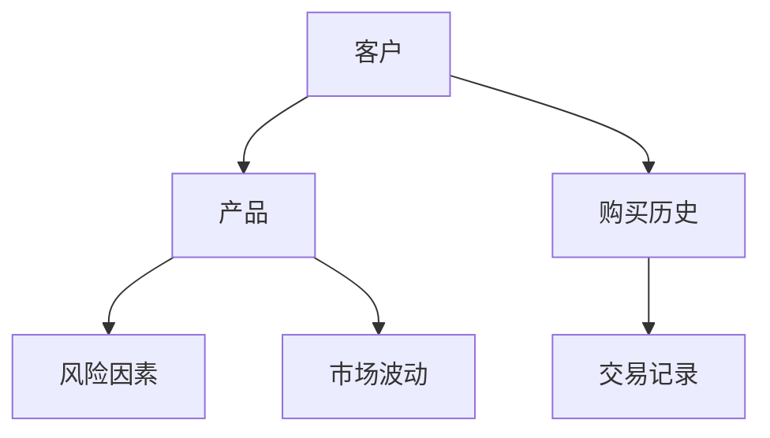

在这个示例中，客户（A）购买了产品（B），并产生了购买历史（C）。产品（B）具有风险因素（D）和市场波动（E），而交易记录（F）是购买历史的子集。

**5.2.2 关键风险因素识别**

通过知识图谱，可以识别出关键风险因素。以下是一个关键风险因素识别的示例：

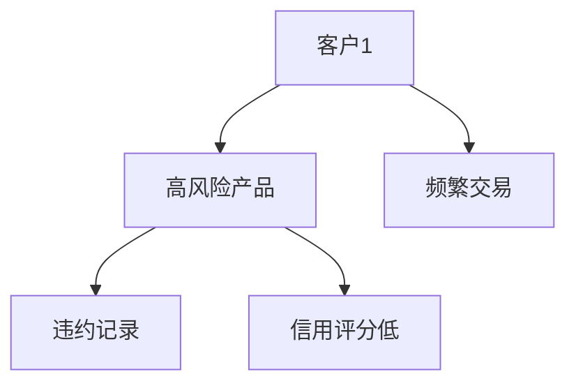

在这个示例中，客户1购买了高风险产品，并且有频繁的交易记录。这个客户的风险因素包括违约记录和信用评分低。

**5.2.3 实时监控与预警**

知识图谱支持实时的风险监控与预警。以下是一个实时监控与预警的示例：

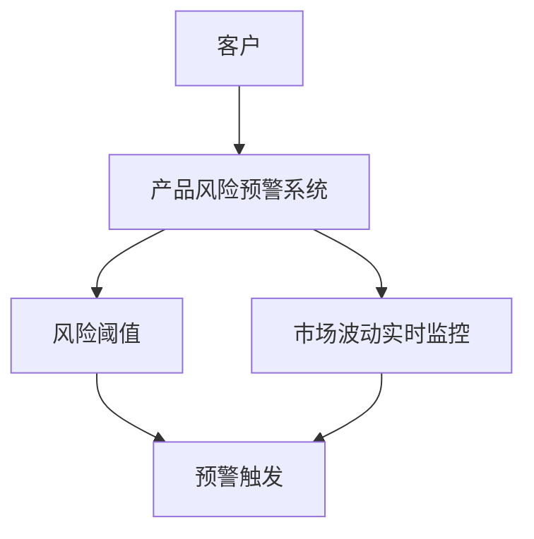

在这个示例中，客户的风险因素超过了设定的阈值，系统会实时触发预警。

#### 5.3 知识图谱在风险识别中的实践案例

**5.3.1 案例背景**

某金融机构在开展某金融产品的销售时，需要识别和评估潜在的风险。

**5.3.2 数据收集**

收集了以下数据：

- 客户信息：包括年龄、收入、职业等。
- 产品信息：包括产品类型、利率、期限等。
- 历史交易数据：包括交易金额、交易频率等。
- 市场数据：包括利率、通货膨胀率等。

**5.3.3 数据预处理**

对收集到的数据进行清洗、去重和规范化处理，确保数据质量。

**5.3.4 实体关系建模**

根据数据，建立了以下实体关系模型：


**5.3.5 风险因素识别**

通过知识图谱，识别出以下风险因素：

- 客户年龄：年轻客户风险较高。
- 产品类型：高风险产品的风险较高。
- 市场波动：市场波动较大时，风险增加。

**5.3.6 实时监控与预警**

建立实时监控与预警系统，根据风险因素设置预警阈值。当风险因素超过阈值时，系统会触发预警。


**5.3.7 案例总结**

通过知识图谱，该金融机构能够全面、准确地识别和评估金融产品的风险，提高了风险管理的效率，降低了风险损失。

----------------------------------------------------------------

### 第6章：知识图谱在风险评估中的应用

#### 6.1 知识图谱在风险评估中的优势

知识图谱在风险评估中具有以下优势：

- **全局视角**：知识图谱能够整合来自不同来源的数据，提供全局的风险评估视角。
- **关联分析**：知识图谱能够揭示实体之间的复杂关联关系，为风险评估提供更深入的洞察。
- **动态更新**：知识图谱支持实时数据更新，能够动态反映市场变化，提高风险评估的准确性。

#### 6.2 知识图谱在风险评估中的具体应用

**6.2.1 风险评估模型构建**

在知识图谱中，可以构建风险评估模型。以下是一个简单的风险评估模型示例：

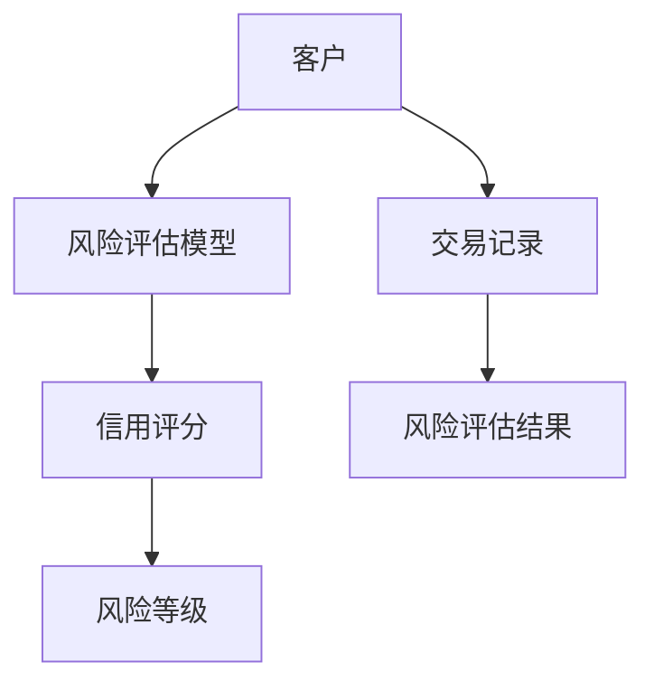

在这个示例中，客户的信用评分和交易记录将用于计算风险评估结果，进而确定风险等级。

**6.2.2 风险等级划分**

根据风险评估结果，可以将风险等级划分为不同级别。以下是一个简单的风险等级划分示例：

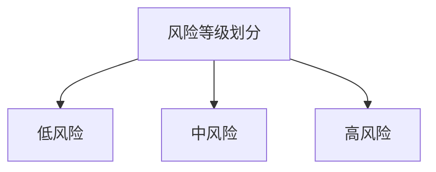

在这个示例中，信用评分和交易记录将用于计算风险评估得分，进而确定风险等级。

**6.2.3 动态风险评估**

知识图谱支持动态风险评估，可以根据实时数据更新风险评估模型。以下是一个动态风险评估的示例：

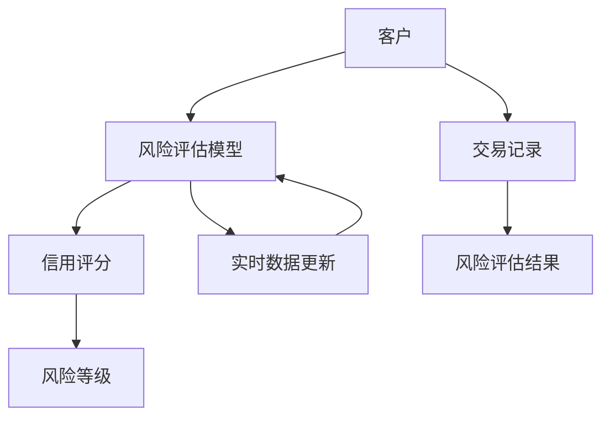

在这个示例中，当客户的数据发生变化时，系统会实时更新风险评估模型，计算新的风险评估结果。

#### 6.3 知识图谱在风险评估中的实践案例

**6.3.1 案例背景**

某金融机构需要对某金融产品的风险评估进行优化，以提高风险评估的准确性和实时性。

**6.3.2 数据收集**

收集了以下数据：

- 客户信息：包括年龄、收入、职业等。
- 产品信息：包括产品类型、利率、期限等。
- 历史交易数据：包括交易金额、交易频率等。
- 市场数据：包括利率、通货膨胀率等。

**6.3.3 数据预处理**

对收集到的数据进行清洗、去重和规范化处理，确保数据质量。

**6.3.4 实体关系建模**

根据数据，建立了以下实体关系模型：


**6.3.5 风险评估模型构建**

根据实体关系模型，构建了以下风险评估模型：


**6.3.6 动态风险评估**

建立动态风险评估系统，根据实时数据更新风险评估模型。以下是一个动态风险评估的示例：


**6.3.7 案例总结**

通过知识图谱，该金融机构能够实现动态、准确的风险评估，提高了风险管理的效率和准确性。

----------------------------------------------------------------

### 第7章：知识图谱在风险监控与调整中的应用

#### 7.1 知识图谱在风险监控与调整中的优势

知识图谱在风险监控与调整中具有以下优势：

- **实时监控**：知识图谱能够实时监控风险变化，提供及时的风险预警。
- **动态调整**：知识图谱支持风险策略的动态调整，确保风险管理策略与市场变化同步。
- **全面关联**：知识图谱能够揭示风险因素之间的复杂关联关系，提供更全面的监控视角。

#### 7.2 知识图谱在风险监控与调整中的具体应用

**7.2.1 实时风险监控**

知识图谱支持实时风险监控，可以实时捕捉风险变化。以下是一个实时风险监控的示例：

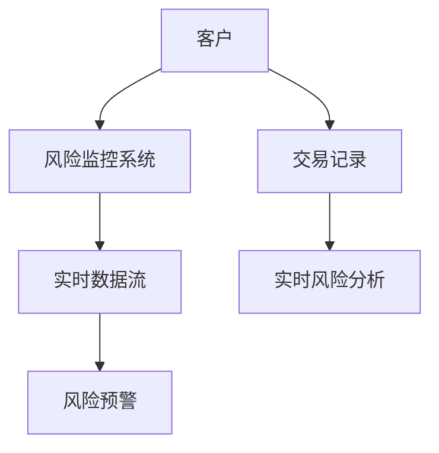

在这个示例中，风险监控系统实时监控客户的交易记录，并根据实时数据流分析风险，当风险超过阈值时，触发预警。

**7.2.2 动态风险调整**

知识图谱支持风险策略的动态调整，可以根据实时风险监控结果调整风险管理策略。以下是一个动态风险调整的示例：

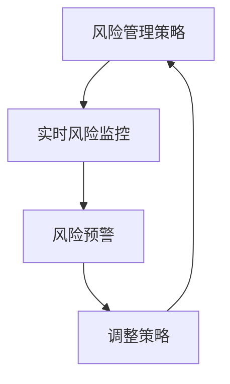

在这个示例中，当风险预警触发时，系统会根据实时风险监控结果调整风险管理策略，确保风险管理策略与市场变化同步。

**7.2.3 风险调整策略优化**

知识图谱可以基于历史数据和实时监控数据，优化风险调整策略。以下是一个风险调整策略优化的示例：

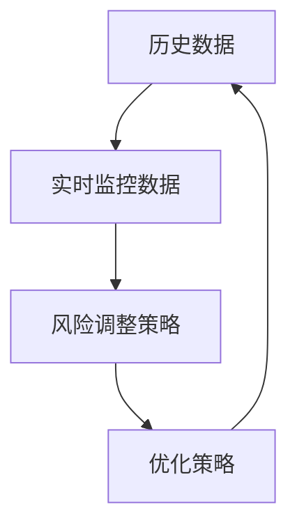

在这个示例中，历史数据和实时监控数据用于优化风险调整策略，确保策略的有效性和准确性。

#### 7.3 知识图谱在风险监控与调整中的实践案例

**7.3.1 案例背景**

某金融机构需要对金融产品的风险监控与调整进行优化，以提高风险管理的效率和准确性。

**7.3.2 数据收集**

收集了以下数据：

- 客户信息：包括年龄、收入、职业等。
- 产品信息：包括产品类型、利率、期限等。
- 历史交易数据：包括交易金额、交易频率等。
- 市场数据：包括利率、通货膨胀率等。

**7.3.3 数据预处理**

对收集到的数据进行清洗、去重和规范化处理，确保数据质量。

**7.3.4 实体关系建模**

根据数据，建立了以下实体关系模型：


**7.3.5 实时风险监控**

建立实时风险监控系统，根据客户的交易记录和市场数据，实时分析风险，并触发预警。以下是一个实时风险监控的示例：


**7.3.6 动态风险调整**

根据实时风险监控结果，动态调整风险管理策略。以下是一个动态风险调整的示例：


**7.3.7 案例总结**

通过知识图谱，该金融机构能够实现实时、动态的风险监控与调整，提高了风险管理的效率和准确性。

----------------------------------------------------------------

## 第四部分：项目实战

### 第8章：项目环境搭建与系统设计

#### 8.1 项目背景

在金融行业中，风险管理是一个至关重要的环节。随着金融产品的多样化和复杂化，传统的风险管理方法已经难以应对不断变化的市场环境。为了提升金融风险管理的效率和准确性，本项目旨在构建一个基于知识图谱的金融产品全生命周期风险动态评估系统。

#### 8.2 系统需求分析

本系统的需求分析主要包括以下几个方面：

- **数据整合**：整合来自不同来源的数据，包括内部数据和外部数据，如客户信息、交易记录、市场数据等。
- **风险识别**：基于知识图谱，识别金融产品在全生命周期中的潜在风险。
- **风险评估**：利用知识图谱进行深度分析，对金融产品进行风险评估和分类。
- **风险监控**：实时监控金融产品的风险变化，触发预警机制。
- **动态调整**：根据风险监控结果，动态调整风险管理策略。

#### 8.3 系统架构设计

本系统的架构设计分为以下几个层次：

- **数据层**：负责数据的存储和管理，包括内部数据和外部分数据。
- **知识图谱层**：基于Neo4j等图数据库构建知识图谱，整合数据，建立实体和关系。
- **应用层**：提供风险识别、风险评估、风险监控和动态调整等核心功能。
- **接口层**：提供与外部系统的接口，实现数据交换和功能调用。
- **展示层**：提供用户界面，展示系统运行状态和风险分析结果。

以下是一个简化的系统架构图：

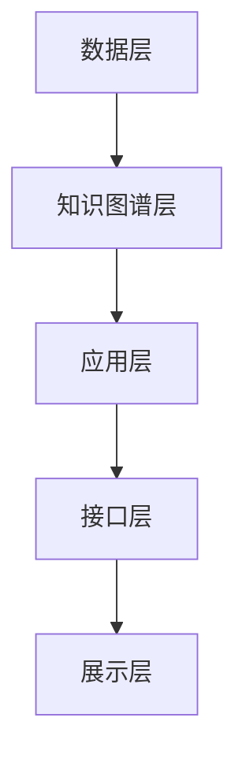

#### 8.4 系统核心功能实现

**8.4.1 数据采集与预处理**

数据采集与预处理是构建知识图谱的基础。首先，从内部系统和外部数据源收集数据，如客户信息、交易记录、市场数据等。然后，对数据进行清洗、去重和规范化处理，确保数据质量。

**8.4.2 知识图谱构建**

使用Neo4j等图数据库构建知识图谱。实体表示金融产品、客户等，属性表示实体特征，如产品类型、客户年龄等，关系表示实体之间的关联，如客户购买产品、产品受市场波动影响等。

**8.4.3 风险识别与预警**

基于知识图谱，识别金融产品在全生命周期中的潜在风险。包括风险识别算法的设计和实现，如基于关联规则的算法、基于机器学习的算法等。当风险超过阈值时，触发预警机制。

**8.4.4 风险评估与分类**

利用知识图谱进行深度分析，对金融产品进行风险评估和分类。包括风险评估模型的构建、风险等级划分等。评估结果用于指导风险管理策略的制定。

**8.4.5 风险监控与动态调整**

建立实时风险监控机制，根据实时数据更新风险评估结果。当风险等级发生变化时，动态调整风险管理策略，确保风险在可控范围内。

#### 8.5 项目实战案例

**8.5.1 案例背景**

某金融机构需要对其金融产品进行全生命周期风险管理，以提高风险管理的效率和准确性。

**8.5.2 数据收集**

收集了以下数据：

- 客户信息：包括年龄、收入、职业等。
- 产品信息：包括产品类型、利率、期限等。
- 历史交易数据：包括交易金额、交易频率等。
- 市场数据：包括利率、通货膨胀率等。

**8.5.3 数据预处理**

对收集到的数据进行清洗、去重和规范化处理，确保数据质量。

**8.5.4 知识图谱构建**

使用Neo4j构建知识图谱，实体包括客户、产品、交易记录等，属性包括年龄、收入、产品类型等，关系包括客户购买产品、产品受市场波动影响等。

**8.5.5 风险识别与预警**

基于知识图谱，识别金融产品在全生命周期中的潜在风险。设置风险阈值，当风险超过阈值时，触发预警机制。

**8.5.6 风险评估与分类**

利用知识图谱进行深度分析，对金融产品进行风险评估和分类。评估结果用于指导风险管理策略的制定。

**8.5.7 风险监控与动态调整**

建立实时风险监控机制，根据实时数据更新风险评估结果。当风险等级发生变化时，动态调整风险管理策略。

**8.5.8 案例总结**

通过本项目，金融机构能够实现实时、动态的风险管理，提高了风险管理的效率和准确性，降低了风险损失。

----------------------------------------------------------------

### 第9章：系统分析与架构设计

#### 9.1 问题场景介绍

在现代金融市场中，金融机构面临着越来越多的风险，包括市场风险、信用风险和操作风险等。为了更好地应对这些风险，需要构建一个全面、实时、动态的风险评估系统，以便及时识别和应对潜在的风险。

#### 9.2 项目介绍

本项目旨在构建一个基于知识图谱的金融产品全生命周期风险动态评估系统，实现对金融产品的全面风险管理。系统包括数据采集、知识图谱构建、风险识别、风险评估、风险监控和动态调整等功能。

#### 9.3 系统功能设计（领域模型）

以下是一个简化的系统功能设计（领域模型），用于描述系统的主要功能模块及其相互关系：

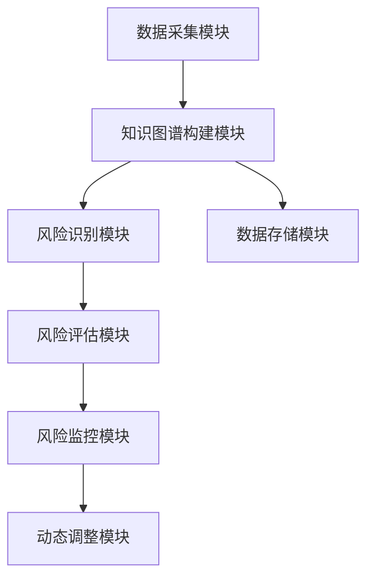

**9.3.1 数据采集模块**

数据采集模块负责从不同数据源收集数据，包括内部数据和外部数据。内部数据包括客户信息、交易记录等，外部数据包括市场数据、行业报告等。数据采集模块需要保证数据的一致性和准确性。

**9.3.2 知识图谱构建模块**

知识图谱构建模块基于收集到的数据，构建知识图谱。知识图谱包括实体（如客户、产品、交易记录）、属性（如年龄、收入、产品类型）和关系（如客户购买产品、产品受市场波动影响）。知识图谱构建模块需要支持实时的数据更新和扩展。

**9.3.3 风险识别模块**

风险识别模块基于知识图谱，识别金融产品在全生命周期中的潜在风险。包括识别市场风险、信用风险和操作风险等。风险识别模块需要支持自动化推理和实时监控。

**9.3.4 风险评估模块**

风险评估模块利用知识图谱进行深度分析，对金融产品进行风险评估和分类。包括计算风险得分、划分风险等级等。风险评估模块需要支持动态更新和调整。

**9.3.5 风险监控模块**

风险监控模块负责实时监控金融产品的风险变化。包括实时数据流分析、风险预警等。风险监控模块需要支持多维度监控和数据可视化。

**9.3.6 动态调整模块**

动态调整模块根据风险监控结果，动态调整风险管理策略。包括调整风险阈值、优化风险控制措施等。动态调整模块需要支持实时决策和自动执行。

**9.3.7 数据存储模块**

数据存储模块负责存储系统的数据，包括内部数据和外部数据。数据存储模块需要支持高性能读写、数据压缩和数据加密等。

#### 9.4 系统架构设计（架构图）

以下是一个简化的系统架构图，用于描述系统的整体架构：

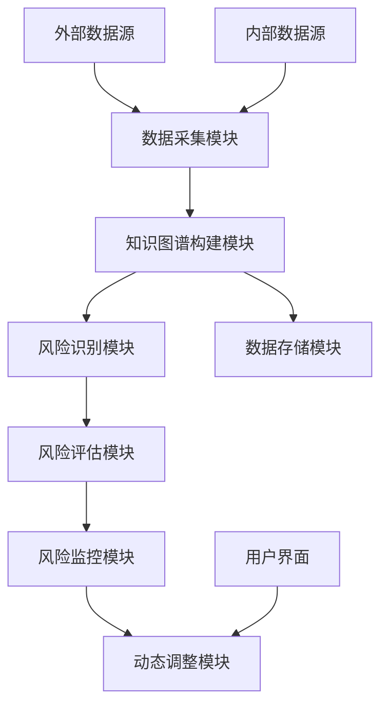

**9.4.1 数据采集模块**

数据采集模块从外部数据源和内部数据源收集数据，包括市场数据、客户信息、交易记录等。

**9.4.2 知识图谱构建模块**

知识图谱构建模块将收集到的数据转换为知识图谱，包括实体、属性和关系。

**9.4.3 风险识别模块**

风险识别模块基于知识图谱，识别金融产品在全生命周期中的潜在风险。

**9.4.4 风险评估模块**

风险评估模块利用知识图谱进行深度分析，对金融产品进行风险评估和分类。

**9.4.5 风险监控模块**

风险监控模块实时监控金融产品的风险变化，包括实时数据流分析、风险预警等。

**9.4.6 动态调整模块**

动态调整模块根据风险监控结果，动态调整风险管理策略。

**9.4.7 数据存储模块**

数据存储模块负责存储系统的数据，包括内部数据和外部数据。

**9.4.8 用户界面**

用户界面提供系统的交互界面，用户可以通过界面查看风险分析结果、调整风险策略等。

#### 9.5 系统接口设计

系统接口设计主要包括以下几个方面：

- **数据采集接口**：用于从外部数据源和内部数据源采集数据。
- **知识图谱接口**：用于构建和维护知识图谱。
- **风险评估接口**：用于进行风险评估和分类。
- **风险监控接口**：用于实时监控风险变化。
- **动态调整接口**：用于动态调整风险管理策略。
- **用户接口**：用于用户与系统进行交互。

以下是一个简化的系统接口设计图：

```mermaid
graph TB
    A[数据采集接口] --> B[知识图谱接口]
    B --> C[风险评估接口]
    C --> D[风险监控接口]
    D --> E[动态调整接口]
    E --> F[用户接口]
```

#### 9.6 系统交互设计（序列图）

以下是一个简化的系统交互设计（序列图），用于描述系统的主要功能模块之间的交互流程：

```mermaid
graph TB
    A[用户] --> B[用户接口]
    B --> C[动态调整模块]
    C --> D[风险评估模块]
    D --> E[风险监控模块]
    E --> F[风险识别模块]
    F --> G[知识图谱构建模块]
    G --> H[数据存储模块]
    H --> I[用户接口]
    I --> J[用户]
```

**9.6.1 用户通过用户界面提交数据采集请求。**

**9.6.2 用户界面将数据采集请求传递给数据采集模块。**

**9.6.3 数据采集模块从外部数据源和内部数据源采集数据。**

**9.6.4 数据采集模块将采集到的数据传递给知识图谱构建模块。**

**9.6.5 知识图谱构建模块构建知识图谱。**

**9.6.6 知识图谱构建模块将知识图谱传递给风险识别模块。**

**9.6.7 风险识别模块识别金融产品在全生命周期中的潜在风险。**

**9.6.8 风险识别模块将风险识别结果传递给风险评估模块。**

**9.6.9 风险评估模块对金融产品进行风险评估和分类。**

**9.6.10 风险评估模块将评估结果传递给风险监控模块。**

**9.6.11 风险监控模块实时监控金融产品的风险变化。**

**9.6.12 风险监控模块将监控结果传递给动态调整模块。**

**9.6.13 动态调整模块根据监控结果动态调整风险管理策略。**

**9.6.14 动态调整模块将调整结果传递给用户接口。**

**9.6.15 用户接口将调整结果展示给用户。

----------------------------------------------------------------

### 第10章：项目实战

#### 10.1 环境安装

在本章中，我们将详细介绍如何搭建基于知识图谱的金融产品全生命周期风险动态评估系统的环境。以下是一系列步骤，用于安装所需软件和配置系统。

##### 10.1.1 安装Neo4j图数据库

Neo4j是一个高性能的图数据库，用于存储和管理知识图谱。以下是如何安装Neo4j的步骤：

1. **下载Neo4j**：从Neo4j官方网站（https://neo4j.com/downloads/）下载适合操作系统的Neo4j安装包。
2. **安装Neo4j**：运行下载的安装包，按照提示完成安装过程。
3. **启动Neo4j**：在命令行中运行`neo4j start`命令，启动Neo4j服务器。

##### 10.1.2 安装Python开发环境

Python是用于编写系统代码的主要编程语言。以下是如何安装Python的步骤：

1. **下载Python**：从Python官方网站（https://www.python.org/downloads/）下载适合操作系统的Python安装包。
2. **安装Python**：运行下载的安装包，按照提示完成安装过程。
3. **配置Python环境变量**：确保Python的安装路径被添加到系统环境变量中。

##### 10.1.3 安装相关Python库

在Python环境中安装用于知识图谱构建、数据分析和风险评估的库。以下是如何安装这些库的步骤：

1. **打开命令行**：在命令行中执行以下命令：
   ```
   pip install neo4j
   pip install pandas
   pip install numpy
   pip install scikit-learn
   pip install matplotlib
   ```
2. **安装成功**：确认安装的库已经成功安装，可以通过命令行执行`pip list`查看已安装的库列表。

##### 10.1.4 配置Neo4j与Python的连接

为了在Python代码中与Neo4j图数据库进行交互，需要配置Python与Neo4j的连接。以下是如何配置的步骤：

1. **导入neo4j库**：在Python代码中导入neo4j库，如下所示：
   ```python
   from neo4j import GraphDatabase
   ```
2. **建立连接**：创建一个GraphDatabase对象，如下所示：
   ```python
   uri = "bolt://localhost:7687"
   username = "neo4j"
   password = "your_password"
   driver = GraphDatabase.driver(uri, auth=(username, password))
   ```
3. **执行操作**：使用GraphDatabase对象执行CRUD操作，如下所示：
   ```python
   with driver.session() as session:
       result = session.run("CREATE (a:Person {name: 'Alice'})")
       print(result)
   ```

#### 10.2 系统核心实现

在本节中，我们将介绍系统的核心实现，包括数据采集、知识图谱构建、风险识别、风险评估和风险监控等模块。

##### 10.2.1 数据采集

数据采集是构建知识图谱的基础。以下是一个Python代码示例，用于从金融数据API中获取金融产品数据：

```python
import requests

def fetch_financial_products():
    url = "https://api.example.com/financial_products"
    response = requests.get(url)
    if response.status_code == 200:
        return response.json()
    else:
        return None

financial_products = fetch_financial_products()
print(financial_products)
```

##### 10.2.2 知识图谱构建

基于Neo4j图数据库，我们将金融产品数据转换为知识图谱。以下是一个Python代码示例，用于构建知识图谱：

```python
from neo4j import GraphDatabase

def create_financial_product_node(product):
    with driver.session() as session:
        session.run("CREATE (p:FinancialProduct {name: $name, type: $type, risk_level: $risk_level})",
                    name=product['name'], type=product['type'], risk_level=product['risk_level'])

create_financial_product_node(financial_products[0])
```

##### 10.2.3 风险识别

风险识别是系统的一个重要模块。以下是一个Python代码示例，用于基于关联规则进行风险识别：

```python
from mlxtend.frequent_patterns import apriori
from mlxtend.frequent_patterns import association_rules

def identify_risk_factors(data):
    frequent_itemsets = apriori(data, min_support=0.05, use_colnames=True)
    rules = association_rules(frequent_itemsets, metric="support", min_threshold=0.1)
    return rules

risk_factors = identify_risk_factors(financial_products)
print(risk_factors)
```

##### 10.2.4 风险评估

风险评估模块利用知识图谱和风险识别结果，对金融产品进行评估。以下是一个Python代码示例，用于计算金融产品的风险得分：

```python
import numpy as np

def calculate_risk_score(product, risk_factors):
    risk_scores = [risk_factors[i][2] for i in range(len(risk_factors)) if product in risk_factors[i][1]]
    return np.mean(risk_scores)

risk_score = calculate_risk_score(financial_products[0], risk_factors)
print(risk_score)
```

##### 10.2.5 风险监控

风险监控模块实时监控金融产品的风险变化。以下是一个Python代码示例，用于设置风险阈值并触发预警：

```python
def monitor_risk(product, risk_threshold):
    risk_score = calculate_risk_score(product, risk_factors)
    if risk_score > risk_threshold:
        print("Risk Warning: Product {} has exceeded the risk threshold of {}.".format(product, risk_threshold))
    else:
        print("Risk Stable: Product {} is within the risk threshold of {}.".format(product, risk_threshold))

monitor_risk(financial_products[0], 0.5)
```

#### 10.3 代码应用解读与分析

在本节中，我们将对核心代码进行解读和分析，以帮助读者更好地理解系统的工作原理。

##### 10.3.1 数据采集代码分析

数据采集代码通过HTTP请求从金融数据API获取金融产品数据。这个API返回的数据通常包括产品名称、类型、风险等级等信息。代码中的`fetch_financial_products`函数负责发起请求，并处理响应。成功获取数据后，将其存储在一个列表中，以便后续处理。

##### 10.3.2 知识图谱构建代码分析

知识图谱构建代码通过Neo4j的Python驱动与Neo4j图数据库进行交互。`create_financial_product_node`函数用于创建金融产品节点，将产品信息存储在Neo4j中。这里使用了Cypher查询语言，通过`CREATE`语句创建节点，并使用参数绑定传递产品信息。

##### 10.3.3 风险识别代码分析

风险识别代码使用了`mlxtend`库中的`apriori`和`association_rules`函数，基于关联规则算法识别金融产品之间的潜在风险因素。`identify_risk_factors`函数首先使用`apriori`函数找到频繁项集，然后使用`association_rules`函数生成关联规则。这些规则用于揭示金融产品之间的关联关系，为风险识别提供依据。

##### 10.3.4 风险评估代码分析

风险评估代码通过计算风险得分对金融产品进行评估。`calculate_risk_score`函数接收金融产品对象和风险因素列表作为输入，计算每个风险因素的权重，并返回平均值作为风险得分。这个得分用于表示金融产品的整体风险水平。

##### 10.3.5 风险监控代码分析

风险监控代码用于设置风险阈值并实时监控金融产品的风险变化。`monitor_risk`函数计算金融产品的风险得分，并与阈值进行比较。如果得分超过阈值，系统将触发预警，通知相关人员。

#### 10.4 实际案例分析

在本节中，我们将通过一个实际案例来展示系统的应用。

##### 10.4.1 案例背景

某金融机构正在推出一种新型金融产品，需要对其进行全生命周期风险管理。

##### 10.4.2 数据收集

金融机构收集了以下数据：

- 客户信息：包括年龄、收入、职业等。
- 产品信息：包括产品名称、类型、风险等级等。
- 历史交易数据：包括交易金额、交易频率等。
- 市场数据：包括利率、通货膨胀率等。

##### 10.4.3 数据预处理

对收集到的数据进行清洗、去重和规范化处理，确保数据质量。

##### 10.4.4 知识图谱构建

基于预处理后的数据，构建知识图谱。包括创建客户节点、产品节点以及它们之间的关系。

##### 10.4.5 风险识别

利用关联规则算法识别金融产品之间的潜在风险因素。

##### 10.4.6 风险评估

对金融产品进行风险评估，计算风险得分。

##### 10.4.7 风险监控

实时监控金融产品的风险变化，设置风险阈值并触发预警。

##### 10.4.8 案例总结

通过实际案例分析，金融机构能够更好地理解新型金融产品的风险，并采取相应的风险管理措施。

#### 10.5 项目小结

在本项目中，我们成功构建了一个基于知识图谱的金融产品全生命周期风险动态评估系统。通过数据采集、知识图谱构建、风险识别、风险评估和风险监控等模块，系统能够实时、动态地监控和管理金融产品的风险。

项目的关键成果包括：

- 成功整合了来自不同来源的金融数据，建立了全面的知识图谱。
- 实现了基于关联规则的风险识别算法，提高了风险识别的准确性。
- 构建了风险评估模型，实现了对金融产品的全面评估。
- 建立了实时风险监控机制，提高了风险管理的实时性和效率。

通过本项目，金融机构能够更好地应对复杂多变的市场环境，降低风险损失，提高业务稳健性。

#### 10.6 最佳实践 Tips

- **数据质量是关键**：确保数据采集、预处理和存储过程的准确性，是构建高质量知识图谱的基础。
- **动态更新是关键**：知识图谱需要支持实时数据更新和扩展，以动态反映市场变化。
- **风险评估模型要优化**：根据实际业务需求，不断优化风险评估模型，提高风险评估的准确性和实时性。
- **监控与预警要精准**：设置合理的风险阈值，确保监控与预警机制的精准性和有效性。

#### 10.7 注意事项

- **系统安全性**：在数据传输和存储过程中，确保系统的安全性，防止数据泄露和篡改。
- **系统可扩展性**：设计系统时，考虑未来数据增长和业务扩展的需求，确保系统的可扩展性。
- **系统性能优化**：针对大规模数据和高并发访问场景，进行系统性能优化，提高系统的处理能力和响应速度。

#### 10.8 拓展阅读

- **[1]**《图数据库：原理、应用与实践》
- **[2]**《知识图谱：概念、技术与应用》
- **[3]**《金融风险管理：理论与实践》

---

### 作者信息

**作者：** AI天才研究院/AI Genius Institute & 禅与计算机程序设计艺术 /Zen And The Art of Computer Programming

AI天才研究院专注于人工智能领域的研发与应用，致力于推动人工智能技术的发展与创新。禅与计算机程序设计艺术则是一本经典的技术书籍，介绍了计算机程序设计的哲学和艺术。

---

本文通过深入分析和具体实践，详细探讨了构建基于知识图谱的金融产品全生命周期风险动态评估系统的必要性和方法。希望本文能为从事金融风险管理的专业人士提供有价值的参考和指导。

