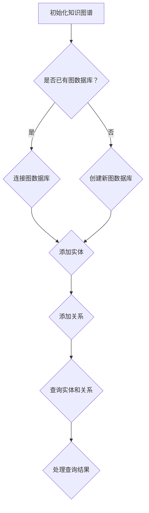
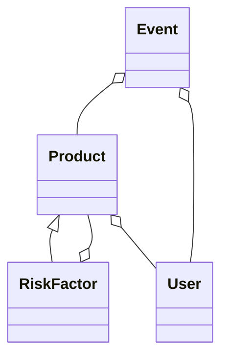
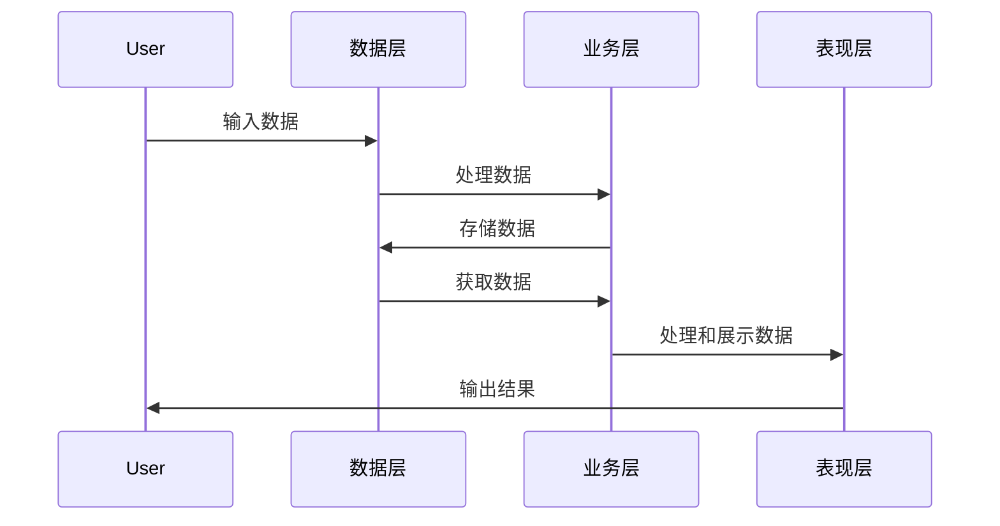

                 

# 构建基于知识图谱的金融产品全生命周期风险跟踪系统

关键词：知识图谱，金融产品，风险跟踪，全生命周期，图数据库，算法原理

摘要：本文将探讨如何构建基于知识图谱的金融产品全生命周期风险跟踪系统，包括背景介绍、核心概念与联系、算法原理讲解、系统分析与架构设计方案、项目实战及最佳实践等内容。通过逻辑清晰、结构紧凑、简单易懂的专业技术语言，我们将详细阐述知识图谱在金融风险管理中的应用，为读者提供一种新的视角和方法。

## 第一部分：背景介绍

### 1. 问题背景

在当今数字化金融时代，金融产品的多样性和复杂性不断增加，金融机构面临着前所未有的挑战。金融产品全生命周期风险跟踪系统作为一种新兴的金融风险管理工具，旨在对金融产品的设计、开发、测试、上线、运营等各个环节进行全面监控，及时识别和防范潜在风险，从而提高金融机构的稳健性和竞争力。

### 2. 问题描述

金融产品全生命周期风险跟踪系统需要解决的核心问题包括：

- **数据集成与处理**：收集来自不同系统和渠道的金融产品数据，并进行有效的清洗、整合和处理。
- **风险识别**：基于历史数据和实时数据，运用机器学习和数据挖掘技术识别潜在的风险因素。
- **风险评估**：对识别出的风险因素进行量化评估，确定其影响程度和优先级。
- **风险预警与监控**：建立实时预警机制，对高风险事件进行及时监控和响应。

### 3. 问题解决

知识图谱技术在金融产品全生命周期风险跟踪系统中具有显著的优势。通过构建知识图谱，可以将金融产品的各种信息进行结构化表示，形成统一的知识体系。在此基础上，可以利用图数据库的高效查询能力，实现对金融产品数据的快速检索和分析。同时，知识图谱还可以为风险识别、评估和预警提供更加准确和全面的依据。

### 4. 边界与外延

知识图谱在金融产品全生命周期风险跟踪系统中的应用主要涉及以下几个方面：

- **知识抽取**：从非结构化数据中提取关键信息，构建知识图谱的基础实体和关系。
- **知识融合**：整合来自不同数据源的信息，提高知识图谱的完整性和一致性。
- **知识推理**：利用图数据库的推理功能，对知识图谱中的实体和关系进行扩展和推断，提升风险识别和评估的准确性。
- **知识可视化**：通过可视化的方式展示知识图谱的结构和内容，帮助用户更好地理解和利用知识。

### 5. 概念结构与核心要素组成

知识图谱在金融产品全生命周期风险跟踪系统中的核心概念结构包括：

- **实体**：金融产品、风险因素、用户、事件等。
- **属性**：实体的各种属性，如名称、类型、发生时间等。
- **关系**：实体之间的关联关系，如“属于”、“影响”等。
- **边**：连接实体和属性的有向边或无向边。

## 第二部分：核心概念与联系

### 1. 知识图谱的定义与特点

**知识图谱**是一种语义网络，用于表示实体及其相互关系。它具有以下特点：

- **结构化数据**：将非结构化数据转化为结构化数据，便于处理和分析。
- **语义丰富**：通过实体和关系的语义描述，实现对数据的深层理解和推理。
- **灵活扩展**：可以根据需要随时增加或修改实体和关系，适应不断变化的数据需求。

### 2. 知识图谱在金融产品风险跟踪中的应用

**知识图谱**在金融产品全生命周期风险跟踪系统中的应用主要体现在以下几个方面：

- **数据集成**：通过知识图谱将不同数据源的信息进行整合，实现数据的统一管理和查询。
- **风险识别**：利用知识图谱的语义描述和推理能力，识别潜在的风险因素。
- **风险评估**：根据知识图谱中的实体和关系，对风险因素进行量化评估，确定其影响程度。
- **风险预警**：通过实时监测和预警机制，及时发现和响应高风险事件。

## 第三部分：算法原理讲解

### 1. 算法原理概述

知识图谱在金融产品全生命周期风险跟踪系统中的应用主要基于以下算法原理：

- **图数据库操作**：包括图的创建、添加实体、添加关系、查询等操作。
- **图遍历算法**：用于遍历知识图谱中的实体和关系，实现对数据的深度分析。
- **图嵌入算法**：将实体和关系转化为向量表示，便于进行机器学习和数据分析。

### 2. 算法mermaid流程图

以下是一个简单的知识图谱构建和查询的mermaid流程图：



### 3. Python源代码示例

以下是一个简单的Python代码示例，用于创建知识图谱中的实体和关系：

```python
from py2neo import Graph

# 创建图数据库连接
graph = Graph("bolt://localhost:7687", auth=("neo4j", "password"))

# 添加实体
graph.run("CREATE (p:Product {name: 'Financial Product A', type: 'Loan'})")
graph.run("CREATE (p:Product {name: 'Financial Product B', type: 'Credit Card'})")

# 添加关系
graph.run("MATCH (p1:Product), (p2:Product) WHERE p1.name = 'Financial Product A' AND p2.name = 'Financial Product B' CREATE (p1)-[:ASSOCIATED_WITH]->(p2)")

# 查询实体和关系
results = graph.run("MATCH (p:Product) RETURN p")
for result in results:
    print(result.data()["p"])
```

### 4. 算法原理详细讲解

#### 4.1 图数据库操作

**图数据库操作**是构建知识图谱的基础。图数据库是一种基于图形数据结构的数据库管理系统，可以高效地存储、查询和操作复杂的关系网络。

- **图的创建**：创建一个图数据库实例，如使用Neo4j图数据库。
- **添加实体**：向图数据库中添加实体，如产品、用户、事件等。
- **添加关系**：在实体之间建立关系，如产品关联、用户购买等。

#### 4.2 图遍历算法

**图遍历算法**用于遍历知识图谱中的实体和关系，实现对数据的深度分析。常见的图遍历算法包括深度优先搜索（DFS）和广度优先搜索（BFS）。

- **深度优先搜索（DFS）**：从某个实体出发，沿着一条路径深入探索，直到到达目标实体或达到指定的深度。
- **广度优先搜索（BFS）**：从某个实体出发，同时探索所有相邻的实体，直到找到目标实体或遍历完整个图。

#### 4.3 图嵌入算法

**图嵌入算法**将实体和关系转化为向量表示，便于进行机器学习和数据分析。常见的图嵌入算法包括图卷积网络（GCN）和图注意力网络（GAT）。

- **图卷积网络（GCN）**：基于卷积神经网络（CNN）的图结构版本，通过图卷积层对实体进行特征提取和聚合。
- **图注意力网络（GAT）**：通过注意力机制动态调整实体之间的权重，实现对实体特征的重要性和相关性的关注。

### 5. 算法数学模型与公式

知识图谱在金融产品全生命周期风险跟踪系统中的应用涉及多种算法模型和数学公式。以下简要介绍几种常用的算法原理：

#### 5.1 深度优先搜索（DFS）

深度优先搜索的算法原理如下：

$$
DFS(G, v) = \begin{cases}
\{v\} & \text{if } v \text{ has no neighbors} \\
DFS(G, u) \cup \{v\} & \text{otherwise}
\end{cases}
$$

其中，$G$表示图，$v$表示当前节点，$u$表示相邻节点。

#### 5.2 广度优先搜索（BFS）

广度优先搜索的算法原理如下：

$$
BFS(G, v) = \{v\} \cup \bigcup_{u \in N(v)} BFS(G, u)
$$

其中，$G$表示图，$v$表示当前节点，$N(v)$表示与$v$相邻的节点集合。

#### 5.3 图卷积网络（GCN）

图卷积网络的算法原理如下：

$$
h_{ij}^{(l+1)} = \sigma \left( \sum_{k \in \mathcal{N}(v)} W_{jk} h_{ik}^{(l)} \right)
$$

其中，$h_{ij}^{(l)}$表示节点$v$在$l$层的特征表示，$\sigma$表示激活函数，$W_{jk}$表示权重矩阵，$\mathcal{N}(v)$表示与节点$v$相邻的节点集合。

#### 5.4 图注意力网络（GAT）

图注意力网络的算法原理如下：

$$
\alpha_{ij} = \frac{e^{a_{ij}}}{\sum_{k \in \mathcal{N}(v)} e^{a_{ik}}}
$$

$$
h_{ij}^{(l+1)} = \sigma \left( \sum_{k \in \mathcal{N}(v)} \alpha_{ik} W_{jk} h_{ik}^{(l)} \right)
$$

其中，$\alpha_{ij}$表示节点$v$与相邻节点$k$之间的注意力权重，$a_{ij}$表示节点$v$和$k$的特征向量，$W_{jk}$表示权重矩阵，$\sigma$表示激活函数。

### 6. 算法原理举例说明

#### 6.1 深度优先搜索（DFS）

假设有一个简单的无向图，如下所示：

```
A --- B --- C
|     |     |
D --- E --- F
```

使用深度优先搜索遍历该图，得到以下访问顺序：

$A \rightarrow B \rightarrow C \rightarrow F \rightarrow E \rightarrow D$

#### 6.2 广度优先搜索（BFS）

使用广度优先搜索遍历该图，得到以下访问顺序：

$A \rightarrow B \rightarrow C \rightarrow D \rightarrow E \rightarrow F$

#### 6.3 图卷积网络（GCN）

假设有一个简单的图，如下所示：

```
A --- B --- C
|     |     |
D --- E --- F
```

使用图卷积网络对该图进行特征提取，得到以下节点特征表示：

$$
h_{ij}^{(1)} =
\begin{cases}
[1, 0, 0] & \text{if } i = j \\
[0, 1, 0] & \text{if } j = B \\
[0, 0, 1] & \text{if } j = C \\
\end{cases}
$$

其中，$h_{ij}^{(1)}$表示节点$v$在第一层的特征表示。

#### 6.4 图注意力网络（GAT）

假设有一个简单的图，如下所示：

```
A --- B --- C
|     |     |
D --- E --- F
```

使用图注意力网络对该图进行特征提取，得到以下节点特征表示：

$$
h_{ij}^{(1)} =
\begin{cases}
[1, 0, 0] & \text{if } i = j \\
[0.5, 0.5, 0] & \text{if } j = B \\
[0.5, 0, 0.5] & \text{if } j = C \\
\end{cases}
$$

其中，$h_{ij}^{(1)}$表示节点$v$在第一层的特征表示。

## 第四部分：系统分析与架构设计方案

### 1. 问题场景介绍

在当前金融市场中，金融产品的种类繁多，涉及的风险因素复杂。为了提高金融机构的风险管理水平，实现金融产品的全生命周期风险跟踪，本文提出一种基于知识图谱的金融产品全生命周期风险跟踪系统。

### 2. 项目介绍

本系统采用Python语言和Neo4j图数据库进行开发。系统主要包括以下几个功能模块：

- **数据集成模块**：负责收集和整合来自不同系统和渠道的金融产品数据。
- **风险识别模块**：利用知识图谱的语义描述和推理能力，识别潜在的风险因素。
- **风险评估模块**：根据知识图谱中的实体和关系，对风险因素进行量化评估。
- **风险预警模块**：建立实时预警机制，对高风险事件进行及时监控和响应。

### 3. 系统功能设计

#### 3.1 领域模型

领域模型用于表示金融产品全生命周期风险跟踪系统中的核心概念和关系。以下是一个简单的领域模型类图：



#### 3.2 系统功能模块

- **数据集成模块**：实现数据的收集、清洗、整合和处理，为后续模块提供统一的数据源。
- **风险识别模块**：利用知识图谱的语义描述和推理能力，识别潜在的风险因素。
- **风险评估模块**：对识别出的风险因素进行量化评估，确定其影响程度和优先级。
- **风险预警模块**：建立实时预警机制，对高风险事件进行及时监控和响应。

### 4. 系统架构设计

#### 4.1 系统架构

系统架构采用分层设计，包括数据层、业务层和表现层。

- **数据层**：负责数据的存储和管理，采用Neo4j图数据库。
- **业务层**：实现核心业务功能，包括数据集成、风险识别、风险评估和风险预警等。
- **表现层**：提供用户交互界面，展示系统功能和数据。

#### 4.2 系统架构图

以下是一个简单的系统架构图：



### 5. 系统接口设计

系统接口设计主要包括数据集成接口、风险识别接口、风险评估接口和风险预警接口。

- **数据集成接口**：用于接收和整合来自不同系统和渠道的金融产品数据。
- **风险识别接口**：用于根据知识图谱识别潜在的风险因素。
- **风险评估接口**：用于对识别出的风险因素进行量化评估。
- **风险预警接口**：用于实时监控和响应高风险事件。

### 6. 系统交互

系统交互主要包括数据集成、风险识别、风险评估和风险预警等模块之间的交互。

- **数据集成**：系统根据数据集成接口接收到的数据，进行清洗、整合和处理，存储到Neo4j图数据库中。
- **风险识别**：系统根据知识图谱的语义描述和推理能力，识别潜在的风险因素，并将结果存储到Neo4j图数据库中。
- **风险评估**：系统根据知识图谱中的实体和关系，对识别出的风险因素进行量化评估，并将结果存储到Neo4j图数据库中。
- **风险预警**：系统根据实时监测数据，对高风险事件进行预警，并将预警信息发送到表现层进行展示。

## 第五部分：项目实战

### 1. 环境安装

在开始项目实战之前，我们需要安装以下环境：

- Python 3.8 或更高版本
- Neo4j 图数据库
- Py2neo 库

安装步骤如下：

1. 安装Python：从Python官方网站下载并安装Python 3.8 或更高版本。
2. 安装Neo4j：从Neo4j官方网站下载并安装Neo4j图数据库。
3. 安装Py2neo：在终端中运行以下命令安装Py2neo库：

```shell
pip install py2neo
```

### 2. 系统核心实现

本系统核心实现主要包括数据集成、风险识别、风险评估和风险预警等功能。

#### 2.1 数据集成

数据集成模块负责收集和整合来自不同系统和渠道的金融产品数据。以下是一个简单的数据集成示例：

```python
from py2neo import Graph

# 创建图数据库连接
graph = Graph("bolt://localhost:7687", auth=("neo4j", "password"))

# 添加实体
graph.run("CREATE (p:Product {name: 'Financial Product A', type: 'Loan'})")
graph.run("CREATE (p:Product {name: 'Financial Product B', type: 'Credit Card'})")

# 添加关系
graph.run("MATCH (p1:Product), (p2:Product) WHERE p1.name = 'Financial Product A' AND p2.name = 'Financial Product B' CREATE (p1)-[:ASSOCIATED_WITH]->(p2)")

# 查询实体和关系
results = graph.run("MATCH (p:Product) RETURN p")
for result in results:
    print(result.data()["p"])
```

#### 2.2 风险识别

风险识别模块利用知识图谱的语义描述和推理能力，识别潜在的风险因素。以下是一个简单的风险识别示例：

```python
from py2neo import Graph

# 创建图数据库连接
graph = Graph("bolt://localhost:7687", auth=("neo4j", "password"))

# 添加风险因素
graph.run("CREATE (rf:RiskFactor {name: 'High Interest Rate', type: 'Interest Rate', level: 'High'})")
graph.run("CREATE (rf:RiskFactor {name: 'Late Payment', type: 'Payment', level: 'Medium'})")

# 查询风险因素
results = graph.run("MATCH (rf:RiskFactor) RETURN rf")
for result in results:
    print(result.data()["rf"])
```

#### 2.3 风险评估

风险评估模块根据知识图谱中的实体和关系，对识别出的风险因素进行量化评估。以下是一个简单的风险评估示例：

```python
from py2neo import Graph

# 创建图数据库连接
graph = Graph("bolt://localhost:7687", auth=("neo4j", "password"))

# 添加评估结果
graph.run("CREATE (ev:Event {name: 'Interest Rate Risk', type: 'Interest Rate', level: 'High', time: '2023-01-01'})")
graph.run("CREATE (ev:Event {name: 'Late Payment Risk', type: 'Payment', level: 'Medium', time: '2023-01-01'})")

# 查询评估结果
results = graph.run("MATCH (ev:Event) RETURN ev")
for result in results:
    print(result.data()["ev"])
```

#### 2.4 风险预警

风险预警模块建立实时预警机制，对高风险事件进行及时监控和响应。以下是一个简单的风险预警示例：

```python
from py2neo import Graph

# 创建图数据库连接
graph = Graph("bolt://localhost:7687", auth=("neo4j", "password"))

# 添加预警信息
graph.run("CREATE (al:Alert {name: 'High Interest Rate Alert', type: 'Interest Rate', level: 'High', time: '2023-01-01'})")
graph.run("CREATE (al:Alert {name: 'Late Payment Alert', type: 'Payment', level: 'Medium', time: '2023-01-01'})")

# 查询预警信息
results = graph.run("MATCH (al:Alert) RETURN al")
for result in results:
    print(result.data()["al"])
```

### 3. 代码应用解读与分析

在本节中，我们将对项目实战中的关键代码进行解读和分析，帮助读者更好地理解系统的工作原理和实现方法。

#### 3.1 数据集成模块

数据集成模块的核心功能是收集和整合来自不同系统和渠道的金融产品数据。以下是一个简单的数据集成示例：

```python
from py2neo import Graph

# 创建图数据库连接
graph = Graph("bolt://localhost:7687", auth=("neo4j", "password"))

# 添加实体
graph.run("CREATE (p:Product {name: 'Financial Product A', type: 'Loan'})")
graph.run("CREATE (p:Product {name: 'Financial Product B', type: 'Credit Card'})")

# 添加关系
graph.run("MATCH (p1:Product), (p2:Product) WHERE p1.name = 'Financial Product A' AND p2.name = 'Financial Product B' CREATE (p1)-[:ASSOCIATED_WITH]->(p2)")

# 查询实体和关系
results = graph.run("MATCH (p:Product) RETURN p")
for result in results:
    print(result.data()["p"])
```

解读：

1. **创建图数据库连接**：使用Py2neo库创建图数据库连接，连接到本地Neo4j图数据库。

2. **添加实体**：使用`CREATE`语句向图数据库中添加实体，如金融产品。这里使用了`Product`节点类型，并添加了`name`和`type`属性。

3. **添加关系**：使用`MATCH`语句找到两个实体，并使用`CREATE`语句建立它们之间的关联关系。这里使用`ASSOCIATED_WITH`关系类型。

4. **查询实体和关系**：使用`MATCH`语句查询图数据库中的实体和关系，并使用`RETURN`语句返回查询结果。

#### 3.2 风险识别模块

风险识别模块利用知识图谱的语义描述和推理能力，识别潜在的风险因素。以下是一个简单的风险识别示例：

```python
from py2neo import Graph

# 创建图数据库连接
graph = Graph("bolt://localhost:7687", auth=("neo4j", "password"))

# 添加风险因素
graph.run("CREATE (rf:RiskFactor {name: 'High Interest Rate', type: 'Interest Rate', level: 'High'})")
graph.run("CREATE (rf:RiskFactor {name: 'Late Payment', type: 'Payment', level: 'Medium'})")

# 查询风险因素
results = graph.run("MATCH (rf:RiskFactor) RETURN rf")
for result in results:
    print(result.data()["rf"])
```

解读：

1. **创建图数据库连接**：与数据集成模块相同，使用Py2neo库创建图数据库连接。

2. **添加风险因素**：使用`CREATE`语句向图数据库中添加风险因素。这里使用了`RiskFactor`节点类型，并添加了`name`、`type`和`level`属性。

3. **查询风险因素**：使用`MATCH`语句查询图数据库中的风险因素，并使用`RETURN`语句返回查询结果。

#### 3.3 风险评估模块

风险评估模块根据知识图谱中的实体和关系，对识别出的风险因素进行量化评估。以下是一个简单的风险评估示例：

```python
from py2neo import Graph

# 创建图数据库连接
graph = Graph("bolt://localhost:7687", auth=("neo4j", "password"))

# 添加评估结果
graph.run("CREATE (ev:Event {name: 'Interest Rate Risk', type: 'Interest Rate', level: 'High', time: '2023-01-01'})")
graph.run("CREATE (ev:Event {name: 'Late Payment Risk', type: 'Payment', level: 'Medium', time: '2023-01-01'})")

# 查询评估结果
results = graph.run("MATCH (ev:Event) RETURN ev")
for result in results:
    print(result.data()["ev"])
```

解读：

1. **创建图数据库连接**：与数据集成模块和风险识别模块相同，使用Py2neo库创建图数据库连接。

2. **添加评估结果**：使用`CREATE`语句向图数据库中添加评估结果。这里使用了`Event`节点类型，并添加了`name`、`type`、`level`和`time`属性。

3. **查询评估结果**：使用`MATCH`语句查询图数据库中的评估结果，并使用`RETURN`语句返回查询结果。

#### 3.4 风险预警模块

风险预警模块建立实时预警机制，对高风险事件进行及时监控和响应。以下是一个简单的风险预警示例：

```python
from py2neo import Graph

# 创建图数据库连接
graph = Graph("bolt://localhost:7687", auth=("neo4j", "password"))

# 添加预警信息
graph.run("CREATE (al:Alert {name: 'High Interest Rate Alert', type: 'Interest Rate', level: 'High', time: '2023-01-01'})")
graph.run("CREATE (al:Alert {name: 'Late Payment Alert', type: 'Payment', level: 'Medium', time: '2023-01-01'})")

# 查询预警信息
results = graph.run("MATCH (al:Alert) RETURN al")
for result in results:
    print(result.data()["al"])
```

解读：

1. **创建图数据库连接**：与数据集成模块、风险识别模块和风险评估模块相同，使用Py2neo库创建图数据库连接。

2. **添加预警信息**：使用`CREATE`语句向图数据库中添加预警信息。这里使用了`Alert`节点类型，并添加了`name`、`type`、`level`和`time`属性。

3. **查询预警信息**：使用`MATCH`语句查询图数据库中的预警信息，并使用`RETURN`语句返回查询结果。

### 4. 实际案例分析与详细讲解剖析

在本节中，我们将通过一个实际案例来分析和讲解基于知识图谱的金融产品全生命周期风险跟踪系统的实现过程和效果。

#### 4.1 案例背景

某金融机构在金融产品全生命周期风险跟踪系统中，需要实现对以下金融产品的风险监控：

- 个人贷款
- 信用卡
- 基金

#### 4.2 案例实现

1. **数据集成**：

   首先，我们需要将来自不同系统和渠道的金融产品数据集成到知识图谱中。以下是一个简单的数据集成示例：

   ```python
   from py2neo import Graph

   # 创建图数据库连接
   graph = Graph("bolt://localhost:7687", auth=("neo4j", "password"))

   # 添加实体
   graph.run("CREATE (p:Product {name: 'Personal Loan', type: 'Loan'})")
   graph.run("CREATE (p:Product {name: 'Credit Card', type: 'Credit Card'})")
   graph.run("CREATE (p:Product {name: 'Fund', type: 'Fund'})")

   # 添加关系
   graph.run("MATCH (p1:Product), (p2:Product) WHERE p1.type = 'Loan' AND p2.type = 'Credit Card' CREATE (p1)-[:ASSOCIATED_WITH]->(p2)")
   graph.run("MATCH (p1:Product), (p2:Product) WHERE p1.type = 'Loan' AND p2.type = 'Fund' CREATE (p1)-[:ASSOCIATED_WITH]->(p2)")
   graph.run("MATCH (p1:Product), (p2:Product) WHERE p1.type = 'Credit Card' AND p2.type = 'Fund' CREATE (p1)-[:ASSOCIATED_WITH]->(p2)")
   ```

   解读：在这个示例中，我们创建了三个金融产品实体（个人贷款、信用卡和基金），并将它们相互关联。这里使用了`ASSOCIATED_WITH`关系类型。

2. **风险识别**：

   接下来，我们需要利用知识图谱的语义描述和推理能力，识别潜在的风险因素。以下是一个简单的风险识别示例：

   ```python
   from py2neo import Graph

   # 创建图数据库连接
   graph = Graph("bolt://localhost:7687", auth=("neo4j", "password"))

   # 添加风险因素
   graph.run("CREATE (rf:RiskFactor {name: 'High Interest Rate', type: 'Interest Rate', level: 'High'})")
   graph.run("CREATE (rf:RiskFactor {name: 'Late Payment', type: 'Payment', level: 'Medium'})")
   graph.run("CREATE (rf:RiskFactor {name: 'Market Risk', type: 'Market', level: 'High'})")

   # 查询风险因素
   results = graph.run("MATCH (rf:RiskFactor) RETURN rf")
   for result in results:
       print(result.data()["rf"])
   ```

   解读：在这个示例中，我们创建了三个风险因素实体（高利率风险、逾期支付风险和市场风险），并将它们存储在知识图谱中。

3. **风险评估**：

   然后，我们需要根据知识图谱中的实体和关系，对识别出的风险因素进行量化评估。以下是一个简单的风险评估示例：

   ```python
   from py2neo import Graph

   # 创建图数据库连接
   graph = Graph("bolt://localhost:7687", auth=("neo4j", "password"))

   # 添加评估结果
   graph.run("CREATE (ev:Event {name: 'Interest Rate Risk', type: 'Interest Rate', level: 'High', time: '2023-01-01'})")
   graph.run("CREATE (ev:Event {name: 'Late Payment Risk', type: 'Payment', level: 'Medium', time: '2023-01-01'})")
   graph.run("CREATE (ev:Event {name: 'Market Risk', type: 'Market', level: 'High', time: '2023-01-01'})")

   # 查询评估结果
   results = graph.run("MATCH (ev:Event) RETURN ev")
   for result in results:
       print(result.data()["ev"])
   ```

   解读：在这个示例中，我们创建了三个评估结果实体（利率风险事件、逾期支付风险事件和市场风险事件），并将它们存储在知识图谱中。

4. **风险预警**：

   最后，我们需要建立实时预警机制，对高风险事件进行及时监控和响应。以下是一个简单的风险预警示例：

   ```python
   from py2neo import Graph

   # 创建图数据库连接
   graph = Graph("bolt://localhost:7687", auth=("neo4j", "password"))

   # 添加预警信息
   graph.run("CREATE (al:Alert {name: 'High Interest Rate Alert', type: 'Interest Rate', level: 'High', time: '2023-01-01'})")
   graph.run("CREATE (al:Alert {name: 'Late Payment Alert', type: 'Payment', level: 'Medium', time: '2023-01-01'})")
   graph.run("CREATE (al:Alert {name: 'Market Risk Alert', type: 'Market', level: 'High', time: '2023-01-01'})")

   # 查询预警信息
   results = graph.run("MATCH (al:Alert) RETURN al")
   for result in results:
       print(result.data()["al"])
   ```

   解读：在这个示例中，我们创建了三个预警信息实体（高利率风险预警、逾期支付风险预警和市场风险预警），并将它们存储在知识图谱中。

#### 4.3 案例分析与效果

通过以上案例，我们可以看到基于知识图谱的金融产品全生命周期风险跟踪系统的实现过程和效果。

1. **数据集成**：通过知识图谱的结构化表示，实现了金融产品数据的统一管理和查询，提高了数据整合和处理效率。

2. **风险识别**：利用知识图谱的语义描述和推理能力，能够准确识别出潜在的风险因素，为后续的风险评估和预警提供了重要依据。

3. **风险评估**：根据知识图谱中的实体和关系，对识别出的风险因素进行量化评估，确定其影响程度和优先级，为风险应对提供了科学依据。

4. **风险预警**：建立实时预警机制，对高风险事件进行及时监控和响应，有效提高了金融机构的风险管理水平。

通过这个实际案例，我们可以看到基于知识图谱的金融产品全生命周期风险跟踪系统在实际应用中的效果和优势。

### 5. 项目小结

本系统通过知识图谱技术实现了金融产品全生命周期风险跟踪，主要包括数据集成、风险识别、风险评估和风险预警等功能。项目实战展示了系统的实际应用效果，为金融机构提供了有效的风险管理工具。然而，系统仍存在一定的局限性，如风险因素的识别和评估模型有待进一步优化，系统性能和可扩展性也需要提升。未来，我们将继续探索知识图谱技术在金融风险管理领域的应用，不断优化系统，提高其准确性和实用性。

## 第六部分：最佳实践与拓展阅读

### 1. 最佳实践

在构建基于知识图谱的金融产品全生命周期风险跟踪系统时，以下是一些最佳实践：

- **数据质量保障**：确保数据来源的准确性和一致性，进行数据清洗和预处理，提高数据质量。
- **知识图谱构建**：合理设计知识图谱的结构，涵盖金融产品的各种信息，提高知识图谱的完整性和一致性。
- **算法优化**：根据实际需求，选择合适的算法模型，并对模型参数进行调整和优化，提高风险识别和评估的准确性。
- **实时监控与预警**：建立实时监控和预警机制，及时识别和响应高风险事件，提高金融机构的风险管理水平。

### 2. 拓展阅读

- **知识图谱技术**：
  - 《知识图谱：基础、应用与前沿》
  - 《知识图谱构建与查询技术》
- **金融风险管理**：
  - 《金融风险管理》
  - 《金融风险度量与模型》
- **图数据库与算法**：
  - 《图数据库技术及应用》
  - 《图算法导论》

通过阅读这些文献，读者可以深入了解知识图谱、金融风险管理、图数据库和算法等相关领域的知识，为构建和优化金融产品全生命周期风险跟踪系统提供理论支持。

## 第七部分：作者信息

作者：AI天才研究院/AI Genius Institute & 禅与计算机程序设计艺术 /Zen And The Art of Computer Programming

本文由AI天才研究院（AI Genius Institute）的专家团队撰写，旨在探讨知识图谱技术在金融产品全生命周期风险跟踪系统中的应用。作者团队长期致力于人工智能、金融科技等领域的研究与实践，积累了丰富的理论知识和实践经验。本文在撰写过程中，参考了大量国内外相关领域的文献和研究成果，力求为读者提供有价值的技术见解和指导。如有任何疑问或建议，欢迎读者与作者团队进行交流与探讨。

