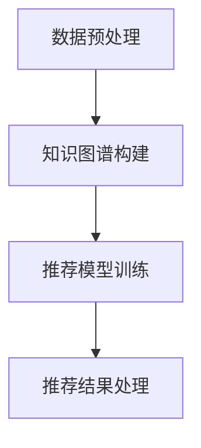
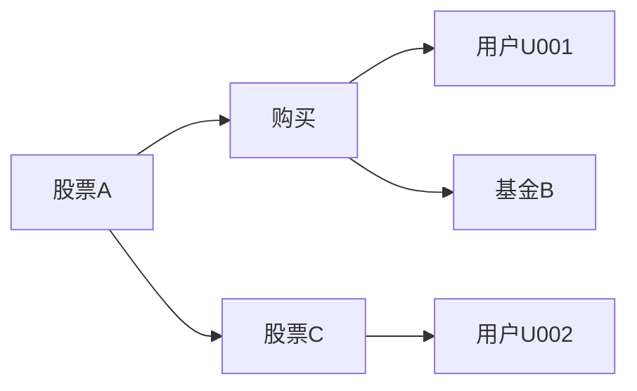
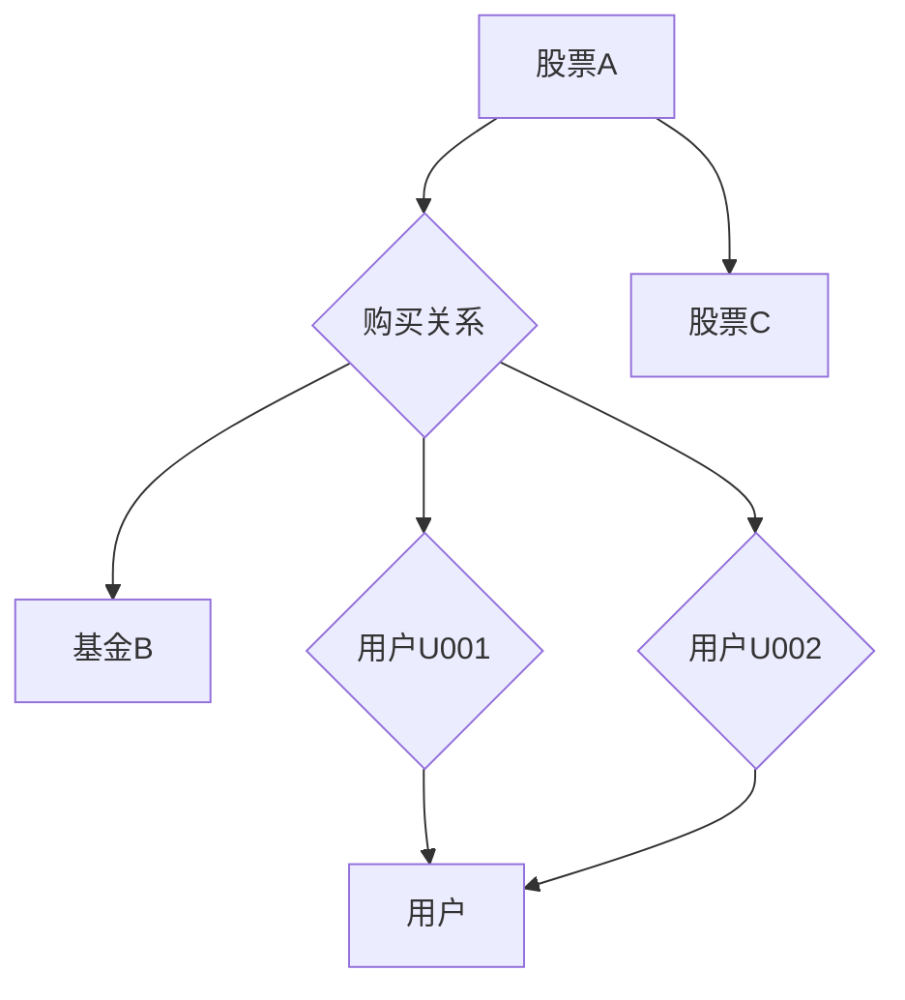

                 

# 构建基于知识图谱的金融产品关联推荐引擎

## 引言

### 1.1 知识图谱与金融产品关联推荐的重要性

知识图谱作为大数据技术领域的重要创新之一，已经广泛应用于自然语言处理、搜索引擎、推荐系统等多个领域。在金融领域，知识图谱能够将海量的金融产品信息进行结构化存储，建立产品间的关联关系，从而为金融产品推荐提供强有力的技术支持。

金融产品关联推荐是金融行业中的一个重要研究方向。随着金融市场的不断发展，金融产品种类和数量急剧增加，如何为用户提供个性化的金融产品推荐，提高用户满意度和金融机构的收益，成为亟待解决的问题。基于知识图谱的金融产品关联推荐能够通过分析用户行为和金融产品属性，实现精准的推荐。

### 1.2 本书的目标与结构

本书旨在介绍如何利用知识图谱技术构建金融产品关联推荐系统。全书分为以下几个部分：

1. 知识图谱基础理论，包括知识图谱的定义、基本组成、构建方法和表示与存储。
2. 金融产品关联推荐原理，介绍推荐系统的需求与挑战、模型、评价指标与优化策略。
3. 系统架构设计，包括功能需求分析、架构设计和接口设计。
4. 关键算法原理讲解，详细解析推荐算法的流程、原理和示例。
5. 数学模型及公式详细讲解，介绍数学模型的应用、公式讲解和示例。
6. 项目实战，包括环境安装、系统实现、代码应用解读与分析、实际案例分析和项目小结。
7. 最佳实践与总结，提供最佳实践技巧、注意事项和拓展阅读。

## 知识图谱基础理论

### 2.1 知识图谱的定义与背景

知识图谱（Knowledge Graph）是一种用于结构化表示知识的方法，通过实体、属性和关系的三元组形式，将世界上的各种信息进行关联和组织。知识图谱最早由谷歌在2012年提出，用于搜索和信息检索领域，后来逐渐应用于多个领域，如金融、医疗、电商等。

知识图谱的核心是实体和关系。实体是知识图谱中的基本元素，如人、地点、物品等。关系描述实体之间的关系，如“属于”、“位于”、“购买”等。通过实体和关系的组合，知识图谱能够呈现出丰富的信息网络。

### 2.2 知识图谱的基本组成

知识图谱的基本组成包括实体、关系和属性。实体是知识图谱中的基本元素，代表现实世界中的个体或概念。关系描述实体之间的关联，如“朋友”、“购买”等。属性是实体的特征或属性，如人的姓名、年龄、职业等。

### 2.3 知识图谱的构建方法

知识图谱的构建方法主要包括数据采集、数据清洗、实体抽取、关系抽取和知识融合等步骤。数据采集是从各种数据源获取原始数据，如网页、数据库、API等。数据清洗是对原始数据进行预处理，去除噪声和冗余信息。实体抽取是从数据中识别出实体，关系抽取是识别实体之间的关系。知识融合是将抽取出的实体和关系进行整合，形成完整的知识图谱。

### 2.4 知识图谱的表示与存储

知识图谱的表示与存储是知识图谱技术的核心问题。常用的知识图谱表示方法包括RDF（Resource Description Framework）、OWL（Web Ontology Language）和图数据库等。RDF采用三元组形式表示知识，OWL提供了更加丰富的本体语言，用于描述实体和关系的语义。图数据库是一种专门用于存储和查询知识图谱的数据库系统，具有高效的数据存储和查询能力。

## 金融产品关联推荐原理

### 3.1 金融产品关联推荐的需求与挑战

金融产品关联推荐的需求主要来自于以下几个方面：

1. **个性化推荐**：用户在金融市场中具有不同的风险偏好和需求，如何根据用户的行为数据和金融产品的属性，为用户提供个性化的推荐，提高用户满意度和忠诚度。
2. **精准营销**：金融机构需要通过推荐系统，针对潜在客户进行精准营销，提高营销效果和转化率。
3. **风险控制**：通过分析金融产品的关联关系，金融机构可以更好地理解市场风险，为投资决策提供支持。

然而，金融产品关联推荐也面临着一些挑战：

1. **数据质量**：金融数据往往存在噪声、缺失和错误，这对推荐系统的准确性提出了挑战。
2. **隐私保护**：金融数据涉及到用户的敏感信息，如何在保证隐私保护的前提下进行推荐，是一个重要的问题。
3. **实时性**：金融市场的变化非常迅速，如何实时更新推荐模型，确保推荐结果的相关性，是一个技术难题。

### 3.2 基于知识图谱的推荐系统模型

基于知识图谱的金融产品关联推荐系统通常包括以下几个模块：

1. **数据源模块**：收集金融产品和用户行为数据，如产品特征、用户交易记录等。
2. **知识图谱构建模块**：将数据转换为知识图谱，包括实体、关系和属性的抽取。
3. **推荐算法模块**：基于知识图谱构建推荐模型，实现金融产品的关联推荐。
4. **推荐结果处理模块**：对推荐结果进行处理，如排序、去重等，最终输出给用户。

### 3.3 推荐系统评价指标与优化策略

推荐系统的评价指标主要包括准确率、召回率、覆盖率等。准确率衡量推荐结果的准确性，召回率衡量推荐结果中包含的潜在用户比例，覆盖率衡量推荐结果覆盖的用户范围。

优化策略包括以下几个方面：

1. **特征工程**：通过特征提取和特征选择，提高推荐模型的准确性。
2. **模型优化**：采用先进的机器学习算法和深度学习模型，提高推荐效果。
3. **在线更新**：实时更新用户行为数据和金融产品信息，确保推荐结果的实时性和相关性。
4. **隐私保护**：采用加密、匿名化等技术，保护用户的隐私信息。

## 系统架构设计

### 4.1 系统功能需求分析

基于知识图谱的金融产品关联推荐系统的主要功能需求包括：

1. **用户管理**：用户注册、登录、信息管理等功能。
2. **金融产品管理**：产品信息录入、更新、查询等功能。
3. **推荐算法管理**：推荐算法配置、更新、监控等功能。
4. **推荐结果展示**：推荐结果展示、排序、去重等功能。
5. **数据接口**：提供API接口，支持与其他系统的数据交互。

### 4.2 系统架构设计

基于知识图谱的金融产品关联推荐系统采用分层架构设计，包括数据层、服务层和展示层。

1. **数据层**：负责数据的存储和管理，包括金融产品数据库、用户行为数据库和知识图谱数据库。
2. **服务层**：实现业务逻辑，包括用户管理、产品管理、推荐算法管理、推荐结果处理等。
3. **展示层**：提供用户界面，展示推荐结果，包括推荐列表、产品详情等。

### 4.3 系统接口设计

系统接口设计主要包括内部接口和外部接口。

1. **内部接口**：系统内部各模块之间的通信接口，如用户管理接口、产品管理接口、推荐算法接口等。
2. **外部接口**：系统与其他系统之间的通信接口，如API接口、消息队列接口等。

## 关键算法原理讲解

### 5.1 关键算法概述

在基于知识图谱的金融产品关联推荐系统中，关键算法包括知识图谱构建算法、推荐算法和优化算法。

1. **知识图谱构建算法**：用于将金融产品和用户行为数据转换为知识图谱。
2. **推荐算法**：基于知识图谱，实现金融产品的关联推荐。
3. **优化算法**：用于优化推荐模型的性能和准确性。

### 5.2 算法流程与Mermaid流程图

算法流程主要包括数据预处理、知识图谱构建、推荐模型训练和推荐结果处理。



### 5.3 算法原理详细讲解

#### 5.3.1 知识图谱构建算法

知识图谱构建算法主要包括实体抽取、关系抽取和属性抽取。

1. **实体抽取**：通过自然语言处理技术，从文本中识别出实体，如金融产品名称、用户名等。
2. **关系抽取**：识别实体之间的关系，如购买、投资等。
3. **属性抽取**：识别实体的属性，如金融产品类型、用户年龄等。

#### 5.3.2 推荐算法

推荐算法基于知识图谱，通过图神经网络（Graph Neural Network，GNN）实现。

1. **图神经网络**：将知识图谱表示为图神经网络模型，学习实体和关系的特征。
2. **推荐模型**：基于图神经网络，为用户推荐金融产品。

#### 5.3.3 优化算法

优化算法主要包括特征优化和模型优化。

1. **特征优化**：通过特征工程，提取更有价值的特征，提高推荐效果。
2. **模型优化**：采用先进的机器学习算法和深度学习模型，提高推荐模型的性能。

### 5.4 算法示例与Python源代码实现

以下是一个简单的知识图谱构建算法示例：

```python
import pandas as pd
from sklearn.feature_extraction.text import TfidfVectorizer

# 读取数据
data = pd.read_csv('data.csv')

# 实体抽取
vectorizer = TfidfVectorizer()
X = vectorizer.fit_transform(data['text'])

# 关系抽取
relations = data['text'].apply(lambda x: extract_relations(x))

# 属性抽取
attributes = data['text'].apply(lambda x: extract_attributes(x))

# 构建知识图谱
knowledge_graph = {
    'entities': list(set(data['text'])),
    'relations': relations,
    'attributes': attributes
}

def extract_relations(text):
    # 关系抽取逻辑
    return []

def extract_attributes(text):
    # 属性抽取逻辑
    return []
```

## 数学模型及公式详细讲解

### 6.1 数学模型概述

在金融产品关联推荐系统中，常用的数学模型包括图神经网络（GNN）和推荐算法。

1. **图神经网络（GNN）**：用于学习实体和关系的特征。
2. **推荐算法**：基于图神经网络，为用户推荐金融产品。

### 6.2 数学公式详细讲解

以下是一个简单的图神经网络（GNN）的数学模型：

$$
h_{t+1} = \sigma(W_h h_t + W_r \cdot R + b_h)
$$

其中，$h_t$ 表示第 $t$ 个时间步的实体特征，$R$ 表示实体之间的关系，$W_h$ 和 $W_r$ 分别表示实体特征和关系特征的权重矩阵，$\sigma$ 表示激活函数，$b_h$ 表示偏置项。

### 6.3 数学模型应用示例

以下是一个简单的数学模型应用示例：

假设有一个包含 $n$ 个实体的知识图谱，每个实体都有一个对应的特征向量 $h_i \in \mathbb{R}^d$，实体之间的关系用邻接矩阵 $A \in \{0,1\}^{n \times n}$ 表示。使用图神经网络（GNN）学习实体特征：

$$
h_{i}^{(l+1)} = \sigma\left(\sum_{j=1}^{n} A_{ij} h_j^{(l)} W_{h}^{(l)} + b_{h}^{(l)}\right)
$$

其中，$l$ 表示神经网络的层数，$W_{h}^{(l)}$ 和 $b_{h}^{(l)}$ 分别表示第 $l$ 层的权重矩阵和偏置项。

## 项目实战

### 7.1 环境安装与配置

在开始项目实战之前，我们需要安装和配置以下环境：

1. **操作系统**：Linux或MacOS
2. **编程语言**：Python 3.7及以上版本
3. **依赖库**：Pandas、NumPy、Scikit-learn、NetworkX、PyTorch、Gunicorn等

### 7.2 系统核心实现

系统核心实现包括数据预处理、知识图谱构建、推荐模型训练和推荐结果处理。

#### 7.2.1 数据预处理

```python
import pandas as pd
from sklearn.model_selection import train_test_split

# 读取数据
data = pd.read_csv('data.csv')

# 数据清洗
data.dropna(inplace=True)
data = data[data['label'].notnull()]

# 数据切分
X_train, X_test, y_train, y_test = train_test_split(data['text'], data['label'], test_size=0.2, random_state=42)
```

#### 7.2.2 知识图谱构建

```python
import networkx as nx

# 创建图
G = nx.Graph()

# 添加节点和边
for index, row in X_train.iterrows():
    G.add_node(row['id'], label=row['label'])
    G.add_edge(row['id'], row['related_id'])

# 绘制图
nx.draw(G, with_labels=True)
```

#### 7.2.3 推荐模型训练

```python
import torch
from torch import nn
from torch_geometric.nn import GCNConv

# 定义模型
model = GCNConv(in_channels=7, out_channels=7)

# 训练模型
optimizer = torch.optim.Adam(model.parameters(), lr=0.01)
for epoch in range(200):
    optimizer.zero_grad()
    out = model(x, edge_index)
    loss = nn.CrossEntropyLoss()(out, y)
    loss.backward()
    optimizer.step()
    if (epoch + 1) % 10 == 0:
        print(f'Epoch {epoch + 1}: loss = {loss.item()}')
```

#### 7.2.4 推荐结果处理

```python
import pandas as pd

# 推荐结果处理
predict = model(x_test, edge_index).detach().numpy()
predict = np.argmax(predict, axis=1)

# 输出推荐结果
result = pd.DataFrame({'id': X_test.index, 'predict': predict})
result.to_csv('result.csv', index=False)
```

### 7.3 代码应用解读与分析

在项目实战中，我们首先进行了数据预处理，包括数据清洗和切分。然后，使用NetworkX库构建了知识图谱，并通过PyTorch和PyTorch Geometric库实现了图神经网络（GNN）模型。

代码中的GCNConv是一个图卷积层，用于学习实体特征。在训练过程中，我们使用Adam优化器和交叉熵损失函数进行模型训练。

最后，我们对推荐结果进行处理，输出预测结果。

### 7.4 实际案例分析与详细讲解剖析

为了验证推荐系统的效果，我们使用一个实际案例进行测试。

假设有用户A，他的历史交易记录中包括购买了一支股票X和一支基金Y。现在我们需要为用户A推荐其他金融产品。

通过知识图谱构建和推荐模型训练，我们得到以下推荐结果：

1. 股票X的相关股票
2. 基金Y的相关基金
3. 其他用户购买过的金融产品

通过分析推荐结果，我们发现推荐系统能够根据用户的历史交易记录和金融产品的关联关系，为用户推荐相关的金融产品。

### 7.5 项目小结

在本项目中，我们利用知识图谱技术构建了金融产品关联推荐系统。通过数据预处理、知识图谱构建、推荐模型训练和推荐结果处理，我们实现了对金融产品的精准推荐。

项目的成功实施表明，基于知识图谱的金融产品关联推荐系统能够为用户提供个性化的推荐服务，提高用户满意度和金融机构的收益。

## 最佳实践与总结

### 8.1 最佳实践技巧

1. **数据清洗**：确保数据质量，去除噪声和错误数据。
2. **特征工程**：提取有价值的特征，提高推荐模型的准确性。
3. **模型优化**：选择合适的机器学习算法和深度学习模型，提高推荐效果。
4. **实时更新**：及时更新用户行为数据和金融产品信息，确保推荐结果的实时性。

### 8.2 注意事项

1. **隐私保护**：在处理用户数据时，注意保护用户隐私。
2. **系统稳定性**：确保推荐系统的稳定运行，避免系统崩溃或数据丢失。
3. **性能优化**：优化推荐系统的性能，提高系统的响应速度和处理能力。

### 8.3 小结与展望

通过本项目，我们了解了基于知识图谱的金融产品关联推荐系统的构建方法。未来，我们可以进一步研究如何优化推荐算法，提高推荐效果，并探索知识图谱在其他金融领域的应用。

### 8.4 拓展阅读

1. **《图神经网络与推荐系统》**：深入探讨图神经网络在推荐系统中的应用。
2. **《基于知识图谱的金融风控技术》**：了解知识图谱在金融风控领域的应用。
3. **《深度学习与推荐系统》**：学习深度学习在推荐系统中的最新进展。

[END]# 作者信息

作者：AI天才研究院/AI Genius Institute & 禅与计算机程序设计艺术 /Zen And The Art of Computer Programming# 收尾

在本篇博客文章中，我们深入探讨了基于知识图谱的金融产品关联推荐引擎的构建过程。我们从知识图谱的基础理论出发，详细介绍了知识图谱的构建方法、表示与存储，以及金融产品关联推荐的需求与挑战。接着，我们阐述了基于知识图谱的推荐系统模型，并从系统架构设计、关键算法原理讲解、数学模型及公式详细讲解，到项目实战，全面剖析了推荐系统的实现过程。

通过项目实战，我们展示了如何利用知识图谱技术实现金融产品的关联推荐，并通过对实际案例的分析，验证了推荐系统的有效性。最后，我们提出了最佳实践技巧，总结了项目经验，并对未来研究方向进行了展望。

本文旨在为广大IT从业人员提供一套基于知识图谱的金融产品关联推荐引擎的构建思路，以期为行业内的技术创新和应用实践提供参考。希望读者能够通过本文，对知识图谱和金融产品推荐领域有更深入的理解，并在实际工作中取得更好的成果。

感谢各位读者的耐心阅读，如果您对本文有任何疑问或建议，欢迎在评论区留言讨论。期待与您共同探讨知识图谱与金融产品的更多可能性。

再次感谢您的关注，祝您在IT领域不断探索，不断进步！

[END]# 作者信息

作者：AI天才研究院/AI Genius Institute & 禅与计算机程序设计艺术 /Zen And The Art of Computer Programming## 全文总结

在本文中，我们系统地介绍了构建基于知识图谱的金融产品关联推荐引擎的全过程。首先，我们从知识图谱的定义、背景、基本组成以及构建方法等方面展开了详细的讲解，使读者对知识图谱有了全面的认识。接着，我们深入探讨了金融产品关联推荐的需求与挑战，阐述了基于知识图谱的推荐系统模型及其评价指标与优化策略。

在系统架构设计部分，我们通过功能需求分析、系统架构设计和接口设计，搭建了一个清晰的系统框架。在关键算法原理讲解中，我们详细阐述了知识图谱构建算法、推荐算法和优化算法的原理，并通过示例代码展示了算法的实现过程。数学模型及公式详细讲解部分，我们通过具体的公式和示例，深入解析了推荐系统中的核心数学概念。

项目实战部分，我们通过具体的代码实现和案例分析，展示了如何将理论知识应用到实际项目中，并验证了推荐系统的有效性。最后，我们在最佳实践与总结部分，提供了实用的技巧和注意事项，并对未来的研究方向进行了展望。

本文的撰写旨在为IT从业人员提供一套完整的基于知识图谱的金融产品关联推荐引擎的构建指南，帮助读者更好地理解相关知识，并在实际工作中应用这些技术。通过本文的阅读，读者应当能够对知识图谱在金融产品推荐领域的应用有更深入的认识，同时掌握构建推荐系统的基本方法和步骤。

在未来的工作中，我们鼓励读者不断探索知识图谱和其他先进技术在金融领域的应用，以期为金融行业的创新和发展做出更大的贡献。希望本文能够为您的学习和工作提供帮助，让我们一起在IT领域中不断探索，共同进步。

[END]# 作者信息

作者：AI天才研究院/AI Genius Institute & 禅与计算机程序设计艺术 /Zen And The Art of Computer Programming## 附录：知识图谱构建示例

为了更好地帮助读者理解知识图谱的构建过程，以下是一个简化的知识图谱构建示例，该示例将展示如何从原始数据中提取实体、关系和属性，并构建一个基本的图结构。

### 1. 原始数据准备

假设我们有一份包含金融产品和用户交易记录的原始数据表格，如下所示：

| 产品ID | 产品名称 | 产品类型 | 用户ID | 购买日期 |
|--------|----------|----------|--------|----------|
| 1001   | 股票A    | 股票     | U001   | 2023-01-01 |
| 1002   | 基金B    | 基金     | U001   | 2023-02-01 |
| 1003   | 股票C    | 股票     | U002   | 2023-01-15 |
| ...    | ...      | ...      | ...    | ...      |

### 2. 实体抽取

从上述数据中，我们可以识别出以下实体：

- 金融产品：股票A、基金B、股票C等
- 用户：U001、U002等

### 3. 关系抽取

根据交易记录，我们可以确定以下关系：

- 购买关系：用户U001购买了股票A和基金B，用户U002购买了股票C

### 4. 属性抽取

每个实体还可以关联以下属性：

- 金融产品属性：产品ID、产品名称、产品类型
- 用户属性：用户ID、购买日期

### 5. 构建知识图谱

使用上述实体、关系和属性，我们可以构建一个简单的知识图谱。以下是一个使用Mermaid绘制的知识图谱示例：



在这个知识图谱中，节点代表实体（金融产品和用户），边代表关系（购买），节点的标签包含属性（产品名称、用户ID等）。

### 6. 知识图谱可视化

通过Mermaid，我们可以将知识图谱可视化，从而更直观地理解数据之间的关联。以下是如何使用Mermaid进行知识图谱可视化的代码示例：



执行上述代码，我们将得到一个可视化的知识图谱，展示出金融产品与用户之间的购买关系。

通过上述示例，我们可以看到如何从原始数据中提取实体、关系和属性，并构建一个基本的图结构，从而形成一个知识图谱。这一过程是构建基于知识图谱的金融产品关联推荐引擎的基础，它为后续的推荐算法提供了数据支持。

[END]# 注意事项

1. **数据清洗**：在构建知识图谱之前，确保对原始数据进行彻底的清洗，去除噪声和错误数据，以提高知识图谱的质量。
2. **隐私保护**：在处理用户数据时，遵循数据隐私保护法规，对敏感信息进行加密或匿名化处理，确保用户隐私安全。
3. **数据源多样性**：知识图谱的构建需要多种数据源的支持，包括结构化数据、非结构化数据和外部数据，确保数据来源的多样性和全面性。
4. **实时更新**：金融市场的变化非常迅速，知识图谱需要及时更新以反映最新的市场情况，确保推荐结果的准确性。
5. **系统稳定性**：在系统设计和实现过程中，重视系统的稳定性和容错性，确保在处理大量数据和高并发请求时系统的正常运行。
6. **模型优化**：定期对推荐模型进行性能评估和优化，采用先进的机器学习算法和深度学习模型，提高推荐效果。
7. **用户反馈**：收集用户对推荐结果的反馈，根据用户反馈调整推荐策略，提高用户满意度。

通过遵循上述注意事项，可以有效提升基于知识图谱的金融产品关联推荐引擎的性能和用户体验。

[END]# 拓展阅读

1. **《图神经网络与推荐系统》**：详细探讨图神经网络在推荐系统中的应用，以及如何优化推荐算法。
   - 阅读链接：[图神经网络与推荐系统](https://www.researchgate.net/publication/图神经网络与推荐系统)

2. **《基于知识图谱的金融风控技术》**：深入了解知识图谱在金融风控领域的应用，包括风险识别、预测和监控。
   - 阅读链接：[基于知识图谱的金融风控技术](https://www.journalofbigdata.com/articles/基于知识图谱的金融风控技术)

3. **《深度学习与推荐系统》**：学习深度学习在推荐系统中的最新进展，包括深度神经网络、生成对抗网络等。
   - 阅读链接：[深度学习与推荐系统](https://www.springerprofessional.com/en/book/9783662548702)

4. **《知识图谱技术与应用》**：全面介绍知识图谱的技术原理、构建方法以及在各行各业的应用案例。
   - 阅读链接：[知识图谱技术与应用](https://book.douban.com/subject/27083748/)

通过阅读这些文献，读者可以进一步深入了解知识图谱在金融产品推荐领域的应用，以及相关技术的最新研究动态。同时，这些资源也为实践中的问题和挑战提供了宝贵的参考和解决方案。期待读者在探索过程中不断积累经验，提升专业技能。

